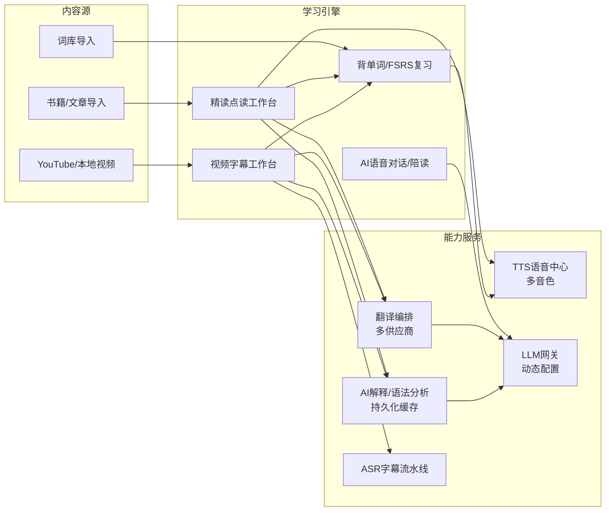

# 产品愿景与范围

> [!info] 文档状态
>
> `v0.1 需求分析阶段草案`。本项目是 `lingua-learning-translator`（macOS 原生客户端）的彻底重构版，需求延续旧版核心并扩展视频学习、AI 陪读等能力。形态与技术栈决策见 [ADR](../../01.项目文档/02.架构/ADR/)。标注"待确认"的条目需 scholar 逐项拍板后升级为 FACT。

## 1. 一句话愿景

一个装在自己电脑上的工作台——学英语、管账号和邮件、用嘴指挥、让它替我操作电脑，能力按扩展加（CR-007 D1，2026-09-02）。

学习这一半仍是"输入内容即学习资产"：单词、书籍、文章、视频、对话都进入同一学习闭环——点读即查、查过即存、存过即可复习，AI 全程陪读陪练。这四条主链路原文保留为「学习」分组；账号与邮件、语音助理、电脑操控、扩展系统是 CR-007 立的模块 18–22。

## 2. 与旧版的关系

| 维度 | 旧版 lingua-learning-translator | 新版 lingua-next |
| --- | --- | --- |
| 形态 | macOS 15 原生客户端（SwiftUI） | Web 优先（ADR-001）；单人无账号的本地工作台（ADR-013）；Electron 壳只贡献系统入口（ADR-014） |
| 核心链路 | 翻译工作台 + 点词学习卡 | 词库 + 书库精读 + 视频学习 + AI 语音对话四大主链路 |
| 开源策略 | 从零自研，GPL 默认禁入 | 个人学习项目，成熟开源实现直接二开/借用，不设许可证门禁 |
| 系统能力 | 划词取词、剪贴板、区域截图、OCR | 首版降级为非目标；CR-007 以「电脑操控 + 语音助理」的形态拉回范围，执行器在 Python 侧、壳只做系统入口 |
| 分发 | Developer ID 签名 DMG | 本机/私有服务器 Docker Compose 部署 |

旧版需求文档仍是重要事实来源，各功能模块的细节规则（缓存、限额、状态机）经平台无关化改写后继承，见 [02.功能需求](../02.功能需求/)。

## 3. 已确认事实 FACT

- 用户与开发者均为 scholar 本人，单用户优先，验证后再考虑多用户。
- 四大主链路全部进入产品范围：词库背单词、书库精读、视频字幕学习、AI 实时语音对话。
- 书库支持内置书籍、导入书籍和文章；精读支持点词翻译、句子翻译、整篇翻译、整篇朗读。
- 朗读支持多供应商、多音色 TTS。
- 翻译接入所有可接入的供应商：必应、Google、有道、DeepL、AI 翻译等，机器翻译与 AI 翻译并存。
- AI 能力包含：单词解释、语法分析、句子精讲；结果必须持久化，再次点击直接读取，支持手动重新分析。
- AI 实时语音对话对标 ChatGPT 语音模式：低延迟响应、随时打断。
- AI 陪读：AI 持有当前文章全文上下文，阅读过程中可随时提问语法、词义。
- 场景化学习进入范围（预设场景的对话与表达练习）。
- 视频学习：本地导入已下载的 YouTube 视频；应用内直接下载 YouTube 视频；ASR 转写生成字幕；字幕与视频同步、点击字幕跳转视频位置、字幕句子可点读。
- LLM 供应商动态配置：运行时增删供应商、模型、密钥，不改代码。
- 技术栈不设语言限制，允许多服务多语言，以性能和业内最佳实践为准。
- 开源项目可直接拿来二开，个人学习项目不做版权门禁。
- 第一阶段只做需求分析、技术选型和文档，不写业务代码。

## 4. 核心决策 DECISION

| 决定 ID | 决定 | 影响 |
| --- | --- | --- |
| DEC-NEXT-001 | 彻底重构，不在旧 Swift 代码上迭代 | 旧仓库只作需求与教训来源 |
| DEC-NEXT-002 | 开源复用优先于自研 | 每个模块先找开源基座，实现方案文档必须给出开源参考 |
| DEC-NEXT-003 | 单用户个人部署优先 | 首版不做注册、订阅、配额计费；账号体系留扩展点 |
| DEC-NEXT-004 | 学习资产统一沉淀 | 词库、查词记录、AI 解释、字幕、复习进度共用一套数据模型 |
| DEC-NEXT-005 | AI 解释类内容一次生成、永久缓存、显式重析 | 所有 AI 输出按(内容指纹+分析类型+模型)寻址持久化 |

## 5. 模块地图

## 6. 非目标（首版）

- 移动端 App、浏览器插件、系统级划词取词。
- 多用户注册、订阅计费、配额售卖；2026-09-02 起连登录也没有（CR-006），`user_id` 列保留为扩展点。
- 自研 OCR、ASR、TTS、翻译模型。
- 发音评分的音素级专业测评（仅做基础跟读对比）。
- 实时同声传译、多人语音房间。
- 公网 SaaS 化运营（部署面向个人本机/私有服务器）。
- 完整邮件客户端、密码管理器替代品、通用桌面 Agent 产品、扩展市场（CR-007 §1.3 划的线）。

## 7. 首批待确认问题

| 编号 | 问题 | 倾向建议 | 状态 |
| --- | --- | --- | --- |
| Q-01 | 部署目标：仅本机 Docker，还是同时准备一台云服务器？ | 本机优先，Compose 一键起 | 待确认 |
| Q-02 | 是否需要手机浏览器可用（响应式）？ | 首版桌面浏览器优先，布局预留响应式 | 待确认 |
| Q-03 | 实时语音对话走 OpenAI Realtime 等云端方案还是本地 pipeline？ | 云端优先保延迟，本地为后备 | 待确认 |
| Q-04 | YouTube 下载是否需要代理配置能力？ | 需要，网关级代理设置 | 待确认 |
| Q-05 | 词库初始数据用哪些（考研/雅思/托福/牛津3000）？ | 全量 ECDICT + 常见考纲词表 | 待确认 |
| Q-06 | 旧版 macOS 项目是否继续维护？ | 冻结，只读参考 | 待确认 |
