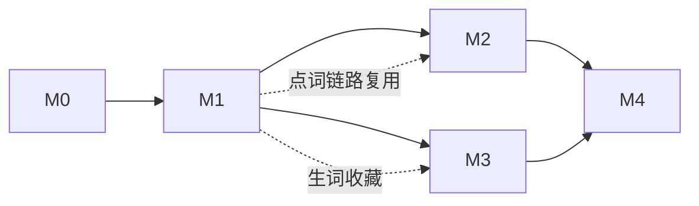

# MVP 与路线图

> [!tip] 划分原则
>
> 每个里程碑交付一条**完整可用的垂直切片**，而不是横向铺功能。M1 优先书库精读——它串起翻译编排、AI 解释持久化、TTS、词典四大能力服务，是复用面最大的地基。

## M0 需求与骨架（当前阶段）

- ✅ 治理基线、需求文档、ADR-001~006、技术栈清单、开源复用清单
- ⬜ scholar 确认待确认问题清单（Q-01~Q-06）与 proposed ADR
- ⬜ monorepo 骨架：Compose 起 api/worker/postgres/redis/litellm，前端脚手架，CI

## M1 书库精读垂直切片（地基里程碑）

**目标**：导入一本 epub，全程在浏览器完成"读—点—查—存"。

- 书籍导入：epub 上传 → worker 解析分章分句入库；内置 2-3 本公版书
- foliate-js 阅读器：翻页、进度、章节导航
- 点词：ECDICT 即时词典卡（音标/词频/考纲标签）+ AI 语境释义流式补充 + 持久化命中
- 句子：点句翻译（多供应商可选）、AI 语法分析、句子精讲，全部持久化 + 重析
- 整篇翻译（worker 异步 + 段落对齐展示）、整篇朗读（TTS 多音色，句级高亮跟随）
- 翻译编排：translators 免费档 + DeepL 官方 + LLM 翻译档，引擎可选可降级
- 生词收藏：点词一键入生词本（为 M3 铺垫）
- LiteLLM 网关接通，模型语义别名跑通两家供应商

**退出条件**：二次点词 P95 < 100ms；首次 AI 释义首字 < 2s；一本 300 页 epub 解析入库 < 60s。

## M2 语音对话 + 视频学习

**语音**：
- OpenAI Realtime WebRTC 直连：自由对话、预设场景对话（场景库首批 10 个）
- 打断与首响实测达标（P50 < 1s）；会后转写落库、生词/纠错沉淀
- AI 陪读：阅读器内唤起，注入全文上下文 + 当前位置，随问随答

**视频**：
- YouTube URL 下载（yt-dlp + 代理配置）与本地视频导入
- faster-whisper 转写句级字幕；官方字幕优先抓取
- 播放器：双语字幕、字幕点击跳转、逐句暂停、字幕点词（复用 M1 点词链路）

**退出条件**：一条 10 分钟 YouTube 视频从 URL 到可点读 < 8 分钟；语音对话连续 10 轮无中断故障。

## M3 词库与复习闭环

- ECDICT + 考纲词表导入（四六级/考研/雅思/托福，qwerty-learner 词库格式）
- 背单词模式：认识/模糊/不认识 + 拼写练习（qwerty-learner 交互二开）
- FSRS 调度（py-fsrs）：每日复习队列、学习统计
- 生词本联动：书库/字幕点词收藏自动进复习队列，卡片带原文语境
- 发音跟读：单词/句子 TTS 播放 + 录音回放对比

**退出条件**：从"书里点词收藏"到"次日复习队列出现该词（带原句）"全链路自动。

## M4 打磨与扩展（按需拉取）

- 文章导入（URL 抓取正文、Markdown/txt 粘贴）
- 场景学习扩展：场景库编辑器、角色扮演脚本
- pipecat 自建语音管线（若 ADR-005 触发条件出现）
- 词级字幕高亮（whisperX 强制对齐）
- 学习报告、数据导出（Anki apkg 导出）
- 桌面壳（Tauri）/ 移动端响应式（若 Q-02 确认）

## 里程碑依赖

