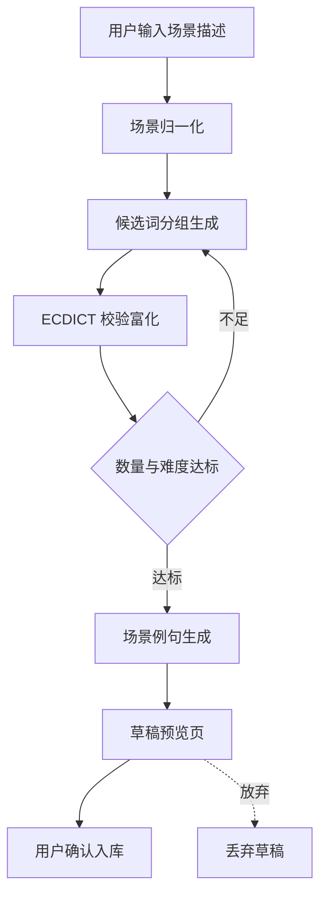
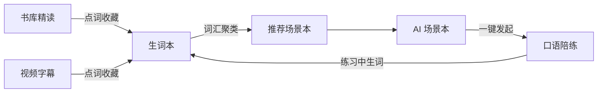

# 词库 v2 - 单词本与 AI 场景本

本文承接 [[需求说明]]（FR-01 ~ FR-10），描述词库模块的第二版形态。原文档的词典数据、FSRS 调度、导入流程规则继续有效，本文只写新增与变更部分，编号从 FR-149 起接全局序列。

> [!info] 与 v1 的关系
>
> v1 把词表做成侧边栏的一串文字行，四类词表（生词本 / 考纲 / 导入 / 无）各有各的取数路径和展示形态。v2 的核心动作是**把它们收敛成同一个「单词本」概念**，再在这个统一模型上加封面、加详情页、加 AI 场景本。
>
> 数据层保持向后兼容：`vocab_entry` 仍是唯一的学习进度载体，一词一卡，跨本共享。

## 1. 问题定义

v1 词库页存在四个具体问题，v2 逐一对应解决。

| 现状问题 | 表现 | v2 对应方案 |
| --- | --- | --- |
| 词表没有视觉身份 | 侧边栏 8 行等宽文字，靠文案区分「四级」和「六级」 | 封面卡片网格（§3） |
| 词表内容不可探索 | 点进去是分页列表，只能看词形和 80 字截断释义 | 单词本详情页 + 词条弹卡（§4、§5） |
| 词表来源单一 | 只有 ECDICT 考纲标签和手工 CSV 导入 | AI 场景本生成（§6） |
| 词表与其他模块割裂 | 词库、场景学习、口语练习三套数据互不相通 | 场景本与陪练场景 key 对齐（§8） |

## 2. 统一单词本模型

### 2.1 四类单词本

v2 把所有词的集合统一叫「单词本」（deck），用 `kind` 区分来源，界面形态完全一致。

| kind | 名称 | 数据来源 | 可删 | 可编辑词条 |
| --- | --- | --- | --- | --- |
| `system` | 生词本、收藏本 | `vocab_entry` 全集按 source 切分 | 否 | 仅移除 |
| `exam` | 中考 / 高考 / 四六级 / 考研 / 托福 / 雅思 / GRE | ECDICT `tag` 虚拟词表 | 否 | 否 |
| `scenario` | AI 场景本（点餐、问路、编程……） | LLM 生成 + ECDICT 校验后落库 | 是 | 是 |
| `custom` | 用户导入 | CSV / TSV / JSON 导入 | 是 | 是 |

- FR-149 单词本列表接口统一返回四类，前端不再按类型分支取数；`exam` 类的虚拟词表在服务端伪装成同构对象。
- FR-150 单词本支持置顶、归档、重命名、改封面；归档本从主书架移入「归档」折叠区，不参与今日复习聚合。

### 2.2 封面方案

> [!tip] 封面不走网络
>
> 封面由「确定性渐变 + emoji」在前端 CSS 计算得到，与视频卡的 `coverGradient(id)` 同一范式。理由是离线可用、零请求、无版权风险，且新建单词本瞬间就有视觉身份，不需要等图片加载。
>
> 自定义上传封面留作后续可选项，不进本期范围。

> [!info] 已被模块 16 扩展：渐变 + emoji 降为回退，不再是唯一封面来源
>
> [模块 16 生图与视觉资产](../16.生图与视觉资产/需求说明.md)给场景本管线加了 `cover` 节点，`wordlist.cover_key` 有值时卡片铺生成封面。
>
> 本节规则**没有作废**：渐变 + emoji 仍是加载前占位、生图失败、没绑生图能力、以及全部旧数据的兜底，零网络请求这条性质对它们依然成立。变的只是"唯一"这个词。

- FR-151 每个单词本持有 `emoji` 与 `color_seed` 两个字段：AI 场景本由生成时产出，考纲本内置固定值，导入本按名称哈希取默认值，用户可随时改。
- FR-152 封面卡上叠加四色掌握度环（新 / 学习中 / 复习中 / 已掌握），数据来自该本词条的 FSRS 状态分布。

### 2.3 进度共享规则

- BR-28 学习进度属于「词」不属于「本」。在《餐厅点餐》里学会的 `menu`，在《咖啡馆》本里同样显示已掌握，`vocab_entry` 全局唯一约束不变（延续 BR-02）。
- BR-29 单词本删除只删归属关系，不删 `vocab_entry` 与 `review_log`，学习历史永不因整理词表而丢失。

## 3. 书架页

### 3.1 布局

书架页取代现在的「侧边栏 + 复习面板」双栏结构，改为单列纵向滚动。

| 区块 | 内容 | 说明 |
| --- | --- | --- |
| 今日任务条 | 待复习数、今日新学数、连续天数、开始复习按钮 | 跨本聚合，位置固定在顶部 |
| 置顶区 | 用户置顶的本 | 无置顶时不渲染该区 |
| 我的 | 生词本、收藏本 | 系统本，恒在 |
| 场景本 | AI 生成的场景本 | 空时显示引导卡「生成第一个场景本」 |
| 考纲 | 8 个内置考纲本 | 折叠态默认展开 |
| 导入 | CSV 导入本 | 空时不渲染 |
| 归档 | 已归档的本 | 默认折叠 |

- FR-153 书架顶部提供搜索框，输入词形时跨本搜索并显示「该词出现在哪些本」；输入本名时过滤单词本。
- FR-154 新建入口三选一：AI 生成场景本 / 导入词表文件 / 建空白本手动加词。

### 3.2 卡片信息

- FR-155 卡片正面：封面（渐变 + emoji）、本名、词数、掌握度环、最近学习时间。
- FR-156 卡片悬停浮出快捷操作：开始学习、置顶、编辑、导出 Anki、归档、删除；删除与归档需二次确认。

> [!warning] 导出复用既有依赖
>
> 服务端已装 `genanki`，导出 Anki 牌组不需要新依赖，直接复用 `export.py` 的既有出包路径，避免为了一个按钮再引入一套打包逻辑。

## 4. 单词本详情页

### 4.1 结构

- FR-157 页头：封面横幅 + 本名 + 描述 + 统计条（总词数 / 未学 / 学习中 / 已掌握）+ 学习入口。
- FR-158 词条区支持网格卡片与紧凑列表两种视图，用户选择持久化到 `playerPrefs` 同款本地存储。
- FR-159 场景本按 `group` 分节展示（核心名词 / 常用动作 / 描述词 / 高频短语 / 句型），其余类型不分组。
- FR-160 筛选与排序：筛选按状态（全部 / 未学 / 学习中 / 已掌握 / 困难词），排序按默认序 / 字母 / 词频 / 难度 / 最近学习；本内搜索即时过滤。
- FR-161 多选批量操作：加入生词本、标记已掌握、移出本、导出选中项。

### 4.2 长列表性能

- FR-162 词条列表接入 `@tanstack/react-virtual` 虚拟滚动，替换现在的「加载更多」分页按钮，满足 v1 遗留的 AC-01（万级词表滚动流畅）。

> [!note] 为什么现在才装虚拟滚动
>
> v1 需求文档已写明虚拟滚动要求，但实现时因为依赖未安装退化成了 `useInfiniteQuery` + 加载更多。GRE 本 7,504 词、考研本 4,801 词在当前实现下需要点 150 次「加载更多」才能翻到底。v2 一并补上。

## 5. 词条学习卡

- FR-163 详情页点击任一词条弹出词卡浮层，复用阅读器的 `WordCard` 组件，保证「查词体验全站一致」。
- FR-164 词卡在单词本语境下的取值规则：场景本用该词的场景例句作语境，其余类型用最近一次收藏语境，都没有时传本名作弱语境。
- FR-165 浮层支持上一个 / 下一个翻页与键盘方向键导航，翻页时预取相邻词典数据。（2026-09-05：键位 ← ↑ 上一个、→ ↓ 下一个；听读开着时翻卡直接换卡不把播放带跑；焦点在输入框里不接）
- FR-166 词卡内提供「加入生词本」「标记已掌握」「朗读」三个动作，状态变更即时回写列表，不需要整页刷新。

## 6. AI 场景本

这是 v2 的核心新增能力，也是需求里最需要防幻觉的部分。

### 6.1 生成流水线

> [!info] 流水线设计依据
>
> 纯 LLM 生成会产出词典里不存在的词，纯向量检索又只能找近义词（`restaurant` 检索出 `cafe / bistro`，找不到 `menu / waiter / bill` 这类场景共现词）。学术界的稳妥做法是二者都不单用：**LLM 生成候选 → 用难度词表过滤 → 数量不足则再生成一轮**。本项目的 ECDICT（含词频 `frq`、考纲 `tag`、柯林斯星级）正好充当那份难度词表。



流程从用户的一句自然语言描述开始，先由 LLM 做场景归一化，产出规范化的中英文场景名、emoji、所属分类、建议 CEFR 等级和检索关键词，这一步把「我想学会在星巴克点咖啡」这类口语化输入变成结构化的场景定义。第二步按分组生成候选词，LLM 需要分别产出核心名词、常用动作、描述词、高频短语和句型五组内容，而不是吐一个扁平词表，因为分组本身就是场景本区别于考纲词表的价值所在。第三步拿每个候选词去本地 ECDICT 查询，命中的补齐音标、释义、词频、考纲标签与柯林斯星级，未命中的先做词形还原再查一次，仍不命中则标记为词典外词条。第四步做数量与难度判定，按目标 CEFR 等级用词频分档剔除离群词，若剩余词数低于阈值就带着已有结果回到第二步再生成一轮，最多重试两轮避免无限循环。第五步为每个词生成一句场景内例句，这一步可关闭以省 token。最后进入草稿预览，用户确认后才落库。

- FR-167 场景归一化产出：`title_zh`、`title_en`、`emoji`、`category`、`cefr`、`keywords`。
- FR-168 候选词按五组产出，每组词数上下限可配置，默认合计 60 至 90 词。
- FR-169 ECDICT 校验对每个词返回命中状态；词形还原复用 v1 的 `exchange` 字段裁决逻辑（FR-03）。
- FR-170 数量不足时自动重试，重试请求携带已有词表要求 LLM 只补新词，最多两轮；两轮后仍不足按实际数量入库并提示。
  - 落地阈值：目标 70 词、下限 55 词、最多 3 轮。下限定在 55 是实测结论——设 45 时模型一轮给 49 词就收工，刚好卡在 AC-08 要求的 50 词红线下，补齐轮形同虚设。
- FR-171 场景例句每词一句，含英文原句与中文译文，标注为 AI 生成。

### 6.2 防幻觉约束

- BR-30 不在 ECDICT 中的候选**单词**默认剔除；用户可在草稿页手动保留，保留后该词条永久携带「词典外」标记。
- BR-30a 短语（`phrase`）与句型（`pattern`）不参与词典校验，也不打「词典外」标记——它们本来就不是词典条目，`dict_miss` 的语义是「本该在词典却查不到」，对短语打这个标只会变成满屏假警报。
- BR-31 场景本整体标注来源为 AI，词条的 AI 释义与词典释义分栏展示、来源可辨（延续 BR-01、BR-05）。
- BR-32 草稿未经用户确认不进入正式单词本列表，不参与复习队列（延续场景学习 AC-03 的口径）。

### 6.3 生成过程可视化

- FR-172 生成任务走 arq 异步执行，前端轮询进度，逐阶段展示：归一化 → 候选生成（已产出 N 词）→ 词典校验（命中 M/N）→ 补齐第 K 轮 → 例句生成 → 完成。
- FR-173 生成失败时保留已完成阶段的产物，允许从失败阶段重试，不从头重跑。

> [!warning] 进度不许撒谎
>
> 沿用管线中心 `RunningProgress` 的三条规则：没拿到真实数据不显示百分比、预计时间只在有历史样本时给出、阶段名与后端阶段一一对应。宁可显示「生成中」也不显示编造的进度条。

### 6.4 预置场景库

- FR-174 仓库内维护种子场景清单（YAML，沿用 `domain/scenarios.py` 的加载范式），覆盖八大类约 50 个高频场景。
- FR-175 书架页提供「一键生成推荐场景本」，批量跑种子场景，进度可见，可中途停止；已存在的场景跳过不重复生成。

八大类种子场景划分如下。

| 分类 | 场景示例 |
| --- | --- |
| 日常生活 | 餐厅点餐、超市购物、天气、家居用品、时间与日期、数字与度量 |
| 出行旅游 | 问路、机场值机、酒店入住、租车、景点游览、海关入境 |
| 社交人际 | 问候寒暄、自我介绍、邀约、道歉与感谢、闲聊话题、告别 |
| 职场商务 | 面试、会议、商务邮件、谈判、项目汇报、办公用品与职级 |
| 学术教育 | 课堂用语、论文写作、实验、考试、学科名称 |
| 健康医疗 | 就医问诊、症状描述、药品、身体部位、健身运动 |
| 科技编程 | 编程通用、前端、后端、数据库、机器学习、运维与网络安全 |
| 兴趣娱乐 | 电影、音乐、体育、游戏、摄影、烹饪 |

### 6.5 草稿编辑

- FR-176 草稿页支持：删词、改释义、改分组、换 emoji、改本名与描述、调整 CEFR 后重新生成。
- FR-177 草稿保留 24 小时，超时自动清理；同一场景重复生成时提示已有同名本，可选择合并或另建。

## 7. 学习与复习

### 7.1 学习模式

v1 只有「看词识义」与「拼写练习」两种，v2 在单词本详情页统一入口下扩展为四种，全部共用同一份 FSRS 调度。

| 模式 | 交互 | 适用 |
| --- | --- | --- |
| 认词 | 出词 → 回忆 → 显示答案 → 四档评分 | 默认模式，v1 已有 |
| 拼写 | 出释义与发音 → 键入拼写 | v1 已有 |
| 听写 | 只播发音 → 键入拼写 | 新增，考听力辨词 |
| 场景速记 | 按 group 成组过词，先整组浏览再逐词自测 | 新增，场景本专用 |

- FR-178 学习模式选择记忆到单词本维度，下次进同一本沿用上次模式。
- FR-179 每个单词本可设每日新词上限（默认 10，范围 1 至 50），领取新词时按此上限截断，防止一次领太多把复习队列冲垮。

### 7.2 复习队列

- FR-180 今日复习默认跨本聚合；详情页提供「只复习本本」入口，队列按 `wordlist_item` 归属过滤。
- FR-181 复习卡显示该词所属的全部单词本徽标，点击徽标可跳到对应本。
- BR-33 按本复习不改变 FSRS 到期判定，只是过滤展示范围；跳过的到期词次日仍在全局队列里。

## 8. 与其他模块的闭环

> [!info] 这部分是需求扩展的重点
>
> 单独做一个漂亮的词库价值有限，价值在于它和已有的阅读、视频、口语三条线接上。以下四条打通规则不在原始需求里，是按现有模块能力补的。



图中四条实线是数据流向，虚线部分为推荐关系。书库精读和视频字幕两处的点词收藏共用同一个收藏接口，落到唯一的生词本，这一条 v1 已实现。场景本到口语陪练是本期新增的打通点，场景本的 key 与模块 07 陪练场景的 key 对齐后，用户在场景本里学完词可以直接进同场景的口语练习，词表内容作为关键句注入会话 prompt。口语练习过程中遇到的生词回流生词本，带上练习会话作为语境出处。最后一条是推荐链路，系统统计用户近期阅读和观看内容里的高频场景词汇，反向推荐尚未生成的场景本。

- FR-182 场景本详情页提供「用这个场景练口语」，跳转模块 07 并注入场景定义与本内高频词。
- FR-183 口语练习中收藏的词写入 `vocab_occurrence`，`source_kind` 记为 talk，语境存该轮对话原句。
- FR-184 书库 / 视频内容与场景本词汇重合度达阈值时，在阅读页与视频页推荐对应场景本，推荐理由需可解释（显示命中了哪些词），延续 BR-04。
- FR-185 收藏某词时若该词已属于某场景本，词卡上显示该本徽标，避免用户重复建本。

## 9. 数据模型变更

现有 `wordlist` 与 `wordlist_item` 两张表扩展字段即可承载场景本，不新建平行表。

```python {3,6,9,14,19}
class Wordlist(Base):
    __tablename__ = "wordlist"
    # kind 扩展：custom 之外新增 scenario，system 与 exam 仍为虚拟本不落库
    kind: Mapped[str] = mapped_column(String(16), default="custom")
    # 封面：emoji 直接渲染，color_seed 参与前端渐变哈希，两者都无网络依赖
    emoji: Mapped[str | None] = mapped_column(String(16))
    color_seed: Mapped[int] = mapped_column(Integer, default=0)
    description: Mapped[str | None] = mapped_column(Text)
    # 场景本元信息：category 归类到八大类，cefr 供难度过滤复用
    category: Mapped[str | None] = mapped_column(String(32))
    cefr: Mapped[str | None] = mapped_column(String(4))
    # source 标识内容来源，AI 生成的本必须可辨（BR-31）
    source: Mapped[str] = mapped_column(String(16), default="import")
    # draft 状态的本不出现在正式列表、不进复习队列（BR-32）
    status: Mapped[str] = mapped_column(String(16), default="ready")
    pinned_at: Mapped[datetime | None] = mapped_column(DateTime(timezone=True))
    archived_at: Mapped[datetime | None] = mapped_column(DateTime(timezone=True))
    # 每日新词上限，对应 FR-179
    daily_new_limit: Mapped[int] = mapped_column(Integer, default=10)


class WordlistItem(Base):
    __tablename__ = "wordlist_item"
    # 场景本分组：core_noun / action / descriptor / phrase / pattern
    group: Mapped[str | None] = mapped_column(String(24))
    example_en: Mapped[str | None] = mapped_column(Text)
    example_zh: Mapped[str | None] = mapped_column(Text)
    # 词典外词条标记，对应 BR-30
    dict_miss: Mapped[bool] = mapped_column(Boolean, default=False)
```

高亮的几行是本期新增字段的关键部分。`kind` 从只有 `custom` 扩展出 `scenario`，让场景本和导入本共用同一张表和同一套增删改查路径。`emoji` 与 `color_seed` 是封面的全部数据，前端拿到后本地计算渐变色，不产生任何图片请求。`source` 区分内容是 AI 生成还是用户导入，是 BR-31 来源标识规则的落点。`status` 为 `draft` 的本处于草稿态，列表接口默认过滤掉，只有草稿预览页按 id 直取。`group` 让场景本能分节展示，考纲本和导入本该字段为空即不分组。

- FR-186 新增 Alembic 迁移添加上述字段，已有 `custom` 词表的新字段取默认值，不需要数据回填。
- FR-187 生词本与收藏本、考纲本仍为虚拟本，不写入 `wordlist` 表；列表接口在服务端合成同构对象返回。

## 10. 业务规则汇总

| 编号 | 规则 |
| --- | --- |
| BR-28 | 学习进度属于词不属于本，跨本共享 |
| BR-29 | 删本只删归属关系，不删学习历史 |
| BR-30 | 词典未命中的候选词默认剔除，手动保留者永久带标记 |
| BR-31 | AI 生成内容与词典事实分栏展示、来源可辨 |
| BR-32 | 草稿本不进正式列表、不进复习队列 |
| BR-33 | 按本复习只过滤展示，不改变 FSRS 到期判定 |
| BR-34 | 场景本生成全程不落库中间态，失败不产生半成品本 |

## 11. 实现方案

| 部件 | 方案 | 依据 |
| --- | --- | --- |
| 调度算法 | 沿用 py-fsrs，一行不改 | v1 已跑通 |
| 难度词表 | ECDICT 的 `frq` 词频 + `tag` 考纲标签 + `collins` 星级 | 340 万词条已在库，充当学术方案里的 lexical difficulty lexicon |
| 候选生成 | LLM JSON mode，复用 `llm.complete_json` | 与 `generate_scenario_draft` 同范式 |
| 草稿校验 | 复用 `scenarios.py` 的 validate + normalize 双段式 | 项目内已验证的反幻觉写法 |
| 异步执行 | arq 任务 + 前端轮询 | 与视频管线同一套 |
| 虚拟滚动 | `@tanstack/react-virtual` | 新增前端依赖 |
| 弹层与浮层 | Radix UI Dialog / Popover | 项目已装 `radix-ui` |
| Anki 导出 | genanki | 后端已装 |
| 封面 | CSS 渐变哈希 + emoji | 复用 `coverGradient` 范式 |

> [!note] 明确不采用的方案
>
> **pgvector 向量检索**：当前 PostgreSQL 镜像未提供该扩展，且词向量的语义相似度找的是近义词而非场景共现词，对本需求是负收益。场景相关性由 LLM 判断，词汇难度由 ECDICT 词频判断，两者都不需要向量。
>
> **现成开源主题词表**（imsky/wordlists、eranimo/wordlists 等）：这类数据集面向密码生成与文字游戏，分类维度是「动物 / 颜色 / 形状」，不是「点餐 / 问路 / 面试」这种语言学习场景，且无中文释义与难度分级，直接用需要大量清洗，收益低于 LLM 生成。
>
> **自建词形还原**：继续用 v1 的 ECDICT `exchange` 字段裁决，不引入 spaCy 运行时。

## 12. 验收要点

| 编号 | 验收场景 |
| --- | --- |
| AC-05 | 书架页显示全部四类单词本，卡片有封面与掌握度环，首屏渲染无图片请求 |
| AC-06 | GRE 本（7,504 词）滚动到底部全程流畅，无「加载更多」按钮 |
| AC-07 | 详情页点任一词弹出词卡，键盘左右键可翻词，词卡内容与阅读器点词一致 |
| AC-08 | 输入「我想学会在星巴克点咖啡」，生成的场景本词数不少于 50，词典命中率不低于 90%，分组齐全 |
| AC-09 | 生成过程逐阶段显示真实进度，中途失败可从失败阶段重试而非重跑 |
| AC-10 | 草稿未确认时不出现在书架，不进复习队列；放弃草稿后库内无残留 |
| AC-11 | 在场景本 A 学会的词，在包含同一词的场景本 B 中显示为已掌握 |
| AC-12 | 删除自定义场景本后，该本内词的复习记录与到期时间不变 |
| AC-13 | 场景本一键发起口语练习，AI 使用该本词汇组织对话 |

## 13. 分期计划

| 阶段 | 范围 | 关键交付 | 状态 |
| --- | --- | --- | --- |
| P1 | §2 统一模型、§3 书架页、§9 数据模型 | 四类本同构展示，封面卡片落地 | ✅ 已交付 |
| P2 | §4 详情页、§5 词条弹卡、FR-162 虚拟滚动 | 点词学习闭环，长列表性能达标 | ✅ 已交付（FR-161 多选批量操作未做） |
| P3 | §6 AI 场景本全流程 | 自定义生成 + 种子场景批量生成 | ✅ 已交付 |
| P4 | §7 学习模式扩展、§8 模块打通 | 听写与场景速记，口语练习闭环 | 部分交付：FR-182 场景本转陪练已通；FR-178~181 学习模式扩展、FR-183~185 反向推荐待做 |

> [!tip] 分期原则
>
> P1 与 P2 不依赖 LLM，纯前端与数据层改造，做完就能用；P3 才引入生成能力。这样即使 AI 生成部分的调优反复，前面两期的体验改善已经落袋。

## 词库 v2 需求小结

v2 的动作可以概括成三件事：把四类割裂的词表收敛成同一个单词本模型并给它视觉身份，把只能看的列表变成能点开学的卡片，把词表来源从「考纲 + 手工导入」扩展到「AI 按场景生成」。

生成能力的可信度由三层保证：LLM 只负责判断场景相关性，本地 340 万词条的 ECDICT 负责判断词是否真实存在与难度是否匹配，用户在草稿页做最终确认。任何一层都不单独决定入库内容。

进度共享是贯穿全文的隐藏约束。所有单词本共用同一份 `vocab_entry`，用户在任何一个本里的学习成果对其他本立即可见，这条规则决定了数据模型只能扩展 `wordlist` 而不能给场景本另建一套存储。

## 14. P4 补充规格（FR-219 ~ FR-232）

§7.1 只写了「听写」「场景速记」两个模式名，实施前补齐交互规格。规格来源是 Anki、Quizlet、Duolingo、qwerty-learner、Memrise、墨墨背单词的横向对照。

### 14.1 词卡自动朗读

- FR-219 单词本详情页点词弹卡时自动朗读该词，方向键翻词时同样朗读。受顶栏「自动发音」开关控制，与背单词新卡共用同一偏好。
- FR-220 连续翻页时后一段音频打断前一段，不排队不叠加（底层 `playUrl` 已先 `stopTts`）。阅读器与视频页的点词弹卡不改变现有行为——精读时自动出声是打扰。

### 14.2 听写模式

- FR-221 题面只播音频，不显示词形与释义；进题自动播 1 次（延迟 150ms 避开入场动画与上一题音频重叠）。
- FR-222 重播不限次：`Tab` 重播、`Shift+Tab` 慢速播（`playbackRate = 0.7`）。记录 `replay_count`，重播 ≥3 次时该题 FSRS 评分封顶为 Good（不给 Easy）。
- FR-223 阶梯提示，逐级解锁不可跳级，每级降低得分系数：

  | 级别 | 内容 | 系数 |
  | --- | --- | --- |
  | L1 | 慢速重播 + 音节数 | 1.0 |
  | L2 | 长度骨架 `_ _ _ _ (4)` | 0.8 |
  | L3 | 首字母 + 音标 | 0.6 |
  | L4 | 中文释义 | 0.4 |
  | L5 | 元音遮罩 `n_gl_g_bl` | 0.3 |
  | L6 | 显示答案 | 0，判错并强制重打 |

- FR-224 判定三档（`strict` / `normal` 默认 / `loose`）。`normal` 忽略大小写与变音符、连字符与空格互通、英美拼写互通（`colour`=`color`），并按词长分段容忍 Damerau-Levenshtein 距离：≤4 字 0、5–7 字 1、8–11 字 1、≥12 字 2。
- FR-225 命中容忍阈值判为 `almost`（黄色）：不计错误率，但必须重打一遍正确拼写才能进入下一题，FSRS 按 Hard 记，提示具体差异（「差一个字母：negli**g**ible」）。
- FR-226 输入框强制 `autocomplete/autocorrect/autocapitalize=off`、`spellcheck=false`——移动端系统联想会直接把答案送出来。
- FR-227 错误反馈：字符级三色 diff（绿正确 / 红多打错打 / 灰删除线漏打，对齐 Anki 的 `typeGood`/`typeBad`/`typeMissed`），错误后强制重打一次。
- FR-228 同音异形词（`their/there/they're`）不进听写题池，除非该词条带释义或例句挖空作为消歧上下文——纯听音无法判别。
- FR-229 「现在不方便听」入口：本轮听写题降级为「释义 → 拼写」，并在 60 分钟内不再自动排听写题。

### 14.3 场景速记

- FR-230 阶段机 `Preview → Drill → Recap → Gate`，默认每组 7 词（可选 5/7/10/15/20）。
  - Preview：整组建立印象，每张卡最短停留 1.5 秒才允许下一张（防无脑划），自动发音，可在此直接把已认识的词标已掌握移出本组。
  - Drill：组内轮转自测，同一词至少出现 3 次且覆盖 ≥2 种题型，难度递进「中→英选择 → 英→中选择 → 拼写/听写」，同一词两次出现间隔 ≥2 个其他词。
  - Recap：只测本组错词，最多 3 轮。
  - Gate：组内每词满足「连续答对 ≥2 次且最后一次是产出类题型」或「被标记已掌握」，且组内首次正确率 ≥80% 才过关。
- FR-231 分组硬约束：同一组内不得出现同音词或编辑距离 ≤2 的词对（`affect/effect`、`adapt/adopt`），冲突时后一个词推到下一组。
- FR-232 3 轮 Recap 仍未过的词标记为难词并移出本组，本组按已过关词计入进度，**不阻塞用户前进**。

> [!warning] 成组学习最大的坑是干扰效应
>
> 把近义词、近形词放进同一组看似「集中记忆」，实际会互相干扰，记混的概率高于分开学。FR-231 的硬约束不是锦上添花，是这个模式能不能用的前提。
>
> 同理，FR-232 的「不阻塞」也不是妥协：卡在一组过不去是这类产品弃用率最高的设计。

### 14.4 反向推荐

- FR-233 统计用户近期阅读与观看内容中的高频词汇，与场景本词表求交集，命中率超阈值时在阅读页与视频页推荐对应场景本。
- FR-234 推荐必须可解释：显示命中了哪些词、来自哪篇内容，不做黑盒推荐（延续 BR-04）。

### 14.5 分期修订

§13 的 P4 拆细为两批：

| 批次 | 范围 | 状态 |
| --- | --- | --- |
| P4a | FR-182 场景本转陪练、FR-161 多选批量、FR-219~220 自动朗读、FR-179~181 每日上限与按本复习 | ✅ 已交付 |
| P4b | FR-221~229 听写模式、FR-230~232 场景速记、FR-233~234 反向推荐 | ✅ 已交付 |

> [!note] 反向推荐的落地修正
>
> 首版按「命中词数」排序，结果烹饪视频被推荐《咖啡拉花器具》，命中的全是 `add / fresh / hot / light` 这类通用词——推荐退化成了「谁的通用词多谁被推荐」。
>
> 修正是给命中词加区分度门槛：只有词频位次 > 4000 的**特征词**才算证据（ECDICT 的 `frq` 就是现成的 IDF），阈值相应从 5 降到 3。3 个特征词重合（`queue / suitcase / scan`）比 16 个通用词重合有说服力得多。修正后旅行视频正确推荐机场场景本，其余视频不再强推。

## 15. 场景本 v2：词条交互与场景短文（FR-255 ~ FR-274）

真实使用暴露的问题：词条卡片上的例句是"死"的（只有英文、不能点、不能读），而场景本学完一堆孤立的词之后没有把它们串起来用的地方。

### 15.1 词条卡片交互

- FR-255 例句显示中英对照。译文在生成时就已产出并入库，之前只是前端漏渲染了。
- FR-256 例句区整块是朗读热区，带播放图标，点击即读整句。与词卡的「整行朗读」同范式（FR-128）。
- FR-257 例句内每个单词可点，弹出该词的词卡；悬浮时光标为手型，明示可点。
- FR-258 移除场景本详情页的「练口语」按钮——口语练习改由场景短文承载（§15.3），孤立的词表本来就不适合当口语剧本。

### 15.2 场景短文

一个场景本生成的是一堆词，但**词只有在句子里、句子只有在情境里才真正被记住**。短文把本内所有词织进一段真实语境。

- FR-259 生成场景本时同时产出一篇场景短文，形态由 AI 按场景判断：
  - 有明确角色互动的场景（点餐、问路、面试、就医）→ **对话**
  - 描述性场景（健身器械、学科名称、身体部位）→ **叙述短文**
- FR-260 短文尽可能用上本内所有词；生成后计算覆盖率，未覆盖的词单独列出。
- FR-261 「补写一段」：把未覆盖的词交给 AI 追加一段，直到覆盖率达标或用户停止。
- FR-262 短文难度对齐本的 CEFR，长度按本内词数推算（约每 10 个词 40-60 字）。

### 15.3 短文的学习方式（复用书架）

> [!tip] 存进 article 表而不是新建表
>
> 场景短文的学习需求与书库文章完全一致：逐句点读、点词查义、双语对照、朗读、批注、进度。
> 存进 `article` 表（`source_kind='scenario'` + `deck_id` 关联）可以**零成本复用整套阅读器**，
> 不必再写一个"简化版阅读器"——那才是真正的重复造轮子。
>
> 代价是书架会混入场景短文，用 `source_kind` 过滤掉即可。

- FR-263 短文写入 `article` + `paragraph` + `sentence` 三层，与书库文章同构，阅读器可直接打开。
- FR-264 书架列表过滤掉 `source_kind='scenario'` 的文章；入口只在场景本详情页与短文标签页。
- FR-265 短文中属于本内的词加下划线标记，点击弹词卡并标注「本内第 N 个词」，让"学过的词出现了"这件事可见。
- FR-266 对话形态支持角色分轨朗读：不同角色绑不同 TTS 音色（复用模块 06 的音色目录）。
- FR-267 对话形态可一键作为剧本进入口语练习（模块 07），场景定义与对话内容一并注入会话 prompt。
- FR-268 短文阅读进度与场景本进度联动：读完标记后在本卡片上可见。

### 15.4 生成流水线扩展

- FR-269 场景本管线新增 `passage` 节点，依赖 `examples`，产物是短文结构（标题 / 形态 / 段落 / 角色 / 覆盖率）。
- FR-270 `passage` 可单独重跑：短文不满意时不必重新生成词表。
- FR-271 短文生成失败不阻断整条管线——词表本身已可用，短文是增强项。

### 15.5 挖掘补充

- FR-272 短文页顶部显示覆盖率进度条与未覆盖词清单，点未覆盖词可直接「补写一段」。
- FR-273 短文中的句子可一键加入听写题池（§14.2 的听写模式直接复用）。
- FR-274 场景本详情页增加「短文」标签页，与词条列表并列，不必跳到阅读器才能看。

### 15.6 短文交互补充（真实使用反馈）

- FR-275 角色音色可逐个配置：点角色标签打开音色选择器（目录来自配置中心已启用的 TTS 供应商，可试听），选定后存在**本**上而不是产物里——重跑短文不该把挑好的嗓音冲掉。未配置的角色按出场顺序分配兜底音色，至少保证听起来不是同一个人。
- FR-276 「按剧本练口语」改为 **AI 陪读**：与阅读器、视频页同一套陪读面板，就着这篇短文实时问答，不必跳到独立的口语会话页。短文本来就存在 `article` 表里，陪读面板直接吃 `Article`，零改造复用。
- FR-277 朗读热区扩大到整段：点段落任意位置即读，喇叭图标降为纯视觉提示。点具体单词仍然弹词卡（事件自行截停），拖选复制时不触发朗读。

> [!note] 又一次白嫖了「存进 article 表」这个决策
>
> 短文存进 `article` 的初衷是复用阅读器。这次做 AI 陪读时发现 `CompanionPanel` 的入参正好就是 `Article`——一行改造都不用做。
>
> 一个存储决策同时白嫖了阅读器与陪读两套能力，这是把新内容对齐既有模型而不是另起炉灶的直接收益。

### 15.7 朗读控制与产物可读性（真实使用反馈）

- FR-278 离开短文页立即停声。之前切走后音频还在后台念，得回来才能停。
- FR-279 音色选择器按供应商分组、男女分列、中文标注、可搜索、逐个试听——与「设置 · 语音服务」的音色目录同一份数据。之前只显示技术 id（`en_female_skye_uranus_bigtts`），根本没法挑。
- FR-280 节点产物按短文的样子渲染：标题、形态、角色、覆盖率条、未用上的词清单、分角色正文，另有「看全文」弹窗铺开读长文。**判断要不要重新生成，看的就是覆盖率与没用上哪些词**，堆一坨 JSON 决定不了任何事。
- FR-281 连播按钮改为开始/暂停，暂停态显示进度（`暂停（3/51）`）；点单句立即中断连播——点哪读哪。

> [!warning] 连播的中断标志不能省
>
> 首版 `playAll` 是个不带中断机制的 `for` 循环：点了连播之后再点单句，那个循环还在后台一段段往下推，表现为「点一句却接着往下读」。
>
> 用自增序号标记每次播放，旧循环每轮检查序号变没变，变了立刻退出。任何"逐项推进的异步循环"都要配这个标志。

### 15.8 阅读位置与热区（真实使用反馈 · 二轮）

- FR-289 **连播断点续读**。没读过就从第一句起；点过某句或中途暂停，连播按钮变成「继续（第 N 句）」并从那里接上，旁边另给「从头」。读完停在末句，标记不清除。
- FR-290 **跟读滚动**。连播时当前句自动滚到容器 38% 高度处（不是死居中，留出下文）；顶部开关可关，默认开启并记进 `localStorage`；开着时不因用户滚动而失效——要停就点开关，不搞「滚一下偷偷关掉」。手点单句不触发滚动：那句本来就在眼前，再居中一次等于把内容从鼠标底下抽走。
- FR-291 词条卡片例句的朗读热区是**整块**（英文行 + 中文行），不是那个小喇叭；英文句子自动换行，不再横向撑破卡片。
- FR-292 **阅读位置标记**。停下的那句留左侧竖条 + 淡底 + 「读到这」角标，一眼看得出上次读到哪。
- FR-293 该标记同时是陪读的当前句上下文：位置一变就以固定 key 刷新引用卡，问「这句什么意思」不必再复述是哪一句。固定 key 保证只维持一张卡，不会把手动添加的引用挤出 `MAX_REFS`。
- FR-294 场景短文页的陪读面板占到接近一半版面（`clamp(340px, 46%, 780px)`）：语音陪读要读得下字幕、看得清引用卡，窄条挤不下。

> [!warning] `offsetTop` 不是滚动容器内的偏移
>
> 首版滚动跟随用 `el.offsetTop - box.clientHeight / 2`，实测定位到了屏幕外——`.pg-body` 没有 `position`，
> `offsetParent` 一路上溯到了 `<body>`，量出来的是「元素到页面顶」而不是「元素到滚动容器顶」，整整差了一个页头。
>
> 容器内偏移一律用 rect 差值算：`box.scrollTop + (elRect.top - boxRect.top)`，与 `offsetParent` 是谁无关。

## 15.9 学新词 v2：键盘优先的识记流（scholar 实测反馈）

首版学新词只有「空格下一个 / P 发音」，回不去上一张、听不了第二遍、没有循环、朗读热区只有一个小喇叭。
**键位方案抄 Anki**（SRS 事实标准，`Space`/`Enter` 前进、`1-4` 评分、`R` 重播音频）**与 Quizlet**（`←`/`→` 前后翻卡），
快捷键注册用 `react-hotkeys-hook`（默认就不在输入框里触发），不再手搓 `window.addEventListener('keydown')`。

### 导航

- FR-295 `→` / `Space` / `Enter` 下一个，`←` 上一个。**能回看是首版最大的缺口**——念错一个词想再听一遍只能重开一批。
- FR-296 进度条可点击跳到任意一张，右侧显示「第 N / 共 M」。
- FR-297 `Esc` 退出本批；还有没看完的词时先确认，避免误触丢掉已领取的批次。

### 朗读

- FR-298 朗读热区扩到整个词头区（单词 + 音标）与例句块，不再只有那个小喇叭（同 BR-55）。
- FR-299 `R` 重播当前词（Anki 的 Replay Audio 键位），`P` 保留为同义键。
- FR-300 `A` 切自动朗读；`L` 切**循环朗读**——当前词按固定间隔重读，切词或关闭即停。
- FR-301 `U` / `K` 切美音 / 英音，复用既有 `playWordAccent`。
- FR-302 `E` 朗读例句（有例句时）。

### 识记

- FR-303 `D` 切**自测模式**：正面只给单词与音标，回想后再揭示释义。recall-first 是 Anki 与 Quizlet 的共同默认，直接给答案等于没有检索练习。
- FR-304 `S` 把当前词收进生词本，复用 `apiDeck.batch(key, 'collect')`，不为此新开接口。
- FR-305 `?` 打开快捷键面板；底部常驻一行主要键位，不必记。

### 会话

- FR-306 **本批卡片与当前位置存 `sessionStorage`，刷新后回到原来那张**。`POST /wordlists/{key}/learn` 是写操作：领取即建 `VocabEntry` 并入复习队列，刷新后重新请求只会领到**新的一批**，旧批次的进度无处可寻（BR-G-013）。
- FR-307 完成页给本批统计（学了几个、收藏了几个、用时）与「再学一批 / 去复习」。

> [!warning] 领取新词是写操作，不能靠重新请求来恢复
>
> `learn` 接口一调用就把词落成 `learning` 状态并进入 FSRS 队列。刷新页面重新请求，拿到的是下一批还没学的词——
> 用户以为「刷新回到刚才那批」，实际是又领了一批，上一批被丢在半路。会话必须存客户端。

## 15.10 全局：刷新保位与深链返回

- FR-308 词库的视图状态（当前面板、当前本、词条/短文页签、筛选、列表/卡片）全部进 URL 查询参数；视频学习页的右栏模式、视频库的页签同理（BR-G-011）。
- FR-309 深链进入的页面（词库子面板、阅读器、视频学习、管线详情）在面包屑处给返回上级的按钮（BR-G-012）。
- FR-310 **单词卡片弹出即自动朗读**，全产品一致；受「自动发音」偏好开关控制。词卡内递归点词压栈时，每压一层读新词。

## 15.11 短文朗读控件（scholar 实测反馈 · 三轮）

一个「继续（第 N 句）」按钮说不清能干什么：想重听刚才那句没有入口，想跳回上一句也没有。
拆成播放器该有的几件事，键位与学新词页同一套体系。

- FR-314 控件条：**从头**、**上一句**、**播放/暂停（从当前句读下去）**、**下一句**、**重复这一句**。播放按钮的文案跟着状态走——没读过是「从头朗读」，读到第 8 句是「从第 8 句读下去」，读着是「暂停」。
- FR-315 位置指示 `N / 共M`；未开始时显示总句数。
- FR-316 **语速** 0.6 ~ 1.35 六档，连读与单句共用，记进 `localStorage`。慢放听清连读、快放做泛听是听力训练的基本手段。
- FR-317 **跟读停顿**：每句读完留出与该句等长的空档让你跟一遍（影子跟读的标准做法）。空档期 UI 显示「该你读了…」——不给提示会被当成卡死。
- FR-318 键盘：`空格` 播放/暂停、`←`/`→` 上一句/下一句、`R` 重复本句、`Home` 或 `0` 从头、`,`/`.` 减速/加速。与学新词页同一套键位习惯（BR-62）。
- FR-319 控件条与**角色音色同一行**：那一行原本中间空着 659px，控件另起一行又空着 744px，两处浪费拼一行正好（实测 1440px 下内容占 1276px）。分组从左到右是「这篇是什么 + 谁在读」→「怎么播」→「播放设置 + 页面动作」，中间用细分隔线断开。窗口窄于 1180px 时播放设置那组先掉到第二行，播放控件优先保住。

## 15.12 拆开记：单词拆分助记（scholar 需求 · 四轮）

背长词靠整体记忆效率低。业内把「拆开记」分成三条互补的轴，本项目取前两条：

| 轴 | 解决什么 | 做法 | 出处 |
| --- | --- | --- | --- |
| 音节切分 | 怎么念、怎么拼 | Knuth–Liang 断词算法（TeX patterns），前端 `hyphen` 离线跑 | TeX / CTAN 的 `hyph-en-us` |
| 词根词缀 | 为什么是这个意思 | LLM 拆解 + 中文注解，按 ADR-006 指纹缓存 | 百词斩 / 扇贝 / 墨墨的主力做法 |
| 自然拼读 | 字母组合→音 | **不做**：偏低龄，与前两条重叠 | — |

> [!note] 为什么词素不用现成数据库
>
> MorphoLex-en（7 万词的派生形态学数据库，Sánchez-Gutiérrez 等 2018）是这方面最完整的开源数据集，
> 但它是**研究用**的：只给切分与频次变量，**没有中文注解，也没有助记**。对中国学习者来说
> 「para- + meter」缺了「旁边 + 测量」等于没拆。项目已有 LLM 网关与指纹缓存（ADR-006），
> 一次调用同时产出切分、中文注解、助记与同根词，二次访问零成本，比导入 7 万行 xlsx 再补翻译划算。
> 已登记进[开源复用清单](../../../01.项目文档/13.第三方依赖/01.开源参考与复用清单.md)备查。

### 功能

- FR-320 词条卡片虚线**以上**区域（点它弹词卡）也要手型光标。下半部分是朗读热区已经有手型了，上半部分没有，等于告诉用户"这里点不了"。
- FR-321 词卡内「拆开记」区块，两段视图：**音节**与**词素**。
- FR-322 音节离线即时出（`hyphen`），任何词都有，不等网络、不花钱。
- FR-323 词素由 AI 给出：每块标出类型（前缀/词根/后缀）与中文注解，另给构词说明一句话。
- FR-324 **助记一句**：把词素义串成画面，中文。
- FR-325 **同根词** 3-5 个，点击直接翻到那个词的卡片（复用词卡压栈）。
- FR-326 每个音节块可单独点击朗读；整行可朗读全词。
- FR-327 **缓存直出、未命中显式触发**：进卡片先探一次缓存（`cached_only=1`，不产生调用），命中就直接展示，没命中给「AI 拆解」按钮。与本项目既有的「本地词典即时 / AI 显式触发 / 缓存直出」一致。
- FR-328 设置里可配拆分形式：`两者都显示 / 只看音节 / 只看词根词缀 / 关闭`，默认两者。
- FR-329 词卡弹窗、阅读器右栏、学新词卡片共用同一个拆分区块。
- FR-330 **走排版而不是控件**（scholar 反馈）。首版把每个音节、每个词素都做成带框小盒子，块高还参差不齐，而词卡其余部分（词典释义）是朴素文字流——一块带框彩块贴进去就显得违和。改法：
  - 音节与音标上下两行对齐，块间用 `·` 分隔，重读只靠**着色加粗 + 底部一条细线**，不做整块填充
  - 词素排成一道构词式（`appet + -izer`），类型只染词形颜色（前缀蓝 / 词根绿 / 后缀橙），注解压到下面一行小字
  - 同根词从一排带框 chip 改为文字流，hover 才出下划线
  - 构词行**去重**：词素块已经把 `appet(食欲) + -izer(使成为…的)` 摆出来了，`formation` 前半段是同一份信息的文字版，只保留 `→` 之后的推导

## 16. 场景本 v2 业务规则

| 编号 | 规则 |
| --- | --- |
| BR-50 | 场景短文与书库文章同构存储，共用阅读器；不为它写第二套阅读界面 |
| BR-51 | 短文是增强项，生成失败不影响词表可用性 |
| BR-52 | 短文中的本内词必须可见地标记出来，否则"把词串进语境"这件事对用户不成立 |
| BR-53 | 口语练习的剧本用对话短文，不用孤立词表 |
| BR-54 | 用户挑的角色音色存在本上，任何内容重跑都不得覆盖它 |
| BR-55 | 可朗读的文本块，热区是整块而非那个小图标（已升为全局 BR-G-014） |
| BR-56 | 逐项推进的异步循环必须带中断标志，否则用户的新操作压不住旧循环（已升为全局 BR-G-026） |
| BR-57 | 离开页面即停声；音频不该在用户看不见的地方继续播（已升为全局 BR-G-018） |
| BR-58 | 给人选的列表要有人能读懂的名字与分类，技术 id 不是选项 |
| BR-59 | 阅读位置是一等状态：可见、可续读、可被 AI 直接引用，三者用同一份数据 |
| BR-60 | 自动跟随（滚动/播放）只由显式开关控制，不因用户的临时操作静默失效 |
| BR-61 | 滚动容器内的偏移一律用 rect 差值，不用 `offsetTop`（`offsetParent` 不一定是该容器） |
| BR-62 | 快捷键方案照抄 Anki / Quizlet 的既有键位，不自创一套让用户重新学（已升为全局 BR-G-028） |
| BR-63 | 键盘注册走 `react-hotkeys-hook`，不手搓全局 keydown（输入框过滤、作用域、清理都由库负责）（已升为全局 BR-G-028） |
| BR-64 | 循环朗读与自动朗读是两个独立开关，切词时循环必须停 |
| BR-65 | 朗读控件按「用户想干的事」拆分命名，不用「继续」这类语义含糊的合并按钮 |
| BR-66 | 任何会让界面停住等待的机制（跟读空档）必须有可见提示，否则等同于卡死 |
| BR-67 | 可点区域一律给手型光标；能点却没有手型，等于告诉用户这里点不了 |
| BR-68 | 拆分的离线部分（音节）不得依赖网络或 AI；AI 只负责补语义层，缺了不影响基本可用 |
| BR-69 | 词素拆分不带语境，一个词一份缓存全站复用（`ctx_hash` 为空） |
| BR-70 | 嵌进既有版面的新区块跟随宿主的表达方式：文字流里就用排版，不要突然插一排带框控件（已升为全局 BR-G-023） |
| BR-71 | 同一份信息不在同一屏出现两次（词素块与构词式重复即为冗余）（已升为全局 BR-G-024） |

## 17. 场景本 v2 验收要点

| 编号 | 验收场景 |
| --- | --- |
| AC-21 | 词条卡片例句显示中英对照，点句子朗读，点句中单词弹词卡 |
| AC-22 | 生成场景本后自动产出一篇短文，点餐类场景是对话、器械类是叙述 |
| AC-23 | 短文在阅读器中可点词、可朗读、可双语对照，与书库文章体验一致 |
| AC-24 | 短文中本内词有可见标记，覆盖率与未覆盖清单准确 |
| AC-25 | 「补写一段」后未覆盖词减少，覆盖率上升 |
| AC-26 | 书架列表中不出现场景短文 |
| AC-27 | 对话短文可分角色朗读，可一键进入口语练习 |
| AC-28 | 点某句读完后该句留有「读到这」标记，连播按钮显示「继续（第 N 句）」 |
| AC-29 | 连播时当前句始终可见，关掉「跟读滚动」后不再自动滚 |
| AC-30 | 打开陪读并点某句，引用卡即显示该句与序号；换一句，卡片随之更新且只有一张 |
| AC-31 | 词条卡片例句在最窄栅格下也不横向溢出，点中文行同样朗读英文句 |
| AC-32 | 学新词页按 `←` 回到上一张，内容与进度条同步 |
| AC-33 | 学新词过程中刷新页面，仍停在同一张卡、同一批词 |
| AC-34 | 开 `L` 后当前词反复朗读，按 `→` 切词即停 |
| AC-35 | 在词库任意子面板刷新，回到该面板而非词库主页 |
| AC-36 | 任意位置弹出单词卡片，无需点击即自动朗读该词 |
| AC-37 | 上一句 / 下一句 / 重复本句 / 从头四个按钮各自独立可用，位置指示同步 |
| AC-38 | 开跟读停顿后每句读完出现「该你读了…」，暂停即消失 |
| AC-39 | 陪读会话中点短文里的句子，AI 保持沉默；点一键问法才回答 |
| AC-40 | 1440px 下短文页头只占一行，播放控件与角色音色并排；1180px 下播放设置换行而控件不换 |
| AC-41 | 悬浮词条卡片上半部分显示手型，点击弹出词卡 |
| AC-42 | 词卡打开即显示音节切分，无网络也有；点单个音节只读那一段 |
| AC-43 | 点「AI 拆解」后给出词素+中文注解+助记+同根词；再次打开同一词直接展示，不再调用 |
| AC-44 | 设置里切成「只看音节」后，词卡不再显示词素区块 |

## 场景短文的语法解析（2026-08-24）

每个角色的那段话都能拆语法：段落右上角悬停出「语法」，右栏开出解析侧栏。

**解析本身一行没写**——整块复用阅读器的 `SentencePanel`（翻译 + 语法成分着色 +
依存图 + 精讲，SSE 流式带会话缓存）。同一句在阅读器、讲义库、场景短文看到的
结果因此永远一致，也不用养三套。

这里只多做一件它做不了的事：**段落不等于句子**。一段常有两三句（「Hello, let me
introduce myself. My name is Lily. I'm from Hangzhou, and I live in Shanghai now.」
是三句），而句级分析按单句吃——三句一起喂进去讲出来的结构是糊的。
（原文这里写的是 `/grammar/analyze`，那条 spaCy 路由已于 2026-08-29 删除，
但「段落要先切句」这条理由与用哪个端点无关，照旧成立。）
所以先切句让人挑一句，侧栏顶部把三句列出来、选中的高亮。

> [!danger] 句号不等于句末
>
> 切句逻辑抽在 `features/reader/sentencePick.ts`（纯函数带 13 条单测），
> 讲义库与场景短文共用——切法不一致的话，同一句在两处会被分析成不同的东西，
> `SentencePanel` 的缓存键也对不上。
> 两个必须挡住的：`Mr. Smith` / `3.5 dollars` 这类句点不是句末（靠「后跟大写」
> 前瞻 + 缩写回粘）；**收尾引号要写在后顾断言里而不是分隔符里**——写在分隔符里
> 会被当成分隔内容吃掉，`She said "hello." Then…` 切完第一句尾巴上的引号就没了。

### 右栏开合时正文必须纹丝不动

**硬要求**：语法解析栏 / AI 陪读栏（`.pg-main` 里的二选一兄弟）无论开、关、互切，
正文列 `.pg-body` 的**位置和宽度都不许变**。正文是限宽阅读列，宽度一变整篇折行跟着变，
`scrollTop` 数值没动但对应的句子已经错位了。

曾经踩过的两个坑，都是「余量分配跟面板挂钩」的变体：

| 写法 | 症状（1800 / 1440 / 1280 实测） |
| --- | --- |
| `.pg-main:has(> .pg-grammar-aside){justify-content:center}` | 正文横移 98px；且只对语法栏命中，两个面板互切时再跳一次 |
| `.pg-body { flex:1; max-width:780px }` | 「最多 780，挤不下就让」——面板一占位就让宽，1280 下 780→681 |

现行写法：

```css
.pg-body { flex: 0 0 min(780px, calc(100% - 360px)); scrollbar-gutter: stable; }
.pg-main { display: flex; justify-content: space-between; }
.pg-grammar-aside, .vcp-aside { flex: 1 1 auto; max-width: 780px; min-width: 0; }
```

- 正文定值 basis + 不许伸缩 → 与兄弟在不在彻底解耦
- 面板吃剩余、封顶 780（两栏同值，互切时面板边界也不跳）
- 余量由 `space-between` 挪到两栏**之间**：语法栏是白底、页面是米底，余量落在面板右边
  会读作「没吸住右边缘」
- `scrollbar-gutter` 挡另一路重排：短篇没滚动条、长篇有，差 8px

**窄屏（视口 ≤1204）改浮层**：并排放不下 780 正文 + 360 面板，再按轨道预留会一路扣到
正文归零（480 视口实测正文只剩 56px、段落 26px）。断点取 1204 是为了跨断点不跳——
容器 1140 时两边算出来都是 780。浮层写法抄仓内既有的 `.sal-media-detail` / `.sp-drawer`。

实测矩阵（关 / 语法开 / 陪读开 三态，正文读数必须完全一致）：

| 视口 | 正文 left / 宽 | 面板 | 右侧空档 |
| --- | --- | --- | --- |
| 2560 | 64 / 780 | 780 | 0（栏间 896） |
| 1800 | 64 / 780 | 780 | 0（栏间 176） |
| 1440 | 64 / 780 | 596 | 0 |
| 1280 | 64 / 780 | 436 | 0 |
| 1204 / 1205 | 780 / 780 | 断点两侧连续 | — |
| 800 | 64 / 736 | 420 浮层 | — |
| 640 | 64 / 576 | 420 浮层 | — |

### 一个槽位两个面板，互斥要写在 setter 里

`companion` 与 `grammarAt` 是两个 state 喂同一个槽位。曾经只在渲染处用
`companion && grammarAt === null` 挡着，结果 state 跟画面脱钩：语法栏开着时点
「AI 陪读」按钮会亮但不出栏，等收起语法栏它**自己弹出来**——一次用户没要求的重排，
看起来就是「页面自己在动」，CSS 治不了。

现在互斥写进 `toggleCompanion` / `toggleGrammar`（开一个就关另一个），渲染处不再设守卫。

## 考纲本按场景学（2026-08-25）

八本考纲（中考/高考/四级/六级/考研/托福/雅思/GRE）过去只有词和释义，没有例句、
没有分组，只能从头到尾顺着背。目标：每个词有例句，每本的词按场景分组，学习时
一个场景一个场景地过，学完所有场景即学完这本。

### 底数：去重后只有 14,942 词

| | 数 |
| --- | --- |
| 八本词次合计 | 38,855 |
| **去重后不同词** | **14,942**（重叠率 62%） |
| 中文释义已有 | 100%（ECDICT） |
| 音标 / 英文释义 | 96.9% / 99.4% |
| 例句已有 | 1.53% |

一个词的 tag 常见形如 `gk cet4 cet6 ky toefl ielts gre`，一词占六本。

### 产物分两处：分组按本，例句按词

| 表 | 主键 | 存什么 | 为什么这么切 |
| --- | --- | --- | --- |
| `deck_scene` | (deck, word) | 场景归属 + track + root | **「一本分多少组」是本的属性**：中考 1,603 词该 27 组，GRE 7,504 词该 125 组 |
| `word_scene` | word | 例句 en/zh | **例句是词的属性**：同一个词在四级和六级没必要造两句 |

**不给考纲本造 wordlist 行**——考纲本继续由 `dict_entry.tag` 现算，
读取时 `_exam_words` 把两张表 LEFT JOIN 进来，`_item_row` 合流成同一组字段。

> [!danger] 分组做成按词的全局属性，会被第一本冻结、又被后面的大本打碎
>
> 第一版为了省掉 62% 的重复，把场景做成按词的全局属性，`derive_taxonomy` 也从
> 全局已有行反推。八本跑完的结果：
> - **中考从 30 组 / 中位 60 词，变成 143 组 / 中位 6 词**，只有 30/143 还在 18~95 区间
>   ——后面的大本拆分过大组时，把中考的词一起拆散了
> - **`family` 词根轨全库 0 个，连 GRE 都是 0**——后面的本沿用已有表，
>   从没机会提出自己的词根族
>
> 两个症状同一个根：后面的本只能在前一本的分法里拆，不能提出自己的分法。
> 改成 (deck, word) 主键后，每本独立建表、独立重平衡，互不干扰。

封面按 deck key 走新表 `deck_cover`（FR-420a 早就设计过、一直未做）：
虚拟本没有 wordlist 行，`wordlist.cover_key` 那条路走不通。
路由是 `/wordlists/key/{key}/cover`——前缀不能省，上面那条 `/{wordlist_id}/cover`
的路径参数是 int，`/wordlists/cet4/cover` 会先撞上它被 422 挡掉。

### 三条轨：一套分法套不住所有考纲

> [!danger] 抽象词硬套生活场景是在凑数
>
> 实测把 100 个 GRE 词按「生活场景」分，模型给出
> `expurgate（删节）→ 校园课堂`、`finable（可罚款的）→ 工作职业`、
> `exiguous（稀少的）→ 方位数量`——硬凑，比留个「抽象」桶更误导。
> 而 100 个中考词里 `抽象思维` 一个桶就占 32%。

按词的性质分流：

| track | 用于 | 例 |
| --- | --- | --- |
| `scene` | 具象词 | 学校课堂 / 饮食餐厨 / 交通出行 |
| `family` | 共享**真拉丁/希腊词根**的抽象词 | `-duce` / `bene-` / `-vert` |
| `theme` | 抽象但无共同词根 | 认知判断 / 评价判断 / 情绪态度 |

`family` 判据从严：必须是构词词根（不是 `schoolbag` 的 `-bag` 这种复合词成分），
且该本里至少 4 个词共享。**中考实测产出 0 个 family**——具象本本来就没有，
prompt 明确交代「凑不够就一个都不给」。

### 四步走，顺序不能反

1. **建表** `build_taxonomy`：分块看全本词提方案，再合并去重成固定表
2. **归类** `classify_batch`：拿**固定表**逐批分配。不给固定表的话，
   第 1 批说「校园课堂」第 5 批说「学校学习」，同一个意思两个桶
3. **例句** `make_examples`：把该词的场景**喂进 prompt**，例句就落在这个场景里。
   饮食餐厨那组全是吃饭的句子、学校课堂那组全是校园的，一个场景的例句连起来成篇——
   这是先分类后造句的唯一理由
4. **重平衡** `split_bucket` / `merge_small`：按**实际词数**拆大并小。
   建表阶段只看词不做分配，它算不出每组最终多少词

> [!danger] 造名和分配必须分两步
>
> 重平衡第一版让模型边造名边分配（一次调用出 `{w, g}`），结果 139 词拆成 **73 组**、
> 176 词拆成 49 组，27 组的表被打成 165 组、其中 83 组只有 1~2 个词。
> 归类那步之所以稳，是因为组名**是给定的、代码会校验**（表外名字直接丢弃）。
> 所以拆分也改成两步：先只要 N 个名字，再走同一条 `classify_batch` 分进去，
> 上限由代码保证，不靠模型自觉。

### 批量与容量

`llm.CHAT_TIMEOUT_S = 60` 是整请求硬墙，超时即整批丢。实测 gpt-5.4-mini：

| 步骤 | 批大小 | 单批耗时 |
| --- | --- | --- |
| 归类 | 50 | ~10s（100 词时 18.5s） |
| 例句 | 25 | ~10s（60 词时 36.6s） |

例句批取 25 不是为省 token，是别贴着 60s 的墙跑。并发 4（同 `subtitle_review` 口径）。

**中考实测：1,603 词，分类 1.5 分钟 + 例句 4.2 分钟，100% 覆盖。**
按此外推，全部 14,942 词约 56 分钟。

### 断点续跑

产物按词落库、每批 commit。中断后重跑只补没做完的（分类看 scene 空否、例句看
example_en 空否）。**场景表不重新生成**，从已有行反推 distinct(scene, track, root)——
重新生成会得到一套新命名，同一本里前后两半对不上。

> [!danger] 统计要换干净 session
>
> 写入走的是新 session，外层 session 的 identity map 里还留着写入前加载的同一批对象，
> 且 `expire_on_commit=False` 不会让它们失效。直接再 select 拿回的是旧值——
> 实测因此把 60/60 报成了 0%。收尾统计前必须 `expire_all()`。

### 免费例句 API 为什么没用

`dict_enrich` 走 dictionaryapi.dev，实测（带重试）：42% 有例句、40% 查得到但无例句、
4% 查无此词、14% 服务端持续 502。而且**只给英文不给中文**，句子是 Wiktionary 的
老派书面语（`to challenge the truth of a statement`）。
混用等于一本书里两种画风的例句，不值。全用 LLM，一次出英中双语且落在场景里。

### 学习流程：两级分组（FR-230 终于落地）

`GroupDrillPane` 早就有完整的四段式（Preview → Drill → Recap → Gate），但
**从来没按 group 分过组**——`group_key` 在映射那一步就被丢掉，只按每 7 个机械切。
FR-230 原文写的「按 group 成组过词」一直是空的。

现在接上，两级：

| 层 | 单位 | 大小 | 作用 |
| --- | --- | --- | --- |
| 场景 | 内容单位 | 18~96 词 | 一次学一个主题，学完所有场景=学完这本 |
| 小组 | 训练单位 | 7 词 | 一轮 Preview→Drill→Recap→Gate |

场景内切小组仍走 `splitGroups`：它把近形词（affect/effect、adapt/adopt）推到不同组，
同组互相干扰是成组学习最大的坑，多了一层也不能丢。

**场景清单单独取**（`limit=1` 只为拿 groups），不把整本词拉下来——GRE 有 7,504 词，
而接口 limit 上限是 200。选中场景后才按 `group=场景名` 取该场景的词（≤96，一次取得完）。

**进度按已领取词数算**（`_exam_groups` 里 `count(vocab_entry.id)`）：
「0/30 个场景学完 · 30/1603 词」。用 FSRS 的真实状态，不另立一套计数器。

**预习卡带例句**：光记词义记不住用法。考纲本的例句是按本词所属场景造的，
所以同一场景的例句连起来像同一件事——成篇比孤立句子好背。

### 虚拟本封面（FR-420a 落地）

`deck_cover` 表按 deck key 存，路由 `/wordlists/key/{key}/cover`。

> [!danger] 路由前缀 `key/` 不能省
>
> 上面那条 `/{wordlist_id}/cover` 的路径参数是 int，
> `/wordlists/cet4/cover` 会先撞上它、被 422 挡掉。

配图主体的 keywords 取该本**实际跑出来的词数最多的几个场景**，封面因此反映这本书
真正装了什么，而不是一句泛泛的「四级词汇」。

> [!warning] 封面要等分类跑完再生成
>
> 第一次生成时后六本的分类还没跑到，`top_scenes` 取到的是中考高考的场景，
> 于是六本的关键词几乎一模一样（动作变化、校园学习、判断控制、真假与判断）。
> 顺序是：先跑完 `build_word_scenes`，再跑 `build_deck_covers`。

## 学习流程重设计（2026-08-25）

上一版的场景学习是「点进场景 → 一个个过词」。scholar 实测提出四条：场景要像场景本
那样铺开、词卡缺中文释义、浏览时该看到**全部**卡片（一个个来只属于复习）、
点两次算学过且次数要能配。这些不是四个独立的界面问题，底下是同一件事——
**「学会」这个词以前没有定义**。

### 三根独立的轴

以前只有 FSRS 一根轴，于是「看了一眼」「测过一次」「记牢了」全挤在同一个
`status` 三态里，互相顶替。现在拆开：

| 轴 | 载体 | 谁来推 | 判据 |
| --- | --- | --- | --- |
| 接触度 | `vocab_entry.exposures` / `last_seen_at` | 点开词卡 | 看够 N 次 |
| 调度 | `vocab_entry.fsrs_card` | 自测答题 | py-fsrs 按遗忘曲线 |
| 自测过关 | `vocab_entry.self_test_at` | 场景自测 | 连对 ≥2 次且最后一次是拼写 |

阶段由 `server/domain/study_stage.py` 单点算出，五档：

| 阶段 | 判据 | 界面说法 |
| --- | --- | --- |
| `unseen` | 不在 `vocab_entry` | 未学 |
| `seen` | `exposures < N`，没测过 | 看过 |
| `learned` | `exposures ≥ N`，没测过 | 学习过 |
| `tested` | `self_test_at` 非空，FSRS 未到 mature | 短期会了 |
| `mastered` | `mastery_bucket == mature`（stability ≥ 21 天）| 掌握 |

老的 `status` 三态降级成派生缓存（`status_of()`），老接口、老筛选、
`_apply_item_filter` 一行都不用改。`mastery_bucket` 一个字没动，它继续是
「掌握」的唯一阈值，本模块调用它。

> [!danger] 曝光一个字节都不碰 FSRS
>
> 把「点开看一眼」当成一次 Good 评分，会把 stability 推上去，
> 于是一个从没测过的词被排到几周后才复习。`POST /wordlists/expose`
> 只写 `exposures` 与 `last_seen_at` 两列，`fsrs_card` / `due_at` 原样不动。

### 曝光计数：阈值与冷却是一对

「点两次算学过」单独存在没有意义——连点三下就判学习过。所以配两个值，
存 `user_pref` 的 `study` 键，服务端 `domain/study_prefs.py` 现读现用（不做进程缓存，
「设置里改了、行为没跟着变」是最难查的一类）：

| 参数 | 默认 | 区间 | 作用 |
| --- | --- | --- | --- |
| `exposure_target` | 2 | 1~5 | 点几次算学习过 |
| `exposure_cooldown_h` | 6 | 0~72 | 这段时间内重复点击不计数 |

默认取 2 次 + 6 小时冷却：第二次点开时距第一次已隔了冷却窗，那才叫
「回头又看了一遍」，而不是手滑连点。1 次也是合理配置（扫一眼就算过一遍），
设置 · 背单词里可改。

`user_pref` 是裸 JSON，前端可能塞进字符串、null 甚至把整个子树删掉，
所以 `clamp_target` / `clamp_cooldown` 一律归一化，`bool` 要先挡掉（它是 `int` 的子类）。

### 浏览铺开，自测才一个个来

两处的分工写死在界面上：

| | 浏览（`DeckBrowsePane`）| 自测（`SceneQuizPane`）|
| --- | --- | --- |
| 呈现 | 场景网格 → 该场景**全部**词卡 | 每 7 个一小组，一次一张 |
| 交互 | 点开即算一次接触 | 拼写/选义，要产出不是认脸 |
| 推的轴 | 接触度 | 调度 + 自测过关 |

词卡带中文释义与例句（之前不是没跑，是虚拟行写死 `CARD_HEIGHT = 104`
把释义压成 0 高，`e09a6d5` 改 `measureElement` 实测已修）。

场景网格提成共用件 `SceneGrid`，浏览页与自测页同源——两处各画一套的话，
同一个场景会说两个数（上一版就是浏览页显示入册数、自测页显示学完数，
用户没法判断哪个是真的）。三条轨用显式类名映射，不要 `t-${track}` 模板拼：
兜底字面量 `scene` 会被 `check-css` 当类名读出来，而 `.scene` 已是场景对话页的右栏。

### 场景是 AND 门，但不能让一个词把进度归零

一个场景全部词通过自测，这个场景才算学会（`deck_scene_state.passed_at`）。
`passed_at` 只是缓存，真正判据是「该场景所有词的 `self_test_at` 非空」，
删了这张表能从词级重算。

> [!danger] 场景没过，绝不把已过的词降级
>
> 场景是 AND 门、FSRS 是按词的连续量。60 词里 59 个过了、1 个没过，
> 界面说的是「**59/60 已学会**」，不是「场景未通过」，更不是把整个场景的进度归零。
> AND 门只用来点那个「已学会」的勾。

场景卡上两条进度叠着画：浅色打底是**入册**（`learned`，词进了生词本），
深色实心是**通过自测**（`passed`）。「学会」的口径是后者。

### 自测进度必须落服务端

旧的速记把 `progress` / `struggling` / `recapRound` 全放 `useState`：换组即 reset、
退出即丢——一个 95 词的场景要分几次做完，刷新一次全部归零，
「全部通过才算学会」就没有载体。现在每过一小组提交一次
（`POST /{key}/scenes/{scene}/quiz` 带 `cursor` 记到第几组），刷新回到原处。

一次取全场景的词要 `limit: 500`：原来上限 200，而雅思「自然环境」实测 221 词，
超出的部分被**静默丢掉**，界面上完全看不出来。

### 后端接口

| 端点 | 作用 |
| --- | --- |
| `POST /wordlists/expose` | 记一次「看过」，返回 `counted` / `target` / 各词新阶段 |
| `POST /wordlists/{key}/scenes/{scene}/enroll` | 把该场景的词一次性入册 |
| `GET/POST /wordlists/{key}/scenes/{scene}/quiz` | 读/提交场景自测进度 |

`_exam_groups` 并列返回 `learned`（入册）与 `passed`（通过自测）两个数，
没动 `learned` 的既有语义——加一个字段比改一个字段安全。

> [!warning] 「假进度」：73 词全显示学习中
>
> `mastery_bucket` 对空 `fsrs_card` 返回 `learning`，于是刚入册没学过的词
> 全被算成「学习中」。档位改走阶段模型（`_bucket_of` → `study_stage.stage`）后，
> 同一本显示的是「复习中 7 / 未学 66」。

### 考纲本封面另起用途（2026-08-25 二轮）

第一轮八张封面**长得一模一样**——都是「书桌 + 单词卡 + 台灯 + 马克杯」，
从图上分不出哪本是哪本。查下来是两个独立的成因叠在一起：

**成因一：关键词查询查的是已经不存在的列。**
`top_scenes` 按 `word_scene.scene` 取，而场景归属早已改按本存进 `deck_scene`
（`WordScene` 只剩例句三列）。查询恒返回空——**而封面照样画得出来**，
只是关键词全空，退化成一句泛泛的「四级词汇」。改读 `deck_scene`。

**成因二：`deck_cover` 这个用途对考纲本问错了问题。**
它的 `subject_kind` 是「说明这本讲哪个**真实生活场景**的那一件物品」——
场景本（咖啡馆点单、超市购物）有这个答案，考纲本没有：中考、GRE 都不是一个地点。
模型于是一律回答「exam-prep notebook beside a stack of flashcards」，
就算关键词修好了也压不过它。

新增 `exam_deck_cover`：主体改问「从 `subject.keywords`（该本词数最多的几个场景名）
里挑两三件**画得出来的**具体物件，要能让人一眼分辨这本和别的考纲本」，
并把 study desk / notebook / flashcard / 教室 / 学士帽 这类通用备考意象写进 `extra_avoid`。
画幅与安全区与场景本封面完全一致（铺在同一块卡片上）。

效果：GRE 出的是罗盘、沙漏、天平、国际象棋马、地图、算盘——对得上它
「器物工具 / 战争冲突 / 行为操守 / 判断能力」的territory。

> [!warning] 「查询查空了」这类 bug 不会报错，只会让产物变平庸
>
> 列改了名、查询没跟着改，结果是关键词全空而流程一路成功。
> 分不清「模型不听话」与「我们根本没告诉它」，只能去看落库的 prompt——
> `image_asset.prompt` 存的是完整结构化提示词，一看 `subject.focal` 就清楚了。

## 学习流程三轮返工（2026-08-25 · scholar 实测反馈）

上一节那套（曝光阈值 + 场景网格 + 独立自测）用起来暴露了四个问题，
每一个都指向同一件事：**把判断权从用户手里拿走了**。

### 场景条：它是筛选器，不是入口

场景做成整屏卡片网格，点进去把网格换掉、再给一条「← 所有场景」退回来。
读起来像进了另一个页面，而用户要的只是换一下下面看哪批词——
换个筛选条件不该有前进后退。

改成常驻的小药丸条：点中高亮、再点回到全部，词卡当场跟着换。
药丸虽小三件信息一件不少（轨别小圆点 / 学会数 / 进度）。
GRE 有 143 个场景，超过三行折起来，「展开全部」在脚注里。

卡片网格没删——它在**场景速记**里仍是主入口，那一屏就是「挑一个场景开始学」，
是导航不是筛选。两处共用 `SceneGrid`，口径也共用 `sceneTotals`
（数的是通过自测，不是入册；两处各数各的时，标题说「12 个场景学完」
而下面每张卡说 0/60，同一屏两个数打架）。

> [!warning] 进度条被圆角裁没了
>
> 药丸是全圆角 + `overflow: hidden`，底部 2px 的进度线到了左端正好落在圆角外，
> 7/73 那种低占比一点都不剩。改用绝对定位的覆盖层又会盖在字上——
> 定位元素在同一层叠上下文里比行内文字画得晚，而药丸的名字是**裸文本节点**，
> 没法给它加 `z-index` 抬上来。最后用背景渐变硬停在 `--pct`：
> 天然在内容底下，不加元素也不用玩层叠。

### 遮挡：两个互斥开关

工具栏上加「藏中文」「藏英文」，一次只能藏一边（两边都藏卡片就全空了）。
点被遮的那块揭开**这一张**（整张一起亮，不是逐块）——揭开就把开关关掉的话，
核对一个词得重开一次开关；「揭开全部」又等于没开；逐块揭开则要点两次才看全。

音标跟着英文一起藏：`/ˈmʌni/` 摆在那儿，「回想这个词」就没什么可回想的了。

遮挡自测适用于全部、未学、学习中、已掌握、困难词五个分类，以及卡片和列表视图。
揭示答案同时选中该词；`1` 标记学习中、`2` 标记困难词、`3` 标记已掌握，左右键切词。
空格打开或关闭当前自测词卡；保留 `V` 打开、`Esc` 关闭，以及操作条按钮。
关闭后保留自测选词及遮挡状态；未选词或正在保存时禁用打开入口，输入框、输入法组合输入及其他浮层内不触发。
词卡入口验收：实际词书页验证两种遮挡模式的 V 打开、Esc 关闭、按钮打开、
关闭后选词与揭示状态保留，以及搜索框输入 v 不触发词卡；60 项词汇测试、类型与 UI 检查通过。
标记保存成功后更新标签，卡片位置、选词和揭示状态保持不变，可以继续修改标记。
当前自测保留已加载的词条，切换筛选或场景后按服务端结果重新展示；刷新页面也重新筛选。
验收：真实词书页验证空格连续打开与关闭；生产自测组件配内存词条验证标记后保留、
改回学习中，以及重新筛选移出。标记验收未改动真实标记。
服务端分类互斥：未学、学习中、困难词、已掌握；通过自测但未掌握的词归入学习中。
困难词包含人工标记及算法判断，人工标记优先；普通浏览与自测进入分类时使用同一筛选结果。
卡片、词书分布和筛选数量使用相同规则；顶部区分全书总词数与当前筛选词数。
复习到期信息通过复习入口展示，历史答题、自测记录和 FSRS 卡保留。保存失败保留当前词并显示错误。
输入控件、其他弹层、听读和多选期间不使用自测快捷键；当前自测词卡可用空格关闭。
人工标记仍通过既有接口保存，不修改 FSRS 卡。

基础交互证据：内置浏览器验证输入框快捷键保护、Enter 揭示、方向键切词及错误后重试。
真实词书页验证遮挡点击和选中边框；标记组合使用内存数据，未批量修改真实学习记录。
回归覆盖见 `web/src/features/vocab/DeckSelfTest.test.tsx`。
词汇范围 Vitest 共 60 项通过，TypeScript、UI 检查及治理 L1 结构审计通过。
四状态统一回归：39 项后台测试通过，覆盖 Python/SQL 判定一致、四分类互斥、
词书分布与筛选数量相同、清进度兼容；Ruff 与 Python 编译检查通过。
实际中考词书接口返回全书 1603 词，学习中 1578、已掌握 22、困难词 3、未学 0。
该次内置浏览器停在页面加载状态，四状态页面视觉验收未完成。

> [!danger] 遮挡必须是原元素身上的一个类，不能加包裹元素
>
> 两件事都要防住。其一，别把被遮的行从 DOM 摘掉——词卡列表跑在
> TanStack Virtual 上，行高由 `measureElement` 实测，摘掉就整片跳动。
>
> 其二（第一版栽在这里）：**包一层 `<span>` 同样会改布局**。
> `.dd-tile-trans` 是 `display: -webkit-box` + `-webkit-line-clamp: 2`，
> 而 clamp 数的是**行盒**；塞进去一个 inline-block，整段文字变成一个
> 不可断的原子子项，clamp 当场失效、块被撑高，inline-block 的基线间隙
> 又额外加几像素。表现是开关一开一关卡片就变高、整片网格跟着跳。
>
> 正确写法是往原元素上加一个修饰类 `.mk`，三条声明都不参与布局计算：
> `position: relative`（不改流）+ `color: transparent`（不改字号行高）
> + 绝对定位的 `::after` 遮罩（脱流）。实测卡片高度与释义块高度
> 在「不藏 / 藏中文 / 藏英文」三态下逐像素一致（卡片 203px、列表行 46px）。

### 状态自己标，且当场生效

原来只有算法判的四档（未学 / 学习中 / 复习中 / 已掌握），用户改不了。
现在徽标本身是按钮，点开可选 学习中 / 已掌握 / 困难词 / 交给自动判定。

> [!danger] 人工标记不能写进 `fsrs_card`
>
> 「已掌握」以前是往 `fsrs_card` 塞一张合成卡（`/batch` 的 master 分支至今如此），
> 「困难词」则是读 `fsrs_card.difficulty`。可 FSRS 的 stability/difficulty 是
> **从真实答题结果估出来的**，手按一下就改写它，等于往调度模型灌假数据，
> 之后每一次复习间隔都建立在这条假数据上。
>
> 人工标记是「用户认为自己怎么样」，FSRS 卡是「算法读出来怎么样」，
> 两件事两列存（`vocab_entry.mark` / `marked_at`），显示与筛选上人工标记优先。

人工标记的徽标描一圈实边：不区分的话，用户按完「已掌握」看到的样子
和算法猜的一模一样，下次再看根本不知道这是谁定的。

### 「点几次算学习过」删了

它要配两个值（次数 + 冷却窗）才自洽，而收益是零——用户要的是
**打开就变、并且自己能改**。阈值只是在用户和状态之间加了一道他不关心的算术，
还带出「点了没反应」（在冷却窗里）这种查不出原因的现象。

现在打开一次即 `learning`，往上走由人工标记决定。
`domain/study_prefs.py`、设置页的「背单词」分区、`prefStore.study` 的两个数值
一并删除；`exposures` 计数留着（「这个词我翻过 12 次还没标掌握」本身有信息量），
只是不再决定任何阈值。

> [!warning] 「实时」不是刷新以后才对
>
> 曝光原来只在成功回调里刷场景清单，词卡自己的徽标要等下一次拉列表才变。
> 用户看到的是「点了没反应，刷新才对」。现在走乐观更新，点开当场变。
> 注意这条链上有**两种 query 形状**：考纲本走 `useInfiniteQuery`
> （数据在 `pages[].items`），场景本与生词本走一次性 query（数据在 `items`）。
> 只处理其中一种，另一类本上就还是老样子。

### 速记重做，自测并进去

用户原话：「单词和意思都给了，也不给各种隐藏，也不给各种功能的叠加，算什么速记」。
查下来比这更糟，三个问题叠在一起：

| 问题 | 后果 |
| --- | --- |
| `PreviewStage` 同屏给出单词、音标、释义、中英例句 | 什么都不用回想，看一眼就过 |
| 「这个我认识」直接判过关（`wordPassed` 里 `p.known \|\|`） | 那个词后面**一道题都不考** |
| 干扰项 `slice(0, 3)` 再按字母排序 | 同一道题每次四个选项与顺序完全一样，记住的是位置不是词 |

叠起来的结果：速记可以一路点过去，零测验、零 FSRS 写入，结束还报「本组通过」。

**最深的一条**是它与进度完全脱钩：`self_test_at` 全仓只有场景自测那个端点会写，
而场景卡上的「x/y 已学会」正是数这一列。**只用速记练，那个数字永远是 0**。

改法：

1. `PreviewStage` → `RecallStage`：只给提示面（方向可配），点「看答案」才揭晓，
   再按 认识 / 模糊 / 不会 自评。自评**只决定后面考几遍**（`targetStreak`），
   不决定过不过——过关仍要在测验里答对，且最后一次必须是拼写。
2. 干扰项按「词 + 题型」的种子洗牌（`shuffled` / `optionsFor`）。
   不能用 `Math.random()`：选项在渲染里算，真随机会让每次重渲染顺序都变，
   手指正要点第二个，选项自己换了位置。
3. 一组做完就提交（`POST /{key}/scenes/{scene}/quiz`），场景进度这才动得起来；
   `cursor` 记到第几组，退出再进接着做。
4. 独立的「自测」入口删掉，`SceneQuizPane` 整个删除——它和速记是同一件事的两半。
   场景深链从 `?v=quiz&k=&g=` 迁到 `?v=drill&k=&g=`，刷新仍回到同一个场景。
5. 取词上限 200 → 500，与服务端一致。雅思「自然环境」有 221 词，
   原来超出的部分被静默丢掉。

选项面板（认词方向 / 音标 / 例句 / 自动发音）存 `prefStore.drill`，跟着人走不跟着本走——
换一本还得重配一遍的话，用户第二次就不会再动它了。

> [!info] 看中文回想英文时不能先把音念出来
>
> `autoSpeak` 要分方向：`zh2en` 方向上提前朗读等于直接报答案，
> 得等揭晓之后再念。

## 听读连播与每词换声音（2026-09-05）

两处缺口来自 scholar 的实测：合成错的词没法只换那一个词的声音（场景绑定是全局一把音色，
会话级 `setSessionVoice` 刷新即丢）；「速记」是成组过关的测验流程，没有「自动一个个念、
念几遍换下一个」的听读方式。业内对照：欧路「每日英语听力」的单句循环次数 + 间隔时长 +
译文播放位置 + 锁屏播放，Anki auto-advance 的秒数 + wait for audio，单词速听类的重复 1/2/3 遍。

### 功能需求

- FR-485 听读连播条：词汇本页头「听读」按钮，条停在页面底部；范围就是网格此刻的筛选
  （状态 / 排序 / 搜索 / 场景 chip），没选 chip 即整本，选了 chip 即那一个场景。
- FR-486 段序列：每个词 = 单词 × N（1/2/3/5 遍）→ 释义（可选）→ 例句（可选）。
  重复之间空 400ms，释义与例句紧跟，词末停 0.5/1/2/3 秒再换下一个。内容三档：
  只念词 / 词 + 释义 / 词 + 释义 + 例句。
- FR-487 释义怎么念：`spokenMeaning()` 去掉词性缩写（ECDICT 的 `a.`/`ad.` 与 `n./v./vt./art./prep./conj.` 等）
  与 `[计]`/`【…】` 领域标签，按义项切开取前 3 条、总长 24 字以内；一个字都不剩就跳过释义段。
  释义走新场景 `tts-meaning`（设置 · 语音服务「释义朗读」一行），没绑时回落 edge 晓晓。
- FR-488 控件按事拆开（BR-65）：上一词 / 播放暂停 / 下一词 / 再读一遍 / 单词循环 / 选项 /
  换声音 / 词卡 / 关闭。键位：空格 播放暂停、← → 上下词、R 再读、L 单词循环、Esc 关条。
- FR-489 单词循环：按下后一直念当前这个词；手动切到别的词就对新词继续循环，再按一次才关。
- FR-490 网格联动：正在念的词在网格里高亮并滚到视口中央；播放中点任意卡片 = 跳到它并从第一遍念起。
  看词卡走条上的「词卡」按钮（先暂停）。
- FR-491 装载：考纲本分页一路拉到底，队列与网格是同一份数据；装满之前条上显示「装载 x / 总数」，
  装满才允许开播。
- FR-492 顺序与循环：随机只改念的顺序、网格不动，切换时当前词留在原位；播完停下 / 从头再来，
  随机时重洗且新一轮首词不等于上一轮尾词。
- FR-493 语速：`SPEECH_RATES` 六档，三段同一倍速，改了对在播的段即时生效。
- FR-494 媒体键：`navigator.mediaSession` 报当前词 / 释义 / 本名，接 play / pause / previoustrack / nexttrack。
- FR-495 每词换声音：卡片 hover 出喇叭与「换个声音」，列表行、词卡头部、听读条同样入口；
  打开统一音色弹窗（试听后选），选定即落 `word_voice` 表并立刻用新声重读；
  「跟随全局设置」恢复场景默认；换过声音的词喇叭标色、title 写明音色。
- FR-496 优先级：`ttsUrl` 里 显式实参 > 按词覆盖 > 会话音色 > 场景绑定；按词覆盖只作用于
  `word` / `vocab` 两个「念单词本身」的场景，例句与释义各走各的。
- FR-497 速记跟随场景 chip：从「饮食商店」下点速记直接进那个场景；场景选择页顶部加
  「整本 · 不分场景」（哨兵 `*`，取全本、不写场景进度）。
- FR-498 偏好 `prefStore.listen`（content / repeat / gapS / rate / shuffle / loopAll）跟着人走、跨设备同步；
  单词循环是会话态不进偏好。

### 业务规则

- BR-182 范围一变就停：筛选 / 排序 / 搜索 / 场景 chip 任一变化，队列清空、状态回 idle，
  不会拿着旧范围的词继续念。
- BR-183 单词循环是播放模式不是一次性动作：切词后对新词继续，再按一次才关。与 BR-64
  （学新词页 L 键，切词即停）是两回事——那里循环是临时工具，这里它是条上亮着的模式按钮，
  切词就熄掉会被读成 bug。
- BR-184 听读跨页常驻（2026-09-05 改写，原「离开本页即停」作废）：store 是全局的，切菜单照常念，回到词汇本时条与位置都在；离开本页期间 App 级迷你条露在右下可暂停 / 切词 / 跳回；换本或范围变化才停。
- BR-185 洗牌不改网格顺序：`order` 只是 items 的索引置换，高亮会跳、列表不动。
- BR-186 外部朗读打断听读而不是被踩掉：任何别处的 `playUrl`（点例句、开词卡、试听）先把听读
  置 paused；被外部 `stopTts()` 停掉的段以 `error && src==''` 识别，同样转 paused，
  不能当「播完了」推进下一词。
- BR-187 听读条与多选条互斥：进多选就关听读，开听读就退多选。
- BR-188 按词换声音必须体现在 URL 上：TTS 文件响应带 7 天浏览器缓存，服务端在同一 URL 上
  悄悄换音色用户听不到。服务端只存（`GET|PUT|DELETE /tts/word-voices`），前端拿整表在
  `ttsUrl` 里显式带 `voice=`（及 `rate=`）。
- BR-189 显式 voice 实参仍然最高（BR-05 的会话覆盖语义保留），美 / 英音按钮传的固定音色不被按词覆盖压掉。

### 验收要点

- 换声音后立刻重读用的是新音色（新的 `/api/tts?…&voice=` 请求），刷新后卡片仍带标记，词卡里同一词也用新声。
- 听读开播后按 N 遍请求同一 URL，再转 `scene=meaning`；当前卡 `.playing` 且滚入视口；点别的卡就跳过去；
  L 后切词仍循环；点例句时条变暂停且例句只响一次；Esc 关条后点卡恢复开词卡。
- 设置 · 语音服务多出「释义朗读」；未绑定时释义段响的是中文。
- 场景 chip 下点速记直接进该场景；无 chip 时场景页顶部有「整本 · 不分场景」。

## 本级维护、听读完善与返回语义（2026-09-05 · 第二轮）

scholar 用中考本实测后的六组反馈：合成错的词没法只清那一本的缓存；听读过的词不算学习中、
整本进度没法一键清；词卡里的两个 AI 功能只能逐个点；听读快捷键「不生效」、释义只念第一个
词性；速记退出只能回书架、切菜单再回来听读状态没了。

### 功能需求

- FR-499 按本清发音缓存：页头「更多 → 清除发音缓存」，删本内每个词的 TTS 文件（只清单词本身，
  例句与释义照旧），三态原地换态（确认 → loading → 已清理 N 个文件 · M MB）。文件名反推不出词，
  服务端把目录文件名装成集合，对 词 × 候选 (音色, 语速) 求交；候选 = 场景绑定 + edge 兜底 +
  美 / 英音两把 + 按词钉的音色 + 音色目录里的英文音色。
- FR-500 听读算学习中：一个词的第一段开播记一次曝光（同词循环不重复，全本循环隔了别的词回来算
  第二次），攒 10 词一批提交 `/wordlists/expose`；`filter=未学` 时只在听读停下 / 关掉 / 离开时提交。
- FR-501 按本清学习进度：接触 / 自测 / 标记 / FSRS / 复习记录 / 场景进度归零；有阅读出处的收藏
  保留清零（书架仍算学习中），只因看过 / 听过 / 标过而自动建的条目整行删除；`btn-danger-solid`
  并列出影响面。
- FR-502 AI 补全本内词条：「更多 → AI 补全」勾选 语境释义 / 拆开记（默认都勾）、「已有的也重新
  生成」（默认关）、显示约 N 次调用、超过 2,000 次要多勾一个确认框；开始后分片后台跑，Overlay 关了
  页头显示「AI 补全 312 / 1603」chip，进度态可取消；同时只跑一本（409 报占用本名）；命中条件与
  词卡一字不差（释义 `例句 or 本名：词` 全角冒号，拆开记按 lemma）。
  补全使用有界滚动调度，默认 40 路模型请求；部署变量 `LINGUA_DECK_AI_CONCURRENCY`
  可设为 1–40。缓存查询和进度写入事务在网络等待前提交，避免 SQLite 写锁阻塞模型台账。
  结果即时保存，连续完成的词前缀作为恢复游标；取消停止补位，已发出的调用完成后保存。
  每片词数为 `max(80, 并发数 × 8)`，40 路时为 320 词，减少片末排空和整本词表重读次数。
  缓存按完整地址每 128 项批量查询，仅取命中标识；原形词典条目批量预取。
  补全、缓存寻址和词本共 29 项回归通过：130 个缓存命中的词仅执行 2 次缓存查询，
  不读取分析正文；慢词仍未结束时可以继续派发第 81 个词，取消和断点恢复用例保持通过。
  本地观察 46.1 秒处理 195 词、新生成 96 条，无新增失败或写锁错误。该窗口吞吐低于此前
  40 路观察值；模型调用台账最长耗时为 35.8 秒，此前窗口为 17.0 秒。缓存查询与调度改善
  有回归证据，整体吞吐改善仍需控制模型延迟和缓存比例后比较。Ruff 与治理 L1 通过。
  2026-09-07 验证覆盖慢请求不阻塞补位、并发上限、混合缓存下 SQLite 独立写入、取消排空和旧进度恢复。
  8 路基线：补全、词本与调用事件 35 项测试通过，Ruff 与治理 L1 通过。本地高考任务观察
  56.3 秒处理 134 词（含缓存命中），其中新生成 85 条；该观察窗口内无新增失败和 SQLite
  写锁错误。此为当前模型与本机负载下的观测值，不作为供应商吞吐保证。
  30 路验证：补全 10 项回归、Ruff 与治理 L1 通过；同一高考任务 53.8 秒处理 242 词，
  其中新生成 163 条，调用台账观察到并发峰值 30，无新增补全失败、限流或写锁错误。
  两次观察的缓存命中比例不同，吞吐数据仅用于运行状态对照。
  40 路验证：补全 10 项回归、配置边界、Ruff 与治理 L1 通过。同一任务观察 60.1 秒处理
  385 词，其中新生成 185 条，台账并发峰值 40，无新增补全失败、限流或写锁错误。
- FR-503 听读键位表：空格 / ← → / R / L / S / A / M / 1 2 3 5 / [ ] / W / V / ? / Esc，注册与
  `?` 帮助面板同一份表；弹层、词卡、输入框里的按键不接。W 是开关（2026-09-05）：开卡先暂停，词卡开着时
  只留 W 关卡；关卡（W / Esc / 叉）后若开卡前在念就接着念，用户自己先暂停再看卡的不替他开播。
- FR-504 释义念全部词性：选项「释义：只念第一个词性 / 念全部词性」，全部时每组「中文词性名，
  义 1、义 2、义 3」组间「；」；另加「回想停顿」（单词念完留 0/1/2/3 秒再念释义）与「念满就停」
  （10/20/50 个不同的词自动停，条上说明）。
- FR-505 返回语义：非书架视图给顶栏返回箭头（**上一页在本模块内**才退一步；深链直开或上一页是切菜单
  来的别的模块都去父级：本相关视图去 `?v=deck&k=`，其余去 `/vocab`）；子面板的「退出 / 返回单词本」回到来处的本，从场景速记退出落在
  那个场景 chip 上；复习页「返回书架」去 `/vocab`。
- FR-506 听读断点：设备级记每个范围念到的词（`lingua-listen-resume`），关掉再开同一范围停在断点上
  只高亮不自动播，条上「上次念到这里 · 从头」。

### 业务规则

- BR-190 听读曝光即时提交（2026-09-05 第三轮改写）：念到哪个词，那个词当场变「学习中」——每词提交一次，
  乐观补丁先换卡片 chip。`filter=new` 下列表不因曝光重拉；真重拉时 `listenStore.setItems` 把正在念的词
  以幻影项留在队列里（网格上不显示，播放条照常），不让它被挤出、也不跳词。
- BR-191 AI 补全分片续跑：每片 80 词，`_job_id = deck_ai:{run}:{cursor}` 带 cursor（同名作业被
  队列静默吞掉）；取消在分片边界收口，在飞的调用照常落库；连续 5 次「模型不可用」且本片零成功判失败；
  重启后从 cursor 续跑而不是判失败。
- BR-192 `analysis_result` 同地址并发落库撞唯一约束时复用已存在的行，不让用户那一侧 500。
- BR-193 按本清缓存与全局清缓存都把 `tts.cache_epoch` +1，前端 URL 带 `e=`；epoch 为 0 不加参数。

### 验收要点

- 更多 → 清发音缓存后 `data/desktop/media/tts` 文件减少、`GET /tts/word-voices` 的 epoch +1、
  下一次播放 URL 带 `e=`。
- 听读 10 词后 Network 出现批量 `/wordlists/expose`，卡片 chip 变学习中；`?f=new` 下队列不掉词。
- 清进度后头部四色统计与场景 chip 归零，收藏过的词仍在生词本。
- AI 补全开始后关掉 Overlay 页头 chip 仍在，刷新后进度还在；取消后计数停住；随后打开探过缓存的
  词卡「拆开记」直接出结果。
- 点选项弹层外面关掉后空格仍能暂停；点例句后空格暂停 / 继续听读；`?` 出键位表。
- 选「念全部词性」后 `scene=meaning` 请求文本含「及物动词」等词性名。
- 从 deck 页进速记，顶栏返回落回 deck 页且场景 chip 还在；深链直开速记后返回落到 `?v=deck&k=…&g=…`。
- 听读中点侧栏「阅读」右下有迷你条，再点「词汇」回到同一本、条还在、还在念。

## 全局查词（2026-09-05 · 第三轮）

scholar 在外部看到一个不认识的词，回来要一次把「所有相关的词」找出来：英文含变形、派生、词组、
同义 / 反义；中文做汉英反查。此前 ⌘K 那组「单词」只搜自己收藏的生词、输中文一个都匹配不到，
后端唯一查词端点是精确主键匹配。业内做法（欧路 / GoldenDict / 有道）：即时联想 + 词形还原 +
拼写纠错 + 汉英反查（释义反向索引）+ 同义词表，本轮照这条路做，数据全部离线，AI 只做按需辨析。

### 功能需求

- FR-507 两级入口：⌘K 面板输入即查词典（中英皆可，防抖 150 ms，中文输入法组合期不查），前 8 条
  带音标、极短中文、考纲标签与学习状态，联想到达后高亮落在第一个词上；回车进词汇模块的
  「查词」tab（`/vocab?v=dict&q=…&w=…`，`/dict` 重定向到它）。原「生词」组撤掉（收藏过的词在行尾
  标状态）；页面组多一条「查词」。
- FR-508 英文检索链：精确（跨全部层，同一拼写大小写两行都出，专名排后）→ 原形 / 变形（`exchange`
  七个码全部展开，输入是变形时给出原形并展开原形的形态）→ 前缀联想（两个字母只在常用词层联想）
  → 词组（以词头开头）→ 子串（精确与前缀都空时，只扫常用词层）→ 同义 / 反义 / 派生 →
  拼写建议（常用层一个都没命中时：后缀回退 + 编辑距离 ≤ 2，宁可空不伪造）；`*` / `?` 通配。
  排序 `命中档 → 层 → 专名 → 词频 NULLS LAST → 长度`。
- FR-509 汉英反查：`translation` 离线切成 gloss 反向索引（去域标签与词性前缀、跳变形说明行、
  形容词「美丽的」也写一份「美丽」），只收常用词层 + 常用词组的原形行；三档（精确 / 前缀 / 包含）
  各有配额，排序 `档 → 义项序（首义先于次义）→ 层 → 词频`，行上高亮命中的义项。
- FR-510 同义 / 反义 / 派生来自 WordNet 3.0（nltk 语料离线入表），只保留常用词层内的词、每条自带
  中文与标签；义项序先按 ECDICT 词性占比重排（abandon 的近义词是 desert 不是 wantonness）。近义词
  小节按需「AI 辨析」：`explain-standard` 生成 summary + 逐词差别与例句，kind `word_nuance`
  按 `词 + 排序后的近义词表` 指纹缓存（ADR-006），来源行 `词语解释 · <真实模型名>`。
- FR-511 查词页：左分组列表（精确 / 变形 / 联想 / 词组 / 近义词 / 反义词 / 派生词；反查为
  精确 / 前缀 / 包含）+ 右内嵌词卡（收藏出处 `manual · 查词`，语境 `查词：<词>`）；点行换卡不弹窗，
  双击 / 行尾按钮 / ⌘Enter 弹中央词卡；↑↓ 只动高亮、Enter 才换卡（每换一次卡三个请求）；
  Esc 两段式；`/` 聚焦输入框；输入为空显示「最近查过」（设备级 30 条）；切 tab 回到上次查的词；
  索引没建时显示提示与命令而不是空结果。

### 业务规则

- BR-194 三张查词侧表（`dict_head` / `dict_gloss` / `dict_related`）是导出物：无外键、seed 整表
  `DELETE` 重灌（SQLite 没有 `TRUNCATE`），`dict_entry` 只在取 `exchange` 时碰；索引没建时接口回
  200 + `ready: false` + hint，不回 404、不回空数组冒充「查无此词」。
- BR-195 反查只收原形行（`abandoning` / `forgone` 这类变形行会挤掉原形），不能只按词频排：
  `go` 的「放弃」是第四义，词频再高也排在首义是「放弃」的 abandon 之后。
- BR-196 前缀查询一律写范围谓词 `lc >= q AND lc < q_hi`，不写 `LIKE 'q%'`（SQLite 上 BINARY 列
  全表扫描）；PG 侧 `lc` / `gloss` 列 `COLLATE "C"`；排序里的 `nulls_last()` 必须显式写。
- BR-197 同义关系只保留常用词层内的词（每条才有中文与标签），不做上位词；拼写建议只在常用层零命中
  时给，生僻的三层前缀词（abandan → abandannaad）不算「查到了」。

### 验收要点

- `GET /dict/search?q=went` 精确行「go的过去式」+ 原形 go + 五个形态；`?q=给` 出 give 等；`?q=放弃`
  三档 64 条、abandon 第一；`?q=abandan` 拼写建议 abandon；`?q=ab*don` 通配；每条 < 70 ms。
- ⌘K 输 `aband` 首行高亮 abandon 且行尾「放弃」，输「放弃」出 abandon / waiver …，回车落到
  `/vocab?v=dict&q=…&w=…`；删到一个字母联想不残留。
- 查词页 ↑↓ 只动高亮，Enter 才换卡；反查页义项高亮；近义词小节「AI 辨析」出 summary 与逐词差别，
  刷新后自动展开（缓存命中）。
