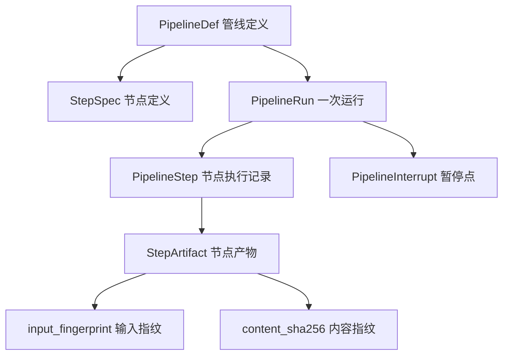

# 管线编排（多域）

管线原本是视频学习模块的内部实现（需求 09 FR-64~FR-80、FR-99、FR-135、FR-148），现独立成模块。本文描述它从「视频专用」变成「多域通用」的改造，编号从 FR-188 起。

> [!warning] 这是一次架构改造，不是加功能
>
> 现有管线从数据模型到 UI 都长在视频上：`PipelineRun.video_id` 是 NOT NULL 外键、`STEPS` 是一个全局元组、`PipelineRecorder` 构造签名带 `video_id`、错误分类直接 import 自 `domain/video_source`、路由全是 `/videos/{id}/...`。
>
> 不先把这些拆开，词库的 AI 场景本生成就只能像现在这样：进度写 Redis、阶段名硬编码在 `STAGES` dict 里、失败只能整条重来、拓扑图上完全看不见。

## 1. 模块目标

一套执行、观测、重跑、修正设施，服务多种业务流程。当前接入视频学习与词库场景本生成，预留文章学习。

判断标准很直接：**新增一个域，只需要写一份节点定义 + 各节点的执行函数，不需要碰数据模型、路由、前端画布。**

## 2. 现状问题

| 问题 | 现状 | 后果 |
| --- | --- | --- |
| 管线定义唯一 | `STEPS` 是模块级全局元组，13 个视频节点写死 | 加一个域就要在同一个元组里塞不同域的节点 |
| 运行记录绑视频 | `PipelineRun.video_id` NOT NULL 外键 | 词库场景本无法建 run |
| 节点产物不落库 | 中间态在 worker 进程内存的 `_PipeState` | 分步重跑做不到，只能连着下游重跑 |
| 无暂停机制 | 场景本的「草稿确认」是手搓的独立流程 | 人工确认点游离在管线之外，看不见也管不了 |
| 人工修正会被覆盖 | 重跑直接 delete + insert | 改过的译文再跑一次就没了 |
| 前端硬编码视频语义 | `dag.ts` 的 summary 取 `cues/sentences` 等视频字段 | 换个域节点上什么都显示不出来 |

## 3. 核心概念



图中五个实体的分工是这样的。`PipelineDef` 是代码里的注册表条目，一个域一份，声明这个域有哪些节点、依赖关系如何、主体是哪张表，它不入库。`PipelineRun` 是一次运行的记录，通过 `domain` 字段指向管线定义、通过 `subject_id` 指向被处理的业务实体。`PipelineStep` 记录单个节点这一次执行的状态、耗时、指标与配置，是已有的表。`StepArtifact` 是本次新增的产物层，它让「只重跑某一步」从做不到变成做得到。`PipelineInterrupt` 承载人工确认点，run 挂起等人，人处理完再恢复。

两个指纹各管一头：`input_fingerprint` 决定这个节点要不要跑（输入没变就跳过），`content_sha256` 决定下游要不要陈旧（产物没变下游不用重跑）。

## 4. 管线定义注册表

- FR-188 `PipelineDef` 数据类：`domain`（注册键）、`label`、`subject_table`、`steps`、`version`。全局注册表 `PIPELINES: dict[str, PipelineDef]`。
- FR-189 `StepSpec` 扩展字段：`code_version`（节点级版本，取代全局 `PIPELINE_VERSION` 判陈旧）、`deterministic`（LLM 节点标 False）、`pause_after`（`none|always|on_issues`）、`artifact_kind`（`json|blob|none`）、`cacheable`。
- FR-190 `descendants()` / `resolve_scope()` / `catalog()` 全部接 `PipelineDef` 参数，不再读全局 `STEPS`。
- FR-191 节点执行函数与节点定义解耦：注册表持有 `handler` 引用，worker 按定义调度，不再写死 13 个 `_step_*` 的调用顺序。

> [!note] 为什么节点级 `code_version` 必须有
>
> 现在全局 `PIPELINE_VERSION` 一改，全库产物同时判陈旧。改一句翻译 prompt 就让所有视频的下载、转写、对齐全部显示「陈旧」——噪音大到没人看。Dagster 的 asset `code_version` 是节点级的，本项目照做。

## 5. 数据模型

### 5.1 PipelineRun 泛化

```python {4,5,8}
class PipelineRun(Base):
    __tablename__ = "pipeline_run"
    id: Mapped[int]
    domain: Mapped[str]                  # video | scenario_deck | article，指向 PIPELINES 的键
    subject_id: Mapped[int]              # 被处理实体的主键，按 domain 解释
    kind: Mapped[str]                    # ingest | enrich | repair | generate
    # 保留且改为可空：唯一理由是视频删除时 run 能级联清掉
    video_id: Mapped[int | None] = mapped_column(ForeignKey("video.id", ondelete="CASCADE"))
    ...
```

- FR-192 `PipelineRun` 加 `domain` 与 `subject_id`，`video_id` 改为可空并只保留级联删除用途；索引改为 `(domain, subject_id, id)`。
- FR-193 迁移回填：现有行 `domain='video'`、`subject_id=video_id`，不丢历史。
- FR-194 活跃运行唯一约束：`UNIQUE (domain, subject_id) WHERE status IN ('pending','running')`，防同一主体并发跑两条。

> [!tip] 为什么不学 Dagster 用 tags 表
>
> Dagster 的 `RunsTable` 只有 `pipeline_name`，业务实体挂在独立的 `RunTagsTable` 里；Prefect 的 `FlowRun` 绑 `flow_id`，实体进 `parameters` JSON。两家都不给 run 加业务外键——因为它们要支持任意用户自定义维度。
>
> 本项目只有三个域且都要按主体查询（「这条视频的管线」是最高频操作）。明确建模成 `domain + subject_id` 可以直接走索引，不必每次 join tags 表。这是规模差异带来的合理偏离，不是抄漏了。

### 5.2 StepArtifact（新增）

```python {5,6,10,11}
class StepArtifact(Base):
    """节点产物快照：分步重跑与人工修正的事实源。"""
    __tablename__ = "step_artifact"
    domain / subject_id / step
    input_fingerprint: Mapped[str]       # 输入没变即跳过执行
    content_sha256: Mapped[str]          # 产物变了才让下游陈旧
    payload: Mapped[dict | None]         # 小产物直接进 JSONB
    blob_key: Mapped[str | None]         # 大产物落盘，库里只存 key
    produced_by_run_id / code_version
    human_edited: Mapped[bool]           # 人工改过的产物
    edit_patch: Mapped[dict | None]      # 改了什么
    is_current: Mapped[bool]             # 当前版本，历史版本留着可 diff
```

- FR-195 每个节点执行完写一条 `StepArtifact`；payload 超过 256 KB 走 blob 落盘，库内只存 key + sha + size。
- FR-196 `input_fingerprint = sha256(依赖产物的 content_sha256 + 生效配置 + 节点 code_version + prompt 指纹 + 解析后的模型 id)`。命中且非强制重跑时该节点记 `skipped(cached)` 直接复用。
- FR-197 同一指纹重跑出的产物 `content_sha256` 相同则不建新版本，只更新校验时间；不同则建新版本并可 diff。
- FR-198 节点详情面板新增「产物」页签，可查看、下载、直接编辑当前产物。

> [!warning] 这一层是分步重跑的前提
>
> 现在中间态全在 worker 进程内存的 `_PipeState` 里，跑完就没。所以「只重跑转写」做不到——下游拿不到上游产物，只能从头再来。产物落库之后才谈得上真正的节点级重跑。

### 5.3 PipelineInterrupt（新增）

- FR-199 `PipelineInterrupt` 表：`run_id`、`step`、`kind`（`approve|edit|choose`）、`payload`（给人看的内容）、`resume_value`、`status`（`waiting|resolved|expired`）。
- FR-200 run 增加 `awaiting_input` 状态；暂停时当前 arq job 正常结束，不在 worker 里 await 等人。
- FR-201 恢复接口 `POST /pipeline/runs/{id}/resume`，写回 `resume_value` 后入队新 job，从该节点头部重跑。

> [!danger] 暂停恢复的两条硬约束
>
> **恢复时整个节点从头重跑**，不是从暂停那行继续。所以暂停点之前的代码必须幂等（只能 upsert），有副作用的动作必须放在暂停点之后。
>
> **绝不能让 worker 挂起等人**。arq 的 worker 数量有限，一个 job 阻塞在等待上会占死槽位。正确形态是「当前 job 结束 → 人处理 → 入队新 job」。

## 6. 分步重跑与人工修正

### 6.1 重跑语义修正

- FR-202 `single` 范围的语义从「只跑这一步（危险，会连带清掉下游产物）」改为「只重算本步产物，下游标记陈旧但不执行」。人看完差异再决定放不放下游。
- FR-203 取消 `single_ok=False` 的硬拦截：有了产物层，任何节点都能单独重算，下游是否失效由 `content_sha256` 比对决定。
  - 落地偏离：视频管线的节点尚未接产物层，重建句层仍会清掉挂在句上的译文与词组，因此**没有无条件放开**，而是从「硬拒绝」改为「409 说清后果 + 需 `confirm_single` 显式确认」。场景本管线已接产物层，不受此限。等视频节点全部接入产物层后可再收掉这道确认。
- FR-204 非确定性节点（`deterministic=False`）重跑时 UI 明示「结果可能不同」，且默认不自动级联失效下游。

### 6.2 人工修正不被覆盖

- FR-205 可被人工编辑的产物行（`SubtitleSentence`、`StudyUnit`、`WordlistItem`）增加 `edited_fields JSONB {字段名: 编辑时间}`。
- FR-206 重跑写回时逐字段比较：人工编辑时间晚于本次生成的字段跳过不写。重跑弹窗提供 `override_manual` 开关（默认关），要覆盖必须显式勾选。
- FR-207 写侧一律 upsert，禁止 delete-all + insert。现有 `_drop_auto_tracks()` 会连人工修正一起删，改为只删机器产物（轨道加 `origin` 字段区分）。

> [!note] 这条规则叫 curation ratchet
>
> 棘轮只能往一个方向转：**任何自动再生成都不得覆盖人工编辑**。没有这条，用户改十句译文、重跑一次全没了，之后再也不会有人愿意修。

## 7. 三条管线定义

### 7.1 视频学习（现有 13 节点原样搬入）

`download → probe → subtitles_fetch → transcribe → punctuate → align → sentences → translate → enrich.{summary,difficulty,phrases,vocab} → verify`

- FR-208 视频管线除注册形式改变外行为不变，现有重跑、进度、体检、AI 修复全部照旧工作。

### 7.2 词库 AI 场景本（把现有隐式流程显式化）

`normalize → generate → verify_dict → refill → examples → persist → confirm`

| 节点 | 产物 | 可修正 | 说明 |
| --- | --- | --- | --- |
| `normalize` | 场景定义（名称/emoji/分类/CEFR/关键词） | ✅ 改完可只重跑下游 | 现 `normalize_scene()` |
| `generate` | 五组候选词 | ✅ 增删词 | 现 `generate_candidates()` |
| `verify_dict` | 命中/剔除清单 | ✅ 手动保留被剔除的词 | 现 `verify_against_dict()`，纯本地零 token |
| `refill` | 补齐轮候选 | ✅ | 词量不足才执行，否则 `skipped` |
| `examples` | 每词场景例句 | ✅ 改例句 | 可关闭 |
| `persist` | 草稿本 | — | 落 `wordlist(status=draft)` |
| `confirm` | 正式本 | — | `pause_after=always`，人确认才继续 |

- FR-209 场景本生成改由管线驱动，`domain/scenario_decks.py` 的 `STAGES` dict 升格为 `StepSpec` 元组，进度从 Redis 改为落 `PipelineStep`（Redis 仍可留作实时推送通道）。
- FR-210 每个节点产物落 `StepArtifact`，支持「候选词不满意 → 只重跑 generate，不重跑归一化」「例句不好 → 只重跑 examples」。
- FR-211 `confirm` 节点是声明式暂停点，取代现在手搓的草稿确认流程；草稿页即该暂停点的处理界面。
- FR-212 场景本管线在拓扑图中与视频管线同样可视，节点可点、可看产物、可改参数重跑。

### 7.3 文章学习（预留，本期不实现）

- FR-213 注册表预留 `article` 域；本期只保证「新增域不需要改公共设施」这一点在设计上成立，不写具体节点。

## 8. 前端信息架构

层级对齐 Airflow 的 DAG List → Grid → Graph → Task Instance 四层，但压缩成三页。

| 页面 | 职责 | 对应 Airflow |
| --- | --- | --- |
| 管线中心 `/pipeline` | 跨域总览：按域分组，每域显示主体数、跑中、失败、待确认、问题数 | DAG List View |
| 域视图 `/pipeline/{domain}` | 该域全部主体列表 + **运行矩阵**（行=节点，列=最近 N 次运行，颜色编码） | Grid View |
| 运行详情 `/pipeline/{domain}/{subject}` | 全屏 DAG 画布（现有页面泛化）+ 节点抽屉 | Graph View + Task Instance |

- FR-214 管线中心按域分区展示，域内主体可搜索筛选；不再是「视频列表」而是「主体列表」。
- FR-215 新增运行矩阵视图：行是节点、列是历次运行，一眼看出哪个节点反复失败。这是当前完全缺失的一层。
- FR-216 节点抽屉页签对齐 Airflow：概况（指标）/ **产物** / 日志 / 配置与重跑 / 历史执行。
- FR-217 节点视觉按域分组着色；节点摘要文案由后端提供（`StepArtifact.payload` 的摘要字段），前端不再硬编码 `cues`/`sentences` 这类视频专有字段。
- FR-218 待确认（`awaiting_input`）的 run 在总览与画布上有独立视觉状态与直达入口，不与「失败」混淆。

## 8.1 域 UI 声明（C 档重构新增）

前端能做到「列随域变」的前提，是域自己声明这些元数据。改动集中在 `PipelineDef` 一个数据类上。

- FR-235 `SubjectColumn`：主体列表的列（key / label / kind / align / width）。kind 决定渲染方式（text、number、ratio、status、chips、run），前端按 kind 渲染，不认识任何域的字段名。
- FR-236 `HealthBucket`：健康度分档（key / label / tone / actionable）。视频的「产出不达标」与场景本的「待确认」是完全不同的东西，写死一套 ready/degraded/failed 两边都别扭。`actionable` 的档位会出现在全局待办上。
- FR-237 `DomainAction`：域级动作。同一个按钮位，视频域挂「一键修复全部」，场景本域挂「批量生成种子场景」。
- FR-238 `run_kinds`：运行类型枚举，供运行记录的筛选器渲染。视频是 入库/AI加工/AI修复，场景本是 生成/重跑。
- FR-239 `detail_route`：主体详情的整页路由模板。视频走功能更全的 `/video/{id}/pipeline`，其余域走 `/pipeline/{domain}/{id}`，两者都是整页。
- FR-240 主体列表按域取数（`domain/subjects.py`），返回行的字段与该域 columns 声明一一对应。
- FR-241 全局待办：跨域聚合 actionable 档位与未处理问题，点任一项直达域内对应筛选。
- FR-242 域视图：域头 + 三视图（主体列表 / 运行矩阵 / 运行记录），全部限定在本域内。
- FR-243 域内运行记录：筛选器的运行类型由域声明；服务端按 domain 过滤。
- FR-244 保存筛选视图：常用筛选组合存本地，一键切回。
- FR-245 实时运行浮层：有任务在跑时全局常驻，跨域覆盖，空闲时不渲染。

> [!danger] 运行记录只看得到视频的直接原因
>
> `list_runs` 用的是 `join(Video, Video.id == PipelineRun.video_id)` —— **内连接**。场景本的 run 其 `video_id` 为空，被连接直接过滤掉了，无论前端怎么改都查不出来。改为按域批量补标题后两边都能查。

## 8.2 节点可操作性（真实使用反馈驱动）

拓扑图把「有哪些节点、跑到哪一步」表达清楚了，但「这一步产出了什么、我该做什么」还是黑的。

- FR-246 批量生成必须先勾选：显示每个种子的名称、分类、难度与是否已生成，按分类可全选，执行前给出「将生成 N 个 · 约 X 分钟 · 消耗 N 次 AI 调用」。空 keys 由服务端 422 拒绝。
- FR-247 节点产物按类型渲染，不是 JSON dump：
  - `normalize` → 场景定义卡（emoji / 中英名 / 难度 / 分类 / 关键词）
  - `generate` / `refill` → 按五组分节的词表网格，**点词弹词卡**，词右侧可朗读
  - `verify` → 保留与剔除两栏，剔除项标注原因
  - `examples` → 例句列表
  - 其余节点 → 键值对表
  - 原始 JSON 降为折叠项，排查时才展开
- FR-248 `confirm` 节点提供真正的确认入口：直接列出待确认词表，可逐词勾除，底部「确认入库（N 词）」。不确认就一直停在这里，界面明说这一点。
- FR-249 主体列表区分「从未生成」与「早期生成」：有产物却无 run 记录的是管线改造之前的历史数据，显示成「未跑过」会被误认为空本。

> [!danger] 批量且不可逆的操作不该一次点击就执行
>
> 首版「批量生成种子场景」按钮直接提交空 `keys`，服务端把空列表当成「全都要」，一点跑掉 50 个场景本，全部停在待确认且无法批量撤销。
>
> 三处一起改才算修好：**服务端拒绝空 keys**（不能只靠前端不传）、**前端必须勾选**、**执行前明示代价**（生成几个、多久、烧多少次调用）。

## 8.3 人工确认改为可选（scholar 确认）

- FR-250 `confirm` 节点由 `need_confirm` 参数控制，**默认关闭**：生成完直接入库进复习队列。开启后才停在 confirm 等人过目。
- BR-45 是否需要人工过目属于用户偏好，不该由系统替他决定。默认自动入库的理由是：词表已经过 ECDICT 校验，词典外的词早被剔除，剩下的绝大多数直接可用；真要严格把关时再打开开关。

## 8.4 节点可理解性（真实使用反馈驱动）

拓扑图能看出「跑到哪一步」，但看不出「这一步在干什么、我该点哪个按钮」。

- FR-251 每个域声明自己的帮助内容（`HelpSection`），拓扑页提供「怎么用」按钮打开。视频域的帮助内容一并从组件里搬进声明——原先硬编码在 `HelpOverlay` 里，收掉单节点重跑确认门后那段说明就过时了，而没人会想起来同步一个写死在组件里的文案。
- FR-252 `StepSpec` 增加两个人话字段：
  - `skip_when`：什么情况下这一步会被跳过。「补齐词量」是条件节点，词够就整步跳过，不写清楚用户只会看到一个灰块。
  - `rerun_hint`：重跑这一步会连带影响什么、消不消耗 AI 额度。
- FR-253 重跑按钮改用行为描述而非术语：「连同下游」→「这一步及后面全部」，并标出具体会重跑几个下游节点；「只重跑本节点」→「只重算这一步」。
- FR-254 节点说明一律用用户语言，不出现 `BR-30a`、`status=draft`、`token` 这类内部标记。

> [!note] 术语泄漏是可理解性的主要杀手
>
> 「连同下游」是从 Dagster 的 step subset 直译来的，「补齐词量」的跳过条件写成「低于下限才执行，否则记 skipped」——都是实现视角。
>
> 判断标准很简单：**这句话是在描述系统怎么做的，还是在描述用户会看到什么**。前者一律要改写。

## 9. 业务规则

| 编号 | 规则 |
| --- | --- |
| BR-35 | 新增域只需注册 `PipelineDef` + 各节点 handler，不得修改公共表结构、公共路由与画布组件 |
| BR-36 | 任何自动再生成不得覆盖人工编辑字段，除非显式勾选覆盖（curation ratchet） |
| BR-37 | 暂停不占用 worker 槽位：当前 job 结束后等人，恢复时入队新 job |
| BR-38 | 暂停点之前的代码必须幂等，副作用只能放在暂停点之后 |
| BR-39 | 写侧一律 upsert，禁止 delete-all + insert |
| BR-40 | 同一主体同一时刻只能有一条活跃 run（数据库唯一约束保证，不靠应用层判断） |
| BR-41 | 非确定性节点重跑不自动级联失效下游，避免每次重跑摘要就把全库标脏 |
| BR-42 | 前端组件不得出现任何域专有字段名，一切按域声明渲染 |
| BR-43 | 深链意图压过记住的视图偏好：带筛选参数进入时强制落在能体现该筛选的视图 |
| BR-44 | 「执行中」与「需要关注」必须分开：失败与产出不达标不算执行中，混在一起浮层会报假数 |
| BR-45 | 是否需要人工过目属于用户偏好，系统不替他决定；默认自动入库 |
| BR-46 | 节点产物必须渲染成人看的形态，JSON 只作为折叠的排查入口 |
| BR-47 | 产物只能有一条写入路径：多处写同一节点产物会互相覆盖（实测 bytes 骤减、摘要丢失） |
| BR-48 | 面向用户的文案不得出现内部术语与代号；判据是「这句话描述的是系统行为还是用户所见」 |
| BR-49 | 帮助内容随域声明走，不硬编码在组件里——写死的文案不会有人回头同步 |

## 10. 实现方案

| 部件 | 方案 | 抄自 |
| --- | --- | --- |
| 执行运行时 | **arq 不动**，继续只负责派活 | — |
| 管线定义注册表 | `dict[str, PipelineDef]`，节点持 handler 引用 | Dagster job / Prefect flow 注册 |
| Run 与业务实体关联 | `domain + subject_id` 两字段 | Dagster `pipeline_name` + Prefect `flow_id`，但按本项目规模改为明确外键式建模 |
| 节点产物层 | `step_artifact` 表 + 大产物落盘 | Dify 变量检查器 / LangGraph `channel_values` / Airflow XCom |
| 指纹缓存 | `input_fingerprint` 命中即 `skipped(cached)` | Dagster asset staleness + Prefect `cache_key_fn` |
| 人工确认 | `pipeline_interrupt` 表 + `awaiting_input` 状态 | LangGraph `interrupt()` / `Command(resume=)` |
| 人工修正保护 | 字段级 `edited_fields` 时间戳比对 | curation ratchet 工程实践 |
| 入队幂等 | arq `_job_id` 去重 + 数据库部分唯一索引 | Prefect `idempotency_key` 唯一约束 |
| 运行矩阵 UI | 行=节点 / 列=运行 的矩阵 | Airflow Grid View |
| DAG 画布 | 现有 `@xyflow/react` + dagre 不换 | — |

> [!danger] 明确不做的事
>
> **不引入 LangGraph / Prefect / Temporal 替换 arq**。本项目的节点是 yt-dlp、faster-whisper 这类重 IO 重 CPU 的活，产物是几十 MB 二进制，塞进 checkpointer 的 channel 里只会更难查；Temporal 还要额外服务与决定论约束。这四家给的是**模式**，arq 加 PostgreSQL 完全承载得住。
>
> **不做通用工作流引擎**。不支持动态 DAG、不支持条件分支表达式、不支持用户在 UI 里拖拽编排。三个域的节点定义写在代码里就够，做成配置化是纯粹的过度设计。
>
> **不追求 run 与主体的完全解耦**。`video_id` 外键保留用于级联删除，这是务实取舍。

## 11. 验收要点

| 编号 | 验收场景 |
| --- | --- |
| AC-14 | 场景本生成过程在拓扑图中逐节点可见，节点状态、耗时、产物摘要与视频管线同构 |
| AC-15 | 场景本候选词不满意时，只重跑 `generate` 节点，`normalize` 产物复用不重算（日志可证 `skipped(cached)`） |
| AC-16 | 手动改过的译文，重跑 translate 后仍保持人工版本；勾选覆盖后才被替换 |
| AC-17 | 场景本 `confirm` 节点使 run 进入 `awaiting_input`，worker 槽位不被占用（可并发跑其他任务） |
| AC-18 | 视频管线全部既有能力（重跑、进度、ETA、体检、AI 修复）在改造后行为不变 |
| AC-19 | 运行矩阵能一眼定位「哪个节点在最近 10 次运行里失败最多」 |
| AC-20 | 新增一个域的改动范围仅限：一份 `PipelineDef` + 各节点 handler，公共设施零改动 |

## 12. 分期计划

| 阶段 | 范围 | 关键交付 | 风险 |
| --- | --- | --- | --- |
| Q1 | §4 注册表、§5.1 Run 泛化、§7.1 视频管线迁入 | 视频管线跑在新设施上，行为不变 | ✅ 已交付 |
| Q2 | §5.2 产物层、§6 重跑语义与修正保护 | 分步重跑可用，人工修正不再被吃 | ✅ 已交付 |
| Q3 | §7.2 场景本管线、§5.3 暂停点 | 场景本生成进拓扑图，草稿确认变成暂停点 | ✅ 已交付 |
| Q4 | §8 前端信息架构、运行矩阵 | 三层页面结构与节点产物页签 | ✅ 已交付（域视图与运行详情合并进管线中心 tab，未拆独立路由） |

> [!tip] 为什么视频管线先迁
>
> 视频管线是既有资产，也是验证新设施是否真的通用的试金石。如果先做场景本管线，很容易做出一个「刚好适配场景本」的假通用设施，等视频管线迁进来才发现处处不合。先迁最复杂的那条，通用性才是真的。

## 管线编排小结

这次改造的实质是把「视频学习的实现细节」提升为「平台级设施」。判断改造是否成功只看一条：新增一个域时，公共设施是否零改动。

三处新增（注册表、产物层、暂停点）各自解决一个具体缺口：注册表让管线定义可以有多份；产物层让分步重跑从做不到变成做得到；暂停点让人工确认从游离在流程外变成流程的一部分。

不做的事同样重要：不换执行运行时、不做可视化编排、不追求纯粹解耦。这三条守住了，改造才不会从「让管线支持词库」滑向「自己写一个 Airflow」。
