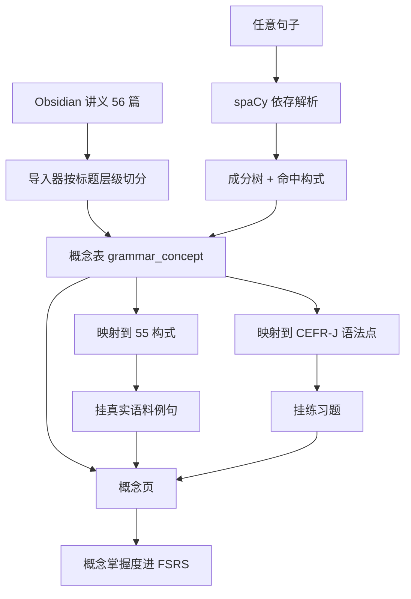

# 15. 语法概念专栏与句子解构

- 状态：v0.1 草案（待 scholar 确认）
- Owner：scholar
- 关联目标：学完能看懂任意英文句子，并知道怎么双向翻译
- 关联规范：[核心业务规则](../../03.业务规则与状态机/01.核心业务规则与状态机.md)、[模块 14 语法学习与写作纠错](../14.语法学习与写作纠错/需求说明.md)

## 背景与问题

模块 14 落地的是**练**：CEFR-J 501 个语法点、55 条构式的自有语料绑定、两段式写作纠错、句法可视化。整条链路缺一层——**讲**。用户答错一道题，系统能说出"这里时态错了"，却没有一处能把这个点从头讲清楚。

同时存在一份现成资产：`知识库/obsidian_en/12.软实力与英语/01.英语学习/02.英语基础语法`，13 类 56 篇、约 2.2 MB，标题层级规整、含对照表与 Mermaid、中英例句齐备。**内容不缺，缺的是把它接进学习闭环。**

> [!danger] 「讲到」不等于「讲会」
>
> 用户的目标是「看懂所有句子并知道怎么翻译」。这不是覆盖度目标——语法点有限而句子无限，
> 决定能否读懂长难句的是**遇到陌生句能不能拆**，不是背没背过第 47 条规则。
> 所以专栏的产品目标定义为：**把讲义变成一个能把任意句子拆开、并把每一处结构指回讲义的系统**。
> 只做成一个好看的文档站，等于把 Obsidian 换了个壳。

## 用户与业务价值

### 英语四类讲义入口

语法模块顶部提供英语基础语法、英语词汇、英语句型手册、英语场景四个页签。
移除语法点、句子实验室、写作纠错、错题本及其顶部跳转入口。
四类共用 GrammarLibrary 三栏阅读器：目录、正文、大纲、笔记、书签、阅读位置、
文内与分类全文搜索、字号、行宽、词卡、朗读、批注、AI 解析与确认后写回、关联练习。
没有关联题目的文档展示明确空状态，不创建虚构练习。

现有语法讲义保持原相对路径。三个新分类使用目录前缀作为文档身份，
批注、笔记、书签及阅读记录不会与其他分类的同名文档混用。
目录、搜索及前后篇导航限制在当前分类；切换后恢复该分类最近阅读文档。
知识库 Markdown 按现有导入机制复制到应用讲义目录，不修改源文件、不覆盖同名文件。
源目录后续编辑不会自动同步，可按分类再次导入；同名冲突保留应用现有版本。

本地导入：英语词汇 117 篇、英语句型手册 51 篇、英语场景 42 篇，无同名冲突。
验证：32 项讲义接口测试、61 项语法前端测试、TypeScript、UI 检查及前端构建通过。
内置浏览器验证四类正文、分类搜索和切换后恢复最近文档。紧凑窗口默认收起目录与大纲，
两侧面板互斥展开，选择文档后收起目录，正文保持可读。

- 答错题时能就地读到这个点的完整讲解，而不是跳出去翻笔记。
- 读书/看视频遇到看不懂的句子，一键拆开，每个成分指向对应概念。
- 有明确的「学完」终点：主动层概念全部通过测验，而不是无限刷题。
- 讲义仍以 Markdown 为单一事实来源；CR-017 后桌面档读取 NEXUS 托管副本，Obsidian 修改需再次导入。

## 范围

### 包含

- 讲义导入与结构化（按标题层级切成概念，保留原文行文）
- 概念 ↔ CEFR-J 语法点 ↔ 55 构式的三方映射
- 概念页：讲解 + 真实语料例句 + 该点练习 + 相关概念
- 主动层/参考层分层与学习路径
- 概念级掌握度与 FSRS 复习（复用模块 01 的 `domain/srs.py`，不改它）
- 句子解构：任意句子 → 成分树 + 命中构式 + 指回概念
- 覆盖度审计：对照 CEFR-J 501 点与 55 构式，报出讲义没讲到的缺口

### 不包含

- 重写讲义（决策：导入原文 + 只补缺口，理由见 BR-93/BR-94：行文是用户自己的，AI 改写会引入 AI 腔且不可逆）
- 双向翻译训练（下一期，依赖本期的概念表）
- 语音朗读讲义（走模块 06 既有 TTS，不新建）
- 从 Obsidian 反向写回（单向导入，避免两处编辑冲突）

## 主流程



导入器读 Markdown 的 YAML front matter 与标题层级，把每篇切成若干概念：一级标题是章、二级标题是概念、三级及以下留在概念正文里。切分只按结构，不改一个字。切好的概念落 `grammar_concept` 表，正文存原始 Markdown。

映射分两条：概念 → CEFR-J 语法点走术语匹配加人工校订；概念 → 构式走构式 key 的显式声明。构式一旦挂上，`scan_grammar` 已经扫出来的全语料命中就成了这个概念的真实例句，带书名与出处。

概念页把四样东西放在一屏：讲解正文、真实语料例句、该点的练习题、相关概念。学完点「我会了」进入 FSRS 队列。

句子解构走模块 14 已有的 spaCy 依存分析与 `SentenceLab`，新增的是最后一跳：命中的构式指回概念页。

## 异常流程与边界

- 讲义某篇没有二级标题：整篇作为一个概念，导入时告警而不是静默吞掉。
- 概念在 CEFR-J 里找不到对应点：允许，标 `unmapped`，覆盖度审计里列出来。
- CEFR-J 有点而讲义没讲到：这才是要补的缺口，审计报告的主要产出。
- Obsidian 侧改了文件重新导入：按 `source_path + 标题路径` 幂等 upsert，用户的掌握度与复习进度不能被重置（与 `misconception` 的教训同款——见踩坑记录）。
- 讲义被删除：概念标记 `archived` 而不是物理删，保留历史引用。

## 业务规则

- BR-93 **讲义正文以 Markdown 为单一事实来源**，平台不做富文本编辑。要改内容回 Obsidian 改，重新导入。
- BR-94 **导入不改字**。行文风格是用户自己的，AI 改写会引入 AI 腔且不可逆。补缺口时新写的概念单独标 `authored_by=platform`，与导入内容视觉可区分。
- BR-95 **主动层判据是「不会就会读错句子或译反意思」**，不是「重要」。数词的分数读法、标点规则、缩略词表进参考层。主动层规模控制在 60–80 个概念。
- BR-96 概念掌握度复用 `domain/srs.py`，**不得为语法另写一套调度**。
- BR-97（**已按实测修订**）构式命中的精度由**每条规则的正反例单测**保证，不由句级解析把握度把关。
  句级把握度只作展示，标出「这句较难解析」，**不做门禁**。
  修订理由见 §14.2：原规则设的 60 分门槛在 2,376 条真实命中里 0 条触发，
  而唯一一个真实误命中（`tag-question` 命中感叹句）置信度是满分 100——
  「句子好不好解析」与「这条命中对不对」不是同一个量。

## 非功能要求

- 导入 56 篇 ≤ 30 秒，幂等可重复跑。
- 概念页首屏 ≤ 300 ms（正文来自库，不经 LLM）。
- 句子解构 ≤ 800 ms（spaCy 已常驻）。

## 验收标准

- AC-106 56 篇全部导入成功，概念数 ≥ 300，无静默丢弃；重复导入不改变任何掌握度记录。
- AC-107 主动层概念 60–80 个，每个都能说出「不会它会读错什么句子」的一句话理由，写在概念表里。
- AC-108 每个挂了构式的概念，真实语料例句 ≥ 3 条且带出处（书名/视频名 + 位置）。
- AC-109 覆盖度审计报出 CEFR-J 501 点与 55 构式的命中与缺口清单，缺口逐条补齐后重跑归零。
- AC-110 任取 20 个真实长难句（来自书库），解构结果的成分划分人工核对正确率 ≥ 85%，且每个高置信度构式命中都能跳到概念页。

## 数据、接口与兼容性

新表：

| 表 | 用途 |
| --- | --- |
| `grammar_concept` | 概念：标题路径、正文 Markdown、层级（主动/参考）、来源文件、构式 key、CEFR-J 点 |
| `grammar_concept_progress` | 用户对概念的掌握度，挂 FSRS 卡 |
| `grammar_doc_annotation` | 讲义正文的划词批注：选区文本 + 前后各 32 字符锚点、颜色、笔记、AI 分析缓存 |

接口：`/grammar/concepts`（树）、`/grammar/concepts/{slug}`（详情含例句与题）、`/grammar/parse`（句子解构）。
讲义库另有 `/grammar/docs/*`：tree / content / search / improve / apply，以及批注的
`annotations` 增删改查与 `annotations/{id}/analyze`（三档 AI 分析，支持 SSE）。

导入脚本 `scripts/import_grammar_notes.py --path <obsidian 目录>`，幂等。

## 风险、迁移与回滚

- 讲义与 CEFR-J 的术语体系不同源（中式语法术语 vs CEFR-J 的英文描述），映射准确率是主要风险。缓解：先自动匹配出候选，人工校订一遍并把结果落库，之后重导不再重算。
- 主动层 60–80 的划线带主观性。缓解：判据写进每条记录，可复核可调整。

## 14. 实施记录

### 14.1 讲义导入与分层

56 篇原文切成 539 个概念、零告警；补齐 6 篇缺口后共 **569 个概念**。
重导幂等（第二次「新增 0、未变 539」），掌握度不受影响。

主动层 70 个，判据是「不掌握会不会把句子读错」而不是「重要」——后者人人满分，分不出层。
分布集中在从句 16、特殊句型 12、非谓语 11、时态 7、情态 7，
名词冠词/口语/附录 0 个。每条的一句话理由落库并显示在概念页上。

分层用 0-100 打分再全局取前 N，不用逐批二分类：569 个概念塞不进一次上下文，
分批打标签时每批都会各自凑出一堆「主动」，全局预算守不住。

### 14.2 BR-97 被实测推翻了

原规则：解析把握不足的构式命中只画成分树、不指概念。为此实现了句级把握度
（多 ROOT、句子过长、命中区间内有 `dep` 兜底关系三个扣分项），门槛设 60。

**这个门槛从不触发**：

| 输入 | 命中数 | 低于 60 |
| --- | --- | --- |
| 真实语料（400 段书库正文切句） | 2,376 | **0** |
| 字幕拼接无标点 | 6 | 0 |
| 两句粘连 | 4 | 0 |
| 全小写无标点长句 | 7 | 0 |
| OCR 断行 | 1 | 0 |

更要紧的是方向性的错：唯一一个真实误命中——`tag-question` 命中
「What a beautiful day it is!」——**置信度是满分 100**。

结论：**「句子好不好解析」与「这条命中对不对」不是同一个量**。
前者是解析难度，后者是规则精度，两者没有因果关系。
拿前者当门禁只会制造「已经防住了」的错觉，还白白丢掉两成正确的概念链接
（60-79 档占 20.8%）。

修订后：门禁撤掉，精度由**每条构式规则的正反例单测**保证——那才是抓到
tag-question 那个 bug 的东西。把握度留作展示，标出「这句较难解析」。

中途还修正了信号本身的一个设计错误：首版按整段算 ROOT 数，
于是「不止一句话」被当成了「解析失败」，粘两句正常英文进来就掉 30 分。
改成在**命中所在的那一句**里算。

### 14.3 tag-question 规则两头都错

原规则「ROOT 是 AUX 且有代词 nsubj」：

- **漏**：`You don't like it, do you?` 里的 `do` 被 spaCy 标成 VERB 不是 AUX
- **误**：`What a beautiful day it is!` 的 `is + it` 照样命中

真正的判据是**位置**不是词性：附加部分的主语在助动词之后（倒装），主句在助动词之前。
`>--` / `>++` 把「子节点且在左/右」一次表达出来。

还有第二个形状：主句一复杂，tag 就从 ROOT 变成 ROOT 的 conj
（`There were too many people for us to find a seat, weren't there?`）。
所以 `build_matcher` 扩成支持一个 key 挂多个候选子图。

22 条正反例进单测。修完全语料重扫，tag-question 命中从 **20,209 条降到 2,241 条**——
差掉的一万八千条是误报（其中只用第一个形状时是 1,429 条，第二个形状又捞回八百多条真命中）。

### 14.4 覆盖度审计做了三版才做对

| 版本 | 判据 | 结果 | 问题 |
| --- | --- | --- | --- |
| v1 | CEFR-J 条目名去讲义正文里搜 | 覆盖 15/501 | 条目名是句型描述不是术语 |
| v2 | 范畴名去搜 | 7 个范畴「一处没提」 | 两套术语体系，字面对不上 |
| v3 | 24 范畴 × 61 篇标题的 LLM 对照 | 5 个真缺口 | 可用 |

v1、v2 报出的数都是**判据坏了**，不是讲义缺内容——「时态与体」对着整章的
《动词时态》、「虚拟与条件」对着《虚拟语气详解》。照着那个数去补会补出一堆重复。

补完 6 篇后 **24 个范畴归零**。构式覆盖 53/55，`passive-modal` 与 `too-to`
在讲义里只作为别的主题的子节出现，映射器按「必须在讲这个结构本身」的判据没挂上——
这是设计如此，不是漏。

v3 也不是完全稳定：`there be` 在两次运行里给了不同答案。查证后确认它确实只以
子节形式散在主谓一致、疑问句、常见错误三处，从没系统讲过，属于真缺口，已补。

### 14.5 补写的 6 篇

祈使句、感叹句、反义疑问句、间接引语、短语动词、there be 句型，共 30 个概念，
标 `authored_by=platform`，界面上与导入原文区分（BR-94）。
放在仓库 `data/grammar_notes/` 而不是写进用户的 Obsidian 库——
补写内容是平台的产物，混进用户的知识库会让「哪些是自己写的」这件事说不清。

导入器为此加了 `--authored-by`，同时修掉一个真 bug：归档判据原本只看
「这次没扫到」，跑任何一个来源都会把另一个来源的概念**全部归档**——
539 个概念连同掌握度一起消失且不报错。现在归档只在本次来源的范围内做。

### 14.6 句子解构指回概念

`POST /grammar/concepts/deconstruct`：成分树 + 依存 + 命中构式 + 指回讲义概念。
句子实验室点概念直接跳到专栏并打开它。

同一个构式挂了多个概念时的排序判据（`concept_rank`）：

1. 小结/练习这类泛泛的章节排最后——指过去找不到那个结构在哪儿讲，等于没指
2. 主动层优先
3. 专一度：只挂一个构式的概念讲的就是这个结构本身，挂三个的多半是顺带提到

**章节号只做最后的稳定排序**。首版拿它当第二判据，结果反义疑问句的句子指向了
「12.日常口语」而不是「16.反义疑问句」，只因为 12 < 16。

### 14.7 未做

- 阅读器/视频里「一键拆句」的入口（当前只在句子实验室）
- 双向翻译训练
- `passive-modal` / `too-to` 两条构式的概念映射

### 14.8 阅读面换成讲义库（2026-08-23，scholar 拍板）

概念专栏的碎片式阅读（按 H2 切开一节节看）被整篇阅读取代。scholar 的原话是
「把当前的 md 文档换一种布局去展示」，参照 Obsidian：左侧文档树（13 章 56 篇 +
大纲）、中间整篇渲染、右侧大纲点击跳转。**概念与 FSRS 掌握度没删**，挪到右栏
「本篇概念」区块，打分照旧走 `/grammar/concepts/{slug}/grade`。

渲染管线全部用现成件（登记见开源复用清单 §7.7）：react-markdown + remark-gfm +
remark-obsidian-callout + remark-wiki-link + rehype-raw + mermaid@11 懒加载。
自写的只有三段胶水：callout 同段落续行的规整（39 处语料会丢内联格式）、
```text {1-3} 行高亮的 meta 解析、大纲提取与节段切片（`library/doc-model.ts`，纯函数带单测）。

正文每个英文词可点开词卡（rehype 插件在 hast 树上切词——**不能渲染后改 DOM**，
React 协调会撞上被替换的文本节点整页白屏，首版就是这么崩的）。右键菜单：查词 /
句子 AI 解析（复用阅读器 SentencePanel，翻译+语法+精讲）/ 朗读 / 复制 / AI 完善。

**BR-93 的边界松动一处**：AI 完善支持把改进稿写回 Obsidian 源文件，但仅限
「按大纲节段」的精确源码切片（右键选区是渲染后文本，写回必然错位，只给复制）；
写回前服务端先备份到 `data/grammar_doc_backups/`，前端两段式确认。
「平台只读」收窄为「平台不自动改」——每次落盘都是用户显式确认的动作。

服务端新增 `/grammar/docs/*` 五个端点（tree / content / search / improve / apply），
根路径进 Settings（`grammar_docs_root`）。ConceptStudy / GrammarWebPage /
concept-beats（讲义重排与生成网页两条路线）随之下线删除。

### 14.9 讲义库铺满工作区（2026-08-24）

三处调整，都由 scholar 直接指出：

1. **撤掉「在 Obsidian 中打开」**——讲义库本身就是读讲义的地方，深链是多余的出口。
2. **铺满左侧菜单栏之外的全部区域**：这一档不再是文档流页面，页头（语法 + 一句说明）
   不渲染，页壳改成定高 flex 列，讲义库 `flex: 1` 吃满剩余高度。原先写的
   `height: calc(100vh - 190px)` 是页头加页签的估算，页头一撤就多留一条空白。
3. **正文标题不再重复**：讲义自带 `# 标题`，宿主再渲染一个 h1 等于同名标题连出两遍
   （「语法术语表」出现两次）。只有正文没有 H1 的讲义才由宿主兜底。

顺带修掉两个孤儿类——`.ph-tabs` 与 `.ss-assess-btn` 的样式原本住在音标模块的
样式表里，2026-08-23 删音标目录时没迁走：前者让语法页五个页签退化成挤在一行的
裸文字（「讲义库语法点句子实验室写作纠错错题本」），后者让跟读打分按钮贴住上方控件。
页签样式重建在本模块下并改回语法前缀 `.gr-tabs`。

> [!danger] 铺满档的选择器要绕开 check:scroll 的索引口径
>
> 守卫按「选择器最右复合项里的类名」建索引，`.page.grammar-full { display: flex }`
> 会把列向 flex 一并记到 `.page` 键上，全仓 `main.page.*` 当场被判成列向 flex，
> 误报 7 个 studio 滚动容器。改成让基础内边距 `main.grammar:not(.grammar-full)`
> 从源头不生效，铺满档就不必堆特异性去覆盖。

### 14.10 讲义正文划词批注（2026-08-24）

讲义库支持在正文里划词高亮、写批注、对选中段落做 AI 分析。服务端新表
`grammar_doc_annotation`，迁移 `666b61f47e6a`。

**锚点不能只存字符偏移**。讲义是磁盘上的 .md，而 14.8 已经开了「AI 改稿写回」
的口子——正文一改，所有偏移集体错位，而错位的高亮盖在别的句子上比不显示更糟。
所以存的是「选区文本 + 前后各 32 字符」，落点由 `grammar_docs.relocate` 在每次
读取时按当前正文现算，`start_hint` 降级为提示：

| 档 | 判据 | 用途 |
| --- | --- | --- |
| 一 | `prefix + quote + suffix` 整体匹配 | 正常情形；同一句在文中出现多次时靠前后文区分 |
| 二 | 只匹配 `quote`，取离 `start_hint` 最近的一次 | 改动落在前后文里，偏移已不准但原位仍是最好的猜测 |
| 三 | 都找不到 → `resolved_start/end` 均为 `null` | 前端提示「原文已变，批注找不到落点」，不硬凑一个落点 |

AI 分析三档：`grammar`（语法结构）走深度语法能力 `grammar-deep`，`explain`
（讲透这段）与 `translate`（精准中译）走 `explain-standard`。提示词把批注原文
连同它在**当前**正文里前后各 200 字符一起给模型——只给选区的话，代词指代、省略、
承接上句的主语全部无解，而「它指的是什么」恰恰是划词最常问的。

结果按 ADR-006 的口径缓存在该行的 `ai_kind` / `ai_result` 上，同 kind 二次访问零调用，
`refresh: true` 才重算；换 kind 不命中缓存（上一档的结果顶上去等于答非所问）。
流式收尾的落库走本模块自己的 `detached_session`——请求作用域那个在生成器跑到 done
时已经在拆（本仓旧账），`tests/conftest.py` 的 `_detached_session` 已一并接管。

### 14.11 阅读体验补齐（2026-08-24）

一次修掉五件，其中一件是**全产品级的 bug**：

**mermaid 把错误图泄漏进 `document.body`**。`mermaid.render(id, code)` 不给容器时
在 body 建临时 `#d{id}`，成功才移除——失败或被后续渲染取代时留在原地，于是每个页面
底部都挂着一张「Syntax error in text」的炸弹图（实测残留节点 `#dglib-mmd-16`）。
三道防线：先 `parse(..., {suppressErrors:true})` 验语法（不合法根本不调 render）、
渲染串行化（mermaid 有全局状态，并发互踩）、`finally` 扫残留。

其余四件：
- **图可点击放大**：SVG 序列化成 data URI 交给 `components/ImageViewer`，缩放/平移/1:1 全复用。
- **代码块与引用块里的词可点**（顶部「词」开关，默认全开）。连锁问题：行高亮原先在组件里按
  `String(children)` 重建，词被切成 span 后它输出 `[object Object]`，还会把例句块的可点性
  整块抹掉——把行高亮改成管线里的 rehype 插件，排在切词之前才对。mermaid 源码任何档都不切。
- **AI 完善**：节段下拉放开全部层级（30 → 85 项）、新增「整篇文档」一档、**选中即跳转**到该节；
  产出支持复制 Markdown / 复制纯文本 / 存为 .md。
- **五个页签统一去掉页头**：左侧菜单栏已标着「语法」，再占一屏顶部说同一件事只是吃掉可读高度。

### 14.12 划词批注（2026-08-24）

右键划词 → 批注（四色 + 笔记）→ 可让 AI 做三种分析：`grammar`（拆结构，走 grammar-deep）、
`explain`（讲透）、`translate`（精准中译）。结果服务端按 kind 缓存，重开不重算。
批注列进右栏大纲下方——散在正文里的批注找不着，有总览才用得起来。

> [!danger] 锚点不能只存字符偏移
>
> 讲义可以被 AI 改写并写回（14.8 的写回链路），偏移当场全错。存的是
> **引文 + 前后各 32 字符**（TextQuoteSelector 的老办法）：先按 前文+引文+后文
> 精确命中（同一句在文中出现多次也能分辨），退到只找引文并取离原偏移最近的一处，
> 再找不到就认输返回 null，前端显示「原文已改动，找不到落点」——**宁可不标，不能标错**。

高亮同样做成 hast 插件而不是改 DOM，排在切词之前（切完词引文已被拆成一串 span 接不上）。
这是 word-click 那条白屏老账的同族约束：改 React 管的 DOM 会在下次协调时炸。

### 14.13 AI 完善支持附件（2026-08-24）

`POST /grammar/docs/improve` 的 body 多两个可选列表：`ref_asset_ids`（`image_asset` 里的
图片，走多模态）、`file_asset_ids`（媒体资产库里的其它文件，尽力抽正文）。两者都是这一轮的
临时素材，不入讲义、不落库。

块构造复用模块 17 的 `studio_gpt.image_blocks` / `file_blocks`，不另写一套：图片读展示图变体
并按需压缩、直读存储不下载再上传（BR-144），其它文件抽不出正文时只给文件名。条数上限各自沿用
`studio_gpt.MAX_INPUT_ATTACHMENTS`（20），超出截断。

两条判据抄自既有实现：

- **带附件才用块数组**。没带附件时 user content 保持纯字符串，无条件改成数组会让每一次普通
  完善都变成多模态请求。系统提示词里那条「附件是约束与素材」同样只在带了附件时追加——没带还讲
  一遍，模型会去找不存在的东西。
- **一个坏附件不该拖垮整轮**。资产 id 不存在时 `image_blocks` / `file_blocks` 会抛
  `DescribeError`，所以逐个 id 调而不是整批丢进去；坏的那个降级成一行「读不出来」照样告诉模型，
  与 `canvas_set._attachment_lines` 同一条口径——用户带了这个文件本身就是信息，悄悄丢掉的话
  他会以为 AI 读过了。

`improve` 因此补上 `SessionDep`（读资产要会话），其余四个端点不动。

### 14.14 输入框附件的实证（2026-08-24）

契约通了不等于模型真看见了。两条路各用一个**模型猜不出来的口令**验：

- 图片：画一张写着 `ZORPTAX-7749` 的 PNG 粘进输入框，产出里回来 `Z0RPTAX-7749`
  ——只有 O 被认成 0，是视觉模型读等宽字体的典型 OCR 歧义。猜不出 `Z?RPTAX-7749`，
  所以图确实进了多模态块。
- 文件：拖一个含 `QUIBBLEFROST-3312` 的 txt 进去，产出原样引用了该口令。

判据记在这里是因为「界面上挂着附件、请求体里有 id」这两件事都成立时，链路**仍可能**
在服务端某一层把块丢掉，而表现只是「模型没听话」——上游 BR-144 那条老账同一族。

## 追踪

- 决策：导入原文 + 逐篇补缺口（而非重写）、主动层 60–80 + 参考层全量、先做「讲义→概念页→练习」闭环（scholar 2026-08-19 拍板）
- 依赖：模块 14 的 CEFR-J 目录、55 构式、spaCy 依存分析；模块 01 的 FSRS

## 讲义库滚动抖动（2026-08-28）

scholar 报「滚动的时候整个窗口有点不太稳定，有点抖动」。查下来是**三个独立成因叠在一起**，
修一个看起来还是抖。以《英语语法的历程与核心概念》（34KB、25 个标题、7 张 mermaid、154 行表格）实测。

### 成因一：滚动时整棵正文被卸载重建（主因）

`ObsidianMarkdown` 把 `components={{...}}` 连同里面的箭头函数**写在 render 里**，
于是每渲染一次就是一组全新的组件类型。react-markdown 拿它们当元素类型用，
类型变了 React 就不是更新而是**卸载重建整棵子树**。

触发链：滚动 → `setActiveHeading` → `GrammarLibrary` 重渲染 →
调用点那个内联的 `onAnnotationClick` 击穿 `ObsidianMarkdown` 的 `memo` →
正文重渲染 → 组件类型全换 → 整篇正文连同 6 张图推倒重来。

**实测证据**：给 6 个 `.glib-mmd` 容器打上 `dataset.probe`，滚动 1200px（高亮变一次）后
全部换成新 DOM 节点、探针全丢、`pending` 从 0 变回 6（图在重画）。

修法两处，缺一不可：
- 纯组件（`pre`/`code`/`table`/`BLOCKED`）提到模块级；用到 props 的 `a` 走 ref，
  让组件身份不跟着 props 变；`components` 与带参数的 `rehypePlugins` 各自 `useMemo`。
- 调用点 `onAnnotationClick` 用 `useCallback` 包住，把 memo 修回来。

修后同一测试：6 个容器**全是原来那批 DOM 节点**、探针全在、`pending` 恒为 0。

### 成因二：滚动处理器每次事件都量一遍所有标题

`onScroll` 里 `querySelectorAll` 一遍标题，再对**每个标题**调 `getBoundingClientRect()`。
25 个标题 × 每秒上百次滚动事件 = 每秒几千次强制同步重排。

改成位置量一次存起来、滚动时只做一次二分（`doc-model.activeHeadingAt`），并用 rAF
把一帧内的多次事件并成一次。缓存的失效判据是 `scrollHeight`——mermaid 异步渲染完文档会变高，
拿高度当版本号比挂 ResizeObserver 简单，也不受「RO 在自动化面板里一次都不回调」那条坑影响。

> [!danger] 标题位置不能用 `offsetTop`
>
> `offsetTop` 是相对 `offsetParent` 的，而 `.glib-doc` 与 `.glib-article` 都是
> `position: static`，offsetParent 一路上溯到 `<body>`，把滚动容器上方那截
> （顶栏 + 标签页，实测 83px）也算了进去，判定线整体偏移、大纲高亮静默错一条。
> 要用 `getBoundingClientRect().top - (容器 rect.top - 容器 scrollTop)`。
> 这个错是写完第一版实测才抓到的——161 个滚动位置逐点比对，改之前有不一致，改之后 0 处。

单次开销实测 **0.2415ms → 0.0002ms（约 1200 倍）**，判定结果与原来逐个扫描逐点一致。

### 成因三：mermaid 异步渲染，容器不预留高度

7 张图排队异步渲染，`.glib-mmd` 没有 `min-height`，每张画完都把下方正文顶下去一截。
给未完成态加 `.pending { min-height: 220px }`：实测 7 张图渲染完总高只涨 421px，
不预留时这几张会顶出约 1700px。

另外 `.glib-doc` 补了 `scrollbar-gutter: stable`（`deck.css` 早有同款注释）：
正文是 `max-width + margin: 0 auto` 居中的，滚动条一出一进容器内宽差 8px、正文横向弹一下。
实测滚动位置 3000 与 15000 处正文左边缘都是 444px，横向漂移 0。

### 修复前后（playwright 真浏览器，2.5 秒连续滚动，同一篇文档）

| | 修复前 | 修复后 |
| --- | --- | --- |
| 采样帧数 | 86 | 302 |
| 中位帧间隔 | 23.8ms | 8.3ms |
| p90 | 117.9ms | 9.3ms |
| 最长帧 | 170.2ms | 14.1ms |
| 超过 33ms 的帧 | 18 | **0** |

> [!warning] 这个页面只能用 playwright 验
>
> 内嵌浏览器面板 hidden 时 rAF 整体冻结，帧率测量跑不动（本仓已记录的第一族坑）。

## 撤掉点句面板里的 spaCy 依存图（2026-08-29）

scholar 指着词卡例句语法浮层里那条「句子结构 · 依存关系图」说不需要。成立，撤掉。

### 这是同一个重复的第二次收窄

上一轮他就提过「已经有了 AI 做语法分析了，感觉 spaCy 去分析是不是没必要」。
当时只收窄了一半：spaCy 的**成分着色**撤掉（与 AI 的成分着色重复），
依存图留着，理由写的是「spaCy 只留 AI 给不了的依存图」。

那个理由站不住：

1. **依存图回答的问题不是学习者的问题。** `nsubj/dobj/prep/pobj` 的弧线回答
   「这句的句法树长什么样」，而看着例句的人问的是「这句为什么这么说」——
   紧挨着的 AI 那块已经用中文给了快速理解、时态、成分着色。
2. **它默认折叠**，实际上是一条几乎没人展开的横条；在词卡这个小浮层里，
   它夹在「翻译」和「语法分析」中间，纯属噪声。
3. **它自己的注释就写着不可信**：`en_core_web_sm` 在长难句上会分析错，
   两者冲突以 LLM 为准（BR-96）。一个「冲突时你不会信它」的视图不值一个位置。

### 撤到哪里为止

| | 处置 |
| --- | --- |
| `SentencePanel`（阅读器 + 词卡例句浮层） | 移除 |
| `GrammarDialog`（视频语法弹窗） | 移除——同样紧挨 AI 分析，同一个重复 |
| `StructureBlock.tsx` 本体 | 删除（两处移除后零引用） |
| `grammarApi.analyze` + 63 行 `.sb-*` 样式 | 删除（同上，否则就是死代码） |
| **句子实验室（`SentenceLab`）** | **保留**，两个视图都在 |

能力没有丢：语法页的「句子实验室」仍然给依存图与成分图，
而且走的是更厚的 `/grammar/concepts/deconstruct`（带命中构式、指回讲义概念）。
`domain/syntax.py` 的 `parse_deps` / `constituents` 也仍被那条路径用着，不是孤儿。

### `/grammar/analyze` 已一并删除（2026-08-29 同日）

它是 `StructureBlock` 专用的，前端链路删干净之后零消费方，当天确认后一并删除：

| 删掉的 | 位置 |
| --- | --- |
| `POST /grammar/analyze` 路由与 `analyze_sentence` | `app/routers/grammar.py`（35 行） |
| `SentenceIn` 模型、`MAX_SENTENCE_CHARS = 600` | 同上，只为这条路由存在 |
| `from domain.syntax import DEP_ZH, constituents, dep_las, parse_deps` | 同上，该文件里只有这条路由用它们 |

**没删的**：`domain/syntax.py` 整个模块。它仍被
`grammar_concepts.deconstruct`（句子实验室）、`domain/pronunciation.py`
（`clause_boundaries`）、`scripts/scan_grammar.py`（构式扫描）用着，
而 `tests/test_grammar.py` 测的正是这个模块本身、不经过任何路由，所以路由删了它照旧全绿。

顺带修正了两处会变成错误陈述的文档：模块 01 里「`/grammar/analyze` 按单句吃」
（理由仍成立，只是端点没了）、模块 14 的 AC-102（验收点仍成立，出口换成 `deconstruct`）。

## 桌面讲义目录首次设置（2026-09-03，CR-017）

desktop 档不再依赖开发者电脑上的固定 Obsidian 绝对路径。讲义库正文读取
`data/desktop/grammar`（安装包为 Application Support 下的 `grammar`）；空库页面和
“设置 · 数据管理”都提供目录选择与导入。

导入是非破坏性复制：只接收 Markdown，跳过隐藏与归档目录，不跟随文件符号链接；
同名同内容计为已存在，同名不同内容报告冲突且不覆盖。原 Obsidian 目录始终保留。
