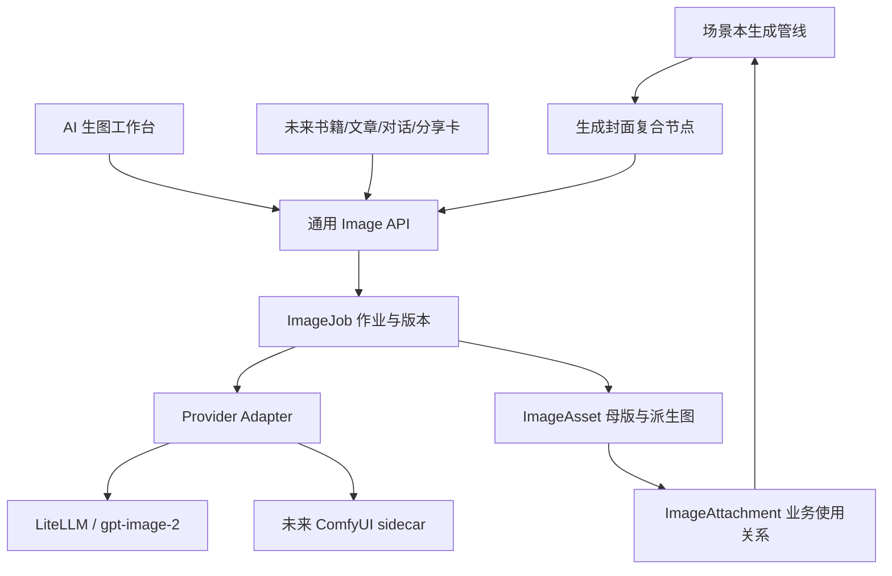

# 生图与视觉资产调研报告

- 状态：调研草案，待 scholar 确认，未进入实现
- 首个使用场景：AI 场景本封面
- 首个候选模型：现有 GPT 供应商中的 `gpt-image-2`
- 目标：一套生图能力同时服务管线节点、独立工作台和未来其它内容模块

> [!important] 调研结论
>
> 首版不应部署或二开一整套开源生图 WebUI，也不应让场景本节点直接调用某个模型。建议在现有 FastAPI、ARQ、PostgreSQL、LiteLLM、管线运行记录和媒体存储之上增加一层很薄的通用生图领域服务，以 `gpt-image-2` 完成首个适配。复杂本地模型和图工作流以后通过隔离的 ComfyUI sidecar 接入。
>
> 场景本业务拓扑只展示一个复合的「生成封面」节点；节点内部可以有提示词构建、生成、校验、派生尺寸和发布等图像子流程。这样既保留业务拓扑的可读性，也为以后复用完整生图流程留下接口。

## 1. 问题与目标

当前场景本只有确定性渐变和 emoji，没有真实封面。用户希望创建场景本时，管线能根据场景语义自动写提示词并生成不违和、舒适且能表达场景含义的封面；生成结果直接出现在拓扑节点中，不满意可按原提示词再生成，也可修改提示词、用途和规格后生成新版本。

这不是一个只服务场景本的按钮。若把模型调用、提示词、图片保存和版本历史写死在场景模块里，后续书籍缺省封面、文章首图、对话场景、学习分享卡等需求会重复实现。目标应是建立「通用生图作业 + 视觉资产库 + 业务使用关系」，场景封面只是第一个消费者。

### 1.1 本期调研要回答的问题

1. 现有架构中哪些能力可以复用，哪些必须补齐。
2. 是否应直接采用、二开或部署已有开源生图项目。
3. 场景封面节点、独立生图工作台和图像子工作流如何分层。
4. 提示词、尺寸、候选、版本、资产、成本和失败回退如何定义。
5. 哪些能力进入首版，哪些必须延后。

### 1.2 非目标

- P0 不做任意节点、条件表达式和自由拖拽的通用工作流引擎。
- P0 不部署本地扩散模型、GPU 集群或开放用户安装 ComfyUI custom nodes。
- 不把图片 base64、供应商密钥或长期签名 URL写入业务 JSON、前端状态或管线产物。
- 不默认替换已有真实书籍封面或视频缩略图；仅在缺失或用户明确选择时使用生成图。
- 不承诺不同模型拥有相同的尺寸、seed、透明背景、局部重绘或进度能力。

## 2. 当前产品与架构事实

三张需求截图与当前代码一致：词库卡片依靠 `emoji + color_seed` 生成渐变封面；设置页只有文本 LLM 能力绑定；场景生成过程已进入多域管线，但节点产物仍以 JSON 为主。

| 现状 | 证据 | 对本需求的影响 |
| --- | --- | --- |
| `Wordlist` 没有图片资产关系 | `server/domain/models.py` 的 `Wordlist`；`web/src/lib/api-deck.ts` 的 `Deck` | 需要新增可版本化封面关系，旧渐变仍作 fallback |
| 管线已有 run、step、artifact、重跑和人工确认 | `server/domain/pipeline.py`、`server/domain/models.py` | 可复用运行审计，不另起业务编排系统 |
| `StepArtifact` 声明了 `blob_key`，但 recorder 未自动把大 payload 落媒体存储 | `server/domain/artifacts.py`、`server/domain/pipeline.py` | 图片字节必须先进入 Storage，artifact 只存资产引用 |
| 场景重跑尚未贯通 `config_override` | `server/app/routers/scenario_decks.py`、`server/worker/tasks.py` | 不先补齐，节点中改提示词只是无效 UI |
| 模型配置只有固定文本能力，模型缓存只是 ID 字符串 | `server/domain/credentials.py`、`web/src/lib/api-config.ts` | 需要图像 capability 与真实 Images API 探针 |
| 媒体存储已有安全 key、原子写、范围读取和响应入口 | `server/domain/storage.py`、`server/app/media.py` | 可承载母版和派生图，不另建文件服务 |
| 主导航由同一个 `navItems` 驱动 | `web/src/App.tsx` | 可增加一级「AI 生图」与 `/images` 路由 |

现有「封面不走网络」是已交付需求，不应直接删除。新方案将它改为回退规则：图片加载中、生成失败、预算不足、离线或旧数据没有资产时，继续使用当前渐变和 emoji，保证学习流程不被封面阻断。

## 3. 产品分层



### 3.1 业务工作流

场景本管线建议在 `normalize` 之后增加 `cover_image`。它只依赖场景归一化产物，可与候选词生成链并行；失败时节点标记为可重试的降级状态，不阻断词表持久化、学习和复习。

主拓扑不展开采样、VAE、蒙版或后处理等模型内部细节。普通用户看到的是一张图、当前状态和常用操作；需要排障或高级编辑时，再下钻到该作业的图像子流程。

### 3.2 图像子工作流

通用生图服务内部使用可版本化 recipe 表达以下阶段：

`意图归一化 → 提示词构建 → 生成/编辑 → 文件与规格校验 → 派生尺寸 → 人工选择/发布`

远程 `gpt-image-2` 的 P0 recipe 可以很短；未来接入本地模型后，同一 recipe 可映射成 ComfyUI workflow JSON。业务节点只依赖稳定的 Image API，不感知执行器内部节点。

### 3.3 独立生图工作台

新增一级菜单「AI 生图」，路由暂定 `/images`，包含三个视图：

| 视图 | 首版职责 |
| --- | --- |
| 创作 | 选择用途，填写或自动生成提示词，选择模型支持的尺寸/质量，查看候选并继续生成 |
| 资产 | 浏览母版、派生图、版本、来源与使用位置；选择资产给业务对象使用 |
| 运行记录 | 查看排队、生成中、成功、失败、取消、耗时、实际模型、成本和重试链 |

首屏默认只暴露用途、主题/提示词和生成按钮，高级参数折叠。复杂画布、自由节点编排和本地模型参数不进入 P0。

## 4. 场景封面的完整体验

### 4.1 自动生成

场景归一化完成后，系统读取标题、描述、分类、CEFR、关键词和必要的示例语境，自动确定视觉主体、场景、构图和风格。P0 默认生成 1 张正式候选；首次没有真实封面且候选通过解码、尺寸和安全检查时可自动设为封面。已有封面时，任何重生只产生候选，不自动覆盖当前选择。

### 4.2 节点呈现

`cover_image` 是媒体节点，成功后在拓扑卡片内显示缩略图。点击后抽屉展示：

- 当前大图和候选/历史胶片；
- 自动提示词、用户编辑稿、最终提交稿及模板版本；
- 用途、逻辑比例、实际尺寸、质量、格式、供应商和实际模型；
- 排队、生成、保存、派生图状态，以及耗时、用量、成本和错误；
- 「按原设置重新生成」「修改后生成」「设为封面」「回选」「下载」；
- 支持的模型才显示参考图、蒙版、透明背景、seed 等能力。

生成中只展示后端能够证明的阶段或局部预览，不模拟虚假百分比。OpenAI 支持 0～3 张付费局部预览，自动管线默认关闭；独立工作台可让用户开启。[OpenAI 图像生成指南](https://developers.openai.com/api/docs/guides/image-generation#streaming)

### 4.3 重生、采用与回滚

- 「按原设置重新生成」复制当前有效提示词和参数，新建 job 与 asset。
- 「修改后生成」保存用户编辑稿并生成新版本，不改变旧资产。
- 新版本成功前，列表和详情继续显示当前封面。
- 「设为封面」才更新业务使用关系；回选旧版本不重新调用模型。
- 生成失败、取消或校验失败不覆盖当前封面。
- 使用中的资产不能直接物理删除；先解绑或换图，后台再按保留策略清理孤儿文件。

### 4.4 尺寸与派生图

前端不要求用户理解 CSS 尺寸。用途预设保存「逻辑比例、关键安全区、目标变体」，provider adapter 再选择模型支持的实际规格。

场景卡当前约为 2.1:1～2.8:1，建议把 P0 逻辑用途设为 `scene-cover-wide`：

| 资产 | 建议 | 说明 |
| --- | --- | --- |
| GPT Image 2 母版 | `1536×640`、medium、WebP 或 JPEG | 2.4:1，贴近卡片；宽高均为 16 的倍数 |
| 不支持自定义宽图的 provider | 使用最接近的 3:2/16:9 规格 | 生成后按焦点派生，不让业务层写模型分支 |
| 列表变体 | 约 2.4:1，按实际 DPR 生成 | 保留左上徽标、右下进度环安全区 |
| 详情横幅 | 更宽的裁切或背景扩展变体 | 重要主体留在中央，边缘允许弱细节或渐变延展 |
| 缩略图 | WebP，按节点和资产卡尺寸派生 | 不把母版直接加载到小卡片 |

`gpt-image-2` 支持自定义分辨率，但要求边长为 16 的倍数、最长边不超过 3840、宽高比不超过 3:1，总像素在官方范围内；它当前不支持透明背景。尺寸规则必须由 provider capability 校验，不能散落在页面中。[GPT Image 2 模型页](https://developers.openai.com/api/docs/models/gpt-image-2)；[图像输出设置](https://developers.openai.com/api/docs/guides/image-generation#customize-image-output)

## 5. 默认提示词策略

### 5.1 混合式提示词编译器

系统不应把整段提示词完全交给文本模型自由发挥，也不应只用僵硬的字符串拼接。建议分工如下：

1. 文本模型只根据场景语义生成可画的 `subject` 与 `scene`，避免抽象词和无关装饰。
2. 用途预设确定 `purpose`、构图安全区、比例和裁切规则。
3. 品牌风格预设固定画风、色板、光线和统一程度。
4. 系统约束固定无文字、无水印、无商标、无 UI、无拼贴及安全要求。
5. 编译器按 provider 能力生成最终 prompt，并保存全部中间字段和模板版本。

OpenAI 的提示指南建议按背景/场景、主体、关键细节、约束的顺序组织，并明确用途、构图、光线和情绪；迭代时一次只改变少量视觉变量。这与结构化提示词和版本化编辑相符。[GPT Image 2 提示指南](https://developers.openai.com/cookbook/examples/multimodal/image-gen-models-prompting-guide)

### 5.2 建议字段

`purpose / scene / subject / composition / style / palette / lighting / mood / constraints`

同时保存：

- `intent`：业务用途和场景结构化数据；
- `generated_prompt`：系统自动生成稿；
- `edited_prompt`：用户修改稿，可空；
- `effective_prompt`：实际提交给模型的文本；
- `prompt_source`：`auto | user_edited | copied_from_job`；
- `prompt_template_version`、提示词生成所用的实际模型和 prompt hash。

### 5.3 「自我介绍」示例

```text
Purpose: a wide cover illustration for an English-learning scenario deck about self-introduction.
Scene: two friendly adults meeting for the first time in a calm modern community space.
Subject: one person greeting and introducing themselves while the other listens with an open posture.
Composition: 2.4:1 landscape, one clear interaction in the central safe area; keep the top-left and bottom-right quiet for UI overlays; allow wide cropping.
Style: cohesive soft editorial illustration, rounded shapes, subtle depth, clean and contemporary.
Palette and light: calm teal and blue with one warm accent, soft daylight, medium contrast.
Mood: welcoming, confident, natural and culturally neutral.
Constraints: no text, letters, logos, watermarks, UI, collage, celebrity likeness, exaggerated facial features or awkward anatomy.
```

标题继续由 HTML 渲染，不要求模型把中文或英文标题画进封面，避免文字错误并保持多语言可访问性。

## 6. 通用能力需求

### 6.1 提供商与模型能力

- FR-IMG-001 一份供应商凭据可同时绑定文本与图像能力，不复制或下发密钥。
- FR-IMG-002 增加 `image-generate`、`image-edit` 等语义能力，业务只引用能力别名，不硬编码 `gpt-image-2`。
- FR-IMG-003 模型能力声明至少覆盖 generate、edit、mask、reference images、尺寸、质量、格式、透明背景、候选数、seed、局部预览、最大输入和成本估算。
- FR-IMG-004 UI 根据 capability 动态显示参数；不得把 Stable Diffusion 的 sampler、CFG、steps 或 negative prompt 强加给 GPT Image。
- FR-IMG-005 模型列表中出现某个 ID 不等于能力可用。保存绑定前必须真实调用 Images API，区分认证、端点缺失、参数不支持、内容策略、超时、响应解析和用量缺失。
- FR-IMG-006 首版调用继续经过服务端和现有网关；若当前 LiteLLM 版本或 GPT 中转不能完整代理 Images API，须先形成 ADR 决定升级、固定版本或增加隔离适配器，前端不得绕过。

### 6.2 作业、资产和使用关系

- FR-IMG-007 `ImageJob` 表示一次不可变的生成或编辑尝试，记录 operation、purpose、prompt 各版本、配置、状态、父 job、来源 run/node、实际供应商/模型、外部 request id、usage、cost、耗时和错误。
- FR-IMG-008 `ImageAsset` 表示不可变图片文件或派生图，记录 storage key、SHA-256、MIME、宽高、字节数、候选序号、父资产、焦点、安全状态和来源 job。
- FR-IMG-009 `ImageAttachment` 把资产以 `owner_domain + owner_id + role` 绑定到业务对象；当前使用和历史选择分开，更新当前选择必须原子化。
- FR-IMG-010 图片字节进入媒体存储，数据库和 `StepArtifact` 只保存 asset ID 与可索引元数据；不保存 base64。
- FR-IMG-011 重试只保证网络与写入幂等。用户主动「再生成」即使 prompt 相同也必须新建 attempt，不能被语义缓存吞掉。
- FR-IMG-012 母版与变体使用不可变 key；替换封面通过资产版本或 URL 版本参数刷新缓存，不覆盖原文件。

### 6.3 生成、编辑与复用

- FR-IMG-013 P0 支持文生图、用途预设、系统自动提示词、用户编辑、按原设置重生、版本回选、导出和设为业务图片。
- FR-IMG-014 P1 支持参考图、图生图、连续编辑、批量候选、资产选择器和跨模块复用。
- FR-IMG-015 P2 按 provider 能力增加蒙版重绘、扩图、放大、背景处理、自动质量评估和可版本化 recipe。
- FR-IMG-016 Image API 适合一次生成或编辑；连续对话式编辑可使用 Responses API，但二者必须落入同一 Job/Asset 领域模型。[OpenAI 图像生成指南](https://developers.openai.com/api/docs/guides/image-generation)

## 7. 开源方案调研与采用结论

| 项目 | 可复用价值 | 不直接采用的原因 | 决策 |
| --- | --- | --- | --- |
| [ComfyUI](https://github.com/Comfy-Org/ComfyUI) | workflow JSON、队列、历史、取消、预览、子图、App Mode、庞大节点生态 | GPL-3.0；完整服务和 GPU 栈过重；Partner Node 的 GPT Image 2 认证不等于现有 BYOK 中转 | P2 作为隔离 sidecar/执行器，网络调用，不复制核心与前端 bundle |
| [InvokeAI](https://github.com/invoke-ai/InvokeAI) | Gallery/Board、Canvas staging、候选采用、元数据召回、简化表单 | 完整用户、数据库、队列和 React UI 与本项目重叠；未核实原生 GPT Image 2 完整能力 | 作为产品 UX 和资产模型的主要参考，不整包嵌入 |
| [SwarmUI](https://github.com/mcmonkeyprojects/SwarmUI) | 批量、preset、参数网格、历史与多后端体验 | 面向本地扩散和多 GPU；.NET + Comfy 后端链路更重，且实际部署许可混合 | 仅参考高级参数与批量 UX |
| [Fooocus](https://github.com/lllyasviel/Fooocus) | 少参数先得到可用图、风格预设、结果上的变体动作 | GPL-3.0、SDXL 锁定、Limited LTS | 只参考默认提示词和低认知负担体验 |
| [Diffusers](https://github.com/huggingface/diffusers) | 未来开放权重模型 worker 的推理库 | 不是服务，没有业务队列、资产、历史和权限；模型权重许可另算 | P2 以后按需作为本地 worker 底层 |
| [Gradio](https://github.com/gradio-app/gradio) | 内部模型试验台、Gallery、ImageEditor | 当前产品已有 React；其队列和浏览器历史不是业务事实源 | 仅用于内部 POC，不作为生产模块底座 |

ComfyUI 已提供稳定的 `/prompt`、队列、历史、WebSocket 和 workflow JSON 语义，复杂图流程无需再造；InvokeAI 已证明「候选先进入 staging，用户接受后再成为正式资产」是成熟的创作交互。[ComfyUI 服务路由](https://docs.comfy.org/development/comfyui-server/comms_routes)；[InvokeAI Canvas workflow](https://invoke.ai/features/canvas/run-workflow/)

本项目仍需自行实现的部分只有业务不可外包的边界：用户与权限、场景归属、当前封面关系、资产生命周期、成本审计、能力路由以及现有管线集成。这不属于重复实现图像模型或通用工作流引擎。

## 8. 非功能与安全要求

| 领域 | 要求 |
| --- | --- |
| 长任务 | 创建 job 后尽快返回；worker 异步执行；支持超时、取消、有限重试、并发上限、启动对账和孤儿作业恢复 |
| 可观测性 | 保存来源业务、run/node、阶段、实际模型、request id、延迟、usage、成本、错误分类和重试链 |
| 预算 | 生成前展示估算；限制单 job 候选数和并发；预算耗尽拒绝新付费作业但不影响已缓存封面和学习功能 |
| 内容安全 | 保留提供商安全策略；上传参考图校验 MIME、尺寸、文件头和体积；产物先解码校验再发布；敏感原因只返回必要信息 |
| 密钥 | 只在服务端解密；日志、job、artifact、前端和导出中不得出现密钥或完整认证头 |
| 隐私 | 接入前明确第三方供应商的数据保留与训练政策；含真人参考图时显示上传与处理范围 |
| 性能 | 列表和节点加载派生缩略图并懒加载；母版只在详情或下载时读取；大文件不进入 JSONB |
| 可访问性 | 封面是装饰时不重复朗读标题；独立资产应有基于业务语义生成、可人工修改的 alt text |
| 生命周期 | 候选、已采用、归档与孤儿分开；物理清理有保留期并检查所有使用关系 |
| 供应链 | LiteLLM/ComfyUI/Diffusers 固定版本或 digest；custom nodes 采用 allowlist、固定 commit/hash 和隔离权限；模型权重逐个审查许可证 |

OpenAI 说明复杂图像请求可能耗时接近两分钟，文字和跨代一致性仍有限，因此异步状态、历史版本、无文字默认约束和可重生不是增强项，而是基本能力。[OpenAI 图像生成限制](https://developers.openai.com/api/docs/guides/image-generation#limitations)

## 9. 分期建议

### P0：场景封面闭环

1. 固定并验证 LiteLLM/现有 GPT 中转对 `gpt-image-2` generation、edit、错误、usage 和超时的真实支持。
2. 增加图像 capability、低成本真实探针和能力驱动的配置表单。
3. 落地 ImageJob、ImageAsset、业务 attachment、媒体访问和派生缩略图。
4. 贯通场景管线的 `config_override`、父 run、实际模型和 prompt 指纹。
5. 增加 `cover_image` 节点、图像 artifact renderer、自动提示词、预览、重生、采用、回选和渐变 fallback。

### P1：通用生图产品化

上线一级「AI 生图」及创作/资产/运行记录；增加资产选择器、参考图、连续编辑、候选比较、用途模板、使用位置、成本与导出。书籍缺省封面、文章首图、对话场景卡和视频自定义海报可逐个接入，但必须显式选择，不批量替换现有真实媒体。

### P2：图像工作流与本地模型

引入版本化 image recipe；以独立 ComfyUI sidecar 执行经过审核的 workflow JSON；增加局部重绘、扩图、放大、质量评估、本地或托管开放模型 adapter。只有专业创作需求被实际验证后，才考虑暴露专用图工作流编辑器。

## 10. P0 验收基线

| 编号 | 验收场景 |
| --- | --- |
| AC-IMG-001 | 新建 AI 场景本后，`cover_image` 节点异步生成与语义相符的候选；词表生成不被图片失败阻断 |
| AC-IMG-002 | 拓扑节点显示缩略图，抽屉能看到有效提示词、用途、规格、实际模型、耗时、成本和错误 |
| AC-IMG-003 | 按原设置重生会创建新 job/asset；旧图仍能查看和回选，当前封面不被覆盖 |
| AC-IMG-004 | 修改提示词后重生，后端运行记录与实际请求一致，不能出现「界面已改、worker 仍用旧值」 |
| AC-IMG-005 | 设为封面后，列表卡片和详情横幅使用合适变体；加载失败或离线时回到渐变 + emoji |
| AC-IMG-006 | 图片字节位于 Storage；数据库、artifact 和 API JSON 中没有 base64；替换后缓存正确刷新 |
| AC-IMG-007 | 模型只显示自身支持的参数；不支持 Images API 的中转会在绑定测试时被识别，而不是运行时静默失败 |
| AC-IMG-008 | 预算不足、超时、内容拒绝、损坏图片、worker 重启和重复回调均不会产生双重扣账式重试或覆盖当前封面 |
| AC-IMG-009 | 供应商密钥不出现在前端、日志、作业元数据、图片元数据和导出文件中 |

## 11. 实施前硬门槛与待确认项

### 11.1 必须先验证

- 当前「GPT 中转」是否完整支持 `/v1/images/generations`、`/v1/images/edits`、base64/URL 响应、multipart mask、usage、错误体和超时。
- 当前 LiteLLM `main-stable` 镜像对应的确切版本；验证通过后固定 tag 或 digest，禁止用浮动镜像直接上线。
- 图像预算是否能在网关层真正拒绝，而不是只做应用内软提示。
- 现有场景重跑的 config、parent run、scope 和实际模型审计补齐方案。
- 场景卡与详情横幅的最终设计尺寸、焦点和裁切规则；用 6～10 个代表场景做视觉样片评审。

这些检查会产生真实模型费用或外部状态，因此本次调研未发起生图调用。

### 11.2 待产品确认

1. 场景首次成功图是否自动设为封面，还是始终等待人工点击「采用」。建议默认自动采用，通过节点随时回选。
2. P0 默认正式质量使用 `medium × 1`；是否提供「低质量草稿 → 确认后 medium」以节省大批量生成成本。
3. 一级菜单名称使用「AI 生图」还是「图像工作台」。建议用户入口叫「AI 生图」，页面标题叫「图像工作台」。
4. P1 首个扩展消费者优先级：书籍缺省封面、文章首图、AI 对话场景卡或学习分享卡。
5. ComfyUI sidecar 是否只服务本地模型，还是也允许高级用户上传经过审核的 workflow JSON。建议首期仅运行管理员发布的模板。

## 12. 对既有需求的影响

确认本调研后，需要同步修订：

- `01.词库与背单词/02.单词本与AI场景本.md`：把「封面不走网络」改为「渐变 + emoji 是永久 fallback，场景本可绑定生成资产」；更新 FR-150/151/155/157 与 AC-05。
- `10.LLM动态配置与成本控制/需求说明.md`：补充图像能力、实际 Images API 探针、图像 usage/cost 和硬预算。
- `12.管线编排/需求说明.md`：增加媒体 artifact、节点按类型尺寸、场景 config override 和复合图像节点；继续维持「不做通用业务工作流引擎」。
- `01.项目文档/03.UI设计/02.信息架构与核心页面.md`：加入一级「AI 生图」和 `/images`；现有文档中的固定导航数量已落后于代码，实施时一并校正。
- `01.项目文档/13.第三方依赖/01.开源参考与复用清单.md`：实施选型确认后记录 ComfyUI、InvokeAI 等项目的参考/部署边界、版本和许可证。

## 13. 与当前《需求说明》的核对

调研期间，工作区并行出现了同目录的 `需求说明.md` 和若干业务实现文件。本报告没有修改这些并行产物。继续实现前，建议先处理以下差异，避免把未经验证的假设固化进迁移和 API：

| 当前草案内容 | 调研结论 | 建议动作 |
| --- | --- | --- |
| AC-105 要求同一提示词与参数第二次生成命中缓存、不调用上游 | 生图是非确定性操作；用户点「重新生成」就是要求新样本 | 区分网络幂等重试与用户主动重生；主动重生必须新建 attempt 并调用模型 |
| 只建 `ImageAsset`，用 asset 状态兼任作业状态 | 失败、排队、取消或无输出的调用没有 asset，无法完整审计与恢复 | 增加独立 `ImageJob`；asset 只表示已成功落盘的不可变文件 |
| `Wordlist.cover_key` 直接指向文件 | 裸 key 难以表达候选、版本、来源、采用、回滚和受保护删除 | 至少改为稳定 asset 关系；通用场景使用 attachment/usage 记录当前与历史 |
| 通过 `/models` 连通测试，端到端出图留到工作台 | 模型 ID 存在不能证明 Images API、multipart、usage 和错误映射可用 | 保存图像能力绑定前提供明确标价、由用户触发的低成本真实探针，并记录结果 |
| 继续使用浮动 `main-stable` | 图像端点对 LiteLLM 版本敏感，浮动升级不可回归 | 实测通过后固定 tag 或 digest |
| `gpt-image-2` 暴露 `input_fidelity` 参数 | 官方文档说明该模型不允许设置此参数，输入保真固定为 high | 从该模型表单和统一必填契约中移除，仅在 capability 支持时显示 |
| 超过 `2560×1440` 被描述为官方“实验性” | 官方当前公开约束是最长边、16 倍数、比例和总像素范围，未见该“实验性”结论 | 若保留上限，标为产品成本/性能限制，不能写成官方事实 |
| Pillow 需要从 dev 依赖提升到主依赖 | `server/pyproject.toml` 已包含 `pillow>=12.3.0` | 删除重复依赖变更 |
| 一期、二期和部分三期都标记“本轮” | 本次用户授权范围是调研，没有授权业务实现或付费生图调用 | 先确认需求、探针费用与 P0 范围，再进入实现 |

其中前三项会直接影响数据迁移与用户能否真正“再生成”，应在继续扩展当前业务代码前优先裁决。

## 14. 资料来源

- [OpenAI：GPT Image 2 模型](https://developers.openai.com/api/docs/models/gpt-image-2)
- [OpenAI：图像生成指南](https://developers.openai.com/api/docs/guides/image-generation)
- [OpenAI：GPT Image 2 提示指南](https://developers.openai.com/cookbook/examples/multimodal/image-gen-models-prompting-guide)
- [LiteLLM：Image Generation](https://docs.litellm.ai/docs/image_generation)
- [ComfyUI：服务路由与消息](https://docs.comfy.org/development/comfyui-server/comms_routes)
- [ComfyUI：GPT Image 2 Partner Node](https://docs.comfy.org/tutorials/partner-nodes/openai/gpt-image-2)
- [InvokeAI：Workflow API](https://github.com/invoke-ai/InvokeAI/blob/main/docs/src/content/docs/development/Guides/workflow-api.mdx)
- [InvokeAI：Canvas workflow](https://invoke.ai/features/canvas/run-workflow/)
- [SwarmUI：API](https://github.com/mcmonkeyprojects/SwarmUI/blob/master/docs/API.md)
- [Fooocus：项目状态与特性](https://github.com/lllyasviel/Fooocus)
- [Hugging Face Diffusers](https://github.com/huggingface/diffusers)
- [Gradio ImageEditor](https://www.gradio.app/main/docs/gradio/imageeditor)
