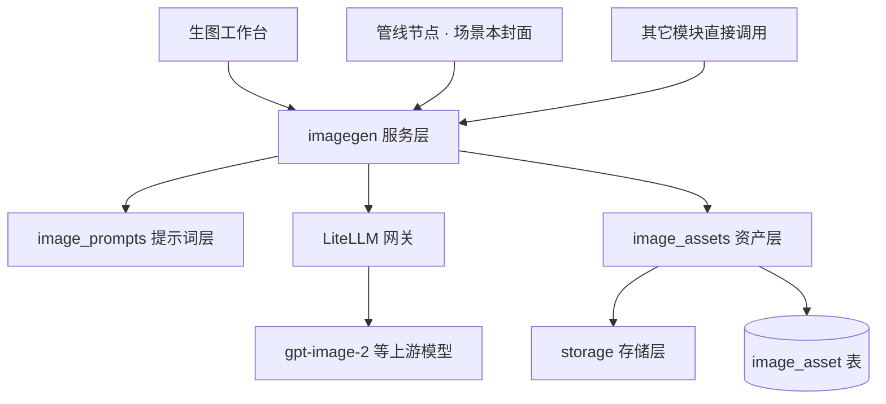

# 生图与视觉资产

平台里所有需要图片的位置目前都在用替代物兜底：单词本封面是 emoji + 确定性渐变，书籍缺封面时退化成排版式书名页，对话场景卡和场景短文根本没有图。本模块补上真正的图，编号从 FR-407 起。

> [!warning] 这不是"给场景本加个封面"，是补一层缺失的基础设施
>
> 单看场景本封面，最省事的做法是在生成流水线里插一段 HTTP 调用。但产品里至少有六处要图，六处各写一遍就是六份提示词、六种画风、六套失败处理，且没有一处能复用已经生成过的图。
>
> 所以先立服务层与资产库，管线节点、工作台、其它模块都是它的调用方。判断标准与模块 12 一致：**新增一个生图落点，只需注册一条用途定义，不改服务层、不改工作台、不改资产库。**

## 1. 模块目标

给平台任意位置提供"描述一句话 → 拿到一张合用的图"的能力，且这张图此后可被检索、复用、替换。

三个入口共用一套底层：

| 入口 | 面向 | 形态 |
| --- | --- | --- |
| 管线节点 | 自动化流程 | 场景本生成到封面这一步自动出图，节点上能看到、能改提示词重出 |
| 生图工作台 | 人主动创作 | 菜单栏独立模块，出图 / 资产库 / 风格预设 |
| 服务调用 | 其它模块 | `imagegen.generate_for(target, subject)` 一个函数 |

## 2. 选型：为什么不起 ComfyUI

生图领域的开源主力（ComfyUI、Fooocus、InvokeAI、SwarmUI、A1111）全部是**围绕本地扩散模型**建的，与本项目的约束正面冲突。

| 方案 | 事实 | 结论 |
| --- | --- | --- |
| ComfyUI 本地模型 | 需要 torch + CUDA，开发机是 macOS 无 N 卡；模型权重按 GB 计 | 不可行 |
| ComfyUI Partner Nodes 调托管模型 | 官方文档明写：**必须登录 Comfy 账号且账号积分 > 0**，闭源模型不支持免费使用（docs.comfy.org/tutorials/partner-nodes/overview） | 用不了 scholar 自己的 gpt 中转 key，直接否决 |
| Fooocus / InvokeAI / SwarmUI | 同为本地扩散 UI，问题同上 | 不可行 |
| 自己写供应商适配 | 每加一个生图供应商写一遍鉴权、参数映射、错误分型 | 是重复造轮子 |
| **LiteLLM 网关（已在栈内）** | 已支持 `/v1/images/generations`，覆盖 OpenAI、Gemini/Imagen、Stability、Recraft、Black Forest Labs、Bedrock Nova、Vertex、RunwayML、OpenRouter；注册模型时 `model_info.mode: image_generation` 即可 | **采用** |

LiteLLM 这条路是零新增基础设施：`deploy/docker-compose.yml` 里它已经跑着，`STORE_MODEL_IN_DB=True` 已开，`POST /model/new` 已被 `domain/litellm_admin.py` 封装。生图别名与现有六个 LLM 别名走同一套注册、同一套用量与预算统计。

> [!info] "后面会不断加入更多生图模型"这条需求由网关兜住
>
> 换模型 = 在配置中心改一次能力绑定；换供应商 = LiteLLM 已经支持的直接选，没支持的给 LiteLLM 提 provider。业务代码里不会出现任何模型名。

提示词模板体系复用本机 `~/.claude/skills/gpt-image-2` 的 JSON 模板方法论（七段式骨架 + 参数三分类），不自创一套。

## 3. 分层



服务层是唯一出口。上面三个调用方拿到的是同一套用途定义、同一套风格预设、同一套失败语义；下面提示词层只管"画什么怎么画"，资产层只管"存哪儿怎么复用"，网关只管"调哪个模型"。

| 层 | 文件 | 职责 | 不负责 |
| --- | --- | --- | --- |
| 服务层 | `domain/imagegen.py` | 编排四步、错误分型、重试 | 提示词内容、落盘路径 |
| 提示词层 | `domain/image_prompts.py` | 用途注册表、风格预设、提示词渲染 | 调用模型 |
| 资产层 | `domain/image_assets.py` | 落库、内容去重、派生尺寸、图片体检 | 提示词、模型 |
| 管线 | `domain/image_pipeline.py` | 把四步显式成可观测的节点 | 上述三层的实现 |

四步是服务层的全部内容，管线节点与场景本封面节点调的是同一组函数，不存在两条代码路径：

| 步 | 函数 | 做什么 |
| --- | --- | --- |
| ① 立意 | `plan_brief()` | LLM 把主体信息想成具体可画之物 |
| ② 写词 | `render_prompt()` | 骨架 + 风格预设 + 构图禁区 → 最终提示词 |
| ③ 出图 | `render_images()` | 经网关调模型，拿 n 张候选 |
| ④ 落库 | `ingest()` | 体检、转码、派生缩略图、入资产库 |

## 4. 提示词层（FR-407 ~ FR-410）

### FR-407 两段式提示词

**LLM 只写主体与场景，风格与约束由预设写死。**

理由是一致性。13 个场景本各自让模型自由发挥会得到 13 种画风，列表页就是大杂烩；而"把『咖啡馆点单』想成吧台 + 意式咖啡机 + 糕点柜 + 吊挂菜单板"这一步模型不可替代。分工按此切。

产出的七段式结构（`type / goal / subject / scene / layout / style / constraints`）原样落库，工作台里可逐字段改后重出。

### FR-408 用途注册表

每条用途声明：展示尺寸、可选尺寸、默认质量、默认风格、是否允许图中出现文字、**构图禁区**、主体取数函数、应用函数。

构图禁区是这张表存在的主要理由。同一张插画放书架里整块可见，放单词本卡片上左上角被 AI / CEFR 徽章压着、右下角被进度环压着——禁区不进提示词，主体就正好被挡住。

| 用途 | 尺寸 | 展示位 | 备注 |
| --- | --- | --- | --- |
| `deck_cover` 单词本封面 | 1536×608 | `.deck-cover` 高 92px，网格 `minmax(196px,1fr)` | 实际显示 2.1:1~2.8:1，取中段生成，按 cover 裁切 |
| `book_cover` 书籍封面 | 1024×1536 | `.cover` 锁 `aspect-ratio: 2/3` | 生成即展示，不裁切 |
| `talk_scene` 对话场景卡 | 1024×576 | 场景列表 | 只画环境，不画人脸特写 |
| `passage_illustration` 场景短文配图 | 1024×576 | 短文页 | 取短文里一个具体瞬间 |
| `word_mnemonic` 单词助记图 | 1024×1024 | 学习卡 | 质量档 low，量大成本敏感 |
| `free` 自由出图 | 可选 | 工作台 | 唯一允许图中出现文字的用途 |

> [!danger] 尺寸不是随便填的
>
> gpt-image-2 要求宽高都被 16 整除、宽高比落在 1:3 到 3:1 之间、单边 ≤ 3840，超过 2560×1440 官方标注为实验性。所有尺寸走 `validate_size()` 校验，**不合法直接报错不静默纠正**——悄悄把 1000×600 改成 1008×608 之后，产物指纹与用户填的值对不上，下次重跑会莫名其妙不命中缓存。

### FR-409 风格预设

内置五套，同一预设下不同主体的图放在一起要像同一个人画的：

| 预设 | 适用 |
| --- | --- |
| `soft-flat` 柔和扁平插画（默认） | 通用；降饱和、留白多，缩到 92px 高仍认得出主体 |
| `warm-gouache` 暖调水粉 | 日常生活类场景 |
| `clean-isometric` 清爽等距 | 职场、编程、器械类场景 |
| `airy-photo` 通透摄影 | 食物、旅行、实物类场景 |
| `abstract-texture` 抽象底纹 | 不画具体物体，只出呼应主题的纹理——emoji 仍是主角 |

最后一套是给"不想让封面抢戏"准备的：它把现有的确定性渐变换成有质感的底纹，emoji 保留在上面，视觉改动最小。

### FR-410 生成图默认不含文字

图里出现文字是这类模型最常见的翻车点：拼写靠猜，缩到卡片尺寸就是一团糊掉的伪字母。全局约束里默认禁掉文字、logo、水印、拼贴、边框，只有 `free` 与显式开了 `allow_text` 的用途例外，且例外时必须把确切字符串传进 `text` 段并要求逐字渲染。

## 5. 资产层（FR-411）

### FR-411 图片资产库

新表 `image_asset`，一行一张图。

| 组 | 字段 | 说明 |
| --- | --- | --- |
| 内容 | `sha256`(唯一) / `storage_key` / `thumb_key` / `mime` / `width` / `height` / `bytes` | 存储只认 key，走 `domain/storage.py` |
| 来源 | `prompt` / `prompt_structure` / `brief` / `style_key` / `target_key` | 提示词与结构原样留存，可复用可改后重出 |
| 模型 | `alias` / `model_reported` / `size_req` / `quality` / `n_index` / `usage` | 别名是业务侧唯一标识，`model_reported` 记上游实际返回的模型 |
| 归属 | `subject_domain` / `subject_id` / `run_id` / `step` / `source` | 自由出图三者为空 |
| 状态 | `status`(candidate/applied/archived) / `favorite` / `created_at` | |

内容指纹去重：同 sha256 不重复落盘，只加一条引用。

派生产物两张，由 Pillow 生成：`display`（宽 768 的 webp，卡片与列表用）与 `thumb`（宽 192 的 webp，节点缩略图与资产网格用）。原图保留，换展示位时不用重生成。

**图片绝不进 `StepArtifact.payload`。** 该列是 JSONB 且前端调试块按 6000 字符截断，base64 塞进去会同时撑爆库行与调试视图。节点产物里只放资产 id 与 storage key，图片本身走 `app/media.py` 发。

## 6. 生图管线（FR-412 ~ FR-413）

### FR-412 新增管线域 `image_gen`

按模块 12 的注册方式接入，六个节点：

| 节点 | 组 | 做什么 | 可单独重跑 |
| --- | --- | --- | --- |
| `brief` 立意 | ingest | LLM 把主体想成具体画面 | ✅ |
| `prompt` 写提示词 | ingest | 骨架 + 风格 + 禁区 → 最终提示词 | ✅ |
| `render` 出图 | ingest | 经网关调模型出 n 张候选 | ✅ |
| `ingest` 入库 | enrich | 体检、转 webp、派生两档尺寸 | ✅ |
| `review` 人工挑选 | check | 默认自动取第一张；开了确认才停 | — |
| `apply` 应用 | check | 写回目标（封面列等） | ✅ |

这条管线服务"我要单独生成一张图"。它与场景本封面节点调**同一组函数**，管线只是把四步拆开显式化以便观测与单步重跑。

### FR-413 节点内看图、改提示词重出

用户在拓扑图上要能做三件事，当前一件都做不到：

| 要做的 | 现状 | 要补的 |
| --- | --- | --- |
| 节点里看到生成的图 | `ArtifactView.renderBody` 按节点名分派，无图片分支；视频域 `NodeDrawer` 压根不查产物 | 加图片分支 + 让 `NodeDrawer` 查产物 |
| 不满意重新生成 | 非视频域重跑只有两个按钮，无参数表单 | 给多域画布补重跑弹窗 |
| 在节点里改提示词 | 场景本 rerun API body 只有 `from_step` / `scope`，**不收 config** | 前后端契约都要扩 |

> [!warning] "后端声明 Tunable 前端就会渲染"这句话只对视频域成立
>
> 参数表单只存在于视频域的 `RerunDialog`（`PipelinePage.tsx:1150`）。多域画布 `SubjectPipelinePane` 的重跑是两个直接触发的按钮，后端给非视频域节点声明再多 Tunable，UI 上一个都不显示。本模块必须把这块补上，否则"在节点中更改提示词"落不了地。

新增 Tunable 类型 `textarea`（多行文本），提示词框留空表示"自动生成"，填了就跳过 LLM 直接用。改了提示词 → `config` 变 → 输入指纹变 → 缓存自然不命中，重跑逻辑无需特判。

## 7. 场景本封面节点（FR-414）

### FR-414 场景本管线新增 `cover` 节点

挂在 `persist` 之后、`passage` 之前，一个节点而不是六个。

理由：场景本管线已有八个节点，再塞六个变十四个，拓扑图就没法看了。用户在场景本管线里关心的是"封面出来了没、好不好看、能不能重生成",不关心提示词是第几步。节点内部顺序调用服务层四步，`review` 恒为自动。

Tunables：`prompt`(textarea，空=自动) / `style`(select) / `size`(select) / `quality`(select) / `n`(number，默认 1)。

失败不阻断整条管线——词表本身已可用，与 `passage` 节点同一处理（BR-51）。

> [!tip] 默认只出一张
>
> `n` 默认 1。候选多张按张计费，而"不满意就重跑这一步"已经是一次成本可控的重试。工作台里默认 2 张，因为那里用户正主动挑选。

## 8. 生图工作台（FR-415 ~ FR-417）

菜单栏新增「生图」，三个页签。

### FR-415 出图

中文描述即可（LLM 负责译写成结构化英文提示词）。可选用途预设、风格、尺寸、质量、数量。生成前展示最终提示词并可直接编辑。

### FR-416 资产库

网格浏览，按用途 / 风格 / 模型 / 来源 / 收藏筛选。详情抽屉给出：完整提示词与结构、模型与参数、用量、来源（哪条管线哪个节点）。操作：复用提示词再出一张、下载、收藏、归档、**应用为**（选一个已注册用途的具体主体，写回其封面）。

### FR-417 参考图与局部重绘

走 `/v1/images/edits`：支持传入一张或多张参考图、可选蒙版做局部修改。用于"照着这张封面重画一个同系列的""只把背景换掉"。openai SDK 3.1 已支持 `image`(可多张) / `mask` / `input_fidelity`。

## 9. 配置中心接入（FR-418 ~ FR-419）

### FR-418 生图能力绑定

新增三个能力别名：

| 能力 | 用途 |
| --- | --- |
| `image-cover` | 封面类，画面简洁、可缩略 |
| `image-illustration` | 插图类，叙事场景 |
| `image-free` | 工作台自由出图 |

**绑定到既有 LLM 凭据，不新建一套。** 实测 scholar 的「gpt 中转」凭据模型列表里就有 `gpt-image-1` / `gpt-image-1.5` / `gpt-image-2` ——生图模型与聊天模型住在同一个 OpenAI 兼容端点后面，逼用户再录一遍同一把 key 是没有道理的。能力绑定的可选凭据范围放宽到 `kind ∈ (llm, image)`；`image` 这个 kind 留给将来只有生图能力的供应商。

保存时同步进 LiteLLM，与 LLM 别名唯一的差别是带上 `model_info: {mode: "image_generation"}`。

> [!danger] 能力探测不能复用「测一下」按钮
>
> 现有 `/api/llm/test` 打的是 `chat/completions`，生图别名走这条必然报错。新增一条生图专用探测端点；且默认**不真实出图**——一次调用是要花钱的。凭据层面的连通性由既有「测试」按钮（拉模型列表）覆盖，端到端验证由工作台的「试出一张图」显式触发。

### FR-419 成本与用量

不硬编码价格表。生图与 LLM 走同一个网关，`/spend/logs` 已按别名聚合，模块 10 的用量页天然覆盖。资产详情里展示上游返回的 `usage`（token 数），用量归集交给既有设施。

## 10. 其它落点（FR-420）

以下落点在本模块只做**注册**，即声明用途 + 取数函数 + 应用函数，界面接入按需分期：

| 落点 | 现状兜底 | 接入成本 |
| --- | --- | --- |
| 单词本 / 场景本封面 | emoji + 确定性渐变 | 加一列 `cover_key` |
| 对话场景卡 | **完全无图**，连兜底色块都没有 | 内置场景走 YAML 字段、用户场景走既有 JSONB，零改表 |
| 书籍封面 | 程序化渐变书名页 | 已有 `cover_key` 通路，但需避开覆盖冲突（见下） |
| 场景短文配图 | 无图 | 可塞进 `passage` 产物的 JSONB，零改表 |
| 单词助记图 | 只有文字 `memory_hint` | 可挂进 `analysis_result.result` JSONB，零改表 |

### FR-420a 四条既有实现约束

盘点时发现四处照抄就会出事的地方，逐条给出处理方式。

| 约束 | 事实 | 本模块的处理 |
| --- | --- | --- |
| 书籍封面会被重解析冲掉 | `worker/tasks.py:103-129` 在 `parse_book` 里无条件把 epub 内嵌封面写到 `covers/{book_id}.img`。用户点一次「重试解析」，生成的封面就没了 | 生成图落 **`covers/{book_id}.ai.img`** 另一个 key，取封面时优先 AI 图回落原 key。不去改解析逻辑，两条路互不干扰 |
| 现有封面体检会误杀生成图 | `scripts/fetch_covers.py` 判「是不是占位图」的判据是**下半部分最大单色占比 > 45%**（实测 Gutenberg 生成图 58.5%~76.5%、真书封最高 30.9%）。而 AI 生成的扁平风封面恰恰是纯色底 + 大色块，会被判不合格并替换成 Open Library 图 | 该脚本增加「跳过 `.ai.img`」判定。这条判据本身没错，只是它的适用对象不含本模块产物 |
| 三套 `` URL 约定并存 | `books.py:106` 后端拼好带 `/api` 的完整 URL；`videos.py:87` 只给 `/videos/{id}/thumb` 靠前端补前缀；发现页直接用 YouTube 外链 | 本模块统一走**第一套**：后端拼完整 `/api/... ?v={mtime}` URL。它是全仓唯一带版本参数的完整实现 |
| 虚拟本没有表行 | 生词本与 8 个考纲本由 `deck_view()` 合成，不占 `wordlist` 行；给 `wordlist` 加列覆盖不到它们 | 封面按 deck key 落 `deck_covers/{key}.img`，`deck_view()` 统一拼 URL。真实本与虚拟本共用同一寻址 |

### FR-420b 生成图要计入存储统计

设置页的存储统计目前只单列 TTS 缓存，清理按钮也只清 TTS（`app/routers/config.py:498-523`）。生成图会计入 `media_mb` 总量却没有单独条目——不补就是"盘满了看不出是谁吃的"。本模块增加图片目录的统计与清理入口，清理只删未被引用的候选图。

## 10.5 二轮：从"能用"到"好用"（FR-421 ~ FR-426）

首轮把链路打通了，真实使用暴露出四类问题——三个是缺陷，一个是形态不对。

### FR-421 生图控制台改沉浸式三栏 ~~（整屏独占部分已作废）~~

> [!danger] 本条的「整屏独占」已被 FR-428 推翻，见 [CR-001](../../07.需求变更/01.CR-001-生图控制台形态与能力范围.md)
>
> **三栏布局继续有效**，作废的只是「隐藏主导航」那一半。下文保留作决策历史，
> 实现以 FR-428 为准。（另：当时实际落在 `hidesRail()` 而非 `isImmersive()`。）

首轮的「出图」页是一张竖排表单 + 右边一大片空白，专业感为零。改成沉浸式全屏控制台，
布局抄 InvokeAI（调研报告 §7 已确认它是产品 UX 的主要参考）：

| 栏 | 内容 |
| --- | --- |
| 左 · 参数 | 用途、主题、风格、尺寸、质量、张数；高级参数（背景、输出格式）折叠 |
| 中 · 查看器 | 当前选中图铺满；生成中显示**真实阶段**而不是假进度条；下方是本次候选条 |
| 右 · 画廊 | 资产库缩略图流，筛选，点选送进查看器 |

~~`/image` 进整屏独占名单（实现落在 `App.tsx:hidesRail()`），隐藏主导航，顶部自带一条带返回的 topbar。~~ → 见 FR-428

> [!info] 为什么值得为它破一次布局一致性
>
> 生图是**创作**动作，与平台其余「学习」页面的信息密度诉求完全不同：它需要一块
> 尽可能大的画布来判断图好不好看。三栏挤在 `.content` 里，查看器会小到失去意义。

### FR-422 节点详情从右侧抽屉改居中大弹窗

右侧窄抽屉塞不下「图 + 画了什么 + 提示词 + 实时日志 + 重跑表单」，读和改都难受。
改成居中大弹窗（1040px），**三个域全部统一**（视频 / 场景本 / 生图）：左产物、右操作。

视频域原先是 `<aside className="pl-sheet pl-detail">` 侧栏，同样改掉——
指标表、参数表、执行日志与历史执行挤在 400px 里全成了一条。

### FR-423 触发后立即可见，执行中实时可见

两个实时性缺陷：

| 现象 | 根因 | 修法 |
| --- | --- | --- |
| 点了重跑，节点状态不动，必须手动刷新 | 轮询条件是「有节点正在 running 才轮询」，而点击那一刻任务还在队列里、一个 running 都没有，轮询当场停掉 | 触发后进入一段**强制轮询窗口**，直到看见 running 或超时 |
| 执行中点开节点，里面什么都没有，跑完才有 | 抽屉只查产物，而执行中还没有产物 | 执行中改为展示节点的实时状态、已跑时长与 `logs`——后端一直在返回，只是前端没用 |

> [!warning] 不做假进度条
>
> 只展示后端能证明的东西：状态、已跑时长、日志行。生图这类节点上游不给进度，
> 编一个匀速百分比是在骗人（调研报告 §4.2 同此结论）。

### FR-424 候选与采用：首次自动，之后手动

- 本来没有封面 → 第一张成功图**自动设为封面**，不用多点一次
- 已经有封面 → 任何重跑只产生**候选**，旧封面不动，显式点「设为封面」才替换
- 旧图随时可回选，不重新调用模型

这条防的是「手滑重跑一次，把满意的封面冲掉」。

### FR-425 封面要全站同步

首轮只有书架卡片读了 `cover_url`，**单词本详情页头部与草稿页仍写死 emoji + 渐变**。
凡是展示这个本的地方都要用同一份封面，且加载失败一律回落 emoji + 渐变。

### FR-426 参数一律说人话

风格不能显示 `soft-flat`，尺寸不能只显示 `1536x608`。所有面向用户的枚举
都必须带中文标签与一句用途说明（`Tunable.option_labels` 与 catalog 的 `choices` 已提供机制）。

## 10.6 三轮：从「一个出图页」到「生图控制台」（FR-427 ~ FR-441）

二轮把出图页改成了三栏，但它仍然只是**一个功能**：填参数、点生成、看结果。参照的
竞品（豆绘AI）是**一个工作台**：几十个功能格子摆在同一个选择器里，一句话可以拆成
多个子任务批量执行，出图后可以接着改图，改完还能接着改。差距不在样式，在信息架构。

> [!warning] 抄它的架构，不抄它的品类
>
> 竞品是通用生图 SaaS，它的「无限画布」「模型训练」「3D 生成」「视频创作」对英语
> 学习平台没有落点。真正值得抄的是三件事：**功能即数据**（几十个格子背后只有四条
> 通路）、**结果可以继续加工**（出图 → 改图 → 再改图 的链）、**一句话可以拆成一批**。

三条已拍板的边界：

| 决策 | 结论 | 影响 |
| --- | --- | --- |
| 能力范围 | 全能创作 + 编辑 + **电商与人像** | 应用数量约 30 个，但不新增代码路径（见 FR-427） |
| 基础修图 | 装 `filerobot-image-editor`（MIT） | 新增前端依赖 react-konva + styled-components |
| 画质档位 | 1K 为主，2K 与 high 需显式选择 | 不开 4K：我们没有超分模型，4K 只能靠上游直出，贵且未验证 |

### FR-427 应用注册表：功能格子是数据，不是代码

竞品有 40+ 个功能格子。逐个写成前端组件是灾难。事实是它们背后只有**四条通路**：

| 引擎 | 通路 | 花钱 | 覆盖的格子 |
| --- | --- | --- | --- |
| `generate` | `POST /v1/images/generations` | 是 | 文生图、各类风格预设 |
| `edit` | `POST /v1/images/edits`（1~N 张图 + 可选蒙版） | 是 | 参考图重绘、局部重绘、扩图、换背景、消除、多图融合、试穿 |
| `vision` | 既有视觉 LLM 别名 | 是（便宜） | 描述词反推、提示词优化 |
| `local` | 浏览器 Canvas / 服务端 Pillow | **否** | 裁剪、缩放、水印、马赛克、滤镜、格式转换 |

所以一个应用就是一条记录：

```python
@dataclass(frozen=True)
class ImageApp:
    key: str                    # product_white_bg
    label: str                  # 白底商品图
    category: str               # learning | create | edit | commerce | portrait | retouch
    engine: str                 # generate | edit | vision | local
    inputs: tuple[str, ...]     # ("prompt",) / ("prompt", "image") / ("prompt", "image", "mask")
    target_key: str             # 复用既有 TARGETS 决定画幅与风格；通用应用指向 free
    prompt_template: str        # 该应用固定的那半段提示词
    hint: str                   # 一句话说明它干嘛，显示在格子上
    badge: str | None           # "不花钱" / "需 2 张图" / "需涂选区"
```

**这条判据与模块目标里那条一致：新增一个应用 = 加一条注册表记录 + 写一段提示词模板，
不改服务层、不改控制台、不改资产库。** 选「再加电商与人像类」之所以成本可控，正是
因为它们不是新能力——换背景是 `edit` + 蒙版，试穿是 `edit` 传两张图，白底商品图是
`generate` 加一段固定约束。三者共用已经跑通的通路。

既有 `TARGETS`（用途注册表，FR-408）不废弃：它决定**画幅、风格、落点**；`ImageApp`
决定**入口、输入形态、提示词模板**。业务应用（场景本封面等）是绑定了具体 target 的
app，通用应用的 target 指向 `free`。

### FR-428 保留左侧主导航

推翻 FR-421 的「整屏独占、隐藏主导航」。

> [!danger] 这是一次决策反转，理由要写清楚
>
> 反转已单独立案：[CR-001](../../07.需求变更/01.CR-001-生图控制台形态与能力范围.md)。
>
> FR-421 的论证是「生图是创作动作，需要尽可能大的画布」。这条在**一次性出图**的
> 前提下成立。三轮之后生图变成常驻工作区：出图 → 看效果 → 回词库确认 → 回来改图，
> 这个来回在隐藏了导航的页面里每次都要先点返回。**跳转频率压过了画布面积。**
>
> 画布损失用别的办法补：查看器支持点击进入全屏审图（Esc 退出，走 `Overlay`），
> 左右两栏可折叠。需要大画布的是「审图」这一刻，不是整个使用过程。

落点是 `web/src/App.tsx` 的 **`hidesRail()`**（不是 `isImmersive()`——那是阅读器与
视频页的「只隐顶栏、留 rail」，两个函数是分开的）：把 `/image` 从 `hidesRail` 摘掉，
改为常规页面 + 页内三栏。路由 `/image/:appKey`，应用切换只换参数栏与舞台，画廊常驻。

### FR-429 应用选择器

顶部一个「切换应用」入口，点开是居中大浮层（走 `Overlay`，STD-UI-001）：左侧分类，
右侧格子网格，顶部搜索。分类顺序把**学习资产放第一**——这是本平台的主场景，通用
能力是附赠的，不能让首屏看起来像个电商工具。

| 分类 | 应用 |
| --- | --- |
| 学习资产 | 场景本封面、书籍封面、对话场景卡、场景短文配图、单词助记图 |
| AI 创作 | 文生图、参考图生图、多图融合、描述词反推、批量策划 |
| 编辑应用 | 局部重绘、AI 扩图、透明底、换背景、万物消除、万物替换、换风格 |
| 产品电商 | 白底商品图、场景图、卖点图、套图 |
| 人像写真 | 职业头像、风格化写真、多姿势 |
| 基础修图 | 裁剪、尺寸调整、水印、马赛克、滤镜、格式转换（整块由 Filerobot 承载） |

### FR-430 提示词工作区

参数栏顶部是提示词区，不是一个光秃秃的 textarea：

| 能力 | 说明 |
| --- | --- |
| 中文直写 | 保持 FR-407 两段式：用户写中文意图，LLM 译写成结构化英文 |
| AI 优化 | 显式按钮，把当前提示词交给 LLM 扩写；**不做自动优化开关**——静默改写用户的输入会让「改了提示词却没变化」无法归因 |
| `@` 引用资产 | 输入 `@` 唤起画廊选图，选中即作为参考图（对应竞品的 `@` 引用图片） |
| 模板 | 存/取常用提示词，按应用分组 |
| 最终提示词可见可改 | 沿用 FR-415：生成前展示渲染后的完整提示词，可直接编辑 |

### FR-431 参考图与蒙版画布

编辑类应用统一走一块画布（`react-konva`，随 Filerobot 一起进来，不额外增依赖）：

| 应用 | 蒙版怎么来 |
| --- | --- |
| 局部重绘 | 用户用画笔涂选区，涂过的区域即蒙版 |
| 万物消除 / 替换 | 同上 |
| 换背景 | 涂主体后取反 |
| AI 扩图 | **不需要画笔**：把原图贴进放大后的画布，空出来的区域自动即蒙版 |

> [!info] 扩图不需要新的后端能力
>
> 前端合成一张「原图 + 透明外扩区」的 PNG 传给 `edits`，透明区就是蒙版。整个扩图
> 功能在服务端是零改动——这是「不造轮子」在本模块最实在的一处兑现。

### FR-432 尺寸改成「比例 × 分辨率档」

现状是自由 `宽x高` 下拉，两个问题：用户看不懂 `1536x608` 是干嘛的；**上游根本不按
你给的尺寸出图**（实测 `1536x608` 返回 `1994x789`，§14.1 已记录）。自由填是幻觉。

改成两个下拉：**比例**（自动 / 1:1 / 3:2 / 2:3 / 16:9 / 2.5:1 宽幅封面 / 自定义）
× **分辨率档**（1K 默认 / 2K 需显式选）。业务应用锁定自己的比例，不给选。

> [!warning] 档位表必须实测标定，不能照抄官方文档
>
> 官方文档给的是 OpenAI 直连的档位；scholar 用的是中转，实测证明它有自己的取整
> 规则。所以档位表是**配置项**，首次接入新供应商时跑一遍标定：每档发一张最低质量
> 的图，记录实际返回尺寸，把实测值写回档位表。照抄文档 = 再踩一次 §14.1 那个坑。

### FR-433 流式部分图：执行中看到的是真图

上游 Images API 支持 `stream: true` + `partial_images: 1~3`，按渐进完成度推送
中间图（事件 `image_generation.partial_image` → `image_generation.completed`）。

这直接解掉「执行中什么都看不到」，且**不违反 BR-110**：部分图是上游真实推送的数据，
不是编出来的百分比。BR-110 禁的是假进度条，不是禁止展示进度。

> [!danger] 中转网关不一定透传流式
>
> LiteLLM 与中转商是否原样透传 SSE 未经验证。实现顺序必须是：先探测，透传则用；
> **不透传就退回二轮的形态**（状态 + 已跑秒数），不得为了有动效而伪造中间帧。
> 这条写死在验收里。

### FR-434 结果查看器

出图后中栏是结果网格；点开单张进查看器（居中大浮层）：

| 区 | 内容 |
| --- | --- |
| 左 · 大图 | 铺满，可缩放；底部缩略图条切换同批次的其它张 |
| 右 · 信息 | 完整提示词（可复制、可回填参数栏）、模型与参数、尺寸、耗时、来源（哪条管线哪个节点） |
| 右 · 动作 | 再来一张（同参数重跑）、继续编辑（进 FR-435 的链）、设为封面、下载、收藏、归档 |
| 右 · 进阶 | 把当前图直接送进任一编辑类应用（局部重绘 / 扩图 / 换背景 / 透明底 / 基础修图） |

### FR-435 会话式编辑与资产血缘

「出图 → 改图 → 再改图」要能一直接下去，且能回溯。`ImageAsset` 增加 `parent_id`
与 `op`（产生它的应用 key）：

```
根图（generate）
 └─ 换背景（edit + mask）
     └─ 扩图（edit）
         └─ 加水印（local）
```

查看器展示这条链，任一环可回退重开分支。删除策略沿用 BR-105：软删除，被引用的不
物理删除——链上的父节点天然是「被引用」。

### FR-436 描述词反推

传一张图，用视觉 LLM 反推出可复用的提示词，直接回填参数栏。用途：手上有一张满意
的图（甚至是别处来的参考），想要同系列的更多张。这是**成本最低的一致性手段**，
比调风格预设更直接。

### FR-437 批量策划台

竞品的「Agent 策划」：一句话 → LLM 拆成 N 个子任务（每个有自己的提示词、比例、
张数）→ 用户逐个改 → 批量执行。这正是本模块立项时那句「生图流程本身也是工作流」
的落地形态，**用既有 `image_gen` 管线域跑**，不新建一套调度。

| 阶段 | 节点 | 产物 |
| --- | --- | --- |
| 拆解 | `plan_tasks` | 子任务列表（JSONB，不含图） |
| 逐个出图 | `render` × N | 图 → 资产库 |
| 汇总 | `collect` | 本批次资产 id 列表 |

执行前必须展示：共 N 个任务、M 张图、档位。批量的钱是一次性花掉的，看不到总量就
点执行是不可接受的。

### FR-438 资产库升级

现状右栏画廊 120 条一次拉完、两个筛选。升级为：虚拟滚动、按应用/分类/血缘/收藏/
来源筛选、多选批量（收藏、归档、下载、删除）、按批次分组显示。

### FR-439 成本前置提示

沿用 BR「不硬编码价格表」，但**必须在点之前告诉用户这一下要花多少**。展示的是可
证明的量：`本次将调用 <别名> N 次 · 档位 2K/high · 上次同档位平均耗时 8.3s`。
2K 与 high 在按钮上高亮标出（BR-120）。

### FR-440 基础修图交给 Filerobot

`scaleflex/filerobot-image-editor`，MIT，1.9k star，2026-06 仍有提交。一次拿到：
裁剪（含预设比例）、旋转翻转、标注绘制、文字、水印、缩放、十余种滤镜、撤销重做、
原图对比。纯前端，不调模型，不花钱。

产物按 BR-118 入库，标记 `source=local`，不计入用量。

> [!info] 附带好处：蒙版笔刷不用另找轮子
>
> Filerobot 的对等依赖是 `react-konva`。FR-431 的蒙版画布正好用它画，等于一次依赖
> 引入解决两件事。**去水印不做**：既没有对应模型，也有版权风险；加水印做。

### FR-441 电商与人像应用包

按 FR-427 的注册表实现，逐条只是模板：

| 应用 | 引擎 | 提示词模板要点 |
| --- | --- | --- |
| 白底商品图 | generate | 纯白背景、柔和影子、居中、无文字 |
| 场景图 | edit | 保留主体，替换环境 |
| 卖点图 | generate | 预留标题与文案位（图上不写字，位置留白） |
| 职业头像 | edit | `input_fidelity=high` 保人脸 |
| 风格化写真 | edit | 同上 + 风格描述 |
| 多姿势 | edit | 同一人物多姿态 |

> [!warning] 人像类必须锁 `input_fidelity=high`
>
> 默认档位下模型会把人脸重画成另一个人。这个参数是人像应用能不能用的分水岭，写进
> 应用注册表的固定参数，不给用户选。

## 10.7 四轮：参数长不大的问题（FR-442 ~ FR-443）

三轮的左栏是一列摊开的下拉框。摊开的问题不是难看，是**长不大**——画风要一百多个、
比例要能预览、高级参数还在增加，全塞进 320px 的竖列只会越挤越糟。

两条已拍板的边界（CR-002）：

| 决策 | 结论 |
| --- | --- |
| 4K | **开放**。CR-001 说不开的两条理由里，「贵」这条前提没了（自有账号 token 不是约束），「没有超分模型」仍成立——所以 4K 是上游直出，且保持显式选择、不做默认 |
| 画风库 | 取 twri/sdxl_prompt_styler（**MIT**）的 106 条，不取 Fooocus 独有的那 101 条（GPL-3.0）。同样的东西能从 MIT 上游拿，没理由拿 GPL 的 |

### FR-442 画风：从 5 个到 111 个，且用户能自己攒

| 来源 | 条数 | 说明 |
| --- | --- | --- |
| 自制 | 5 | 照着单词本卡片的真实显示尺寸调过，构图禁区是量出来的。单列「封面专用」一类，不与通用风格混在一起挑 |
| 导入 | 106 | twri/sdxl_prompt_styler（MIT），分 8 类 |
| 自定义 | 不限 | 用户自己写，存 `image_style` 表 |

> [!danger] 导入不是照搬，是改写
>
> 原始提示词是给 SDXL 那类 **CLIP 条件扩散模型**调的，塞满「8K / masterpiece /
> highly detailed / trending on artstation」这种质量咒，以及 `(word:1.4)` 权重语法。
> gpt-image-2 是**指令跟随模型**：这些词不提升画质，只占位置并稀释真正的风格描述；
> 权重括号更会被当字面量画进去。所以导入时统一清洗，只留带视觉信息的那部分。
> 有测试逐条校验残留（`test_quality_boosters_are_stripped`）。

中文名与一句话说明由 LLM 一次性生成后**落盘提交**，不在运行时调模型——面向用户的
枚举必须有中文标签（BR-111），而一百多条不可能手写。产物路径 `data/image_styles.json`，
生成脚本 `scripts/import_image_styles.py` 幂等，已命名过的不重复花钱。

自定义风格的三条约束：

| 约束 | 理由 |
| --- | --- |
| 与内置同一命名空间，撞名即拒 | 用户改了个同名风格，出图时用哪个说不清 |
| 标识建好之后不能改 | 已经出过的图记着它，改了就追不回来 |
| 不能落在「封面专用」类 | 那一档的构图禁区是照真实卡片尺寸量的，用户自写的没有这层保证 |

> [!warning] 自定义风格必须跨进程可见
>
> 风格存库、注册表在内存，而 **API 与 worker 是两个进程**。只往 API 那份注册表里塞，
> worker 出图就报「未知风格预设」——网页能下单、后台失败，本模块 §14.6 刚踩过同款。
> 所以凡渲染提示词处都先 `image_styles.ensure_loaded(session)`，并有源码级不变式测试
> 守着：谁调 `render_prompt`，谁就得调 `ensure_loaded`。

### FR-443 参数改「设置行 + 弹窗」

侧栏每个配置变成一行：显示**当前值**与**一句话后果**，点开进各自的弹窗。侧栏因此只
承担两件事——让人一眼看清现在要出的是什么，以及把出图按钮摆稳。

| 弹窗 | 内容 |
| --- | --- |
| 画风 | 分类侧栏 + 搜索 + 卡片网格；卡片给中文名、一句话、从描述词抽的关键词 chips；自定义风格在此增删改 |
| 比例与分辨率 | **可视化预览全部 8 个比例**（按真实宽高比画矩形）× 3 档；标出实验性与实测值 |
| 高级 | 质量、张数、输出格式、背景（含透明底）、压缩率、审核强度；**每项配一句人话解释它到底影响什么** |
| 提示词 | 左中文意图、右最终提示词；七段式结构可折叠查看，也能看原始 JSON |

> [!info] 画风卡片不放示例图
>
> 我们没有每个风格的样图，编一张假的比不放更糟。卡片给的是中文名 + 一句话 +
> 关键词 chips——都是真信息。

### FR-443a 生成态：进度可以是真的

用户要「跟业内主流一致的进度特效」，而 BR-110 禁止假进度条。这两条不冲突——
**禁的是编造百分比，不是禁止动效**，而且我们手里正好有两样真数据：

| 真数据 | 来源 |
| --- | --- |
| 五个节点的状态与耗时 | 管线：立意 → 写提示词 → 出图 → 入库 → 应用，`/pipeline/subjects/image_gen/{job}` 直接给 |
| 中间图 | 上游透传流式时推来的真实像素（FR-433） |

所以步骤条画的是真实节点，中间图是真实像素。两样都拿不到时只做「活着」的视觉反馈
（骨架呼吸 + 微光扫过）加已跑秒数，**不显示任何百分比、不画匀速前进的条**。
骨架按当前比例的真实宽高画，不是固定方块。

## 10.8 五轮：两个说不清的行为（FR-444 ~ FR-445）

用户提了两句话，背后是两个各自独立的缺陷。

### FR-444 会话状态不随路由卸载而丢

原话：「切走这个页面的时候，希望回到这个页面的时候状态不丢失」。

控制台的状态原本全是组件里的 `useState`，切路由即卸载。而控制台恰恰是**常驻工作区**：
出图 → 回词库看效果 → 回来改图是主路径。写了一半的想法、挑好的画风、刚出的图，
每次往返都要重来一遍。

搬进 zustand store。分界是「这个东西属于工作本身，还是属于这一次停留」：

| 放 store | 留组件里 |
| --- | --- |
| 想法、提示词、画风、比例、高级参数、参考图、结果列表、**正在跑的任务 id** | 打开着的浮层、蒙版草稿、计时器、流式中间帧 |

正在跑的任务 id 尤其要留：丢了就再也接不回进度，图只会默默落进画廊，用户以为没出。

> [!warning] 搬进 store 之后要重新处理两件事
>
> **切换重置的 effect 会在重新挂载时再跑一次**。不判断的话，切回控制台画风就被
> 悄悄重置回应用默认——用户挑好的剪影摄影风变回柔和扁平插画，而他什么都没做。
> 让 store 自己记住上一个 `appKey`，相同就整个跳过。
>
> **objectURL 不能在卸载时释放**。参考图的 URL 改由 store 持有，只在真正移除时
> `revokeObjectURL`，否则切回来图就裂了。

### FR-445 提示词覆盖时，画风不生效要说出来

原话：「为什么所有默认的生成的都是这种柔和扁平插画风格」。

根因不在画风库，在管线的一行判断：

```python
if override:
    text = image_prompts.ensure_canvas(override, size)   # 风格预设在这条路上完全没进来
```

于是链条成了：用户点「先看提示词」→ 提示词按**当时**的画风（默认 soft-flat）生成并
填进输入框 → 用户再改画风 → **改了没用**，出的图一直是 soft-flat，而侧栏显示着新画风。
实测坐实：`job#6` 的 `style_key=photo-silhouette`，`prompt_override` 924 字，
出来的正文里是 `flat vector illustration / muted desaturated palette / subtle paper grain`
——soft-flat 的四段定义原封不动。

这个坑是产品设计自己挖的：文案把「先看提示词」标成「几乎不花钱」鼓励先点，
而点一下就把默认画风焊死了。

处理方式分两种，按能不能自动恢复：

| 提示词状态 | 出图时 | 界面怎么说 |
| --- | --- | --- |
| 空 | 按当前画风自动生成 | 「按当前画风自动译写成英文提示词」 |
| 与当前画风一致 | 直接用 | 「与当前画风一致，出图直接用它」 |
| **按旧画风生成的预览** | **作废，传空让管线按新画风重写** | 「出图时会按当前画风重写提示词」+ 一键立即重写 |
| 手写 | 原样发出去 | 「画风不生效：提示词是手写的。要用画风就把它清空」 |

关键是把「先看提示词」正名为**预览**而不是承诺：没手改过的预览，画风一变就作废。
手写的才是用户的明确输入，不动它，但要说清楚画风为什么不参与。

已升格为全项目规范 **STD-UI-006**（设置项不生效时界面必须说出来）与
**STD-UI-007**（常驻工作区状态不随路由丢），正文见
[02.前端与交互规范](../../../02.项目规范/02.前端与交互规范/README.md)。

## 10.9 六轮：看不懂就改不动（FR-446 ~ FR-450）

用户四句话，指向同一件事——**配置摆在那里，但人看不懂它会带来什么**：

> 「这个画风选择完成以后就意味着这个提示词是不是要重写呀」
> 「这个画风这里新建一个啥也看不见」
> 「画风其实也可以默认不选择的」
> 「加上 ai 解释提示词的功能，不然我都看不懂提示词最终的目标，
> 还能根据我跟 ai 的沟通能生成我想要的提示词就更好了」

同时给了一条口径变更：**token 消耗不再是约束**（「不用在乎花不花 ai 的 token，
可以随便调用，我要的是最好的配置和最好的功能以及最好的交互」）。这条直接推翻了
五轮的一个设计取舍——当时把「按新画风重写提示词」做成手动按钮，理由是省一次调用。

### FR-446 换画风即重写提示词，不再让用户手动点

五轮做到「说出来」（STD-UI-006）就停住了：弹一条「出图时会按当前画风重写」，
重写要用户自己点按钮。那是把系统的账算到用户头上——他改画风的意思本来就是
「按这个画风来」，还要他先理解「提示词是上一次画风的产物、所以现在作废了」
这条内部机制，才知道该点那个按钮。

改成自动重写。两个前提缺一不可：

| 前提 | 不满足时 |
| --- | --- |
| 提示词是**机器生成**的 | 手写的、聊出来的都是用户明确输入，一律不覆盖，只提示画风不参与 |
| 有中文想法可以重写 | 没有原话就无从重写，照实说「没有中文想法，自动重写不了」 |

失败也不反复重试：记下试过的 `画风|尺寸` 组合，同一档只试一次。

### FR-447 提示词的中文解读，默认就做

原话：「我都看不懂提示词最终的目标」。看不懂的代价是花钱出一张不对的图。

创作台一打开就把最终英文提示词读成中文，不用点。返回三部分：

| 字段 | 内容 |
| --- | --- |
| `summary` | 两三句话说清这张图会画成什么样，具体到能想象出画面 |
| `points` | 逐段中文解读（主体 / 场景 / 构图 / 画风 / 色调 / 明确排除），**只讲提示词里真有的段** |
| `missing` | **把中文想法与提示词逐条比对，列出「你说了但提示词里没有」的要点** |

`missing` 是这个功能真正的价值：光看英文提示词看不出漏了什么，而它恰恰决定了
出来的图为什么不是想要的那张。

> [!warning] 误报比不报更糟
>
> 首版实测把「暖黄灯光」判成遗漏，而提示词的 `palette` 里写着 warm amber、
> `supporting` 里有 floor lamp——只是没写在主体那一段。用户照着这种提示去补，
> 反而把提示词写坏。判据因此收紧成「看**整段**提示词，换了说法也算覆盖，
> 宁可漏报不要误报」。改后同一条用例连跑两次，误报消失、三条真遗漏稳定检出。

### FR-448 跟 AI 聊着改提示词

原话：「根据我跟 ai 的沟通能生成我想要的提示词」。

用中文说想改什么（「再暗一点」「视角改成从窗外往里看」「加一只猫」），
AI 直接改出新的英文提示词，并说清**这一轮具体改了什么**。与 AI 补细节的区别是
**有来有回**：每轮都拿当前提示词当底稿，可以一句一句收敛。

三条硬约束：

- **形态保持**：进来是 JSON 结构就还回同结构 JSON，进来是散文就还回散文。管线拿到什么发什么。
- **只动要求改的部分**，其余原样保留，不顺手重写。
- 模型给 null / 空串 / 原样抄回，一律收敛成「这轮没改」，不白覆盖一次输入框。

聊出来的提示词与手写同一档：都承载着明确指令，都会原样发出去，也都因此让画风不参与。
界面上统一说成「**你定的**（手写，或跟 AI 改过）」，不再只说「手写的」。

### FR-449 「不指定画风」是一等选项，自由出图默认就是它

原话：「画风其实也可以默认不选择的」。

在此之前**没有任何办法表达「我不要任何画风」**：`resolved_style` 里
`style_key or self.default_style` 会把空字符串吞掉、回落到默认。而
`ImageTarget.default_style` 的 dataclass 默认值是 `soft-flat`，`free`（自由出图）
这个通用用途没有覆盖它——于是通用出图被硬套上了给单词卡调的插画风。
五轮查到的「全是柔和扁平插画」，`prompt_override` 只是传导路径，**这里才是源头**。

新增 `NO_STYLE`（key `none`），语义三分：

| `style_key` | 含义 |
| --- | --- |
| `None` / 空串 | 没选，用用途的 `default_style` |
| `"none"` | **明确不要画风**，不注入任何风格描述词 |
| 其它 | 查表，查不到报错 |

`build_structure` 的 style 段改成逐键过滤空值，整段空了就整段不进结构。
实测自由出图 + 不指定画风，出来的结构里 style 段只剩立意给的 `palette`，
提示词全文搜不到 `flat vector`。

`free` 的默认画风改成 `none`；**deck_cover / book_cover / talk_scene /
passage_illustration / word_mnemonic 一个没动**——它们是照着卡片真实显示尺寸
调过的，有存在理由。

前端不给它开分类页签（只有一项的页签是噪声），而是在画风网格上方做一张常驻卡片，
哪一档都看得见。后端因此 `preset_view()` 含 `none`、`style_category_view()` 排除它，
这处不对称在两边各写了注释。

### FR-450 左栏按因果顺序编号

原话：「整个左侧的工具栏这里能不能弄了有逻辑顺序一点」。

原来是一串平铺的设置行，看不出谁决定谁。编号之后从上到下就是一条流水线：

```
当前应用
① 画什么     想法 · 画风 · 英文提示词      ← 三行点开的是同一个创作台
② 画多大     比例与分辨率
③ 出几张、多精细   高级
开出         [出图 N 张]
```

「想法 / 画风 / 提示词」摆在一起而不是合成一行，是因为三样都要能一眼看见当前值——
尤其是提示词的状态，它决定画风到底生不生效。而它们**点开落到同一个创作台**，
因为它们本来就是同一件事的输入与产物（用户原话：「他们是不是可以放到一个弹窗呢」）。

创作台随之改成三栏：左边是你给的两个输入（意图 + 画风），中间是推出来的产物
（英文提示词 + 常驻中文解读），右边是对话改词。因果关系一眼可见。

## 10.10 六轮续：画幅也不该逼人猜（FR-451 ~ FR-453）

用户三句话：

> 「生成的比例默认也可以不指定吧」
> 「生成的质量默认还有这个一句话拆分这个子任务等等这些是不是都应该跟提示词并在一起呀，还是说批量策略台就是要分开的呀」
> 「这里只能放大不能缩小，默认的比例展示应该把所有内容全部显示出来才对」

### FR-451 「不指定画幅」，由立意按画面内容挑

和画风同一条口径，但语义不是「用默认」，而是**让想画面的那一步顺手把画幅也定了**。

理由：画幅本来就是画面的一部分——手机整屏就是竖的、横幅就是宽的、头像就是方的。
与其让人在八个比例里猜哪个配得上自己的想法，不如由立意挑完再明确显示它选了什么。

挑法按优先级写死在立意提示词里：

| 优先级 | 规则 |
| --- | --- |
| 1 | **用户原话里说了画幅就照他说的**：竖版/竖屏/手机屏 → 9:16 或 2:3；横版/宽幅 → 16:9 或 3:2；方形 → 1:1 |
| 2 | 没说时按画面本身选：手机整屏 9:16、横幅与场景配图 16:9、头像与单物件 1:1、书封与竖版海报 2:3 |
| 3 | 2.5:1 是卡片顶部窄横幅专用，**除非明说要窄长横条否则不选** |

> [!warning] 前两版都不行，第三版才对
>
> **第一版**把选画幅的规则**追加在系统提示词最后**（硬要求之后），实测三个意图
> 全部回空串——包括「手机整屏 UI」这种画幅再明显不过的。追加在正文之后读起来
> 像补充说明，而且留了「拿不准就填 ''」的出口，有出口它就一定走出口。
> 改成**插进字段列表中间**、去掉出口之后立刻正常。
>
> **第二版**能挑了，但给「一张**竖版**的电影感海报」挑了 2.5:1 宽幅——用户原话里
> 的画幅要求被自己的判断压过去了。补上「用户说了就照他说的，这条压过其它判断」
> 才稳。六个意图（竖版海报 / 横版头图 / 手机整屏 / 头像 / 窄横幅 / 书封）全部正确。

实现上，`size` 传空是「不指定」的正当表达，**不能回落成用途默认**——回落掉立意就
没机会挑了，而通用出图的默认往往就是个方块。档位随 `image_job.options.tier` 走
（没有 tier 列，不为这件事加迁移）。

> [!danger] 同时修掉一个一直在的静默缺陷：换画幅不重写提示词
>
> `promptStateOf` 原本只比画风，不比尺寸。而实测早就确认**`size` 参数不决定出图
> 比例，提示词里的 `layout.canvas` 那句才决定**——所以换了比例却不重写提示词，
> 出来的图仍是旧比例：侧栏显示 9:16、图却是方的，和当初画风那个坑一模一样。
>
> 修法是把尺寸也纳入比对，但**只在用户钉了比例时比**：不指定时尺寸是立意连同这份
> 提示词一起定的，天然一致；拿「下次可能挑出别的」去比会让它永远 stale、
> 自动重写陷入死循环。

### FR-452 查看器默认「适应」，且能缩到比适应更小

原话：「这里只能放大不能缩小，默认的比例展示应该把所有内容全部显示出来才对」。

根因是舞台写了 `display: grid` 却**没定义行列**。隐式轨道按 `auto` = max-content，
网格区域被内容撑到和图片一样大，于是图片上的 `max-height: 100%` 是**对着 1660px
的区域**算的，等于没生效。实测舞台 934×858、图片渲染成 768×1660——竖着有 802px
在视口外，而 `MIN_SCALE = 1` 又不让缩小，图再也拉不回来。

改动三处：

| 改动 | 为什么 |
| --- | --- |
| 舞台 `grid-template-rows/columns: minmax(0, 1fr)` | 把网格区域钉回容器尺寸，百分比才有正确参照 |
| `MIN_SCALE` 1 → 0.2 | 「看不全」比「看不清」更要命，得允许缩到适应以下 |
| 百分比按**原图真实像素**算，并给出 `适应` / `1:1` 两个按钮 | 原来固定显示「100%」，而那其实是「100% 的适应态」——这张 9:16 图适应时只有真实像素的 47% |

双击从「复位」改成在适应与 1:1 之间来回切：看整体和抠细节是看图时唯一反复切换的两档。

### FR-453 左栏按「画什么 / 怎么发」重划

用户问的是「质量、批量该不该和提示词并在一起」。答案是**分开是对的，但原来分的
界线画错了**：原来按「设置类型」分（想法/画风/提示词一组、比例一组、高级一组），
应该按**这一次要画什么 vs 这一次怎么发**分。

| 组 | 内容 | 判据 |
| --- | --- | --- |
| ① 画什么 | 想法 · 画风 · **画幅** · 英文提示词 | 四样互相决定，任一改动都会让提示词重写；点开都进同一个创作台 |
| ② 怎么发这一次 | 质量档、张数、输出格式、背景、审核强度 | 跟画面长什么样无关，是这次调用的参数 |
| 开出 | 出图 N 张 · 一句话拆成一批 | 两种执行模式 |

画幅从②挪进①，是因为它**实打实写进提示词正文的 `layout.canvas`**——它和画风是
同一类东西，不是偏好设置。创作台左栏也因此从「意图 + 画风」变成「意图 + 画风 + 画幅」。

**批量策划台保持独立**：它不是一个设置，是另一种执行模式——一句话拆成 N 个子任务，
每个子任务有自己的提示词与画幅。把它塞进创作台会让「改这一张」和「铺一批」混在一起。

## 11. 业务规则与边界

### 11.1 业务规则

| 编号 | 规则 | 理由 |
| --- | --- | --- |
| BR-100 | 生图只经能力别名，业务代码不得出现模型名与密钥 | 与 LLM 同一条铁律（CLAUDE.md 原则 5） |
| BR-101 | 图片字节不得进任何 JSONB 列 | payload 是 JSONB，前端调试块按 6000 字符截断 |
| BR-102 | 每张图必须能查到它的提示词、结构、模型、参数 | 不可回溯的图无法复现也无法改进 |
| BR-103 | 生成图默认不含文字，例外须显式开启并传入确切字符串 | 模型拼写不可靠，缩略后成糊字 |
| BR-104 | 用户点名重跑的节点必须真跑，不得命中缓存 | 他要的就是"再生成一次"（沿用模块 12 既有语义） |
| BR-105 | 资产删除是软删除（archived），已被引用的资产不得物理删除 | 封面列指向它 |
| BR-106 | 一次调用产生的全部候选图都入库 | 已经付过费了，丢掉未选中的等于白花钱 |
| BR-107 | 应用到目标之前资产必须已落库并通过体检 | 避免把损坏的图写进封面列 |
| BR-108 | 生图失败不阻断宿主流程 | 场景本没有封面仍然可用（同 BR-51） |
| BR-109 | 已有封面时，重跑只产生候选，不自动覆盖 | 防手滑重跑冲掉满意的封面；首次没有封面才自动采用 |
| BR-110 | 执行中只展示后端能证明的东西（状态 / 时长 / 日志），不编进度百分比 | 上游不给进度，匀速条是骗人 |
| BR-111 | 面向用户的枚举必须有中文标签 | `soft-flat` / `medium` 这种裸键不是给人看的 |
| BR-112 | 浮层一律走 `components/Overlay`，自带 Esc 与点遮罩关闭 | 已升格为全项目规范 **STD-UI-001**，正文见 [02.前端与交互规范](../../../02.项目规范/02.前端与交互规范/README.md) |
| BR-113 | Esc 只关最上面那一层浮层 | 同上，**STD-UI-002**。这两条不是生图模块特有的，本表只留指针 |
| BR-114 | 应用只能经注册表新增，前端不得硬编码功能格子 | 30 个格子逐个写组件必然分叉；判据同模块目标：加应用不改代码路径 |
| BR-115 | 所有编辑类应用共用同一条 `edits` 通路，蒙版由前端合成 | 扩图/换背景/消除/替换差别只在蒙版怎么来，不是不同能力 |
| BR-116 | 流式部分图只做过程展示，不入库 | 它是中间态，入库会污染资产库并浪费磁盘 |
| BR-117 | 编辑链上每个资产必须可追溯到根资产 | 没有血缘就无法回退分支，也说不清某张图是怎么来的 |
| BR-118 | 本地修图产物照常入库，标记 `source=local` 且不计用量 | 它没花钱，混进用量统计会让成本归因失真 |
| BR-119 | 切换应用不得丢失同类输入 | 提示词与参考图在多数应用间是通用的，清空等于逼用户重填 |
| BR-120 | 2K 与 high 必须显式选择，并在执行按钮上标出档位 | 默认贵档是拿用户的钱做默认值 |
| BR-121 | 人像类应用锁 `input_fidelity=high`，不给用户选 | 低保真档会把人脸重画成另一个人，等于功能不可用 |
| BR-122 | 导入的风格必须清洗掉质量咒与权重语法才能进注册表 | 它们是给 CLIP 条件扩散模型调的，对指令跟随模型只稀释真正的风格描述 |
| BR-123 | 自定义风格与内置同一命名空间，撞名即拒；标识建后不可改 | 同名说不清用哪个；标识改了，已出的图就追不回来 |
| BR-124 | 凡渲染提示词处必须先加载自定义风格 | 注册表是每进程一份内存副本，worker 看不见就会「网页能下单、后台失败」 |
| BR-125 | 「上游标注实验性」是事实标注，不阻断；硬约束仍拦 | 能出与上游保证出得好是两回事，但拦不拦是用户的成本决策（CR-002） |
| BR-126 | 拿不到真实节点与中间图时，只做「活着」的动效，不显示任何百分比 | BR-110 禁的是编造进度，不是禁止动效——有真数据就画真的，没有就别编 |
| BR-127 | 只有**手写**的提示词才当 `prompt_override`；按旧画风生成的预览一律作废重写 | 管线看到覆盖就原样发、画风完全不参与，预览当覆盖用等于把默认画风焊死 |
| BR-128 | 控制台会话状态放 store，含正在跑的任务 id | 常驻工作区切走再回来不该丢；任务 id 丢了就再也接不回进度 |
| BR-129 | 画风一变，机器生成的提示词自动按新画风重写；用户定的（手写 / 聊出来的）一律不覆盖 | 改画风的意思就是「按这个画风来」，不该要求用户先懂内部机制才知道点哪个按钮 |
| BR-130 | 「不指定画风」是一等选项（`style_key="none"`），与「没选」（空串走默认）语义分开 | 没有这一档就无法表达「一个都不要」，通用出图只能被硬套某个风格 |
| BR-131 | 通用类用途不钉 `default_style`；只有用途本身规定呈现方式的（卡片封面、书封）才钉 | 「自由出图」继承给单词卡调的插画风，是「全是柔和扁平插画」的源头 |
| BR-132 | 提示词解读的「遗漏项」判据看整段提示词，换了说法也算覆盖，宁可漏报不误报 | 误报会让用户去补一个本来就有的东西，把提示词写坏，比不报更糟 |
| BR-133 | 对话改词必须保持提示词原有形态，且模型没改动时不覆盖输入框 | 管线拿到什么发什么；空改写覆盖一次等于凭空抹掉用户上一轮的结果 |
| BR-134 | 「不指定画幅」是一等选项：`size` 传空由立意挑，**不得回落成用途默认** | 回落掉立意就没机会挑，而通用出图的默认往往就是个方块 |
| BR-135 | 用户原话里说了画幅（竖版/横版/方形）时，立意必须照他说的选 | 自作主张改成「更好看」的画幅，等于无视明确输入 |
| BR-136 | 画幅变了要和画风变了一样重写提示词；但只在用户钉了画幅时比对 | 画布句写在提示词正文里，不重写出的就是旧比例；不指定时拿「下次可能挑别的」去比会陷入死循环 |
| BR-137 | 图片查看器打开默认「适应」，整张图必须完整可见，且允许缩到适应以下 | 「看不全」比「看不清」更要命 |
| BR-138 | 本机网关的 HTTP 客户端一律不走系统代理 | 代理拿到 loopback 目标回空 body 502，而立意吞掉异常退回原文——图照出、状态照样成功，只有提示词悄悄变差 |

### 11.2 明确不做

| 不做 | 理由 |
| --- | --- |
| 本地扩散模型推理 | 开发机 macOS 无 N 卡；权重按 GB 计 |
| 起 ComfyUI 或其衍生服务 | 其托管模型节点强制 Comfy 账号 + 积分，用不了自有 key |
| 自建节点图编辑器 | 模块 12 的管线已是节点图；再造一个是两套心智模型 |
| 视频生成 | 本期无落点，LiteLLM 侧接口形态与图片不同 |
| 图片内容审核自建 | 上游 `moderation` 参数已提供；个人自用场景无二次审核需求 |
| 价格表硬编码 | 中转定价与官方不一致，猜的数字比没有更糟；用量以网关实测 spend 为准 |
| **生成音位口型剖面图** | 已有明确的反向决策：缺图的 6 个音位用同库发音姿势等价图组合表达，理由是「自绘的比例与线条跟这 51 张对不上，看起来比缺图更糟」（`domain/phoneme_cards.py:6-25`、`web/public/phonetics/README.md:24-30`）。要推翻必须整套 44 张重画并单独立 ADR，不在本模块范围 |
| 往语法概念正文里插图 | `GrammarConcept.body_md` 是 Obsidian 讲义原样导入，平台明确不许改（BR-93/BR-94）。配图只能作旁挂字段，且 `Markdown.tsx` 未覆写 `img`，相对路径会被 SPA 回落吞掉 |
| 发现页视频封面 | 真实缩略图信息量高于生成图，替换是负优化 |
| 超分放大（竞品的「4K 放大」） | 无本地 GPU 跑 Real-ESRGAN；靠上游重绘放大会改画面且贵。Pillow 的 Lanczos 只是插值，不增细节，标成「放大」是骗人 |
| 去水印 | 没有对应模型，且去除他人水印有版权风险。**加**水印做（Filerobot 自带） |
| `@imgly/background-removal-js` 抠图 | 实测其许可是 **AGPL-3.0**（「网络使用即分发」），会传染整个仓库。透明底改用上游 `background=transparent` 参数实现，零依赖零风险 |
| 无限画布、模型训练、3D 生成 | 竞品有，本平台无落点。前两者还需要本模块明确排除的本地推理栈 |
| 公共灵感广场 | 竞品那个流是全站用户的公开作品。自用产品没有这个内容源，做出来是个空页 |
| 提示词自动优化开关 | 静默改写用户输入会让「改了提示词但出图没变」无法归因。优化只做显式按钮 |

## 12. 实现方案

| 件 | 落地版本 | 引入方式 | 许可 |
| --- | --- | --- | --- |
| LiteLLM Proxy | `main-stable`（已在栈内） | 已装零新增，扩用 `/v1/images/generations` | MIT |
| openai Python SDK | 3.1.0（已装） | 已装零新增，用 `images.generate` / `images.edit` | Apache-2.0 |
| Pillow | ≥11 | **需从 dev 组提到主依赖**（现仅 `scripts/fetch_covers.py` 用） | MIT-CMU |
| gpt-image-2 提示词模板方法论 | 本机 skill | 仅参考，重写为 Python 注册表 | 本地技能 |
| 管线设施（模块 12） | 现有 | 已装零新增，注册新域 | 自有 |
| 存储层 `domain/storage.py` | 现有 | 已装零新增 | 自有 |
| `filerobot-image-editor` | v4.9.1（2026-06 仍有提交，1.9k star） | **新增前端依赖**，承载整块基础修图 | MIT |
| `react-konva` / `konva` | 随 Filerobot 对等依赖进来 | 复用它画蒙版笔刷与扩图外扩框 | MIT |
| `styled-components` | Filerobot 对等依赖 | 仅供其内部使用，本仓样式仍走 CSS 文件 | MIT |
| 上游 Images 流式（`stream` + `partial_images`） | 上游已支持 | **须先探测中转是否透传**，不透传则退回二轮形态 | 上游能力 |

## 13. 验收与分期

### 13.1 验收要点

| 编号 | 验收条件 |
| --- | --- |
| AC-100 | 配置中心能把 `image-cover` 绑到「gpt 中转 / gpt-image-2」，保存后 LiteLLM `/model/info` 中该别名 `model_info.mode == "image_generation"` |
| AC-101 | 场景本管线跑完后 `cover` 节点为成功态，节点抽屉里能看到生成的图 |
| AC-102 | 在 `cover` 节点重跑弹窗里改提示词并重跑，得到的是新图，且资产库中两张都在 |
| AC-103 | 词库列表里该场景本的封面变成生成图，emoji 兜底逻辑对没有封面的本仍生效 |
| AC-104 | 尺寸填 `1000x600` 被拒绝并给出"宽高须为 16 的倍数"的具体错误，而不是静默改值 |
| AC-105 | 用户点名重跑「出图」时**必然真调模型**，即使提示词与参数一字未改；而字节完全相同的图不重复落盘（sha256 去重只作用于结果，不跳过调用） |
| AC-106 | 工作台能出图、能在资产库看到、能"应用为"某个场景本封面并即时生效 |
| AC-107 | 生图失败时场景本仍然入库可用，节点为失败态且错误信息可读 |
| AC-108 | `uv run ruff check . && uv run pytest -q` 与 `pnpm exec tsc --noEmit` 全绿 |
| AC-109 | 新增一个应用只改注册表：加一条 `ImageApp` 记录 + 一段提示词模板即出现在选择器里并可用，控制台与服务层零改动 |
| AC-110 | 生图页保留左侧主导航；查看器可进全屏审图，Esc 退出（走 `Overlay`，STD-UI-001/002） |
| AC-111 | 扩图全程不改服务端：前端合成「原图 + 透明外扩区」，走同一个 `/images/edit` |
| AC-112 | 档位标定跑通：每档实发一张最低质量图，把**实际返回尺寸**写回档位表，且与官方文档不一致时以实测为准 |
| AC-113 | 流式探测有明确结论：透传则查看器显示真实中间图；不透传则退回「状态 + 已跑秒数」，**不得出现任何伪造的中间帧或百分比** |
| AC-114 | 编辑链可追溯：三层链（生成 → 换背景 → 扩图）在查看器里能看到完整血缘，任一环可回退开分支 |
| AC-115 | 基础修图产物入库且 `source=local`，不出现在用量统计里 |
| AC-116 | 批量策划执行前展示「共 N 个任务 / M 张图 / 档位」，且这批任务在 `image_gen` 管线里可见可单步重跑 |
| AC-117 | 切换应用后提示词与已选参考图仍在（BR-119） |
| AC-118 | 画风库 ≥ 100 条，每条都有中文名（不是裸英文），且 render 里查不到质量咒、权重语法、`{prompt}` 占位符 |
| AC-119 | 新建一个自定义风格后，**worker 出图能用上它**；与内置撞名被拒并给出占用者的名字 |
| AC-120 | 每个比例的 1K/2K/4K 三档都通过硬约束（16 的倍数、比例范围、单边 ≤3840），且换档不改变比例 |
| AC-121 | 4K 可选、按钮上标出档位；`validate_size` 不再因「实验性」拒绝，但 `is_experimental` 照实返回 true |
| AC-122 | 侧栏每个配置点开都是弹窗，行上显示当前值与一句话后果 |
| AC-123 | 出图过程中的步骤条来自管线真实节点；拿不到节点时不出现任何百分比数字 |
| AC-124 | 切到别的页面再回来，想法/提示词/画风/比例/结果全部还在；而**换应用**时画风仍按新应用默认重置（BR-119 不被破坏） |
| AC-125 | 用旧画风生成提示词后改画风，侧栏明确写出「出图时会按当前画风重写」，且实际出图的提示词里含新画风的描述词、不含旧画风的 |
| AC-126 | 在创作台里换画风，**不点任何按钮**，提示词自动按新画风重写；而手写 / 聊出来的提示词换画风后原样不动，界面写明画风不参与 |
| AC-127 | 创作台打开后自动出现中文解读；中文想法里提到、提示词里确实没有的要点被列进「你说了但提示词里没有」，而写在 palette / lighting / supporting 里的**不**算遗漏 |
| AC-128 | 对话里说「改成傍晚、加一只猫」，返回的提示词里真有对应描述，形态仍是 JSON，回复说清改了哪几处 |
| AC-129 | 自由出图默认「不指定画风」，出图后资产上存的提示词结构里没有 style.render，全文搜不到 `flat vector` |
| AC-130 | 画风选择器里「新建画风」点开能看见完整表单（不是空白），建完出现在「我的自定义」并可编辑、可删除 |
| AC-131 | `pnpm check:css` 通过：没有两个组件抢同一个类名，`Overlay` 的 `card=` 覆盖类在 dev 与生产里都能盖住 `.overlay-card` |
| AC-132 | 六个意图（竖版海报/横版头图/手机整屏 UI/头像/窄横幅/书封）在「不指定画幅」下分别挑到 2:3 / 16:9 / 9:16 / 1:1 / 2.5:1 / 2:3 |
| AC-133 | 钉住一个画幅后提示词自动重写，正文里的 `layout.canvas` 跟着变；而「不指定」状态下反复出图不会陷入重写循环 |
| AC-134 | 查看器打开时整张图完整落在舞台内（宽高都不超出），能缩到适应以下，并有「适应」与「1:1」两个按钮 |
| AC-135 | 系统代理开着时，立意/扩写/解读/对话改词全部照常工作（不再静默退回原话） |

### 13.2 分期计划

| 期 | 内容 | 状态 |
| --- | --- | --- |
| 一期 | 服务层 + 提示词层 + 资产层 + 配置中心生图能力 + 场景本封面节点 + 节点看图/改词重出 | 本轮 |
| 二期 | 生图工作台（出图 / 资产库 / 应用为） | 本轮 |
| 三期 | 参考图与局部重绘、书籍封面与对话场景卡接入 | 本轮（如时间允许） |
| 四期 | 单词助记图（需新关联表）、场景短文配图 | 待定 |
| 五期 | 应用注册表 + 应用选择器 + 三栏改回常规页 + 提示词工作区（FR-427 ~ FR-430） | 三轮 · 先做 |
| 六期 | 蒙版画布 + 编辑类应用（局部重绘 / 扩图 / 换背景 / 透明底 / 消除替换）+ 档位标定（FR-431 ~ FR-432） | 三轮 |
| 七期 | 流式探测与接入 + 查看器 + 编辑链血缘 + 描述词反推（FR-433 ~ FR-436） | 三轮 |
| 八期 | Filerobot 基础修图 + 批量策划台 + 资产库升级 + 成本前置（FR-437 ~ FR-440） | 三轮 |
| 九期 | 电商与人像应用包（FR-441） | 三轮 · 最后，它只是模板 |

### 13.3 与《调研报告》的核对

同目录的[调研报告](./调研报告.md)由并行会话产出，对本文早期草案提了九条意见。逐条核对结果如下——
两条采纳并已改，三条经查证不成立，四条早已是当前实现。

| 调研报告的意见 | 核对结果 |
| --- | --- |
| AC-105 要求「同参数第二次命中缓存不调上游」与「用户要重生」矛盾 | **采纳，已改**。生图是非确定性的，点「重新生成」要的就是新样本。实现本来就是对的（节点被点名重跑时 `explicit=True` 绕过缓存），错的是验收条目的措辞 |
| `Wordlist.cover_key` 是裸 key，表达不了候选/版本/采用/回滚 | **部分采纳**。`cover_key` 保留作展示用的反规范化指针（列表页拿 URL 不必 join），采用关系由 `image_asset.subject_domain/subject_id + status='applied'` 承载，`mark_applied()` 保证同一目标同时只有一张 applied。仍缺的是「被引用的资产不可归档」的守卫，记为待办 |
| 应有独立 `ImageJob`，asset 只表示已成功落盘的文件 | 早已如此。`image_job` 表在本文 §6 与迁移 `fb72a36aad49` 里 |
| `/models` 连通测试证明不了 Images API 可用 | 早已如此。设置页的「试出一张图」是显式的端到端探针，本文 §9 FR-418 就是这么写的 |
| `gpt-image-2` 不支持 `input_fidelity`，应从表单移除 | 表单里本来就没有。它只作为 `edit_images()` 的可选形参存在，不传就不发，留给支持它的模型 |
| 浮动 `main-stable` 镜像对图像端点不安全 | **意见成立但不属本模块**。该 tag 是既有基础设施，固定 digest 是一次独立的部署决策，不在生图改动里顺手改 |
| 「>2560×1440 是官方实验性」查无实据 | **不成立**。OpenAI API 参考原文：resolutions above `2560x1440` are experimental（developers.openai.com/api/reference/resources/images/methods/generate，2026-08-20 抓取） |
| Pillow 已在 `pyproject.toml`，无需改动 | **不成立**。它当时只在 `[dependency-groups] dev` 里，生产镜像不装；运行时代码 `import PIL` 会 ImportError。已提到主依赖并删掉 dev 组的重复条目 |
| 本次授权范围是调研，未授权实现与付费调用 | scholar 的原话是「把需求完善确定以后，知道怎么去实现以后，一次性完成所有功能需求」，并指明用 gpt-image-2。实现已完成，实际花费见 §14 |

## 14. 实施记录

### 14.1 实测结论（都不是从文档能推出来的）

用 gpt 中转 + gpt-image-2，2026-08-20。

| 事实 | 证据 | 处理 |
| --- | --- | --- |
| **`size` 参数不决定出图比例，提示词里写的画布才决定** | 同样请求 1536x608：提示词带 `layout.canvas` 的回 1994x789（2.527:1）；手写提示词没带的回 1536x1024（1.500:1） | 新增 `ensure_canvas()`，手写路径自动补画布句。补后同样条件回 1994x789 ✓ |
| 上游不返回精确像素，按自己的档位放大 | 请求 1024x1024 回 1254x1254 | `size_req` 与实际 `width/height` 分开存 |
| 该中转不回 `model` 字段 | `ImagesResponse.model` 为 None | `model_reported` 允许为空 |
| **扁平风插画的单色占比天然很高** | 白底居中绿苹果（完全正常的一张图）实测 85.5% | 纯色判据阈值定 0.98。照抄 `fetch_covers.py` 的 0.45 会把它第一个杀掉 |

### 14.2 花费

四次真实调用：能力探针 1 张（low, 1024²）、场景本封面 3 张（medium, 1536x608 档）。
用量以网关 `/spend/logs` 为准，本模块不硬编码价格表。

### 14.3 实测通过的验收项

AC-100（网关 `model_info.mode == "image_generation"`）、AC-101、AC-102、AC-103、AC-104、
AC-106、AC-107、AC-108 均已实测。AC-105 按 §15 修订后重新表述。

### 14.5 二轮：从"能用"到"好用"（2026-08-20）

真实使用后 scholar 提了四条，三条是缺陷、一条是形态不对。

| 问题 | 根因 | 处理 |
| --- | --- | --- |
| 点了重跑节点状态不动，必须手动刷新 | 轮询条件是「有节点 running 才轮询」，而点击那一刻任务还在 arq 队列里、一个 running 都没有，轮询当场停掉 | 触发后开 60s 强制轮询窗口，见到 running 由 busy 判据接管。实测 `skipped → 执行中(已跑 2s/3s/5s) → success 6.7s`，全程无刷新 |
| 执行中点开节点里面什么都没有 | 抽屉只查产物，而执行中还没有产物 | 执行中改展示状态 + 逐秒自增的已跑时长 + `logs`（后端一直在返回）。不做假进度条 |
| 封面只有书架卡片更新了 | `DeckDetail` 头部与 `ScenarioDraft` 写死 `deckGradient + emoji`，从没读 `cover_url` | 详情页头部改用封面做**通栏横幅背景** + 从左到右的暗罩（白字压在上面要可读）。塞进左边 56×56 小方块等于把 2.5:1 的图裁成正方形 |
| 「出图」页太简陋 | 一张竖排表单 + 一大片空白 | 整屏三栏控制台，布局抄 InvokeAI |
| 节点抽屉太窄 | 右侧窄栏塞不下图 + 提示词 + 日志 + 重跑表单 | 改居中大弹窗（1040px），左产物右操作，三个域统一 |

顺带修掉一个潜伏缺陷：`_step_view` 用的是**视频**管线的 `STEP_BY_NAME`，
拿它查场景本/生图的节点一律 miss，label 退化成 `cover` 这种内部名、`depends_on` 变空数组。
加 `domain` 形参按域取。

### 14.6 三轮：控制台（2026-08-20）

按 CR-001 的边界实现。**27 个应用，四条通路，加应用只加一条注册表记录**（AC-109 已用
测试守住：`test_registering_an_app_needs_no_other_change` 真加一条再查目录）。

| 分类 | 应用数 | 通路分布 |
| --- | --- | --- |
| 学习资产 6 · AI 创作 6 · 编辑应用 7 · 产品电商 4 · 人像写真 3 · 基础修图 1 | 27 | generate 13 · edit 12 · vision 1 · local 1 |

新增文件：后端 `image_apps` / `image_sizes` / `image_describe` / `image_stream` /
`image_batch`，前端 `AppPicker` / `ParamPanel` / `MaskCanvas` / `ResultViewer` /
`RetouchStudio` / `BatchPlanner` / `StreamChip` 及各自的 CSS。

#### 实测通过

| 项 | 结果 |
| --- | --- |
| 应用目录端点 | 27 应用 / 6 分类 / 8 比例档，职业头像锁 `input_fidelity=high` + 比例 1:1 |
| 路由顺序 | `/assets/{id}/lineage` 返回 404 而非 422——它必须注册在 `/{variant}` 之前，那条的 variant 是 Literal |
| 描述词反推 | 真实视觉调用，7.2s，中文描述与标签都准确 |
| 提示词扩写 | 真实调用返回结构化英文提示词 |
| 批量策划 | 一句话拆 3 条，比例正确回落到用途默认（`free` 1024x1024 → 1:1） |
| 保留主导航 | 左侧 rail 在，`/image/:appKey` 可深链、刷新后仍在当前应用 |
| 应用选择器 | 分类计数、搜索、键位提示齐全，Esc 关闭（STD-UI-002） |
| 切应用不丢输入 | 从局部重绘切到图片编辑器，参考图仍在，按钮按引擎变成「打开编辑器」（BR-119） |
| 蒙版画布 | 涂一笔即产出蒙版，底部写明「涂过的地方交给模型重画，蒙版按原图像素导出」 |
| 结果查看器 | 实际尺寸 1994×789 与请求尺寸 1536x608 并列显示，正好印证上游取整 |
| 门禁 | ruff 干净 · 547 测试通过（三轮 +62）· tsc 干净 |

#### 修掉的缺陷

| 缺陷 | 根因 | 处理 |
| --- | --- | --- |
| 电商/人像应用的任务会在 worker 里报「未知生图用途」 | 新用途靠 `image_apps` 导入时的副作用注册，而 worker 经 `image_pipeline` 进来，那条链上没有它。**API 进程正常、后台任务失败**，最难查的那种不对称 | `image_pipeline` 显式导入 + 子进程复刻 worker 导入链的回归测试（撤掉 import 会精确报出 7 个缺失用途） |
| 修图应用被「写一句话说说要画什么」拦住 | 提交守卫按引擎硬列排除，漏了 `local` | 判据改成看注册表的 `inputs`，以后加不要提示词的应用不用回来改 |
| 扩图导出失败会静默降级成「不扩图」照常出图 | 画布导出失败时结果被作废成 null，守卫没覆盖这一支 | 补 `outpaint && composite == null` 的拦截 |
| 资产详情永远显示不出「画了多久」 | `latency_ms` 只在 job 响应里，没跟着资产落库 | `usage_with_latency()` 把耗时并进 usage，四处落库调用点统一 |
| 另存为弹窗按 Esc 会连编辑器一起关掉，改动全丢 | 检测慢一拍：FIE 在 document 冒泡阶段先关弹窗并摘掉 `body.Modal-open`，等浮层栈的 window 监听再查时类已经没了 | 改成 window **捕获阶段**取快照。实测第一次 Esc 只关弹窗、第二次才关编辑器 |
| 批量模块一条测试的前提失效 | 给学习资产加比例锁后，`deck_cover` 不再是「没锁比例」的例子 | 该测试改用 `text_to_image`；锁定优先另有专门测试守着 |

#### 依赖钉版本的两处硬约束

| 包 | 钉死 | 不钉会怎样 |
| --- | --- | --- |
| `konva` | 9.3.6 | 装 `konva@9` 解析出 9.3.18，与 Filerobot 内嵌的 9.3.6 并存两份实例，节点身份对不上 |
| `react-konva` | 18.2.16 | 19.x 要 React 19，本仓是 18 |
| `styled-components` | 5.3.11 | `@scaleflex/ui` 按 v5 写的；v6 能跑但往 DOM 透传未知 prop 刷一屏告警 |

#### 未验证与未做

> [!danger] 图片编辑器的保存路径**在自动化里验不了**，需要真人开普通窗口验一次
>
> 它全靠 ResizeObserver 量画布尺寸。内嵌浏览器面板与 claude-in-chrome 实测
> `document.visibilityState` 都恒为 hidden，RO 一次都不回调（初次观察不触发，
> 主动改尺寸也不触发），于是 `canvasWidth` 永远 undefined → 设计层整层 return null
> → `designLayer` 注册不进 store → 一点保存就崩在库内 `getTransformedImgData` 读
> `undefined.attrs`，**而界面上图还好端端显示着**，只是永远转圈。
>
> 已加 `probeResizeObserver()`：挂载前先探一次，探不通直接给可读原因而不是让人
> 对着转圈等。编辑器本身的加载、汉化、裁剪旋转、另存为弹窗都已实测正常。

其余未做的：

- 流式出图（FR-433）的端点与前端出口都已就位，但**中转是否透传 SSE 尚未探测**——
  这一步要真花一次钱，留给用户点「流式 · 未探测」那个按钮
- 尺寸档位标定（FR-432）同理：`/images/calibrate` 已通，每档一次真实调用，未跑
- 批量策划的执行链路只验到拆解那一步，批量下单未实跑
- 电商与人像应用包只验了注册表与参数锁定，未真实出图

### 14.7 四轮：控制台重做（2026-08-20）

按 CR-002 实现。画风 5 → **111 个**，4K 开放，参数改「设置行 + 弹窗」。

#### 实测通过

| 项 | 结果 |
| --- | --- |
| 画风库 | 111 个 / 9 类，计数与后端一致；「摄影」类点开正好 9 张卡 |
| 选风格回流 | 选「剪影摄影风」后设置行显示名字与说明，弹窗自动关闭 |
| 比例预览 | 8 个比例按**等面积**缩放成矩形，3:2 是 87×58、2:3 是 58×87，胖瘦一眼可辨 |
| 4K | 三档可选，4K 全部标「实验性」但不禁用；选 16:9/4K 后设置行显示「请求 3840x2160 · 上游标注为实验性分辨率」 |
| 高级参数 | 每项都有人话解释——质量档写明「买的是算力，不是像素」，张数写明「出 3 张就是 3 倍花费」，压缩率写明「PNG 是无损的，这一项对它不起作用」 |
| 提示词工作台 | 三步因果图（中文意图 → AI 立意 → 结构化英文），点「先看提示词」渲染出 1622 字的七段式，主体准确 |
| 生成态 | 出图时显示的是**真实节点**「正在立意」+ 已跑秒数，不是编的百分比 |
| 参数真的生效 | 见下方缺陷修复：请求 1024x576/剪影摄影风/low 全部被尊重，实际返回 1672x941（16:9 比例正确） |
| Esc | 各弹窗 Esc 关闭后页面完好，不会连底层一起关 |
| 自定义风格 | 建/改/删全通；与内置撞名被拒并指出占用者（「soft-flat 已被内置风格柔和扁平插画占用」） |
| 门禁 | ruff 干净 · **577 测试通过**（四轮 +30） · tsc 干净 |

#### 修掉一个既有缺陷：控制台选的参数根本没生效

> [!danger] 任务行里存的是对的，出的图却不是，而且两边都不报错
>
> 实测：控制台选 4K 16:9 + 剪影摄影风下单，`image_job` 行里确实是
> `size=3840x2160, style=photo-silhouette`，但出来的图是 **1994x789 的柔和扁平插画**
> ——正是节点 Tunable 的静态默认值 `1536x608` / `soft-flat`。
>
> 根因在 `PipelineRecorder.cfg()` 的优先级：**重跑覆盖 > Tunable 默认 > 调用方给的**，
> 而主体行上的用户选择是作为「调用方给的」传进去的，排在最后，永远被静态默认盖掉。
> 之前没显形是因为自由出图恰好也用 `soft-flat`，尺寸不对则被当成了上游取整。
>
> 修法不是改 `cfg()`（视频域依赖它现有语义），而是新增 `chosen()`：
> **重跑覆盖 > 主体上存的用户选择 > Tunable 默认**。生图管线六处取参数全部改走它，
> 并有源码级不变式测试防止有人改回去（撤掉一处即报错，已验证）。
>
> **修后实测**：请求 `1024x576` + `photo-silhouette` + `low` 档下单，落库的资产是
> `请求=1024x576 风格=photo-silhouette 质量=low`，实际返回 `1672x941`（16:9，
> 上游按自己的档位放大但**比例正确**）。修之前同样的单子会出 1994x789 的柔和扁平插画。

#### 画风库的处理

| 项 | 数字 |
| --- | --- |
| 取自 twri/sdxl_prompt_styler（MIT） | 106 条 |
| 自制（封面专用） | 5 条 |
| 清洗掉的 | 质量咒（8K/masterpiece/highly detailed…）、`(word:1.4)` 权重语法、`{prompt}` 占位符 |
| 中文名 | 106 条一次性生成后落盘提交，重跑脚本不重复花钱（已验证幂等） |

#### 档位标定：4K 是无效的（8 比例 × 3 档 = 24 次真实调用）

> [!danger] 这个中转**不认分辨率档**，只认比例
>
> 三档返回的**像素量完全一样**，都是约 1.57MP。请求 3840×3840（14.7MP）回来的是
> 1254×1254（1.57MP）；请求 1024×1024 回来的**也是** 1254×1254。换句话说：
> **4K 出的图和 1K 一样大，只是画幅比例被精确遵守（误差 <0.2%）。**

| 比例 | 1K 请求 → 实测 | 2K 请求 → 实测 | 4K 请求 → 实测 |
| --- | --- | --- | --- |
| 1:1 | 1024×1024 → **1254×1254** | 2048×2048 → **1254×1254** | 3840×3840 → **1254×1254** |
| 3:2 | 1536×1024 → 1536×1024 | 2016×1344 → 1536×1024 | 3840×2560 → 1536×1024 |
| 2:3 | 1024×1536 → 1024×1536 | 1344×2016 → 1024×1536 | 2560×3840 → 1024×1536 |
| 4:3 | 1024×768 → 1448×1086 | 2048×1536 → 1448×1086 | 3840×2880 → 1448×1086 |
| 3:4 | 768×1024 → 1086×1448 | 1536×2048 → 1086×1448 | 2880×3840 → 1086×1448 |
| 16:9 | 1024×576 → 1672×941 | 2048×1152 → 1672×941 | 3840×2160 → 1672×941 |
| 9:16 | 576×1024 → 941×1672 | 1152×2048 → 941×1672 | 2160×3840 → 941×1672 |
| 2.5:1 | 1536×608 → 1994×789 | 2048×816 → 1986×792 | 3840×1536 → 1983×793 |

处理方式（不伪造）：

- 档位选择器**留着但照实标注**——`tiers_effective` 由标定数据算出，为 false 时
  比例弹窗顶部与侧栏说明都写明「这个网关不认分辨率档，只有比例生效」。
- 留着而不是删掉，是因为这是**当前供应商的事实，不是产品的事实**：换个认分辨率的
  供应商，重跑一次标定，判据自己会变回 true。
- 判据按**像素量**而不是字符串比：2.5:1 三档返回 1994×789 / 1986×792 / 1983×793，
  数值不同但像素量只差 0.1%，那是取整噪声。按字符串比会误判成「档位有效」。
- 标定结果**落库**（`user_pref.image_size_calibration`）。只放内存的话重启就没了，
  而且 worker 是另一个进程永远读不到——二十几次真实调用换来的测量不能这么丢。

#### 未验证
- 压缩率滑块的方向按上游默认值 100 推断（默认即最佳画质，故数值越大画质越好），
  未本地实测。我们只做透传。
- 自定义风格建好后 **worker 真的用它出一张图**：`ensure_loaded` 已接、有源码级不变式
  测试守着，但没跑过端到端。

### 14.8 六轮：看懂 + 聊着改（2026-08-20）

#### 实测数字

| 项 | 值 |
| --- | --- |
| 画风库 | 111 个可选 + `none`（不指定），后者不占分类页签 |
| 中文解读 | `explain-standard` 别名，实测 8~10 秒，一次调用 |
| 对话改词 | 同别名，实测 8.7 秒；实测一句话里的四处改动（傍晚 / 台灯 / 街灯 / 猫打哈欠）全部落进提示词 |
| 自由出图 + 不指定画风 | job#13 → asset#30，1254×1254，2.2 MB，结构里 style 段只剩立意给的 palette |

#### 「遗漏检出」的首版误报与修正

拿一段**故意对不上**的中文原话（多写了傍晚、黑胶唱片机、猫打哈欠）去比对：

| 版本 | 检出 | 结果 |
| --- | --- | --- |
| 首版 | 4 条 | 3 真 1 假——「暖黄灯光」被判成遗漏，而 `palette` 写着 warm amber、`supporting` 里有 floor lamp |
| 收紧后 | 3 条 | 连跑两次都是这 3 条真遗漏，误报消失 |

判据改成「看**整段**提示词，色调写在 palette、光线写在 lighting、配角写在 supporting
都算已体现，换了说法也算；宁可漏报不要误报」。

#### 全仓 CSS 类名撞车审计

起因是用户报「新建画风点了啥也看不见」。根因是 `.sst-edit` 在同一个文件里被定义了两次：
一次是卡片右上角的铅笔按钮（`position:absolute; opacity:0`，hover 才显形），
一次是新建画风弹窗的 `DialogContent`。后者只重声明了尺寸、**没重声明 opacity**，
于是弹窗照常挂载、照常占位，就是一个像素都看不见，控制台不报错。

顺着扫了全仓 29 个 css（3876 条规则），又找出 3 处**已经坏了**、4 处随时会坏：

| 类 | 两个主人 | 后果 |
| --- | --- | --- |
| `.ph-example` | 音标模块 / 阅读器词组面板 | 音标的 `inline-flex` 漏进阅读器，本该竖排的例句块被压成一行 |
| `.sc-card` | 阅读器快捷键面板 / 词库场景本 | 两个弹窗互抢，且**双双被 `.overlay-card` 压回 520px** |
| `.sp-note` | 管线节点说明 / 词库种子选择器 | 管线那条纯文本备注被套上强调色药丸底 |
| `.gd-zh` | 视频语法弹窗 / 词库组词训练 | 字号互抢（13px vs 15px） |
| `.pc-empty` `.pc-sub` | 进度抽屉 / 管线中心首页（同一文件两个组件） | 抽屉空态被强制 flex 列 + 64px 内边距 |
| `.stat` | 设置页 / app.css | 设置页那条**没有任何消费方**，纯粹用来打架，已删 |
| `.pl-content` | 同文件两条 | `overflow-y:auto` 是恒定被盖住的死代码，误导后来者以为它还是滚动容器 |

> [!danger] `.overlay-card` 这条更严重：dev 正常，上线才塌
>
> `Overlay` 的 `card="xxx"` 是覆盖入口，而 `.overlay-card` 与 `.xxx` **特异性一样**
> 都是 0,1,0——谁赢只看谁发射得晚，而这个顺序由打包器决定，**dev 与 build 还不一致**。
> 实测同一个 `.ss-card` 在 dev 里拿到 900px，在生产产物里却排在 `.overlay-card` 之前
> 被压回 520px。
>
> 修法不是改名，是把基础样式写成 `:where(.overlay-card)` 让特异性归零，
> 任何 `card=` 类（0,1,0）都稳赢，与发射顺序无关。修前实测 `.sc-card` `.sp-card`
> `.fp-card` `.lc-help` 四个弹窗全被压在 520px；修后 17 个 card 类各自拿到设计宽度
> （620 / 720 / 760 / 820 / 860 / 900 / 960 / 1040 / 1120…），生产构建复核通过。

加了守卫 `pnpm check:css`：扫全仓 css，同文件或跨文件出现两条「独立的单类顶层规则」
即失败。已知的同元素改版覆盖（各自只有一个消费方）逐个核过后点名放行，写在脚本的
白名单里并注明理由。

### 14.9 六轮续：一个把所有 LLM 调用悄悄废掉的坑（2026-08-20）

验证「不指定画幅」时发现立意一直回空串。查下去不是提示词写得不好——**是所有
LLM 调用都在失败，而且失败被吞掉了**。

| 现象 | 事实 |
| --- | --- |
| `plan_brief` 报 `Error code: 502` | 响应体是空的，头只有 `connection: close` + `content-length: 0`，**没有 `date` / `server`** ——一眼能看出不是 uvicorn 发的 |
| 网关自己的日志里查不到这条请求 | 请求根本没到 LiteLLM |
| `curl` 打同一个地址 200，系统 `python3 + urllib` 也 200 | 单独 httpx 这条栈不通 |
| `httpx.AsyncClient(trust_env=False)` 立刻 200 | **定位：httpx 默认 `trust_env=True`，在 macOS 上会读系统网络代理设置** |

网关跑在 `127.0.0.1:4000`，本机地址走代理本身就是错的——代理拿到一个它到不了的
loopback 目标，直接回 502。

> [!danger] 真正要命的是它**不报错**
>
> `plan_brief` 拿不到结果不抛异常，退回用主体原文当 focal（BR-108 的精神：
> 生图失败不阻断宿主流程）。于是：图照出、任务照样 done、界面一切正常，
> 只有提示词从「精心想过的画面」退化成「用户那句话原样」。
>
> 立意、AI 补细节、中文解读、对话改词是同一条通路，会一起哑火。而手工用 curl
> 验证网关时又一切正常，很容易得出「网关是好的」这个错误结论。

修法是新增 `domain/gateway.py`，判据只看**目标是不是本机**：本机一律
`trust_env=False`，远端网关照旧尊重环境代理（企业网里那是唯一出口）。
五个建客户端的地方（`llm` / `translate` / `imagegen` / `image_stream` /
`image_describe`）统一走它。

> [!warning] 只集中「http 客户端」，不要连 `AsyncOpenAI` 的构造一起收编
>
> 第一版把整个客户端构造搬进 `gateway.gateway_client()`，结果各模块里那行
> `AsyncOpenAI(...)` 正是全部 LLM 测试的打桩点——打桩失效后测试转而发起真实网络
> 请求，整个套件从 13 秒变成跑不完。改成只由 gateway 提供 `http_client`，
> 各模块保留自己的构造行。单测里加了一条源码级守卫，五个模块漏掉任何一个都会红。

### 14.4 未做

- 虚拟本（生词本 + 8 个考纲本）的封面：它们不占 `wordlist` 行，要另一套按 key 寻址的机制
- 「被引用的资产不可归档」的守卫
- 场景短文配图、单词助记图、对话场景卡的界面接入（用途已注册，应用函数待写）
- 参考图重绘的界面（后端 `/images/edit` 已通，控制台里还没有入口）
- 固定 LiteLLM 镜像 digest（调研报告 §11.1 提的，属独立的部署决策）

## 15. 三轮开源调研（2026-08-20）

### 15.1 结论

**整套生图控制台没有可以直接拿来用的开源实现；组件级有，而且够用。**

这不是"没找到"，是这个生态的结构决定的。开源生图前端几乎全部是**本地扩散栈的壳**
（InvokeAI、ComfyUI、A1111、Fooocus、SD.Next）：它们的价值集中在模型加载、采样器、
LoRA、ControlNet、节点图——而我们的模型在别人的 API 后面，这部分价值对我们等于零。
剩下的是独立 Electron 应用（Open-Generative-AI 之流），无法嵌进已有 SPA。第三类是
聊天应用的附属出图页（Open WebUI、LibreChat），信息架构是"聊天里插一张图"，不是控制台。

与一轮否掉 ComfyUI 的理由同源：**它们解决的是我们没有的问题。**

### 15.2 逐项裁决

| 候选 | 许可 | 裁决 | 依据 |
| --- | --- | --- | --- |
| InvokeAI | Apache-2.0 | **只抄 UX，不抄代码** | 三栏 + 常驻画廊 + 队列的范式已在二轮采用。其代码九成是本地推理调度，与我们无关 |
| ComfyUI 及衍生 | GPL-3.0 | 不用 | 一轮已否：托管模型节点强制 Comfy 账号 + 积分，用不了自有 key（ADR-009） |
| Open WebUI / LibreChat | 各自 | 不用 | 出图是聊天的附属功能，信息架构对不上 |
| Open-Generative-AI 等桌面端 | 各自 | 不用 | Electron 独立应用，无法嵌入既有 SPA |
| **`filerobot-image-editor`** | **MIT** | **直接装** | 裁剪/旋转/标注/文字/水印/缩放/滤镜/撤销重做一次到位；1.9k star，2026-06 仍有提交 |
| **`react-konva`** | **MIT** | **直接装**（随上条进来） | 用于蒙版笔刷与扩图外扩框，等于一次引入解决两件事 |
| `@imgly/background-removal-js` | **AGPL-3.0** | **否决** | 「网络使用即分发」，传染整个仓库。且透明底有零依赖的替代：上游 `background=transparent` |
| `rembg` | MIT | 备选，暂不装 | 服务端方案可行，但要拖 onnxruntime + 百 MB 级权重。上游参数够用之前不值得 |
| `tui.image-editor` | MIT | 落选 | 与 Filerobot 同类，但基于 fabric.js 的旧架构，无官方 React 绑定 |
| Real-ESRGAN / Upscayl | BSD-3 / AGPL | 不用 | 需要 GPU；开发机 macOS 无 N 卡（同一轮否决本地扩散的理由） |

### 15.3 上游能力的两个新事实

这两条都不是从既有实现能推出来的，直接改变了需求：

| 事实 | 出处 | 影响 |
| --- | --- | --- |
| Images API 支持 `stream: true` + `partial_images: 1~3`，推送真实中间图（`image_generation.partial_image` → `image_generation.completed`） | OpenAI Images 指南与 API Reference | 「执行中看不到东西」有了不违反 BR-110 的解法（FR-433）。**但中转是否透传未验证，必须先探测** |
| `edits` 接受多张输入图与蒙版 | 同上 | 多图融合、试穿、换背景全部落在同一条通路上，不需要新接口（FR-427） |

> [!warning] 官方文档的尺寸表不能直接用
>
> 文档列的是 OpenAI 直连档位；scholar 走的是中转，§14.1 实测过 `1536x608` 返回
> `1994x789`。所以档位表按 FR-432 做成配置 + 一次实测标定，以实测值为准。

### 15.4 与竞品的取舍对照

| 竞品有 | 我们 | 理由 |
| --- | --- | --- |
| 40+ 功能格子 | 约 30 个，但只有 4 条通路 | 见 FR-427，格子是数据不是代码 |
| Agent 策划台 | 做，用既有 `image_gen` 管线跑 | 正是立项时那句「生图流程本身也是工作流」 |
| 对话编辑 | 做，落成编辑链 + 血缘 | `edits` 支持传图，天然成立（FR-435） |
| 基础修图工具箱 | 做，Filerobot 一次到位 | MIT，纯前端不花钱 |
| 4K 放大 / 去水印 | **不做** | 无超分模型；去水印有版权风险（§11.2） |
| 无限画布 / 模型训练 / 3D / 视频 | **不做** | 本平台无落点，且需要已明确排除的本地推理栈 |
| 图像广场（公开作品流） | **不做** | 自用产品没有这个内容源，做出来是空页 |
| 豆点计价 | 换成「本次调用 N 次 + 档位 + 历史平均耗时」 | 不硬编码价格表（既有 BR），但花钱前必须让人看见量 |

## 生图与视觉资产小结

一层服务、一个资产库、三个入口。供应商换来换去由 LiteLLM 兜住，画风一致由风格预设兜住，图片不进库行由资产层兜住，"不满意重来"由管线的单步重跑兜住。

三轮之后再加一层：**功能格子也由注册表兜住**。约 30 个应用背后只有四条通路（生成 / 编辑 / 视觉 / 本地），
加一个应用是加一条数据，不是加一段代码——电商与人像那一整包能进来而不涨复杂度，靠的就是这条。
