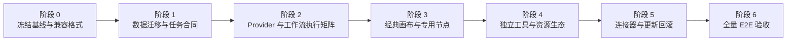

# Infinite-Canvas 全量能力差异调研

- **结论**：lingua-next 已经具备可运行的智能画布和创作工坊底座，但还不能判定为 Infinite-Canvas 全量等价。差距主要集中在双画布模型、经典画布专用节点、部分专用媒体协议与导演交互、任务全生命周期、连接器产品化和更新回滚。
- **源能力基线**：16 个功能域、134 项独立能力、17 组快捷键、12 类菜单/对话框、16 类数据与外部集成。
- **目标现状审计**：按目标代码拆成 12 个功能域、89 项能力单元，其中 55 项闭环实现、27 项部分实现、4 项只有需求、3 项只有占位。该 89 项不是源 134 项的一一映射，不能把 `55 / 89` 当作迁移完成率。
- **底层阻塞（调研基线）**：36 个迁移依赖中有 16 个会直接阻断“功能与交互一致”。其中源画布 JSON/ZIP 兼容和工作流多媒体 typed reference 已在后续实施中关闭，其他依赖仍按本报告逐项验收。
- **需求文档状态需要刷新**：ST-09、ST-15、ST-18、ST-19 已有真实代码，不能继续标为纯“缺失”；相反，部分标为“已有基础版”的工具仍有跨工具参数断链或前端入口缺失。

> [!important] 调研基线与后续实施
>
> 本文第 1 节记录的是最初只读调研快照；其后已进入迁移实施。下文状态表已同步当前代码，初始统计数字仅用于说明当时基线，不应解释为当前完成率。

### 0.1 实施进度补记（2026-08-21）

已关闭的高风险差距：

- 工具目录、REST、画布、工作流统一到服务端 `ToolPluginRegistry` 与同一执行入口；
- 增加持久类型化 DAG、节点输入引用、并行就绪调度、checkpoint、重试、取消与 worker 启动恢复；
- 主画布级联已改为先冻结完整轮次、落点和依赖，再提交一次性服务端 DAG；刷新后从 `StudioFlowRun` 恢复进度和产物，失败续跑保留成功 checkpoint，同签名图片请求只调用一次；
- 工作流图片、视频、音频、文件输入改为 typed reference，不再只解析 `ImageAsset`；
- 增加 Infinite-Canvas JSON/带资源 ZIP 格式识别与导入 adapter，资源按 SHA-256 重建，源节点语义保存在 `source_type/source_payload`；
- 画布到增强、角度、全景、宫格的 `asset` 参数已经接通，`⌘X` 剪切已加入同源快捷键帮助；
- 新增视频抽帧页面，覆盖首帧、当前帧、尾帧、手填时间点、批量抽取和逐项失败；
- Infinite-Canvas v2.1 的 10 条系统提示词已迁入，接口和 UI 保留来源标识；
- 增加持久项目实体、默认项目、项目 CRUD/计数、删除回迁、按项目筛选与跨项目剪切粘贴；画布增加 `classic/smart` 类型并按类型启用两套框选/切线键位；
- Chat、图片、视频、音频合成和工作流已全部进入可撤销 Provider 注册表；配置 API 公开真实挂载操作与运行时代际，准备结果冻结实现和脱敏配置；
- 经典画布生成器输出端口落空会直接创建 Output 并连线；智能画布双击/右键空白使用源项目同款五卡菜单，右键组内创建保留分组上下文；
- 数据库迁移已统一 `studio_media_asset.sha256` 唯一索引，`alembic check` 无漂移。

## 1. 调研边界与方法

本报告以以下快照为准：

| 对象 | 基线 |
| --- | --- |
| Infinite-Canvas | 当前本机工作树；HEAD `1c141a5`，源码存在用户未提交改动，因此本报告描述当前文件系统，不等同于干净提交 |
| lingua-next | HEAD `5bf73e0`；产品实现调研前后无变化，当前工作树只新增本报告 |
| 需求基线 | `17.创作工坊/需求说明.md` v2.1、`成套出图节点.md`、CR-005 |
| 运行时 | 源项目 `127.0.0.1:3000`，目标 Web `127.0.0.1:5173`、API `127.0.0.1:8100` |

采用四种证据交叉核对：

1. 源码静态清点：源项目 13 个页面、经典/智能画布脚本、FastAPI 路由、工作流、提示词模板、Chrome 扩展和 Photoshop UXP；目标 React 路由、Studio 组件、API 客户端、FastAPI router/domain、数据库模型、worker 和工具目录。
2. 本机交互核对：主调研过程实际打开两个项目的工坊首页、画布列表、画布、资产/工作流入口、创建菜单、编辑器和快捷键帮助；并行能力清点仅做静态源码审计，没有另行启动服务。
3. 接口与数据契约核对：画布、节点、任务、资产、provider、工作流、导入导出和连接器的请求/响应及存储结构。
4. 自动化验证：本轮最终复核重新执行 Studio 前端 15 个测试文件、180 项用例，以及后端 13 个相关测试文件、237 项用例，共 417 项，全部通过。本轮未使用真实外部凭据提交生成任务，也未在真实 Photoshop UXP 宿主做端到端验证。

可复核命令：

```bash
cd /Users/your-user/Documents/项目开发/lingua-next/web
pnpm exec vitest run src/features/studio

cd /Users/your-user/Documents/项目开发/lingua-next/server
.venv/bin/pytest -q tests/test_storage.py tests/test_studio*.py tests/test_video_enrich.py tests/test_video_generation.py tests/test_workflow_execution.py
```

未读取 `.env`、API Key、登录态、令牌或源项目用户运行数据。外部提供方只能确认“存在 UI、请求合同和调用分支”，不能在无凭据条件下断言真实服务成功。

## 2. 总体判断

### 2.1 已经成立的底座

lingua-next 不是空壳，以下能力已有真实闭环：

- 自研 DOM + SVG 无限画布，包含平移、指针缩放、小地图、适配、总览、多选、对齐、等距、分组、解组、连接、Shift 切线、拖放/粘贴媒体和上下文菜单。
- 图片、视频、音频、文件统一资产模型，带 SHA-256、存储 key、来源任务、父资产、标签和状态；该数据底座强于源项目以 URL/绝对路径为主的存储方式。
- 图片生成、参考编辑、工作流节点、循环/成套、级联执行、自动保存、乐观锁冲突合并和部分任务恢复。
- 图片预览、裁剪、标注、蒙版、扩图、缩放、宫格拆分/拼接、360 全景。
- 持久 GPT 会话、SSE、多模态图片附件、图片生成工具、停止/重试和输出转交。
- ComfyUI/RunningHub 工作流目录、敏感字段拦截、动态表单、持久任务提交/轮询/下载/恢复。
- Chrome MV3 扩展和 Photoshop UXP 面板已经存在完整客户端与后端连接器契约。

关键证据：`web/src/features/studio/CanvasPage.tsx:1`、`web/src/features/studio/canvasStore.ts:755`、`server/domain/models.py:1469`、`server/domain/workflow_execution.py:90`、`server/app/routers/studio_connectors.py:168`。

### 2.2 仍不等价的根本原因

1. **源项目有两套完整画布产品，目标已区分类型但仍共用渲染器。** 目标现已持久化 `classic/smart`，创建时可选类型，并按类型启用两套框选/切线键位；经典画布的专用节点、菜单和布局仍未从智能画布 renderer 中彻底分离。
2. **目标的节点模型已扩展到 12 类，但专用谱系仍未齐。** `image | video | audio | file | workflow | prompt | llm | modelscope | midjourney | output | loop | group` 已能直接表达 LLM、ModelScope、Midjourney 与 Output；MiniMax H3 与 LTX Director 已在 workflow 节点上补导演时间线语义，两者的空间导演工作台核心均已落地，通用 API 仍复用图片节点，LTX 的右键/外部拖放等外围交互仍待收口。
3. **“注册了 adapter type”不等于“执行器支持”。** Chat、图片、视频、音频合成与工作流现在都会公开实际挂载的 Provider 操作和运行时代际；剩余差距集中在实时音频/ASR/音素对齐是否统一收编、人物资产注册和部分视频协议闭环。
4. **目标的持久任务底座更好，但覆盖不完整。** 工作流和视频可恢复，图片生成/编辑在服务重启或提交前中断场景仍有缺口；统一重试接口会把部分标为 retryable 的任务拒绝为“尚未接入”，且没有统一取消接口。
5. **仍有产品断链。** 跨工具 `asset` 接续和视频抽帧入口已关闭；Chrome/Photoshop 的工坊发现、安装、连接状态与真实宿主 E2E 仍未完成。

## 3. ST-01～ST-20 当前真实状态

状态含义：**已闭环** = 当前入口与核心行为可用；**部分** = 有真实代码但范围/交互/恢复性不足；**占位** = 只有卡片或底层孤立能力；**缺失** = 未找到可用实现。

| 编号 | 工具 | 审计状态 | 当前已有 | 主要缺口 |
| --- | --- | --- | --- | --- |
| ST-01 | 无限画布 | 部分 | `classic/smart` 类型、两套键位、智能画布核心、12 类节点、3 类边、生成/工作流/循环/分组、端口落空自动 Output、导入导出、模板、`⌘X` | 经典画布独立 renderer、完整专用节点谱系 |
| ST-02 | 对话生图 | 部分 | 持久会话、参考图锚定、连续生成 | 完整结果动作、稳定停止、跨页任务恢复、与控制台的无损交接 |
| ST-03 | 生图控制台 | 部分 | 图片部署选择、文/图生图基础链路 | 参数谱系、旧任务配置漂移、来源链路和跨工具接续仍未全闭环 |
| ST-04 | 图片编辑 | 部分 | 预览、裁剪、标注、蒙版、扩图、缩放、宫格；Flux Klein 三参考 Local/ModelScope、LoRA、对比、历史复刻 | 通用 AI 编辑结果与来源节点显式连线仍需确认 |
| ST-05 | 细节增强/超分 | 已闭环 | 通用 AI 细节重绘；本机 Z-Image-Enhance 与可选 SeedVR2 2K/4K 两阶段工作流；前后对比和历史 | 需有真实 ComfyUI 实例后补付费外的端到端生成验收 |
| ST-06 | 角度控制 | 已闭环 | CSS 3D 实时预览、水平/俯仰/距离精确滑杆、中文命令文本、Local 2511/ModelScope 双引擎、持久历史与复刻 | 需有真实 ComfyUI 或 ModelScope deployment 后补付费外的端到端生成验收 |
| ST-07 | 在线/免费生图 | 已闭环 | 独立多平台工作台；OpenAI/Gemini/ModelScope/直连 deployment 与 RunningHub 图片工作流；三参考、尺寸/比例、质量/数量、ModelScope 高级参数/LoRA、持久历史和批量归档 | 需配置真实图片 deployment 或 RunningHub 凭据后补非破坏性端到端生成验收 |
| ST-08 | GPT 创作对话 | 部分 | 会话、系统提示、SSE、20 个图片/文件混合附件及拖放粘贴、对话/图像模型作用域、自动/预设/自定义画幅、生成工具、停止/重试 | Agent 图片编辑、视频生成和工作流工具 |
| ST-09 | 视频生成与导演时间线 | 部分 | OpenAI/火山/即梦原生异步任务与持久恢复；MiniMax H3 分镜导入、每段图/视频/音频参考、入出点、结果回写/恢复、节点内记录/重试、整条时间线本地导出，Assets/Output、播放器、播放头、Video/Refs 拖放轨和四类持久化尺寸调整，以及 RunningHub 固定工作流语义/媒体槽映射；LTX Director 的源节点导入、帧级空隙/裁切中继、局部提示词、参考强度、总帧/秒/FPS、参考图与独立音频轨、资源打包与运行前上传，以及 Prompt Relay 空间双轨、缩放/播放头/循环、推挤拖动、联动裁剪、真实波形/音频预听和轨高持久化；通用视频的首帧/首尾帧/最多 9 张多参考、火山与即梦的最多 3 视频 + 3 音频多模态参考、画幅/清晰度/时长/Seed/音频/水印/固定机位、节点记录/重试 | APIMart/Tudou/RunningHub/Yuli 等直接视频 Provider 与其帧率、镜头运动、提示词增强/超分专属字段；LTX 右键复制粘贴、外部文件/剪贴板拖放和完整刷新回归 |
| ST-10 | 全景预览 | 已闭环 | 360 识别、交互查看、截图、跨工具 `asset` 接入 | 需做源项目逐动作对照验收 |
| ST-11 | 视频抽帧 | 已闭环 | 视频播放定位、首帧/当前帧/尾帧、手填时间点、批量抽帧、结果入库与逐项失败 | 需补真实长视频/异常编码 E2E |
| ST-12 | 宫格切拼 | 已闭环 | 独立拆分、拼接、画布入口、跨工具 `asset` 接入 | 需对齐源预设、间距和输出尺寸细节 |
| ST-13 | 素材库 | 已闭环 | 源五标签统一入口、图片/视频/音频/文件、本地上传、两级分组、命名/检索/收藏/归档恢复、安全物理清理、空间统计、生成/上传/本地目录前缀、拖框与点击式批量管理、批量移动/打标/ZIP、画布资产树、共享目录只读挂载、工作流资产和提示词库 | 需用含无引用归档资产的非生产数据补一次破坏性浏览器 E2E |
| ST-14 | 提示词库 | 部分 | CRUD、两级分组、内置派生、搜索、收藏、使用次数、源 10 个模板与来源显示 | 变量、版本、模型提示、导入导出、全工具套用覆盖率验收 |
| ST-15 | 工作流中心 | 部分 | 9 份源工作流、目录、导入拦截、动态表单、ComfyUI/RunningHub 执行、画布节点、源 JSON/ZIP adapter、持久 DAG 编排器；RunningHub Model/App/Workflow 在线拉取、字段编辑、双 Key 诊断与 Model API 执行 | RunningHub 在线定义的源式节点图预览；高级暂停/人工输入/补偿语义 |
| ST-16 | 模型实验台 | 部分 | 模型目录/部署 CRUD、不可执行告警 | 多 adapter 真执行、单次试跑、原始响应、参数 schema、连接诊断 |
| ST-17 | 项目/画布管理 | 已闭环 | 项目实体/CRUD/计数、删除回迁、画布类型选择、按项目列表、列表无限桌面、指针中心缩放、空白平移、卡片自由定位与持久化、源式动作菜单、完整 JSON/带资源 ZIP 导出、跨项目剪切粘贴、重命名、颜色、置顶、回收站 | 继续做大规模项目/卡片数量与移动端 E2E |
| ST-18 | 浏览器素材采集器 | 功能已对齐，待产品入口 | Chrome MV3 扫描、懒加载、截图、视频嗅探、下载/导入，服务地址、真实分类部署与本次提示词 | 工坊发现/安装/版本/连接状态；真实扩展 E2E |
| ST-19 | Photoshop 连接器 | 功能已对齐，待产品入口 | 素材双向、生成、图片编辑、工作流、GPT、选区处理，资产/画布 WebSocket 实时同步 | 工坊发现/安装/状态；真实 UXP E2E |
| ST-20 | 更新与备份 | 缺失 | 首页占位卡 | 版本检查、源切换、代码/数据库/资产备份、升级、恢复和回滚全部未实现 |

该表应替换 `需求说明.md:75-98` 的旧状态判断。尤其不能再把 ST-15、ST-18、ST-19 写成纯“缺失”，也不能把 ST-10/ST-12 的基础闭环误写成完全无缺口。

## 4. 画布能力与交互差异

### 4.1 双画布与节点模型

| 维度 | Infinite-Canvas | lingua-next | 判定 |
| --- | --- | --- | --- |
| 画布类型 | 创建时选择经典/智能；两套页面、脚本和节点体系 | API/表已持久化 `kind`，创建时可选并切换两套键位；仍共用 CanvasPage/CanvasBoard | 部分 |
| 经典节点 | 图片、提示词、循环、LLM、API、ModelScope、视频、MiniMax、RunningHub、ComfyUI、LTX、Midjourney、组、工作流、输出 | 已有 LLM、ModelScope、Midjourney、Output 一等节点；MiniMax/LTX 用 workflow 型导演时间线，两者空间工作台核心已落地；RunningHub 应用/工作流/模型均可保存为专用可执行目录 | LTX 右键/外部拖放交互；源 `rh` 的模型 hint 还不会自动绑定在线 Model API 目录 |
| 智能创作 | 底部图片/视频生成器、引擎/模板、`@` 引用、手动参考排序、级联 | 已有底部生成、引用合成、循环/成套和级联 | 大部已有，细节部分 |
| 分组 | 经典普通组；智能画中画折叠组 | 吸附、解组、爆炸、成员抽取 | 目标部分超过源，但仍需兼容两种组语义 |
| 输出历史 | 独立输出节点、多结果切换、批量下载、转输入组 | 一等 Output 节点承接图片/视频/音频/文件，多结果网格可单项预览/拖出/删除，右键可复制或转换为输入组并批量打包原图 | 已对齐 |
| 工作流转移 | 源 JSON、带资源 ZIP、资产化 | 双向 JSON/ZIP、SHA-256 复用/重建、带字节工作流资产库、上传/重命名/单批下载/删除/双击追加 | 已对齐；源 ZIP 已由 Infinite-Canvas 真实导入端点验收 |

源节点证据：`static/canvas.html:39-70`、`static/js/canvas.js:7779-12235`。目标节点联合类型：`web/src/lib/api-studio.ts:69-123`。

### 4.2 键鼠与编辑器

目标已经覆盖且部分超过源的快捷键包括撤销/重做、复制/粘贴、全选、删除、重复、分组/解组、适配、总览、缩放、保存、运行、停止和方向键微移。主要不一致如下：

- `⌘X` 剪切已实现，并与帮助面板读取同一份快捷键清单；事件型手势仍需按源项目逐项补齐说明和 E2E。
- 源经典/智能画布有不同快捷键与创建菜单，目标只激活智能键位，不能用一套帮助文案代替双画布验收。
- 端口拖到空白处时，图片、ModelScope、Midjourney、视频和工作流生成器会直接创建 Output 并建立 flow 连线；LLM 输出保留类型选择菜单，用于继续连接文字消费节点。
- 源智能画布帮助标注 `Ctrl/Cmd+Shift+Z` 为重做，实际代码仍进入 undo 分支；迁移不应复制这个缺陷。目标已有独立 redo，应按正确语义验收。
- 源触摸支持只是触摸转鼠标/滚轮兼容层；目标应分别验收鼠标、触控板和触屏，不需要逐行复制该实现。

证据：源 `static/js/smart-canvas.js:18078-18141`、`static/smart-canvas.html:238`；目标 `web/src/features/studio/canvas-core/shortcuts.ts:61-103`。

### 4.3 媒体编辑

目标的预览、裁剪、标注、蒙版、扩图、缩放、宫格拆分和拼接已达到可用水平；360 全景也有独立页面。跨工具参数接续、视频抽帧，以及“先增强，再 2K/4K 超分”的两阶段持久任务已经补齐。还需补齐：

- AI 编辑生成的新节点是否总能与来源节点建立可见血缘边，静态代码不能完全确认。

## 5. Provider、模型与任务执行差异

### 5.1 协议矩阵

| 能力族 | 源项目 | 目标当前真实执行 | 差距 |
| --- | --- | --- | --- |
| 通用图片 | OpenAI compatible、JSON、video proxy、Responses、异步代理 | LiteLLM、OpenAI、Gemini、APIMart、Tudou、ModelScope 的部分路径 | 逐模式参数/错误/探测未全覆盖 |
| 视频 | 通用 OpenAI、Volcengine、异步代理、工作流、MiniMax/LTX | 直接视频执行为 OpenAI、Volcengine 与即梦 CLI；另有工作流 | APIMart/Tudou/RunningHub 等缺直接视频执行 |
| ComfyUI | 多实例、健康/队列负载、reservation、输入复制、动态节点注入 | 单 credential、目录 + ui_schema、提交/轮询/恢复；MiniMax H3 可按每段 typed refs 动态扩展图片、视频拆分和音频输入节点 | 多实例调度、通用动态节点映射和图形化配置仍不等价 |
| RunningHub | 应用/工作流/模型、钱包/免费模式、机器参数、随机输入 | Model API、AI App、Workflow 在线拉取与字段编辑，积分/Enterprise-Shared 双 Key 诊断和强制分流；源 `rh` 应用/工作流导入绑定、24G/48G、逐字段随机、图/视频/音频槽位、持久任务/记录/重试 | 源 `rh` 模型 hint 自动绑定、可选图片裁剪和真实账户 E2E 未覆盖 |
| Midjourney | submit、轮询、后续 action/modal | APIMart 原生异步提交/恢复轮询，U/V、R/R+、reroll、变体、缩放、平移、inpaint/MODAL，资产入库与持久任务 | 待按上游 buttons 动态降级和真实付费账户 E2E |
| CLI | Codex、Gemini/Antigravity、即梦登录/额度/生成 | Codex/Gemini Chat Provider，即梦登录、额度、图片/视频子进程执行与持久任务 | 待真实账户 E2E 和 Antigravity 独立身份验收 |
| 模型插件运行时 | 按 Provider 实现动态挂载 | Chat、图片、视频、音频合成、工作流均已有可撤销 Provider 注册、版本/双代际冻结与集中台账 | 实时音频、ASR、音素对齐仍需评估统一 Provider 边界 |
| 人物资产 | 火山人物注册及状态 | 无实体和任务 | 缺失 |

RunningHub 官方文档当前仍把能力分为 Model API、AI App API、Workflow API 与 LLM API，并明确前三类采用“提交任务 → taskId → 查询结果”的异步模式；共享实例页把 `instanceType=default/plus` 对应到 24GB/48GB。目标端已按该边界分别实现 Model API 的 `/openapi/v2/{endpoint} → /openapi/v2/query`，以及 AI App/Workflow 的各自提交与查询协议；Model API 始终使用 Enterprise-Shared Key，不会误用积分 Key。证据：[RunningHub API 使用说明](https://www.runninghub.ai/runninghub-api-doc-en/)、[共享实例规格](https://www.runninghub.ai/enterprise-api/sharedApi)。

火山方舟视频生成官方合同已声明 `content` 可组合图片、视频和音频，视频与音频分别使用 `video_url/reference_video`、`audio_url/reference_audio`，提交后返回任务 ID 异步查询。目标端据此在火山 Video Provider 内实现受管多模态媒体，不把浏览器临时 URL 或本机路径当长期任务合同。证据：[火山方舟视频生成 API](https://www.volcengine.com/docs/82379/1520757?lang=zh)。

目标的声明式模型目录见 `server/domain/model_plugins.py`，Chat Provider 注册、路由冻结和一次性调用见 `server/domain/model_runtime.py`；图片 Provider 注册、冻结路由与生成/编辑/流式/放大分派见 `server/domain/imagegen.py`；视频 Provider 注册、冻结路由与提交/恢复/轮询见 `server/domain/video_generation.py`；音频合成 Provider 见 `server/domain/audio_runtime.py`；ComfyUI/RunningHub 工作流 Provider 见 `server/domain/workflow_execution.py`。五类实际挂载操作和运行时代际都由 `/config/model-plugins` 返回，模型实验台使用同一合同显示 Chat/Image/Video/Audio/Workflow 代际。

### 5.2 任务生命周期

目标的 `StudioTask + Redis/ARQ worker` 是正确迁移落点，不应复制源项目进程内队列。不过以下行为仍会破坏全量等价：

1. 图片、视频、工作流的 worker 映射与统一重试入口已经收口，但“创建任务后、成功入队前”的进程级故障仍需演练。
2. 持久 DAG 已覆盖节点 checkpoint、重试、取消和 worker 启动恢复；普通 `StudioTask` 仍没有统一取消接口。
3. 任务中心缺完整参数复制、上下文回跳、结果打开、运行日志和批量清理。
4. 会话生图、抽帧等异步动作还未全部纳入同一恢复合同。

证据：`server/app/routers/studio_tasks.py:21-127`、`server/domain/workflow_execution.py:90-161`、`web/src/features/studio/TaskCenterPage.tsx:14-114`。

## 6. 数据、资产、提示词和工作流差异

### 6.1 源数据不能直接复制

源项目把画布、会话、项目、历史、资产库和提示词库存为多类 JSON，并在文档里保存 URL/绝对路径；目标使用关系表、JSONB、asset/media ID 和 storage key。必须使用幂等迁移器：

```text
源文件扫描 -> SHA-256 入库 -> 生成 old URL/path 到 asset/media ID 映射
          -> 转换项目/画布/节点/连接/日志/会话/库层级 -> 校验引用 -> 生成迁移报告
```

直接复制源 `data/`、`assets/` 或画布 JSON 会产生失效 URL、重复文件和不可追踪血缘。

### 6.2 画布工作流格式已建立双向兼容层

两边导入导出格式都写 `version: 1`，但语义不同。目标先识别 `infinite-canvas-workflow` / `infinite-smart-canvas-workflow`，再把 ZIP 资源按 SHA-256 重建为目标 portable ref；本地未打包 URL 会显式标记为 missing，外部 HTTP(S) URL 保留。源专用节点会转换到目标可见节点，并在 `source_type/source_payload` 中保留脱敏后的源语义。反向导出可显式选择 `infinite-canvas-workflow`，将目标节点、组成员、导演时间线、媒体结果和连线转换回源字段，同时用源 `url/archive/name/size` 资源清单打包；2026-08-21 已用源项目真实 `/api/canvas-workflows/import` 验证两节点、一连线、两原图全部解析与重映射。仍待逐类补齐的是部分专用节点的真实执行和空间工作台，而不是文件格式。

证据：源 `main.py:16317-16469`；目标 `server/domain/studio_canvas_workflows.py:28-31,127-185,316-385`。

### 6.3 工作流媒体输入存在“声明支持、运行不支持”

该差距已关闭：工作流输入支持图片、视频、音频和文件 typed reference，并从 `ImageAsset` / `StudioMediaAsset` 解析内容；统一工具执行和持久 DAG 复用同一输入合同。仍需在所有源工作流 fixture 上做四类输入组合验收。

### 6.4 素材与提示词

目标的统一多媒体资产、哈希去重和血缘优于源项目。后续实施已补上源五标签资源管理器、画布资产树、本地多媒体上传、共享文件夹只读挂载、可携带工作流资产、素材命名/批量 ZIP，以及以下素材管理闭环：

- 图片批量模式支持点击增减选择，也支持从网格空白处拖出矩形选区；拖动过程中实时显示选框，松开后选择所有相交卡片。
- 归档资产可执行不可逆物理清理。服务端会先检查画布、会话、任务、工作流、模板、模型调用、媒体封面、编辑血缘和存储 key 等引用；任一候选仍被引用时整批拒绝，不会删除仍在使用的字节。
- 素材设置显示生成/上传/本地三类资产的数量、对象数、容量、归档数和可释放空间，并允许修改三类后续入库目录。目录采用存储后端内的安全相对前缀，已有对象继续按数据库 key 读取。
- 共享目录仍限定为项目内部目录、只读浏览、显式复制入库；三类保存目录也不接受逃逸存储根的宿主机绝对路径。这是为阻断路径穿越和误删磁盘文件做的安全裁决，功能上保留源端的分类目录管理与空间回收，但不复制其任意物理目录写删边界。
- 源系统提示词基线 10 个模板已全部导入：多角度 9 宫格、4K、故事 4 宫格、人脸三视图、产品三视图、25 格分镜、电影灯光、角色设定表、6 表情、360 全景；每条均通过接口和 UI 显示 `Infinite-Canvas` 来源。
- 提示词变量、版本、模型提示、来源、导入导出和所有工具统一 PromptPicker。

源模板：`static/system-prompts/infinite-canvas-prompt-templates.md:1-301`。目标提示词实现：`web/src/features/studio/PromptLibraryPage.tsx:96-930`。

### 6.5 工作流

已迁入 9 个源工作流文件：其中 7 个可运行定义与源文件字节一致，`LTXDirectorv2-API.config.json` 和 `MiniMax_H3.config.json` 两个 config 为目标适配版。现已增加源 JSON/ZIP adapter，以及可版本化定义、运行快照、checkpoint、重试、取消和恢复的 DAG 编排器。这不代表工作流中心完全等价；仍缺多 ComfyUI 实例、源节点图形化映射、测试画布和高级人工输入/补偿语义。

## 7. 外部连接器与运维差异

### 7.1 Chrome 扩展

目标客户端已覆盖页面/iframe 媒体扫描、HTTP/blob/data/SVG/canvas、懒加载滚动、页面截图、视频请求嗅探、m3u8、批量下载和导入。剩余差距是：

- 工坊没有安装、版本、在线状态和打开入口，注册表仍显示 planned。
- 源扩展可让用户选择分类 provider/model/prompt；目标更多依赖默认视觉模型，交互不完全一致。
- 未做真实 Chrome 扩展端到端导入验收，也未建立短期连接器令牌。

### 7.2 Photoshop UXP

目标插件已具备素材浏览/置入、当前图层上传、图片生成/编辑、工作流、GPT、当前图层参考和选区处理。原先的 10 秒轮询已替换为持久化版本驱动的 WebSocket：资产与画布变化分类推送，断线指数退避，重连后补刷。剩余风险是在真实 Photoshop 中验收图层置入、选区回贴、长任务和格式兼容，而不再是协议功能缺失。

### 7.3 更新、备份与部署

源项目有 GitHub/ModelScope 源选择、连通性测试、版本检查、更新进度、备份和回滚；目标只有 ST-20 占位卡。目标是数据库 + Redis + worker + 媒体存储的多进程架构，不能照搬源项目“替换代码目录”的更新逻辑，必须同时定义数据库迁移、资产备份、worker 协调和失败回滚。

## 8. 16 个实施阻塞项

| ID | 阻塞项 | 当前结论 |
| --- | --- | --- |
| DEP-01 | 源数据整体迁移 | 无导入器；需 SHA-256 + URL/ID 映射的幂等 ETL |
| DEP-06 | 图片/视频动态预览缓存 | 旧视频无 poster 时目标可能直接 404 |
| DEP-11 | 服务重启恢复 | 工作流/视频较好，图片生成/编辑和提交前中断仍缺 |
| DEP-12 | 任务重试 | retryable 标记与实际 worker 映射不一致 |
| DEP-16 | 多 ComfyUI 实例负载均衡 | 单凭据无法覆盖健康、负载、预留和输入同步 |
| DEP-18 | 工作流多媒体输入 | UI 声明多媒体，执行器只解析图片 |
| DEP-20 | 图片提供商协议 | adapter 登记与真实执行覆盖不一致 |
| DEP-21 | 视频提供商协议 | 目标直接执行协议矩阵明显少于源 |
| DEP-22 | Codex/Gemini/即梦 CLI | 已关闭：受限子进程、版本/额度检测、白名单帮助、即梦扫码登录/退出、临时文件与任务恢复已闭环 |
| DEP-23 | Midjourney 动作链 | 已关闭底层阻塞：父任务/custom_id、action/MODAL、上游 task id 先落库、轮询与启动恢复已接入；真实账户付费验收仍待执行 |
| DEP-24 | 火山人物资产注册 | 缺实体、状态任务和生成引用 |
| DEP-27 | 画布工作流 JSON/ZIP 兼容 | 已关闭：双向适配、资源清单、SHA 校验及源端真实导入验收均已有 |
| DEP-28 | 源专有导出 | 工作流资产化已关闭；受控目录导出、视频合成仍按各自功能项推进 |
| DEP-30 | Photoshop 实时同步 | 已关闭：持久化版本驱动的 WebSocket 已提供资产/画布事件、心跳、退避重连与补刷 |
| DEP-32 | 鉴权与租户隔离 | 本机单用户可用；若开放局域网，连接器可读写全局资源 |
| DEP-34 | 生成历史与删除恢复 | 任务中心尚不能无损替代源历史、文件清理和画布日志重置 |

### 8.1 其余 20 个依赖点

这些项暂不阻断第一批迁移，但如果不纳入设计，后续会在大文件、共享资产、部署或安全场景返工。

| ID | 依赖 | 当前判定与处理方向 |
| --- | --- | --- |
| DEP-02 | 画布文档持久化 | 复用 `StudioCanvas` JSONB、version 和软删除；转换源字符串 ID、logs、project、icon、时间字段 |
| DEP-03 | 素材内容寻址与血缘 | 目标为超集；复用 SHA-256、父资产和来源任务，禁止继续以绝对路径作为公开引用 |
| DEP-04 | 可配置本地存储目录 | 源支持运行时换目录，目标是部署级 `media_root`；应做受控挂载/迁移而非进程全局切换 |
| DEP-05 | 对象存储 | 当前只真实支持 LocalStorage；接口抽象和 `presigned_url` 不能当作 S3/COS 已完成 |
| DEP-07 | 上传与文件大小 | 目标允许到 512 MB，但分块最终会整体 `join` 到内存；需流式写临时 key、边写边限额和算 hash |
| DEP-08 | 远端下载与 Range | 源可代理远端视频 Range；目标应把旧远端资源入库或保留安全兼容下载端点 |
| DEP-09 | 异步队列 | 复用 Redis/ARQ；所有新增能力必须“先落任务、再入队”，不能复制源内存队列 |
| DEP-10 | 统一任务状态 | 复用 queued/submitting/running/succeeded/partial/failed/cancelled/recovering 状态和错误归一化 |
| DEP-13 | 失败临时文件清理 | 图片编辑只在成功路径清理临时 key；需按终态、重试保留期和引用统一回收 |
| DEP-14 | ComfyUI 工作流目录 | 复用 `StudioWorkflow`，把源文件名/config 转为 workflow ID、payload、ui_schema 和来源指纹 |
| DEP-15 | 工作流定义安全 | 保留目标递归敏感字段拦截；源工作流先脱敏再入库 |
| DEP-17 | 工作流字段映射 | 目标只允许 `ui_schema` 字段覆盖，安全性更高；源动态节点注入需在导入时固化 |
| DEP-19 | 工作流多媒体输出 | 目标已能入库多媒体；需补源基于 class_type 过滤预览/调试输出的规则 |
| DEP-25 | 撤销/重做 | 目标为超集；需对拖拽、连线、批删、生成落图的快照粒度做行为回归 |
| DEP-26 | 自动保存与冲突恢复 | 保留目标 version + 409 合并，接受“宁可保留运行结果、不静默覆盖”的增强语义 |
| DEP-29 | Chrome 网页采集 | 客户端可复用；远端 URL 导入需补 DNS/重定向后的私网地址检查，防止 SSRF |
| DEP-31 | 连接器契约 | catalog/import/JPEG/edit-job 可复用；每类 500 条上限及逐项提交可能造成大库截断/部分成功 |
| DEP-33 | 凭据存储与回显 | 保留目标加密存储和掩码回显；不得迁入源明文配置或完整 token 回显 |
| DEP-35 | 文档/附件预览 | 目标支持 Markdown、文本、CSV、XLSX、PDF，属于超集；只需补视频动态 poster |
| DEP-36 | 完整运行拓扑 | 验收必须同时运行 PostgreSQL、Redis、API、worker、Web、共享媒体目录及适用的 ffmpeg/CLI/ComfyUI |

其中 DEP-07、DEP-08、DEP-29、DEP-31 还包含安全与规模风险：大文件内存倍增、远端下载 SSRF、Range 退化、连接器目录静默截断，不能只做 UI 验收。

## 9. 推荐迁移顺序



| 阶段 | 必须完成 | 退出条件 |
| --- | --- | --- |
| 0 | 固定当前源快照；把 F001-F134 变成验收用例；登记 provenance/许可证；建立 source v1 格式 fixture | 所有源能力均有唯一编号、入口和证据 |
| 1 | 严格按“幂等数据落点 → typed resource/preview/Range/流式上传 → 任务状态/取消/重试/恢复”推进 | 存量画布/资产/会话可重复导入且引用无损；四类媒体可预览/下载/传入工作流；任务故障点恢复通过 |
| 2 | 先确认加密凭据落点和 PostgreSQL/Redis/API/worker/共享媒体完整拓扑，再补图片/视频/ComfyUI/RunningHub/CLI/Midjourney/avatar adapter 矩阵 | 每个源 provider 合同至少有 mock/golden 测试，适用项有真实 sandbox smoke |
| 3 | 经典/智能画布 kind、专用节点、端口/组/输出历史、双键位和源工作流兼容 | 两套画布逐项通过交互对照，源 JSON/ZIP 可导入 |
| 4 | 独立生成工具、项目看板、共享目录、提示词模板/版本/变量、工作流高级管理 | ST-02～ST-17 无“缺失/占位”，跨工具带参不丢失 |
| 5 | 先完成短期令牌或 owner/权限、CORS/SSRF、防误删事务，再开放 Chrome/PS 产品入口和实时同步；最后接更新/备份/回滚 | 无身份不能访问全局资源；外部工具真实宿主验收；更新失败可恢复 |
| 6 | 鼠标/触控板/触屏、刷新/断网/重启、失败/取消/重试、导入导出、性能和安全 | F001-F134 全部为“等价”或“有记录的目标增强” |

不建议先继续堆页面。先解决阶段 0～2，否则后续专用节点会重复接临时协议，存量资源也会在第二次迁移时返工。

## 10. 验收与测试缺口

初始调研的 417 项相关测试通过；后续实施又增加了源 JSON/ZIP、typed media、统一工具运行时、DAG/checkpoint/恢复和提示词来源测试。尚未证明全量迁移，仍必须补齐：

- 更多真实源画布 JSON/带资源 ZIP golden fixture，覆盖深层嵌套 URL、专用节点执行和反向导出。
- 图片、视频、音频、文件四类工作流输入的组合与大文件 E2E。
- 每个 provider/CLI/Midjourney/avatar adapter 的提交、查询、取消、恢复、超时和错误归一化。
- 服务重启前后的图片生成、编辑、视频、工作流、会话生图、抽帧恢复测试。
- 经典/智能画布的快捷键、鼠标手势、端口落空、组、复制保留连线和撤销/重做 E2E。
- Chrome 的懒加载、iframe、blob/data/canvas、m3u8、批量导入和错误隔离 E2E。
- Photoshop 真实 UXP 的置入、上传、选区回贴、WebP/JPEG、长任务、实时同步和断线恢复。
- 更新前备份、数据库迁移失败、worker 中断和资产恢复演练。

源项目自己的自动化覆盖只有 `tests/test_canvas_log_cleanup.py` 中 14 个 unittest，不能把“源项目没测”当作迁移可以不测的理由。目标应把源码行为固化成自己的可重复验收合同。

## 11. 全量源能力清单与目标初判

符号：`✅` 已有等价或更强底座；`◐` 部分实现/行为不完整；`○` 缺失或只有占位。以下 134 项是后续迁移不得遗漏的最小清单。

### D01 应用外壳、导航与更新（F001-F008）

- `◐ F001` 侧栏固定/悬浮；`◐ F002` 本地功能导航折叠；`◐ F003` 九类内置页面切换；`✅ F004` API 设置入口；`◐ F005` ComfyUI 工作流设置入口；`◐ F006` 主题与语言切换（主题已有、全局语言切换未确认）；`○ F007` 版本检查与一键更新；`○ F008` 更新取消与回滚。

### D02 项目、画布列表与回收站（F009-F018）

- `✅ F009` 创建项目；`✅ F010` 项目重命名与删除（画布回默认项目）；`◐ F011` 创建经典/智能画布（类型与键位已分离，renderer 未完全分离）；`✅ F012` 列表无限桌面平移缩放（0.3～2、指针中心缩放、重置视图）；`✅ F013` 拖拽画布卡片定位（旧数据自动排布、松手持久化、刷新恢复）；`✅ F014` 画布卡片菜单（重命名、置顶、两类导出、剪切、删除）；`✅ F015` 导出完整画布 JSON；`✅ F016` 带资源打包导出（`canvas.json`、portable workflow、manifest 与原始字节）；`✅ F017` 跨项目剪切粘贴画布；`✅ F018` 回收站恢复与彻底删除。

### D03 经典画布基础交互（F019-F029）

- `✅ F019` 画布平移与指针缩放；`✅ F020` 节点选择与框选；`✅ F021` 节点拖动、缩放与 Alt 复制；`✅ F022` 复制、剪切、粘贴与删除节点；`✅ F023` 撤销（目标另有正确重做）；`✅ F024` 端口连线与自动输出；`✅ F025` Shift 划线切断连接；`✅ F026` 节点分组与组内排列；`✅ F027` 小地图、适配全部与总览；`✅ F028` 右键创建节点；`✅ F029` 拖放与系统粘贴导入媒体。

- F024/F028 已闭环：图片、ModelScope、Midjourney、视频和工作流节点的输出端口拖到空白处会按落点创建 Output 并建立 flow 连线；LLM 保留类型选择菜单。经典画布右键提供完整节点表，智能画布右键提供「上传 / 分组 / 提示词 / 循环 / MiniMax」五卡菜单，右键智能分组时会把新节点直接加入该组。状态层测试覆盖 Output 类型、位置、连线和 LLM 分流；浏览器在现存智能画布只读验证右键菜单可见且控制台无错误，没有创建节点或触发模型调用。

### D04 经典画布节点、生成与工作流（F030-F044）

- `✅ F030` 图片输入节点；`✅ F031` 提示词节点；`✅ F032` 循环节点；`✅ F033` 独立 LLM 节点；`✅ F034` 通用 API 图片生成节点；`✅ F035` ModelScope 专用节点；`◐ F036` 视频生成节点（已有 OpenAI/火山/即梦异步任务和恢复、模型/时长/画幅/清晰度、首帧/首尾帧/最多 9 张多参考、火山与即梦的最多 3 视频 + 3 音频多模态参考、Seed/音频/水印/固定机位、分支输出、调用日志、源参数导入及按源节点聚合的记录/重试；火山受管远程/`asset://` 媒体保持原引用，纯本地视频按 Infinite-Canvas 行为抽关键帧、本地音频内联；待补 APIMart/Tudou/RunningHub/Yuli 等直接视频 Provider 及其提示词增强/超分、帧率和镜头运动专属字段；级联已纳入 F042）；`✅ F037` MiniMax H3 导演节点（源 `minimax/smart-minimax` 导入后自动绑定内置工作流，逐段提示词/时长/画幅/像素/Seed、图 9/视频 3/音频 3 typed refs、结果精准回写与刷新恢复、入出点、预览/下载/清除、素材库、节点内任务记录/重试、FFmpeg 整条时间线导出和 ZIP 资源重映射已有；节点内已补 Assets/Output 双素材栏、播放器、可拖播放头、绝对时长 Video/Refs 轨、素材/输出拖放和素材栏/预览/视频轨/参考轨四类可调尺寸，播放头、选中段与尺寸全部刷新恢复；新增空白段也按源行为继承片长/画面参数并清空内容；RunningHub 固定工作流按语义/兜底键映射片段参数与分类型媒体槽，空参考轨回退上游且级联保留动态 artifact）；`✅ F038` RunningHub 专用节点；`✅ F039` ComfyUI 工作流节点；`◐ F040` LTX Director 节点（源 `ltxDirector/ltx` 可自动绑定内置工作流，导入/保留帧级片段空隙、局部提示词、参考图、引导强度、总帧/秒/FPS、宽高/Seed/Epsilon/整除倍数/压缩等参数和独立音频轨；运行时按源算法吸收空隙、裁切越界段并上传图像/音频，JSON/ZIP 可重映射全部时间线资源；Prompt Relay 已补空间双轨、可视尾区、缩放/播放头/循环、中心拖动推挤、单边裁剪、相邻边界滚动编辑、音频入点联动、真实波形/同步预听、轨高和 UI 状态持久化，待补右键复制粘贴、外部文件/剪贴板拖放与完整刷新回归；级联已纳入 F042）；`◐ F041` Midjourney 节点及动作（已有 APIMart 专用凭据/deployment/adapter、生成/融图/编辑、持久任务与调用台账、先落上游 task id 再轮询、worker 启动恢复、结果入图片资产库；节点内支持 V8 R/R+、旧版 U/V、重新生成、强弱变体、缩放、平移、inpaint→MODAL 遮罩补交，保存 buttons/custom_id/任务状态，并可导入源节点及 ZIP 结果图；待补按上游 buttons 动态降级和真实付费账户 E2E；级联与失败重试已纳入 F042）；`✅ F042` 级联执行、停止与失败重试；`✅ F043` 输出节点批量操作；`✅ F044` 工作流导入导出与资产化。

- F033 已闭环：节点/对话双模式、系统提示词、指定 Chat deployment、文字/图片/视频上游、持久对话、输出下传和调用日志使用统一模型边界。最多三个已入库视频会以媒体 ID 进入普通调用或持久 DAG，worker 仅从受管存储读取并用 ffmpeg 均匀抽取最多六帧，不下载任意 URL。输入/输出分隔条会按画布缩放换算拖动量并持久化两栏高度；Infinite-Canvas 的 LLM 导入保留模式、系统开关、输入输出、历史和高度，不再降级为 Prompt。浏览器实测 `110/150 → 150/110` 后刷新保持，临时画布已移入回收站；验收未发送模型请求。

- F035 已闭环：原生异步 ModelScope 图片协议、任意启用的 image deployment、文字/最多十张图片上游、尺寸/数量/负面词/Seed/Steps/Guidance、独立 Output、多任务恢复、级联和源 `msgen` 导入保持不变。LoRA 选择改为按当前 deployment 的 `credential_id + upstream_model_id` 精确读取模型实验台目录，切换模型会清掉旧绑定，启用时自动带入目录默认强度，禁用或错误目标 LoRA 不会进入请求。每个节点按持久任务的 `source_node_id` 查询最近记录，失败/部分成功/取消任务可从节点内重试；即使原空输出已被回收，也会从任务中的计划快照重建落点并继续跟踪。复查 Infinite-Canvas 源码后确认其模型交互是四个预设标签加一个自定义下拉，并不存在原清单所写的“分页”；目标的任意 deployment 选择器覆盖范围更大，键盘选择语义保持一致。浏览器用临时双目标 LoRA 目录验证只显示精确条目、默认强度 `0.65`、刷新保持、失败记录与重试按钮，控制台零错误零警告；临时画布、任务、deployment、LoRA 与凭据均已彻底清理，未发送模型请求。

- F038 已闭环：源 `rh` 的 Model/App/Workflow 都能按上游 ID 自动绑定本机已保存目录；Model API 导入会保留提示词和参数并固定使用 Enterprise-Shared 账户余额 Key，AI 应用/工作流继续支持积分/余额分流、24G/48G、逐字段随机、图片/视频/音频槽位、必填前置校验、持久任务与重试。工作流的空可选图片不会再提交空字符串；`optionalImageMode=prune-workflow` 时服务端会复制原 workflow JSON，删除对应输入、空节点和引用该节点的连线后随本次请求提交，保存定义不变。浏览器用临时 Model API 条目验证自动标签、余额 Key 提示和隐藏实例规格，随后清理临时工作流与画布；未调用真实账户。

- F042 已闭环：主画布会把 input 边拓扑、串/并行轮次、循环变量与逐张喂图、全部输出槽和节点落点冻结成一次性 `StudioFlowRun`，由 worker 按 checkpoint 调度；页面刷新只重建投影，不会丢失尚未提交的后续轮次。成套出图的 `runSetPlan` 也已迁入该运行时：输出槽先持久化，一致模式冻结“上一步产物 + 初始参考”的有序串行 artifact，多样模式冻结为独立并行任务；刷新后按 `canvas_set` 恢复状态和逐槽产物。`$concat/$coalesce/$replace/$artifacts` 在服务端解析动态提示词与图片、视频、音频、文件引用，`image.auto` 在解析后按真实参考决定生成或编辑。停止只阻止后续调度，已提交任务继续回收；失败续跑创建子运行并保留成功节点与仍在跑的 task id。图片、LLM、ModelScope、视频、Midjourney、RunningHub、ComfyUI、MiniMax H3、LTX Director 共用该执行器；同一运行内解析后签名相同的图片请求共享一个 `StudioTask`，checkpoint 仍逐节点投影到所有画布落点，保持源项目“不重复生成、不重复扣费”的语义。

- F035/F036/F037/F038/F040/F042 最新验证：定向测试覆盖源节点/源分支合并过滤、火山参考视频/音频的远程原媒体与本地抽帧/内联合同、MiniMax 播放头换算、分类型参考上限、RunningHub 语义/固定键与级联动态 artifact、LTX 缩放坐标换算/可视尾区/中心推挤/相邻滚动编辑/音频入点联动、inline DAG、轮次编译、动态 artifact、`image.auto`、并发上限、同签名复用、checkpoint 续跑、多落点恢复、成套串/并行编译、输出槽保存屏障和 `canvas_set` 刷新恢复；HTTP 已确认任务 `source_node_id`/`origin_node_id` 过滤、`/studio/flows/runs/{run_id}/resume`、`image.auto`、LLM 视频输入与 Chat/Image/Video/Audio/Workflow Provider 目录合同。五类 Provider 均覆盖可逆替换、冻结路由或定义及运行时代际入账。后端全量 `1219 passed` 且 `ruff check .` 通过；前端 `34` 个测试文件、`301` 项测试、TypeScript 和 UI 结构检查通过。浏览器确认 ModelScope 精确 LoRA/节点记录、视频节点记录/失败原因/重试和刷新保持、MiniMax 的播放头/片段选择/结果拖放/四类尺寸刷新保持与 RunningHub schema 字段去重、LTX Prompt Relay 的双轨布局/越界尾区/真实波形、Audio/Workflow 实际运行时代际、智能画布五卡右键菜单与 LLM 分栏刷新保持；控制台零错误零警告。本轮验收没有主动调用真实模型或付费工作流。

- F043 已完成：添加持久化 `output` 节点类型，图片分支、ModelScope、Midjourney、工作流媒体结果与级联分支统一落到 Output；源项目 Output 导入也保留专用类型。多结果可预览、单项拖出和移除；右键可复制为输入组，或转换后删除原 Output、断开上游并将原下游连线按语义改接到新组。「下载全部图片」由服务端按资产 ID 读原图并以 ZIP 返回，去重但保留用户顺序，不接受任意 URL。浏览器已验证下载、复制后刷新恢复、转换和连线迁移。

- F044 已完成：选区 JSON/带原始资源 ZIP 的导出与视口中心追加导入保持不变，并增加 Lingua / Infinite-Canvas 两种明确导出格式。反向适配会恢复源节点字段、组成员、导演时间线、媒体结果与资源 URL；源项目真实导入端点已验证 ZIP 的节点、连线和资源重映射。选区可直接资产化到对象存储中的 portable ZIP，工作流资产库支持 JSON/ZIP 上传、重命名、单个/批量下载、批量删除和双击追加；包内资源按 SHA-256 复用，原图片库资源被清理后可由原字节重建，ZIP 校验失败或缺包会显式报错。普通轻量模板仍保持只存指纹，兼容已有数据。

### D05 智能画布创作与编排（F045-F058）

- `✅ F045` 底部创作输入器；`✅ F046` 创作卡片快速建节点；`✅ F047` 双击/右键空白创建；`✅ F048` 智能画布选择、平移与缩放；`✅ F049` 复制粘贴与 Alt 拖复制；`✅ F050` 撤销/重做与快捷键面板；`✅ F051` 端口连线与 Shift 切线；`✅ F052` 组作为画中画容器；`✅ F053` 取消分组与节点合并；`✅ F054` 小地图、自动排列与总览；`✅ F055` @ 引用节点与资产；`✅ F056` 参考图手动增删排序；`✅ F057` 多引擎动态参数；`✅ F058` 连接图级联生成。

- F046/F047 已完成：智能画布的空白双击与右键统一打开源项目同款 500px 五卡菜单，顺序和文案为「上传 / 分组 / 提示词 / 循环 / MiniMax」；MiniMax 不再二次打开通用选择器，会直接绑定内置 `MiniMax_H3` 并初始化 8 秒分镜。右键智能分组会保留分组上下文，新建提示词、循环或 MiniMax 后直接入组并扩展容器；普通画布仍保留完整节点表。浏览器已实测两种空白入口、分组右键、两类组内成员和 MiniMax 绑定，未发起真实生成。

- F052 已完成：智能分组可容纳提示词、循环、工作流/MiniMax 等独立成员，拖入后自动登记归属并按近似方阵整理，外框随内容扩展；空图片节点不会被错误吞掉，带内容图片仍吸收到组内网格。单节点可直接成组，组拖入组会合并图片、成员和连线；右上工具条提供整理、预览、宫格拼接、批量下载和解散，并按组内图片条件给出禁用原因。拖动分组缩放手柄会同比例更新容器与成员坐标/尺寸。浏览器已实测跨组合并、工具栏状态、缩放持久化与刷新恢复。

- F056 已完成：图片与视频生成条显示完整参考序列和「添加参考图」入口，可从资产库选择或本地上传；手动参考与上游、附件、节点自身、正文 @ 引用分开持久化，只有手动项显示删除按钮。拖动手动参考、同一节点多图或两个直接上游时，会分别改写 `manual_references`、源节点 `items` 或输入连线顺序，下一次模型请求与界面使用同一顺序；正文 @ 引用保持锁定，防止图号映射错位。Lingua JSON/ZIP 与 Infinite-Canvas 兼容包均携带并重映射手动参考资产。浏览器已验证添加两张、拖动、服务端顺序保存、删除和刷新恢复，未触发生成。

- F057 已完成：API 图片、API 视频、ModelScope、ComfyUI、RunningHub 五种引擎可在同一个节点原位切换，节点 ID、连线、参考图、结果和各引擎上次使用的参数不会因切换丢失。前三种直接展示各自的类型化参数；首次切入 ComfyUI/RunningHub 时只列出对应 Provider 的可执行配置，选定后进入现有动态字段、凭据、随机参数、实例规格和时间线编辑器，后续切回可直接恢复原工作流。浏览器已验证 API 图片 → API 视频 → ModelScope → ComfyUI → API 图片 → 原 ComfyUI 的完整往返与服务端持久化，未发起真实生成。

- F058 已完成 Infinite-Canvas 同等交互：级联入口覆盖 API 图片、API 视频、ModelScope、Midjourney、LLM、ComfyUI 与 RunningHub，只在真实链尾且存在上游执行链或循环时显示；独立单节点使用自己的运行按钮，不再冒充整条链。现有执行器继续提供 input 边拓扑、串/并行轮次、循环变量与逐张喂图、类型化媒体传递、调用数预告、停止、失败节点续跑、连线三态和跨会话输出槽复用。浏览器已验证六类型长链仅链尾出现入口，以及五类分支链尾同时出现入口，未发起真实生成。服务端持久 DAG 属于重启恢复增强，不是蓝本同等交互的完成条件，仍在运行时架构路线中跟踪。

### D06 媒体编辑、预览与输出（F059-F068）

- `✅ F059` 灯箱预览与多结果导航；`✅ F060` 预览缩放、平移与重置；`✅ F061` 裁剪；`✅ F062` 扩图/外延；`✅ F063` 蒙版编辑；`✅ F064` 画笔标注；`✅ F065` 图片缩放；`✅ F066` 宫格拆分与自定义间隙；`✅ F067` 智能宫格拆分与拼接；`✅ F068` 360 全景、前后对比与视频抽帧。

### D07 独立生成与处理工具（F069-F076）

- `✅ F069` Z-Image 本地/ModelScope 独立生成；`✅ F070` Z-Image 历史瀑布流；`✅ F071` 细节增强与超分；`✅ F072` Klein 多参考生成；`✅ F073` 多角度相机生成；`✅ F074` 多角度命令文本结果；`✅ F075` 在线多平台图片生成；`✅ F076` 独立工具统一历史管理。

- F069/F070 已完成：新增独立 `/studio/zimage` 工作台，Local/ModelScope 双引擎切换会记住用户选择，默认尺寸与源项目一致为 1024×1024。Local 将提示词、宽高和浏览器生成的 uint32 随机 Seed 映射到内置 `Z-Image` ComfyUI 工作流；ModelScope 复用服务端凭据和原生异步 deployment，不在浏览器保存 Token。两条执行链共用持久 `StudioTask` 与图片资产历史，按 15 张分页并在滚动到底时继续加载；桌面 4 列、移动端 2 列，运行中展示真实任务阶段/进度占位，完成图标注 LOCAL/CLOUD。灯箱支持原图分辨率、下载、滚轮/按钮缩放、拖拽平移、双击重置、提示词查看与一键复刻，历史支持全选已加载项和批量软删除。浏览器已用临时持久任务验证历史、灯箱、缩放、复刻和批量选择，并在验收后精确清理；全程未发起真实生成。当前本机没有 ComfyUI 凭据或 ModelScope 图片 deployment 时，两种引擎会分别禁用运行并提供明确的配置入口。

- F071 已完成：`/studio/enhance` 默认提供源项目同款本机工作流模式，支持资产库选择、本地拖放/悬停粘贴、0.10～1.00 细节强度和可选 2K/4K 超分。只增强时运行 `Z-Image-Enhance`；开启超分后先等待阶段一持久任务成功，再把其真实资产 ID 交给 `upscale`/SeedVR2 和 uint32 随机 Seed，不用 URL 下载上传中转。两阶段任务分别记录上下游资产、强度和分辨率，刷新可从任务中心恢复；历史只展示最终产物，提供响应式网格、任务进度占位、前后拖动对比、原始分辨率、下载和批量软删除。Lingua 原有通用 AI 重绘保留为同页第二模式，并明确它不是超分。

- F072 已完成：新增 `/studio/klein` 与独立 `klein-editor` 工具，主图、Aux A、Aux B 三槽位均可从资产库选择、本地拖入、悬停粘贴、替换和清除。Local 将提示词、0～999999 随机 Seed、三图与两个启用布尔值注入内置 `Flux2-Klein` 工作流；ModelScope 会按主图比例缩到最长边不超过 2048、宽高对齐 64，并把最多三张资产作为原生参考图，可选 `Daniel8152/Klein-enhance` LoRA 0.10～1.00。两引擎共用持久任务与 24 张递增加载历史，支持来源徽标、任务进度、原图/结果拖动对比、结果缩放/平移/重置、分辨率、下载、提示词与三参考一键复刻、批量软删除。浏览器已验证三槽位、双引擎、LoRA、缺配置禁用和桌面四列，无真实生成请求。

- F073/F074 已完成：`/studio/angle` 可从资产库或本地拖放/粘贴选图，以 CSS 3D 预览同步水平 -90～90、俯仰 -90～90（均步进 1）与距离 0.1～8（步进 0.1、中性值 4）。命令算法与源项目一致：正负角度分别输出向右/向左、俯视/仰视，距离小于/大于 4 追加特写/广角，全中性不生成冗余文本；当前指令可一键复制。Local 把资产、命令和 0～999999999999999 随机 Seed 注入内置 `2511` 工作流，ModelScope 使用 Qwen Image Edit 2511 deployment；引擎选择跨刷新保留。两路结果进入持久任务与 30 张递增加载历史，提供 Local/Cloud 来源徽标、进度与失败占位、四列响应式布局、灯箱缩放/平移/下载/命令复刻和批量软删除。浏览器已用真实资产验证双引擎记忆、精确滑杆和 3.9/4.1 镜头分支，缺 ComfyUI 凭据或 ModelScope deployment 时会禁用生成；未创建付费任务。

- F075 已完成：新增独立 `/studio/online` 工作台，不再与 Z-Image 共用工具 ID。图片部署模式仅展示模型插件已声明 `image.generate` 的可执行 deployment，支持平台分组、模型搜索与每页 8 项；无参考时走生成，非 ModelScope 有参考时走编辑，ModelScope 使用原生参考、负面词、Seed、Steps、Guidance 和 LoRA。Main/Aux A/Aux B 三槽位支持资产库、上传、拖放、悬停粘贴与清除；1K/2K/4K/自定义尺寸、七组预设比例、自定义比例、主图适配、质量与 1～4 张数量对齐源交互。RunningHub 模式列出已发布图片工作流/AI 应用，自动识别 `fieldType/fieldName/label`，按 `imageOrder` 绑定三参考，将提示词、比例、分辨率、宽高和随机 Seed 映射到声明字段，并按源项目固定单次执行。

- F076 已完成：`zimage-generator`、`online-image`、`enhance`、`klein-editor`、`angle-control` 都声明为 `task/retry` 运行时，共用同一持久 `StudioTask`、图片资产库与全局任务中心。各独立页均保留源项目工具内的最新结果、进度/失败恢复、递增历史、来源徽标、灯箱下载/复刻和批量软删除；跨工具状态由任务中心和资产库统一查询，不再依赖浏览器临时历史。浏览器已验证三槽位、自定义尺寸/主图适配、部署/RunningHub 切换、图片目录过滤、缺配置禁用和 1728px 无溢出；本轮任务数保持 5，没有发起真实生图。

### D08 GPT 对话与多模态会话（F077-F082）

- `✅ F077` 多会话历史；`✅ F078` 系统提示词管理；`✅ F079` 流式聊天；`✅ F080` 多附件与拖放粘贴；`✅ F081` 聊天/图片模型作用域选择；`✅ F082` 对话内图片尺寸控制。

- F080-F082 已闭环：`/studio/gpt` 的附件条接受图片、PDF、文本、代码、音频、视频和通用文件，可从资产库选择、本机多选、拖放或全局粘贴，单轮总上限与源项目一致为 20。文本/Markdown/代码/PDF 在服务端尽力抽取正文，不可解析的二进制附件仍保留文件名语义；回合历史保存附件 id。模型选择收口为一个 Agent 触发器，弹层内按「对话/图像」作用域、服务商和模型三级选择，仅展示插件已声明 `chat.stream` / `image.generate` 的可执行 deployment，并兼容旧目录中 `media_types=[]` 的模型。画幅保留自动、预设、自定义三作用域；自动可从提示词解析宽高、比例和 1K/2K/4K，预设覆盖源 7 种比例×3 档，少数非 16 倍数的源尺寸就近对齐以满足 Lingua 运行时硬约束，不会选中后再 400。选中画幅会锁定 Agent 出图工具并随回合、断流落库和重试保留。浏览器已验证实际对话/图像 deployment 分类、七比例、自动 `9:16 2K → 1088x1920`、非法自定义尺寸拦截和无横向溢出；未发送消息或调用付费模型。

### D09 API、平台与模型设置（F083-F091）

- `✅ F083` 平台配置 CRUD；`✅ F084` 推荐平台快速添加；`✅ F085` 协议和图片请求模式；`✅ F086` 地址与协议验证；`✅ F087` 自动拉取与分类模型；`✅ F088` RunningHub 专项配置；`✅ F089` 火山引擎专项配置；`✅ F090` Jimeng/Codex/Gemini CLI 快速接入；`✅ F091` ModelScope LoRA 管理。

- F083/F087 已闭环：Lingua 的 `ProviderCredential` 按类型 schema 生成动态表单，密钥使用 Fernet 加密、响应只回掩码，支持新增、编辑、启停、引用冲突检查和强制删除。保存后可真实读取上游模型目录，再同步成独立 `ModelDeployment`；真实模型名、供应商、adapter、媒体能力和启用状态不再混在业务别名里。上游只返回模型名时会保守识别明确的生图/视频家族，其余优先作为对话，并与 adapter 声明能力取交集；ModelScope 同一 Token 返回的对话与 AIGC 模型会分别落到 LiteLLM 对话和 ModelScope 原生图片 adapter。既有自动发现数据已由迁移回填，浏览器实测 `gpt-image-2 → image/已接入图片`、`gpt-5.6 → chat/已接入对话`。这覆盖了源项目的平台 CRUD、拉取、自动分类、手动改类和选择性启用的核心结果，目标端还额外有凭据引用保护与统一调用台账。

- F084 已闭环：配置 schema 与官方 onboarding 新增服务端推荐元数据，模型、原生图片、视频和工作流分区均展示推荐卡。用户点「快速添加」后会直接进入已选类型、已填默认名称的凭据表单，Base URL 继续使用后端可测试默认值，保存后直接拉实时模型目录，不内置容易过期的假模型列表。推荐范围为 OpenAI 官方、ModelScope、Ollama、Gemini 原生图片、火山 Seedance、ComfyUI 与 RunningHub；外链全部取自现有官方引导，没有搬运源项目的联盟/返佣注册链接。

- F085 已闭环：平台协议继续由插件目录中的 `adapter_type` 表达，图片 deployment 另有 `openai | openai-json | openai-video-proxy | openai-responses | tudou-async` 五种请求模式。模型实验台可逐 deployment 修改 Adapter、媒体类型、模式、生成/Responses/Videos/任务路径、轮询间隔、首次轮询等待和超时，服务端同时校验路径模板、数值范围和嵌套密钥字段。上述模式均已接入真实执行入口：JSON 参考图、Videos 异步代理、Responses `background → SSE → 非流式` 回退、土豆异步任务和 APIMart 原生任务均按源项目请求体、尺寸/分辨率换算、参考图上限与轮询节奏执行；自定义模式不伪装成 OpenAI SSE，而由现有任务 UI 回退到非流式状态展示。

- F086 已闭环：`/config/credential-probe` 支持未保存 Base/Key 的草稿测试，编辑既有凭据时密码留空只在服务端内存临时合并原密钥；保存后的凭据卡复用同一探测器。探测优先读取 `/models`，按供应商地址和真实模型名识别协议、Adapter 与图片请求模式；模型目录不可用时只访问虚构任务 ID 或虚构模型的无生成探测端点，不提交有效生成任务。跳转、网页登录 HTML、鉴权、连接、超时与 API 错误分别提示，原始响应统一截断并替换凭据中的敏感值后才返回。浏览器已验证五种模式可展开和保存，Agnes 特征可自动识别为 `openai-json`，诊断面板展示协议、Adapter、HTTP 状态和模型数，模拟上游回显的 Key 仅显示 `***`；临时凭据和 deployment 已删除。

- F088 已闭环：工作流中心提供 RunningHub 专项面板，积分 Key 专用于 AI App/Workflow，Enterprise-Shared Key 专用于 Model API；诊断会只读检查 Key 配置与在线模型目录，不把任一 Key 写入工作流定义。Model API 可在线选择，AI App/Workflow 可输入 ID 或粘贴完整运行链接，三者都会拉取远端定义并允许改名、备注、暴露字段、类型、默认值、范围、步长、必填和随机开关，随后幂等保存到统一可执行目录。运行时按类型走 Model `/openapi/v2/{endpoint} → /openapi/v2/query` 或既有 App/Workflow 异步协议，Model 媒体上传和恢复任务始终使用 Enterprise-Shared Key；字段必填、随机 Seed、输出下载、进程重启恢复均已覆盖。

- F089 已闭环：火山视频凭据在 Ark API Key/Base 之外新增独立加密保存的 Access Key ID、Secret Access Key、ProjectName 和 Region。服务端按官方 V4 规范构造 CanonicalRequest、派生签名并调用 `ListAssetGroups/CreateAssetGroup/CreateAsset/GetAsset`，自动复用或创建素材组，拒绝本机/私网 URL，只有状态为 Active 时才把 `asset://{id}` 视为可用资产。配置卡提供只读“测试素材库”入口，前端 API 同时暴露创建和状态查询合同；错误响应统一脱敏，不会回显 SK。人物资产注册仍是 D11/DEP-24 的独立缺口，不因通用 Ark 素材接入而误标完成。

- F090 已闭环：配置中心可添加 `codex_cli | gemini_cli | jimeng_cli`，「测试」执行只读版本检查，即梦还会读取 `user_credit` 验证登录态和额度；「刷新模型」生成真实 Chat/Image/Video deployment。每张 CLI 凭据卡现有管理弹层，可检测状态、执行白名单 `--help`；即梦还可启动 `login --headless`、展示终端文本/二维码或登录链接、刷新登录与额度、退出。Codex/Gemini 图片/对话和即梦媒体执行详见 D16。临时凭据卡的浏览器验收确认 CLI 入口、状态与帮助交互可见，验收后已删除该临时记录。

- F091 已闭环：新增 `modelscope_lora` 持久目录和配置 API，每条记录绑定 ModelScope 凭据、LoRA ID、显示名、目标模型、0～2 默认强度、启停和备注，且拒绝非 ModelScope 凭据与同模型重复 LoRA。模型实验台可内联增删改停，在线生图按当前 deployment 的凭据+真实模型精确过滤，选中后自动带入默认强度；没有匹配目录时仍保留手动 ID 输入兼容。当前 Alembic 已继续升级到 `b9d4e7f1a620 (head)`；平台、推荐、分类、草稿探测与 LoRA 的后端窄范围契约共 25 项通过，前端 typecheck 与 UI 约束检查通过。

- D09 最新验证：RunningHub/火山素材及相邻工作流、凭据、视频契约 70 项通过；后端全量 `1188 passed`，前端 `33` 个测试文件、`283` 项测试、类型检查和 UI 结构检查均通过。HTTP 已确认 RunningHub 4 个目录/诊断端点、火山素材 3 个端点和动态凭据 schema；浏览器使用本机模拟端点完成双 Key 诊断、Model/App/Workflow 拉取、字段编辑、目录保存，以及火山 AK/SK 表单和“测试素材库”入口验收。临时凭据、工作流和 mock 服务已清理，未调用真实模型、未写入外部素材、未产生生成费用；真实付费账户 E2E 仍待对应环境。

### D10 ComfyUI 实例与工作流配置（F092-F096）

- `✅ F092` 多 ComfyUI 实例管理；`✅ F093` 工作流上传、重命名与删除；`✅ F094` 工作流输入映射；`✅ F095` 工作流图可视化；`✅ F096` 测试画布运行工作流。

- F092 在 Lingua 采用更可控的等价实现：每个本机、局域网或远端 ComfyUI 地址都是独立 `ProviderCredential`，可新增、编辑、启停、连通测试和删除；运行时在工作流上显式选择实例，因此不依赖修改 `.env` 或进程全局数组，也不会把某个实例切换影响到其他任务。多个凭据即可覆盖源端多地址管理，同时保留每个实例的状态和引用关系。

- F093/F094 已闭环：用户可上传 ComfyUI API JSON，设置名称和用途，随后改名、启停或删除；服务端会拒绝缺少 `class_type` 的普通 JSON、夹带密钥的定义、重复参数 id，以及指向不存在节点/输入的映射。节点输入可以逐项勾选暴露，并编辑显示名、控件类型、数字范围/步长/随机开关和下拉选项；保存后的 `ui_schema` 是工作流中心、主画布工作流节点和执行器的统一参数事实源。内置迁移工作流保留只读定义，只允许启停，避免种子同步覆盖本地编辑。

- F095/F096 已闭环：工作流中心新增按节点依赖自动分层的 SVG 图，显示连线、节点类型、已暴露参数数，并可点击节点检查原始输入。右侧运行面板按保存后的映射动态生成文本、数字、开关、下拉、JSON 和媒体控件，可选择任一 ComfyUI 实例提交持久后台任务、离开页面继续执行并查看图片/视频/音频/文件输出；主画布上的工作流节点复用同一执行入口。浏览器以一个临时 2 节点工作流验证了节点图、输入勾选、工作流/字段改名、保存提示和运行参数即时同步，随后删除了临时验收数据；11 节点 Z-Image 内置图实测得到 11 条依赖边、4 个映射参数且页面无横向溢出。后端工作流窄范围 20 项通过，前端 typecheck 与 UI 约束检查通过；没有真实 ComfyUI 实例时不伪造外部生成成功。

### D11 素材管理中心（F097-F106）

- `✅ F097` 素材管理多标签页；`✅ F098` 图片库、分类与素材 CRUD；`✅ F099` 图片检索、筛选与批量管理；`✅ F100` AI 反推描述与智能分类；`✅ F101` 素材设置与文件管理；`✅ F102` 画布素材树；`✅ F103` 本地上传素材库；`✅ F104` 共享文件夹挂载；`✅ F105` 工作流资产库；`✅ F106` 提示词库。

- F097 已按源项目固定为「图片资产 / 工作流管理 / 提示词库 / 画布资产 / 本地素材」五个一级标签，图片、工作流和提示词独立路由之间保留同一激活态；画布资产和本地素材在资产页内切换。浏览器实测 1728px 视口无横向溢出。

- F098/F099 已闭环：素材显示名、单张重命名、名称/提示词/AI 摘要联合搜索、标签筛选、未归组/未打标/归档视图、本地上传、URL 导入、收藏、归档/恢复、批量移动、批量 AI 打标与所选原图 ZIP 均已具备；批量模式新增源式网格空白拖框，矩形与卡片相交即入选，同时保留点击增减选择。字节仍由全局 `ImageAsset` 按 SHA-256 寻址，改名不搬对象、不破坏画布引用；物理删除统一放在 F101 的归档清理入口，并以全引用扫描保护在用资产。

- F100 已闭环：每张图片一次视觉调用同时返回中文反推描述和 3～8 个智能分类标签，单张/小批同步、大批后台队列，逐项失败且真实进度可恢复。素材设置新增可选 Chat/视觉模型部署、反推描述规则、智能分类规则和图片指令；模型留空时继续跟随 `explain-standard` 能力绑定。设置只保存部署 ID 和提示规则，不复制 API Key。

- F101 已闭环：素材设置新增生成/上传/本地三类存储前缀，后续新对象按来源写入对应目录；页面同时显示每类数量、对象数、占用空间和解析路径，以及总归档数、可回收数与可释放字节。归档文件逐项标注引用保护原因，只允许选择无引用候选并在二次确认后物理删除原图、展示图、缩略图和数据库记录；批量候选中只要有一项状态变化或仍被引用，整批返回冲突而不执行删除。目标保留对象存储抽象和既有 key 兼容，因此配置的是存储后端内相对前缀，不开放源端可写任意宿主机绝对路径的危险能力。

- F102 已闭环：服务端递归扫描所有持久画布节点中的图片、视频、音频、文件和外链引用，按全部/智能/经典与画布树统计、搜索、定位来源节点，并可将所选本地资产打包；外链不会由服务端代抓，外链-only 下载会明确拒绝。

- F103/F104 已闭环：图片、视频、音频和文件都可多选上传并指定分组；共享文件夹只允许注册 Lingua 项目内部目录，解析真实路径后阻断 `..` 与符号链接逃逸，递归树最多 8000 项，最多一次复制 200 项，移除注册不会删除磁盘文件。浏览器以 `web/public/brand` 验证树、缩略图、选择、目标组和移除，并在验收后清空注册记录。

- F105 已闭环并在统一工作流页暴露：画布子图可保存为 JSON 指纹模板或携带图片/视频/音频/文件字节的 ZIP，支持多文件导入、重命名、单个/批量下载、单个/批量删除；画布内双击或按钮应用时重映射节点 ID，按 SHA-256 复用/重建资源并如实报告缺失。统一工作流页同时保留 ComfyUI/RunningHub 的可执行工作流目录，明确两类资产不是同一种数据。

- F106 已闭环：提示词两级分组、内置/自定义、搜索、收藏、使用次数、CRUD 与源 10 条系统模板都在统一标签入口可用；画布资产面板的提示词可双击或拖入，生成持久 Prompt 节点并记录使用次数。

- D11 最新验证：素材存储、图片提示词和相邻素材合同 116 项通过；后端全量 `1194 passed`，前端 `33` 个测试文件、`283` 项测试、类型检查和 UI 结构检查均通过。HTTP 已确认三条素材存储端点和本机 158 个现存资产的分桶/容量统计；浏览器在批量模式从网格空白处拖框并一次选中 3 张，设置页正确显示三类目录、容量和 0 个可回收项，800px 视口无横向溢出。开发库没有归档候选，因此没有为了验收制造或执行不可逆删除；物理清理的成功、引用阻断、活动资产阻断和多候选原子拒绝由隔离数据库与假存储测试覆盖。

### D12 画布内资产、模板、日志与持久化（F107-F113）

- `✅ F107` 画布内图片/工作流/提示词资产面板；`✅ F108` 提示词模板库（含源 10 条与来源）；`✅ F109` 运行日志面板；`✅ F110` 错误弹窗与详情；`✅ F111` 自动保存与加载；`✅ F112` 画布元数据编辑；`✅ F113` 跨端资源同步与缺失修复。

- F107 已闭环：画布侧栏现有图片、视频、音频、文件、工作流、提示词六类素材。提示词支持搜索、拖放和双击创建持久 Prompt 节点，图片/多媒体与工作流继续使用原 typed reference；浏览器在现存画布验证 20 条提示词可见，未触发任何模型调用。

- F109 已闭环：画布顶部可打开持久生成日志，按当前 `canvas_id` 读取服务端 `StudioTask`，刷新页面后仍保留。日志展示状态、工具/任务类型、耗时、日期、输出数、节点与任务 ID，支持复制提示词/错误、展开请求和结果快照、预览图片/视频/音频/文件，并对允许重试的终态任务提供重试入口；活动任务以 1.5 秒间隔刷新。浏览器在现存画布验证成功任务及其 1 张输出可见。

- F113 已闭环：可携带工作流导入继续按 SHA-256 复用或重建本地资源；画布“资源修复”读取服务端全画布引用索引，列出当前画布缺失项及来源节点，允许从图片或多媒体资产库选择替代资源，并一次更新节点内全部同 ID 深层引用后立即持久化。缺失资源在节点上显示明确占位，不再产生破图；外链基于 SSRF 边界只保留引用，不由服务端代抓。单元测试覆盖图片和多媒体嵌套引用替换，浏览器验证当前画布缺失为 0。

### D13 任务队列、历史与恢复（F114-F118）

- `✅ F114` 异步生成任务轮询；`✅ F115` 刷新后恢复待处理任务；`✅ F116` 输出历史与重跑；`✅ F117` 生成历史 API/任务中心；`✅ F118` 任务队列清理。

- F114/F115 已闭环：图片、视频和工作流统一登记持久任务，前台按状态轮询并通过 SSE 事件即时收敛；重新打开画布会按 `canvas_id/node_id` 回捞活动任务继续跟踪，也会将已经完成但未曾落回页面的产物按资产 ID 去重补回。worker 启动时会把可续查上游 ID 的工作流、视频和 Midjourney 任务转为 recovering 后重新入队，不能续查的中断任务明确失败并允许重试，不留下永久 running 僵尸。

- F116 已闭环：画布原位重生成继续把旧结果归档到持久“历史”节点；画布生成日志和全局任务中心都可从图片、视频、Midjourney 与工作流终态任务“再次运行”。服务端复制不可变 invocation、模型部署和来源上下文，但清空已完成上游任务 ID；图片会新建独立 ImageJob，因此新旧产物和审计链不会互相覆盖。再次运行前明确提示会产生新的模型/工作流调用，浏览器验收只验证按钮与说明，未触发付费调用。

- F117 已闭环并强于源文件式历史：支持全局/工具/状态/画布/节点筛选、分页、单任务详情、追加事件、SSE 全局游标断线续传、输出路由、重试、再次运行和返回发起现场。任务中心浏览器实测 77 条记录、运行中/失败/已结束筛选及无横向溢出。

- F118 已闭环：任务中心可清理单条或当前筛选范围内最多 200 条终态记录；一批中只要包含 queued/submitting/running/recovering 任一活动任务，服务端以 409 原子拒绝整批。清理只删除 StudioTask 与级联事件，ImageJob、图片/多媒体资产和画布引用继续保留；界面在执行前明确确认该边界。

### D14 Chrome 素材采集扩展（F119-F123）

- `✅ F119` 网页媒体扫描与筛选；`✅ F120` 自动滚动与页面截图；`✅ F121` 视频网络嗅探；`✅ F122` 选中下载或导入资产库；`✅ F123` 扩展服务器与分类设置。

- F119-F122 已与源扩展的主要用户动作对齐：扫描 DOM、Shadow DOM、跨 frame、blob/data/canvas 与普通图片，可自动滚动触发懒加载、截取可见视口、过滤低分辨率、嗅探视频请求、预览/全选/清空，并将选中素材单文件或 ZIP 下载、或导入 Lingua 统一资产库。流媒体清单保留“需专用下载器”的真实边界。

- F123 已闭环：服务地址、分组名、分类/自动滚动/低分辨率开关、分类平台/模型与提示词都持久化在 Chrome 本地存储。连接时读取 Lingua 的全局素材分类设置和已启用 Chat 部署；导入可按本次选定部署 ID 并覆盖用户分类指令，服务端校验部署存在、启用且支持 Chat，不向扩展返回或保存 API Key。定向后端测试 7 项通过，popup/background/manifest 语法校验通过；真实扩展宿主导入仍归全局 E2E 风险，不反转 F123 的功能状态。

### D15 Photoshop UXP 插件（F124-F129）

- `✅ F124` PS 素材浏览与置入图层；`✅ F125` PS 当前图层上传；`✅ F126` PS 内多引擎生成；`✅ F127` PS Agent 多模态对话；`✅ F128` PS 选区局部处理与扩图；`✅ F129` PS 连接与实时同步。

- F124-F128 已使用 Lingua 统一资产、模型部署、持久任务、工作流和 GPT 会话契约覆盖源 UXP 的用户动作：素材与画布资源浏览、JPEG 兼容转码、置入图层、文档/图层上传、图片生成与参考图编辑、RunningHub/ComfyUI、持久 Agent 对话、矩形选区回贴与扩图。扩展只传部署和资产 ID，不保存 API Key。

- F129 已闭环：服务地址与导出偏好保存在 UXP 本地存储，连接先用资产目录完成 REST 健康验证；“实时同步”开关现连接 `/api/studio/connectors/events` WebSocket。服务端每秒比对图片、多媒体、分组和画布的持久化指纹，因此新增、改名、移组、标签、软删除和画布版本/元数据变化都能推送；客户端按类别失效缓存，1–8 秒指数退避重连并补刷。定向测试 8 项和全部 UXP JavaScript/manifest 语法校验通过，经 `5173 /api` 代理实测 WebSocket 返回 `ready` 及资产/画布双版本。真实 Photoshop 宿主 E2E 仍是全局发布验收项。

### D16 CLI、启动与局域网入口（F130-F134）

- `✅ F130` 跨平台启动/部署底座；`✅ F131` 本机与局域网访问；`✅ F132` Codex CLI 图像生成桥接；`✅ F133` Gemini/Antigravity CLI 桥接；`✅ F134` Jimeng CLI 桥接。

- F130/F131 已闭环：根目录新增 macOS 可双击 `.command`、POSIX `.sh`、Windows `.bat` 和共用 Python 启动器。默认只在 Docker 中启动 PostgreSQL/Redis/LiteLLM，API、worker 与 Vite 在宿主机运行，因而本机 CLI 能继承用户登录态；`--mode docker` 保留完整容器拓扑。两种模式都有健康检查、浏览器打开、本机/内网地址显示和缺失依赖错误。脚本语法与双模式 `--print-only` 通过；当前开发服务已实测 `127.0.0.1:5173`、`192.168.1.241:5173` 及局域网 `/api/healthz` 均返回 200。

- F132/F133 已闭环：Codex 使用 `gpt-image-2-skill` 生成/编辑图片，登录文件路径只作为文件参数，不把 API Key 放入命令行；Codex 对话使用 read-only sandbox。Gemini 与 Antigravity 在专用临时目录执行，支持图片/参考图与多模态纯文本对话。两者都已加入配置中心、模型目录、执行可用性清单和调用台账。

- 三种 CLI 共用无 shell 子进程、独立进程组超时终止、1MB stdout/stderr 上限、专用临时目录、路径越界拒绝、图片魔数/Pillow 校验和媒体下载大小上限。伪 CLI 覆盖了 Codex/Gemini 出图与对话、即梦图片、视频提交、`submit_id` 持久化和 `query_result` 续查；CLI/视频/配置/插件/工坊定向回归 85 项通过。本机只读检测确认 `codex-cli 0.144.4`和 `gemini 0.29.5`已安装；`gpt-image-2-skill`、`agy`、`dreamina` 当前未安装，未做登录或付费生成。

- F134 已闭环：即梦支持文生图、多参考编辑、`image_upscale` 原生 2K/4K/8K 放大，以及文生、图生、首尾帧、最多 20 张图的多帧转场和最多 9 图 + 3 视频 + 3 音频的全能参考；音频不能单独成片。画布图片工具条和视频节点、独立视频页均已接入真实部署选择与原生参数。上游 `submit_id` 在轮询前落库，worker 重启可续查，放大产物也保留父资产血缘和任务快照。

- D16 验证：后端全量 `1165 passed`，前端 `33` 个测试文件、`283` 项测试、类型检查和 UI 结构检查均通过；本机 HTTP 已确认插件、工具目录和 OpenAPI 合同，浏览器已实测即梦多帧上限/分辨率、全能参考入口及画布 2K/4K/8K 放大档位。验证使用的不可执行临时部署、画布和凭据已全部删除，未调用真实模型。

## 12. 风险与裁决

1. **来源与许可证**：CR-005 已确认当前是个人自用、不分发、不商用，可直接移植；仍需为移植文件登记原路径/原函数、保留上游许可证和作者署名。未来若商用或分发必须重新逐文件评估。
2. **安全边界**：源项目默认无认证、宽 CORS、局域网直连；目标不能把这一点无条件带入正式部署。连接器应使用短期令牌和明确 CORS。
3. **源缺陷处理**：对源项目已确认的 redo 文案/行为不一致、双画布不对称、插件文档漂移，不应机械复制缺陷；应以用户动作等价和已记录的目标增强为验收标准。
4. **真实服务验证**：ComfyUI、RunningHub、ModelScope、Volcengine、Midjourney、MiniMax 和 CLI 能力需要各自环境。无凭据时只能完成合同/模拟验证，不能把网络或账户失败当成功能缺失。

## 13. 最终调研结论

当前最准确的表述是：**lingua-next 已完成“智能画布 + 统一资产/任务/工作流底座”以及 Chat、图片、视频、音频合成、工作流五类 Provider 主干，但仍未达到 Infinite-Canvas 全量产品等价。** 当前剩余主线是经典/智能画布 renderer 与专用节点细节、实时音频等边界统一、更新回滚、连接器真实宿主和各外部账户 E2E；源格式兼容、服务端 DAG 恢复和五类 Provider 已不再是前置阻塞。

全量完成的唯一结束条件不是工具首页显示 20 项，也不是某个画布能生成图片，而是本报告 F001-F134 全部获得以下任一验收结论：

1. 与源项目功能和交互等价；
2. 目标实现明确更强，并有回归测试证明没有减少用户动作；
3. 源项目本身存在缺陷，按已记录裁决修正且仍保持用户意图。

在该条件达成前，创作工坊状态应保持“全量迁移实施中”。
