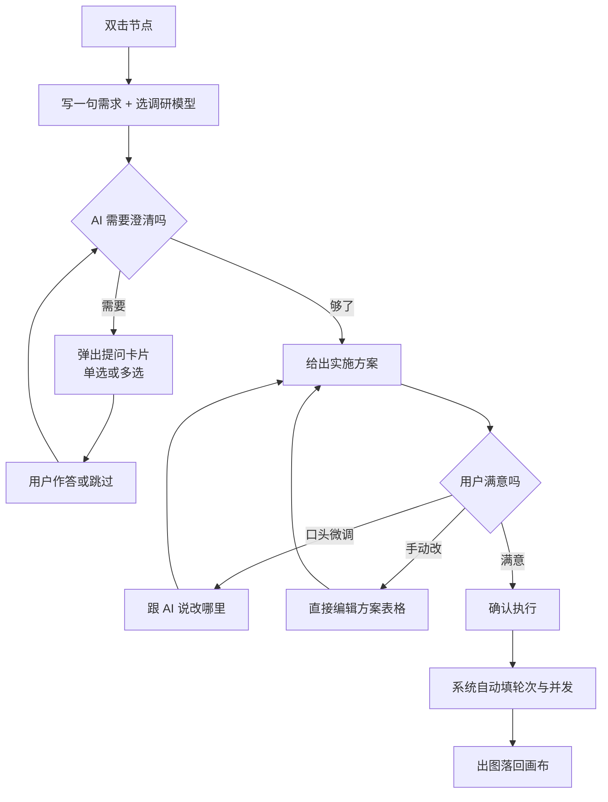

# 成套出图

> [!info] 定位调整（2026-08-21）
>
> 最初做成了「一种节点」，后来改成**输入框里的一个动作**。
> 理由：成套的本质是「怎么出这批图」，不是「一种东西」。做成节点的话，
> 用户想成套出图得先建节点、再连线、再配置，中间三步都与他想做的事无关；
> 而做成生成条上的一个按钮，**参考图天然就在手边**——选中一张图，
> 生成条上已经写着「参考 N 张」，点「成套」AI 就拿着这些图跟你讨论。
> 没有参考图时它就是纯文生图的成套。
>
> 循环节点仍然保留，双击进参数表单，留给要精确控制轮次的场合。

> [!warning] 这份文档替换的是什么
>
> 现在画布上的「循环节点」把 `轮数 / 起始计数 / 每轮张数 / 并发数 / 逐张喂图` 直接摊在卡片上让用户填。
> 这些参数**用户不一定会配**，而配错了不会报错，只会出一批不对的图。
> 这份需求把它换成一个 AI 引导式节点：用户只说想要什么，参数由系统填。

## 1. 它解决什么

两类真实场景，都不是「跑个循环」这个说法能表达的：

| 场景 | 用户的原话 | 底层需要什么 |
| --- | --- | --- |
| 成套一致 | 「我要做一套登录界面，风格要一致」 | 串行多轮，上一轮的产物当下一轮的参考 |
| 找灵感 | 「没想法，多给我几个不同风格的方案」 | 并发多轮，各轮互不影响 |

用户要表达的是**目标**，不是**调度方式**。串行还是并发、跑几轮、每轮喂什么词，
是从目标推出来的结果，不该是输入。

## 2. 命名

| 候选 | 理由 | 取舍 |
| --- | --- | --- |
| **成套** | 同时覆盖「一套一致的界面」与「一组备选方案」，与「单张出图」形成清晰对照 | ✅ 采用 |
| 组图 | 也说得通，但更偏「多张」而不是「成体系」 | 备选 |
| 策划 | 强调 AI 规划那一步，但用户要的是产出不是过程 | 否 |
| 循环 / 批次 | 说的是实现手段，正是这次要藏起来的东西 | 否 |

节点名定为 **「成套」**，副标题按当前意图动态显示「一致成套」或「多样备选」。

## 2.5 入口

生成条（选中一个图片节点时浮在它下方的那条）的动作行：

| 按钮 | 什么时候用 |
| --- | --- |
| 出图 | 已经想好提示词，出一张 |
| **成套** | 还没想好，或者要一整批。**不需要先写提示词**——它自己会问 |
| 运行整条链 | 画布上已经连好了链，沿着连线跑 |

有参考图与没参考图走的是同一个流程，差别只在给模型的上下文：

| | 有参考图 | 没有参考图 |
| --- | --- | --- |
| 反问 | 不问「要不要参考图」，问「照着它的哪一面来」（构图？配色？质感？） | 从零问清楚风格、平台、配色 |
| 方案 | 提示词**不重复描述参考图里已有的东西**（那张图会真的发过去，文字复述只会打架），只写「改什么、保持什么」 | 每条提示词都要能独立成立 |
| 出图 | 走 `/images/edits` 带参考 | 走 `/images/jobs` 纯文生图 |

## 2.6 输入框带什么，成套就带什么

生成条上的一切都跟着走，**并且在成套弹窗里逐项显示出来**——
不显示等于没带：用户无从判断 AI 是不是看见了那份规范，只能靠出图结果去猜。

三类东西去向不同，所以分三行写清楚而不是堆成一个「附件」列表：

| 带的是什么 | 去哪 | 在弹窗里怎么显示 |
| --- | --- | --- |
| 上游的图 / 本节点的图 / 附件里的图 | 真作为参考图上送（`refAssetIds`） | 缩略图，点开看大图 |
| 文档（md/txt/pdf/csv/json…） | 服务端按 id 抽正文进规划提示词 | 文件 chip，点开可下载 |
| 输入框里写了一半的提示词 | 直接当需求初值填进第一格 | 压成一行，点开看全文 |

附件只存 id，**正文不进画布文档**：单节点有 200KB 上限，一份 pdf 的正文能把它顶爆；
也不由浏览器读出来再发回去——那是把同一份字节过两遍网。抽不出正文的（docx、sketch）
照样列出来并标「读不出正文」：用户带了这个文件本身就是信息，悄悄丢掉的话
他会以为 AI 读过了。

实测（2026-08-21）：挂一份写着「主色 #1B4F8F、禁止红色系、必须有长者版入口
≥20px、搜索条 ≥720px、宫格不少于 12 项」的 md，出来的方案提示词里这五条**全部命中**。

## 3. 交互流程



三处必须能回头：提问卡片关掉后可重开、方案可反复改、执行前可改数量。

问题列表末尾固定有一格「你还有什么想问或要求的？」（抄 Claude Design 的问答卡）：
选项永远盖不全，没有这一格的话用户想补一句「机构名是临江市民政局」，
只能回上面的需求框重来一轮。同一格里给三条出路——
**按这些出方案** / **再问我几个**（换个层面再问一轮）/ **你来定**（剩下的它自己判断）。

「再问我几个」有两个必须一起做的守卫，少一个就是「按了没反应」：

| 守卫 | 在哪 | 不做会怎样 |
| --- | --- | --- |
| 这一轮不许回 `enough:true` | 服务端 | 模型回「够了」，界面上一个新问题都不出 |
| 已问未答的标题回传给模型 | 前端收集 + 服务端渲染 | 它不知道自己问过什么，把「参考图照着哪一面来」换成「参考图借哪一面」再问一遍（实测） |
| 问题 id 按轮次加前缀 | 前端 | 模型每轮都从 `q1` 编起，第二轮四个全新问题被当成重复整批丢掉（实测：接口 200、内容全对、界面无反应） |

## 4. 数据结构：直接抄现成标准

> [!info] 抄开源优先（CLAUDE.md 核心原则）
>
> 这一节的两个数据结构都不是自创的，来源已核实。

### 4.1 AI 反问 → 抄 MCP elicitation

来源：[MCP 规范 2026-07-28 · Client/Elicitation](https://modelcontextprotocol.io/specification/2026-07-28/client/elicitation)，MIT。
TypeScript 类型可直接 `pnpm add @modelcontextprotocol/sdk` 引入，不手写。

它已经把这四件事标准化，正好是我们要的全部：

| 我们要的 | 规范里叫什么 |
| --- | --- |
| 一个问题 | `params.message` |
| 单选（无标题） | `type: "string"` + `enum: [...]` |
| 单选（选项带说明） | `oneOf: [{ const, title }]` |
| 多选 | `type: "array"` + `items.anyOf` + `minItems` / `maxItems` |
| 预选项 | `default` |
| 用户答了 / 拒绝 / 直接关掉 | `action: "accept" | "decline" | "cancel"` |

**三动作模型是重点**：`decline`（明确不选）与 `cancel`（关掉窗口）语义不同——
前者是答案，后者不是。用户「不小心把弹出来的东西关了」属于 `cancel`，
所以那一问要留着、可重开，而不是当成「他选择了跳过」。

约束：requestedSchema 是**被砍过的 JSON Schema**——只允许扁平对象 + 原始类型，
禁嵌套对象与对象数组。这条要照守，否则前端渲染器要处理无穷多种形态。

### 4.2 实施方案 → 抄 Refly 的 WorkflowPlan

来源：[refly-ai/refly](https://github.com/refly-ai/refly) `packages/canvas-common/src/workflow-plan.ts`，Apache-2.0，可直接搬 schema。

核心洞见（直接回答「我把 6 张改成 12 张，AI 要不要重算」）：
**把张数这类东西建成 plan 级 variable，而不是写死在某个 task 的提示词里。**

于是改动分三档，只有第三档才回模型：

| 档 | 什么改动 | 怎么处理 |
| --- | --- | --- |
| 一 | 只动 variables（张数、画幅、风格强度） | 本地改，**不进模型**，方案文字不变 |
| 二 | 增删一步、改某一步的提示词 | 增量 patch，只重算受影响的那几条 |
| 三 | 改了目标本身（「不做登录了，改做支付」） | 重新规划整份方案 |

判据要硬：**改动只碰 variables、且不动步骤依赖，就绝不重规划**。
反例是 smolagents 那种纯文本计划——人改完 AI 不知道哪里变了，只能整篇重读。

方案的形状：

```ts
interface SetPlan {
  goal: string                  // 一句话目标，从需求描述提炼
  intent: 'consistent' | 'varied'  // 决定串行还是并发
  variables: PlanVariable[]     // 张数、画幅、风格…… 改这些不重规划
  steps: PlanStep[]             // 每一步画什么，带稳定 id
  rationale: string             // AI 为什么这么排，给人看
}

interface PlanStep {
  id: string                    // 稳定锚点，改动 patch 靠它定位
  title: string                 // 「登录页」
  prompt: string                // 这一步实际发给模型的词
  dependsOn: string[]           // 空 = 可并发；有值 = 必须排在它后面
}
```

`steps` 到执行参数的映射是纯函数，不经模型：
`intent === 'consistent'` → 串行、轮数 = steps.length、每轮取对应 step 的 prompt；
`intent === 'varied'` → 并发、同上。这一层由 `compileSetPlanRun` 冻结为一次性
`StudioFlowRun`；浏览器只投影 checkpoint，不逐步提交模型请求。

## 5. 参数不暴露，但要可见

用户不配参数，不等于参数不可见。执行前给一句人话小结：

> 一致成套 · 一轮跟一轮，共 8 步 · 每步 1 张 · 预计 8 次出图

点开「看看底层怎么配的」才展开真实参数（轮数/并发/每轮提示词），且**只读**。
要改就回方案层改——参数是方案的投影，不是另一处真相。

## 6. 人工干预的三个口子

1. **方案表格可直接编辑**：改标题、改提示词、拖动排序、删一步、加一步；
2. **跟 AI 说**：一个输入框，「第 3 步太素了，加点氛围」→ 走二档 patch；
3. **执行前改数量**：6 改 12 时不重规划，按 variables 走一档；
   但要问一句「多出来的 6 步让 AI 补，还是复制现有的？」——
   这是用户点名要的那种交互式提问，同样走 elicitation。

## 7. 复用清单

| 要的东西 | 复用什么 | 需要改什么 |
| --- | --- | --- |
| 一句话 → 结构化产物 | `server/domain/image_batch.py` 的 `_extract_list` / `_normalize` 防御层 | 换字段表 |
| 错误分型与中文文案 | `image_batch.BatchError` + `_classify` | 直接用 |
| 轮次调度 | `canvasStore.compileSetPlanRun` / `cascadePoolSize` | 生成串行或并行 DAG，并冻结槽位映射 |
| 出图执行 | `StudioFlowRun` / `image.auto` | 复用级联的 checkpoint、停止、续跑和刷新恢复 |
| 弹窗骨架 | `LoopConfigDialog.tsx` | 内容全换，壳可留 |
| AI 编排端点 | `server/domain/canvas_loop.py` | 扩成多轮对话式 |

蓝本 Infinite-Canvas 这块**没有可抄的**（已核实：它的循环节点零 LLM，
`smart-prompt` 只是单进单出的自由文本），且其许可证禁商用，只能参考思路。

## 8. 验收

| 项 | 判据 |
| --- | --- |
| 反问 | 写一句模糊需求 → 至少弹出一问，选项可点，单选多选行为正确 |
| 关掉可重开 | 关掉提问卡片 → 有入口重新打开 → 之前答过的保留 |
| 方案可改 | 手动改某步提示词 → 执行时发出去的就是改后的 |
| 一档改动不重规划 | 张数 6→12 → 不发起模型请求（拦网络请求断言） |
| 参数不暴露 | 默认界面上搜不到「并发数」「起始计数」字样 |
| 底层正确 | 确认执行后，实际轮数/模式与方案一致 |
| 携带物可见 | 输入框里的图/文件/提示词在弹窗里逐项列出，且都点得开 |
| 附件真进提示词 | 挂一份带硬性约束的文档 → 方案提示词里出现那些约束 |
| 再问一轮真的多问 | 点「再问我几个」→ 问题条数增加，且不是把已问的换个说法 |

## 9. 未定项

- 「调研的 AI」选哪些模型：当前网关只有 gpt-5.2~5.6 一族，先列全部聊天类部署；
- 方案里要不要带参考图选择（例如「照着这张的风格」）：一期先不做，二期考虑；
- 多人协作时方案的并发编辑：本项目单人自用，不做。
