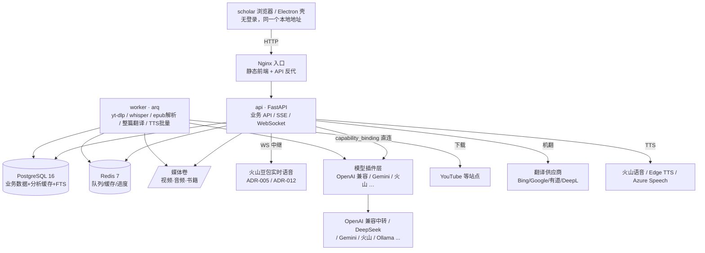
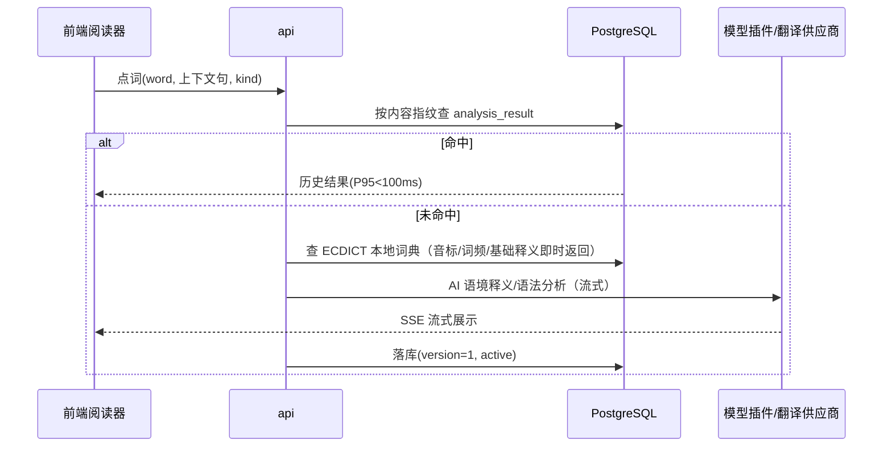

# 系统架构总览

> [!info] 视图层级
>
> 本文相当于 C4 的 Context + Container 两层。组件级设计随各模块实现前补充到 [C4模型](./C4模型/) 目录。所有选型决策以 [ADR](./ADR/) 为准。

## 1. 运行档

默认 `desktop` 档由 Electron 源码壳或安装包承载 Web 入口，FastAPI 使用 SQLite；任务消费者与 API 同进程，通过数据库队列持久化。`developer` / `docker` 档把数据库和队列替换为 PostgreSQL、Redis 与独立 Arq worker，领域代码不分叉。

### 客户端网络出口与服务验证

`UserPref.network` 保存应用代理总开关、HTTP 地址与授权范围。新配置使用 `scope=all`；缺少 scope 的旧配置保留 `selected`，不得升级时静默扩大授权。HTTP 请求经 `PolicyTransport` 按请求读取策略，关闭时不读取环境代理，localhost、IPv4 回环和 ::1 直连；重定向逐跳重新判断。

语音 WebSocket、Edge 音色目录和合成、yt-dlp、模型与图像协议、Google OAuth/API、导入下载、免费翻译和受管 CLI 使用同一策略。免费翻译库的 Session 工厂在串行调用期间设为 `trust_env=False`，调用结束后恢复并关闭连接。Electron 同步外部资源与更新检查的 session 代理；本地 API 连接不经过代理。设置只约束 NEXUS，不修改操作系统代理、TUN/VPN 或外部浏览器；服务器档的地址是服务器出口。既有语音会话需要重连。

Azure Speech 使用区域音色目录与 SSML REST 合成，密钥进入既有凭据加密链，不进入静态资源。它与端到端实时对话分开配置，不把 Speech Key 视为 Azure OpenAI 的部署凭据。所有朗读用途复用音频 Provider 运行时，显式 Azure 音色标识包含凭据 ID，避免多个区域或账号串用。

服务目录与用途绑定分别验证：目录检查只证明目录可访问；聊天测试要求有效内容，朗读测试要求真实音频且不读缓存，生图测试显式提示计费，实时测试要求建立会话并收到音频首段。合成完成耗时、会话建立耗时与音频首段耗时不混为一个网络延迟。未接入的媒体操作显示限制，不以聊天探针代测。

## 2. 服务器档容器视图



## 3. 关键数据流

### 3.1 点词学习（书库/字幕共用）



### 3.2 视频入库流水线

```
URL/本地文件 → api 建任务 → worker: yt-dlp 下载(或直接收文件)
→ 抽音轨 → faster-whisper 转写(句级+词级时间戳) → 分句入库(与书籍共用句子模型)
→ (可选)整篇机翻生成双语字幕 → 前端 WebVTT 渲染,进度经 Redis 发布 SSE
```

### 3.3 书籍入库流水线

```
epub/pdf/txt/md 上传或内置书目 → worker: 解析分章 → spaCy 分句
→ 句子表落库(章节定位 + CFI/偏移) → 前端 foliate-js 渲染 + 句/词命中态角标
```

## 4. 模块与容器归属

| 产品模块 | 前端归属 | 服务端归属 |
| --- | --- | --- |
| 词库/背单词 | `web/features/vocabulary` | api：词表/FSRS 调度（py-fsrs） |
| 书库精读 | `web/features/reader`（foliate-js） | api：点词/翻译/AI 解释；worker：解析入库、整篇翻译/朗读 |
| 视频学习 | `web/features/video`（asbplayer 移植） | worker：下载/转写；api：字幕查询、点读 |
| AI 语音对话/陪读 | `web/features/talk`（WebRTC） | api：token 签发、场景配置、会后落库 |
| 场景学习 | `web/features/scenario` | api：场景库 + LLM 会话 |
| 设置/模型服务 | `web/features/settings` | api：凭据 → 部署 → 能力绑定三层（唯一配置入口 /settings/models） |

## 5. 仓库布局（monorepo）

```
lingua-next/
├── web/            # React 18 SPA
├── server/         # Python：api 与 worker 共用代码库
│   ├── app/        # FastAPI 入口、路由、依赖注入
│   ├── domain/     # 模型与服务层（api/worker 共享）
│   ├── worker/     # arq 任务定义
│   └── vendor/     # 二开搬入的第三方代码（保留 NOTICE）
├── deploy/         # docker-compose.yml、nginx.conf、初始化脚本
├── desktop/        # Electron 壳：主进程 + preload + 探针（ADR-014）
├── data/           # 词典/词表种子数据（ECDICT 导入脚本）
├── 00.需求文档/ 01.项目文档/ 02.项目规范/   # 治理三根目录
```

## 6. 横切约束

- 客户端不持有任何供应商密钥；凭据加密存 `credential` 表，全部经 api 转发，实时语音由 api 做 WS 中继。
- 无账号（ADR-013）：路由从 `app/owner.py` 取常量 owner，学习状态表的 `user_id` 列保留为扩展点；API 只绑本机，局域网访问是显式开关（可选共享口令）。LiteLLM 网关 2026-08-23 已删除，LLM 只经能力名与 `capability_binding` 直连供应商。
- 所有 AI/翻译产物落 `analysis_result`（ADR-006），跨模块共享命中。
- 长任务（下载/转写/整篇翻译）一律走 worker + 进度事件，api 不做超过 5s 的同步阻塞。
- 供应商配置（模型别名、密钥、翻译引擎开关、TTS 音色表）全部数据库化，运行时可改。
- 外部非官方端点（translators/edge-tts/DLX）必须有降级链：失败自动切官方档或本地档。
