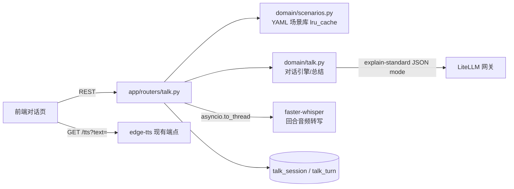

# 组件：场景陪练（talk）

M2 交付的回合制对话陪练。实时语音主路径（火山豆包端到端 S2S，见 [ADR-005](../ADR/ADR-005-实时语音对话方案.md)）已落地为服务端 WebSocket 中继：`app/routers/realtime.py` + `domain/volc_realtime.py`，浏览器 ⇆ api ⇆ 火山，凭证不出服务端。

## 组件视图

## 数据模型

| 表 | 关键列 | 说明 |
| --- | --- | --- |
| `talk_session` | mode(voice/text)、scenario_key、difficulty、summary(JSONB)、ended_at | 会话；summary 在 end 时由 LLM 生成 |
| `talk_turn` | session_id FK cascade、ordinal、role(user/assistant)、text、feedback(JSONB)、audio_key | Unique(session_id, ordinal)；feedback 仅用户回合 `{level: ok/improve, note, better}` |

迁移：`bf42657f21cb_talk_tables.py`。

## 接口

| 端点 | 行为 |
| --- | --- |
| `GET /talk/scenarios` | 场景库全部返回（仓库根 `data/scenarios/*.yaml` 直读，不入库） |
| `POST /talk/sessions` | 建会话；场景开场白自动写入 assistant 回合 0，返回 `tts_url` |
| `POST /talk/sessions/{id}/turns/text` | 一次 LLM 调用同时产出英文回复 + 表达反馈，落两条回合 |
| `POST /talk/sessions/{id}/turns/audio` | multipart 音频存 `media_root/talk/` → whisper 转写 → 同 text 流程，响应含 transcript |
| `POST /talk/sessions/{id}/end` | 生成会话总结（3 做得好/3 建议/重点词组）写入 summary，幂等 |
| `GET /talk/sessions` `GET /talk/sessions/{id}` | 历史列表 / 全部回合+summary |
| `POST /talk/realtime/sessions` | 建实时会话（mode=realtime，body 可带 scenario_key/difficulty），返回 `ws_path`；未配火山凭证 503 |
| `WS /talk/realtime/ws/{id}` | 双向中继：上行二进制帧=PCM 16k int16 音频、文本帧 `{"type":"end"}` 结束；下行二进制帧=TTS 音频（PCM 24k float32）、JSON 帧 `asr/reply/user_start/asr_end/reply_end/tts_end/opening/started/finished/error` |
| `POST /talk/realtime/session` | 旧桩废弃，410 指向新端点 |

## 实时语音中继（火山豆包）

- 上游协议：openspeech v3 二进制帧（StartConnection→StartSession→SayHello 开场白→TaskRequest 音频流），事件解析在 `domain/volc_realtime.py`；websockets 库解析该服务重复 server-timing 头会崩，客户端用 aiohttp。
- system_role 复用 `domain/talk.build_system_prompt`（场景角色/目标/难度），去掉 JSON 输出段；开场白用 SayHello 让模型直接播报。
- 会话结束（任一侧断开 / end / 30 分钟上限 / 3 分钟空闲）：FinishSession + 双 WS 清理，累计 ASR/Chat 文本按回合写入 `talk_turn`，会后总结复用 `POST /talk/sessions/{id}/end`。
- 实测（2026-08-17，本机→火山直连）：ASR 转写与回复文本、下行音频全通；首响延迟（最后一块语音→首个回复音频帧）约 710ms，满足 ADR-005 的 P50 < 1s 目标。

## 实现要点

- 对话与反馈合并为单次 `explain-standard` JSON mode 调用，history 只传最近 12 回合，system prompt 按难度注入表达风格（easy 短句慢速 / medium 自然 / hard 地道复杂）。
- 场景 YAML 字段：key、title、title_en、level、role_ai、role_user、goal、opening_line、key_sentences×3、hints×2；`scenarios_dir` 可配置（默认 `../data/scenarios`，容器部署需挂载覆盖）。
- 回合音频短，转写同步在 api 进程 `asyncio.to_thread` 执行，whisper 模型进程内 lru_cache 复用，不过 arq 队列。
- AI 回复音频不预生成，前端用现有 `GET /tts?text=` 播放（内容指纹落盘缓存）。

## 前端对话页（web）

路由 `/talk`（场景选择）+ `/talk/session`（按查询参数分发：`?mode=text` 回合制、`?mode=realtime` 实时语音、`?id=` 历史回顾），代码在 `web/src/features/talk/`，视觉对照 `design/mockups/talk.html`。

| 文件 | 职责 |
| --- | --- |
| `TalkScenariosPage.tsx` | 场景卡网格（自由话题置首）+ 顶栏难度 seg（localStorage 记忆）+ 历史会话列表 |
| `TalkSessionPage.tsx` | 路由分发 + 回合制会话/回顾：气泡流、惰性中文提示（`/analyze/translate`）、feedback 渲染、MediaRecorder 按住录音（webm/ogg opus）、总结卡（词组可收藏进 vocab） |
| `RealtimeSessionPage.tsx` | 实时语音：大麦克风脉冲（聆听）/波形（AI 说话）状态机、实时字幕（asr interim 灰→定稿实、reply 增量）、计时/结束，结束或服务端 finished 后跳回顾 |
| `realtimeAudio.ts` | `MicCapture`（AudioContext 16k + AudioWorklet/ScriptProcessor 兜底，Float32→Int16 100ms 块上行）、`PcmPlayer`（24k float32 播放队列按 scheduledTime 排队，`user_start` 帧到达即 flush 打断） |
| `ScenePanel.tsx` | 右侧场景面板：目标/角色、关键句（tts 朗读）、提示 |

- talk 契约类型与 API 封装在 `web/src/lib/api.ts`；`tts_url`、`ws_path` 均为后端相对路径，前端加 `/api` 前缀（WS 走 vite 代理，`vite.config.ts` 已加 `ws: true`）。
- 回合制发送后乐观渲染用户气泡 + AI 思考波形；assistant 回合到达自动 `GET /tts` 播放。
- 实测（2026-08-17，浏览器面板无真实麦克风）：回合制 text 往返、end 总结、历史回顾、词组收藏全通；实时链路验证到 WS 代理连通、started/opening/tts_end 帧与开场白音频到达、麦克风权限失败提示、end→回顾跳转；`user_start` 打断与 ASR 字幕依赖真实拾音，未实测。
