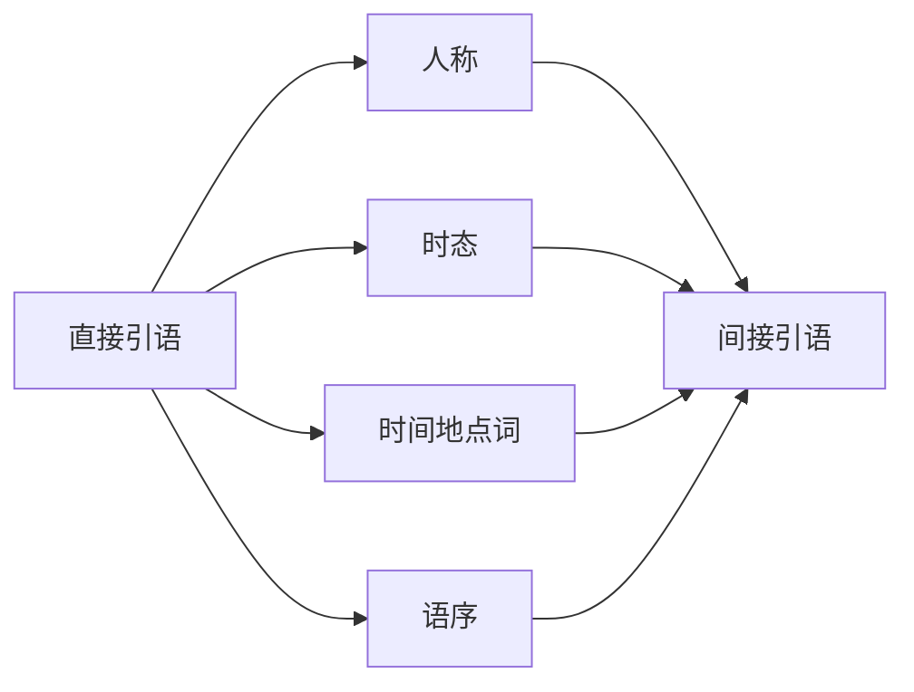

# 间接引语详解

## 1. 转述时要动的四样东西

从直接引语改成间接引语，动的不只是引号。

上图的四条支路要同时处理。人称按转述者的视角重新确定；时态在主句为过去时时整体回退一档；
时间与地点指示词从「说话现场」改为「转述现场」；疑问句还要把语序从疑问改回陈述。
漏掉任何一条，转述出来的句子要么指代不清，要么时间关系错乱。

### 1.1 人称调整

| 直接引语 | 间接引语 |
| --- | --- |
| He said, "**I** am tired." | He said that **he** was tired. |
| She said to me, "**You** are right." | She told me that **I** was right. |
| They said, "**We** finished **our** work." | They said that **they** had finished **their** work. |

人称跟着**转述者**走，不跟原说话人走。

### 1.2 时态回退

主句是过去时（said / told / asked）时，从句时态整体退一档。

| 直接引语时态 | 间接引语时态 | 例 |
| --- | --- | --- |
| 一般现在 | 一般过去 | "I **work** here." → he **worked** there |
| 现在进行 | 过去进行 | "I **am working**." → he **was working** |
| 一般过去 | 过去完成 | "I **worked**." → he **had worked** |
| 现在完成 | 过去完成 | "I **have worked**." → he **had worked** |
| will | would | "I **will** go." → he **would** go |
| can | could | "I **can** swim." → he **could** swim |
| may | might | "I **may** come." → he **might** come |

**过去完成不再往回退**，因为没有更早的时态了：
"I **had finished**." → he **had finished**。

### 1.3 时间与地点词

| 直接 | 间接 |
| --- | --- |
| now | then |
| today | that day |
| tomorrow | the next day / the following day |
| yesterday | the day before / the previous day |
| here | there |
| this | that |
| ago | before |

### 1.4 时态不回退的三种情况

> [!info] 回退是为了对齐时间参照，参照没变就不退
>
> 时态回退的目的是把「说话当时的现在」换算成「转述时的过去」。
> 如果被转述的内容在转述时仍然成立，换算就没有必要。

| 情况 | 例句 |
| --- | --- |
| 客观真理 | The teacher said that light **travels** faster than sound. |
| 现在仍成立的事实 | He said that he **lives** in Beijing.（他现在还住那儿） |
| 主句是现在时 | He **says** that he **is** busy. |

---

## 2. say 与 tell 的分工

| 动词 | 后面 | 例句 |
| --- | --- | --- |
| **say** | 不直接接人；接人要加 to | He **said** that... / He **said to me** that... |
| **tell** | 必须接人 | He **told me** that... |

| 正确 | 错误 |
| --- | --- |
| He **said to** me that he was busy. | ~~He said me that...~~ |
| He **told** me that he was busy. | ~~He told to me that...~~ |

其他常见转述动词：**explain / report / announce / admit / complain**，
这些和 say 一样不直接接人（explain **to** sb that...）。

---

## 3. 间接疑问句：语序改回陈述

### 3.1 一般疑问句 → whether / if

| 直接 | 间接 |
| --- | --- |
| He asked, "**Are you** ready?" | He asked **whether I was** ready. |
| She asked, "**Do you** like it?" | She asked **if I liked** it. |

两处要改：加 whether/if，**语序从「谓主」改回「主谓」**。

### 3.2 特殊疑问句 → 保留疑问词

| 直接 | 间接 |
| --- | --- |
| He asked, "**Where do you** live?" | He asked **where I lived**. |
| She asked, "**What is** your name?" | She asked **what my name was**. |
| They asked, "**When will** he come?" | They asked **when he would** come. |

疑问词本身就是连接词，不再另加 that 或 whether。

> [!danger] 语序是间接疑问句唯一的高频错点
>
> 受直接疑问句影响，容易写成 *He asked where did I live.* —— 保留了助动词倒装。
> 间接疑问句是**宾语从句**，从句一律用陈述语序。
>
> 读句时同理：看到 `I don't know where he is` 里的 `he is` 而不是 `is he`，
> 才能确认这是从句而不是插入的疑问。

### 3.3 能带间接疑问的动词

不只是 ask。下面这些动词后面都能接 whether/if 或疑问词引导的从句：

| 类别 | 动词 |
| --- | --- |
| 询问 | ask, wonder, inquire |
| 认知 | know, understand, learn, see, realize, remember, forget |
| 判断 | decide, doubt, tell（分辨） |
| 说明 | explain, show, teach, remind |

| 例句 | 中文 |
| --- | --- |
| I **wonder** whether he will come. | 我想知道他会不会来。 |
| Can you **tell** me where the station is? | 你能告诉我车站在哪儿吗？ |
| We must **decide** which one to buy. | 我们得决定买哪一个。 |
| Let me **explain** why I was late. | 我解释一下我为什么迟到。 |

### 3.4 whether 与 if 的区别

多数情况两者通用，但四处只能用 whether：

| 场合 | 例句 |
| --- | --- |
| 后面紧跟 or not | I don't know **whether or not** he'll come. |
| 介词之后 | It depends on **whether** he agrees. |
| 后接不定式 | I'm not sure **whether to go**. |
| 作主语从句 | **Whether** he comes doesn't matter. |

---

## 4. 转述祈使句与感叹句

### 4.1 祈使句 → 动词 + 宾语 + 不定式

| 直接 | 间接 |
| --- | --- |
| He said to me, "**Open** the door." | He **told me to open** the door. |
| She said, "**Don't** be late." | She **told me not to be** late. |
| He said, "**Please** help me." | He **asked me to help** him. |

选词按语气：命令用 **tell**，请求用 **ask**，建议用 **advise**，警告用 **warn**。
否定用 **not to do**，not 在 to 前面。

### 4.2 感叹句 → 保留感叹词或改述

| 直接 | 间接 |
| --- | --- |
| He said, "What a beautiful day!" | He said **what a beautiful day it was**. |
| She said, "How nice!" | She **exclaimed how nice it was**. |
