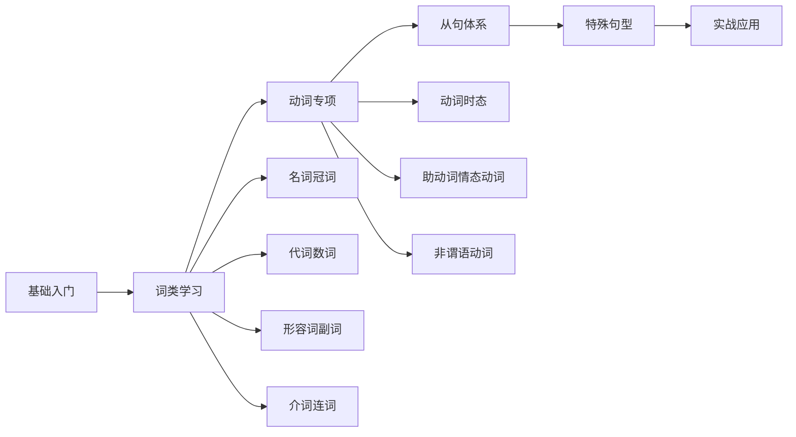

# 英语基础语法教程 - 大纲总览

> [!info] 教程概述
>
> 本教程是一套系统性的英语基础语法学习资料，面向英语学习者设计，从零基础到进阶应用，覆盖英语语法的全部核心知识点。
>
> **教程特点**：
> - 共 **13 个分类**，**55 篇** 详细文档
> - 每篇 **8000-15000 字**，内容详尽充实
> - 配合 **Mermaid 图表**、**表格**、**Callout 提示** 辅助理解
> - 大量 **中英对照例句**，附句法分析
> - 参考旧版文档内容，整合优化

---

## 学习路径建议

> 建议按照「基础入门 → 词类学习 → 动词专项 → 从句体系 → 特殊句型 → 实战应用」的顺序学习，循序渐进，逐步深入。

---

## 目录结构

### 01.基础入门（3 篇）

本模块帮助学习者建立英语语法的整体框架，理解核心术语和基本句型。

| 序号 | 文档标题 | 主要内容 |
|------|---------|---------|
| 01 | [[01.英语语法的历程与核心概念\|英语语法的历程与核心概念]] | 语法发展简史、核心术语定义、知识体系总览 |
| 02 | [[01.基础入门/02.句子成分与五大基本句型\|句子成分与五大基本句型]] | 主谓宾表补定状、五大基本句型详解 |
| 03 | [[01.基础入门/03.英语句子结构分析方法\|英语句子结构分析方法]] | 长难句分析技巧、句子成分划分方法 |

---

### 02.名词与冠词（4 篇）

深入讲解名词的分类、数、格，以及冠词的使用规则。

| 序号 | 文档标题 | 主要内容 |
|------|---------|---------|
| 01 | [[01.名词的分类与用法\|名词的分类与用法]] | 可数/不可数、专有/普通、集体/物质名词 |
| 02 | [[02.名词的数与格\|名词的数与格]] | 单复数变化规则、所有格用法 |
| 03 | [[03.冠词的用法详解\|冠词的用法详解]] | 定冠词/不定冠词/零冠词 |
| 04 | [[04.名词与冠词的综合应用\|名词与冠词的综合应用]] | 固定搭配、常见错误分析 |

---

### 03.代词与数词（5 篇）

全面覆盖各类代词的用法和数词的表达方式。

| 序号 | 文档标题 | 主要内容 |
|------|---------|---------|
| 01 | [[01.人称代词与物主代词\|人称代词与物主代词]] | 主格/宾格、形容词性/名词性物主代词 |
| 02 | [[03.代词与数词/02.指示代词与反身代词\|指示代词与反身代词]] | this/that/these/those、myself/yourself |
| 03 | [[03.代词与数词/03.不定代词详解\|不定代词详解]] | some/any/no、every/each、all/both |
| 04 | [[03.代词与数词/04.疑问代词与关系代词\|疑问代词与关系代词]] | who/whom/whose/what/which |
| 05 | [[05.数词的用法与表达\|数词的用法与表达]] | 基数词/序数词、分数/小数/百分数 |

---

### 04.形容词与副词（3 篇）

讲解形容词和副词的位置、功能和比较级用法。

| 序号 | 文档标题 | 主要内容 |
|------|---------|---------|
| 01 | [[01.形容词的用法与位置\|形容词的用法与位置]] | 定语/表语/补语、多个形容词排列顺序 |
| 02 | [[04.形容词与副词/02.副词的分类与功用\|副词的分类与功用]] | 时间/地点/方式/程度/频率副词 |
| 03 | [[04.形容词与副词/03.形容词与副词的比较级\|形容词与副词的比较级]] | 原级/比较级/最高级、不规则变化 |

---

### 05.介词与连词（4 篇）

系统介绍介词的搭配和连词的使用。

| 序号 | 文档标题 | 主要内容 |
|------|---------|---------|
| 01 | [[01.介词的分类与基本用法\|介词的分类与基本用法]] | 时间/地点/方向/原因介词 |
| 02 | [[02.常用介词搭配详解\|常用介词搭配详解]] | in/on/at、with/by/for 辨析 |
| 03 | [[05.介词与连词/03.并列连词的用法\|并列连词的用法]] | and/or/but/so/for/yet/nor |
| 04 | [[05.介词与连词/04.从属连词概述\|从属连词概述]] | 引导从句的连词分类 |

---

### 06.动词时态（5 篇）

详解英语 16 种时态的构成和用法。

| 序号 | 文档标题 | 主要内容 |
|------|---------|---------|
| 01 | [[06.动词时态/01.动词概述与时态体系\|动词概述与时态体系]] | 动词分类、16种时态总览 |
| 02 | [[06.动词时态/02.现在时态详解\|现在时态详解]] | 一般现在/现在进行/现在完成/现在完成进行 |
| 03 | [[06.动词时态/03.过去时态详解\|过去时态详解]] | 一般过去/过去进行/过去完成/过去完成进行 |
| 04 | [[06.动词时态/04.将来时态详解\|将来时态详解]] | 一般将来/将来进行/将来完成/将来完成进行 |
| 05 | [[06.动词时态/05.完成时态与进行时态\|完成时态与进行时态]] | 完成时 vs 进行时对比、过去将来时 |

---

### 07.助动词与情态动词（3 篇）

讲解助动词和情态动词的核心用法。

| 序号 | 文档标题 | 主要内容 |
|------|---------|---------|
| 01 | [[07.助动词与情态动词/01.助动词be、have、do\|助动词be、have、do]] | 助动词的构成与功能 |
| 02 | [[07.助动词与情态动词/02.情态动词can、may、must\|情态动词can、may、must]] | 能力/许可/义务/推测用法 |
| 03 | [[07.助动词与情态动词/03.情态动词的扩展用法\|情态动词的扩展用法]] | shall/should/will/would/need/dare |

---

### 08.非谓语动词（5 篇）

深入讲解不定式、动名词、分词的结构和句法功能。

| 序号 | 文档标题 | 主要内容 |
|------|---------|---------|
| 01 | [[08.非谓语动词/01.不定式的结构与用法\|不定式的结构与用法]] | to do 结构、时态与语态 |
| 02 | [[08.非谓语动词/02.不定式的句法功能\|不定式的句法功能]] | 作主语/宾语/表语/定语/状语/补语 |
| 03 | [[08.非谓语动词/03.动名词详解\|动名词详解]] | doing 结构、句法功能、与不定式对比 |
| 04 | [[08.非谓语动词/04.现在分词详解\|现在分词详解]] | -ing 形式、定语/状语/补语用法 |
| 05 | [[08.非谓语动词/05.过去分词详解\|过去分词详解]] | -ed 形式、被动含义、完成含义 |

---

### 09.从句体系（5 篇）

系统讲解三大从句类型：名词性从句、定语从句、状语从句。

| 序号 | 文档标题 | 主要内容 |
|------|---------|---------|
| 01 | [[09.从句体系/01.从句概述与分类\|从句概述与分类]] | 从句的本质、引导词分类 |
| 02 | [[09.从句体系/02.名词性从句详解\|名词性从句详解]] | 主语/宾语/表语/同位语从句 |
| 03 | [[09.从句体系/03.定语从句详解\|定语从句详解]] | 关系代词/关系副词、限制性/非限制性 |
| 04 | [[09.从句体系/04.状语从句详解(上)\|状语从句详解(上)]] | 时间/地点/原因/条件从句 |
| 05 | [[09.从句体系/05.状语从句详解(下)\|状语从句详解(下)]] | 目的/结果/方式/让步/比较从句 |

---

### 10.特殊句型（7 篇）

讲解各类特殊句型的结构和用法。

| 序号 | 文档标题 | 主要内容 |
|------|---------|---------|
| 01 | [[10.特殊句型/01.被动语态详解\|被动语态详解]] | 被动语态的构成、时态、特殊情况 |
| 02 | [[02.虚拟语气详解\|虚拟语气详解]] | 条件句/从句/特殊结构中的虚拟 |
| 03 | [[10.特殊句型/03.倒装句详解\|倒装句详解]] | 全部倒装/部分倒装 |
| 04 | [[10.特殊句型/04.强调结构详解\|强调结构详解]] | It is...that 强调句型 |
| 05 | [[10.特殊句型/05.省略句详解\|省略句详解]] | 各类省略的规则与用法 |
| 06 | [[10.特殊句型/06.it的用法详解\|it的用法详解]] | 形式主语/形式宾语/强调句/固定句型 |
| 07 | [[10.特殊句型/07.主谓一致详解\|主谓一致详解]] | 语法一致/意义一致/就近原则 |

---

### 11.实战应用（3 篇）

将语法知识应用于实际写作和翻译。

| 序号 | 文档标题 | 主要内容 |
|------|---------|---------|
| 01 | [[11.实战应用/01.英语翻译原则与技巧\|英语翻译原则与技巧]] | 翻译的三原则、常用技巧 |
| 02 | [[11.实战应用/02.如何写好英语句子\|如何写好英语句子]] | 句子写作技巧、常见问题 |
| 03 | [[11.实战应用/03.常见语法错误分析\|常见语法错误分析]] | 中式英语、典型错误案例 |

---

### 12.日常口语（4 篇）

实用口语场景和表达方式。

| 序号 | 文档标题 | 主要内容 |
|------|---------|---------|
| 01 | [[12.日常口语/01.日常打招呼与社交\|日常打招呼与社交]] | 问候、介绍、道别、感谢 |
| 02 | [[12.日常口语/02.餐厅购物场景\|餐厅购物场景]] | 点餐、购物、讨价还价 |
| 03 | [[12.日常口语/03.出行交通场景\|出行交通场景]] | 问路、交通工具、住宿 |
| 04 | [[12.日常口语/04.工作生活场景\|工作生活场景]] | 求职、办公、看病、天气 |

---

### 13.附录（4 篇）

参考资料和工具。

| 序号 | 文档标题 | 主要内容 |
|------|---------|---------|
| 01 | [[13.附录/01.标点符号用法\|标点符号用法]] | 英语标点符号的正确使用 |
| 02 | [[13.附录/02.常用缩略词汇总\|常用缩略词汇总]] | 生活中常见的英语缩写 |
| 03 | [[13.附录/03.英语学习资源推荐\|英语学习资源推荐]] | 网站、APP、书籍推荐 |
| 04 | [[13.附录/04.语法术语中英对照\|语法术语中英对照]] | 语法专业术语对照表 |

---

## 文档统计

| 分类 | 文档数量 | 预计字数 |
|------|---------|---------|
| 01.基础入门 | 3 篇 | 24,000-45,000 字 |
| 02.名词与冠词 | 4 篇 | 32,000-60,000 字 |
| 03.代词与数词 | 5 篇 | 40,000-75,000 字 |
| 04.形容词与副词 | 3 篇 | 24,000-45,000 字 |
| 05.介词与连词 | 4 篇 | 32,000-60,000 字 |
| 06.动词时态 | 5 篇 | 40,000-75,000 字 |
| 07.助动词与情态动词 | 3 篇 | 24,000-45,000 字 |
| 08.非谓语动词 | 5 篇 | 40,000-75,000 字 |
| 09.从句体系 | 5 篇 | 40,000-75,000 字 |
| 10.特殊句型 | 7 篇 | 56,000-105,000 字 |
| 11.实战应用 | 3 篇 | 24,000-45,000 字 |
| 12.日常口语 | 4 篇 | 32,000-60,000 字 |
| 13.附录 | 4 篇 | 32,000-60,000 字 |
| **合计** | **55 篇** | **440,000-825,000 字** |

---

## 更新记录

| 日期 | 更新内容 |
|------|---------|
| 2025-12-19 | 创建大纲文档，设计教程结构 |

---

> [!success] 开始学习
>
> 从 [[01.英语语法的历程与核心概念]] 开始你的英语语法学习之旅！
