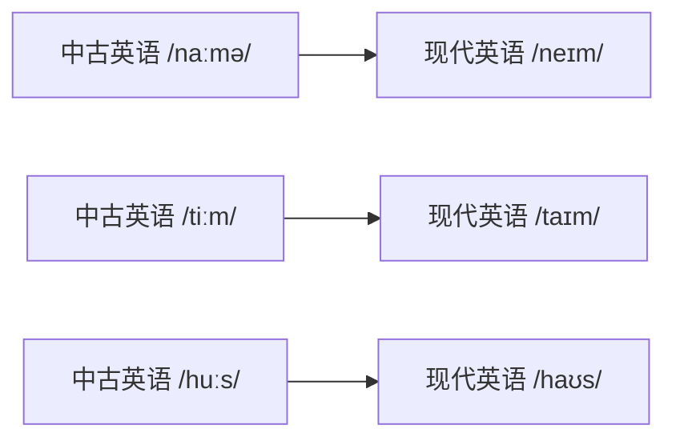
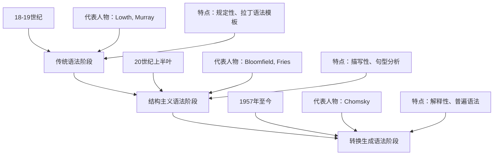
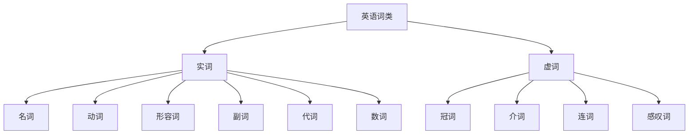
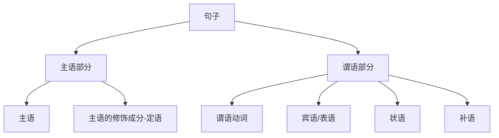
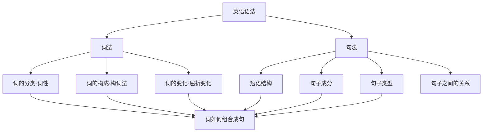
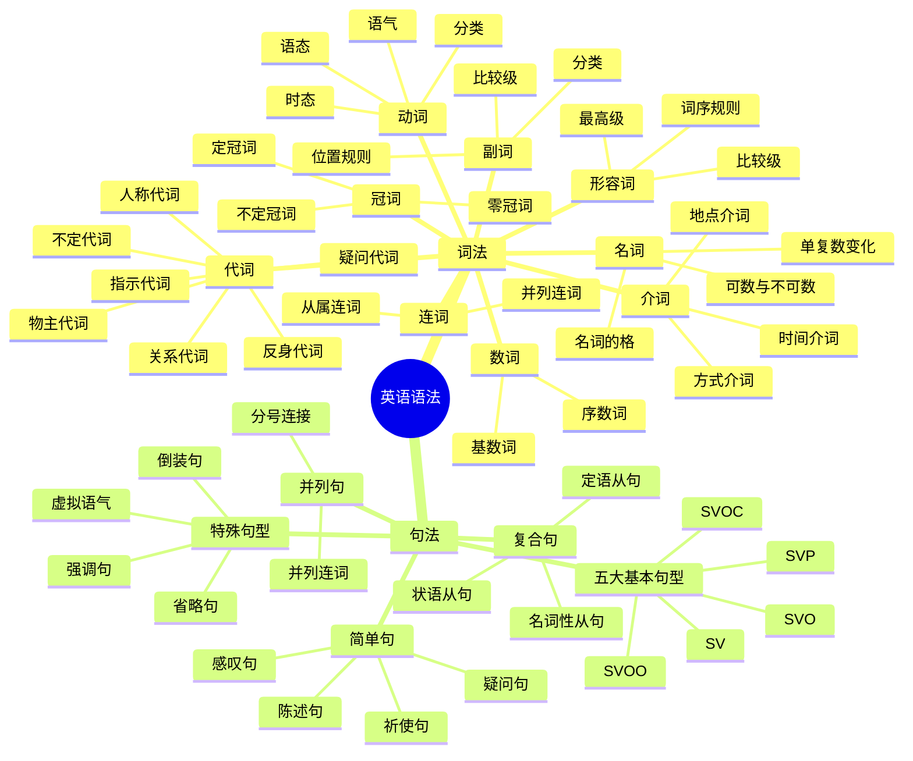
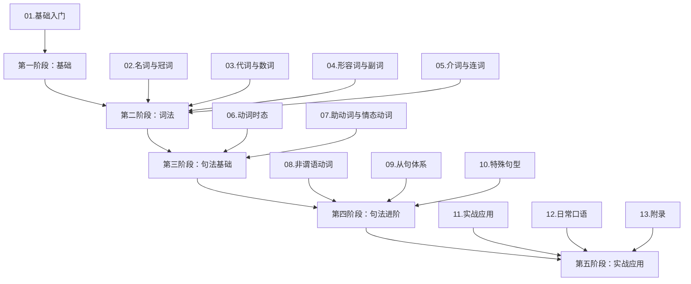

# 英语语法的历程与核心概念

> [!tip] 学习目标
>
> 完成本章学习后，你将能够：
>
> - 了解英语语法从古英语到现代英语的演变历程
> - 理解语法学习的本质意义和正确方法
> - 掌握词类、句子成分、时态语态等核心术语
> - 建立完整的英语语法知识体系框架
> - 明确后续学习的路径和重点

---

## 1. 英语语法发展简史

英语作为一门日耳曼语系的语言，经历了一千五百多年的演变。理解这段历史，不仅能帮助我们明白某些语法规则「为什么是这样」，还能让我们对语法变化持有更开放的态度。

### 1.1 古英语时期（450-1100年）

古英语（Old English）起源于公元 5 世纪中叶，当时盎格鲁人（Angles）、撒克逊人（Saxons）和朱特人（Jutes）从欧洲大陆迁移到不列颠岛，带来了他们的日耳曼语言。

**古英语的语法特征**：

| 特征 | 说明 | 现代英语对比 |
| --- | --- | --- |
| 屈折变化丰富 | 名词有四个格（主格、宾格、与格、属格）、三个性（阳性、阴性、中性）、两个数（单数、复数） | 现代英语仅保留所有格 's |
| 动词变位复杂 | 动词根据人称、数、时态有大量词尾变化 | 现代英语仅保留第三人称单数 -s |
| 词序相对自由 | 由于屈折变化标明语法关系，词序不固定 | 现代英语依赖固定词序（SVO） |
| 词汇以日耳曼语为主 | 基本词汇几乎全为日耳曼语源 | 现代英语约 60% 词汇来自拉丁语和法语 |

**古英语例句分析**：

```
古英语：Se cyning sealde þæm bisceope þæt land.
逐词分析：
- Se (the, 主格阳性)
- cyning (king, 主格)
- sealde (gave, 过去式)
- þæm (the, 与格阳性)
- bisceope (bishop, 与格)
- þæt (the, 宾格中性)
- land (land, 宾格)

现代英语：The king gave the bishop the land.
翻译：国王把那块土地赐给了主教。
```

从这个例子可以看出，古英语通过词尾变化（cyning 为主格表示主语，bisceope 为与格表示间接宾语，land 为宾格表示直接宾语）来标明语法关系。即使打乱词序，句意依然清晰。

> [!info] 古英语的现代遗存
>
> 虽然古英语看起来像一门外语，但我们今天使用的许多基础词汇都源自这一时期：
>
> - 人称代词：I, you, he, she, it, we, they
> - 基本动词：be, have, do, go, come, make
> - 日常名词：house, water, father, mother, sun, moon
> - 数词：one, two, three... ten
>
> 这些高频词汇构成了英语的核心骨架。

### 1.2 中古英语时期（1100-1500年）

1066 年的诺曼征服（Norman Conquest）是英语历史上最重要的转折点。法国诺曼底公爵威廉征服英格兰后，法语成为宫廷、法律和上流社会的语言，而英语则沦为平民百姓的日常用语。

**中古英语的语法变革**：

这一时期，英语经历了「语法大简化」（Great Grammatical Simplification）：

| 变化类型 | 具体表现 | 原因分析 |
| --- | --- | --- |
| 屈折词尾消失 | 名词的格变化逐渐消失，只保留所有格 -'s | 非重读音节弱化，词尾发音模糊 |
| 性数一致消退 | 形容词不再随名词变化词尾 | 屈折系统整体崩溃的连锁反应 |
| 词序固定化 | SVO（主语-动词-宾语）词序成为标准 | 失去屈折标记后，需要词序来标明语法关系 |
| 大量法语词汇涌入 | 法律、政治、艺术、烹饪等领域词汇 | 法语是统治阶层语言 |

**有趣的双层词汇现象**：

诺曼征服导致英语中出现了大量「同义词对」，日耳曼语源的词汇通常更日常、更口语化，而法语源的词汇则更正式、更书面化：

| 日耳曼语源（Anglo-Saxon） | 法语语源（French） | 语域差异 |
| --- | --- | --- |
| begin | commence | 开始（日常 vs 正式） |
| ask | inquire | 询问（日常 vs 正式） |
| help | assist | 帮助（日常 vs 正式） |
| buy | purchase | 购买（日常 vs 正式） |
| cow, pig, sheep | beef, pork, mutton | 动物（农民用语）vs 肉类（贵族用语） |

最后一组词汇的差异尤其有趣：盎格鲁-撒克逊农民负责饲养牲畜，所以用本土词汇称呼活的动物；而诺曼贵族只在餐桌上见到这些动物，所以用法语词汇称呼肉类。

**中古英语例句分析**：

```
中古英语（乔叟《坎特伯雷故事集》开篇）：
Whan that Aprille with his shoures soote
The droghte of March hath perced to the roote...

逐词对照：
- Whan that = When (当...时候)
- Aprille = April (四月)
- his = its (它的，当时 his 也用于中性)
- shoures = showers (阵雨)
- soote = sweet (甜美的)
- droghte = drought (干旱)
- hath perced = has pierced (已经穿透)
- roote = root (根部)

现代英语：
When April with its sweet showers
Has pierced the drought of March to the root...

翻译：当四月的甜美春雨，穿透三月干旱直达根部...
```

可以看到，中古英语已经比古英语更接近现代英语，但拼写、发音和某些语法形式仍有明显差异。

### 1.3 现代英语时期（1500年至今）

现代英语分为早期现代英语（Early Modern English, 1500-1700）和晚期现代英语（Late Modern English, 1700至今）两个阶段。

#### 1.3.1 早期现代英语（1500-1700）

这一时期发生了两件影响深远的大事：

**1. 元音大推移（Great Vowel Shift）**

15 世纪到 17 世纪之间，英语的长元音发音经历了系统性的变化：



这就是为什么英语拼写和发音经常不一致的主要原因：拼写基本固定在元音大推移之前，而发音却发生了巨大变化。例如：

| 单词 | 拼写反映的旧发音 | 现代发音 |
| --- | --- | --- |
| name | /naːm/ | /neɪm/ |
| time | /tiːm/ | /taɪm/ |
| house | /huːs/ | /haʊs/ |
| meat | /mɛːt/ | /miːt/ |

**2. 印刷术的传播与语法规范化**

1476 年，威廉·卡克斯顿（William Caxton）将印刷术引入英格兰。印刷术的普及带来了：

- **拼写标准化**：印刷商需要统一拼写，结束了中古英语时期一词多写的混乱局面
- **语法著作涌现**：大量语法书籍出版，试图为英语制定「正确」的规则
- **莎士比亚时代**：文学创作推动了英语表达的丰富和精细化

**早期现代英语例句（莎士比亚）**：

```
原文（《哈姆雷特》）：
To be, or not to be, that is the question:
Whether 'tis nobler in the mind to suffer
The slings and arrows of outrageous fortune...

语法分析：
- "To be, or not to be" — 不定式短语作主语
- "'tis" = "it is" 的缩写（现已不用）
- "nobler" — 形容词比较级
- "in the mind" — 介词短语作状语
- "slings and arrows" — 并列名词作宾语

翻译：
生存还是毁灭，这是个问题：
默然忍受命运的暴虐毒箭，
还是挺身反抗无边的苦难...
```

#### 1.3.2 晚期现代英语（1700年至今）

18 世纪以来，英语语法基本稳定，但词汇量急剧膨胀：

| 时期 | 词汇来源 | 例词 |
| --- | --- | --- |
| 工业革命 | 技术发明 | engine, factory, railway |
| 科学发展 | 希腊/拉丁语根 | telephone, television, computer |
| 殖民扩张 | 各殖民地语言 | kangaroo（澳洲）, safari（非洲）|
| 全球化时代 | 世界各语言 | sushi（日语）, yoga（印地语）|

**现代英语的语法特点**：

1. **分析性语言**：主要依靠词序和虚词（介词、助动词）表达语法关系，而非词尾变化
2. **助动词系统发达**：使用 do, have, be, will, would 等构成各种时态、语态、语气
3. **短语动词丰富**：动词 + 介词/副词组合，如 look up, put off, break down
4. **灵活的词类转换**：同一个词可以充当多种词性，如 water（n. 水 / v. 浇水）

### 1.4 语法体系的形成与发展

英语语法作为一门学科，经历了三个主要阶段：



**三种语法观的核心区别**：

| 语法流派 | 核心问题 | 研究方法 | 对学习者的意义 |
| --- | --- | --- | --- |
| 传统语法 | 什么是「正确」的英语？ | 规定正误、制定规则 | 提供明确的对错标准 |
| 结构主义语法 | 英语实际上是怎么使用的？ | 观察描写、归纳句型 | 帮助理解真实语言使用 |
| 转换生成语法 | 人类为什么能学会语言？ | 抽象分析、形式化推导 | 揭示语言的深层规律 |

> [!note] 给学习者的建议
>
> 作为英语学习者，不必纠结于学术流派之争。传统语法提供的规则框架依然是最实用的学习工具，同时保持对语言变化的开放态度即可。本教程采用传统语法框架，结合现代语言学的描写视角，力求既有明确的规则指导，又不过于僵化教条。

---

## 2. 为什么要学习语法

### 2.1 语法的本质与作用

**语法是什么？**

语法（Grammar）是语言的组织规则系统，它规定了：

1. **词法（Morphology）**：单词的内部结构和变化规则
   - 如何用词根、前缀、后缀构词：un- + happy → unhappy
   - 词形如何变化：go → went → gone

2. **句法（Syntax）**：单词如何组合成短语和句子
   - 词序规则：主语 + 动词 + 宾语
   - 一致关系：主语和谓语的数一致

用一个比喻来说明：如果把语言比作建筑，那么——

| 语言要素 | 建筑类比 | 说明 |
| --- | --- | --- |
| 词汇 | 砖块、木材 | 基本建筑材料 |
| 语法 | 建筑设计图 | 规定材料如何组装 |
| 语音 | 外墙装饰 | 影响整体观感 |
| 语用 | 室内功能规划 | 建筑如何被使用 |

没有设计图，再多的砖块也只是一堆建材；没有语法，再多的单词也无法表达完整的意思。

**语法的四大作用**：

**作用一：确保表意准确**

```
错误：I saw the man with the telescope.
问题：是「我用望远镜看到那个人」还是「我看到那个拿望远镜的人」？

修正1：Using a telescope, I saw the man.（我用望远镜看到那个人）
修正2：I saw the man who was holding a telescope.（我看到那个拿望远镜的人）
```

语法知识帮助我们识别和消除歧义，精确传达意图。

**作用二：提升阅读理解**

面对复杂长句时，语法分析是拆解句子的利器：

```
原句：
The book that the professor whom I met at the conference recommended
has become a bestseller.

语法拆解：
主句：The book has become a bestseller.（那本书成了畅销书）
定语从句1：that the professor recommended（教授推荐的）
定语从句2：whom I met at the conference（我在会议上遇到的）

完整翻译：
我在会议上遇到的那位教授推荐的那本书，已经成为畅销书了。
```

**作用三：奠定写作基础**

写作不仅是「有话要说」，更是「把话说好」。语法提供了：

- **句式变化**：简单句、并列句、复合句的灵活运用
- **强调手段**：倒装、强调句型、分裂句等
- **衔接工具**：连接词、过渡句、指代关系

**作用四：加速口语反应**

很多人认为「语法会拖慢口语速度」，这是一个误解。

```
初学者的思维过程：
中文想法 → 逐词翻译 → 临时组装 → 说出来（慢且易错）

语法内化后的思维过程：
表达意图 → 自动调用句型框架 → 填入词汇 → 流利输出
```

语法规则一旦内化为「语感」，反而能加快反应速度，因为你不需要每次都「从零搭建」句子。

### 2.2 语法学习的常见误区

> [!warning] 避开这些坑
>
> 以下是中国英语学习者最常见的语法学习误区，认识它们是避免走弯路的第一步。

**误区一：语法等于做选择题**

许多人的「语法学习」仅限于做题：

```
题目：He _____ (go) to school every day.
答案：goes
```

这种机械训练的问题在于：

| 做题时 | 实际使用时 |
| --- | --- |
| 有明确的空格提示 | 需要自己决定在哪里用什么形式 |
| 有选项可以排除 | 没有选项，需要自主产出 |
| 有标准答案 | 可能有多种正确表达 |

**正确做法**：把语法知识转化为造句能力，每学一个语法点就用它造 5-10 个自己的句子。

**误区二：规则越细越好**

有些学习者追求「穷尽所有规则」，记忆大量例外情况：

```
规则：情态动词后接动词原形
例外1：ought to + 动词原形
例外2：used to + 动词原形
例外3：have to + 动词原形（have 是助动词？情态动词？）
例外4：...
```

**问题**：规则和例外混在一起，反而更容易混淆。

**正确做法**：
- 先掌握核心规则，覆盖 90% 的情况
- 遇到例外时单独记忆，不要回头修改已掌握的规则框架
- 接受「语言有不规则现象」这一事实

**误区三：语法和词汇分开学**

```
单独学语法：虚拟语气表示与事实相反...（记住了）
单独背单词：suggest, recommend, insist...（背会了）
实际使用时：I suggest that he goes...（错误！不会用虚拟语气搭配建议类动词）
```

**正确做法**：学习词汇时同步掌握其语法搭配：
- suggest + (that) + 主语 + (should) + 动词原形
- recommend + doing / recommend + that...

**误区四：忽视语境，孤立学语法**

```
语法书说：must 表示「必须」，have to 也表示「必须」
于是认为：must = have to（可以互换）

实际上：
- You must come!（我要求你来——说话者的主观意愿）
- You have to come.（你不得不来——客观情况要求）
```

**正确做法**：学习语法时关注「在什么情况下用」，而不仅仅是「这个语法点是什么意思」。

**误区五：追求「纯正语法」，拒绝变化**

```
传统规则：不能用 who 作宾语，必须用 whom
学习者：Who did you see?（错！应该是 Whom did you see?）
实际情况：现代口语中 who 作宾语完全可接受，whom 反而显得过于正式
```

**正确做法**：
- 了解规范语法，确保正式场合不出错
- 同时接受语言的演变，理解口语中的简化现象
- 区分「错误」和「非正式」

---

## 3. 英语语法核心术语

掌握专业术语是学习任何学科的基础。下面系统介绍英语语法的四大类核心术语。

### 3.1 词类（词性）术语表

英语单词按其语法功能分为以下词类：

| 词类（中文） | 词类（英文） | 缩写 | 定义 | 典型例词 |
| --- | --- | --- | --- | --- |
| 名词 | Noun | n. | 表示人、事物、地点或抽象概念的词 | book, teacher, love |
| 动词 | Verb | v. | 表示动作或状态的词 | run, be, have |
| 形容词 | Adjective | adj. | 修饰名词，表示性质、特征的词 | big, beautiful, happy |
| 副词 | Adverb | adv. | 修饰动词、形容词或其他副词的词 | quickly, very, often |
| 代词 | Pronoun | pron. | 代替名词的词 | I, you, he, this, who |
| 数词 | Numeral | num. | 表示数量或顺序的词 | one, first, twice |
| 冠词 | Article | art. | 限定名词的词 | a, an, the |
| 介词 | Preposition | prep. | 表示名词与其他词关系的词 | in, on, at, for |
| 连词 | Conjunction | conj. | 连接词、短语或句子的词 | and, but, because |
| 感叹词 | Interjection | interj. | 表示强烈感情的词 | oh, wow, oops |

**实词与虚词的区别**：



| 类型 | 特点 | 作用 |
| --- | --- | --- |
| 实词 | 有实际意义，能单独充当句子成分 | 构成句子的主要内容 |
| 虚词 | 意义较虚，主要起语法作用 | 连接、限定、辅助实词 |

**词类的兼类现象**：

英语中很多词可以兼属多个词类，这是英语的一大特点：

```
water
- 名词：The water is cold.（水是凉的）
- 动词：Please water the flowers.（请给花浇水）

fast
- 形容词：a fast car（一辆快车）
- 副词：He runs fast.（他跑得快）

that
- 代词：That is my book.（那是我的书）
- 形容词：That book is mine.（那本书是我的）
- 连词：I know that he is here.（我知道他在这里）
- 副词：It's not that difficult.（没那么难）
```

> [!tip] 判断词性的方法
>
> 判断一个词的词性，关键看它在句子中**做什么成分**，而不是看它「长什么样」：
>
> - 做主语或宾语 → 名词/代词
> - 做谓语 → 动词
> - 修饰名词 → 形容词
> - 修饰动词/形容词/副词 → 副词

### 3.2 句子成分术语表

句子成分是单词或短语在句子中所承担的语法角色：

| 成分（中文） | 成分（英文） | 符号 | 定义 | 例句分析 |
| --- | --- | --- | --- | --- |
| 主语 | Subject | S | 句子描述的对象，动作的执行者 | **Tom** likes music. |
| 谓语 | Predicate / Verb | V | 说明主语的动作或状态 | Tom **likes** music. |
| 宾语 | Object | O | 动作的对象或承受者 | Tom likes **music**. |
| 表语 | Predicative / Complement | P | 说明主语的身份或状态 | Tom is **a student**. |
| 定语 | Attributive | Attr. | 修饰名词的成分 | The **tall** boy is Tom. |
| 状语 | Adverbial | Adv. | 修饰动词、形容词或全句的成分 | Tom runs **quickly**. |
| 补语 | Complement | C | 补充说明主语或宾语的成分 | We call him **Tom**. |
| 同位语 | Appositive | App. | 对名词进行解释说明的成分 | Tom, **my friend**, is here. |

**句子成分的层级关系**：



**完整句子分析示例**：

```
句子：My elder brother bought a new car in Beijing last month.

成分分析：
┌─────────────────┬───────┬─────────────┬──────────────────────────┐
│     主语        │ 谓语  │    宾语     │          状语            │
├─────────────────┼───────┼─────────────┼──────────────────────────┤
│ My elder brother│ bought│ a new car   │ in Beijing / last month  │
│ (我的哥哥)      │ (买了)│ (一辆新车)  │ (在北京 / 上个月)        │
└─────────────────┴───────┴─────────────┴──────────────────────────┘

更细致的分析：
- My（定语）elder（定语）brother（主语中心词）
- a（定语）new（定语）car（宾语中心词）
- in Beijing（地点状语）
- last month（时间状语）
```

### 3.3 时态语态术语表

**时态（Tense）**：表示动作发生的时间和状态。

英语有三种时间维度和四种状态维度，组合形成 16 种时态（常用 12 种）：

| | 一般 | 进行 | 完成 | 完成进行 |
| --- | --- | --- | --- | --- |
| **现在** | 一般现在时 | 现在进行时 | 现在完成时 | 现在完成进行时 |
| **过去** | 一般过去时 | 过去进行时 | 过去完成时 | 过去完成进行时 |
| **将来** | 一般将来时 | 将来进行时 | 将来完成时 | 将来完成进行时 |
| **过去将来** | 过去将来时 | 过去将来进行时 | 过去将来完成时 | 过去将来完成进行时 |

**时态英文名称对照**：

| 中文名称 | 英文名称 | 结构示例（以 work 为例） |
| --- | --- | --- |
| 一般现在时 | Simple Present | work / works |
| 一般过去时 | Simple Past | worked |
| 一般将来时 | Simple Future | will work |
| 现在进行时 | Present Continuous | am/is/are working |
| 过去进行时 | Past Continuous | was/were working |
| 将来进行时 | Future Continuous | will be working |
| 现在完成时 | Present Perfect | have/has worked |
| 过去完成时 | Past Perfect | had worked |
| 将来完成时 | Future Perfect | will have worked |
| 现在完成进行时 | Present Perfect Continuous | have/has been working |
| 过去完成进行时 | Past Perfect Continuous | had been working |
| 将来完成进行时 | Future Perfect Continuous | will have been working |

**语态（Voice）**：表示主语和动作之间的关系。

| 语态 | 英文 | 定义 | 例句 |
| --- | --- | --- | --- |
| 主动语态 | Active Voice | 主语是动作的执行者 | Tom **wrote** the letter. |
| 被动语态 | Passive Voice | 主语是动作的承受者 | The letter **was written** by Tom. |

**被动语态的构成**：be + 过去分词

```
各时态的被动语态形式（以 write 为例）：

一般现在时被动：is/are written
一般过去时被动：was/were written
一般将来时被动：will be written
现在进行时被动：is/are being written
过去进行时被动：was/were being written
现在完成时被动：has/have been written
过去完成时被动：had been written
```

### 3.4 从句与短语术语表

**短语（Phrase）**：没有主谓结构的词组。

| 短语类型 | 英文名称 | 结构 | 例子 |
| --- | --- | --- | --- |
| 名词短语 | Noun Phrase (NP) | （限定词）+（形容词）+ 名词 | the big house |
| 动词短语 | Verb Phrase (VP) | 动词 +（宾语/补语/状语） | has been working |
| 形容词短语 | Adjective Phrase (AdjP) | （副词）+ 形容词 +（介词短语） | very happy about it |
| 副词短语 | Adverb Phrase (AdvP) | （副词）+ 副词 | very quickly |
| 介词短语 | Prepositional Phrase (PP) | 介词 + 名词短语 | in the morning |
| 不定式短语 | Infinitive Phrase | to + 动词原形 +（宾语/状语） | to learn English well |
| 动名词短语 | Gerund Phrase | 动词-ing +（宾语/状语） | learning English |
| 分词短语 | Participial Phrase | 现在分词/过去分词 +（宾语/状语） | sitting by the window |

**从句（Clause）**：有主谓结构，但不能独立成句，需依附于主句。

| 从句类型 | 英文名称 | 引导词 | 例句 |
| --- | --- | --- | --- |
| 主语从句 | Subject Clause | that, whether, what, who... | **What he said** is true. |
| 宾语从句 | Object Clause | that, whether, what, who... | I know **that he is here**. |
| 表语从句 | Predicative Clause | that, whether, what, who... | The problem is **that we lack time**. |
| 同位语从句 | Appositive Clause | that, whether | The news **that he won** excited us. |
| 定语从句 | Attributive/Relative Clause | who, which, that, whose... | The man **who called you** is Tom. |
| 状语从句 | Adverbial Clause | when, because, if, although... | **If it rains**, I will stay home. |

> [!info] 从句 vs 短语
>
> **核心区别**：从句有主语和谓语，短语没有。
>
> | | 短语 | 从句 |
> | --- | --- | --- |
> | 主谓结构 | 无 | 有 |
> | 独立性 | 不能独立成句 | 不能独立成句（从句），可以独立（分句/主句） |
> | 复杂度 | 相对简单 | 相对复杂 |
>
> 对比示例：
> - 短语：I saw **the man sitting there**.（分词短语作定语）
> - 从句：I saw **the man who was sitting there**.（定语从句）
>
> 两句意思相同，但语法结构不同。

---

## 4. 英语语法知识体系总览

### 4.1 词法与句法的关系

英语语法由**词法**和**句法**两大部分构成，它们相互依存、紧密配合。



| 层面 | 词法（Morphology） | 句法（Syntax） |
| --- | --- | --- |
| 研究对象 | 单词的内部结构 | 单词如何组成句子 |
| 核心问题 | 词性是什么？如何变化？ | 词序如何？成分关系如何？ |
| 主要内容 | 词类、构词法、屈折变化 | 短语、句子成分、句型、从句 |
| 实例 | work → works → worked → working | I work. / I am working. / I have worked. |

**词法为句法服务**：

- 只有理解词性，才能判断词在句中的成分
- 只有掌握词形变化，才能正确构建时态和一致关系
- 只有认识构词规律，才能扩展词汇并理解新词

**句法是词法的应用场**：

- 词的意义在句子中才能完整体现
- 词的语法功能在句子中才能具体发挥
- 词的搭配规则在句子中才能验证

### 4.2 知识体系思维导图

以下是本教程涵盖的完整知识体系：



> [!tip] 学习建议
>
> 这张思维导图展示了英语语法的全貌，初看可能感到复杂。建议的学习策略是：
>
> 1. **先框架后细节**：先理解大的分类，再深入各个分支
> 2. **先高频后低频**：优先掌握最常用的语法点（如时态、基本句型）
> 3. **先理解后记忆**：理解规则的逻辑，而不是死记条目
> 4. **边学边用**：每学一个语法点就造句、阅读、练习

---

## 5. 本教程的学习路径建议

### 5.1 教程内容概览

本教程共分为 **13 个分类**，**55 篇文档**，系统覆盖英语语法的各个方面：

| 分类 | 篇数 | 主要内容 |
| --- | --- | --- |
| 01.基础入门 | 3 | 语法概述、五大句型、标点符号 |
| 02.名词与冠词 | 4 | 名词分类、单复数、冠词用法 |
| 03.代词与数词 | 4 | 各类代词、基数词序数词 |
| 04.形容词与副词 | 4 | 用法、比较级、词序 |
| 05.介词与连词 | 4 | 常用介词、连词分类与用法 |
| 06.动词时态 | 6 | 12 种时态的形式与用法 |
| 07.助动词与情态动词 | 4 | be/have/do、情态动词 |
| 08.非谓语动词 | 5 | 不定式、动名词、分词 |
| 09.从句体系 | 6 | 名词性从句、定语从句、状语从句 |
| 10.特殊句型 | 5 | 倒装、强调、省略、虚拟、It句型 |
| 11.实战应用 | 3 | 长难句分析、写作语法、口语语法 |
| 12.日常口语 | 7 | 打招呼、购物、问路、就医等场景 |
| 13.附录 | 5 | 缩略语、人名、标点、公共标识、资源 |

### 5.2 推荐学习顺序

根据语法知识的内在逻辑和学习难度，推荐按以下路径学习：



**各阶段学习要点**：

| 阶段 | 目标 | 学习重点 | 建议时长 |
| --- | --- | --- | --- |
| 基础 | 建立框架 | 理解语法体系、掌握五大句型 | 1-2 天 |
| 词法 | 打牢基础 | 各词类的用法和变化规则 | 2-3 周 |
| 句法基础 | 掌握核心 | 时态、语态、助动词系统 | 2-3 周 |
| 句法进阶 | 攻克难点 | 非谓语动词、从句、特殊句型 | 3-4 周 |
| 实战应用 | 融会贯通 | 综合运用、口语实践 | 持续练习 |

### 5.3 高效学习建议

**方法一：输入与输出结合**

| 输入活动 | 输出活动 |
| --- | --- |
| 阅读语法讲解 | 用该语法点造句 |
| 分析例句结构 | 模仿例句写段落 |
| 学习规则总结 | 用自己的话复述规则 |

**方法二：专项突破与综合练习交替**

```
周一至周五：专项学习（如集中学习时态）
周六：综合练习（混合各种语法点的练习）
周日：复习巩固（回顾本周学习内容）
```

**方法三：利用真实语料**

不要只依赖教材例句，多接触真实英语：

| 材料类型 | 推荐来源 | 学习方式 |
| --- | --- | --- |
| 新闻 | BBC, VOA, The Guardian | 分析长句结构 |
| 小说 | 简化版英文小说 | 关注时态、对话 |
| 演讲 | TED Talks | 注意口语语法 |
| 歌词 | 英文歌曲 | 感受非正式语法 |

**方法四：建立错题本**

记录并分析自己的语法错误：

```markdown
## 错题记录模板

**日期**：2025-12-19
**错误句子**：I have seen him yesterday.
**正确句子**：I saw him yesterday.
**语法点**：现在完成时 vs 一般过去时
**错误原因**：现在完成时不能与表示过去具体时间的状语连用
**复习次数**：☐ 1次  ☐ 3天后  ☐ 1周后
```

---

## 6. 基础入门小结

本章作为英语语法学习的起点，我们完成了以下内容：

**历史视角**：
- 追溯了英语从古英语到现代英语一千五百年的演变历程
- 理解了语法简化（屈折消失、词序固定）的历史原因
- 认识到语言是不断变化的，语法规则也会随时代演进

**认知基础**：
- 明确了语法学习的四大作用：表意准确、阅读理解、写作基础、口语反应
- 识别了五个常见误区：题海战术、规则崇拜、词法分离、忽视语境、抗拒变化

**术语体系**：
- 掌握了十大词类及其特征
- 理解了八种句子成分及其功能
- 熟悉了时态、语态的名称和基本形式
- 区分了短语与从句的概念

**知识框架**：
- 建立了词法与句法的整体认知
- 了解了本教程的完整内容体系
- 明确了推荐的学习路径和方法

> [!success] 下一步
>
> 完成本章学习后，建议继续学习：
>
> - **下一篇**：[[02.英语五大基本句型详解]] — 掌握英语句子的基本骨架
> - **配套练习**：尝试用本章学到的术语分析 5-10 个简单句子的成分

---

**参考资料**：

1. Crystal, D. (2003). *The Cambridge Encyclopedia of the English Language*. Cambridge University Press.
2. Baugh, A. C., & Cable, T. (2002). *A History of the English Language*. Routledge.
3. Quirk, R., et al. (1985). *A Comprehensive Grammar of the English Language*. Longman.
4. 章振邦. (2016). 《新编英语语法教程》. 上海外语教育出版社.
5. 薄冰. (2017). 《薄冰英语语法》. 世界知识出版社.
