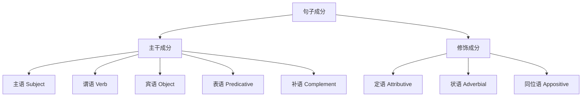
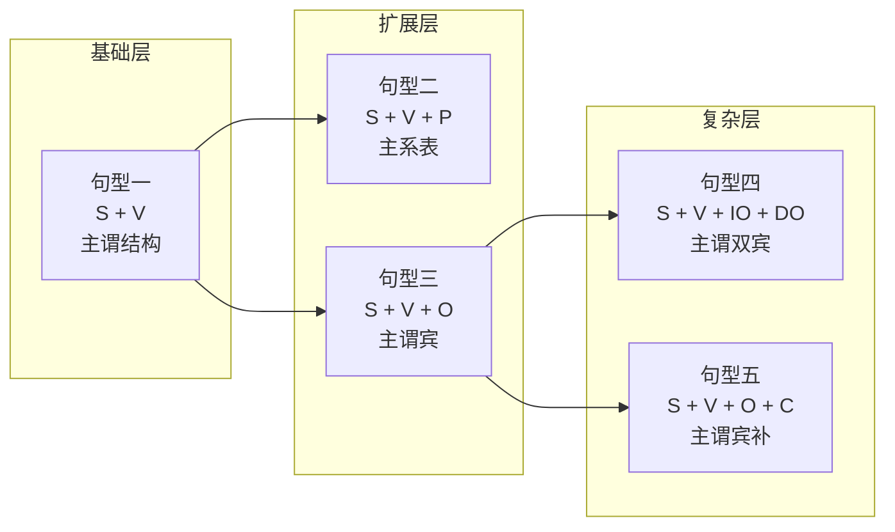
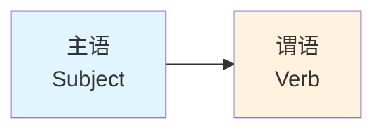
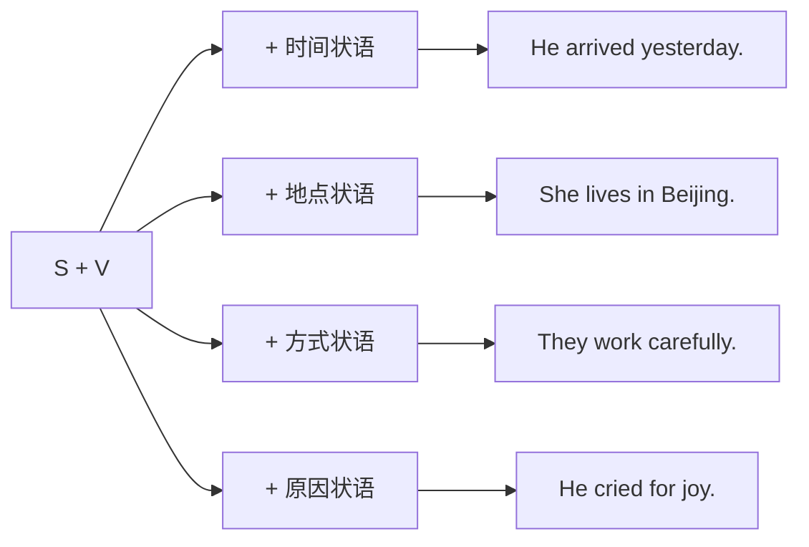
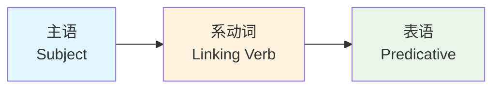
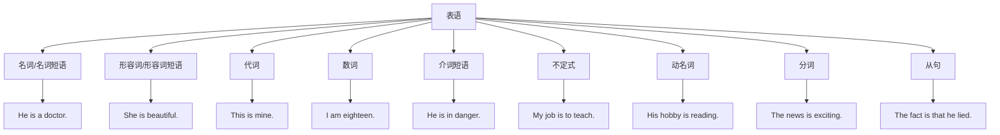
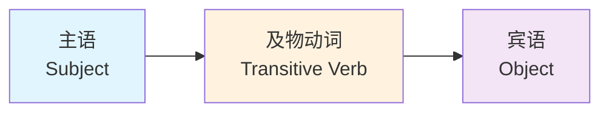
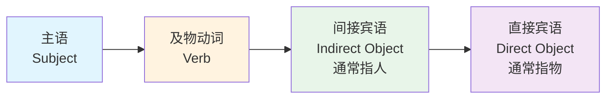
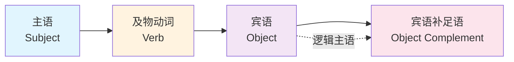
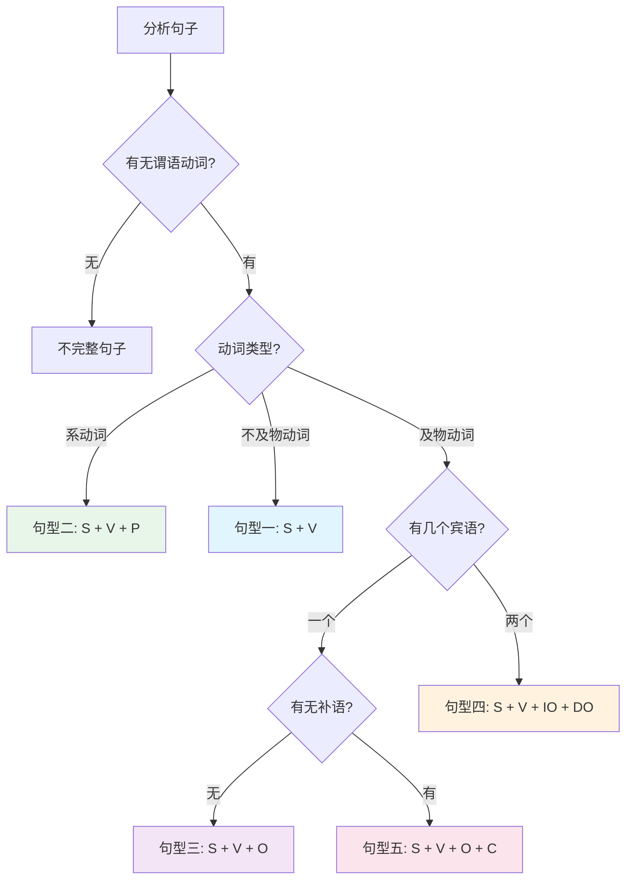

# 英语五大基本句型详解

## 引言

> [!abstract] 本章导读
> 英语句子千变万化，但万变不离其宗——所有英语句子都是由**五大基本句型**衍生而来。掌握这五种句型，就等于掌握了英语句子的"基因密码"。本章将深入剖析每种句型的结构、用法、变体及常见错误，帮助你建立起坚实的句法基础。

学习语法的目的是什么？不是为了考试，不是为了炫技，而是为了**准确、流畅地表达思想**。而要做到这一点，首先必须理解句子是如何构成的。

想象你要盖一栋房子。无论是茅草屋还是摩天大楼，都需要基本的框架结构。英语句子也是如此——无论是简单的"I go."还是复杂的学术论文，其骨架都逃不出五种基本模式。

本章将带你：
- 深入理解五大句型的本质区别
- 学会识别和运用各种句子成分
- 掌握句型变换和扩展的方法
- 避免常见的句法错误

---

## 第一节 句子成分概述

### 1.1 什么是句子成分

在学习五大句型之前，我们需要先认识构成句子的"零件"——**句子成分**（Parts of a Sentence）。

> [!info] 句子成分定义
> 句子成分是指句子中承担特定语法功能的词或词组。每个成分都有其特定的位置和作用，共同构成完整的句子。

英语句子的基本成分包括：

| 成分 | 英文名称 | 符号 | 核心功能 |
|------|----------|------|----------|
| 主语 | Subject | S | 动作的发出者或描述对象 |
| 谓语 | Predicate/Verb | V | 表示动作或状态 |
| 宾语 | Object | O | 动作的承受者 |
| 表语 | Predicative | P | 说明主语的身份或状态 |
| 补语 | Complement | C | 补充说明宾语 |
| 定语 | Attributive | - | 修饰名词 |
| 状语 | Adverbial | - | 修饰动词、形容词或全句 |

### 1.2 主干成分与修饰成分

句子成分可以分为两大类：

**主干成分**决定句子的基本结构，是句子的"骨架"；**修饰成分**则为句子添加细节，是句子的"血肉"。

> [!example] 主干与修饰的区分
> **完整句子**：The young boy quickly ate a big apple in the kitchen.
>
> **主干成分**：The boy ate an apple.（男孩吃了苹果）
> - 主语：The boy
> - 谓语：ate
> - 宾语：an apple
>
> **修饰成分**：
> - 定语：young（修饰 boy）、big（修饰 apple）
> - 状语：quickly（修饰 ate）、in the kitchen（修饰全句）

### 1.3 句子成分的识别方法

#### 如何找主语？

问"谁/什么"做了这个动作？

| 句子 | 问题 | 主语 |
|------|------|------|
| **Tom** studies hard. | 谁学习？ | Tom |
| **The weather** is nice. | 什么好？ | The weather |
| **Running** is good for health. | 什么对健康好？ | Running |
| **What he said** surprised me. | 什么让我惊讶？ | What he said |

#### 如何找谓语？

找主语之后的动词或动词短语。

| 句子 | 主语 | 谓语 |
|------|------|------|
| She **sings** beautifully. | She | sings |
| They **have finished** the work. | They | have finished |
| I **am reading** a book. | I | am reading |

#### 如何找宾语？

问"谁/什么"接受了这个动作？

| 句子 | 问题 | 宾语 |
|------|------|------|
| I love **music**. | 我爱什么？ | music |
| She bought **a new car**. | 她买了什么？ | a new car |
| He told me **a story**. | 他告诉我什么？ | a story |

---

## 第二节 五大基本句型总览

### 2.1 五大句型的定义

英语的五大基本句型是：

| 句型 | 结构 | 中文名称 | 典型例句 |
|------|------|----------|----------|
| 句型一 | S + V | 主谓结构 | Birds fly. |
| 句型二 | S + V + P | 主系表结构 | She is beautiful. |
| 句型三 | S + V + O | 主谓宾结构 | I love you. |
| 句型四 | S + V + IO + DO | 主谓双宾结构 | He gave me a book. |
| 句型五 | S + V + O + C | 主谓宾补结构 | We call him Tom. |

### 2.2 五大句型的关系图

### 2.3 判断句型的核心：动词类型

> [!important] 关键认知
> 句子采用哪种句型，主要取决于**谓语动词的类型**。不同类型的动词要求不同的句子结构。

动词类型决定句型：

| 动词类型 | 特点 | 对应句型 |
|----------|------|----------|
| 不及物动词 | 不需要宾语 | 句型一 S+V |
| 系动词 | 连接主语和表语 | 句型二 S+V+P |
| 单及物动词 | 带一个宾语 | 句型三 S+V+O |
| 双及物动词 | 带两个宾语 | 句型四 S+V+IO+DO |
| 复合及物动词 | 带宾语和宾补 | 句型五 S+V+O+C |

---

## 第三节 句型一：S + V（主谓结构）

### 3.1 基本概念

**主谓结构**是最简单的句型，只包含主语和谓语两个成分。谓语动词必须是**不及物动词**（Intransitive Verb），即不需要宾语的动词。

> [!info] 不及物动词
> 不及物动词表示的动作不涉及其他事物，动作"不及于物"，因此不需要宾语来承受动作。

### 3.2 结构图解

### 3.3 典型例句分析

#### 基础例句

| 主语 | 谓语 | 中文翻译 |
|------|------|----------|
| Birds | fly. | 鸟飞。 |
| The sun | rises. | 太阳升起。 |
| Children | laugh. | 孩子们笑。 |
| Time | flies. | 时光飞逝。 |
| Accidents | happen. | 事故发生。 |

#### 详细句法分析

> [!example] 例句 1：The baby cried loudly.
> **句子成分分析**：
> - **主语**：The baby（婴儿）——名词短语
> - **谓语**：cried（哭了）——不及物动词过去式
> - **状语**：loudly（大声地）——副词，修饰谓语动词
>
> **句型判定**：S + V + 状语
>
> **翻译**：婴儿大声地哭了。

> [!example] 例句 2：The meeting will begin at 9 o'clock.
> **句子成分分析**：
> - **主语**：The meeting（会议）——名词短语
> - **谓语**：will begin（将开始）——不及物动词将来时
> - **状语**：at 9 o'clock（在9点钟）——介词短语，表时间
>
> **句型判定**：S + V + 状语
>
> **翻译**：会议将在9点钟开始。

### 3.4 常见不及物动词

#### 表示移动方向的动词

| 动词 | 含义 | 例句 |
|------|------|------|
| go | 去 | He **goes** home. |
| come | 来 | Spring **comes**. |
| arrive | 到达 | The train **arrived**. |
| depart | 离开 | The plane **departs** soon. |
| rise | 升起 | The moon **rises**. |
| fall | 落下 | Leaves **fall** in autumn. |

#### 表示状态变化的动词

| 动词 | 含义 | 例句 |
|------|------|------|
| happen | 发生 | Something **happened**. |
| occur | 发生 | An idea **occurred** to me. |
| appear | 出现 | Stars **appear** at night. |
| disappear | 消失 | The sun **disappeared**. |
| exist | 存在 | Life **exists** on Earth. |
| die | 死亡 | The plant **died**. |

#### 表示人体动作的动词

| 动词 | 含义 | 例句 |
|------|------|------|
| laugh | 笑 | She **laughed** happily. |
| cry | 哭 | The baby **cried**. |
| sleep | 睡 | He **sleeps** well. |
| work | 工作 | They **work** hard. |
| swim | 游泳 | Fish **swim**. |
| run | 跑 | The dog **runs** fast. |

### 3.5 S+V 句型的扩展

虽然 S+V 是最简单的句型，但可以通过添加状语来丰富句子内容：

#### 扩展示例

| 基础句 | 添加状语 | 完整句 |
|--------|----------|--------|
| Birds fly. | + 方式状语 | Birds fly **freely**. |
| He works. | + 地点状语 | He works **in a bank**. |
| She smiled. | + 时间状语 | She smiled **yesterday**. |
| They talked. | + 时间 + 地点 | They talked **for hours** **in the park**. |

### 3.6 注意事项

> [!warning] 易混淆点：不及物动词 vs 及物动词
> 有些动词既可作不及物动词，也可作及物动词，意义可能不同：
>
> | 动词 | 不及物用法 | 及物用法 |
> |------|-----------|----------|
> | run | The boy runs fast.（跑） | He runs a company.（经营） |
> | work | She works hard.（工作） | He worked the machine.（操作） |
> | fly | Birds fly.（飞） | He flies kites.（放风筝） |
> | grow | Plants grow.（生长） | They grow rice.（种植） |

> [!caution] 常见错误
> ❌ He arrived the station.（arrived 是不及物动词，不能直接接宾语）
> ✅ He arrived **at** the station.（需要介词）
>
> ❌ The accident was happened yesterday.（happen 无被动语态）
> ✅ The accident **happened** yesterday.

---

## 第四节 句型二：S + V + P（主系表结构）

### 4.1 基本概念

**主系表结构**由主语、系动词和表语三部分组成。系动词（Linking Verb）起连接作用，将主语和表语联系起来。表语（Predicative）用来说明主语的身份、特征、状态等。

> [!info] 系动词的本质
> 系动词本身没有完整的词汇意义，它的作用是把后面的表语"系"到主语上，对主语进行说明。"系"就是"联系"、"连接"的意思。

### 4.2 结构图解

### 4.3 系动词的分类

系动词可以分为以下几类：

#### 4.3.1 状态系动词：be

**be** 是最基本、最常用的系动词，表示主语的身份、特征或状态。

| 主语 | be 动词 | 表语 | 翻译 |
|------|---------|------|------|
| I | am | a teacher. | 我是老师。 |
| She | is | beautiful. | 她很漂亮。 |
| They | are | in the room. | 他们在房间里。 |
| The book | was | interesting. | 这本书很有趣。 |

#### 4.3.2 持续系动词

表示主语保持某种状态：

| 系动词 | 含义 | 例句 |
|--------|------|------|
| remain | 仍然是 | He **remains** silent. |
| stay | 保持 | She **stayed** calm. |
| keep | 保持 | Please **keep** quiet. |
| continue | 继续是 | The weather **continues** fine. |

#### 4.3.3 变化系动词

表示主语由一种状态变成另一种状态：

| 系动词 | 含义 | 例句 |
|--------|------|------|
| become | 成为 | He **became** a doctor. |
| get | 变得 | It's **getting** dark. |
| turn | 变成 | The leaves **turn** yellow. |
| go | 变得 | The milk **went** bad. |
| grow | 变得 | She **grew** angry. |
| come | 变成 | Dreams **come** true. |
| fall | 变成 | He **fell** asleep. |

#### 4.3.4 感官系动词

表示主语给人的感觉：

| 系动词 | 对应感官 | 例句 |
|--------|----------|------|
| look | 视觉 | She **looks** tired. |
| sound | 听觉 | That **sounds** great! |
| smell | 嗅觉 | The flower **smells** sweet. |
| taste | 味觉 | The soup **tastes** delicious. |
| feel | 触觉/感觉 | I **feel** happy. |

#### 4.3.5 表象系动词

表示"看起来似乎是"：

| 系动词 | 含义 | 例句 |
|--------|------|------|
| seem | 似乎 | He **seems** honest. |
| appear | 显得 | She **appears** nervous. |
| prove | 证明是 | The news **proved** true. |
| turn out | 结果是 | It **turned out** fine. |

### 4.4 表语的类型

表语可以由多种词类充当：

### 4.5 典型例句分析

> [!example] 例句 1：The weather is getting warmer and warmer.
> **句子成分分析**：
> - **主语**：The weather（天气）
> - **系动词**：is getting（变得）——进行时态的变化系动词
> - **表语**：warmer and warmer（越来越暖和）——形容词比较级
>
> **句型判定**：S + V + P
>
> **翻译**：天气变得越来越暖和了。

> [!example] 例句 2：His dream is to become a scientist.
> **句子成分分析**：
> - **主语**：His dream（他的梦想）
> - **系动词**：is（是）
> - **表语**：to become a scientist（成为一名科学家）——不定式短语
>
> **句型判定**：S + V + P
>
> **翻译**：他的梦想是成为一名科学家。

> [!example] 例句 3：What he said sounds reasonable.
> **句子成分分析**：
> - **主语**：What he said（他说的话）——主语从句
> - **系动词**：sounds（听起来）——感官系动词
> - **表语**：reasonable（合理的）——形容词
>
> **句型判定**：S + V + P
>
> **翻译**：他说的话听起来很合理。

### 4.6 系动词与实义动词的区分

> [!warning] 重要区分
> 某些动词既可作系动词，也可作实义动词，需要根据语境判断：

| 动词 | 作系动词（+ 表语） | 作实义动词（+ 宾语/状语） |
|------|-------------------|--------------------------|
| look | She **looks** happy.（看起来高兴） | She **looked** at me.（看着我） |
| feel | I **feel** cold.（感到冷） | I **felt** the cloth.（摸布料） |
| smell | The flower **smells** nice.（闻起来香） | She **smelled** the flower.（闻花） |
| taste | The cake **tastes** sweet.（尝起来甜） | He **tasted** the soup.（尝汤） |
| grow | He **grew** old.（变老） | They **grow** rice.（种水稻） |
| turn | Leaves **turn** yellow.（变黄） | She **turned** the page.（翻页） |

**判断方法**：
- 如果动词后面是**形容词**或**名词**，且该词描述主语的状态或身份 → 系动词
- 如果动词后面是**名词**且该名词承受动作，或动词后面是**介词短语/副词** → 实义动词

### 4.7 注意事项

> [!caution] 常见错误

**错误一：系动词后误用副词**

❌ She looks **beautifully**.
✅ She looks **beautiful**.
（系动词后应接形容词作表语，不是副词）

❌ The soup tastes **well**.
✅ The soup tastes **good**.
（good 是形容词，well 作"好"讲时通常是副词）

**错误二：漏用系动词**

❌ He very tired.
✅ He **is** very tired.
（英语句子必须有谓语动词）

**错误三：混淆 be 与 become**

❌ When I grow up, I want to be become a teacher.
✅ When I grow up, I want to **become** a teacher.
（become 本身就是系动词，不需要 be）

---

## 第五节 句型三：S + V + O（主谓宾结构）

### 5.1 基本概念

**主谓宾结构**是英语中最常见的句型之一。谓语动词是**及物动词**（Transitive Verb），后面必须接宾语来承受动作。

> [!info] 及物动词
> 及物动词表示的动作必须涉及某个对象，动作"及于物"，需要宾语来完成句意。如果只说"I love"，就让人困惑"你爱什么？"

### 5.2 结构图解

### 5.3 宾语的类型

宾语可以由多种词类充当：

| 宾语类型 | 例句 | 宾语成分 |
|----------|------|----------|
| 名词 | I love **music**. | music |
| 代词 | She saw **him**. | him |
| 数词 | I want **two**. | two |
| 动名词 | He enjoys **swimming**. | swimming |
| 不定式 | She wants **to go**. | to go |
| 从句 | I know **that he is right**. | that he is right |
| 名词短语 | He bought **a new car**. | a new car |

### 5.4 典型例句分析

> [!example] 例句 1：She plays the piano every day.
> **句子成分分析**：
> - **主语**：She（她）
> - **谓语**：plays（弹奏）——及物动词
> - **宾语**：the piano（钢琴）
> - **状语**：every day（每天）——时间状语
>
> **句型判定**：S + V + O + 状语
>
> **翻译**：她每天弹钢琴。

> [!example] 例句 2：I don't know what to do.
> **句子成分分析**：
> - **主语**：I（我）
> - **谓语**：don't know（不知道）——及物动词的否定形式
> - **宾语**：what to do（做什么）——"疑问词 + 不定式"结构
>
> **句型判定**：S + V + O
>
> **翻译**：我不知道该做什么。

> [!example] 例句 3：He admitted having made a mistake.
> **句子成分分析**：
> - **主语**：He（他）
> - **谓语**：admitted（承认）——及物动词
> - **宾语**：having made a mistake（犯了错误）——动名词完成式
>
> **句型判定**：S + V + O
>
> **翻译**：他承认犯了错误。

### 5.5 常见及物动词分类

#### 5.5.1 只接名词/代词作宾语的动词

| 动词 | 含义 | 例句 |
|------|------|------|
| have | 有 | I **have** a dream. |
| need | 需要 | We **need** help. |
| own | 拥有 | She **owns** a house. |
| lack | 缺乏 | He **lacks** confidence. |
| contain | 包含 | The box **contains** books. |

#### 5.5.2 接动名词作宾语的动词

> [!tip] 记忆口诀
> **"MEGaFEPS"**：mind, enjoy, give up, avoid, finish, escape, practice, suggest
>
> 这些动词后面只能接动名词，不能接不定式。

| 动词 | 例句 |
|------|------|
| enjoy | I enjoy **reading**. |
| finish | He finished **writing**. |
| avoid | She avoided **meeting** him. |
| practice | We practice **speaking**. |
| suggest | He suggested **going** there. |
| mind | Would you mind **waiting**? |
| keep | Keep **trying**! |
| consider | I'm considering **buying** a car. |

#### 5.5.3 接不定式作宾语的动词

> [!tip] 记忆口诀
> **"3 个希望 2 答应，2 个要求莫拒绝，设法学会做决定，不要假装在选择"**
> hope, wish, want; agree, promise; ask, demand; refuse; manage, learn; decide; pretend; choose

| 动词 | 例句 |
|------|------|
| want | I want **to go**. |
| hope | She hopes **to win**. |
| decide | He decided **to leave**. |
| agree | They agreed **to help**. |
| refuse | He refused **to answer**. |
| learn | I'm learning **to drive**. |
| manage | She managed **to escape**. |
| pretend | He pretended **to sleep**. |

#### 5.5.4 接动名词和不定式意义不同的动词

| 动词 | + 动名词 | + 不定式 |
|------|----------|----------|
| remember | remember doing（记得做过）| remember to do（记得要做）|
| forget | forget doing（忘记做过）| forget to do（忘记要做）|
| stop | stop doing（停止做某事）| stop to do（停下来去做）|
| try | try doing（尝试做）| try to do（努力做）|
| mean | mean doing（意味着）| mean to do（打算做）|
| regret | regret doing（后悔做过）| regret to do（遗憾要做）|

> [!example] 对比示例
> - I **remember meeting** him before.（我记得以前见过他。）
> - I **remember to meet** him tomorrow.（我记得明天要见他。）
>
> - He **stopped smoking**.（他戒烟了。）
> - He **stopped to smoke**.（他停下来去抽烟。）

### 5.6 宾语从句

当宾语是一个完整的句子时，就形成了**宾语从句**：

| 引导词类型 | 引导词 | 例句 |
|------------|--------|------|
| 陈述句变来 | that | I know **that he is honest**. |
| 一般疑问句变来 | if/whether | I wonder **if he will come**. |
| 特殊疑问句变来 | what, who, when, where, why, how 等 | I don't know **where he lives**. |

> [!warning] 宾语从句的语序
> 宾语从句必须用陈述语序（主语 + 谓语），不能用疑问语序。
>
> ❌ I don't know where does he live.
> ✅ I don't know where he lives.

### 5.7 注意事项

> [!caution] 常见错误

**错误一：及物动词漏宾语**

❌ I like very much.
✅ I like **it** very much.
（like 是及物动词，必须有宾语）

**错误二：宾语从句用疑问语序**

❌ I wonder what is his name.
✅ I wonder what his name is.
（从句用陈述语序）

**错误三：混淆动名词和不定式**

❌ I enjoy to swim.
✅ I enjoy swimming.
（enjoy 后只能接动名词）

---

## 第六节 句型四：S + V + IO + DO（主谓双宾结构）

### 6.1 基本概念

**主谓双宾结构**中，谓语动词后接两个宾语：**间接宾语**（Indirect Object，通常指人）和**直接宾语**（Direct Object，通常指物）。

> [!info] 双宾语的区分
> - **间接宾语（IO）**：动作的间接承受者，通常是人，回答"给谁"的问题
> - **直接宾语（DO）**：动作的直接承受者，通常是物，回答"什么"的问题
>
> 在语序上，通常是：V + IO（人）+ DO（物）

### 6.2 结构图解

### 6.3 典型例句分析

> [!example] 例句 1：He gave me a book.
> **句子成分分析**：
> - **主语**：He（他）
> - **谓语**：gave（给了）——双宾动词
> - **间接宾语**：me（我）——动作的间接承受者
> - **直接宾语**：a book（一本书）——动作的直接承受者
>
> **句型判定**：S + V + IO + DO
>
> **翻译**：他给了我一本书。

> [!example] 例句 2：My mother bought me a new dress.
> **句子成分分析**：
> - **主语**：My mother（我妈妈）
> - **谓语**：bought（买了）——双宾动词
> - **间接宾语**：me（我）
> - **直接宾语**：a new dress（一条新裙子）
>
> **句型判定**：S + V + IO + DO
>
> **翻译**：我妈妈给我买了一条新裙子。

> [!example] 例句 3：Could you pass me the salt?
> **句子成分分析**：
> - **主语**：you（你）
> - **谓语**：pass（递）——双宾动词
> - **间接宾语**：me（我）
> - **直接宾语**：the salt（盐）
>
> **句型判定**：S + V + IO + DO
>
> **翻译**：你能把盐递给我吗？

### 6.4 常见双宾动词

双宾动词根据转换介词的不同可以分为两类：

#### 6.4.1 可用 to 转换的动词

这类动词表示"给予"类动作，转换时用 **to**：

| 动词 | S + V + IO + DO | S + V + DO + to + IO |
|------|-----------------|----------------------|
| give | give me a book | give a book **to** me |
| send | send her a letter | send a letter **to** her |
| show | show us the way | show the way **to** us |
| tell | tell me the truth | tell the truth **to** me |
| teach | teach us English | teach English **to** us |
| pass | pass me the salt | pass the salt **to** me |
| lend | lend him some money | lend some money **to** him |
| bring | bring me a cup of tea | bring a cup of tea **to** me |
| write | write her a letter | write a letter **to** her |
| offer | offer him a job | offer a job **to** him |

#### 6.4.2 可用 for 转换的动词

这类动词表示"为...做"类动作，转换时用 **for**：

| 动词 | S + V + IO + DO | S + V + DO + for + IO |
|------|-----------------|----------------------|
| buy | buy me a gift | buy a gift **for** me |
| make | make her a cake | make a cake **for** her |
| cook | cook us dinner | cook dinner **for** us |
| get | get me a ticket | get a ticket **for** me |
| find | find me a seat | find a seat **for** me |
| leave | leave him a message | leave a message **for** him |
| sing | sing us a song | sing a song **for** us |
| save | save me some food | save some food **for** me |

> [!tip] 记忆技巧
> - **to**：动作有明确的"方向性"，强调给予的对象（give to, send to, show to...）
> - **for**：动作是"为了某人"而做，强调受益者（buy for, make for, cook for...）

### 6.5 双宾结构与介词结构的选择

两种结构都正确，但在以下情况下有偏好：

| 情况 | 偏好结构 | 例句 |
|------|----------|------|
| 强调间接宾语 | 用介词结构 | I gave the book to **Mary**, not to Tom. |
| 间接宾语较长 | 用介词结构 | I gave the book **to the man standing over there**. |
| 直接宾语是代词 | 用介词结构 | Please give **it** to me.（不说 give me it） |
| 两个宾语都是代词 | 用介词结构 | Give **it** to **her**.（不说 give her it） |
| 正常语序 | S + V + IO + DO | I gave him a book.（最常见） |

### 6.6 双宾结构 vs 宾补结构的区分

> [!warning] 重要区分
> 有些句子看起来相似，但句型不同。关键是判断第二个名词与第一个名词的关系：

**判断方法**：在两个名词之间加上 be 动词，看是否成立。

| 句子 | 加 be 测试 | 结果 | 句型 |
|------|-----------|------|------|
| He gave me a book. | me ≠ a book | 不成立 | 双宾结构 |
| We call him Tom. | him = Tom | 成立 | 宾补结构 |
| She made me a cake. | me ≠ a cake | 不成立 | 双宾结构 |
| She made me happy. | me = happy | 成立 | 宾补结构 |

### 6.7 注意事项

> [!caution] 常见错误

**错误一：介词选择错误**

❌ He bought a gift to me.
✅ He bought a gift **for** me.
（buy 转换时用 for，不用 to）

**错误二：代词宾语位置错误**

❌ Give me it.
✅ Give **it to me**.
（当直接宾语是代词 it/them 时，通常用介词结构）

**错误三：省略介词**

❌ He explained me the problem.
✅ He explained the problem **to** me.
（explain 不是双宾动词，必须用介词结构）

> [!info] 不是双宾动词的常见动词
> 以下动词看似可以接双宾，但实际必须用介词结构：
> - explain sth. **to** sb.（解释）
> - introduce sb. **to** sb.（介绍）
> - suggest sth. **to** sb.（建议）
> - describe sth. **to** sb.（描述）
> - announce sth. **to** sb.（宣布）
> - report sth. **to** sb.（报告）

---

## 第七节 句型五：S + V + O + C（主谓宾补结构）

### 7.1 基本概念

**主谓宾补结构**中，谓语动词后接宾语和**宾语补足语**（Object Complement）。宾语补足语用来补充说明宾语的状态、身份或动作。

> [!info] 宾语补足语
> 宾语补足语是用来补充说明宾语的成分，与宾语之间存在逻辑上的主谓关系。也就是说，宾语与宾补之间可以构成一个"主语 + 谓语"的关系。

### 7.2 结构图解

### 7.3 宾语补足语的类型

宾语补足语可以由多种成分充当：

| 补语类型 | 例句 | O + C 的逻辑关系 |
|----------|------|------------------|
| 名词 | We call him **Tom**. | him = Tom |
| 形容词 | The news made me **happy**. | I am happy |
| 介词短语 | I found him **in the room**. | He is in the room |
| 不定式 | I want you **to go**. | You go |
| 现在分词 | I heard her **singing**. | She was singing |
| 过去分词 | I had my hair **cut**. | My hair was cut |

### 7.4 典型例句分析

> [!example] 例句 1：We elected him monitor.
> **句子成分分析**：
> - **主语**：We（我们）
> - **谓语**：elected（选举）——复合及物动词
> - **宾语**：him（他）
> - **宾语补足语**：monitor（班长）——名词
> - **逻辑关系**：him = monitor（他是班长）
>
> **句型判定**：S + V + O + C
>
> **翻译**：我们选他当班长。

> [!example] 例句 2：I found the book interesting.
> **句子成分分析**：
> - **主语**：I（我）
> - **谓语**：found（发现）——复合及物动词
> - **宾语**：the book（这本书）
> - **宾语补足语**：interesting（有趣的）——形容词
> - **逻辑关系**：the book is interesting（这本书有趣）
>
> **句型判定**：S + V + O + C
>
> **翻译**：我发现这本书很有趣。

> [!example] 例句 3：The teacher asked us to hand in our homework.
> **句子成分分析**：
> - **主语**：The teacher（老师）
> - **谓语**：asked（要求）——复合及物动词
> - **宾语**：us（我们）
> - **宾语补足语**：to hand in our homework（交作业）——不定式
> - **逻辑关系**：we hand in our homework（我们交作业）
>
> **句型判定**：S + V + O + C
>
> **翻译**：老师要求我们交作业。

### 7.5 常见复合及物动词

#### 7.5.1 接名词作宾补的动词

| 动词 | 例句 | 含义 |
|------|------|------|
| call | We call him Tom. | 称呼他为汤姆 |
| name | They named the baby Lucy. | 给婴儿取名露西 |
| elect | We elected her president. | 选她为主席 |
| make | They made him captain. | 让他当队长 |
| appoint | They appointed him manager. | 任命他为经理 |
| consider | I consider him a friend. | 认为他是朋友 |

#### 7.5.2 接形容词作宾补的动词

| 动词 | 例句 | 含义 |
|------|------|------|
| make | The news made me happy. | 使我高兴 |
| keep | Keep the door open. | 让门开着 |
| leave | Don't leave me alone. | 别让我独自一人 |
| find | I found him honest. | 发现他诚实 |
| think | I think it possible. | 认为可能 |
| consider | I consider it important. | 认为重要 |
| paint | She painted the wall white. | 把墙漆成白色 |
| drive | The noise drove me crazy. | 噪音让我发疯 |

#### 7.5.3 接不定式作宾补的动词

| 类型 | 动词 | 例句 |
|------|------|------|
| 带 to 的不定式 | ask, tell, want, expect, allow, advise, order, force, encourage | I want you **to go**. |
| 不带 to 的不定式 | make, let, have（使役动词）| I **made** him **go**. |
| 不带 to 的不定式 | see, hear, watch, feel, notice（感官动词）| I **saw** him **leave**. |

> [!warning] 使役动词和感官动词
> 使役动词（make, let, have）和感官动词（see, hear, watch, feel, notice）后接不定式作宾补时，**省略 to**：
>
> - I made him **go**.（不是 to go）
> - I saw him **leave**.（不是 to leave）
>
> 但在被动语态中，要**还原 to**：
> - He was made **to go**.
> - He was seen **to leave**.

#### 7.5.4 接分词作宾补的动词

| 分词类型 | 使用场景 | 例句 |
|----------|----------|------|
| 现在分词 | 宾语主动发出动作，强调正在进行 | I heard him **singing**. |
| 过去分词 | 宾语被动承受动作，强调完成 | I had my hair **cut**. |

> [!example] 现在分词 vs 过去分词
> - I saw the boy **running**.（我看见那男孩在跑。——主动，进行）
> - I saw the boy **beaten**.（我看见那男孩被打了。——被动，完成）
>
> - I'll have someone **repair** the car.（我会让人修车。——原形，主动）
> - I'll have the car **repaired**.（我会让车被修好。——过去分词，被动）

### 7.6 宾语补足语的识别

#### 识别方法一：加 be 测试

在宾语和疑似宾补之间加入 be 动词，如果能构成合理的句子，则是宾补结构：

| 句子 | 测试 | 结论 |
|------|------|------|
| We call him Tom. | He is Tom. ✓ | 宾补 |
| I gave him a book. | He is a book. ✗ | 双宾 |
| I found him tired. | He is tired. ✓ | 宾补 |
| I bought him a gift. | He is a gift. ✗ | 双宾 |

#### 识别方法二：语义分析

- **双宾结构**：两个名词之间没有等同或描述关系
- **宾补结构**：补语是对宾语的说明、描述或补充

### 7.7 注意事项

> [!caution] 常见错误

**错误一：使役动词后加 to**

❌ The teacher made him to apologize.
✅ The teacher made him apologize.
（make 后不定式省略 to）

**错误二：感官动词后混淆不定式和分词**

❌ I saw him to run.
✅ I saw him **run**.（强调看到整个动作）
✅ I saw him **running**.（强调看到动作正在进行）

**错误三：宾补与宾语不一致**

❌ We elected he president.
✅ We elected **him** president.
（宾语用宾格）

---

## 第八节 五大句型对比与综合运用

### 8.1 五大句型对比总结

| 句型 | 结构 | 动词类型 | 核心特征 | 典型例句 |
|------|------|----------|----------|----------|
| 句型一 | S + V | 不及物动词 | 无宾语 | Birds fly. |
| 句型二 | S + V + P | 系动词 | 有表语，说明主语 | She is beautiful. |
| 句型三 | S + V + O | 单及物动词 | 有一个宾语 | I love music. |
| 句型四 | S + V + IO + DO | 双宾动词 | 有两个宾语（人+物） | He gave me a book. |
| 句型五 | S + V + O + C | 复合及物动词 | 有宾语+宾补 | We call him Tom. |

### 8.2 句型判断流程图

### 8.3 同一动词在不同句型中的应用

许多动词可以用于多种句型，意义可能有所不同：

#### 8.3.1 grow 的多种用法

| 句型 | 例句 | 动词类型 | 含义 |
|------|------|----------|------|
| S + V | The tree grows fast. | 不及物 | 生长 |
| S + V + P | She grew angry. | 系动词 | 变得 |
| S + V + O | They grow rice. | 及物 | 种植 |

#### 8.3.2 make 的多种用法

| 句型 | 例句 | 含义 |
|------|------|------|
| S + V + O | She made a cake. | 做了蛋糕 |
| S + V + IO + DO | She made me a cake. | 给我做了蛋糕 |
| S + V + O + C | She made me happy. | 使我高兴 |

#### 8.3.3 call 的多种用法

| 句型 | 例句 | 含义 |
|------|------|------|
| S + V | He called loudly. | 大声喊叫 |
| S + V + O | He called a taxi. | 叫了出租车 |
| S + V + O + C | We call him Tom. | 叫他汤姆 |

### 8.4 句型转换练习

将下列句子分析句型并进行转换：

> [!example] 练习 1
> **原句**：He gave me a present.（句型四：S + V + IO + DO）
>
> **转换**：
> - He gave a present **to** me.（介词结构）
> - A present was given **to** me by him.（被动语态）
> - I was given a present by him.（被动语态，间接宾语作主语）

> [!example] 练习 2
> **原句**：The news made us excited.（句型五：S + V + O + C）
>
> **转换**：
> - We were made excited by the news.（被动语态）
> - We got excited at the news.（系表结构）

### 8.5 复杂句子的句型分析

即使是复杂句子，其核心也是五大句型之一。分析时要先找出主干：

> [!example] 复杂句分析
> **句子**：The book that my father bought me last week proved to be very interesting.
>
> **分析步骤**：
> 1. 找主语：The book（that my father bought me last week 是定语从句，修饰 book）
> 2. 找谓语：proved（系动词）
> 3. 找表语：to be very interesting
>
> **主干**：The book proved interesting.
>
> **句型判定**：句型二（S + V + P）
>
> **翻译**：我爸爸上周给我买的那本书证明是非常有趣的。

### 8.6 句型与语态

五大句型转换为被动语态的规则：

| 句型 | 主动语态 | 被动语态 | 可否转换 |
|------|----------|----------|----------|
| 句型一 | Birds fly. | - | ❌ 不能 |
| 句型二 | She is beautiful. | - | ❌ 不能 |
| 句型三 | I love her. | She is loved by me. | ✅ 可以 |
| 句型四 | He gave me a book. | I was given a book. / A book was given to me. | ✅ 两种 |
| 句型五 | We call him Tom. | He is called Tom. | ✅ 可以 |

> [!info] 为什么句型一和句型二不能变被动？
> - 句型一没有宾语，没有动作的承受者
> - 句型二的系动词表示状态，不表示动作

---

## 第九节 常见错误与避坑指南

### 9.1 成分残缺

> [!caution] 错误类型一：缺少谓语动词

❌ The boy who standing there.
✅ The boy **is** standing there.
✅ The boy who **is** standing there is my brother.

❌ He very happy.
✅ He **is** very happy.

> [!caution] 错误类型二：缺少宾语

❌ I enjoy very much.
✅ I enjoy **it** very much.

❌ She wants.
✅ She wants **something** / **to go**.

### 9.2 成分冗余

> [!caution] 错误类型三：重复主语

❌ My father he is a doctor.
✅ My father is a doctor.

❌ The book which I bought it is interesting.
✅ The book which I bought is interesting.

### 9.3 词性误用

> [!caution] 错误类型四：系动词后用副词

❌ The food smells badly.
✅ The food smells **bad**.
（smell 是系动词，后接形容词）

❌ She looks beautifully.
✅ She looks **beautiful**.

> [!caution] 错误类型五：实义动词后用形容词

❌ He runs quick.
✅ He runs **quickly**.
（run 是实义动词，需要副词修饰）

### 9.4 句型混淆

> [!caution] 错误类型六：双宾与宾补混淆

❌ She made me a doctor.（如果想说"她让我成为医生"）
✅ She made me **become** a doctor.
（make sb. sth. 意为"给某人做某物"，如 make me a cake）

正确理解：
- She made me a cake.（她给我做了蛋糕）——双宾
- She made me happy.（她使我高兴）——宾补

> [!caution] 错误类型七：不及物动词接宾语

❌ He arrived the station.
✅ He arrived **at** the station.

❌ I agree you.
✅ I agree **with** you.

❌ We discussed about the problem.
✅ We discussed the problem.
（discuss 是及物动词，直接接宾语，不需要介词）

### 9.5 错误速查表

| 错误类型 | 错误示例 | 正确形式 | 原因 |
|----------|----------|----------|------|
| 缺谓语 | He happy. | He is happy. | 缺少系动词 |
| 缺宾语 | I like. | I like it. | 及物动词需宾语 |
| 重复主语 | My dad he... | My dad... | 主语重复 |
| 词性错误 | looks beautifully | looks beautiful | 系动词后用形容词 |
| 介词误用 | arrive the station | arrive at the station | 不及物动词需介词 |
| 介词多余 | discuss about | discuss | 及物动词不需介词 |

---

## 第十节 实战练习与答案解析

### 10.1 句型判断练习

判断下列句子的句型：

| 序号 | 句子 | 你的答案 |
|------|------|----------|
| 1 | The sun rises in the east. | |
| 2 | English is very important. | |
| 3 | She teaches us English. | |
| 4 | I consider him honest. | |
| 5 | The leaves turn yellow in autumn. | |
| 6 | He bought her a ring. | |
| 7 | The story sounds interesting. | |
| 8 | We made him our monitor. | |
| 9 | She smiled happily. | |
| 10 | I heard someone knock at the door. | |

点击查看答案

| 序号 | 句子 | 句型 | 分析 |
|------|------|------|------|
| 1 | The sun rises in the east. | S + V | rises 是不及物动词 |
| 2 | English is very important. | S + V + P | is 是系动词，important 是表语 |
| 3 | She teaches us English. | S + V + IO + DO | teaches 是双宾动词，us 间接宾语，English 直接宾语 |
| 4 | I consider him honest. | S + V + O + C | him 宾语，honest 宾补（him is honest） |
| 5 | The leaves turn yellow in autumn. | S + V + P | turn 是系动词，yellow 是表语 |
| 6 | He bought her a ring. | S + V + IO + DO | bought 是双宾动词，her 间接宾语，a ring 直接宾语 |
| 7 | The story sounds interesting. | S + V + P | sounds 是感官系动词，interesting 是表语 |
| 8 | We made him our monitor. | S + V + O + C | him 宾语，our monitor 宾补（him = monitor） |
| 9 | She smiled happily. | S + V | smiled 是不及物动词，happily 是状语 |
| 10 | I heard someone knock at the door. | S + V + O + C | someone 宾语，knock 宾补（someone knocks） |

### 10.2 改错练习

找出并改正下列句子中的错误：

| 序号 | 错误句子 |
|------|----------|
| 1 | He looks happily today. |
| 2 | The teacher made him to stay after school. |
| 3 | I enjoy to read novels. |
| 4 | She gave to me a gift. |
| 5 | The accident was happened yesterday. |
| 6 | He explained me the problem. |
| 7 | I saw him to run across the street. |
| 8 | The soup tastes well. |
| 9 | He suggested me to go early. |
| 10 | I agree your opinion. |

点击查看答案

| 序号 | 错误 | 正确 | 原因 |
|------|------|------|------|
| 1 | looks happily | looks **happy** | 系动词后用形容词 |
| 2 | made him to stay | made him **stay** | make 后不定式省略 to |
| 3 | enjoy to read | enjoy **reading** | enjoy 后接动名词 |
| 4 | gave to me a gift | gave me a gift / gave a gift to me | 语序错误 |
| 5 | was happened | **happened** | happen 无被动语态 |
| 6 | explained me | explained **to** me | explain 需要介词 to |
| 7 | saw him to run | saw him **run** | 感官动词后不定式省略 to |
| 8 | tastes well | tastes **good** | 系动词后用形容词 |
| 9 | suggested me to go | suggested **that I (should) go** | suggest 不接不定式 |
| 10 | agree your opinion | agree **with** your opinion | agree 是不及物动词 |

### 10.3 翻译练习

将下列中文句子翻译成英文，注意使用正确的句型：

| 序号 | 中文 |
|------|------|
| 1 | 太阳从东方升起。 |
| 2 | 她看起来很疲惫。 |
| 3 | 我发现这本书很有趣。 |
| 4 | 他给了我一些建议。 |
| 5 | 我们选他当班长。 |

点击查看参考答案

| 序号 | 英文 | 句型 |
|------|------|------|
| 1 | The sun rises in the east. | S + V |
| 2 | She looks very tired. | S + V + P |
| 3 | I found this book (very) interesting. | S + V + O + C |
| 4 | He gave me some advice. / He gave some advice to me. | S + V + IO + DO |
| 5 | We elected him monitor. / We chose him as our monitor. | S + V + O + C |

---

## 本章小结

> [!abstract] 核心要点回顾

### 五大句型速记表

| 句型 | 结构 | 核心动词类型 | 记忆关键词 |
|------|------|--------------|------------|
| 一 | S + V | 不及物动词 | 主谓 |
| 二 | S + V + P | 系动词 | 主系表 |
| 三 | S + V + O | 单及物动词 | 主谓宾 |
| 四 | S + V + IO + DO | 双宾动词 | 双宾（人+物） |
| 五 | S + V + O + C | 复合及物动词 | 宾补（O=C） |

### 学习建议

1. **先分析动词**：判断句型的关键在于分析谓语动词的类型
2. **多做句子分析**：拿到任何句子，都尝试分析其句型
3. **注意一词多用**：同一个词可能在不同句型中有不同用法
4. **积累搭配**：记住常见动词的搭配模式

### 下一步学习

掌握了五大基本句型后，你已经具备了分析英语句子的基本能力。接下来，我们将学习如何通过"疑问句和否定句"来变换这些基本句型，进一步丰富你的表达能力。

---

## 附录：常用动词句型速查表

### 不及物动词（用于句型一）

| 动词 | 含义 | 例句 |
|------|------|------|
| appear | 出现 | Stars appear at night. |
| arrive | 到达 | The train arrived. |
| come | 来 | Spring comes. |
| die | 死 | The plant died. |
| disappear | 消失 | The sun disappeared. |
| exist | 存在 | Life exists on Earth. |
| fall | 落下 | Leaves fall in autumn. |
| go | 去 | He goes to school. |
| happen | 发生 | Something happened. |
| laugh | 笑 | She laughed. |
| occur | 发生 | An idea occurred to me. |
| rise | 升起 | The sun rises. |
| run | 跑 | The dog runs fast. |
| sleep | 睡 | He sleeps well. |
| swim | 游泳 | Fish swim. |
| work | 工作 | They work hard. |

### 系动词（用于句型二）

| 系动词 | 类型 | 例句 |
|--------|------|------|
| be | 状态 | She is a teacher. |
| become | 变化 | He became famous. |
| get | 变化 | It's getting dark. |
| turn | 变化 | Leaves turn yellow. |
| go | 变化 | The milk went bad. |
| grow | 变化 | She grew angry. |
| look | 感官 | She looks tired. |
| sound | 感官 | That sounds great. |
| smell | 感官 | The flower smells sweet. |
| taste | 感官 | The soup tastes good. |
| feel | 感官 | I feel happy. |
| seem | 表象 | He seems honest. |
| appear | 表象 | She appears nervous. |
| prove | 表象 | The news proved true. |
| remain | 持续 | He remains silent. |
| stay | 持续 | She stayed calm. |
| keep | 持续 | Please keep quiet. |

### 双宾动词（用于句型四）

| 动词 | 转换介词 | 例句 |
|------|----------|------|
| give | to | Give me the book. / Give the book to me. |
| send | to | Send her a letter. / Send a letter to her. |
| show | to | Show us the way. / Show the way to us. |
| tell | to | Tell me the truth. / Tell the truth to me. |
| teach | to | Teach us English. / Teach English to us. |
| pass | to | Pass me the salt. / Pass the salt to me. |
| lend | to | Lend him money. / Lend money to him. |
| buy | for | Buy me a gift. / Buy a gift for me. |
| make | for | Make her a cake. / Make a cake for her. |
| cook | for | Cook us dinner. / Cook dinner for us. |
| get | for | Get me a ticket. / Get a ticket for me. |
| find | for | Find me a seat. / Find a seat for me. |

### 复合及物动词（用于句型五）

| 动词 | 宾补类型 | 例句 |
|------|----------|------|
| call | 名词 | We call him Tom. |
| name | 名词 | They named the baby Lucy. |
| elect | 名词 | We elected her president. |
| make | 名词/形容词 | They made him captain. / The news made me happy. |
| keep | 形容词/分词 | Keep the door open. / Keep me waiting. |
| leave | 形容词/分词 | Don't leave me alone. |
| find | 形容词 | I found him honest. |
| consider | 形容词 | I consider it important. |
| think | 形容词 | I think it possible. |
| paint | 形容词 | She painted the wall white. |
| ask | 不定式 | I asked him to help. |
| tell | 不定式 | I told her to wait. |
| want | 不定式 | I want you to go. |
| expect | 不定式 | I expect you to come. |
| make | 不带to不定式 | I made him go. |
| let | 不带to不定式 | Let me go. |
| have | 不带to不定式/分词 | I had him repair it. / I had it repaired. |
| see | 不带to不定式/分词 | I saw him leave. / I saw him leaving. |
| hear | 不带to不定式/分词 | I heard her sing. / I heard her singing. |
| watch | 不带to不定式/分词 | I watched him play. / I watched him playing. |
| feel | 不带to不定式/分词 | I felt the house shake. |
| notice | 不带to不定式/分词 | I noticed him enter. |
