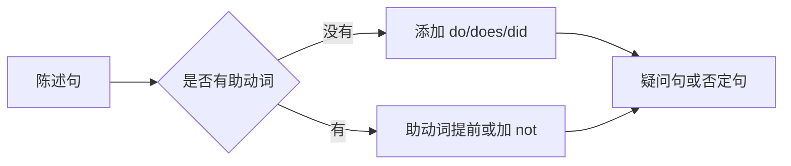
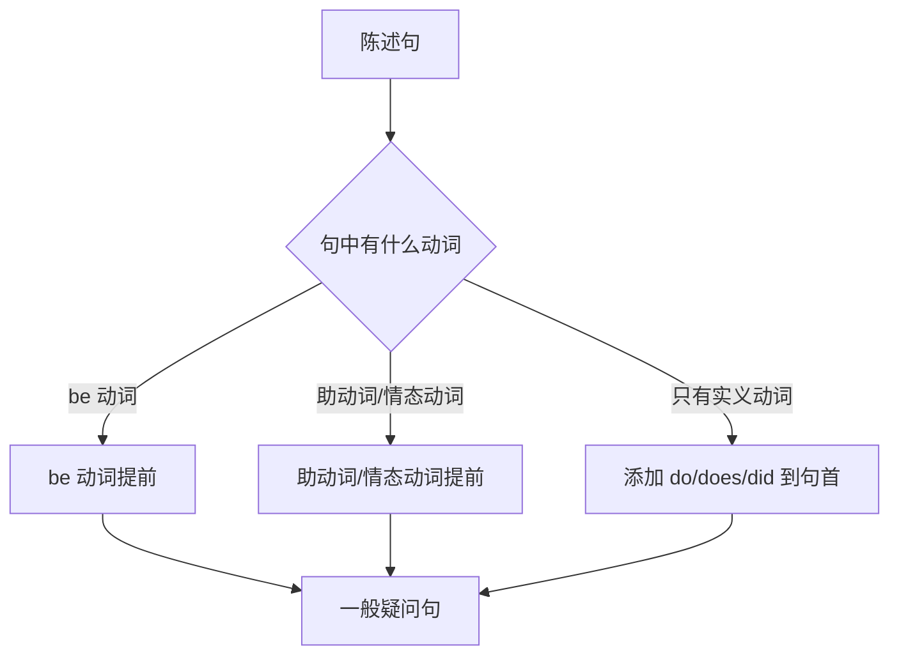
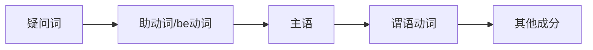
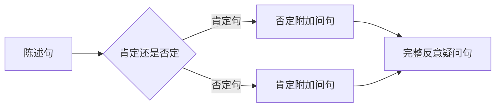
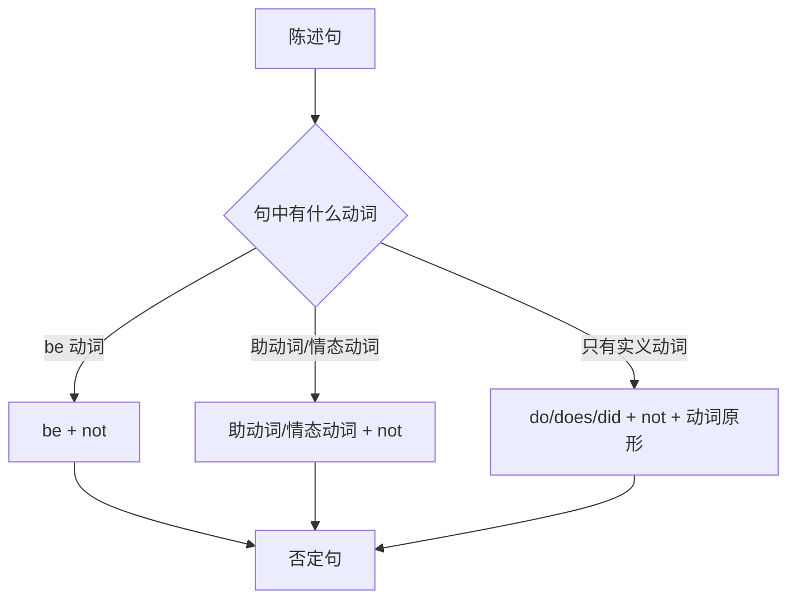
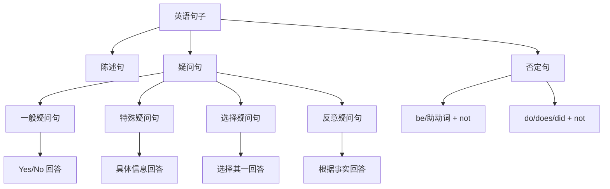

# 疑问句与否定句的构成

在英语表达中，疑问句和否定句是除陈述句之外最常用的两种句型。掌握它们的构成规则，是进行日常交流的基础能力。本篇将从助动词的核心作用出发，系统讲解各类疑问句和否定句的构成方法，并通过大量例句帮助理解和应用。

## 1. 助动词：疑问句与否定句的关键

在深入学习疑问句和否定句之前，必须先理解助动词（Auxiliary Verbs）的概念。助动词是构成疑问句和否定句的核心工具，没有助动词，英语的疑问句和否定句就无法正常构成。

### 1.1 什么是助动词

助动词是一类特殊的动词，它们本身没有完整的词汇意义，但能够帮助主动词（实义动词）完成语法功能。助动词的主要作用包括：

- 构成疑问句
- 构成否定句
- 构成各种时态
- 构成被动语态
- 表达情态意义

> [!info] 助动词的分类
>
> 英语中的助动词主要分为三类：
>
> | 类别 | 成员 | 主要功能 |
> | --- | --- | --- |
> | 基本助动词 | be, have, do | 构成时态、疑问句、否定句 |
> | 情态助动词 | can, could, may, might, will, would, shall, should, must | 表达能力、可能、意愿、义务等 |
> | 半情态动词 | need, dare, ought to, used to | 兼具实义动词和助动词特性 |

### 1.2 助动词 do 的特殊地位

在一般现在时和一般过去时的疑问句、否定句中，当句子没有其他助动词时，必须借助 do/does/did 来完成句子转换。这是英语语法中一个非常重要的规则。

**do 的三种形式及其使用条件**：

| 形式 | 使用条件 | 示例 |
| --- | --- | --- |
| do | 主语为 I/you/we/they 或复数名词，一般现在时 | Do you like coffee? |
| does | 主语为 he/she/it 或单数名词，一般现在时 | Does she work here? |
| did | 一般过去时，所有人称通用 | Did they arrive yesterday? |

> [!warning] 重要规则
>
> 当使用 does 或 did 时，主动词必须恢复原形。这是因为时态和人称信息已经由助动词承担，主动词不再需要变化。
>
> - ✅ Does he **like** music?（like 用原形）
> - ❌ Does he **likes** music?（错误：like 不应加 s）
> - ✅ Did she **go** home?（go 用原形）
> - ❌ Did she **went** home?（错误：go 不应用过去式）

### 1.3 be 动词和 have 动词作为助动词

be 动词和 have 动词既可以作为实义动词（表示"是"和"有"），也可以作为助动词。作为助动词时，它们用于构成进行时态、完成时态和被动语态。

**be 动词作为助动词**：

| 用途 | 结构 | 示例 |
| --- | --- | --- |
| 进行时态 | be + doing | She is reading a book. |
| 被动语态 | be + done | The book was written by him. |

**have 动词作为助动词**：

| 用途 | 结构 | 示例 |
| --- | --- | --- |
| 完成时态 | have/has/had + done | I have finished my homework. |
| 完成进行时 | have/has/had + been + doing | He has been working all day. |

当 be 或 have 作为助动词时，构成疑问句和否定句非常简单：直接将 be/have 提前（疑问句）或在后面加 not（否定句），不需要借助 do。

## 2. 疑问句的四大类型

英语疑问句根据回答方式和句子结构的不同，可以分为四大类型：一般疑问句、特殊疑问句、选择疑问句和反意疑问句。

### 2.1 一般疑问句（Yes/No Questions）

一般疑问句是最基本的疑问句类型，期待的回答是 Yes 或 No。其特点是将助动词或 be 动词提到主语之前。

#### 2.1.1 构成规则

**规则一：含 be 动词的句子**

将 be 动词（am/is/are/was/were）移到主语之前。

| 陈述句 | 一般疑问句 |
| --- | --- |
| She **is** a teacher. | **Is** she a teacher? |
| They **are** happy. | **Are** they happy? |
| He **was** at home. | **Was** he at home? |
| The students **were** tired. | **Were** the students tired? |

> [!example] 例句分析
>
> **陈述句**：The weather is beautiful today.
> - 主语：The weather
> - 谓语（be 动词）：is
> - 表语：beautiful
> - 时间状语：today
>
> **疑问句**：Is the weather beautiful today?
> - 将 is 提到主语 the weather 之前
> - 句末加问号
> - 回答：Yes, it is. / No, it isn't.

**规则二：含助动词或情态动词的句子**

将助动词（have/has/had, will, shall 等）或情态动词（can, could, may, might, must 等）移到主语之前。

| 陈述句 | 一般疑问句 |
| --- | --- |
| She **has** finished the work. | **Has** she finished the work? |
| They **will** come tomorrow. | **Will** they come tomorrow? |
| He **can** swim. | **Can** he swim? |
| You **should** study harder. | **Should** you study harder? |

> [!example] 例句分析
>
> **陈述句**：The children have eaten lunch.
> - 主语：The children
> - 助动词：have
> - 主动词：eaten（eat 的过去分词）
> - 宾语：lunch
>
> **疑问句**：Have the children eaten lunch?
> - 将 have 提到主语之前
> - 主动词 eaten 保持不变
> - 回答：Yes, they have. / No, they haven't.

**规则三：只含实义动词的句子（一般现在时/一般过去时）**

在句首添加 do/does/did，同时主动词恢复原形。

| 陈述句 | 一般疑问句 |
| --- | --- |
| You like music. | **Do** you like music? |
| She works in a bank. | **Does** she work in a bank? |
| They went to Paris. | **Did** they go to Paris? |
| He studied English. | **Did** he study English? |

> [!example] 例句分析
>
> **陈述句**：My sister likes reading novels.
> - 主语：My sister（第三人称单数）
> - 谓语：likes（like 的第三人称单数形式）
> - 宾语：reading novels（动名词短语）
>
> **疑问句**：Does my sister like reading novels?
> - 添加 does 到句首（因为主语是第三人称单数）
> - like 恢复原形（不再加 s）
> - 回答：Yes, she does. / No, she doesn't.

#### 2.1.2 一般疑问句的回答

一般疑问句的回答分为肯定回答和否定回答两种。回答时通常使用简略形式，避免重复问句中的信息。

| 问句类型 | 肯定回答 | 否定回答 |
| --- | --- | --- |
| Is she...? | Yes, she is. | No, she isn't. / No, she's not. |
| Are they...? | Yes, they are. | No, they aren't. / No, they're not. |
| Do you...? | Yes, I do. | No, I don't. |
| Does he...? | Yes, he does. | No, he doesn't. |
| Did they...? | Yes, they did. | No, they didn't. |
| Can you...? | Yes, I can. | No, I can't. |
| Have you...? | Yes, I have. | No, I haven't. |
| Will she...? | Yes, she will. | No, she won't. |

> [!tip] 回答技巧
>
> 1. 回答中的主语应与问句中的主语对应（you → I, she → she 等）
> 2. 简答中使用的助动词应与问句中的助动词一致
> 3. 否定回答中，通常使用缩写形式（isn't, don't, can't 等）
> 4. 注意 I am 的否定形式是 I'm not（不是 I amn't）

### 2.2 特殊疑问句（Wh- Questions）

特殊疑问句是用疑问词（Wh-words）引导的疑问句，用于询问具体信息。回答时不能用 Yes 或 No，而需要提供具体内容。

#### 2.2.1 常用疑问词

| 疑问词 | 词义 | 询问对象 | 示例问句 |
| --- | --- | --- | --- |
| what | 什么 | 事物、职业、内容 | What is your name? |
| who | 谁 | 人（主语） | Who is that man? |
| whom | 谁 | 人（宾语） | Whom did you meet? |
| whose | 谁的 | 所属关系 | Whose book is this? |
| which | 哪一个 | 限定范围内的选择 | Which color do you prefer? |
| when | 什么时候 | 时间 | When will you arrive? |
| where | 哪里 | 地点 | Where do you live? |
| why | 为什么 | 原因 | Why are you late? |
| how | 怎样 | 方式、状态 | How are you? |

**how 的常见搭配**：

| 搭配 | 词义 | 询问对象 | 示例 |
| --- | --- | --- | --- |
| how many | 多少 | 可数名词数量 | How many books do you have? |
| how much | 多少 | 不可数名词数量/价格 | How much does it cost? |
| how old | 多大 | 年龄 | How old are you? |
| how long | 多长/多久 | 长度/时间 | How long is the bridge? |
| how far | 多远 | 距离 | How far is the station? |
| how often | 多久一次 | 频率 | How often do you exercise? |
| how soon | 多快 | 将来的时间 | How soon will it be ready? |

#### 2.2.2 特殊疑问句的构成

特殊疑问句的基本结构是：**疑问词 + 一般疑问句语序**

**构成步骤**：

1. 确定要询问的成分，选择相应的疑问词
2. 用疑问词替换被询问的成分
3. 将疑问词移到句首
4. 其余部分按一般疑问句语序排列

> [!example] 构成过程演示
>
> **原句**：She bought a red dress yesterday.（她昨天买了一条红裙子。）
>
> **询问宾语（a red dress）**：
> 1. 用 what 替换 a red dress → She bought what yesterday.
> 2. what 移到句首 → What she bought yesterday.
> 3. 添加 did，动词恢复原形 → **What did she buy yesterday?**
>
> **询问时间（yesterday）**：
> 1. 用 when 替换 yesterday → She bought a red dress when.
> 2. when 移到句首 → When she bought a red dress.
> 3. 添加 did，动词恢复原形 → **When did she buy a red dress?**
>
> **询问主语（she）**：
> 1. 用 who 替换 she → Who bought a red dress yesterday.
> 2. who 已在句首，保持陈述句语序 → **Who bought a red dress yesterday?**
> （注意：询问主语时，不需要倒装，也不需要添加 do/does/did）

#### 2.2.3 疑问词作主语的特殊情况

当疑问词在句中充当主语时，句子保持陈述句语序，不需要倒装，也不需要添加助动词 do。

| 疑问词作主语 | 示例 | 解析 |
| --- | --- | --- |
| Who | Who broke the window? | who 作主语，询问"谁打破了窗户" |
| What | What happened yesterday? | what 作主语，询问"发生了什么" |
| Which | Which is your car? | which 作主语，询问"哪一辆是你的车" |

> [!warning] 主语疑问句的特殊性
>
> 对比以下两个句子：
>
> - **Who did you meet?**（你遇见了谁？）
>   - who 作宾语，需要 did 辅助
>   - 回答：I met John.
>
> - **Who met you?**（谁遇见了你？）
>   - who 作主语，不需要 did
>   - 回答：John met me.
>
> 判断方法：如果去掉疑问词后，句子缺少主语，那么疑问词就是作主语。

#### 2.2.4 特殊疑问句的回答

特殊疑问句需要根据疑问词的类型给出相应的具体信息。

| 问句 | 回答 |
| --- | --- |
| What is your job? | I'm a doctor. / I work as a doctor. |
| Who called you? | My mother called me. / It was my mother. |
| Where do you work? | I work in Beijing. / At a hospital. |
| When did you arrive? | I arrived at 3 o'clock. / Yesterday afternoon. |
| Why are you sad? | Because I failed the exam. |
| How did you get here? | I came by bus. / I walked here. |
| How many students are there? | There are 30 students. |
| How much is this book? | It's 50 yuan. / It costs 50 yuan. |

### 2.3 选择疑问句（Alternative Questions）

选择疑问句提供两个或多个选项供对方选择，选项之间用 or 连接。回答时必须选择其中一个选项，不能用 Yes 或 No 回答。

#### 2.3.1 构成方式

**基本结构**：一般疑问句 + or + 另一选项

| 类型 | 结构 | 示例 |
| --- | --- | --- |
| 动词选择 | 助动词 + 主语 + 动词A + or + 动词B | Do you like tea or coffee? |
| 名词选择 | 助动词 + 主语 + 动词 + 名词A + or + 名词B | Is this your pen or his pen? |
| 形容词选择 | Be动词 + 主语 + 形容词A + or + 形容词B | Is the soup hot or cold? |
| 副词选择 | 助动词 + 主语 + 动词 + 副词A + or + 副词B | Will you go today or tomorrow? |

> [!example] 选择疑问句示例
>
> **问**：Would you like to sit by the window or by the aisle?
> （你想坐靠窗还是靠过道的位置？）
>
> **答**：I'd like to sit by the window.（我想坐靠窗的位置。）
> 或：By the aisle, please.（请给我靠过道的。）
>
> **注意**：不能回答 Yes 或 No

#### 2.3.2 选择疑问句的语调

选择疑问句有特殊的语调规则：

- or 之前的选项用**升调** ↗
- or 之后的选项（最后一个选项）用**降调** ↘

**示例**：
- Do you want tea ↗ or coffee ↘?
- Is it red ↗, blue ↗, or green ↘?

这与一般疑问句（整句用升调）不同，需要特别注意。

#### 2.3.3 特殊疑问句形式的选择疑问句

有时选择疑问句可以用特殊疑问词引导：

| 问句 | 回答 |
| --- | --- |
| Which do you prefer, tea or coffee? | I prefer coffee. |
| Who runs faster, Tom or Jerry? | Tom runs faster. |
| What would you like, rice or noodles? | I'd like rice, please. |

### 2.4 反意疑问句（Tag Questions）

反意疑问句又称附加疑问句，由陈述句加上一个简短的问句构成，用于确认信息或寻求对方同意。

#### 2.4.1 基本构成规则

反意疑问句的核心规则是"**前肯后否，前否后肯**"。

**构成要素**：
1. 附加问句的助动词/be动词与陈述句保持一致
2. 附加问句的主语用代词形式
3. 肯定陈述句 + 否定附加问句
4. 否定陈述句 + 肯定附加问句

| 陈述句 | 附加问句 | 完整句子 |
| --- | --- | --- |
| You are a student, | aren't you? | You are a student, aren't you? |
| She isn't coming, | is she? | She isn't coming, is she? |
| They have finished, | haven't they? | They have finished, haven't they? |
| He can swim, | can't he? | He can swim, can't he? |
| You don't like it, | do you? | You don't like it, do you? |
| She works here, | doesn't she? | She works here, doesn't she? |
| Tom went home, | didn't he? | Tom went home, didn't he? |

> [!example] 反意疑问句构成分析
>
> **陈述句**：Mary has been to Paris.（玛丽去过巴黎。）
> - 句子是肯定形式
> - 助动词是 has
> - 主语是 Mary（用代词 she 替换）
>
> **附加问句**：hasn't she?
> - 否定形式（前肯后否）
> - 使用相同的助动词 has 的否定形式
> - 主语用代词 she
>
> **完整句**：Mary has been to Paris, hasn't she?

#### 2.4.2 特殊情况

反意疑问句有许多特殊规则，需要逐一掌握。

**情况一：陈述句主语为 I am 时**

| 陈述句 | 附加问句 | 说明 |
| --- | --- | --- |
| I am late, | aren't I? | 不用 amn't I（不存在这个形式） |
| I am your friend, | aren't I? | 这是约定俗成的用法 |

**情况二：陈述句含有否定意义的词**

当陈述句含有 never, hardly, seldom, rarely, few, little, nobody, nothing 等否定意义的词时，视为否定句，附加问句用肯定形式。

| 陈述句 | 附加问句 |
| --- | --- |
| He never comes late, | does he? |
| She hardly knows him, | does she? |
| There is little water left, | is there? |
| Few people came, | did they? |
| Nothing is wrong, | is it? |

**情况三：祈使句的反意疑问句**

| 陈述句类型 | 附加问句 | 示例 |
| --- | --- | --- |
| 肯定祈使句 | will you? / won't you? | Open the door, will you? |
| 否定祈使句 | will you? | Don't be late, will you? |
| Let's... | shall we? | Let's go, shall we? |
| Let us... | will you? | Let us go, will you? |

> [!tip] Let's 与 Let us 的区别
>
> - **Let's**（Let us 的缩写，包括听话人）：Let's have a break, shall we?
> - **Let us**（不包括听话人，表示请求允许）：Let us use your phone, will you?

**情况四：there be 句型**

| 陈述句 | 附加问句 |
| --- | --- |
| There is a book on the desk, | isn't there? |
| There were many people, | weren't there? |
| There won't be any problems, | will there? |

**情况五：复合句**

当陈述句是主从复合句时，附加问句通常与主句一致。

| 复合句 | 附加问句 | 说明 |
| --- | --- | --- |
| I think he is right, | isn't he? | 主语是 I，think 等动词后接从句时，附加问句与从句一致 |
| I don't think he is right, | is he? | 否定转移到从句 |
| She said she would come, | didn't she? | 一般情况与主句一致 |

> [!warning] 否定转移现象
>
> 当主句主语是第一人称（I/We），谓语是 think, believe, suppose, expect, imagine 等表示"认为"的动词时，从句的否定会转移到主句，但反意疑问句仍然针对从句的内容。
>
> - I **don't think** he is honest, **is he**?
>   （我认为他不诚实，是吗？）
> - We **don't believe** she will come, **will she**?
>   （我们不相信她会来，对吗？）

#### 2.4.3 反意疑问句的回答

反意疑问句的回答要根据**事实**来决定，而不是根据问句的形式。

| 问句 | 事实 | 回答 |
| --- | --- | --- |
| You are a student, aren't you? | 是学生 | Yes, I am. |
| You are a student, aren't you? | 不是学生 | No, I'm not. |
| You aren't a student, are you? | 是学生 | Yes, I am.（中文译为"不，我是。"） |
| You aren't a student, are you? | 不是学生 | No, I'm not.（中文译为"是的，我不是。"） |

> [!warning] 中英文回答的差异
>
> 英语的 Yes/No 是针对事实本身，而不是对问句的回应。
>
> **英语逻辑**：
> - Yes = 肯定事实
> - No = 否定事实
>
> **问**：You don't like coffee, do you?（你不喜欢咖啡，对吗？）
>
> **如果喜欢咖啡**：
> - 英语：Yes, I do.（是的，我喜欢。）
> - 中文直译容易出错：不，我喜欢。
>
> **如果不喜欢咖啡**：
> - 英语：No, I don't.（不，我不喜欢。）
> - 中文直译：是的，我不喜欢。

#### 2.4.4 反意疑问句的语调与用法

反意疑问句的语调表达不同的含义：

| 语调 | 含义 | 示例 |
| --- | --- | --- |
| 升调 ↗ | 真正的疑问，寻求确认 | It's cold today, isn't it ↗?（今天很冷，对吧？——真的在问） |
| 降调 ↘ | 希望对方同意，表示确信 | It's cold today, isn't it ↘?（今天很冷，不是吗？——基本确定） |

## 3. 否定句的构成

否定句是表示否定意义的句子。英语否定句的构成同样依赖于助动词，基本规则是在助动词或 be 动词后加 not。

### 3.1 否定句的基本构成规则

#### 3.1.1 含 be 动词的否定句

直接在 be 动词后加 not。

| 肯定句 | 否定句 | 缩写形式 |
| --- | --- | --- |
| I am a teacher. | I am not a teacher. | I'm not a teacher. |
| She is happy. | She is not happy. | She isn't happy. / She's not happy. |
| They are students. | They are not students. | They aren't students. / They're not students. |
| He was tired. | He was not tired. | He wasn't tired. |
| We were at home. | We were not at home. | We weren't at home. |

> [!tip] be 动词否定式的两种缩写
>
> is not 和 are not 有两种缩写方式：
> - is not → isn't 或 's not
> - are not → aren't 或 're not
>
> 两种形式都正确，但在强调否定时，通常用 isn't/aren't。
>
> **注意**：am not 没有缩写形式 amn't，只能说 I'm not。

#### 3.1.2 含助动词或情态动词的否定句

在助动词或情态动词后加 not。

| 肯定句 | 否定句 | 缩写形式 |
| --- | --- | --- |
| I have finished. | I have not finished. | I haven't finished. |
| She has arrived. | She has not arrived. | She hasn't arrived. |
| They will come. | They will not come. | They won't come. |
| He can swim. | He can not swim. | He can't swim. |
| You should go. | You should not go. | You shouldn't go. |
| We must leave. | We must not leave. | We mustn't leave. |

**常见助动词和情态动词的否定缩写**：

| 原形 | 否定形式 | 缩写 |
| --- | --- | --- |
| will not | will not | won't |
| shall not | shall not | shan't（较少用） |
| can not | cannot | can't |
| could not | could not | couldn't |
| would not | would not | wouldn't |
| should not | should not | shouldn't |
| may not | may not | mayn't（几乎不用，通常不缩写） |
| might not | might not | mightn't（较少用） |
| must not | must not | mustn't |
| need not | need not | needn't |
| dare not | dare not | daren't |

> [!warning] cannot 的特殊拼写
>
> can not 通常写成一个词 **cannot**，而不是 can not（两个词）。
> - ✅ I cannot believe it.
> - ✅ I can't believe it.
> - ⚠️ I can not believe it.（较少使用，但语法上正确）

#### 3.1.3 只含实义动词的否定句

在一般现在时和一般过去时中，如果句子只有实义动词，需要添加 do/does/did + not，同时主动词恢复原形。

| 肯定句 | 否定句 | 缩写形式 |
| --- | --- | --- |
| I like coffee. | I do not like coffee. | I don't like coffee. |
| She works here. | She does not work here. | She doesn't work here. |
| They play football. | They do not play football. | They don't play football. |
| He went home. | He did not go home. | He didn't go home. |
| We saw the movie. | We did not see the movie. | We didn't see the movie. |

> [!example] 否定句构成分析
>
> **肯定句**：Tom watches TV every evening.
> - 主语：Tom（第三人称单数）
> - 谓语：watches（watch 的第三人称单数形式）
> - 宾语：TV
> - 时间状语：every evening
>
> **否定句构成**：
> 1. 添加 does not（因为主语是第三人称单数）
> 2. watches 恢复原形 watch
> 3. 结果：Tom does not watch TV every evening.
> 4. 缩写形式：Tom doesn't watch TV every evening.

### 3.2 否定句中的特殊情况

#### 3.2.1 have 作为实义动词时

当 have 表示"有"（实义动词）时，构成否定句有两种方式：

| 方式 | 示例 | 说明 |
| --- | --- | --- |
| 英式英语 | I haven't a car. | 直接在 have 后加 not（较正式） |
| 美式英语 | I don't have a car. | 用 do + not（更常用） |

在现代英语中，**don't have** 的形式更为普遍，尤其在美式英语中。

> [!tip] have got 的否定形式
>
> have got（口语中表示"有"）的否定形式是 haven't got：
> - I've got a car. → I haven't got a car.
> - She's got two brothers. → She hasn't got two brothers.
>
> have got 的否定形式不能用 don't have got（这是错误的）。

#### 3.2.2 否定转移

在英语中，当主句使用 think, believe, suppose, expect, imagine, guess 等动词时，从句的否定常常转移到主句。这种现象称为否定转移（Transferred Negation）。

| 中文思维 | 英语表达（否定转移） |
| --- | --- |
| 我认为他不对。 | I **don't think** he is right.（而不是 I think he isn't right.） |
| 我相信她不会来。 | I **don't believe** she will come. |
| 我想他不知道这件事。 | I **don't suppose** he knows about it. |
| 我预计他们不会赢。 | I **don't expect** them to win. |

> [!warning] 否定转移的适用条件
>
> 1. 主句主语通常是第一人称（I/We）
> 2. 主句谓语是表示"认为、相信"等心理活动的动词
> 3. 从句内容是否定的
>
> **不适用于**：
> - He doesn't think she is right.（第三人称主语，不发生否定转移）
> - I know he isn't coming.（know 不是心理推测动词，不发生否定转移）

#### 3.2.3 部分否定与全部否定

英语中有"部分否定"和"全部否定"的区别，使用不同的否定词会产生不同的含义。

**部分否定**：否定词 + all, both, every, always 等表示"并非全部"

| 句子 | 含义 |
| --- | --- |
| Not all students passed. | 并非所有学生都通过了。（有些通过了） |
| I don't always agree with him. | 我并不总是同意他。（有时同意） |
| Both of them are not here. | 他们两个并非都在这里。（有一个在） |
| Not everyone likes coffee. | 并非每个人都喜欢咖啡。 |

**全部否定**：使用 no, none, neither, never, nobody 等表示"完全不"

| 句子 | 含义 |
| --- | --- |
| None of the students passed. | 没有一个学生通过。 |
| I never agree with him. | 我从不同意他。 |
| Neither of them is here. | 他们两个都不在这里。 |
| Nobody likes him. | 没有人喜欢他。 |

> [!example] 部分否定与全部否定对比
>
> **部分否定**：
> - All that glitters is not gold.
>   （发光的并非都是金子。——有些发光的是金子）
>
> **全部否定**：
> - Nothing that glitters is gold.
>   （发光的都不是金子。——完全否定）
>
> **注意**：在实际使用中，"All... not..."这种结构可能产生歧义，建议使用更清晰的表达：
> - Not all that glitters is gold.（部分否定，更清晰）

### 3.3 否定句中的词汇替换

在否定句中，某些词需要替换为相应的否定形式。

| 肯定句中的词 | 否定句中的词 | 示例 |
| --- | --- | --- |
| some | any | I have some books. → I don't have any books. |
| something | anything | I saw something. → I didn't see anything. |
| someone/somebody | anyone/anybody | Someone called. → No one called. / Nobody called. |
| somewhere | anywhere | She went somewhere. → She didn't go anywhere. |
| already | yet | He has already left. → He hasn't left yet. |
| too/also | either | I like it too. → I don't like it either. |
| and | or | I like tea and coffee. → I don't like tea or coffee. |

> [!example] 词汇替换示例
>
> **肯定句**：I bought something at the store, and I have already eaten it too.
> （我在商店买了些东西，而且我已经吃掉了。）
>
> **否定句**：I didn't buy anything at the store, and I haven't eaten anything yet either.
> （我没在商店买任何东西，我也还没吃任何东西。）
>
> 替换说明：
> - something → anything
> - and → and（此处保留）
> - already → yet
> - too → either

### 3.4 双重否定

双重否定是在一个句子中使用两个否定词，在标准英语中，双重否定表示肯定。

| 双重否定 | 等于 | 含义 |
| --- | --- | --- |
| I cannot not go. | I must go. | 我不能不去。（必须去） |
| She is not unhappy. | She is happy. | 她并非不快乐。（很快乐） |
| It's not impossible. | It's possible. | 这并非不可能。（是可能的） |
| I don't dislike him. | I like him. | 我并不讨厌他。（喜欢他） |

> [!warning] 非标准双重否定
>
> 在非标准英语（方言或口语）中，双重否定有时表示强调否定：
> - I don't know nothing.（非标准，意为"我什么都不知道"）
> - 标准英语应该说：I don't know anything. 或 I know nothing.
>
> 在正式写作和标准英语中，应避免使用这种非标准的双重否定。

## 4. 疑问句与否定句的综合应用

### 4.1 否定疑问句

否定疑问句是以否定形式开头的疑问句，通常表示惊讶、期待肯定回答或委婉请求。

**构成方式**：将否定式的助动词/be动词提到句首

| 类型 | 示例 | 含义 |
| --- | --- | --- |
| 表示惊讶 | Don't you know? | 你难道不知道吗？（我以为你知道） |
| 期待肯定 | Isn't it beautiful? | 它难道不美吗？（我觉得很美） |
| 委婉请求 | Won't you sit down? | 你不想坐下吗？（请坐） |
| 表示责备 | Didn't I tell you? | 我不是告诉过你吗？ |

> [!example] 否定疑问句的回答
>
> **问**：Don't you like coffee?（你不喜欢咖啡吗？）
>
> **如果喜欢**：Yes, I do.（不，我喜欢。）
> **如果不喜欢**：No, I don't.（是的，我不喜欢。）
>
> **注意**：回答逻辑与反意疑问句相同，Yes/No 针对事实本身。

### 4.2 修辞疑问句

修辞疑问句是不需要回答的疑问句，实际上是用疑问的形式表达肯定或否定的意思。

| 修辞疑问句 | 实际含义 |
| --- | --- |
| Who knows? | Nobody knows.（谁知道呢？→没人知道） |
| Who cares? | Nobody cares.（谁在乎？→没人在乎） |
| Why not? | We should do it.（为什么不呢？→我们应该做） |
| What's the use? | It's useless.（有什么用？→没用） |
| How could you? | You shouldn't have done that.（你怎么能？→你不该那样做） |
| Isn't that just typical? | That's typical.（这不是很典型吗？→这太典型了） |

### 4.3 间接疑问句

间接疑问句是将疑问句作为从句嵌入到另一个句子中。间接疑问句使用陈述句语序，不用倒装。

**直接疑问句 → 间接疑问句的转换**：

| 直接疑问句 | 间接疑问句 |
| --- | --- |
| Where does she live? | I don't know **where she lives**. |
| What time is it? | Could you tell me **what time it is**? |
| Is he coming? | I wonder **if/whether he is coming**. |
| Why did she leave? | Do you know **why she left**? |

> [!warning] 间接疑问句的语序
>
> 间接疑问句必须使用陈述句语序（主语 + 谓语），不能使用疑问句语序。
>
> - ✅ I don't know **where he lives**.
> - ❌ I don't know **where does he live**.
>
> - ✅ Can you tell me **what time it is**?
> - ❌ Can you tell me **what time is it**?

**一般疑问句变间接疑问句**：

一般疑问句变为间接疑问句时，需要添加 if 或 whether 作为引导词。

| 直接疑问句 | 间接疑问句 |
| --- | --- |
| Is she a teacher? | I don't know **if/whether she is a teacher**. |
| Did they arrive? | Please tell me **if/whether they arrived**. |
| Can you help me? | I wonder **if/whether you can help me**. |

> [!tip] if 与 whether 的区别
>
> 在间接疑问句中，if 和 whether 大多数情况下可以互换，但以下情况只能用 whether：
>
> 1. **or not 紧跟其后时**：
>    - ✅ I don't know whether or not he is coming.
>    - ❌ I don't know if or not he is coming.
>
> 2. **介词后**：
>    - ✅ It depends on whether you agree.
>    - ❌ It depends on if you agree.
>
> 3. **不定式前**：
>    - ✅ I'm not sure whether to go.
>    - ❌ I'm not sure if to go.

### 4.4 感叹句与疑问句的交叉

有些句子在形式上是疑问句，但实际表达的是感叹。

| 句子 | 形式 | 实际含义 |
| --- | --- | --- |
| Isn't she beautiful! | 否定疑问句形式 | 她真美啊！（感叹） |
| What a day! | 感叹句 | 多么糟糕/美好的一天！ |
| How could I be so stupid! | 疑问句形式 | 我怎么这么蠢！（感叹/自责） |
| Who would have thought! | 疑问句形式 | 谁能想到啊！（感叹） |

## 5. 常见错误与注意事项

### 5.1 疑问句常见错误

| 错误 | 正确 | 说明 |
| --- | --- | --- |
| ❌ Does she likes music? | ✅ Does she like music? | 使用 does 后，动词用原形 |
| ❌ Did he went home? | ✅ Did he go home? | 使用 did 后，动词用原形 |
| ❌ Where he lives? | ✅ Where does he live? | 特殊疑问句需要倒装 |
| ❌ What means this word? | ✅ What does this word mean? | 主语不是疑问词时需要倒装 |
| ❌ Who did break the window? | ✅ Who broke the window? | 疑问词作主语时不用 did |

### 5.2 否定句常见错误

| 错误 | 正确 | 说明 |
| --- | --- | --- |
| ❌ I not like coffee. | ✅ I don't like coffee. | 否定需要借助助动词 |
| ❌ She doesn't likes him. | ✅ She doesn't like him. | 使用 doesn't 后，动词用原形 |
| ❌ He didn't went. | ✅ He didn't go. | 使用 didn't 后，动词用原形 |
| ❌ I don't have no money. | ✅ I don't have any money. / I have no money. | 避免双重否定 |
| ❌ I amn't hungry. | ✅ I'm not hungry. | am 没有 amn't 形式 |

### 5.3 反意疑问句常见错误

| 错误 | 正确 | 说明 |
| --- | --- | --- |
| ❌ You are a student, are you? | ✅ You are a student, aren't you? | 前肯后否 |
| ❌ She can swim, can she? | ✅ She can swim, can't she? | 前肯后否 |
| ❌ There are many books, aren't they? | ✅ There are many books, aren't there? | there be 句型用 there |
| ❌ I am late, amn't I? | ✅ I am late, aren't I? | am 的反意疑问用 aren't |
| ❌ He seldom comes, doesn't he? | ✅ He seldom comes, does he? | seldom 是否定词，后用肯定 |

## 6. 实战练习

### 6.1 句型转换练习

将下列陈述句改为一般疑问句和否定句：

| 陈述句 | 一般疑问句 | 否定句 |
| --- | --- | --- |
| She is a doctor. | Is she a doctor? | She is not (isn't) a doctor. |
| They have finished the work. | Have they finished the work? | They have not (haven't) finished the work. |
| He plays tennis every Sunday. | Does he play tennis every Sunday? | He does not (doesn't) play tennis every Sunday. |
| Mary went to London last year. | Did Mary go to London last year? | Mary did not (didn't) go to London last year. |
| We can see the mountains from here. | Can we see the mountains from here? | We cannot (can't) see the mountains from here. |

### 6.2 特殊疑问句练习

根据划线部分提问：

| 陈述句 | 划线部分 | 特殊疑问句 |
| --- | --- | --- |
| She lives **in Beijing**. | 地点 | Where does she live? |
| Tom broke **the window**. | 事物（主语疑问） | Who broke the window? |
| They arrived **at 8 o'clock**. | 时间 | When did they arrive? |
| She bought **three books**. | 数量 | How many books did she buy? |
| He didn't come **because he was ill**. | 原因 | Why didn't he come? |

### 6.3 反意疑问句练习

完成下列反意疑问句：

| 陈述句 | 反意疑问句 |
| --- | --- |
| She is beautiful, | isn't she? |
| You can't swim, | can you? |
| There is some milk in the fridge, | isn't there? |
| Let's go for a walk, | shall we? |
| Nobody came to the party, | did they? |
| I am your friend, | aren't I? |
| She never tells lies, | does she? |
| Don't forget to call me, | will you? |

## 7. 疑问句与否定句小结

本篇详细介绍了英语疑问句和否定句的构成规则。以下是核心要点的总结：

> [!success] 核心要点
>
> **助动词是关键**：
> - 疑问句和否定句的构成都依赖助动词
> - 没有助动词时，需要借助 do/does/did
> - 使用 do/does/did 后，主动词恢复原形
>
> **四种疑问句**：
> - 一般疑问句：助动词/be动词提前，回答 Yes/No
> - 特殊疑问句：疑问词 + 一般疑问句语序
> - 选择疑问句：提供选项，用 or 连接
> - 反意疑问句：前肯后否，前否后肯
>
> **否定句构成**：
> - be 动词/助动词/情态动词 + not
> - 实义动词：do/does/did + not + 动词原形
> - 注意部分否定与全部否定的区别
>
> **特殊注意**：
> - 反意疑问句的回答针对事实，不受问句形式影响
> - 间接疑问句使用陈述句语序
> - 否定转移多发生在 think, believe 等动词后

掌握了疑问句和否定句的构成规则，就掌握了英语日常交流的基本工具。在实际应用中，要特别注意助动词的选择、动词形式的变化以及各种特殊情况的处理。通过大量的练习和实践，这些规则会逐渐内化为语言直觉。
