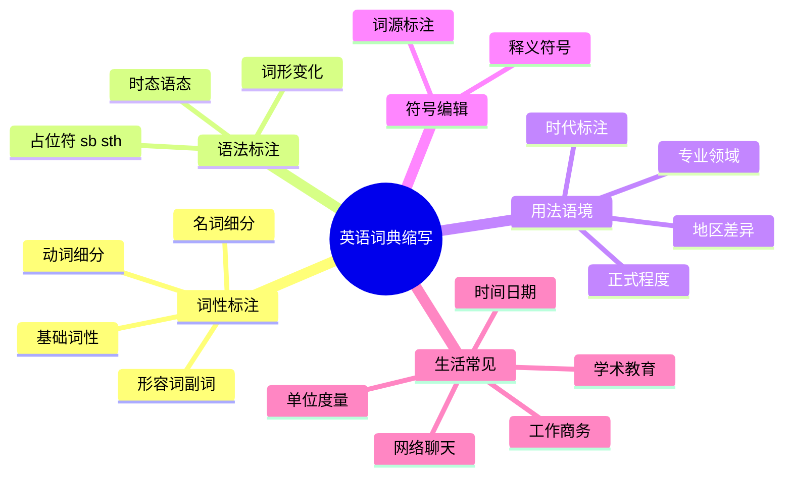
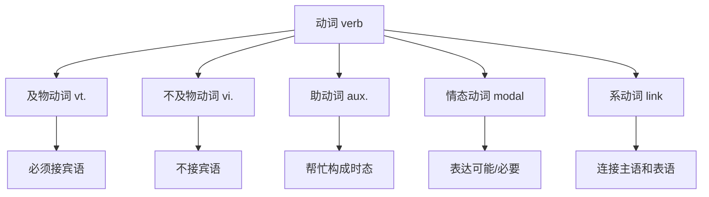
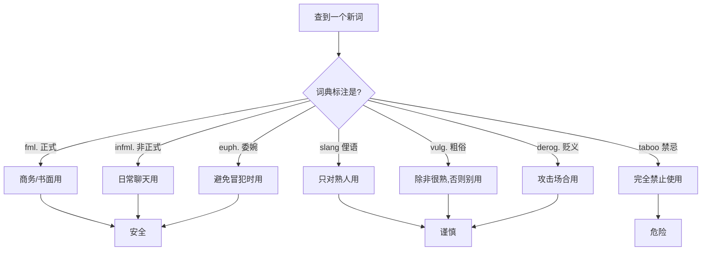
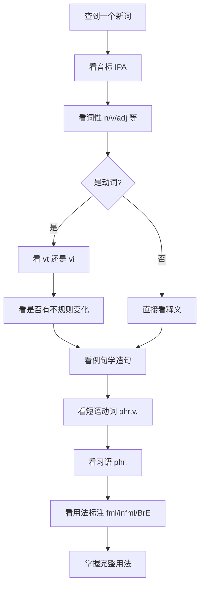
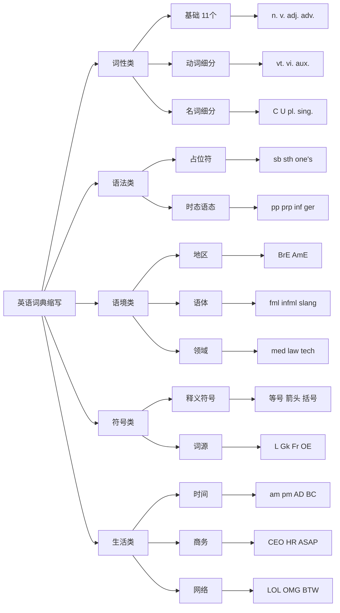
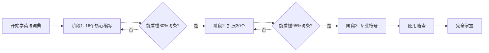

# 英语词典缩写大全 - 查词典从此不抓瞎

> [!info] 本文你能学到什么
>
> - 看懂英文词典里所有奇奇怪怪的缩写（n. / vt. / [C] / fml. / BrE 等）
> - 每个缩写背后的英文全称，**带 IPA 音标**，连发音一起拿下
> - 知道什么场合该用、什么场合不能用（比如 slang 别在面试里说）
> - 通过一个完整的 break 词条解析，把所有知识点串起来
>
> **目标读者**：完全零基础的英语学习者，第一次系统使用英文词典的人。

> [!tip] 阅读建议
>
> 不用一口气背完！把这份文档收藏起来，**遇到不认识的缩写就回来翻**。看个十几次，常用的几十个就刻在脑子里了。文末第 9 章「超快速查询表」可以单独打印贴在桌面。

---

## 1. 引言：为什么必须学这些缩写

> [!note] 词典里的"行业黑话"
>
> 英文词典为了节省篇幅，**几乎所有的语法标注都用缩写**。比如词典里写 `n.` 而不是 `noun`，写 `vt.` 而不是 `transitive verb`。如果你不认识这些缩写，词典就像一本天书。

### 1.1 一个真实的例子

打开任何一本英汉词典查 `run` 这个词，你大概会看到这样的内容：

```text
run /rʌn/  v. (ran, run, running)
  1. [vi.] 跑    He runs every morning.
  2. [vt.] 经营  She runs a small business.
  3. [n.]  一段跑步  Let's go for a run.
```

> [!warning] 看不懂这些缩写会很尴尬
>
> - 不知道 `vi.` 和 `vt.` 区别 → 写出 `He runs the park.` 这种错句
> - 不知道 `[n.]` 是名词 → 不知道 run 还能当名词用
> - 不知道 `(ran, run, running)` 的含义 → 用错时态

### 1.2 全文学习路线图

> [!info] 通过下图先建立整体框架
>
> 词典缩写大致可以分为五大类，覆盖了你查词典时会遇到的所有标注。



上面这张思维导图是全文的骨架。词性标注最常用，必须先掌握；语法标注帮你看懂例句；用法语境决定你的英语「得不得体」；符号和生活缩写则是阅读时的常见障碍。**建议按顺序往下学，前两章是核心。**

---

## 2. 第一类：词性标注（最最最常用）

> [!success] 优先级：⭐⭐⭐⭐⭐
>
> 这一类是查词典必看的，告诉你这个词是名词还是动词、是形容词还是副词。**同一个词的不同词性，意思和用法可能完全不一样**——比如 `book` 当名词是「书」，当动词是「预订」。

### 2.1 基础词性（11 个必背）

下面这张表是查词典最高频的 11 个词性缩写，每一行都标了**英文全称的 IPA 音标**和**中文意思**，第三列给出生活化的例子。

| 缩写 | 英文全称 | 音标 | 中文意思 | 例子 |
|------|----------|------|---------|------|
| **n.** | noun | /naʊn/ | 名词 | book（书）、water（水）、love（爱） |
| **v.** | verb | /vɜːrb/ | 动词（总称） | run（跑）、eat（吃）、think（想） |
| **adj.** | adjective | /ˈædʒɪktɪv/ | 形容词 | happy（开心的）、big（大的）、red（红的） |
| **adv.** | adverb | /ˈædvɜːrb/ | 副词 | quickly（快地）、very（非常）、well（好地） |
| **pron.** | pronoun | /ˈproʊnaʊn/ | 代词 | I、you、he、she、it、we、they |
| **prep.** | preposition | /ˌprepəˈzɪʃən/ | 介词 | in、on、at、of、for、with |
| **conj.** | conjunction | /kənˈdʒʌŋkʃən/ | 连词 | and、but、or、because、although |
| **art.** | article | /ˈɑːrtɪkəl/ | 冠词 | a、an（不定冠词）、the（定冠词） |
| **interj.** | interjection | /ˌɪntərˈdʒekʃən/ | 感叹词 | Oh!、Wow!、Ouch!、Hey! |
| **num.** | numeral | /ˈnuːmərəl/ | 数词 | one、two、first、second |
| **det.** | determiner | /dɪˈtɜːrmɪnər/ | 限定词 | this、that、some、any、each、every |

> [!tip] 怎么背最快
>
> 不用刻意背！**反复在词典里看到同一个缩写，自然就记住了**。优先记 n. / v. / adj. / adv. / prep. 这五个，覆盖 80% 的查词需求。

### 2.2 动词的细分（最容易踩坑）

> [!warning] 这是最容易出错的地方
>
> 看到 `v.` 后面跟着 `t` 或 `i`，是在告诉你这个动词后面**要不要接宾语**。不区分清楚，写出的句子会非常别扭。

#### 2.2.1 及物 vs 不及物

| 缩写 | 英文全称 | 音标 | 中文意思 | 用法说明 |
|------|---------|------|---------|---------|
| **vt.** | transitive verb | /ˈtrænsətɪv vɜːrb/ | 及物动词 | 后面**必须**接宾语：`I love you.` ✓ |
| **vi.** | intransitive verb | /ɪnˈtrænsətɪv vɜːrb/ | 不及物动词 | 后面**不接**宾语：`He runs fast.` ✓ |
| **v.t.** | 同 vt. | — | 及物动词（旧写法） | 老词典里常见 |
| **v.i.** | 同 vi. | — | 不及物动词（旧写法） | 老词典里常见 |

#### 2.2.2 助动词、情态动词、系动词

| 缩写 | 英文全称 | 音标 | 中文意思 | 例子 |
|------|---------|------|---------|------|
| **aux.** | auxiliary verb | /ɔːɡˈzɪliəri vɜːrb/ | 助动词 | do、have、will（帮忙构成时态） |
| **modal v.** | modal verb | /ˈmoʊdəl vɜːrb/ | 情态动词 | can、could、may、must、should |
| **link v.** | linking verb | /ˈlɪŋkɪŋ vɜːrb/ | 系动词 | be、seem、become、look |

> [!example] 经典踩坑案例
>
> `arrive` 在词典里标的是 `vi.`（不及物动词），所以**不能直接接宾语**：
>
> - ❌ `I arrived the airport.`（错！）
> - ✅ `I arrived at the airport.`（对，加介词把宾语接上来）
>
> 同理 `listen` 也是 vi.，要说 `listen to music`，不能说 `listen music`。

#### 2.2.3 动词分类速记图



上面这张分类图把动词的五种角色一目了然地展现出来。**及物和不及物是查词典最重点的区分**，因为它直接决定造句对不对。助动词、情态动词、系动词属于「特殊角色」，碰到时再认。

### 2.3 短语类（重点中的重点）

| 缩写 | 英文全称 | 音标 | 中文意思 | 例子 |
|------|---------|------|---------|------|
| **phr.** | phrase | /freɪz/ | 短语 / 词组 | on the other hand（另一方面） |
| **phr. v.** | phrasal verb | /ˈfreɪzəl vɜːrb/ | 短语动词 | give up（放弃）、look after（照顾） |
| **idiom** | idiom | /ˈɪdiəm/ | 习语 / 成语 | kick the bucket（翘辫子=死了） |
| **abbr.** | abbreviation | /əˌbriːviˈeɪʃən/ | 缩写词 | USA、UK、CEO、ASAP |

> [!warning] 短语动词必须整体记
>
> `give up` 不是「给 + 上」，而是「放弃」。**短语动词的意思和单个词完全无关**，必须当作一个整体单词来记忆。这是中国学生英语提升的关键瓶颈之一。

### 2.4 名词的细分

| 缩写 | 英文全称 | 音标 | 中文意思 | 例子 |
|------|---------|------|---------|------|
| **[C]** | countable noun | /ˈkaʊntəbəl naʊn/ | 可数名词 | book / books（一本书 / 几本书） |
| **[U]** | uncountable noun | /ʌnˈkaʊntəbəl naʊn/ | 不可数名词 | water、money、advice |
| **pl.** | plural | /ˈplʊrəl/ | 复数形式 | children 是 child 的 pl. |
| **sing.** | singular | /ˈsɪŋɡjələr/ | 单数形式 | foot 是 feet 的 sing. |
| **pl.n.** | plural noun | /ˈplʊrəl naʊn/ | 复数名词 | scissors（剪刀，永远复数） |
| **proper n.** | proper noun | /ˈprɑːpər naʊn/ | 专有名词 | China、Tom、Beijing |
| **coll.** | collective noun | /kəˈlektɪv naʊn/ | 集合名词 | team、family、class |

> [!tip] 可数 [C] 与不可数 [U] 的区分
>
> - `[C]` 可数：能数 1 个、2 个、3 个 → 可以加 a/an、可以加 -s 变复数
> - `[U]` 不可数：不能数个数 → 不能加 a/an、不能直接加 -s
>
> 比如 `water` 是 [U]，所以**不能说** `a water`，要说 `a glass of water`（一杯水）。

### 2.5 形容词与副词的细分

| 缩写 | 英文全称 | 音标 | 中文意思 | 例子 |
|------|---------|------|---------|------|
| **comp.** | comparative | /kəmˈpærətɪv/ | 比较级 | bigger 是 big 的 comp. |
| **sup.** | superlative | /suːˈpɜːrlətɪv/ | 最高级 | biggest 是 big 的 sup. |
| **pred.** | predicative | /prɪˈdɪkətɪv/ | 表语形容词 | asleep（She is asleep ✓ / *an asleep girl ✗） |
| **attrib.** | attributive | /əˈtrɪbjətɪv/ | 定语形容词 | main（the main reason ✓ / *the reason is main ✗） |

> [!note] 表语 vs 定语形容词的区别
>
> 大部分形容词既能放名词前（定语），也能放系动词后（表语）。但有少数形容词**只能用一种位置**：
>
> - `asleep`（睡着的）只能做表语：`The baby is asleep.` ✓
> - `main`（主要的）只能做定语：`the main reason` ✓
>
> 词典用 `pred.` 和 `attrib.` 来标注这种限制。

---

## 3. 第二类：语法标注（看懂例句靠它）

> [!info] 占位符是词典的核心约定
>
> 词典在解释词组时，常常用 `sb` 和 `sth` 当占位符。这就像数学题里的 X 和 Y——告诉你「这里要填一个人」或「这里要填一个东西」。

### 3.1 占位符（超高频，必须掌握）

| 缩写 | 英文全称 | 音标 | 中文意思 | 例子 |
|------|---------|------|---------|------|
| **sb** | somebody | /ˈsʌmbədi/ | 某人 | give sb sth → give me a book |
| **sb.** | 同 sb（带点旧写法） | — | 某人 | thank sb. for sth. |
| **sth** | something | /ˈsʌmθɪŋ/ | 某物 / 某事 | look at sth → look at the picture |
| **sth.** | 同 sth（带点旧写法） | — | 某物 / 某事 | decide on sth. |
| **one's** | possessive | /pəˈzesɪv/ | 某人的（要替换为具体所有格） | do one's best → do my best |
| **oneself** | reflexive | /rɪˈfleksɪv/ | 某人自己（要替换为反身代词） | enjoy oneself → enjoy yourself |

> [!danger] 千万不要原样照抄
>
> 用的时候**必须替换**成真实的人/物！
>
> - ❌ 错的：`I want to help sb with sth.`（直接照抄占位符）
> - ✅ 对的：`I want to help my mom with the housework.`
>
> 类似的：
> - `do one's best` → `do my best`（我）/ `do his best`（他）
> - `enjoy oneself` → `enjoy yourself`（你）/ `enjoy themselves`（他们）

### 3.2 时态 / 语态相关

| 缩写 | 英文全称 | 音标 | 中文意思 | 例子 |
|------|---------|------|---------|------|
| **pres.** | present tense | /ˈprezənt tens/ | 现在时 | I work（我工作） |
| **past** | past tense | /pæst tens/ | 过去时 | I worked（我工作过） |
| **fut.** | future tense | /ˈfjuːtʃər tens/ | 将来时 | I will work（我将工作） |
| **pp.** | past participle | /pæst ˈpɑːrtəsɪpəl/ | 过去分词 | stolen 是 steal 的 pp. |
| **p.p.** | 同 pp. | — | 过去分词 | broken 是 break 的 p.p. |
| **prp.** | present participle | /ˈprezənt ˈpɑːrtəsɪpəl/ | 现在分词 | running 是 run 的 prp. |
| **ger.** | gerund | /ˈdʒerənd/ | 动名词 | swimming（游泳）作名词时 |
| **inf.** | infinitive | /ɪnˈfɪnətɪv/ | 不定式 | to go、to eat 是不定式 |
| **pass.** | passive voice | /ˈpæsɪv vɔɪs/ | 被动语态 | be done（被做） |
| **act.** | active voice | /ˈæktɪv vɔɪs/ | 主动语态 | do（做） |
| **subj.** | subjunctive | /səbˈdʒʌŋktɪv/ | 虚拟语气 | If I were you...（如果我是你） |
| **imp.** | imperative | /ɪmˈperətɪv/ | 祈使语气 | Stop!（停！） |

### 3.3 词形变化标注

| 缩写 | 英文全称 | 音标 | 中文意思 | 例子 |
|------|---------|------|---------|------|
| **sing.** | singular | /ˈsɪŋɡjələr/ | 单数 | is 是 are 的 sing. |
| **pl.** | plural | /ˈplʊrəl/ | 复数 | feet 是 foot 的 pl. |
| **1st** | first person | /fɜːrst ˈpɜːrsən/ | 第一人称 | I / we |
| **2nd** | second person | /ˈsekənd ˈpɜːrsən/ | 第二人称 | you |
| **3rd** | third person | /θɜːrd ˈpɜːrsən/ | 第三人称 | he / she / it / they |
| **3sg.** | third person singular | /θɜːrd ˈpɜːrsən ˈsɪŋɡjələr/ | 第三人称单数 | goes 是 go 的 3sg. |
| **fem.** | feminine | /ˈfemənɪn/ | 阴性 | actress 是 actor 的 fem. |
| **masc.** | masculine | /ˈmæskjələn/ | 阳性 | host 对应的 masc. |
| **neut.** | neuter | /ˈnuːtər/ | 中性 | it（中性代词） |

---

## 4. 第三类：用法和语境标注（决定你说话得不得体）

> [!warning] 这一类标注比词性更重要
>
> 词性错了顶多别人能听懂；**用法错了会很尴尬甚至冒犯人**。比如和老板说话用 slang（俚语），或在朋友群里用 fml.（正式语），都会让人觉得很怪。

### 4.1 地区 / 语系标注

| 缩写 | 英文全称 | 音标 | 中文意思 | 例子 |
|------|---------|------|---------|------|
| **BrE** | British English | /ˈbrɪtɪʃ ˈɪŋɡlɪʃ/ | 英式英语 | lift（电梯）是 BrE |
| **AmE** | American English | /əˈmerɪkən ˈɪŋɡlɪʃ/ | 美式英语 | elevator（电梯）是 AmE |
| **US** | United States usage | /juːˌnaɪtɪd ˈsteɪts/ | 美国用法 | soccer（足球）是 US 用法 |
| **UK** | United Kingdom usage | /juːˌnaɪtɪd ˈkɪŋdəm/ | 英国用法 | football 在 UK 指足球 |
| **AusE** | Australian English | /ɔːˈstreɪliən ˈɪŋɡlɪʃ/ | 澳大利亚英语 | g'day（你好）是 AusE |
| **CanE** | Canadian English | /kəˈneɪdiən ˈɪŋɡlɪʃ/ | 加拿大英语 | loonie（一加元硬币） |
| **IndE** | Indian English | /ˈɪndiən ˈɪŋɡlɪʃ/ | 印度英语 | lakh（十万）是 IndE |
| **dial.** | dialect | /ˈdaɪəlekt/ | 方言 | 标注地方性用法 |
| **Scot.** | Scottish | /ˈskɑːtɪʃ/ | 苏格兰用法 | wee（小的）是 Scot. |
| **Ir.** | Irish | /ˈaɪrɪʃ/ | 爱尔兰用法 | 爱尔兰特有说法 |

> [!example] BrE vs AmE 经典差异
>
> 同一个意思在英美用不同的词，备考雅思看 BrE，备考托福看 AmE：
>
> | 中文 | 英式 BrE | 美式 AmE |
> |------|---------|---------|
> | 电梯 | lift | elevator |
> | 公寓 | flat | apartment |
> | 足球 | football | soccer |
> | 薯条 | chips | French fries |
> | 假期 | holiday | vacation |

### 4.2 正式程度 / 语体（最重要！）

> [!danger] 用错语体后果很严重
>
> 这一类一定要注意！
>
> - 和老板说话用了 slang → 显得不专业
> - 写邮件用了 vulg. → 直接被开除
> - 和朋友聊天用了 fml. → 显得很奇怪甚至装腔作势

| 缩写 | 英文全称 | 音标 | 中文意思 | 适用场景 |
|------|---------|------|---------|---------|
| **fml.** | formal | /ˈfɔːrməl/ | 正式 | 商务、书面、演讲 |
| **infml.** | informal | /ɪnˈfɔːrməl/ | 非正式 | 朋友聊天、日常 |
| **colloq.** | colloquial | /kəˈloʊkwiəl/ | 口语的 | 口语化表达，写文章别用 |
| **spoken** | spoken English | /ˈspoʊkən ˈɪŋɡlɪʃ/ | 口语 | Yeah!、Gotcha! 这种 |
| **written** | written English | /ˈrɪtən ˈɪŋɡlɪʃ/ | 书面语 | 正式文章用 |
| **lit.** | literary | /ˈlɪtəreri/ | 文学的 | 诗歌、小说 |
| **poet.** | poetic | /poʊˈetɪk/ | 诗体的 | 诗歌专用 |
| **slang** | slang | /slæŋ/ | 俚语 | 非常口语化，可能不雅 |
| **sl.** | 同 slang | — | 俚语 | 简写形式 |
| **vulg.** | vulgar | /ˈvʌlɡər/ | 粗俗的 | 脏话、粗话，**慎用！** |
| **taboo** | taboo | /təˈbuː/ | 禁忌语 | **极度冒犯，绝对别用** |
| **offensive** | offensive | /əˈfensɪv/ | 冒犯性的 | 可能伤害到人 |
| **derog.** | derogatory | /dɪˈrɑːɡətɔːri/ | 贬义的 | 带有看不起的意味 |
| **pej.** | pejorative | /pɪˈdʒɔːrətɪv/ | 贬义的 | 同 derog. |
| **euph.** | euphemism | /ˈjuːfəmɪzəm/ | 委婉语 | pass away = die（去世） |
| **humor.** | humorous | /ˈhjuːmərəs/ | 幽默的 | 开玩笑用 |
| **iron.** | ironic | /aɪˈrɑːnɪk/ | 讽刺的 | 反话、讽刺 |

> [!tip] 语体选择决策图
>
> 不知道某个词该不该说？看下面这张决策图：



这张决策图把 7 种语体标注按危险程度归到三个等级：**安全**（任何场合都能用）、**谨慎**（要看对象）、**危险**（基本不要用）。新手只要严守一条原则——「不熟悉的语体标注，先别用」就能避免 99% 的语言事故。

### 4.3 时代标注

| 缩写 | 英文全称 | 音标 | 中文意思 | 例子 |
|------|---------|------|---------|------|
| **arch.** | archaic | /ɑːrˈkeɪɪk/ | 古旧的 | thou（你，古英语） |
| **obs.** | obsolete | /ˌɑːbsəˈliːt/ | 废弃的 | 已经不用的老词 |
| **dated** | dated | /ˈdeɪtɪd/ | 过时的 | 老一辈才用 |
| **old-fash.** | old-fashioned | /ˌoʊld ˈfæʃənd/ | 老式的 | 听起来很老派 |
| **old use** | old use | /oʊld juːs/ | 旧时用法 | 以前的说法，现在很少用 |
| **modern** | modern | /ˈmɑːdərn/ | 现代的 | 现代用法 |
| **new** | new | /njuː/ | 新词 | 近期出现的词 |

### 4.4 专业领域标注

| 缩写 | 英文全称 | 音标 | 中文意思 |
|------|---------|------|---------|
| **med.** | medicine / medical | /ˈmedəsən/ | 医学 |
| **law** | law | /lɔː/ | 法律 |
| **bus.** | business | /ˈbɪznəs/ | 商业 |
| **tech.** | technical | /ˈteknɪkəl/ | 技术 / 专业 |
| **IT** | Information Technology | /ɪnfərˈmeɪʃən tekˈnɑːlədʒi/ | 信息技术 |
| **comp.** | computing | /kəmˈpjuːtɪŋ/ | 计算机 |
| **sci.** | science | /ˈsaɪəns/ | 科学 |
| **bio.** | biology | /baɪˈɑːlədʒi/ | 生物学 |
| **chem.** | chemistry | /ˈkemɪstri/ | 化学 |
| **phys.** | physics | /ˈfɪzɪks/ | 物理 |
| **math.** | mathematics | /ˌmæθəˈmætɪks/ | 数学 |
| **mil.** | military | /ˈmɪləteri/ | 军事 |
| **naut.** | nautical | /ˈnɔːtɪkəl/ | 航海的 |
| **mus.** | music | /ˈmjuːzɪk/ | 音乐 |
| **sport** | sport | /spɔːrt/ | 体育 |
| **relig.** | religion | /rɪˈlɪdʒən/ | 宗教 |
| **ling.** | linguistics | /lɪŋˈɡwɪstɪks/ | 语言学 |
| **gram.** | grammar | /ˈɡræmər/ | 语法 |
| **psych.** | psychology | /saɪˈkɑːlədʒi/ | 心理学 |
| **geog.** | geography | /dʒiˈɑːɡrəfi/ | 地理 |
| **archit.** | architecture | /ˈɑːrkɪtektʃər/ | 建筑 |

---

## 5. 第四类：词典里的特殊符号和编辑标记

> [!info] 符号也是词典的语言
>
> 除了字母缩写，词典里还会用一些符号来传递信息。这些符号占用空间小，但承载的信息量很大。

### 5.1 释义相关符号

| 符号 | 含义 | 中文意思 | 例子 |
|------|------|---------|------|
| **=** | equals | 等于、相同 | happy = glad（意思相同） |
| **≠** | not equal | 不等于、相反 | hot ≠ cold |
| **≈** | approximately equal | 近似 | 意思接近但不完全一样 |
| **→** | see also | 参见 / 演变为 | → see also...（参见某词） |
| **←** | derived from | 来源于 | 来自某语言或某词 |
| **~** | tilde | 代替前面的词 | 释义中代替词目本身 |
| **~ing** | tilde + ing | 动词加 ing 形式 | 表示需要加 ing 形式 |
| **( )** | parentheses | 可省略 | () 内的部分可不要 |
| **[ ]** | brackets | 替换 / 选择 | [] 内是可替换的部分 |
| **/** | slash | 或 | and/or（和/或） |
| **\*** | asterisk | 标准 / 不规范 | 标志重点词或不规范用法 |
| **★** | star | 重点词 | 考试或常用重点词 |
| **†** | dagger | 废弃 / 古旧 | 标记不再使用的词 |
| **‡** | double dagger | 罕见 | 极少使用 |
| **§** | section | 段落标记 | 另起一段 |

### 5.2 词源标注

| 缩写 | 英文全称 | 音标 | 中文意思 | 例子 |
|------|---------|------|---------|------|
| **etym.** | etymology | /ˌetəˈmɑːlədʒi/ | 词源 | 这个词的来源 |
| **L.** | Latin | /ˈlætən/ | 拉丁语 | 源自拉丁语 |
| **Gk.** | Greek | /ɡriːk/ | 希腊语 | 源自希腊语 |
| **Fr.** | French | /frentʃ/ | 法语 | 源自法语 |
| **Ger.** | German | /ˈdʒɜːrmən/ | 德语 | 源自德语 |
| **It.** | Italian | /ɪˈtæliən/ | 意大利语 | 源自意大利语 |
| **Sp.** | Spanish | /ˈspænɪʃ/ | 西班牙语 | 源自西班牙语 |
| **OE** | Old English | /oʊld ˈɪŋɡlɪʃ/ | 古英语 | 源自古英语 |
| **ME** | Middle English | /ˈmɪdəl ˈɪŋɡlɪʃ/ | 中古英语 | 源自中古英语 |
| **OF** | Old French | /oʊld frentʃ/ | 古法语 | 源自古法语 |
| **c.** | circa | /ˈsɜːrkə/ | 大约（年代） | c. 1500 = 大约 1500 年 |
| **fr.** | from | /frəm/ | 来自 | 源自某语言 |

> [!tip] 词源标注有什么用
>
> 知道一个词的来源能帮你**记忆和猜词**。比如看到 `psycho-` 开头的词，知道它源自希腊语「灵魂」，就能猜到 `psychology`（心理学）、`psychiatrist`（精神科医生）的意思。

---

## 6. 第五类：生活中常见的缩写词

> [!note] 词典之外的实用缩写
>
> 这一类不一定出现在词典正文，但你看英文文章、邮件、文档时会经常碰到。**先认识，再使用**。

### 6.1 时间和日期

| 缩写 | 英文全称 | 音标 | 中文意思 | 例子 |
|------|---------|------|---------|------|
| **a.m.** | ante meridiem | /ˌænti məˈrɪdiəm/ | 上午 | 9 a.m. = 上午 9 点 |
| **p.m.** | post meridiem | /poʊst məˈrɪdiəm/ | 下午 | 3 p.m. = 下午 3 点 |
| **AD** | Anno Domini | /ˌænoʊ ˈdɑːmənaɪ/ | 公元 | AD 2024 = 公元 2024 年 |
| **BC** | Before Christ | /bɪˈfɔːr kraɪst/ | 公元前 | BC 100 = 公元前 100 年 |
| **CE** | Common Era | /ˈkɑːmən ˈɪrə/ | 公元（同 AD） | 现代学术常用 |
| **BCE** | Before Common Era | /bɪˈfɔːr ˈkɑːmən ˈɪrə/ | 公元前（同 BC） | 现代学术常用 |
| **yr.** | year | /jɪr/ | 年 | yr. 2024 |
| **mo.** | month | /mʌnθ/ | 月 | 3 mo. old（3 个月大） |
| **wk.** | week | /wiːk/ | 周 | 2 wks. = 两周 |
| **hr.** | hour | /aʊər/ | 小时 | 2 hrs. = 两小时 |
| **min.** | minute | /ˈmɪnɪt/ | 分钟 | 5 min. = 5 分钟 |
| **sec.** | second | /ˈsekənd/ | 秒 | 30 sec. = 30 秒 |
| **Mon.** | Monday | /ˈmʌndeɪ/ | 周一 | Mon., Tue., Wed., Thu., Fri., Sat., Sun. |
| **Jan.** | January | /ˈdʒænjueri/ | 一月 | Jan., Feb., Mar., Apr., May, Jun. ... |

### 6.2 文献和引用

| 缩写 | 英文全称 | 音标 | 中文意思 | 例子 |
|------|---------|------|---------|------|
| **e.g.** | exempli gratia | /ɪɡˌzempli ˈɡrɑːtiə/ | 例如 | Fruits, e.g., apples |
| **i.e.** | id est | /ˌɪd ˈest/ | 也就是说 | weekdays, i.e., Mon-Fri |
| **etc.** | et cetera | /et ˈsetərə/ | 等等 | books, pens, etc. |
| **et al.** | et alia | /et ˈeɪliə/ | 以及其他人 | Smith et al.（史密斯等人） |
| **cf.** | confer | /kənˈfɜːr/ | 比较 | cf. page 5（参见第 5 页） |
| **vs.** | versus | /ˈvɜːrsəs/ | 对、相对 | Brazil vs. Argentina |
| **v.** | versus（法律常用） | — | 对 | Brown v. Board of Education |
| **NB** | nota bene | /ˌnoʊtə ˈbeneɪ/ | 特别注意 | 标注重要内容 |
| **P.S.** | postscript | /ˈpoʊstskrɪpt/ | 附言 | 信末附加内容 |
| **P.P.S.** | post-postscript | /poʊst ˈpoʊstskrɪpt/ | 再附言 | P.S. 后面再加的 |
| **RE** | regarding | /rɪˈɡɑːrdɪŋ/ | 关于 | 邮件主题用 |
| **FYI** | for your information | /fɔːr jʊr ɪnfərˈmeɪʃən/ | 供你参考 | 邮件常用 |
| **TBA** | to be announced | /tə bi əˈnaʊnst/ | 待定 | 活动安排常见 |
| **TBD** | to be decided | /tə bi dɪˈsaɪdɪd/ | 待定 | 决策待定 |
| **TBC** | to be confirmed | /tə bi kənˈfɜːrmd/ | 待确认 | 需要确认 |
| **N/A** | not applicable | /nɑːt əˈplɪkəbəl/ | 不适用 | 表格中常见 |
| **w/** | with | /wɪð/ | 和、有 | coffee w/ milk |
| **w/o** | without | /wɪðˈaʊt/ | 没有 | coffee w/o sugar |
| **approx.** | approximately | /əˈprɑːksəmətli/ | 大约 | approx. 100 = 约 100 |
| **incl.** | including | /ɪnˈkluːdɪŋ/ | 包括 | incl. tax = 含税 |
| **excl.** | excluding | /ɪkˈskluːdɪŋ/ | 不包括 | excl. tax = 不含税 |
| **max.** | maximum | /ˈmæksəməm/ | 最大 | max. 100 |
| **min.** | minimum | /ˈmɪnəməm/ | 最小 | min. 18 |
| **avg.** | average | /ˈævərɪdʒ/ | 平均 | avg. score |

> [!warning] e.g. 和 i.e. 容易搞混
>
> - **e.g.** = `for example` 例如（举一些例子，不一定全）
> - **i.e.** = `that is` 也就是（精确解释，等同关系）
>
> 比较：
> - `Fruits, e.g., apples and bananas`（水果，比如苹果香蕉——还有别的水果）
> - `My best friend, i.e., Tom`（我最好的朋友，也就是 Tom——只有 Tom 一个）

### 6.3 工作和商务

| 缩写 | 英文全称 | 音标 | 中文意思 |
|------|---------|------|---------|
| **CEO** | Chief Executive Officer | /tʃiːf ɪɡˈzekjətɪv ˈɔːfɪsər/ | 首席执行官 |
| **CFO** | Chief Financial Officer | /tʃiːf fəˈnænʃəl ˈɔːfɪsər/ | 首席财务官 |
| **CTO** | Chief Technology Officer | /tʃiːf tekˈnɑːlədʒi ˈɔːfɪsər/ | 首席技术官 |
| **COO** | Chief Operating Officer | /tʃiːf ˈɑːpəreɪtɪŋ ˈɔːfɪsər/ | 首席运营官 |
| **HR** | Human Resources | /ˈhjuːmən ˈriːsɔːrsɪz/ | 人力资源 |
| **PR** | Public Relations | /ˈpʌblɪk rɪˈleɪʃənz/ | 公共关系 |
| **IT** | Information Technology | /ɪnfərˈmeɪʃən tekˈnɑːlədʒi/ | 信息技术 |
| **Q&A** | Questions and Answers | /ˈkwestʃənz ənd ˈænsərz/ | 问答 |
| **R&D** | Research and Development | /ˈriːsɜːrtʃ ənd dɪˈveləpmənt/ | 研发 |
| **B2B** | Business to Business | /ˈbɪznəs tə ˈbɪznəs/ | 企业对企业 |
| **B2C** | Business to Consumer | /ˈbɪznəs tə kənˈsuːmər/ | 企业对消费者 |
| **KPI** | Key Performance Indicator | /kiː pərˈfɔːrməns ˈɪndɪkeɪtər/ | 关键绩效指标 |
| **ROI** | Return on Investment | /rɪˈtɜːrn ɑːn ɪnˈvestmənt/ | 投资回报率 |
| **ASAP** | as soon as possible | /æz suːn æz ˈpɑːsəbəl/ | 尽快 |
| **EOD** | end of day | /end əv deɪ/ | 下班前 |
| **EOW** | end of week | /end əv wiːk/ | 本周末前 |
| **OOO** | out of office | /aʊt əv ˈɔːfɪs/ | 不在办公室 |
| **WFH** | working from home | /ˈwɜːrkɪŋ frəm hoʊm/ | 在家办公 |
| **TGIF** | Thank God It's Friday | /θæŋk ɡɑːd ɪts ˈfraɪdeɪ/ | 谢天谢地周五了 |
| **MoM** | month-on-month | /mʌnθ ɑːn mʌnθ/ | 环比 |
| **YoY** | year-on-year | /jɪr ɑːn jɪr/ | 同比 |
| **YTD** | year-to-date | /jɪr tə deɪt/ | 年初至今 |
| **TL;DR** | too long; didn't read | /tuː lɔːŋ ˈdɪdənt riːd/ | 太长不看 |

### 6.4 网络聊天缩写

| 缩写 | 英文全称 | 音标 | 中文意思 |
|------|---------|------|---------|
| **LOL** | laughing out loud | /ˈlæfɪŋ aʊt laʊd/ | 笑死了 |
| **LMAO** | laughing my a\*\* off | — | 笑得肚子疼 |
| **ROFL** | rolling on the floor laughing | /ˈroʊlɪŋ ɑːn ðə flɔːr ˈlæfɪŋ/ | 笑得满地打滚 |
| **OMG** | oh my God | /oʊ maɪ ɡɑːd/ | 我的天 |
| **WTF** | what the f\*ck | — | 什么鬼 |
| **BTW** | by the way | /baɪ ðə weɪ/ | 顺便说 |
| **IMO** | in my opinion | /ɪn maɪ əˈpɪnjən/ | 我认为 |
| **IMHO** | in my humble opinion | /ɪn maɪ ˈhʌmbəl əˈpɪnjən/ | 愚以为 |
| **IDK** | I don't know | /aɪ doʊnt noʊ/ | 不知道 |
| **IKR** | I know, right? | /aɪ noʊ raɪt/ | 对吧！ |
| **TBH** | to be honest | /tə bi ˈɑːnəst/ | 说实话 |
| **NVM** | never mind | /ˈnevər maɪnd/ | 算了 / 没事 |
| **BRB** | be right back | /bi raɪt bæk/ | 马上回来 |
| **AFK** | away from keyboard | /əˈweɪ frəm ˈkiːbɔːrd/ | 暂离 |
| **ETA** | estimated time of arrival | /ˈestɪmeɪtɪd taɪm əv əˈraɪvəl/ | 预计到达时间 |
| **DM** | direct message | /dəˈrekt ˈmesɪdʒ/ | 私信 |
| **PM** | private message | /ˈpraɪvət ˈmesɪdʒ/ | 私聊 |
| **RT** | retweet | /ˌriːˈtwiːt/ | 转推 |
| **FAQ** | frequently asked questions | /ˈfriːkwəntli æskt ˈkwestʃənz/ | 常见问题 |
| **DIY** | do it yourself | /duː ɪt jərˈself/ | 自己动手 |
| **AKA** | also known as | /ˈɔːlsoʊ noʊn æz/ | 又名 / 也叫 |
| **ID** | identification | /aɪˌdentəfɪˈkeɪʃən/ | 身份证 / 标识 |
| **VIP** | very important person | /ˈveri ɪmˈpɔːrtənt ˈpɜːrsən/ | 贵宾 |

### 6.5 学术和教育

| 缩写 | 英文全称 | 音标 | 中文意思 |
|------|---------|------|---------|
| **PhD** | Doctor of Philosophy | /ˈdɑːktər əv fəˈlɑːsəfi/ | 博士 |
| **MA** | Master of Arts | /ˈmæstər əv ɑːrts/ | 文学硕士 |
| **MSc** | Master of Science | /ˈmæstər əv ˈsaɪəns/ | 理学硕士 |
| **MBA** | Master of Business Administration | /ˈmæstər əv ˈbɪznəs ədˌmɪnɪˈstreɪʃən/ | 工商管理硕士 |
| **BA** | Bachelor of Arts | /ˈbætʃələr əv ɑːrts/ | 文学学士 |
| **BSc** | Bachelor of Science | /ˈbætʃələr əv ˈsaɪəns/ | 理学学士 |
| **GPA** | Grade Point Average | /ɡreɪd pɔɪnt ˈævərɪdʒ/ | 平均绩点 |
| **IELTS** | International English Language Testing System | /ˈaɪelts/ | 雅思 |
| **TOEFL** | Test of English as a Foreign Language | /ˈtoʊfəl/ | 托福 |
| **GRE** | Graduate Record Examinations | /ˈɡrædʒuət ˈrekɔːrd ɪɡˌzæməˈneɪʃənz/ | 美国研究生入学考试 |
| **GMAT** | Graduate Management Admission Test | /ˈdʒiːmæt/ | 商科研究生入学考试 |
| **SAT** | Scholastic Assessment Test | /skəˈlæstɪk əˈsesmənt test/ | 美国高考 |
| **Prof.** | Professor | /prəˈfesər/ | 教授 |
| **Dr.** | Doctor | /ˈdɑːktər/ | 博士 / 医生 |
| **Mr.** | Mister | /ˈmɪstər/ | 先生 |
| **Mrs.** | Mistress | /ˈmɪsɪz/ | 太太 |
| **Ms.** | Ms | /mɪz/ | 女士（不区分婚姻状态） |
| **Miss** | Miss | /mɪs/ | 小姐（未婚） |
| **Sr.** | Senior | /ˈsiːniər/ | 年长 / 高级 |
| **Jr.** | Junior | /ˈdʒuːniər/ | 年少 / 初级 |
| **No.** | Number | /ˈnʌmbər/ | 编号 |

### 6.6 单位和度量

| 缩写 | 英文全称 | 音标 | 中文意思 | 换算 |
|------|---------|------|---------|------|
| **kg** | kilogram | /ˈkɪləɡræm/ | 千克 | — |
| **g** | gram | /ɡræm/ | 克 | 1000 g = 1 kg |
| **lb** | pound | /paʊnd/ | 磅 | 1 lb ≈ 0.45 kg |
| **oz** | ounce | /aʊns/ | 盎司 | 1 oz ≈ 28 g |
| **km** | kilometer | /kəˈlɑːmətər/ | 公里 | — |
| **m** | meter | /ˈmiːtər/ | 米 | 1000 m = 1 km |
| **cm** | centimeter | /ˈsentəmiːtər/ | 厘米 | 100 cm = 1 m |
| **mm** | millimeter | /ˈmɪləmiːtər/ | 毫米 | 10 mm = 1 cm |
| **mi** | mile | /maɪl/ | 英里 | 1 mi ≈ 1.6 km |
| **ft** | foot | /fʊt/ | 英尺 | 1 ft ≈ 30 cm |
| **in** | inch | /ɪntʃ/ | 英寸 | 1 in ≈ 2.54 cm |
| **L** | liter | /ˈliːtər/ | 升 | — |
| **ml** | milliliter | /ˈmɪlɪliːtər/ | 毫升 | 1000 ml = 1 L |
| **gal** | gallon | /ˈɡælən/ | 加仑 | 1 gal ≈ 3.8 L |
| **°C** | degrees Celsius | /dɪˈɡriːz ˈselsiəs/ | 摄氏度 | 中国常用 |
| **°F** | degrees Fahrenheit | /dɪˈɡriːz ˈfærənhaɪt/ | 华氏度 | 美国常用 |
| **mph** | miles per hour | /maɪlz pər aʊər/ | 英里每小时 | 美国速度 |
| **km/h** | kilometers per hour | /kəˈlɑːmətərz pər aʊər/ | 公里每小时 | 中国速度 |

---

## 7. 实战演练：完整解读一个 break 词条

> [!example] 综合运用所有知识
>
> 假设你查 `break` /breɪk/ 这个词，词典里可能这样写。下面我们会**逐行解析**。

### 7.1 完整词条原文

```text {1,3-5,8-10,13-14}
break /breɪk/  v. (broke, broken)

  1. [vt.] 打破，弄碎      He broke the window.
  2. [vi.] 破裂            The glass broke.
  3. [n.]  休息，间歇      Let's take a break.

  ─────────────────────────────────
  phr. v.
  break down   ① （机器）坏掉  ② （人）情绪崩溃
  break up     ① 分手  ② （会议）结束  [esp. BrE] 学校放假
  break in     闯入；插话

  ─────────────────────────────────
  phr.  break sb's heart   让某人心碎   [fig.]
        break the ice      打破僵局     [fig., infml.]
```

> [!info] 高亮行说明
>
> 上面代码块中**高亮的几行**是关键信息：
>
> - 第 1 行：词目+音标+词性+不规则变化
> - 第 3-5 行：三种主要词性的释义
> - 第 8-10 行：短语动词列表
> - 第 13-14 行：固定短语 / 习语

### 7.2 逐行解读

#### 7.2.1 第一行：词目和基本信息

```text {1}
break /breɪk/  v. (broke, broken)
```

把这一行拆开看：

- `break` —— **词目**（要查的词本身）
- `/breɪk/` —— **IPA 音标**，告诉你怎么读
- `v.` —— **词性**：动词（verb 的缩写）
- `(broke, broken)` —— **不规则变化**：过去式是 `broke`，过去分词是 `broken`

> [!tip] 不规则动词速记
>
> 词典里写 `(broke, broken)` 这种格式，括号里两个词分别是：
>
> 1. **过去式**（用于过去时）：I **broke** it yesterday.
> 2. **过去分词**（用于完成时和被动语态）：It is **broken**. / I have **broken** it.

#### 7.2.2 第二行：及物动词用法

```text {1}
1. [vt.] 打破，弄碎      He broke the window.
```

- `[vt.]` —— **及物动词**（需要接宾语）
- `He broke the window.` —— **例句**：他打破了窗户
  - `the window` 就是宾语，缺了它句子就不完整

#### 7.2.3 第三行：不及物动词用法

```text {1}
2. [vi.] 破裂            The glass broke.
```

- `[vi.]` —— **不及物动词**（不需要接宾语）
- `The glass broke.` —— **例句**：玻璃碎了
  - 后面没有宾语也是完整的句子

#### 7.2.4 第四行：名词用法

```text {1}
3. [n.]  休息，间歇      Let's take a break.
```

- `[n.]` —— **名词**用法
- `Let's take a break.` —— **例句**：让我们休息一下
  - 这里 `break` 是名词，意思变成「休息」

#### 7.2.5 短语动词部分

```text {2,3}
phr. v.
break down   ① （机器）坏掉  ② （人）情绪崩溃
break up     ① 分手  ② （会议）结束  [esp. BrE] 学校放假
```

- `phr. v.` = phrasal verb，**短语动词**
- `break down` 和 `break up` 是**动词+小词**的固定搭配
- `[esp. BrE]` = `especially British English`，**尤其在英式英语中**这样用

> [!warning] 短语动词意思和单词无关
>
> `break up` 不是「打碎+上」，而是「分手 / 结束」。**短语动词必须整体记忆**，绝不能拆开理解。

#### 7.2.6 习语部分

```text {2,3}
phr.  break sb's heart   让某人心碎   [fig.]
      break the ice      打破僵局     [fig., infml.]
```

- `phr.` = phrase，**短语 / 习语**
- `sb's` —— 占位符，用时换成具体的人：`break my heart` / `break her heart`
- `[fig.]` = figurative，**比喻用法**（不是真的把心打碎，是让某人伤心）
- `[infml.]` = informal，**非正式**用法，朋友间用

### 7.3 解读流程图



这是一份**完整的词条解读流程**：从音标开始，逐步深入到词性、变化、例句、短语和用法标注。**按这个顺序读词条，再复杂的词也能拆解清楚**。新手建议每查一个新词都按这个流程走一遍，养成习惯后会越来越快。

---

## 8. 缩写分类全景图

> [!info] 把所有知识点串起来看
>
> 下面这张图把全文 100+ 个缩写按使用频率和类别整理成全景图，方便你建立完整的知识地图。



这张全景图清晰地把全部缩写分成 5 大类、12 个子类。**记忆的最佳路径**是：先掌握「词性类」中的 11 个基础词性，再学「语法类」的占位符，然后根据自己实际遇到的需要，逐步扩展到其他类别。**不要一次想全部记完**——分类记忆 + 反复遇见 = 自然掌握。

---

## 9. 超快速查询表（建议收藏）

> [!success] 这是查词典时的「随身小抄」
>
> 把上面所有最高频的缩写整合到一张表，**平时查词典翻这个就够了**。建议截图保存到手机，或打印贴在桌面。

| 缩写 | 中文意思 | 备注 |
|------|---------|------|
| **n.** | 名词 | — |
| **v.** | 动词 | — |
| **vt.** | 及物动词（后接宾语） | — |
| **vi.** | 不及物动词（不接宾语） | — |
| **adj.** | 形容词 | — |
| **adv.** | 副词 | — |
| **pron.** | 代词 | — |
| **prep.** | 介词 | — |
| **conj.** | 连词 | — |
| **art.** | 冠词 | — |
| **interj.** | 感叹词 | — |
| **aux.** | 助动词 | — |
| **phr.** | 短语 / 词组 | 整体记 |
| **phr. v.** | 短语动词（动词+小词） | 重点！ |
| **abbr.** | 缩写词 | — |
| **sb** | 某人（占位符） | 用时换成具体的人 |
| **sth** | 某物（占位符） | 用时换成具体的东西 |
| **one's** | 某人的 | 换成 my/his/her 等 |
| **[C]** | 可数名词 | — |
| **[U]** | 不可数名词 | — |
| **pl.** | 复数 | — |
| **sing.** | 单数 | — |
| **pp.** | 过去分词 | — |
| **prp.** | 现在分词 | — |
| **BrE** | 英式英语 | — |
| **AmE** | 美式英语 | — |
| **fml.** | 正式 | 正式场合 |
| **infml.** | 非正式 | 日常聊天 |
| **sl.** | 俚语 | 口语 / 慎用 |
| **arch.** | 古语 / 旧词 | 现在不常用 |
| **fig.** | 比喻意义 | figurative |
| **lit.** | 字面 / 文学 | literal / literary |
| **e.g.** | 例如 | — |
| **i.e.** | 也就是 | — |
| **etc.** | 等等 | — |
| **esp.** | 尤其 / 特别 | especially |
| **usu.** | 通常 | usually |

---

## 10. 学习路径建议

> [!tip] 不用一次记完！分阶段学习更高效
>
> 按下面的优先级分三个阶段，循序渐进掌握所有缩写。

### 10.1 第一阶段：必背 16 个（覆盖 90% 词条）

> [!success] 优先记这些
>
> ```text
> n. / v. / vt. / vi. / adj. / adv. / phr. / phr. v.
> sb / sth / [C] / [U] / fml. / infml. / BrE / AmE
> ```
>
> 这 16 个搞定，**90% 的词条你都能看懂**。建议这周内反复翻词典，刻意识别这些缩写。

### 10.2 第二阶段：扩展 30 个（覆盖 95% 词条）

> [!info] 一两个月内自然掌握
>
> 在第一阶段基础上加：
>
> - 时态：`pp.` / `prp.` / `inf.` / `ger.`
> - 名词：`pl.` / `sing.` / `proper n.` / `coll.`
> - 形容词：`comp.` / `sup.` / `pred.` / `attrib.`
> - 语体：`slang` / `vulg.` / `derog.` / `euph.` / `lit.`
> - 时代：`arch.` / `dated`
> - 文献：`e.g.` / `i.e.` / `etc.` / `esp.` / `usu.` / `cf.`

### 10.3 第三阶段：专业领域和符号

> [!note] 用到再查
>
> 专业领域缩写（`med.` `law` `tech.` 等）和特殊符号（`†` `‡` `§`）使用频率较低，**遇到再回来查表**即可，不必刻意背诵。

### 10.4 学习路径流程图



按这个流程图分三阶段推进，**每个阶段不要急着进入下一阶段**。当你能稳定看懂一个阶段的所有词条后再升级，避免囫囵吞枣。整个过程约需 2-3 个月时间，比一次性死记硬背高效得多。

---

## 11. 常见问题小结

> [!info] 词典缩写小结
>
> 学完整篇文档，你应该能回答以下问题。如果有不确定的，回到对应章节复习。

| 问题 | 答案章节 |
|------|---------|
| `vt.` 和 `vi.` 有什么区别？ | 第 2.2 节 |
| `[C]` 和 `[U]` 怎么区分？ | 第 2.4 节 |
| `sb` 和 `sth` 用的时候要不要替换？ | 第 3.1 节 |
| `BrE` 和 `AmE` 怎么选择？ | 第 4.1 节 |
| 哪些语体标注必须避免使用？ | 第 4.2 节 |
| `e.g.` 和 `i.e.` 区别？ | 第 6.2 节 |
| 看到 `(broke, broken)` 是什么意思？ | 第 7.2.1 节 |
| `[fig.]` 和 `[infml.]` 是什么？ | 第 7.2.6 节 |

> [!success] 祝学习愉快！
>
> 词典是英语学习者最重要的工具之一，**会用词典 = 会自学英语**。
>
> 把这份缩写大全收藏好，每次查词遇到不认识的缩写就回来翻翻。看十几次后，常用的几十个缩写自然就刻在脑子里了。
>
> 加油，scholar！💪
