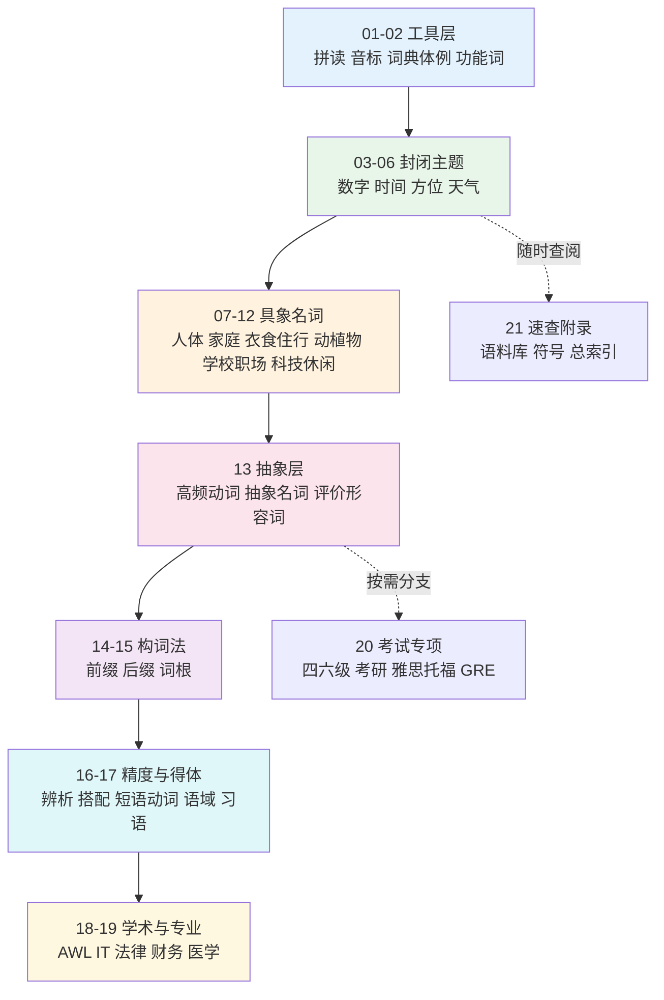

# 英语词汇系统教程 · 大纲总览

> [!info] 教程定位
>
> 这套教程只管一件事：**词**。词长什么样、怎么读、什么意思、跟谁搭配、怎么造出更多词、什么场合该用哪一个。
>
> 句子怎么搭、时态怎么变、从句怎么套，全部交给 `02.英语基础语法`；什么场景说什么话、对话怎么接，全部交给 `04.英语场景`。三套教程不互相重复。
>
> 读者预设是中文母语的成年自学者，零散基础，目标是能读英文技术文档、规范与原版书。

---

## 目录

- [这套教程解决什么问题](#这套教程解决什么问题)
- [与另两套教程的分工](#与另两套教程的分工)
- [学习路线图](#学习路线图)
- [完整分类目录](#完整分类目录)
- [学习建议](#学习建议)
- [文档统一结构](#文档统一结构)
- [大纲版本](#大纲版本)

---

## 这套教程解决什么问题

语法书教「怎么把词摆进句子」，场景书教「什么时候说什么话」，两者都默认你已经有词。真正卡住自学者的往往是更前面的东西：

- 星期七天首字母要不要大写，`Wednesday` 的第一个 `d` 为什么不发音
- 月份缩写英式写 `Mon` 美式写 `Mon.`，`September` 明明词根是「七」为什么是九月
- 中文说「东南」，英文为什么是 `southeast` 而不是 `eastsouth`
- 天气从 `drizzle` 到 `downpour` 有几档，`fog` `mist` `haze` `smog` 差在哪
- 词典里的 `U` `C` `vt.` `[often passive]` 到底怎么读
- `forty` 为什么没有 `u`，`thirteen` 和 `thirty` 的重音为什么相反

这些都不是语法问题，也不是对话问题，是**词本身的问题**。本教程按主题把它们铺开，从最封闭、最有限的主题（数字、星期、方位、四季）起步，逐步走到最开放的主题（抽象概念、专业术语、习语）。

### 三条同时爬升的轴

| 轴 | 起点 | 终点 |
| --- | --- | --- |
| 具象程度 | 看得见摸得着的名词（食材、动物、家具） | 抽象概念与评价词（premise、discrepancy、negligible） |
| 词表开放度 | 封闭集（七个星期、十二个月、四个方位） | 开放集（专业术语、习语、俚语） |
| 学习方式 | 背词表 | 用词根前后缀自己造词、自己判断语域 |

---

## 与另两套教程的分工

同一批词可能在三套教程里都出现，但讲的角度不同。边界如下：

| 内容 | 归属 | 本教程怎么处理 |
| --- | --- | --- |
| 名词可数不可数的语法规则 | `02.英语基础语法` | 不讲规则，只在词表里标 `U` / `C` |
| 不规则动词三态全表 | `02.英语基础语法/13.附录/02.常用动词变化表.md` | 不重排全表，只按元音交替分组，另主讲不规则复数 |
| 逐介词搭配清单 | `02.英语基础语法/13.附录/03.介词搭配速查.md` | 不重列，只讲 in/on/at 从空间义到抽象义的引申路径 |
| 语法术语定义 | `02.英语基础语法/13.附录/01.语法术语表.md` | 不重定义，只讲词典标注怎么判读 |
| 点餐、问路、看病的对话 | `04.英语场景` | 不写对话，只给词表与搭配 |
| 句型框架与功能句型 | `04.英语场景` | 不写句型库 |

> [!warning] 遇到同一个词出现在两章时
>
> 全书对每类词都指定了**唯一主讲点**，其余位置只引用不重讲。例如缩略语按「读音 / 释义 / 语气」三分：读法集中在 `20.专业领域词汇/04`，场景对照表在 `22.速查附录与学习资源/02`，带语气的社交缩写在 `12.科技、媒体与休闲/02`，构词机制在 `15.词根、合成与缩略/04`。查词时按这个分工找，不会看到四份互相矛盾的表。

---

## 学习路线图



上图的实线是主干，必须按顺序走：没有拼读能力，后面所有词表都读不出来；没攒够具象词，直接跳到构词法会没有可拆解的素材。两条虚线是支线——`21.速查附录` 从第一天起就随时查，`21.考试词汇专项` 只在你确实要考试时进入，不考可以整章跳过。

---

## 完整分类目录

### 01.词汇入门与学习方法（6 篇）

入门元知识：词汇分层地图、拼读与读音、词典标注体例、学习方法与自测定位。

| 序号 | 文档标题 | 核心内容 | 词条数 | 字数 |
| --- | --- | --- | --- | --- |
| 01 | [[01.词汇入门与学习方法/01.英语词汇的来源、分层与学习地图\|英语词汇的来源、分层与学习地图]] | 古英语层、诺曼法语层、拉丁希腊层的三重来源与 ask/inquire/interrogate 式同义三阶；21 章知识地图与依赖关系；给出程序员快车道路径与全书字母反查表入口。 | 80 | 13000+ |
| 02 | [[01.词汇入门与学习方法/02.自然拼读：拼写与发音对应规则\|自然拼读：拼写与发音对应规则]] | 辅音字母组合 ch/sh/th/ph/gh、元音字母组合 ea/ou/oo/ai、magic e 的 hop-hope、开闭音节判定，以及 colonel、debt、island 这类拼读失效词的处理办法。 | 220 | 14000+ |
| 03 | [[01.词汇入门与学习方法/03.音标、词重音与词典读音体例\|音标、词重音与词典读音体例]] | IPA 与 KK 音标对照、schwa 弱读、重音移位对 record、present、conduct 的词性区分作用、复合词重音规则，以及词典里 ˈ ˌ 与英美双标音的读法。 | 180 | 13000+ |
| 04 | [[01.词汇入门与学习方法/04.词性与词典标注体例：词条上的缩写怎么读\|词性与词典标注体例：词条上的缩写怎么读]] | 八大词类中英名称与英文原版语法书、技术规范里 noun phrase、modifier、predicate 的实际用法；词典条目里 U/C、vt./vi.、sb./sth.、[often passive]、[not in progressive] 的判读；术语定义链向语法教程附录。 | 110 | 12000+ |
| 05 | [[01.词汇入门与学习方法/05.词汇学习方法总纲\|词汇学习方法总纲]] | 词族与 lemma 的记忆单位选择、间隔重复的实际参数、语境记忆与例句自造、被动词汇转主动词汇的产出训练、遗忘曲线在生词本上的落地。 | 60 | 13000+ |
| 06 | [[01.词汇入门与学习方法/06.词汇量自测、CEFR 对照与目标设定\|词汇量自测、CEFR 对照与目标设定]] | Nation VST 按 14000 词族抽样、Test Your Vocab 按词目计数、Lextutor 词频剖析三种口径为何差出两倍；CEFR 与词族数对照 A2≈1500、B2≈4500、C1≈8000；月度复盘表与 lapse 词排查。 | 70 | 12000+ |

---

### 02.功能词与封闭词类速查（8 篇）

封闭词类的词形矩阵与介词语义地图，只做词汇视角的增值层，逐条搭配清单一律指向语法教程附录。

| 序号 | 文档标题 | 核心内容 | 词条数 | 字数 |
| --- | --- | --- | --- | --- |
| 01 | [[02.功能词与封闭词类速查/01.代词与限定词的词形矩阵\|代词与限定词的词形矩阵]] | 人称、物主、反身、指示、疑问、不定代词六组的主格宾格形式矩阵；限定词 some/any/each/every/either/neither/both/all 的搭配限制与 another 与 the other 的分工。 | 90 | 13000+ |
| 02 | [[02.功能词与封闭词类速查/02.空间与路径介词：空间原型义到抽象义的引申\|空间与路径介词：空间原型义到抽象义的引申]] | in/on/at 点面体对立、over/under 垂直轴、through 贯穿义与容器、路径、垂直三条引申通道；静态与动态对立 in/into、on/onto；路径五分 into 进入、through 三维贯穿、across 二维横穿、along 沿线、over 越障；within 的边界内义与 in two hours 的差别；误配点 discuss about、arrive to、reply me。 | 60 | 13000+ |
| 03 | [[02.功能词与封闭词类速查/03.of 与 to：属格网络与方向对象网络\|of 与 to：属格网络与方向对象网络]] | of 与 off 同源、原型是分离（rob sb of sth、deprive of、cure of），分离视角反转即得部分与所属；八支义项网含所属、部分、材料、同位 a fool of a man、量词、属性、来源；of 与 s 属格按有生性分工、双属格 a friend of mine；to 的方向、与格、附着、比较基准 superior to、时间终点、程度；专节讲 to 作介词与作不定式标记的判别（look forward to、be used to、object to，用能否换 it 检验）。 | 90 | 15000+ |
| 04 | [[02.功能词与封闭词类速查/04.with、by、for、from：伴随、施事、目的与来源\|with、by、for、from：伴随、施事、目的与来源]] | with 从伴随到拥有、工具、方式、关联、原因、同步、让步与 with 独立结构；by 的施事、方式、期限（对比 until 的持续）、幅度 rise by 20%、依据 by law、递进 one by one；for 的目的、受益、时长、交换、代表、基准 tall for his age；from 的来源、起点、材料 made from 对 made of、原因 die from 对 die of、prevent sb from doing；含 with 与 by 的工具-施事二分、give to 与 buy for 的与格分工、borrow 与 lend 误配清单。 | 95 | 15000+ |
| 05 | [[02.功能词与封闭词类速查/05.其余介词与复合介词：语义分组与语域分层\|其余介词与复合介词：语义分组与语域分层]] | about 话题与 on 的深浅差、be about to；against 的对抗、倚靠、防备、对照；between 与 among 的真实分工（relations between six countries 并非错句）；beyond me、beyond repair；despite 与 in spite of 只接名词、despite the fact that；during 答 when 与 for 答 how long；beside 与 besides；except / except for / apart from / other than 排除五分；like 与 as 的相似-身份对立；复合介词五组与主谓一致陷阱；末尾给三档语域分层表与四篇合并的介词总索引。 | 100 | 15000+ |
| 06 | [[02.功能词与封闭词类速查/06.连词、情态动词、助动词与感叹词速查\|连词、情态动词、助动词与感叹词速查]] | 并列与从属连词的语义分类、情态动词的可能性梯度 must/should/may/might/could、助动词 do/have/be 的功能分工、感叹词 ouch/oops/huh/well 的语用功能。 | 100 | 12000+ |
| 07 | [[02.功能词与封闭词类速查/07.不规则动词形态分组与不规则复数全表\|不规则动词形态分组与不规则复数全表]] | 按元音交替型成组记忆 sing-sang-sung、drink-drank-drunk；易混对 lie/lay/lain 与 lay/laid/laid、hang 双套形式；-en 分词转形容词 broken/frozen/swollen；不规则复数 child/criterion/datum 与拉丁希腊复数、单复同形全表。 | 260 | 14000+ |
| 08 | [[02.功能词与封闭词类速查/08.程度副词、频率副词与模糊限制词\|程度副词、频率副词与模糊限制词]] | very/quite/rather/fairly/pretty/somewhat/slightly/a bit 的强度阶梯排序；absolutely/utterly 只配绝对形容词的搭配限制；quite 的英美义项分歧；hardly/scarcely/barely 的半否定用法与频率副词位置。 | 70 | 12000+ |

---

### 03.数字与计量词汇（4 篇）

数字读法的唯一主讲章，从基数序数到运算、度量衡与货币图表趋势。

| 序号 | 文档标题 | 核心内容 | 词条数 | 字数 |
| --- | --- | --- | --- | --- |
| 01 | [[03.数字与计量词汇/01.基数词、序数词与数字串读法\|基数词、序数词与数字串读法]] | 基数序数构成与拼写陷阱 ninth/twelfth/fortieth；大数分节 thousand/million/billion 的中英错位；电话号、房号、年份、比分、编号串的读法与 double/triple 用法。 | 120 | 13000+ |
| 02 | [[03.数字与计量词汇/02.分数、小数、百分数与数学运算读法\|分数、小数、百分数与数学运算读法]] | 分数 two thirds、three quarters 的单复数、小数 point 逐位读、百分数与 percentage point 之别；加减乘除、乘方开方、方程与不等式的口头读法。 | 110 | 12000+ |
| 03 | [[03.数字与计量词汇/03.度量衡词表\|度量衡词表]] | 长度、重量、面积、体积、温度的公制与英制词表与换算表述；foot/feet、inch、mile、pound、ounce、gallon、acre 与 Celsius/Fahrenheit 的日常表达。 | 150 | 13000+ |
| 04 | [[03.数字与计量词汇/04.货币、价格、折扣与统计图表趋势\|货币、价格、折扣与统计图表趋势]] | 货币名称与符号读法、价格表述 a fiver、change、deposit；折扣 30% off、buy one get one free；图表趋势词 rise/fall/soar/plunge/level off 与 sharply/steadily 的搭配。 | 160 | 14000+ |

---

### 04.时间与日历词汇（4 篇）

日历刻度与时间词群的主讲章：星期月份四季、钟点日期读法、时段频率与时区习语。

| 序号 | 文档标题 | 核心内容 | 词条数 | 字数 |
| --- | --- | --- | --- | --- |
| 01 | [[04.时间与日历词汇/01.日历与钟点：星期、月份、四季与日期时刻读法\|日历与钟点：星期、月份、四季与日期时刻读法]] | 星期月份全表与 Sept./Sep. 缩写体例、September 为何是九月的词源错位、大写规则；四季名与形容词 vernal/autumnal/wintry、fall 与 autumn 英美差异、in spring 冠词习惯；钟点 past/to/quarter 与 24 小时制、日期序数与年份分段读法、07/04/2026 歧义与 ISO 8601、Q1–Q4 与财年。 | 140 | 15000+ |
| 02 | [[04.时间与日历词汇/02.时段、时长、频率与时间状语词群\|时段、时长、频率与时间状语词群]] | dawn/dusk/fortnight/decade 时段词、for/during/within/throughout 的时长表述、频率梯度 always 到 never、时间状语 the other day、by then、in no time 的位置与搭配。 | 180 | 14000+ |
| 03 | [[04.时间与日历词汇/03.节日、假期、年龄与世代词汇\|节日、假期、年龄与世代词汇]] | 英美主要节日与 eve/vigil/observance；假期 vacation/holiday/leave/day off 的英美与语域差异；年龄表述 in his forties、teenager、toddler；世代 Baby Boomer/Gen X/Millennial/Gen Z。 | 170 | 13000+ |
| 04 | [[04.时间与日历词汇/04.日程、时区、准时延误与时间习语\|日程、时区、准时延误与时间习语]] | 日程动词 schedule/reschedule/postpone/bring forward、时区 GMT/UTC/DST/jet lag；准时延误 on time/in time/behind schedule/overdue；时间习语 in the nick of time、around the clock、call it a day。 | 150 | 13000+ |

---

### 05.方位与空间词汇（4 篇）

方位与空间关系的表达全集，横向铺同一关系的不同词类形式，介词条目让给 02.02。

| 序号 | 文档标题 | 核心内容 | 词条数 | 字数 |
| --- | --- | --- | --- | --- |
| 01 | [[05.方位与空间词汇/01.东南西北：方位词的三种形式\|东南西北：方位词的三种形式]] | north/northern/northward 三形式与 northerly；中英语序颠倒 东南=southeast、西北=northwest；the North 大写规则、the Far East 与 the Middle East、compass point 的读法。 | 90 | 12000+ |
| 02 | [[05.方位与空间词汇/02.上下左右里外\|上下左右里外]] | 同一空间关系的跨词类形式 up/upward/upper/the top/uphill 与 in/inside/inner/the interior；中文「里」对应 in/inside/within 三分；相对方位与绝对方位表达；介词条目详见 02.02。 | 130 | 13000+ |
| 03 | [[05.方位与空间词汇/03.地图、坐标、导航与行政区划\|地图、坐标、导航与行政区划]] | latitude/longitude/altitude、scale/legend/contour；导航指令 head north、take the second exit、roundabout；行政区划 state/province/county/district/borough 与英美体系差异。 | 160 | 13000+ |
| 04 | [[05.方位与空间词汇/04.形状轮廓、大小规模与运动方向\|形状轮廓、大小规模与运动方向]] | 平面与立体形状词、轮廓 curved/jagged/tapered；大小规模梯度 tiny 到 immense 与 vast/spacious 的搭配限制；运动方向动词 approach/withdraw/circulate/diverge。 | 190 | 13000+ |

---

### 06.天气、自然与地理（5 篇）

天气按现象类别切三篇，加地貌与天体节律，四季的天文物候义在本章末篇。

| 序号 | 文档标题 | 核心内容 | 词条数 | 字数 |
| --- | --- | --- | --- | --- |
| 01 | [[06.天气、自然与地理/01.基础天气词与冷热强度阶梯\|基础天气词与冷热强度阶梯]] | 天气主入口：sunny/cloudy/windy/humid 基础词与名动形三态；冷热梯度 freezing/chilly/cool/mild/warm/hot/scorching；weather 与 climate 之别、寒暄式天气表达与体感词 wind chill、muggy。 | 150 | 13000+ |
| 02 | [[06.天气、自然与地理/02.降水、风与云雾能见度\|降水、风与云雾能见度]] | 降水梯度 drizzle/shower/downpour/torrential、sleet/hail/blizzard；风力 breeze/gale/gust 与蒲福风级；云型 cumulus/overcast、雾霾 fog/mist/haze/smog 与能见度表述。 | 170 | 13000+ |
| 03 | [[06.天气、自然与地理/03.极端天气、自然灾害与天气预报\|极端天气、自然灾害与天气预报]] | hurricane/typhoon/cyclone 同一现象的地区名、tornado、drought、flash flood、wildfire、landslide；预报体例 forecast、warning 与 watch 之别、precipitation chance、front、high/low pressure。 | 160 | 13000+ |
| 04 | [[06.天气、自然与地理/04.山川平原海岸与水体地貌\|山川平原海岸与水体地貌]] | 山地 peak/ridge/valley/plateau、平原 prairie/steppe/basin；海岸 cliff/bay/peninsula/estuary；水体 stream/tributary/delta/reservoir/glacier 与 lagoon、reef。 | 200 | 13000+ |
| 05 | [[06.天气、自然与地理/05.天体宇宙、自然节律与气候环境议题\|天体宇宙、自然节律与气候环境议题]] | 天体 orbit/eclipse/galaxy/asteroid 与 tilt/axis；作为天文物候现象的季节 solstice、equinox、growing season、dormancy、migration 与热带 dry/rainy season；气候议题 emission、carbon footprint、renewable energy、climate change 全部归本篇。 | 190 | 14000+ |

---

### 07.人体、健康与情绪（5 篇）

从身体部位到症状就医、情绪梯度与心理健康，一律用病人视角的日常词。

| 序号 | 文档标题 | 核心内容 | 词条数 | 字数 |
| --- | --- | --- | --- | --- |
| 01 | [[07.人体、健康与情绪/01.身体部位、内脏器官与生理系统\|身体部位、内脏器官与生理系统]] | 外部部位与关节 wrist/ankle/knuckle/shin、内脏 liver/kidney/spleen/pancreas、系统 circulatory/respiratory/digestive；日常常混的 arm/forearm、leg/thigh/calf。 | 220 | 13000+ |
| 02 | [[07.人体、健康与情绪/02.外貌体型、姿势动作与感官动词\|外貌体型、姿势动作与感官动词]] | 外貌 slim/stocky/freckled/bald、体型与身高表述；姿势动作 crouch/lean/sprawl/nod；感官动词 look/see/watch、hear/listen、smell/taste/touch 的主动被动分工。 | 230 | 14000+ |
| 03 | [[07.人体、健康与情绪/03.症状、疾病、就医科室与用药\|症状、疾病、就医科室与用药]] | 症状口语 sore throat、stuffy nose、dizzy、swollen；常见疾病与传染病名；挂号整句 Which department should I go to、see a dermatologist（不拆科室词根）；医嘱口语 take it after meals、side effect、over-the-counter、prescription。 | 210 | 14000+ |
| 04 | [[07.人体、健康与情绪/04.情绪梯度词群与表情体态\|情绪梯度词群与表情体态]] | 喜怒哀惧四组各自的强度梯度 pleased/delighted/ecstatic、annoyed/furious/livid；焦虑与羞耻词群；表情体态 frown/smirk/blush/shrug 与情绪的身体隐喻表达。 | 200 | 13000+ |
| 05 | [[07.人体、健康与情绪/05.性格形容词、心理健康与睡眠营养体能\|性格形容词、心理健康与睡眠营养体能]] | 性格褒贬对 confident/arrogant、frugal/stingy；心理健康 anxiety、burnout、resilience、therapy；睡眠 insomnia/nap/oversleep、营养 protein/fiber/calorie、体能 stamina/workout。 | 210 | 13000+ |

---

### 08.家庭、人际与社会身份（5 篇）

从亲属称谓到社交礼仪与社会身份，末篇补齐宗教、战争与历史时代的背景词。

| 序号 | 文档标题 | 核心内容 | 词条数 | 字数 |
| --- | --- | --- | --- | --- |
| 01 | [[08.家庭、人际与社会身份/01.亲属称谓全表\|亲属称谓全表]] | 直系旁系与姻亲全表 in-law/step-/half-/foster、cousin 的辈分表述 first cousin once removed；中英称谓颗粒度差异（叔伯舅统称 uncle）与 sibling、spouse、offspring 的正式度。 | 120 | 12000+ |
| 02 | [[08.家庭、人际与社会身份/02.人生阶段、婚恋、育儿与人生仪式\|人生阶段、婚恋、育儿与人生仪式]] | 人生阶段 infancy 到 retirement、婚恋 date/engaged/elope/divorce/custody；育儿 pregnancy/due date/breastfeed/tantrum；仪式 baptism/graduation/housewarming/funeral/eulogy。 | 200 | 13000+ |
| 03 | [[08.家庭、人际与社会身份/03.称呼语、姓名、社交礼仪与人际互动动词\|称呼语、姓名、社交礼仪与人际互动动词]] | Mr./Ms./Dr. 与 sir/ma'am 的使用边界、given name/surname/middle name/nickname；礼仪 RSVP、small talk、toast；互动动词 greet/introduce/interrupt/compromise/reconcile。 | 190 | 13000+ |
| 04 | [[08.家庭、人际与社会身份/04.国家国籍语言、人群集合与社会身份\|国家国籍语言、人群集合与社会身份]] | 国名与国籍形容词的构词规律 -ish/-ese/-an、语言名与 the Dutch 式集合用法；人群集合 crowd/mob/audience/congregation；社会身份 citizen/resident/immigrant/minority/class。 | 230 | 13000+ |
| 05 | [[08.家庭、人际与社会身份/05.历史、宗教、战争与时事背景词\|历史、宗教、战争与时事背景词]] | 宗教信仰 church/priest/sermon/scripture/sacred/ritual 与 mosque/temple/Buddhism 对应词；战争冲突 troops/siege/treaty/ceasefire/refugee/casualty；历史时代 medieval/empire/revolution/colony/feudal；新闻政经 sanction/inflation/coalition/referendum/tariff/summit。字面义与文化背景归本篇，引申义归 19.04。 | 260 | 15000+ |

---

### 09.衣食住行（6 篇）

生活实物词的六篇主干：穿的、吃的、做饭的、住的、家务的、出行的。

| 序号 | 文档标题 | 核心内容 | 词条数 | 字数 |
| --- | --- | --- | --- | --- |
| 01 | [[09.衣食住行/01.服装鞋帽配饰\|服装鞋帽配饰]] | 上下装与外套细分 blazer/cardigan/hoodie/trench coat、鞋类 sneakers/loafers/heels、配饰 scarf/belt/cuff link；面料与版型 loose/snug/tailored 与试穿表达 fit/suit/match。 | 250 | 13000+ |
| 02 | [[09.衣食住行/02.食材词表\|食材词表]] | 蔬菜、水果、肉类分割部位 sirloin/brisket/drumstick、海鲜、谷物豆类、乳制品与调味料全表；英美差异 eggplant/aubergine、zucchini/courgette、cilantro/coriander。 | 420 | 14000+ |
| 03 | [[09.衣食住行/03.烹饪动词、厨具餐具与口味口感\|烹饪动词、厨具餐具与口味口感]] | 烹饪动词 simmer/braise/sauté/blanch/marinate/whisk 的火候与手法差别；厨具 skillet/colander/spatula、餐具摆位；口味 savory/tangy/bland 与口感 crispy/chewy/tender/greasy。 | 260 | 13000+ |
| 04 | [[09.衣食住行/04.住房、房间结构、家具与家电\|住房、房间结构、家具与家电]] | 房型 studio/detached/terraced/flat 与英美差异、房间与结构 hallway/attic/basement/ceiling beam；家具 wardrobe/couch/nightstand、家电 dishwasher/kettle/extractor hood。 | 280 | 13000+ |
| 05 | [[09.衣食住行/05.家务、日用品、垃圾回收与故障维修\|家务、日用品、垃圾回收与故障维修]] | 家务动词 vacuum/mop/declutter/do the laundry、日用品 detergent/duvet/plunger；垃圾分类 recyclable/compost/landfill；家用故障 leak/clog/blow a fuse 与叫师傅的表达。 | 250 | 13000+ |
| 06 | [[09.衣食住行/06.交通工具、道路出行与行李装备\|交通工具、道路出行与行李装备]] | 交通工具与英美差异 subway/underground、gas/petrol、trunk/boot；道路 junction/roundabout/lane/detour、驾驶动词 overtake/pull over/reverse；行李 carry-on/checked baggage 与出行装备。 | 280 | 14000+ |

---

### 10.动植物、颜色与感官属性（4 篇）

自然生命词表与物理属性词：动物、植物、颜色材质与声音气味光线。

| 序号 | 文档标题 | 核心内容 | 词条数 | 字数 |
| --- | --- | --- | --- | --- |
| 01 | [[10.动植物、颜色与感官属性/01.动物词表\|动物词表]] | 哺乳、鸟、鱼、爬行、昆虫五大类词表与常混词 rabbit/hare、turtle/tortoise、moth/butterfly；家畜家禽全名与野生动物的英美常见度差异。 | 400 | 14000+ |
| 02 | [[10.动植物、颜色与感官属性/02.动物身体、幼崽专名、叫声与宠物照料\|动物身体、幼崽专名、叫声与宠物照料]] | 动物身体 paw/hoof/beak/mane/fin/antler；幼崽专名 cub/calf/foal/piglet/chick；叫声动词 bark/neigh/chirp/roar/hiss；宠物照料 groom/neuter/vaccinate/leash。 | 260 | 13000+ |
| 03 | [[10.动植物、颜色与感官属性/03.树木花卉、植物部位与生长动词\|树木花卉、植物部位与生长动词]] | 常见树种与花卉名、植物部位 stem/bud/petal/root/thorn/foliage；生长动词 sprout/bloom/wither/prune/graft 与栽培词 seedling/fertilizer/greenhouse。 | 280 | 13000+ |
| 04 | [[10.动植物、颜色与感官属性/04.颜色、材质、质地与声音气味光线\|颜色、材质、质地与声音气味光线]] | 颜色细分与修饰 pale/deep/navy/beige/turquoise；材质 wooden/metallic/ceramic 与质地 rough/silky/coarse 的物理触感义；声音 rustle/clatter、气味 fragrant/musty、光线 glare/dim/glossy 的物理描述。 | 300 | 13000+ |

---

### 11.学校、职场与城市社会（5 篇）

从校园到求职、公司会议、消费与城市公共生活，项目推进与目标管理让给 19 章。

| 序号 | 文档标题 | 核心内容 | 词条数 | 字数 |
| --- | --- | --- | --- | --- |
| 01 | [[11.学校、职场与城市社会/01.学科、学段、校园设施与课堂考试\|学科、学段、校园设施与课堂考试]] | 学科名与学位 bachelor/master/PhD、学段 kindergarten 到 postgraduate 与英美学制差异；校园设施 dorm/lecture hall/registrar；课堂考试 assignment/quiz/transcript/plagiarism。 | 260 | 13000+ |
| 02 | [[11.学校、职场与城市社会/02.职业名称全表\|职业名称全表]] | 按行业分组的职业名全表与后缀规律 -er/-ist/-ian/-or；易混对 engineer/technician、accountant/auditor、attorney/solicitor 与英美职业名差异。 | 380 | 14000+ |
| 03 | [[11.学校、职场与城市社会/03.求职录用、公司组织与会议流程\|求职录用、公司组织与会议流程]] | 求职 resume/CV/cover letter/referral/onboarding/probation、录用 offer/notice period/severance；公司组织 department/subsidiary/headcount；会议流程 agenda、minutes、action item、chair、circulate、adjourn。项目推进与目标管理见 20.06。 | 250 | 13000+ |
| 04 | [[11.学校、职场与城市社会/04.金钱银行、购物、网购与快递售后\|金钱银行、购物、网购与快递售后]] | 个人账户口径 deposit/withdraw/balance/overdraft/interest rate/mortgage；购物 receipt/refund/warranty/haggle；网购与快递 checkout/tracking number/out for delivery/return label。 | 270 | 13000+ |
| 05 | [[11.学校、职场与城市社会/05.城市建筑、公共设施、法律政治与证件手续\|城市建筑、公共设施、法律政治与证件手续]] | 城市建筑与设施 pavement/crosswalk/utility/landmark；作为居民办事的法律政治词 court/parliament/ballot/regulation；证件手续 passport/visa/residence permit/apply for/renew。 | 280 | 13000+ |

---

### 12.科技、媒体与休闲（4 篇）

面向非专业读者的数字生活与休闲词，技术概念的专业层全部上交 19 章。

| 序号 | 文档标题 | 核心内容 | 词条数 | 字数 |
| --- | --- | --- | --- | --- |
| 01 | [[12.科技、媒体与休闲/01.电脑硬件、软件、界面操作与文件管理\|电脑硬件、软件、界面操作与文件管理]] | 整机部件 CPU/monitor/keyboard/port、软件 install/uninstall/update/crash；界面 tab/dropdown/checkbox/scroll bar、快捷键读法；文件管理 folder/shortcut/compress/back up。 | 280 | 13000+ |
| 02 | [[12.科技、媒体与休闲/02.互联网、手机应用、社交媒体与网络缩写\|互联网、手机应用、社交媒体与网络缩写]] | 上网 browser/bookmark/streaming/bandwidth、手机 app/notification/permission；社交媒体 post/feed/thread/mute/block；带语气的社交缩写 LOL/BTW/DM/OMG（技术与工程缩略语不收，见 22.02 与 20.04）。 | 250 | 13000+ |
| 03 | [[12.科技、媒体与休闲/03.上网与数字生活里的技术词\|上网与数字生活里的技术词]] | 非专业读者也要认识的一层：account/password/two-factor、cloud/sync/storage、encryption 的日常义、algorithm/AI assistant/prompt、data/privacy/cookie。概念掌握见 20.01，文体写法见 20.03。 | 190 | 12000+ |
| 04 | [[12.科技、媒体与休闲/04.体育健身、音乐影视、书籍艺术与游戏爱好\|体育健身、音乐影视、书籍艺术与游戏爱好]] | 球类与赛制 tournament/draw/penalty、健身 reps/set/cardio；音乐流派与乐器、影视 plot/spoiler/subtitle/season finale；书籍体裁与艺术 sketch/exhibition；游戏 level up/co-op/grind。 | 320 | 14000+ |

---

### 13.抽象概念、评价与高频动词（5 篇）

高频万能动词的义项地图、轻动词搭配与抽象名词库，是读写抽象文本的承重层。

| 序号 | 文档标题 | 核心内容 | 词条数 | 字数 |
| --- | --- | --- | --- | --- |
| 01 | [[13.抽象概念、评价与高频动词/01.高频万能动词义项地图 get take make do\|高频万能动词义项地图 get take make do]] | 四个词各自的义项辐射网：get 的获得/到达/变成/理解、take 的取走/花费/接受/认为、make 的制造/使役/构成、do 的执行/处理，以及四者在同一名词前的分工 do the dishes 与 make the bed。 | 140 | 14000+ |
| 02 | [[13.抽象概念、评价与高频动词/02.轻动词搭配 have give go come put set run\|轻动词搭配 have give go come put set run]] | 轻动词加名词的语块 have a look、give it a try、go bankrupt、come into effect、put pressure on、set a precedent、run a business，与对应实义动词的语域差别。 | 180 | 13000+ |
| 03 | [[13.抽象概念、评价与高频动词/03.言语动词与转述动词群\|言语动词与转述动词群]] | 说话动词的语义与句法 claim/argue/note/concede/imply/allege 的立场差别与从句搭配；提议请求类 suggest/propose/urge/insist 的虚拟式要求；转述时态与语气的词汇选择。 | 170 | 13000+ |
| 04 | [[13.抽象概念、评价与高频动词/04.认知动词与因果、影响、变化类实义动词\|认知动词与因果、影响、变化类实义动词]] | 认知 assume/infer/perceive/recall/anticipate；因果 attribute to/stem from/give rise to/account for；影响 affect/hinder/facilitate/undermine；变化 shift/deteriorate/plateau/converge。 | 210 | 14000+ |
| 05 | [[13.抽象概念、评价与高频动词/05.抽象名词库与评价形容词梯度\|抽象名词库与评价形容词梯度]] | 高频抽象名词 aspect/factor/scope/premise/consensus/discrepancy；评价形容词的褒贬与强度梯度 adequate/decent/solid/outstanding 与 flawed/dubious/appalling，及其与副词修饰的配合。 | 250 | 14000+ |

---

### 14.构词法：前缀与后缀（6 篇）

用词族思维批量扩容：否定、方位、数量三类前缀与名形动副四类后缀。

| 序号 | 文档标题 | 核心内容 | 词条数 | 字数 |
| --- | --- | --- | --- | --- |
| 01 | [[14.构词法：前缀与后缀/01.构词法总览与词族思维\|构词法总览与词族思维]] | 派生、复合、转化三条造词路径；词族的边界判定与 word family 计数口径；从一个词根扩出十几个词的推演流程与拼写调整规则（重音移位、辅音同化、去 e 加 y）。 | 90 | 12000+ |
| 02 | [[14.构词法：前缀与后缀/02.否定与相反前缀\|否定与相反前缀]] | un-/in-/im-/il-/ir-/dis-/non-/a-/mis-/mal-/anti-/counter-/de- 的选择规律与拉丁法语层来源；unable 与 disabled、inhuman 与 nonhuman 的语义分岔与 in- 的同化拼写。 | 180 | 13000+ |
| 03 | [[14.构词法：前缀与后缀/03.方位、时间与关系前缀\|方位、时间与关系前缀]] | 方位 sub-/super-/inter-/intra-/trans-/circum-/peri-；时间 pre-/post-/ante-/retro-/fore-；关系 co-/con-/syn-/pro-/contra-/ex-/re- 的双义（再次与向后）。 | 200 | 13000+ |
| 04 | [[14.构词法：前缀与后缀/04.数量、程度与规模前缀\|数量、程度与规模前缀]] | 数量 mono-/bi-/tri-/multi-/poly-/semi-/hemi-/omni-；程度 over-/under-/hyper-/hypo-/ultra-/extra-；规模 micro-/macro-/mega-/nano-/giga- 与计量前缀在技术语境的读法。 | 190 | 13000+ |
| 05 | [[14.构词法：前缀与后缀/05.名词后缀家族\|名词后缀家族]] | 施事 -er/-or/-ist/-ant、抽象 -ness/-ity/-tion/-ment/-ance/-ship/-hood、学科 -logy/-ics、集合与场所 -ery/-age/-arium；同根多后缀的语义分工 employer/employee/employment。 | 230 | 14000+ |
| 06 | [[14.构词法：前缀与后缀/06.形容词、动词与副词后缀\|形容词、动词与副词后缀]] | 形容词 -ous/-ive/-al/-ic/-ical/-ful/-less/-able/-ish 与 -ic 和 -ical 的义项分岔 economic/economical；动词 -ize/-ify/-ate/-en；副词 -ly 的例外与 -wise/-ward。 | 210 | 13000+ |

---

### 15.词根、合成与缩略（4 篇）

拉丁希腊词根系统与合成截短缩略的构词机制，只讲原理不列使用清单。

| 序号 | 文档标题 | 核心内容 | 词条数 | 字数 |
| --- | --- | --- | --- | --- |
| 01 | [[15.词根、合成与缩略/01.高频拉丁词根（上）\|高频拉丁词根（上）]] | 动作类词根 spect/spic、duc/duct、port、mit/miss、ject、tract、pon/pos、fer 的形变规律与词族扩展，含形近词根的辨别方法。 | 240 | 14000+ |
| 02 | [[15.词根、合成与缩略/02.高频拉丁词根（下）\|高频拉丁词根（下）]] | 状态与判断类词根 cap/cept、fac/fect、ven/vent、cur/curs、scrib/script、dict、struct、vert/vers、tain/ten 与其在学术与技术词里的高复现组合。 | 250 | 14000+ |
| 03 | [[15.词根、合成与缩略/03.希腊词根与学科术语\|希腊词根与学科术语]] | graph/gram、meter/metr、phon、scope、bio/geo/chrono/psycho/therm、-logy/-nomy/-pathy 的组合规则；希腊词根为何集中在科学术语层及其复数形式。 | 230 | 13000+ |
| 04 | [[15.词根、合成与缩略/04.合成词、转化词、截短词与缩略语\|合成词、转化词、截短词与缩略语]] | 合成词连字符与分写规则、名词转动词的转化 google/impact；截短 ad/exam/flu、混成 brunch/smog；acronym 与 initialism 的生成机制（只讲机制，不列任何缩略语清单）。 | 190 | 13000+ |

---

### 16.词义辨析、搭配与短语动词（6 篇）

词与词之间的关系网：同义反义、多义引申、搭配语块与两篇短语动词。

| 序号 | 文档标题 | 核心内容 | 词条数 | 字数 |
| --- | --- | --- | --- | --- |
| 01 | [[16.词义辨析、搭配与短语动词/01.同义词辨析方法与高频同义词组\|同义词辨析方法与高频同义词组]] | 辨析的四把尺子：语域、强度、搭配限制、褒贬色彩；通用高频同义组 big/large/huge、begin/start/commence、ask/inquire。全书唯一的同义辨析方法论主讲章。 | 260 | 14000+ |
| 02 | [[16.词义辨析、搭配与短语动词/02.反义词体系、一词多义与词义引申\|反义词体系、一词多义与词义引申]] | 互补反义与程度反义的差别、前缀反义与词汇反义；一词多义的生成机制：隐喻、转喻、泛化与专化，以及从上下文反推陌生义项的判定流程。行业义项清单一律见 20.02/20.05/20.07 与 21.02。 | 190 | 14000+ |
| 03 | [[16.词义辨析、搭配与短语动词/03.近形近音易混词与中式英语陷阱\|近形近音易混词与中式英语陷阱]] | 近形 adapt/adopt、principal/principle、affect/effect、complement/compliment；近音 desert/dessert；中式英语陷阱 open the light、very like、learn knowledge 与冠词单复数的母语迁移。 | 270 | 14000+ |
| 04 | [[16.词义辨析、搭配与短语动词/04.语块类型与搭配体系\|语块类型与搭配体系]] | 动名、形名、副形四类搭配与固定语块 heavily dependent、strongly opposed、a heated debate；搭配强度分级与可替换边界；语块记忆优先于单词记忆的操作办法。 | 260 | 14000+ |
| 05 | [[16.词义辨析、搭配与短语动词/05.短语动词（上）up out off down\|短语动词（上）up out off down]] | 四个小品词的核心意象与语义辐射：up 的完成与增强、out 的向外与耗尽、off 的分离与终止、down 的减少与记录；及物性与可分性判定 turn it down 与 look after it。 | 300 | 14000+ |
| 06 | [[16.词义辨析、搭配与短语动词/06.短语动词（下）on in over through back away\|短语动词（下）on in over through back away]] | on 的持续与依附、in 的进入与参与、over 的覆盖与重来、through 的贯穿与完成、back 的回归与克制、away 的离开与消耗，含高频三词短语动词 put up with、get away with。 | 300 | 14000+ |

---

### 17.固定搭配（8 篇）

把「词与词怎么结合」单独成章：搭配强度分级、四类词层搭配、动介与名形介搭配，以及带槽位的半固定框架。

| 序号 | 文档标题 | 核心内容 | 词条数 | 字数 |
| --- | --- | --- | --- | --- |
| 01 | [[17.固定搭配/01.搭配强度分级与可替换边界\|搭配强度分级与可替换边界]] | 四档连续统：自由组合 see a film、常规搭配 watch a film、强搭配 heavy rain 与 make a decision、完全固定 by and large；可替换边界三测（同义词代入 strong coffee 对 powerful coffee、修饰语插入 heavy overnight rain、名词化与被动变形）；替换的不对称性 heavy/light rain 成对而 strong coffee 无 weak coffee；词典搭配标注与 COCA/BNC 频次自查步骤。 | 120 | 13000+ |
| 02 | [[17.固定搭配/02.动词+名词搭配（上）make、do、have、take\|动词+名词搭配（上）make、do、have、take]] | 四个轻动词各自的名词群：make a decision/an effort/progress/a difference/sense；do the dishes/research/harm/a favour；have a look/a break/an effect/access；take a shower/notes/action/a risk；make 与 do 的成品与活动分界及模糊带；have a look 与 take a look 的英美差异；轻动词结构与单动词的语域与体貌差别。 | 180 | 14000+ |
| 03 | [[17.固定搭配/03.动词+名词搭配（下）give、pay、hold 与商务学术动名组\|动词+名词搭配（下）give、pay、hold 与商务学术动名组]] | give a talk/rise to/priority to、pay attention/a visit/the price、hold a meeting/a view/office；扩到 raise concerns、draw a conclusion、meet a deadline、reach an agreement、conduct research、place an order、set a precedent、break a promise、address an issue、implement a policy；附 say/tell/speak/talk 与 win/beat 的宾语限制自查表。 | 190 | 14000+ |
| 04 | [[17.固定搭配/04.形容词+名词搭配：强度、规模与名词偏好\|形容词+名词搭配：强度、规模与名词偏好]] | heavy/strong/powerful/deep/high 的名词群与分界；big/large/great/major、broad 与 wide、severe/serious/acute/grave、key/vital/crucial/essential 的可换与不可换；只作定语的强化形容词 sheer luck、utter nonsense、a mere child；中式错配 big rain、heavy wind、expensive price 对照（成因分析见 16.03）。 | 200 | 15000+ |
| 05 | [[17.固定搭配/05.副词+形容词强化搭配：highly、deeply、bitterly 的固定伴侣\|副词+形容词强化搭配：highly、deeply、bitterly 的固定伴侣]] | highly likely、deeply concerned、bitterly disappointed、fully aware、widely used、heavily dependent、strongly opposed、badly needed、utterly ridiculous；量级配对规则（可分级形容词配 very/extremely，极限形容词配 absolutely/utterly）；very/quite/rather/fairly/pretty 的强度刻度与 quite good 的英美歧义；同源转换表 heavy dependence 对 heavily dependent。 | 150 | 15000+ |
| 06 | [[17.固定搭配/06.动词+介词固定搭配：depend on、result in、consist of\|动词+介词固定搭配：depend on、result in、consist of]] | 按介词收动词（on/in/of/to/for/with/from 七组）；方向对立对 result in 与 result from、consist of 与 consist in；中文误加介词的及物动词 discuss、enter、marry、contact、approach、emphasize；与 16.05/16.06 短语动词的边界：本篇只收介词由动词硬性选定且动词保持本义的组合。 | 200 | 15000+ |
| 07 | [[17.固定搭配/07.名词与形容词+介词固定搭配：reason for、aware of、responsible for\|名词与形容词+介词固定搭配：reason for、aware of、responsible for]] | 名词端按介词分组（for/to/in/of/on/between/over），形容词端（of/to/for/with）；同源词介词是否一致（dependent on 对 dependence on 一致、similar to 对 similarity between 不一致）；一词多介词变义 good at/for/with、familiar with/to、concerned about/with；查询方向与语法教程附录相反：那边按介词排回答 in 能接什么，本篇按中心词排回答 reason 后面跟哪个介词。 | 220 | 15000+ |
| 08 | [[17.固定搭配/08.半固定框架与高频语块：It is worth doing 与 the more the more\|半固定框架与高频语块：It is worth doing 与 the more the more]] | 七组带槽位框架：评价 It is worth doing、There is no point in doing、It goes without saying that；比较 the more the more、no sooner than、not so much A as B；心理视角 It occurs to me that、What strikes me is；因果条件 given that、on the grounds that、at the risk of doing；数量 a great deal of、in the region of、anything but；学术语块 in terms of、on the basis of、as opposed to；槽位限制 worth doing 不能 worth to do、It is essential that sb (should) do。 | 150 | 14000+ |

---

### 18.语域、英美差异与习语俚语（5 篇）

同一意思在不同场合的说法：英美差异、语域分层、习语俚语与叙事文本的词汇门槛。

| 序号 | 文档标题 | 核心内容 | 词条数 | 字数 |
| --- | --- | --- | --- | --- |
| 01 | [[18.语域、英美差异与习语俚语/01.英式与美式词汇差异\|英式与美式词汇差异]] | 日常物件 lift/elevator、flat/apartment、queue/line；拼写体系 -our/-or、-ise/-ize、-re/-er、双写 l；同词异义 pants、chips、first floor 与澳新加的第三种说法。 | 280 | 14000+ |
| 02 | [[18.语域、英美差异与习语俚语/02.语域分层与英语词汇的历史层次\|语域分层与英语词汇的历史层次]] | 古英语层、法语层、拉丁层造成的三阶同义 rise/mount/ascend；正式、中性、口语三档的选词判定；法律与学术文体为何偏拉丁层，以及降低正式度的替换方向。 | 220 | 14000+ |
| 03 | [[18.语域、英美差异与习语俚语/03.习语与谚语\|习语与谚语]] | 按意象源分组的习语 身体类 give a hand、天气类 under the weather、航海类 by and large；谚语的固定形式与缩略引用；习语理解的字面义还原法与误用风险。 | 300 | 14000+ |
| 04 | [[18.语域、英美差异与习语俚语/04.俚语、网络流行语、委婉语与禁忌语\|俚语、网络流行语、委婉语与禁忌语]] | 俚语的时效性与地域性 legit/sus/ghost；网络流行语的生成与半衰期；委婉语 pass away、let go、restructure；禁忌语的强度分级与职场场合的规避策略。 | 260 | 13000+ |
| 05 | [[18.语域、英美差异与习语俚语/05.叙事文本的词汇门槛：动作、描写、对话与旧体词\|叙事文本的词汇门槛：动作、描写、对话与旧体词]] | 读一页小说会卡住的四类词：走说看的姿态动词群 walk→trudge/stride/amble/stagger、said→murmur/snap/drawl 携带的情绪与音量；描写词的文学用法（rough 在描写里的语气）；对话省音与口音拼写 gonna/ain't/'em/walkin' 的解码；旧体词 whilst/amid/lest/thence/bade。 | 300 | 15000+ |

---

### 19.学术通用词汇（4 篇）

学术阅读与写作的通用词层，含全书唯一的通用统计与研究设计术语落点。

| 序号 | 文档标题 | 核心内容 | 词条数 | 字数 |
| --- | --- | --- | --- | --- |
| 01 | [[19.学术通用词汇/01.学术通用词表 AWL（上）：论证与关系\|学术通用词表 AWL（上）：论证与关系]] | AWL 前半：论证 assert/postulate/refute/substantiate、关系 correspond/derive/constitute/underlie；词表按子表编号排列并加考试标记列（CET6/考研/雅思/托福/GRE），20 章不再复制词条。 | 300 | 14000+ |
| 02 | [[19.学术通用词汇/02.学术通用词表 AWL（下）：过程与评价\|学术通用词表 AWL（下）：过程与评价]] | AWL 后半：过程 initiate/implement/sustain/allocate、评价 significant/adequate/valid/arbitrary/negligible；同样带考试标记列，并给出词族展开表（analyse→analysis→analytical→analytically）。 | 300 | 14000+ |
| 03 | [[19.学术通用词汇/03.学术研究、统计术语与论文写作词汇\|学术研究、统计术语与论文写作词汇]] | 论文骨架词 abstract/methodology/limitation/implication、hedging 的 may/tend to/suggest；全书唯一的通用统计落点：mean/median、variance、standard deviation、confidence interval、p-value、statistically significant、correlation vs causation、sample size、regression、baseline。 | 230 | 15000+ |
| 04 | [[19.学术通用词汇/04.典故、专名转普通词与词源背景\|典故、专名转普通词与词源背景]] | 圣经与神话典故转成的普通词 exodus、apostle、crusade、odyssey、nemesis 的引申用法；专名转普通名 boycott、sandwich、quixotic；字面义与文化背景见 08.05。 | 220 | 13000+ |

---

### 20.专业领域词汇（10 篇）

按读者相关度排序的领域词汇：四篇 IT 打头，法律商务金融居中，硬件与医学收尾。

| 序号 | 文档标题 | 核心内容 | 词条数 | 字数 |
| --- | --- | --- | --- | --- |
| 01 | [[20.专业领域词汇/01.IT 深度英语（上）：核心概念术语与其读音\|IT 深度英语（上）：核心概念术语与其读音]] | 五块概念基座：语言与运行时 statement/expression、mutable、scope、closure、recursion、garbage collection、stack trace；并发 thread、race condition、deadlock、lock contention、atomic；数据 schema、index、query plan、transaction、ACID、partition；网络 handshake、payload、header、proxy、DNS resolution、TLS termination；安全与 AI hashing vs encryption、salt、token、embedding、inference、fine-tuning、hallucination。 | 300 | 15000+ |
| 02 | [[20.专业领域词汇/02.计算机语境的熟词新义：日常词的技术义项地图\|计算机语境的熟词新义：日常词的技术义项地图]] | 按隐喻来源分组讲清挪用逻辑：生物 spawn/orphan/zombie/reap/starve、物理 bus/port/pipe/flush/drain、印刷与织物 stream/buffer/patch/thread、军事 blast radius/fallback，另有 commit/branch/daemon/kernel/mount/socket/hook/dirty/stale/tombstone/promote。 | 260 | 15000+ |
| 03 | [[20.专业领域词汇/03.IT 深度英语（中）：设计文档、规范文体与 API 措辞\|IT 深度英语（中）：设计文档、规范文体与 API 措辞]] | design doc 骨架 Goals and Non-Goals、Alternatives Considered、Failure Modes；RFC 2119 的 MUST/SHOULD/MAY 强度阶梯、normative vs informative、undefined 与 unspecified 与 implementation-defined 之别、deprecated/sunset、breaking change；IETF 小节体例与 ABNF；API 措辞 Returns/Raises、Defaults to、Thread-safe、no-op、in place、nullable。分布式论证词一律以句型出现，不做词条释义。 | 220 | 15000+ |
| 04 | [[20.专业领域词汇/04.IT 深度英语（下）：云原生运维、评审用语与缩略语读法\|IT 深度英语（下）：云原生运维、评审用语与缩略语读法]] | 运维 provisioning/orchestration/ingress/sidecar/canary/failover/RPO-RTO、可靠性 SLI-SLO-SLA、error budget、SEV1、runbook、blameless postmortem、MTTR；评审 nit:/LGTM/PTAL/WIP/repro/flaky/backport/revert/bikeshedding；全书唯一读法集中处理点：SQL 的 sequel 之争、nginx、k8s、JWT、i18n、gRPC、daemon、regex、tuple 与版本号 1.2.3、0x1F、/24、O(n log n)、KiB、p99 的口头念法。 | 280 | 15000+ |
| 05 | [[20.专业领域词汇/05.法律与合同英语：条款、诉讼、知识产权与开源协议\|法律与合同英语：条款、诉讼、知识产权与开源协议]] | 合同骨架 recitals/hereinafter/notwithstanding/subject to；核心条款 consideration、representations and warranties、indemnify and hold harmless、force majeure、severability、governing law；诉讼 plaintiff/discovery/injunction/tort/negligence 与 damages 三分；开源与合规 permissive vs copyleft、patent grant、derivative work、SPDX、CLA/DCO、GDPR 的 controller/processor、DSAR；法律义项 party/article/execute/serve/provision 只在本篇展开。 | 280 | 15000+ |
| 06 | [[20.专业领域词汇/06.商务、市场与管理英语：战略、增长漏斗、OKR 与供应链\|商务、市场与管理英语：战略、增长漏斗、OKR 与供应链]] | 战略 value proposition、moat、TAM/SAM/SOM、go-to-market、pivot；漏斗 lead、MQL/SQL、CTR/CPC/ROAS、attribution、A/B test；目标与项目推进全部归本篇：KPI 与 OKR 之别、key results、north star metric、RACI、stakeholder、deliverable、milestone、scope creep、blocker、bandwidth、QBR、retrospective；供应链 procurement、RFP/RFQ、SKU、lead time、MOQ、Incoterms；治理 internal control、audit trail、conflict of interest。 | 280 | 15000+ |
| 07 | [[20.专业领域词汇/07.财报英语：三表科目、会计口径与金融熟词义项\|财报英语：三表科目、会计口径与金融熟词义项]] | 利润表 revenue/COGS/gross margin/EBITDA/depreciation and amortization；资产负债表 accounts receivable、accrued liabilities、goodwill、deferred revenue、equity；现金流量表 operating/investing/financing、free cash flow、accrual vs cash basis、write-off、impairment；压轴给金融熟词义项清单 security、interest、instrument、position、exercise、issue。 | 240 | 15000+ |
| 08 | [[20.专业领域词汇/08.融资、估值与 SaaS 指标英语：term sheet、cap table 与税务\|融资、估值与 SaaS 指标英语：term sheet、cap table 与税务]] | 估值 market cap、P/E、EV/EBITDA、DCF、WACC、terminal value 与倍数读法；SaaS 指标 ARR/MRR、churn、CAC、LTV、burn rate、runway、gross retention；股权融资 term sheet、pre/post-money、SAFE、convertible note、dilution、vesting cliff、ESOP、liquidation preference、cap table、IPO；税务 VAT、withholding tax、W-8BEN 与加密资产 custody、staking、slippage、gas fee、KYC/AML。 | 230 | 14000+ |
| 09 | [[20.专业领域词汇/09.硬件与 datasheet 英语：电气量、参数表体例与工程属性\|硬件与 datasheet 英语：电气量、参数表体例与工程属性]] | datasheet 读法主体：参数表栏目与 typ./min/max/absolute maximum ratings 的承诺强度、rated 与 nominal 之别、tolerance 与 clearance；电气量 voltage、current、impedance、capacitance、AC/DC、duty cycle、pull-up resistor 与 ground/earth 英美差异；规格书里的材料属性 tensile strength、thermal conductivity、corrosion resistance；机械、建筑、能源、金属工艺压成一节速览。 | 250 | 14000+ |
| 10 | [[20.专业领域词汇/10.医学英语：解剖术语、药理、检验指标与病历论文\|医学英语：解剖术语、药理、检验指标与病历论文]] | 解剖方位六对 anterior/posterior、proximal/distal、lateral/medial；组合形式 cardi/o、hepat/o、nephr/o、oste/o 接 -itis、-ectomy、-emia、-pathy，并回收 cardiology、dermatology 这类已见过的科室名；说明书与处方 contraindication、adverse event、half-life、bioavailability、dosage regimen、bid/tid/prn；化验单 hemoglobin、creatinine、ALT/AST、HbA1c、reference range；病历 chief complaint、differential diagnosis、benign/malignant、acute/chronic、prognosis；医学研究特有的 incidence vs prevalence、RCT、cohort、sensitivity/specificity、odds ratio（通用统计词见 19.03）。 | 300 | 15000+ |

---

### 21.考试词汇专项（5 篇）

可整章跳过的分支轨道：只做词表基准映射与各考试特有的用法取向，不复制前章词表。

| 序号 | 文档标题 | 核心内容 | 词条数 | 字数 |
| --- | --- | --- | --- | --- |
| 01 | [[21.考试词汇专项/01.国内考试词表基准：课标 1600-3000 与四六级 4500-6000 的分层\|国内考试词表基准：课标 1600-3000 与四六级 4500-6000 的分层]] | 四条线的统计口径与重合关系、与 CEFR 及 NGSL 的对照（直接接 01.06 的自测结果）；每一层跳到下一层新增的是哪一类词：具体名词 → 抽象动词 → 学术评价词；含 CET6 增量的 implication/incentive/discrepancy/undermine/allocate。题型分析整体不收。 | 200 | 13000+ |
| 02 | [[21.考试词汇专项/02.熟词僻义总表：从考研到 GRE\|熟词僻义总表：从考研到 GRE]] | 全书唯一的熟词僻义主清单，带「常见考试/语域」列：address 处理、appreciate 意识到、subject 使遭受、practice 惯例、school 学派、observe 遵守、discipline 学科、qualify 限定、discount 不重视、telling 有力的、economy 简洁；arrest 的阻止与吸引两义并列成行；附僻义出现在哪个题型、怎么从上下文反推的判定流程。 | 260 | 15000+ |
| 03 | [[21.考试词汇专项/03.GRE 与 GMAT：低频难词、近义群细分与惯用法\|GRE 与 GMAT：低频难词、近义群细分与惯用法]] | GRE 低频词 laconic/garrulous/obdurate/ephemeral/iconoclast/equivocate/sanguine/intransigent/disparage/venerate；近义群细分 opaque vs abstruse vs recondite、brook vs countenance vs tolerate；词根拆解在这类词上的失效率实测；GMAT 惯用法 regard X as Y、prefer A to B 与逻辑题词 undermine/assumption/paradox。熟词僻义指向 21.02。 | 280 | 14000+ |
| 04 | [[21.考试词汇专项/04.雅思词汇：话题词库、Task 1 选词与产出侧换词\|雅思词汇：话题词库、Task 1 选词与产出侧换词]] | A 类与 G 类取向差异与书信套语；Task 1 按线图/柱图/饼图/流程图四种题型的选词矩阵与同篇内避免重复的换词策略（趋势词全表见 03.04）；Task 2 议论文词 detrimental/subsidy/congestion/sustainable；口语缓冲语 I guess、sort of 与 Part 3 抽象词 trade-off；六大话题词库的差集补充与英式拼写影响。 | 260 | 14000+ |
| 05 | [[21.考试词汇专项/05.托福词汇：学科背景词、词汇题同义替换与听力讲座\|托福词汇：学科背景词、词汇题同义替换与听力讲座]] | 只列 06 与 11 章未收的学科层词：sediment、tectonic、dormant、photosynthesis、metabolism、patronage、fresco、nomadic、domestication（glacier/orbit/eclipse 一行指回 06 章）；词汇题的单词对单词等值替换 prolific≈productive、rudimentary≈basic；听力讲座话语标记 let me back up、the point is 与校园对话 syllabus/office hours/registrar。 | 280 | 14000+ |

---

### 22.速查附录与学习资源（3 篇）

三件工具：语料库检索与材料爬升、符号与缩略语对照表、全书字母反查索引。

| 序号 | 文档标题 | 核心内容 | 词条数 | 字数 |
| --- | --- | --- | --- | --- |
| 01 | [[22.速查附录与学习资源/01.语料库检索、查词交叉验证与原版材料爬升路径\|语料库检索、查词交叉验证与原版材料爬升路径]] | 检索式与验证流程：COCA 对比 make/take a decision 的频次与语域、拉 heavily 的右侧搭配，BNC 验 have/take a bath 的英美偏好，Ngram 看 e-mail→email 拐点，etymonline 查 bug/patch/kernel/daemon 词源，OneLook 反向找词；再按 98% 覆盖率给材料阶梯 Oxford Bookworms 4 → Charlotte's Web → Animal Farm，技术侧 MDN → RFC 文档 → Designing Data-Intensive Applications，每档给生词密度实测法与换书判断线。词典推荐与语法资源不收。 | 120 | 14000+ |
| 02 | [[22.速查附录与学习资源/02.标点、键盘符号英文名与缩略语场景对照表\|标点、键盘符号英文名与缩略语场景对照表]] | 本篇主体是前 20 章零覆盖的符号英文名：asterisk、caret、tilde、backtick、pipe、ampersand、em dash 与 en dash、hyphen 的区分、slash 与 backslash、bracket 三类、quotation marks 的口头读法与中英标点差异；另附缩略语按场景的对照表（只给全称与一行释义，读法一律见 20.04）。 | 180 | 13000+ |
| 03 | [[22.速查附录与学习资源/03.全书核心词条字母总索引\|全书核心词条字母总索引]] | 全书最后一篇，脚本生成物：A–Z 约 1800 条，每条一行锚点释义加章节号并标主讲章，如 run→13.01（主）/16.05/02.07，spect/spic→15.01；另设词缀词根、短语动词按小品词、易混词对三段专项索引与中文反查表（报销→11.04、打折→03.04）。人工只维护中文反查与易混词组两段。 | 1800 | 15000+ |

---

### 全书统计

| 项目 | 数量 |
| --- | --- |
| 分类 | 22 |
| 文档 | 116 |
| 覆盖核心词条 | 26115 |
| 预计总字数 | 150800 字以上 |

## 学习建议

> [!tip] 四步循环
>
> 1. **先读音后记形**。拿到词表先按音标读出来，读不出来的词记不牢。第 `01` 章的自然拼读与音标两篇是前置，不能跳。
> 2. **按语块记，不按单词记**。记 `make a decision` 而不是单独记 `decision`，记 `heavy rain` 而不是单独记 `heavy`。搭配错误比生词更暴露。
> 3. **每章记完做产出**。用当章的词写五到十句自己的话，写不出来说明只是认得，还不会用。
> 4. **回头拆词**。学完第 `14`、`15` 章的前后缀和词根，回到前面章节把长词重新拆一遍，词表会塌缩成词族。

> [!warning] 三个常见弯路
>
> - **按字母顺序背词典**。相邻词毫无语义关联，互相干扰，遗忘率最高。本教程按主题分组正是为了避开这一点。
> - **只记中文对应词**。`cousin` 记成「表哥」，遇到表姐堂弟就废了；`sheep` 和 `goat` 都记成「羊」，见到实物分不出。中英不对称的词必须记它的**覆盖范围**，不是记一个对应字。
> - **跳过功能词**。`in` `on` `at` `get` `take` 这些词看起来都认识，实际义项最多、搭配最难，也最能暴露水平。第 `02`、`13` 两章专门处理它们。

> [!note] 关于篇幅
>
> 每篇 12000 字以上，一次读完会累。建议按 H2 小节切分，一次读一到两节，读完立刻做该节的练习清单，比一口气读完整篇留存率高。

---

## 文档统一结构

每一篇都按同一骨架组织，方便跳读与回查：

```text
# 篇名
> [!info] 本篇定位          —— 这篇讲什么、和哪几篇有关、读完能做什么
---
## 1. 本篇导读              —— 本主题的整体地图，配 mermaid 分类图
## 2. …                    —— 按语义子类分节，每节：词表 + 例句 + 易错点
## 3. …                       词表统一六列：英文 / 英式音标 / 美式音标 / 词性 / 中文 / 搭配与说明
## N. 本篇小结              —— mermaid 总结图
                              > [!success] 本篇核心要点回顾
                              > [!success] 本篇练习清单（可勾选）
### N.1 下一篇预告          —— 带可点击链接
```

词表六列里，**英式与美式音标分两列**。多数词两列相同，照写不合并，保证全表结构一致；`schedule` `either` `vitamin` `tomato` 这类英美差异大的词一眼可见。

---

## 大纲版本

| 版本 | 日期 | 说明 |
| --- | --- | --- |
| v1.0 | 2026-09-07 | 初版大纲，21 分类 105 篇 |
| v1.1 | 2026-09-08 | 新增 17.固定搭配（8 篇）；第 02 章介词扩为 4 篇；原 17-21 章顺延为 18-22。22 分类 116 篇 |

> [!success] 从这里开始
>
> [[01.词汇入门与学习方法/01.英语词汇的来源、分层与学习地图\|01.英语词汇的来源、分层与学习地图]]
>
> 第一篇讲英语词汇为什么长成今天这样——古英语的日耳曼核心词、诺曼征服带来的法语层、文艺复兴涌入的拉丁希腊学术层，三层叠出了 `ask` / `inquire` / `interrogate` 这样的同义梯度。理解了这个结构，后面各章的选词判断都有依据。
