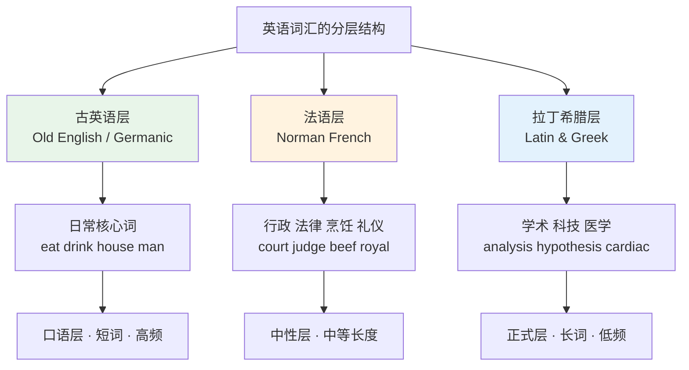
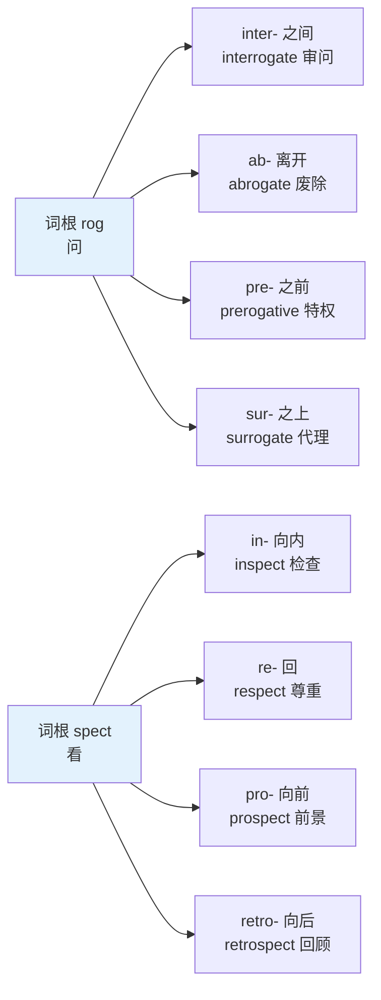
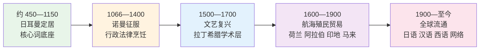
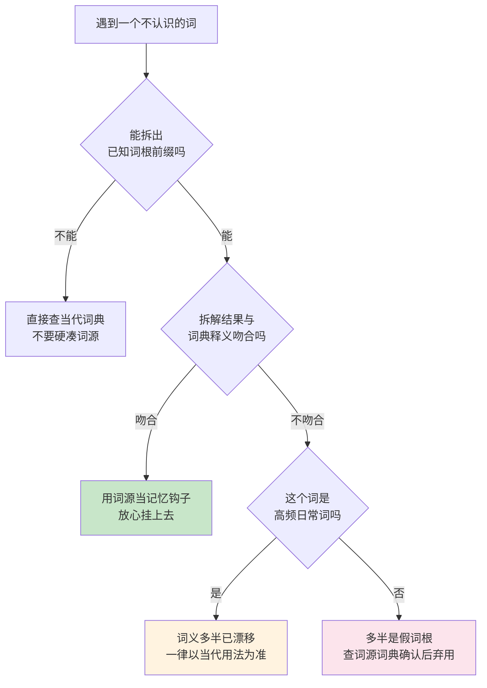
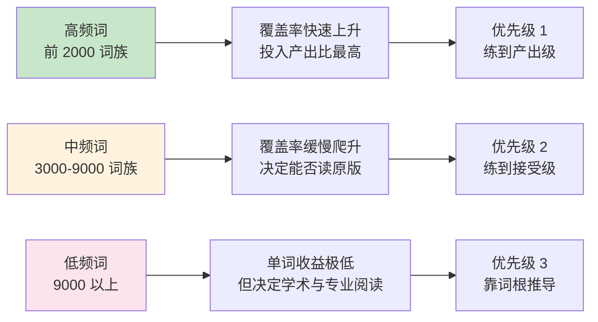
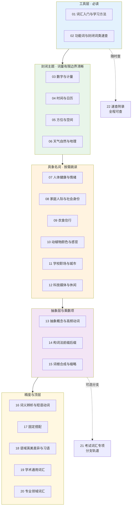
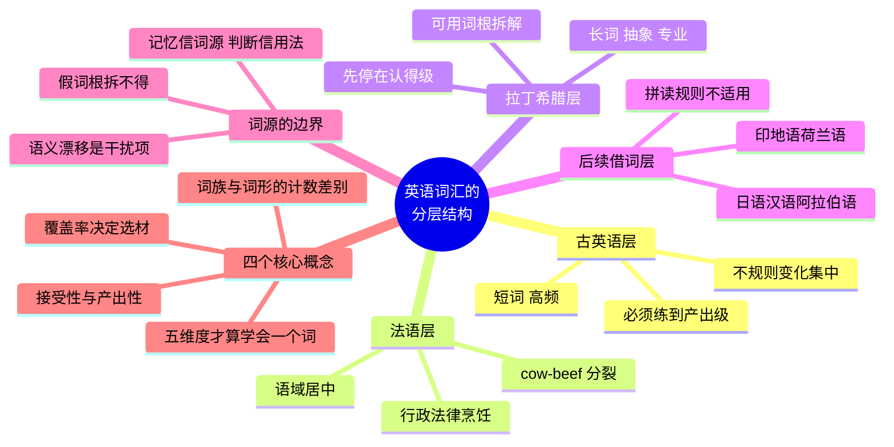

# 英语词汇的来源、分层与学习地图

> [!info] 本篇定位
>
> 全套教程的第一篇，也是唯一一篇不教具体词表的篇目。
>
> 读完你会拿到四样东西：一套解释英语词汇为什么长成现在这样的历史框架，一份判断「什么时候该信词源、什么时候该信当代用法」的操作标准，一组贯穿全书的计量概念（词族、覆盖率、接受性词汇、语域），以及二十二章的依赖关系图和三条可选学习路线。
>
> 后面二十一章会反复用到这里的概念。`ask` / `inquire` / `interrogate` 为什么是三个词而不是一个词，`cow` 和 `beef` 为什么不同源，`nice` 的原义为什么是「无知」却帮不上任何忙，读完本篇就有了判断依据。

---

## 1. 本篇导读：为什么从来源讲起

多数词汇书的第一课是「先背这 100 个高频词」。本教程不这么开头，原因很实际：英语词汇不是一个均匀的整体，它是三次大规模语言接触叠出来的**分层结构**，外加一条至今没有停下来的借词管道。不知道这个结构，会一直被四类问题绊住。

第一类是同义词选不对。`end`、`finish`、`terminate` 中文都是「结束」，但把「会议结束了」说成 `The meeting was terminated`，听起来像会议被强行中止。这三个词的语气差别不是随机的，它来自各自的出身层。

第二类是长词记不住。`interrogate`、`beneficial`、`predominant` 这类词看起来毫无规律，只能死记。实际上它们绝大多数来自同一批拉丁词根，掌握规律后是成组塌缩的。

第三类是遇到不合规律的拼写就慌。`tsunami` 的词首 `ts-`、`yacht` 里不发音的 `ch`、`algorithm` 前面那个甩不掉的 `al-`，这些都不是英语自身的规律能解释的，它们是后来借进来的外壳。知道来源就不会试图用自然拼读硬套。

第四类是不知道该学到什么程度。「背一万单词」这个目标本身是模糊的——一万个什么？词形还是词族？认得就算还是要会用？不把计量单位定清楚，学习进度无法衡量。

上图是本篇的骨架。三个来源层最终沉淀成了三个语域层次：日耳曼词短、常用、口语化；法语词居中；拉丁希腊词长、专业、正式。这个对应关系不是绝对的，但作为选词直觉足够可靠，后面 `18.语域、英美差异与习语俚语` 会把它展开成完整的选词判据。

---

## 2. 第一层：古英语的日耳曼核心

### 2.1 这一层是什么

公元五世纪，盎格鲁人、撒克逊人、朱特人从北欧渡海进入不列颠，带来的日耳曼语支方言演变成古英语（Old English，约 450—1150 年）。这一层构成了今天英语最内核的部分。

古英语词的数量在现代英语总词汇里占比不高，但它们的**使用频率极高**。翻开任何一段英文，出现次数最多的那些词几乎全部来自这一层。

| 英文 | 英式音标 | 美式音标 | 词性 | 中文 | 搭配与说明 |
| --- | --- | --- | --- | --- | --- |
| **eat** | /iːt/ | /iːt/ | v. | 吃 | 不规则变化 eat-ate-eaten；英式 ate 亦可读 /et/ |
| **drink** | /drɪŋk/ | /drɪŋk/ | v./n. | 喝；饮料 | 元音交替型 drink-drank-drunk |
| **house** | /haʊs/ | /haʊs/ | n. | 房子 | 名词 /haʊs/ 与动词 /haʊz/ 清浊不同 |
| **water** | /ˈwɔːtə/ | /ˈwɔːtər/ | n. | 水 | 美音的 t 常闪音化，听起来近似 d |
| **earth** | /ɜːθ/ | /ɜːrθ/ | n. | 泥土；地球 | 英式接地线用 earth，美式用 ground |
| **man** | /mæn/ | /mæn/ | n. | 男人；人 | 不规则复数 men |
| **child** | /tʃaɪld/ | /tʃaɪld/ | n. | 孩子 | 不规则复数 children，保留古英语 -r- 词干 |
| **wife** | /waɪf/ | /waɪf/ | n. | 妻子 | 复数 wives，f→v 变化是古英语遗留 |
| **bread** | /bred/ | /bred/ | n. | 面包 | 不可数；ea 读 /e/ 是长元音缩短的结果 |
| **holy** | /ˈhəʊli/ | /ˈhoʊli/ | adj. | 神圣的 | 对应法语层 sacred、拉丁层 consecrated |
| **hand** | /hænd/ | /hænd/ | n./v. | 手；递给 | 名动同形，日耳曼层常见 |
| **heart** | /hɑːt/ | /hɑːrt/ | n. | 心；心脏 | 形容词义要换拉丁层 cardiac |
| **blood** | /blʌd/ | /blʌd/ | n. | 血 | oo 读 /ʌ/，与 food /uː/、good /ʊ/ 三分 |
| **bone** | /bəʊn/ | /boʊn/ | n. | 骨头 | 医学语境换希腊词根 oste-（osteoporosis） |
| **night** | /naɪt/ | /naɪt/ | n. | 夜 | gh 不发音，古英语时曾读一个喉擦音 |
| **day** | /deɪ/ | /deɪ/ | n. | 天；白天 | 两个义项常靠上下文区分 |
| **sun** | /sʌn/ | /sʌn/ | n. | 太阳 | 形容词义要换拉丁层 solar |
| **moon** | /muːn/ | /muːn/ | n. | 月亮 | 形容词义要换拉丁层 lunar |
| **stone** | /stəʊn/ | /stoʊn/ | n. | 石头 | 英式另作重量单位，1 stone = 14 磅 |
| **wind** | /wɪnd/ | /wɪnd/ | n. | 风 | 与动词 wind /waɪnd/「缠绕」同形异读 |
| **sleep** | /sliːp/ | /sliːp/ | v./n. | 睡；睡眠 | sleep-slept-slept；名词不可数 |
| **think** | /θɪŋk/ | /θɪŋk/ | v. | 想；认为 | think-thought-thought；名词 thought |

### 2.2 这一层的三个可辨认特征

**特征一：短。** 大量是单音节，最多两个音节。`eat`、`drink`、`house`、`man`、`child`、`bread` 没有一个超过两个音节。

**特征二：不规则。** 英语所有不规则动词、不规则复数几乎全在这一层。原因是这些词太常用，高频使用保护了古老的形态，没有被后来的规则化冲刷掉。

| 英文 | 英式音标 | 美式音标 | 词性 | 中文 | 搭配与说明 |
| --- | --- | --- | --- | --- | --- |
| **foot** | /fʊt/ | /fʊt/ | n. | 脚 | 复数 feet，元音交替而非加 -s |
| **tooth** | /tuːθ/ | /tuːθ/ | n. | 牙齿 | 复数 teeth，同一交替模式 |
| **goose** | /ɡuːs/ | /ɡuːs/ | n. | 鹅 | 复数 geese，同一模式 |
| **mouse** | /maʊs/ | /maʊs/ | n. | 老鼠 | 复数 mice；电脑鼠标复数可用 mouses |
| **ox** | /ɒks/ | /ɑːks/ | n. | 公牛 | 复数 oxen，古英语 -en 复数的残余 |

这五个词的复数变化不是「例外」，而是古英语元音交替规则的化石。完整清单在 `02.功能词与封闭词类速查/07.不规则动词形态分组与不规则复数全表` 里给出。

**特征三：能构成合成词。** 日耳曼层的词喜欢直接拼接造新词，不需要借助词缀。

- `sun` + `shine` → **sunshine**（阳光）
  - 两个日耳曼词直接拼合，语义可以从字面推出来。
- `week` + `end` → **weekend**（周末）
  - 同样是拼接，不需要任何词缀。
- `break` + `fast` → **breakfast**（早餐）
  - 字面是「打破禁食」，因为它是一夜不进食后的第一餐。

对照拉丁层的造词方式：`inter-` + `-rupt` → `interrupt`，靠的是前缀加词根，不是两个独立单词的拼接。这个差别在 `14.构词法：前缀与后缀` 和 `15.词根、合成与缩略` 里是主线。

### 2.3 学习上的意义

> [!tip] 日耳曼层的实际用法
>
> 这一层是**必须掌握到产出级别**的部分。它们词数不多，但覆盖了日常表达的绝大部分，而且高度不规则，无法靠推导得到，只能逐个记牢。
>
> 反过来，后面的拉丁希腊层可以先停在「认得」，靠词根前缀现场推导，不必全部背到能主动使用。

---

## 3. 第二层：诺曼征服带来的法语词

### 3.1 一场军事事件如何改写词汇表

1066 年诺曼底公爵威廉渡海征服英格兰，此后约三百年间，英格兰的统治阶层说法语，被统治者说英语。这种上下分层的双语状态，在词汇上留下了极其清晰的痕迹。

法语词大量进入的领域高度集中：**政府、法律、军事、宗教、艺术、烹饪、时尚**——全部是统治阶层活动的领域。而农业、家务、身体、天气这些领域基本保持日耳曼词不变。

| 英文 | 英式音标 | 美式音标 | 词性 | 中文 | 搭配与说明 |
| --- | --- | --- | --- | --- | --- |
| **court** | /kɔːt/ | /kɔːrt/ | n. | 法庭；宫廷 | 两个义项同源，都来自宫廷审判 |
| **judge** | /dʒʌdʒ/ | /dʒʌdʒ/ | n./v. | 法官；判断 | 法律义项详见 `20.专业领域词汇/05` |
| **jury** | /ˈdʒʊəri/ | /ˈdʒʊri/ | n. | 陪审团 | 集合名词，英式可接复数谓语 |
| **govern** | /ˈɡʌvn/ | /ˈɡʌvərn/ | v. | 统治 | 派生 government、governor |
| **royal** | /ˈrɔɪəl/ | /ˈrɔɪəl/ | adj. | 王室的 | 对应日耳曼层 kingly、拉丁层 regal |
| **army** | /ˈɑːmi/ | /ˈɑːrmi/ | n. | 军队 | 集合名词 |
| **soldier** | /ˈsəʊldʒə/ | /ˈsoʊldʒər/ | n. | 士兵 | d 不发独立音，读作 /dʒ/ |
| **beauty** | /ˈbjuːti/ | /ˈbjuːti/ | n. | 美 | 形容词 beautiful |
| **dinner** | /ˈdɪnə/ | /ˈdɪnər/ | n. | 正餐 | 英美所指时段不同，见 09 章 |
| **cuisine** | /kwɪˈziːn/ | /kwɪˈziːn/ | n. | 菜系 | 保留法语读音，重音在后 |
| **prison** | /ˈprɪzn/ | /ˈprɪzn/ | n. | 监狱 | in prison 表服刑，in the prison 只表位置 |
| **crime** | /kraɪm/ | /kraɪm/ | n. | 罪行 | 派生 criminal；commit a crime |
| **evidence** | /ˈevɪdəns/ | /ˈevɪdəns/ | n. | 证据 | 不可数，量化用 a piece of evidence |
| **parliament** | /ˈpɑːləmənt/ | /ˈpɑːrləmənt/ | n. | 议会 | ia 只读一个音节，不读 /liə/ |
| **tax** | /tæks/ | /tæks/ | n./v. | 税；征税 | 派生 taxation、taxpayer |
| **servant** | /ˈsɜːvənt/ | /ˈsɜːrvənt/ | n. | 仆人 | serve + -ant，-ant 是典型法语层后缀 |
| **castle** | /ˈkɑːsl/ | /ˈkæsl/ | n. | 城堡 | t 不发音；英美元音差别明显 |
| **peace** | /piːs/ | /piːs/ | n. | 和平；平静 | 不可数；拉丁层派生 pacify、pacific |
| **boil** | /bɔɪl/ | /bɔɪl/ | v. | 煮沸 | 烹饪动词几乎全在这一层 |
| **roast** | /rəʊst/ | /roʊst/ | v./adj. | 烤；烤过的 | roast beef 两个词都是法语层 |
| **fashion** | /ˈfæʃn/ | /ˈfæʃn/ | n. | 时尚；方式 | in a fashion 表「勉强算是」 |
| **honour** | /ˈɒnə/ | /ˈɑːnər/ | n. | 荣誉 | 美式拼 honor；h 不发音 |

### 3.2 最著名的证据：活的动物与桌上的肉

这一层最经典的例子是家畜与肉名的分裂。养牲畜的是说英语的农民，吃肉的是说法语的贵族，于是同一种动物在田里和在餐桌上有了两个名字。

| 活的动物（日耳曼层） | 音标（英/美） | 桌上的肉（法语层） | 音标（英/美） | 中文 |
| --- | --- | --- | --- | --- |
| **cow** | /kaʊ/ · /kaʊ/ | **beef** | /biːf/ · /biːf/ | 牛 → 牛肉 |
| **pig** | /pɪɡ/ · /pɪɡ/ | **pork** | /pɔːk/ · /pɔːrk/ | 猪 → 猪肉 |
| **sheep** | /ʃiːp/ · /ʃiːp/ | **mutton** | /ˈmʌtn/ · /ˈmʌtn/ | 羊 → 羊肉 |
| **calf** | /kɑːf/ · /kæf/ | **veal** | /viːl/ · /viːl/ | 小牛 → 小牛肉 |
| **deer** | /dɪə/ · /dɪr/ | **venison** | /ˈvenɪsn/ · /ˈvenɪsn/ | 鹿 → 鹿肉 |

> [!warning] 中文母语者最容易犯的错
>
> 中文的构词方式是「牛 + 肉」「猪 + 肉」，词根一致。英语这五对完全不同源，不能类推。
>
> - ❌ ~~cow meat~~ / ~~pig meat~~ / ~~sheep meat~~
> - ✅ **beef** / **pork** / **mutton**
>
> 注意例外：`chicken`、`fish`、`duck` 活体与肉名同形，因为禽类和鱼不在诺曼贵族的这套区分里。所以 `chicken meat` 虽不算错，但直接说 `chicken` 才自然。

### 3.3 法语层的辨认特征

法语层的词长度居中，多为两到三个音节，并且有一批高辨识度的词尾。

| 词尾 | 例词 | 英式音标 | 美式音标 | 中文 |
| --- | --- | --- | --- | --- |
| -age | **village** | /ˈvɪlɪdʒ/ | /ˈvɪlɪdʒ/ | 村庄 |
| -ance | **entrance** | /ˈentrəns/ | /ˈentrəns/ | 入口 |
| -ment | **judgment** | /ˈdʒʌdʒmənt/ | /ˈdʒʌdʒmənt/ | 判决 |
| -ous | **famous** | /ˈfeɪməs/ | /ˈfeɪməs/ | 著名的 |
| -tion | **nation** | /ˈneɪʃn/ | /ˈneɪʃn/ | 国家 |
| -ty | **liberty** | /ˈlɪbəti/ | /ˈlɪbərti/ | 自由 |

这些词尾在 `14.构词法：前缀与后缀` 的后缀两篇里会作为主线展开，本篇只需要建立「看到这些词尾，大概率是法语或拉丁来源，语域偏正式」这个直觉。

---

## 4. 第三层：文艺复兴涌入的拉丁与希腊词

### 4.1 一次有意识的词汇引进

前两层是人群迁徙与政治征服的自然结果，第三层不同——它是学者们**主动搬运**的。

十五到十七世纪，英格兰的学者需要用英语讨论此前只用拉丁文讨论的话题：解剖学、天文学、哲学、法学。英语当时缺少对应的抽象词，于是他们直接从拉丁语和希腊语里搬词，稍作改造就投入使用。

这批词的特点是长、抽象、专业，而且**成体系**——因为它们共享同一批词根词缀。

| 英文 | 英式音标 | 美式音标 | 词性 | 中文 | 搭配与说明 |
| --- | --- | --- | --- | --- | --- |
| **analysis** | /əˈnæləsɪs/ | /əˈnæləsɪs/ | n. | 分析 | 希腊复数 analyses /əˈnæləsiːz/ |
| **hypothesis** | /haɪˈpɒθəsɪs/ | /haɪˈpɑːθəsɪs/ | n. | 假设 | 复数 hypotheses，同一模式 |
| **synthesis** | /ˈsɪnθəsɪs/ | /ˈsɪnθəsɪs/ | n. | 综合；合成 | 复数 syntheses；动词 synthesize |
| **thesis** | /ˈθiːsɪs/ | /ˈθiːsɪs/ | n. | 论文；论点 | 复数 theses /ˈθiːsiːz/ |
| **criterion** | /kraɪˈtɪəriən/ | /kraɪˈtɪriən/ | n. | 标准 | 希腊复数 criteria，常被误当单数 |
| **phenomenon** | /fəˈnɒmɪnən/ | /fəˈnɑːmɪnɑːn/ | n. | 现象 | 复数 phenomena |
| **stimulus** | /ˈstɪmjələs/ | /ˈstɪmjələs/ | n. | 刺激；刺激物 | 拉丁复数 stimuli /ˈstɪmjəlaɪ/ |
| **radius** | /ˈreɪdiəs/ | /ˈreɪdiəs/ | n. | 半径 | 复数 radii；blast radius 是 IT 常用比喻 |
| **appendix** | /əˈpendɪks/ | /əˈpendɪks/ | n. | 附录；阑尾 | 附录义复数 appendices，阑尾义 appendixes |
| **interrogate** | /ɪnˈterəɡeɪt/ | /ɪnˈterəɡeɪt/ | v. | 审问；查询 | 词根 rog「问」，前缀 inter- |
| **terminate** | /ˈtɜːmɪneɪt/ | /ˈtɜːrmɪneɪt/ | v. | 终止 | 词根 termin「界限」 |
| **corroborate** | /kəˈrɒbəreɪt/ | /kəˈrɑːbəreɪt/ | v. | 证实 | robor「力量」；学术写作高频 |
| **facilitate** | /fəˈsɪlɪteɪt/ | /fəˈsɪlɪteɪt/ | v. | 促进；使便利 | facil「容易」；主语常为事物 |
| **predominant** | /prɪˈdɒmɪnənt/ | /prɪˈdɑːmɪnənt/ | adj. | 占主导的 | pre- + domin「统治」+ -ant |
| **beneficial** | /ˌbenɪˈfɪʃl/ | /ˌbenɪˈfɪʃl/ | adj. | 有益的 | bene「好」+ fic「做」 |
| **subsequent** | /ˈsʌbsɪkwənt/ | /ˈsʌbsɪkwənt/ | adj. | 随后的 | sub- + sequ「跟随」；副词 subsequently |
| **explicit** | /ɪkˈsplɪsɪt/ | /ɪkˈsplɪsɪt/ | adj. | 明确的 | 词根 plic「折叠」；反义 implicit |
| **magnitude** | /ˈmæɡnɪtjuːd/ | /ˈmæɡnɪtuːd/ | n. | 量级；重要性 | magn「大」；order of magnitude |
| **cardiac** | /ˈkɑːdiæk/ | /ˈkɑːrdiæk/ | adj. | 心脏的 | 希腊词根 cardi，见 `20.专业领域词汇/10` |
| **chronology** | /krəˈnɒlədʒi/ | /krəˈnɑːlədʒi/ | n. | 年表；先后顺序 | chrono「时间」+ -logy「学科」 |
| **synchronous** | /ˈsɪŋkrənəs/ | /ˈsɪŋkrənəs/ | adj. | 同步的 | syn「共」+ chron；IT 高频 asynchronous |
| **peripheral** | /pəˈrɪfərəl/ | /pəˈrɪfərəl/ | adj./n. | 外围的；外设 | peri「周围」+ pher「携带」 |

### 4.2 这一层是可推导的

日耳曼层必须死记，拉丁希腊层则可以拆。这是两层最重要的操作差别。

上图展示了词根的放大效应：记住 `rog`「问」和 `spect`「看」两个词根，再配合已知的前缀，八个中高阶词同时变得可解。这就是为什么第 `14`、`15` 两章被称为「乘数项」——它们本身不新增多少词，但会把前面十三章积累的孤立词表重组成词族网络。

拉丁希腊词根的完整体系在 `15.词根、合成与缩略` 的四篇里展开，本篇只需要理解这个机制的存在。

### 4.3 词源比例的一个参考数据

关于英语词汇里各来源占多大比例，常被引用的是 Finkenstaedt 与 Wolff 在 1973 年 *Ordered Profusion* 中对《简明牛津词典》所做的统计：法语约 29%，拉丁语约 29%，日耳曼语约 26%，希腊语约 6%，其余来自其他语言与专名。

> [!warning] 这个数据说明的和不说明的
>
> 这个比例统计的是**词典里的词条数**，不是**实际文本里的出现次数**。
>
> 按词条数算，日耳曼词只占四分之一；但按实际使用频率算，一段普通英文里日耳曼词的占比要高得多——因为 `the`、`of`、`and`、`is`、`you`、`have` 这些出现最频繁的词几乎全在日耳曼层。
>
> 两个口径不能混着用。这也是后面「词汇量到底怎么数」那一节的第一个引子。

---

## 5. 第四层：借词从未停止

### 5.1 词源分层不是历史标本

前三层讲完，容易留下一个印象：英语的来源结构在十七世纪就定型了，剩下的只是内部造词。这个印象是错的。英语从来没有停止借词，只是后来的借词不再成批改写核心词汇，而是随着物、事、概念一个一个进来。

上图把借词过程摊成五波，年代只是大致区间，相邻两波之间是重叠的而不是切换的。真正要看的是这条线的**性质变化**：前三波改写的是词汇的骨架，后两波改写的是词汇的表面。前三波的词进来之后被英语彻底同化——拼写按英语规则重排，读音按英语音系改造；后两波的词进来时英语的拼写已经被印刷业固定住了，于是它们大多保留了原来的外壳，成了词表里读音和拼写都「不讲规矩」的那批。

### 5.2 五条仍在运转的借词管道

**日语。** 大多伴随饮食、动漫、消费电子进入，二十世纪后半段起数量明显增加。

| 英文 | 英式音标 | 美式音标 | 词性 | 中文 | 搭配与说明 |
| --- | --- | --- | --- | --- | --- |
| **tsunami** | /tsuːˈnɑːmi/ | /tsuːˈnɑːmi/ | n. | 海啸 | 词首 ts- 不合英语音位组合，也听得到 /suːˈnɑːmi/ |
| **emoji** | /ɪˈməʊdʒi/ | /ɪˈmoʊdʒi/ | n. | 绘文字 | 来自「絵文字」，与 emotion 无关；复数 emoji 或 emojis |
| **karaoke** | /ˌkæriˈəʊki/ | /ˌkeriˈoʊki/ | n. | 卡拉 OK | 英语读音已明显偏离日语原音 |
| **tycoon** | /taɪˈkuːn/ | /taɪˈkuːn/ | n. | 巨头 | 来自「大君」；现多用于商界 a media tycoon |
| **sushi** | /ˈsuːʃi/ | /ˈsuːʃi/ | n. | 寿司 | 不可数，点单说 some sushi |
| **futon** | /ˈfuːtɒn/ | /ˈfuːtɑːn/ | n. | 蒲团床垫 | 英语里指可折叠沙发床，语义已偏移 |

**汉语。** 进入路径分海路与陆路两条，很多词还经过闽南语、粤语或日语转手。

| 英文 | 英式音标 | 美式音标 | 词性 | 中文 | 搭配与说明 |
| --- | --- | --- | --- | --- | --- |
| **typhoon** | /taɪˈfuːn/ | /taɪˈfuːn/ | n. | 台风 | 词源有争议，汉语、阿拉伯语与希腊语来源都参与了定型 |
| **kowtow** | /ˌkaʊˈtaʊ/ | /ˌkaʊˈtaʊ/ | v./n. | 叩头；卑躬屈膝 | 来自「叩头」；今多用比喻义 kowtow to sb |
| **tea** | /tiː/ | /tiː/ | n. | 茶 | 闽南语读音经荷兰海路传入，走陆路的语言得到 chai 一系 |
| **ketchup** | /ˈketʃəp/ | /ˈketʃəp/ | n. | 番茄酱 | 一般追溯到闽南语的鱼露名，进入英语后所指完全更换 |
| **tofu** | /ˈtəʊfuː/ | /ˈtoʊfuː/ | n. | 豆腐 | 经日语转手进入英语，不可数 |
| **gung-ho** | /ˌɡʌŋ ˈhəʊ/ | /ˌɡʌŋ ˈhoʊ/ | adj. | 狂热积极的 | 来自「工合」，二战美军带回；略带贬义 |

**阿拉伯语。** 中世纪的数学、天文、化学是阿拉伯世界领先的领域，这批词大多在那时经西班牙语与拉丁语转入。

| 英文 | 英式音标 | 美式音标 | 词性 | 中文 | 搭配与说明 |
| --- | --- | --- | --- | --- | --- |
| **algebra** | /ˈældʒɪbrə/ | /ˈældʒɪbrə/ | n. | 代数 | al- 是阿拉伯语定冠词，已与词干粘死，不可拆 |
| **algorithm** | /ˈælɡərɪðəm/ | /ˈælɡərɪðəm/ | n. | 算法 | 来自数学家花拉子米名字的拉丁化形式 |
| **alcohol** | /ˈælkəhɒl/ | /ˈælkəhɔːl/ | n. | 酒精 | 原指眼影粉末，蒸馏义是后起的 |
| **alkali** | /ˈælkəlaɪ/ | /ˈælkəlaɪ/ | n. | 碱 | 同一 al- 家族；形容词 alkaline |
| **cotton** | /ˈkɒtn/ | /ˈkɑːtn/ | n. | 棉；棉花 | 经西班牙语转入；不可数 |
| **sugar** | /ˈʃʊɡə/ | /ˈʃʊɡər/ | n. | 糖 | 更早的源头在梵语；su- 读 /ʃʊ/ 是这一路借词的痕迹 |
| **zero** | /ˈzɪərəʊ/ | /ˈzɪroʊ/ | n. | 零 | 与 cipher 同源，两词是同一个阿拉伯词的两次借入 |

**印地语与乌尔都语。** 随英国在南亚的殖民统治进入，集中在生活用品、地貌与社会角色。

| 英文 | 英式音标 | 美式音标 | 词性 | 中文 | 搭配与说明 |
| --- | --- | --- | --- | --- | --- |
| **shampoo** | /ʃæmˈpuː/ | /ʃæmˈpuː/ | n./v. | 洗发水；洗头 | 原义是「按摩」，进入英语后词义窄化 |
| **pyjamas** | /pəˈdʒɑːməz/ | /pəˈdʒɑːməz/ | n. | 睡衣 | 美式拼 pajamas；只用复数，a pair of pyjamas |
| **jungle** | /ˈdʒʌŋɡl/ | /ˈdʒʌŋɡl/ | n. | 丛林 | 原义是「荒地」，热带雨林义是英语给的 |
| **bungalow** | /ˈbʌŋɡələʊ/ | /ˈbʌŋɡəloʊ/ | n. | 平房 | 字面是「孟加拉式的房子」 |
| **loot** | /luːt/ | /luːt/ | n./v. | 赃物；抢劫 | 游戏语境里指掉落物，是近三十年的新义 |
| **guru** | /ˈɡʊruː/ | /ˈɡʊruː/ | n. | 权威；导师 | 宗教义已泛化，a marketing guru 带轻微调侃 |

**荷兰语。** 十六至十七世纪荷兰是海上与绘画强国，借词集中在航海和艺术两块。

| 英文 | 英式音标 | 美式音标 | 词性 | 中文 | 搭配与说明 |
| --- | --- | --- | --- | --- | --- |
| **yacht** | /jɒt/ | /jɑːt/ | n. | 游艇 | ch 完全不发音，拼写保留荷兰语原形 |
| **cookie** | /ˈkʊki/ | /ˈkʊki/ | n. | 饼干；浏览器 cookie | 原义「小蛋糕」；英式饼干说 biscuit |
| **landscape** | /ˈlændskeɪp/ | /ˈlændskeɪp/ | n. | 风景；横向版式 | 先作绘画术语进入，再泛化 |
| **skipper** | /ˈskɪpə/ | /ˈskɪpər/ | n. | 船长；队长 | 体育语境里指队长 |
| **easel** | /ˈiːzl/ | /ˈiːzl/ | n. | 画架 | 荷兰语原义是「驴」，因为它驮着画板 |
| **dock** | /dɒk/ | /dɑːk/ | n./v. | 船坞；停靠 | 计算机语境里指程序坞与窗口吸附 |

### 5.3 为什么这批词的拼写和读音总是「不讲规矩」

前三层的词在英语里泡了几百上千年，被反复磨平：`castle` 丢掉了 t 的读音，`night` 丢掉了 gh 的读音，拼写和读音一起漂到了英语自己的轨道上。后来的借词没有经历这个过程，原因有三个。

- **进来得太晚。** 印刷术普及后英语拼写迅速固化，新词进来时是照抄源语拼写或音译，不再按英语拼读规则重铸。`yacht`、`bungalow`、`karaoke` 都是这样。
- **音位组合超纲。** `tsunami` 的词首 `ts-` 在英语原生词里只出现在音节末（`cats`、`bits`），放在词首是英语音系里没有的位置，于是很多母语者干脆读成 `/suːˈnɑːmi/`。
- **经过多次转手。** `sugar`、`ketchup`、`tofu` 都不是从源语直接进入英语的，中间被西班牙语、闽南语、日语各改造一次，最后的形态谁的规律都不完全符合。

> [!warning] 遇到借词不要硬套自然拼读
>
> 自然拼读规则是从日耳曼层与已同化的法语层归纳出来的，对后期借词的命中率明显更低。
>
> - ❌ 按拼读规则把 `yacht` 读成 ~~/jætʃt/~~
> - ✅ 查词典，记住 `/jɒt/`
>
> 判断办法很简单：一个词如果看起来「不像英语」——出现 `ts-`、`-oe`、`kh`、`-ao-`、连着两个不常见元音，或者词义明显绑定某个异国事物——先假定它是借词，直接查读音，不要推。拼读规则的适用边界在 `01.词汇入门与学习方法/02.自然拼读：拼写与发音对应规则` 里有完整说明。

> [!tip] 借词对学习者的实际好处
>
> 借词这一层通常**不需要专门背**：它们大多与母语里已有的概念一一对应（`tsunami` 就是海啸，`tofu` 就是豆腐），认得拼写和读音就够了，几乎不存在语义辨析的负担。
>
> 真正要花力气的仍然是日耳曼层的高频词和拉丁希腊层的抽象词。看到一长串异国来源词不用紧张，那是词表里最便宜的部分。

---

## 6. 三层叠加的产物：同义梯度

### 6.1 为什么英语同义词特别多

三层来源叠在一起，同一个概念往往留下了三个词——日耳曼层一个、法语层一个、拉丁层一个。它们的核心义相同，语域不同。

第五层的借词很少参与这种梯度，因为它们带着自己的所指进来，没有本土同义词可以叠。所以下面这张表只涉及前三层。

| 概念 | 日耳曼层（口语） | 法语层（中性） | 拉丁层（正式） |
| --- | --- | --- | --- |
| 问 | **ask** /ɑːsk/ · /æsk/ | **question** /ˈkwestʃən/ | **interrogate** /ɪnˈterəɡeɪt/ |
| 结束 | **end** /end/ | **finish** /ˈfɪnɪʃ/ | **terminate** /ˈtɜːmɪneɪt/ · /ˈtɜːrmɪneɪt/ |
| 开始 | **begin** /bɪˈɡɪn/ | **commence** /kəˈmens/ | **initiate** /ɪˈnɪʃieɪt/ |
| 王的 | **kingly** /ˈkɪŋli/ | **royal** /ˈrɔɪəl/ | **regal** /ˈriːɡl/ |
| 上升 | **rise** /raɪz/ | **mount** /maʊnt/ | **ascend** /əˈsend/ |
| 帮助 | **help** /help/ | **aid** /eɪd/ | **assist** /əˈsɪst/ |
| 得到 | **get** /ɡet/ | **gain** /ɡeɪn/ | **acquire** /əˈkwaɪə/ · /əˈkwaɪər/ |
| 房子 | **house** /haʊs/ | **mansion** /ˈmænʃn/ | **residence** /ˈrezɪdəns/ |
| 圣的 | **holy** /ˈhəʊli/ · /ˈhoʊli/ | **sacred** /ˈseɪkrɪd/ | **consecrated** /ˈkɒnsɪkreɪtɪd/ |
| 想 | **think** /θɪŋk/ | **consider** /kənˈsɪdə/ · /kənˈsɪdər/ | **contemplate** /ˈkɒntəmpleɪt/ · /ˈkɑːntəmpleɪt/ |
| 告知 | **tell** /tel/ | **inform** /ɪnˈfɔːm/ · /ɪnˈfɔːrm/ | **notify** /ˈnəʊtɪfaɪ/ · /ˈnoʊtɪfaɪ/ |
| 买 | **buy** /baɪ/ | **purchase** /ˈpɜːtʃəs/ · /ˈpɜːrtʃəs/ | **procure** /prəˈkjʊə/ · /prəˈkjʊr/ |
| 给 | **give** /ɡɪv/ | **grant** /ɡrɑːnt/ · /ɡrænt/ | **confer** /kənˈfɜː/ · /kənˈfɜːr/ |
| 看 | **see** /siː/ | **view** /vjuː/ | **observe** /əbˈzɜːv/ · /əbˈzɜːrv/ |
| 需要 | **need** /niːd/ | **require** /rɪˈkwaɪə/ · /rɪˈkwaɪər/ | **necessitate** /nəˈsesɪteɪt/ |
| 显示 | **show** /ʃəʊ/ · /ʃoʊ/ | **display** /dɪˈspleɪ/ | **demonstrate** /ˈdemənstreɪt/ |
| 快的 | **quick** /kwɪk/ | **prompt** /prɒmpt/ · /prɑːmpt/ | **expeditious** /ˌekspəˈdɪʃəs/ |
| 自由 | **freedom** /ˈfriːdəm/ | **liberty** /ˈlɪbəti/ · /ˈlɪbərti/ | **emancipation** /ɪˌmænsɪˈpeɪʃn/ |

> [!info] 「法语层」与「拉丁层」的边界并不干净
>
> 表里第三列的词有一部分也是经法语进入英语的，只是进来的时间更晚、使用场合更学术，所以落在了更正式的一档。
>
> 这张表分的是**语域高低**，不是严格的传入路径。判断一个词该用在什么场合时，看它落在哪一档就够了；要考证具体来源，用 etymonline 这类词源词典，方法在 `22.速查附录与学习资源/01`。

### 6.2 逐组的场合判断与用错档的反例

三档的默认规则很简单：

- **日常对话、邮件正文** → 优先日耳曼层短词
- **一般书面表达** → 法语层中性词
- **法律、学术、技术规范** → 拉丁层正式词

规则本身好记，难在具体到每一组。下面按上表顺序逐组给判断和反例。

- **问 ask / question / interrogate** — 日常一律 `ask`；`question` 指正式提问或表达怀疑（`question the decision`）；`interrogate` 只用于警方审讯与技术语境（`interrogate a database`）。
  - ❌ The teacher **interrogated** us about our homework.（听起来像刑讯）
  - ✅ The teacher **asked** us about our homework.
- **结束 end / finish / terminate** — `end` 描述事情自然结束；`finish` 强调把一件事做完；`terminate` 是单方面中止合同、进程、雇佣。
  - ❌ The movie **terminated** at nine.
  - ✅ The movie **ended** at nine.
- **开始 begin / commence / initiate** — 口语和一般写作用 `begin` 或 `start`；`commence` 只留在典礼与法律文本；`initiate` 指主动发起一个流程。
  - ❌ Let's **commence** lunch.
  - ✅ Let's **start** lunch.
- **王的 kingly / royal / regal** — `royal` 是唯一的中性默认词（`the royal family`）；`kingly` 已近乎废弃；`regal` 只用来形容气派（`a regal gesture`）。
  - ❌ the **kingly** family
  - ✅ the **royal** family
- **上升 rise / mount / ascend** — 数据、太阳、价格用 `rise`；`mount` 指压力或损失逐渐累积（`tension mounted`）；`ascend` 用于登山、飞行器与王位。
  - ❌ The price **ascended** by three percent.
  - ✅ The price **rose** by three percent.
- **帮助 help / aid / assist** — 口语只用 `help`；`aid` 多作名词（`foreign aid`、`first aid`）；`assist` 用于职务性协助与体育统计。
  - ❌ Can you **assist** me with this door?
  - ✅ Can you **help** me with this door?
- **得到 get / gain / acquire** — `get` 是万能口语词；`gain` 用于增量（`gain weight`、`gain experience`）；`acquire` 用于收购、习得技能与正式取得。
  - ❌ I **acquired** a coffee on the way.
  - ✅ I **got** a coffee on the way.
- **房子 house / mansion / residence** — `house` 是默认；`mansion` 特指豪宅，不是「大房子」的礼貌说法；`residence` 用于地址栏、法律文书与 `official residence`。
  - ❌ Welcome to my **residence**.
  - ✅ Welcome to my **place**.
- **圣的 holy / sacred / consecrated** — `holy` 偏宗教情感（`the Holy Bible`）；`sacred` 可比喻化（`a sacred rule`）；`consecrated` 是仪式术语，指经过祝圣。
  - ❌ Sunday morning is **consecrated** to my family.
  - ✅ Sunday morning is **sacred** to my family.
- **想 think / consider / contemplate** — `think` 通用；`consider` 指认真权衡某个选项；`contemplate` 带犹豫与长时间盘算的意味。
  - ❌ I'm **contemplating** what to have for dinner.
  - ✅ I'm **thinking** about what to have for dinner.
- **告知 tell / inform / notify** — 口语用 `tell`；`inform` 是正式书面告知；`notify` 用于系统通知与法定告知义务。
  - ❌ Please **notify** me when you get home.
  - ✅ Please **text** me when you get home.
- **买 buy / purchase / procure** — 日常一律 `buy`；`purchase` 用于发票、条款、电商界面；`procure` 是企业采购流程术语。
  - ❌ I **purchased** a sandwich at lunch.
  - ✅ I **bought** a sandwich at lunch.
- **给 give / grant / confer** — `give` 通用；`grant` 指有权方批准（`grant access`、`grant a visa`）；`confer` 用于授予学位、荣誉与权利。
  - ❌ Can you **confer** me a pen?
  - ✅ Can you **give** me a pen?
- **看 see / view / observe** — `see` 通用；`view` 偏「查看、观看」并常带评价义（`view it as a risk`）；`observe` 指有目的的观察，或「遵守」规定。
  - ❌ I **observed** a good film last night.
  - ✅ I **saw** a good film last night.
- **需要 need / require / necessitate** — `need` 通用；`require` 用于规定与系统要求；`necessitate` 只出现在学术与正式书面语，主语通常是事件而不是人。
  - ❌ I **necessitate** more time.
  - ✅ I **need** more time.
- **显示 show / display / demonstrate** — `show` 通用；`display` 偏「陈列、界面显示」；`demonstrate` 指用证据证明或现场演示。
  - ❌ The screen **demonstrates** an error message.
  - ✅ The screen **shows** an error message.
- **快的 quick / prompt / expeditious** — 日常用 `quick` 或 `fast`；`prompt` 用于「及时的回复、付款」；`expeditious` 基本只出现在合同与公文。
  - ❌ Thanks for your **expeditious** reply.
  - ✅ Thanks for your **quick** reply.
- **自由 freedom / liberty / emancipation** — 日常抽象义用 `freedom`；`liberty` 多出现在政治法律固定表达里（`civil liberties`、`take the liberty of`）；`emancipation` 特指从奴役或法律束缚中解放。
  - ❌ I want more **liberty** at work.
  - ✅ I want more **freedom** at work.

> [!example] 同一件事的三种说法
>
> - The meeting **ended** at five.
>   - 会议五点结束。（中性叙述，最自然）
> - We **finished** the meeting at five.
>   - 我们五点开完了会。（强调完成动作）
> - The contract was **terminated** on 5 May.
>   - 合同于五月五日终止。（法律文书，强调单方面中止效力）

三句话核心义都是「结束」，但第三句用在日常对话里会显得突兀，第一句用在合同里则不够严谨。

> [!warning] 中文母语者的典型偏差
>
> 中国学习者在考试中被训练成偏好长词——因为长词看起来「水平高」。结果是口语和日常写作里堆满了 `utilize`、`commence`、`endeavor`，而母语者在这些场合用的是 `use`、`start`、`try`。
>
> - ❌ We will **commence** the meeting shortly.（日常场合过于正式）
> - ✅ We'll **start** the meeting shortly.
>
> 判断标准不是「哪个词更高级」，而是「这个场合该用哪一层」。上面十八组的反例全部是同一个毛病的不同变体。完整的语域判据在 `18.语域、英美差异与习语俚语/02.语域分层与英语词汇的历史层次`。

---

## 7. 词源知识的使用边界

### 7.1 词源会帮忙，也会骗人

前面五节都在讲词源的用处。这一节讲它的失效场景，因为把词源当成万能钥匙的人，最后会在几类词上稳定地栽跟头。

词源失效的根本原因是**语义漂移**：一个词的形态可以几百年不变，意思却已经走到了原义的反面。这时候原义不是线索，是干扰项。

| 英文 | 英式音标 | 美式音标 | 词性 | 中文 | 搭配与说明 |
| --- | --- | --- | --- | --- | --- |
| **nice** | /naɪs/ | /naɪs/ | adj. | 好的；友善的 | 源头是拉丁 nescius「不知」，中古英语一度表「愚蠢」 |
| **silly** | /ˈsɪli/ | /ˈsɪli/ | adj. | 傻的 | 古英语原义「幸福、受祝福」，经无辜、软弱一路漂到愚蠢 |
| **awful** | /ˈɔːfl/ | /ˈɔːfl/ | adj. | 糟糕的 | 字面 awe + -ful「充满敬畏」，褒义只留在 awesome 里 |
| **naughty** | /ˈnɔːti/ | /ˈnɑːti/ | adj. | 淘气的 | 来自 naught「零、一无所有」，曾指「邪恶的」 |
| **decimate** | /ˈdesɪmeɪt/ | /ˈdesɪmeɪt/ | v. | 大批毁灭 | 拉丁原义「每十人处决一人」，当代义已扩大 |
| **meat** | /miːt/ | /miːt/ | n. | 肉 | 古英语泛指「食物」，sweetmeat（蜜饯）保留旧义 |
| **deer** | /dɪə/ | /dɪr/ | n. | 鹿 | 古英语泛指「野兽」，德语 Tier 保留旧义 |
| **fond** | /fɒnd/ | /fɑːnd/ | adj. | 喜爱的 | 原义「愚蠢的」，今天 be fond of 里毫无贬义 |
| **quaint** | /kweɪnt/ | /kweɪnt/ | adj. | 古雅的 | 原义「精巧、狡黠」，今义带轻微的过时感 |
| **husband** | /ˈhʌzbənd/ | /ˈhʌzbənd/ | n./v. | 丈夫；节俭使用 | 原义「一家之主」，动词 husband resources 保留旧义 |

另有一类更隐蔽的坑：看起来能拆，实际上拆错。

| 英文 | 英式音标 | 美式音标 | 词性 | 中文 | 搭配与说明 |
| --- | --- | --- | --- | --- | --- |
| **butterfly** | /ˈbʌtəflaɪ/ | /ˈbʌtərflaɪ/ | n. | 蝴蝶 | 与 butter 的关系至今无定论，不要当词根记 |
| **hamburger** | /ˈhæmbɜːɡə/ | /ˈhæmbɜːrɡər/ | n. | 汉堡 | 来自地名 Hamburg，不含 ham；英语误切出 -burger 才有 cheeseburger |
| **outrage** | /ˈaʊtreɪdʒ/ | /ˈaʊtreɪdʒ/ | n./v. | 义愤；激怒 | 来自法语 outre「超出」+ -age，与 out、rage 都无关 |
| **island** | /ˈaɪlənd/ | /ˈaɪlənd/ | n. | 岛 | s 是后人比照拉丁 insula 硬加的，从来不发音 |
| **pencil** | /ˈpensl/ | /ˈpensl/ | n. | 铅笔 | 拉丁 penicillus「小刷子」，与 pen（羽毛）不同源 |
| **female** | /ˈfiːmeɪl/ | /ˈfiːmeɪl/ | n./adj. | 女性；雌性 | 来自 femella，拼写被 male 带偏，两词不同源 |
| **crayfish** | /ˈkreɪfɪʃ/ | /ˈkreɪfɪʃ/ | n. | 小龙虾 | 法语 crevice 被听成 -fish 后改写，与鱼无关 |

### 7.2 什么时候信词源，什么时候信当代用法

这张图的关键在于两个判断顺序。第一个顺序是**先查词典再挂词源**，不是先拆词源再猜词义——词源只负责让已经查到的释义变得好记，不负责生成释义。第二个顺序是**冲突时一律让位给当代用法**，而且冲突越可能出现在高频词上：一个词用得越多、活得越久，被磨改的次数就越多，`nice`、`silly`、`awful` 都是英语里最常用的那批形容词。低频学术词反而稳定，`corroborate`、`peripheral` 这类词进入英语才几百年，用的人少，原义基本没动。

由此可以给出三条操作标准。

**信词源的场合：** 词是中低频的拉丁希腊层长词；同一词根在多个词里表现一致（`spect` 在 inspect、respect、prospect 里都是「看」）；拆解结果与词典释义能对上。这三条同时成立时，词源是记忆成本最低的钩子。

**信当代用法的场合：** 词源与词典释义打架；词是日常高频词；要决定的是「这句话能不能这么写」而不是「这个词怎么记」。产出侧的一切判断都归当代用法，没有例外。

**两者都不信、直接查语料的场合：** 想知道一个词跟什么搭配、在什么文体里出现得多。词源对搭配毫无预测力——`make a decision` 而不是 `do a decision`，这件事从任何词根里都推不出来，只能查语料库，方法见 `22.速查附录与学习资源/01`。

> [!warning] 不要按词源纠正别人
>
> 词源知识最常见的走火入魔，是拿原义去判定当代用法「错」。
>
> - ❌ 「`decimate` 只能指杀掉十分之一，说 `the storm decimated the town` 是误用。」
> - ✅ 当代词典普遍收录「大批毁灭」义，这就是它现在的意思。
>
> 同类的还有坚持 `awful` 应该表示「令人敬畏」、`nice` 应该表示「愚蠢」。语言的裁判是当代用法，不是词源。词源只在你自己的脑子里当脚手架用，一旦拿它去规范别人的句子，方向就反了。

> [!tip] 一个自检问题
>
> 每次想用词源解释一个词的时候，先问自己：我是在**记住**它，还是在**判断**它？
>
> 记住用词源，判断用词典和语料。这两件事分清楚，词源就只剩好处没有坏处。

---

## 8. 词汇量到底指什么

### 8.1 三种计数单位

「我有八千词汇量」这句话本身没有信息量，因为「一个词」有三种数法，结果能差出两三倍。

| 单位 | 英文 | 含义 | 举例：以 nation 为例 |
| --- | --- | --- | --- |
| 词形 | word form | 每个不同的拼写算一个 | nation, nations, national, nationally, nationality, nationalize… 算 6 个以上 |
| 词目 | lemma | 同一词性下的屈折变化算一个 | nation / nations 算 1 个；national 另算 1 个 |
| 词族 | word family | 词根相同、可推导的派生词算一个 | 上面全部算 **1 个** |

> [!tip] 三种口径怎么换算
>
> 学术研究（尤其是覆盖率研究）几乎都用**词族**，因为它反映的是「掌握了这个词根就能推出其余形式」的实际能力。而市面上的词汇量测试大多用词形或词目，数字自然大得多。
>
> 看到「八千词汇量」时先问一句：哪种单位？两个用不同口径的数字直接比较是没有意义的。第 `06` 篇 `词汇量自测、CEFR 对照与目标设定` 会给出三种主流测试各自的口径和换算方法。

### 8.2 认得与会用

另一个必须分清的维度是接受性与产出性。

| 类型 | 英文 | 含义 | 判定标准 |
| --- | --- | --- | --- |
| 接受性词汇 | receptive vocabulary | 读到、听到能理解 | 看到 `mitigate` 知道是「缓解」 |
| 产出性词汇 | productive vocabulary | 写作、说话时能主动调用 | 想表达「缓解风险」时能想起 `mitigate the risk` |

任何学习者的接受性词汇量都远大于产出性词汇量，这是正常的，母语者也一样。问题在于很多人只统计接受性词汇，然后困惑于「我明明认识这么多词，为什么写不出来」。

两者的转化需要专门训练：造句、复述、写作时刻意调用。方法在 `05.词汇学习方法总纲` 里给。

### 8.3 词汇量与文本覆盖率

覆盖率指的是「掌握前 N 个高频词族后，能认出一段文本里百分之多少的词」。Nation 在 2006 年的研究 *How large a vocabulary is needed for reading and listening?* 中给出的结论是：无辅助地读懂一般文本，大约需要覆盖到文本词次的 98%；覆盖到 95% 时可以借助上下文猜读，但会比较吃力。

这个结论有两个直接推论：

**推论一：高频词的边际收益极高，低频词极低。** 前两千个词族就能覆盖一般书面文本的大部分词次，而要把覆盖率从 95% 推到 98%，需要的词族数会成倍增加。

**推论二：选材料要按覆盖率选，不是按兴趣选。** 一份材料难不难，不取决于你想不想读，取决于它的生词密度落在哪一档。这个判断可以在五分钟内做完，方法见下一节。

上图解释了本教程的编排逻辑：前十三章集中在高频与中频区，用主题分组加快积累；第十四、十五章交付词根前后缀，让低频区变成可推导而不必逐个背；第十九、二十章才进入真正的低频专业层。

### 8.4 一个可操作的覆盖率自测流程

上面的 98% 是个抽象数字，落到手上要能算。下面这套流程五分钟做完，用来回答一个问题：**这份材料我现在能不能读。**

**第一步：取样。** 从材料里取三段，每段连续数 100 个词次（token，重复出现的词每次都算），一共 300 个词次。

取样位置必须用机械规则定，不能凭感觉挑：翻到全书 25%、50%、75% 处，各取那一页正文的第一段往下数。理由是人下意识会挑看得懂的段落，选出来的样本必然偏易。

**第二步：数生词。** 逐词过一遍，符合下面任意一条就计入生词词次：

- 读到时给不出中文义，也说不出英文释义
- 只能靠上下文猜个大概，但脱离这句话就不认识
- 认得词形但不知道它在这个句子里的这个义项（熟词僻义同样算生词）

同一个生词在三段里出现三次，就计三次——因为覆盖率是按词次算的，不是按词族算的。但记进生词本时只记一条。

**第三步：计算。** 三段生词词次相加，除以 3，得到「每百词生词数」。

**第四步：对照下表决定行动。**

| 每百词生词数 | 对应覆盖率 | 这份材料现在的定位 | 该做什么 |
| --- | --- | --- | --- |
| 0—1 | 99% 以上 | 泛读与听力输入材料 | 直接读，不查词，追求量 |
| 2 | 约 98% | 精读主力区 | 正常读，生词进生词本 |
| 3—5 | 95%—97% | 能力上限区 | 可以读，但要查词，单次控制在 20 分钟内 |
| 6—10 | 90%—95% | 超纲 | 降一档；或先做主题词预习再读 |
| 10 以上 | 90% 以下 | 远超纲 | 直接换材料，硬啃是纯消耗 |

**第五步：定复测节奏。** 同一本书每读完两三章重测一次。生词密度会随着主题词被消化而下降，一旦跌进 0—1 档，说明这本书已经不再提供新词，该换更难的一档。

> [!warning] 取样的两个常见错误
>
> **不要用第一页取样。** 小说开头往往集中铺陈场景和外貌，生词密度显著高于全书平均，按第一页判断会误杀掉大量其实读得动的书。技术文档的第一章同理，术语最密。
>
> **不要专挑对话页。** 对话段落词次短、重复率高、生词少，样本偏易的程度和挑简单段落是一样的。三个取样点里最多允许一个落在对话密集的位置。

> [!tip] 这套流程和第 06 篇的分工
>
> 本节测的是**某一份材料**的难度，答案是「读」或「不读」。
>
> 第 `06` 篇 `词汇量自测、CEFR 对照与目标设定` 测的是**你自己**的词汇量，答案是一个词族数和一个 CEFR 等级。两件事互相独立：词汇量测试给你一个总体坐标，材料自测给你当下这本书的通行证。原版材料的完整爬升路径在 `22.速查附录与学习资源/01`。

---

## 9. 一个词要学的五个维度

「学会一个词」不是记住中文对应字。完整掌握一个词至少涉及五个维度，本教程的每张词表都按这五个维度组织。

| 维度 | 英文 | 要回答的问题 | 本书对应位置 |
| --- | --- | --- | --- |
| 词形 | form | 怎么拼、怎么读、有哪些变形 | 词表的音标列，第 `02`、`03` 篇 |
| 词义 | meaning | 覆盖哪些义项、和近义词差在哪 | 词表的中文列，第 `16` 章 |
| 搭配 | collocation | 跟哪些词一起出现 | 词表的搭配列，`16/04` 与第 `17` 章 |
| 语域 | register | 什么场合能用 | 第 `18` 章 |
| 频率 | frequency | 值不值得现在学 | 第 `06` 篇、第 `21` 章 |

> [!example] 五个维度的完整示范：以 raise 为例
>
> - **词形**：raise，英 /reɪz/ 美 /reɪz/，规则变化 raised / raised；注意与不规则动词 rise-rose-risen 区分。
> - **词义**：及物动词，「举起、提高、提出、抚养、筹集」多义。
> - **搭配**：raise a question（提出问题）、raise money（筹款）、raise children（抚养孩子）、raise prices（涨价）。
> - **语域**：中性，各场合通用；`raise a question` 在学术写作里也成立。
> - **频率**：高频，属于必须练到产出级的层次。

只记住「raise = 提高」的人，读到 `raise a family` 会卡住。五个维度缺一个，这个词就还没学完。

前面几节的内容可以直接挂到这张表上：三层来源结构对应**语域**这一维；词根前缀对应**词形**与**词义**；覆盖率自测对应**频率**；同义梯度那十八组反例，全部是**语域**维度没学到位造成的。

---

## 10. 本教程的知识地图

### 10.1 二十二章的依赖关系

上图的实线依赖是硬性的：工具层不过，后面词表读不出音；封闭主题不过，具象名词章里的例句会看不懂；具象词不够，构词法没有素材可拆。虚线的两条是可选的——第 `21` 章只有备考时才需要，第 `22` 章从第一天起就随时查阅。

### 10.2 三条学习路线

| 路线 | 适合谁 | 走法 |
| --- | --- | --- |
| 完整路线 | 零基础或基础零散 | `01` → `22` 顺序读完，具象名词章按生活相关度调整先后 |
| 补漏路线 | 有基础但说写吃力 | 先做 `01/06` 自测定位，然后直接进 `13`（高频动词）、`16`-`17`（辨析与固定搭配）、`14`-`15`（构词法），具象名词章只查不读 |
| 程序员快车道 | 目标是读技术文档与规范 | `01/02`-`01/04`（拼读音标词典体例）→ `02` 全章 → `13` 全章 → `14`-`15` 构词法 → `19` 学术通用词 → `20/01`-`20/04` IT 四篇；具象名词章全部按需查阅 |

> [!tip] 程序员快车道的取舍
>
> 快车道跳过的是食材、动植物、服装这类具象名词章。这些词在读技术文档时确实用不上，但在看美剧、读小说、出国生活时会立刻暴露短板。
>
> 建议是：先按快车道打通技术阅读能力，再回头补具象章。不要以为跳过了就不需要——只是优先级排后。

### 10.3 怎么反查

全书最后一篇 `22.速查附录与学习资源/03.全书核心词条字母总索引` 是反向入口：按字母排列全书词条，标注每个词的主讲章节。遇到一个词想知道本教程在哪讲过它、哪一章是主讲点，从那里查最快。

索引里还有一张中文反查表，处理「报销怎么说」「打折怎么说」这类从中文出发的查询。

---

## 11. 本篇小结

> [!success] 本篇核心要点回顾
>
> 1. 英语词汇是**三层叠加**的结果：古英语日耳曼层、诺曼法语层、文艺复兴拉丁希腊层。三层对应口语、中性、正式三个语域。
> 2. **日耳曼层必须死记**（短、高频、不规则），**拉丁希腊层可以推导**（成体系、共享词根前缀）。两层的学习方法不同。
> 3. `cow` / `beef` 这类分裂不是特例，是诺曼征服后「养的人说英语、吃的人说法语」的直接遗留。中文的「牛肉」构词法不能类推。
> 4. **借词至今没有停止**：日语、汉语、阿拉伯语、印地语、荷兰语的词还在持续进入。这批词进来得晚，没有被英语同化，所以拼读规则对它们命中率低，遇到就查不要推。
> 5. **词源有使用边界**：`nice`、`silly`、`awful` 的原义与今义无关，`hamburger`、`island`、`outrage` 根本拆不得。记忆时信词源，判断用法时信词典和语料。
> 6. 「词汇量」必须先说清计数单位：**词形、词目、词族**三种口径差出两三倍。学术研究用词族。
> 7. **接受性词汇远大于产出性词汇**是常态，两者的转化需要专门的产出训练。
> 8. 无辅助阅读约需覆盖文本词次的 98%。取三段各 100 词次数生词，**每百词 2 个是精读甜区，超过 5 个就该降一档**。
> 9. 学会一个词包含**词形、词义、搭配、语域、频率**五个维度，只记中文对应字远远不够。

> [!success] 本篇练习清单
>
> - [ ] 说出 `cow`/`beef`、`pig`/`pork`、`sheep`/`mutton` 三对词，并解释为什么不同源
> - [ ] 给「结束」「帮助」「得到」「买」「需要」各写出日耳曼、法语、拉丁三层的对应词
> - [ ] 从第 6 节的十八组里挑三组，各造一个「用错档位」的句子，再改对
> - [ ] 说出 `tsunami`、`yacht`、`algorithm` 各来自哪种语言，并解释它们为什么不能按自然拼读规则读
> - [ ] 举出两个词义已经漂移到与原义无关的词，说明为什么在这类词上词源帮不上忙
> - [ ] 用自己的话解释词形、词目、词族三种计数单位的差别
> - [ ] 判断下面两句哪句更自然：`We'll commence the meeting shortly.` / `We'll start the meeting shortly.`
> - [ ] 按 8.4 的五步流程，对一本你想读的英文书做一次覆盖率自测，写下每百词生词数与对应的行动
> - [ ] 从三条学习路线里选定一条，写下你要跳过哪些章、什么时候回头补
> - [ ] 挑一个你已经认识的词，按五个维度把它完整写一遍，检查缺了哪一维

### 11.1 下一篇预告

> [!info] 下一篇：自然拼读
>
> 本篇讲了词从哪来，下一篇解决更实际的问题：**看到一串字母怎么读出来**。
>
> [[01.词汇入门与学习方法/02.自然拼读：拼写与发音对应规则\|02.自然拼读：拼写与发音对应规则]]
>
> 会覆盖 `magic e` 规则（`hop` 与 `hope`）、元音字母组合 `ea` `ou` `oo` `ai` 的读音分支、`c` 与 `g` 的软硬音、`-tion` `-ture` 的固定读法，以及 `colonel`、`debt`、`island` 这类拼读规则失效词的处理办法——本篇第 5 节说的那批借词，正是拼读规则最容易失手的地方。
>
> 这是全书唯一不能跳过的一篇——不具备拼读能力，后面二十一章的词表都只是读不出来的字母串。
