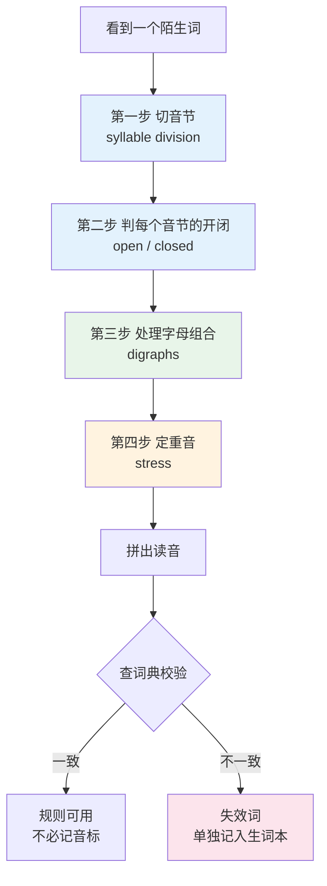
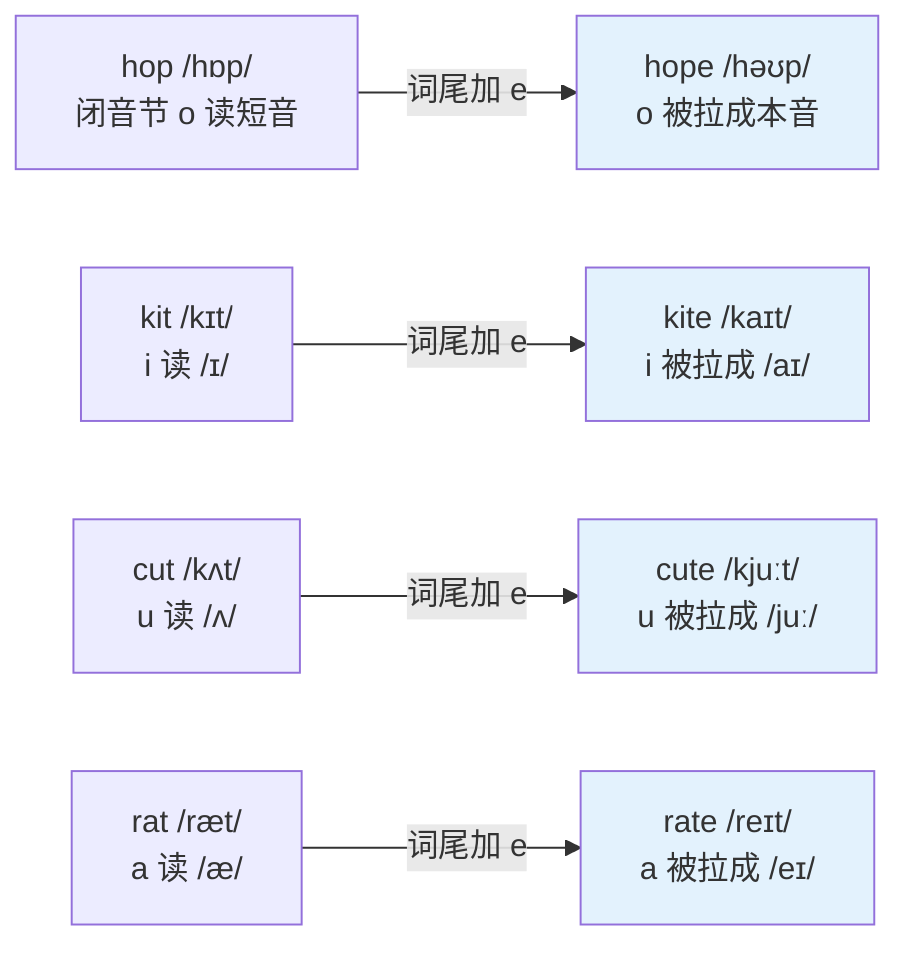
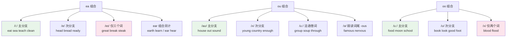
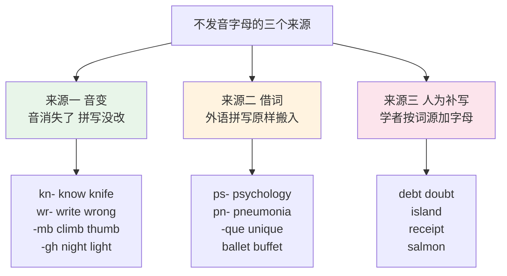
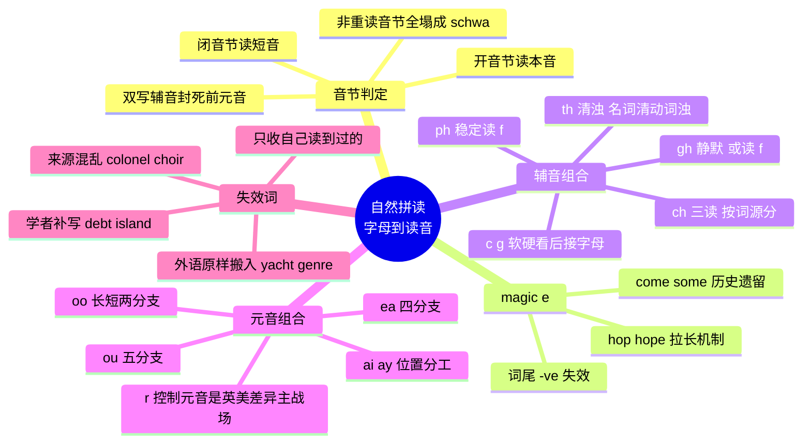

# 自然拼读：拼写与发音对应规则

> [!info] 本篇定位
>
> 全书唯一一篇「看到字母串就能读出来」的操作篇。上一篇讲了词从哪来，本篇解决词怎么读。
>
> 读完你会拿到三样东西：一套音节切分与开闭音节的判定流程，一张覆盖主要字母组合的读音对照表，以及遇到 `colonel`、`debt`、`island` 这类规则失效词时的识别与处理办法。
>
> 本篇与上一篇 [[01.词汇入门与学习方法/01.英语词汇的来源、分层与学习地图\|英语词汇的来源、分层与学习地图]] 直接衔接：拼读规则之所以有这么多例外，根源就是那三层来源各带一套拼写习惯。下一篇讲音标符号本身，本篇讲的是从字母到读音的映射。

---

## 1. 本篇导读：拼读能做什么，不能做什么

英语不是表音文字，但也不是完全不表音。它处在中间地带——常用词里大部分能按规则读出来，读不出来的那批数量不算小，而且偏偏扎堆在最高频的几百个词里。这个格局决定了学拼读的正确姿势：**把它当成一个高召回率但会失手的预测器，而不是当成铁律**。

中文母语者学拼读最常见的两种失败方式正好相反。

一种是根本不学，每个词都靠音标死记。结果是遇到没查过音标的词就完全卡住，读技术文档时满篇 `deprecated`、`idempotent`、`heuristic` 都不敢念出声。这类人的词汇增长速度被人为压低了一大截——因为「读得出」是「记得住」的前提，读不出的词在脑子里没有声音形式，只能当图形记，遗忘极快。

另一种是学了规则就当铁律，遇到例外就崩溃。看到 `island` 的 `s` 不发音、`colonel` 读得像 `kernel`，于是得出「英语根本没规律」的结论，回到第一种方式。

正确的用法是：**先用规则拼一遍，再用词典校验，把校验结果里的偏差单独收集。** 规则拼对了的词就不用记音标，规则拼错的词才值得进生词本。这样做能把需要死记的音标量压到很小。



上图是本篇的操作骨架，也是每一节的排列顺序。第二节讲音节切分与开闭判定，第三到第四节把开闭音节的核心工具 magic e 讲透，第五到第八节处理各类字母组合，第九节收词尾，第十到第十一节处理规则失效的情况。重音那一步只在本篇给一个够用的近似规则，完整的重音体系放在下一篇。

需要先说清一件事：本篇给出的音标全部标注英式（RP）与美式（GenAm）两套。两者的差别有系统性规律——美音有 r 音、英音 `/ɒ/` 对应美音 `/ɑː/`、英音 `/əʊ/` 对应美音 `/oʊ/`——这些规律会在表格里反复出现，看几节就能自动换算，不必逐个记忆。

---

## 2. 音节：拼读的最小操作单位

### 2.1 音节由元音定义

一个音节必须有且只有一个元音音素。这句话决定了音节数的数法：**数元音音素的个数，不是数元音字母的个数**。

- `cat` → 一个元音 /æ/ → 一个音节
- `water` → 两个元音 /ɔː/ /ə/ → 两个音节
- `beautiful` → 三个元音 /juː/ /ɪ/ /ʊ/ → 三个音节，但元音字母有 `e a u i u` 五个

这个区别是中文母语者最先要过的坎。`please` 有四个元音字母（e a e，加上 ea 组合），但只有一个音节 /pliːz/。

一个例外：`-le` 结尾的音节可以没有元音字母，由 `/l/` 自己充当音节核心，叫成音节 `/l̩/`。`little` /ˈlɪtl/ 的第二个音节就没有元音音素，词典写作 `/l/` 而不写 `/əl/`。同类的还有 `/n/`：`button` /ˈbʌtn/、`cotton` /ˈkɒtn/。

### 2.2 开音节与闭音节

这是整个自然拼读的核心判据，几乎所有单元音字母的读法都由它决定。

| 类型 | 判定 | 元音读法 | 例词 |
| --- | --- | --- | --- |
| 开音节 open syllable | 音节以元音字母结尾 | 读**字母本音**（长音） | me, go, hi, ta-ble |
| 闭音节 closed syllable | 音节以辅音字母结尾 | 读**短音** | cat, pen, sit, hot, cup |
| 魔法 e 音节 magic e | 元音 + 单辅音 + 不发音 e | 读**字母本音** | hope, kite, cake |
| r 控制音节 r-controlled | 元音 + r | 读被 r 改造的音 | car, her, bird |

「字母本音」指的是这个字母在字母表里的读法：`a` 读 /eɪ/、`e` 读 /iː/、`i` 读 /aɪ/、`o` 读 /əʊ/ 或 /oʊ/、`u` 读 /juː/。

| 英文 | 英式音标 | 美式音标 | 词性 | 中文 | 搭配与说明 |
| --- | --- | --- | --- | --- | --- |
| **me** | /miː/ | /miː/ | pron. | 我（宾格） | 开音节，e 读本音 /iː/ |
| **he** | /hiː/ | /hiː/ | pron. | 他 | 同上，单音节开音节 |
| **she** | /ʃiː/ | /ʃiː/ | pron. | 她 | sh 组合 + 开音节 e |
| **we** | /wiː/ | /wiː/ | pron. | 我们 | 开音节 |
| **go** | /ɡəʊ/ | /ɡoʊ/ | v. | 去 | o 读本音，英美 /əʊ/ 与 /oʊ/ 的典型对照 |
| **no** | /nəʊ/ | /noʊ/ | adv. | 不 | 同一对照 |
| **so** | /səʊ/ | /soʊ/ | adv./conj. | 如此；所以 | 同上 |
| **hi** | /haɪ/ | /haɪ/ | int. | 嗨 | i 读本音 /aɪ/ |
| **my** | /maɪ/ | /maɪ/ | det. | 我的 | 词尾 y 相当于开音节 i |
| **ta-ble** | /ˈteɪbl/ | /ˈteɪbl/ | n. | 桌子 | 切成 ta-ble，第一音节开，a 读 /eɪ/ |

对照的闭音节，同样五个元音字母全部改读短音。

| 英文 | 英式音标 | 美式音标 | 词性 | 中文 | 搭配与说明 |
| --- | --- | --- | --- | --- | --- |
| **cat** | /kæt/ | /kæt/ | n. | 猫 | 闭音节 a 读 /æ/ |
| **map** | /mæp/ | /mæp/ | n./v. | 地图；映射 | 编程里 map 作动词高频 |
| **pen** | /pen/ | /pen/ | n. | 钢笔 | 闭音节 e 读 /e/ |
| **bed** | /bed/ | /bed/ | n. | 床 | 同上 |
| **sit** | /sɪt/ | /sɪt/ | v. | 坐 | 闭音节 i 读 /ɪ/ |
| **pin** | /pɪn/ | /pɪn/ | n./v. | 别针；固定 | 同上 |
| **hot** | /hɒt/ | /hɑːt/ | adj. | 热的 | 英 /ɒ/ 对美 /ɑː/ 的标准对照 |
| **dog** | /dɒɡ/ | /dɔːɡ/ | n. | 狗 | 美音这里多为 /ɔː/ 而非 /ɑː/ |
| **cup** | /kʌp/ | /kʌp/ | n. | 杯子 | 闭音节 u 读 /ʌ/ |
| **bus** | /bʌs/ | /bʌs/ | n. | 公交车 | 同上，复数 buses |

### 2.3 多音节词怎么切

拿到一个长词，切分按下面三条走，命中一条就停。

**第一条：两个元音之间只有一个辅音字母，辅音归后一个音节。** `pa-per` /ˈpeɪpə/，第一音节 `pa` 开音节，a 读 /eɪ/。同理 `mu-sic` /ˈmjuːzɪk/、`ba-sic` /ˈbeɪsɪk/、`o-pen` /ˈəʊpən/。

**第二条：两个元音之间有两个辅音字母，从中间切开。** `rab-bit` /ˈræbɪt/，第一音节 `rab` 是闭音节，a 读 /æ/。同理 `let-ter` /ˈletə/、`sud-den` /ˈsʌdn/、`din-ner` /ˈdɪnə/。

**第三条：`-le` 结尾时，把它前面的那个辅音带走。** `ta-ble`、`lit-tle`、`sim-ple`、`cir-cle`。这条规则顺带解释了 `table` 为什么读 /ˈteɪbl/ 而 `little` 读 /ˈlɪtl/——前者切完第一音节是开的，后者是闭的。

> [!tip] 一条能省很多事的判据
>
> 看到中间是双写辅音字母（`rabbit`、`letter`、`summer`、`happy`），前面那个元音**一定读短音**。双写辅音在英语拼写里的功能就是把前一个音节封死。
>
> 反过来，看到单辅音字母隔开两个元音（`paper`、`music`、`later`），前面那个元音**大概率读长音**。这一对判据能覆盖大量双音节词。

`later` /ˈleɪtə/ 与 `latter` /ˈlætə/ 是这条规则最干净的证据：拼写只差一个 `t`，读音的元音完全不同。同理 `hoping` /ˈhəʊpɪŋ/ 与 `hopping` /ˈhɒpɪŋ/、`taping` /ˈteɪpɪŋ/ 与 `tapping` /ˈtæpɪŋ/。写作时把 `hoping` 误拼成 `hopping`，读者读到的是另一个词。

---

## 3. Magic e：hop 与 hope

### 3.1 机制

词尾一个不发音的 `e`，把前面的元音字母从短音拉成本音。这个 `e` 自己不发音，只起标记作用，英美教材通称 magic e 或 silent e，语言学上叫 split digraph（分裂二合字母）。

生效条件很严格：**元音字母 + 恰好一个辅音字母 + e**。中间隔两个辅音就不生效（`waste` 是特例，见下文），中间没有辅音也不生效。



上图的四组词说明了同一个机制：那个 `e` 本身不占任何音位，但它的存在改写了前面元音的读法。这也解释了为什么英语动词加 `-ing` 时要去掉 `e`（`hope` → `hoping`）——`e` 的任务已经由后面的元音接管了，留着反而多余。

### 3.2 五组对照

| 短音词（无 e） | 音标（英/美） | 长音词（有 e） | 音标（英/美） | 中文对照 |
| --- | --- | --- | --- | --- |
| **hop** | /hɒp/ · /hɑːp/ | **hope** | /həʊp/ · /hoʊp/ | 单脚跳 → 希望 |
| **cap** | /kæp/ · /kæp/ | **cape** | /keɪp/ · /keɪp/ | 帽子 → 斗篷 |
| **kit** | /kɪt/ · /kɪt/ | **kite** | /kaɪt/ · /kaɪt/ | 工具包 → 风筝 |
| **pin** | /pɪn/ · /pɪn/ | **pine** | /paɪn/ · /paɪn/ | 别针 → 松树 |
| **cut** | /kʌt/ · /kʌt/ | **cute** | /kjuːt/ · /kjuːt/ | 切 → 可爱的 |
| **tap** | /tæp/ · /tæp/ | **tape** | /teɪp/ · /teɪp/ | 轻拍 → 胶带 |
| **not** | /nɒt/ · /nɑːt/ | **note** | /nəʊt/ · /noʊt/ | 不 → 笔记 |
| **rid** | /rɪd/ · /rɪd/ | **ride** | /raɪd/ · /raɪd/ | 摆脱 → 骑 |
| **plan** | /plæn/ · /plæn/ | **plane** | /pleɪn/ · /pleɪn/ | 计划 → 飞机 |
| **tub** | /tʌb/ · /tʌb/ | **tube** | /tjuːb/ · /tuːb/ | 桶 → 管子（英美 u 有差） |
| **win** | /wɪn/ · /wɪn/ | **wine** | /waɪn/ · /waɪn/ | 赢 → 葡萄酒 |
| **slop** | /slɒp/ · /slɑːp/ | **slope** | /sləʊp/ · /sloʊp/ | 溢出 → 斜坡 |

`tub` / `tube` 那一行顺带演示了一条英美差异规律：`u` 读本音时，英音是 /juː/、美音在 `t d n s l` 后面常脱落 /j/ 变成 /uː/。所以 `tune` 英 /tjuːn/ 美 /tuːn/、`duke` 英 /djuːk/ 美 /duːk/、`new` 英 /njuː/ 美 /nuː/。这个现象叫 yod-dropping，遇到就按这条换算。

### 3.3 Magic e 失效的两类情况

**第一类：`-ve` 结尾。** 英语正字法有一条硬约束——单词不能以 `v` 结尾，必须补一个 `e`。这个 `e` 是补位的，不是 magic e，所以不拉长前面的元音。

| 英文 | 英式音标 | 美式音标 | 词性 | 中文 | 搭配与说明 |
| --- | --- | --- | --- | --- | --- |
| **have** | /hæv/ | /hæv/ | v. | 有 | a 仍读 /æ/，不读 /eɪ/ |
| **give** | /ɡɪv/ | /ɡɪv/ | v. | 给 | i 读 /ɪ/，与 five /faɪv/ 对比 |
| **live** | /lɪv/ | /lɪv/ | v. | 居住 | 形容词 live 读 /laɪv/，词性决定读音 |
| **love** | /lʌv/ | /lʌv/ | n./v. | 爱 | o 读 /ʌ/ |
| **glove** | /ɡlʌv/ | /ɡlʌv/ | n. | 手套 | 常用复数 gloves |
| **above** | /əˈbʌv/ | /əˈbʌv/ | prep. | 在……之上 | 重音在第二音节 |
| **dove** | /dʌv/ | /dʌv/ | n. | 鸽子 | dive 的过去式 dove 读 /dəʊv/，同形不同音 |

`live` 这一行值得单拎出来：动词 `live` /lɪv/「居住」，形容词与副词 `live` /laɪv/「现场的」。技术语境里 `live reload`、`live server` 全读 /laɪv/，读成 /lɪv/ 会让人听不懂。

**第二类：高频功能词的历史遗留。** `come` /kʌm/、`some` /sʌm/、`done` /dʌn/、`none` /nʌn/、`gone` 英 /ɡɒn/ 美 /ɡɔːn/、`one` /wʌn/。这批词太常用，读音在拼写标准化之前就固化了。数量有限，直接记住。

| 英文 | 英式音标 | 美式音标 | 词性 | 中文 | 搭配与说明 |
| --- | --- | --- | --- | --- | --- |
| **come** | /kʌm/ | /kʌm/ | v. | 来 | 与 home /həʊm/ 拼写同构但读音不同 |
| **some** | /sʌm/ | /sʌm/ | det. | 一些 | 与 same /seɪm/ 对比 |
| **done** | /dʌn/ | /dʌn/ | v. | 完成（do 的过去分词） | 与 bone /bəʊn/ 对比 |
| **none** | /nʌn/ | /nʌn/ | pron. | 没有一个 | 与 nun 同音 |
| **gone** | /ɡɒn/ | /ɡɔːn/ | v. | 去了（go 的过去分词） | 与 bone、stone 读法不同 |
| **one** | /wʌn/ | /wʌn/ | num. | 一 | 词首多出一个 /w/，纯属历史遗留 |
| **whose** | /huːz/ | /huːz/ | det. | 谁的 | wh 读 /h/，o 读 /uː/ |

---

## 4. 五个元音字母的两套读法总表

把前两节的规则合起来，五个元音字母各有一套长短音对应关系。这张表是全篇复用频率最高的一张。

| 字母 | 短音（闭音节） | 例词 | 长音（开音节 / magic e） | 例词 |
| --- | --- | --- | --- | --- |
| a | /æ/ | cat, map, bad | /eɪ/ | cake, name, table |
| e | /e/ | pen, bed, ten | /iː/ | he, these, complete |
| i | /ɪ/ | sit, big, fish | /aɪ/ | hi, time, find |
| o | 英 /ɒ/ 美 /ɑː/ | hot, box, stop | 英 /əʊ/ 美 /oʊ/ | go, home, open |
| u | /ʌ/ | cup, sun, bus | 英 /juː/ 美 /uː/ | use, cute, music |

| 英文 | 英式音标 | 美式音标 | 词性 | 中文 | 搭配与说明 |
| --- | --- | --- | --- | --- | --- |
| **cake** | /keɪk/ | /keɪk/ | n. | 蛋糕 | magic e 拉长 a |
| **name** | /neɪm/ | /neɪm/ | n./v. | 名字；命名 | 编程里 naming 高频 |
| **these** | /ðiːz/ | /ðiːz/ | det. | 这些 | th 读浊音 /ð/ |
| **complete** | /kəmˈpliːt/ | /kəmˈpliːt/ | adj./v. | 完整的；完成 | 重音在第二音节，第一音节弱化成 /ə/ |
| **time** | /taɪm/ | /taɪm/ | n. | 时间 | magic e 拉长 i |
| **find** | /faɪnd/ | /faɪnd/ | v. | 找到 | -ind 结尾的 i 常读长音：kind, mind, behind |
| **home** | /həʊm/ | /hoʊm/ | n. | 家 | 与 come /kʌm/ 构成陷阱对 |
| **open** | /ˈəʊpən/ | /ˈoʊpən/ | v./adj. | 打开；开着的 | 切成 o-pen，第一音节开 |
| **use** | /juːz/ | /juːz/ | v. | 使用 | 名词 use /juːs/ 清音，动词 /juːz/ 浊音 |
| **music** | /ˈmjuːzɪk/ | /ˈmjuːzɪk/ | n. | 音乐 | 切成 mu-sic，u 读 /juː/ |
| **fish** | /fɪʃ/ | /fɪʃ/ | n. | 鱼 | 闭音节 + sh 组合 |
| **box** | /bɒks/ | /bɑːks/ | n. | 盒子 | x 读 /ks/，复数 boxes |
| **sun** | /sʌn/ | /sʌn/ | n. | 太阳 | 与 son 同音 |
| **kind** | /kaɪnd/ | /kaɪnd/ | adj./n. | 善良的；种类 | 与 -ind 组同规律 |
| **behind** | /bɪˈhaɪnd/ | /bɪˈhaɪnd/ | prep. | 在……后面 | 重音在后，前音节弱化 |

> [!warning] 长音短音以外的第三种：弱读
>
> 上面两套读法都指**重读音节**。非重读音节里，五个元音字母绝大多数都塌缩成 /ə/ 或 /ɪ/，跟原来是哪个字母无关。
>
> - `about` /əˈbaʊt/ ——第一个 a 读 /ə/
> - `problem` /ˈprɒbləm/ ——第二个 e 读 /ə/
> - `pencil` /ˈpensl/ ——第二个 i 弱到几乎消失
> - `official` /əˈfɪʃl/ ——第一个 o 读 /ə/
>
> 这意味着**必须先定重音，再套长短音规则**。定错重音，元音全盘皆错。完整的重音规则在下一篇。

---

## 5. 辅音字母组合：ch / sh / th / ph / gh

两个辅音字母合起来表示一个音，术语叫 digraph（二合字母）。这类组合数量不多但出现频率极高，是拼读里回报最高的一块。

### 5.1 ch 的三种读法，按来源分

`ch` 是最典型的「读音由词源决定」的组合，三种读法对应上一篇讲的三个来源层。

**读 /tʃ/——本土词与早期法语借词，占多数。**

| 英文 | 英式音标 | 美式音标 | 词性 | 中文 | 搭配与说明 |
| --- | --- | --- | --- | --- | --- |
| **chair** | /tʃeə/ | /tʃer/ | n. | 椅子 | air 组合英美差异见第 8 节 |
| **cheese** | /tʃiːz/ | /tʃiːz/ | n. | 奶酪 | 不可数 |
| **church** | /tʃɜːtʃ/ | /tʃɜːrtʃ/ | n. | 教堂 | 词首词尾都是 /tʃ/ |
| **chicken** | /ˈtʃɪkɪn/ | /ˈtʃɪkɪn/ | n. | 鸡；鸡肉 | 活体与肉同形，见上一篇 |
| **teach** | /tiːtʃ/ | /tiːtʃ/ | v. | 教 | 过去式 taught /tɔːt/ |
| **much** | /mʌtʃ/ | /mʌtʃ/ | det. | 许多 | 修饰不可数名词 |
| **branch** | /brɑːntʃ/ | /bræntʃ/ | n. | 树枝；分支 | 英美 a 的经典差异；Git 术语常用 |

**读 /k/——希腊来源，集中在科技与学术词。**

| 英文 | 英式音标 | 美式音标 | 词性 | 中文 | 搭配与说明 |
| --- | --- | --- | --- | --- | --- |
| **school** | /skuːl/ | /skuːl/ | n. | 学校 | 最常用的 ch 读 /k/ 的词 |
| **chemistry** | /ˈkemɪstri/ | /ˈkemɪstri/ | n. | 化学 | 形容词 chemical |
| **character** | /ˈkærəktə/ | /ˈkerəktər/ | n. | 性格；字符 | 编程里指单个字符，缩写 char |
| **echo** | /ˈekəʊ/ | /ˈekoʊ/ | n./v. | 回声；回显 | shell 命令 echo 同读 |
| **stomach** | /ˈstʌmək/ | /ˈstʌmək/ | n. | 胃 | 词尾 ch 也读 /k/ |
| **architect** | /ˈɑːkɪtekt/ | /ˈɑːrkɪtekt/ | n. | 建筑师；架构师 | architecture 同一词根 |
| **scheme** | /skiːm/ | /skiːm/ | n. | 方案 | schema /ˈskiːmə/ 同源 |
| **technology** | /tekˈnɒlədʒi/ | /tekˈnɑːlədʒi/ | n. | 技术 | 重音在第二音节 |
| **mechanism** | /ˈmekənɪzəm/ | /ˈmekənɪzəm/ | n. | 机制 | 形容词 mechanical |
| **anchor** | /ˈæŋkə/ | /ˈæŋkər/ | n. | 锚 | HTML 的 anchor 标签同读 |

**读 /ʃ/——较晚的法语借词。**

| 英文 | 英式音标 | 美式音标 | 词性 | 中文 | 搭配与说明 |
| --- | --- | --- | --- | --- | --- |
| **machine** | /məˈʃiːn/ | /məˈʃiːn/ | n. | 机器 | 重音在后，保留法语节奏 |
| **chef** | /ʃef/ | /ʃef/ | n. | 主厨 | 与 chief /tʃiːf/ 不同音也不同义 |
| **brochure** | /ˈbrəʊʃə/ | /broʊˈʃʊr/ | n. | 宣传册 | 英美重音位置不同 |
| **parachute** | /ˈpærəʃuːt/ | /ˈperəʃuːt/ | n. | 降落伞 | ch 与 u 都按法语读 |
| **chic** | /ʃiːk/ | /ʃiːk/ | adj. | 时髦的 | 与 chick /tʃɪk/ 完全不同 |
| **moustache** | /məˈstɑːʃ/ | /ˈmʌstæʃ/ | n. | 小胡子 | 美式拼写 mustache，重音也不同 |

判据很实用：**词看起来专业、学术、科技感强，`ch` 大概率读 /k/；词跟餐饮、时尚、艺术有关，大概率读 /ʃ/；其余读 /tʃ/。**

### 5.2 sh 与它唯一的陷阱

`sh` 稳定读 /ʃ/，几乎没有例外：`ship` /ʃɪp/、`shop` 英 /ʃɒp/ 美 /ʃɑːp/、`fish` /fɪʃ/、`wash` 英 /wɒʃ/ 美 /wɑːʃ/、`brush` /brʌʃ/、`English` /ˈɪŋɡlɪʃ/、`finish` /ˈfɪnɪʃ/、`shell` /ʃel/。

唯一要小心的是**跨语素边界**：`s` 和 `h` 分属两个词素时不合并。

- `mishap` /ˈmɪshæp/ ——`mis-` + `hap`，读作 mis-hap 而非 mi-shap
- `dishonest` /dɪsˈɒnɪst/ ——`dis-` + `honest`（`h` 还不发音）
- `grasshopper` /ˈɡrɑːshɒpə/ ——`grass` + `hopper`

判断办法：拆得开就分读，拆不开就合读。

### 5.3 th 的清浊之分

`th` 有两个读音：清音 /θ/ 与浊音 /ð/。中文没有这两个音，声带振动与否的区别对中文母语者是新的，但拼写上有相当可靠的规律。

**读浊音 /ð/ 的三类：功能词、词中的 th、动词的 -the。**

| 英文 | 英式音标 | 美式音标 | 词性 | 中文 | 搭配与说明 |
| --- | --- | --- | --- | --- | --- |
| **the** | /ðə/ | /ðə/ | art. | 定冠词 | 元音前读 /ði/，英语最高频词 |
| **this** | /ðɪs/ | /ðɪs/ | det. | 这个 | 复数 these |
| **that** | /ðæt/ | /ðæt/ | det./conj. | 那个；引导从句 | 从句里常弱读成 /ðət/ |
| **they** | /ðeɪ/ | /ðeɪ/ | pron. | 他们 | ey 读 /eɪ/ |
| **there** | /ðeə/ | /ðer/ | adv. | 那里 | 与 their、they're 同音 |
| **mother** | /ˈmʌðə/ | /ˈmʌðər/ | n. | 母亲 | 词中 th 读浊 |
| **weather** | /ˈweðə/ | /ˈweðər/ | n. | 天气 | 与 whether 同音 |
| **together** | /təˈɡeðə/ | /təˈɡeðər/ | adv. | 一起 | 重音在中间 |
| **breathe** | /briːð/ | /briːð/ | v. | 呼吸 | 名词 breath /breθ/ 清音且元音短 |
| **smooth** | /smuːð/ | /smuːð/ | adj. | 光滑的 | 少见的词尾浊 th |

**读清音 /θ/ 的：实词的词首与词尾。**

| 英文 | 英式音标 | 美式音标 | 词性 | 中文 | 搭配与说明 |
| --- | --- | --- | --- | --- | --- |
| **think** | /θɪŋk/ | /θɪŋk/ | v. | 想 | 过去式 thought /θɔːt/ |
| **three** | /θriː/ | /θriː/ | num. | 三 | /θr/ 连读是难点 |
| **thin** | /θɪn/ | /θɪn/ | adj. | 薄的 | 与 then /ðen/ 构成清浊对照 |
| **both** | /bəʊθ/ | /boʊθ/ | det. | 两者都 | 词尾清 th |
| **math** | /mæθ/ | /mæθ/ | n. | 数学 | 英式惯用 maths /mæθs/ |
| **north** | /nɔːθ/ | /nɔːrθ/ | n. | 北方 | 但 northern /ˈnɔːðən/ 转浊 |
| **path** | /pɑːθ/ | /pæθ/ | n. | 路径 | 英美 a 差异；文件路径同词 |
| **healthy** | /ˈhelθi/ | /ˈhelθi/ | adj. | 健康的 | 名词 health |
| **method** | /ˈmeθəd/ | /ˈmeθəd/ | n. | 方法 | 面向对象里的「方法」同词 |
| **length** | /leŋθ/ | /leŋθ/ | n. | 长度 | 数组 length 属性同读 |

> [!warning] 名词读清、动词读浊的一组词
>
> 有一批词靠 th 的清浊区分词性，写法差一个 `e`，读音差一整个音位。
>
> - **breath** /breθ/（名词，呼吸）→ **breathe** /briːð/（动词，呼吸）
> - **bath** 英 /bɑːθ/ 美 /bæθ/（名词，洗澡）→ **bathe** /beɪð/（动词，沐浴）
> - **cloth** 英 /klɒθ/ 美 /klɔːθ/（名词，布）→ **clothe** /kləʊð/（动词，给……穿衣）
> - **teeth** /tiːθ/（名词复数，牙）→ **teethe** /tiːð/（动词，长牙）
> - **mouth** /maʊθ/（名词，嘴）→ **mouth** /maʊð/（动词，无声说出）
>
> 最后一对拼写完全相同，只能靠句法判断。

还有一小批 `th` 读 /t/ 的，全部是专名或古词：`Thomas` /ˈtɒməs/、`Thames` /temz/、`thyme` /taɪm/（百里香，与 time 同音）。以及跨语素边界的 `lighthouse` /ˈlaɪthaʊs/——`light` + `house`，t 和 h 各读各的。

### 5.4 ph 读 /f/

`ph` 是希腊字母 φ 的转写，稳定读 /f/。凡是含 `ph` 的词，基本可以断定是希腊来源的学术词。

| 英文 | 英式音标 | 美式音标 | 词性 | 中文 | 搭配与说明 |
| --- | --- | --- | --- | --- | --- |
| **photo** | /ˈfəʊtəʊ/ | /ˈfoʊtoʊ/ | n. | 照片 | photograph 的缩略 |
| **graph** | /ɡrɑːf/ | /ɡræf/ | n. | 图表；图 | 数据结构里的「图」同词 |
| **phrase** | /freɪz/ | /freɪz/ | n. | 短语 | 与 phase /feɪz/ 拼写近、读音近，易混 |
| **physics** | /ˈfɪzɪks/ | /ˈfɪzɪks/ | n. | 物理学 | 学科名单复数形 |
| **alphabet** | /ˈælfəbet/ | /ˈælfəbet/ | n. | 字母表 | alpha + beta |
| **philosophy** | /fəˈlɒsəfi/ | /fəˈlɑːsəfi/ | n. | 哲学 | philo「爱」+ sophia「智慧」 |
| **sphere** | /sfɪə/ | /sfɪr/ | n. | 球体 | 派生 atmosphere、hemisphere |
| **emphasis** | /ˈemfəsɪs/ | /ˈemfəsɪs/ | n. | 强调 | 复数 emphases，动词 emphasize |
| **dolphin** | /ˈdɒlfɪn/ | /ˈdɑːlfɪn/ | n. | 海豚 | ph 在词中 |
| **paragraph** | /ˈpærəɡrɑːf/ | /ˈperəɡræf/ | n. | 段落 | HTML 的 p 标签取自此词 |

例外同样是跨语素边界：`shepherd` 英 /ˈʃepəd/ 美 /ˈʃepərd/（`sheep` + `herd`）、`uphill` /ʌpˈhɪl/（`up` + `hill`）、`loophole` /ˈluːphəʊl/。

### 5.5 gh 的三种命运

`gh` 曾经代表一个真实的喉音，后来这个音在英语里消失了，但拼写留了下来。今天它有三种处理：

**不发音（最多数）。** `night` /naɪt/、`light` /laɪt/、`right` /raɪt/、`high` /haɪ/、`though` 英 /ðəʊ/ 美 /ðoʊ/、`through` /θruː/、`thought` /θɔːt/、`bought` /bɔːt/、`caught` /kɔːt/、`daughter` 英 /ˈdɔːtə/ 美 /ˈdɔːtər/、`weight` /weɪt/、`eight` /eɪt/、`straight` /streɪt/、`neighbour` 英 /ˈneɪbə/ 美 /ˈneɪbər/（美式拼写 neighbor）。

**读 /f/。** 这批词有限，值得整体记住。

| 英文 | 英式音标 | 美式音标 | 词性 | 中文 | 搭配与说明 |
| --- | --- | --- | --- | --- | --- |
| **enough** | /ɪˈnʌf/ | /ɪˈnʌf/ | adj./adv. | 足够 | ou 读 /ʌ/，gh 读 /f/ |
| **rough** | /rʌf/ | /rʌf/ | adj. | 粗糙的 | 与 ruff 同音 |
| **tough** | /tʌf/ | /tʌf/ | adj. | 艰难的 | 同一读法组 |
| **cough** | /kɒf/ | /kɔːf/ | v./n. | 咳嗽 | ou 这里读 /ɒ/，不读 /ʌ/ |
| **laugh** | /lɑːf/ | /læf/ | v./n. | 笑 | au 读 /ɑː/ 或 /æ/，英美差异 |
| **trough** | /trɒf/ | /trɔːf/ | n. | 槽；低谷 | 与 through 拼写只差一字母，读音天差地别 |

**读 /ɡ/（仅限词首）。** `ghost` 英 /ɡəʊst/ 美 /ɡoʊst/、`ghetto` /ˈɡetəʊ/。

> [!warning] gh 家族里的四个陷阱词
>
> 这四个词拼写高度相似，读音互不相干，混淆的代价很高：
>
> - **though** 英 /ðəʊ/ 美 /ðoʊ/ ——虽然
> - **thought** /θɔːt/ ——想（think 的过去式）
> - **through** /θruː/ ——穿过
> - **thorough** 英 /ˈθʌrə/ 美 /ˈθɜːroʊ/ ——彻底的
>
> 记忆办法不是记规则，是把四个词连读成一串反复念，让它们在听觉上分开。

### 5.6 其余高频辅音组合

| 组合 | 读音 | 位置 | 例词 |
| --- | --- | --- | --- |
| ck | /k/ | 短元音后的词尾 | back, duck, clock, black, stick |
| ng | /ŋ/ | 词尾 | sing, long, thing, strong, string |
| nk | /ŋk/ | 词尾 | think, bank, drink, thank, link |
| tch | /tʃ/ | 短元音后 | watch, catch, match, switch, patch |
| dge | /dʒ/ | 短元音后 | bridge, judge, edge, badge, ledge |
| qu | /kw/ | 词首词中 | queen, quick, question, square, query |
| wh | /w/ | 词首（多数） | what, when, where, which, while |
| wh | /h/ | 后接 o | who, whose, whom, whole |
| wr | /r/ | 词首 | write, wrong, wrap, wrist |
| kn | /n/ | 词首 | know, knee, knife, knock |

| 英文 | 英式音标 | 美式音标 | 词性 | 中文 | 搭配与说明 |
| --- | --- | --- | --- | --- | --- |
| **string** | /strɪŋ/ | /strɪŋ/ | n. | 字符串；绳子 | str 三连辅音，中文母语者易加元音 |
| **link** | /lɪŋk/ | /lɪŋk/ | n./v. | 链接 | nk 读 /ŋk/ 不读 /nk/ |
| **switch** | /swɪtʃ/ | /swɪtʃ/ | n./v. | 开关；切换 | tch 只出现在短元音后 |
| **bridge** | /brɪdʒ/ | /brɪdʒ/ | n. | 桥 | dge 只出现在短元音后 |
| **query** | /ˈkwɪəri/ | /ˈkwɪri/ | n./v. | 查询 | 与 quarry /ˈkwɒri/ 不同 |
| **queue** | /kjuː/ | /kjuː/ | n./v. | 队列；排队 | 五个元音字母只读一个音节 |
| **knowledge** | /ˈnɒlɪdʒ/ | /ˈnɑːlɪdʒ/ | n. | 知识 | kn 读 /n/，-dge 读 /dʒ/ |
| **wrap** | /ræp/ | /ræp/ | v. | 包裹 | 与 rap 同音；CSS 的 wrap 同读 |
| **squash** | /skwɒʃ/ | /skwɑːʃ/ | v. | 压扁；压缩 | Git 的 squash 提交同读 |
| **whether** | /ˈweðə/ | /ˈweðər/ | conj. | 是否 | 与 weather 同音 |

`qu` 在法语晚期借词里读 /k/：`unique` /juˈniːk/、`antique` /ænˈtiːk/、`technique` /tekˈniːk/、`boutique` /buːˈtiːk/。这些词的词尾 `-que` 一律读 /k/，重音一律在最后一个音节。

---

## 6. c 与 g：软音硬音由后面的字母决定

### 6.1 规则

这是一条极其可靠的规则，直接来自拉丁语在中世纪的音变。

| 字母 | 后接 e / i / y | 后接 a / o / u / 辅音 / 词尾 |
| --- | --- | --- |
| c | 软音 /s/ | 硬音 /k/ |
| g | 软音 /dʒ/ | 硬音 /ɡ/ |

`c` 的这条规则几乎找不到反例。`g` 有一批例外，集中在日耳曼层的常用词。

| 英文 | 英式音标 | 美式音标 | 词性 | 中文 | 搭配与说明 |
| --- | --- | --- | --- | --- | --- |
| **city** | /ˈsɪti/ | /ˈsɪti/ | n. | 城市 | c + i 读软音 /s/ |
| **cent** | /sent/ | /sent/ | n. | 分（货币） | c + e 读 /s/，与 sent 同音 |
| **cycle** | /ˈsaɪkl/ | /ˈsaɪkl/ | n./v. | 循环 | 一软一硬：c+y 读 /s/，c+l 读 /k/ |
| **decide** | /dɪˈsaɪd/ | /dɪˈsaɪd/ | v. | 决定 | 名词 decision |
| **circle** | /ˈsɜːkl/ | /ˈsɜːrkl/ | n. | 圆 | 同样一软一硬 |
| **success** | /səkˈses/ | /səkˈses/ | n. | 成功 | 两个 c 各读各的：/k/ + /s/ |
| **accept** | /əkˈsept/ | /əkˈsept/ | v. | 接受 | 同上，HTTP 头 Accept 同读 |
| **cat** | /kæt/ | /kæt/ | n. | 猫 | c + a 读硬音 /k/ |
| **cold** | /kəʊld/ | /koʊld/ | adj. | 冷的 | c + o 读 /k/ |
| **class** | /klɑːs/ | /klæs/ | n. | 班级；类 | c + 辅音读 /k/ |
| **giant** | /ˈdʒaɪənt/ | /ˈdʒaɪənt/ | n./adj. | 巨人；巨大的 | g + i 读软音 /dʒ/ |
| **gym** | /dʒɪm/ | /dʒɪm/ | n. | 健身房 | g + y 读 /dʒ/ |
| **general** | /ˈdʒenərəl/ | /ˈdʒenərəl/ | adj./n. | 一般的；将军 | g + e 读 /dʒ/ |
| **engine** | /ˈendʒɪn/ | /ˈendʒɪn/ | n. | 引擎 | 搜索引擎 search engine |
| **danger** | /ˈdeɪndʒə/ | /ˈdeɪndʒər/ | n. | 危险 | 形容词 dangerous |
| **logic** | /ˈlɒdʒɪk/ | /ˈlɑːdʒɪk/ | n. | 逻辑 | g + i 软，c 硬 |
| **game** | /ɡeɪm/ | /ɡeɪm/ | n. | 游戏 | g + a 读硬音 /ɡ/ |
| **glass** | /ɡlɑːs/ | /ɡlæs/ | n. | 玻璃；杯子 | g + 辅音读 /ɡ/ |
| **garden** | /ˈɡɑːdn/ | /ˈɡɑːrdn/ | n. | 花园 | g + a 读 /ɡ/ |
| **gum** | /ɡʌm/ | /ɡʌm/ | n. | 口香糖 | g + u 读 /ɡ/ |

### 6.2 g 的例外清单

下面这批词 `g` 后面是 `e` 或 `i`，却读硬音 /ɡ/。它们几乎全部来自日耳曼层或北欧语，没有经历拉丁语的软化。

| 英文 | 英式音标 | 美式音标 | 词性 | 中文 | 搭配与说明 |
| --- | --- | --- | --- | --- | --- |
| **get** | /ɡet/ | /ɡet/ | v. | 得到 | 最高频的 g 硬音例外，HTTP GET 同读 |
| **give** | /ɡɪv/ | /ɡɪv/ | v. | 给 | 兼具 -ve 结尾的 magic e 失效 |
| **girl** | /ɡɜːl/ | /ɡɜːrl/ | n. | 女孩 | g + i 却读硬音 |
| **gift** | /ɡɪft/ | /ɡɪft/ | n. | 礼物 | 同上 |
| **begin** | /bɪˈɡɪn/ | /bɪˈɡɪn/ | v. | 开始 | 重音在第二音节 |
| **forget** | /fəˈɡet/ | /fərˈɡet/ | v. | 忘记 | 与 get 同族 |
| **tiger** | /ˈtaɪɡə/ | /ˈtaɪɡər/ | n. | 老虎 | g 后是 e，仍读硬音 |
| **gear** | /ɡɪə/ | /ɡɪr/ | n. | 齿轮；装备 | 北欧语借词 |
| **target** | /ˈtɑːɡɪt/ | /ˈtɑːrɡɪt/ | n./v. | 目标 | 构建工具的 target 同读 |
| **geese** | /ɡiːs/ | /ɡiːs/ | n. | 鹅（复数） | 单数 goose |

`gu` 组合是英语用来强制保持硬音的手段：`guess` /ɡes/、`guest` /ɡest/、`guide` /ɡaɪd/、`guitar` 英 /ɡɪˈtɑː/ 美 /ɡɪˈtɑːr/、`league` /liːɡ/、`catalogue` 英 /ˈkætəlɒɡ/ 美 /ˈkætəlɔːɡ/（美式拼作 catalog）。中间的 `u` 不发音，作用是隔开后面的 `e` 或 `i`，防止 `g` 软化——功能上和 magic e 一样是个标记符号。

### 6.3 顺带一条：ci / ti / si 读 /ʃ/

在非重读音节里，`ci`、`ti`、`si` 后面接元音时合并读 /ʃ/。这条规则是下面第 9 节 `-tion` 读法的来源。

`special` /ˈspeʃl/、`ancient` /ˈeɪnʃənt/、`delicious` /dɪˈlɪʃəs/、`social` 英 /ˈsəʊʃl/ 美 /ˈsoʊʃl/、`ocean` 英 /ˈəʊʃn/ 美 /ˈoʊʃn/、`official` /əˈfɪʃl/、`efficient` /ɪˈfɪʃnt/、`sufficient` /səˈfɪʃnt/。

---

## 7. 元音字母组合：ea / ou / oo / ai

辅音组合大多一对一，元音组合则普遍一对多。这一节按「主分支 + 次分支」的方式组织，先记主分支覆盖多数情况，再把次分支当例外表记。



上图的绿色是主分支，遇到陌生词先按主分支猜；粉色是穷举得完的极小集合，直接背下来即可。中间那些次分支词数不少，但都是高频词，日常接触量足以自然固化。

### 7.1 ea 的四个分支

| 英文 | 英式音标 | 美式音标 | 词性 | 中文 | 搭配与说明 |
| --- | --- | --- | --- | --- | --- |
| **eat** | /iːt/ | /iːt/ | v. | 吃 | ea 主分支 /iː/ |
| **sea** | /siː/ | /siː/ | n. | 海 | 与 see 同音 |
| **teach** | /tiːtʃ/ | /tiːtʃ/ | v. | 教 | ea + ch 双组合 |
| **clean** | /kliːn/ | /kliːn/ | adj./v. | 干净的；清理 | make clean 同读 |
| **please** | /pliːz/ | /pliːz/ | int./v. | 请；使高兴 | 四个元音字母一个音节 |
| **season** | /ˈsiːzn/ | /ˈsiːzn/ | n. | 季节 | 第二音节成音节 /n/ |
| **increase** | /ɪnˈkriːs/ | /ɪnˈkriːs/ | v. | 增加 | 名词重音前移 /ˈɪŋkriːs/ |
| **head** | /hed/ | /hed/ | n. | 头 | ea 次分支 /e/ |
| **bread** | /bred/ | /bred/ | n. | 面包 | 与 bred 同音 |
| **ready** | /ˈredi/ | /ˈredi/ | adj. | 准备好的 | already 同一读法 |
| **heavy** | /ˈhevi/ | /ˈhevi/ | adj. | 重的 | 与 head、bread 同一读法组 |
| **weather** | /ˈweðə/ | /ˈweðər/ | n. | 天气 | ea 读 /e/ + th 读浊 |
| **breakfast** | /ˈbrekfəst/ | /ˈbrekfəst/ | n. | 早餐 | break + fast，但 ea 读 /e/ 不读 /eɪ/ |
| **health** | /helθ/ | /helθ/ | n. | 健康 | 形容词 healthy |
| **measure** | /ˈmeʒə/ | /ˈmeʒər/ | n./v. | 测量 | ea 读 /e/，su 读 /ʒ/ |
| **threat** | /θret/ | /θret/ | n. | 威胁 | 动词 threaten |
| **instead** | /ɪnˈsted/ | /ɪnˈsted/ | adv. | 代替 | instead of |
| **great** | /ɡreɪt/ | /ɡreɪt/ | adj. | 伟大的 | ea 读 /eɪ/，只有三个常用词 |
| **break** | /breɪk/ | /breɪk/ | v./n. | 打破；中断 | 循环里的 break 同读 |
| **steak** | /steɪk/ | /steɪk/ | n. | 牛排 | 与 stake 同音 |

`read` 是这一组里最特殊的一个：现在式 /riːd/、过去式与过去分词 /red/，拼写完全相同。同类的 `lead` 动词 /liːd/「带领」、名词 /led/「铅」。

> [!warning] ea 与 ee 的同音词
>
> 这两组拼写不同、读音相同，写作时全靠记忆区分：
>
> - **meet** 遇见 / **meat** 肉——都读 /miːt/
> - **week** 周 / **weak** 弱的——都读 /wiːk/
> - **see** 看 / **sea** 海——都读 /siː/
> - **steel** 钢 / **steal** 偷——都读 /stiːl/
> - **heel** 脚跟 / **heal** 治愈——都读 /hiːl/
> - **peace** 和平 / **piece** 一片——都读 /piːs/
>
> 拼写检查工具抓不到这类错误，因为两个词都合法。写完自己过一遍是唯一办法。

### 7.2 oo 的两个主分支

| 英文 | 英式音标 | 美式音标 | 词性 | 中文 | 搭配与说明 |
| --- | --- | --- | --- | --- | --- |
| **food** | /fuːd/ | /fuːd/ | n. | 食物 | oo 长音 /uː/ |
| **moon** | /muːn/ | /muːn/ | n. | 月亮 | 同上 |
| **school** | /skuːl/ | /skuːl/ | n. | 学校 | ch 读 /k/ + oo 读 /uː/ |
| **tooth** | /tuːθ/ | /tuːθ/ | n. | 牙齿 | 复数 teeth |
| **choose** | /tʃuːz/ | /tʃuːz/ | v. | 选择 | 过去式 chose /tʃəʊz/ |
| **smooth** | /smuːð/ | /smuːð/ | adj. | 光滑的 | oo 长 + th 浊 |
| **book** | /bʊk/ | /bʊk/ | n. | 书 | oo 短音 /ʊ/ |
| **look** | /lʊk/ | /lʊk/ | v. | 看 | 同上 |
| **good** | /ɡʊd/ | /ɡʊd/ | adj. | 好的 | 同上 |
| **foot** | /fʊt/ | /fʊt/ | n. | 脚 | 复数 feet；与 food /fuːd/ 只差一个字母 |
| **wood** | /wʊd/ | /wʊd/ | n. | 木头 | 与 would 同音 |
| **stood** | /stʊd/ | /stʊd/ | v. | 站（过去式） | 原形 stand |
| **blood** | /blʌd/ | /blʌd/ | n. | 血 | oo 读 /ʌ/，仅此与 flood |
| **flood** | /flʌd/ | /flʌd/ | n./v. | 洪水；淹没 | 同上 |
| **door** | /dɔː/ | /dɔːr/ | n. | 门 | oor 组合读 /ɔː/ |
| **floor** | /flɔː/ | /flɔːr/ | n. | 地板 | 同上 |

`foot` 与 `food` 的对比说明了一个事实：`oo` 读长读短没有可靠的拼写线索，只能靠积累。有个不完全可靠的经验：`oo` 后面跟 `k` 时几乎一定读短音（`book`、`look`、`cook`、`took`、`shook`、`hook`），跟其他辅音时长音居多。

`room` 和 `roof` 在英美之间都有 /uː/ 与 /ʊ/ 两读，词典会同时列出，两种都对。

### 7.3 ou 的五个分支

| 英文 | 英式音标 | 美式音标 | 词性 | 中文 | 搭配与说明 |
| --- | --- | --- | --- | --- | --- |
| **house** | /haʊs/ | /haʊs/ | n. | 房子 | ou 主分支 /aʊ/ |
| **out** | /aʊt/ | /aʊt/ | prep./adv. | 出 | stdout 里的 out |
| **about** | /əˈbaʊt/ | /əˈbaʊt/ | prep. | 关于 | 首音节弱读成 /ə/ |
| **sound** | /saʊnd/ | /saʊnd/ | n./adj. | 声音；健全的 | ound 组合稳定 |
| **count** | /kaʊnt/ | /kaʊnt/ | v./n. | 数；计数 | count 属性同读 |
| **thousand** | /ˈθaʊznd/ | /ˈθaʊznd/ | num. | 一千 | th 清 + ou /aʊ/ |
| **young** | /jʌŋ/ | /jʌŋ/ | adj. | 年轻的 | ou 读 /ʌ/ |
| **country** | /ˈkʌntri/ | /ˈkʌntri/ | n. | 国家 | 同上，易误读成 /aʊ/ |
| **couple** | /ˈkʌpl/ | /ˈkʌpl/ | n. | 一对 | a couple of |
| **trouble** | /ˈtrʌbl/ | /ˈtrʌbl/ | n. | 麻烦 | 同一读法组 |
| **touch** | /tʌtʃ/ | /tʌtʃ/ | v./n. | 触摸 | touch 命令同读 |
| **double** | /ˈdʌbl/ | /ˈdʌbl/ | adj./n. | 双倍；双精度 | 数据类型 double 同读 |
| **cousin** | /ˈkʌzn/ | /ˈkʌzn/ | n. | 表亲 | 第二音节成音节 /n/ |
| **group** | /ɡruːp/ | /ɡruːp/ | n./v. | 组；分组 | ou 读 /uː/，法语借词 |
| **soup** | /suːp/ | /suːp/ | n. | 汤 | 同上 |
| **through** | /θruː/ | /θruː/ | prep. | 穿过 | ou 读 /uː/ + gh 不发音 |
| **youth** | /juːθ/ | /juːθ/ | n. | 青年 | ou 读 /uː/ |
| **four** | /fɔː/ | /fɔːr/ | num. | 四 | our 读 /ɔː/ |
| **course** | /kɔːs/ | /kɔːrs/ | n. | 课程 | of course |
| **could** | /kʊd/ | /kʊd/ | modal | 能（过去式） | ou 读 /ʊ/，l 不发音 |
| **would** | /wʊd/ | /wʊd/ | modal | 会 | 同上，与 wood 同音 |
| **should** | /ʃʊd/ | /ʃʊd/ | modal | 应该 | 同上，三个词一组记 |
| **famous** | /ˈfeɪməs/ | /ˈfeɪməs/ | adj. | 著名的 | 词尾 -ous 弱读成 /əs/ |
| **previous** | /ˈpriːviəs/ | /ˈpriːviəs/ | adj. | 先前的 | 同上 |
| **soul** | /səʊl/ | /soʊl/ | n. | 灵魂 | ou 读 /əʊ/，与 sole 同音 |
| **shoulder** | /ˈʃəʊldə/ | /ˈʃoʊldər/ | n. | 肩膀 | 同上 |

`ou` 是英语里分支最多的元音组合，原因在上一篇讲过：法语借词批量涌入时带来了 `ou` 这个拼法，而本土词里原有的 `ū` 音也被改写成 `ou`，两条来源合流，读音自然对不上号。

### 7.4 ai / ay / oa / ow / oi / oy / au / aw

这几组分支少得多，主分支覆盖率很高。

| 组合 | 主读音 | 位置倾向 | 例词 |
| --- | --- | --- | --- |
| ai | /eɪ/ | 词中 | rain, wait, train, plain |
| ay | /eɪ/ | 词尾 | day, play, say, away |
| oa | 英 /əʊ/ 美 /oʊ/ | 词中 | boat, road, coat, goal |
| ow | 英 /əʊ/ 美 /oʊ/ | 词尾多 | know, show, snow, window |
| ow | /aʊ/ | 词中多 | now, down, town, crowd |
| oi | /ɔɪ/ | 词中 | oil, coin, point, join |
| oy | /ɔɪ/ | 词尾 | boy, toy, enjoy, employ |
| au | /ɔː/ | 词中 | autumn, cause, because |
| aw | /ɔː/ | 词尾 | saw, law, draw, dawn |

`ai`/`ay`、`oi`/`oy`、`au`/`aw` 三对是同一个音的两种拼法，分工是位置：**词中用 i 那个，词尾用 y 或 w 那个。** 这条分工规律在英语正字法里非常稳定，写作时可以反过来用——不确定该拼 `-ai` 还是 `-ay`，看它在不在词尾。

| 英文 | 英式音标 | 美式音标 | 词性 | 中文 | 搭配与说明 |
| --- | --- | --- | --- | --- | --- |
| **rain** | /reɪn/ | /reɪn/ | n./v. | 雨 | 与 reign、rein 同音 |
| **wait** | /weɪt/ | /weɪt/ | v. | 等待 | 与 weight 同音 |
| **train** | /treɪn/ | /treɪn/ | n./v. | 火车；训练 | 机器学习的 train 同读 |
| **explain** | /ɪkˈspleɪn/ | /ɪkˈspleɪn/ | v. | 解释 | 名词 explanation 元音改读 |
| **said** | /sed/ | /sed/ | v. | 说（过去式） | ai 读 /e/，最重要的 ai 例外 |
| **again** | /əˈɡen/ | /əˈɡen/ | adv. | 再次 | 也可读 /əˈɡeɪn/，两读都对 |
| **certain** | /ˈsɜːtn/ | /ˈsɜːrtn/ | adj. | 确定的 | 词尾 -ain 弱读成成音节 /n/ |
| **mountain** | /ˈmaʊntɪn/ | /ˈmaʊntn/ | n. | 山 | 同上，不读 /teɪn/ |
| **delay** | /dɪˈleɪ/ | /dɪˈleɪ/ | n./v. | 延迟 | 网络延迟常用 latency |
| **boat** | /bəʊt/ | /boʊt/ | n. | 船 | oa 主读音 |
| **approach** | /əˈprəʊtʃ/ | /əˈproʊtʃ/ | n./v. | 方法；接近 | oa + ch |
| **broad** | /brɔːd/ | /brɔːd/ | adj. | 宽的 | oa 读 /ɔː/，与 abroad 同类 |
| **window** | /ˈwɪndəʊ/ | /ˈwɪndoʊ/ | n. | 窗户 | ow 词尾读 /əʊ/ |
| **crowd** | /kraʊd/ | /kraʊd/ | n. | 人群 | ow 词中读 /aʊ/ |
| **choice** | /tʃɔɪs/ | /tʃɔɪs/ | n. | 选择 | 动词 choose |
| **avoid** | /əˈvɔɪd/ | /əˈvɔɪd/ | v. | 避免 | oi 稳定读 /ɔɪ/ |
| **employ** | /ɪmˈplɔɪ/ | /ɪmˈplɔɪ/ | v. | 雇用 | 名词 employee /ɪmˈplɔɪiː/ |
| **because** | /bɪˈkɒz/ | /bɪˈkɔːz/ | conj. | 因为 | au 读 /ɒ/ 或 /ɔː/ |
| **author** | /ˈɔːθə/ | /ˈɔːθər/ | n. | 作者 | au + th 清音 |
| **draw** | /drɔː/ | /drɔː/ | v. | 画；拉 | 过去式 drew /druː/ |

> [!warning] 同形不同音的 ow 词
>
> `ow` 的两种读法造出了一批同形异义词，只能靠上下文分辨：
>
> - **bow** /baʊ/ 鞠躬 · **bow** 英 /bəʊ/ 美 /boʊ/ 蝴蝶结、弓
> - **row** 英 /rəʊ/ 美 /roʊ/ 一排、划船 · **row** /raʊ/ 争吵
> - **sow** 英 /səʊ/ 美 /soʊ/ 播种 · **sow** /saʊ/ 母猪
>
> 数据库和表格里的 `row` 读 /rəʊ/，不读 /raʊ/。

### 7.5 ie 与 ei

老口诀「i before e except after c」只覆盖了 /iː/ 这一个读音，而且例外不少，实际用法需要按读音分组。

- `ie` 读 /iː/：`field` /fiːld/、`believe` /bɪˈliːv/、`piece` /piːs/、`chief` /tʃiːf/、`brief` /briːf/、`achieve` /əˈtʃiːv/、`relief` /rɪˈliːf/
- `ie` 读 /aɪ/（多在词尾）：`pie` /paɪ/、`tie` /taɪ/、`die` /daɪ/、`lie` /laɪ/、`tried` /traɪd/
- `ei` 在 c 后读 /iː/：`receive` /rɪˈsiːv/、`ceiling` /ˈsiːlɪŋ/、`deceive` /dɪˈsiːv/、`perceive` /pəˈsiːv/
- `ei` 读 /eɪ/：`eight` /eɪt/、`weight` /weɪt/、`vein` /veɪn/、`reign` /reɪn/、`neighbour` 英 /ˈneɪbə/
- `ei` 读 /aɪ/：`height` /haɪt/、`either` 英 /ˈaɪðə/ 美 /ˈiːðər/、`neither` 同理

口诀的著名例外：`seize` /siːz/、`weird` /wɪəd/、`protein` /ˈprəʊtiːn/、`caffeine` /ˈkæfiːn/、`species` /ˈspiːʃiːz/、`science` /ˈsaɪəns/、`society` /səˈsaɪəti/。后两个是因为 `c` 和 `i` 分属不同音节，规则本来就不适用。

`height` 值得单独记，因为它与 `weight` /weɪt/ 拼写高度相似却读 /haɪt/，CSS 里两个属性天天并列出现，读错很显眼。

---

## 8. r 控制元音：英美差异的主战场

### 8.1 rhotic 与 non-rhotic

元音后面跟 `r` 时，`r` 不作为独立辅音发音，而是改造前面的元音。这类音节叫 r 控制音节。

英式 RP 是非儿化（non-rhotic）：`r` 只在后面紧跟元音时才发音。所以 `car` 读 /kɑː/，但 `car alarm` 里的 `car` 会带出一个连读的 /r/。美式 GenAm 是儿化（rhotic）：所有位置的 `r` 都发音，`car` 读 /kɑːr/。

这个差别是英美音标最大的系统性区别，本篇所有表格的两列音标里，差一个 `r` 的都源于此。

| 组合 | 英式 | 美式 | 例词 |
| --- | --- | --- | --- |
| ar | /ɑː/ | /ɑːr/ | car, park, hard, large |
| er（重读） | /ɜː/ | /ɜːr/ | her, term, serve, nerve |
| er（弱读） | /ə/ | /ər/ | teacher, water, under, paper |
| ir | /ɜː/ | /ɜːr/ | bird, girl, first, shirt |
| ur | /ɜː/ | /ɜːr/ | turn, burn, nurse, hurt |
| or | /ɔː/ | /ɔːr/ | for, born, short, morning |
| air / are | /eə/ | /er/ | air, hair, care, share |
| ear（一类） | /ɪə/ | /ɪr/ | ear, near, hear, clear |
| ore | /ɔː/ | /ɔːr/ | more, store, before |
| ire | /aɪə/ | /aɪr/ | fire, hire, tired, require |

`er`、`ir`、`ur` 三组读音完全相同，这是英语拼写冗余的典型：三种拼法，一个音。所以 `her`、`sir`、`fur` 的元音一模一样，只是历史拼法不同。

| 英文 | 英式音标 | 美式音标 | 词性 | 中文 | 搭配与说明 |
| --- | --- | --- | --- | --- | --- |
| **park** | /pɑːk/ | /pɑːrk/ | n./v. | 公园；停车 | ar 组合 |
| **large** | /lɑːdʒ/ | /lɑːrdʒ/ | adj. | 大的 | ar + ge 软音 |
| **market** | /ˈmɑːkɪt/ | /ˈmɑːrkɪt/ | n. | 市场 | 第二音节弱读 |
| **serve** | /sɜːv/ | /sɜːrv/ | v. | 服务 | server, service 同族 |
| **person** | /ˈpɜːsn/ | /ˈpɜːrsn/ | n. | 人 | 复数 people 更常用 |
| **teacher** | /ˈtiːtʃə/ | /ˈtiːtʃər/ | n. | 老师 | 词尾 -er 弱读 |
| **computer** | /kəmˈpjuːtə/ | /kəmˈpjuːtər/ | n. | 计算机 | 重音在第二音节 |
| **bird** | /bɜːd/ | /bɜːrd/ | n. | 鸟 | ir 组合 |
| **first** | /fɜːst/ | /fɜːrst/ | num. | 第一 | 同上 |
| **circle** | /ˈsɜːkl/ | /ˈsɜːrkl/ | n. | 圆 | c 软音 + ir |
| **turn** | /tɜːn/ | /tɜːrn/ | v./n. | 转；轮次 | ur 组合 |
| **nurse** | /nɜːs/ | /nɜːrs/ | n. | 护士 | 同上 |
| **purpose** | /ˈpɜːpəs/ | /ˈpɜːrpəs/ | n. | 目的 | 第二音节弱读成 /pəs/ |
| **short** | /ʃɔːt/ | /ʃɔːrt/ | adj. | 短的 | or 组合 |
| **morning** | /ˈmɔːnɪŋ/ | /ˈmɔːrnɪŋ/ | n. | 早晨 | 与 mourning 同音 |
| **force** | /fɔːs/ | /fɔːrs/ | n./v. | 力；强制 | git push --force 同读 |
| **share** | /ʃeə/ | /ʃer/ | v./n. | 分享；份额 | are 组合 |
| **compare** | /kəmˈpeə/ | /kəmˈper/ | v. | 比较 | 名词 comparison 重音移位 |
| **clear** | /klɪə/ | /klɪr/ | adj./v. | 清楚的；清除 | ear 读 /ɪə/ |
| **require** | /rɪˈkwaɪə/ | /rɪˈkwaɪr/ | v. | 需要 | ire 组合，require 语句同读 |

### 8.2 两条改写规则

**`w` + `ar` → /ɔː/ /ɔːr/。** `war` /wɔː/、`warm` /wɔːm/、`ward` /wɔːd/、`warn` /wɔːn/、`quarter` /ˈkwɔːtə/、`toward` /təˈwɔːd/。前面的 `w` 把 `ar` 从 /ɑː/ 改成了 /ɔː/。

**`w` + `or` → /ɜː/ /ɜːr/。** `word` /wɜːd/、`work` /wɜːk/、`world` /wɜːld/、`worm` /wɜːm/、`worse` /wɜːs/、`worth` /wɜːθ/、`worship` /ˈwɜːʃɪp/。同样是 `w` 在改写，方向相反。

这两条合起来能解释一个高频困惑：`war` /wɔː/ 和 `work` /wɜːk/ 拼写只差一个字母，元音却完全不同。原因是 `w+ar` 与 `w+or` 各走各的改写路径。

`worry` 是例外，英 /ˈwʌri/ 美 /ˈwɜːri/，元音又不一样。

### 8.3 ear 的三种读法

`ear` 是 r 控制组合里唯一分支多的：

- 读 /ɪə/ /ɪr/：`ear`、`near`、`hear`、`clear`、`year`、`appear`、`fear`
- 读 /eə/ /er/：`bear`、`pear`、`wear`、`swear`、`tear`（动词，撕）
- 读 /ɜː/ /ɜːr/：`earth`、`learn`、`heard`、`early`、`search`、`earn`、`pearl`

`tear` 是同形异音词：名词「眼泪」读 /tɪə/ /tɪr/，动词「撕」读 /teə/ /ter/。这两个意思在句子里区分度很高，不容易搞混，但读出来必须选对。

---

## 9. 词尾的固定读法

词尾组合的读音比词首稳定得多，而且直接关系到长词能不能读出来。这一节的规则例外极少，可以当默认值直接套。

### 9.1 -tion / -sion / -ture 三大件

| 词尾 | 读音 | 条件 | 例词 |
| --- | --- | --- | --- |
| -tion | /ʃn/ | 通用 | nation, action, information |
| -tion | /tʃən/ | 前面是 s | question, suggestion, digestion |
| -sion | /ʒn/ | 前面是元音 | decision, vision, conclusion |
| -sion | /ʃn/ | 前面是辅音 | tension, mission, expression |
| -ture | /tʃə/ /tʃər/ | 通用 | nature, picture, future |
| -sure | /ʒə/ /ʒər/ | 前面是元音 | measure, pleasure, closure |
| -sure | /ʃə/ /ʃər/ | 前面是辅音 | pressure, assure |

| 英文 | 英式音标 | 美式音标 | 词性 | 中文 | 搭配与说明 |
| --- | --- | --- | --- | --- | --- |
| **nation** | /ˈneɪʃn/ | /ˈneɪʃn/ | n. | 国家 | -tion 标准读法 |
| **information** | /ˌɪnfəˈmeɪʃn/ | /ˌɪnfərˈmeɪʃn/ | n. | 信息 | 不可数，重音在 -ma- |
| **solution** | /səˈluːʃn/ | /səˈluːʃn/ | n. | 解决方案 | 动词 solve |
| **question** | /ˈkwestʃən/ | /ˈkwestʃən/ | n./v. | 问题 | s 后面读 /tʃən/ 不读 /ʃn/ |
| **suggestion** | /səˈdʒestʃən/ | /səˈdʒestʃən/ | n. | 建议 | 同上 |
| **decision** | /dɪˈsɪʒn/ | /dɪˈsɪʒn/ | n. | 决定 | 元音后读 /ʒn/ |
| **vision** | /ˈvɪʒn/ | /ˈvɪʒn/ | n. | 视觉 | 同上 |
| **conclusion** | /kənˈkluːʒn/ | /kənˈkluːʒn/ | n. | 结论 | 同上 |
| **tension** | /ˈtenʃn/ | /ˈtenʃn/ | n. | 张力 | 辅音 n 后读 /ʃn/ |
| **mission** | /ˈmɪʃn/ | /ˈmɪʃn/ | n. | 任务 | 双 s 后读 /ʃn/ |
| **expression** | /ɪkˈspreʃn/ | /ɪkˈspreʃn/ | n. | 表达式 | 正则的 expression 同读 |
| **nature** | /ˈneɪtʃə/ | /ˈneɪtʃər/ | n. | 自然 | -ture 标准读法 |
| **picture** | /ˈpɪktʃə/ | /ˈpɪktʃər/ | n. | 图片 | 同上 |
| **structure** | /ˈstrʌktʃə/ | /ˈstrʌktʃər/ | n. | 结构 | 数据结构常用 |
| **feature** | /ˈfiːtʃə/ | /ˈfiːtʃər/ | n. | 特性 | feature 分支同读 |
| **temperature** | /ˈtemprətʃə/ | /ˈtemprətʃər/ | n. | 温度 | 中间的 a 常被省掉 |
| **measure** | /ˈmeʒə/ | /ˈmeʒər/ | n./v. | 测量 | 元音后 su 读 /ʒ/ |
| **pleasure** | /ˈpleʒə/ | /ˈpleʒər/ | n. | 愉快 | 同上 |
| **pressure** | /ˈpreʃə/ | /ˈpreʃər/ | n. | 压力 | 辅音后 su 读 /ʃ/ |
| **schedule** | /ˈʃedjuːl/ | /ˈskedʒuːl/ | n./v. | 日程；调度 | 英美读音差异最大的常用词之一 |

`schedule` 那一行是本篇最值得停一下的：英式 /ˈʃedjuːl/ 的 `sch` 按法语读 /ʃ/，美式 /ˈskedʒuːl/ 的 `sch` 按希腊读 /sk/，两套来源在同一个词上分了岔。操作系统的 scheduler 在中文技术圈两种读法都能听到，都不算错。

### 9.2 -ate 的名动之别

`-ate` 结尾的词，读音由词性决定：**动词读 /eɪt/，名词与形容词读 /ət/。** 这条规则覆盖面很广，而且中文母语者踩得最多。

两列音标里，圆点前是动词读法，圆点后是名词或形容词读法。

| 英文 | 英式音标 | 美式音标 | 词性 | 中文 | 搭配与说明 |
| --- | --- | --- | --- | --- | --- |
| **separate** | /ˈsepəreɪt/ · /ˈseprət/ | /ˈsepəreɪt/ · /ˈseprət/ | v./adj. | 分开；分开的 | 拼写相同，读音不同 |
| **graduate** | /ˈɡrædʒueɪt/ · /ˈɡrædʒuət/ | /ˈɡrædʒueɪt/ · /ˈɡrædʒuət/ | v./n. | 毕业；毕业生 | 同上 |
| **estimate** | /ˈestɪmeɪt/ · /ˈestɪmət/ | /ˈestɪmeɪt/ · /ˈestɪmət/ | v./n. | 估计 | 同上 |
| **delegate** | /ˈdelɪɡeɪt/ · /ˈdelɪɡət/ | /ˈdelɪɡeɪt/ · /ˈdelɪɡət/ | v./n. | 委派；代表 | 事件委托机制同词 |
| **moderate** | /ˈmɒdəreɪt/ · /ˈmɒdərət/ | /ˈmɑːdəreɪt/ · /ˈmɑːdərət/ | v./adj. | 调节；适度的 | 英美差在 /ɒ/ 与 /ɑː/ |
| **appropriate** | /əˈprəʊprieɪt/ · /əˈprəʊpriət/ | /əˈproʊprieɪt/ · /əˈproʊpriət/ | v./adj. | 挪用；恰当的 | 形容词用法远比动词多 |
| **deliberate** | /dɪˈlɪbəreɪt/ · /dɪˈlɪbərət/ | /dɪˈlɪbəreɪt/ · /dɪˈlɪbərət/ | v./adj. | 商议；故意的 | 同上 |
| **duplicate** | /ˈdjuːplɪkeɪt/ · /ˈdjuːplɪkət/ | /ˈduːplɪkeɪt/ · /ˈduːplɪkət/ | v./n. | 复制；副本 | 美音 yod-dropping 生效，/dj/ 变 /d/ |
| **associate** | /əˈsəʊʃieɪt/ · /əˈsəʊʃiət/ | /əˈsoʊʃieɪt/ · /əˈsoʊʃiət/ | v./n. | 联系；合伙人 | 名词读 /ət/，职称里的 associate 同读 |
| **alternate** | /ˈɔːltəneɪt/ · /ɔːlˈtɜːnət/ | /ˈɔːltərneɪt/ · /ɔːlˈtɜːrnət/ | v./adj. | 交替；交替的 | 这一对连重音位置都变 |
| **advocate** | /ˈædvəkeɪt/ · /ˈædvəkət/ | /ˈædvəkeɪt/ · /ˈædvəkət/ | v./n. | 主张；倡导者 | 同一模式 |
| **elaborate** | /ɪˈlæbəreɪt/ · /ɪˈlæbərət/ | /ɪˈlæbəreɪt/ · /ɪˈlæbərət/ | v./adj. | 详述；精细的 | 同一模式 |

动词那一读的 `-ate` 带次重音，元音饱满，`/eɪt/` 听得很清楚；名词形容词那一读整个塌成 `/ət/`，短促到接近吞掉。`alternate` 是这组里唯一连主重音都移动的：动词 `/ˈɔːltəneɪt/` 重音在首音节，形容词 `/ɔːlˈtɜːnət/` 重音跑到第二音节。

判断方法不靠音标靠句法：这个词在句中充当谓语就读 `/eɪt/`，充当主宾语或定语就读 `/ət/`。

> [!example] 同一个词两种读法的对照句
>
> - We need to **separate** /ˈsepəreɪt/ the config from the code.
>   - 我们需要把配置和代码分开。（动词）
> - Keep them in **separate** /ˈseprət/ files.
>   - 把它们放在分开的文件里。（形容词）
> - The team will **graduate** /ˈɡrædʒueɪt/ this feature to stable next month.
>   - 团队下个月会把这个特性升级为稳定版。（动词）
> - She is a recent **graduate** /ˈɡrædʒuət/ of the program.
>   - 她刚从这个项目毕业。（名词）
> - The change was **deliberate** /dɪˈlɪbərət/, not an accident.
>   - 这处改动是故意的，不是意外。（形容词）

### 9.3 -ed 与 -s 的三读法

这两个词尾的读法由**前一个音的清浊**决定，不由拼写决定。

| 前一个音 | -ed 读作 | 例词 | -s 读作 | 例词 |
| --- | --- | --- | --- | --- |
| 清辅音（p k f s ʃ tʃ θ） | /t/ | worked, stopped, watched | /s/ | books, cats, maps |
| 浊辅音与元音 | /d/ | played, opened, lived | /z/ | dogs, cars, keys |
| /t/ 或 /d/ | /ɪd/ | wanted, needed, decided | — | — |
| /s z ʃ ʒ tʃ dʒ/ | — | — | /ɪz/ | buses, boxes, watches |

判断办法不需要背清浊表：把词尾音单独念出来，摸喉咙。振动的是浊音，不振动的是清音。

`-ed` 读 /ɪd/ 的另一种情况是**形容词化的旧词**，与规则动词无关：`aged` /ˈeɪdʒɪd/（年长的）、`learned` /ˈlɜːnɪd/（博学的）、`naked` /ˈneɪkɪd/、`wicked` /ˈwɪkɪd/、`beloved` /bɪˈlʌvɪd/、`crooked` /ˈkrʊkɪd/。注意 `learned` 作动词过去式时仍读 /lɜːnd/，作形容词才读 /ˈlɜːnɪd/。

### 9.4 -le / -age / -ous / -ible

| 英文 | 英式音标 | 美式音标 | 词性 | 中文 | 搭配与说明 |
| --- | --- | --- | --- | --- | --- |
| **little** | /ˈlɪtl/ | /ˈlɪtl/ | adj. | 小的 | -le 成音节，无元音音素 |
| **simple** | /ˈsɪmpl/ | /ˈsɪmpl/ | adj. | 简单的 | 名词 simplicity 重音移位 |
| **people** | /ˈpiːpl/ | /ˈpiːpl/ | n. | 人们 | eo 读 /iː/，不规则 |
| **middle** | /ˈmɪdl/ | /ˈmɪdl/ | adj./n. | 中间 | 双写 d 封死前面的 i |
| **single** | /ˈsɪŋɡl/ | /ˈsɪŋɡl/ | adj. | 单个的 | ng 后仍有 /ɡ/ |
| **village** | /ˈvɪlɪdʒ/ | /ˈvɪlɪdʒ/ | n. | 村庄 | -age 弱读成 /ɪdʒ/ |
| **message** | /ˈmesɪdʒ/ | /ˈmesɪdʒ/ | n. | 消息 | commit message 同读 |
| **manage** | /ˈmænɪdʒ/ | /ˈmænɪdʒ/ | v. | 管理 | 名词 management |
| **language** | /ˈlæŋɡwɪdʒ/ | /ˈlæŋɡwɪdʒ/ | n. | 语言 | gu 读 /ɡw/ |
| **average** | /ˈævərɪdʒ/ | /ˈævərɪdʒ/ | n./adj. | 平均 | 同一 -age 组 |
| **garage** | /ˈɡærɑːʒ/ | /ɡəˈrɑːʒ/ | n. | 车库 | 法语晚期借词，-age 读 /ɑːʒ/ |
| **massage** | /ˈmæsɑːʒ/ | /məˈsɑːʒ/ | n./v. | 按摩 | 同上，英美重音不同 |
| **serious** | /ˈsɪəriəs/ | /ˈsɪriəs/ | adj. | 严肃的 | -ous 读 /əs/ |
| **obvious** | /ˈɒbviəs/ | /ˈɑːbviəs/ | adj. | 明显的 | 同上 |
| **enormous** | /ɪˈnɔːməs/ | /ɪˈnɔːrməs/ | adj. | 巨大的 | 重音在中间 |
| **possible** | /ˈpɒsəbl/ | /ˈpɑːsəbl/ | adj. | 可能的 | -ible 读 /əbl/ |
| **terrible** | /ˈterəbl/ | /ˈterəbl/ | adj. | 糟糕的 | 同上 |
| **responsible** | /rɪˈspɒnsəbl/ | /rɪˈspɑːnsəbl/ | adj. | 负责的 | 同上 |
| **comfortable** | /ˈkʌmftəbl/ | /ˈkʌmfərtəbl/ | adj. | 舒适的 | 英式吞掉一个音节 |
| **vegetable** | /ˈvedʒtəbl/ | /ˈvedʒtəbl/ | n. | 蔬菜 | 中间的 e 被吞，读三音节 |

`-age` 的两种读法正好对应上一篇讲的两批法语借词：早期借入的已经完全英语化，读 /ɪdʒ/；十九世纪以后借入的保留法语读音 /ɑːʒ/。看到 `-age` 读 /ɑːʒ/ 的词，可以推断它进入英语的时间较晚。

---

## 10. 不发音字母：按组合记，不按单字母记

不发音字母不是随机的，它们出现在固定组合里。整组记比逐词记高效得多。



上图给出的分类不是学术分类，是操作分类：来源一的词有整齐的组合模式，按组合背；来源二的词能从外观认出是外来词，按语言背；来源三的词毫无规律，只能逐个记——好在数量很少，第 11 节会把它们全部列出。

### 10.1 按组合分类的清单

| 组合 | 不发音的字母 | 例词 |
| --- | --- | --- |
| kn- | k | know, knee, knife, knock, knot, knight, knit |
| wr- | w | write, wrong, wrap, wrist, wrestle, wreck, wrench |
| -mb | b | climb, comb, thumb, lamb, bomb, numb, limb, plumber |
| -bt | b | debt, doubt, subtle |
| -mn | n | autumn, column, damn, hymn, solemn, condemn |
| gn- / -gn | g | gnaw, sign, design, foreign, campaign, reign, align |
| ps- | p | psychology, pseudo, psalm |
| -stle / -sten | t | castle, whistle, listen, fasten, wrestle, hustle |
| -lk / -lm / -lf | l | talk, walk, chalk, calm, palm, half, calf, folk |
| h- | h | hour, honest, honour, heir |
| gu- | u | guess, guest, guide, guitar, league |
| -ough | gh | though, through, thought, bought |

| 英文 | 英式音标 | 美式音标 | 词性 | 中文 | 搭配与说明 |
| --- | --- | --- | --- | --- | --- |
| **knife** | /naɪf/ | /naɪf/ | n. | 刀 | 复数 knives，f→v 变化 |
| **knight** | /naɪt/ | /naɪt/ | n. | 骑士 | 与 night 同音 |
| **wrist** | /rɪst/ | /rɪst/ | n. | 手腕 | 与 rist 无关，w 静默 |
| **wreck** | /rek/ | /rek/ | n./v. | 残骸；毁坏 | 同一 wr- 组 |
| **climb** | /klaɪm/ | /klaɪm/ | v. | 攀爬 | 与 clime 同音 |
| **thumb** | /θʌm/ | /θʌm/ | n. | 拇指 | th 清 + b 静默 |
| **plumber** | /ˈplʌmə/ | /ˈplʌmər/ | n. | 水管工 | mb 中的 b 静默，即使后面有元音 |
| **column** | /ˈkɒləm/ | /ˈkɑːləm/ | n. | 列；专栏 | 数据库的 column 同读 |
| **autumn** | /ˈɔːtəm/ | /ˈɔːtəm/ | n. | 秋天 | 美式常用 fall |
| **sign** | /saɪn/ | /saɪn/ | n./v. | 符号；签名 | 但 signal /ˈsɪɡnəl/ 里 g 发音 |
| **design** | /dɪˈzaɪn/ | /dɪˈzaɪn/ | n./v. | 设计 | 同上；designate /ˈdezɪɡneɪt/ g 发音 |
| **foreign** | /ˈfɒrən/ | /ˈfɔːrən/ | adj. | 外国的 | 外键 foreign key 同读 |
| **campaign** | /kæmˈpeɪn/ | /kæmˈpeɪn/ | n. | 活动；战役 | gn 中的 g 静默 |
| **castle** | /ˈkɑːsl/ | /ˈkæsl/ | n. | 城堡 | t 静默 + 英美 a 差异 |
| **listen** | /ˈlɪsn/ | /ˈlɪsn/ | v. | 听 | 事件监听 listener 同读 |
| **talk** | /tɔːk/ | /tɔːk/ | v. | 说话 | l 静默 |
| **calm** | /kɑːm/ | /kɑːm/ | adj. | 平静的 | l 静默，美式也不加 r |
| **half** | /hɑːf/ | /hæf/ | n. | 一半 | l 静默 + 英美 a 差异 |
| **salmon** | /ˈsæmən/ | /ˈsæmən/ | n. | 三文鱼 | l 静默 |
| **hour** | /ˈaʊə/ | /ˈaʊər/ | n. | 小时 | h 静默，冠词用 an hour |
| **honest** | /ˈɒnɪst/ | /ˈɑːnɪst/ | adj. | 诚实的 | 同上，an honest man |
| **heir** | /eə/ | /er/ | n. | 继承人 | 与 air 同音 |
| **muscle** | /ˈmʌsl/ | /ˈmʌsl/ | n. | 肌肉 | c 静默 |
| **scissors** | /ˈsɪzəz/ | /ˈsɪzərz/ | n. | 剪刀 | c 静默，永远用复数 |
| **psychology** | /saɪˈkɒlədʒi/ | /saɪˈkɑːlədʒi/ | n. | 心理学 | ps- 中的 p 静默 |

> [!tip] 一个有用的反查
>
> `sign` /saɪn/ 里的 `g` 不发音，但派生词 `signal` /ˈsɪɡnəl/、`signature` /ˈsɪɡnətʃə/ 里的 `g` 发音，而且元音从 /aɪ/ 变回 /ɪ/。
>
> 同类的还有 `condemn` /kənˈdem/ 与 `condemnation` /ˌkɒndemˈneɪʃn/、`damn` /dæm/ 与 `damnation` /dæmˈneɪʃn/。
>
> 规律是：静默字母在词尾时静默，一旦后面接上新音节（且不是简单的屈折词尾），它就恢复发音。`plumber` 是个反例——`-er` 是屈折词尾，`b` 仍然静默。

---

## 11. 拼读失效词：识别与处置

### 11.1 三种失效类型

**类型一：拼写被学者「修正」过。**

十六世纪的英语学者认为拼写应当反映词源，于是往一批已经稳定的词里加回了拉丁原词有、英语读音里没有的字母。这些字母加进去以后，从来没有被读出来过。

| 英文 | 英式音标 | 美式音标 | 词性 | 中文 | 搭配与说明 |
| --- | --- | --- | --- | --- | --- |
| **debt** | /det/ | /det/ | n. | 债务 | b 是按拉丁 debitum 补写的，从未发音 |
| **doubt** | /daʊt/ | /daʊt/ | n./v. | 怀疑 | b 按拉丁 dubitare 补写 |
| **island** | /ˈaɪlənd/ | /ˈaɪlənd/ | n. | 岛 | s 是被误比附拉丁 insula 加上的 |
| **receipt** | /rɪˈsiːt/ | /rɪˈsiːt/ | n. | 收据 | p 按拉丁 recepta 补写；receive 无 p |
| **subtle** | /ˈsʌtl/ | /ˈsʌtl/ | adj. | 微妙的 | b 补写 + t 静默，双重失效 |
| **indict** | /ɪnˈdaɪt/ | /ɪnˈdaɪt/ | v. | 起诉 | c 补写，读音完全按 indite |
| **salmon** | /ˈsæmən/ | /ˈsæmən/ | n. | 三文鱼 | l 按拉丁 salmo 补写 |

`island` 是这一类里最著名的：它来自古英语 `īgland`，跟拉丁语 `insula` 毫无亲缘关系，学者们认错了词源，硬加了个 `s`，五百年后所有人还在写这个多余的字母。

**类型二：拼写从别的语言原样搬入。**

| 英文 | 英式音标 | 美式音标 | 词性 | 中文 | 搭配与说明 |
| --- | --- | --- | --- | --- | --- |
| **yacht** | /jɒt/ | /jɑːt/ | n. | 游艇 | 荷兰语 jacht，ch 完全不读 |
| **genre** | /ˈʒɒnrə/ | /ˈʒɑːnrə/ | n. | 体裁 | 法语，词首读 /ʒ/ |
| **façade** | /fəˈsɑːd/ | /fəˈsɑːd/ | n. | 外观；门面 | 设计模式 Facade 同读，ç 读 /s/ |
| **buffet** | /ˈbʊfeɪ/ | /bəˈfeɪ/ | n. | 自助餐 | 法语，词尾 t 静默 |
| **depot** | /ˈdepəʊ/ | /ˈdiːpoʊ/ | n. | 仓库 | 法语，t 静默；英美元音不同 |
| **corps** | /kɔː/ | /kɔːr/ | n. | 军团 | ps 全静默；复数 corps 读 /kɔːz/ |
| **rendezvous** | /ˈrɒndɪvuː/ | /ˈrɑːndɪvuː/ | n. | 约会地点 | 法语，z 与词尾 s 都静默 |
| **niche** | /niːʃ/ | /nɪtʃ/ | n. | 小众领域 | 英式按法语，美式已英语化 |
| **suite** | /swiːt/ | /swiːt/ | n. | 套间；套件 | 与 sweet 同音；test suite 同读 |
| **queue** | /kjuː/ | /kjuː/ | n./v. | 队列 | 法语，后四个字母全不发音 |

**类型三：来源混乱，无法归因。**

| 英文 | 英式音标 | 美式音标 | 词性 | 中文 | 搭配与说明 |
| --- | --- | --- | --- | --- | --- |
| **colonel** | /ˈkɜːnl/ | /ˈkɜːrnl/ | n. | 上校 | 拼写来自意大利 colonnello，读音来自法语 coronel |
| **choir** | /ˈkwaɪə/ | /ˈkwaɪr/ | n. | 唱诗班 | 拼写按拉丁 chorus，读音按法语 quer |
| **Wednesday** | /ˈwenzdeɪ/ | /ˈwenzdeɪ/ | n. | 星期三 | Woden's day 的缩合，d 与第一个 e 都吞掉 |
| **women** | /ˈwɪmɪn/ | /ˈwɪmɪn/ | n. | 女人（复数） | 单数 woman /ˈwʊmən/，两个元音都变 |
| **business** | /ˈbɪznəs/ | /ˈbɪznəs/ | n. | 生意 | busy + ness，中间的 i 被吞 |
| **February** | /ˈfebruəri/ | /ˈfebjueri/ | n. | 二月 | 第一个 r 常被省略读成 /ˈfebjuəri/ |
| **sergeant** | /ˈsɑːdʒənt/ | /ˈsɑːrdʒənt/ | n. | 中士 | er 读作 /ɑː/，与所有规则相悖 |
| **bury** | /ˈberi/ | /ˈberi/ | v. | 埋葬 | u 读 /e/，与 berry 同音 |
| **busy** | /ˈbɪzi/ | /ˈbɪzi/ | adj. | 忙的 | u 读 /ɪ/ |
| **sew** | /səʊ/ | /soʊ/ | v. | 缝 | ew 读 /əʊ/，与 new /njuː/ 完全不同 |
| **iron** | /ˈaɪən/ | /ˈaɪərn/ | n./v. | 铁；熨 | r 与 o 位置颠倒着读 |
| **one** | /wʌn/ | /wʌn/ | num. | 一 | 词首凭空多出 /w/ |
| **two** | /tuː/ | /tuː/ | num. | 二 | w 静默 |
| **lieutenant** | /lefˈtenənt/ | /luːˈtenənt/ | n. | 中尉 | 英美读音差异极大 |
| **epitome** | /ɪˈpɪtəmi/ | /ɪˈpɪtəmi/ | n. | 典型 | 希腊词，词尾 e 要发音 |
| **recipe** | /ˈresəpi/ | /ˈresəpi/ | n. | 食谱 | 同上，词尾 e 读 /i/ |
| **apostrophe** | /əˈpɒstrəfi/ | /əˈpɑːstrəfi/ | n. | 撇号 | 同上 |
| **hyperbole** | /haɪˈpɜːbəli/ | /haɪˈpɜːrbəli/ | n. | 夸张 | 同上，四音节 |
| **mortgage** | /ˈmɔːɡɪdʒ/ | /ˈmɔːrɡɪdʒ/ | n. | 抵押贷款 | t 静默 |
| **cupboard** | /ˈkʌbəd/ | /ˈkʌbərd/ | n. | 橱柜 | cup + board，p 与 oa 都塌了 |

### 11.2 处置办法

失效词是必须死记的，但死记也有效率高低之分。

**办法一：按同音词配对记。** `colonel` /ˈkɜːnl/ 与 `kernel` /ˈkɜːnl/ 完全同音，后者是程序员天天见的词（内核）。记住「上校读作内核」，`colonel` 就不再需要单独查。同理 `suite` = `sweet`、`bury` = `berry`、`wood` = `would`、`knight` = `night`。

**办法二：按错误拼写记。** 把这个词按它实际的读音拼出来，作为记忆锚点：`colonel` 记成 kernel、`Wednesday` 记成 Wensday、`business` 记成 bizness、`February` 记成 Febyuary。这个方法的风险是可能污染拼写，所以只在脑子里做，不要写下来。

**办法三：按词族一次性解决。** `-ough` 那六个读音、`-ea-` 的四个分支，与其逐词记，不如把整组词连读成一串反复念。`though / thought / through / thorough / tough / trough` 六个词一起念十遍，比分开记六次有效。

> [!warning] 不要把精力浪费在超低频失效词上
>
> `viscount` /ˈvaɪkaʊnt/（子爵）、`Leicester` /ˈlestə/（莱斯特）、`Worcester` /ˈwʊstə/（伍斯特）这类词在你的实际使用里可能一年碰不到一次。
>
> 收集失效词的原则是：**只收你实际读到过的**。看到一个失效词就抄下来，不要去背别人整理的「英语最难读的 100 个词」——那份清单里九成的词你永远用不到，背它们挤占的是高频词的复习时间。

### 11.3 程序员词表里的高频失效词

技术文档里有一批词的读音和拼写对不上，读错在会议上很明显。

| 英文 | 英式音标 | 美式音标 | 词性 | 中文 | 搭配与说明 |
| --- | --- | --- | --- | --- | --- |
| **cache** | /kæʃ/ | /kæʃ/ | n./v. | 缓存 | 与 cash 同音，不读 /kætʃi/ |
| **queue** | /kjuː/ | /kjuː/ | n. | 队列 | 只读一个音节，等于字母 Q |
| **tuple** | /ˈtjuːpl/ | /ˈtuːpl/ | n. | 元组 | 也有人读 /ˈtʌpl/，两读都在用 |
| **schema** | /ˈskiːmə/ | /ˈskiːmə/ | n. | 模式；结构定义 | ch 读 /k/，复数 schemas 或 schemata |
| **cipher** | /ˈsaɪfə/ | /ˈsaɪfər/ | n. | 密码 | c 软音 + ph 读 /f/ |
| **daemon** | /ˈdiːmən/ | /ˈdiːmən/ | n. | 守护进程 | ae 读 /iː/，与 demon 同音 |
| **pseudo** | /ˈsjuːdəʊ/ | /ˈsuːdoʊ/ | pref. | 伪 | ps 中的 p 静默；sudo 命令读 /ˈsuːduː/ |
| **height** | /haɪt/ | /haɪt/ | n. | 高度 | 不读 /heɪt/，与 weight 拼写像读音不像 |
| **hierarchy** | /ˈhaɪərɑːki/ | /ˈhaɪərɑːrki/ | n. | 层级 | ch 读 /k/，四音节 |
| **asynchronous** | /eɪˈsɪŋkrənəs/ | /eɪˈsɪŋkrənəs/ | adj. | 异步的 | ch 读 /k/，重音在第二音节 |
| **integer** | /ˈɪntɪdʒə/ | /ˈɪntɪdʒər/ | n. | 整数 | g 软音 /dʒ/，不读 /ɡ/ |
| **alias** | /ˈeɪliəs/ | /ˈeɪliəs/ | n. | 别名 | 第一音节读 /eɪ/ |
| **archive** | /ˈɑːkaɪv/ | /ˈɑːrkaɪv/ | n./v. | 归档 | ch 读 /k/，第二音节 magic e |
| **char** | /tʃɑː/ | /tʃɑːr/ | n. | 字符类型 | 也有人按 character 读 /kɑːr/ |
| **suite** | /swiːt/ | /swiːt/ | n. | 套件 | test suite 不读 /suːt/ |

---

## 12. 拼读的实际操作流程

### 12.1 四步走一遍

拿 `photograph` 演示完整流程。

```text
第一步 切音节     pho-to-graph
第二步 判开闭     pho 开 / to 开 / graph 闭
第三步 处理组合   ph → /f/ ；ph → /f/
第四步 定重音     三音节名词，重音落第一音节
拼出              /ˈfəʊtəɡrɑːf/
词典校验          英 /ˈfəʊtəɡrɑːf/ 美 /ˈfoʊtəɡræf/ ——一致
```

再拿 `photography` 演示同一词根重音移位后的变化。

```text
切音节            pho-tog-ra-phy
定重音            -graphy 结尾的词重音落倒数第三音节 → tog
重音移位后        原本重读的 pho 弱化成 /fə/
                  原本弱读的 to 变成重读 /ˈtɒ/
拼出              /fəˈtɒɡrəfi/
词典校验          英 /fəˈtɒɡrəfi/ 美 /fəˈtɑːɡrəfi/ ——一致
```

这两个例子说明了一件事：**同一个词根的不同派生词，重音位置会移动，元音会跟着重排。** 学会拼读只是第一步，重音规则决定了拼读的正确率上限。这部分完整放在下一篇。

### 12.2 三条实操建议

> [!tip] 怎么把拼读练成条件反射
>
> **建议一：读出声，哪怕小声。** 默读时大脑会跳过拼读环节直接取语义，练不到映射能力。技术文档至少念出第一遍。
>
> **建议二：先猜后查，不要先查。** 遇到生词强制自己先拼一遍，再点开词典。猜对了就跳过，猜错了才记。这个顺序和「直接查词典」的效率差距很大——前者每次都在训练映射，后者只是在消费答案。
>
> **建议三：把猜错的词按失效类型归档。** 同一类失效词记在一起，第三次遇到同类时会自动预警。比如收集到三个 `ch` 读 /k/ 的词以后，下次看到 `chasm`、`chameleon` 就会先往 /k/ 上猜。

### 12.3 三组自测

> [!example] 拼读自测：先自己拼，再对答案
>
> 第一组（规则内，应该全对）：
>
> - **bike** · **tune** · **stone** · **face** · **page** · **stage** · **prime** · **globe**
>
> 第二组（组合类，需要判分支）：
>
> - **thread** · **breathe** · **though** · **cough** · **chorus** · **machine** · **country** · **flood**
>
> 第三组（失效类，靠记忆）：
>
> - **debt** · **island** · **colonel** · **yacht** · **queue** · **women** · **subtle** · **choir**

> [!success] 自测参考答案
>
> 第一组：bike /baɪk/ · tune 英 /tjuːn/ 美 /tuːn/ · stone 英 /stəʊn/ 美 /stoʊn/ · face /feɪs/ · page /peɪdʒ/ · stage /steɪdʒ/ · prime /praɪm/ · globe 英 /ɡləʊb/ 美 /ɡloʊb/
>
> 第二组：thread /θred/ · breathe /briːð/ · though 英 /ðəʊ/ 美 /ðoʊ/ · cough 英 /kɒf/ 美 /kɔːf/ · chorus 英 /ˈkɔːrəs/ 美 /ˈkɔːrəs/ · machine /məˈʃiːn/ · country /ˈkʌntri/ · flood /flʌd/
>
> 第三组：debt /det/ · island /ˈaɪlənd/ · colonel 英 /ˈkɜːnl/ 美 /ˈkɜːrnl/ · yacht 英 /jɒt/ 美 /jɑːt/ · queue /kjuː/ · women /ˈwɪmɪn/ · subtle /ˈsʌtl/ · choir 英 /ˈkwaɪə/ 美 /ˈkwaɪr/
>
> 第一组错了任何一个，回到第 3 节重看 magic e。第二组错三个以上，回到第 5 和第 7 节。第三组全错是正常的，那一组本来就是靠记不靠推。

---

## 13. 本篇小结



上面这张图是本篇全部规则的索引。实际使用时的顺序是从上往下：先切音节定开闭，再处理组合，最后才判断是不是失效词。跳过前两步直接怀疑「这是个例外词」，会把大量本来能拼出来的词误判成需要死记的词。

> [!success] 本篇核心要点回顾
>
> 1. 自然拼读是**高召回率的预测器，不是铁律**。正确用法是先拼后查，只把拼错的词记进生词本，这样能把死记的音标量压到很小。
> 2. 一个音节 = 一个元音**音素**，不是一个元音字母。`please` 四个元音字母只有一个音节。
> 3. **开音节读字母本音，闭音节读短音**。双写辅音字母的功能就是把前一个音节封死，`later` 与 `latter` 是最干净的证据。
> 4. **Magic e 把前面的元音从短音拉成本音**（hop → hope），但 `-ve` 结尾（have, give, love）和一批高频功能词（come, some, done）失效。
> 5. `ch` 的三种读法**由词源决定**：本土与早期法语读 /tʃ/，希腊学术词读 /k/，晚期法语读 /ʃ/。
> 6. `th` 的清浊有规律：**功能词与词中读浊 /ð/，实词的词首词尾读清 /θ/**；`breath` 与 `breathe` 这类名动对靠清浊区分。
> 7. `c` 与 `g` 后接 `e i y` 读软音、后接 `a o u` 或辅音读硬音。`c` 几乎无例外，`g` 的例外集中在 `get`、`give`、`girl` 这批日耳曼词。
> 8. **r 控制元音是英美音标差异的主战场**：美音全部保留 r 音，英音只在后接元音时发。`er`、`ir`、`ur` 三种拼法读同一个音。
> 9. 拼读失效词分三类：**学者按词源补写**（debt, island, receipt）、**外语原样搬入**（yacht, genre, buffet）、**来源混乱**（colonel, choir, Wednesday）。
> 10. 收集失效词只收**自己实际读到过的**，不要去背现成的「最难读单词表」。

> [!success] 本篇练习清单
>
> - [ ] 说出 `later` 与 `latter`、`hoping` 与 `hopping` 的读音差别，并解释双写辅音的作用
> - [ ] 给 `hop / cap / kit / cut / rat` 五个词各加一个 magic e，读出变化后的音
> - [ ] 找出 `school`、`chef`、`teach` 三个词里 `ch` 的三种读法，并说明各自的来源层
> - [ ] 判断 `breath` 与 `breathe`、`cloth` 与 `clothe` 的词性与 th 清浊
> - [ ] 把 `though / thought / through / thorough / tough / trough` 六个词连读十遍，直到能分辨
> - [ ] 用第 12.1 节的四步流程，独立拼出 `photograph` 与 `photography`，再查词典校验
> - [ ] 完成第 12.3 节的三组自测，统计第二组的错误数，决定要不要回看第 5 和第 7 节
> - [ ] 从你正在读的英文材料里挑十个生词，先拼后查，把拼错的按失效类型归档

### 13.1 下一篇预告

> [!info] 下一篇：音标、词重音与词典读音体例
>
> 本篇把字母映射到了读音，但有两件事还没解决：**音标符号本身怎么读**，以及**重音落在哪个音节**。
>
> 第 12.1 节演示 `photograph` 与 `photography` 时已经暴露了这个缺口——同一个词根，重音一移动，整串元音全部重排。不掌握重音规则，拼读的正确率就卡在那里上不去。
>
> [[01.词汇入门与学习方法/03.音标、词重音与词典读音体例\|音标、词重音与词典读音体例]]
>
> 会覆盖国际音标全套符号的英美两版对照、词典里 `/ˈ/` 与 `/ˌ/` 两级重音标记的读法、名词动词重音移位的规律（`ˈrecord` 与 `reˈcord`）、后缀对重音位置的牵引（`-tion`、`-ity`、`-graphy`），以及主流词典各自的标注体例差异。
