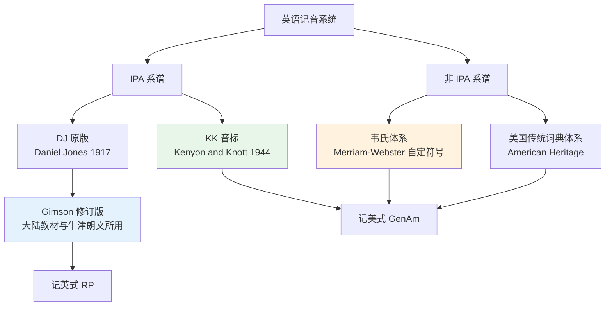
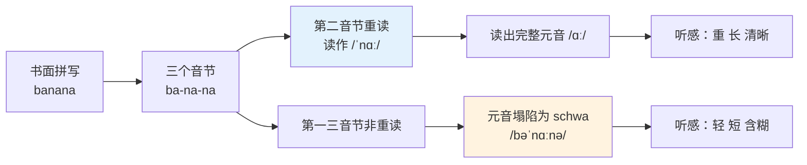
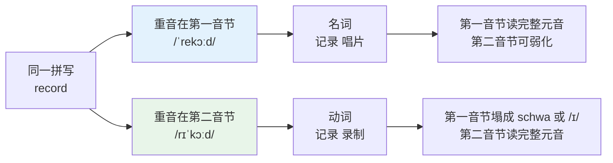
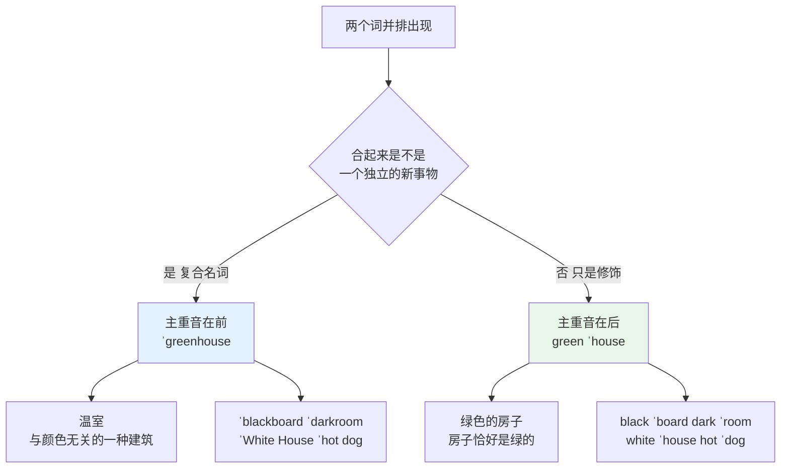
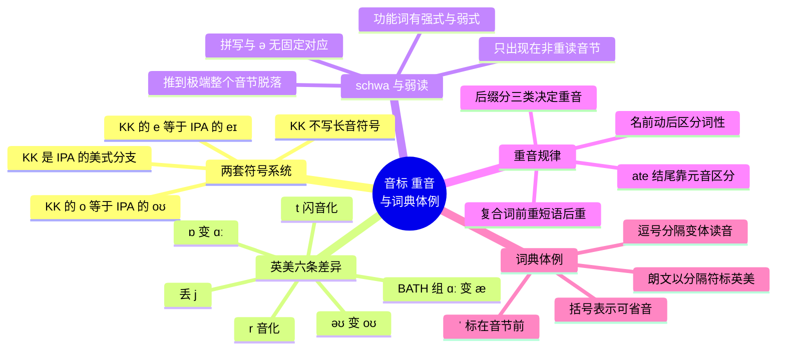

# 音标、词重音与词典读音体例

> [!info] 本篇定位
>
> 上一篇解决「看到字母怎么拼出音」，本篇解决「看到音标怎么还原成音」，两者是反向的一对。
>
> 读完你会拿到四样东西：IPA 与 KK 两套符号系统的完整对照表，schwa 与弱读的运作机制，词重音的可预测规律与 `record` / `present` / `conduct` 这类名动移位词的完整清单，以及打开任何一本主流英汉或英英词典都能正确读出读音标注的能力。
>
> 后面十九章的每一张词表都有英式与美式两列音标。不会读这两列，词表里的读音信息就只能整片跳过。

---

## 1. 本篇导读：音标是词条里信息密度最高的一列

中国学习者对音标普遍有两种误解，都会造成实际损失。

**误解一：音标是给发音好的人看的，我只求认字就够了。** 问题在于，读音是词形的一部分。不知道 `colonel` 读 /ˈkɜːnl/ · /ˈkɜːrnl/（拼写里那个 l 完全不参与，读音反倒冒出一个 r）的人，听力里听到这个词永远不会和拼写对上号；不知道 `record` 的名词与动词重音不同的人，读到 `They record the record` 会卡在第二个 record 上。音标不是发音附属品，它是词条的第二把索引。

**误解二：中国用 IPA，美国用 KK，学一套就行。** 现实是两套符号在中文世界的教材里混着出现：大陆的中学课本和《牛津高阶》《朗文当代》用 IPA（准确说是 Gimson 修订的 DJ 体系），而台湾出版物、部分美语培训教材、《远东英汉》用 KK。查两本不同的词典就会遇到两套写法，认不出对方是同一个音，用 KK 标注的那批词典与教材就等于查不了。

本篇按「符号 → 重音 → 词典体例」的顺序推进：先把符号认全，再把重音的规律讲透，最后回到词典页面上，逐个解释那些印在词条后面的斜杠、括号、竖线和逗号各自代表什么。



上图说明了一件容易被忽略的事：KK 音标本身也是 IPA 的一支，它和 Gimson 体系是同一套国际音标在两种口音上的不同应用，不是两套彼此独立的符号。真正跳出 IPA 体系的是韦氏词典那类美国本土标注法，它们用 `\ˈske-jül\` 这种带反斜杠和变音符的写法，跟 IPA 完全不通用。认清这个族谱，后面的对照工作就只剩十几个符号的差异要记。

---

## 2. 辅音：两套系统几乎完全一致的部分

英语的二十四个辅音在 IPA 和 KK 里写法基本相同，先把这部分清掉，剩下的差异就集中在元音了。

```text
塞音    p  b  t  d  k  ɡ
擦音    f  v  θ  ð  s  z  ʃ  ʒ  h
塞擦音  tʃ dʒ
鼻音    m  n  ŋ
边音    l
近音    r  j  w
```

| 英文 | 英式音标 | 美式音标 | 词性 | 中文 | 搭配与说明 |
| --- | --- | --- | --- | --- | --- |
| **think** | /θɪŋk/ | /θɪŋk/ | v. | 想；认为 | /θ/ 舌尖轻触上齿，不是 /s/ 也不是 /f/ |
| **this** | /ðɪs/ | /ðɪs/ | det./pron. | 这个 | /ð/ 是 /θ/ 的浊音，声带要振动 |
| **measure** | /ˈmeʒə/ | /ˈmeʒər/ | n./v. | 测量；措施 | /ʒ/ 在英语里只出现在词中和词尾 |
| **vision** | /ˈvɪʒn/ | /ˈvɪʒn/ | n. | 视力；愿景 | -sion 前是元音时读 /ʒn/ |
| **nation** | /ˈneɪʃn/ | /ˈneɪʃn/ | n. | 国家 | -tion 固定读 /ʃn/，不读 /tɪˈɒn/ |
| **judge** | /dʒʌdʒ/ | /dʒʌdʒ/ | n./v. | 法官；判断 | 首尾同为 /dʒ/ |
| **church** | /tʃɜːtʃ/ | /tʃɜːrtʃ/ | n. | 教堂 | 首尾同为 /tʃ/ |
| **sing** | /sɪŋ/ | /sɪŋ/ | v. | 唱 | 词尾 /ŋ/ 后不再读出 /ɡ/ |
| **finger** | /ˈfɪŋɡə/ | /ˈfɪŋɡər/ | n. | 手指 | 这里 /ŋ/ 后确实有 /ɡ/，与 singer 对比 |
| **singer** | /ˈsɪŋə/ | /ˈsɪŋər/ | n. | 歌手 | 派生词不补 /ɡ/，是 sing 加 -er |
| **very** | /ˈveri/ | /ˈveri/ | adv. | 非常 | /v/ 上齿咬下唇，区别于 /w/ |
| **wet** | /wet/ | /wet/ | adj. | 湿的 | /w/ 双唇拢圆，与 vet /vet/ 成最小对立 |
| **light** | /laɪt/ | /laɪt/ | n./adj. | 光；轻的 | 词首 /l/ 舌尖抵上齿龈 |
| **night** | /naɪt/ | /naɪt/ | n. | 夜晚 | 与 light 只差首辅音，是 l/n 混淆的检测对 |
| **pleasure** | /ˈpleʒə/ | /ˈpleʒər/ | n. | 愉快 | /pl/ 连读，不插入元音 |
| **street** | /striːt/ | /striːt/ | n. | 街道 | 三辅音连缀 /str/，中间不加音 |
| **texts** | /teksts/ | /teksts/ | n. | 文本（复数） | 四辅音连缀 /ksts/，英语里最难的尾串之一 |
| **asked** | /ɑːskt/ | /æskt/ | v. | 问（过去式） | -ed 读 /t/，全词一个音节 |

> [!warning] 辅音里唯一需要留意的符号差异
>
> IPA 的 /ɡ/ 是单层眼的国际音标 g（U+0261），KK 与多数美国词典直接用键盘上的 g。两者是同一个音，不构成区别。
>
> KK 音标里 /r/ 有时写作 /ɹ/，也有教材沿用 /r/。同样不构成区别——英语里根本没有西班牙语那种颤音 /r/，写哪个符号都指向同一个卷舌近音。

---

## 3. 元音：IPA 与 KK 的核心对照表

元音是两套系统真正分道扬镳的地方。差异集中在三点：长音符号、e 类符号、r 化元音。

| 关键词 | IPA 英式（Gimson） | IPA 美式 | KK 美式 | 例词 | 说明 |
| --- | --- | --- | --- | --- | --- |
| FLEECE | /iː/ | /iː/ | /i/ | see | KK 不用长音符号 ː |
| KIT | /ɪ/ | /ɪ/ | /ɪ/ | sit | 三套一致 |
| DRESS | /e/ | /e/ | /ɛ/ | bed | KK 用 /ɛ/，IPA 英式用 /e/ |
| TRAP | /æ/ | /æ/ | /æ/ | cat | 三套一致 |
| PALM | /ɑː/ | /ɑː/ | /ɑ/ | father | KK 去掉 ː |
| LOT | /ɒ/ | /ɑː/ | /ɑ/ | hot | 英式独有圆唇 /ɒ/，美式并入 /ɑ/ |
| THOUGHT | /ɔː/ | /ɔː/ | /ɔ/ | law | KK 去掉 ː |
| FOOT | /ʊ/ | /ʊ/ | /ʊ/ | put | 三套一致 |
| GOOSE | /uː/ | /uː/ | /u/ | too | KK 去掉 ː |
| STRUT | /ʌ/ | /ʌ/ | /ʌ/ | cup | 三套一致 |
| NURSE | /ɜː/ | /ɜːr/ | /ɝ/ | bird | KK 用带钩的 /ɝ/ 表重读 r 化 |
| lettER | /ə/ | /ər/ | /ɚ/ | letter | KK 用 /ɚ/ 表非重读 r 化 |
| commA | /ə/ | /ə/ | /ə/ | sofa | 词尾无 r 时三套一致 |
| FACE | /eɪ/ | /eɪ/ | /e/ | name | KK 用单符号 /e/，最易误读 |
| GOAT | /əʊ/ | /oʊ/ | /o/ | go | 三套写法各不相同 |
| PRICE | /aɪ/ | /aɪ/ | /aɪ/ | my | 三套一致 |
| MOUTH | /aʊ/ | /aʊ/ | /aʊ/ | now | 三套一致 |
| CHOICE | /ɔɪ/ | /ɔɪ/ | /ɔɪ/ | boy | 三套一致 |
| NEAR | /ɪə/ | /ɪr/ | /ɪr/ | here | 英式是双元音，美式是元音加 r |
| SQUARE | /eə/ | /er/ | /ɛr/ | there | 同上 |
| CURE | /ʊə/ | /ʊr/ | /ʊr/ | tour | 同上 |
| START | /ɑː/ | /ɑːr/ | /ɑr/ | car | 英式无 r，美式有 r |
| NORTH | /ɔː/ | /ɔːr/ | /ɔr/ | for | 同上 |

> [!warning] KK 音标里最坑人的三个符号
>
> - KK 的 **/e/ 不是 IPA 的 /e/**。KK 写 `name` 为 /nem/，读的是 IPA 的 /neɪm/；IPA 英式的 /e/ 指的是 `bed` 里那个音，KK 写作 /ɛ/。
> - KK 的 **/o/ 对应 IPA 的 /oʊ/**。KK 写 `go` 为 /ɡo/，不是短促的单元音。
> - KK **不用长音符号 ː**。看到 KK 的 /i/ /u/ /ɔ/ /ɑ/ 要自动补上长度，它们对应 IPA 的 /iː/ /uː/ /ɔː/ /ɑː/。
>
> 拿一本 KK 标注的教材时，把这三条写在扉页上，能省掉半年的误读。

把同一个词在四套体系下的写法并排放出来，能消除一个常见焦虑：写法不同不代表读法不同。

| 词 | IPA 英式 | IPA 美式 | KK | 韦氏体系 |
| --- | --- | --- | --- | --- |
| name | /neɪm/ | /neɪm/ | /nem/ | ˈnām |
| go | /ɡəʊ/ | /ɡoʊ/ | /ɡo/ | ˈgō |
| bed | /bed/ | /bed/ | /bɛd/ | ˈbed |
| see | /siː/ | /siː/ | /si/ | ˈsē |
| bird | /bɜːd/ | /bɜːrd/ | /bɝd/ | ˈbərd |

`name` 在四套系统里读的是同一个音，差别只在编者选了哪个符号来记它。真正需要区分的是英美读音差异（下一节），那才是发音本身的不同。

---

## 4. 英美读音的六条系统性差异

本教程每张词表都分列英式与美式音标。绝大多数词的两列内容可以用六条规则互相推导，把规则记住，就不必逐词硬背两套。

### 4.1 差异一：r 音化（rhoticity）

美式在所有位置读出字母 r，英式只在 r 后面紧跟元音时才读。这是两种口音之间最大的一条分界。

| 英文 | 英式音标 | 美式音标 | 词性 | 中文 | 搭配与说明 |
| --- | --- | --- | --- | --- | --- |
| **car** | /kɑː/ | /kɑːr/ | n. | 汽车 | 词尾 r，英式完全不读 |
| **park** | /pɑːk/ | /pɑːrk/ | n./v. | 公园；停车 | r 在辅音前，英式不读 |
| **bird** | /bɜːd/ | /bɜːrd/ | n. | 鸟 | 重读 r 化元音，KK 写 /bɝd/ |
| **work** | /wɜːk/ | /wɜːrk/ | n./v. | 工作 | 同上 |
| **turn** | /tɜːn/ | /tɜːrn/ | v./n. | 转；轮次 | 同上 |
| **teacher** | /ˈtiːtʃə/ | /ˈtiːtʃər/ | n. | 教师 | 非重读 r 化，KK 写 /ˈtitʃɚ/ |
| **computer** | /kəmˈpjuːtə/ | /kəmˈpjuːtər/ | n. | 计算机 | 同上，第二音节重读 |
| **server** | /ˈsɜːvə/ | /ˈsɜːrvər/ | n. | 服务器 | 一个词里两处 r 差异 |
| **here** | /hɪə/ | /hɪr/ | adv. | 这里 | 英式是双元音 /ɪə/ |
| **there** | /ðeə/ | /ðer/ | adv. | 那里 | 英式是双元音 /eə/ |
| **sure** | /ʃʊə/ | /ʃʊr/ | adj. | 确定的 | 美式也常读 /ʃɜːr/ |
| **very** | /ˈveri/ | /ˈveri/ | adv. | 非常 | r 后有元音，两式都读 |

最后一行是关键对照：`very` 里的 r 后面跟着元音 /i/，所以英式也读出来。判据不是「有没有字母 r」，而是「r 后面是不是元音」。

### 4.2 差异二：LOT 元音 /ɒ/ 变 /ɑː/

英式的圆唇短音 /ɒ/ 在美式里合并进不圆唇的 /ɑː/。

| 英文 | 英式音标 | 美式音标 | 词性 | 中文 | 搭配与说明 |
| --- | --- | --- | --- | --- | --- |
| **hot** | /hɒt/ | /hɑːt/ | adj. | 热的 | 最典型的一组 |
| **stop** | /stɒp/ | /stɑːp/ | v./n. | 停止 | — |
| **job** | /dʒɒb/ | /dʒɑːb/ | n. | 工作 | — |
| **lock** | /lɒk/ | /lɑːk/ | n./v. | 锁 | 并发编程里的高频词 |
| **model** | /ˈmɒdl/ | /ˈmɑːdl/ | n. | 模型 | — |
| **problem** | /ˈprɒbləm/ | /ˈprɑːbləm/ | n. | 问题 | — |
| **common** | /ˈkɒmən/ | /ˈkɑːmən/ | adj. | 常见的 | — |
| **object** | /ˈɒbdʒɪkt/ | /ˈɑːbdʒekt/ | n. | 对象；物体 | 动词读音见第 9 节 |
| **document** | /ˈdɒkjumənt/ | /ˈdɑːkjumənt/ | n. | 文档 | — |
| **dog** | /dɒɡ/ | /dɔːɡ/ | n. | 狗 | 例外：美式并入 /ɔː/ 而非 /ɑː/ |

### 4.3 差异三：BATH 组 /ɑː/ 变 /æ/

一批词在英式里读长音 /ɑː/，在美式里读短音 /æ/。这批词的成员是历史遗留的，不完全可推导，但集中在 -ss、-st、-sk、-th、-nce、-nd 之前。

| 英文 | 英式音标 | 美式音标 | 词性 | 中文 | 搭配与说明 |
| --- | --- | --- | --- | --- | --- |
| **ask** | /ɑːsk/ | /æsk/ | v. | 问 | — |
| **bath** | /bɑːθ/ | /bæθ/ | n. | 洗澡 | 动词 bathe 两式都读 /beɪð/ |
| **class** | /klɑːs/ | /klæs/ | n. | 班级；类 | 面向对象里的高频词 |
| **pass** | /pɑːs/ | /pæs/ | v./n. | 通过 | 派生 password 不变 |
| **past** | /pɑːst/ | /pæst/ | adj./n. | 过去的 | — |
| **fast** | /fɑːst/ | /fæst/ | adj./adv. | 快的 | — |
| **after** | /ˈɑːftə/ | /ˈæftər/ | prep. | 在……之后 | 两条差异叠加 |
| **example** | /ɪɡˈzɑːmpl/ | /ɪɡˈzæmpl/ | n. | 例子 | — |
| **dance** | /dɑːns/ | /dæns/ | v./n. | 跳舞 | — |
| **half** | /hɑːf/ | /hæf/ | n./det. | 一半 | l 不发音 |
| **can't** | /kɑːnt/ | /kænt/ | v. | 不能 | 英美听感差别极大 |
| **command** | /kəˈmɑːnd/ | /kəˈmænd/ | n./v. | 命令 | 终端里的高频词 |

> [!warning] 这批词不能随意扩大
>
> 同样是 -ass 结尾，`pass` 英式读 /ɑː/，但 `mass` 英式读 /mæs/，不读 /mɑːs/。同样是 -ath 结尾，`bath` 读 /ɑː/，`math` 读 /mæθ/。
>
> 这一组只能按词记，规则只提供缩小范围的作用。遇到不确定的词，查词典比推导可靠。

### 4.4 差异四：yod-dropping，/juː/ 变 /uː/

在 t、d、n、s、l 之后，美式常丢掉 /j/。

| 英文 | 英式音标 | 美式音标 | 词性 | 中文 | 搭配与说明 |
| --- | --- | --- | --- | --- | --- |
| **new** | /njuː/ | /nuː/ | adj. | 新的 | n 后丢 j |
| **news** | /njuːz/ | /nuːz/ | n. | 新闻 | 不可数 |
| **Tuesday** | /ˈtjuːzdeɪ/ | /ˈtuːzdeɪ/ | n. | 星期二 | 也读 /-di/ |
| **student** | /ˈstjuːdnt/ | /ˈstuːdnt/ | n. | 学生 | — |
| **duty** | /ˈdjuːti/ | /ˈduːti/ | n. | 职责 | 美式 t 还会闪音化 |
| **tune** | /tjuːn/ | /tuːn/ | n./v. | 曲调；调优 | 性能调优常用 |
| **produce** | /prəˈdjuːs/ | /prəˈduːs/ | v. | 生产 | 名词读 /ˈprɒdjuːs/ · /ˈproʊduːs/ |
| **nuclear** | /ˈnjuːkliə/ | /ˈnuːkliər/ | adj. | 核的 | 两条差异叠加 |
| **suit** | /suːt/ | /suːt/ | n. | 套装 | s 后英式今天也多不读 j |
| **music** | /ˈmjuːzɪk/ | /ˈmjuːzɪk/ | n. | 音乐 | m 后 j 保留，不属这一组 |
| **cute** | /kjuːt/ | /kjuːt/ | adj. | 可爱的 | k 后 j 保留 |

最后两行说明了这条规则的边界：丢 j 只发生在齿龈辅音之后，`music`、`cute`、`few`、`view` 的 /j/ 在两种口音里都保留。

### 4.5 差异五：GOAT 元音 /əʊ/ 变 /oʊ/

| 英文 | 英式音标 | 美式音标 | 词性 | 中文 | 搭配与说明 |
| --- | --- | --- | --- | --- | --- |
| **go** | /ɡəʊ/ | /ɡoʊ/ | v. | 去 | — |
| **home** | /həʊm/ | /hoʊm/ | n. | 家 | — |
| **know** | /nəʊ/ | /noʊ/ | v. | 知道 | k 不发音 |
| **open** | /ˈəʊpən/ | /ˈoʊpən/ | v./adj. | 打开 | — |
| **most** | /məʊst/ | /moʊst/ | det. | 大多数 | — |
| **code** | /kəʊd/ | /koʊd/ | n./v. | 代码 | — |
| **local** | /ˈləʊkl/ | /ˈloʊkl/ | adj. | 本地的 | — |
| **protocol** | /ˈprəʊtəkɒl/ | /ˈproʊtəkɔːl/ | n. | 协议 | 三条差异叠加 |

### 4.6 差异六：t 的闪音化与其他零散差异

美式在两个元音之间、且后一个音节非重读时，/t/ 常读成近似 /d/ 的快速闪音。词典一般仍写 /t/，但听感明显不同。

| 英文 | 英式音标 | 美式音标 | 词性 | 中文 | 搭配与说明 |
| --- | --- | --- | --- | --- | --- |
| **water** | /ˈwɔːtə/ | /ˈwɔːtər/ | n. | 水 | 美式 t 闪音，听感近 /ˈwɔːdər/ |
| **better** | /ˈbetə/ | /ˈbetər/ | adj. | 更好的 | 同上 |
| **letter** | /ˈletə/ | /ˈletər/ | n. | 信；字母 | 同上 |
| **data** | /ˈdeɪtə/ | /ˈdeɪtə/ | n. | 数据 | 美式也读 /ˈdætə/ |
| **schedule** | /ˈʃedjuːl/ | /ˈskedʒuːl/ | n./v. | 日程；安排 | 英美读音差异最大的常用词之一 |
| **advertisement** | /ədˈvɜːtɪsmənt/ | /ˌædvərˈtaɪzmənt/ | n. | 广告 | 重音位置整体不同 |
| **either** | /ˈaɪðə/ | /ˈiːðər/ | det./adv. | 两者之一 | 首元音完全不同 |
| **neither** | /ˈnaɪðə/ | /ˈniːðər/ | det./adv. | 两者都不 | 同上 |
| **privacy** | /ˈprɪvəsi/ | /ˈpraɪvəsi/ | n. | 隐私 | 首音节长短不同 |
| **vitamin** | /ˈvɪtəmɪn/ | /ˈvaɪtəmɪn/ | n. | 维生素 | 同上 |
| **leisure** | /ˈleʒə/ | /ˈliːʒər/ | n. | 闲暇 | 首元音不同 |
| **herb** | /hɜːb/ | /ɜːrb/ | n. | 草本；香草 | 美式 h 不发音 |
| **clerk** | /klɑːk/ | /klɜːrk/ | n. | 职员 | 元音完全不同 |
| **route** | /ruːt/ | /ruːt/ | n. | 路线 | 美式网络语境也读 /raʊt/ |
| **router** | /ˈruːtə/ | /ˈraʊtər/ | n. | 路由器 | 美式 IT 圈多读 /ˈraʊtər/ |
| **laboratory** | /ləˈbɒrətri/ | /ˈlæbrətɔːri/ | n. | 实验室 | 重音位置不同 |
| **mobile** | /ˈməʊbaɪl/ | /ˈmoʊbl/ | adj./n. | 移动的；手机 | 词尾 -ile 美式弱化 |
| **fragile** | /ˈfrædʒaɪl/ | /ˈfrædʒl/ | adj. | 易碎的 | 同一模式 |
| **missile** | /ˈmɪsaɪl/ | /ˈmɪsl/ | n. | 导弹 | 同一模式 |
| **z** | /zed/ | /ziː/ | n. | 字母 Z | 拼读字母时的经典分歧 |

> [!tip] 只需要选定一种口音
>
> 六条差异不是要你同时掌握两套发音。选一种作为产出口音，另一种停在「听得懂、看得懂音标」即可。
>
> 对以读技术文档和听技术分享为主的读者，美式的实用性略高，因为主流技术会议、播客、视频教程的口音以美式为主。但英式材料（BBC、《经济学人》音频）同样大量存在，两边的音标都要认得。

---

## 5. schwa：英语里出现最多的那个元音

### 5.1 schwa 是什么

/ə/ 这个符号叫 schwa，中文常译作「中央元音」。它的发音要点是**什么都不做**：舌头放在最放松的中间位置，嘴唇不圆不扁，气流轻轻带过。

schwa 有一条铁律：**它只出现在非重读音节里**。任何一个音节，只要被读成 /ə/，它就一定不是重读音节。反过来，重读音节里永远不会出现 /ə/。

这条规律是英语节奏的基础。英语是重音计时语言，重读音节之间的时间间隔大致均等，中间的非重读音节被压缩挤扁，元音失去原本的音色，塌陷成 /ə/。



上图拆解了 `banana` 这个标准示例：拼写上三个 a 完全相同，读音上却只有中间那个保留了完整音色，前后两个都塌成了 schwa。图里标的 /bəˈnɑːnə/ 是英式，美式读 /bəˈnænə/，中间那个元音落在 BATH 组的差异上，但两式的弱读格局完全一样——头尾两个 a 都是 schwa。中文母语者的默认读法是三个 a 一样重、一样长，这正是「中式英语听起来像在念字」的主要来源：不是单个音素读错，而是没有做出重读与非重读的对比。

### 5.2 哪些字母会塌成 schwa

答案是：**所有元音字母都可以**。schwa 与拼写没有固定对应，只与重音位置有关。

| 英文 | 英式音标 | 美式音标 | 词性 | 中文 | 搭配与说明 |
| --- | --- | --- | --- | --- | --- |
| **about** | /əˈbaʊt/ | /əˈbaʊt/ | prep. | 关于 | a 塌成 /ə/ |
| **again** | /əˈɡen/ | /əˈɡen/ | adv. | 再一次 | 英式也读 /əˈɡeɪn/ |
| **police** | /pəˈliːs/ | /pəˈliːs/ | n. | 警察 | o 塌成 /ə/ |
| **machine** | /məˈʃiːn/ | /məˈʃiːn/ | n. | 机器 | a 塌成 /ə/ |
| **support** | /səˈpɔːt/ | /səˈpɔːrt/ | v./n. | 支持 | u 塌成 /ə/ |
| **suppose** | /səˈpəʊz/ | /səˈpoʊz/ | v. | 假设 | 同上 |
| **correct** | /kəˈrekt/ | /kəˈrekt/ | v./adj. | 正确的；纠正 | o 塌成 /ə/ |
| **connect** | /kəˈnekt/ | /kəˈnekt/ | v. | 连接 | 同上 |
| **compare** | /kəmˈpeə/ | /kəmˈper/ | v. | 比较 | 同上 |
| **forget** | /fəˈɡet/ | /fərˈɡet/ | v. | 忘记 | 美式带 r 色彩 |
| **afford** | /əˈfɔːd/ | /əˈfɔːrd/ | v. | 负担得起 | — |
| **occur** | /əˈkɜː/ | /əˈkɜːr/ | v. | 发生 | 双写 r 才是 occurred |
| **develop** | /dɪˈveləp/ | /dɪˈveləp/ | v. | 开发 | 第三音节 o 塌成 /ə/ |
| **method** | /ˈmeθəd/ | /ˈmeθəd/ | n. | 方法 | 第二音节 o 塌成 /ə/ |
| **system** | /ˈsɪstəm/ | /ˈsɪstəm/ | n. | 系统 | 第二音节 e 塌成 /ə/ |
| **problem** | /ˈprɒbləm/ | /ˈprɑːbləm/ | n. | 问题 | 同上 |
| **item** | /ˈaɪtəm/ | /ˈaɪtəm/ | n. | 项目 | 同上 |
| **modern** | /ˈmɒdn/ | /ˈmɑːdərn/ | adj. | 现代的 | 英式连 /ə/ 都省了 |
| **doctor** | /ˈdɒktə/ | /ˈdɑːktər/ | n. | 医生 | -or 塌成 /ə/ 或 /ər/ |
| **famous** | /ˈfeɪməs/ | /ˈfeɪməs/ | adj. | 著名的 | -ous 固定读 /əs/ |

> [!example] 拼写相同、读音不同的一组反例
>
> - **photograph** /ˈfəʊtəɡrɑːf/ · /ˈfoʊtəɡræf/
>   - 照片。重音在第一音节，第二音节 o 塌成 /ə/。
> - **photography** /fəˈtɒɡrəfi/ · /fəˈtɑːɡrəfi/
>   - 摄影。重音移到第二音节，于是第一音节的 o 塌成 /ə/，第二音节的 o 恢复完整音色。
> - **photographic** /ˌfəʊtəˈɡræfɪk/ · /ˌfoʊtəˈɡræfɪk/
>   - 摄影的。重音移到第三音节，前两个音节都弱化。
>
> 同一个词根，三个派生词的元音音色随重音位置整体重排。这是英语读音里最值得内化的一条机制。

### 5.3 schwa 的极端形式：整个音节脱落

弱读推到极端，schwa 会连同它所在的音节一起消失。这在英语里是常态而不是懒音，词典也照实标出。

| 英文 | 英式音标 | 美式音标 | 词性 | 中文 | 搭配与说明 |
| --- | --- | --- | --- | --- | --- |
| **comfortable** | /ˈkʌmftəbl/ | /ˈkʌmfərtəbl/ | adj. | 舒适的 | 英式常读三音节 |
| **vegetable** | /ˈvedʒtəbl/ | /ˈvedʒtəbl/ | n. | 蔬菜 | 拼四音节读三音节 |
| **chocolate** | /ˈtʃɒklət/ | /ˈtʃɑːklət/ | n. | 巧克力 | 中间那个 o 完全消失 |
| **interesting** | /ˈɪntrəstɪŋ/ | /ˈɪntrəstɪŋ/ | adj. | 有趣的 | 拼四音节读三音节 |
| **different** | /ˈdɪfrənt/ | /ˈdɪfrənt/ | adj. | 不同的 | 同上 |
| **every** | /ˈevri/ | /ˈevri/ | det. | 每个 | 拼三音节读两音节 |
| **family** | /ˈfæməli/ | /ˈfæməli/ | n. | 家庭 | 也常读两音节 /ˈfæmli/ |
| **camera** | /ˈkæmrə/ | /ˈkæmrə/ | n. | 相机 | 同上 |
| **business** | /ˈbɪznəs/ | /ˈbɪznəs/ | n. | 生意 | busy 的 y 完全消失 |
| **temperature** | /ˈtemprətʃə/ | /ˈtemprətʃʊr/ | n. | 温度 | 拼四音节读三音节 |
| **literature** | /ˈlɪtrətʃə/ | /ˈlɪtərətʃʊr/ | n. | 文学 | 英式脱落更彻底 |
| **restaurant** | /ˈrestrɒnt/ | /ˈrestərɑːnt/ | n. | 餐馆 | 法语借词，两式差异大 |
| **medicine** | /ˈmedsn/ | /ˈmedɪsn/ | n. | 药 | 英式两音节 |
| **generally** | /ˈdʒenrəli/ | /ˈdʒenrəli/ | adv. | 通常 | 拼四音节读三音节 |
| **separate** | /ˈseprət/ | /ˈseprət/ | adj. | 分开的 | 形容词读三音节，动词不同，见第 9 节 |

> [!warning] 音节数对不上才是常态
>
> 中文母语者读英语时倾向于「拼写有几个元音字母就读几个音节」，于是把 `comfortable` 读成四个饱满音节，`chocolate` 读成三个。
>
> 判断音节数的唯一依据是音标，不是拼写。看到音标里没有对应的元音符号，那个音节就是真的不存在。词表里的音标列必须逐个数音节核对，这是使用本教程词表的正确方式。

---

## 6. 弱读与强读：功能词的两副面孔

介词、连词、助动词、代词、冠词这些功能词绝大多数有两套读音。词典把完整那套叫强式（strong form），弱化那套叫弱式（weak form）。日常语流里出现的绝大多数是弱式。

| 英文 | 强式音标 | 弱式音标 | 词性 | 中文 | 什么时候用强式 |
| --- | --- | --- | --- | --- | --- |
| **a** | /eɪ/ | /ə/ | art. | 一个 | 单独念字母、刻意强调 |
| **the** | /ðiː/ | /ðə/ | art. | 这个 | 后接元音时读 /ði/；强调时读 /ðiː/ |
| **and** | /ænd/ | /ənd/ /ən/ | conj. | 和 | 对比两项时 |
| **but** | /bʌt/ | /bət/ | conj. | 但是 | 句末孤立出现时 |
| **that** | /ðæt/ | /ðət/ | conj./pron. | 那个；引导词 | 作指示代词时用强式 |
| **than** | /ðæn/ | /ðən/ | conj. | 比 | 几乎总是弱式 |
| **to** | /tuː/ | /tə/ | prep. | 到 | 后接元音读 /tu/；句末读强式 |
| **of** | /ɒv/ | /əv/ /v/ | prep. | 的 | 句末或强调时 |
| **for** | /fɔː/ | /fə/ /fər/ | prep. | 为了 | 句末或强调时 |
| **from** | /frɒm/ | /frəm/ | prep. | 从 | 与 to 对比时 |
| **at** | /æt/ | /ət/ | prep. | 在 | 强调地点时 |
| **as** | /æz/ | /əz/ | conj./prep. | 作为 | 极少用强式 |
| **can** | /kæn/ | /kən/ | modal | 能 | 否定 can't 永远是强式 |
| **was** | /wɒz/ | /wəz/ | v. | 是（过去） | 否定或强调时 |
| **were** | /wɜː/ | /wə/ /wər/ | v. | 是（过去复数） | 同上 |
| **are** | /ɑː/ | /ə/ /ər/ | v. | 是 | 句末或强调时 |
| **have** | /hæv/ | /həv/ /əv/ | v./aux. | 有；完成体助动词 | 作实义动词时用强式 |
| **has** | /hæz/ | /həz/ /əz/ | v./aux. | 同上（三单） | 同上 |
| **some** | /sʌm/ | /səm/ | det. | 一些 | 表「某个」时用强式 |
| **you** | /juː/ | /jə/ | pron. | 你 | 强调对方时 |
| **your** | /jɔː/ | /jə/ /jər/ | det. | 你的 | 对比所有者时 |
| **his** | /hɪz/ | /ɪz/ | det./pron. | 他的 | 句首或强调时 |
| **her** | /hɜː/ | /ə/ /ər/ | det./pron. | 她的 | 句首或强调时 |
| **them** | /ðem/ | /ðəm/ /əm/ | pron. | 他们（宾格） | 强调时 |

> [!example] 同一个句子里 to 的两种读法
>
> - I want **to** /tə/ go **to** /tə/ the store.
>   - 我想去商店。两个 to 都弱读，几乎听不出元音。
> - Where are you going **to** /tuː/?
>   - 你要去哪？句末的 to 必须用强式。
>
> - I gave the book **to** /tə/ him, not from him.
>   - 我把书给了他，不是从他那儿拿的。
> - The book was **for** /fɔː/ her, not **from** /frɒm/ her.
>   - 这书是给她的，不是她给的。刻意对比两个介词时两个都用强式。

> [!warning] 弱读不是发音偷懒
>
> 中文母语者容易把弱读理解成「说快了含糊掉」，因此在正式场合刻意逐词读强式，结果是每个词都重、都长，听起来反而不自然，也不易被理解——因为英语母语者是靠重音落点来切分意群的，全部重读等于取消了这条线索。
>
> 正确的练法：拿一句话，先标出实义词（名词、动词、形容词、副词、疑问词），只重读这些，其余全部弱化。这是英语节奏训练的第一步。

---

## 7. 词重音：ˈ 和 ˌ 到底怎么读

### 7.1 两个符号的含义与位置

| 符号 | Unicode 名称 | 含义 | 位置规则 |
| --- | --- | --- | --- |
| ˈ | modifier letter vertical line | 主重音 | 放在重读音节**之前**，不是重读元音之前 |
| ˌ | modifier letter low vertical line | 次重音 | 同样放在音节之前 |
| ː | modifier letter triangular colon | 长音 | 放在元音符号**之后** |
| . | full stop | 音节分界 | 放在两个音节之间，剑桥使用，牛津朗文不用 |

三个符号都不是键盘上的普通字符：ˈ 不是英文撇号 `'`，ˌ 不是逗号 `,`，ː 不是冒号 `:`。抄写音标时用错字符，在电子词典里搜不到，也会让别人误读。

> [!warning] 重音符号标在音节前，不是元音前
>
> `computer` 的正确写法是 /kəmˈpjuːtə/，竖线在 p 之前，因为重读的是整个 `pu` 音节。
>
> - ❌ ~~/kəmpˈjuːtə/~~（把符号放到了元音前）
> - ✅ **/kəmˈpjuːtə/**
>
> 读的时候，看到 ˈ 就知道后面那一整块要读得更响、更长、音高更高，直到下一个音节边界。

### 7.2 主重音与次重音的实际差别

一个词只有一个主重音。三音节以上的长词常常还有一个次重音，读得比主重音轻，但比完全弱读的音节重。

| 英文 | 英式音标 | 美式音标 | 词性 | 中文 | 搭配与说明 |
| --- | --- | --- | --- | --- | --- |
| **information** | /ˌɪnfəˈmeɪʃn/ | /ˌɪnfərˈmeɪʃn/ | n. | 信息 | 次重音在第一音节，主重音在第三 |
| **education** | /ˌedʒuˈkeɪʃn/ | /ˌedʒuˈkeɪʃn/ | n. | 教育 | 同一模式 |
| **understand** | /ˌʌndəˈstænd/ | /ˌʌndərˈstænd/ | v. | 理解 | 同一模式 |
| **engineer** | /ˌendʒɪˈnɪə/ | /ˌendʒɪˈnɪr/ | n. | 工程师 | -eer 自带主重音 |
| **guarantee** | /ˌɡærənˈtiː/ | /ˌɡærənˈtiː/ | n./v. | 保证 | -ee 自带主重音 |
| **employee** | /ɪmˌplɔɪˈiː/ | /ɪmˈplɔɪiː/ | n. | 雇员 | 英式保留 -ee 后重，两式今天也都常读 /ɪmˈplɔɪiː/ |
| **international** | /ˌɪntəˈnæʃnəl/ | /ˌɪntərˈnæʃnəl/ | adj. | 国际的 | — |
| **representative** | /ˌreprɪˈzentətɪv/ | /ˌreprɪˈzentətɪv/ | n./adj. | 代表 | 五音节，只有一主一次 |
| **characteristic** | /ˌkærəktəˈrɪstɪk/ | /ˌkærəktəˈrɪstɪk/ | n./adj. | 特征 | — |
| **configuration** | /kənˌfɪɡəˈreɪʃn/ | /kənˌfɪɡjəˈreɪʃn/ | n. | 配置 | 次重音在第三音节 |
| **implementation** | /ˌɪmplɪmenˈteɪʃn/ | /ˌɪmpləmenˈteɪʃn/ | n. | 实现 | — |
| **documentation** | /ˌdɒkjumenˈteɪʃn/ | /ˌdɑːkjəmenˈteɪʃn/ | n. | 文档 | — |
| **authentication** | /ɔːˌθentɪˈkeɪʃn/ | /ɔːˌθentɪˈkeɪʃn/ | n. | 认证 | 次重音在第二音节 |
| **compatibility** | /kəmˌpætəˈbɪləti/ | /kəmˌpætəˈbɪləti/ | n. | 兼容性 | — |

> [!tip] 长词的记音顺序
>
> 记一个五音节长词，先记主重音在第几个音节，再记次重音，最后才补细节元音。重音位置错了，母语者往往完全听不出你在说哪个词；个别元音略有偏差，反而不影响识别。
>
> 例如 `configuration`，只要 ˈreɪ 那一块落对，前面读成 /kənfɪɡə/ 还是 /kɑːnfɪɡjə/ 都能被听懂。

---

## 8. 后缀决定重音：可预测的那部分

英语的重音位置整体上不可推导，但有一批后缀会强制把重音固定在特定位置。记住这批后缀，几千个派生词的重音就不用逐个记。

### 8.1 把重音拉到自己前一个音节的后缀

包括 -tion、-sion、-ic、-ical、-ity、-ian、-ious、-eous、-graphy、-logy、-ify、-itude。

| 英文 | 英式音标 | 美式音标 | 词性 | 中文 | 搭配与说明 |
| --- | --- | --- | --- | --- | --- |
| **decision** | /dɪˈsɪʒn/ | /dɪˈsɪʒn/ | n. | 决定 | 重音在 -sion 前 |
| **conclusion** | /kənˈkluːʒn/ | /kənˈkluːʒn/ | n. | 结论 | 同上 |
| **solution** | /səˈluːʃn/ | /səˈluːʃn/ | n. | 解决方案 | 同上 |
| **economic** | /ˌiːkəˈnɒmɪk/ | /ˌekəˈnɑːmɪk/ | adj. | 经济的 | 重音在 -ic 前 |
| **specific** | /spəˈsɪfɪk/ | /spəˈsɪfɪk/ | adj. | 具体的 | 同上 |
| **dramatic** | /drəˈmætɪk/ | /drəˈmætɪk/ | adj. | 戏剧性的 | 同上 |
| **logical** | /ˈlɒdʒɪkl/ | /ˈlɑːdʒɪkl/ | adj. | 逻辑的 | -ical 同一规律 |
| **ability** | /əˈbɪləti/ | /əˈbɪləti/ | n. | 能力 | 重音在 -ity 前 |
| **activity** | /ækˈtɪvəti/ | /ækˈtɪvəti/ | n. | 活动 | 同上 |
| **possibility** | /ˌpɒsəˈbɪləti/ | /ˌpɑːsəˈbɪləti/ | n. | 可能性 | 同上，另有次重音 |
| **musician** | /mjuˈzɪʃn/ | /mjuˈzɪʃn/ | n. | 音乐家 | 重音在 -ian 前 |
| **politician** | /ˌpɒləˈtɪʃn/ | /ˌpɑːləˈtɪʃn/ | n. | 政客 | 同上 |
| **ambitious** | /æmˈbɪʃəs/ | /æmˈbɪʃəs/ | adj. | 有野心的 | 重音在 -ious 前 |
| **courageous** | /kəˈreɪdʒəs/ | /kəˈreɪdʒəs/ | adj. | 勇敢的 | -eous 同一规律 |
| **geography** | /dʒiˈɒɡrəfi/ | /dʒiˈɑːɡrəfi/ | n. | 地理 | 重音在 -graphy 前 |
| **biology** | /baɪˈɒlədʒi/ | /baɪˈɑːlədʒi/ | n. | 生物学 | -logy 同一规律 |
| **psychology** | /saɪˈkɒlədʒi/ | /saɪˈkɑːlədʒi/ | n. | 心理学 | p 不发音 |
| **identify** | /aɪˈdentɪfaɪ/ | /aɪˈdentɪfaɪ/ | v. | 识别 | -ify 同一规律 |

### 8.2 自带主重音的后缀

包括 -ee、-eer、-ese、-ette、-esque、-oon。这批后缀本身就是重音落点。

| 英文 | 英式音标 | 美式音标 | 词性 | 中文 | 搭配与说明 |
| --- | --- | --- | --- | --- | --- |
| **trainee** | /ˌtreɪˈniː/ | /ˌtreɪˈniː/ | n. | 实习生 | 与 trainer 重音相反 |
| **refugee** | /ˌrefjuˈdʒiː/ | /ˌrefjuˈdʒiː/ | n. | 难民 | — |
| **volunteer** | /ˌvɒlənˈtɪə/ | /ˌvɑːlənˈtɪr/ | n./v. | 志愿者 | — |
| **pioneer** | /ˌpaɪəˈnɪə/ | /ˌpaɪəˈnɪr/ | n. | 先驱 | — |
| **Chinese** | /ˌtʃaɪˈniːz/ | /ˌtʃaɪˈniːz/ | n./adj. | 中文；中国的 | — |
| **Japanese** | /ˌdʒæpəˈniːz/ | /ˌdʒæpəˈniːz/ | n./adj. | 日语；日本的 | — |
| **cigarette** | /ˌsɪɡəˈret/ | /ˈsɪɡəret/ | n. | 香烟 | 美式主重音前移 |
| **cassette** | /kəˈset/ | /kəˈset/ | n. | 盒式磁带 | — |
| **picturesque** | /ˌpɪktʃəˈresk/ | /ˌpɪktʃəˈresk/ | adj. | 风景如画的 | — |
| **balloon** | /bəˈluːn/ | /bəˈluːn/ | n. | 气球 | — |

### 8.3 完全不影响重音的后缀

包括 -ness、-ment、-ly、-er、-or、-ful、-less、-able、-ing、-ed。加上它们，原词重音位置不动。

| 英文 | 英式音标 | 美式音标 | 词性 | 中文 | 搭配与说明 |
| --- | --- | --- | --- | --- | --- |
| **happiness** | /ˈhæpinəs/ | /ˈhæpinəs/ | n. | 幸福 | happy 重音不动 |
| **government** | /ˈɡʌvnmənt/ | /ˈɡʌvərnmənt/ | n. | 政府 | govern 重音不动 |
| **agreement** | /əˈɡriːmənt/ | /əˈɡriːmənt/ | n. | 协议 | agree 重音不动 |
| **development** | /dɪˈveləpmənt/ | /dɪˈveləpmənt/ | n. | 开发 | develop 重音不动 |
| **comfortable** | /ˈkʌmftəbl/ | /ˈkʌmfərtəbl/ | adj. | 舒适的 | comfort 重音不动 |
| **manageable** | /ˈmænɪdʒəbl/ | /ˈmænɪdʒəbl/ | adj. | 可管理的 | manage 重音不动 |
| **beautiful** | /ˈbjuːtɪfl/ | /ˈbjuːtɪfl/ | adj. | 美丽的 | beauty 重音不动 |
| **useless** | /ˈjuːsləs/ | /ˈjuːsləs/ | adj. | 无用的 | 注意 use 名词读 /juːs/ |
| **interesting** | /ˈɪntrəstɪŋ/ | /ˈɪntrəstɪŋ/ | adj. | 有趣的 | interest 重音不动 |
| **developer** | /dɪˈveləpə/ | /dɪˈveləpər/ | n. | 开发者 | develop 重音不动 |

### 8.4 三类后缀速查

| 后缀类别 | 成员 | 重音效果 | 示例 |
| --- | --- | --- | --- |
| 拉重音型 | -tion -sion -ic -ical -ity -ian -ious -graphy -logy -ify | 落在后缀前一音节 | ecoˈnomic · aˈbility · deˈcision |
| 自带重音型 | -ee -eer -ese -ette -esque -oon | 落在后缀本身 | trainˈee · volunˈteer · Chiˈnese |
| 中性型 | -ness -ment -ly -er -or -ful -less -able -ing -ed | 位置不变，沿用原词 | ˈhappiness · aˈgreement · deˈveloper |

实际使用顺序是：先看词尾属不属于这三类里的任何一类，属于就直接套规则；不属于才去查词典。这条路径覆盖派生词里的大部分情形，剩下的原生词（`develop`、`begin`、`answer` 这类）本来就得逐个记。

---

## 9. 重音移位：名前动后

### 9.1 规律本身

英语里有一批双音节词，同一个拼写既是名词也是动词，靠重音位置区分：**名词与形容词重音在前，动词重音在后**。

这条规律不是修辞，是硬性的语法区分手段。读错重音，母语者会按你读出的词性去理解句子，从而听成另一个意思。



上图揭示了这条规律背后的机制：重音一移，非重读音节的元音立刻弱化。`ˈrecord` 的第一音节读饱满的 /e/，`reˈcord` 的第一音节塌成 /ɪ/ 或 /ə/。所以移位词的两个读音差别不只在重音，元音音色也整体重排——这也是为什么听起来像两个完全不同的词。

### 9.2 完整清单

| 英文 | 名词/形容词读音（英·美） | 动词读音（英·美） | 名词义 | 动词义 | 说明 |
| --- | --- | --- | --- | --- | --- |
| **record** | /ˈrekɔːd/ · /ˈrekərd/ | /rɪˈkɔːd/ · /rɪˈkɔːrd/ | 记录；唱片 | 记录；录制 | 最经典的一对 |
| **present** | /ˈpreznt/ · /ˈpreznt/ | /prɪˈzent/ · /prɪˈzent/ | 礼物；现在 | 呈现；介绍 | 形容词也读前重 |
| **conduct** | /ˈkɒndʌkt/ · /ˈkɑːndʌkt/ | /kənˈdʌkt/ · /kənˈdʌkt/ | 行为；举止 | 进行；指挥 | 动词第一音节塌成 /kən/ |
| **object** | /ˈɒbdʒɪkt/ · /ˈɑːbdʒekt/ | /əbˈdʒekt/ · /əbˈdʒekt/ | 物体；对象 | 反对 | 编程语境几乎只用名词 |
| **subject** | /ˈsʌbdʒɪkt/ · /ˈsʌbdʒɪkt/ | /səbˈdʒekt/ · /səbˈdʒekt/ | 主题；科目 | 使遭受 | 形容词 subject to 读前重 |
| **project** | /ˈprɒdʒekt/ · /ˈprɑːdʒekt/ | /prəˈdʒekt/ · /prəˈdʒekt/ | 项目 | 投射；预测 | 程序员最常读错的一个 |
| **contract** | /ˈkɒntrækt/ · /ˈkɑːntrækt/ | /kənˈtrækt/ · /kənˈtrækt/ | 合同 | 收缩；订约 | — |
| **contrast** | /ˈkɒntrɑːst/ · /ˈkɑːntræst/ | /kənˈtrɑːst/ · /kənˈtræst/ | 对比 | 对照 | 名词还叠加 BATH 差异 |
| **conflict** | /ˈkɒnflɪkt/ · /ˈkɑːnflɪkt/ | /kənˈflɪkt/ · /kənˈflɪkt/ | 冲突 | 相冲突 | Git 语境高频 |
| **increase** | /ˈɪŋkriːs/ · /ˈɪŋkriːs/ | /ɪnˈkriːs/ · /ɪnˈkriːs/ | 增长 | 增加 | 名词首音节有 /ŋ/ |
| **decrease** | /ˈdiːkriːs/ · /ˈdiːkriːs/ | /dɪˈkriːs/ · /dɪˈkriːs/ | 减少 | 减少 | — |
| **import** | /ˈɪmpɔːt/ · /ˈɪmpɔːrt/ | /ɪmˈpɔːt/ · /ɪmˈpɔːrt/ | 进口；导入项 | 进口；导入 | 代码里的 import 语句读名词式 |
| **export** | /ˈekspɔːt/ · /ˈekspɔːrt/ | /ɪkˈspɔːt/ · /ɪkˈspɔːrt/ | 出口；导出项 | 出口；导出 | 同上 |
| **transport** | /ˈtrænspɔːt/ · /ˈtrænspɔːrt/ | /trænˈspɔːt/ · /trænˈspɔːrt/ | 运输 | 运输 | 美式名词也读 /ˈtrænspɔːrt/ |
| **transfer** | /ˈtrænsfɜː/ · /ˈtrænsfɜːr/ | /trænsˈfɜː/ · /trænsˈfɜːr/ | 转移；转账 | 转移 | — |
| **permit** | /ˈpɜːmɪt/ · /ˈpɜːrmɪt/ | /pəˈmɪt/ · /pərˈmɪt/ | 许可证 | 允许 | 权限文档里两个都出现 |
| **progress** | /ˈprəʊɡres/ · /ˈprɑːɡres/ | /prəˈɡres/ · /prəˈɡres/ | 进展 | 前进 | 名词英美元音差异大 |
| **protest** | /ˈprəʊtest/ · /ˈproʊtest/ | /prəˈtest/ · /prəˈtest/ | 抗议 | 抗议 | — |
| **rebel** | /ˈrebl/ · /ˈrebl/ | /rɪˈbel/ · /rɪˈbel/ | 叛乱者 | 反叛 | — |
| **refuse** | /ˈrefjuːs/ · /ˈrefjuːs/ | /rɪˈfjuːz/ · /rɪˈfjuːz/ | 垃圾 | 拒绝 | 名词词尾清音，动词浊音 |
| **convict** | /ˈkɒnvɪkt/ · /ˈkɑːnvɪkt/ | /kənˈvɪkt/ · /kənˈvɪkt/ | 囚犯 | 定罪 | — |
| **suspect** | /ˈsʌspekt/ · /ˈsʌspekt/ | /səˈspekt/ · /səˈspekt/ | 嫌疑人 | 怀疑 | — |
| **insult** | /ˈɪnsʌlt/ · /ˈɪnsʌlt/ | /ɪnˈsʌlt/ · /ɪnˈsʌlt/ | 侮辱 | 侮辱 | — |
| **desert** | /ˈdezət/ · /ˈdezərt/ | /dɪˈzɜːt/ · /dɪˈzɜːrt/ | 沙漠 | 抛弃 | 与 dessert /dɪˈzɜːt/ 同音于动词 |
| **content** | /ˈkɒntent/ · /ˈkɑːntent/ | /kənˈtent/ · /kənˈtent/ | 内容 | 使满意 | 后重时是形容词「满足的」 |
| **console** | /ˈkɒnsəʊl/ · /ˈkɑːnsoʊl/ | /kənˈsəʊl/ · /kənˈsoʊl/ | 控制台 | 安慰 | 浏览器控制台读前重 |
| **upset** | /ˈʌpset/ · /ˈʌpset/ | /ʌpˈset/ · /ʌpˈset/ | 意外败局 | 使不安 | 形容词读后重 |
| **perfect** | /ˈpɜːfɪkt/ · /ˈpɜːrfɪkt/ | /pəˈfekt/ · /pərˈfekt/ | （形）完美的 | 使完善 | 动词较少见 |
| **frequent** | /ˈfriːkwənt/ · /ˈfriːkwənt/ | /frɪˈkwent/ · /frɪˈkwent/ | （形）频繁的 | 常去 | 动词偏书面 |
| **digest** | /ˈdaɪdʒest/ · /ˈdaɪdʒest/ | /daɪˈdʒest/ · /daɪˈdʒest/ | 摘要 | 消化 | 哈希摘要读前重 |
| **combat** | /ˈkɒmbæt/ · /ˈkɑːmbæt/ | /kəmˈbæt/ · /kəmˈbæt/ | 战斗 | 对抗 | 美式动词也读前重 |
| **survey** | /ˈsɜːveɪ/ · /ˈsɜːrveɪ/ | /səˈveɪ/ · /sərˈveɪ/ | 调查 | 调查；勘测 | — |
| **rerun** | /ˈriːrʌn/ · /ˈriːrʌn/ | /ˌriːˈrʌn/ · /ˌriːˈrʌn/ | 重播 | 重新运行 | re- 类动词普遍后重 |
| **reject** | /ˈriːdʒekt/ · /ˈriːdʒekt/ | /rɪˈdʒekt/ · /rɪˈdʒekt/ | 次品 | 拒绝 | 名词偏专业 |

> [!example] 同一句里出现两次同拼写词
>
> - They **record** /rɪˈkɔːd/ every **record** /ˈrekɔːd/ in the database.
>   - 他们把每一条记录都录入数据库。
> - We must **present** /prɪˈzent/ the **present** /ˈpreznt/ situation clearly.
>   - 我们必须把当前情况清楚地呈现出来。
> - The **conduct** /ˈkɒndʌkt/ of the team improved after they began to **conduct** /kənˈdʌkt/ weekly reviews.
>   - 团队开始做每周复盘后，行为规范有所改善。
> - Please **export** /ɪkˈspɔːt/ the data and check the **export** /ˈekspɔːt/ file.
>   - 请导出数据并检查导出文件。

### 9.3 另一类移位：-ate 结尾词的名形与动词

`-ate` 结尾的词有一批也区分词性，但机制不同——重音位置不变，变的是后缀元音：**名词与形容词读 /-ət/，动词读 /-eɪt/**。

| 英文 | 名词/形容词读音（英·美） | 动词读音（英·美） | 名词/形容词义 | 动词义 | 说明 |
| --- | --- | --- | --- | --- | --- |
| **separate** | /ˈseprət/ · /ˈseprət/ | /ˈsepəreɪt/ · /ˈsepəreɪt/ | 分开的 | 分开 | 形容词还少一个音节 |
| **estimate** | /ˈestɪmət/ · /ˈestɪmət/ | /ˈestɪmeɪt/ · /ˈestɪmeɪt/ | 估计（名） | 估计 | 项目排期高频词 |
| **graduate** | /ˈɡrædʒuət/ · /ˈɡrædʒuət/ | /ˈɡrædʒueɪt/ · /ˈɡrædʒueɪt/ | 毕业生 | 毕业 | — |
| **duplicate** | /ˈdjuːplɪkət/ · /ˈduːplɪkət/ | /ˈdjuːplɪkeɪt/ · /ˈduːplɪkeɪt/ | 副本；重复的 | 复制 | 还叠加 yod-dropping |
| **delegate** | /ˈdelɪɡət/ · /ˈdelɪɡət/ | /ˈdelɪɡeɪt/ · /ˈdelɪɡeɪt/ | 代表 | 委派 | — |
| **moderate** | /ˈmɒdərət/ · /ˈmɑːdərət/ | /ˈmɒdəreɪt/ · /ˈmɑːdəreɪt/ | 适度的 | 主持；审核 | 内容审核用动词义 |
| **deliberate** | /dɪˈlɪbərət/ · /dɪˈlɪbərət/ | /dɪˈlɪbəreɪt/ · /dɪˈlɪbəreɪt/ | 故意的 | 仔细考虑 | — |
| **associate** | /əˈsəʊsiət/ · /əˈsoʊsiət/ | /əˈsəʊsieɪt/ · /əˈsoʊsieɪt/ | 同事；副职的 | 联系 | — |
| **approximate** | /əˈprɒksɪmət/ · /əˈprɑːksɪmət/ | /əˈprɒksɪmeɪt/ · /əˈprɑːksɪmeɪt/ | 近似的 | 接近 | — |
| **alternate** | /ɔːlˈtɜːnət/ · /ˈɔːltərnət/ | /ˈɔːltəneɪt/ · /ˈɔːltərneɪt/ | 交替的；替补 | 交替 | 这一对重音也移 |
| **advocate** | /ˈædvəkət/ · /ˈædvəkət/ | /ˈædvəkeɪt/ · /ˈædvəkeɪt/ | 拥护者 | 提倡 | — |
| **elaborate** | /ɪˈlæbərət/ · /ɪˈlæbərət/ | /ɪˈlæbəreɪt/ · /ɪˈlæbəreɪt/ | 复杂精细的 | 详述 | — |

### 9.4 还有一类：靠清浊区分的名动对

不涉及重音，但同属「同拼写靠读音区分词性」，一并放在这里。规律是**名词词尾清辅音，动词词尾浊辅音**。

| 英文 | 名词读音（英·美） | 动词读音（英·美） | 名词义 | 动词义 | 说明 |
| --- | --- | --- | --- | --- | --- |
| **use** | /juːs/ · /juːs/ | /juːz/ · /juːz/ | 使用；用途 | 使用 | 派生 useful 读 /ˈjuːsfl/ |
| **house** | /haʊs/ · /haʊs/ | /haʊz/ · /haʊz/ | 房子 | 容纳 | 复数 houses 读 /ˈhaʊzɪz/ |
| **excuse** | /ɪkˈskjuːs/ · /ɪkˈskjuːs/ | /ɪkˈskjuːz/ · /ɪkˈskjuːz/ | 借口 | 原谅 | Excuse me 用动词读法 |
| **abuse** | /əˈbjuːs/ · /əˈbjuːs/ | /əˈbjuːz/ · /əˈbjuːz/ | 滥用；虐待 | 滥用 | — |
| **advice** | /ədˈvaɪs/ · /ədˈvaɪs/ | — | 建议 | — | 动词写作 advise /ədˈvaɪz/ |
| **close** | /kləʊs/ · /kloʊs/ | /kləʊz/ · /kloʊz/ | （形）近的 | 关闭 | 形容词清音，动词浊音 |
| **belief** | /bɪˈliːf/ · /bɪˈliːf/ | — | 信念 | — | 动词写作 believe /bɪˈliːv/ |
| **breath** | /breθ/ · /breθ/ | — | 呼吸（名） | — | 动词写作 breathe /briːð/ |

> [!warning] 拼写有变化的那几对不要混
>
> `advice/advise`、`belief/believe`、`breath/breathe`、`life/live`、`proof/prove` 这几对拼写本身就不同，属于另一类现象，别与 `use`、`house` 这种同拼写异读混在一起记。
>
> - ❌ ~~Can you give me an advise?~~
> - ✅ Can you give me some **advice** /ədˈvaɪs/?

---

## 10. 复合词重音：ˈgreenhouse 与 green ˈhouse

### 10.1 判据

两个词组合在一起时，重音落点回答的是一个语义问题：**这是一个新概念，还是一个被修饰的旧概念**。

- 是新概念（复合名词） → 主重音落在**前一个词**
- 是修饰关系（形容词加名词的普通短语） → 主重音落在**后一个词**



上图给出的是判定流程，而不是词表。实际用起来只需要问自己一句：去掉前一个词，后一个词还是同一类东西吗？温室去掉 green 就不是温室了，所以 `greenhouse` 是复合词，前重；绿房子去掉 green 还是房子，所以 `green house` 是短语，后重。

### 10.2 复合名词，主重音在前

| 英文 | 英式音标 | 美式音标 | 词性 | 中文 | 搭配与说明 |
| --- | --- | --- | --- | --- | --- |
| **greenhouse** | /ˈɡriːnhaʊs/ | /ˈɡriːnhaʊs/ | n. | 温室 | greenhouse gas 温室气体 |
| **blackboard** | /ˈblækbɔːd/ | /ˈblækbɔːrd/ | n. | 黑板 | 对比 a black ˈboard |
| **darkroom** | /ˈdɑːkruːm/ | /ˈdɑːrkruːm/ | n. | 暗房 | 对比 a dark ˈroom |
| **bluebird** | /ˈbluːbɜːd/ | /ˈbluːbɜːrd/ | n. | 蓝鸲 | 一个物种，不是「蓝色的鸟」 |
| **keyboard** | /ˈkiːbɔːd/ | /ˈkiːbɔːrd/ | n. | 键盘 | — |
| **software** | /ˈsɒftweə/ | /ˈsɔːftwer/ | n. | 软件 | 不可数 |
| **database** | /ˈdeɪtəbeɪs/ | /ˈdeɪtəbeɪs/ | n. | 数据库 | — |
| **firewall** | /ˈfaɪəwɔːl/ | /ˈfaɪərwɔːl/ | n. | 防火墙 | — |
| **network** | /ˈnetwɜːk/ | /ˈnetwɜːrk/ | n./v. | 网络 | — |
| **bandwidth** | /ˈbændwɪdθ/ | /ˈbændwɪdθ/ | n. | 带宽 | 词尾 /dθ/ 连缀 |
| **laptop** | /ˈlæptɒp/ | /ˈlæptɑːp/ | n. | 笔记本电脑 | — |
| **smartphone** | /ˈsmɑːtfəʊn/ | /ˈsmɑːrtfoʊn/ | n. | 智能手机 | — |
| **workflow** | /ˈwɜːkfləʊ/ | /ˈwɜːrkfloʊ/ | n. | 工作流 | — |
| **feedback** | /ˈfiːdbæk/ | /ˈfiːdbæk/ | n. | 反馈 | 不可数 |
| **deadline** | /ˈdedlaɪn/ | /ˈdedlaɪn/ | n. | 截止期限 | meet a deadline 赶上期限 |
| **bus stop** | /ˈbʌs ˌstɒp/ | /ˈbʌs ˌstɑːp/ | n. | 公交站 | 分写但仍是复合词 |
| **post office** | /ˈpəʊst ˌɒfɪs/ | /ˈpoʊst ˌɔːfɪs/ | n. | 邮局 | 同上 |
| **credit card** | /ˈkredɪt ˌkɑːd/ | /ˈkredɪt ˌkɑːrd/ | n. | 信用卡 | 同上 |
| **swimming pool** | /ˈswɪmɪŋ ˌpuːl/ | /ˈswɪmɪŋ ˌpuːl/ | n. | 游泳池 | 同上 |
| **washing machine** | /ˈwɒʃɪŋ məˌʃiːn/ | /ˈwɑːʃɪŋ məˌʃiːn/ | n. | 洗衣机 | 次重音落在 machine 的第二音节 |
| **traffic light** | /ˈtræfɪk ˌlaɪt/ | /ˈtræfɪk ˌlaɪt/ | n. | 红绿灯 | 常用复数 |
| **English teacher** | /ˈɪŋɡlɪʃ ˌtiːtʃə/ | /ˈɪŋɡlɪʃ ˌtiːtʃər/ | n. | 英语老师 | 前重指教英语的老师 |

> [!warning] English teacher 的两种读法意思不同
>
> - **ˈEnglish teacher** —— 教英语的老师，可以是任何国籍。
> - **English ˈteacher** —— 英国籍的老师，教什么科目不确定。
>
> 同样的机制：**ˈFrench teacher**（法语老师）与 **French ˈteacher**（法国老师）。中文里靠语序区分不了，只能靠重音。

### 10.3 由动词短语转来的复合名词

短语动词作动词用时重音在小品词上，转成名词后重音前移到动词部分。这一组在技术文档里出现频率极高。

| 英文 | 英式音标 | 美式音标 | 词性 | 中文 | 搭配与说明 |
| --- | --- | --- | --- | --- | --- |
| **backup** | /ˈbækʌp/ | /ˈbækʌp/ | n. | 备份 | 动词 back ˈup 分写且后重 |
| **setup** | /ˈsetʌp/ | /ˈsetʌp/ | n. | 配置；装置 | 动词 set ˈup |
| **breakdown** | /ˈbreɪkdaʊn/ | /ˈbreɪkdaʊn/ | n. | 故障；细分 | 动词 break ˈdown |
| **takeoff** | /ˈteɪkɒf/ | /ˈteɪkɔːf/ | n. | 起飞 | 动词 take ˈoff |
| **checkout** | /ˈtʃekaʊt/ | /ˈtʃekaʊt/ | n. | 结账；检出 | Git 命令读前重 |
| **printout** | /ˈprɪntaʊt/ | /ˈprɪntaʊt/ | n. | 打印件 | 动词 print ˈout |
| **handout** | /ˈhændaʊt/ | /ˈhændaʊt/ | n. | 讲义 | 动词 hand ˈout |
| **rollback** | /ˈrəʊlbæk/ | /ˈroʊlbæk/ | n. | 回滚 | 事务回滚 |
| **update** | /ˈʌpdeɪt/ | /ˈʌpdeɪt/ | n. | 更新 | 动词 /ˌʌpˈdeɪt/ 后重 |
| **upgrade** | /ˈʌpɡreɪd/ | /ˈʌpɡreɪd/ | n. | 升级 | 动词 /ˌʌpˈɡreɪd/ 后重 |
| **input** | /ˈɪnpʊt/ | /ˈɪnpʊt/ | n./v. | 输入 | 名动同读前重，是这一组的例外 |
| **output** | /ˈaʊtpʊt/ | /ˈaʊtpʊt/ | n./v. | 输出 | 同上 |

### 10.4 复合形容词，主重音在后

| 英文 | 英式音标 | 美式音标 | 词性 | 中文 | 搭配与说明 |
| --- | --- | --- | --- | --- | --- |
| **well-known** | /ˌwel ˈnəʊn/ | /ˌwel ˈnoʊn/ | adj. | 著名的 | 后重 |
| **old-fashioned** | /ˌəʊld ˈfæʃnd/ | /ˌoʊld ˈfæʃnd/ | adj. | 老式的 | 后重 |
| **good-looking** | /ˌɡʊd ˈlʊkɪŋ/ | /ˌɡʊd ˈlʊkɪŋ/ | adj. | 好看的 | 后重 |
| **hard-working** | /ˌhɑːd ˈwɜːkɪŋ/ | /ˌhɑːrd ˈwɜːrkɪŋ/ | adj. | 勤奋的 | 后重 |
| **easy-going** | /ˌiːzi ˈɡəʊɪŋ/ | /ˌiːzi ˈɡoʊɪŋ/ | adj. | 随和的 | 后重 |
| **open-source** | /ˌəʊpən ˈsɔːs/ | /ˌoʊpən ˈsɔːrs/ | adj. | 开源的 | 后重 |
| **self-taught** | /ˌself ˈtɔːt/ | /ˌself ˈtɔːt/ | adj. | 自学的 | self- 系列均后重 |
| **second-hand** | /ˌsekənd ˈhænd/ | /ˌsekənd ˈhænd/ | adj. | 二手的 | 后重 |

> [!tip] 数字里的一对重音陷阱
>
> `thirteen` 英式读 /ˌθɜːˈtiːn/、美式读 /ˌθɜːrˈtiːn/，主重音在后；`thirty` 英式读 /ˈθɜːti/、美式读 /ˈθɜːrti/，主重音在前。十几与几十的整组区别就在这里，`fourteen`/`forty`、`fifteen`/`fifty`、`sixteen`/`sixty` 全部同一模式。
>
> 中文母语者常把 thirteen 也读成前重，结果电话里报数字时对方听成 thirty。完整的数字读法在 `03.数字与计量` 一章展开。

---

## 11. 词典的读音体例：那些符号各自代表什么

### 11.1 主流词典的标注方式对照

同一个 `schedule`，五本主流词典的写法各不相同。

| 词典 | 标注写法 | 体例特点 |
| --- | --- | --- |
| 牛津高阶 OALD | BrE /ˈʃedjuːl/ NAmE /ˈskedʒuːl/ | 用 BrE / NAmE 标签分列，IPA |
| 朗文当代 LDOCE | /ˈʃedjuːl $ ˈskedʒuːl/ | 用 `$` 分隔，前英后美，IPA |
| 剑桥 CALD | UK /ˈʃed.juːl/ US /ˈskedʒ.uːl/ | 用 UK / US 标签，句点标音节 |
| 柯林斯 Collins | (ʃedjuːl) | 早期版本用圆括号而非斜杠 |
| 韦氏 Merriam-Webster | \ˈske-(ˌ)jül\ | 反斜杠 + 自定符号，不是 IPA |

> [!warning] 朗文的 `$` 不是货币符号
>
> 朗文体例里 `$` 只表示「左边是英式，右边是美式」。看到 /ˈʃedjuːl $ ˈskedʒuːl/ 不要读成一个音，那是两个独立的读音。
>
> 朗文还有一个约定：如果 `$` 右边只写了变化的部分，未写出的部分沿用左边。例如 /ˈɪntərnet $ -ɚn-/ 表示美式只有中间那段不同。

### 11.2 词条里的其他读音符号

| 符号 | 含义 | 示例 | 怎么读 |
| --- | --- | --- | --- |
| `/ /` | 音位标注，包住整段音标 | /kəmˈpjuːtə/ | 斜杠本身不发音 |
| `[ ]` | 严式标注，记录实际音值 | [kʰæt] | 教材少见，语音学论文常用 |
| `( )` | 可省略的音 | /ˈnesəs(ə)ri/ | 两种读法都对 |
| `,` | 并列的变体读音 | /ˈɡærɑːʒ, ˈɡærɪdʒ/ | 逗号前那个更常见 |
| `ʳ` 上标 | 连读时才读出的 r | /ˈfɑːðəʳ/ | 后接元音才读，英式词典专用 |
| `i` | 介于 /ɪ/ 与 /iː/ 之间 | /ˈhæpi/ | 快读近 /ɪ/，慢读近 /iː/ |
| `u` | 介于 /ʊ/ 与 /uː/ 之间 | /ˈɪnfluəns/ | 同上 |
| `n̩` `l̩` 辅音下加竖线 | 成音节辅音 | /ˈbʌtn̩/ | 辅音自己构成一个音节 |
| `‖` 双竖线 | 部分词典的英美读音分隔符 | /ˈʃedjuːl ‖ ˈskedʒuːl/ | 左英右美，与朗文的 `$` 同功能 |

### 11.3 成音节辅音：/ˈbʌtn/ 里没有元音

`button` 的常见标注是 /ˈbʌtn/，第二个音节里找不到任何元音符号。这不是印刷错误——英语里 /n/、/l/、/m/ 可以自己充当音节核心，叫成音节辅音。

读法是：`butt` 之后舌尖保持在上齿龈不动，直接把气流从鼻腔送出，不要插入 /ə/。

| 英文 | 英式音标 | 美式音标 | 词性 | 中文 | 搭配与说明 |
| --- | --- | --- | --- | --- | --- |
| **button** | /ˈbʌtn/ | /ˈbʌtn/ | n. | 按钮 | 第二音节由 /n/ 独立构成 |
| **cotton** | /ˈkɒtn/ | /ˈkɑːtn/ | n. | 棉花 | 同一模式 |
| **written** | /ˈrɪtn/ | /ˈrɪtn/ | v. | 写（过去分词） | 同一模式 |
| **certain** | /ˈsɜːtn/ | /ˈsɜːrtn/ | adj. | 确定的 | 同一模式 |
| **little** | /ˈlɪtl/ | /ˈlɪtl/ | adj. | 小的 | 由 /l/ 独立构成 |
| **table** | /ˈteɪbl/ | /ˈteɪbl/ | n. | 桌子；表 | 同一模式 |
| **simple** | /ˈsɪmpl/ | /ˈsɪmpl/ | adj. | 简单的 | 同一模式 |
| **model** | /ˈmɒdl/ | /ˈmɑːdl/ | n. | 模型 | 同一模式 |
| **rhythm** | /ˈrɪðəm/ | /ˈrɪðəm/ | n. | 节奏 | 部分词典写 /ˈrɪðm̩/ |
| **prism** | /ˈprɪzəm/ | /ˈprɪzəm/ | n. | 棱镜 | 同上 |

### 11.4 一个词条要读出哪些读音信息

打开一个完整词条，读音部分至少携带四层信息，本教程的词表列对应关系如下。

| 词典给的信息 | 本教程词表的位置 | 示例 |
| --- | --- | --- |
| 英式读音 | 「英式音标」列 | schedule → /ˈʃedjuːl/ |
| 美式读音 | 「美式音标」列 | schedule → /ˈskedʒuːl/ |
| 重音位置 | 音标里的 ˈ 与 ˌ | ˈschedule 前重 |
| 变体读音 | 「搭配与说明」列注明 | garage 英式两读 |
| 词性相关的读音差异 | 单独列出两行或在说明列注明 | record 名动异读 |

> [!tip] 查词的最小动作清单
>
> 查一个新词时，读音方面至少完成三件事，缺一件这个词就没查完：
>
> ① 数音节数，与拼写的元音字母数对照，确认有没有脱落
> ② 找到 ˈ 的位置，确认重音落在第几个音节
> ③ 检查英美两列有没有差异，有差异就在生词本上两列都记
>
> 只抄一个中文释义的查词方式，会把音标、重音、英美差异这三层信息一起丢掉，而它们恰恰是听力和口语里唯一用得上的部分。词性缩写与其余标注体例在下一篇展开。

---

## 12. 本篇小结



> [!success] 本篇核心要点回顾
>
> 1. **KK 音标是 IPA 的美式分支**，不是另一套系统。三个转换要点：KK 的 /e/ 是 IPA 的 /eɪ/，KK 的 /o/ 是 IPA 的 /oʊ/，KK 不写长音符号 ː。
> 2. 英美读音差异可以用**六条规则**覆盖大部分词：r 音化、/ɒ/ 变 /ɑː/、BATH 组 /ɑː/ 变 /æ/、齿龈音后丢 /j/、/əʊ/ 变 /oʊ/、/t/ 闪音化。
> 3. **schwa /ə/ 只出现在非重读音节**，反之重读音节里绝不会有 /ə/。弱读推到极端会让整个音节消失（`chocolate` 三音节、`vegetable` 三音节、`business` 两音节），所以**判断音节数只能看音标，不能看拼写**。
> 4. 功能词有**强式与弱式**两套读音，语流里绝大多数用弱式。全部读强式会取消母语者赖以切分意群的重音线索。
> 5. 后缀分三类决定重音：-tion/-ic/-ity 类把重音拉到自己前一音节，-ee/-eer/-ese 类自带主重音，-ness/-ment/-able 类完全不影响。
> 6. **名前动后**是硬性的词性区分手段：`ˈrecord` 名词、`reˈcord` 动词，重音一移，非重读音节的元音同时弱化。
> 7. 复合词与短语靠重音区分：`ˈgreenhouse`（温室）对 `green ˈhouse`（绿房子），`ˈEnglish teacher`（英语老师）对 `English ˈteacher`（英国老师）。
> 8. 词典体例各家不同：牛津用 BrE/NAmE 标签，朗文用 `$` 分隔，剑桥用 UK/US 加句点标音节，韦氏完全不用 IPA。查词前先看该词典的前言。

> [!success] 本篇练习清单
>
> - [ ] 把 KK 写法 /nem/、/ɡo/、/bɛd/、/bɝd/、/ˈletɚ/ 转写成 IPA 美式音标
> - [ ] 用六条英美差异规则，推出 `party`、`bottle`、`student`、`phone`、`glass` 五个词的英美两式读音，再查词典核对
> - [ ] 数出 `comfortable`、`chocolate`、`interesting`、`temperature`、`business` 各读几个音节，与拼写的元音字母数对比
> - [ ] 朗读 `I want to go to the store` 与 `Where are you going to?`，检查两个 to 有没有读出不同
> - [ ] 给 `photograph`、`photographer`、`photographic`、`photography` 四个词标出重音，说明元音音色如何随重音重排
> - [ ] 造一句同时包含 `record` 名动两种用法的句子，读出来并录音自查重音落点
> - [ ] 区分读出 `ˈgreenhouse` 与 `green ˈhouse`、`ˈblackboard` 与 `black ˈboard`
> - [ ] 打开你手边的词典，找到前言里的音标说明页，确认它用的是哪套体例、英美读音怎么标

### 12.1 下一篇预告

> [!info] 下一篇：词典标注体例的另一半
>
> 本篇处理的是词条里斜杠中间那一段。下一篇处理斜杠外面的部分：`n.`、`vt.`、`vi.`、`adj.`、`det.`、`prep.`、`conj.`、`[C]`、`[U]`、`~ sb sth` 这些缩写各自代表什么，以及它们如何决定一个词能不能进你正在写的句子。
>
> [[01.词汇入门与学习方法/04.词性与词典标注体例：词条上的缩写怎么读\|词性与词典标注体例：词条上的缩写怎么读]]
>
> 会覆盖十大词性的缩写体系、可数与不可数标记、及物与不及物的判定、句型代码 `~ sb into doing sth` 的读法，以及为什么「查到中文释义就关词典」是词汇学习里代价最高的习惯。
>
> 本篇加上下一篇，构成完整的词典使用能力。这两篇学完，后面十九章的每一张词表都能自己读全。
