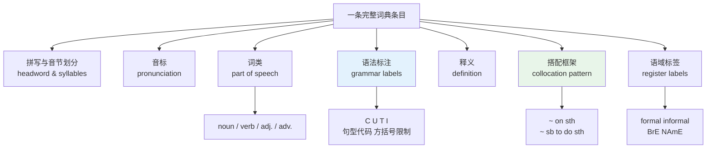
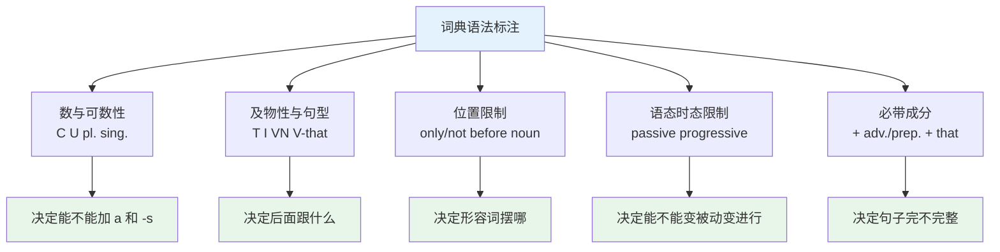
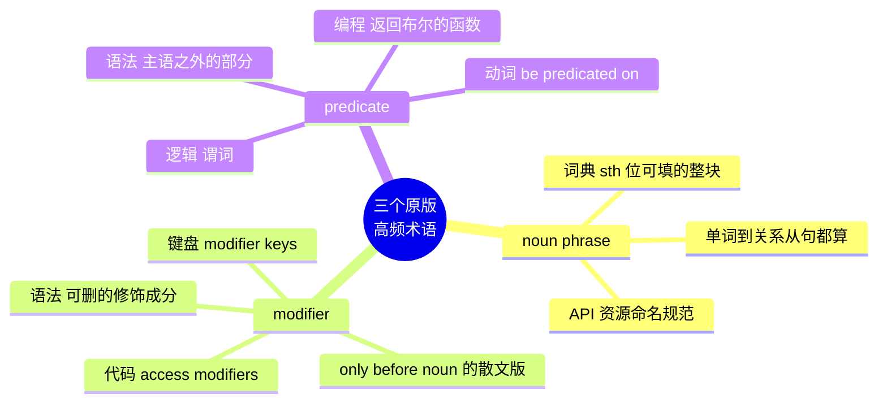
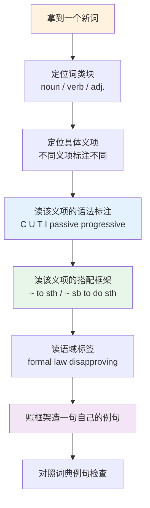
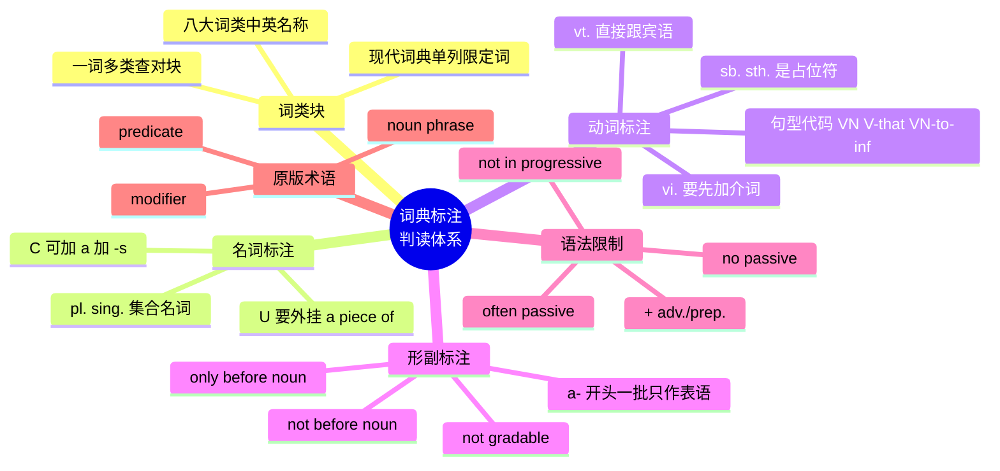

# 词性与词典标注体例：词条上的缩写怎么读

> [!info] 本篇定位
>
> 上一篇解决了「看到词怎么读」，这一篇解决「看到词条怎么用」。
>
> 一条像样的英语词典条目里，中文释义只占很小一部分，剩下全是缩写和方括号：`[U]`、`[VN that]`、`[usually passive]`、`[not before noun]`。这些标注不是编辑的癖好，它们是把「这个词在句子里能怎么摆」压缩成的代码。看不懂就等于只拿到了词义，没拿到用法。
>
> 读完你能做到三件事：说出八大词类的中英名称并认出各类缩写；把 `[C]` `[U]` `[T]` `[I]` `[often passive]` 这类标注直接翻译成造句限制；读英文原版语法书和技术规范时，认得 noun phrase、modifier、predicate 这几个反复出现的术语指什么。
>
> 本篇不定义句法术语——那是语法教程的事，需要精确定义时链回 [[02.英语基础语法/13.附录/01.语法术语表\|语法术语表]]。本篇只教标注怎么判读。

---

## 1. 本篇导读：词典标注是压缩过的用法说明

多数人查词典只看两样东西：音标和中文释义。这个习惯的代价，会在写作和口语里集中爆发。

看一条真实的词典条目结构（以 `advice` 为例）：

```text
ad·vice  /ədˈvaɪs/  noun  [U]
   an opinion or a suggestion about what sb should do
   ~ (on sth)  ~ (about sth)
   a piece of advice   some advice
```

这条条目里，中文对应字只是「建议」两个字，但 `[U]` 这个标注携带的信息量比释义还大：它告诉你 `advice` 不能加 `-s`，不能说 `an advice`，要计数得说 `a piece of advice`。不看这个标注，几乎必然会写出 `He gave me some good advices` 这样的句子。

再看 `discuss`：

```text
dis·cuss  /dɪˈskʌs/  verb
   [VN]  [V wh-]
   ~ sth (with sb)
```

`[VN]` 表示这个动词后面直接跟名词短语作宾语，没有介词。看到这个标注就不会写 `We discussed about the plan`——这是中文母语者写英文时最高频的错误之一，根源就是把「讨论关于某事」逐字搬了过来。



上图把词条拆成七个信息块。第三篇讲了音标块，本篇处理词类块、语法标注块和搭配框架块，语域标签块只做基础判读，完整展开留给第 17 章。这三块合起来就是「这个词怎么摆进句子」的全部说明书。

判读这些标注不需要会做句法分析。你不需要知道什么叫「补足语」的形式化定义，只需要知道 `[VN to inf]` 这个代码对应的造句模板是 `persuade sb to do sth`。标注是模板的编号，不是理论。

---

## 2. 八大词类：中英名称、缩写与实际分类

### 2.1 传统八分法与现代词典的实际做法

中学语法教的是「八大词类」，这个划分来自拉丁语法传统。英文原版书里叫 **parts of speech** 或 **word classes**，后者是现代语言学更常用的说法。

| 英文 | 英式音标 | 美式音标 | 词性 | 中文 | 搭配与说明 |
| --- | --- | --- | --- | --- | --- |
| **noun** | /naʊn/ | /naʊn/ | n. | 名词 | 词典缩写 n.；复合形式 noun phrase |
| **verb** | /vɜːb/ | /vɜːrb/ | n. | 动词 | 缩写 v.；再分 vt. / vi. |
| **adjective** | /ˈædʒɪktɪv/ | /ˈædʒɪktɪv/ | n. | 形容词 | 缩写 adj.，旧词典写 a. |
| **adverb** | /ˈædvɜːb/ | /ˈædvɜːrb/ | n. | 副词 | 缩写 adv.，旧词典写 ad. |
| **pronoun** | /ˈprəʊnaʊn/ | /ˈproʊnaʊn/ | n. | 代词 | 缩写 pron.；pro- 表「代替」 |
| **preposition** | /ˌprepəˈzɪʃn/ | /ˌprepəˈzɪʃn/ | n. | 介词 | 缩写 prep.；重音在第三音节 |
| **conjunction** | /kənˈdʒʌŋkʃn/ | /kənˈdʒʌŋkʃn/ | n. | 连词 | 缩写 conj.；也指天文「合」 |
| **interjection** | /ˌɪntəˈdʒekʃn/ | /ˌɪntərˈdʒekʃn/ | n. | 感叹词 | 缩写 int. 或 interj.；同义 exclamation |
| **determiner** | /dɪˈtɜːmɪnə/ | /dɪˈtɜːrmɪnər/ | n. | 限定词 | 缩写 det.；现代词典单列，八分法里没有 |
| **article** | /ˈɑːtɪkl/ | /ˈɑːrtɪkl/ | n. | 冠词 | 缩写 art.；限定词的子类 |
| **numeral** | /ˈnjuːmərəl/ | /ˈnuːmərəl/ | n. | 数词 | 缩写 num.；美音首音节 /nuː/ 无 /j/ |
| **auxiliary** | /ɔːɡˈzɪliəri/ | /ɔːɡˈzɪliəri/ | n./adj. | 助动词；辅助的 | auxiliary verb；缩写 aux. |
| **modal** | /ˈməʊdl/ | /ˈmoʊdl/ | n./adj. | 情态动词；情态的 | modal verb，如 can、must |
| **participle** | /ˈpɑːtɪsɪpl/ | /ˈpɑːrtɪsɪpl/ | n. | 分词 | present / past participle |

现代学习型词典（牛津 OALD、朗文 LDOCE、剑桥 CALD）实际用的分类和八分法有两处偏离，查词时会直接遇到：

**偏离一：限定词独立成类。** 八分法把 `the`、`a`、`this`、`some`、`every` 归进形容词或代词，现代词典统一标 `determiner`。原因是这些词的分布规律和形容词完全不同——形容词可以叠加（`a big red box`），限定词不能（`the my book` 不成立）。

**偏离二：数词往往不单列。** OALD 把 `three` 标为 `number`，`third` 标为 `ordinal number`，而不是 `numeral`。查基数词序数词时留意这个差别。

> [!warning] 缩写在不同词典里不完全一致
>
> 同一个概念在不同词典里的缩写可能不同，看到陌生缩写要先翻词典自己的凡例页（front matter / abbreviations）。
>
> - 形容词：`adj.`（现代通用）/ `a.`（旧版词典、韦氏）
> - 副词：`adv.`（现代通用）/ `ad.`（旧版）
> - 及物动词：`vt.`（多数中型词典）/ `[T]`（牛津朗文学习型）
> - 感叹词：`int.`（牛津）/ `interj.`（韦氏）/ `excl.`（部分英式词典）
>
> 完整的缩写清单不在本篇重复，查 [[02.英语基础语法/01.基础入门/04.英语词典缩写大全\|英语词典缩写大全]]。本篇只处理判读方法。

### 2.2 一词多类是常态，不是例外

英语的词类归属高度依赖句法位置。同一个词形在不同位置属于不同词类，词典会给它开多个独立条目，用 `noun`、`verb`、`adjective` 分块。

| 英文 | 英式音标 | 美式音标 | 词性 | 中文 | 搭配与说明 |
| --- | --- | --- | --- | --- | --- |
| **book** | /bʊk/ | /bʊk/ | n./v. | 书；预订 | 名动同形，动词义 book a flight |
| **round** | /raʊnd/ | /raʊnd/ | n./v./adj./adv./prep. | 圆；绕行；圆的 | 英语里少见的五词类词 |
| **fast** | /fɑːst/ | /fæst/ | adj./adv./n./v. | 快的；快地；斋戒 | 副词义无 -ly，不写 fastly |
| **hard** | /hɑːd/ | /hɑːrd/ | adj./adv. | 硬的；努力地 | hardly 是另一个词，义为「几乎不」 |
| **well** | /wel/ | /wel/ | adv./adj./n./int. | 好地；健康的；井 | 形容词义只指健康，且不作定语 |
| **like** | /laɪk/ | /laɪk/ | v./prep./conj./n. | 喜欢；像 | 介词义 like a pro；口语中作连词 |
| **since** | /sɪns/ | /sɪns/ | prep./conj./adv. | 自从；既然 | 三类共形，靠后接成分区分 |
| **that** | /ðæt/ | /ðæt/ | det./pron./conj./adv. | 那个；那；引导从句 | 连词义弱读为 /ðət/ |
| **present** | /ˈpreznt/ | /ˈpreznt/ | n./adj. | 礼物；现在的 | 名形重音在前 |
| **present** | /prɪˈzent/ | /prɪˈzent/ | v. | 呈递；介绍 | 动词重音在后，见第 03 篇名动重音对立 |
| **record** | /ˈrekɔːd/ | /ˈrekərd/ | n. | 记录；唱片 | 名词重音在前 |
| **record** | /rɪˈkɔːd/ | /rɪˈkɔːrd/ | v. | 录制；记录 | 动词重音在后，美音元音也变 |
| **object** | /ˈɒbdʒɪkt/ | /ˈɑːbdʒekt/ | n. | 物体；宾语 | 语法术语义常见于原版语法书 |
| **object** | /əbˈdʒekt/ | /əbˈdʒekt/ | v. | 反对 | object to sth，to 是介词接动名词 |

> [!tip] 查词时先确认词类块
>
> 遇到一个词读不通，先检查是不是查错了词类块。`He objected to the plan` 里的 `object` 是动词 /əbˈdʒekt/，不是名词 /ˈɒbdʒɪkt/；读音、重音、义项全都不同。
>
> 电子词典的搜索结果通常把所有词类块折叠在一起，容易只看到第一块就走。手动展开到句子里那个词类对应的块，再读释义。

`round` 是英语里少见的横跨五个词类的词，词典给它开五个独立条目块：

```text
round  n.    a round of applause     一轮掌声
round  v.    round the corner        绕过拐角
round  adj.  a round table           圆桌
round  adv.  turn round              转过身
round  prep. walk round the lake     绕湖散步
```

这说明了英语词汇的一个结构性事实：词类不是词形自带的属性，而是词形在具体句子里获得的身份。中文也靠语序判断词类，这一点两种语言相通；难点在于英语词典把这五种身份拆成五块分开写，查词时必须自己定位到对的那一块。

---

## 3. 名词标注：C、U 与复数限制怎么判读

### 3.1 [C] 与 [U] 的判读规则

`[C]` 是 **countable**（可数），`[U]` 是 **uncountable**（不可数）。学习型词典把这两个标注放在词性后面，紧跟着释义。

| 英文 | 英式音标 | 美式音标 | 词性 | 中文 | 搭配与说明 |
| --- | --- | --- | --- | --- | --- |
| **countable** | /ˈkaʊntəbl/ | /ˈkaʊntəbl/ | adj. | 可数的 | 词典标 [C]；可加 a/an 与 -s |
| **uncountable** | /ʌnˈkaʊntəbl/ | /ʌnˈkaʊntəbl/ | adj. | 不可数的 | 词典标 [U]；不加 a/an 不加 -s |
| **advice** | /ədˈvaɪs/ | /ədˈvaɪs/ | n. [U] | 建议 | a piece of advice；动词 advise /ədˈvaɪz/ |
| **information** | /ˌɪnfəˈmeɪʃn/ | /ˌɪnfərˈmeɪʃn/ | n. [U] | 信息 | a piece of information；技术文档高频 |
| **equipment** | /ɪˈkwɪpmənt/ | /ɪˈkwɪpmənt/ | n. [U] | 设备 | a piece of equipment；不说 equipments |
| **furniture** | /ˈfɜːnɪtʃə/ | /ˈfɜːrnɪtʃər/ | n. [U] | 家具 | an item of furniture |
| **luggage** | /ˈlʌɡɪdʒ/ | /ˈlʌɡɪdʒ/ | n. [U] | 行李 | 英式常用；美式多用 baggage |
| **baggage** | /ˈbæɡɪdʒ/ | /ˈbæɡɪdʒ/ | n. [U] | 行李 | 美式常用；也指心理包袱 |
| **knowledge** | /ˈnɒlɪdʒ/ | /ˈnɑːlɪdʒ/ | n. [U] | 知识 | 例外：a good knowledge of sth 可加 a |
| **progress** | /ˈprəʊɡres/ | /ˈprɑːɡres/ | n. [U] | 进展 | make progress；不说 make a progress |
| **evidence** | /ˈevɪdəns/ | /ˈevɪdəns/ | n. [U] | 证据 | a piece of evidence；法律文本高频 |
| **feedback** | /ˈfiːdbæk/ | /ˈfiːdbæk/ | n. [U] | 反馈 | 不说 feedbacks；give/get feedback |
| **software** | /ˈsɒftweə/ | /ˈsɔːftwer/ | n. [U] | 软件 | 不说 softwares；计量用 a piece of software |
| **hardware** | /ˈhɑːdweə/ | /ˈhɑːrdwer/ | n. [U] | 硬件 | 同上；也指五金件 |
| **research** | /rɪˈsɜːtʃ/ | /ˈriːsɜːrtʃ/ | n. [U] | 研究 | 学术语境偶见 researches，属正式旧用法 |
| **traffic** | /ˈtræfɪk/ | /ˈtræfɪk/ | n. [U] | 交通；流量 | 网络流量义也不可数 |
| **damage** | /ˈdæmɪdʒ/ | /ˈdæmɪdʒ/ | n. [U] | 损坏 | 复数 damages 是另一义：损害赔偿金 |
| **machinery** | /məˈʃiːnəri/ | /məˈʃiːnəri/ | n. [U] | 机械 | machine 可数，machinery 不可数 |

判读方法只有一条：**看到 `[U]` 就同时关掉两个开关**——不能加 `a/an`，不能加 `-s`。要表达数量就外挂计量单位。

> [!warning] 中文母语者在 [U] 上的三种典型错误
>
> 中文的名词没有可数不可数的形态区分，「三条建议」和「三本书」结构一样，直译过来就会翻车。
>
> - ❌ ~~He gave me three advices.~~
> - ✅ He gave me three **pieces of advice**.
> - ❌ ~~We need more informations about the API.~~
> - ✅ We need more **information** about the API.
> - ❌ ~~The team made a great progress last quarter.~~
> - ✅ The team made **great progress** last quarter.
>
> 第三个错误最隐蔽：`a great progress` 里的 `a` 是被形容词带出来的，中文说「取得了一个很大的进展」完全自然，英文里 `progress` 前面加冠词直接不成立。

### 3.2 同一个词兼有 [C] 和 [U]

大量名词两个标注都有，义项不同。词典会分列：`[C]` 一条释义，`[U]` 另一条释义。判读的关键是**先读释义再定标注**，不能只看词形。

| 英文 | 英式音标 | 美式音标 | 词性 | 中文 | 搭配与说明 |
| --- | --- | --- | --- | --- | --- |
| **paper** | /ˈpeɪpə/ | /ˈpeɪpər/ | n. [U]/[C] | 纸；论文、报纸 | [U] 纸张；[C] a research paper |
| **glass** | /ɡlɑːs/ | /ɡlæs/ | n. [U]/[C] | 玻璃；玻璃杯 | [U] 材质；[C] 一只杯子；glasses 眼镜 |
| **experience** | /ɪkˈspɪəriəns/ | /ɪkˈspɪriəns/ | n. [U]/[C] | 经验；经历 | [U] 工作经验；[C] 一次具体经历 |
| **business** | /ˈbɪznəs/ | /ˈbɪznəs/ | n. [U]/[C] | 生意；公司 | [U] 商业活动；[C] 一家企业 |
| **room** | /ruːm/ | /ruːm/ | n. [C]/[U] | 房间；空间 | [C] 一间屋子；[U] room for improvement |
| **time** | /taɪm/ | /taɪm/ | n. [U]/[C] | 时间；次数 | [U] 时间流；[C] three times |
| **light** | /laɪt/ | /laɪt/ | n. [U]/[C] | 光；灯 | [U] 光线；[C] 一盏灯 |
| **iron** | /ˈaɪən/ | /ˈaɪərn/ | n. [U]/[C] | 铁；熨斗 | [U] 金属；[C] 电器；注意 r 只在美音发 |
| **chicken** | /ˈtʃɪkɪn/ | /ˈtʃɪkɪn/ | n. [C]/[U] | 鸡；鸡肉 | [C] 活鸡；[U] 肉；见第 01 篇肉名分层 |
| **coffee** | /ˈkɒfi/ | /ˈkɔːfi/ | n. [U]/[C] | 咖啡 | [U] 饮品；[C] 点单时 two coffees |
| **exercise** | /ˈeksəsaɪz/ | /ˈeksərsaɪz/ | n. [U]/[C] | 锻炼；练习题 | [U] 运动；[C] 一道题、一次演习 |
| **authority** | /ɔːˈθɒrəti/ | /əˈθɔːrəti/ | n. [U]/[C] | 权威；当局 | [U] 权力；[C] the authorities 官方 |
| **capital** | /ˈkæpɪtl/ | /ˈkæpɪtl/ | n. [U]/[C] | 资本；首都 | [U] 资金；[C] 首都、大写字母 |
| **memory** | /ˈmeməri/ | /ˈmeməri/ | n. [U]/[C] | 内存；记忆 | [U] 计算机内存；[C] 一段回忆 |

> [!example] 同词不同标注的对照
>
> - We need someone with five years of **experience**. [U]
>   - 我们需要有五年经验的人。
> - Studying abroad was an unforgettable **experience**. [C]
>   - 留学是一次难忘的经历。
> - The lab is running out of **memory**. [U]
>   - 那台机器内存不够了。
> - I have vivid **memories** of that summer. [C]
>   - 我对那个夏天记忆犹新。

`[C]` 与 `[U]` 双标的词有个可靠的语义规律：**表示物质、抽象概念、集体活动时不可数；切分成具体个体、具体事例、具体产品时可数**。`paper` 作为材质是一片连续的东西，作为一篇论文是一个可数的单位。

### 3.3 [pl.]、[sing.] 与主谓一致标注

除了 C/U，词典还会标注词形在数上的固定限制。

| 标注 | 全称 | 含义 | 典型词 |
| --- | --- | --- | --- |
| `[pl.]` | plural | 只以复数形式出现 | scissors、goods |
| `[sing.]` | singular | 只以单数形式出现 | the sun、the future |
| `[usually pl.]` | usually plural | 通常用复数，单数罕见 | belongings、surroundings |
| `[usually sing.]` | usually singular | 通常用单数 | a shame、the majority |
| `[C+sing./pl. v.]` | countable + singular or plural verb | 集合名词，谓语单复数皆可 | team、government |

| 英文 | 英式音标 | 美式音标 | 词性 | 中文 | 搭配与说明 |
| --- | --- | --- | --- | --- | --- |
| **scissors** | /ˈsɪzəz/ | /ˈsɪzərz/ | n. [pl.] | 剪刀 | a pair of scissors；谓语用复数 |
| **trousers** | /ˈtraʊzəz/ | /ˈtraʊzərz/ | n. [pl.] | 长裤 | 英式用词；美式 pants |
| **goods** | /ɡʊdz/ | /ɡʊdz/ | n. [pl.] | 货物 | 无单数；good 是另一个词 |
| **premises** | /ˈpremɪsɪz/ | /ˈpremɪsɪz/ | n. [pl.] | 房屋场地 | 合同文本高频；premise 单数义为前提 |
| **credentials** | /krəˈdenʃlz/ | /krəˈdenʃlz/ | n. [pl.] | 凭据；资历 | 技术文档指账号密码 |
| **surroundings** | /səˈraʊndɪŋz/ | /səˈraʊndɪŋz/ | n. [pl.] | 周边环境 | 与 environment 不同，指物理周围 |
| **belongings** | /bɪˈlɒŋɪŋz/ | /bɪˈlɔːŋɪŋz/ | n. [pl.] | 随身物品 | personal belongings |
| **statistics** | /stəˈtɪstɪks/ | /stəˈtɪstɪks/ | n. [pl.]/[U] | 统计数据；统计学 | 数据义复数；学科义不可数 |
| **mathematics** | /ˌmæθəˈmætɪks/ | /ˌmæθəˈmætɪks/ | n. [U] | 数学 | 形式复数意义单数，谓语用单数 |
| **politics** | /ˈpɒlətɪks/ | /ˈpɑːlətɪks/ | n. [U]/[pl.] | 政治；政见 | 学科义单数；政见义复数 |
| **means** | /miːnz/ | /miːnz/ | n. | 手段；财力 | 单复同形；a means of transport |
| **series** | /ˈsɪəriːz/ | /ˈsɪriːz/ | n. | 系列 | 单复同形；a series / two series |
| **species** | /ˈspiːʃiːz/ | /ˈspiːʃiːz/ | n. | 物种 | 单复同形；不写 specie |
| **team** | /tiːm/ | /tiːm/ | n. [C+sing./pl. v.] | 团队 | 英式常接复数谓语，美式接单数 |
| **government** | /ˈɡʌvənmənt/ | /ˈɡʌvərnmənt/ | n. [C+sing./pl. v.] | 政府 | 同上；英式 The government have… |
| **staff** | /stɑːf/ | /stæf/ | n. [C+sing./pl. v.]/[U] | 员工 | 英美用法差异大；a staff member 才指一个人 |

> [!warning] `[C+sing./pl. v.]` 的英美差异
>
> 集合名词后面接单数还是复数谓语，是英美最系统的语法差异之一。
>
> - 英式：The team **are** playing well. / The government **have** announced…
> - 美式：The team **is** playing well. / The government **has** announced…
>
> 两者都对，但一篇文档里要统一。技术文档写作时按目标读者选：面向美国用户用单数，面向英国用户或欧盟机构用复数。判据展开见 `18.语域、英美差异与习语俚语`。

---

## 4. 动词标注：vt./vi.、[T]/[I] 与句型代码

### 4.1 及物与不及物的两套记号

| 英文 | 英式音标 | 美式音标 | 词性 | 中文 | 搭配与说明 |
| --- | --- | --- | --- | --- | --- |
| **transitive** | /ˈtrænsətɪv/ | /ˈtrænsətɪv/ | adj. | 及物的 | 缩写 vt. 或 [T]；后面直接跟宾语 |
| **intransitive** | /ɪnˈtrænsətɪv/ | /ɪnˈtrænsətɪv/ | adj. | 不及物的 | 缩写 vi. 或 [I]；不直接跟宾语 |
| **ditransitive** | /daɪˈtrænsətɪv/ | /daɪˈtrænsətɪv/ | adj. | 双宾的 | 带两个宾语，如 give sb sth |
| **linking verb** | /ˈlɪŋkɪŋ vɜːb/ | /ˈlɪŋkɪŋ vɜːrb/ | n. | 系动词 | 也叫 copula；后接表语 |

判读规则一句话：**`vt.` / `[T]` 后面必须跟宾语，`vi.` / `[I]` 后面不能直接跟宾语，要接宾语得先加介词。**

真正会造成错误的是那批**英汉词类不对等**的动词——中文里需要介词的英文不需要，或者反过来。

| 英文 | 英式音标 | 美式音标 | 词性 | 中文 | 搭配与说明 |
| --- | --- | --- | --- | --- | --- |
| **discuss** | /dɪˈskʌs/ | /dɪˈskʌs/ | vt. | 讨论 | discuss sth，不加 about |
| **mention** | /ˈmenʃn/ | /ˈmenʃn/ | vt. | 提到 | mention sth，不加 about |
| **enter** | /ˈentə/ | /ˈentər/ | vt. | 进入 | enter the room，不加 into（除非抽象义） |
| **approach** | /əˈprəʊtʃ/ | /əˈproʊtʃ/ | vt. | 接近；着手处理 | approach the problem，不加 to |
| **lack** | /læk/ | /læk/ | vt./n. | 缺少 | 动词 lack sth；名词 a lack of sth |
| **marry** | /ˈmæri/ | /ˈmæri/ | vt. | 与…结婚 | marry sb，不加 with |
| **serve** | /sɜːv/ | /sɜːrv/ | vt./vi. | 服务；供职 | serve customers；serve as sth |
| **affect** | /əˈfekt/ | /əˈfekt/ | vt. | 影响 | affect sth；名词是 effect |
| **emphasize** | /ˈemfəsaɪz/ | /ˈemfəsaɪz/ | vt. | 强调 | emphasize sth，不加 on |
| **arrive** | /əˈraɪv/ | /əˈraɪv/ | vi. | 到达 | arrive at/in，不能直接跟地点 |
| **happen** | /ˈhæpən/ | /ˈhæpən/ | vi. | 发生 | 无被动态；不说 was happened |
| **occur** | /əˈkɜː/ | /əˈkɜːr/ | vi. | 发生；想到 | occur to sb；无被动 |
| **belong** | /bɪˈlɒŋ/ | /bɪˈlɔːŋ/ | vi. | 属于 | belong to sth；无被动 |
| **consist** | /kənˈsɪst/ | /kənˈsɪst/ | vi. | 组成 | consist of sth；无被动 |
| **listen** | /ˈlɪsn/ | /ˈlɪsn/ | vi. | 听 | listen to sth；hear 是及物的 |
| **reply** | /rɪˈplaɪ/ | /rɪˈplaɪ/ | vi./n. | 回复 | reply to sb；answer 是及物的 |
| **rise** | /raɪz/ | /raɪz/ | vi. | 上升 | rise-rose-risen；不带宾语 |
| **raise** | /reɪz/ | /reɪz/ | vt. | 举起；提高 | raise-raised-raised；必带宾语 |
| **lie** | /laɪ/ | /laɪ/ | vi. | 躺；位于 | lie-lay-lain；另有 lie「撒谎」规则变化 |
| **lay** | /leɪ/ | /leɪ/ | vt. | 放置；产卵 | lay-laid-laid；必带宾语 |

> [!warning] 六个必须记牢的及物性陷阱
>
> - ❌ ~~We discussed about the schema.~~ → ✅ We **discussed** the schema.
> - ❌ ~~He mentioned about the bug.~~ → ✅ He **mentioned** the bug.
> - ❌ ~~The accident was happened yesterday.~~ → ✅ The accident **happened** yesterday.
> - ❌ ~~I arrived the airport at six.~~ → ✅ I **arrived at** the airport at six.
> - ❌ ~~She married with a doctor.~~ → ✅ She **married** a doctor.
> - ❌ ~~The price was risen by 10%.~~ → ✅ The price **rose** by 10%. / The price **was raised** by 10%.
>
> `rise` / `raise` 和 `lie` / `lay` 是一组更麻烦的陷阱：不及物那个是不规则变化，及物那个是规则变化，而 `lie` 的过去式 `lay` 恰好和 `lay` 的原形同形。

### 4.2 学习型词典的句型代码

牛津 OALD 在 `[T]` `[I]` 之外还有一套更细的句型代码，写在方括号里，直接告诉你这个动词后面能跟什么结构。

| 代码 | 含义 | 造句模板 | 例词 |
| --- | --- | --- | --- |
| `[VN]` | verb + noun | 动词 + 名词短语宾语 | discuss the plan |
| `[V]` | verb 单独使用 | 动词不带任何补充 | The bell rang. |
| `[VNN]` | verb + noun + noun | 动词 + 间宾 + 直宾 | give sb sth |
| `[V to inf]` | verb + to 不定式 | 动词 + to do | agree to leave |
| `[VN to inf]` | verb + 宾语 + to 不定式 | 动词 + sb + to do | persuade sb to go |
| `[V -ing]` | verb + 动名词 | 动词 + doing | enjoy reading |
| `[V that]` | verb + that 从句 | 动词 + that 从句 | suggest that… |
| `[VN that]` | verb + 宾语 + that 从句 | 动词 + sb + that 从句 | tell sb that… |
| `[V wh-]` | verb + wh- 从句 | 动词 + what/how 从句 | explain how it works |
| `[VN-ADJ]` | verb + 宾语 + 形容词 | 动词 + sb/sth + adj. | paint the wall white |
| `[V speech]` | 引用直接引语 | 动词 + 引号内容 | 'Wait,' she said. |

| 英文 | 英式音标 | 美式音标 | 词性 | 中文 | 搭配与说明 |
| --- | --- | --- | --- | --- | --- |
| **suggest** | /səˈdʒest/ | /səɡˈdʒest/ | vt. | 建议 | [V that] [V -ing]；无 [VN to inf] |
| **persuade** | /pəˈsweɪd/ | /pərˈsweɪd/ | vt. | 说服 | [VN to inf] persuade sb to do sth |
| **remind** | /rɪˈmaɪnd/ | /rɪˈmaɪnd/ | vt. | 提醒 | [VN to inf] [VN that] [VN of sth] |
| **explain** | /ɪkˈspleɪn/ | /ɪkˈspleɪn/ | vt. | 解释 | [V that] [V wh-]；无双宾 |
| **provide** | /prəˈvaɪd/ | /prəˈvaɪd/ | vt. | 提供 | provide sb with sth / provide sth for sb |
| **supply** | /səˈplaɪ/ | /səˈplaɪ/ | vt./n. | 供应 | supply sb with sth，同 provide 的框架 |
| **deprive** | /dɪˈpraɪv/ | /dɪˈpraɪv/ | vt. | 剥夺 | deprive sb of sth；of 固定不可换 |
| **inform** | /ɪnˈfɔːm/ | /ɪnˈfɔːrm/ | vt. | 通知 | inform sb of/about sth；[VN that] |
| **accuse** | /əˈkjuːz/ | /əˈkjuːz/ | vt. | 指控 | accuse sb of sth；of 后接动名词 |
| **convince** | /kənˈvɪns/ | /kənˈvɪns/ | vt. | 使信服 | convince sb of sth / that / to do |
| **prevent** | /prɪˈvent/ | /prɪˈvent/ | vt. | 阻止 | prevent sb from doing sth |
| **enable** | /ɪˈneɪbl/ | /ɪˈneɪbl/ | vt. | 使能够 | enable sb to do sth；技术文档高频 |

> [!warning] suggest 没有 [VN to inf] 这一格
>
> 中文说「他建议我早点走」，直译成 `He suggested me to leave early` 是错的。词典里 `suggest` 只有 `[V that]`、`[V -ing]`、`[VN]` 三种句型，没有 `[VN to inf]`。
>
> - ❌ ~~He suggested me to leave early.~~
> - ✅ He **suggested that I leave** early.
> - ✅ He **suggested leaving** early.
>
> 同一个坑还有 `explain`：中文「跟我解释这件事」不能说成 `explain me the thing`，因为 `explain` 没有双宾结构。
>
> - ❌ ~~Please explain me the error.~~
> - ✅ Please **explain the error to me**.

句型代码的实用价值在于它能**提前拦截错误**。写作时想用一个不太熟的动词，先查它的句型代码列表，只从列表里选，就不会造出词典里没有的结构。这是把词典从「查释义的工具」变成「查用法的工具」的关键一步。

### 4.3 sb. 与 sth. 是模板占位符

词典搭配式里的 `sb.` 和 `sth.` 不是缩写词，是**占位符**——相当于代码里的形参名。

| 英文 | 英式音标 | 美式音标 | 词性 | 中文 | 搭配与说明 |
| --- | --- | --- | --- | --- | --- |
| **somebody** | /ˈsʌmbədi/ | /ˈsʌmbədi/ | pron. | 某人 | 缩写 sb.；占位一个指人的名词短语 |
| **someone** | /ˈsʌmwʌn/ | /ˈsʌmwʌn/ | pron. | 某人 | 与 somebody 同义，正式度略高 |
| **something** | /ˈsʌmθɪŋ/ | /ˈsʌmθɪŋ/ | pron. | 某物 | 缩写 sth.；占位一个指物的名词短语 |
| **oneself** | /wʌnˈself/ | /wʌnˈself/ | pron. | 自己 | 词典模板里代表反身代词那一格 |
| **etc.** | /et ˈsetərə/ | /et ˈsetərə/ | adv. | 等等 | 拉丁 et cetera；句中不与 and 连用 |
| **cf.** | — | — | abbr. | 参见比较 | 拉丁 confer；词典交叉引用用 |
| **esp.** | — | — | abbr. | 尤指 | especially 的缩写 |
| **usu.** | — | — | abbr. | 通常 | usually 的缩写 |

读搭配式的方法是把占位符换成真实成分：

```text
词典写：   deprive sb of sth
你要造：   The outage deprived users of access to the dashboard.
              ↑ sb 位        ↑ sth 位

词典写：   prevent sb from doing sth
你要造：   The lock prevents two threads from writing at the same time.
                     ↑ sb 位            ↑ doing sth 位
```

> [!tip] 波浪号 ~ 代表词条本身
>
> OALD 的搭配式里经常出现 `~`，它代替的是这个词条的词头，省去重复书写。
>
> - `advice` 条目下的 `~ (on sth)` 读作 `advice on sth`
> - `depend` 条目下的 `~ on/upon sb/sth` 读作 `depend on/upon sb/sth`
> - 斜杠表示可替换，圆括号表示可省略
>
> 所以 `~ (with sb) (about/over sth)` 展开后是四种合法搭配：单用、加 with、加 about/over、两个都加。

---

## 5. 形容词与副词的位置标注

### 5.1 [only before noun] 与 [not before noun]

形容词在英语里有两个基本位置：名词前（原版书叫 **attributive**）和系动词后（原版书叫 **predicative**）。多数形容词两个位置都能站，但有两批不能，词典会明确标出来。

| 词典标注 | 原版语法书术语 | 含义 | 后果 |
| --- | --- | --- | --- |
| `[only before noun]` | attributive only | 只能作定语 | 不能说 `The reason is main.` |
| `[not before noun]` | predicative only | 只能作表语 | 不能说 `an afraid child` |
| `[after noun]` | postpositive | 放在名词后 | `the president elect` |
| `[not gradable]` | non-gradable | 不能加 very / 比较级 | `perfect`、`unique`、`digital` |

| 英文 | 英式音标 | 美式音标 | 词性 | 中文 | 搭配与说明 |
| --- | --- | --- | --- | --- | --- |
| **main** | /meɪn/ | /meɪn/ | adj. [only before noun] | 主要的 | the main reason；表语位用 chief 也不行 |
| **mere** | /mɪə/ | /mɪr/ | adj. [only before noun] | 仅仅的 | a mere coincidence |
| **sheer** | /ʃɪə/ | /ʃɪr/ | adj. [only before noun] | 纯粹的 | sheer luck；另有「陡峭」义可作表语 |
| **utter** | /ˈʌtə/ | /ˈʌtər/ | adj. [only before noun] | 完全的 | utter nonsense；同形动词义为「说出」 |
| **former** | /ˈfɔːmə/ | /ˈfɔːrmər/ | adj. [only before noun] | 前任的 | the former CEO |
| **latter** | /ˈlætə/ | /ˈlætər/ | adj. [only before noun] | 后者的 | the latter half；对应 the former |
| **elder** | /ˈeldə/ | /ˈeldər/ | adj. [only before noun] | 年长的 | my elder brother；表语位用 older |
| **inner** | /ˈɪnə/ | /ˈɪnər/ | adj. [only before noun] | 内部的 | the inner loop；技术文档常见 |
| **outer** | /ˈaʊtə/ | /ˈaʊtər/ | adj. [only before noun] | 外部的 | the outer join |
| **countless** | /ˈkaʊntləs/ | /ˈkaʊntləs/ | adj. [only before noun] | 无数的 | countless attempts |
| **afraid** | /əˈfreɪd/ | /əˈfreɪd/ | adj. [not before noun] | 害怕的 | be afraid of；定语位用 frightened |
| **alive** | /əˈlaɪv/ | /əˈlaɪv/ | adj. [not before noun] | 活着的 | 定语位用 living / live |
| **alone** | /əˈləʊn/ | /əˈloʊn/ | adj. [not before noun] | 独自的 | 定语位用 lone / solitary |
| **asleep** | /əˈsliːp/ | /əˈsliːp/ | adj. [not before noun] | 睡着的 | 定语位用 sleeping |
| **awake** | /əˈweɪk/ | /əˈweɪk/ | adj. [not before noun] | 醒着的 | 定语位用 waking |
| **aware** | /əˈweə/ | /əˈwer/ | adj. [not before noun] | 意识到的 | be aware of/that |
| **ashamed** | /əˈʃeɪmd/ | /əˈʃeɪmd/ | adj. [not before noun] | 羞愧的 | be ashamed of |
| **content** | /kənˈtent/ | /kənˈtent/ | adj. [not before noun] | 满足的 | 重音在后；名词 content 重音在前 |
| **unable** | /ʌnˈeɪbl/ | /ʌnˈeɪbl/ | adj. [not before noun] | 不能的 | be unable to do；定语位用 incapable |
| **liable** | /ˈlaɪəbl/ | /ˈlaɪəbl/ | adj. [not before noun] | 有责任的；易于 | be liable for/to；法律文本高频 |
| **well** | /wel/ | /wel/ | adj. [not before noun] | 健康的 | He is well. 但不说 a well man |

> [!warning] a- 开头的一批形容词有共同规律
>
> `afraid`、`alive`、`alone`、`asleep`、`awake`、`aware`、`ashamed`、`ablaze`、`aghast` 这批词都以 `a-` 开头，都标 `[not before noun]`。这个 `a-` 来自古英语的介词前缀（相当于 `on`），所以它们本质上更接近介词短语而不是形容词。
>
> - ❌ ~~an asleep baby~~ → ✅ **a sleeping baby**
> - ❌ ~~an alive fish~~ → ✅ **a live fish** /laɪv/ 或 **a living fish**
> - ❌ ~~the afraid students~~ → ✅ **the frightened students**
>
> 记住这个 `a-` 特征，遇到新词就有了预判。

### 5.2 [not gradable] 与副词标注

`[not gradable]`（不可分级）表示这个形容词表达的是绝对属性，逻辑上没有程度差别，所以不能加 `very`，也没有比较级最高级。

| 英文 | 英式音标 | 美式音标 | 词性 | 中文 | 搭配与说明 |
| --- | --- | --- | --- | --- | --- |
| **perfect** | /ˈpɜːfɪkt/ | /ˈpɜːrfɪkt/ | adj. [not gradable] | 完美的 | 强调用 absolutely，不用 very |
| **unique** | /juˈniːk/ | /juˈniːk/ | adj. [not gradable] | 独一无二的 | 正式写作忌 very unique |
| **impossible** | /ɪmˈpɒsəbl/ | /ɪmˈpɑːsəbl/ | adj. [not gradable] | 不可能的 | 强调用 completely |
| **digital** | /ˈdɪdʒɪtl/ | /ˈdɪdʒɪtl/ | adj. [not gradable] | 数字的 | 分类属性，不说 very digital |
| **daily** | /ˈdeɪli/ | /ˈdeɪli/ | adj./adv. | 每日的；每日 | 形副同形，不写 dailyly |
| **hardly** | /ˈhɑːdli/ | /ˈhɑːrdli/ | adv. | 几乎不 | 否定义；与 hard 的副词义无关 |
| **lately** | /ˈleɪtli/ | /ˈleɪtli/ | adv. | 最近 | 与 late「晚」的副词义无关 |
| **highly** | /ˈhaɪli/ | /ˈhaɪli/ | adv. | 高度地 | 抽象义；物理高度用 high |
| **shortly** | /ˈʃɔːtli/ | /ˈʃɔːrtli/ | adv. | 不久 | 时间义；长度短用 short |
| **nearly** | /ˈnɪəli/ | /ˈnɪrli/ | adv. | 几乎 | 与 near「靠近」的副词义分化 |

> [!warning] -ly 副词不一定是对应形容词的副词形式
>
> `hard` / `hardly`、`late` / `lately`、`near` / `nearly`、`high` / `highly`、`most` / `mostly` 这几组，`-ly` 形式的意思已经和原形容词分道扬镳。词典会把它们列为独立词条，而不是放在形容词条目下的派生形式里。
>
> - He works **hard**.（他工作努力。）
> - He **hardly** works.（他几乎不工作。）
>
> 两句话意思相反。看到 `-ly` 就假设「加了 ly 变副词，意思不变」是危险的。判断依据是**词典是否给它单开条目**——单开条目就意味着语义已经独立。

---

## 6. 语法限制标注：passive、progressive 与介副词要求

### 6.1 [often passive] 与 [no passive]

这两个标注管的是**被动语态的可用性**。

| 标注 | 含义 | 操作后果 |
| --- | --- | --- |
| `[often passive]` | 常用被动 | 主动形式罕见，写作时优先被动 |
| `[usually passive]` | 通常被动 | 主动形式基本不用 |
| `[no passive]` | 无被动 | 写成被动就是错句 |
| `[always passive]` | 只有被动 | 朗文的写法，主动形式不成立 |

| 英文 | 英式音标 | 美式音标 | 词性 | 中文 | 搭配与说明 |
| --- | --- | --- | --- | --- | --- |
| **locate** | /ləʊˈkeɪt/ | /ˈloʊkeɪt/ | vt. [often passive] | 使位于；找到 | 位置义只用 be located in/on；美音重音在前 |
| **situate** | /ˈsɪtʃueɪt/ | /ˈsɪtʃueɪt/ | vt. [usually passive] | 使位于 | 与 located 同义，书面度更高 |
| **base** | /beɪs/ | /beɪs/ | vt. [often passive] | 以…为基础 | be based on/upon；简历高频 |
| **entitle** | /ɪnˈtaɪtl/ | /ɪnˈtaɪtl/ | vt. [often passive] | 使有权；命名 | be entitled to sth；合同高频 |
| **dedicate** | /ˈdedɪkeɪt/ | /ˈdedɪkeɪt/ | vt. [often passive] | 专用于；献给 | be dedicated to sth |
| **suppose** | /səˈpəʊz/ | /səˈpoʊz/ | vt. [often passive] | 认为；应该 | be supposed to do sth |
| **schedule** | /ˈʃedjuːl/ | /ˈskedʒuːl/ | vt. [often passive] | 安排 | be scheduled for/to；英美读音差异极大 |
| **allege** | /əˈledʒ/ | /əˈledʒ/ | vt. [usually passive] | 声称 | It is alleged that…；新闻法律高频 |
| **deem** | /diːm/ | /diːm/ | vt. [often passive] | 认为 | be deemed necessary；正式语域 |
| **task** | /tɑːsk/ | /tæsk/ | vt. [usually passive] | 指派任务 | be tasked with doing sth |
| **populate** | /ˈpɒpjuleɪt/ | /ˈpɑːpjuleɪt/ | vt. [often passive] | 填充；居住于 | 技术义 be populated with data |
| **happen** | /ˈhæpən/ | /ˈhæpən/ | vi. [no passive] | 发生 | 不及物，天然无被动 |
| **occur** | /əˈkɜː/ | /əˈkɜːr/ | vi. [no passive] | 发生 | 同上；正式度高于 happen |
| **resemble** | /rɪˈzembl/ | /rɪˈzembl/ | vt. [no passive] | 像 | 及物但无被动，也无进行时 |
| **suit** | /suːt/ | /suːt/ | vt. [no passive] | 适合 | The time suits me. 不说 be suited by |
| **lack** | /læk/ | /læk/ | vt. [no passive] | 缺少 | 及物无被动；被动义用 be lacking in |
| **cost** | /kɒst/ | /kɔːst/ | vt. [no passive] | 花费 | It cost me £20. 不说 was cost |

> [!example] [often passive] 的实际写法
>
> - The server **is located** in Frankfurt.
>   - 服务器位于法兰克福。（`locate` 表位置时几乎只用被动）
> - Our estimate **is based on** last quarter's data.
>   - 我们的估算基于上季度数据。
> - You **are entitled to** a full refund.
>   - 你有权获得全额退款。
> - The migration **is scheduled for** next Tuesday.
>   - 迁移安排在下周二。
> - Each engineer **was tasked with** reviewing one module.
>   - 每位工程师被指派审查一个模块。

`[no passive]` 里最反直觉的是 `resemble`、`suit`、`lack`、`cost` 这批：它们语法上及物（后面跟名词宾语），但语义上不是「施动者作用于受动者」，所以没有被动。判断技巧是问一句「宾语被怎么样了」——`The son resembles his father` 里父亲没被怎么样，所以 `His father is resembled by the son` 不成立。

### 6.2 [not in progressive] 与状态动词

`[not in progressive]`（不用于进行时）标记的是**状态动词**（stative verb），它们描述持续状态而不是正在进行的动作，加 `-ing` 在语义上是矛盾的。

| 英文 | 英式音标 | 美式音标 | 词性 | 中文 | 搭配与说明 |
| --- | --- | --- | --- | --- | --- |
| **know** | /nəʊ/ | /noʊ/ | vt. [not in progressive] | 知道 | 不说 I am knowing |
| **believe** | /bɪˈliːv/ | /bɪˈliːv/ | vt. [not in progressive] | 相信 | 观点义无进行时 |
| **understand** | /ˌʌndəˈstænd/ | /ˌʌndərˈstænd/ | vt. [not in progressive] | 理解 | 同上 |
| **contain** | /kənˈteɪn/ | /kənˈteɪn/ | vt. [not in progressive] | 包含 | 技术文档高频；无进行时无被动 |
| **consist** | /kənˈsɪst/ | /kənˈsɪst/ | vi. [not in progressive] | 由…组成 | consist of |
| **own** | /əʊn/ | /oʊn/ | vt. [not in progressive] | 拥有 | 所有权义 |
| **belong** | /bɪˈlɒŋ/ | /bɪˈlɔːŋ/ | vi. [not in progressive] | 属于 | belong to |
| **seem** | /siːm/ | /siːm/ | vi. [not in progressive] | 似乎 | 系动词；seem to be |
| **deserve** | /dɪˈzɜːv/ | /dɪˈzɜːrv/ | vt. [not in progressive] | 值得 | deserve to do / deserve doing |
| **prefer** | /prɪˈfɜː/ | /prɪˈfɜːr/ | vt. [not in progressive] | 更喜欢 | prefer A to B |
| **matter** | /ˈmætə/ | /ˈmætər/ | vi. [not in progressive] | 要紧 | It doesn't matter. |
| **exist** | /ɪɡˈzɪst/ | /ɪɡˈzɪst/ | vi. [not in progressive] | 存在 | 无被动 |
| **depend** | /dɪˈpend/ | /dɪˈpend/ | vi. [not in progressive] | 取决于 | depend on/upon |
| **involve** | /ɪnˈvɒlv/ | /ɪnˈvɑːlv/ | vt. [not in progressive] | 涉及 | involve doing sth |

> [!warning] 状态动词的进行时不是绝对禁止，但换了意思
>
> 几个高频动词同时有状态义和动作义，词典会分列两条：状态义那条标 `[not in progressive]`，动作义那条不标。
>
> - I **think** it's a bug.（状态义：我认为）
> - I'**m thinking** about the design.（动作义：我在思考）
> - The soup **tastes** salty.（状态义：尝起来）
> - She'**s tasting** the soup.（动作义：她在尝）
> - We **have** two servers.（状态义：拥有）
> - We'**re having** lunch.（动作义：吃）
>
> 判读方法是先定位到句子对应的那条释义，再看那条释义有没有标注，而不是对整个词形做一刀切判断。

### 6.3 [+ adv./prep.] 类标注

还有一批标注管的是「必须带某类成分」。

| 标注 | 含义 | 例子 |
| --- | --- | --- |
| `[+ adv./prep.]` | 后面必须跟副词或介词短语 | `put` 必须跟地点：put it **on the desk** |
| `[+ speech]` | 用于引述直接引语 | `'Wait,' he **muttered**.` |
| `[+ obj + to inf]` | 宾语后跟 to 不定式 | `expect sb **to do**` |
| `[+ adj.]` | 后跟形容词作补语 | `The door swung **open**.` |
| `[+ that]` | 后跟 that 从句 | `insist **that**…` |

`put` 是最典型的 `[+ adv./prep.]` 动词：`Put the file.` 是不完整的句子，必须补出位置：`Put the file in the archive folder.`。同类的还有 `place`、`set`、`lay`、`stick`。中文说「把文件放好」可以不说位置，英文的 `put` 不行。



上图把五类标注按它们控制的语法维度归了组。造句时的检查顺序建议按这个图从上往下走：先确认名词的数，再确认动词的句型，再确认形容词的位置，最后确认语态时态限制和必带成分。五道都过了，句子的结构层面就没有问题了。

---

## 7. 语域与地域标注：什么场合能用这个词

语法标注管「能不能这么造句」，语域标注管「该不该在这个场合用」。前者错了是语法错误，后者错了是**得体性问题**——句子没错，但听起来别扭。

| 英文 | 英式音标 | 美式音标 | 词性 | 中文 | 搭配与说明 |
| --- | --- | --- | --- | --- | --- |
| **formal** | /ˈfɔːml/ | /ˈfɔːrml/ | adj. | 正式的 | 标 formal 的词避免用于口语 |
| **informal** | /ɪnˈfɔːml/ | /ɪnˈfɔːrml/ | adj. | 非正式的 | 避免用于书面正式文本 |
| **literary** | /ˈlɪtərəri/ | /ˈlɪtəreri/ | adj. | 文学的 | 仅见于文学作品，日常用会显得做作 |
| **archaic** | /ɑːˈkeɪɪk/ | /ɑːrˈkeɪɪk/ | adj. | 古旧的 | 已废弃，只在古文献里出现 |
| **dated** | /ˈdeɪtɪd/ | /ˈdeɪtɪd/ | adj. | 过时的 | 老一辈仍用，年轻人不用 |
| **slang** | /slæŋ/ | /slæŋ/ | n./adj. | 俚语 | 圈层用语，正式场合禁用 |
| **taboo** | /təˈbuː/ | /təˈbuː/ | adj./n. | 禁忌的 | 词典标 taboo 的词不要主动使用 |
| **humorous** | /ˈhjuːmərəs/ | /ˈhjuːmərəs/ | adj. | 幽默的 | 带调侃色彩 |
| **ironic** | /aɪˈrɒnɪk/ | /aɪˈrɑːnɪk/ | adj. | 反讽的 | 字面义与实际义相反 |
| **figurative** | /ˈfɪɡərətɪv/ | /ˈfɪɡjərətɪv/ | adj. | 比喻的 | 词典标 fig.；对应 literal |
| **literal** | /ˈlɪtərəl/ | /ˈlɪtərəl/ | adj. | 字面的 | 与 figurative 相对 |
| **approving** | /əˈpruːvɪŋ/ | /əˈpruːvɪŋ/ | adj. | 褒义的 | 隐含正面评价 |
| **disapproving** | /ˌdɪsəˈpruːvɪŋ/ | /ˌdɪsəˈpruːvɪŋ/ | adj. | 贬义的 | 隐含负面评价，误用会得罪人 |
| **derogatory** | /dɪˈrɒɡətəri/ | /dɪˈrɑːɡətɔːri/ | adj. | 贬损的 | 比 disapproving 更强 |
| **euphemism** | /ˈjuːfəmɪzəm/ | /ˈjuːfəmɪzəm/ | n. | 委婉语 | 词典标 euph. |
| **technical** | /ˈteknɪkl/ | /ˈteknɪkl/ | adj. | 专业的 | 该义项限于特定专业领域 |
| **jargon** | /ˈdʒɑːɡən/ | /ˈdʒɑːrɡən/ | n. [U] | 行话 | 常带贬义，指外行听不懂的术语 |
| **BrE** | — | — | abbr. | 英式英语 | British English；对应 NAmE / AmE |
| **NAmE** | — | — | abbr. | 北美英语 | North American English，OALD 用法 |

> [!warning] disapproving 标注最容易踩雷
>
> 标 `disapproving` 的词从中文释义上完全看不出问题，用错了会变成人身评价。
>
> - `stubborn` /ˈstʌbən/ · /ˈstʌbərn/ 固执的 [disapproving]，中性说法用 `determined` 或 `persistent`
> - `childish` /ˈtʃaɪldɪʃ/ 幼稚的 [disapproving]，中性说法用 `childlike`（天真的，褒义）
> - `notorious` /nəʊˈtɔːriəs/ · /noʊˈtɔːriəs/ 臭名昭著的 [disapproving]，中性说法用 `well-known` 或 `famous`
> - `cheap` /tʃiːp/ 便宜的（暗示质量差），中性说法用 `inexpensive` 或 `affordable`
>
> 写英文邮件评价同事工作时，这四个词都可能造成事故。查词典时把 `[approving]` / `[disapproving]` 当成红黄灯来看。

语域标注的完整体系、以及英美用词的系统性对照，展开在本教程第 17 章。本篇只要求做到一件事：**查词时不要跳过括号里的斜体标签**，看到 `formal`、`informal`、`disapproving`、`BrE`、`NAmE` 就停下来想一秒这个场合合不合适。

---

## 8. 原版语法书与技术规范里的三个术语

读英文原版词典的前言、英文语法书、或者 W3C、RFC 这类技术规范时，会反复撞上三个术语：**noun phrase**、**modifier**、**predicate**。它们不是词典标注，但会出现在词典的用法说明里，也会出现在技术文档的措辞规范里，认不出就读不懂。

这三个词的严格句法定义在 [[02.英语基础语法/13.附录/01.语法术语表\|语法术语表]] 里，本节只讲它们在实际文本里指什么。

| 英文 | 英式音标 | 美式音标 | 词性 | 中文 | 搭配与说明 |
| --- | --- | --- | --- | --- | --- |
| **phrase** | /freɪz/ | /freɪz/ | n. | 短语 | 缩写 NP / VP / PP 表各类短语 |
| **noun phrase** | /naʊn freɪz/ | /naʊn freɪz/ | n. | 名词短语 | 缩写 NP；词典搭配式里的 sth 占位它 |
| **modifier** | /ˈmɒdɪfaɪə/ | /ˈmɑːdɪfaɪər/ | n. | 修饰语 | 动词 modify；技术规范里指限定条件 |
| **predicate** | /ˈpredɪkət/ | /ˈpredɪkət/ | n. | 谓语；谓词 | 编程里指返回布尔值的函数 |
| **predicate** | /ˈpredɪkeɪt/ | /ˈpredɪkeɪt/ | v. | 断言；以…为基础 | be predicated on sth，正式语域 |
| **subject** | /ˈsʌbdʒɪkt/ | /ˈsʌbdʒɪkt/ | n. | 主语；科目 | 语法义与学科义同形 |
| **object** | /ˈɒbdʒɪkt/ | /ˈɑːbdʒekt/ | n. | 宾语；对象 | direct/indirect object |
| **complement** | /ˈkɒmplɪmənt/ | /ˈkɑːmplɪmənt/ | n. | 补足语 | 与 compliment「赞美」拼写只差一字母 |
| **head** | /hed/ | /hed/ | n. | 中心词 | 短语里决定词类的那个词 |
| **adjunct** | /ˈædʒʌŋkt/ | /ˈædʒʌŋkt/ | n. | 附加语 | 可删去不影响句子成立的成分 |
| **constituent** | /kənˈstɪtʃuənt/ | /kənˈstɪtʃuənt/ | n. | 成分 | 句法分析的基本单位 |
| **inflection** | /ɪnˈflekʃn/ | /ɪnˈflekʃn/ | n. | 屈折变化 | 英式也拼 inflexion；指 -s -ed -ing |
| **derivation** | /ˌderɪˈveɪʃn/ | /ˌderɪˈveɪʃn/ | n. | 派生 | 加词缀造新词，见第 14 章 |
| **stative** | /ˈsteɪtɪv/ | /ˈsteɪtɪv/ | adj. | 状态的 | stative verb 对应 dynamic verb |
| **dynamic** | /daɪˈnæmɪk/ | /daɪˈnæmɪk/ | adj. | 动态的 | dynamic verb 可用进行时 |

### 8.1 noun phrase：词典搭配式里的 sth 到底能填多长

`noun phrase`（名词短语，缩写 NP）指的是**以名词为中心、能整体充当主语或宾语的那一整块**。它可以只有一个词，也可以很长。

```text
NP 的几种规模：
  data                                   ← 一个词
  the data                               ← 限定词 + 名词
  the raw data                           ← 加形容词
  the raw data from last night's job     ← 加介词短语
  the raw data that the job wrote last night   ← 加关系从句
```

这个概念的实用价值在于**读词典搭配式的时候**。`deprive sb of sth` 里的 `sth` 不是「一个单词」，而是「一个名词短语」，所以下面这句完全合法：

> [!example] sth 位可以填很长的名词短语
>
> - The outage deprived every regional office **of access to the shared billing dashboard**.
>   - 那次故障使每个地区办公室都无法访问共享的账单看板。
> - The spec requires **the value returned by the previous call** to be discarded.
>   - 规范要求丢弃上一次调用返回的值。

在技术规范里，`noun phrase` 还有一个具体用途：**术语命名规范**。W3C 和许多 API 设计指南要求资源名用名词短语而不是动词短语，`GET /users/{id}/active-sessions` 里的 `active-sessions` 就是一个名词短语，而 `getActiveSessions` 是动词短语，只该出现在方法名上。

### 8.2 modifier：技术规范里的「修饰语」和词典里的「修饰语」

`modifier` 在语法里指**修饰另一个成分、删掉之后句子仍然成立的那部分**。在词典的用法说明里，你会看到这样的句子：

```text
This adjective is used only as a modifier before a noun.
（这个形容词只用作名词前的修饰语。）
```

这就是 `[only before noun]` 的散文版说法。原版语法书用 `modifier` 讲的事，学习型词典用方括号标注压缩了。

在技术文档里，`modifier` 有两个额外含义要能分辨：

**含义一：修饰键。** 键盘上的 `Ctrl`、`Shift`、`Alt`、`Cmd` 在文档里叫 **modifier keys**（修饰键），因为它们本身不产生字符，只改变其他键的行为。

**含义二：访问修饰符。** Java、C# 文档里的 `public`、`private`、`static`、`final` 叫 **access modifiers** / **modifiers**，因为它们修饰声明本身。

三个语境下 `modifier` 的共同内核是一致的：**它本身不是主体，它调整主体的性质**。认出这个内核，三个语境就能互相印证，不必分开记。

### 8.3 predicate：语法、逻辑和编程里的同一个词

`predicate` 是这三个词里歧义最大的一个，而且它的名词和动词读音不同。

| 语境 | 含义 | 例子 |
| --- | --- | --- |
| 语法 | 谓语，句子里主语之外的部分 | In *The cache expired*, `expired` is the predicate. |
| 逻辑 | 谓词，对论元成立与否的断言 | first-order predicate logic |
| 编程 | 返回布尔值的函数 | `filter(predicate)`、`Predicate<T>` |
| 动词 | 断言；以…为基础 | The design is **predicated on** low latency. |

编程里的 `predicate` 直接来自逻辑学的用法：一个 predicate 接收一个值，回答「这个值满不满足条件」。Java 的 `java.util.function.Predicate<T>`、C# 的 `Predicate<T>`、Python 里 `filter()` 的第一个参数，都是这个意思。

动词形式 `predicate` /ˈpredɪkeɪt/ 的重音和名词不同，几乎只出现在 `be predicated on sth` 这个被动搭配里，属于正式书面语域。

> [!warning] predicate 和 predict 不是同源词的派生关系
>
> `predicate` /ˈpredɪkət/「谓语」和 `predict` /prɪˈdɪkt/「预测」拼写接近，但不能互相推导词义。
>
> - `predicate` = prae-（前）+ dicare（宣告）→ 断言
> - `predict` = prae-（前）+ dicere（说）→ 事先说出
>
> 两个词根 dicare 与 dicere 确实同源，但英语里已经分化成两个完全不同的词。写作时不要把 `The model predicates the outcome` 当成 `predicts` 的高级说法——那是错的。



上图把三个术语在不同语境下的用法并排放在一起。共同的判读策略是：**先认出这个词在当前文本里属于哪个语境，再套对应的含义**，而不是记一个固定的中文对应字。这三个词在技术阅读里的出现频率远高于其他句法术语，值得单独记住它们的多义分布。

---

## 9. 实战：完整拆解三条词典条目

### 9.1 拆解一：一个名词条目

```text
ac·cess  /ˈækses/  noun  [U]
1  ~ (to sth)  the opportunity or right to use sth or to see sb/sth
      to have access to the database
      Students need easy access to books.
2  ~ (to sth)  a way of entering or reaching a place
      The only access to the farmhouse is across the fields.
```

判读顺序与结论：

| 标注位 | 内容 | 结论 |
| --- | --- | --- |
| 音标 | /ˈækses/ | 重音在第一音节，不读 /əkˈses/ |
| 词类 | noun | 这块是名词块，动词块在下面另有条目 |
| 数标注 | [U] | 不能说 an access、accesses |
| 搭配框架 | ~ (to sth) | 展开为 access to sth，介词固定是 to |
| 义项 | 两条 | 抽象「权限」与具体「通路」 |

- ❌ ~~We need an access to the server.~~
- ✅ We need **access to** the server.
- ❌ ~~He has the access of the admin panel.~~
- ✅ He has **access to** the admin panel.

`access` 的动词条目 `access sth` 是 `[VN]`，及物且不加介词：`You can access the API directly.`——名词要 `to`，动词不要 `to`，这一对是技术写作里最常见的失误点。

### 9.2 拆解二：一个动词条目

```text
pro·vide  /prəˈvaɪd/  verb
1  [VN]  ~ sth (for sb) | ~ sb with sth   to give sth to sb
      The hotel provides a shuttle service for guests.
      We provide our staff with laptops.
2  [V]  ~ for sb   to give sb the things they need to live
      He has a family to provide for.
3  [V that]  (formal)  (of a law or rule) to state that sth must happen
      The contract provides that the work must be completed by June.
```

| 标注位 | 内容 | 结论 |
| --- | --- | --- |
| 义项 1 | [VN] 两个搭配框架 | provide sth for sb 与 provide sb with sth 都对，介词不能互换 |
| 义项 2 | [V] + for | 这个义项不及物，for 不能省 |
| 义项 3 | [V that] (formal) | 法律文本用法，语域标注 formal |

> [!warning] provide 的两个框架不能混着用
>
> - ✅ We **provide** laptops **for** new hires.
> - ✅ We **provide** new hires **with** laptops.
> - ❌ ~~We provide new hires laptops.~~（没有双宾格式）
> - ❌ ~~We provide laptops with new hires.~~（介词与位置错配）
>
> 同一个框架规律适用于 `supply`（supply sb with sth / supply sth to sb）和 `present`（present sb with sth / present sth to sb）。

### 9.3 拆解三：一个形容词条目

```text
lia·ble  /ˈlaɪəbl/  adjective  [not before noun]
1  ~ (for sth)  (law)  legally responsible for paying the cost of sth
      You will be liable for any damage caused.
2  ~ to do sth   likely to do sth
      The bridge is liable to collapse at any moment.
3  ~ to sth   likely to be affected by sth
      Areas liable to flooding
```

| 标注位 | 内容 | 结论 |
| --- | --- | --- |
| 位置标注 | [not before noun] | 不能说 a liable party，要说 the party liable for… |
| 义项 1 | ~ (for sth) + (law) | 介词 for，语域标注 law，属专业用法 |
| 义项 2 | ~ to do sth | 介词 to 后接原形动词 |
| 义项 3 | ~ to sth | 介词 to 后接名词 |

同一个词的三条义项，配了三种不同的后接结构：`for + 名词`、`to + 动词原形`、`to + 名词`。判读时**必须先定位义项，再看那条义项自己的框架**，不能把一条义项的框架套到另一条上。



上图是把前面所有内容压缩成的操作流程。七步里最容易被跳过的是第三步和第五步，而这两步恰好是错误的主要来源。养成走完全程的习惯，查一次词典的收益会比只看中文释义高出一大截——而且这个收益是复利的：同一个搭配框架（如 `provide sb with sth`）会在几十个词上重复出现，认出一次就迁移一批。

---

## 10. 本篇小结



> [!success] 本篇核心要点回顾
>
> 1. 词典标注是**压缩过的用法说明书**。只看中文释义等于拿到词义丢掉用法，写作时的错误几乎全部出在被跳过的方括号里。
> 2. 八大词类的英文名称要能直接认出：noun、verb、adjective、adverb、pronoun、preposition、conjunction、interjection。现代词典额外单列 **determiner**，八分法里没有这一类。
> 3. `[U]` 同时关掉两个开关：不能加 `a/an`，不能加 `-s`。计数要外挂 `a piece of` / `an item of`。`advice`、`information`、`equipment`、`software`、`feedback`、`progress` 是中文母语者最常写错的六个。
> 4. 大量名词兼有 `[C]` 和 `[U]`，判读必须**先定位义项再看标注**。物质与抽象概念不可数，切分成个体与实例后可数。
> 5. `vt.`/`[T]` 后面直接跟宾语，`vi.`/`[I]` 要先加介词。`discuss`、`mention`、`enter`、`approach`、`marry`、`emphasize` 都是及物动词，加 `about` / `to` / `with` 就错了。
> 6. 句型代码（`[VN]`、`[V that]`、`[VN to inf]`）是造句模板的编号。写作时只从词典给出的代码列表里选结构，就不会造出 `suggest sb to do` 这类词典里没有的句型。
> 7. `[only before noun]` 与 `[not before noun]` 决定形容词摆在哪。`a-` 开头的 `afraid`、`alive`、`alone`、`asleep`、`awake`、`aware` 一律只能作表语。
> 8. `[often passive]` 提示优先写被动，`[no passive]` 表示写成被动就是错句；`[not in progressive]` 标记状态动词，同一词形的动作义项不受此限。
> 9. 语域标签（`formal`、`informal`、`disapproving`、`BrE`、`NAmE`）管的是得体性。`stubborn`、`childish`、`notorious`、`cheap` 这类带 `[disapproving]` 的词从中文释义上看不出问题，误用会变成人身评价。
> 10. 原版语法书与技术规范里的 **noun phrase**、**modifier**、**predicate** 各有多个语境含义，判读靠先认语境再套含义，而不是记固定中文对应字。

> [!success] 本篇练习清单
>
> - [ ] 默写八大词类的英文名称与词典缩写，再补上 determiner、article、numeral 三个
> - [ ] 把 `advice`、`information`、`equipment`、`progress`、`feedback`、`software` 各造一句，每句都要表达具体数量
> - [ ] 找出 `experience`、`paper`、`room`、`memory` 四个词的 `[C]` 义与 `[U]` 义，各造一句
> - [ ] 改正六个及物性错句：discussed about / mentioned about / was happened / arrived the airport / married with / was risen
> - [ ] 查词典确认 `suggest`、`explain`、`provide`、`prevent`、`enable` 各有哪些句型代码，各写一句
> - [ ] 把 `afraid`、`alive`、`asleep`、`awake` 四个词改写成能作定语的对应词，并各造一个定语位的句子
> - [ ] 找出五个标 `[often passive]` 的动词，用被动式各写一句技术文档风格的句子
> - [ ] 挑一个你常用但没细查过的词，按 9.1 到 9.3 的七步流程完整拆解一遍它的词典条目

### 10.1 下一篇预告

> [!info] 下一篇：词汇学习方法总纲
>
> 前四篇交付的是工具：词汇的来源分层、拼读、音标、词典标注。下一篇处理方法问题——**这些工具怎么组织成一套能长期跑下去的学习流程**。
>
> [[01.词汇入门与学习方法/05.词汇学习方法总纲\|词汇学习方法总纲]]
>
> 会覆盖间隔重复的实际参数设定、词卡该写什么不该写什么、接受性词汇怎么转成产出性词汇、语境记忆与词根记忆各自的适用边界，以及怎么给自己排一份每天二十分钟能执行下去的计划。
>
> 本篇的七步查词流程会在下一篇被嵌进完整的学习循环里，成为「遇到生词」这个环节的标准动作。
