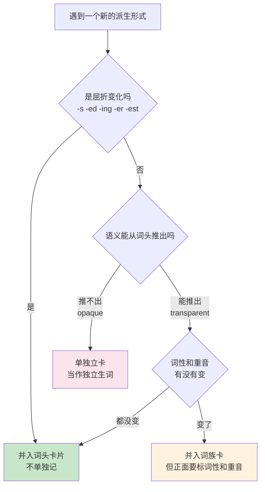
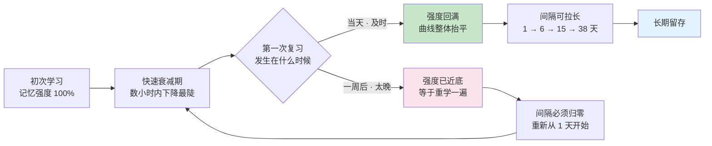
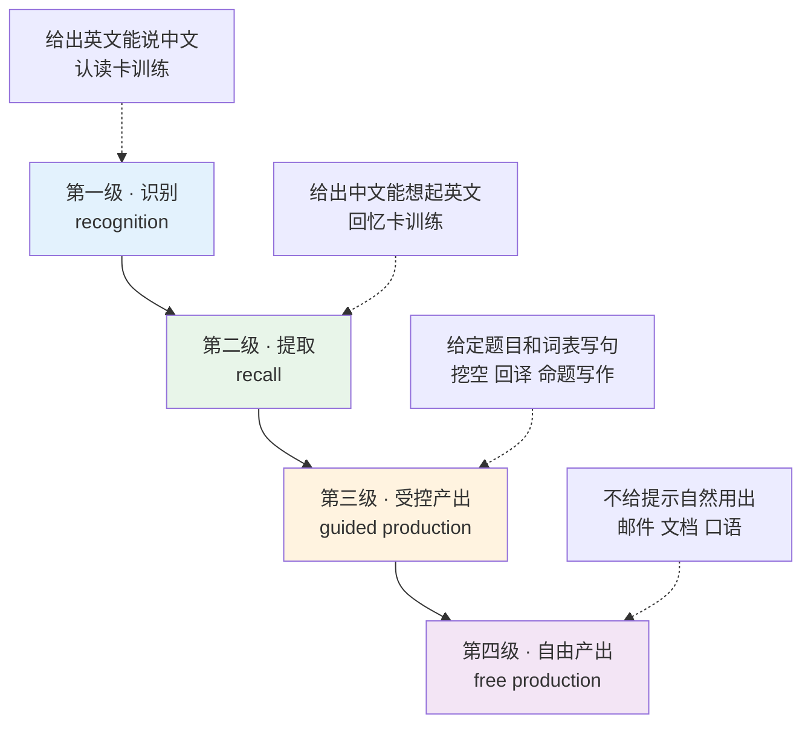
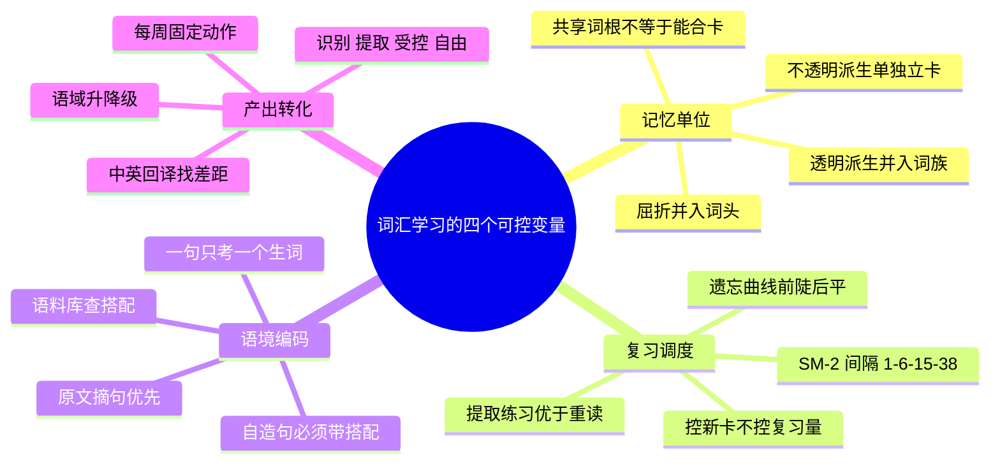

# 词汇学习方法总纲

> [!info] 本篇定位
>
> 第一章的收尾篇，也是全书唯一一篇讲操作流程而不讲具体词的篇目。
>
> 前四篇解决的是「一个词长什么样」：来源分层、拼读、音标、词典标注。这一篇解决「一个词怎么进脑子、怎么留住、怎么变成能用的」。
>
> 读完你会拿到四样可直接执行的东西：一条决定「什么算一张卡」的记忆单位判据，一组间隔重复的具体参数与调参方向，一套生词本字段设计与卡片方向的组合规则，以及四级产出训练阶梯。
>
> 本篇不推荐任何具体软件。参数以 SM-2 与 Anki 的公开默认值为锚点，换成任何一款间隔重复工具，判断逻辑不变。

---

## 1. 本篇导读：把「背单词」拆成四个可控变量

「背单词效率低」不是一个可以直接解决的问题，因为它不是一件事。它至少是四件独立的事叠在一起，任何一环出问题，整条链路的产出都会塌掉，而且症状看起来一模一样——都是「背了忘」。

| 变量 | 决定什么 | 出问题的典型症状 | 本篇位置 |
| --- | --- | --- | --- |
| 记忆单位 | 一张卡装多少东西 | 卡片越做越大，一张卡要想三十秒 | 第 2 节 |
| 复习调度 | 什么时候再见到它 | 复习队列雪崩，或复习完隔天还是忘 | 第 3、4、5 节 |
| 语境编码 | 存进去的是什么形态 | 单看认识，放进句子就不认识 | 第 6 节 |
| 产出转化 | 能不能主动调用 | 阅读没问题，一写作就只剩那几百个词 | 第 7 节 |

这四个变量的顺序不能调换。记忆单位定不下来，复习调度无从谈起——因为「一张卡」的边界都不确定；语境没编码进去，产出转化必然失败——脑子里存的是孤立的中文对应字，调不出搭配。

> [!warning] 一个必须先破除的预设
>
> 很多人默认「背单词 = 记住英文和中文的对应关系」，然后把所有精力投在增加重复次数上。
>
> 重复次数确实重要，但它只是四个变量里的一个，而且是边际收益最快衰减的那一个。同样是一天一小时，全部押在孤立词条的重复上，和分一部分给带语境的词条与产出练习，练出来的能力不是同一种：前者只抬高「认得出来」的比例，后者才动得了「写得出来」的那部分。
>
> 加重复次数是最容易执行、也最容易让人产生「我在努力」错觉的动作。它常常掩盖真正的瓶颈。

---

## 2. 记忆单位：背 lemma 还是背词族

### 2.1 三个层级的定义回顾

第 `01` 篇给过词形、词目、词族三种计数单位。计数是为了衡量词汇量，这里要用的是同一组概念的另一个用途：**决定生词本上一个条目的边界**。

| 英文 | 英式音标 | 美式音标 | 词性 | 中文 | 搭配与说明 |
| --- | --- | --- | --- | --- | --- |
| **lemma** | /ˈlemə/ | /ˈlemə/ | n. | 词目；词元 | 复数 lemmas 或 lemmata；词典的排序单位 |
| **headword** | /ˈhedwɜːd/ | /ˈhedwɜːrd/ | n. | 词条词头 | 印在词典条目最前面、加粗的那个形式 |
| **inflection** | /ɪnˈflekʃn/ | /ɪnˈflekʃn/ | n. | 屈折变化 | 英式也拼 inflexion；不改变词性 |
| **derivation** | /ˌderɪˈveɪʃn/ | /ˌderɪˈveɪʃn/ | n. | 派生 | 动词 derive；通常改变词性 |
| **derive** | /dɪˈraɪv/ | /dɪˈraɪv/ | v. | 派生；得出 | derive sth from sth 是固定搭配 |
| **affix** | /ˈæfɪks/ | /ˈæfɪks/ | n. | 词缀 | 前缀后缀的统称，动词读 /əˈfɪks/ |
| **prefix** | /ˈpriːfɪks/ | /ˈpriːfɪks/ | n. | 前缀 | 改变词义，一般不改词性 |
| **suffix** | /ˈsʌfɪks/ | /ˈsʌfɪks/ | n. | 后缀 | 主要改变词性 |
| **paradigm** | /ˈpærədaɪm/ | /ˈpærədaɪm/ | n. | 词形变化表；范式 | g 不发音，形容词 paradigmatic |
| **transparent** | /trænsˈpærənt/ | /trænsˈpærənt/ | adj. | 透明的；可推导的 | 派生义能从组成部分推出 |
| **opaque** | /əʊˈpeɪk/ | /oʊˈpeɪk/ | adj. | 不透明的；不可推导的 | 反义 transparent，重音在后 |
| **cognate** | /ˈkɒɡneɪt/ | /ˈkɑːɡneɪt/ | n./adj. | 同源词；同源的 | cognate with sth |

屈折变化不改变词性，也不需要单独学：知道 `decide` 就知道 `decides`、`decided`、`deciding`。它们和词头共享一张卡，没有争议。

派生就麻烦了。`decide` → `decision` → `decisive` → `indecisive`，词性变了，重音位置变了，语义也发生了偏移。它们该算一张卡还是四张卡？

### 2.2 判据是派生透明度，不是词族边界

Bauer 与 Nation 在 1993 年的论文 *Word Families* 中把词缀按规则性、能产性、拼写变化程度排成了七个层级，越低层级的词缀越透明、越应该并入同一个词族。这套分级是学术研究的计量工具，直接搬来当学习判据太重。实际操作只需要一个二分问题：

> **知道词头之后，看到这个派生形式，你能不能当场推出它的意思和词性？**

能推出，就并入同一张卡，作为词族记忆。推不出，就单独立卡。



这张图把决策压成了三个出口。绿色出口是零成本的——`decides` 不需要任何额外记忆动作。橙色出口是低成本的——`decision` 的语义完全可推，但重音从 `deˈcide` 移到 `deˈcision` 时元音质量变了，这个变化必须在卡上标出来，否则会读错。粉色出口才是真正的新词，要占用一次完整的学习配额。

### 2.3 press 词族：一个透明度递减的样本

`press` 这个词根的派生链条正好覆盖了从完全透明到完全不透明的全谱。

| 英文 | 英式音标 | 美式音标 | 词性 | 中文 | 搭配与说明 |
| --- | --- | --- | --- | --- | --- |
| **press** | /pres/ | /pres/ | v./n. | 按；压；新闻界 | press a button；the press 指媒体 |
| **pressure** | /ˈpreʃə/ | /ˈpreʃər/ | n./v. | 压力；施压 | under pressure；put pressure on sb |
| **compress** | /kəmˈpres/ | /kəmˈpres/ | v. | 压缩 | 名词 compression；技术文档高频 |
| **express** | /ɪkˈspres/ | /ɪkˈspres/ | v./adj. | 表达；快速的 | express an opinion；express train |
| **impress** | /ɪmˈpres/ | /ɪmˈpres/ | v. | 使印象深刻 | impress sb with sth；名词 impression |
| **depress** | /dɪˈpres/ | /dɪˈpres/ | v. | 使沮丧；压低 | depress prices；形容词 depressed |
| **suppress** | /səˈpres/ | /səˈpres/ | v. | 压制；抑制 | suppress a warning 在编程里很常见 |
| **oppress** | /əˈpres/ | /əˈpres/ | v. | 压迫 | 政治语域，oppress a minority |

`compress` 的语义能从 `com-`「一起」加 `press`「压」推出来，透明。`express` 就已经开始偏了——`ex-`「向外」加 `press`「压」推出的是「挤出去」，到「表达」还差一步联想。`suppress` 和 `oppress` 的中文都是「压」，但一个是抑制信号、一个是压迫人群，语域完全不同，靠推导得不到这个区别。

结论是：`compress` 可以挂在 `press` 的词族卡上；`express`、`suppress`、`oppress` 必须各自立卡。

### 2.4 长得像但必须分开的三类陷阱

派生透明度判据最重要的用处，是拦住那些「看起来同族、实际语义已经分家」的组合。中文母语者在这三类上翻车最多。

**第一类：-ly 后缀的假朋友。** `-ly` 通常表示「以某种方式」，但下面这几个已经词汇化了。

| 英文 | 英式音标 | 美式音标 | 词性 | 中文 | 搭配与说明 |
| --- | --- | --- | --- | --- | --- |
| **hardly** | /ˈhɑːdli/ | /ˈhɑːrdli/ | adv. | 几乎不 | 不是「努力地」；否定副词，谓语不再加 not |
| **lately** | /ˈleɪtli/ | /ˈleɪtli/ | adv. | 最近 | 不是「迟到地」；常配现在完成时 |
| **shortly** | /ˈʃɔːtli/ | /ˈʃɔːrtli/ | adv. | 不久；即将 | 不是「短地」；shortly after 高频 |
| **presently** | /ˈprezntli/ | /ˈprezntli/ | adv. | 目前；不久 | 英美义项侧重不同，容易歧义 |
| **barely** | /ˈbeəli/ | /ˈberli/ | adv. | 勉强；几乎不 | 与 hardly 近义，都是否定副词 |

> [!warning] hardly 的否定性质
>
> `hardly` 本身就是否定词，句子不能再叠一个 not。
>
> - ❌ ~~I can't hardly hear you.~~
> - ✅ **I can hardly hear you.**（我几乎听不见你说话。）
>
> 同理 `barely`、`scarcely` 也是否定副词。这三个词加上倒装还有更复杂的用法，但那属于语法范畴，本教程只管词义边界。

**第二类：-ic 与 -ical 的义项分裂。** 同一个词头挂两个后缀，多数情况下是纯风格差异，但下面这几组语义真的分家了。

| 词头 | -ic 形式 | 含义 | -ical 形式 | 含义 |
| --- | --- | --- | --- | --- |
| econom- | **economic** /ˌiːkəˈnɒmɪk/ · /ˌekəˈnɑːmɪk/ | 经济的（关于经济） | **economical** /ˌiːkəˈnɒmɪkl/ · /ˌekəˈnɑːmɪkl/ | 省钱的；节约的 |
| histor- | **historic** /hɪˈstɒrɪk/ · /hɪˈstɔːrɪk/ | 有历史意义的 | **historical** /hɪˈstɒrɪkl/ · /hɪˈstɔːrɪkl/ | 历史上的；史学的 |
| class- | **classic** /ˈklæsɪk/ · /ˈklæsɪk/ | 经典的；典型的 | **classical** /ˈklæsɪkl/ · /ˈklæsɪkl/ | 古典的（音乐、文学） |
| electr- | **electric** /ɪˈlektrɪk/ · /ɪˈlektrɪk/ | 用电的（设备本身） | **electrical** /ɪˈlektrɪkl/ · /ɪˈlektrɪkl/ | 与电有关的（领域） |

> [!example] 四组的最小对立句
>
> - This is an **economic** problem, not a technical one.
>   - 这是个经济问题，不是技术问题。
> - Taking the bus is more **economical** than driving.
>   - 坐公交比开车省钱。
> - The signing of the treaty was a **historic** moment.
>   - 条约的签署是个历史性时刻。
> - The novel is based on **historical** records.
>   - 这部小说基于史料。
> - An **electric** kettle boils water in two minutes.
>   - 电水壶两分钟就能把水烧开。
> - He works as an **electrical** engineer.
>   - 他是电气工程师。

这几组必须各自立卡。把 `economic` 和 `economical` 塞进一张卡的人，考试时能选对，写作时一定会用错。

**第三类：同词根不同后缀的形容词。** `sensible` 与 `sensitive` 共享词根 `sens`「感觉」，中文却完全不同。

| 英文 | 英式音标 | 美式音标 | 词性 | 中文 | 搭配与说明 |
| --- | --- | --- | --- | --- | --- |
| **sensible** | /ˈsensəbl/ | /ˈsensəbl/ | adj. | 明智的；合情理的 | a sensible decision；不是「敏感的」 |
| **sensitive** | /ˈsensətɪv/ | /ˈsensətɪv/ | adj. | 敏感的；灵敏的 | sensitive data；sensitive to light |
| **considerable** | /kənˈsɪdərəbl/ | /kənˈsɪdərəbl/ | adj. | 相当大的 | considerable effort；量的概念 |
| **considerate** | /kənˈsɪdərət/ | /kənˈsɪdərət/ | adj. | 体贴的 | considerate of others；人品的概念 |
| **industrial** | /ɪnˈdʌstriəl/ | /ɪnˈdʌstriəl/ | adj. | 工业的 | industrial output |
| **industrious** | /ɪnˈdʌstriəs/ | /ɪnˈdʌstriəs/ | adj. | 勤奋的 | 语域偏正式，日常说 hard-working |

这六个词的完整辨析在 `16.词义辨析与短语动词` 里展开。放在这里是为了说明记忆单位判据的实际后果：**共享词根不构成合卡的理由，语义可推导才是。**

---

## 3. 遗忘曲线：复习必须发生在忘掉之前

### 3.1 Ebbinghaus 的结论与它的适用边界

Ebbinghaus 在 1885 年的 *Über das Gedächtnis*（英译 *Memory: A Contribution to Experimental Psychology*）中用自己作被试，记忆无意义音节串，测量不同时间间隔后的重学节省率。得到的曲线形状是：**遗忘在最初几小时内最陡，之后逐渐平缓。**

这个实验有个常被忽略的前提：材料是**无意义音节**。真实词汇有语义、有语境、有已知的词根，遗忘速度比无意义音节慢得多。所以曲线的具体数值不能照搬，能照搬的是形状带来的三条推论。

**推论一：第一次复习越早，收益越高。** 曲线最陡的一段在学习后的当天。第一次复习如果拖到第七天，绝大部分内容已经掉到曲线底部，这次复习实质上等于重学一遍。

**推论二：每次成功回忆之后，下次可以推得更远。** 成功的提取会把曲线整体抬平，这是间隔递增的理论依据。

**推论三：复习必须是「回忆」，不是「重读」。** 盖住答案自己想，和把答案从头读一遍，是两种完全不同的操作，留存效果差距很大。心理学上把前者叫提取练习（retrieval practice）。



上图右侧是间隔重复算法的完整逻辑：复习成功就把下次间隔乘上一个系数往后推，复习失败就把间隔打回起点重来。所有间隔重复软件做的都是这一件事，区别只在系数怎么算、失败怎么惩罚。

图里的 1 → 6 → 15 → 38 是 SM-2 算法在默认参数下的实际序列（15 × 2.5 = 37.5，取整成 38），下一节会拆开讲这几个数字是怎么来的。

### 3.2 存储强度与提取强度

Robert Bjork 提出的 new theory of disuse 把记忆拆成两个独立的量：**存储强度**（storage strength，学得多牢）和**提取强度**（retrieval strength，此刻多容易想起来）。

这个区分解释了一个反直觉的现象：刚背完的词提取强度很高（张口就来），但存储强度很低（明天就忘）。而一个隔了两周才勉强想起来的词，提取时很费劲，但这次费劲的提取会大幅提升存储强度。

由此得到的操作原则是 Bjork 所说的「合意困难」（desirable difficulty）：**复习应该安排在快要想不起来、但还能想起来的时刻。** 太早复习是浪费——提取强度还满着，这次复习没有增益；太晚复习是重学——存储强度已归零，前面的投入白费。

| 英文 | 英式音标 | 美式音标 | 词性 | 中文 | 搭配与说明 |
| --- | --- | --- | --- | --- | --- |
| **retain** | /rɪˈteɪn/ | /rɪˈteɪn/ | v. | 保持；记住 | 名词 retention；正式语域 |
| **retention** | /rɪˈtenʃn/ | /rɪˈtenʃn/ | n. | 留存；保持 | retention rate 留存率 |
| **retrieve** | /rɪˈtriːv/ | /rɪˈtriːv/ | v. | 提取；检索 | retrieve data；技术文档高频 |
| **retrieval** | /rɪˈtriːvl/ | /rɪˈtriːvl/ | n. | 提取；检索 | retrieval practice 提取练习 |
| **recall** | /rɪˈkɔːl/ | /rɪˈkɔːl/ | v./n. | 回想起；召回 | 名词也可读 /ˈriːkɔːl/（产品召回） |
| **recognize** | /ˈrekəɡnaɪz/ | /ˈrekəɡnaɪz/ | v. | 认出 | 英式也拼 recognise |
| **recognition** | /ˌrekəɡˈnɪʃn/ | /ˌrekəɡˈnɪʃn/ | n. | 辨认；认可 | 重音在第三音节，与动词不同 |
| **consolidate** | /kənˈsɒlɪdeɪt/ | /kənˈsɑːlɪdeɪt/ | v. | 巩固；合并 | consolidate knowledge；商务义为合并 |
| **encode** | /ɪnˈkəʊd/ | /ɪnˈkoʊd/ | v. | 编码 | 反义 decode；记忆学与计算机共用 |
| **reinforce** | /ˌriːɪnˈfɔːs/ | /ˌriːɪnˈfɔːrs/ | v. | 强化 | 名词 reinforcement |
| **decay** | /dɪˈkeɪ/ | /dɪˈkeɪ/ | n./v. | 衰减；腐烂 | memory decay 记忆衰减 |
| **rehearse** | /rɪˈhɜːs/ | /rɪˈhɜːrs/ | v. | 排练；反复演练 | 名词 rehearsal |

> [!tip] recall 和 recognize 是两个不同的能力
>
> `recognize` 是给出选项后能选对，`recall` 是从零想起来。这两个词在生词本上对应两种不同的卡片方向：
>
> - EN → ZH 的卡片训练的是 recognition
> - ZH → EN 的卡片训练的是 recall
>
> 只做前一种卡片的人，词汇量测试分数会很好看，写作时依然写不出东西。第 5 节会给出卡片方向的具体配置规则。

---

## 4. 间隔重复的实际参数

### 4.1 SM-2 的三个数字

SuperMemo 的 SM-2 算法由 Piotr Woźniak 在 1987 年提出，是目前绝大多数间隔重复软件的算法源头。它的核心只有三个数字。

| 参数 | 默认值 | 作用 |
| --- | --- | --- |
| 首次间隔 | 1 天 | 新卡第一次答对后，隔 1 天再见 |
| 第二次间隔 | 6 天 | 第二次答对后，隔 6 天再见 |
| 难度系数 EF | 初始 2.5，下限 1.3 | 从第三次起，新间隔 = 上次间隔 × EF |

从第三次复习开始，间隔序列就是 1 → 6 → 15 → 37.5 → 93.75……（每次乘 2.5）。评分低于「一般」时，间隔重置回 1 天，同时把 EF 往下调；连续评「简单」会把 EF 往上调。EF 有 1.3 的下限，防止一张老是记不住的卡把间隔压到每天都出现。

理解这三个数字的意义在于：**你在软件里点的每一次「困难 / 一般 / 简单」，都是在直接修改这张卡未来几个月的出现频率。** 随手乱点会让整个队列失去调度意义。

### 4.2 Anki 默认参数与该调哪几个

Anki 的默认牌组配置是 SM-2 的一个具体实现，下面这几项是实际会影响体验的。

| 参数 | Anki 默认值 | 含义 | 调整方向 |
| --- | --- | --- | --- |
| Learning steps | 1m 10m | 新卡当天的两次短间隔 | 词汇卡够用，不必改 |
| Graduating interval | 1 天 | 学习步骤走完后的首个间隔 | 保持 1 天 |
| Easy interval | 4 天 | 新卡直接点「简单」的间隔 | 已认识的词用这个跳过 |
| Starting ease | 250% | 初始 EF | 不要手动改，交给评分调节 |
| New cards/day | 20 | 每日新卡上限 | 唯一需要认真设的参数 |
| Maximum reviews/day | 200 | 每日复习上限 | 设成 0（不限）更安全 |
| Leech threshold | 8 | 失败多少次算顽固卡 | 词汇卡可降到 6 |
| Leech action | Tag Only | 顽固卡的处理 | 改成 Suspend 更省时间 |

> [!warning] Maximum reviews 设上限会制造隐形欠账
>
> 复习上限的本意是控制每天时长，实际效果是把到期卡片挤到明天，明天又挤到后天，欠账（backlog）滚雪球。到期卡不做就是在遗忘曲线的底部继续往下掉，越拖越难。
>
> 正确的做法是控制**新卡上限**而不是复习上限。新卡是入口，复习是出口，堵出口只会爆管。

### 4.3 每日新词上限怎么定

这是唯一需要自己算的参数，逻辑是：**稳态复习量由新词速度反推，不是由意愿决定。**

按 4.1 节的间隔序列（取整后是 1、6、15、38、94 天……），一张卡在进入牌组后的第一年里会被复习五到六次，中途失败一次就要多加两到三次。队列跑到稳定状态之后，每天要清的复习量，等于过去一年里每天新增的那批卡各自在今天到期的部分加总。写成一个粗略的比例关系：

```text
稳态每日复习量 ≈ 每日新卡数 × 一张卡在第一年内的平均复习次数
每日新卡 20 张 × 平均 6 到 10 次 → 稳态复习量大致落在 120 到 200 张之间
```

> [!warning] 上面这个估算不是研究数据
>
> 它是一个数量级参考，用来提醒新卡数与复习量之间存在放大关系，实际值受你的正确率、评分习惯、卡片类型影响很大。
>
> 判断自己的参数是否合适，靠的是观察而不是计算：**连续跑两周，看每天的复习量有没有稳定下来。** 稳不下来、持续上涨，就是新卡开太多了。

实操上的建议顺序是：

1. 第一周新卡设成 10 张，把流程跑通，别管进度。
2. 第二、三周观察复习量曲线。如果每天复习时间稳定在你能承受的范围内，把新卡上调到 15 或 20。
3. 出现任何一次「今天不想打开」的念头，立刻把新卡砍半，先把队列清空。
4. 长假、出差、加班期前一周主动把新卡调到 0，只做复习。

### 4.4 FSRS 与目标留存率

Anki 较新版本内置了 FSRS 调度器，它用你自己的复习历史拟合参数，而不是用固定的 EF。对使用者来说需要理解的只有一个参数：**desired retention（目标留存率），默认 0.9。**

| 目标留存率 | 含义 | 代价 |
| --- | --- | --- |
| 0.85 | 复习时约 15% 想不起来 | 复习量最低，但漏词更多 |
| 0.90 | 约 10% 想不起来 | 默认值，成本与效果的平衡点 |
| 0.95 | 约 5% 想不起来 | 间隔被压短，复习量明显上升 |

从 0.9 调到 0.95 看起来只提高了 5 个百分点，但因为间隔要成比例缩短，复习负载的增长远不止 5%。除非有硬性的考试日期，否则 0.9 是更可持续的选择。

| 英文 | 英式音标 | 美式音标 | 词性 | 中文 | 搭配与说明 |
| --- | --- | --- | --- | --- | --- |
| **interval** | /ˈɪntəvl/ | /ˈɪntərvl/ | n. | 间隔 | at regular intervals |
| **spacing** | /ˈspeɪsɪŋ/ | /ˈspeɪsɪŋ/ | n. | 间隔安排 | the spacing effect 间隔效应 |
| **repetition** | /ˌrepəˈtɪʃn/ | /ˌrepəˈtɪʃn/ | n. | 重复 | spaced repetition 间隔重复 |
| **schedule** | /ˈʃedjuːl/ | /ˈskedʒuːl/ | n./v. | 日程；安排 | 英美读音差异最大的常用词之一 |
| **due** | /djuː/ | /duː/ | adj. | 到期的 | due today；美音 d 后无 /j/ |
| **overdue** | /ˌəʊvəˈdjuː/ | /ˌoʊvərˈduː/ | adj. | 逾期的 | an overdue review |
| **backlog** | /ˈbæklɒɡ/ | /ˈbæklɔːɡ/ | n. | 积压 | clear the backlog；敏捷开发也用 |
| **threshold** | /ˈθreʃhəʊld/ | /ˈθreʃhoʊld/ | n. | 阈值；门槛 | 中间的 h 可发可不发 |
| **deck** | /dek/ | /dek/ | n. | 一副牌；牌组 | Anki 里指一组卡片 |
| **flashcard** | /ˈflæʃkɑːd/ | /ˈflæʃkɑːrd/ | n. | 记忆卡片 | 也写 flash card |
| **lapse** | /læps/ | /læps/ | n./v. | 失误；失效 | a memory lapse 记忆失误 |
| **cue** | /kjuː/ | /kjuː/ | n./v. | 提示；线索 | a retrieval cue 提取线索 |
| **prompt** | /prɒmpt/ | /prɑːmpt/ | n./v./adj. | 提示；及时的 | 卡片正面的提示内容 |

---

## 5. 生词本的字段设计与卡片方向

### 5.1 一个词条应该记哪些字段

第 `01` 篇讲过学会一个词有五个维度：词形、词义、搭配、语域、频率。生词本的字段就是这五个维度的落地。

| 字段 | 是否必填 | 内容 | 为什么需要 |
| --- | --- | --- | --- |
| 词头 | 必填 | 词典的 headword 形式 | 记忆单位的锚点 |
| 音标 | 必填 | 英式 + 美式各一 | 没有音标就是在记字母串，无法听说 |
| 词性 | 必填 | n. / v. / adj. 等 | 同形不同性的词必须分开 |
| 中文 | 必填 | 只写本次遇到的那个义项 | 一次记一个义项，多义分次加 |
| 原句 | 必填 | 你遇到它的那句原文 | 提取线索的主要来源 |
| 自造句 | 高频词必填 | 自己写的、与本职工作相关的句子 | 产出转化的起点 |
| 搭配 | 高频词必填 | 两到三条典型搭配 | 决定能不能写对 |
| 来源 | 建议填 | 书名 + 页码，或 URL | 复习时能回到上下文 |
| 遇见次数 | 建议填 | 计数器，每次重遇加一 | 判断该不该升级到产出卡 |
| 状态 | 建议填 | 接受 / 产出 | 决定做哪几个方向的卡 |

> [!tip] 原句字段是整张卡的地基
>
> 只填词头和中文的卡片，本质上是把「记忆」压缩成一次孤立的配对，脑子里没有任何可以攀附的线索。
>
> 摘一句原文进去，成本只多十秒钟，但复习时脑子里跑的是「那篇讲重试机制的文档里，作者说加重试是为了 mitigate 什么风险来着」。这条通路比「mitigate = 缓解」牢固得多。
>
> 原句必须是**你亲眼在真实材料里读到的那一句**，不是词典例句。词典例句是备选方案，不是首选。

### 5.2 四种卡片方向

同一个词条可以生成不同方向的卡片，训练的是不同能力。

| 卡片方向 | 正面 | 背面 | 训练什么 | 成本 |
| --- | --- | --- | --- | --- |
| 认读卡 | 英文词 | 中文 + 音标 | recognition（接受性） | 低 |
| 回忆卡 | 中文 + 词性提示 | 英文词 + 拼写 | recall（产出性） | 高 |
| 挖空卡 | 挖掉目标词的原句 | 完整句 | 搭配与语境 | 中 |
| 听写卡 | 音频（或音标） | 拼写 | 音形对应 | 中 |

四种方向不该无差别全上。全上会让每个词的复习成本变成四倍，队列迅速失控。配置规则按词的频率与用途分档：

| 词的档位 | 判断方法 | 配哪几种卡 |
| --- | --- | --- |
| 高频核心词 | 一周内在不同材料里遇到两次以上 | 认读 + 回忆 + 挖空 |
| 中频常用词 | 偶尔遇到，写作时想用但想不起来 | 认读 + 挖空 |
| 低频专业词 | 只在特定领域文档里出现 | 只做认读 |
| 可推导派生词 | 词根已掌握，词缀规则已掌握 | 不建卡，靠推导 |

> [!warning] 回忆卡不要给低频词做
>
> 中→英的回忆卡成本是认读卡的三到四倍：要想起拼写、想起词性、想起搭配。把这个成本花在一个你一年用不上两次的专业词上，是纯粹的浪费。
>
> 判断标准很简单：**你会不会在自己写的东西里主动用它？** 不会，就只做认读卡。

### 5.3 挖空卡的写法

挖空卡（cloze）是四种里性价比最高的一种，因为它同时训练了语境和搭配。写法有三条硬要求。

**一句只挖一个空。** 挖两个空的卡在评分时无法判定——对一个错一个算什么？评分失真会污染整条调度链。

**挖掉的必须是目标词，不是随便一个词。** 挖 `the`、`a` 这种功能词对词汇学习毫无价值。

**保留足够的搭配线索。** 挖空后剩下的句子必须还能唯一确定答案。

> [!example] 挖空卡的对错示范
>
> 原句：We added a retry to **mitigate** the risk of transient network failures.
>
> - ❌ We added a retry to \_\_\_\_\_ the \_\_\_\_\_ of transient network failures.
>   - 挖了两个空，无法评分。
> - ❌ We added \_\_\_\_\_ retry to mitigate the risk of transient network failures.
>   - 挖的是冠词，与词汇学习无关。
> - ✅ We added a retry to \_\_\_\_\_ the risk of transient network failures.
>   - 保留了 `the risk of`，`mitigate the risk` 这条搭配被同时训练到了。

### 5.4 程序员的落地方案

生词本不必用现成的 App。纯文本方案在可控性上更好，也更符合本教程读者的工作习惯。

一个可行的组合是：用 Markdown 表格或 TSV 记录词条，字段顺序固定；写一个短脚本把 TSV 转成 Anki 可导入的格式，或者直接用 Obsidian 的间隔重复插件在同一个库里做复习。

```text
词头 <TAB> 英式音标 <TAB> 美式音标 <TAB> 词性 <TAB> 中文 <TAB> 原句 <TAB> 自造句 <TAB> 搭配 <TAB> 来源
```

用纯文本的三个实际好处：字段可以随时批量改；可以用 grep 反查「我记过哪些含 press 的词」；进 git 之后每一次增删都有记录，能看出自己在哪个阶段加了什么词。

> [!tip] 不要在工具上花超过一个下午
>
> 换软件是最典型的伪学习动作——它有明确的进度感、有立刻可见的成果、而且完全不需要动脑记词。
>
> 定一个硬规则：工具配置一次成型，此后半年内不许换。工具的差别对结果的影响，远小于「今天有没有坐下来做完到期卡」。

---

## 6. 语境记忆：例句从哪来，怎么自造

### 6.1 孤立词表为什么失效

孤立词表给出的是「英文词 ↔ 中文词」的一对一映射，而真实语言里这个映射从来不是一对一的。三个具体的失效点：

**失效点一：缺搭配。** 记住 `mitigate = 缓解`，写作时会写出 `mitigate the problem`——语法没错，但母语者说 `mitigate the risk`、`mitigate the impact`、`mitigate the damage`。搭配不是逻辑推出来的，是使用惯例。

**失效点二：缺语域。** 记住 `commence = 开始`，日常邮件里写 `We'll commence the meeting shortly`，语域跳档。

**失效点三：缺提取线索。** 孤立词条只有一条通路（词形 → 中文），一旦这条通路失效就彻底想不起来。带语境的词条有多条通路：句子的画面、遇到它的那篇文档、自己造句时想到的那件事。

| 英文 | 英式音标 | 美式音标 | 词性 | 中文 | 搭配与说明 |
| --- | --- | --- | --- | --- | --- |
| **context** | /ˈkɒntekst/ | /ˈkɑːntekst/ | n. | 上下文；语境 | in context；out of context |
| **collocation** | /ˌkɒləˈkeɪʃn/ | /ˌkɑːləˈkeɪʃn/ | n. | 搭配 | 动词 collocate /ˈkɒləkeɪt/ |
| **corpus** | /ˈkɔːpəs/ | /ˈkɔːrpəs/ | n. | 语料库 | 复数 corpora /ˈkɔːpərə/ |
| **concordance** | /kənˈkɔːdns/ | /kənˈkɔːrdns/ | n. | 索引；一致 | 语料库里目标词的上下文列表 |
| **authentic** | /ɔːˈθentɪk/ | /ɑːˈθentɪk/ | adj. | 真实的；原版的 | authentic material 原版材料 |
| **gloss** | /ɡlɒs/ | /ɡlɑːs/ | n./v. | 注释；加注 | gloss a word；也指光泽 |
| **salient** | /ˈseɪliənt/ | /ˈseɪliənt/ | adj. | 显著的；突出的 | the salient point |
| **ambiguous** | /æmˈbɪɡjuəs/ | /æmˈbɪɡjuəs/ | adj. | 有歧义的 | 名词 ambiguity |
| **vivid** | /ˈvɪvɪd/ | /ˈvɪvɪd/ | adj. | 生动的；鲜明的 | a vivid image |
| **mnemonic** | /nɪˈmɒnɪk/ | /nɪˈmɑːnɪk/ | n./adj. | 助记法；助记的 | 开头的 m 不发音 |
| **imagery** | /ˈɪmɪdʒəri/ | /ˈɪmɪdʒəri/ | n. | 意象；形象 | mental imagery 心理意象 |
| **association** | /əˌsəʊsiˈeɪʃn/ | /əˌsoʊsiˈeɪʃn/ | n. | 联想；协会 | associate sth with sth |

### 6.2 例句的三个来源，按优先级排

**第一优先：原文摘句。** 你自己在读的技术文档、原版书、邮件里遇到的那一句。这是最好的来源，因为它自带你当时的阅读情境，提取线索最强。

**第二优先：语料库检索。** 想知道一个词真实的搭配分布，去查语料库。SkELL 和 COCA 都提供词的搭配列表和真实例句。用法是：输入目标词，看它最常见的名词宾语或形容词修饰语是哪几个，挑一条最典型的抄进生词本。

**第三优先：词典例句。** 学习型词典（LDOCE、OALD、Cambridge）的例句是专门为学习者编写的，搭配典型、语域标注清楚。缺点是它没有你的个人情境，提取线索比原文摘句弱。

> [!warning] 不要用机翻或 AI 生成的例句当唯一来源
>
> 生成的句子语法通常没问题，但搭配可能是「统计上合理、使用上不地道」的组合。作为补充可以，作为唯一来源不行。
>
> 判定方法：把生成的搭配放进语料库查一下出现频率。查不到几条，就说明这个搭配母语者不这么说。

### 6.3 自造句的四条判据

自造句是从接受性词汇迈向产出性词汇的第一步，也是最容易敷衍的一步。四条判据用来防止敷衍。

**判据一：必须包含目标词的典型搭配，不能只把词塞进去。**

> [!example] 搭配到位与不到位
>
> - ❌ ~~I want to mitigate.~~
>   - 语法勉强成立，但没有任何搭配信息，等于白造。
> - ✅ We added exponential backoff to **mitigate the impact** of rate limiting.
>   - 我们加了指数退避来减轻限流的影响。（`mitigate the impact` 是真实搭配）

**判据二：必须与自己的真实生活或工作绑定。** 把要记的东西和自己挂上钩会提升留存，认知心理学里把这个现象叫自我参照效应（self-reference effect）。同样是造 `mitigate` 的句子，写「公司上周的限流事故」比写「The government mitigated the crisis」记得牢。

**判据三：一句只考一个生词。** 把三个新词塞进同一句，会造出一个自己都读不顺的怪句子，而且复习时无法判断到底哪个词记住了。

**判据四：必须自己写。** 抄词典例句填进「自造句」字段等于没有这个字段。这一步的价值不在于句子写得多好，而在于**你被迫在脑子里做了一次从中文意图到英文形式的检索**——那正是产出性词汇的定义。

### 6.4 三个词的完整自造示范

| 目标词 | 典型搭配 | 敷衍的句子 | 合格的自造句 |
| --- | --- | --- | --- |
| **mitigate** /ˈmɪtɪɡeɪt/ | mitigate the risk \| the impact | This can mitigate. | We cache the response to mitigate the risk of hitting the rate limit. |
| **deprecate** /ˈdeprəkeɪt/ | deprecate an API \| a method | They deprecate it. | The team deprecated the old endpoint but kept it working for six months. |
| **trade-off** /ˈtreɪd ɒf/ · /ˈtreɪd ɔːf/ | a trade-off between A and B | There is a trade-off. | There's a trade-off between read latency and storage cost here. |

第三列的句子都符合语法，但没有一句包含搭配信息，复习时也回想不起任何画面。第四列的句子写的是自己真实做过的事，`mitigate the risk of`、`deprecate the endpoint`、`a trade-off between A and B` 三条搭配同时被固化。

---

## 7. 从被动词汇到主动词汇的产出训练

### 7.1 四级阶梯

接受性词汇转成产出性词汇不是一步跳过去的，中间有明确的中间态。



上图的关键在第二级到第三级这一跳。绝大多数学习者卡在这里：能看懂、也能在中英对照时想起来，但一到自己组织语言就绕回那几百个熟词。原因是第二级的训练是**单点提取**（一个词对一个词），第三级要求的是**在句子约束下提取**（还要同时管词性、搭配、时态）。

跨过这一跳只有一个办法：**做受控产出练习，而且要有反馈。** 只做卡片永远跨不过去，因为卡片训练的是第二级。

### 7.2 五种受控产出训练

| 方法 | 具体做法 | 训练什么 | 建议频率 | 时间成本 |
| --- | --- | --- | --- | --- |
| 挖空复述 | 遮住原句里的目标词，口头补出来 | 搭配 + 提取速度 | 每次复习顺带 | 每张卡 5 秒 |
| 中英回译 | 看着自己写的中文译文，回译成英文，再和原文对照 | 句法 + 选词 | 每周两次 | 每次 20 分钟 |
| 命题写作 | 从本周生词里抽 5 个，写一段 100 词的短文 | 自由组合能力 | 每周一次 | 每次 30 分钟 |
| 语域升降级 | 把一句话在口语版和正式版之间互相改写 | 语域敏感度 | 每周一次 | 每次 15 分钟 |
| 自言自语 | 用目标词口头描述今天做的一件事 | 口语提取速度 | 每天 | 每次 5 分钟 |

**中英回译是性价比最高的一种。** 做法是：挑一段你读过的英文原文（150 词左右），先自己翻成中文，隔一天之后只看中文译文，把它译回英文，然后逐句和原文对照。对照时不看语法对错，只看两件事——原文用了哪个词而你用了另一个词，原文用了哪个搭配而你想不起来。

这个方法的价值在于它提供了**明确的参照答案**。自由写作没有参照，写完不知道哪里不地道；回译有原文兜底，差距一目了然。

> [!example] 一次回译对照的实际差距
>
> 原文：The change **introduced a subtle bug** that only **surfaced under heavy load**.
>
> - 我的回译：The change made a small bug that only appeared when the load was high.
>   - 语法全对，但三处不地道：`made a bug` 应该是 `introduced a bug`；`small` 描述 bug 的隐蔽性应该用 `subtle`；`appeared when the load was high` 母语者说 `surfaced under heavy load`。
>
> 三处差距对应三条要进生词本的搭配：`introduce a bug`、`a subtle bug`、`under heavy load`。

### 7.3 语域升降级练习

这项练习直接对应第 `01` 篇讲的三层来源结构：日耳曼层口语、法语层中性、拉丁层正式。练习方式是拿一句话，在两个语域之间来回改写。

| 概念 | 口语 / 日常 | 中性 / 书面 | 正式 / 学术 |
| --- | --- | --- | --- |
| 开始 | **start** /stɑːt/ · /stɑːrt/ | **begin** /bɪˈɡɪn/ | **commence** /kəˈmens/ |
| 使用 | **use** /juːz/ | **employ** /ɪmˈplɔɪ/ | **utilize** /ˈjuːtəlaɪz/ |
| 显示 | **show** /ʃəʊ/ · /ʃoʊ/ | **indicate** /ˈɪndɪkeɪt/ | **demonstrate** /ˈdemənstreɪt/ |
| 想出 | **think up** /ˌθɪŋk ˈʌp/ | **devise** /dɪˈvaɪz/ | **formulate** /ˈfɔːmjuleɪt/ · /ˈfɔːrmjuleɪt/ |
| 减少 | **cut** /kʌt/ | **reduce** /rɪˈdjuːs/ · /rɪˈduːs/ | **diminish** /dɪˈmɪnɪʃ/ |
| 弄清 | **find out** /ˌfaɪnd ˈaʊt/ | **determine** /dɪˈtɜːmɪn/ · /dɪˈtɜːrmɪn/ | **ascertain** /ˌæsəˈteɪn/ · /ˌæsərˈteɪn/ |
| 处理 | **deal with** /ˈdiːl wɪð/ | **handle** /ˈhændl/ | **address** /əˈdres/ |
| 说明 | **tell** /tel/ | **explain** /ɪkˈspleɪn/ | **elucidate** /ɪˈluːsɪdeɪt/ |

> [!warning] 升级练习不是「往高级词换」
>
> 这个表最常被误用成「写作时把左列换成右列」。那正是第 `01` 篇警告过的中文学习者典型偏差。
>
> 练习的目的是**建立三档之间的映射**，让你在任何场合都能取出对档位的那个词。日常邮件里该用 `start` 就用 `start`，论文方法部分该用 `commence` 才用 `commence`。
>
> - ❌ Hi Tom, I'd like to **commence** our discussion on the API design.
> - ✅ Hi Tom, I'd like to **start** our discussion on the API design.
> - ✅ The trial **commenced** on 3 March 2025.（法律文书语域）

### 7.4 产出训练词汇

做产出训练本身也需要一批词，尤其是描述自己写作动作的那些。

| 英文 | 英式音标 | 美式音标 | 词性 | 中文 | 搭配与说明 |
| --- | --- | --- | --- | --- | --- |
| **paraphrase** | /ˈpærəfreɪz/ | /ˈpærəfreɪz/ | v./n. | 改述 | 换词换句式但保义 |
| **rephrase** | /ˌriːˈfreɪz/ | /ˌriːˈfreɪz/ | v. | 重新措辞 | 比 paraphrase 更口语 |
| **articulate** | /ɑːˈtɪkjuleɪt/ | /ɑːrˈtɪkjuleɪt/ | v. | 清晰表达 | 形容词读 /ɑːˈtɪkjulət/、美 /ɑːrˈtɪkjulət/，末音节不同 |
| **elaborate** | /ɪˈlæbəreɪt/ | /ɪˈlæbəreɪt/ | v. | 详细阐述 | elaborate on sth；形容词读 /ɪˈlæbərət/ |
| **summarize** | /ˈsʌməraɪz/ | /ˈsʌməraɪz/ | v. | 概括 | 英式也拼 summarise |
| **draft** | /drɑːft/ | /dræft/ | n./v. | 草稿；起草 | a first draft；英美元音差异明显 |
| **output** | /ˈaʊtpʊt/ | /ˈaʊtpʊt/ | n./v. | 产出 | comprehensible output 可理解输出 |
| **fluency** | /ˈfluːənsi/ | /ˈfluːənsi/ | n. | 流利度 | 形容词 fluent |
| **accuracy** | /ˈækjərəsi/ | /ˈækjərəsi/ | n. | 准确度 | 与 fluency 常成对讨论 |
| **hesitate** | /ˈhezɪteɪt/ | /ˈhezɪteɪt/ | v. | 犹豫 | 名词 hesitation |
| **interference** | /ˌɪntəˈfɪərəns/ | /ˌɪntərˈfɪrəns/ | n. | 干扰 | L1 interference 母语干扰 |
| **distinguish** | /dɪˈstɪŋɡwɪʃ/ | /dɪˈstɪŋɡwɪʃ/ | v. | 区分 | distinguish A from B |
| **coin** | /kɔɪn/ | /kɔɪn/ | v./n. | 创造（词）；硬币 | coin a term 造一个术语 |

---

## 8. 六种常见失效模式与排查

这一节按症状排列，每条给出症状、判据、修法。出现任何一条，说明前面某个变量设错了。

### 8.1 只加不删，队列雪崩

**症状**：到期卡数量持续上涨，某天打开软件看到三位数就直接关掉了。

**判据**：连续七天，每天的到期卡数都比前一天多。

**修法**：新卡上限立刻设 0，先把积压清空。清空后从 5 张/天重新起步，观察两周再往上加。**不要用「一次性突击清完」的办法**——突击清出来的正确率极低，等于把这批卡全部推回起点，两周后会再爆一次。

同时启用 leech 自动挂起：连续失败 6 次的卡直接停掉，从队列里移出去。这些卡往往是卡片本身设计有问题（挖了两个空、装了五个义项、原句抄错了），继续挂在队列里只会持续消耗时间。

### 8.2 卡片做太大

**症状**：一张卡要想二十秒以上，或者背面内容长到需要滚动。

**判据**：打开背面，数一下里面有几个独立的信息点。超过三个就是太大了。

**修法**：拆卡。一个词有五个义项，就先只记这次遇到的那一个，其余义项等到实际遇到时再加。多义词的处理原则是**按遇到的顺序分次加入，不要一次性把词典条目搬进来**。

> [!example] 一张过大的卡该怎么拆
>
> 原卡背面：`raise` /reɪz/ v. 1. 举起 2. 提高 3. 提出 4. 抚养 5. 筹集；raise a question / raise money / raise children / raise prices；与 rise 区分，rise 是不及物。
>
> 拆成：
>
> - 卡 A：`raise the price` → 提价（这次在原文里遇到的用法）
> - 卡 B：`raise a question` → 提出问题（下次遇到时再加）
> - 卡 C：`raise` vs `rise` 的及物性对比（单独立一张辨析卡）
>
> 卡 D、E（抚养、筹集）先不建，等真正遇到再说。

### 8.3 靠眼熟骗过自己

**症状**：复习时几乎全对，但一到实际阅读还是卡壳。

**判据**：翻开背面之前，问自己一句「我刚才是真的想出来了，还是看到答案才觉得眼熟」。诚实回答，如果是后者，这张卡应该判错。

**修法**：三件事同时做。第一，评分要严——想不起来就判「重来」，不要因为「看了答案就懂了」而判「一般」。第二，增加回忆卡（中→英）的比例，认读卡太容易蒙混过关。第三，把挖空卡的比例提上去，句子约束会逼出真实水平。

### 8.4 全部词一视同仁

**症状**：牌组里既有 `nevertheless` 也有 `thermodynamic`，每个词都做了四种卡。

**判据**：随机抽十张卡，问「这个词我这辈子会不会主动写出来」。如果超过三张答案是「不会」，说明卡型配置过度了。

**修法**：按第 5.2 节的档位表重配。低频专业词只留认读卡，把回忆卡和挖空卡挂起。省下来的时间投到高频词的产出训练上，收益差着数量级。

### 8.5 只输入不输出

**症状**：阅读越来越顺，写作和口语原地踏步，用来用去还是那几百个词。

**判据**：打开自己上个月写的三封英文邮件，统计里面用到的动词。如果反复出现的是 `do`、`make`、`get`、`have`、`use`、`think`，就是典型的产出词汇冻结。

**修法**：第 7.2 节的五种训练里挑两种，写进日程，当成固定动作而不是「有空就做」。最低配置是：每周一次回译（20 分钟）加每天一次自言自语（5 分钟）。

> [!tip] 判断产出训练有没有起效的一个指标
>
> 不看写了多少，看**回译对照时的差距条数**。第一个月每 150 词的段落里可能找出 8 到 10 处不地道，三个月后如果降到 3 到 4 处，说明训练在起效。
>
> 这个数字是你自己的基线对比，不是绝对标准。不要拿它和别人比。

### 8.6 换软件综合症

**症状**：一年内换了四款背单词软件，每款用两周。

**判据**：想一想上次换软件之后，实际背下来的词比换之前多了多少。

**修法**：定一个硬期限——当前工具至少用满六个月，期间不许评估任何替代品。工具选择对结果的影响远小于执行的连续性。

---

## 9. 一套可执行的周计划

### 9.1 每日固定动作

| 时段 | 动作 | 时长 | 可否跳过 |
| --- | --- | --- | --- |
| 早 | 清空到期复习卡 | 15-25 分钟 | 不可跳过 |
| 早 | 学新卡（按设定上限） | 10 分钟 | 队列紧张时跳过 |
| 全天 | 遇到生词随手记进临时列表 | 每条 20 秒 | 不可跳过 |
| 晚 | 从临时列表挑 3-5 个建正式卡 | 15 分钟 | 可隔天补 |
| 晚 | 自言自语，用今天的新词说一件事 | 5 分钟 | 可跳过但不建议 |

> [!tip] 临时列表和正式生词本要分开
>
> 阅读时遇到生词就停下来建完整卡片，会把阅读节奏彻底打断，读一页要半小时。
>
> 正确流程是两段式：读的时候只记词头和页码（20 秒），晚上再统一挑选、查词典、写自造句。**而且不是全部录入——挑的过程本身就是一次筛选**，一天下来觉得只有三个词值得记，那就只记三个。

### 9.2 每周固定动作

| 频次 | 动作 | 时长 | 目的 |
| --- | --- | --- | --- |
| 每周两次 | 中英回译一段 150 词原文 | 20 分钟 | 找出选词与搭配差距 |
| 每周一次 | 抽 5 个本周新词写 100 词短文 | 30 分钟 | 自由组合能力 |
| 每周一次 | 语域升降级改写练习 | 15 分钟 | 语域敏感度 |
| 每周一次 | 检查队列健康度 | 5 分钟 | 看到期卡趋势、leech 数量 |
| 每月一次 | 清理牌组，删掉不值得留的卡 | 30 分钟 | 控制总量 |

### 9.3 队列健康度检查清单

每周花五分钟看四个数，比看「今天背了多少词」有用得多。

| 指标 | 健康范围 | 超标说明 | 处理 |
| --- | --- | --- | --- |
| 到期卡趋势 | 七天内基本持平 | 持续上涨 | 新卡上限砍半 |
| 复习正确率 | 85%-92%（对应 0.9 的目标留存率） | 低于 80% | 卡片太大或新卡太快 |
| leech 卡数量 | 占总卡数很小一部分 | 明显增多 | 逐张检查卡片设计 |
| 产出训练完成数 | 每周至少两次 | 连续两周为 0 | 排进日程，不靠自觉 |

> [!warning] 正确率过高也是问题
>
> 正确率长期在 97% 以上，说明复习安排得太密了——每次复习时提取强度还很高，这次复习没有产生增益。
>
> 按第 3.2 节的合意困难原则，**留出 10% 左右的失败率是正常且必要的**。全对不是好消息，是在浪费时间。

### 9.4 三个阶段的重点迁移

方法本身要随阶段调整，不是一套参数用到底。

| 阶段 | 判断标志 | 重点 | 卡型配置 |
| --- | --- | --- | --- |
| 起步期（前 3 个月） | 每百词生词超过 5 个 | 建立流程习惯，高频词打底 | 认读为主，少量回忆卡 |
| 爬坡期（3-12 个月） | 每百词生词 2-5 个 | 中频词批量积累 + 构词法 | 认读 + 挖空，高频词加回忆卡 |
| 精度期（12 个月后） | 每百词生词少于 2 个 | 辨析、搭配、语域 | 挖空为主，大量产出训练 |

起步期最忌讳的是急着做产出训练——手上没有足够的词可用，练也练不出东西。精度期最忌讳的是继续无脑加新词——这个阶段的瓶颈已经不是词量，是精度。

---

## 10. 本篇小结



这张图把全篇压回到第 1 节那张表：四个分支就是四个可控变量，每个分支下面挂的是本篇给出的具体判据。排查问题时按分支走——症状落在哪一支，就回去检查那一支的三到四条判据，而不是笼统地归因成「不够努力」。

> [!success] 本篇核心要点回顾
>
> 1. 「背单词效率低」不是一个问题，是**记忆单位、复习调度、语境编码、产出转化**四个变量叠加的结果。加重复次数只作用于其中一个，而且边际收益衰减最快。
> 2. 决定记忆单位的判据是**派生透明度**，不是词族边界。屈折变化并入词头，能推导的派生并入词族卡，推不出来的（`suppress`、`hardly`、`economical`）必须单独立卡。
> 3. 共享词根**不构成合卡理由**。`sensible` 与 `sensitive`、`considerable` 与 `considerate` 词根相同、语义分家，合卡必然出错。
> 4. Ebbinghaus 遗忘曲线的可操作推论是三条：第一次复习越早收益越高、成功回忆后间隔可拉长、复习必须是回忆而不是重读。
> 5. 间隔重复要调的参数只有一个——**每日新卡上限**。复习量是新卡量的放大结果，堵复习出口只会制造欠账雪崩。
> 6. 四种卡片方向对应四种能力，**不该无差别全上**。高频词做认读加回忆加挖空，低频专业词只做认读。
> 7. 例句来源按优先级是：原文摘句 > 语料库检索 > 词典例句。自造句必须带典型搭配、必须绑定自己的真实工作、一句只考一个词、必须自己写。
> 8. 被动转主动卡在「单点提取」到「句子约束下提取」这一跳，跨过去只能靠受控产出训练。**中英回译是性价比最高的一种**，因为它自带参照答案。

> [!success] 本篇练习清单
>
> - [ ] 判断 `press` 词族里哪几个词可以合卡、哪几个必须单独立卡，写出理由
> - [ ] 用 `economic` / `economical`、`historic` / `historical` 各造一句，检查是否用对
> - [ ] 打开你现在用的背单词工具，找到「每日新卡上限」和「每日复习上限」两项，按第 4 节调好
> - [ ] 按第 5.1 节的字段表建一个空白生词本模板，字段顺序固定下来
> - [ ] 从今天读的材料里摘三个生词，每个写一条含典型搭配的自造句，检查是否满足四条判据
> - [ ] 挑一段 150 词的英文原文做一次完整回译，把对照出的差距条数记下来当基线
> - [ ] 用语域三档表把「我们下周开始这个项目」写成口语版和正式版两种说法
> - [ ] 对照第 8 节的六种失效模式，找出自己中了哪几条，各写一条修法

### 10.1 下一篇预告

> [!info] 下一篇：词汇量自测与目标设定
>
> 本篇给了方法，下一篇解决方法之前的问题：**你现在在哪，要去哪。**
>
> [[01.词汇入门与学习方法/06.词汇量自测、CEFR 对照与目标设定\|词汇量自测、CEFR 对照与目标设定]]
>
> 会覆盖三种主流词汇量测试各自的计数口径与换算方法、CEFR 六级（A1 到 C2）与词汇量的对应区间、如何用文本覆盖率反推自己的当前水平，以及怎么把「读懂英文技术文档」这种模糊目标拆成可验证的阶段指标。
>
> 定位做完，第一章的工具层就配齐了：知道词从哪来、会拼读、会查词典、有方法、知道起点，然后才轮到第 `02` 章开始真正的词表积累。
