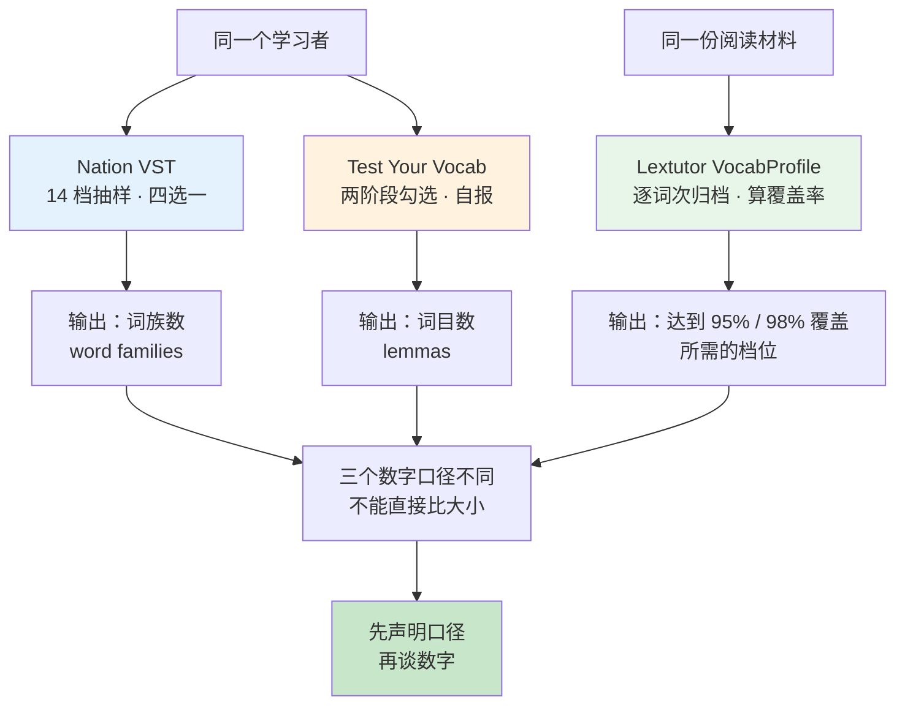
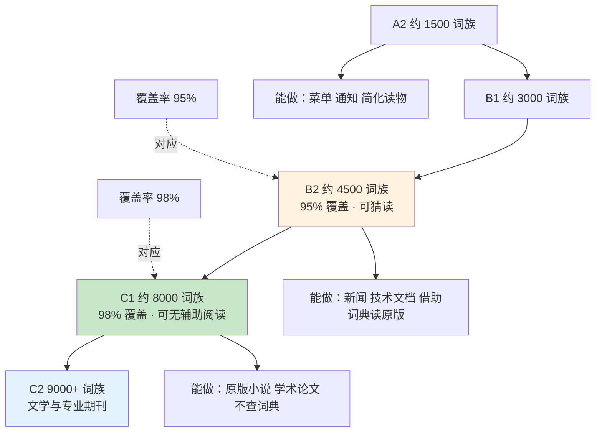
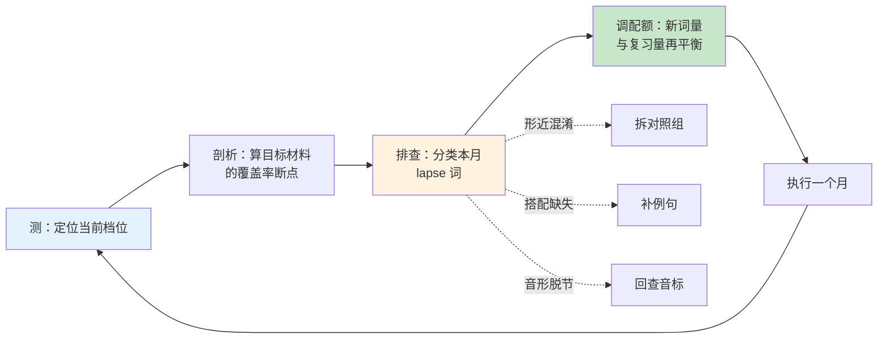
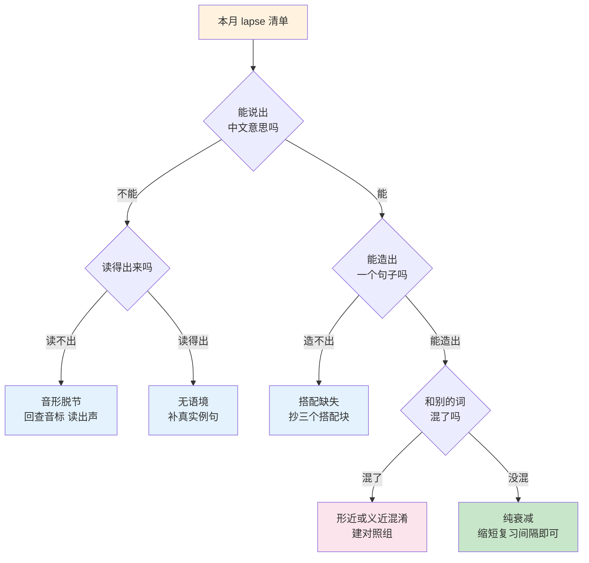
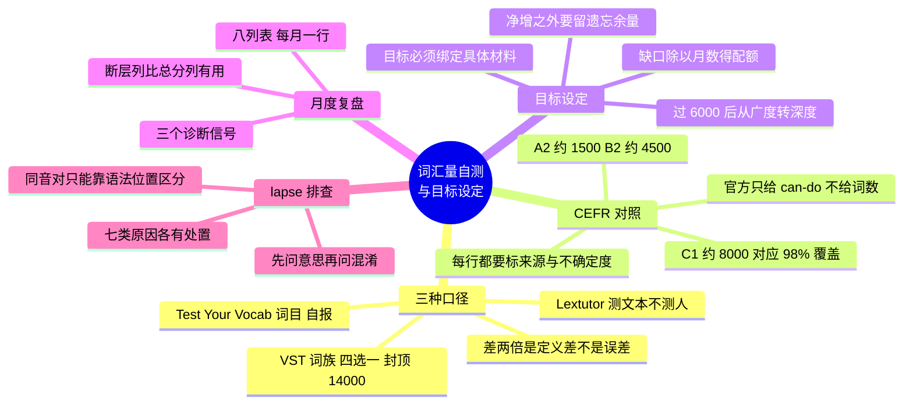

# 词汇量自测、CEFR 对照与目标设定

> [!info] 本篇定位
>
> 第一章的收尾篇，也是把前五篇的概念转成可执行数字的一篇。
>
> `01.英语词汇的来源、分层与学习地图` 交代了词形、词目、词族三种计数单位，`05.词汇学习方法总纲` 交代了怎么学。本篇解决中间那一环：**你现在在哪、目标在哪、每个月该推进多少**。
>
> 读完你会有三样可以立刻用的东西：一套判断任何词汇量数字可信度的方法，一张标注了来源和不确定度的 CEFR 对照表，一份能连续填十二个月的复盘表与配套的 lapse 词排查流程。

---

## 1. 本篇导读：先校准尺子，再谈数字

「我大概八千词汇量」这句话在中文英语学习圈里流通了几十年，但它几乎不携带信息。同一个人，在同一个下午，用三个主流工具连着测三次，拿到的三个数字可能是 5200、11800、以及「你读这本书需要 8000」——三个数字互相之间不冲突，因为它们量的根本不是同一件事。

三种口径的差异不是误差，是**定义差异**。

| 工具 | 量的对象 | 计数单位 | 判定动作 |
| --- | --- | --- | --- |
| Nation VST | 你（人） | 词族 word family | 四选一识别词义 |
| Test Your Vocab | 你（人） | 词目 lemma | 自报「认识 / 不认识」 |
| Lextutor VocabProfile | 材料（文本） | 词族档位 | 无判定，直接统计文本 |

前两个测的是人，第三个测的是文本；前两个的计数单位差一级，第三个根本不给你一个「词汇量」数字，而是告诉你「读懂这段东西需要多大的词汇量」。把这三个数字放一起比大小，等于拿体重、腰围、和衣服尺码比大小。



上图把三条测量链路并排画出来。左边两条从「人」出发，右边一条从「材料」出发。三条链路的终点都是一个数，但只有先声明「这个数是哪条链路产出的」，这个数才有意义。本篇后面五节分别拆开这三条链路，然后回答一个具体问题：为什么同一个人的 VST 分数和 Test Your Vocab 分数经常差出接近两倍。

先建立本篇要反复用到的一组元词汇。这些词本身也是学术英语的高频词，在第 `18` 章还会再遇到。

| 英文 | 英式音标 | 美式音标 | 词性 | 中文 | 搭配与说明 |
| --- | --- | --- | --- | --- | --- |
| **assess** | /əˈses/ | /əˈses/ | v. | 评估；测定 | assess the damage / assess a student；名词 assessment |
| **evaluate** | /ɪˈvæljueɪt/ | /ɪˈvæljueɪt/ | v. | 评价；评定 | 比 assess 更强调下判断，evaluate the results |
| **gauge** | /ɡeɪdʒ/ | /ɡeɪdʒ/ | v./n. | 估量；量规 | 拼写与读音脱节，不读 /ɡɔːdʒ/；gauge progress |
| **calibrate** | /ˈkælɪbreɪt/ | /ˈkælɪbreɪt/ | v. | 校准 | calibrate an instrument；名词 calibration |
| **benchmark** | /ˈbentʃmɑːk/ | /ˈbentʃmɑːrk/ | n./v. | 基准；对标 | benchmark against industry norms |
| **metric** | /ˈmetrɪk/ | /ˈmetrɪk/ | n. | 度量指标 | 复数 metrics 在技术语境里几乎固定用复数 |
| **proficiency** | /prəˈfɪʃnsi/ | /prəˈfɪʃnsi/ | n. | 熟练度 | language proficiency；形容词 proficient |
| **competence** | /ˈkɒmpɪtəns/ | /ˈkɑːmpɪtəns/ | n. | 能力；胜任力 | 语言学术语 communicative competence |
| **descriptor** | /dɪˈskrɪptə/ | /dɪˈskrɪptər/ | n. | 描述项 | CEFR 的 can-do descriptors 即「能做什么」条目 |
| **diagnostic** | /ˌdaɪəɡˈnɒstɪk/ | /ˌdaɪəɡˈnɑːstɪk/ | adj./n. | 诊断性的；诊断 | a diagnostic test 指找问题而非打分的测试 |
| **baseline** | /ˈbeɪslaɪn/ | /ˈbeɪslaɪn/ | n. | 基线；起测点 | establish a baseline，后续所有对比的参照 |
| **threshold** | /ˈθreʃhəʊld/ | /ˈθreʃhoʊld/ | n. | 阈值；门槛 | 也可读作 /ˈθreʃəʊld/，中间 h 常脱落 |

`gauge` 是这一组里唯一需要单独提醒的：它的拼写会诱导人读成 /ɡɔːdʒ/，正确读音与 `gage` 同音。这类拼读规则失效词在 `01.词汇入门与学习方法/02.自然拼读：拼写与发音对应规则` 里有完整清单。

---

## 2. Nation VST：按 14000 词族抽样

### 2.1 抽样逻辑

Vocabulary Size Test（词汇量测试，常缩写为 VST）由 Paul Nation 与 David Beglar 设计，方法说明发表于 Nation & Beglar 在 2007 年 *The Language Teacher* 第 31 卷第 7 期上的 *A vocabulary size test*。它的结构可以用一句话讲完：**把英语按词频排成 14 个千词族档，每档抽 10 个词，一共 140 题；每答对一题记 100 个词族。**

这个设计的关键是「抽样」而不是「穷举」。没有任何测试能问你 14000 个词，所以 VST 假设：如果你在第 5 千档的 10 道题里答对 7 道，那么第 5 千档的 1000 个词族里你大约认识 700 个。14 个档各自估计，加起来就是总量估计。

| 英文 | 英式音标 | 美式音标 | 词性 | 中文 | 搭配与说明 |
| --- | --- | --- | --- | --- | --- |
| **sample** | /ˈsɑːmpl/ | /ˈsæmpl/ | n./v. | 样本；抽样 | 英美元音差异明显；a representative sample |
| **item** | /ˈaɪtəm/ | /ˈaɪtəm/ | n. | 题目；条目 | 测试学里一道题就叫 an item |
| **distractor** | /dɪˈstræktə/ | /dɪˈstræktər/ | n. | 干扰项 | 多选题里的错误选项，也拼作 distracter |
| **extrapolate** | /ɪkˈstræpəleɪt/ | /ɪkˈstræpəleɪt/ | v. | 外推 | extrapolate from a sample，VST 的核心动作 |
| **infer** | /ɪnˈfɜː/ | /ɪnˈfɜːr/ | v. | 推断 | 名词 inference /ˈɪnfərəns/，重音回到首音节 |
| **estimate** | /ˈestɪmeɪt/ | /ˈestɪmeɪt/ | v. | 估计 | 名词读 /ˈestɪmət/，词尾弱化，动名词异读 |
| **band** | /bænd/ | /bænd/ | n. | 档位；分数段 | 雅思的 band score 用的就是这个义项 |
| **ceiling** | /ˈsiːlɪŋ/ | /ˈsiːlɪŋ/ | n. | 上限；天花板 | a ceiling effect 指测试测不出上限之上的差异 |
| **validity** | /vəˈlɪdəti/ | /vəˈlɪdəti/ | n. | 效度 | 测的是不是你想测的东西 |
| **reliability** | /rɪˌlaɪəˈbɪləti/ | /rɪˌlaɪəˈbɪləti/ | n. | 信度 | 重复测能不能得到一致结果 |

`validity` 与 `reliability` 这一对在中文里都容易说成「准确性」，但它们指的是两件不同的事：效度问「量对了吗」，信度问「量稳吗」。一把每次都偏轻两公斤的秤，信度高、效度低。

### 2.2 题型长什么样

VST 的每一题给一个词、一句不含定义线索的短语境，再给四个用更简单词写成的选项。下面是按同一体例仿写的四道题，用来看清难度是怎么随档位爬升的（不是真题）。

```text
第 1 千档
POOR:  We are poor.
  a. have no money        b. feel happy
  c. are very interested  d. do not like hard work

第 5 千档
CANDID:  Please be candid.
  a. careful   b. honest   c. quiet   d. quick

第 10 千档
ERRATIC:  His behaviour was erratic.
  a. very rude          b. hard to predict
  c. extremely slow     d. carefully planned

第 14 千档
PUCE:  The wall was puce.
  a. a purple-brown colour   b. very rough
  c. newly built             d. covered in vines
```

四道题的选项措辞难度基本一致，变的只有题干词的频率。这是 VST 效度设计的一部分：如果选项本身越来越难，测出来的就是「读得懂选项的能力」而不是「认识题干词的能力」。

### 2.3 猜测抬分与校正

四选一意味着**闭着眼睛猜也有 25% 的期望正确率**。140 题全靠猜，期望答对 35 题，换算过来是 3500 个词族的虚高底噪。Jeffrey Stewart 在 2014 年 *Language Assessment Quarterly* 第 11 卷第 3 期上的 *Do Multiple-Choice Options Inflate Estimates of Vocabulary Size on the VST?* 就专门讨论了这个抬分效应。

> [!warning] 自测时最容易毁掉数据的三件事
>
> - **对完全没概念的词硬猜。** Nation 给出的作答说明是：有一点印象可以猜，完全没概念就留空。留空不丢人，硬猜会让你后面所有月份的对比失去基准。
> - **查了再答。** 只要中途查过一次词典，这次测试的数字就不能进复盘表。
> - **测完不记档位分布。** 只记总分会丢掉最有价值的信息——你的能力断层在第几档。

想在留空之外再加一层保守估计，可以套用四选一的通用猜测校正公式（formula scoring）：

```text
校正后答对数 = 答对数 − (作答数 − 答对数) ÷ 3

例：作答 120 题，答对 92 题
校正后 = 92 − (120 − 92) ÷ 3 = 92 − 9.33 ≈ 82.7
估计词汇量 = 82.7 × 100 ≈ 8300 词族（原始估计 9200）
```

这个公式不是 VST 官方评分方式，它只是把「答错的题里有一部分是猜中之外的猜错」这件事折回去。用它的价值不在绝对值更准，而在于**你每个月都用同一个公式**，纵向对比才干净。

### 2.4 VST 的三个边界

**边界一：只测接受性、只测书面。** VST 问的是「读到这个词认不认得意思」，不问你会不会用、会不会听。所以 VST 分数和你的写作水平之间没有直接换算关系。接受性与产出性的区别见 `01.英语词汇的来源、分层与学习地图` 第 6 节。

**边界二：14000 封顶。** 原版覆盖 BNC 前 14 个千词族档，14000 之上测不出来。Nation 后来做过 20000 词族的扩展版本。对中文母语的自学者来说 14000 版足够用，因为绝大多数人的真实水平落在 3000 到 9000 之间。

**边界三：抽样噪声在低档位很大。** 每档只有 10 题，答对 6 题和答对 7 题差 100 个词族，但这一题之差完全可能是运气。所以 VST 的单次分数**不应该看个位数和百位数**，只看千位。9200 和 8900 是同一个结果。

---

## 3. Test Your Vocab：按词目自报

### 3.1 自报式测试的机制

testyourvocab.com 属于另一个测试家族：**Yes/No 自报式测试**（checklist test）。它不给你选项让你选，而是直接铺一屏词，让你勾出认识的。这一格式最早由 Paul Meara 与 Barbara Buxton 在 1987 年 *Language Testing* 第 4 卷第 2 期的 *An alternative to multiple choice vocabulary tests* 中提出。

流程分成三步：

① 第一屏给一批中高频词，你勾选认识的；
② 系统根据第一屏的结果，从更低频区抽第二屏，进一步定位边界；
③ 最后问背景信息（母语、年龄、是否在英语国家居住过、居住多久），这些信息只用于站点的汇总统计，不影响你的分数。

| 英文 | 英式音标 | 美式音标 | 词性 | 中文 | 搭配与说明 |
| --- | --- | --- | --- | --- | --- |
| **checklist** | /ˈtʃeklɪst/ | /ˈtʃeklɪst/ | n. | 清单；核对表 | go through a checklist |
| **self-report** | /ˌself rɪˈpɔːt/ | /ˌself rɪˈpɔːrt/ | n./adj. | 自我报告 | self-report data 在心理学里特指自评数据 |
| **pseudoword** | /ˈsjuːdəʊwɜːd/ | /ˈsuːdoʊwɜːrd/ | n. | 伪词 | 前缀 pseudo- 英美读音差别在 /sj/ 与 /s/ |
| **inflate** | /ɪnˈfleɪt/ | /ɪnˈfleɪt/ | v. | 使虚高；充气 | inflate the score；名词 inflation |
| **overestimate** | /ˌəʊvərˈestɪmeɪt/ | /ˌoʊvərˈestɪmeɪt/ | v. | 高估 | 反义 underestimate，两词都可作名词读 /-mət/ |
| **bias** | /ˈbaɪəs/ | /ˈbaɪəs/ | n./v. | 偏差；使有偏 | a systematic bias；形容词 biased |
| **discrepancy** | /dɪsˈkrepənsi/ | /dɪsˈkrepənsi/ | n. | 差异；不一致 | a discrepancy between A and B |
| **plausible** | /ˈplɔːzəbl/ | /ˈplɔːzəbl/ | adj. | 貌似合理的 | 含「看起来对但未必真对」的意味 |
| **familiar** | /fəˈmɪliə/ | /fəˈmɪliər/ | adj. | 熟悉的 | be familiar with sth / sth is familiar to sb，两个介词方向相反 |
| **corpus** | /ˈkɔːpəs/ | /ˈkɔːrpəs/ | n. | 语料库 | 拉丁复数 corpora /ˈkɔːpərə/，不加 -es |

`familiar` 的两个介词方向是中文母语者的高频错点：**你**对某事熟悉用 `be familiar with`，**某事**对你来说熟悉用 `be familiar to`。这类介词搭配在 `16.词义辨析、搭配与短语动词` 里成组处理。

### 3.2 熟悉性错觉

自报式测试最大的敌人是**熟悉性错觉**（the illusion of familiarity）：见过这个词形，就产生「我认识」的感觉，但说不出意思。

这就是为什么这一家族的测试普遍要掺入伪词。伪词是按英语音位与拼写规则造出来、看起来完全像真词但根本不存在的字符串，比如按 `-ulent`、`-ative`、`-osity` 这类真实后缀拼出的假词。你勾了多少伪词，就说明你的自报有多少水分，系统据此把你的原始分往下压。

> [!tip] 自测前给自己定一条硬标准
>
> 勾选之前先在心里过一遍：**我能不能用一个中文词或一句英文解释说出它的意思？**
>
> 说不出就不勾。「好像在哪见过」不算认识。
>
> 这条标准比任何伪词校正都管用，因为它作用在源头。同样一份测试，用「说得出意思才勾」和用「眼熟就勾」两套标准，同一个人的差距可以到 30% 以上。

### 3.3 计数单位是词目，不是词族

这是 Test Your Vocab 与 VST 之间最大的一笔差额来源。它的计数规则是**词目**（lemma）：屈折形式不单独计，派生形式单独计。

| 具体形式 | VST 的词族口径 | Test Your Vocab 的词目口径 |
| --- | --- | --- |
| nation / nations | 1 | 1 |
| national | 记入同一词族 | 另计 1 |
| nationally | 记入同一词族 | 另计 1 |
| nationality / nationalities | 记入同一词族 | 另计 1 |
| nationalize / nationalized | 记入同一词族 | 另计 1 |
| **合计** | **1** | **5** |

同一个人的同一份知识，用两把尺子量出来的数字差了五倍——当然真实差距没这么大，因为绝大多数词族没有五个成员，但方向是确定的：**词目口径必然大于词族口径**。

### 3.4 母语者的参照数字

testyourvocab.com 公布的汇总统计里，成年母语受试者多数落在 20000 到 35000 之间。这个数字常被拿来吓唬学习者，但它的口径是词目，不是词族。

一个更严谨的参照来自 Marc Brysbaert、Michaël Stevens、Paweł Mandera 与 Emmanuel Keuleers 在 2016 年 *Frontiers in Psychology* 上的 *How Many Words Do We Know?*：他们用另一套测试估计，20 岁的美国成年人平均认识约 42000 个词目。

> [!warning] 别用母语者数字给自己定目标
>
> 42000 词目里包含大量你这辈子用不上的低频词：地方植物名、罕见病名、方言词、古语。母语者是在二十年的沉浸式输入里被动积累的，不是背出来的。
>
> 对以阅读技术文档与原版书为目标的自学者来说，有意义的参照不是母语者的总量，而是**你的目标材料需要多少**。这是下一节 Lextutor 要回答的问题。

---

## 4. Lextutor：从文本反推所需词汇量

### 4.1 这不是一个测你的工具

Compleat Lexical Tutor（lextutor.ca）由 Tom Cobb 维护，其中的 VocabProfile 模块干的是**词频剖析**：你粘一段英文进去，它把每个词次（token）按 Nation 编制的 BNC/COCA 千词族表逐个归档，输出每一档占多少、累计到多少。

它不问你任何问题，因为它测的不是你。

| 英文 | 英式音标 | 美式音标 | 词性 | 中文 | 搭配与说明 |
| --- | --- | --- | --- | --- | --- |
| **token** | /ˈtəʊkən/ | /ˈtoʊkən/ | n. | 词次；令牌 | 语料学里一段文本出现几次就算几个 token |
| **type** | /taɪp/ | /taɪp/ | n. | 词种 | 与 token 成对：the type-token ratio 类符形符比 |
| **lemma** | /ˈlemə/ | /ˈlemə/ | n. | 词目 | 复数 lemmas 或 lemmata |
| **profile** | /ˈprəʊfaɪl/ | /ˈproʊfaɪl/ | n./v. | 剖析；概况 | a frequency profile；动词 profile a text |
| **coverage** | /ˈkʌvərɪdʒ/ | /ˈkʌvərɪdʒ/ | n. | 覆盖率 | lexical coverage 是词汇学核心指标 |
| **cumulative** | /ˈkjuːmjələtɪv/ | /ˈkjuːmjəleɪtɪv/ | adj. | 累计的 | 英式第三音节弱读 /lə/，美式常读 /leɪ/；cumulative percentage |
| **distribution** | /ˌdɪstrɪˈbjuːʃn/ | /ˌdɪstrɪˈbjuːʃn/ | n. | 分布 | a frequency distribution |
| **percentile** | /pəˈsentaɪl/ | /pərˈsentaɪl/ | n. | 百分位 | 与 percentage 不同，指排名位置 |
| **median** | /ˈmiːdiən/ | /ˈmiːdiən/ | n./adj. | 中位数 | 区别于 mean 平均数、mode 众数 |
| **residual** | /rɪˈzɪdjuəl/ | /rɪˈzɪdʒuəl/ | adj./n. | 剩余的；残差 | 英美在 /dj/ 与 /dʒ/ 上分化 |

`type` 与 `token` 这一对是理解一切词频统计的前提。一段文本里 `the` 出现 40 次，那是 40 个 token、1 个 type。VocabProfile 的覆盖率算的是 token 百分比，不是 type 百分比——因为读者遇到的是每一次出现，不是每一个不同的词。

### 4.2 剖析输出怎么读

下面是一段**构造的示意输出**，只用来说明每一列的含义，不是任何真实文本的剖析结果。

```text
档位      词次 Tokens   占比 Percent   累计 Cumulative
K1              812        71.2%          71.2%
K2              128        11.2%          82.4%
K3               74         6.5%          88.9%
K4               41         3.6%          92.5%
K5               24         2.1%          94.6%
K6              12         1.1%          95.6%
K7              10         0.9%          96.5%
K8              19         1.7%          98.2%
K9-K14          13         1.1%          99.3%
Off-list         8         0.7%         100.0%
```

读法只有三步：

**第一步，找 95% 那条线。** 上表的累计列在 K6 这一行第一次超过 95%（95.6%）。这意味着掌握前 6000 个词族就能看懂这份材料 95% 的词次——大约每 20 个词遇到 1 个生词。

**第二步，找 98% 那条线。** 累计列在 K8 这一行才越过 98%（98.2%）。要读到基本无障碍，这份材料需要约 8000 词族。注意 K6 到 K8 这三档只贡献了 3.6 个百分点，却让所需词族数从 6000 抬到 8000——这就是词频分布的长尾在起作用。

**第三步，看 Off-list。** 这一列是不在任何千词族表里的词：专有名词、缩略语、技术术语、外来词。技术文档的 Off-list 比例通常显著高于小说，但这些词往往是本领域的固定名词，学起来比一般低频词快得多。

> [!tip] 程序员读技术文档的实际启示
>
> 技术文档的 K1-K3 覆盖率通常比小说更高——句式重复、用词收敛。真正卡住你的是两块：一是学术通用词（`implement`、`derive`、`constraint`、`arbitrary`），二是领域术语。
>
> 前者是第 `18` 章的内容，词数有限、回报极高；后者靠 Off-list 名词，边读边收即可。
>
> 所以「读懂技术文档需要 8000 词族」这个说法对技术文档来说往往偏高，但对小说来说是准的。**同一个数字不能跨体裁搬。**

### 4.3 三种口径的正式对照

把三个工具放进同一张表，每一列都写清楚它的输入是什么、输出是什么、数字大小相对如何。

| 维度 | Nation VST | Test Your Vocab | Lextutor VocabProfile |
| --- | --- | --- | --- |
| 输入 | 一个学习者 | 一个学习者 | 一份阅读材料 |
| 计数单位 | 词族 word family | 词目 lemma | 词族档位 K1-K25 |
| 判定动作 | 四选一识别词义 | 自报「认识 / 不认识」 | 无判定，逐词次归档 |
| 输出 | 词汇量估计值 | 词汇量估计值 | 各档 token 占比与累计覆盖率 |
| 数字量级 | 最小 | 居中偏大 | 不产出「你有多少」 |
| 抽样上限 | 14000（原版） | 无硬上限 | 不适用 |
| 主要虚高来源 | 四选一猜测 | 熟悉性错觉 | 不适用 |
| 适合回答的问题 | 我现在在哪一档 | 我认识多少个不同的词 | 读这份东西需要多少词 |

表里最容易被忽略的是最后一行。三个工具服务三个不同的问题，混着用只会得到互相矛盾的答案。理解这一点之后，「我八千词汇量」这句话就该自动改写成「我 VST 词族口径约八千」——多出来的那几个字，正是这个数字全部的信息量所在。

---

## 5. 为什么三个数字差出两倍

### 5.1 四条独立的差额来源

| 差额来源 | 具体机制 | 方向 |
| --- | --- | --- |
| 计数单位 | 词族 → 词目 → 词形，每换一级数字变大 | VST < Test Your Vocab |
| 抽样上限 | VST 封顶 14000，自报式测试不封顶 | 高水平者在 VST 上被压平 |
| 判定动作 | 四选一识别 vs 自报认识 | 自报更宽松，数字更大 |
| 偏差方向 | 多选题被猜测抬高，自报被熟悉性错觉抬高 | 两者都虚高，但虚高机制不同 |

四条来源是**独立叠加**的，不是互相抵消。这就是为什么两倍的差距完全在预期之内，不需要怀疑哪个工具坏了。

### 5.2 没有可靠的换算系数

经常有人问「词族数乘以几等于词目数」。这个问题没有单一答案，原因在词族的定义本身就是分层的。

Laurie Bauer 与 Paul Nation 在 1993 年 *International Journal of Lexicography* 第 6 卷第 4 期的 *Word families* 中，把词族按词缀的规则性与能产性划分成七个层级：Level 1 只算词形本身，Level 2 加屈折变化，Level 3 加最常见最规则的派生后缀，一路往上到 Level 7 才把古典拉丁希腊词缀也吞进来。

层级越高，一个词族吞掉的成员越多，同一份知识算出来的词族数就越小。所以：

> [!warning] 任何写死的换算系数都是错的
>
> 换算比同时受三件事影响：**词族定义采用哪个层级**、**统计基于哪个语料库**、**处在词频谱的哪一段**。
>
> 高频区一个词族的派生成员多（`nation` 一族有六七个成员），低频区往往只有一两个（`puce` 基本就是它自己）。所以同一个换算系数在不同档位上会朝相反方向偏。
>
> 实际操作的建议是：**放弃换算，改为固定口径**。选一个工具，只用它，只跟自己的历史分数比。跨工具比较永远是无效动作。

### 5.3 自测执行清单

要让每月的数字可比，测试条件必须固定。

- **固定工具。** 选定一个，一年内不换。换工具等于换尺子，之前的曲线全部作废。
- **固定时段。** 每月同一周、同一时段。疲劳状态显著影响识别速度和判断宽松度。
- **固定标准。** 「说得出意思才算认识」这条线不能松。
- **固定作答规则。** 猜或不猜，全程一致；用不用校正公式，全程一致。
- **固定记录粒度。** 除了总分，必须记下**每一档的得分**。断层在哪一档，比总分有用得多。
- **不在刚背完新词后测。** 短期记忆还没衰减，测出来的是虚高值。

---

## 6. CEFR 对照：官方不给数字

### 6.1 CEFR 是什么，不是什么

CEFR（Common European Framework of Reference for Languages，欧洲语言共同参考框架）由欧洲委员会（Council of Europe）于 2001 年正式发布，2020 年出版补充卷（Companion Volume）。它把语言能力分成 A1、A2、B1、B2、C1、C2 六级。

关键的一点：**CEFR 官方文件从不规定各级需要多少词汇量。** 它全部由 can-do descriptors（能做什么描述项）构成，比如 B2 的一条是「能读懂当代文学散文」，C1 的一条是「能理解长篇复杂的事实性与文学性文本，并辨识其中的文体差异」。

所以你在网上看到的任何「B2 = 4500 词」的表，都是**二手拼接**——研究者把词汇量测试数据和 CEFR 等级做相关分析后倒推出来的，不是官方定义。

| 英文 | 英式音标 | 美式音标 | 词性 | 中文 | 搭配与说明 |
| --- | --- | --- | --- | --- | --- |
| **framework** | /ˈfreɪmwɜːk/ | /ˈfreɪmwɜːrk/ | n. | 框架 | a theoretical framework；技术语境同形不同义 |
| **reference** | /ˈrefrəns/ | /ˈrefrəns/ | n./v. | 参照；引用 | 中间 e 常脱落，三音节压成两音节半 |
| **criterion** | /kraɪˈtɪəriən/ | /kraɪˈtɪriən/ | n. | 标准 | 希腊复数 criteria，常被误当单数用 |
| **norm** | /nɔːm/ | /nɔːrm/ | n. | 常模；规范 | 测试学 norm-referenced 常模参照 |
| **attain** | /əˈteɪn/ | /əˈteɪn/ | v. | 达到 | attain a level 比 reach 更正式；名词 attainment |
| **incremental** | /ˌɪŋkrəˈmentl/ | /ˌɪŋkrəˈmentl/ | adj. | 渐进的 | incremental progress；技术语境 incremental build |
| **calibration** | /ˌkælɪˈbreɪʃn/ | /ˌkælɪˈbreɪʃn/ | n. | 校准 | 与 §1 的 calibrate 同族 |
| **granularity** | /ˌɡrænjəˈlærəti/ | /ˌɡrænjəˈlerəti/ | n. | 粒度 | 技术文档高频词；美音 -lar- 并入 /ler/，与 similarity 同型 |
| **proxy** | /ˈprɒksi/ | /ˈprɑːksi/ | n. | 代理；替代指标 | use X as a proxy for Y，统计与技术双语境 |
| **approximate** | /əˈprɒksɪmət/ | /əˈprɑːksɪmət/ | adj. | 大约的 | 动词读 /əˈprɒksɪmeɪt/，与 estimate 同型异读 |

`proxy` 在本节的用法值得单独留意：词汇量是语言能力的一个 proxy（代理指标），不是能力本身。这个区分决定了你该如何看待自测数字。

### 6.2 一张标注了来源的对照表

下表把几个可查证的研究结论拼在一起，每一行都注明依据和不确定度。

| CEFR | 词族数（粗估） | 主要依据 | 对应的阅读能力 |
| --- | --- | --- | --- |
| A1 | 500 - 1000 | Milton (2010) 的 X_Lex 数据低段 | 认识路牌、菜单、简短通知 |
| A2 | 约 1500 | 同上 | 读懂简化读物、日常短消息 |
| B1 | 2500 - 3250 | 同上 | 读懂分级读物、简单新闻 |
| B2 | 4000 - 5000 | Laufer & Ravenhorst-Kalovski (2010) 的 95% 最低阈值 | 借助上下文猜读一般文本，吃力但可行 |
| C1 | 约 8000 | 同上研究的 98% 最优阈值 | 无辅助读懂一般文本 |
| C2 | 9000 以上 | Nation (2006) 对小说与报纸的覆盖率测算 | 读文学原著、专业期刊 |

两条依据的出处：

- James Milton 在 2010 年 *Communicative Proficiency and Linguistic Development* 论文集中的 *The development of vocabulary breadth across the CEFR levels*，用 Meara 与 Milton 的 X_Lex 测试统计了各 CEFR 等级学习者的词汇量分布。该测试上限为 5000，所以它对 C 级的分辨力有限。
- Batia Laufer 与 Geke Ravenhorst-Kalovski 在 2010 年 *Reading in a Foreign Language* 第 22 卷第 1 期的 *Lexical threshold revisited*，提出两个阅读阈值：约 4000-5000 词族对应 95% 覆盖（最低可行阈值），约 8000 词族对应 98% 覆盖（最优阈值）。
- Paul Nation 在 2006 年 *Canadian Modern Language Review* 第 63 卷第 1 期的 *How large a vocabulary is needed for reading and listening?* 中测算：小说与报纸达到 98% 覆盖需约 8000-9000 词族，口语对话与影视需约 6000-7000。



上图把 CEFR 阶梯、词族数、覆盖率这三条刻度对齐在一起。从 B2 到 C1 这一段的斜率最陡：词族数几乎翻倍，覆盖率只上升 3 个百分点。这不是矛盾，恰恰是词频分布的必然结果——高频词已经在前面吃完了，剩下的每一个百分点都要靠成千上万个低频词去填。这一段也是绝大多数中国学习者卡住的地方。

### 6.3 拿这张表干什么、不干什么

> [!warning] 对照表的正确用法与误用
>
> **可以用来做的事：**
>
> - 判断你现在该读什么难度的材料
> - 给「一年后想读什么」估一个词族缺口
> - 解释「为什么我认识很多词还是读不动小说」
>
> **不能用来做的事：**
>
> - 换算成雅思托福分数。CEFR 与考试成绩的映射由各考试机构自行公布，词汇量不是中间变量。
> - 当作「达到 8000 就是 C1」的充分条件。C1 还要求听说写和语用能力，词汇量只是其中一个 proxy。
> - 反过来倒推「我是 B2，所以我有 4500 词族」。这是把统计相关当成个体等式。

---

## 7. 目标设定：把数字翻译成月度配额

### 7.1 三步拆解

定位、定目标、拆配额。每一步都要产出一个写下来的数字。

**第一步：定位。** 用选定的工具测一次，记下总分与各档得分。这是你的 baseline。

**第二步：定目标。** 目标不能是「越多越好」，必须绑定一份具体材料。

| 目标材料 | 参照依据 | 目标词族数 |
| --- | --- | --- |
| 英文技术文档、API 手册 | K1-K3 覆盖率高，卡点在学术通用词 | 5000 + 学术词表 |
| 英文技术书（O'Reilly 一类） | 句式复杂度上升 | 6000 - 7000 |
| 英文新闻（The Economist 一类） | Nation (2006) 报纸测算 | 8000 |
| 英文原版小说 | Nation (2006) 小说测算 | 8000 - 9000 |
| 英文学术论文（本领域） | 通用词 + 领域术语 | 8000 + 领域词表 |

**第三步：拆配额。** 缺口除以月数，得到月配额；月配额除以学习日，得到日配额。

```text
当前：VST 词族口径 5200
目标：8000（无辅助读技术书与新闻）
期限：18 个月

净缺口 = 8000 − 5200 = 2800 词族
月净增 = 2800 ÷ 18 ≈ 156 词族
日净增 = 156 ÷ 22 个学习日 ≈ 7 词族
```

日净增 7 个词族，听起来低得离谱，这恰恰是这套算法的价值：它把「我要背一万单词」这种无法执行的口号，换算成了一个每天二十分钟就能完成的动作。

### 7.2 净增与过量的区别

上面算出的 7 是**净增**，不是你每天要过的新词数。学过的词会忘，配额里必须包含损耗余量。

工程上的做法是给净增乘一个余量系数。这个系数没有研究定值，取决于你的复习间隔设计和材料难度，但方向是确定的：**排的新词量必须大于你期望的净增量**。一个可操作的起步值是 1.4——日净增 7，就每天排 10 个新词，跑一个月后用实测 lapse 率反推真实系数，再调。

| 英文 | 英式音标 | 美式音标 | 词性 | 中文 | 搭配与说明 |
| --- | --- | --- | --- | --- | --- |
| **objective** | /əbˈdʒektɪv/ | /əbˈdʒektɪv/ | n./adj. | 目标；客观的 | 一词两义，名词义比 goal 更正式 |
| **target** | /ˈtɑːɡɪt/ | /ˈtɑːrɡɪt/ | n./v. | 指标；瞄准 | hit / miss a target；on target 达标 |
| **milestone** | /ˈmaɪlstəʊn/ | /ˈmaɪlstoʊn/ | n. | 里程碑 | reach a milestone，项目管理高频词 |
| **quota** | /ˈkwəʊtə/ | /ˈkwoʊtə/ | n. | 配额 | meet / exceed one's quota |
| **pace** | /peɪs/ | /peɪs/ | n./v. | 节奏；配速 | keep pace with；pace yourself 别用力过猛 |
| **backlog** | /ˈbæklɒɡ/ | /ˈbæklɔːɡ/ | n. | 积压 | a backlog of reviews，敏捷开发同词 |
| **sustain** | /səˈsteɪn/ | /səˈsteɪn/ | v. | 维持 | sustain the pace；形容词 sustainable |
| **margin** | /ˈmɑːdʒɪn/ | /ˈmɑːrdʒɪn/ | n. | 余量；页边 | a margin of error 误差余量 |
| **plateau** | /ˈplætəʊ/ | /plæˈtoʊ/ | n./v. | 平台期 | 英美重音位置不同；hit a plateau |
| **realistic** | /ˌriːəˈlɪstɪk/ | /ˌriːəˈlɪstɪk/ | adj. | 现实的 | set realistic targets |

`plateau` 是英美重音差异的典型例子：英式重音在首音节，美式在第二音节。这类重音漂移词在 `01.词汇入门与学习方法/03.音标、词重音与词典读音体例` 里成组处理。

### 7.3 后期目标要换性质

> [!tip] 过了 6000 之后，加词的收益开始塌陷
>
> 前 3000 个词族每增加 1000，文本覆盖率能涨好几个百分点；到了 8000 之后每增加 1000，覆盖率可能只涨零点几个百分点。
>
> 这时候把配额继续投在「加新词」上是低效的。正确的动作是**把配额从广度转向深度**：
>
> - 把接受性词汇推成产出性词汇（造句、复述、写作时刻意调用）
> - 补搭配（`make a decision` 而不是 `do a decision`）
> - 补语域判断（什么时候用 `use`，什么时候用 `utilize`）
> - 补短语动词（母语者口语里真正高频的那部分）
>
> 这四条分别对应第 `16` 章与第 `17` 章。到了这个阶段，VST 分数会明显放缓甚至停住，但实际阅读体验会继续改善——这是正常的，不是停滞。

---

## 8. 月度复盘表

### 8.1 表长什么样

一张能连续填十二个月的表，八列，每月一行。

| 月份 | 测试分（口径） | 各档断层 | 新词数 | lapse 数 | 阅读量 | 生词密度 | 下月调整 |
| --- | --- | --- | --- | --- | --- | --- | --- |
| 2026-01 | 5200（VST 词族） | K6 起明显掉 | 210 | 34 | 60 页 | 6.2 / 百词 | 材料降一档 |
| 2026-02 | — | — | 230 | 51 | 85 页 | 5.1 / 百词 | lapse 偏高，配额降到 180 |
| 2026-03 | 5600（VST 词族） | K6 略好，K8 断 | 180 | 29 | 92 页 | 4.4 / 百词 | 维持，开始补 K6 档 |

各列的填法：

**测试分。** 不必每月测。测试本身有噪声，每两到三个月测一次足够，中间月份留空。括号里必须写口径。

**各档断层。** 从哪一档开始正确率明显下降。这是整张表信息量最大的一列——它直接指出下一批词该从哪一档挑。

**新词数。** 这个月实际排进复习系统的新词条数，不是「看过的词数」。

**lapse 数。** 曾经答对过、这个月又答错的词条数。下一节展开。

**阅读量。** 页数或词数，用固定单位。这一列的作用是校验：如果分数不涨但阅读量在涨，多半是口径分辨力不够，不是你没进步。

**生词密度。** 每百词里的生词个数。方法是随机抽三段各一百词，数生词，取平均。这一列直接决定材料难度是否合适。

**下月调整。** 一句话，必须是可执行的动作，不能写「继续努力」。

| 英文 | 英式音标 | 美式音标 | 词性 | 中文 | 搭配与说明 |
| --- | --- | --- | --- | --- | --- |
| **review** | /rɪˈvjuː/ | /rɪˈvjuː/ | n./v. | 复习；复盘；评论 | 三个义项都高频，code review 同词 |
| **audit** | /ˈɔːdɪt/ | /ˈɔːdɪt/ | n./v. | 审查；旁听 | audit a course 指旁听不计学分 |
| **log** | /lɒɡ/ | /lɔːɡ/ | n./v. | 记录；日志 | keep a log；技术语境同词 |
| **track** | /træk/ | /træk/ | v./n. | 追踪；轨道 | track progress；keep track of sth |
| **monitor** | /ˈmɒnɪtə/ | /ˈmɑːnɪtər/ | v./n. | 监测；显示器 | 动名词同形，技术语境两义并存 |
| **adjust** | /əˈdʒʌst/ | /əˈdʒʌst/ | v. | 调整 | adjust the quota；名词 adjustment |
| **streak** | /striːk/ | /striːk/ | n. | 连续记录 | a winning streak；打卡类 App 常用 |
| **lag** | /læɡ/ | /læɡ/ | n./v. | 滞后；延迟 | lag behind schedule；技术语境指卡顿 |
| **stale** | /steɪl/ | /steɪl/ | adj. | 陈旧的；失效的 | stale bread；技术语境 stale cache |
| **prune** | /pruːn/ | /pruːn/ | v./n. | 修剪；删减 | prune a word list；名词义是「西梅」 |

`stale` 与 `prune` 在词表管理上有直接用途：**stale 的词条**是指那些排进去很久、从没真正记住、每次都靠猜蒙对的词；**prune**（修剪）就是把它们从主表里摘出来单独处理。技术出身的人对这两个词不陌生，用在词表上语感完全一致。

### 8.2 三个诊断信号

复盘表的价值不在记录本身，在于识别异常。

**信号一：分数不涨，但阅读明显变顺。**
最常见的原因是测试口径的分辨力到顶了。VST 的每档只有 10 题，你在 K5 档从「勉强认识」变成「牢固掌握」，分数一分不涨。处置：不要慌，看阅读量和生词密度这两列，它们更灵敏。

**信号二：lapse 数持续上升，新词数没降。**
这是配额超载的典型表现。新词排得太快，复习队列积压（backlog），旧词还没固化就被新词挤走。处置：立刻把新词配额砍掉三分之一，把省下的时间全部投给复习，直到 lapse 数回落。

**信号三：生词密度不降，阅读量在涨。**
说明你一直在同一难度层横向移动。处置：换材料档位。生词密度每百词稳定低于 3 个时往上升一档，高于 8 个时往下降一档。



上图是复盘的闭环。四个节点里最容易被跳过的是「排查」——多数人测完分数就直接调配额，跳过了对忘掉的词做分类。这一步跳过的代价是：你只知道忘了多少，不知道为什么忘，下个月会用同样的方式再忘一遍。

---

## 9. lapse 词排查：忘掉的词分七类

### 9.1 什么是 lapse

`lapse` 在间隔重复系统（SRS）里是一个术语：**一张已经答对过、进入长间隔的卡片，再次被答错**，这次答错就记作一次 lapse。它和「从没记住的新词」是两回事——新词答错只是还没学会，lapse 是学会之后又丢了。

| 英文 | 英式音标 | 美式音标 | 词性 | 中文 | 搭配与说明 |
| --- | --- | --- | --- | --- | --- |
| **lapse** | /læps/ | /læps/ | n./v. | 失效；遗忘；间隔 | a lapse of memory；a lapse in judgment |
| **relapse** | /rɪˈlæps/ | /rɪˈlæps/ | n./v. | 复发 | 医学语境高频，名词也读 /ˈriːlæps/ |
| **retain** | /rɪˈteɪn/ | /rɪˈteɪn/ | v. | 保持；记住 | retain information；名词 retention |
| **retention** | /rɪˈtenʃn/ | /rɪˈtenʃn/ | n. | 记忆保持率 | the retention rate，复盘表的核心指标 |
| **recall** | /rɪˈkɔːl/ | /rɪˈkɔːl/ | n./v. | 回忆；召回 | free recall 自由回忆；技术语境指召回率 |
| **retrieval** | /rɪˈtriːvl/ | /rɪˈtriːvl/ | n. | 提取 | retrieval practice 提取练习，见第 05 篇 |
| **decay** | /dɪˈkeɪ/ | /dɪˈkeɪ/ | n./v. | 衰减；腐坏 | memory decay；tooth decay 蛀牙 |
| **attrition** | /əˈtrɪʃn/ | /əˈtrɪʃn/ | n. | 磨损；流失 | language attrition 指语言能力的自然退化 |
| **interference** | /ˌɪntəˈfɪərəns/ | /ˌɪntərˈfɪrəns/ | n. | 干扰 | proactive / retroactive interference |
| **cue** | /kjuː/ | /kjuː/ | n./v. | 提示；线索 | a retrieval cue；与 queue 同音不同义 |
| **consolidate** | /kənˈsɒlɪdeɪt/ | /kənˈsɑːlɪdeɪt/ | v. | 巩固 | consolidate memories；商业语境指合并 |
| **triage** | /ˈtriːɑːʒ/ | /triˈɑːʒ/ | n./v. | 分诊；分级处置 | 法语借词，尾音 /ʒ/；triage the backlog |

`cue` 与 `queue` 同音（都读 /kjuː/）但完全无关，前者是提示线索，后者是队列。技术文档里 `queue` 出现频率极高，别读错。`attrition` 这个词在语言学里有专门用法：**language attrition** 指长期不使用导致的语言能力退化，和主动学习中的遗忘不是一回事。

### 9.2 七类原因与对应处置

把本月的 lapse 词逐个归类。绝大多数会落进下面七类之一。

| 类别 | 症状 | 典型例子 | 处置动作 |
| --- | --- | --- | --- |
| 形近混淆 | 两个拼写相近的词互相干扰 | adapt / adopt | 拆成对照组，同屏对比记，各配一个专属例句 |
| 义近混淆 | 中文对应字相同，选不出用哪个 | affect / effect | 按第 16 章的辨析框架处理，记搭配不记释义 |
| 无语境 | 只有中文对应字，没有任何句子 | 任何从生词表直接抄来的词 | 补一个你自己领域的真句子，越具体越好 |
| 语义抽象 | 无法形成任何具体画面 | arbitrary / notion | 挂钩到一个具体场景，抽象义靠具体锚点固定 |
| 搭配缺失 | 认识词，但不知道它跟谁一起用 | conduct / undertake | 记搭配块而不是记单词 |
| 音形脱节 | 说不出怎么读，只认得字母串 | colonel / gauge / suite | 回查音标，读出声再排回复习队列 |
| 干扰批次 | 同一批学了太多同类词，互相压制 | 一次背 30 个 -ology 词 | 拆批次，同类词分散到不同周 |

前两类合起来通常占 lapse 总量的大头，尤其对中文母语者——因为中文释义会把本来不同的两个英文词压成同一个中文词，制造出原本不存在的混淆。

### 9.3 高发 lapse 词样本

下面这批词是形近与义近混淆的高发区，值得单独拉出来做对照组。

| 英文 | 英式音标 | 美式音标 | 词性 | 中文 | 搭配与说明 |
| --- | --- | --- | --- | --- | --- |
| **adapt** | /əˈdæpt/ | /əˈdæpt/ | v. | 适应；改编 | adapt to a new environment；名词 adaptation |
| **adopt** | /əˈdɒpt/ | /əˈdɑːpt/ | v. | 采纳；收养 | adopt a policy / adopt a child |
| **affect** | /əˈfekt/ | /əˈfekt/ | v. | 影响（动词） | 重音在后；This affects performance. |
| **effect** | /ɪˈfekt/ | /ɪˈfekt/ | n. | 效果（名词） | have an effect on；动词义「实现」罕见且正式 |
| **principle** | /ˈprɪnsəpl/ | /ˈprɪnsəpl/ | n. | 原则 | 只作名词；the principle of least surprise |
| **principal** | /ˈprɪnsəpl/ | /ˈprɪnsəpl/ | adj./n. | 主要的；校长；本金 | 与 principle 完全同音，只能靠语法位置区分 |
| **discreet** | /dɪˈskriːt/ | /dɪˈskriːt/ | adj. | 谨慎的；不张扬的 | be discreet about sth |
| **discrete** | /dɪˈskriːt/ | /dɪˈskriːt/ | adj. | 离散的；分立的 | 同音；discrete values 在技术文档里高频 |
| **complement** | /ˈkɒmplɪmənt/ | /ˈkɑːmplɪmənt/ | n./v. | 补足；补语 | 名词读 /-mənt/，动词读 /-ment/，与 estimate 同型异读 |
| **compliment** | /ˈkɒmplɪmənt/ | /ˈkɑːmplɪmənt/ | n./v. | 称赞 | 与上词同音，词义完全无关；动词同样读 /-ment/ |
| **elicit** | /iˈlɪsɪt/ | /iˈlɪsɪt/ | v. | 引出；诱出 | elicit a response |
| **illicit** | /ɪˈlɪsɪt/ | /ɪˈlɪsɪt/ | adj. | 非法的 | 与 elicit 近乎同音，词性完全不同 |
| **imminent** | /ˈɪmɪnənt/ | /ˈɪmɪnənt/ | adj. | 迫在眉睫的 | an imminent deadline |
| **eminent** | /ˈemɪnənt/ | /ˈemɪnənt/ | adj. | 杰出的 | an eminent scholar；首音节元音不同 |

> [!warning] 同音异义对不能靠「多读几遍」解决
>
> `principle` 与 `principal`、`discreet` 与 `discrete`、`complement` 与 `compliment` 这三对完全同音。重复朗读对它们无效，因为耳朵接收到的是同一个音。
>
> - ❌ ~~The two sets contain discreet values.~~
> - ✅ The two sets contain **discrete** values.（离散值）
> - ❌ ~~That's a nice complement.~~（这是「补语」）
> - ✅ That's a nice **compliment**.（这是称赞）
>
> 唯一有效的办法是**绑定语法位置和固定搭配**：`principal` 能作形容词修饰名词（`the principal reason`），`principle` 不能；`discrete` 后面接可数复数（`discrete values`），`discreet` 修饰人的行为。

### 9.4 lapse 词的处置流程



上图把 lapse 词过一遍三个是非问，落到五种处置里。这个流程的关键在于**顺序不能颠倒**：先问意思，再问读音和例句，最后才问混淆。很多人一上来就把所有忘掉的词当成「混淆」处理去建对照组，结果对那些纯粹是复习间隔太长的词做了无用功——而这类词只需要缩短一次间隔就够了，图右下角那条路径通常是数量最多的一条。

真正需要重手段的只有形近义近混淆那一支。它的处置成本最高（要建对照组、各配例句、分批复习），但它也是唯一一类不处理就会无限复发的 lapse。

---

## 10. 一次完整的自测与设定示范

把前面九节串成一次实际操作，用一个虚构但按本篇规则推演的例子。

**背景：** 程序员，工作五年，读英文 API 文档基本能懂，读技术书吃力，原版小说读不动。

**第一步，测。** 用 VST 测出 140 题作答 118 题、答对 89 题。原始估计 8900 词族，套猜测校正公式：89 − (118 − 89) ÷ 3 ≈ 79.3，校正估计约 7900 词族。各档记录显示 K1-K4 接近满分，K5-K7 稳定丢 2-3 题，K8 之后掉到一半以下。

**第二步，剖析目标材料。** 把一章技术书和一段 The Economist 文章分别丢进 VocabProfile。技术书在 K5 附近越过 95%，K8 附近越过 98%；新闻在 K8 才越过 95%。结论：技术书现在就能读，新闻还差一截。

**第三步，对照 CEFR。** 7900 词族落在 C1 附近（98% 阈值约 8000），与「技术书能读、新闻吃力」的实际体验吻合。数字与体感对得上，说明这次测试没有明显跑偏。

**第四步，定目标与配额。** 目标定为 9000 词族（读新闻不吃力）。缺口 1100，期限 12 个月，月净增约 92，日净增约 4。乘 1.4 余量后，每天排 6 个新词。

**第五步，选词来源。** 断层在 K5-K8，所以新词不从随机生词表里挑，而是从**实际阅读中在这几档命中的词**里挑。这一步是整套方法里回报最高的一环：从你真正在读的材料里取词，语境是现成的，搭配是现成的，`无语境` 这一类 lapse 直接消失。

**第六步，填复盘表。** 第一行填上：`2026-01 | 7900（VST 词族·已校正）| K8 起断 | — | — | — | — | 每日 6 新词，取材于在读技术书`。

> [!example] 三个月后这张表可能长什么样
>
> - 2026-01：7900（VST 词族·已校正）| K8 起断 | 新词 132 | lapse — | 阅读 40 页 | 密度 5.8 | 维持
> - 2026-02：— | — | 新词 148 | lapse 41 | 阅读 78 页 | 密度 4.9 | lapse 偏高，配额降到每日 4
> - 2026-03：— | — | 新词 96 | lapse 22 | 阅读 95 页 | 密度 4.1 | lapse 回落，配额恢复到 6
>
> 二月那一行是典型的配额超载：新词数上去了，lapse 跟着上去。三月降配额之后 lapse 回落、阅读量还在涨——说明减速是对的。
>
> 分数列三个月只填了一次，这是刻意的。测得太勤，你看到的全是噪声。

---

## 11. 本篇小结



> [!success] 本篇核心要点回顾
>
> 1. 三种主流工具的数字**不可互相比较**：VST 按词族、Test Your Vocab 按词目、Lextutor 根本不测人而测文本。差出两倍是定义差异，不是谁测错了。
> 2. VST 的结构是 **14 档各抽 10 题、每题记 100 词族**（Nation & Beglar, 2007）。四选一意味着猜测会抬分，Stewart 在 2014 年专门讨论过这个效应，自测时完全没概念的题应该留空。
> 3. 自报式测试的敌人是**熟悉性错觉**。给自己定一条硬标准：说得出意思才勾，眼熟不算。
> 4. **词族与词目之间没有可靠的换算系数**。Bauer & Nation (1993) 把词族分成七个层级，层级不同结果就不同。放弃换算，固定一个工具只跟自己比。
> 5. **CEFR 官方文件不规定词汇量**。所有对照表都是二手拼接，用的时候必须知道每一行的来源与不确定度。
> 6. 覆盖率的两条线来自 Laufer & Ravenhorst-Kalovski (2010)：约 4000-5000 词族对应 95%（吃力可读），约 8000 词族对应 98%（无辅助可读）。
> 7. 目标必须**绑定一份具体材料**，然后缺口除以月数得月配额；实际排的新词量要在净增之上留遗忘余量。
> 8. 复盘表里**各档断层列比总分列有用**，lapse 数上升是配额超载的第一个信号；lapse 词要按七类归因，先问意思、再问读音例句、最后才问混淆。

> [!success] 本篇练习清单
>
> - [ ] 选定一个自测工具，测出你的 baseline，并写清楚口径（词族 / 词目）
> - [ ] 记录各档得分，找出你的能力断层落在第几个千词档
> - [ ] 把一份你真正想读的材料丢进 VocabProfile，找到它的 95% 与 98% 断点
> - [ ] 用「（目标词族数 − 当前词族数）÷ 月数」算出你的月配额，写进日历
> - [ ] 抄一份月度复盘表的表头，填上第一行
> - [ ] 从这周的复习记录里挑出 10 个 lapse 词，按七类归因，看哪一类占比最高
> - [ ] 用语法位置区分 `principle` / `principal` 和 `discreet` / `discrete`，各造一句
> - [ ] 判断这句话哪里有问题：「我词汇量一万二，为什么读不动 The Economist？」

### 11.1 下一篇预告

> [!info] 下一篇：从元知识进入实词表
>
> 第一章到此结束。六篇讲完了词从哪来、怎么读、词典怎么查、怎么学、怎么测，全部是**关于词汇的知识**，没有交付一张真正要背的词表。
>
> 从下一篇起进入第二章，交付第一批必须掌握到产出级的词——功能词。
>
> [[02.功能词与封闭词类速查/01.代词与限定词的词形矩阵\|代词与限定词的词形矩阵]]
>
> 会覆盖人称代词的主宾格与所有格三套形式、反身代词的单复数分化（`themselves` 与 `himself`）、指示词 `this/that/these/those` 的四格矩阵、限定词的排列顺序，以及 `its` 与 `it's`、`your` 与 `you're` 这类高频写错点。
>
> 功能词总数不到三百个，但它们在任何一段英文里的词次占比都是最高的一批。这一章的词不多，却是必须一个不落全部拿下的。
