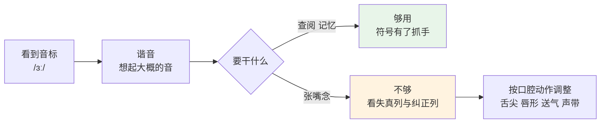
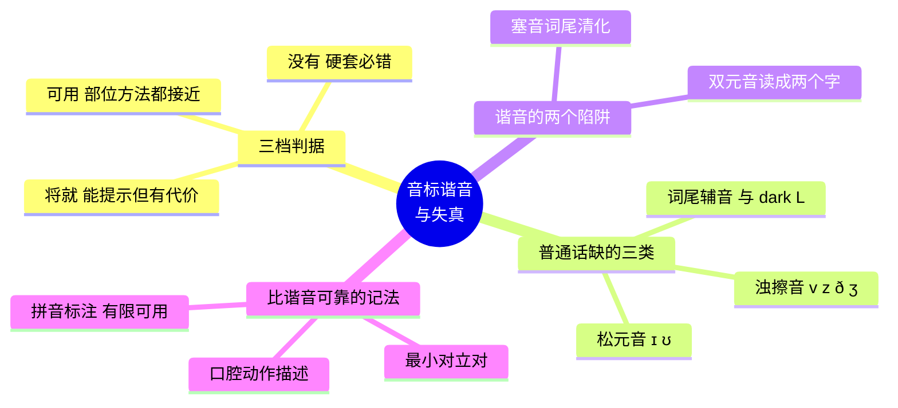

# 音标谐音对照与发音失真清单

> [!info] 本篇定位
>
> 第 03 篇讲的是音标这套系统怎么运作——符号对照、schwa、重音规律、词典体例。本篇只做一件事：给每个符号配一个普通话里的近似音，让你看到 /ʊə/ 的时候脑子里能立刻响起个大概。
>
> 它是**认符号的拐杖，不是发音的目标**。这两件事必须分开，理由在下一节。

---

## 1. 谐音的用途与代价

谐音有一个真实的用途：**降低音标的查阅成本**。44 个符号里有十几个在中文键盘上打不出、在记忆里挂不住，看到 /ɜː/ 想不起是什么音，整行音标就等于跳过。给它挂一个「大致像普通话的某个音」，符号就有了抓手。

代价同样真实，而且有据可查。下面这张表左列是中文世界流传最广的几个谐音，右列是中国学习者实际发音中最高频的错误：

| 常见谐音 | 对应的实际错误 | 后果 |
| --- | --- | --- |
| /θ/ 读作「斯」 | 读成 /s/ | think 听成 sink |
| /v/ 读作「我」 | 读成 /w/ | very 听成 wery |
| /ʃ/ 读作「诗」 | 卷舌过度 | 与 /ʂ/ 混，she 带出汉语音色 |
| /tʃ/ 读作「吃」 | 部位与唇形都不对 | chair 听感偏离 |
| /h/ 读作「喝」 | 舌根摩擦，部位太靠前 | 带出汉语 /x/ 的擦音 |
| /r/ 读作「日」 | 舌位过紧发成擦音 | right 听感偏 /ʒ/ |
| /æ/ 读作「艾」 | 滑成双元音 | bad 听成 bide 或 bed |

两列是同一批映射。**谐音想帮人跨过的坎，和它把人带进的坑，是同一个**。

所以这张表按「谐音 + 失真 + 纠正」三列并排给，任何一条谐音都不单独出现。

---

## 2. 三档判据

| 档 | 含义 | 能不能照着念 |
| --- | --- | --- |
| **可用** | 普通话里有部位与方法都接近的音 | 可以。注意表里标的那一处细节即可 |
| **将就** | 能提示是哪个符号，但照念会带出可听出的偏差 | 查阅可以，练习时要按纠正列调整 |
| **没有** | 普通话里根本没有这个音位 | 不要照念。任何汉字都会把它拽向另一个音 |

「没有」这一档有九个音，另加 dark L（详见第 5 节）。硬给它们配汉字是这类表格最常见的错误——写成「近似于」看着像帮了忙，实际是在教一个固定不下来的错误。

---

## 3. 辅音谐音对照（24 个）

顺序与你词典和应用里的音位卡一致。「例词」列取的是该音在词首的典型词。

### 3.1 塞音六个：难点全在送气与词尾

| IPA | 谐音 | 档 | 照念会错在哪 | 纠正动作 | 例词 |
| --- | --- | --- | --- | --- | --- |
| **/p/** | 泼 pō | 将就 | 词尾会多带一个元音（`stop` 读成 sto-po） | 词尾双唇闭上、气流放掉即止，不出元音 | stop /stɒp/ |
| **/b/** | 波 bō | 将就 | 普通话 b 是**不送气清音**不是浊音；词尾会清化 | 词首可用；词尾（`cab`）声带要振动，否则听成 cap | be /biː/ |
| **/t/** | 特 tè | 将就 | 舌尖易抵到牙齿上，带出汉语「特」的音色 | 舌尖抵**上齿龈**（牙齿后那道肉棱），不碰牙 | to /tuː/ |
| **/d/** | 得 dé | 将就 | 词尾清化，`bed` 听成 bet | 词尾保持声带振动 | do /duː/ |
| **/k/** | 科 kē | 将就 | 不送气则 `coat` 听成 goat | 重读音节词首要送气，手掌放嘴前应有气流 | can /kæn/ |
| **/ɡ/** | 哥 gē | 将就 | 词尾清化，`bag` 听成 back | 词尾保持声带振动 | go /ɡəʊ/ |

> [!warning] 送气与清浊是两套对立，谐音在这里天然失真
>
> 普通话的 b/p、d/t、g/k 区分的是**送不送气**，两者都是清音；英语的 /b//p/、/d//t/、/ɡ//k/ 区分的是**声带振不振动**。
>
> 词首位置两套凑巧对得上（英语的清塞音送气、浊塞音不送气），所以「波、特、科」在词首能用。词尾就完全对不上了——普通话根本没有词尾浊塞音，`cab` `bed` `bag` 的尾音在中文里找不到任何参照。
>
> 这也是为什么这六个音全部只能给到「将就」。

### 3.2 擦音九个：三个普通话没有

| IPA | 谐音 | 档 | 照念会错在哪 | 纠正动作 | 例词 |
| --- | --- | --- | --- | --- | --- |
| **/f/** | 夫 fū | 可用 | 部分南方口音会用双唇代替唇齿 | 上齿轻触下唇，不是双唇相碰 | for /fɔː/ |
| **/v/** | — | **没有** | 任何近似都会滑向 /w/ | 口型同 /f/，加上声带振动 | very /ˈveri/ |
| **/θ/** | — | **没有** | 「斯」→ /s/、「夫」→ /f/，两条路都错 | 舌尖轻放上下齿之间，气流从舌齿缝送出 | think /θɪŋk/ |
| **/ð/** | — | **没有** | 「兹」→ /z/、「的」→ /d/ | 同 /θ/ 的口型加声带振动 | the /ðə/ |
| **/s/** | 丝 sī | 可用 | 与 /θ/ 混 | 舌尖接近上齿龈留窄缝，舌头不出齿 | say /seɪ/ |
| **/z/** | — | **没有** | 普通话的 z 是 /ts/ 塞擦音，不是 /z/ 擦音 | 口型同 /s/ 加声带振动，全程不成阻 | zone /zəʊn/ |
| **/ʃ/** | 在「诗」与「西」之间 | 将就 | 读「诗」卷舌过度，读「西」过于靠前 | 舌面靠近齿龈后部，双唇略前突 | she /ʃiː/ |
| **/ʒ/** | — | **没有** | 会读成 /ʃ/ 或 /dʒ/ | 口型同 /ʃ/ 加声带振动 | genre /ˈʒɒnrə/ |
| **/h/** | 喝 hē | 将就 | 汉语 h 是舌根摩擦，部位太靠前 | 口腔保持**后一个元音**的形状，气流从声门直出，喉咙不出声 | have /hæv/ |

> [!warning] /z/ 是普通话母语者失分率最高的音
>
> speechocean762 语料实测，普通话母语者在 /z/ 上的低分率达 **64%**，高于任何其他音素。
>
> 原因是它的出现位置：复数 -s、第三人称 -s、`is` `was` `does` 的尾音大量读 /z/，而普通话没有这个擦音，母语者一律清化成 /s/。这个音每天要读几十次，错一次不显眼，长期就是全线口音标记。

### 3.3 塞擦音两个：与普通话是「三选二」的关系

| IPA | 谐音 | 档 | 照念会错在哪 | 纠正动作 | 例词 |
| --- | --- | --- | --- | --- | --- |
| **/tʃ/** | 在「吃」与「气」之间 | 将就 | 读「吃」卷舌过度，读「气」过于靠前 | 先做 /t/ 的成阻，除阻时转成 /ʃ/ 的摩擦，双唇略前突 | child /tʃaɪld/ |
| **/dʒ/** | 「知」的浊化版 | 将就 | 读汉语「基」丢掉浊音；词尾会清化成 /tʃ/ | 与 /tʃ/ 同过程，**全程**声带振动 | just /dʒʌst/ |

普通话在这个部位有三套：舌尖前 z/c/s、舌面 j/q/x、卷舌 zh/ch/sh。英语的 /ʃ tʃ dʒ ʒ/ 全部落在**舌面与卷舌之间**那一档，普通话恰好没有。所以这四个音的谐音一律是「在两者之间」而不是某个具体汉字。

### 3.4 鼻音三个：普通话覆盖最好的一组

| IPA | 谐音 | 档 | 照念会错在哪 | 纠正动作 | 例词 |
| --- | --- | --- | --- | --- | --- |
| **/m/** | 木 mù | 可用 | 词尾 -m 读成 -n（普通话没有词尾 m） | 词尾双唇必须闭上并保持 | my /maɪ/ |
| **/n/** | 讷 nè | 可用 | 南方口音与 /l/ 混 | 舌尖抵上齿龈，气流全走鼻腔 | not /nɒt/ |
| **/ŋ/** | 后鼻音 -ng | 可用 | 词尾多带一个 /ɡ/（`sing` 读成 sing-g） | 舌后部顶住软腭后**保持**，不放开 | thing /θɪŋ/ |

/ŋ/ 是普通话唯一一个覆盖得很好的「难音」——`ang` `eng` `ing` 里的后鼻音就是它。唯一要注意的是英语里它**不出现在词首**，且词尾不能补 /ɡ/（`singer` 不补，`finger` 才补）。

### 3.5 通音四个：/r/ 与 dark L 是重灾区

| IPA | 谐音 | 档 | 照念会错在哪 | 纠正动作 | 例词 |
| --- | --- | --- | --- | --- | --- |
| **/l/**（词首） | 乐 lè | 可用 | — | 舌尖抵上齿龈，气流从舌头两侧出 | like /laɪk/ |
| **/l/**（词尾 dark L） | — | **没有** | 会读成元音或直接丢掉（`milk` 读成 mi-k） | 舌尖仍抵齿龈，同时**舌后部抬起**，音色变沉 | milk /mɪlk/ |
| **/r/** | 「日」但舌头放松 | 将就 | 按「日」念舌位过紧，发成擦音 | 舌尖上卷但**不接触任何部位**，双唇略圆 | really /ˈriːəli/ |
| **/j/** | 呀 ya 的头 | 将就 | 读成「衣」就停住，没有滑动 | 起始舌位同 /iː/，**立刻**滑向后面的元音 | you /juː/ |
| **/w/** | 屋 wū 的头 | 可用 | 读成 /v/（上齿咬下唇）；唇形不够圆 | 双唇收圆前突，随即滑向后面的元音 | we /wiː/ |

> [!warning] 同一个 /l/ 有两副面孔
>
> 词首的 light L（`like` `look`）普通话有，照读没问题。词尾或辅音前的 dark L（`milk` `full` `people`）普通话完全没有，中文听感里它更像一个「乌」的元音，于是被整个吞掉。
>
> 判断办法：`l` 后面还有元音就是 light L，没有就是 dark L。

---

## 4. 元音谐音对照（20 个）

元音比辅音更依赖口型描述，谐音的可用度整体低于辅音。

### 4.1 单元音十二个

| IPA | 美式 | 谐音 | 档 | 照念会错在哪 | 纠正动作 | 例词 |
| --- | --- | --- | --- | --- | --- | --- |
| **/iː/** | /i/ | 衣 yī | 可用 | 长度不够会与 /ɪ/ 混 | 舌前抬高，嘴角向两边展，音拖足 | eat /iːt/ |
| **/ɪ/** | /ɪ/ | — | **没有** | 用「一」标会读成 /iː/，`ship` 听成 sheep | 舌位比 /iː/ **略低略后**，嘴唇放松，短促 | it /ɪt/ |
| **/e/** | /ɛ/ | 诶 ê | 可用 | 与 /æ/ 混，`bed` 与 `bad` 不分 | 口张开约两指宽，舌前部中高 | any /ˈeni/ |
| **/æ/** | /æ/ | — | **没有** | 「艾」是双元音会滑动；读成 /e/ 则 `bad` 听成 bed | 下巴放低、口张大，舌前部低平**不滑动** | at /æt/ |
| **/ʌ/** | /ʌ/ | 呃 è | 将就 | 读汉语「阿」偏后偏低，与 /æ/ 混 | 口略张，舌位居中，肌肉放松，短促 | but /bʌt/ |
| **/ɑː/** | /ɑ/ | 啊 ā | 将就 | 长度不够会与 /ʌ/ 混（`cart` 听成 cut） | 口张到最大，舌身后缩压低，音拖足 | arm /ɑːm/ |
| **/ɒ/** | /ɑ/ | 哦 的短促版 | 将就 | 唇形不圆；拖长会变成 /ɔː/ | 双唇稍圆，口张开，**短促** | not /nɒt/ |
| **/ɔː/** | /ɔ/ | 哦 ō | 将就 | 唇形不够圆；与 /ɒ/ 不分 | 双唇明显圆拢前突，舌后中高，音拖足 | all /ɔːl/ |
| **/ʊ/** | /ʊ/ | — | **没有** | 用「乌」标会读成 /uː/，`full` 听成 fool | 双唇略圆**但不紧张**，舌后略低于 /uː/，短促 | look /lʊk/ |
| **/uː/** | /u/ | 乌 wū | 可用 | 唇形不够圆前突（普通话母语者高频失分点） | 双唇收圆前突成小孔，舌后抬到最高 | school /skuːl/ |
| **/ɜː/**（英） | — | 呃 的拖长版 | 将就 | 按「儿」念会卷舌，而英音**不卷** | 舌身平放居中，双唇自然展开不圆，音拖足 | first /fɜːst/ |
| — | **/ɝ/**（美） | 儿 ér | 可用 | 卷舌过度 | 同上，加上舌尖上卷 | first /fɝst/ |
| **/ə/** | /ə/ | — | **没有** | 任何汉字都有调有力，标出来等于把它读成重音 | 完全放松、极短、**永远不重读** | about /əˈbaʊt/ |

> [!warning] /ə/ 无法用汉字标注，这是原理上的
>
> schwa 的定义就是「出现在非重读音节的、完全放松的中央元音」。而汉语的每一个字都是**有声调、有完整时长**的独立音节。
>
> 给 /ə/ 配任何一个汉字，都会把「不重读」这个本质属性抹掉——而那恰恰是它唯一需要记住的东西。这个音只能靠「读得比周围都轻、都短」来把握，配图配字都是帮倒忙。
>
> 它同时是英语里出现频率最高的元音。详细机制见 [[01.词汇入门与学习方法/03.音标、词重音与词典读音体例|第 03 篇]] 第 5 节。

### 4.2 双元音八个：谐音的最大问题是读成两个字

| IPA | 美式 | 谐音 | 档 | 照念会错在哪 | 纠正动作 | 例词 |
| --- | --- | --- | --- | --- | --- | --- |
| **/eɪ/** | /eɪ/ | 诶 → 衣 | 将就 | 两个汉字会读成两个等重音节 | 前重后轻，起点长终点短，一个音节读完 | able /ˈeɪbl/ |
| **/aɪ/** | /aɪ/ | 爱 ài | 可用 | 起点不够低、滑动不足 | 口先大后小，从低元音滑向 /ɪ/ | eye /aɪ/ |
| **/ɔɪ/** | /ɔɪ/ | 哦 → 衣 | 将就 | 唇形全程保持圆唇 | 唇形**由圆到展**，这是它的标志 | oil /ɔɪl/ |
| **/əʊ/**（英） | — | 欧 的放松版 | 将就 | 直接读「欧」起点过于靠后圆唇，那是美音的起点 | 从**中性放松**的 /ə/ 起，滑向 /ʊ/ | only /ˈəʊnli/ |
| — | **/oʊ/**（美） | 欧 ōu | 将就 | 滑动不足读成单元音 | 起点靠后带圆唇，滑向 /ʊ/ | only /ˈoʊnli/ |
| **/aʊ/** | /aʊ/ | 凹 āo | 可用 | 终点唇形不圆 | 口由大到小、唇**由展到圆** | out /aʊt/ |
| **/ɪə/** | /ɪr/ | 衣 → 呃 | 将就 | 读成 /iːə/，起点过紧；美音要带 r | 起点是松的 /ɪ/ 不是 /iː/ | nearly /ˈnɪəli/ |
| **/eə/** | /ɛr/ | 诶 → 呃 | 将就 | 读成单元音 /e/；美音要带 r | 口型基本不变，只是放松下来 | air /eə/ |
| **/ʊə/** | /ʊr/ | 乌 → 呃 | 将就 | 读成 /uːə/；现代英音正并入 /ɔː/ | 唇形由圆到松 | sure /ʃʊə/ |

> [!warning] 给双元音配两个汉字，会把它变成两个音节
>
> 双元音是**一个**音节内的连续滑动，前重后轻。写成「诶伊」「哦伊」的问题在于，汉字天然等重等长，念出来是两个音节两个调。
>
> 所以本表双元音一律写成「A → B」的箭头式，箭头本身就是提示：**起点要长、终点要短、中间不断**。

---

## 5. 普通话给不出的九个音

这九个音位在普通话里没有任何对应物，另加 dark L 这个位置变体。给它们配汉字不是不够准，是方向就错了。

| 音位 | 普通话最接近的东西 | 为什么不能用 | 唯一的办法 |
| --- | --- | --- | --- |
| **/θ/** | s（丝）、f（夫） | 部位差一整个档：/θ/ 在齿间，s 在齿龈，f 在唇齿 | 舌尖伸到上下齿之间 |
| **/ð/** | d（的）、z（兹） | 同上，且普通话无浊擦音 | /θ/ 的口型加声带 |
| **/v/** | w（我） | 普通话 w 是双唇通音，/v/ 是唇齿擦音 | /f/ 的口型加声带 |
| **/z/** | z（兹） | 普通话 z 是塞擦音 /ts/，/z/ 是纯擦音 | /s/ 的口型加声带，全程不成阻 |
| **/ʒ/** | r（日）、zh（知） | 部位与摩擦程度都不同 | /ʃ/ 的口型加声带 |
| **/ɪ/ /ʊ/** | i（衣）、u（乌） | 普通话只有紧元音，没有对应的松元音 | 舌位放松、略低、略靠中央 |
| **/æ/** | ai（艾）、e（诶） | 「艾」会滑动，「诶」舌位太高 | 下巴放低、舌前低平、不滑动 |
| **/ə/** | 无 | 汉字必然有调有完整时长 | 读得比周围都轻都短 |
| **dark L** | u（乌） | 会被整个吞成元音 | 舌尖抵齿龈，同时舌后抬起 |

规律很清楚：**普通话缺的是浊擦音、松元音和词尾辅音**。这三类占了英语难点的绝大部分，也解释了为什么谐音在英语上失效得比在日语、西班牙语上严重得多。

---

## 6. 比谐音更可靠的三种记法

谐音只解决「这个符号大概什么音」。真要把音固定下来，下面三种都比它可靠，且都不依赖汉字。

**一是最小对立对。** 找一对只差这一个音的词，反复对比着读。`sheep`/`ship` 固定 /iː/ 与 /ɪ/，`bad`/`bed` 固定 /æ/ 与 /e/，`think`/`sink` 固定 /θ/ 与 /s/，`very`/`wery` 固定 /v/ 与 /w/。对比比单练有效，因为它逼你听出区别而不只是模仿。

**二是口腔动作描述。** 本表「纠正动作」那一列就是这个——说舌尖放哪、唇形怎样、送不送气、声带振不振动。它比「听起来像什么」可靠，因为动作可以自查（手放喉咙上能摸到振动，手掌放嘴前能感到气流）。

**三是汉语拼音而非汉字。** 拼音的好处是**没有声调**，标 /iː/ 写 `yi` 不会带出四个调；坏处是它仍然是汉语音系，/ʃ/ 写 `sh` 照样是卷舌。所以拼音只在「普通话真有这个音」的那些行上比汉字好，遇到第 5 节那九个音同样无效。

> [!info] 这三种与谐音的分工
>
> 查阅、回忆符号 → 谐音（本表第 3、4 节）
>
> 纠正已经形成的错误 → 最小对立对 + 口腔动作
>
> 从零学一个普通话没有的音 → 只能靠口腔动作，谐音一概帮倒忙

---

## 7. 这张表怎么用

按你的目的走不同的动线：

| 你在做什么 | 看哪几列 | 不要看哪列 |
| --- | --- | --- |
| 查词时读到不认识的音标 | 谐音列 | — |
| 背单词时想记住读音 | 谐音列 + 例词列 | — |
| 发现自己某个音老被人听错 | 失真列 + 纠正列 | 谐音列（它正是错误来源） |
| 准备口语或考试 | 纠正列 + 第 6 节 | 谐音列 |

一条实用建议：**把「没有」那一档单独抄一遍**。连 dark L 一共十条，却覆盖了中国学习者绝大部分可听辨的口音标记。剩下三十几个音靠谐音过一遍就够，把时间压在这十条上，性价比最高。

---

## 8. 本篇小结

> [!success] 本篇核心要点回顾
>
> 1. 谐音是**认符号的拐杖，不是发音的目标**。中文世界流传最广的几个谐音，与中国学习者最高频的几个错误，是同一批映射。
> 2. 44 个音位分三档：可用 12 个，将就 23 个，**没有 9 个**（另加 dark L 这个位置变体）。
> 3. 普通话缺的是三类东西：**浊擦音**（/v/ /z/ /ð/ /ʒ/）、**松元音**（/ɪ/ /ʊ/）、**词尾辅音与 dark L**。这三类占了英语发音难点的绝大部分。
> 4. **/z/ 是失分率最高的音**（speechocean762 实测 64%），因为复数、第三人称、`is` `was` 的尾音全靠它，每天读几十次。
> 5. 塞音 /p b t d k ɡ/ 的谐音只在**词首**成立：普通话靠送气区分，英语靠清浊区分，词尾完全对不上。
> 6. **/ə/ 无法用汉字标注**，这是原理上的——汉字必然有调有完整时长，而 schwa 的本质就是「不重读」。
> 7. 双元音一律用「A → B」箭头式记，配两个汉字会读成两个等重音节。
> 8. 真要纠音，用**最小对立对**加**口腔动作描述**，谐音在这一步一概帮倒忙。

> [!success] 本篇练习清单
>
> - [ ] 把「没有」那一档的九个音单独抄成一张卡，贴在能天天看到的地方
> - [ ] 读 `sheep`/`ship`、`bad`/`bed`、`full`/`fool` 三对，录音回放，确认自己读出了区别
> - [ ] 读 `cab`、`bed`、`bag`、`is`、`was` 五个词，手放喉咙确认词尾声带在振动
> - [ ] 读 `milk`、`full`、`people`、`middle` 四个词，确认 dark L 没有被吞掉
> - [ ] 读 `think`/`sink`、`three`/`free`、`very`/`we`，请人听或用应用的音位识别核对
> - [ ] 把 `about`、`banana`、`computer` 三个词里的 /ə/ 读得明显比其他音节轻短
> - [ ] 读 `only`、`able`、`oil` 三个词，确认双元音是一个音节而不是两个

### 8.1 相关篇目

> [!info] 三篇一起构成完整的读音能力
>
> [[01.词汇入门与学习方法/02.自然拼读：拼写与发音对应规则|02. 自然拼读]]：看到字母怎么拼出音。
>
> [[01.词汇入门与学习方法/03.音标、词重音与词典读音体例|03. 音标、词重音与词典读音体例]]：看到音标怎么还原成音，以及重音、弱读、词典体例。
>
> 本篇：看到音标想不起是什么音时的抓手，以及这个抓手会在哪里骗你。
>
> 三篇的关系是：02 与 03 是正反两个方向的转换能力，本篇是 03 的查阅补充，不承担教学职能。
