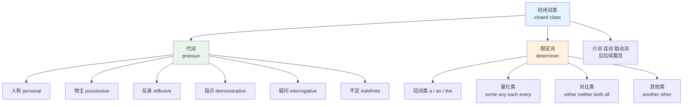
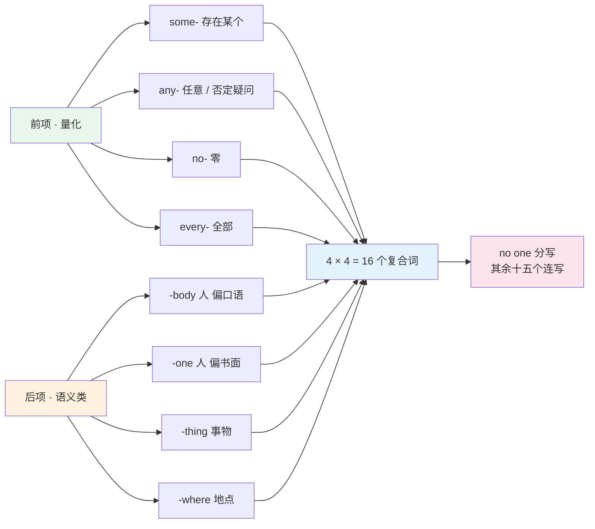
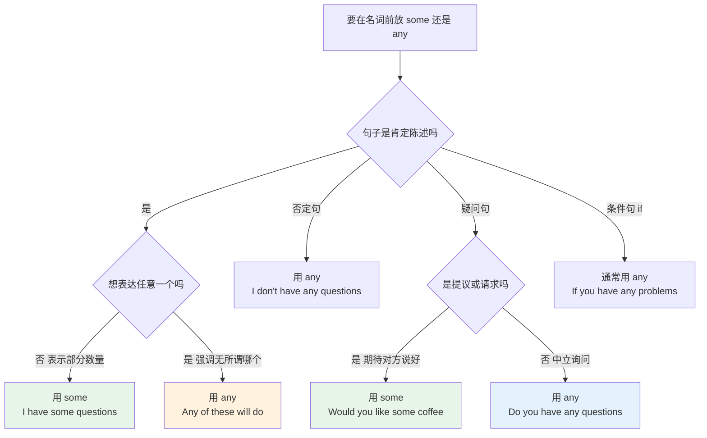
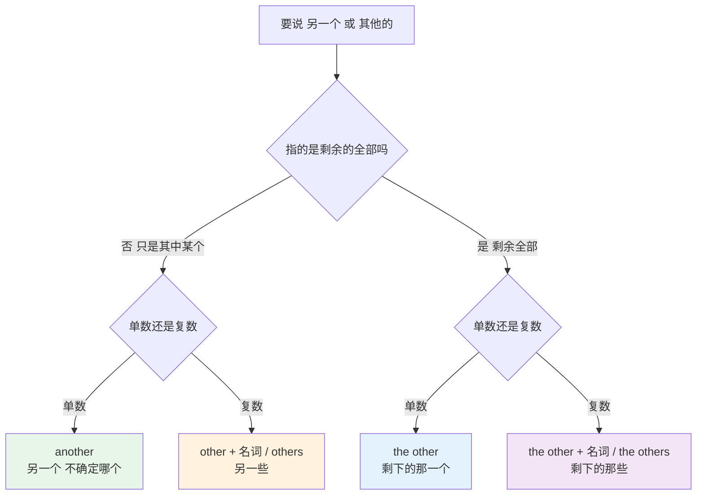
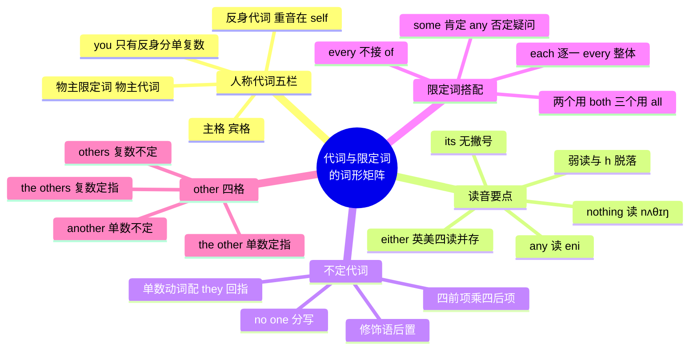

# 代词与限定词的词形矩阵

> [!info] 本篇定位
>
> 第二章第一篇，也是全书第一张需要背到能默写的表。
>
> 代词与限定词属于**封闭词类**——成员固定，几百年不增不减，全部列出来就是本篇的几张表，但它们在任何一段英文里的出现频率都排在最前面。这类词的特点是：数量少，形式变化多，一个字母之差就是另一个词（`its` / `it's`、`your` / `yours`、`other` / `others`）。
>
> 读完你会拿到：一张人称代词五栏矩阵、一张不定代词四乘四复合矩阵、八个高频限定词的搭配限制表，以及 `another` 与 `the other` 的四格分工图。
>
> 本篇只做词汇视角的增值——词形、读音、高频搭配。为什么这样用、句法上怎么分析，一律看 [[02.英语基础语法/03.代词与数词/01.人称代词与物主代词\|语法教程 03.代词与数词]] 那一章的四篇代词文档。

---

## 1. 本篇导读：封闭词类为什么要做成矩阵

英语词汇分两类。名词、动词、形容词、副词是**开放词类**（open class），新词随时能加进来（`podcast`、`doomscroll`、`vibe-code` 都是近几十年才出现的）。代词、限定词、介词、连词、助动词是**封闭词类**（closed class），成员几百年基本不变。

这个差别决定了两类词的学法完全相反。

| 维度 | 开放词类 | 封闭词类 |
| --- | --- | --- |
| 成员数量 | 数万到数十万 | 每类几十个 |
| 增长 | 持续新增 | 基本冻结 |
| 单词频率 | 单个词频率低 | 单个词频率极高 |
| 学习方式 | 按主题分批积累 | 一次性列全表背下来 |
| 记忆重点 | 词义与搭配 | **形式对应关系** |
| 出错代价 | 用词不准 | 整句语法失效 |

开放词类可以「学一批用一批」，封闭词类不行。`he`、`him`、`his`、`himself` 四个形式不是四个独立的词，是同一个词的四种句法位置形态。缺一个，整套就是残的。所以这类词必须以**矩阵**为单位记，不能以单词为单位记。

对程序员读者，有一个还算贴切的类比：代词像指针，它自己不携带语义，只指向前文的某个实体；限定词像类型约束，它规定后面那个名词槽位能放什么（可数还是不可数、单数还是复数、定指还是不定指）。指针写错了程序不会报错，但会指向错误的对象；类型约束写错了则会当场编译失败。英语里 `I like she` 属于后者——母语者一听就知道坏了。



上图是本篇的目录结构。左半支的六组代词在第 2 到 7 节，右半支的限定词在第 8 到 11 节；冠词 `a` / `an` / `the` 不在本篇，它们属于限定词里最特殊的一支，本教程放在 [[02.英语基础语法/02.名词与冠词/03.冠词的用法详解\|语法教程 02.名词与冠词/03.冠词的用法详解]] 处理，词汇视角上没有可增值的东西——三个词，没有音标难点，没有搭配变体。

代词与限定词有一部分成员是**重叠**的。`this`、`some`、`any`、`each`、`either`、`neither`、`both`、`all`、`another` 这九个词既能单独站着当代词，也能贴在名词前面当限定词。判断方法只有一条：后面直接跟名词就是限定词，后面不跟名词就是代词。

> [!example] 同一个词的两种身份
>
> - **Some** students left early.
>   - 有些学生早走了。（`some` 后面跟 `students`，限定词）
> - **Some** left early.
>   - 有些人早走了。（`some` 后面不跟名词，代词）
> - **Both** answers are correct.
>   - 两个答案都对。（限定词）
> - **Both** are correct.
>   - 两个都对。（代词）

这个双重身份是后面几节所有搭配限制的来源。有的词只能当限定词（`every`、`no`），有的词只能当代词（`others`、`none`），有的词两边都行但形式不同（`other` 当限定词、`others` 当代词）。第 10 节的四格分工图专门处理这一点。

---

## 2. 人称代词：五栏形式矩阵

### 2.1 一张必须能默写的表

人称代词的完整形态是五栏：主格、宾格、物主限定词、物主代词、反身代词。市面上多数教材只给前三栏，导致学习者写出 `That book is my`（应为 `mine`）这种句子。

| 人称 | 主格 | 宾格 | 物主限定词 | 物主代词 | 反身代词 |
| --- | --- | --- | --- | --- | --- |
| 第一人称单数 | I | me | my | mine | myself |
| 第二人称单数 | you | you | your | yours | yourself |
| 第三人称单数 阳 | he | him | his | his | himself |
| 第三人称单数 阴 | she | her | her | hers | herself |
| 第三人称单数 中 | it | it | its | — | itself |
| 第一人称复数 | we | us | our | ours | ourselves |
| 第二人称复数 | you | you | your | yours | yourselves |
| 第三人称复数 | they | them | their | theirs | themselves |

这张表有五个必须先记住的观察点。

**观察点一：`you` 在四栏里完全不区分单复数。** 主格、宾格、物主限定词、物主代词都是同一个形式，唯独反身代词分 `yourself` / `yourselves`。所以在书面英语里，判断 `you` 指一个人还是一群人的唯一形式线索就是反身代词。这也是英语各方言拼命造第二人称复数的原因（美国南部的 `y'all`、匹兹堡的 `yinz`、爱尔兰的 `ye`）——标准英语确实缺这个形式。

**观察点二：`his` 一词两职。** 它同时是第三人称阳性的物主限定词和物主代词，是唯一一个两栏同形的词。`This is his book` 和 `This book is his` 里的 `his` 词性不同，形式相同。

**观察点三：`her` 也是一词两职，但错位。** `her` 同时是宾格和物主限定词，而物主代词是 `hers`。对照 `he` 那一行——`him` 是宾格、`his` 是物主——两行的对应位置错开了，这是初学者混淆 `her` / `hers` 的根源。

**观察点四：`its` 几乎没有物主代词用法。** 表里那一格填的是破折号，不是漏写。`The cat licked its paw` 成立，但 `This paw is its` 是不说的，母语者会改成 `This is the cat's paw`。

**观察点五：反身代词的单复数只看所指人数。** 指一个人用 `-self`（`myself`、`yourself`、`himself`、`herself`、`itself`），指多个人用 `-selves`（`ourselves`、`yourselves`、`themselves`）。`you` 那两行是这条规则唯一能显形的地方——主格宾格物主全同形，只有反身代词把单复数分了出来。判断依据永远是逻辑上的人数，跟词形长短、跟人称是第几都没关系。

### 2.2 主格与宾格的读音

| 英文 | 英式音标 | 美式音标 | 词性 | 中文 | 搭配与说明 |
| --- | --- | --- | --- | --- | --- |
| **I** | /aɪ/ | /aɪ/ | pron. | 我 | 唯一永远大写的代词，句中也大写 |
| **you** | /juː/ | /juː/ | pron. | 你；你们 | 弱读 /jə/，`you are` 连读近似 /jər/ |
| **he** | /hiː/ | /hiː/ | pron. | 他 | 弱读丢 h 成 /i/，`did he` 听起来像 /dɪdi/ |
| **she** | /ʃiː/ | /ʃiː/ | pron. | 她 | 无弱读丢音形式，始终保留 /ʃ/ |
| **it** | /ɪt/ | /ɪt/ | pron. | 它 | 兼作形式主语，见语法教程 |
| **we** | /wiː/ | /wiː/ | pron. | 我们 | 弱读 /wi/ |
| **they** | /ðeɪ/ | /ðeɪ/ | pron. | 他们 | 现代英语可回指单数不定人称，见 7.4 |
| **me** | /miː/ | /miː/ | pron. | 我（宾格） | `It's me` 是通行说法，`It is I` 属旧式书面 |
| **him** | /hɪm/ | /hɪm/ | pron. | 他（宾格） | 弱读 /ɪm/，`tell him` 听起来像 /ˈtelɪm/ |
| **her** | /hɜː/ | /hɜːr/ | pron. | 她（宾格）；她的 | 弱读 /ə/ 与 /ər/，同样丢 h |
| **us** | /ʌs/ | /ʌs/ | pron. | 我们（宾格） | 弱读 /əs/，`let us` 缩为 `let's` /lets/ |
| **them** | /ðem/ | /ðem/ | pron. | 他们（宾格） | 弱读 /ðəm/，极口语时可到 /əm/ |

### 2.3 物主限定词与物主代词的读音

物主限定词又叫「形容词性物主代词」，物主代词又叫「名词性物主代词」。两套名称指的是同一组区分：前者必须贴在名词前面，后者独立成分。

| 英文 | 英式音标 | 美式音标 | 词性 | 中文 | 搭配与说明 |
| --- | --- | --- | --- | --- | --- |
| **my** | /maɪ/ | /maɪ/ | det. | 我的 | 后面必须有名词，`my book` |
| **your** | /jɔː/ | /jʊr/ | det. | 你的；你们的 | 弱读 /jə/ 与 /jər/；与 `you're` 同音 |
| **his** | /hɪz/ | /hɪz/ | det./pron. | 他的 | 唯一限定词与代词同形的一个 |
| **her** | /hɜː/ | /hɜːr/ | det. | 她的 | 与宾格同形，靠位置区分 |
| **its** | /ɪts/ | /ɪts/ | det. | 它的 | 无撇号；`it's` 是 `it is` 的缩写 |
| **our** | /ˈaʊə/ | /ˈaʊər/ | det. | 我们的 | 英式常弱化到近似 /ɑː/，与 `are` 易混 |
| **their** | /ðeə/ | /ðer/ | det. | 他们的 | 与 `there`、`they're` 三词同音 |
| **mine** | /maɪn/ | /maɪn/ | pron. | 我的（东西） | 后面不接名词，`This is mine` |
| **yours** | /jɔːz/ | /jʊrz/ | pron. | 你的（东西） | 无撇号，`your's` 是错拼 |
| **hers** | /hɜːz/ | /hɜːrz/ | pron. | 她的（东西） | 同样无撇号 |
| **ours** | /ˈaʊəz/ | /ˈaʊərz/ | pron. | 我们的（东西） | — |
| **theirs** | /ðeəz/ | /ðerz/ | pron. | 他们的（东西） | — |

> [!warning] 撇号是这一组的第一大坑
>
> 五个物主代词 `mine` / `yours` / `hers` / `ours` / `theirs` **全部不带撇号**，物主限定词 `its` 也不带。带撇号的 `it's`、`your's`、`their's` 要么是别的词，要么根本不存在。
>
> - ❌ ~~The dog wagged it's tail.~~
> - ✅ The dog wagged **its** tail.（它的尾巴）
> - ❌ ~~Is this book your's?~~
> - ✅ Is this book **yours**?
>
> 自查方法：把词展开成 `it is` / `you are`，句子还通就用带撇号的，不通就用不带撇号的。`The dog wagged it is tail` 显然不通，所以是 `its`。

### 2.4 双重物主结构

英语有一个中文里没有对应物的结构：`a friend of mine`（我的一个朋友）。它用 `of` 加物主代词，而不是直接把物主限定词摞在冠词上。

> [!example] 双重物主的实际写法
>
> - He is **a friend of mine**.
>   - 他是我的一个朋友。
> - That's **a habit of his** I can't stand.
>   - 那是他的一个我受不了的习惯。
> - I ran into **an old colleague of ours** yesterday.
>   - 我昨天碰见了我们以前的一位同事。

不能写 `a my friend`，因为 `a` 和 `my` 都是限定词，一个名词短语前面只能有一个限定词占位。要同时表达「不定冠词」和「所属」，就必须把所属挪到后面变成 `of mine`。同一逻辑适用于 `this`、`that`、`some`、`any`：`this book of yours`、`some friends of theirs`。

---

## 3. 强读与弱读：听力里代词消失的原因

### 3.1 功能词天生要被弱化

代词在真实语流里绝大多数时候不重读，元音被压缩成 /ə/ 或 /ɪ/，辅音 h 和 th 常常整个脱落。学习者听不懂快速英语，很大一部分原因不是生词，而是这些已经认识的词换了个声音出现。

| 英文 | 强读（重音位置） | 弱读 | 出现环境 |
| --- | --- | --- | --- |
| **you** | /juː/ | /jə/ | `Do you know` → /dʒə ˈnəʊ/ |
| **he** | /hiː/ | /i/ | `Is he coming` → /ˈɪzi ˈkʌmɪŋ/ |
| **him** | /hɪm/ | /ɪm/ | `Give him time` → /ˈɡɪvɪm ˈtaɪm/ |
| **her** | /hɜː(r)/ | /ə(r)/ | `Ask her again` → /ˈɑːskər əˈɡen/ |
| **us** | /ʌs/ | /əs/ | `Let us go` → `Let's go` /lets ɡəʊ/ |
| **them** | /ðem/ | /ðəm/ 或 /əm/ | `Tell them now` → /ˈteləm ˈnaʊ/ |
| **your** | /jɔː(r)/ | /jə(r)/ | `your name` → /jə ˈneɪm/ |
| **some** | /sʌm/ | /səm/ | `some water` → /səm ˈwɔːtə/ |

h 脱落有一条规律：只在词不处于句首、也不重读时发生。`He came` 句首的 `he` 保留 /h/，`Did he come` 中间的 `he` 就丢了。`her`、`him`、`his` 同理。这解释了为什么 `Tell him` 听起来是一个词。

### 3.2 什么时候必须强读

代词一旦被对比或强调，就恢复完整读音，而且带上句重音。

> [!example] 强读的三种触发场景
>
> - I didn't say that — **SHE** did.
>   - 我没那么说，是她说的。（对比强调，`she` 重读）
> - Who's there? — It's **ME**.
>   - 谁啊？——是我。（单独成句，必须强读）
> - This isn't your problem, it's **THEIRS**.
>   - 这不是你的问题，是他们的。（对比强调）

物主代词 `mine` / `yours` / `hers` / `ours` / `theirs` 因为总是承担句子的信息焦点，几乎从不弱读。这是它们和物主限定词在听感上最好用的区分点：`her book` 里的 `her` 轻而短，`This is hers` 里的 `hers` 重而长。

> [!tip] 一个可执行的听力训练
>
> 找一段两分钟的英文播客，只做一件事：把里面出现的所有代词标出来，然后判断哪些是弱读、哪些是强读。
>
> 第一遍大概率会漏掉一半——漏掉的正是弱读的那些。它们不是没出现，是以你没预料到的声音出现了。做过五六段之后，`tell'em`、`give'im`、`ask'er` 这类连读会变成可预期的模式而不是噪音。

---

## 4. 反身代词：形式、重音与固定搭配

### 4.1 八个形式与重音位置

| 英文 | 英式音标 | 美式音标 | 词性 | 中文 | 搭配与说明 |
| --- | --- | --- | --- | --- | --- |
| **myself** | /maɪˈself/ | /maɪˈself/ | pron. | 我自己 | 重音在 self，不在 my |
| **yourself** | /jɔːˈself/ | /jʊrˈself/ | pron. | 你自己 | 单数专用 |
| **himself** | /hɪmˈself/ | /hɪmˈself/ | pron. | 他自己 | 由**宾格** him 构成 |
| **herself** | /hɜːˈself/ | /hɜːrˈself/ | pron. | 她自己 | 由 her 构成 |
| **itself** | /ɪtˈself/ | /ɪtˈself/ | pron. | 它自己 | `in itself` 意为「就其本身而言」 |
| **ourselves** | /ˌaʊəˈselvz/ | /ˌaʊərˈselvz/ | pron. | 我们自己 | 由**物主** our 构成 |
| **yourselves** | /jɔːˈselvz/ | /jʊrˈselvz/ | pron. | 你们自己 | 复数专用，区分单复数的唯一形式 |
| **themselves** | /ðəmˈselvz/ | /ðəmˈselvz/ | pron. | 他们自己 | 由宾格 them 构成 |

八个词的重音**全部**落在 `-self` / `-selves` 上，没有例外。这一点在听力里很有用：句尾突然出现一个重读的 /ˈself/，基本可以确定是反身代词的强调用法。

构词上这组词并不整齐，一半用物主限定词打头（`my-`、`your-`、`our-`），一半用宾格打头（`him-`、`them-`）。这个不整齐正是两个经典错误的来源。

> [!warning] hisself 和 theirselves 是错的
>
> 按「物主 + self」的类推，`his` + `self` 应该给出 `hisself`，`their` + `selves` 应该给出 `theirselves`。这两个形式在英语史上确实存在过，某些方言里今天还在用，但**在标准英语里一律算错**。
>
> - ❌ ~~He did it hisself.~~
> - ✅ He did it **himself**.
> - ❌ ~~They blamed theirselves.~~
> - ✅ They blamed **themselves**.
>
> 记法是记住第三人称这两个用的是宾格：`him` + `self`、`them` + `selves`。

### 4.2 三类用法

反身代词在实际文本里承担三种完全不同的职能，读音和位置各不相同。

**用法一：真反身。** 动作的发出者和承受者是同一个人，反身代词在宾语位置，不能省略，也不重读。

> [!example] 真反身用法
>
> - She hurt **herself** while cutting vegetables.
>   - 她切菜时伤到了自己。
> - The system automatically restarts **itself** after an update.
>   - 系统在更新后自动重启。
> - Don't blame **yourself** for this.
>   - 别为这件事责怪自己。

**用法二：强调。** 反身代词不占句法位置，删掉句子照样成立，作用是强调「亲自、本人」。位置灵活，可紧跟被强调的成分，也可放句末，永远重读。

> [!example] 强调用法
>
> - The CEO **himself** reviewed the pull request.
>   - CEO 亲自审了这个 PR。（紧跟主语）
> - I fixed the bug **myself**.
>   - 这个 bug 是我自己修的。（放句末）
> - The bug **itself** is trivial; the deployment is the hard part.
>   - bug 本身很小，难的是部署。

**用法三：固定搭配。** 一批动词和介词短语必须带反身代词，属于整块记忆，没有推导余地。

| 英文 | 英式音标 | 美式音标 | 词性 | 中文 | 搭配与说明 |
| --- | --- | --- | --- | --- | --- |
| **enjoy oneself** | /ɪnˈdʒɔɪ wʌnˈself/ | /ɪnˈdʒɔɪ wʌnˈself/ | v.phr. | 玩得开心 | 反身不能省，`Did you enjoy yourself?` |
| **help oneself** | /help wʌnˈself/ | /help wʌnˈself/ | v.phr. | 自取（食物） | 后接 to：`Help yourself to the coffee.` |
| **behave oneself** | /bɪˈheɪv wʌnˈself/ | /bɪˈheɪv wʌnˈself/ | v.phr. | 守规矩 | 多用于对孩子说话 |
| **by oneself** | /baɪ wʌnˈself/ | /baɪ wʌnˈself/ | prep.phr. | 独自；靠自己 | `by myself` = alone |
| **in itself** | /ɪn ɪtˈself/ | /ɪn ɪtˈself/ | prep.phr. | 就其本身而言 | 学术写作高频，复数作 `in themselves` |
| **make oneself at home** | /meɪk wʌnˈself ət ˈhəʊm/ | /meɪk wʌnˈself ət ˈhoʊm/ | v.phr. | 别客气 | 待客固定说法，多用祈使句 |
| **pride oneself on** | /praɪd wʌnˈself ɒn/ | /praɪd wʌnˈself ɑːn/ | v.phr. | 以……自豪 | on 后接名词或动名词 |
| **avail oneself of** | /əˈveɪl wʌnˈself əv/ | /əˈveɪl wʌnˈself əv/ | v.phr. | 利用 | 正式语域，法律文书常见 |

音标里的 `oneself` 是词典体例的占位形式，实际说话时按人称换成 `myself`、`yourself`、`himself` 等，重音位置不变，始终落在 `-self` 上。`by oneself` 里的 `by` 不重读，整个短语的节奏是「轻—轻—重」。

> [!warning] 中文母语者最容易多加或漏加的几个
>
> 中文说「我洗脸」「他刮胡子」时没有「自己」，英语对应的 `wash`、`shave`、`dress` 也**不加**反身代词，因为这几个动词本身就默认对象是自己。
>
> - ❌ ~~I washed myself and shaved myself.~~
> - ✅ I **washed** and **shaved**.
> - ❌ ~~Please sit yourself down.~~（除非刻意戏谑）
> - ✅ Please **sit down**.
>
> 反过来，中文的「玩得开心」「随便吃」没有「自己」，英语却必须加。
>
> - ❌ ~~Did you enjoy?~~
> - ✅ Did you **enjoy yourself**?
> - ❌ ~~Help to the cake.~~
> - ✅ **Help yourself** to the cake.

---

## 5. 指示词：this / that / these / those 与 such / same

### 5.1 六个形式与读音

| 英文 | 英式音标 | 美式音标 | 词性 | 中文 | 搭配与说明 |
| --- | --- | --- | --- | --- | --- |
| **this** | /ðɪs/ | /ðɪs/ | det./pron. | 这个 | 近指单数；电话里 `This is John` |
| **that** | /ðæt/ | /ðæt/ | det./pron. | 那个 | 远指单数；另有连词与关系词用法 |
| **these** | /ðiːz/ | /ðiːz/ | det./pron. | 这些 | 近指复数；注意浊音 /z/ 结尾 |
| **those** | /ðəʊz/ | /ðoʊz/ | det./pron. | 那些 | 远指复数；英美元音差异明显 |
| **such** | /sʌtʃ/ | /sʌtʃ/ | det. | 这样的 | `such a` 语序特殊，见 5.3 |
| **same** | /seɪm/ | /seɪm/ | det./pron. | 相同的 | **必须**带 the，`the same` |

`this` / `these` 的元音是松紧对立（松元音 /ɪ/ 对紧元音 /iː/），`that` / `those` 则是两个完全不同的元音。中文母语者最常出问题的是 `these` 和 `this` 听不出区别——分辨的抓手不在元音长度，在于 `these` 词尾是浊音 /z/，`this` 词尾是清音 /s/。练这一对时先盯住词尾辅音，再管元音。

`those` 的英美差异写在表里了：英式 /ðəʊz/ 的起点是中央元音，美式 /ðoʊz/ 的起点是后圆唇元音，听感上美式更「圆」。同一组差异贯穿 `no` / `nobody` / `nowhere` / `both`，本篇后面几张表里凡是出现 /əʊ/ 对 /oʊ/ 的，都是这一条。

### 5.2 that 与 those 的替代用法

英语学术写作里有一个高频结构：用 `that` / `those` 替代前面出现过的名词，避免重复。中文没有对应机制，只能重复名词，所以这个结构对中文母语者是纯增量。

> [!example] that / those 作替代词
>
> - The climate of Beijing is quite different from **that** of Shanghai.
>   - 北京的气候和上海的气候差别很大。（`that` = the climate）
> - The results of this experiment match **those** of the earlier study.
>   - 这次实验的结果和先前研究的结果吻合。（`those` = the results）
> - Response times under load are higher than **those** measured in isolation.
>   - 负载下的响应时间高于隔离环境下测得的响应时间。

替代的名词是单数或不可数用 `that`，复数用 `those`。不能用 `it` 替代——`it` 指的是同一个东西，`that` 指的是同类的另一个东西。「上海的气候」和「北京的气候」是两回事，所以必须用 `that`。

### 5.3 such 的语序陷阱

`such` 作限定词时，冠词跟在它后面，这和绝大多数限定词的位置相反。

```text
such + a/an + 形容词 + 单数名词       such a good idea
such + 形容词 + 复数名词             such good ideas
such + 形容词 + 不可数名词           such good weather
```

对照 `so` 的语序（`so` 是副词，修饰形容词）：

```text
so + 形容词 + a/an + 单数名词         so good an idea（正式，少用）
```

> [!warning] such a 与 a such
>
> - ❌ ~~It was a such good idea.~~
> - ✅ It was **such a good idea**.
> - ❌ ~~such a good weather~~（weather 不可数，不能带 a）
> - ✅ **such good weather**
> - ❌ ~~such good idea~~（单数可数名词必须带冠词）
> - ✅ **such a good idea**

`the same` 则是另一个方向的固定：它**必须**带定冠词，不能裸用。`We took the same train`，不能说 `We took same train`。后面接比较对象时用 `as`：`the same as before`、`the same colour as yours`。

---

## 6. 疑问词：who / whom / whose / what / which

### 6.1 八个形式与读音

| 英文 | 英式音标 | 美式音标 | 词性 | 中文 | 搭配与说明 |
| --- | --- | --- | --- | --- | --- |
| **who** | /huː/ | /huː/ | pron. | 谁（主格） | wh 拼写但读 /h/，w 不发音 |
| **whom** | /huːm/ | /huːm/ | pron. | 谁（宾格） | 正式语域；口语已大量被 who 取代 |
| **whose** | /huːz/ | /huːz/ | det./pron. | 谁的 | 与 `who's` 同音，拼写勿混 |
| **what** | /wɒt/ | /wʌt/ | det./pron. | 什么 | 开放式提问，范围不限 |
| **which** | /wɪtʃ/ | /wɪtʃ/ | det./pron. | 哪一个 | 封闭式提问，范围已限定 |
| **whoever** | /huːˈevə/ | /huːˈevər/ | pron. | 无论谁 | 重音在 ev |
| **whatever** | /wɒtˈevə/ | /wʌtˈevər/ | det./pron. | 无论什么 | 单独用时表不在乎，语气偏冲 |
| **whichever** | /wɪtʃˈevə/ | /wɪtʃˈevər/ | det./pron. | 无论哪个 | — |

`who`、`whom`、`whose` 三个词的 w 都不发音，读音以 /h/ 开头。这在 wh- 疑问词里是少数派——`what`、`which`、`when`、`where`、`why` 都读 /w/。分界线是后面的元音：跟 /uː/ 的那三个读 /h/，其余读 /w/。

### 6.2 what 与 which 的核心区分

这一对的分工不是「什么」和「哪个」的中文差别，而是**选择范围是否封闭**。

| 判据 | what | which |
| --- | --- | --- |
| 选择范围 | 开放，未事先限定 | 封闭，已知有限的几项 |
| 典型提问 | What do you want to drink? | Which do you want, tea or coffee? |
| 后接 of | 少见 | 常见：`which of these` |
| 后接名词 | What colour is it? | Which colour do you prefer? |

> [!example] 同一场景的两种问法
>
> - **What** language do you use at work?
>   - 你工作里用什么语言？（世界上所有语言都在候选范围里）
> - **Which** language do you use at work, Java or Go?
>   - 你工作里用哪种语言，Java 还是 Go？（候选只有两个）
> - **What** time is the meeting?
>   - 会议几点？（固定搭配，不说 which time）
> - **Which** of the three proposals did they pick?
>   - 三个方案里他们选了哪个？（范围明确是三个）

`which` 后面接 `of` 短语是标配，`what of` 基本不用。这是判断该用哪个的一个快捷检查：如果你想说「这些当中的哪一个」，那必然是 `which of`。

### 6.3 whom 的现状

`whom` 是宾格形式，语法上正确的用法是它出现在动词或介词的宾语位置。但在当代口语和一般书面语里，它正在快速退场，母语者在非正式场合几乎一律用 `who` 代替。

| 语域 | 说法 | 可接受度 |
| --- | --- | --- |
| 日常口语 | **Who** did you talk to? | 完全自然 |
| 一般书面 | **Who** did you talk to? | 可接受 |
| 正式书面 | **Whom** did you talk to? | 正确但略显拘谨 |
| 正式书面 | To **whom** did you talk? | 最正式，法律与学术文书 |

> [!tip] 一条实用的取舍
>
> 介词直接跟在前面时用 `whom`（`to whom`、`for whom`、`with whom`），介词被甩到句尾时用 `who`。这条规则覆盖了绝大多数真实场景，不需要去做主宾格分析。
>
> - **To whom** should I address the invoice?（正式邮件，成立）
> - **Who** should I address the invoice to?（日常邮件，同样成立）
>
> 两个都写不出来的时候，改写成 `Who is the right person for this invoice?` 是最安全的。

`whose` 是这一组里唯一能直接当限定词用的：`Whose laptop is this?`（后面跟名词）。它和 `who's`（`who is` 的缩写）同音不同义，是英语拼写混淆榜上的常客。判断方法和 `its` / `it's` 一样：能展开成 `who is` 的写带撇号那个。

---

## 7. 不定代词：四乘四复合矩阵

### 7.1 矩阵结构

不定代词里数量最大的一批是复合形式，由四个前项和四个后项交叉而成，共十六个词。记住这个矩阵，十六个词就是四加四。

| — | -body（人，口语） | -one（人，书面） | -thing（物） | -where（地点） |
| --- | --- | --- | --- | --- |
| **some-** | somebody | someone | something | somewhere |
| **any-** | anybody | anyone | anything | anywhere |
| **no-** | nobody | no one | nothing | nowhere |
| **every-** | everybody | everyone | everything | everywhere |

十六格里有一个不整齐：`no one` **分写两个词**，其余十五个都连写。英式偶尔见到带连字符的 `no-one`，美式标准是分写。`noone` 是错拼，不存在。



上图把十六个词的生成规则拆成两条轴。前项决定数量语义，后项决定所指范畴，两轴独立。这意味着搭配限制也是继承来的——`some` 能用的地方 `something` 一般也能用，`any` 的否定疑问偏好 `anything` 同样有。第 8 节讲 `some` / `any` 的分工，结论可以直接套到这十六个词上。

### 7.2 复合形式的读音

| 英文 | 英式音标 | 美式音标 | 词性 | 中文 | 搭配与说明 |
| --- | --- | --- | --- | --- | --- |
| **somebody** | /ˈsʌmbədi/ | /ˈsʌmbɑːdi/ | pron. | 某人 | 美式第二音节常读满 /bɑː/ |
| **someone** | /ˈsʌmwʌn/ | /ˈsʌmwʌn/ | pron. | 某人 | 书面首选，与 somebody 义同 |
| **something** | /ˈsʌmθɪŋ/ | /ˈsʌmθɪŋ/ | pron. | 某事物 | `something like` 表约数 |
| **somewhere** | /ˈsʌmweə/ | /ˈsʌmwer/ | adv./pron. | 某处 | 美式另有 someplace |
| **anybody** | /ˈenibɒdi/ | /ˈenibɑːdi/ | pron. | 任何人 | any- 前缀读 /ˈeni/ 不是 /ˈæni/ |
| **anyone** | /ˈeniwʌn/ | /ˈeniwʌn/ | pron. | 任何人 | 与 `any one`（分写）不同义 |
| **anything** | /ˈeniθɪŋ/ | /ˈeniθɪŋ/ | pron. | 任何事物 | `anything but` = 绝不是 |
| **anywhere** | /ˈeniweə/ | /ˈeniwer/ | adv./pron. | 任何地方 | 美式另有 anyplace |
| **nobody** | /ˈnəʊbədi/ | /ˈnoʊbɑːdi/ | pron. | 没有人 | 也作名词「无名小卒」 |
| **no one** | /ˈnəʊ wʌn/ | /ˈnoʊ wʌn/ | pron. | 没有人 | 分写两词，无连字符 |
| **nothing** | /ˈnʌθɪŋ/ | /ˈnʌθɪŋ/ | pron. | 没有东西 | 元音是 /ʌ/ 不是 /əʊ/ |
| **nowhere** | /ˈnəʊweə/ | /ˈnoʊwer/ | adv./pron. | 无处 | `nowhere near` = 远远不 |
| **everybody** | /ˈevribɒdi/ | /ˈevribɑːdi/ | pron. | 每个人 | 谓语用单数 |
| **everyone** | /ˈevriwʌn/ | /ˈevriwʌn/ | pron. | 每个人 | 与 `every one`（分写）不同义 |
| **everything** | /ˈevriθɪŋ/ | /ˈevriθɪŋ/ | pron. | 每样东西 | 谓语用单数 |
| **everywhere** | /ˈevriweə/ | /ˈevriwer/ | adv./pron. | 到处 | — |

`nothing` 的元音要单独盯一下。它由 `no` + `thing` 构成，但读音里 `no` 的双元音 /əʊ/ 缩成了单元音 /ʌ/，读作 /ˈnʌθɪŋ/ 而不是 /ˈnəʊθɪŋ/。这是一个高频词的高频误读。

### 7.3 连写与分写意义不同

`anyone` / `any one`、`everyone` / `every one` 这两对，空格改变词义。

| 形式 | 含义 | 例句 |
| --- | --- | --- |
| **anyone** | 任何人（只指人） | Anyone can join. |
| **any one** | 任何一个（人或物，强调「一个」） | Pick any one of these. |
| **everyone** | 每个人（只指人） | Everyone passed. |
| **every one** | 每一个（人或物，强调逐个） | I read every one of the reports. |

判断依据：能不能在后面接 `of` 短语。接 `of` 的必然是分写形式——`every one of them` 成立，`everyone of them` 是错的。这也顺带解释了为什么 `every` 不能直接跟 `of`（见 8.4）。

### 7.4 后置修饰与 else

复合不定代词的修饰语一律**放在后面**，这和普通名词相反。

> [!example] 形容词后置
>
> - I need **something important** to tell you.
>   - 我有件重要的事要告诉你。（不是 important something）
> - Is there **anything wrong** with the build?
>   - 构建有什么问题吗？
> - **Nobody else** knows the password.
>   - 没有别人知道这个密码。
> - Let's go **somewhere quiet**.
>   - 咱们找个安静点的地方。

`else` 是这组词的专属搭配，意为「其他的、另外的」，同样后置。它的所有格形式是 `else's`——撇号加在 `else` 上而不是加在代词上：`someone else's laptop`（别人的笔记本），不是 `someone's else laptop`。

谓语一律用单数，但回指时可以用 `they` / `their`。这个「单数 they」在现代英语里已经完全标准化，也是性别中立表达的主流方案。

> [!example] 单数动词加复数回指
>
> - **Everyone has** submitted **their** report.
>   - 每个人都交了报告。（`has` 单数，`their` 复数形）
> - If **anyone** calls, tell **them** I'm out.
>   - 如果有人打电话来，告诉他们我不在。
> - **Somebody left their** badge on the desk.
>   - 有人把工牌落在桌上了。

这不是口语退化。单数 `they` 在英语里能追溯到十四世纪，乔叟和莎士比亚都用过，只是十八、十九世纪的规范语法家一度把它压了下去。牛津与剑桥的词典近年版本都已把它标为标准用法，《芝加哥格式手册》第十七版也承认它在非正式写作中的地位，并接受用它指代明确以 `they` 自称的个人。旧式的 `he or she` 在长句里非常笨重（`Each user must enter his or her password before he or she can access his or her account`），母语者写作时基本已放弃。

---

## 8. 限定词搭配限制：some / any / each / every

### 8.1 四个词的读音

| 英文 | 英式音标 | 美式音标 | 词性 | 中文 | 搭配与说明 |
| --- | --- | --- | --- | --- | --- |
| **some** | /sʌm/ | /sʌm/ | det./pron. | 一些；某个 | 弱读 /səm/，接名词时几乎总弱读 |
| **any** | /ˈeni/ | /ˈeni/ | det./pron. | 任何；一些 | 元音是 /e/ 不是 /æ/ |
| **each** | /iːtʃ/ | /iːtʃ/ | det./pron. | 每个（逐一） | 可后置：`They each have one` |
| **every** | /ˈevri/ | /ˈevri/ | det. | 每个（全体） | **只作限定词**，不能单独作代词 |

`any` 的读音要特别核一下。拼写是 a，读音是 /e/，与 `many` /ˈmeni/ 押韵，与 `Annie` /ˈæni/ 不同。同源的 `anybody`、`anyone`、`anything`、`anywhere` 全部继承 /ˈeni/。

### 8.2 some 与 any 的分工

教科书上的表述是「some 用于肯定句，any 用于否定句和疑问句」。这条规则在多数场景成立，但它漏掉的那部分正好是最容易出错的：提议与请求的疑问句要用 `some`，肯定句里的「任意一个」要用 `any`。



上图把选择拆成三步判断：先看句子极性，再看是不是提议或请求，最后看要表达的是「部分数量」还是「任意一个」。真正的分水岭不在肯定否定，在于说话人心里有没有一个**确定存在但未指明**的量。有，用 `some`；没有或不在乎，用 `any`。

> [!example] 规则的两类例外
>
> **提议与请求的疑问句用 some。** 说话人预期对方会答应，所以心里那个量是存在的。
>
> - Would you like **some** tea?
>   - 要来点茶吗？（提议，期待对方说好）
> - Could you give me **some** advice?
>   - 能给我点建议吗？（请求）
> - Do you have **any** questions?
>   - 有问题吗？（中立询问，不预设有没有）
>
> **肯定句用 any 表示「任意一个」。** 这时候 `any` 重读，读作 /ˈeni/ 而不弱化。
>
> - **Any** developer can reproduce this bug.
>   - 任何一个开发者都能复现这个 bug。
> - Come **any** time you like.
>   - 你想什么时候来都行。
> - I'd take **any** job at this point.
>   - 到这份上我什么工作都愿意接。

`some` 还有一个容易被忽略的用法：接**单数可数名词**表示「某个（不知道是哪个）」，语气常带一点轻慢。

> [!example] some + 单数可数名词
>
> - **Some guy** called while you were out.
>   - 你不在的时候有个人打过电话。（不知道是谁）
> - She read it in **some magazine**.
>   - 她在某本杂志上看到的。（记不清哪本）
> - There must be **some reason** for this.
>   - 这肯定有什么原因。

### 8.3 each 与 every 的分工

两个词中文都译「每个」，差别在视角：`each` 是逐个看，`every` 是打包看。

| 维度 | each | every |
| --- | --- | --- |
| 视角 | 个体，逐一 | 整体，全部 |
| 最少数量 | 两个即可 | 通常需要三个以上 |
| 能否作代词 | 能，`Each has a copy` | 不能，须用 `every one` |
| 接 of | `each of the students` | ❌ ~~every of~~，须 `every one of` |
| 能否后置 | 能，`They each signed it` | 不能 |
| 与 almost 连用 | ❌ ~~almost each~~ | ✅ `almost every` |
| 与频率连用 | ❌ | ✅ `every two weeks` |
| 与否定连用 | ❌ | ✅ `not every`（部分否定） |

> [!example] 视角差别的实际体现
>
> - **Each** engineer reviewed the code separately.
>   - 每位工程师分别审了代码。（强调逐个独立进行）
> - **Every** engineer on the team knows this repo.
>   - 团队里每位工程师都熟悉这个仓库。（强调无一例外）
> - I gave **each** of them a copy.
>   - 我给了他们每人一份。
> - **Every one** of them showed up.
>   - 他们每一个都到了。（分写，不能用 everyone）

`every` 独占的两个搭配值得单独记：

**搭配一：与频率表达连用。** `every two weeks`（每两周）、`every three days`（每三天）、`every other day`（每隔一天）、`every few months`（每几个月）。`each` 完全不能进这个格式。

**搭配二：与近似副词连用。** `almost every`、`nearly every`、`practically every`、`virtually every`。`each` 同样不行。

> [!warning] every of 是不存在的
>
> - ❌ ~~Every of the tests passed.~~
> - ✅ **Every one of** the tests passed.
> - ✅ **Each of** the tests passed.
> - ✅ **All of** the tests passed.
>
> `every` 后面永远直接跟单数可数名词，中间不能插 `of`。要表达「……当中的每一个」，要么把 `every` 换成 `each`，要么补上 `one`。

---

## 9. either / neither / both / all / none 的数量维度

### 9.1 五个词的读音与数量属性

| 英文 | 英式音标 | 美式音标 | 词性 | 中文 | 搭配与说明 |
| --- | --- | --- | --- | --- | --- |
| **either** | /ˈaɪðə/ | /ˈiːðər/ | det./pron./adv. | 两者中任一 | 英美主流读音不同，见 9.2 |
| **neither** | /ˈnaɪðə/ | /ˈniːðər/ | det./pron. | 两者都不 | = not either |
| **both** | /bəʊθ/ | /boʊθ/ | det./pron. | 两者都 | 后接复数名词 |
| **all** | /ɔːl/ | /ɔːl/ | det./pron. | 全部 | 三个以上或不可数 |
| **none** | /nʌn/ | /nʌn/ | pron. | 一个都没有 | **只作代词**，元音是 /ʌ/ |
| **no** | /nəʊ/ | /noʊ/ | det. | 没有 | 作限定词时**必须接名词**；单独回答的 `No.` 是另一类词 |

`none` 的元音是 /ʌ/，和 `nun`（修女）同音，不是 /nəʊn/。这个词由 `not` + `one` 演变而来，读音保留了 `one` 的 /ʌ/，拼写却按 `no` 走，属于形音分离的典型。

`no` 和 `none` 是一对互补：`no` 只能贴在名词前（`no students`），`none` 只能独立站着（`None of them came`）。想不起来该用哪个，看后面有没有名词。

### 9.2 either 的读音分歧

`either` 和 `neither` 是英美读音差异最大的常用词之一，而且这个差异不是简单的地域二分。

| 读音 | 音标 | 使用情况 |
| --- | --- | --- |
| /ˈaɪðə/ | 英式主流 | 英国、澳大利亚、新西兰通行 |
| /ˈiːðə/ | 英式次要 | 英国也有相当数量的使用者 |
| /ˈiːðər/ | 美式主流 | 美国、加拿大通行 |
| /ˈaɪðər/ | 美式次要 | 美国部分地区，被认为略显做作 |

四种读音**全部正确**，没有对错之分。学习者选一个坚持用即可，通常跟着自己主要接触的口音走。`neither` 的分歧模式与 `either` 完全一致，两个词要保持一致——不要出现 `either` 读 /ˈaɪðə/ 而 `neither` 读 /ˈniːðər/ 的混搭。

### 9.3 数量维度总表

这五个词加上第 8 节的四个，可以按「涉及几个」和「肯定还是否定」两个维度排成一张总表。

| 数量 | 全肯定 | 部分 | 全否定 |
| --- | --- | --- | --- |
| **两个** | both | either | neither |
| **三个以上** | all / every / each | some / any | none / no |

使用这张表的第一步是问「涉及几个」，这是选词的决定性因素。中文里没有对应的强制区分——「两个都对」和「三个都对」用的都是「都」，英语必须分 `both` 和 `all`，所以这是中文母语者最容易漏掉的一步。

不可数名词走的是第二行的一个子集：`all the water`、`some water`、`none of the water` 成立，`both` / `either` / `neither` / `each` / `every` 一概不能配不可数名词，因为它们都预设了可以被数出来的个体。

> [!warning] 两个的时候不能用 all
>
> - ❌ ~~All of my two hands hurt.~~
> - ✅ **Both** of my hands hurt.
> - ❌ ~~Which one do you want? All of them.~~（如果只有两个）
> - ✅ **Both** of them.
>
> 反过来，三个以上不能用 both：
>
> - ❌ ~~Both of the three tests passed.~~
> - ✅ **All** of the three tests passed.

### 9.4 各词的具体搭配格式

**both 的三种写法。** 后接复数名词，三种形式等价，日常最常用第一种。

```text
both + 复数名词                both students
both + the/these/my + 复数     both the students / both my hands
both of + the/these/my + 复数  both of the students
both of + 宾格代词             both of them（不能说 both them）
```

**either / neither 的搭配。** 后接**单数**名词，这一点和 both 相反。

```text
either + 单数名词             either side / either hand
either of + 复数名词          either of the answers
neither + 单数名词            neither answer
neither of + 复数名词         neither of the answers
```

> [!example] 单数与复数的对照
>
> - **Both answers** are wrong.
>   - 两个答案都错。（both + 复数）
> - **Neither answer** is right.
>   - 两个答案都不对。（neither + 单数）
> - **Neither of the answers** is right.
>   - 同上，另一种写法。（neither of + 复数）
> - You can park on **either side** of the street.
>   - 街道两边都可以停车。（either + 单数）

`either side` 有一个容易误解的含义：它常常表示「两边都」而不是「两边任选一边」。`trees on either side of the road` 指路两边都有树，等同于 `on both sides`。上下文决定取哪个意思。

**all 的搭配。** 后接复数可数名词或不可数名词。

```text
all + 复数名词              all students
all + 不可数名词            all information
all the / all of the        all the students = all of the students
all of + 宾格代词           all of them
```

`all` 和 `whole` 的分工经常混。`all the` 后接名词，`the whole` 前面带定冠词，两者语序相反：`all the day`（不地道）对 `the whole day`（地道）。表示时间跨度时英语偏好 `the whole` 或 `all day`（不带 the）。

**none 的搭配。** 只作代词，后面接 `of` 短语。

```text
none of + the/these/my + 复数    none of the tests
none of + 不可数名词             none of the water
none of + 宾格代词               none of them
```

`none` 后面接复数名词时，谓语单复数两可。正式写作偏向单数（`None of the tests has passed`），日常使用复数更常见（`None of the tests have passed`）。两者都不算错。

**否定与全称同现的歧义。** `all`、`both`、`every` 与否定词同现时，标准解读是**部分否定**，但实际很容易引起误会，写作时应改写。

> [!warning] 部分否定的歧义与改写
>
> - `All of them didn't come.` → 歧义：可能是「不是所有人都来了」，也可能被读成「所有人都没来」。
> - 想表达「不是所有人都来了」 → ✅ **Not all of them came.**
> - 想表达「所有人都没来」 → ✅ **None of them came.**
> - `Both of them aren't right.` → 歧义。
> - 想表达「两个都不对」 → ✅ **Neither of them is right.**
> - 想表达「不是两个都对」 → ✅ **Not both of them are right.**
>
> 处理办法是把否定词提到量化词前面（`not all`、`not both`），或者换成专门的否定量化词（`none`、`neither`）。

---

## 10. another 与 the other 的四格分工

### 10.1 两个维度切出四格

`another`、`other`、`others`、`the other`、`the others` 这一组是中文母语者的重灾区，因为中文的「另一个」「其他的」不区分单复数，也不区分定指不定指。英语这两个维度都要区分，交叉出四格。

| — | 单数 | 复数 |
| --- | --- | --- |
| **不定**（剩余中的任意） | another | other + 复数名词 / others |
| **定指**（剩余的全部） | the other | the other + 复数名词 / the others |



上图的第一个分叉是关键：判断「剩余的是不是被穷尽了」。有三支笔，拿走一支，剩两支——说 `the others` 指那两支全部，说 `another` 指再拿一支中的随便一支。中文两句都可以说成「另外的」，英语必须选边。

### 10.2 五个形式的读音与限制

| 英文 | 英式音标 | 美式音标 | 词性 | 中文 | 搭配与说明 |
| --- | --- | --- | --- | --- | --- |
| **another** | /əˈnʌðə/ | /əˈnʌðər/ | det./pron. | 另一个 | = an + other，已含冠词 |
| **other** | /ˈʌðə/ | /ˈʌðər/ | det. | 其他的 | **只作限定词**，须接名词 |
| **others** | /ˈʌðəz/ | /ˈʌðərz/ | pron. | 其他人/物 | **只作代词**，不接名词 |
| **the other** | /ði ˈʌðə/ | /ði ˈʌðər/ | det./pron. | 剩下的那个 | 两者中的第二个 |
| **the others** | /ði ˈʌðəz/ | /ði ˈʌðərz/ | pron. | 剩下的那些 | 穷尽剩余 |

`another` 的构造是 `an` + `other`，不定冠词已经长在词里了，所以它前面不能再加任何冠词。

> [!warning] an another 与 others people
>
> - ❌ ~~I'd like an another cup.~~
> - ✅ I'd like **another** cup.
> - ❌ ~~others people~~
> - ✅ **other people**（`others` 不接名词）
> - ❌ ~~Some like it hot, other like it cold.~~
> - ✅ Some like it hot, **others** like it cold.（不接名词时用复数形 `others`）
> - ❌ ~~I have two brothers. One is a doctor, another is a teacher.~~
> - ✅ I have two brothers. One is a doctor, **the other** is a teacher.（只剩一个，必须定指）

`other` 单独用于单数可数名词前是不成立的。`another book` 对，`the other book` 对，`other book` 错。要用 `other` 就必须接复数或不可数：`other books`、`other information`。

### 10.3 序列表达的三种模板

在列举一组事物时，英语有三套固定模板，用哪套取决于总数。

```text
两个：      one ... the other ...
三个：      one ... another ... the other ...
不确定多个： some ... others ...
穷尽剩余：   some ... the others ...
```

> [!example] 三套模板的实际句子
>
> - I have two laptops. **One** is for work, **the other** is for gaming.
>   - 我有两台笔记本，一台工作用，一台打游戏。
> - There are three options. **One** is fast, **another** is cheap, and **the other** is reliable.
>   - 有三个选项，一个快，一个便宜，还有一个稳定。
> - **Some** developers prefer tabs; **others** prefer spaces.
>   - 有些开发者喜欢制表符，另一些喜欢空格。（总数不确定）
> - Of the ten tests, three failed. **The others** all passed.
>   - 十个测试里三个失败，其余全部通过。（穷尽剩余七个）

### 10.4 another 的两个特殊搭配

**搭配一：another + 数词 + 复数名词。** `another` 本来只能配单数，但接数量短语时是例外，因为数量短语被当成一个整体单位。

> [!example] another 接复数的合法情况
>
> - We need **another two weeks** to finish this.
>   - 我们还需要两周才能做完。
> - It'll cost **another five hundred dollars**.
>   - 这还要再花五百美元。
> - He waited **another ten minutes** and left.
>   - 他又等了十分钟就走了。

`another two weeks` 里 `two weeks` 是一个时间段整体，所以 `another` 成立。同理 `another three miles`、`another few days`。

**搭配二：one another 与 each other。** 两个都表示「互相」，传统语法书说 `each other` 用于两者、`one another` 用于三者以上，但当代实际使用中这条区分已经基本消失，两者可互换。所有格形式是 `each other's` / `one another's`，撇号加在后一个词上。

> [!example] 互相的表达
>
> - The two teams help **each other**.
>   - 两个团队互相帮助。
> - Team members review **one another's** code.
>   - 团队成员互审代码。
> - They looked at **each other** in silence.
>   - 他们默默对视。

`each other` 和反身代词的区别要分清：`They blamed themselves` 是各自责怪自己，`They blamed each other` 是互相指责。中文都可以说「他们责怪了」，英语差别很大。

---

## 11. 数量限定词与可数不可数配对

### 11.1 十二个数量与替代词

| 英文 | 英式音标 | 美式音标 | 词性 | 中文 | 搭配与说明 |
| --- | --- | --- | --- | --- | --- |
| **much** | /mʌtʃ/ | /mʌtʃ/ | det./pron. | 许多 | **只配不可数**；肯定句里少用 |
| **many** | /ˈmeni/ | /ˈmeni/ | det./pron. | 许多 | **只配复数可数** |
| **few** | /fjuː/ | /fjuː/ | det./pron. | 几乎没有 | 复数可数；语气**否定** |
| **a few** | /ə ˈfjuː/ | /ə ˈfjuː/ | det./pron. | 有几个 | 复数可数；语气**肯定** |
| **little** | /ˈlɪtl/ | /ˈlɪtl/ | det./pron. | 几乎没有 | 不可数；语气否定 |
| **a little** | /ə ˈlɪtl/ | /ə ˈlɪtl/ | det./pron. | 有一点 | 不可数；语气肯定 |
| **several** | /ˈsevrəl/ | /ˈsevrəl/ | det./pron. | 好几个 | 复数可数；比 a few 多 |
| **enough** | /ɪˈnʌf/ | /ɪˈnʌf/ | det./pron./adv. | 足够 | 可数不可数都行；gh 读 /f/ |
| **plenty** | /ˈplenti/ | /ˈplenti/ | pron. | 大量 | 须接 of：`plenty of` |
| **one** | /wʌn/ | /wʌn/ | pron./num. | 一个；那个 | 替代前文单数名词 |
| **ones** | /wʌnz/ | /wʌnz/ | pron. | 那些 | 替代前文复数名词 |
| **oneself** | /wʌnˈself/ | /wʌnˈself/ | pron. | 自己 | 泛指用法，正式语域 |

`enough` 的拼写与读音不对应：`gh` 读 /f/，重音在第二音节，读作 /ɪˈnʌf/。同一拼写规律的还有 `tough` /tʌf/、`rough` /rʌf/、`cough` /kɒf/（英）/kɔːf/（美）。

### 11.2 可数不可数的配对表

| 限定词 | 复数可数 | 不可数 | 例子 |
| --- | --- | --- | --- |
| many | ✅ | ❌ | many books |
| much | ❌ | ✅ | much time |
| a few | ✅ | ❌ | a few books |
| a little | ❌ | ✅ | a little time |
| few | ✅ | ❌ | few books |
| little | ❌ | ✅ | little time |
| several | ✅ | ❌ | several books |
| a lot of | ✅ | ✅ | a lot of books / time |
| plenty of | ✅ | ✅ | plenty of books / time |
| enough | ✅ | ✅ | enough books / time |
| some | ✅ | ✅ | some books / time |
| any | ✅ | ✅ | any books / time |
| all | ✅ | ✅ | all books / time |
| no | ✅ | ✅ | no books / time |

判断某个名词可数不可数，是使用这张表的前提。这部分属于名词的属性而不是限定词的属性，完整清单在 [[02.英语基础语法/02.名词与冠词/01.名词的分类与用法\|语法教程 02.名词与冠词/01.名词的分类与用法]]，本篇不展开。

### 11.3 冠词决定语气正负

`few` / `a few` 和 `little` / `a little` 是英语里少见的「一个冠词翻转语气」的例子。

| 形式 | 语气 | 中文 | 潜台词 |
| --- | --- | --- | --- |
| few | 否定 | 几乎没有 | 数量少得不够用 |
| a few | 肯定 | 有几个 | 数量虽少但够用 |
| little | 否定 | 几乎没有 | 量少得不够用 |
| a little | 肯定 | 有一点 | 量虽少但够用 |
| quite a few | 肯定 | 相当多 | 注意不是「相当少」 |
| not a few | 肯定 | 不少 | 双重否定表肯定 |

> [!example] 同一场景的正负两说
>
> - I have **a few** friends here.
>   - 我在这儿有几个朋友。（不孤单）
> - I have **few** friends here.
>   - 我在这儿几乎没朋友。（孤单）
> - There's **a little** time left.
>   - 还剩点时间。（来得及）
> - There's **little** time left.
>   - 快没时间了。（来不及）

> [!warning] quite a few 不是「相当少」
>
> `quite a few` 的意思是**相当多**，不是相当少。它是 `a few`（肯定，有几个）被 `quite` 强化的结果，走的是肯定那一支。
>
> - There were **quite a few** bugs in that release.
>   - 那个版本里 bug 不少。（多，不是少）
>
> 同理 `not a few` 也是「不少」。这两个短语在阅读理解里是常设的陷阱点。

### 11.4 much 在肯定句里的替换

`much` 有一个使用限制：在肯定陈述句里裸用会显得书面化甚至别扭，母语者一般换成 `a lot of` 或 `plenty of`。这条限制只针对 `much`，不针对 `many`。

| 句型 | 推荐写法 | 裸用 much 的自然度 |
| --- | --- | --- |
| 肯定陈述句 | We have **a lot of** work. | 别扭，`We have much work` 母语者不这么说 |
| 否定句 | We don't have **much** work. | 自然 |
| 疑问句 | Do you have **much** work? | 自然 |
| 带 too / so / as / how | There's **too much** work. | 自然 |

`much` 在 `too much`、`so much`、`as much as`、`how much`、`very much`、`not much` 这些组合里完全自然，限制只针对肯定陈述句里孤零零一个 `much` 加名词的写法。`many` 在肯定句里没有这条硬限制（`Many developers use it` 完全成立），但口语同样偏好 `a lot of`。

替换方案按语域分三档：口语用 `a lot of` 和 `lots of`，中性书面用 `plenty of` 和 `a great deal of`（后者只配不可数），正式书面用 `a large amount of`（不可数）与 `a large number of`（复数可数）。这几个短语的可数属性不同，选错会连带谓语单复数也错。

### 11.5 one 与 ones 的替代用法

`one` 除了数词用法，还能替代前文出现过的单数可数名词，`ones` 替代复数。这个机制和第 5.2 节的 `that` / `those` 平行，但适用对象不同：`one` / `ones` 替代**可数名词**，`that` / `those` 替代**不可数名词或带修饰的名词短语**。

> [!example] one / ones 作替代
>
> - I don't like this laptop. Show me a cheaper **one**.
>   - 我不喜欢这台笔记本，给我看便宜点的。
> - Which shoes? The black **ones**.
>   - 哪双鞋？黑色那双。
> - These tests are slow; let's run the fast **ones** first.
>   - 这些测试很慢，先跑快的那些。

`one` 不能替代不可数名词。`I like this coffee better than that one` 是错的，要说 `than that`。这条边界是 `one` / `ones` 与 `that` / `those` 的分界线。

---

## 12. 高频误用清单与自查

### 12.1 三十四条速查

下面这张表把前面各节的错误点集中起来，可以当作写作后的检查清单。

| 类别 | 错误写法 | 正确写法 | 出错原因 |
| --- | --- | --- | --- |
| 格 | ~~I like she.~~ | I like **her**. | 宾语位置须用宾格 |
| 格 | ~~Me and him went.~~ | **He and I** went. | 主语位置须用主格 |
| 格 | ~~between you and I~~ | between you and **me** | 介词后须用宾格 |
| 格 | ~~Him and me are friends.~~ | **He and I** are friends. | 同上 |
| 物主 | ~~This is mine book.~~ | This is **my** book. | 接名词须用限定词形 |
| 物主 | ~~That book is my.~~ | That book is **mine**. | 不接名词须用代词形 |
| 物主 | ~~The dog hurt it's paw.~~ | The dog hurt **its** paw. | its 无撇号 |
| 物主 | ~~Is it your's?~~ | Is it **yours**? | yours 无撇号 |
| 物主 | ~~a my friend~~ | **a friend of mine** | 限定词位只能占一个 |
| 反身 | ~~He did it hisself.~~ | He did it **himself**. | 第三人称用宾格构成 |
| 反身 | ~~They hurt theirselves.~~ | They hurt **themselves**. | 同上 |
| 反身 | ~~Did you enjoy?~~ | Did you **enjoy yourself**? | enjoy 须带反身 |
| 反身 | ~~I washed myself.~~ | I **washed**.（日常场景） | wash 自带自身对象 |
| 反身 | ~~They blamed themselves.~~（想说互相） | They blamed **each other**. | 反身与相互不同 |
| 指示 | ~~a such good idea~~ | **such a** good idea | such 在冠词前 |
| 指示 | ~~We took same train.~~ | We took **the same** train. | same 须带 the |
| 指示 | ~~The climate of Beijing differs from Shanghai.~~ | ...from **that of** Shanghai. | 比较对象须对齐 |
| 疑问 | ~~Who's book is this?~~ | **Whose** book is this? | who's = who is |
| 疑问 | ~~What of these do you want?~~ | **Which of** these do you want? | of 短语配 which |
| 不定 | ~~noone~~ | **no one** | 分写两词 |
| 不定 | ~~Everyone are here.~~ | Everyone **is** here. | 谓语用单数 |
| 不定 | ~~important something~~ | **something important** | 修饰语后置 |
| 不定 | ~~someone's else book~~ | someone **else's** book | 撇号加在 else 上 |
| 不定 | ~~I don't have no money.~~ | I don't have **any** money. | 否定句配 any |
| 量化 | ~~Every of them came.~~ | **Every one of** them came. | every 不接 of |
| 量化 | ~~All of my two hands hurt.~~ | **Both** of my hands hurt. | 两个用 both |
| 量化 | ~~Both of the three failed.~~ | **All** of the three failed. | 三个以上用 all |
| 量化 | ~~Both of them aren't right.~~ | **Neither** of them is right. | 避免部分否定歧义 |
| 其他 | ~~an another cup~~ | **another** cup | another 已含冠词 |
| 其他 | ~~others people~~ | **other** people | others 不接名词 |
| 其他 | ~~One is a doctor, another is a teacher.~~（共两人） | ...**the other** is a teacher. | 只剩一个须定指 |
| 数量 | ~~many money~~ | **much** money | money 不可数 |
| 数量 | ~~I have few friends.~~（想说有几个） | I have **a few** friends. | 冠词翻转语气 |
| 数量 | ~~this coffee is better than that one~~ | ...better than **that** | one 不替代不可数 |

### 12.2 四道自查题

拿一段自己写过的英文，按下面四问过一遍，绝大多数代词与限定词的错误会被筛出来。

**第一问：每个物主形式后面有没有名词？** 有名词的必须是 `my` / `your` / `his` / `her` / `its` / `our` / `their`；没名词的必须是 `mine` / `yours` / `his` / `hers` / `ours` / `theirs`。这一问能筛掉 `This is mine book` 和 `That book is my` 两类错误。

**第二问：每个代词处在什么句法位置？** 动词前是主格，动词后和介词后是宾格。并列结构（`X and Y`）里最容易出错——把并列的另一半盖住单独读一遍就清楚了：`between you and I` 盖掉 `you and` 之后变成 `between I`，明显不对。

**第三问：量化词涉及的是几个？** 两个用 `both` / `either` / `neither`，三个以上用 `all` / `any` / `none`。这一步中文里没有强制区分，必须刻意检查。

**第四问：`other` 那一组选对格了吗？** 单数不定用 `another`，单数定指用 `the other`，复数不定用 `other + 名词` 或 `others`，复数定指用 `the other + 名词` 或 `the others`。四格对照第 10 节的图确认。

### 12.3 默写训练法

封闭词类的记忆方式和开放词类不同，靠的不是重复曝光，是**结构默写**。

> [!tip] 三张表的默写顺序
>
> 每天用两分钟，按下面的顺序空白默写，连续做一周基本能固化。
>
> 1. **人称代词五栏矩阵**（8 行 × 5 列 = 40 格）。先画表头，再逐行填。填不出的格子当场翻回第 2 节对照，第二天从这一行重新开始。
> 2. **不定代词四乘四矩阵**（16 格）。只需记住四个前项和四个后项，加上 `no one` 分写这一个例外。
> 3. **数量维度总表**（两个 / 三个以上 × 全肯定 / 部分 / 全否定，共 6 格）。这张最短，但漏掉的代价最大。
>
> 三张表加起来 62 格。默写比认读有效得多，因为认读只需要辨认，默写要求主动生成——正好对应产出性词汇的训练要求（见 [[01.词汇入门与学习方法/01.英语词汇的来源、分层与学习地图\|第 1 章第 1 篇]] 关于接受性与产出性的区分）。

对已经能默写的读者，还有一个进阶练习：拿一段两百词左右的英文原文，把所有代词和限定词挖空，隔天回来填。填错的位置直接指向矩阵里没记牢的那一格。

---

## 13. 本篇小结



> [!success] 本篇核心要点回顾
>
> 1. 代词与限定词属于**封闭词类**，必须以**矩阵**为单位整体记忆，不能按单词零散积累。人称代词五栏矩阵（主格、宾格、物主限定词、物主代词、反身代词）是本篇最核心的一张表。
> 2. 物主限定词后面**必须**接名词（`my book`），物主代词后面**必须不**接名词（`This is mine`）。五个物主代词与 `its` 全部**不带撇号**，`it's` 和 `who's` 是缩写而非物主。
> 3. 代词在语流中大量弱读，`him` → /ɪm/、`them` → /ðəm/、`her` → /ə(r)/，句中的 h 常常脱落。听力听不懂已认识的词，多半是撞上了弱读形式。
> 4. 反身代词八个形式的重音**全部**在 `-self` / `-selves` 上；第三人称由**宾格**构成，所以 `hisself` 与 `theirselves` 是错的。`enjoy oneself` / `help yourself` 必须带反身，`wash` / `shave` 不能带。
> 5. `what` 是开放式提问，`which` 是封闭范围内选择；`which of` 是标配搭配，`what of` 基本不用。`whom` 只在介词紧邻时值得写。
> 6. 十六个不定复合代词由 **some / any / no / every × body / one / thing / where** 交叉生成，唯一例外是 `no one` 分写。它们谓语用单数，回指可用 `they`，修饰语一律后置。
> 7. `some` 与 `any` 的分水岭不是肯定否定，而是心里有没有一个**确定存在但未指明的量**；提议请求的疑问句用 `some`，肯定句里的「任意一个」用重读的 `any`。
> 8. **两个用 `both` / `either` / `neither`，三个以上用 `all` / `some` / `none`**——这个数量维度中文不区分，是最容易漏掉的一步。`every` 后面永远不接 `of`。
> 9. `another`（单数不定）、`the other`（单数定指）、`others`（复数不定）、`the others`（复数定指）四格分工，判断关键是「剩余的是否被穷尽」。`another` 已含冠词，前面不能再加。
> 10. `few` / `a few` 与 `little` / `a little` 靠一个冠词翻转语气正负；`quite a few` 意为**相当多**而非相当少。

> [!success] 本篇练习清单
>
> - [ ] 空白默写人称代词五栏矩阵（8 行 × 5 列），核对第 2.1 节
> - [ ] 空白默写不定代词四乘四矩阵，说出唯一一个分写的形式
> - [ ] 解释 `its` / `it's`、`your` / `you're`、`whose` / `who's` 三对的区分方法
> - [ ] 判断下面哪句对：`Between you and I` / `Between you and me`，并说明依据
> - [ ] 为「有三个方案，一个快，一个便宜，还有一个稳」写出完整英文，检查 `another` 与 `the other` 的位置
> - [ ] 找出五个必须带反身代词的搭配，和两个不能带反身代词的动词
> - [ ] 用 `both` / `either` / `neither` / `all` / `none` 各造一句，注意后接名词的单复数
> - [ ] 拿一段两百词的英文原文挖空所有代词与限定词，隔天回填并统计错处

### 13.1 下一篇预告

> [!info] 下一篇：介词语义地图
>
> 本篇处理的是「指代谁、限定什么」，下一篇处理封闭词类里最难的一支：**介词**。
>
> [[02.功能词与封闭词类速查/02.空间与路径介词：空间原型义到抽象义的引申\|介词语义地图：空间原型义到抽象义的引申]]
>
> 会覆盖 `in` / `on` / `at` 的三维空间原型（点、面、体）如何延伸到时间和抽象领域，`over` / `above` / `across` 的路径差别，`by` / `with` / `through` 的工具与方式分工，以及 `depend on` / `consist of` 这类固定介词搭配为什么不能按字面推。
>
> 介词是英语里出错率最高的词类，因为它的抽象义看起来任意，实际上全部来自一个可追溯的空间原型。下一篇的做法是先画出空间原型图，再顺着引申路径推抽象义。
