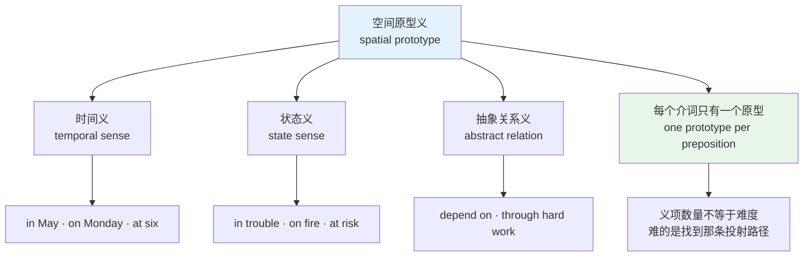
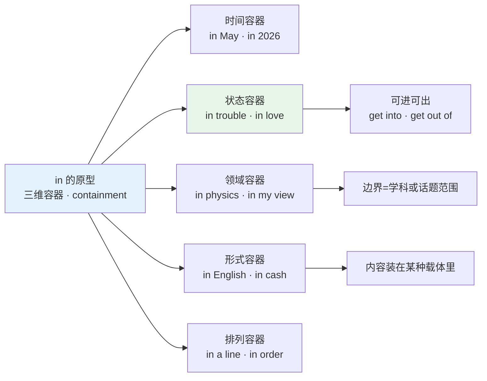
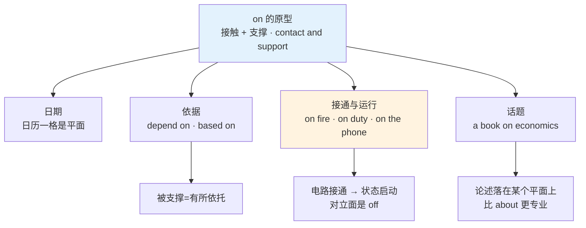
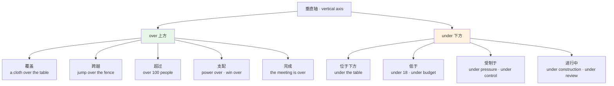
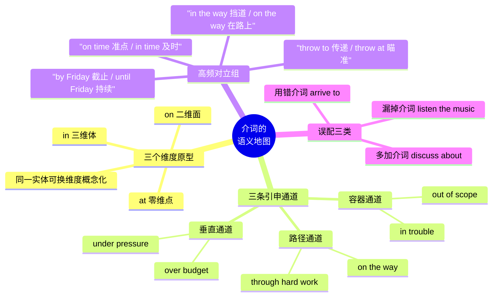

# 空间与路径介词：空间原型义到抽象义的引申

> [!info] 本篇定位
>
> 本章第二篇，接在 [[02.功能词与封闭词类速查/01.代词与限定词的词形矩阵\|代词与限定词的词形矩阵]] 之后。代词与限定词靠词形矩阵解决，介词靠语义地图解决——它们的形态没什么可背的，难的全在词义辐射。
>
> 读完你会拿到一张图：六个核心介词各自的空间原型是什么，抽象义沿哪条路径从原型长出来，以及一个陌生搭配该往哪个原型上挂。
>
> 本篇**不列逐介词搭配清单**。哪个动词配哪个介词属于搭配表的事，去查 [[02.英语基础语法/13.附录/03.介词搭配速查\|介词搭配速查]]。这里只解释那张表背后的生成逻辑：为什么是这个介词而不是另一个。

---

## 1. 本篇导读：介词是关系，不是词

介词是英语里最难查词典的一类词。查 `in`，词典给你十七个义项；查 `on`，给你二十二个。逐条背下来，下次遇到 `The project is on hold` 还是不知道该归到哪一条。

问题出在查词典这个动作本身。名词有指称对象，动词有动作图景，介词两样都没有——它标记的是**两个事物之间的关系**。`the book on the table` 里，`on` 不指书也不指桌子，它指书与桌子之间那种「接触并被支撑」的关系。

这带来两个直接后果。

**后果一：中文的「在」承载不了这个信息。** 中文说「在桌上」「在盒里」「在门口」，一个「在」打天下，具体关系靠后面的方位词「上、里、口」补足。英语正相反：关系信息全压在介词上，后面是光秃秃的名词。中文母语者的第一道坎就在这个错位——中文的方位词在名词后，英语的介词在名词前，而且英语的介词还额外编码了中文不区分的维度信息。

| 中文 | 英语 | 关系信息藏在哪 |
| --- | --- | --- |
| 在桌**上** | **on** the table | 英语在介词，中文在方位词 |
| 在盒**里** | **in** the box | 同上 |
| 在门**口** | **at** the door | 中文「口」暗示点，英语用 at 表达 |
| **在**六点 | **at** six | 中文不区分，英语必须选 at |
| **在**五月 | **in** May | 中文同样是「在」，英语换成 in |

**后果二：抽象义看起来像天上掉下来的。** `in trouble` 的 `in` 和 `in the box` 的 `in` 表面上毫无关系，于是学习者把前者当固定短语死记。记到第三十个就崩了，因为这类短语有几千个。

出路是承认一件事：抽象义不是新义项，它是空间义**投射**到抽象域的结果。麻烦被想象成一个包围人的区域，人可以掉进去（`get into trouble`）、待在里面（`be in trouble`）、爬出来（`get out of trouble`）。三个动词短语共用同一套空间图景，这说明容器不是比喻修辞，而是英语母语者真实在用的认知框架。

这张图是全篇的操作流程。遇到任何介词搭配，先回到最左边那个空间原型，再判断它走的是时间、状态还是抽象关系哪一条支线。走通了就不用记，走不通再当固定短语处理——真正走不通的比例比想象中低得多。

---

## 2. 空间原型：点、面、体三个维度

### 2.1 `at` / `on` / `in` 的维度对立

这三个介词构成英语空间系统的地基，区别只有一条：**说话人把参照物概念化成了几维**。

| 介词 | 维度 | 空间图式 | 典型例子 |
| --- | --- | --- | --- |
| **at** | 零维，点 | 只标位置，不关心内部结构与形状 | at the door, at the corner |
| **on** | 二维，面或线 | 接触并被支撑，或附着在表面 | on the table, on the wall |
| **in** | 三维，体 | 被边界包围，处在内部 | in the box, in the room |

| 英文 | 英式音标 | 美式音标 | 词性 | 中文 | 搭配与说明 |
| --- | --- | --- | --- | --- | --- |
| **at** | /æt/ | /æt/ | prep. | 在（某点） | 弱读为 /ət/，句中几乎总是弱读 |
| **on** | /ɒn/ | /ɑːn/ | prep. | 在……之上 | 美式另有 /ɔːn/ 一读，两者都通行 |
| **in** | /ɪn/ | /ɪn/ | prep. | 在……之内 | 唯一不弱读的核心介词，元音稳定 |
| **into** | /ˈɪntə/ | /ˈɪntə/ | prep. | 进入 | 强读 /ˈɪntuː/；表进入过程，in 表结果状态 |
| **onto** | /ˈɒntə/ | /ˈɑːntə/ | prep. | 到……之上 | 强读时尾音 /tuː/；对应 on 的动态版 |
| **within** | /wɪˈðɪn/ | /wɪˈðɪn/ | prep. | 在……之内（不超出） | 强调边界不被突破，比 in 正式 |
| **inside** | /ɪnˈsaɪd/ | /ɪnˈsaɪd/ | prep./n. | 在……内部；内侧 | 比 in 更强调「不在外面」的对立 |
| **outside** | /ˌaʊtˈsaɪd/ | /ˌaʊtˈsaɪd/ | prep./n. | 在……外部；外侧 | outside of 在美式口语中常见 |

同一个实体可以被概念化成不同维度，选哪个介词取决于说话人当下关心什么。这是介词最反直觉、也最关键的一点。

> [!example] 同一个「桌子」的三种概念化
>
> - The keys are **on** the table.
>   - 钥匙在桌上。（桌面是二维承载面）
> - There's a cat **under** the table.
>   - 桌子底下有只猫。（桌子是有上下方位的物体）
> - We were all sitting **at** the table.
>   - 我们都坐在桌边。（桌子缩成一个聚集点，重点是用餐或开会这件事）

`at the table` 不能理解成「在桌子表面」。当参照物被当成活动的场所时，它的形状被忽略了，只剩一个位置点。`at the desk`（在书桌前工作）、`at the piano`（在弹钢琴）、`at the wheel`（在开车）都是同一个机制。

### 2.2 车里还是车上：`in the car` 与 `on the bus`

中文母语者最早遇到的困惑之一：为什么小汽车用 `in`，公交车、火车、飞机用 `on`？

判据是**能否在里面站直行走**。

| 交通工具 | 介词 | 理由 |
| --- | --- | --- |
| car, taxi, van | **in** | 空间局促，人需要弯腰钻进去，身体被包裹 |
| bus, train, plane, ship | **on** | 有可站立行走的地板，人被地板支撑 |
| bike, motorcycle, horse | **on** | 骑跨在上，接触并被支撑 |
| boat（小船） | **in** 或 **on** | 小艇用 in，大船用 on，边界随尺寸浮动 |

这不是随机约定。`on the bus` 的 `on` 来自「站在车厢地板这个平面上」，`in the car` 的 `in` 来自「被车厢这个封闭空间包住」。原型一旦对上，剩下的搭配自己就长出来了：`get on the bus` / `get off the bus` 对应上下平面，`get in the car` / `get out of the car` 对应进出容器。

> [!warning] 这组搭配的连带效应
>
> 选错介词会连累动词短语，因为动词短语的方向词跟介词是配套的。
>
> - ❌ ~~get out of the bus~~ / ~~get off the car~~
> - ✅ **get off the bus** / **get out of the car**
>
> 中文「下车」不区分，英语必须跟着原型走：平面用 off，容器用 out of。

### 2.3 从空间到时间：同一套维度直接复用

英语的时间介词没有自己的一套词，全部借用空间介词。借用规则也不新——维度对应直接照搬。

| 时间单位 | 介词 | 概念化方式 |
| --- | --- | --- |
| 时刻：six o'clock, noon, midnight, dawn | **at** | 时间轴上一个点 |
| 日期：Monday, May 5, my birthday | **on** | 日历上一格，二维平面 |
| 时段：May, 2026, the morning, winter | **in** | 有起止边界的容器 |

| 英文 | 英式音标 | 美式音标 | 词性 | 中文 | 搭配与说明 |
| --- | --- | --- | --- | --- | --- |
| **during** | /ˈdjʊərɪŋ/ | /ˈdʊrɪŋ/ | prep. | 在……期间 | 回答「何时」，不回答「多久」 |
| **for** | /fɔː/ | /fɔːr/ | prep. | 持续（多久） | 弱读 /fə/ · /fər/；回答「多久」 |
| **since** | /sɪns/ | /sɪns/ | prep./conj. | 自从 | 接时间点，常配完成时 |
| **until** | /ənˈtɪl/ | /ənˈtɪl/ | prep./conj. | 直到 | 强调动作持续到该点；till 是口语变体 |
| **by** | /baɪ/ | /baɪ/ | prep. | 不迟于 | 强调截止点，动作在该点前完成 |
| **throughout** | /θruːˈaʊt/ | /θruːˈaʊt/ | prep. | 贯穿整个 | 比 through 更强调全程无间断 |

`in the morning` 用 in（早晨是一段时间容器），但 `on Monday morning` 用 on——一旦被具体日期限定，这个早晨就绑到了日历那一格上，格子的维度压过了容器的维度。同一个 `morning`，前面加不加限定词，介词就翻一次面。这个现象说明介词选择跟的是**整个名词短语被概念化成什么**，不是跟着中心词走。

> [!warning] `in two hours` 不是「两小时内」
>
> 这是中文母语者最高频的时间介词误解之一。
>
> - **in two hours** = 两小时之后。说话时刻起算，跨过两小时这个容器，落在它的出口。
>   - I'll be there **in** two hours.（两小时后我到）
> - **within two hours** = 两小时之内，不突破边界。
>   - Please reply **within** two hours.（两小时内回复）
> - **after two hours** = 两小时后，但通常指过去叙述中的某个已知时点。
>   - **After** two hours, he gave up.（两小时后他放弃了）
>
> 写邮件时把 `within` 写成 `in`，对方会理解成「两小时后才做」，跟你想说的截止要求正好相反。

---

## 3. `in`：容器义如何长出状态与领域

### 3.1 容器的五条辐射线

`in` 的原型是三维包围。从这个原型出发，抽象义沿五条线辐射。

五条线共享同一个动作：把某个抽象事物想象成有边界的空间，然后把人或事放进去。状态那条线之所以特别值得单独讲，是因为它有一个可验证的证据——进出动词。

### 3.2 状态容器：`in trouble` 的引申逻辑

`trouble` 是个抽象名词，本身没有形状。但英语把它当成一片区域来处理，整套进出词汇因此成立。

> [!example] 麻烦作为一个可进出的空间
>
> - He got **into** trouble for skipping class.
>   - 他因为逃课惹上了麻烦。（进入）
> - She is **in** serious trouble now.
>   - 她现在麻烦大了。（处于内部）
> - We finally got **out of** trouble.
>   - 我们终于摆脱了麻烦。（离开）
> - Stay **out of** trouble while I'm away.
>   - 我不在的时候别惹事。（保持在外部）

如果 `in trouble` 只是一个碰巧长这样的固定短语，`get into` 和 `get out of` 不会同时成立。它们成立，说明容器图式是活的，可以被新的动词继续调用。

同一个模具生产出的状态短语数量很大，这里只列高频的一批，用来确认模式：

| 英文 | 英式音标 | 美式音标 | 词性 | 中文 | 搭配与说明 |
| --- | --- | --- | --- | --- | --- |
| **trouble** | /ˈtrʌbl/ | /ˈtrʌbl/ | n. | 麻烦 | in trouble / get into trouble |
| **danger** | /ˈdeɪndʒə/ | /ˈdeɪndʒər/ | n. | 危险 | in danger / out of danger（脱离危险） |
| **debt** | /det/ | /det/ | n. | 债务 | in debt；b 不发音 |
| **charge** | /tʃɑːdʒ/ | /tʃɑːrdʒ/ | n./v. | 负责；收费 | in charge of 主管；in the charge of 由……主管 |
| **doubt** | /daʊt/ | /daʊt/ | n./v. | 怀疑 | in doubt 存疑；no doubt 想必；b 不发音 |
| **hurry** | /ˈhʌri/ | /ˈhɜːri/ | n./v. | 匆忙 | in a hurry；英美元音差别明显 |
| **pain** | /peɪn/ | /peɪn/ | n. | 疼痛 | in pain 处于疼痛中，不说 with pain |
| **public** | /ˈpʌblɪk/ | /ˈpʌblɪk/ | n./adj. | 公众；公开的 | in public 当众；in private 私下 |
| **ruins** | /ˈruːɪnz/ | /ˈruːɪnz/ | n. | 废墟 | in ruins 成为废墟，恒用复数 |
| **effect** | /ɪˈfekt/ | /ɪˈfekt/ | n. | 效力 | in effect 生效中；take effect 开始生效 |

> [!tip] 状态容器的自查方法
>
> 拿不准某个状态该配哪个介词时，先试着补出进出动词。
>
> 说得通 `get into X` / `get out of X`，那 X 就配 `in`：trouble、debt、danger、a mess、difficulty。
>
> 说不通，就要换别的原型。`pressure` 说不通「进入压力」，因为压力是从上方施加的，所以它配 `under` 而不是 `in`——这条线在第 6 节展开。

### 3.3 领域容器与形式容器

领域这条线是学术写作的高频区。学科、专业、话题范围被当成有边界的地盘，人在地盘里活动。

> [!example] 领域与形式
>
> - She majors **in** computer science.
>   - 她主修计算机科学。（学科是活动范围）
> - There have been major advances **in** this field.
>   - 这个领域已有重大进展。
> - **In** my opinion, the design is over-engineered.
>   - 我认为这个设计过度工程化了。（观点是思想的容器）
> - Please write your answer **in** English, **in** ink.
>   - 请用英语、用钢笔写答案。（语言与墨水是内容的载体）
> - He paid **in** cash, not by card.
>   - 他付的现金，不是刷卡。（cash 是形式用 in，card 是手段用 by）

形式容器有一个稳定判据：`in` 后面接的是**内容以什么形态存在**，`by` 后面接的是**通过什么手段完成**。`in cash` 说的是钱的形态，`by card` 说的是支付的途径，两者不冲突，可以同句出现。

> [!warning] `in` 与 `on` 在「书写载体」上的分工
>
> - ✅ It's **in** the book.（内容在书里，书是容器）
> - ✅ It's **on** page 12.（页码是平面坐标）
> - ✅ The photo is **in** the newspaper.（内容在报纸里面）
> - ✅ The photo is **on** the front page.（头版是一个平面）
> - ❌ ~~It's in page 12.~~
>
> 分界线是「整体出版物」还是「其中某一平面」。整体用 in，具体页面用 on。

---

## 4. `on`：接触支撑如何长出依据与进行中

### 4.1 从接触到运行

`on` 的原型是接触加支撑。这个原型比 `in` 更容易被误解成「在上面」，因为重力方向其实不参与判断。

| 例子 | 位置 | 为什么仍然是 on |
| --- | --- | --- |
| a book **on** the table | 上方 | 接触且被支撑 |
| a picture **on** the wall | 侧面 | 接触且被附着 |
| a fly **on** the ceiling | 下方 | 接触且被附着，方向无关 |
| a ring **on** her finger | 环绕 | 表面接触 |

判据只有接触。理解了这一点，`on the ceiling` 就不再需要单独记。

从接触出发，`on` 的抽象义走了四条路。

依据那条线的推导最直接：物体压在平面上靠平面支撑，抽象化之后就是结论压在证据上、决定压在条件上。`depend on`、`rely on`、`base on`、`count on`、`insist on` 全部走这条线，共享同一个「有所依托」的图景。

运行那条线要跟 `off` 一起看才清楚。电灯的 `switch on` 原本是把开关推到接通位置，接通之后电流有了通路，设备进入运行状态。这个「接通即运行」的图景被搬到大量情境上：`on fire`（火接上了）、`on duty`（值班状态接通）、`on sale`（促销开着）、`on strike`（罢工进行中）、`on air`（正在播出）、`on hold`（保持在待机线上）。

| 英文 | 英式音标 | 美式音标 | 词性 | 中文 | 搭配与说明 |
| --- | --- | --- | --- | --- | --- |
| **duty** | /ˈdjuːti/ | /ˈduːti/ | n. | 职责；值班 | on duty 值班 / off duty 下班；英美首音差别大 |
| **strike** | /straɪk/ | /straɪk/ | n./v. | 罢工；打击 | on strike 罢工中；go on strike 开始罢工 |
| **hold** | /həʊld/ | /hoʊld/ | n./v. | 保持；搁置 | on hold 电话保持中，或项目搁置 |
| **purpose** | /ˈpɜːpəs/ | /ˈpɜːrpəs/ | n. | 目的 | on purpose 故意；对立面 by accident |
| **average** | /ˈævərɪdʒ/ | /ˈævərɪdʒ/ | n./adj. | 平均 | on average 平均而言；above average 高于平均 |
| **behalf** | /bɪˈhɑːf/ | /bɪˈhæf/ | n. | 代表 | on behalf of 代表；英美元音不同 |
| **schedule** | /ˈʃedjuːl/ | /ˈskedʒuːl/ | n./v. | 日程；安排 | on schedule 按计划；英美读音差异最大的常用词之一 |
| **increase** | /ˈɪnkriːs/ | /ˈɪnkriːs/ | n. | 增长 | on the increase 呈上升趋势，名词重音在前 |

### 4.2 `on time` 与 `in time`：一个原型差别的实战案例

这两个短语是本篇最能体现「原型决定用法」的例子，也是中文母语者最容易混的一对。中文都译成「按时」，英语的分工却相当锋利。

| 短语 | 原型来源 | 含义 | 对立面 |
| --- | --- | --- | --- |
| **on time** | 点落在刻度线上 | 准点，不早不晚 | late（迟到） |
| **in time** | 落在时间窗口内 | 及时，赶上了 | too late（来不及） |

> [!example] 一个字的差别改变整句意思
>
> - The train arrived **on time**.
>   - 火车准点到站。（时刻表写几点就是几点）
> - We got to the station **in time** to catch the train.
>   - 我们及时赶到车站，赶上了火车。（在关门前那个窗口里）
> - The ambulance got there just **in time**.
>   - 救护车刚好及时赶到。（再晚一点就来不及）
> - The meeting started **on time** for once.
>   - 会议难得准时开始了一次。

`on time` 用 `on` 是因为时刻表上的那个时间是一条刻度线，事件落在线上就叫准点。`in time` 用 `in` 是因为「来得及」意味着落进了一个还没关闭的时间容器，早多少无所谓，只要没出边界。

同样的对立还有一对：

- `in the end`（最终，全过程走完之后）与 `at the end of`（在某物的末端这个点上）
- `in the way`（挡路，处于路径内部）与 `on the way`（在路上，沿着路面移动）

> [!warning] `in the way` 不是「在路上」
>
> - ❌ ~~I'm in the way to your office.~~
> - ✅ I'm **on the way** to your office.（我在去你办公室的路上）
> - ✅ Your bike is **in the way**.（你的自行车挡道了）
>
> `in the way` 表示占据了通道内部空间因而构成阻碍，是个负面表达。发消息时写错这一个介词，对方收到的是「你挡我路了」。

### 4.3 话题：`on` 与 `about` 的语域差别

两者都能表示「关于」，区别在于论述的严肃程度。

| 短语 | 语域 | 典型语境 |
| --- | --- | --- |
| a book **on** linguistics | 学术、专业 | 系统论述，有结构的著作 |
| a book **about** his childhood | 中性、日常 | 泛泛谈及，不要求体系 |
| a lecture **on** database indexing | 专业 | 技术讲座 |
| We talked **about** the weather. | 口语 | 闲聊 |

`on` 的专业感来自它的原型：论述稳稳地压在某个明确划定的平面上，范围清晰。`about` 的原型是「围绕」（`around` 的近亲），涉及但不锁定。写技术文档标题时选 `on` 更贴切，聊天时用 `about` 更自然。

---

## 5. `at`：点定位如何长出数值与目标

### 5.1 点的四条辐射线

`at` 的原型最简单：一个不考虑内部结构的位置点。正因为简单，它的抽象义辐射得最远。

| 辐射方向 | 图景 | 例子 |
| --- | --- | --- |
| 空间点 | 位置坐标 | at the door, at the crossroads |
| 时间点 | 时刻 | at 6:30, at noon, at midnight |
| 刻度点 | 数值轴上一个读数 | at 80 km/h, at 20 degrees, at the age of 30 |
| 目标点 | 矢量投向的落点 | look at, shout at, aim at |

刻度点这条线在技术写作里出现频率极高：`at a rate of`、`at a price of`、`at full capacity`、`at 3.2 GHz`、`at line 47`。凡是把某个量放到刻度轴上读数，用的都是 `at`。

| 英文 | 英式音标 | 美式音标 | 词性 | 中文 | 搭配与说明 |
| --- | --- | --- | --- | --- | --- |
| **rate** | /reɪt/ | /reɪt/ | n. | 速率；比率 | at a rate of；at any rate 无论如何 |
| **speed** | /spiːd/ | /spiːd/ | n. | 速度 | at high speed；at full speed |
| **capacity** | /kəˈpæsəti/ | /kəˈpæsəti/ | n. | 容量；产能 | at full capacity 满负荷运转 |
| **risk** | /rɪsk/ | /rɪsk/ | n./v. | 风险 | at risk 处于风险中；at the risk of 冒着……的风险 |
| **peace** | /piːs/ | /piːs/ | n. | 和平；平静 | at peace；对立面 at war |
| **rest** | /rest/ | /rest/ | n./v. | 静止；休息 | at rest 静止状态，物理学常用 |
| **large** | /lɑːdʒ/ | /lɑːrdʒ/ | adj. | 在逃的；大的 | at large 逍遥法外；the public at large 广大公众 |
| **ease** | /iːz/ | /iːz/ | n./v. | 自在 | at ease 放松；ill at ease 局促不安 |

### 5.2 目标点：`throw at` 与 `throw to` 的敌意差

`at` 表目标时带有一层附加意味：动作是**投向**这个点的，而这个点是被瞄准的对象，不是接收方。这跟 `to` 形成了一组语义对立，中文完全不区分。

> [!example] 同一个动词，两种关系
>
> - He threw the ball **to** me.
>   - 他把球扔给我。（我是接球的人，友好传递）
> - He threw the ball **at** me.
>   - 他拿球砸我。（我是被瞄准的靶子，含敌意）
> - She shouted **to** me from across the street.
>   - 她在街对面朝我喊。（为了让我听见）
> - She shouted **at** me for being late.
>   - 她因为我迟到而冲我吼。（发火）
> - He smiled **at** her.
>   - 他冲她笑。（笑这个动作投向她，无敌意，因为 smile 本身是善意的）

`at` 本身不含敌意，敌意来自「把人当靶子」这个概念化方式跟动词语义的叠加。`throw`、`shout`、`point`、`stare` 这类带冲击力的动词配 `at` 就显得有攻击性；`smile`、`look`、`glance` 配 `at` 只是普通的注视投向。

> [!warning] `look at` 与 `look to` 不是同一件事
>
> - ✅ **Look at** this diagram.（看这张图，视线投向一个点）
> - ✅ Many teams **look to** open source for solutions.（许多团队指望开源找到方案）
>
> `look to` 的 `to` 是方向与依靠，意思接近「求助于、指望」。混用会让句子彻底跑偏。

### 5.3 机构名词前的 `at` / `in` / `on`

机构类名词是维度概念化最灵活的一批。

| 说法 | 概念化 | 含义 |
| --- | --- | --- |
| **at** school | 功能点 | 在上学（关心的是身份与活动，不是位置） |
| **in** school | 容器 | 美式常指在读书阶段；英式偏向在校舍内部 |
| **at** the office | 功能点 | 在上班 |
| **in** the office | 容器 | 人此刻在办公室这个房间里 |
| **at** the station | 路线上一点 | 在车站（等车、接人） |
| **in** the station | 容器 | 在车站建筑内部（比如躲雨） |
| **at** the corner | 街角外部一点 | 在拐角处（街道） |
| **in** the corner | 房间内角 | 在墙角（室内） |
| **on** the corner | 街角的地面上 | 街角那个位置（店铺常用） |

`at the corner` 与 `in the corner` 这一对差别最大：前者在户外街道，后者在室内角落。写「书架在角落里」用 `in the corner`，写「在街角碰面」用 `at the corner`，弄反了对方会走到错误的地点。

---

## 6. `over` 与 `under`：垂直轴的覆盖、超越与受制

### 6.1 垂直图式的三段结构

`over` 与 `under` 是一对镜像，共享同一根垂直轴。它们跟 `above` / `below` 的区别常被忽略，但在技术写作里会造成歧义。

垂直轴上侧生长出「多、强、控制」，下侧生长出「少、弱、被控制」。这不是英语独有的怪癖，中文的「上级」「下属」「压力」「居高临下」走的是同一条通道。差别在于英语把它固化进了介词系统，因而出现频率高得多。

| 英文 | 英式音标 | 美式音标 | 词性 | 中文 | 搭配与说明 |
| --- | --- | --- | --- | --- | --- |
| **over** | /ˈəʊvə/ | /ˈoʊvər/ | prep./adv. | 在……上方；超过 | 覆盖或跨越，要求垂直相对 |
| **under** | /ˈʌndə/ | /ˈʌndər/ | prep./adv. | 在……下方；低于 | over 的镜像 |
| **above** | /əˈbʌv/ | /əˈbʌv/ | prep./adv. | 高于 | 只表相对高度，不要求正对或覆盖 |
| **below** | /bɪˈləʊ/ | /bɪˈloʊ/ | prep./adv. | 低于 | above 的镜像 |
| **beneath** | /bɪˈniːθ/ | /bɪˈniːθ/ | prep. | 在……下面 | 比 under 书面，可表「不屑于」 |
| **underneath** | /ˌʌndəˈniːθ/ | /ˌʌndərˈniːθ/ | prep./adv. | 紧贴下方 | 强调被完全遮住 |
| **beyond** | /biˈjɒnd/ | /biˈjɑːnd/ | prep. | 超出（范围） | beyond repair 无法修复；beyond me 我理解不了 |
| **upon** | /əˈpɒn/ | /əˈpɑːn/ | prep. | 在……之上 | on 的正式变体，多见于书面与固定短语 |

### 6.2 `over` / `above` 与 `under` / `below` 的分工

| 判据 | over / under | above / below |
| --- | --- | --- |
| 空间关系 | 要求垂直正对，常含覆盖或跨越 | 只要求高度差，不必正对 |
| 数量表达 | 用于可数数量：over 100 people, under 18 | 用于刻度读数：above zero, below average |
| 接触 | 允许接触（a blanket over him） | 一般不接触 |

> [!example] 四个介词的精确差别
>
> - The lamp hangs **over** the table.
>   - 灯挂在桌子正上方。（正对，能照亮桌面）
> - The painting is **above** the sofa.
>   - 画挂在沙发上方。（位置更高即可，不必正对中心）
> - The cat is **under** the chair.
>   - 猫在椅子底下。（正下方）
> - His score is **below** average.
>   - 他的分数低于平均。（刻度比较，不是空间）

技术文档里 `above` 与 `below` 还有一个高频用法：指代文中位置。`as shown above`（如上所示）、`see the table below`（见下表）。这里用的是「页面是竖直平面」这个隐喻，不能换成 `over` / `under`。

### 6.3 `under pressure`：受制于的引申逻辑

`under pressure` 是垂直隐喻最典型的产物，值得逐步拆开。

物理场景：重物压在下面的东西上，下面的东西承受压力，行动受限。抽象化之后，`pressure` 不再是物理力，而是工期、上级要求、竞争、舆论；承受方不再是物体，而是人或组织。空间关系完整保留：压力在上，人在下，人的行动被压制。

同一模具生产出的短语，全部共享「被上方力量覆盖因而受其支配」的图景：

| 短语 | 中文 | 覆盖者是什么 |
| --- | --- | --- |
| **under pressure** | 承受压力 | 压力 |
| **under control** | 处于控制之下 | 控制力 |
| **under attack** | 遭受攻击 | 攻击 |
| **under investigation** | 正在调查中 | 调查程序 |
| **under discussion** | 正在讨论中 | 讨论程序 |
| **under review** | 正在审核中 | 审核程序 |
| **under construction** | 正在建设中 | 施工过程 |
| **under warranty** | 在保修期内 | 保修条款 |
| **under the law** | 依据法律 | 法律管辖 |
| **under new management** | 已换新管理层 | 管理权 |

后半批（investigation、discussion、review、construction）值得单独说：它们表面是「正在进行」，本质仍是受制——对象被某个流程覆盖着，在流程结束前不能自由处置。中文说「正在施工」，英语说 `under construction`，视角其实不同：中文站在施工方，英语站在被施工的对象。理解了这个视角差，`under` 系列的进行义就不需要额外记忆。

> [!warning] `under construction` 的主语是对象不是人
>
> - ❌ ~~The workers are under construction.~~
> - ✅ The bridge is **under construction**.（桥梁在建）
> - ✅ The workers are **building** the bridge.
>
> 被覆盖的必须是接受动作的那个事物。这条规则对整个 under 系列成立：`under review` 的主语是被审的文件，`under investigation` 的主语是被查的人或事，不是调查员。

### 6.4 `over` 的完成义

`over` 有一个中文母语者常忽略的用法：表示时间跨越完毕，即「结束」。

> [!example] over 的三种时间用法
>
> - The meeting is **over**.
>   - 会议结束了。（跨过了终点）
> - Let's discuss it **over** lunch.
>   - 边吃午饭边谈。（讨论覆盖了整段午饭时间）
> - Sales have grown steadily **over** the past three years.
>   - 过去三年销售额稳步增长。（覆盖整个时段）
> - I'll call you **over** the weekend.
>   - 周末我给你打电话。（周末这个时段的某处）

这四句的 `over` 都源自「覆盖」：终点被跨过就是结束，动作铺满一段时间就是持续。`over the phone` 也一样——声音跨越了距离传过来，所以是 `over the phone`（通过电话），而 `on the phone`（在通话中）走的是 `on` 的接通义。两者可以同句出现：`I was on the phone with her, and we settled it over the phone.`

---

## 7. `through`：路径贯穿如何长出凭借与完成

### 7.1 三维穿越与二维横穿

`through` 的原型是从一端进、从另一端出，路径穿过介质**内部**。它的对照组是 `across`，后者只在表面横过。

| 介词 | 图式 | 例子 |
| --- | --- | --- |
| **through** | 穿过内部（三维） | walk through the forest, drive through the tunnel |
| **across** | 横过表面（二维） | swim across the river, walk across the street |
| **along** | 沿着线移动 | walk along the river bank |
| **past** | 经过旁边不停留 | drive past the bank |
| **around** | 环绕或到处 | travel around Europe |

| 英文 | 英式音标 | 美式音标 | 词性 | 中文 | 搭配与说明 |
| --- | --- | --- | --- | --- | --- |
| **through** | /θruː/ | /θruː/ | prep./adv. | 穿过；凭借 | 与 threw 同音，拼写完全不同 |
| **across** | /əˈkrɒs/ | /əˈkrɔːs/ | prep./adv. | 横过 | 表面横穿；across from 在……对面（美式） |
| **along** | /əˈlɒŋ/ | /əˈlɔːŋ/ | prep./adv. | 沿着 | 沿线性物体移动 |
| **past** | /pɑːst/ | /pæst/ | prep./adv. | 经过 | 英美元音差别明显；也用于报时 half past six |
| **around** | /əˈraʊnd/ | /əˈraʊnd/ | prep./adv. | 围绕；大约 | 英式表「大约」也可用 about |
| **between** | /bɪˈtwiːn/ | /bɪˈtwiːn/ | prep. | 在……之间 | 两者之间，或多者两两之间 |
| **among** | /əˈmʌŋ/ | /əˈmʌŋ/ | prep. | 在……当中 | 三者以上，不作两两区分 |
| **against** | /əˈɡenst/ | /əˈɡenst/ | prep. | 靠着；反对 | 接触加反向力，两义同源 |
| **via** | /ˈvaɪə/ | /ˈvaɪə/ | prep. | 经由 | 拉丁借词，技术文档高频 |

> [!example] through 与 across 的边界
>
> - We walked **across** the field.
>   - 我们穿过田野。（走在田野表面）
> - We walked **through** the tall grass.
>   - 我们从高草丛里穿过去。（草没过身体，人在介质内部）
> - She swam **across** the river.
>   - 她游过了河。（从此岸到彼岸，水面路径）
> - The pipe runs **through** the wall.
>   - 管道穿墙而过。（在墙体内部）

判据是「有没有被介质包住」。人比草矮就用 `through`，比草高就用 `across`——同一片草地，说话人选哪个介词取决于他想强调什么。

### 7.2 从路径到手段与完成

路径图式有起点、过程、终点三个部分，`through` 的抽象义从这三个部分分别长出来。

| 抽象义 | 对应路径的哪一段 | 例子 |
| --- | --- | --- |
| 时间贯穿 | 整条路径 | through the night, all through the war |
| 手段凭借 | 中段（必经之处） | through hard work, through a friend |
| 经历 | 整条路径带痛感 | go through a hard time |
| 完成 | 终点 | get through the work, be through with it |

> [!example] through 的四种抽象用法
>
> - He worked **through** the night.
>   - 他通宵工作。（时间从一头贯到另一头）
> - I got the job **through** a former colleague.
>   - 我是通过一位前同事拿到这份工作的。（中介是必经通道）
> - They've been **through** a lot together.
>   - 他们一起经历了很多。（走完了一条难走的路）
> - I'm nearly **through** with the report.
>   - 报告我快写完了。（接近路径终点）

手段义跟 `by` 有分工：`by` 强调方法本身（`by email`、`by train`），`through` 强调经过某个中介（`through an agent`、`through negotiation`）。写「通过邮件联系我」用 `by email` 更自然，写「通过谈判解决」用 `through negotiation` 更贴切。

> [!warning] 美式日期的 `through` 是闭区间
>
> - **Monday through Friday**（美式）= 周一到周五，**含周五**
> - **Monday to Friday**（英式）= 周一到周五，尾端是否含有时有歧义
>
> 美式公文用 `through` 正是为了消除这个歧义。读英文合同、签证材料、营业时间表时看到 `through`，一律理解为包含末端那一天。技术文档里的 `1 through 10` 同理，等于 `1..10` 闭区间。

---

## 8. 三条引申通道：把抽象搭配挂回原型

### 8.1 通道总览

前面五节逐个介词讲了引申，把它们横过来看，抽象义其实只走三条通道。Lakoff 与 Johnson 在 1980 年的 *Metaphors We Live By* 中把这类系统性的跨域投射称为概念隐喻，介词系统是它最集中的表现之一。

| 通道 | 空间来源 | 抽象目标 | 代表短语 |
| --- | --- | --- | --- |
| 容器通道 | 三维包围 | 状态、领域、形式 | in trouble, in danger, in English |
| 路径通道 | 一维移动 | 过程、手段、进度 | through hard work, on the way, from A to B |
| 垂直通道 | 上下关系 | 数量、权力、受制 | under pressure, over budget, above average |

三条通道共用同一个来源——人对自己身体在空间中位置的经验。被包住、走过去、被压住，这三种最基本的身体感受被反复投射到没有形状的抽象事物上，于是状态成了容器，过程成了旅程，控制成了高处。

这张表可以当成一个判断流程用。碰到没见过的介词短语，不要直接查词典的义项号，先问三个问题：这里有没有一个被包围的东西（容器）？有没有一个从起点到终点的移动（路径）？有没有一个高低支配关系（垂直）？三问一遍，绝大多数搭配自己就落位了。

### 8.2 通道判断的实战演练

拿几个技术文档里常见的短语走一遍流程。

| 短语 | 通道 | 推导 |
| --- | --- | --- |
| **in production** | 容器 | 生产环境是一个空间，服务部署在里面运行 |
| **on staging** | 接触（on 的运行义） | 预发布环境像一条接通的线路，服务跑在上面 |
| **under load** | 垂直 | 负载从上方压来，系统在其下承受 |
| **through the pipeline** | 路径 | 代码从一端进、另一端出，流水线是通道 |
| **out of scope** | 容器 | 范围是有边界的区域，这件事在边界外 |
| **over budget** | 垂直 | 预算是一条水平线，实际花销越过了它 |
| **at capacity** | 点 | 容量是刻度轴上一个读数，当前值落在那个点上 |
| **behind schedule** | 路径 | 计划是一条时间线上前进的参照物，实际进度落在它后面 |

`behind schedule` / `ahead of schedule` / `on schedule` 三个一起看最清楚：日程被想象成一个匀速前进的参照物，你在它后面就是延期，在它前面就是提前，跟它重合就是按计划。三个介词各自的原型都没变，变的只是被投射的对象。

> [!tip] 建立个人的通道索引
>
> 记新短语时，在笔记里给它标一个通道标签，而不是抄一遍中文释义。
>
> `in a bind` — 容器，跟 in trouble 同族
> `under fire` — 垂直，跟 under attack 同族
> `on track` — 路径加接触，跟 on schedule 同族
>
> 标签数量只有三个，复习时按标签成组回忆，比按字母序回忆效率高很多。同族短语一旦成组，新短语挂进去几乎不占额外记忆量。

---

## 9. 中文母语者的误配点

### 9.1 多加介词：动词本身已经吃掉了对象

这是最高频的一类错误，根源是中文动词后面习惯带「关于、到、给」这类成分，学习者把它们逐字翻译成了英语介词。

| 英文 | 英式音标 | 美式音标 | 词性 | 中文 | 搭配与说明 |
| --- | --- | --- | --- | --- | --- |
| **discuss** | /dɪˈskʌs/ | /dɪˈskʌs/ | v. | 讨论 | 直接接宾语，不加 about |
| **mention** | /ˈmenʃn/ | /ˈmenʃn/ | v. | 提到 | 直接接宾语，不加 about |
| **emphasize** | /ˈemfəsaɪz/ | /ˈemfəsaɪz/ | v. | 强调 | 直接接宾语；名词形式用 emphasis on |
| **marry** | /ˈmæri/ | /ˈmeri/ | v. | 与……结婚 | marry sb；be married to sb；美式受 marry-merry 合并影响读 /ˈmeri/ |
| **contact** | /ˈkɒntækt/ | /ˈkɑːntækt/ | v./n. | 联系 | 动词直接接人；名词 in contact with |
| **attend** | /əˈtend/ | /əˈtend/ | v. | 出席 | attend a meeting；attend to 是「照料」，另一义 |
| **approach** | /əˈprəʊtʃ/ | /əˈproʊtʃ/ | v./n. | 接近；方法 | 动词直接接宾语；名词 an approach to |
| **affect** | /əˈfekt/ | /əˈfekt/ | v. | 影响 | 动词直接接宾语；名词 have an effect on |
| **answer** | /ˈɑːnsə/ | /ˈænsər/ | v./n. | 回答 | answer the question；answer to sb 是「对某人负责」 |
| **lack** | /læk/ | /læk/ | v./n. | 缺少 | 动词直接接宾语；名词 a lack of |
| **enter** | /ˈentə/ | /ˈentər/ | v. | 进入 | 物理进入不加 into；enter into an agreement 是抽象义 |
| **resemble** | /rɪˈzembl/ | /rɪˈzembl/ | v. | 像 | 直接接宾语，不加 to 或 with |
| **serve** | /sɜːv/ | /sɜːrv/ | v. | 服务；供职 | serve sb；serve as 担任 |
| **arrive** | /əˈraɪv/ | /əˈraɪv/ | v. | 到达 | 不及物，必须配 at 或 in，绝不配 to |

> [!warning] 六个最常见的多余介词
>
> - ❌ ~~We discussed about the plan.~~
> - ✅ We **discussed** the plan. / We **talked about** the plan.
>
> - ❌ ~~He mentioned about the deadline.~~
> - ✅ He **mentioned** the deadline.
>
> - ❌ ~~The report emphasizes on security.~~
> - ✅ The report **emphasizes** security. / The report **puts emphasis on** security.
>
> - ❌ ~~She married with a doctor.~~
> - ✅ She **married** a doctor. / She **is married to** a doctor.
>
> - ❌ ~~Please contact with me.~~
> - ✅ Please **contact** me. / Please **get in contact with** me.
>
> - ❌ ~~This will affect on performance.~~
> - ✅ This will **affect** performance. / This will **have an effect on** performance.
>
> 规律很清楚：**动词形式直接接宾语，名词形式才需要介词**。`emphasize sth` 对 `emphasis on sth`，`affect sth` 对 `an effect on sth`，`approach sth` 对 `an approach to sth`。记住这条对偶，一组错误一起消失。

### 9.2 `arrive` 的三个介词

`arrive` 单独拿出来说，因为它错得最有代表性——中文「到达」是及物的，英语 `arrive` 是不及物的。

| 用法 | 场合 | 例子 |
| --- | --- | --- |
| **arrive at** | 小地点，或抽象终点 | arrive at the station, arrive at a conclusion |
| **arrive in** | 大地点（城市、国家） | arrive in Beijing, arrive in Germany |
| **arrive** 单用 | 不说明地点 | The package arrived yesterday. |

> [!warning] `arrive to` 不存在
>
> - ❌ ~~We arrived to the airport at nine.~~
> - ✅ We **arrived at** the airport at nine.
> - ✅ We **got to** the airport at nine.
> - ✅ We **reached** the airport at nine.
>
> 三个近义表达的搭配各不相同：`arrive` 配 at/in，`get` 配 to，`reach` 直接接宾语。中文都是「到」，英语三种句法，不能互相类推。
>
> `arrive at a conclusion`（得出结论）用 at 是因为结论被想象成推理路径的终点，是一个点，跟 `arrive at the station` 同一个图式。

### 9.3 漏掉介词：中文的及物动词在英语里不及物

跟 9.1 相反的一类：中文动词直接带宾语，英语必须加介词。

| 英文 | 英式音标 | 美式音标 | 词性 | 中文 | 搭配与说明 |
| --- | --- | --- | --- | --- | --- |
| **listen** | /ˈlɪsn/ | /ˈlɪsn/ | v. | 听 | listen to sth；t 不发音 |
| **wait** | /weɪt/ | /weɪt/ | v. | 等 | wait for sb；wait on 是「伺候」 |
| **reply** | /rɪˈplaɪ/ | /rɪˈplaɪ/ | v./n. | 回复 | reply to sb；名词 a reply to |
| **apologize** | /əˈpɒlədʒaɪz/ | /əˈpɑːlədʒaɪz/ | v. | 道歉 | apologize to sb for sth |
| **depend** | /dɪˈpend/ | /dɪˈpend/ | v. | 取决于 | depend on；口语可说 it depends |
| **participate** | /pɑːˈtɪsɪpeɪt/ | /pɑːrˈtɪsɪpeɪt/ | v. | 参与 | participate in；比 join in 正式 |
| **graduate** | /ˈɡrædʒueɪt/ | /ˈɡrædʒueɪt/ | v. | 毕业 | graduate from；名词读 /ˈɡrædʒuət/ |
| **consist** | /kənˈsɪst/ | /kənˈsɪst/ | v. | 由……构成 | consist of；无被动、无进行时 |
| **explain** | /ɪkˈspleɪn/ | /ɪkˈspleɪn/ | v. | 解释 | explain sth to sb，不说 explain sb sth |
| **focus** | /ˈfəʊkəs/ | /ˈfoʊkəs/ | v./n. | 聚焦 | focus on；名词 the focus of |

> [!warning] 五个必须补上的介词
>
> - ❌ ~~I'm listening the podcast.~~
> - ✅ I'm **listening to** the podcast.
>
> - ❌ ~~Wait me at the gate.~~
> - ✅ **Wait for** me at the gate.
>
> - ❌ ~~Please reply me before Friday.~~
> - ✅ Please **reply to** me before Friday. / Please **answer** me before Friday.
>
> - ❌ ~~Let me explain you the design.~~
> - ✅ Let me **explain** the design **to** you.
>
> - ❌ ~~The system consists three modules.~~
> - ✅ The system **consists of** three modules. / The system **comprises** three modules.
>
> `comprise` 是个反例陷阱：它自己就及物，加 of 反而错。`consist of` 与 `comprise` 意思相同、搭配相反，这一对值得单独记牢。

### 9.4 混淆型：两个介词都对但意思不同

最隐蔽的一类错误——句子语法上成立，意思却偏了，对方不会纠正你，误解就此留下。

| 对照 | 差别 |
| --- | --- |
| **in the way** 挡道 / **on the way** 在路上 | 容器内部构成阻碍 vs 沿路面移动 |
| **in time** 及时 / **on time** 准点 | 落在窗口内 vs 落在刻度线上 |
| **at the end of** 在末端 / **in the end** 最终 | 位置点 vs 全过程之后 |
| **by Friday** 周五前完成 / **until Friday** 持续到周五 | 截止点 vs 持续终点 |
| **join** the club 入会 / **join in** the game 参与活动 | 成为成员 vs 加入正在进行的活动 |
| **agree with** sb 同意某人 / **agree to** a plan 同意方案 / **agree on** a date 就日期达成一致 | 对人 vs 对提议 vs 双方共识 |
| **shout to** 喊给某人听 / **shout at** 冲某人吼 | 传递 vs 瞄准 |
| **die of** 死于疾病 / **die from** 死于外因 | 内因 vs 外因，界线在现代英语中已模糊 |
| **made of** 看得出原料 / **made from** 原料已变形 | wooden table made of wood vs paper made from wood |
| **compare to** 比作 / **compare with** 对比 | 强调相似 vs 强调异同 |

> [!warning] `by` 与 `until` 弄反的后果最严重
>
> - I need it **by** Friday. = 周五之前交给我，最晚周五。
> - I'll be here **until** Friday. = 我在这儿待到周五，周五之后就走了。
>
> - ❌ ~~Please finish it until Friday.~~
> - ✅ Please finish it **by** Friday.
>
> `finish` 是瞬间完成的动作，不能配表示持续的 `until`。判据是动词类型：一次性完成的动作配 `by`，持续状态配 `until`。写工作邮件时把 deadline 说成 `until`，对方会理解成「一直做到周五」，跟你想要的「周五前交付」不是一回事。

### 9.5 中文空间习惯造成的偏差

| 中文说法 | 常见误译 | 正确说法 | 原因 |
| --- | --- | --- | --- |
| 在照片里 | ~~on the photo~~ | **in** the photo | 照片被当成一个包含人物的空间 |
| 在第十页 | ~~in page 10~~ | **on** page 10 | 页面是平面 |
| 在树上（果实） | ~~in the tree~~ | **on** the tree | 果实长在树上，接触表面 |
| 在树上（鸟） | ~~on the tree~~ | **in** the tree | 鸟在树冠内部，被枝叶包围 |
| 在街上 | — | 英式 **in** the street / 美式 **on** the street | 英式把街道看成两排房子围成的空间，美式只看路面 |
| 在墙上（挂画） | — | **on** the wall | 附着于表面 |
| 在墙上（嵌入的洞） | ~~on the wall~~ | **in** the wall | 洞在墙体内部 |

树上那一对最能说明「介词跟的是概念化不是客观位置」：苹果和鸟的物理位置可以完全相同，但苹果被理解为附着在枝条表面，鸟被理解为待在树冠这个空间里，介词因此分道扬镳。

---

## 10. 怎么练：从原型反推搭配

### 10.1 三步操作法

**第一步：给每个核心介词画一张原型卡。** 卡上只写一句话的空间图式和一个空间例句，不写义项列表。`in` 写「被边界包围 / in the box」，`on` 写「接触并被支撑 / on the table」，`at` 写「一个位置点 / at the door」。六张卡够用。

**第二步：新短语按通道归档，不按字母归档。** 遇到 `in a bind`，不要新开一条，挂到容器通道下 `in trouble` 那一族。遇到 `under fire`，挂到垂直通道下 `under attack` 那一族。归档动作本身就是复习。

**第三步：整块记，不拆开记。** 介词不能脱离搭配单独记忆。要记的最小单位是 `depend on sth`、`in charge of sth`、`under review`，而不是「on 有依据的意思」。词典义项是分析结果，不是记忆单位。

### 10.2 反向自测

比记忆更有效的是反向推导：给一个抽象短语，说出它走的是哪条通道，能不能推出兄弟短语。

| 给定短语 | 通道 | 应该能推出的同族 |
| --- | --- | --- |
| in danger | 容器 | out of danger, get into danger, in trouble |
| under pressure | 垂直 | under stress, under control, under attack |
| on schedule | 接触 + 路径 | ahead of schedule, behind schedule, on track |
| through negotiation | 路径 | through hard work, through a friend, via email |
| at full capacity | 刻度点 | at high speed, at a rate of, at 20 degrees |
| over budget | 垂直 | over the limit, over 100 users, above average |

推不出来的那一行，说明原型没吃透，回第 2 到第 7 节对应小节重看一遍。

### 10.3 什么时候该放弃推导

有一批搭配确实推不动，它们是历史沉积或法语借入时整块搬来的，硬推只会自我说服出一套错误的解释。

| 短语 | 中文 | 为什么推不动 |
| --- | --- | --- |
| **by heart** | 凭记忆 | learn sth by heart，来自古法语 par cœur 的直译 |
| **at large** | 逍遥法外 | 法语 au large 的痕迹 |
| **on end** | 连续不断 | for hours on end，end 的原义已磨损 |
| **in a nutshell** | 简而言之 | 典出普林尼记载的微型抄本传说 |
| **under the weather** | 身体不适 | 通常被追溯到航海用语，但确切来源无定论 |

这类短语的比例不高，遇到就当整词记。判断标准是：拆开之后每个词的字面义加起来解释不了整体义，且找不到通向任何一条通道的路。真正符合这个标准的短语，比学习者以为的少得多——大多数「看起来没道理」的搭配，只是通道还没找对。

> [!tip] 与语法教程的分工
>
> 本篇解决的是「为什么是这个介词」。至于「这个动词固定配哪个介词」「哪些形容词后面接 of 哪些接 to」这类需要成表查阅的内容，全部在 [[02.英语基础语法/13.附录/03.介词搭配速查\|介词搭配速查]] 里，那份表按动词、形容词、名词三类分组，可以直接检索。
>
> 两边的用法是：先在这里理解机制，再去那边查具体条目。反过来只查表不理解机制，表会一直背不完；只理解机制不查表，遇到 `consist of` 与 `comprise` 这种反直觉搭配还是会错。

---

## 11. 本篇小结

> [!success] 本篇核心要点回顾
>
> 1. 介词标记的是**关系**不是事物。中文把关系信息放在名词后的方位词里，英语全压在名词前的介词上，这个错位是所有介词困难的起点。
> 2. `at` / `on` / `in` 的唯一区别是**参照物被概念化成几维**：点、面、体。同一实体可以被换维处理，`at the table`（围坐）与 `on the table`（放着）都成立。
> 3. 时间介词全部借自空间介词，维度对应直接照搬：时刻用 `at`，日期用 `on`，时段用 `in`。`on Monday morning` 换介词是因为限定后的早晨被绑到了日历格上。
> 4. 抽象义只走**三条通道**：容器（状态是空间）、路径（过程是旅程）、垂直（控制在上方）。遇到陌生搭配先三问一遍，绝大多数能落位。
> 5. `in trouble` 用 in 的证据是 `get into` 与 `get out of` 同时成立——容器图式是活的，不是修辞。
> 6. `under pressure` 系列的图景是「被上方力量覆盖因而受支配」，`under construction` / `under review` 的主语必须是**被处理的对象**，不是执行者。
> 7. `on time`（点落在刻度线上）与 `in time`（落进未关闭的时间窗口）差一个介词，意思完全不同；`by Friday` 与 `until Friday` 同理，动词是否瞬时决定选哪个。
> 8. 中文母语者的误配集中在三处：动词已及物却多加介词（`discuss about`）、动词不及物却漏掉介词（`listen the music`）、介词选错（`arrive to`）。规律是**动词直接接宾语，名词形式才要介词**。

> [!success] 本篇练习清单
>
> - [ ] 不看书写出 `at` / `on` / `in` 各自的空间原型，各配一个空间例句
> - [ ] 解释为什么 `in the car` 用 in 而 `on the bus` 用 on，并推出对应的 `get off` / `get out of`
> - [ ] 用容器图式解释 `in trouble`，并补出对应的进入与离开动词短语
> - [ ] 区分下面三句的意思：`I'll be there in two hours.` / `Please reply within two hours.` / `After two hours, he left.`
> - [ ] 判断 `The train arrived on time.` 与 `We got there in time.` 的差别，用原型说明
> - [ ] 给 `under review`、`under construction`、`under investigation` 各造一个句子，检查主语是不是被处理的对象
> - [ ] 改正这五句：`We discussed about it.` / `He arrived to Beijing.` / `Please reply me.` / `I'm listening the news.` / `Finish it until Friday.`
> - [ ] 给 `on track`、`out of scope`、`over budget` 三个短语各标一个通道标签，并说出同族短语

### 11.1 下一篇预告

> [!info] 下一篇：连词、情态动词、助动词与感叹词
>
> 介词讲完，封闭词类还剩三块：连接句子的连词、承载语气的情态动词与助动词、以及独立于句法之外的感叹词。
>
> [[02.功能词与封闭词类速查/06.连词、情态动词、助动词与感叹词速查\|连词、情态动词、助动词与感叹词速查]]
>
> 会覆盖并列连词与从属连词的词形清单、`although` 与 `though` 的语域差、`can` / `could` / `may` / `might` / `must` / `should` 的可能性强度梯度、`will` 与 `would` 在礼貌层级上的分工，以及 `oh` / `well` / `hey` / `ouch` 这类感叹词在真实语料里的功能分类。
>
> 情态动词那部分同样只讲词汇视角——每个词表达多大强度的可能性与义务，语气梯度怎么排。句法规则去查语法教程。
