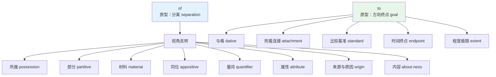
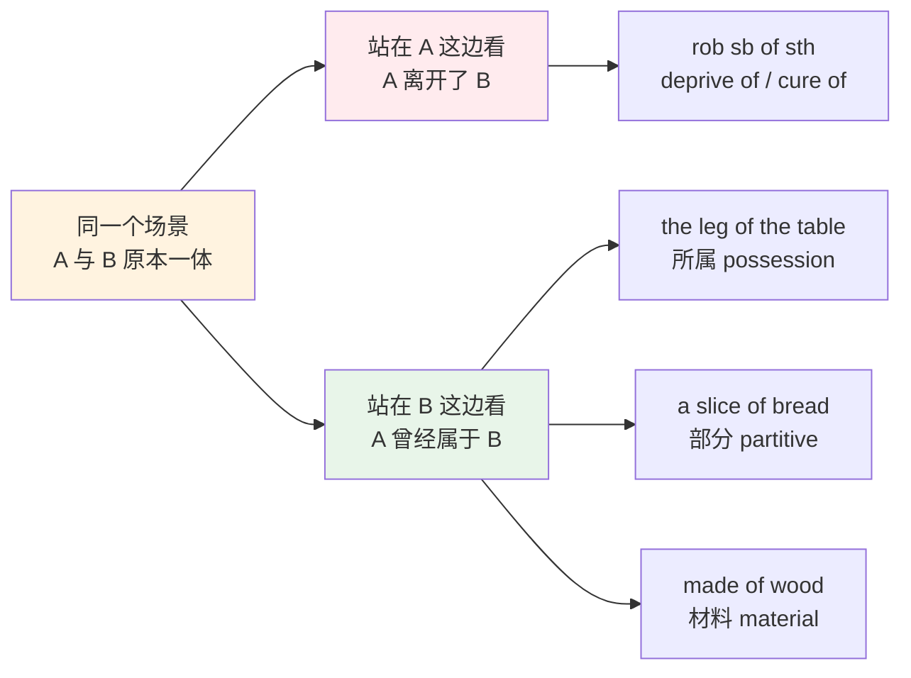
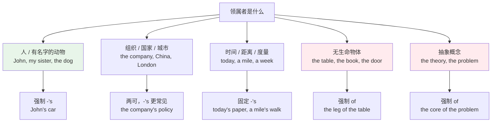
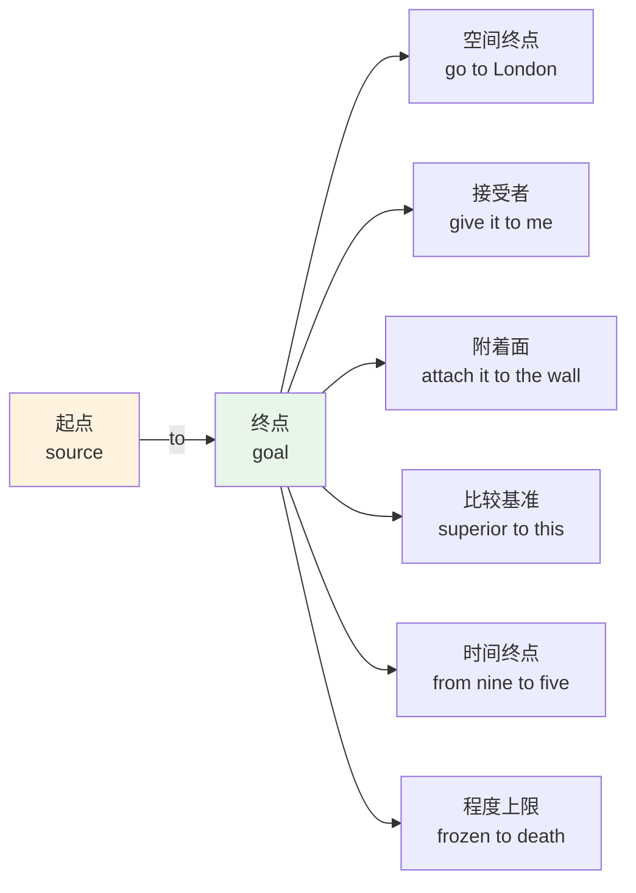
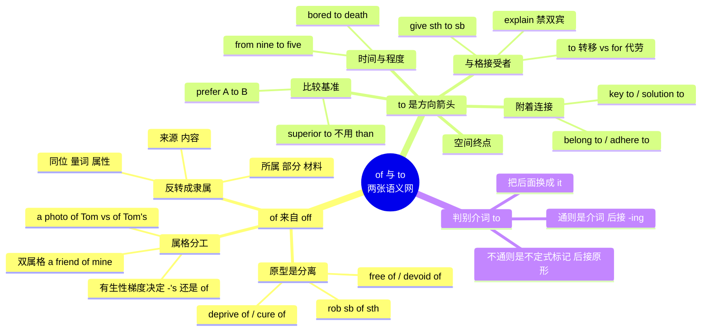

# of 与 to：属格网络与方向对象网络

> [!info] 本篇定位
>
> 上一篇处理的是有空间画面的介词——`in`、`on`、`at`、`over`、`through` 这些词都能画出图来。`of` 和 `to` 不一样：它们是英语里语法化程度最深的两个介词，画不出画面，却在任何一页英文里出现频率排在前五。
>
> 这一篇给它们各建一张语义网。`of` 从「分离」这个原型出发，反转视角后长出所属、部分、材料、同位、量词、属性、来源、内容八支；`to` 从「方向终点」出发，长出与格、附着、比较基准、时间终点、程度五支。
>
> 读完你能解释 `rob him of his watch` 为什么用 `of`、`a fool of a man` 为什么不是「一个傻瓜的人」、`superior to` 为什么不用 `than`，以及 `look forward to doing` 里的 `to` 为什么必须接 `-ing`。

---

## 1. 本篇导读：两张网、一个共同的失效点

中文母语者用错 `of` 和 `to`，失误集中在两处。

**第一处是把 `of` 当成「的」。** 中文的「的」是一个万能领属标记，英语的 `of` 不是。`我的书` 说成 `the book of me` 是错的，`张三的自行车` 说成 `the bicycle of Zhang San` 也不自然。`of` 和 `-'s` 有一套按名词有生性划分的分工规则，第 6 节会把它讲透。

**第二处是把 `to` 当成不定式标记的专属形式。** `to` 既是介词也是不定式标记，两者同形不同类。`I look forward to meet you` 是极高频的中式英语错误，正确形式是 `look forward to meeting you`——因为这个 `to` 是介词。第 13 节给出一个五秒钟就能判完的检验法。

上图是全篇的骨架。左半边 `of` 的所有分支都挂在一个动作上——「视角反转」，也就是同一个「A 与 B 分开」的场景，站在 A 这边看是分离，站在 B 这边看就是所属。右半边 `to` 的分支之间关系更松散，它们共享的是一个抽象的箭头：从某处指向某个终点，终点可以是接受者、附着面、比较对象、时间点或程度上限。

这两张网都是词汇视角的整理。逐条搭配清单（哪些动词固定接 `of`、哪些形容词固定接 `to`）请查语法教程的介词搭配附录，本篇只给出能让人记住并推导的那部分。

---

## 2. of 的原型：它本来就是 off

`of` 和 `off` 在古英语里是同一个词 `of`，意思是「离开、从……脱离」。中古英语时期这个词分裂成两个：重读形式保留了原来的分离义，拼写固化为 `off`；弱读形式承担了越来越多的语法功能，拼写保留为 `of`。

这不是词源趣闻，而是解释 `of` 全部用法的钥匙。今天 `of` 里那些看起来毫无道理的搭配，绝大多数是分离义的残留。

| 英文 | 英式音标 | 美式音标 | 词性 | 中文 | 搭配与说明 |
| --- | --- | --- | --- | --- | --- |
| **of** | /ɒv/ | /ʌv/ | prep. | 的；属于；来自 | 弱读式 /əv/，句中绝大多数场合读弱读式 |
| **off** | /ɒf/ | /ɔːf/ | prep./adv. | 离开；脱离 | 与 of 同源，保留了重读与分离义 |

`of` 的弱读式 /əv/ 是听力理解的关键。母语者说 `a lot of people` 时 `of` 只剩一个 /əv/ 甚至只剩 /ə/，写成 `a lotta people` 的口语拼法正来自这里。听不出弱读式，一整串虚词就会糊成一团。

### 2.1 分离义的动词群

一批高频动词至今保留着「把 B 从 A 身上剥离」的结构，形式统一是 **V + 人 + of + 物**。

| 英文 | 英式音标 | 美式音标 | 词性 | 中文 | 搭配与说明 |
| --- | --- | --- | --- | --- | --- |
| **rob** | /rɒb/ | /rɑːb/ | v. | 抢劫 | rob sb of sth；宾语是人不是物 |
| **deprive** | /dɪˈpraɪv/ | /dɪˈpraɪv/ | v. | 剥夺 | deprive sb of sth；正式，多用被动 |
| **cure** | /kjʊə/ | /kjʊr/ | v. | 治愈 | cure sb of a disease；病是被剥离的东西 |
| **relieve** | /rɪˈliːv/ | /rɪˈliːv/ | v. | 减轻；解除 | relieve sb of a duty 免去某人职务 |
| **strip** | /strɪp/ | /strɪp/ | v. | 剥去；褫夺 | strip sb of a title 剥夺头衔 |
| **rid** | /rɪd/ | /rɪd/ | v. | 使摆脱 | rid sth of sth；高频形式 get rid of |
| **clear** | /klɪə/ | /klɪr/ | v. | 清除；澄清 | clear the table of dishes；clear sb of a charge |
| **cheat** | /tʃiːt/ | /tʃiːt/ | v. | 骗取 | cheat sb of sth；同义 swindle sb out of sth |
| **absolve** | /əbˈzɒlv/ | /əbˈzɑːlv/ | v. | 免除（罪责） | absolve sb of blame；宗教与法律语域 |
| **ease** | /iːz/ | /iːz/ | v. | 缓解 | ease sb of pain；书面语 |

> [!warning] rob 和 steal 的宾语是反的
>
> 这一组动词最容易出错的地方是宾语位置。中文说「抢了我的钱包」，主语后面直接跟「钱包」；英语的 `rob` 后面必须跟人。
>
> - ❌ ~~They robbed my wallet.~~
> - ✅ They **robbed me of** my wallet.
> - ✅ They **stole** my wallet.
>
> `steal` 的宾语是被偷的东西，`rob` 的宾语是被抢的人或场所（`rob a bank`）。两个动词的语义框架完全不同，不能互换句式。

> [!example] 分离义动词的典型例句
>
> - The dictator **deprived** the press **of** its freedom.
>   - 独裁者剥夺了新闻界的自由。
> - Six months of therapy finally **cured** him **of** his fear of flying.
>   - 六个月的治疗终于治好了他的飞行恐惧。
> - She was **relieved of** her duties pending an investigation.
>   - 调查期间她被解除了职务。
> - I can't **get rid of** this cough.
>   - 我这个咳嗽怎么都好不了。
> - The court **cleared** him **of** all charges.
>   - 法庭宣判他所有指控不成立。

### 2.2 分离义的形容词群

形容词版本表达的是「不含、缺少」——同样是分离，只是分离的结果状态。

| 英文 | 英式音标 | 美式音标 | 词性 | 中文 | 搭配与说明 |
| --- | --- | --- | --- | --- | --- |
| **free** | /friː/ | /friː/ | adj. | 免于……的 | free of charge 免费；free of debt 无债 |
| **empty** | /ˈempti/ | /ˈempti/ | adj. | 空的 | empty of meaning 毫无意义，书面语 |
| **devoid** | /dɪˈvɔɪd/ | /dɪˈvɔɪd/ | adj. | 全无的 | 只用 devoid of，不能单独作定语 |
| **bereft** | /bɪˈreft/ | /bɪˈreft/ | adj. | 被剥夺的 | bereft of hope；文学语域 |
| **short** | /ʃɔːt/ | /ʃɔːrt/ | adj. | 缺少的 | be short of cash 缺钱；run short of 快用完 |
| **independent** | /ˌɪndɪˈpendənt/ | /ˌɪndɪˈpendənt/ | adj. | 独立于……的 | independent of 不受……影响 |

`free of` 和 `free from` 有细微分工：`free of` 偏向「不含某物」（`free of additives` 不含添加剂），`free from` 偏向「摆脱某种状态」（`free from anxiety` 摆脱焦虑）。这个区分不是硬性的，母语者也常混用，但在正式写作里保持一致会更专业。

---

## 3. 视角反转：分离怎么变成所属

从「离开」到「属于」看起来是相反的两个概念，转换机制其实很直接：**要能从 B 分离出来，A 必须先属于 B。**

上图是理解 `of` 的核心一步。中间那个场景只有一个：某物与某个整体处在「可分离」的关系里。往左看，动词描述分离动作，得到 `rob of` 这一支；往右看，名词描述分离前的隶属关系，得到所属、部分、材料三支。同一张图两个读法，`of` 的两大用法群就统一了。

`the leg of the table` 的字面理解是「从桌子上（能）分下来的那条腿」，`a slice of bread` 是「从面包上切下来的一片」，`made of wood` 是「（原料）取自木头」。这三种说法在英语里全部用 `of`，不是巧合。

> [!tip] 一个可操作的记忆抓手
>
> 遇到不确定要不要用 `of` 的名词组合，试着问：**这两个东西之间存不存在「从……里拿出来」的关系？**
>
> 存在就倾向 `of`：`the roof of the house`（能从房子上拆下来）、`the end of the film`（从整部电影里截出的一段）、`the cause of the accident`（从事故里追出来的源头）。
>
> 不存在就倾向别的结构：`a coffee cup`（咖啡杯不是从咖啡里拿出来的，用名词修饰名词）、`a paper bag`（纸袋子同理）。

---

## 4. of 的八支义项网

分离原型反转之后，`of` 长出八条主要分支。这八支不是并列的八条规则，而是同一个隶属关系在不同名词类型上的实现。

| 分支 | 关系 | 典型例子 | 中文 |
| --- | --- | --- | --- |
| 所属 | 整体拥有部分 | the legs **of** the table；the population **of** China | 桌腿；中国人口 |
| 部分 | 从总体中取出一份 | half **of** the class；one **of** my friends | 半个班；我的一个朋友 |
| 材料 | 成品取自原料 | made **of** oak；a house **of** brick | 橡木做的；砖砌的房子 |
| 同位 | 两边指同一事物 | the city **of** Rome；a fool **of** a man | 罗马城；一个蠢货般的男人 |
| 量词 | 计量单位加内容物 | a slice **of** bread；a pinch **of** salt | 一片面包；一撮盐 |
| 属性 | 抽象名词充当形容词 | a man **of** courage；**of** no use | 有勇气的人；毫无用处 |
| 来源与原因 | 结果追溯到起因 | die **of** cancer；born **of** poor parents | 死于癌症；出身贫寒 |
| 内容 | 关于某事 | news **of** the accident；think **of** you | 事故的消息；想你 |

八支里真正需要单独讲的是同位、量词、属性和来源四支——所属、部分、内容三支的用法基本可以从中文「的」直接推出来，材料支只有一个 `of` 与 `from` 的区分点。

### 4.1 材料支：made of 与 made from

| 英文 | 英式音标 | 美式音标 | 词性 | 中文 | 搭配与说明 |
| --- | --- | --- | --- | --- | --- |
| **brick** | /brɪk/ | /brɪk/ | n. | 砖 | a house of brick；材料义常用单数 |
| **marble** | /ˈmɑːbl/ | /ˈmɑːrbl/ | n. | 大理石 | a statue of marble |
| **oak** | /əʊk/ | /oʊk/ | n. | 橡木；橡树 | a table of solid oak |
| **velvet** | /ˈvelvɪt/ | /ˈvelvɪt/ | n. | 天鹅绒 | a dress of black velvet |

判据只有一条：**成品里还看得出原料的原样用 `of`，看不出用 `from`。**

- 桌子还是木头，木纹可见 → The table is made **of** oak.
- 酒里已经找不出葡萄 → Wine is made **from** grapes.
- 纸里已经没有树的形态 → Paper is made **from** wood.
- 戒指还是金子 → The ring is made **of** gold.

另外两个相关表达一并记住：`be made in`（产地，`made in Vietnam`）、`be made up of`（构成，`The team is made up of five engineers`）、`be made into`（加工成，`Grapes are made into wine`）。

### 4.2 量词支：英语的「个体量词」

中文有一套完整的量词系统（一片、一群、一撮），英语没有独立的量词词类，它用 `名词 + of` 的结构来实现同样的功能。这一支对中文母语者反而是熟悉的，难点在于配对关系不同。

| 英文 | 英式音标 | 美式音标 | 词性 | 中文 | 搭配与说明 |
| --- | --- | --- | --- | --- | --- |
| **slice** | /slaɪs/ | /slaɪs/ | n. | 片 | a slice of bread/cake/pizza；切出来的薄片 |
| **loaf** | /ləʊf/ | /loʊf/ | n. | 条（面包） | a loaf of bread；复数 loaves |
| **lump** | /lʌmp/ | /lʌmp/ | n. | 块 | a lump of sugar/coal；不规则的块 |
| **grain** | /ɡreɪn/ | /ɡreɪn/ | n. | 粒 | a grain of rice/sand/truth |
| **pinch** | /pɪntʃ/ | /pɪntʃ/ | n. | 撮 | a pinch of salt；两指捏起的量 |
| **bar** | /bɑː/ | /bɑːr/ | n. | 条；块 | a bar of chocolate/soap |
| **sheet** | /ʃiːt/ | /ʃiːt/ | n. | 张 | a sheet of paper/glass/ice |
| **flock** | /flɒk/ | /flɑːk/ | n. | 群（鸟羊） | a flock of sheep/birds |
| **herd** | /hɜːd/ | /hɜːrd/ | n. | 群（牛马） | a herd of cattle/elephants |
| **swarm** | /swɔːm/ | /swɔːrm/ | n. | 群（昆虫） | a swarm of bees/locusts |
| **heap** | /hiːp/ | /hiːp/ | n. | 堆（杂乱） | a heap of clothes；强调无序 |
| **pile** | /paɪl/ | /paɪl/ | n. | 堆（整齐） | a pile of books；强调叠放 |
| **drop** | /drɒp/ | /drɑːp/ | n. | 滴 | a drop of water/blood/rain |
| **speck** | /spek/ | /spek/ | n. | 微粒 | a speck of dust；极小的点 |
| **shred** | /ʃred/ | /ʃred/ | n. | 丝；一点点 | not a shred of evidence 毫无证据 |
| **glimmer** | /ˈɡlɪmə/ | /ˈɡlɪmər/ | n. | 一丝（希望） | a glimmer of hope；抽象量词 |

> [!warning] 动物群体量词不能通用
>
> `flock`、`herd`、`swarm`、`shoal` 各管一类动物，串用会显得生硬。
>
> - ✅ a **flock** of sheep / birds（羊、鸟）
> - ✅ a **herd** of cattle / elephants / deer（大型四足）
> - ✅ a **swarm** of bees / ants / locusts（飞行昆虫）
> - ✅ a **shoal** of fish（鱼群，美式常用 school of fish）
> - ❌ ~~a herd of birds~~ / ~~a flock of bees~~
>
> 抽象量词的搭配同样固定：`a shred of evidence`、`a glimmer of hope`、`a grain of truth`、`a flash of insight`，换成别的名词就不成立。

### 4.3 同位支：a fool of a man 到底谁修饰谁

同位用法是 `of` 里最反直觉的一支。`the city of Rome` 里 `city` 和 `Rome` 不是所属关系，它们指同一个东西——罗马就是那座城。这种 `of` 相当于一个等号。

| 英文 | 英式音标 | 美式音标 | 词性 | 中文 | 搭配与说明 |
| --- | --- | --- | --- | --- | --- |
| **fool** | /fuːl/ | /fuːl/ | n. | 傻瓜 | a fool of a man 一个蠢货般的男人 |
| **brute** | /bruːt/ | /bruːt/ | n. | 畜生；粗人 | a brute of a husband |
| **giant** | /ˈdʒaɪənt/ | /ˈdʒaɪənt/ | n. | 巨人 | a giant of a man 一个巨汉 |
| **devil** | /ˈdevl/ | /ˈdevl/ | n. | 魔鬼 | a devil of a job 一件要命的活 |
| **gem** | /dʒem/ | /dʒem/ | n. | 宝石；珍品 | a gem of a restaurant 一家宝藏餐厅 |
| **angel** | /ˈeɪndʒl/ | /ˈeɪndʒl/ | n. | 天使 | an angel of a nurse |

这个结构叫「贬抑同位结构」（也用于褒义），语义上 **`of` 前面的词是修饰语，后面的词才是中心词**——和中文语序完全相反。

- `a fool of a man` = 一个蠢货一样的**男人**（说的是男人，`fool` 在评价他）
- `a gem of a restaurant` = 一家宝藏一样的**餐厅**（说的是餐厅）
- `a devil of a job` = 一件要命的**活**（说的是活）

> [!warning] 语序陷阱
>
> 中文母语者读到 `a fool of a man` 的第一反应往往是「傻瓜的男人」，把 `fool` 当成中心词。这一步错了，后面整句都会理解偏。
>
> 判断办法：数冠词。这个结构里 `of` 两边都带不定冠词 `a`，`a X of a Y` 就一定是「像 X 一样的 Y」。若前面是定冠词——`the city of Rome`、`the month of May`、`the virtue of patience`——则是普通同位，两边指同一事物，翻译成「叫罗马的这座城」「五月这个月份」。

### 4.4 属性支：of + 抽象名词 = 形容词

`of` 加抽象名词构成的短语，功能等同于一个形容词，语域比对应的形容词正式。

| 英文 | 英式音标 | 美式音标 | 词性 | 中文 | 搭配与说明 |
| --- | --- | --- | --- | --- | --- |
| **courage** | /ˈkʌrɪdʒ/ | /ˈkɜːrɪdʒ/ | n. | 勇气 | a man of courage = a courageous man |
| **importance** | /ɪmˈpɔːtns/ | /ɪmˈpɔːrtns/ | n. | 重要性 | of great importance = very important |
| **value** | /ˈvæljuː/ | /ˈvæljuː/ | n. | 价值 | of little value = not very valuable |
| **use** | /juːs/ | /juːs/ | n. | 用处 | of no use = useless；名词读 /juːs/ |
| **interest** | /ˈɪntrəst/ | /ˈɪntrəst/ | n. | 兴趣；利益 | of interest to sb 对某人有意义 |
| **integrity** | /ɪnˈteɡrəti/ | /ɪnˈteɡrəti/ | n. | 正直 | a person of integrity；正式语域 |
| **stature** | /ˈstætʃə/ | /ˈstætʃər/ | n. | 身材；声望 | a scholar of international stature |
| **means** | /miːnz/ | /miːnz/ | n. | 财力；手段 | a man of means 有钱人；单复数同形 |

> [!example] 属性短语与对应形容词的语域差
>
> - The report is **of great importance** to the committee.
>   - 这份报告对委员会非常重要。（书面、正式）
> - The report is **very important** to the committee.
>   - 同义，日常表达。
> - His advice was **of no use** whatsoever.
>   - 他的建议毫无用处。（略带书面感，比 useless 更克制）
> - She is a woman **of few words**.
>   - 她话不多。（固定表达，没有单词形容词能替代）

注意 `of` 属性短语在正式写作和技术文档里出现频率很高：`of no consequence`（无关紧要）、`of the same order of magnitude`（同一数量级）、`of type string`（string 类型的）。读英文技术规范时这个结构几乎每页都有。

### 4.5 来源与原因支

| 英文 | 英式音标 | 美式音标 | 词性 | 中文 | 搭配与说明 |
| --- | --- | --- | --- | --- | --- |
| **die** | /daɪ/ | /daɪ/ | v. | 死 | die of cancer 内因；die from injuries 外因 |
| **born** | /bɔːn/ | /bɔːrn/ | adj. | 出生的 | born of humble parents；书面 |
| **expect** | /ɪkˈspekt/ | /ɪkˈspekt/ | v. | 期望 | expect too much of sb 对某人期望过高 |
| **demand** | /dɪˈmɑːnd/ | /dɪˈmænd/ | v. | 要求 | demand an answer of sb（较正式，多用 from） |
| **ask** | /ɑːsk/ | /æsk/ | v. | 请求 | ask a favour of sb 请某人帮个忙 |
| **tired** | /ˈtaɪəd/ | /ˈtaɪərd/ | adj. | 厌倦的 | be tired of 厌烦；be tired from 因……而累 |
| **weary** | /ˈwɪəri/ | /ˈwɪri/ | adj. | 疲倦的；厌倦的 | weary of waiting；书面 |
| **sick** | /sɪk/ | /sɪk/ | adj. | 厌恶的 | be sick of 受够了；口语 |

`die of` 与 `die from` 是这一支里唯一需要背的分工：疾病、饥饿、老死用 `of`（`die of pneumonia`、`die of hunger`、`die of old age`），外伤、事故、外部原因用 `from`（`die from a car crash`、`die from his wounds`）。母语者也存在混用，但正式文本里区分是清楚的。

`be tired of` 与 `be tired from` 的差别同样重要，而且更常用错：`I'm tired of this job`（我烦透了这份工作）和 `I'm tired from work`（我上班上累了）意思完全不同。

---

## 5. of 属格与 -'s 属格：有生性决定选哪个

英语有两套表达领属的手段，`of` 属格（`the roof of the house`）和 `-'s` 属格（`John's car`）。选哪一套不是随意的，主要看被领属方的**有生性**（animacy）。

上图是一条有生性梯度：越靠近「人」，越用 `-'s`；越靠近「无生命抽象物」，越用 `of`。中间的组织机构和时间度量是两可区，各有惯用形式。这条梯度不是绝对规则，但它能解释绝大多数选择。

### 5.1 五档的具体判据

| 档位 | 领属者类型 | 默认形式 | 例子 | 反例说明 |
| --- | --- | --- | --- | --- |
| 一 | 人、宠物、拟人化对象 | -'s | **Mary's** phone；**the dog's** bowl | of 形式生硬：~~the phone of Mary~~ |
| 二 | 集体名词、机构、国家、城市 | -'s 优先 | **the government's** decision；**China's** economy | of 也成立，语气更正式 |
| 三 | 时间、距离、金额、重量 | -'s | **today's** meeting；**two weeks'** notice；**a mile's** distance | 这是固定用法，非有生性推出 |
| 四 | 无生命具体物 | of | the top **of** the page；the handle **of** the door | -'s 只在固定短语里：the water's edge |
| 五 | 抽象名词 | of | the meaning **of** life；the cause **of** the failure | -'s 几乎不用 |

> [!warning] 三个最常见的中式表达
>
> - ❌ ~~the price of the book is high~~ 语法没错，但技术写作里更自然的是 the **book's price** 或直接 the price
> - ❌ ~~the color of the car is red~~ → ✅ The **car is red**（英语倾向把领属结构拆成主系表）
> - ❌ ~~the window of the room~~ → ✅ the **room's window** 或直接 the window（房间与窗是部分整体关系，用 of 也可，但真实语料里更常直接省略）
>
> 更普遍的问题是：中文母语者会把每一个「的」都翻译出来。英语里名词修饰名词的复合结构（`a coffee cup`、`a car door`、`a database query`）比 `of` 结构更高频，写作时优先考虑复合词，`of` 留给真正需要标记隶属的场合。

### 5.2 -'s 属格的额外语义：主语属格与宾语属格

同一个 `-'s` 或 `of` 可以表示两种完全相反的关系。

| 结构 | 类型 | 展开成句子 | 中文 |
| --- | --- | --- | --- |
| **the enemy's destruction** | 歧义 | The enemy destroyed sth. / Sb destroyed the enemy. | 敌人的破坏 / 敌人被消灭 |
| **the destruction of the city** | 宾语属格 | Sb destroyed the city. | 城市被摧毁 |
| **the arrival of the train** | 主语属格 | The train arrived. | 火车到站 |
| **the love of money** | 宾语属格 | Sb loves money. | 对金钱的爱 |
| **a mother's love** | 主语属格 | A mother loves. | 母爱 |
| **the examination of the students** | 宾语属格 | Sb examines the students. | 对学生的考核 |

判断办法：把名词还原成动词，看 `of` 后面那个成分在还原后的句子里是主语还是宾语。`the arrival of the train` 还原成 `the train arrives`，`train` 是主语；`the destruction of the city` 还原成 `destroy the city`，`city` 是宾语。

这个区分在读学术论文和技术规范时很实用。`the validation of the input`（对输入做校验）和 `the input's validation`（输入自身的校验状态）指向的不是同一件事。

---

## 6. 双属格：a friend of mine 为什么两个属格叠加

`a friend of mine` 同时用了 `of` 和物主代词的属格形式 `mine`，看起来是冗余，实际上它解决的是冠词冲突。

英语的限定词是互斥的：`a` 和 `my` 不能同时出现在一个名词前。想说「我的一个朋友」，`a my friend` 不合语法，`my friend` 又变成了特指。双属格结构 `a friend of mine` 把物主信息挪到 `of` 后面，前面的位置就空出来给不定冠词了。

| 想表达 | 错误形式 | 正确形式 |
| --- | --- | --- |
| 我的一个朋友 | ~~a my friend~~ | a friend **of mine** |
| 他的那些书里的一本 | ~~a his book~~ | a book **of his** |
| 她的某个想法 | ~~an her idea~~ | an idea **of hers** |
| 这本你的书 | ~~this your book~~ | this book **of yours** |
| 我们的每一位客户 | ~~every our client~~ | every client **of ours** |

> [!tip] 双属格自带的情绪色彩
>
> 用 `this` / `that` 加双属格时，句子往往带轻蔑或不耐烦的语气。
>
> - **That car of yours** is making a horrible noise.
>   - 你那辆破车响得吓人。（比 your car 多一层嫌弃）
> - I've had enough of **that attitude of his**.
>   - 我受够了他那副态度。
>
> 中性描述用普通属格就够了，要传达情绪时才用这个结构。

### 6.1 a photo of Tom 与 a photo of Tom's

这两个短语差一个 `-'s`，意思完全不同，是双属格最实用的一个考点。

- `a photo **of Tom**` —— 照片上拍的是 Tom（Tom 是被拍摄对象）
- `a photo **of Tom's**` —— 照片归 Tom 所有（Tom 是拥有者，照片上拍的是谁不知道）

同一逻辑适用于所有「作品—人」组合：

| 短语 | 关系 | 中文 |
| --- | --- | --- |
| a painting **of Picasso** | 画的内容是毕加索本人 | 一幅毕加索的肖像 |
| a painting **of Picasso's** | 画的所有者或作者是毕加索 | 毕加索的一幅画 |
| a criticism **of the author** | 批评的对象是作者 | 对作者的批评 |
| a criticism **of the author's** | 批评的发出者是作者 | 作者提出的一条批评 |

这个区分在读书评、法律文本、学术引用时会真实影响理解。

---

## 7. of 的支配结构：形容词与动词的固定搭配

前面六节讲的是可推导的部分。剩下这部分是需要成组记忆的固定支配关系——`of` 在这里已经完全语法化，追溯不到分离义了。

### 7.1 形容词 + of

| 英文 | 英式音标 | 美式音标 | 词性 | 中文 | 搭配与说明 |
| --- | --- | --- | --- | --- | --- |
| **afraid** | /əˈfreɪd/ | /əˈfreɪd/ | adj. | 害怕的 | be afraid of sth；afraid to do 不敢做 |
| **aware** | /əˈweə/ | /əˈwer/ | adj. | 意识到的 | be aware of；后可接 that 从句 |
| **fond** | /fɒnd/ | /fɑːnd/ | adj. | 喜爱的 | be fond of doing；只作表语 |
| **capable** | /ˈkeɪpəbl/ | /ˈkeɪpəbl/ | adj. | 有能力的 | be capable of doing；对应 able to do |
| **worthy** | /ˈwɜːði/ | /ˈwɜːrði/ | adj. | 值得的 | be worthy of praise；worth 后不加 of |
| **guilty** | /ˈɡɪlti/ | /ˈɡɪlti/ | adj. | 有罪的；内疚的 | be guilty of murder；feel guilty about |
| **ashamed** | /əˈʃeɪmd/ | /əˈʃeɪmd/ | adj. | 羞愧的 | be ashamed of oneself |
| **jealous** | /ˈdʒeləs/ | /ˈdʒeləs/ | adj. | 嫉妒的 | be jealous of sb；envious of 同义 |
| **typical** | /ˈtɪpɪkl/ | /ˈtɪpɪkl/ | adj. | 典型的 | be typical of；That's typical of him. |
| **characteristic** | /ˌkærəktəˈrɪstɪk/ | /ˌkærəktəˈrɪstɪk/ | adj./n. | 特有的；特征 | be characteristic of；正式 |
| **proud** | /praʊd/ | /praʊd/ | adj. | 自豪的 | be proud of；take pride in 同义 |
| **suspicious** | /səˈspɪʃəs/ | /səˈspɪʃəs/ | adj. | 怀疑的 | be suspicious of sb 对某人起疑 |
| **conscious** | /ˈkɒnʃəs/ | /ˈkɑːnʃəs/ | adj. | 意识到的 | be conscious of；比 aware 更强调主观感知 |
| **envious** | /ˈenviəs/ | /ˈenviəs/ | adj. | 羡慕的 | be envious of；语气比 jealous 中性 |

> [!warning] worth、worthy、worthwhile 三个词的介词不一样
>
> - `worth` 后面直接接名词或动名词，**不加 of**：It's **worth reading**. / The house is **worth** a fortune.
> - `worthy` 后面必须加 `of`：He is **worthy of** our trust.
> - `worthwhile` 后接 `to do` 或独立使用：It's **worthwhile to try**.
>
> - ❌ ~~It's worth of reading.~~
> - ✅ It's **worth reading**.

### 7.2 动词 + of

| 英文 | 英式音标 | 美式音标 | 词性 | 中文 | 搭配与说明 |
| --- | --- | --- | --- | --- | --- |
| **consist** | /kənˈsɪst/ | /kənˈsɪst/ | v. | 由……组成 | consist of；不用被动，无进行时 |
| **accuse** | /əˈkjuːz/ | /əˈkjuːz/ | v. | 指控 | accuse sb of sth；对比 charge sb with sth |
| **remind** | /rɪˈmaɪnd/ | /rɪˈmaɪnd/ | v. | 使想起 | remind sb of sth 使联想；remind sb to do 提醒去做 |
| **inform** | /ɪnˈfɔːm/ | /ɪnˈfɔːrm/ | v. | 通知 | inform sb of sth；正式，口语用 tell |
| **convince** | /kənˈvɪns/ | /kənˈvɪns/ | v. | 说服 | convince sb of sth；convince sb to do |
| **approve** | /əˈpruːv/ | /əˈpruːv/ | v. | 赞成 | approve of 赞同；及物 approve 是批准，两义不同 |
| **dispose** | /dɪˈspəʊz/ | /dɪˈspoʊz/ | v. | 处理掉 | dispose of rubbish；必须带 of |
| **boast** | /bəʊst/ | /boʊst/ | v. | 吹嘘 | boast of/about sth |
| **complain** | /kəmˈpleɪn/ | /kəmˈpleɪn/ | v. | 抱怨；主诉 | complain of pain 就医用语；complain about 一般抱怨 |
| **conceive** | /kənˈsiːv/ | /kənˈsiːv/ | v. | 设想 | conceive of sth as；正式 |
| **beware** | /bɪˈweə/ | /bɪˈwer/ | v. | 当心 | beware of the dog；只有原形，无变位 |
| **smell** | /smel/ | /smel/ | v. | 闻起来有……味 | smell of smoke；taste of / smack of 同构 |

> [!warning] approve 带不带 of 是两个意思
>
> - The board **approved** the budget.
>   - 董事会批准了预算。（及物，正式许可）
> - I don't **approve of** his methods.
>   - 我不赞同他的做法。（不及物加 of，表达态度）
>
> `complain of` 与 `complain about` 同理：前者是医学语境里的「主诉某症状」（`He complained of chest pain`），后者是日常「抱怨某事」（`She complained about the noise`）。

---

## 8. to 的原型：方向与终点

`to` 的原型比 `of` 直白：**从某处出发，指向一个终点**。所有抽象用法都是这个箭头的隐喻延伸。

| 英文 | 英式音标 | 美式音标 | 词性 | 中文 | 搭配与说明 |
| --- | --- | --- | --- | --- | --- |
| **to** | /tuː/ | /tuː/ | prep./part. | 到；向；给 | 弱读式 /tə/；辅音前 /tə/，元音前 /tu/ |

上图把六支排在同一个箭头的终点位置。空间终点是字面义，其余五支都在问同一个问题：**箭头指向谁？**指向一个人就是接受者，指向一个平面就是附着，指向一个参照物就是比较，指向一个时刻就是时间终点，指向一个极限就是程度。

`to` 与 `toward(s)` 的差别是终点是否到达：`walk to the station`（走到车站，到了）对 `walk towards the station`（朝车站方向走，未必到）。这个区分在上一篇空间介词里展开过，这里只作提示。

### 8.1 空间终点的基础用法

- I'm flying **to** Tokyo tomorrow.
  - 我明天飞东京。
- She pointed **to** the diagram on the whiteboard.
  - 她指向白板上的那张图。
- The road **to** the airport is closed.
  - 通往机场的路封了。
- Turn **to** page 42.
  - 翻到第 42 页。

`to` 与 `at` 在这里分工明确：`to` 表示位移的终点，`at` 表示静止的位置。`throw the ball to me`（把球扔给我，希望我接住）和 `throw the ball at me`（朝我扔球，带敌意）是这一对最经典的例子。

---

## 9. to 的与格：接受者是谁

「与格」（dative）指的是动作的接受者。英语用两种方式表达：双宾语结构（`give me the book`）和 `to` 介词结构（`give the book to me`）。

### 9.1 to 类与格动词

| 英文 | 英式音标 | 美式音标 | 词性 | 中文 | 搭配与说明 |
| --- | --- | --- | --- | --- | --- |
| **give** | /ɡɪv/ | /ɡɪv/ | v. | 给 | give sb sth = give sth to sb |
| **lend** | /lend/ | /lend/ | v. | 借出 | lend me your pen；borrow 是借入 |
| **offer** | /ˈɒfə/ | /ˈɔːfər/ | v. | 提供 | offer sb a job；两种结构均可 |
| **hand** | /hænd/ | /hænd/ | v. | 递 | hand me the file；hand in 上交 |
| **owe** | /əʊ/ | /oʊ/ | v. | 欠 | owe sb money = owe money to sb |
| **promise** | /ˈprɒmɪs/ | /ˈprɑːmɪs/ | v. | 承诺 | promise sb sth；也可 promise to do |
| **award** | /əˈwɔːd/ | /əˈwɔːrd/ | v. | 授予 | award sb a prize；正式 |
| **grant** | /ɡrɑːnt/ | /ɡrænt/ | v. | 准予 | grant sb access；技术文档高频 |
| **teach** | /tiːtʃ/ | /tiːtʃ/ | v. | 教 | teach sb sth；teach English to beginners |
| **sell** | /sel/ | /sel/ | v. | 卖 | sell sb sth = sell sth to sb |
| **pass** | /pɑːs/ | /pæs/ | v. | 传递 | pass me the salt |
| **send** | /send/ | /send/ | v. | 寄 | send sb an email |

### 9.2 只能用 to 结构的动词

一批动词虽然语义上也有接受者，但**不能用双宾语结构**，必须写成 `V + sth + to + sb`。这是中文母语者的高频失误区。

| 英文 | 英式音标 | 美式音标 | 词性 | 中文 | 搭配与说明 |
| --- | --- | --- | --- | --- | --- |
| **explain** | /ɪkˈspleɪn/ | /ɪkˈspleɪn/ | v. | 解释 | explain sth to sb；禁止 explain sb sth |
| **describe** | /dɪˈskraɪb/ | /dɪˈskraɪb/ | v. | 描述 | describe sth to sb |
| **suggest** | /səˈdʒest/ | /səˈdʒest/ | v. | 建议 | suggest sth to sb |
| **announce** | /əˈnaʊns/ | /əˈnaʊns/ | v. | 宣布 | announce sth to sb |
| **introduce** | /ˌɪntrəˈdjuːs/ | /ˌɪntrəˈduːs/ | v. | 介绍 | introduce sb to sb |
| **mention** | /ˈmenʃn/ | /ˈmenʃn/ | v. | 提及 | mention sth to sb |
| **report** | /rɪˈpɔːt/ | /rɪˈpɔːrt/ | v. | 汇报 | report sth to sb |
| **propose** | /prəˈpəʊz/ | /prəˈpoʊz/ | v. | 提议 | propose sth to sb |
| **deliver** | /dɪˈlɪvə/ | /dɪˈlɪvər/ | v. | 递送 | deliver sth to sb |
| **admit** | /ədˈmɪt/ | /ədˈmɪt/ | v. | 承认 | admit sth to sb |

> [!warning] explain 类动词的双宾语禁令
>
> 这是中式英语最顽固的一处。
>
> - ❌ ~~Let me explain you the problem.~~
> - ✅ Let me **explain the problem to you**.
> - ❌ ~~He introduced me his colleague.~~
> - ✅ He **introduced his colleague to me**.
> - ❌ ~~She suggested me a better approach.~~
> - ✅ She **suggested a better approach to me**.
>
> 一个粗略的规律：日耳曼来源的单音节给予动词（give、tell、send、show、lend）能用双宾语；拉丁法语来源的多音节动词（explain、describe、announce、introduce、propose）通常不能。这条规律有例外（`offer`、`promise` 是外来词但能双宾），但作为默认判断足够可靠。

### 9.3 to 与 for 的与格分工

两个介词都能引入受益方，区别在于**东西有没有转移到对方手上**。

| 结构 | 含义 | 例子 |
| --- | --- | --- |
| V + sth + **to** + sb | 物品实际转移给对方 | give / send / hand / pass / sell / lend / show |
| V + sth + **for** + sb | 替对方做，物品未必转移 | buy / make / cook / find / get / save / order |

- I bought a book **for** her.（我替她买了本书，书可能还在我这）
- I gave the book **to** her.（书到她手上了）
- Could you save a seat **for** me?（替我留个座）
- Could you send the file **to** me?（把文件发给我）

---

## 10. to 的附着与连接

箭头指向一个平面并停留在那里，就得到「附着」义。这一支的动词都表达某种依附、归属、投身或对接关系。

| 英文 | 英式音标 | 美式音标 | 词性 | 中文 | 搭配与说明 |
| --- | --- | --- | --- | --- | --- |
| **belong** | /bɪˈlɒŋ/ | /bɪˈlɔːŋ/ | v. | 属于 | belong to；无进行时，无被动 |
| **attach** | /əˈtætʃ/ | /əˈtætʃ/ | v. | 附上 | attach a file to an email |
| **adhere** | /ədˈhɪə/ | /ədˈhɪr/ | v. | 粘附；遵守 | adhere to a standard 遵循标准 |
| **stick** | /stɪk/ | /stɪk/ | v. | 粘；坚持 | stick to the plan 按计划来 |
| **cling** | /klɪŋ/ | /klɪŋ/ | v. | 紧抓 | cling to hope；cling-clung-clung |
| **devote** | /dɪˈvəʊt/ | /dɪˈvoʊt/ | v. | 奉献 | devote oneself to sth；后接名词或动名词 |
| **dedicate** | /ˈdedɪkeɪt/ | /ˈdedɪkeɪt/ | v. | 献给；专注于 | dedicate a server to logging |
| **commit** | /kəˈmɪt/ | /kəˈmɪt/ | v. | 承诺投入 | commit to a deadline；版本控制里的 commit 同源 |
| **object** | /əbˈdʒekt/ | /əbˈdʒekt/ | v. | 反对 | object to sth；动词重音在后，名词在前 |
| **confess** | /kənˈfes/ | /kənˈfes/ | v. | 坦白 | confess to a crime |
| **resort** | /rɪˈzɔːt/ | /rɪˈzɔːrt/ | v. | 诉诸 | resort to violence；as a last resort |
| **amount** | /əˈmaʊnt/ | /əˈmaʊnt/ | v. | 等于；总计 | amount to 10 dollars；it amounts to a refusal |
| **contribute** | /kənˈtrɪbjuːt/ | /kənˈtrɪbjuːt/ | v. | 贡献；促成 | contribute to a project |
| **refer** | /rɪˈfɜː/ | /rɪˈfɜːr/ | v. | 指；参考 | refer to a document；技术写作高频 |
| **respond** | /rɪˈspɒnd/ | /rɪˈspɑːnd/ | v. | 回应 | respond to a request；正式 |
| **react** | /riˈækt/ | /riˈækt/ | v. | 反应 | react to a stimulus |
| **lead** | /liːd/ | /liːd/ | v. | 导致 | lead to a conclusion |
| **apply** | /əˈplaɪ/ | /əˈplaɪ/ | v. | 适用于；申请 | apply to all users；apply for a job |

### 10.1 名词与形容词的附着搭配

| 英文 | 英式音标 | 美式音标 | 词性 | 中文 | 搭配与说明 |
| --- | --- | --- | --- | --- | --- |
| **key** | /kiː/ | /kiː/ | n. | 钥匙；关键 | the key to success；不用 of |
| **clue** | /kluː/ | /kluː/ | n. | 线索 | a clue to the mystery |
| **solution** | /səˈluːʃn/ | /səˈluːʃn/ | n. | 解决方案 | a solution to a problem；不用 of |
| **answer** | /ˈɑːnsə/ | /ˈænsər/ | n. | 答案；答复 | the answer to question 3 |
| **approach** | /əˈprəʊtʃ/ | /əˈproʊtʃ/ | n. | 方法；途径 | a new approach to testing |
| **access** | /ˈækses/ | /ˈækses/ | n. | 访问权 | access to the database |
| **alternative** | /ɔːlˈtɜːnətɪv/ | /ɔːlˈtɜːrnətɪv/ | n. | 替代方案 | an alternative to Docker |
| **objection** | /əbˈdʒekʃn/ | /əbˈdʒekʃn/ | n. | 反对意见 | any objection to this plan |
| **exception** | /ɪkˈsepʃn/ | /ɪkˈsepʃn/ | n. | 例外 | an exception to the rule |
| **attitude** | /ˈætɪtjuːd/ | /ˈætɪtuːd/ | n. | 态度 | his attitude to/towards work |
| **damage** | /ˈdæmɪdʒ/ | /ˈdæmɪdʒ/ | n. | 损害 | damage to the engine |
| **accustomed** | /əˈkʌstəmd/ | /əˈkʌstəmd/ | adj. | 习惯于 | be accustomed to doing；正式 |
| **addicted** | /əˈdɪktɪd/ | /əˈdɪktɪd/ | adj. | 上瘾的 | be addicted to sth |
| **immune** | /ɪˈmjuːn/ | /ɪˈmjuːn/ | adj. | 免疫的 | immune to criticism |
| **sensitive** | /ˈsensətɪv/ | /ˈsensətɪv/ | adj. | 敏感的 | sensitive to light；case-sensitive |
| **prone** | /prəʊn/ | /proʊn/ | adj. | 易于……的 | error-prone；prone to failure |
| **allergic** | /əˈlɜːdʒɪk/ | /əˈlɜːrdʒɪk/ | adj. | 过敏的 | allergic to peanuts |
| **subject** | /ˈsʌbdʒɪkt/ | /ˈsʌbdʒɪkt/ | adj. | 受制于 | subject to change 可能变动；合同高频 |

> [!warning] 「……的钥匙 / 答案 / 方案」不用 of
>
> 中文说「问题的解决方案」，按字面翻译成 `the solution of the problem` 是能懂但不地道的。这一组名词全部固定用 `to`。
>
> - ✅ the **key to** success（成功的关键）
> - ✅ the **solution to** the problem（问题的解法）
> - ✅ the **answer to** your question（你问题的答案）
> - ✅ the **approach to** this task（处理这项任务的思路）
> - ❌ ~~the key of success~~ / ~~the answer of your question~~
>
> 记忆逻辑：钥匙是插进锁里的，答案是对准问题的——都是箭头指向一个目标，所以用 `to`。

---

## 11. to 的比较基准：不用 than 的比较级

英语的比较级默认用 `than`，但有一批形容词（几乎全部来自拉丁语的比较级形式）必须用 `to`。这批词在拉丁语里本身就是比较级，`-or` 词尾就是比较级标记，所以不能再加 `than`。

| 英文 | 英式音标 | 美式音标 | 词性 | 中文 | 搭配与说明 |
| --- | --- | --- | --- | --- | --- |
| **superior** | /suːˈpɪəriə/ | /suːˈpɪriər/ | adj. | 更好的；上级的 | superior to；禁止 more superior than |
| **inferior** | /ɪnˈfɪəriə/ | /ɪnˈfɪriər/ | adj. | 更差的；下级的 | inferior to |
| **senior** | /ˈsiːniə/ | /ˈsiːniər/ | adj./n. | 年长的；资深的 | senior to sb；senior engineer |
| **junior** | /ˈdʒuːniə/ | /ˈdʒuːniər/ | adj./n. | 年少的；初级的 | junior to sb by two years |
| **prior** | /ˈpraɪə/ | /ˈpraɪər/ | adj. | 在先的 | prior to = before，正式书面 |
| **preferable** | /ˈprefrəbl/ | /ˈprefrəbl/ | adj. | 更可取的 | preferable to；本身含比较义 |
| **prefer** | /prɪˈfɜː/ | /prɪˈfɜːr/ | v. | 更喜欢 | prefer A to B；prefer to do rather than do |
| **equal** | /ˈiːkwəl/ | /ˈiːkwəl/ | adj. | 等同的 | be equal to the task 胜任 |
| **similar** | /ˈsɪmələ/ | /ˈsɪmələr/ | adj. | 相似的 | similar to；不用 similar with |
| **identical** | /aɪˈdentɪkl/ | /aɪˈdentɪkl/ | adj. | 完全相同的 | identical to/with，to 更常见 |
| **equivalent** | /ɪˈkwɪvələnt/ | /ɪˈkwɪvələnt/ | adj./n. | 等价的 | equivalent to；技术文档高频 |
| **analogous** | /əˈnæləɡəs/ | /əˈnæləɡəs/ | adj. | 类似的 | analogous to；学术语域 |
| **opposed** | /əˈpəʊzd/ | /əˈpoʊzd/ | adj. | 相反的；反对的 | as opposed to 而非 |
| **comparable** | /ˈkɒmpərəbl/ | /ˈkɑːmpərəbl/ | adj. | 可比的 | comparable to/with |
| **akin** | /əˈkɪn/ | /əˈkɪn/ | adj. | 近似的 | akin to；书面语 |
| **subsequent** | /ˈsʌbsɪkwənt/ | /ˈsʌbsɪkwənt/ | adj. | 随后的 | subsequent to = after，正式 |

> [!warning] superior 系列的三重禁令
>
> - ❌ ~~This model is more superior than the old one.~~
> - ✅ This model is **superior to** the old one.
>
> 三条禁令：不加 `more`（词本身已是比较级）、不用 `than`（必须用 `to`）、不加 `-er`（没有 `superiorer` 这种形式）。
>
> `prefer` 的用法要单列。接名词或动名词时用 `to`：`I prefer tea to coffee.` / `I prefer walking to driving.` 接不定式时必须换成 `rather than`：`I prefer to walk rather than drive.` 写 ~~`prefer to walk to drive`~~ 会造成两个 `to` 打架，句子不成立。

> [!example] 技术写作里的比较基准表达
>
> - Redis is **superior to** a plain file cache for this workload.
>   - 在这类负载下 Redis 比纯文件缓存更合适。
> - This function is **equivalent to** `Array.prototype.map`.
>   - 这个函数等价于 Array.prototype.map。
> - The new API is **analogous to** the deprecated one but returns a Promise.
>   - 新接口与已废弃的那个类似，但返回的是 Promise。
> - Run the migration **prior to** deploying.
>   - 部署前先跑迁移脚本。
> - We store the raw value **as opposed to** the hashed one.
>   - 我们存的是原始值而不是哈希值。

`prior to` 和 `subsequent to` 在技术文档与法律文本里非常常见，但在日常写作里用它们代替 `before` / `after` 会显得刻意。判断依据是场合，不是词的「级别」。

---

## 12. to 的时间终点、比例与程度

### 12.1 时间终点

`from ... to ...` 是最基本的时间跨度结构，终点包含与否要看语境（法律文本会用 `to and including` 或 `through` 来消歧）。

- The office is open **from** nine **to** five.
  - 办公室九点到五点开门。
- The contract runs **from** January **to** December.
  - 合同期从一月到十二月。
- Up **to** now we've had no complaints.
  - 到目前为止没收到投诉。
- **To** date, the bug has not been reproduced.
  - 迄今为止这个 bug 还没复现。

报时里的 `to` 表示「差多少分到整点」：`ten to six` 是五点五十，`a quarter to nine` 是八点四十五。这是英式常用说法，美式更常直接说 `five fifty`、`eight forty-five`。数字与时间的完整体系见 `03.数字与计量` 与 `04.时间与日历` 两章。

### 12.2 比例与对应

`to` 连接两个数字表示比例。

- The odds are three **to** one.
  - 赔率三比一。
- The car does forty miles **to** the gallon.
  - 这车每加仑跑四十英里。
- There are 2.54 centimetres **to** the inch.
  - 一英寸合 2.54 厘米。
- Ten **to** the power of six is a million.
  - 十的六次方是一百万。

注意体育比分不用 `to`：英式说 `two nil`，美式说 `two nothing` 或 `two zero`，写作 `2–1` 读作 `two one`。

### 12.3 程度与极限

箭头指向一个极限位置，就得到「达到某种程度」。这一支产出了一批固定短语，语气都比较强。

| 英文 | 英式音标 | 美式音标 | 词性 | 中文 | 搭配与说明 |
| --- | --- | --- | --- | --- | --- |
| **extent** | /ɪkˈstent/ | /ɪkˈstent/ | n. | 程度 | to some extent 在一定程度上 |
| **degree** | /dɪˈɡriː/ | /dɪˈɡriː/ | n. | 程度；度数 | to a certain degree |
| **perfection** | /pəˈfekʃn/ | /pərˈfekʃn/ | n. | 完美 | cooked to perfection 火候恰到好处 |
| **death** | /deθ/ | /deθ/ | n. | 死亡 | frozen to death；bored to death 无聊透顶 |
| **shred** | /ʃred/ | /ʃred/ | n. | 碎片 | torn to shreds 被撕碎；被驳得体无完肤 |
| **core** | /kɔː/ | /kɔːr/ | n. | 核心 | rotten to the core 烂透了 |
| **brim** | /brɪm/ | /brɪm/ | n. | 边缘 | filled to the brim 满到边 |
| **utmost** | /ˈʌtməʊst/ | /ˈʌtmoʊst/ | n./adj. | 极限 | to the utmost 竭尽全力 |
| **tears** | /tɪəz/ | /tɪrz/ | n. | 眼泪 | moved to tears 感动落泪 |
| **point** | /pɔɪnt/ | /pɔɪnt/ | n. | 点；地步 | to the point of obsession 到了痴迷的地步 |

> [!example] 程度短语在真实语句里的力度
>
> - The argument was torn **to shreds** during code review.
>   - 这个论证在代码评审时被驳得体无完肤。
> - She was frozen **to the bone** waiting for the bus.
>   - 她等公交等得冻透了。
> - He's meticulous **to the point of** paralysis.
>   - 他细致到了寸步难行的地步。
> - I agree **to some extent**, but the benchmark is misleading.
>   - 我在一定程度上同意，但那个基准测试有误导性。

`to death` 类短语在口语里是常规夸张手法，不带字面含义：`I'm bored to death`（无聊死了）、`scared to death`（吓死了）、`worked to death`（累死了）。用在正式写作里会显得过火。

---

## 13. 介词 to 与不定式标记 to 的判别

这是本篇最实用的一节。`to` 有两个身份：

- **介词 to**：后面接名词、代词、动名词（`-ing`）
- **不定式标记 to**：后面接动词原形，本身不是介词

两者同形，但要求的后续成分完全不同。选错的后果就是那句无处不在的 `I look forward to meet you`。

### 13.1 一个五秒判别法：能不能换成 it

把 `to` 后面的成分替换成 `it`，句子还成立就说明这个 `to` 是介词。

| 待测短语 | 换 it 测试 | 结论 | 正确形式 |
| --- | --- | --- | --- |
| look forward to ___ | I look forward **to it**. ✅ | 介词 | look forward to **meeting** you |
| be used to ___ | I'm used **to it**. ✅ | 介词 | be used to **working** late |
| object to ___ | I object **to it**. ✅ | 介词 | object to **being** treated that way |
| want to ___ | ~~I want to it.~~ ❌ | 不定式标记 | want **to go** |
| decide to ___ | ~~I decided to it.~~ ❌ | 不定式标记 | decide **to leave** |
| be able to ___ | ~~I'm able to it.~~ ❌ | 不定式标记 | be able **to swim** |

测试之所以有效，是因为介词后面本来就该跟名词性成分，`it` 是最典型的名词性成分。不定式标记后面只能跟动词原形，塞进一个 `it` 立刻崩坏。

整个判别是一个二分：`to it` 通得过，这个 `to` 就是介词，后面必须接名词、代词或 `-ing` 形式；通不过就是不定式标记，后面只能接动词原形。不需要背分类表，遇到不确定的短语现场跑一次测试句就行。

真正需要额外留意的只有下面这份高频介词 `to` 清单——它们的后接成分是 `-ing`，但因为前面那个词看起来像普通动词，最容易被误当成不定式。

### 13.2 高频介词 to 短语清单

| 短语 | 含义 | 正确形式 |
| --- | --- | --- |
| **look forward to** | 期待 | look forward to **hearing** from you |
| **be / get used to** | 习惯于 | I'm getting used to **working** remotely |
| **be accustomed to** | 习惯于（正式） | accustomed to **being** interrupted |
| **object to** | 反对 | object to **paying** in advance |
| **be opposed to** | 反对 | opposed to **raising** taxes |
| **devote oneself to** | 投身于 | devote himself to **teaching** |
| **be dedicated to** | 专注于 | dedicated to **improving** access |
| **commit to** | 承诺 | commit to **shipping** by Friday |
| **confess to** | 坦白 | confess to **taking** the money |
| **resort to** | 诉诸 | resort to **threatening** them |
| **admit to** | 承认 | admit to **cheating** |
| **take to** | 开始习惯（做） | take to **jogging** in the morning |
| **get down to** | 着手做 | get down to **writing** the report |
| **lead to** | 导致 | lead to **losing** the client |
| **in addition to** | 除……之外 | in addition to **fixing** the bug |
| **with a view to** | 为了 | with a view to **cutting** costs |
| **be averse to** | 反感 | not averse to **trying** again |
| **see to** | 负责处理 | see to **booking** the room |
| **contribute to** | 促成 | contribute to **solving** the problem |
| **adjust to** | 适应 | adjust to **living** alone |

> [!warning] be used to 有两个截然不同的意思
>
> 这组短语拼写只差一点，意思完全无关。
>
> - `be used to + doing` = 习惯于做某事：I'm **used to getting up** at six.（我习惯六点起床）
> - `used to + do` = 过去常做某事（现在不做了）：I **used to get up** at six.（我过去常六点起床）
> - `be used to + do` = 被用来做某事（被动语态，`use` 是实义动词）：This tool **is used to compress** images.（这个工具用来压缩图片）
>
> 第一个 `to` 是介词，第二、三个是不定式标记。三句话都合法，含义分别是「习惯」「过去常态」「用途」，读到时必须靠 `to` 后面的形式区分。

### 13.3 名词 + to 之后接什么

介词 `to` 的判别同样适用于名词短语。`the key to`、`a solution to`、`an objection to` 后面都要接名词或动名词。

- ✅ The **key to solving** this is caching.（不是 ~~key to solve~~）
- ✅ There's no **objection to postponing** the release.
- ✅ An **alternative to rewriting** the module is to wrap it.
- ✅ Her **contribution to improving** test coverage was substantial.

---

## 14. of 与 to 的高频混淆点对照

最后把两个介词放在一起，处理几组容易互串的表达。

| 中文 | 错误形式 | 正确形式 | 说明 |
| --- | --- | --- | --- |
| 问题的解决方案 | ~~solution of the problem~~ | solution **to** the problem | 箭头指向目标 |
| 成功的关键 | ~~the key of success~~ | the key **to** success | 同上 |
| 你问题的答案 | ~~the answer of your question~~ | the answer **to** your question | 同上 |
| 会议的原因 | the cause **of** the delay ✅ | — | 因果关系用 of，追溯来源 |
| 对工作的态度 | ~~attitude of work~~ | attitude **to/towards** work | 态度指向对象 |
| 比……优越 | ~~superior than~~ | superior **to** | 拉丁比较级 |
| 由……组成 | ~~consist in / consist from~~ | consist **of** | consist in 是「在于」，另一个词 |
| 值得读 | ~~worth of reading~~ | **worth reading** | worth 后不加 of |
| 想起某人 | ~~think to sb~~ | think **of** sb | 内容支 |
| 期待见到你 | ~~look forward to meet you~~ | look forward to **meeting** you | 介词 to |
| 向某人解释 | ~~explain me this~~ | explain this **to** me | explain 禁双宾 |
| 死于癌症 | ~~die from cancer~~（可但不典型） | die **of** cancer | 疾病内因用 of |
| 抢了我的包 | ~~rob my bag~~ | **rob me of** my bag | rob 的宾语是人 |
| 我的一个同事 | ~~a my colleague~~ | a colleague **of mine** | 双属格 |

> [!tip] 一条兜底策略
>
> 拿不准某个名词后面接 `of` 还是 `to` 时，用这个粗判：
>
> - 后面那个东西是**这个名词的一部分或来源** → `of`（`the top of the page`、`the cause of the crash`）
> - 后面那个东西是**这个名词指向的目标** → `to`（`the solution to the bug`、`the entrance to the building`）
>
> 这条判据覆盖不了全部搭配，但能挡掉最常见的一类错误。真正需要逐条确认时，查语法教程的介词搭配附录，或直接在语料库里检索该名词的高频右侧搭配。

---

## 15. 本篇小结

上图把全篇压成两个根节点。`of` 那一支全部挂在「分离原型 + 视角反转」这一个机制上；`to` 那一支全部挂在「箭头指向终点」这一个画面上。真正需要死记的只有两小块：`explain` 类动词禁双宾，以及 `superior/inferior/senior/junior/prior/preferable` 这批拉丁比较级用 `to` 不用 `than`。其余都可以从原型推。

> [!success] 本篇核心要点回顾
>
> 1. `of` 与 `off` 同源，原型义是**分离**。`rob sb of sth`、`deprive of`、`cure of`、`free of`、`devoid of` 全部保留着这层意思，宾语是被剥离的一方，不是被剥离的东西。把这个场景的视角从 A 反转到 B，就得到其余八支：所属、部分、材料、同位、量词、属性、来源、内容。
> 2. `a fool of a man` 的中心词是 `of` 后面的 `man`，`fool` 是修饰语，语序与中文相反。判断标志是 `of` 两边都带不定冠词 `a`。
> 3. `of` 属格与 `-'s` 属格按**有生性**分工：人和时间度量用 `-'s`，无生命物和抽象名词用 `of`，机构国家两可。中文的每个「的」不必都译成 `of`，名词修饰名词的复合结构更高频。
> 4. **双属格** `a friend of mine` 解决的是 `a` 与 `my` 的限定词冲突。`a photo of Tom` 是照片拍的 Tom，`a photo of Tom's` 是 Tom 拥有的照片。
> 5. `to` 的原型是**指向终点的箭头**，五支延伸分别是与格接受者、附着连接、比较基准、时间终点、程度极限。
> 6. `explain`、`describe`、`suggest`、`announce`、`introduce` 这类多音节外来动词**禁止双宾语**，必须写成 `V + sth + to + sb`。与格用 `to` 表示物品实际转移，用 `for` 表示替对方代劳。
> 7. `superior`、`inferior`、`senior`、`junior`、`prior`、`preferable` 本身就是拉丁比较级，接 `to` 不接 `than`，也不能加 `more`。`prefer A to B`，但 `prefer to do rather than do`。
> 8. 区分介词 `to` 与不定式标记 `to` 只需一步：**把后面换成 `it`，句子还通就是介词**，后面必须接名词或 `-ing`。`look forward to meeting`、`be used to working`、`object to paying`、`the key to solving` 全部走这条；`the key to`、`the solution to`、`the answer to` 也因此一律用 `to` 不用 `of`。

> [!success] 本篇练习清单
>
> - [ ] 用 `rob`、`deprive`、`cure`、`relieve`、`strip` 各造一句，检查宾语位置是不是人而不是物
> - [ ] 解释 `made of` 与 `made from` 的判据，并给桌子、酒、纸、戒指各配一个正确形式
> - [ ] 把 `a fool of a man`、`a gem of a restaurant`、`the city of Rome` 三个短语的中心词分别指出来
> - [ ] 给「教授的办公室」「桌子的腿」「今天的会议」「问题的根源」各选 `-'s` 还是 `of`，再说清 `a painting of Picasso` 与 `a painting of Picasso's` 的差别
> - [ ] 把 `explain`、`introduce`、`suggest`、`announce` 各写成正确的与格句式，检查有没有写成双宾语
> - [ ] 用 `superior`、`prior`、`equivalent`、`analogous` 各写一句技术描述，确认都用了 `to`
> - [ ] 对 `look forward to`、`be used to`、`object to`、`want to`、`decide to` 五个短语跑一遍「换 it」测试，写出各自后面该接什么形式
> - [ ] 区分下面三句的含义：`I'm used to getting up early.` / `I used to get up early.` / `This script is used to check logs.`

### 15.1 下一篇预告

> [!info] 下一篇：四个语义最重的介词
>
> `of` 和 `to` 已经语法化到几乎没有实义，下一篇处理的四个介词恰好相反——它们各自携带一大块具体语义，而且互相之间界限模糊，最容易串。
>
> [[02.功能词与封闭词类速查/04.with、by、for、from：伴随、施事、目的与来源\|with、by、for、from：伴随、施事、目的与来源]]
>
> 会覆盖 `with` 的伴随、工具、方式、拥有四义，`by` 的施事、途径、期限、幅度，`for` 的目的、受益方、时段、交换、支持，`from` 的起点、来源、原料、区分。重点处理三组高频混淆：`by bus` 与 `on the bus`、`made of` 与 `made from`、`for two hours` 与 `in two hours`。
>
> 那一篇之后，介词部分的语义地图就补齐了。
