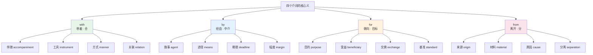
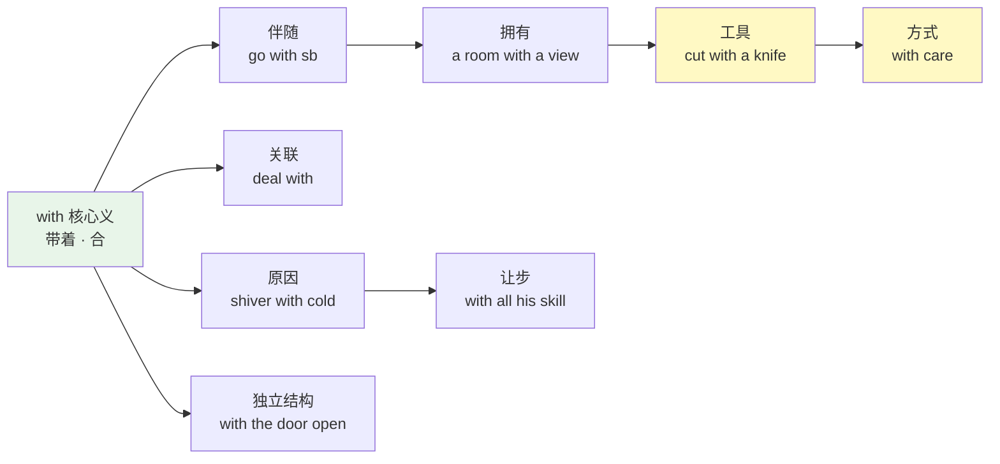
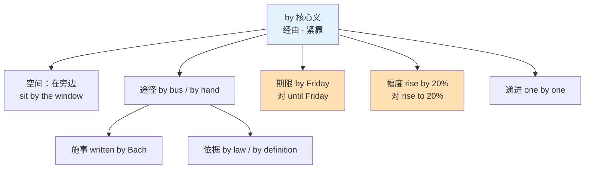
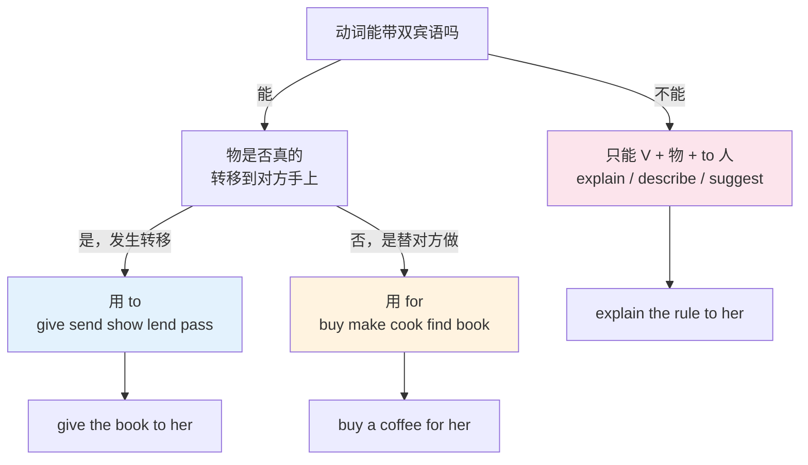
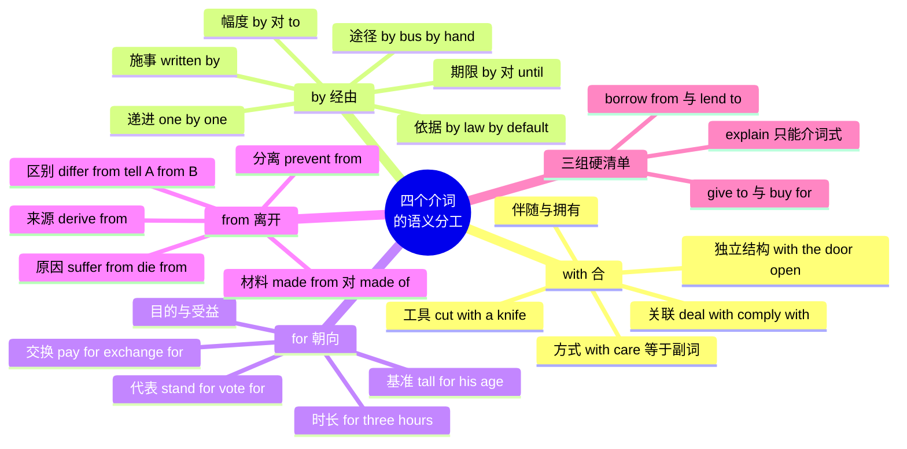

# with、by、for、from：伴随、施事、目的与来源

> [!info] 本篇定位
>
> 承接上一篇的 of 与 to，把介词地图上剩下的四个高频节点补齐。of 管属格、to 管方向，这四个词分管的是另外四种关系：**伴随与工具**（with）、**施事与途径**（by）、**目的与受益**（for）、**来源与分离**（from）。
>
> 读完你能做三件事：给一个中文关系找到对的介词而不是靠语感撞；分清 `made from` 与 `made of`、`die from` 与 `die of`、`by hand` 与 `with his hands` 这类只差一个介词的对子；把 `give sth to sb` 和 `buy sth for sb` 的动词清单背成两张表，不再写出 `explain me the rule` 这种句子。
>
> 本篇只做词汇视角的搭配清单与语义地图。介词后接从句、介词悬垂、介词短语作定语这些句法问题属于 `02.英语基础语法` 的范围，本篇不重复。

---

## 1. 本篇导读：四个介词分管四种关系

英语介词的难点不在数量，在于**一个介词管很多种关系，而中文把这些关系分给了不同的词**。「用刀切」的「用」、「被他写」的「被」、「为你买」的「为」、「从北京来」的「从」，中文各有各的字，英语则是 with / by / for / from 四个词各自向外辐射一大片义项，且互相交叠。

四个词的核心义可以用一句话锁住：

| 介词 | 核心义（一句话） | 从核心义辐射出的方向 |
| --- | --- | --- |
| with | 「带着某物一起」 | 伴随 → 拥有 → 工具 → 方式 → 关联 → 原因 → 让步 |
| by | 「紧靠着、经由旁边」 | 邻近 → 途径 → 施事 → 依据 → 期限 → 幅度 → 递进 |
| for | 「朝着某个目标去」 | 目的 → 受益 → 交换 → 代表 → 时长 → 基准 → 原因 |
| from | 「离开某个起点」 | 来源 → 起点 → 材料 → 原因 → 分离 → 阻止 → 区别 |

四个核心义之间有一条隐含的对称：`with` 是「合」，`from` 是「分」；`for` 是「朝向目标」，`by` 是「途经中介」。多数用法都能挂回这条对称上。



上图是本篇后四节的目录。每个介词下面挂四到七个分支，分支之间不是并列的同级义项，而是从核心义一步步引申出去的链条——`with` 从「带着刀」到「用刀」只差一步，从「用刀」到「用耐心」（`with patience`）又只差一步。理解链条比背义项表省力得多。

先把四个词自身的读音钉住。介词在句中通常不重读，弱读形式和强读形式差别很大，听力里认不出来往往是因为只记了强读形式。

| 英文 | 英式音标 | 美式音标 | 词性 | 中文 | 搭配与说明 |
| --- | --- | --- | --- | --- | --- |
| **with** | /wɪð/ | /wɪð/ | prep. | 和…一起；用 | 部分美音在清辅音前读 /wɪθ/；无独立弱读式 |
| **by** | /baɪ/ | /baɪ/ | prep./adv. | 被；通过；在…旁 | 唯一没有弱读式的常用介词，句中仍读满 |
| **for** | /fɔː/ | /fɔːr/ | prep./conj. | 为了；因为 | 弱读 /fə/ · /fər/，连读中几乎只剩一个 /f/ + 央元音 |
| **from** | /frɒm/ | /frɑːm/ | prep. | 从；来自 | 弱读 /frəm/ · /frəm/，句中绝大多数是弱读 |

> [!warning] 弱读带来的听力陷阱
>
> `for` 和 `from` 在正常语速里几乎不出现强读形式。`I bought it for you` 里的 `for` 只有 /fə/ 一个轻音节，`He came from Spain` 里的 `from` 是 /frəm/。
>
> 中文母语者的听力练习常按字典强读形式建立预期，结果句子一快就丢词。对策是听写时把这两个词当成前一个词的尾音处理，而不是当成独立的词去等它出现。
>
> `by` 相反：它没有弱读式，永远读 /baɪ/。所以 `by` 在句中反而比 `for` `from` 好认，这一点在做被动句听辨时很有用。

---

## 2. with：从「带着」辐射出的七种关系

### 2.1 伴随与拥有

`with` 最原始的义是「和…在一起」。这个义分两支：一支是人与人的伴随，一支是物与物的附带，后者进一步变成「拥有」。

| 英文 | 英式音标 | 美式音标 | 词性 | 中文 | 搭配与说明 |
| --- | --- | --- | --- | --- | --- |
| **accompany** | /əˈkʌmpəni/ | /əˈkʌmpəni/ | v. | 陪同 | 及物，后面**不加** with：accompany sb 而非 accompany with sb |
| **along** | /əˈlɒŋ/ | /əˈlɔːŋ/ | adv./prep. | 沿着；一道 | along with 加进「连同」义，主谓一致仍看 along with 前的主语 |
| **together** | /təˈɡeðə/ | /təˈɡeðər/ | adv. | 一起 | together with 与 along with 同义，语域略正式 |
| **stay** | /steɪ/ | /steɪ/ | v. | 停留 | stay with sb 借住在某人家，比 live with 短期 |
| **live** | /lɪv/ | /lɪv/ | v. | 居住 | live with sb 同住；live with sth 引申为「忍受」 |
| **beard** | /bɪəd/ | /bɪrd/ | n. | 胡子 | the man with a beard，with 短语作后置定语描述外观 |
| **balcony** | /ˈbælkəni/ | /ˈbælkəni/ | n. | 阳台 | a flat with a balcony，租房广告的高频结构 |
| **feature** | /ˈfiːtʃə/ | /ˈfiːtʃər/ | n./v. | 特性；以…为特色 | a laptop with 16GB of RAM，技术文档描述配置的默认句式 |

> [!example] 伴随与拥有的两支
>
> - She went to the concert **with** two colleagues.
>   - 她和两位同事一起去了音乐会。（人与人伴随）
> - I'd like a room **with** a sea view.
>   - 我想要一间能看到海的房间。（物附带物 → 拥有）
> - The error came **with** a stack trace attached.
>   - 这个报错带着一份调用栈。（技术语境里的附带义）

「拥有」这一支和动词 `have` 是同一件事的两种说法。`a man with a beard` 等于 `a man who has a beard`，区别只在于 `with` 短语更短，能直接挂在名词后面。技术文档里描述配置、参数、版本特性几乎全用这个结构，因为它可以层层叠加：`a server with 32 cores with hyperthreading enabled`。

### 2.2 工具与手段

从「带着刀」到「用刀」，语义只挪了一步：伴随的那个物成了动作的凭借。这是 `with` 在中文里最常被翻成「用」的一支。

| 英文 | 英式音标 | 美式音标 | 词性 | 中文 | 搭配与说明 |
| --- | --- | --- | --- | --- | --- |
| **knife** | /naɪf/ | /naɪf/ | n. | 刀 | cut it with a knife；复数 knives |
| **hammer** | /ˈhæmə/ | /ˈhæmər/ | n./v. | 锤子；锤打 | hit it with a hammer |
| **screwdriver** | /ˈskruːdraɪvə/ | /ˈskruːdraɪvər/ | n. | 螺丝刀 | tighten it with a screwdriver |
| **needle** | /ˈniːdl/ | /ˈniːdl/ | n. | 针 | sew it with a needle |
| **chopstick** | /ˈtʃɒpstɪk/ | /ˈtʃɑːpstɪk/ | n. | 筷子 | eat with chopsticks，通常用复数无冠词 |
| **scissors** | /ˈsɪzəz/ | /ˈsɪzərz/ | n. | 剪刀 | cut it with scissors，永远复数形式 |
| **sponge** | /spʌndʒ/ | /spʌndʒ/ | n. | 海绵 | wipe it with a sponge |
| **cloth** | /klɒθ/ | /klɔːθ/ | n. | 布 | clean it with a damp cloth，说明书高频 |

工具类 `with` 的一条硬规则：**可数名词单数必须带冠词**。`cut it with knife` 是错的，必须 `with a knife`。只有成对或成组使用的工具名词（`chopsticks`、`scissors`）用复数无冠词。

> [!warning] 工具 with 的三个易错点
>
> - ❌ ~~I wrote it with pen.~~
> - ✅ I wrote it **with a pen**.（可数单数必须带冠词）
>
> - ❌ ~~He opened the file with using Python.~~
> - ✅ He opened the file **using Python**. / **with Python**.（with 后不接动名词表工具，直接 using 或直接接名词）
>
> - ❌ ~~She translated it with the help of a dictionary and with her English is good.~~
> - ✅ She translated it **with the help of a dictionary**.（with 后只能接名词性成分，不能接完整句子）

### 2.3 方式：with + 抽象名词等于一个副词

工具那一支再往前走一步，被「用」的东西从实物换成抽象品质，`with` 短语就成了方式状语。这个结构在书面英语里极其高产，因为很多抽象名词没有对应的常用副词，或者副词形式太长。

| 英文 | 英式音标 | 美式音标 | 词性 | 中文 | 搭配与说明 |
| --- | --- | --- | --- | --- | --- |
| **care** | /keə/ | /ker/ | n./v. | 小心 | with care = carefully，包装箱上写 Handle with care |
| **caution** | /ˈkɔːʃn/ | /ˈkɔːʃn/ | n. | 谨慎 | with caution 比 with care 更强调风险 |
| **ease** | /iːz/ | /iːz/ | n. | 容易 | with ease = easily，无对应的 easeful 副词 |
| **difficulty** | /ˈdɪfɪkəlti/ | /ˈdɪfɪkəlti/ | n. | 困难 | with difficulty 是唯一说法，没有 difficultly |
| **patience** | /ˈpeɪʃns/ | /ˈpeɪʃns/ | n. | 耐心 | with patience 与 patiently 同义，前者更书面 |
| **confidence** | /ˈkɒnfɪdəns/ | /ˈkɑːnfɪdəns/ | n. | 信心 | with confidence = confidently |
| **reluctance** | /rɪˈlʌktəns/ | /rɪˈlʌktəns/ | n. | 不情愿 | with reluctance = reluctantly |
| **precision** | /prɪˈsɪʒn/ | /prɪˈsɪʒn/ | n. | 精确 | with precision，技术写作偏好此式甚于 precisely |
| **enthusiasm** | /ɪnˈθjuːziæzəm/ | /ɪnˈθuːziæzəm/ | n. | 热情 | with enthusiasm，注意英美元音差异 |
| **haste** | /heɪst/ | /heɪst/ | n. | 匆忙 | with haste 偏文；日常说 in a hurry |

> [!tip] with 名词式与副词式怎么选
>
> 两者不是随便换的。三条判断线：
>
> 一是**有没有副词**。`difficulty` 没有对应副词，只能用 `with difficulty`；这一类没得选。
>
> 二是**要不要加修饰语**。名词能挂形容词，副词不能：`with great care`、`with surprising ease`、`with considerable difficulty` 都是常用搭配，而 `very carefully` 之外很难再给 `carefully` 加层次。要表达程度差别时选名词式。
>
> 三是**语域**。`with precision` `with reluctance` 比 `precisely` `reluctantly` 更正式，技术规范和学术论文里前者更常见；口语里后者更自然。

### 2.4 关联、对象与处理

`with` 的第四支引出的是「跟谁发生关系」。这一支纯粹是搭配问题：一批动词和形容词固定要求 `with`，记住清单比理解逻辑更有效，因为中文里对应的往往是「和」「跟」「对」甚至什么都没有。

| 英文 | 英式音标 | 美式音标 | 词性 | 中文 | 搭配与说明 |
| --- | --- | --- | --- | --- | --- |
| **deal** | /diːl/ | /diːl/ | v. | 处理 | deal with a problem；不能说 deal a problem |
| **cope** | /kəʊp/ | /koʊp/ | v. | 应付 | cope with stress，不及物，必须带 with |
| **agree** | /əˈɡriː/ | /əˈɡriː/ | v. | 同意 | agree with sb（同意某人）对 agree to a plan（同意方案） |
| **argue** | /ˈɑːɡjuː/ | /ˈɑːrɡjuː/ | v. | 争论 | argue with sb about sth，两个介词分管对象与话题 |
| **compare** | /kəmˈpeə/ | /kəmˈper/ | v. | 比较 | compare A with B 并列比较；compare A to B 打比方 |
| **associate** | /əˈsəʊʃieɪt/ | /əˈsoʊʃieɪt/ | v. | 联想 | associate X with Y，被动式 be associated with 更常见 |
| **interfere** | /ˌɪntəˈfɪə/ | /ˌɪntərˈfɪr/ | v. | 干扰 | interfere with sth（妨碍事）对 interfere in sth（插手事务） |
| **comply** | /kəmˈplaɪ/ | /kəmˈplaɪ/ | v. | 遵守 | comply with regulations，法律与技术规范高频 |
| **provide** | /prəˈvaɪd/ | /prəˈvaɪd/ | v. | 提供 | provide sb with sth 等于 provide sth to sb |
| **equip** | /ɪˈkwɪp/ | /ɪˈkwɪp/ | v. | 配备 | equip sb with sth；被动 be equipped with 描述配置 |
| **familiar** | /fəˈmɪliə/ | /fəˈmɪliər/ | adj. | 熟悉的 | be familiar with sth（我熟悉它）对 be familiar to sb（它为人熟知） |
| **consistent** | /kənˈsɪstənt/ | /kənˈsɪstənt/ | adj. | 一致的 | be consistent with the data，学术写作高频 |
| **content** | /kənˈtent/ | /kənˈtent/ | adj. | 满足的 | be content with the result；重音在后，与名词 /ˈkɒntent/ 不同 |
| **crowded** | /ˈkraʊdɪd/ | /ˈkraʊdɪd/ | adj. | 拥挤的 | be crowded with tourists，填充义 |
| **satisfied** | /ˈsætɪsfaɪd/ | /ˈsætɪsfaɪd/ | adj. | 满意的 | be satisfied with sth；注意不是 satisfied about |

> [!warning] familiar 的方向反转
>
> `familiar` 是这张表里最容易出错的一个，因为它的两个介词指向相反的方向。
>
> - ✅ I'm **familiar with** this API.（我熟悉这个 API——熟悉的人作主语）
> - ✅ This API is **familiar to** most Python developers.（这个 API 为多数人所熟悉——被熟悉的东西作主语）
>
> - ❌ ~~I'm familiar to this API.~~
>
> 判断口诀：`with` 后面跟的是被了解的对象，`to` 后面跟的是了解者。同样结构的还有 `be known to sb`（为某人所知）对 `be known for sth`（以某事出名）。

### 2.5 原因与让步

`with` 还能表原因和让步，这两支使用频率低于前四支，但在书面语里出现得不少，而且中文完全没有对应形式，容易读漏。

| 英文 | 英式音标 | 美式音标 | 词性 | 中文 | 搭配与说明 |
| --- | --- | --- | --- | --- | --- |
| **shiver** | /ˈʃɪvə/ | /ˈʃɪvər/ | v. | 发抖 | shiver with cold，生理反应的原因用 with |
| **tremble** | /ˈtrembl/ | /ˈtrembl/ | v. | 颤抖 | tremble with rage，情绪引起的身体反应 |
| **flush** | /flʌʃ/ | /flʌʃ/ | v. | 脸红 | flush with embarrassment |
| **envy** | /ˈenvi/ | /ˈenvi/ | n./v. | 嫉妒 | green with envy 是固定习语 |
| **all** | /ɔːl/ | /ɔːl/ | det. | 所有 | with all his experience 表让步：尽管他经验丰富 |

原因义的 `with` 只用于**身体或情绪的直接反应**，不能推广到一般因果。「因为下雨我们取消了」不能说成 `with the rain we cancelled`，得用 `because of` 或 `due to`。

让步义只出现在 `with all + 名词` 这一个固定壳里，意思相当于 `despite`。

> [!example] 原因与让步各一例
>
> - He was trembling **with** anger.
>   - 他气得发抖。（情绪→身体反应，用 with）
> - **With all** her talent, she never got the promotion.
>   - 尽管她很有才华，却一直没能升职。（with all = despite）

### 2.6 with 独立结构

`with + 名词 + 补足语` 是英语里一种独立于主句的附加结构，中文没有对应形式，写作时几乎想不起来用，阅读时又频繁遇到。补足语的位置可以放形容词、副词、介词短语、现在分词或过去分词。

| 补足语类型 | 结构示例 | 中文 |
| --- | --- | --- |
| 形容词 | with the door **open** | 门开着 |
| 副词 | with the light **on** | 灯亮着 |
| 介词短语 | with a book **in his hand** | 手里拿着一本书 |
| 现在分词 | with the engine **running** | 引擎开着（主动、进行） |
| 过去分词 | with the job **finished** | 工作做完了（被动、完成） |
| 不定式 | with so much **to do** | 有那么多事要做（未来、待办） |

> [!example] 独立结构的实际用法
>
> - He fell asleep **with the TV still on**.
>   - 他电视还开着就睡着了。
> - **With the tests passing**, we merged the branch.
>   - 测试通过了，于是我们合并了分支。
> - She left **with her questions unanswered**.
>   - 她带着没得到解答的疑问离开了。

分词的选择取决于名词与动词的关系：名词是动作发出者用现在分词（`the engine running`——引擎在转），名词是承受者用过去分词（`the job finished`——工作被完成）。这条区分和形容词性分词是同一条规则，具体展开在 `02.英语基础语法` 的分词章。



上图把七支排成了两条主线和三条支线。主线一是「伴随→拥有→工具→方式」，四步之间每一步只挪一点点，中间两格（工具与方式）是使用频率最高的部分。主线二是关联义，它不从伴随引申，而是直接从「合」这个核心义分出来，所以是纯搭配。剩下三支各自独立，出现场合固定。

---

## 3. by：施事、方式、期限、幅度、依据、递进

`by` 的核心义是「紧靠着、经由旁边」。空间义（`sit by the window`）本身用得不多，真正高频的是从「经由」引申出的六支。

### 3.1 施事：被动句里的动作发出者

被动句里 `by` 后面接的是动作的真正发出者。这是 `by` 最容易被中文母语者识别的一支，因为它直接对应中文的「被」。

| 英文 | 英式音标 | 美式音标 | 词性 | 中文 | 搭配与说明 |
| --- | --- | --- | --- | --- | --- |
| **agent** | /ˈeɪdʒənt/ | /ˈeɪdʒənt/ | n. | 施事者；代理人 | 语法术语；日常义为「代理商」 |
| **author** | /ˈɔːθə/ | /ˈɔːθər/ | n. | 作者 | written by the author；标注作者的标准介词 |
| **compose** | /kəmˈpəʊz/ | /kəmˈpoʊz/ | v. | 创作（曲） | composed by Bach；作曲专用动词 |
| **direct** | /dəˈrekt/ | /dəˈrekt/ | v. | 导演；指挥 | directed by；片头字幕固定写法 |
| **found** | /faʊnd/ | /faʊnd/ | v. | 创立 | founded by；与 find 的过去式同形不同义 |

> [!warning] 施事的 by 什么时候省略
>
> 被动句里的 `by` 短语大多数时候是**不出现**的。施事者不重要、不知道、或从上下文可推时一律省略。
>
> - ✅ The bug **was fixed** yesterday.（谁修的不重要）
> - ✅ My wallet **was stolen**.（不知道是谁）
>
> 只在施事者是新信息或需要强调时才写出来：`This library was written by the same team that built React.`
>
> 中文母语者写英文常犯的反向错误是给每个被动句都补上 `by us` `by people`，这在英文里是冗余的。

### 3.2 方式与途径：by + 零冠词名词

`by` 表方式时，后面的名词**不带冠词、不带复数**。这批短语数量不小，而且几乎全是固定形式，改一个冠词就不成立。

| 英文 | 英式音标 | 美式音标 | 词性 | 中文 | 搭配与说明 |
| --- | --- | --- | --- | --- | --- |
| **bus** | /bʌs/ | /bʌs/ | n. | 公交车 | by bus 乘公交；不能说 by a bus |
| **train** | /treɪn/ | /treɪn/ | n. | 火车 | by train；on the train 强调在车上 |
| **air** | /eə/ | /er/ | n. | 空中 | by air 空运或坐飞机；对 by sea 海运 |
| **post** | /pəʊst/ | /poʊst/ | n. | 邮政 | 英式 by post，美式 by mail |
| **phone** | /fəʊn/ | /foʊn/ | n. | 电话 | by phone；on the phone 指正在通话 |
| **hand** | /hænd/ | /hænd/ | n. | 手 | by hand 手工制作，对 by machine |
| **heart** | /hɑːt/ | /hɑːrt/ | n. | 心 | learn by heart 背下来，know by heart 记得滚瓜烂熟 |
| **chance** | /tʃɑːns/ | /tʃæns/ | n. | 偶然 | by chance 碰巧；注意英美元音差异 |
| **mistake** | /mɪˈsteɪk/ | /mɪˈsteɪk/ | n. | 错误 | by mistake 误操作，强调无意 |
| **accident** | /ˈæksɪdənt/ | /ˈæksɪdənt/ | n. | 意外 | by accident 与 by chance 近义，中性偏意外 |
| **force** | /fɔːs/ | /fɔːrs/ | n. | 力量 | by force 强行，语气重 |
| **default** | /dɪˈfɔːlt/ | /dɪˈfɔːlt/ | n. | 默认 | by default 默认地；技术文档极高频 |

> [!warning] by 交通工具与 in / on 的分工
>
> `by` 表交通方式时说的是「用哪种方式移动」，不指具体那一辆车。要指具体的车，必须换成 `in` 或 `on`，而且要带冠词或限定词。
>
> - ✅ I go to work **by car**.（方式：开车上班）
> - ✅ I left my laptop **in the car**.（具体那辆车）
> - ✅ I met her **on the train** to Leeds.（具体那趟车）
>
> - ❌ ~~I go to work by my car.~~
> - ✅ I go to work **in my car**.（带限定词就不能用 by）
>
> 大小规则：能钻进去坐着的（car、taxi）用 `in`，能站起来走动的（bus、train、plane、ship）用 `on`。
>
> 步行是唯一的例外形式：英式 `on foot`，不说 `by foot`。

### 3.3 期限：by 与 until 的根本区别

这是 `by` 最值得单独讲的一支，因为中文的「到…为止」把两个完全不同的时间概念合并成了一个说法。

| 英文 | 英式音标 | 美式音标 | 词性 | 中文 | 搭配与说明 |
| --- | --- | --- | --- | --- | --- |
| **by** | /baɪ/ | /baɪ/ | prep. | 不迟于 | 接**一次性动作**，指截止时刻 |
| **until** | /ənˈtɪl/ | /ənˈtɪl/ | prep./conj. | 直到 | 接**持续状态**，指状态延续到某刻 |
| **till** | /tɪl/ | /tɪl/ | prep./conj. | 直到 | until 的口语变体，不是缩写，不写 'til |
| **deadline** | /ˈdedlaɪn/ | /ˈdedlaɪn/ | n. | 截止日期 | meet the deadline 赶上，miss the deadline 错过 |
| **midnight** | /ˈmɪdnaɪt/ | /ˈmɪdnaɪt/ | n. | 午夜 | by midnight 午夜前提交；until midnight 一直到午夜 |
| **submit** | /səbˈmɪt/ | /səbˈmɪt/ | v. | 提交 | submit by Friday，典型的一次性动作配 by |

判断方法只有一个问句：**动词描述的是一个瞬间完成的动作，还是一段持续的状态**。

```text
一次性动作 → by       finish / submit / arrive / reply / pay
持续状态   → until    wait / stay / sleep / remain / keep
```

> [!example] by 与 until 对照
>
> - Please submit the report **by** Friday.
>   - 请在周五之前交报告。（提交是一次性动作，周五是最晚时刻）
> - The office stays open **until** Friday.
>   - 办公室一直开到周五。（营业是持续状态，延续到周五）
> - I'll be back **by** six.
>   - 我六点前回来。（回来是一个瞬间）
> - I'll wait **until** six.
>   - 我等到六点。（等是持续的）

> [!warning] 中文母语者的高频错句
>
> - ❌ ~~I have to finish it until Friday.~~
> - ✅ I have to finish it **by** Friday.
>
> `finish` 是一次性动作，配 `until` 会产生「一直在完成」这种讲不通的意思。
>
> 反向的错误同样常见：
>
> - ❌ ~~The shop is open by nine.~~（意思变成「九点前开着，之后不确定」）
> - ✅ The shop is open **until** nine.（营业到九点）
>
> 还有一个第三方形式：`by the time` 后面接从句而不是名词。`By the time you arrive, I'll have finished.`（等你到的时候我就做完了。）它和介词 `by` 表达同一个时间关系，只是接的成分不同。

### 3.4 幅度：变化量用 by

数字变化的说法里，`by` 引出的是**变化了多少**，`to` 引出的是**变到了多少**。这一对在读财报、技术指标、性能数据时天天出现，错一个介词数字就完全变了。

| 英文 | 英式音标 | 美式音标 | 词性 | 中文 | 搭配与说明 |
| --- | --- | --- | --- | --- | --- |
| **rise** | /raɪz/ | /raɪz/ | v./n. | 上升 | rise by 20%（涨了 20%）对 rise to 20%（涨到 20%） |
| **increase** | /ɪnˈkriːs/ | /ɪnˈkriːs/ | v. | 增加 | 动词重音在后，名词 /ˈɪŋkriːs/ 重音在前 |
| **fall** | /fɔːl/ | /fɔːl/ | v./n. | 下降 | fall by half 减半；fall to half 降到一半水平 |
| **drop** | /drɒp/ | /drɑːp/ | v./n. | 下跌 | drop by three points，比 fall 口语 |
| **reduce** | /rɪˈdjuːs/ | /rɪˈduːs/ | v. | 减少 | reduce latency by 40%，性能报告标准说法 |
| **exceed** | /ɪkˈsiːd/ | /ɪkˈsiːd/ | v. | 超过 | exceed the limit by 5 seconds，超出量用 by |
| **margin** | /ˈmɑːdʒɪn/ | /ˈmɑːrdʒɪn/ | n. | 幅度；差额 | win by a narrow margin 险胜 |
| **multiply** | /ˈmʌltɪplaɪ/ | /ˈmʌltɪplaɪ/ | v. | 乘 | multiply x by 3，数学运算固定用 by |
| **divide** | /dɪˈvaɪd/ | /dɪˈvaɪd/ | v. | 除 | divide 12 by 4，被除数在前 |
| **outnumber** | /ˌaʊtˈnʌmbə/ | /ˌaʊtˈnʌmbər/ | v. | 数量超过 | outnumber them by two to one，比例用 by |

> [!warning] by 与 to 差一个字，数字差一大截
>
> - Sales rose **by** 15%.
>   - 销售额涨了 15%（原来 100，现在 115）。
> - Sales rose **to** 15%.
>   - 销售额涨到 15%（指某个占比达到了 15%）。
>
> 两句的数值含义完全不同。写业务报告或读论文数据时，这一个介词决定了结论的正确性。
>
> 记法：`by` 是「经由这么多的量」，量本身；`to` 是「到达这个位置」，终点值。

### 3.5 依据：by law 这一类

`by` 表「按照、依据」时，后面同样是零冠词名词，多用于说明某个判断的依据来自哪里。

| 英文 | 英式音标 | 美式音标 | 词性 | 中文 | 搭配与说明 |
| --- | --- | --- | --- | --- | --- |
| **law** | /lɔː/ | /lɔː/ | n. | 法律 | by law 依法；不可数，无冠词 |
| **nature** | /ˈneɪtʃə/ | /ˈneɪtʃər/ | n. | 本性 | by nature 天性上；He's cautious by nature |
| **birth** | /bɜːθ/ | /bɜːrθ/ | n. | 出生 | Canadian by birth 出生地在加拿大 |
| **profession** | /prəˈfeʃn/ | /prəˈfeʃn/ | n. | 职业 | an engineer by profession，说明本职 |
| **definition** | /ˌdefɪˈnɪʃn/ | /ˌdefɪˈnɪʃn/ | n. | 定义 | by definition 按定义就；学术写作高频 |
| **name** | /neɪm/ | /neɪm/ | n. | 名字 | know sb by name 只知其名，对 by sight 只识其面 |
| **contrast** | /ˈkɒntrɑːst/ | /ˈkɑːntræst/ | n. | 对比 | by contrast 相比之下；名词重音在前 |
| **means** | /miːnz/ | /miːnz/ | n. | 手段 | by all means 当然可以；by no means 决不 |

> [!warning] by all means 与 by no means 不是简单的正反
>
> `by all means` 是**同意别人做某事**的礼貌回应，意思是「请便、当然可以」，不是「用尽一切办法」。
>
> - A: May I use your phone? — B: **By all means**.（当然可以。）
>
> `by no means` 才真的是强否定，意思是「绝不、根本不」，而且它放在句首要触发倒装。
>
> - This is **by no means** the only solution.（这绝不是唯一的方案。）
> - **By no means** is this the only solution.（句首倒装。）

### 3.6 递进：one by one 这一类叠词结构

`by` 夹在两个相同名词中间构成「逐个推进」的意思，这个结构数量有限但全部高频。

| 英文 | 英式音标 | 美式音标 | 词性 | 中文 | 搭配与说明 |
| --- | --- | --- | --- | --- | --- |
| **one** | /wʌn/ | /wʌn/ | num. | 一 | one by one 一个一个地，逐个 |
| **step** | /step/ | /step/ | n. | 步骤 | step by step 一步步地，教程标题高频 |
| **little** | /ˈlɪtl/ | /ˈlɪtl/ | det. | 一点 | little by little 逐渐地，强调缓慢 |
| **bit** | /bɪt/ | /bɪt/ | n. | 一点 | bit by bit 与 little by little 同义，更口语 |
| **day** | /deɪ/ | /deɪ/ | n. | 天 | day by day 一天天地，强调持续变化 |
| **side** | /saɪd/ | /saɪd/ | n. | 边 | side by side 并排地，空间关系而非递进 |

`day by day` 和 `day after day` 意思不同：前者强调**渐变**（一天天好起来），后者强调**重复**（日复一日地做同一件事，常带厌倦感）。同理 `year by year` 是逐年变化，`year after year` 是年年如此。



上图里被标黄的两支是需要重点区分的：期限义要和 `until` 分清，幅度义要和 `to` 分清。其余四支基本靠搭配清单解决，不会与别的介词冲突。施事义之所以画在途径义下面，是因为二者同源——被动句的 `by` 说的正是「这件事经由谁完成」。

---

## 4. for：目的、受益、时长、交换、代表、基准

`for` 的核心义是「朝着某个目标去」。这个目标可以是要达成的事（目的）、要给的人（受益）、要换的物（交换）、要衡量的尺子（基准）。

### 4.1 目的

| 英文 | 英式音标 | 美式音标 | 词性 | 中文 | 搭配与说明 |
| --- | --- | --- | --- | --- | --- |
| **purpose** | /ˈpɜːpəs/ | /ˈpɜːrpəs/ | n. | 目的 | for this purpose；on purpose 是「故意」 |
| **sake** | /seɪk/ | /seɪk/ | n. | 缘故 | for the sake of clarity 为清楚起见 |
| **picnic** | /ˈpɪknɪk/ | /ˈpɪknɪk/ | n. | 野餐 | go out for a picnic，for 引出活动目的 |
| **breakfast** | /ˈbrekfəst/ | /ˈbrekfəst/ | n. | 早餐 | What's for breakfast? 早餐吃什么 |
| **suitable** | /ˈsuːtəbl/ | /ˈsuːtəbl/ | adj. | 合适的 | be suitable for beginners，用途匹配 |
| **eligible** | /ˈelɪdʒəbl/ | /ˈelɪdʒəbl/ | adj. | 有资格的 | be eligible for a refund，正式语域 |
| **apply** | /əˈplaɪ/ | /əˈplaɪ/ | v. | 申请 | apply for a job（申请职位）对 apply to a school（向学校申请） |
| **search** | /sɜːtʃ/ | /sɜːrtʃ/ | v./n. | 搜寻 | search for sth 找某物；search a room 搜查房间 |

> [!warning] for 表目的的边界
>
> `for` 后面接**名词**表目的，接**动词** 表目的时要用不定式 `to do`，不能用 `for doing`。
>
> - ❌ ~~I came here for learning English.~~
> - ✅ I came here **to learn** English.
> - ✅ I came here **for** an English course.（接名词就可以用 for）
>
> 唯一的例外是说明**某物的功能用途**时，可以用 `for + doing`：
>
> - ✅ This tool is **for measuring** network latency.（这个工具是用来测网络延迟的。）
>
> 区分线：主语是人、说这个人的目的 → 用 `to do`；主语是物、说这个物的用途 → 可以用 `for doing`。

### 4.2 受益者与时长

| 英文 | 英式音标 | 美式音标 | 词性 | 中文 | 搭配与说明 |
| --- | --- | --- | --- | --- | --- |
| **benefit** | /ˈbenɪfɪt/ | /ˈbenɪfɪt/ | n./v. | 好处；受益 | for the benefit of sb；动词是 benefit from |
| **behalf** | /bɪˈhɑːf/ | /bɪˈhæf/ | n. | 代表 | on behalf of sb 代表某人，注意介词是 on 不是 for |
| **cook** | /kʊk/ | /kʊk/ | v. | 做饭 | cook dinner for the family，典型受益者结构 |
| **reserve** | /rɪˈzɜːv/ | /rɪˈzɜːrv/ | v. | 预留 | reserve a seat for you |
| **duration** | /djuˈreɪʃn/ | /duˈreɪʃn/ | n. | 时长 | for the duration of the project 项目期间 |
| **decade** | /ˈdekeɪd/ | /ˈdekeɪd/ | n. | 十年 | for a decade 十年之久，时长用 for |
| **ages** | /ˈeɪdʒɪz/ | /ˈeɪdʒɪz/ | n. | 很久 | for ages 好久了，口语夸张说法 |

时长的 `for` 后面接的是**一段时间的长度**（`for three hours`），`since` 后面接的是**起点**（`since 2019`）。中文都说「三小时了」「2019 年以来」，容易混。这一对的完整用法在 `04.时间与日历` 章的时间介词篇里展开。

### 4.3 交换与代价

「拿 A 换 B」这个关系里，`for` 引出的是**换来的那一方**或**付出的那一方**，具体是哪一方由动词决定。

| 英文 | 英式音标 | 美式音标 | 词性 | 中文 | 搭配与说明 |
| --- | --- | --- | --- | --- | --- |
| **pay** | /peɪ/ | /peɪ/ | v. | 支付 | pay for the meal 为餐付钱；pay the bill 付账单 |
| **exchange** | /ɪksˈtʃeɪndʒ/ | /ɪksˈtʃeɪndʒ/ | v./n. | 交换 | exchange dollars for euros；in exchange for 作短语 |
| **swap** | /swɒp/ | /swɑːp/ | v. | 对调 | swap seats for a better view，口语 |
| **trade** | /treɪd/ | /treɪd/ | v./n. | 交易 | trade stability for speed，技术权衡常用 |
| **charge** | /tʃɑːdʒ/ | /tʃɑːrdʒ/ | v. | 收费 | charge sb for sth；charge sb with a crime 是指控 |
| **sell** | /sel/ | /sel/ | v. | 卖 | It sold for £200. 卖了 200 镑，for 引出价格 |
| **mistake** | /mɪˈsteɪk/ | /mɪˈsteɪk/ | v. | 误认 | mistake A for B 把 A 误当成 B |
| **substitute** | /ˈsʌbstɪtjuːt/ | /ˈsʌbstɪtuːt/ | v./n. | 替代 | substitute margarine for butter 用人造黄油代替黄油 |

> [!warning] substitute 的方向是反的
>
> `substitute A for B` 的意思是「用 A 代替 B」，新东西在前，旧东西在后。中文语序恰好相反，翻译时极易接反。
>
> - ✅ They **substituted** synthetic oil **for** mineral oil.（他们用合成油替代了矿物油。）
> - ✅ 等价说法：They **replaced** mineral oil **with** synthetic oil.（旧的在前，新的在后。）
>
> 两个动词的语序完全颠倒，而且介词一个是 `for` 一个是 `with`。混用会写出方向相反的句子。改写口诀：`substitute 新 for 旧`，`replace 旧 with 新`。

### 4.4 代表与支持

| 英文 | 英式音标 | 美式音标 | 词性 | 中文 | 搭配与说明 |
| --- | --- | --- | --- | --- | --- |
| **stand** | /stænd/ | /stænd/ | v. | 代表 | HTTP stands for HyperText Transfer Protocol |
| **speak** | /spiːk/ | /spiːk/ | v. | 说话 | speak for sb 替某人发言；speak to sb 对某人说 |
| **vote** | /vəʊt/ | /voʊt/ | v./n. | 投票 | vote for a candidate 投赞成票；vote against 反对 |
| **root** | /ruːt/ | /ruːt/ | v. | 支持 | root for a team 为队伍加油，美式口语 |
| **act** | /ækt/ | /ækt/ | v. | 行事 | act for a client 代表客户行事，法律语域 |
| **work** | /wɜːk/ | /wɜːrk/ | v. | 工作 | work for a company 受雇于；work with 指合作 |

`stand for` 在技术阅读里出现频率极高，缩略语解释几乎全用这个句式：`API stands for Application Programming Interface`。缩略语的完整处理在 `15.词根、合成与缩略` 里。

### 4.5 基准：tall for his age

`for` 引出比较的**参照基准**，意思是「以…的标准来衡量」。这个用法在英文里很自然，中文没有对应的介词，只能整句改写，因此中国学习者几乎不会主动使用。

| 英文 | 英式音标 | 美式音标 | 词性 | 中文 | 搭配与说明 |
| --- | --- | --- | --- | --- | --- |
| **tall** | /tɔːl/ | /tɔːl/ | adj. | 高的 | tall for his age 就年龄而言算高 |
| **mature** | /məˈtʃʊə/ | /məˈtʃʊr/ | adj. | 成熟的 | mature for her years，人的心智成熟度 |
| **warm** | /wɔːm/ | /wɔːrm/ | adj. | 暖和的 | warm for November，天气对比常季 |
| **cheap** | /tʃiːp/ | /tʃiːp/ | adj. | 便宜的 | cheap for this neighbourhood 就这一带而言算便宜 |
| **advanced** | /ədˈvɑːnst/ | /ədˈvænst/ | adj. | 高级的 | advanced for a beginner course |
| **unusual** | /ʌnˈjuːʒuəl/ | /ʌnˈjuːʒuəl/ | adj. | 不寻常的 | unusual for him to be late，接 for sb to do |

> [!example] 基准 for 的三个层次
>
> - He's tall **for** his age.
>   - 他这个年纪算高的。（不是绝对高，是相对同龄人高）
> - It's warm **for** November.
>   - 十一月有这个温度算暖和了。
> - It's unusual **for** her **to** miss a deadline.
>   - 她错过截止日期是很少见的。（for sb to do 结构，for 引出不定式的逻辑主语）

第三句里的 `for` 承担的是另一个职责：给不定式指定逻辑主语。`It's important to check`（泛指谁都该检查）加上 `for` 就变成 `It's important for you to check`（明确是你该检查）。这个结构在技术文档的建议句里几乎是标配。

### 4.6 原因：情绪、奖惩、称赞

`for` 表原因时后面接的是**引发反应的那件事**，常见于道歉、感谢、责备、表扬这几类语境。

| 英文 | 英式音标 | 美式音标 | 词性 | 中文 | 搭配与说明 |
| --- | --- | --- | --- | --- | --- |
| **grateful** | /ˈɡreɪtfl/ | /ˈɡreɪtfl/ | adj. | 感激的 | be grateful for sth（谢事）对 grateful to sb（谢人） |
| **sorry** | /ˈsɒri/ | /ˈsɑːri/ | adj. | 抱歉的 | sorry for doing sth；sorry about sth 也可 |
| **apologize** | /əˈpɒlədʒaɪz/ | /əˈpɑːlədʒaɪz/ | v. | 道歉 | apologize to sb for sth，两个介词各管一头 |
| **blame** | /bleɪm/ | /bleɪm/ | v./n. | 责怪 | blame sb for sth；be to blame 是「该负责」 |
| **punish** | /ˈpʌnɪʃ/ | /ˈpʌnɪʃ/ | v. | 惩罚 | punish sb for a mistake |
| **famous** | /ˈfeɪməs/ | /ˈfeɪməs/ | adj. | 著名的 | be famous for sth（以某事出名）对 famous as（作为某身份出名） |
| **known** | /nəʊn/ | /noʊn/ | adj. | 已知的 | be known for its reliability |
| **reward** | /rɪˈwɔːd/ | /rɪˈwɔːrd/ | v./n. | 奖励 | reward sb for their effort |

> [!warning] famous for 与 famous as
>
> - Paris is **famous for** its museums.（巴黎以博物馆出名——出名的原因是博物馆。）
> - She is **famous as** a translator.（她作为译者出名——出名的身份是译者。）
>
> `for` 后面接使人出名的**事物**，`as` 后面接出名的**身份**。同类结构的还有 `known for` 对 `known as`，后者常用于介绍别名：`Python is also known as a glue language`。

---

## 5. from：来源、起点、材料、原因、分离

`from` 的核心义是「离开某个起点」。这个起点可以是地点、时间、人、物质、原因，也可以是被隔开的对象。

### 5.1 来源与出身

| 英文 | 英式音标 | 美式音标 | 词性 | 中文 | 搭配与说明 |
| --- | --- | --- | --- | --- | --- |
| **origin** | /ˈɒrɪdʒɪn/ | /ˈɔːrɪdʒɪn/ | n. | 起源 | the origin of the word；of 管属格，from 管方向 |
| **source** | /sɔːs/ | /sɔːrs/ | n. | 来源 | data from a reliable source |
| **derive** | /dɪˈraɪv/ | /dɪˈraɪv/ | v. | 源自 | derive from Latin；被动 be derived from 更常见 |
| **originate** | /əˈrɪdʒɪneɪt/ | /əˈrɪdʒɪneɪt/ | v. | 起源于 | originate from / in，正式语域 |
| **stem** | /stem/ | /stem/ | v./n. | 源于；茎 | stem from a misunderstanding 源于误解 |
| **arise** | /əˈraɪz/ | /əˈraɪz/ | v. | 产生 | arise from a design flaw；不规则 arise-arose-arisen |
| **result** | /rɪˈzʌlt/ | /rɪˈzʌlt/ | v./n. | 导致；结果 | result from（由…引起）对 result in（导致…） |
| **hear** | /hɪə/ | /hɪr/ | v. | 听到 | hear from sb 收到某人消息，不是「听见某人」 |
| **learn** | /lɜːn/ | /lɜːrn/ | v. | 得知 | learn from sb 向某人学习或从某人处得知 |
| **graduate** | /ˈɡrædʒueɪt/ | /ˈɡrædʒueɪt/ | v. | 毕业 | 美式 graduate from a university；英式常说 graduate in physics |

> [!warning] result from 与 result in 方向相反
>
> 这两个短语用同一个动词，介词一换，因果关系就掉了个个儿。
>
> - The crash **resulted from** a null pointer.（崩溃**源于**空指针——空指针是原因。）
> - The null pointer **resulted in** a crash.（空指针**导致了**崩溃——崩溃是结果。）
>
> 记法接回核心义：`from` 是「从起点出来」，所以 `from` 后面是原因；`in` 是「落到里面」，所以 `in` 后面是结果。
>
> 同一组对立的还有 `stem from`（只表原因，无对应的 stem in）和 `lead to`（只表结果）。

### 5.2 起点：from A to B

`from ... to ...` 是英语里最通用的区间表达，能套地点、时间、数量、状态、排序几乎所有维度。

| 维度 | 例句 | 中文 |
| --- | --- | --- |
| 地点 | the flight **from** Beijing **to** Tokyo | 北京飞东京的航班 |
| 时间 | open **from** nine **to** five | 九点到五点营业 |
| 数量 | prices range **from** £10 **to** £50 | 价格从 10 到 50 镑不等 |
| 状态 | translate **from** Chinese **into** English | 从中文译成英文 |
| 顺序 | count **from** one **to** ten | 从一数到十 |

状态转换那一行的 `into` 值得注意：说「A 变成 B」时，终点介词通常用 `into` 而不是 `to`，因为 `into` 强调形态改变（`turn water into ice`、`convert JSON into CSV`）。这一点的完整对照在上一篇 `03.of 与 to：属格网络与方向对象网络` 里已经给过。

`range from ... to ...` 是学术与技术写作里描述取值范围的固定句式，主语通常是复数或不可数名词：`Response times ranged from 20 to 80 milliseconds.`

### 5.3 材料：made from 与 made of

这一对是介词题里的经典考点，判断依据是**原材料还能不能看出来**。

| 英文 | 英式音标 | 美式音标 | 词性 | 中文 | 搭配与说明 |
| --- | --- | --- | --- | --- | --- |
| **wood** | /wʊd/ | /wʊd/ | n. | 木头 | made of wood，木质看得出来 |
| **leather** | /ˈleðə/ | /ˈleðər/ | n. | 皮革 | made of leather，材质可辨 |
| **wool** | /wʊl/ | /wʊl/ | n. | 羊毛 | made of wool，纤维可辨 |
| **grape** | /ɡreɪp/ | /ɡreɪp/ | n. | 葡萄 | Wine is made from grapes，葡萄已经看不见了 |
| **flour** | /ˈflaʊə/ | /ˈflaʊər/ | n. | 面粉 | Bread is made from flour，发生了化学变化 |
| **plastic** | /ˈplæstɪk/ | /ˈplæstɪk/ | n. | 塑料 | made of plastic；made from oil 追溯到石油 |
| **consist** | /kənˈsɪst/ | /kənˈsɪst/ | v. | 由…组成 | consist of，不能用被动，也不能换 from |
| **compose** | /kəmˈpəʊz/ | /kəmˈpoʊz/ | v. | 构成 | be composed of，正式书面 |

> [!tip] 三个介词的分工
>
> - **made of** —— 物理加工，原材料形态未变，看得出来。a table made **of** wood。
> - **made from** —— 化学或深度加工，原材料形态已变，看不出来。paper made **from** wood。
> - **made with** —— 强调所含的成分之一，不是全部。a cake made **with** butter and eggs。
>
> 同一样东西可以三种都说，取决于你要强调什么：`This bag is made of leather`（皮做的）、`Paper is made from wood`（纸是木头做的）、`The sauce is made with garlic`（酱里放了蒜）。

### 5.4 原因：die from 与 die of

`from` 表原因时指的是**外部因素或间接原因**，`of` 指的是**内在的、直接的原因**。这个区分在医学英语里很严格，日常语境里边界模糊，两者常可互换。

| 英文 | 英式音标 | 美式音标 | 词性 | 中文 | 搭配与说明 |
| --- | --- | --- | --- | --- | --- |
| **die** | /daɪ/ | /daɪ/ | v. | 死 | die of cancer 内因；die from an injury 外因 |
| **cancer** | /ˈkænsə/ | /ˈkænsər/ | n. | 癌症 | die of cancer，疾病用 of |
| **wound** | /wuːnd/ | /wuːnd/ | n. | 伤口 | die from a wound，外伤用 from |
| **exhaustion** | /ɪɡˈzɔːstʃən/ | /ɪɡˈzɔːstʃən/ | n. | 精疲力竭 | die from exhaustion，外部消耗 |
| **suffer** | /ˈsʌfə/ | /ˈsʌfər/ | v. | 患；受苦 | suffer from a disease，长期病症固定用 from |
| **recover** | /rɪˈkʌvə/ | /rɪˈkʌvər/ | v. | 康复 | recover from an illness，起点是病 |

> [!example] 内因与外因
>
> - He died **of** heart disease.
>   - 他死于心脏病。（疾病本身是死因，内在）
> - She died **from** injuries sustained in the crash.
>   - 她死于车祸造成的伤。（外力导致，间接）
> - He has suffered **from** insomnia for years.
>   - 他失眠多年。（长期病症固定搭 from，不能换 of）

`suffer from` 是这组里最不能出错的一个：**长期病症或困扰只能用 from**。`suffer of` 不成立。另一个易混的是 `suffer` 直接跟宾语时不加介词：`suffer a loss`（蒙受损失）、`suffer a setback`（遭遇挫折），这时说的是一次性事件而不是长期状态。

### 5.5 分离与阻止：prevent sb from doing

`from` 最有生产力的一支：一整批表示「隔开、挡住、不让」的动词都用 `from` 引出被阻止的动作，而且动作必须是**动名词**，不能是不定式。

| 英文 | 英式音标 | 美式音标 | 词性 | 中文 | 搭配与说明 |
| --- | --- | --- | --- | --- | --- |
| **prevent** | /prɪˈvent/ | /prɪˈvent/ | v. | 阻止 | prevent sb from doing；美式口语可省 from |
| **stop** | /stɒp/ | /stɑːp/ | v. | 阻止 | stop sb from doing；stop doing 是自己不做了 |
| **keep** | /kiːp/ | /kiːp/ | v. | 使不 | keep sb from doing，from 不可省 |
| **discourage** | /dɪsˈkʌrɪdʒ/ | /dɪsˈkɜːrɪdʒ/ | v. | 劝阻 | discourage sb from doing，语气比 prevent 弱 |
| **prohibit** | /prəˈhɪbɪt/ | /proʊˈhɪbɪt/ | v. | 禁止 | prohibit sb from doing，法律语域 |
| **ban** | /bæn/ | /bæn/ | v./n. | 禁止 | ban sb from a place；ban sth 直接接物 |
| **bar** | /bɑː/ | /bɑːr/ | v. | 禁止进入 | bar sb from entering，正式 |
| **exclude** | /ɪkˈskluːd/ | /ɪkˈskluːd/ | v. | 排除 | exclude sth from the scope |
| **refrain** | /rɪˈfreɪn/ | /rɪˈfreɪn/ | v. | 克制 | refrain from doing，主语是自己，告示牌高频 |
| **protect** | /prəˈtekt/ | /prəˈtekt/ | v. | 保护 | protect sb from harm；protect against 也可 |
| **save** | /seɪv/ | /seɪv/ | v. | 挽救 | save sb from drowning |
| **escape** | /ɪˈskeɪp/ | /ɪˈskeɪp/ | v. | 逃离 | escape from prison；escape sth 是「避开」 |
| **hide** | /haɪd/ | /haɪd/ | v. | 隐藏 | hide sth from sb；不规则 hide-hid-hidden |
| **resign** | /rɪˈzaɪn/ | /rɪˈzaɪn/ | v. | 辞职 | resign from a post；g 不发音 |

> [!warning] 阻止类动词的两条硬规则
>
> 第一条：`from` 后面必须是**动名词**，不能是不定式。
>
> - ❌ ~~The rain prevented us from to go out.~~
> - ✅ The rain **prevented us from going** out.
>
> 第二条：中文的「阻止某人做某事」在英语里绝不是 `prevent sb to do`。这是中国学习者最高频的介词错误之一。
>
> - ❌ ~~prevent him to leave~~ / ~~stop her to speak~~
> - ✅ **prevent him from leaving** / **stop her from speaking**
>
> 例外只有 `stop` 和 `prevent` 在美式口语里可以省略 `from`（`stop him leaving`），但 `keep` `discourage` `prohibit` `refrain` 一律不能省。写作时全部保留 `from` 最稳妥。

### 5.6 区别：differ from 与 tell A from B

| 英文 | 英式音标 | 美式音标 | 词性 | 中文 | 搭配与说明 |
| --- | --- | --- | --- | --- | --- |
| **differ** | /ˈdɪfə/ | /ˈdɪfər/ | v. | 不同 | differ from sth；形容词是 different from |
| **different** | /ˈdɪfrənt/ | /ˈdɪfrənt/ | adj. | 不同的 | 英美通用 different from；英式也说 different to |
| **distinguish** | /dɪˈstɪŋɡwɪʃ/ | /dɪˈstɪŋɡwɪʃ/ | v. | 区分 | distinguish A from B，或 distinguish between A and B |
| **tell** | /tel/ | /tel/ | v. | 分辨 | tell A from B 分得清；口语说法 |
| **separate** | /ˈsepəreɪt/ | /ˈsepəreɪt/ | v. | 分开 | separate A from B；形容词读 /ˈseprət/ |
| **apart** | /əˈpɑːt/ | /əˈpɑːrt/ | adv. | 分开 | apart from = 除了；tell them apart 分辨他们 |

> [!warning] different from / to / than
>
> 三种说法都存在，但分布不同：
>
> - **different from** —— 英美通用，书面首选，任何场合都不会错。
> - **different to** —— 英式口语常见，美式少见。
> - **different than** —— 美式口语常见，后接从句时尤其自然（`different than I expected`），但正式写作里保守读者会认为不规范。
>
> 结论：写作一律用 `from`。这个选择在任何语域里都安全。

---

## 6. with 与 by 的工具—施事二分

四个介词里最容易互相串的是 `with` 和 `by`，因为中文的「用」既能对应工具也能对应方式。区分标准是一条：**看这个东西在动作里扮演什么角色**。

| 角色 | 介词 | 判断依据 | 示例 |
| --- | --- | --- | --- |
| 施事者 agent | by | 有意志、主动发起动作的人或机构 | The report was written **by** Sarah. |
| 工具 instrument | with | 被人拿在手里、被人操作的具体物件 | She cut it **with** a knife. |
| 方式 means | by | 抽象的做法、途径、渠道 | We paid **by** card. |
| 材料 material | with | 填充或覆盖用的物质 | Fill the glass **with** water. |

一个典型的三层句子能把三个角色同时摆出来：

> [!example] 施事、工具、方式同现
>
> - The lock was opened **by a technician with a master key**.
>   - 锁是一名技师用万能钥匙打开的。（by 引出人，with 引出工具）
> - The message was sent **by email** rather than **by post**.
>   - 消息是通过邮件而不是邮寄发出的。（两个 by 都是渠道）
> - He fixed it **by rewriting** the config, not **with** a new library.
>   - 他是靠重写配置修好的，不是用新库修的。（by + 动名词表方法，with + 名词表工具）

### 6.1 by hand 与 with his hands

这两个短语拆开看都是「用手」，但落在不同的语义层上。

| 短语 | 层次 | 含义 | 对立面 |
| --- | --- | --- | --- |
| **by hand** | 方式 | 手工完成，不用机器 | by machine |
| **with his hands** | 工具 | 用手这个器官（而不是用别的部位或器具） | with a fork / with a stick |

> [!example] 两个短语的实际差别
>
> - This sweater was knitted **by hand**.
>   - 这件毛衣是手工织的。（不是机器织的）
> - He ate the noodles **with his hands**.
>   - 他用手抓着吃面。（不是用筷子或叉子）

`by hand` 是零冠词固定短语，不能说 `by a hand` 或 `by hands`；`with his hands` 必须带限定词，且通常用复数。

### 6.2 by + 动名词表方法

`by` 后面接动名词回答的是「怎么做到的」，这是技术写作里说明实现方式的标准句式，`with` 不能替代。

> [!example] by + doing 的技术语境
>
> - You can reduce startup time **by lazy-loading** the modules.
>   - 可以通过延迟加载模块来缩短启动时间。
> - We solved the race condition **by adding** a mutex.
>   - 我们通过加锁解决了竞态条件。
> - The service authenticates **by checking** the token signature.
>   - 服务通过校验令牌签名来完成认证。

对应的错误写法是 `with adding a mutex` 或 `through adding a mutex`。`through` 表方法虽然存在，但在这个句式里远不如 `by` 自然。

---

## 7. give to 与 buy for：与格的两条分工

英语里一批表示「给予」的动词可以带两个宾语。当这两个宾语调换顺序、间接宾语后置时，前面要加介词——**加 to 还是加 for，取决于动词属于哪一类**。这是词汇层面的硬清单，不是句法规则，必须逐个记。

```text
双宾语式：  V + 人 + 物        give me the book      buy me a coffee
介词式：    V + 物 + 介词 + 人   give the book to me   buy a coffee for me
                              ↑ to 类               ↑ for 类
```

判断标准是语义：**东西真的转移到了对方手里 → to；动作是替对方做的 → for**。



上图是一棵三分判定树。第一层先筛掉不能带双宾语的动词（`explain` 这一类），第二层再按「有没有实物转移」分出 `to` 组和 `for` 组。三条分支的错误后果不同：`to`/`for` 用反只是搭配不地道，而给 `explain` 强行加双宾语则是明确的语法错误。

### 7.1 to 类动词

这一类动词的共同点是**物品或信息真的从一方到了另一方**。

| 英文 | 英式音标 | 美式音标 | 词性 | 中文 | 搭配与说明 |
| --- | --- | --- | --- | --- | --- |
| **give** | /ɡɪv/ | /ɡɪv/ | v. | 给 | give sb sth = give sth to sb |
| **send** | /send/ | /send/ | v. | 发送 | send me the file = send the file to me |
| **show** | /ʃəʊ/ | /ʃoʊ/ | v. | 展示 | show me the log = show the log to me |
| **lend** | /lend/ | /lend/ | v. | 借出 | lend me your pen = lend your pen to me |
| **pass** | /pɑːs/ | /pæs/ | v. | 递 | pass me the salt = pass the salt to me |
| **offer** | /ˈɒfə/ | /ˈɔːfər/ | v. | 提供 | offer sb a job = offer a job to sb |
| **teach** | /tiːtʃ/ | /tiːtʃ/ | v. | 教 | teach us physics = teach physics to us |
| **tell** | /tel/ | /tel/ | v. | 告诉 | tell me the truth = tell the truth to me |
| **hand** | /hænd/ | /hænd/ | v. | 递交 | hand her the report = hand the report to her |
| **sell** | /sel/ | /sel/ | v. | 卖 | sell him the car = sell the car to him |
| **owe** | /əʊ/ | /oʊ/ | v. | 欠 | owe me ten pounds = owe ten pounds to me |
| **promise** | /ˈprɒmɪs/ | /ˈprɑːmɪs/ | v. | 承诺 | promise her a raise = promise a raise to her |

### 7.2 for 类动词

这一类的共同点是**动作是替别人做的**，物品可能本来就不存在，是做出来或找出来的。

| 英文 | 英式音标 | 美式音标 | 词性 | 中文 | 搭配与说明 |
| --- | --- | --- | --- | --- | --- |
| **buy** | /baɪ/ | /baɪ/ | v. | 买 | buy me a coffee = buy a coffee for me |
| **make** | /meɪk/ | /meɪk/ | v. | 做 | make her a cake = make a cake for her |
| **cook** | /kʊk/ | /kʊk/ | v. | 烹饪 | cook us dinner = cook dinner for us |
| **find** | /faɪnd/ | /faɪnd/ | v. | 找到 | find me a seat = find a seat for me |
| **get** | /ɡet/ | /ɡet/ | v. | 弄来 | get me a ticket = get a ticket for me |
| **order** | /ˈɔːdə/ | /ˈɔːrdər/ | v. | 点；订 | order him a drink = order a drink for him |
| **book** | /bʊk/ | /bʊk/ | v. | 预订 | book us a table = book a table for us |
| **save** | /seɪv/ | /seɪv/ | v. | 留 | save me a seat = save a seat for me |
| **choose** | /tʃuːz/ | /tʃuːz/ | v. | 挑选 | choose her a gift = choose a gift for her |
| **build** | /bɪld/ | /bɪld/ | v. | 建造 | build them a house = build a house for them |
| **pour** | /pɔː/ | /pɔːr/ | v. | 倒 | pour me a glass = pour a glass for me |
| **fetch** | /fetʃ/ | /fetʃ/ | v. | 取来 | fetch me the file = fetch the file for me |

### 7.3 只能用介词式的动词

第三类是不能带双宾语的动词。它们的语义看起来完全像「给」，但句法上只接 `V + 物 + to + 人`。这批词导致的错句在中国学习者的写作里出现率极高。

| 英文 | 英式音标 | 美式音标 | 词性 | 中文 | 搭配与说明 |
| --- | --- | --- | --- | --- | --- |
| **explain** | /ɪkˈspleɪn/ | /ɪkˈspleɪn/ | v. | 解释 | explain sth to sb；不能说 explain sb sth |
| **describe** | /dɪˈskraɪb/ | /dɪˈskraɪb/ | v. | 描述 | describe the bug to me |
| **suggest** | /səˈdʒest/ | /səˈdʒest/ | v. | 建议 | suggest a solution to the team |
| **introduce** | /ˌɪntrəˈdjuːs/ | /ˌɪntrəˈduːs/ | v. | 介绍 | introduce her to my colleagues |
| **announce** | /əˈnaʊns/ | /əˈnaʊns/ | v. | 宣布 | announce the change to all users |
| **mention** | /ˈmenʃn/ | /ˈmenʃn/ | v. | 提到 | mention it to your manager |
| **report** | /rɪˈpɔːt/ | /rɪˈpɔːrt/ | v. | 报告 | report the issue to support |
| **prove** | /pruːv/ | /pruːv/ | v. | 证明 | prove the theorem to the class |
| **repeat** | /rɪˈpiːt/ | /rɪˈpiːt/ | v. | 重复 | repeat the question to him |
| **admit** | /ədˈmɪt/ | /ədˈmɪt/ | v. | 承认 | admit the mistake to his boss |

> [!warning] explain 组的典型错句
>
> - ❌ ~~Can you explain me this error?~~
> - ✅ Can you **explain this error to me**?
>
> - ❌ ~~She suggested me a better approach.~~
> - ✅ She **suggested a better approach to me**.
> - ✅ 更自然的改写：She **suggested that I try** a better approach.
>
> - ❌ ~~Let me introduce you my colleague.~~
> - ✅ Let me **introduce my colleague to you**.
>
> 判断法：这批动词多数是**拉丁来源的三音节以上长词**，而能带双宾语的 `give` `send` `tell` `show` 几乎全是日耳曼层的短词。这个规律不是百分之百，但作为快速筛查很有效——看到长词就先怀疑它只能用介词式。

### 7.4 for 类还有一个额外含义

`for` 类动词的介词式偶尔会有歧义，因为 `for` 除了「替某人」还能表「代替某人」。

> [!example] for 的两读
>
> - I'll write the report **for** you.
>   - 读法一：我替你写这份报告（你不用写了）。
>   - 读法二：我为你写这份报告（写好给你用）。
>
> 具体是哪个意思要看上下文。想明确表达「写完给你」时，改成 `I'll write the report and send it to you` 更清楚。

---

## 8. borrow、lend、rent 的方向误配

中文的「借」是一个双向词——「我借你一本书」既可能是我给你，也可能是你给我，全靠语境。英语把这两个方向分给了不同的动词，配的介词也不同。这是中文母语者最稳定出错的一组。

| 英文 | 英式音标 | 美式音标 | 词性 | 中文 | 搭配与说明 |
| --- | --- | --- | --- | --- | --- |
| **borrow** | /ˈbɒrəʊ/ | /ˈbɑːroʊ/ | v. | 借入 | borrow sth **from** sb；东西朝我来，配 from |
| **lend** | /lend/ | /lend/ | v. | 借出 | lend sb sth / lend sth **to** sb；东西朝外去，配 to |
| **rent** | /rent/ | /rent/ | v./n. | 租 | 双向词：rent from（租入）对 rent to（租出） |
| **hire** | /ˈhaɪə/ | /ˈhaɪər/ | v. | 租用；雇 | 英式指短租设备，美式主要指「雇人」 |
| **lease** | /liːs/ | /liːs/ | v./n. | 长租 | 长期合约用，房产与设备语域 |
| **loan** | /ləʊn/ | /loʊn/ | n./v. | 贷款；出借 | 名词最常用；动词 loan sb sth 主要是美式 |

方向可以画成一条线：

```text
        borrow from  ←────────────  出借方
   我 ────────────→  lend to        对方
```

> [!warning] 借的四类错句
>
> - ❌ ~~Can I borrow you my bike?~~
> - ✅ Can I **lend** you my bike?（我给你，用 lend）
> - ✅ Can I **borrow** your bike?（你给我，用 borrow）
>
> - ❌ ~~I borrowed my laptop to him.~~
> - ✅ I **lent** my laptop to him.
>
> - ❌ ~~He lent a book from the library.~~
> - ✅ He **borrowed** a book from the library.
>
> - ❌ ~~borrow sth to sb~~ / ~~lend sth from sb~~
> - ✅ **borrow sth from sb** / **lend sth to sb**（介词与动词绑死，不能交叉）
>
> 一句话记法：`borrow` 只配 `from`，`lend` 只配 `to`，两个搭配永不交叉。

`rent` 和 `hire` 的英美差异需要额外注意。英式英语里 `hire` 指短期租用设备或交通工具（`hire a car`），`rent` 指长期租房；美式英语里 `hire` 基本只表示「雇人」，租车说 `rent a car`。在美国说 `hire a car` 会被理解成「雇一辆车连司机」，或者干脆听不懂。完整的英美用词差异在 `17.语域、英美差异与习语俚语` 章展开。

`borrow` 还有一个不能带介词的用法：`borrow money`（借钱）、`borrow an idea`（借鉴想法）。加不加 `from` 取决于要不要点明出借方。

---

## 9. 四词交叉的高频错点

前面各节按介词组织，这一节反过来按**错误类型**组织，把最容易撞车的对子集中列出。

| 场景 | 错误写法 | 正确写法 | 出错原因 |
| --- | --- | --- | --- |
| 截止时间 | finish it until Friday | finish it **by** Friday | 中文「到周五」合并了两个概念 |
| 持续到 | The shop is open by nine | The shop is open **until** nine | 同上，方向搞反 |
| 涨幅 | rose to 20%（想说涨了 20%） | rose **by** 20% | by 是变化量，to 是终点值 |
| 阻止 | prevent him to leave | prevent him **from leaving** | 中文「阻止…做」直译成不定式 |
| 长期病症 | suffer of insomnia | suffer **from** insomnia | of 只用于 die of |
| 熟悉 | I'm familiar to Python | I'm **familiar with** Python | 主语是了解者时用 with |
| 替代 | substitute butter for margarine（想说用人造黄油代替黄油） | substitute margarine **for** butter | substitute 新 for 旧 |
| 解释 | explain me the error | **explain** the error **to** me | 该动词不带双宾语 |
| 借 | borrow him my book | **lend** him my book | 方向词选错 |
| 材料 | Wine is made of grapes | Wine is **made from** grapes | 原料形态已改变 |
| 因果 | The bug resulted in bad input | The bug **resulted from** bad input | from 引原因，in 引结果 |
| 交通 | go to work by my car | go to work **in** my car | 带限定词就不能用 by |
| 目的 | I came here for learning English | I came here **to learn** English | 人的目的用不定式 |
| 工具 | write it with pen | write it **with a pen** | 可数单数必须带冠词 |
| 出名 | famous as its museums | **famous for** its museums | for 接原因，as 接身份 |

### 9.1 一句话选词流程

拿不准该用哪个介词时，按下面的顺序自问：

① 这个成分是**做动作的人**吗 → `by`
② 是**被拿在手上的具体物件**吗 → `with`
③ 是**抽象的做法或渠道**吗 → `by`
④ 是**动作要达成的目标或受益的人**吗 → `for`
⑤ 是**动作的出发点或被隔开的对象**吗 → `from`
⑥ 都不是 → 回到 `of` 与 `to`，参考上一篇

这条流程能覆盖大部分现场判断。剩下的部分是固定搭配，只能靠清单——`comply with`、`suffer from`、`apply for` 这些属于必须整块记住的组合，没有推导捷径。

### 9.2 记忆策略：按动词记，不按介词记

介词学习最常见的低效做法是「背 with 的十二个义项」。义项表能帮助理解，但产出时不管用，因为你说话时想的是动词不是介词。

有效的做法是把介词捆在动词上一起记：不记「`from` 可以表分离」，而记 `prevent sb from doing` 这个完整块。同一个块里的介词是不需要选择的，直接调用。

> [!tip] 三条可操作的记忆动作
>
> **动作一：按动词建卡片。** 卡片正面写 `prevent`，背面写 `prevent sb from doing sth` 加一个自己写的例句。不要写「prevent + from」这种抽象公式，公式记不住也调不出来。
>
> **动作二：把对立对子成组记。** `by / until`、`made of / made from`、`die of / die from`、`result from / result in`、`borrow from / lend to` 这五组必须一起记，单记一半反而会加剧混淆。
>
> **动作三：写作时反查。** 写完一段英文，把所有介词圈出来，逐个问「这个介词是我选的还是搭配自带的」。搭配自带的去查确认，自己选的检查有没有更常用的说法。这个动作做二十次左右，多数搭配就固化了。

---

## 10. 本篇小结



> [!success] 本篇核心要点回顾
>
> 1. 四个介词各有一个核心义：`with` 是「合」、`by` 是「经由」、`for` 是「朝向」、`from` 是「分」。所有引申义都能挂回核心义，按链条理解比背义项表省力。
> 2. `with` 从伴随一步步走到工具、方式：`cut with a knife` 是工具，`with care` 是方式（等于副词）。方式义的名词式能挂形容词，副词不能，这是选它的主要理由。
> 3. `by` 有两组必须分清的对立：期限上**一次性动作配 by、持续状态配 until**（`finish it until Friday` 是错句），幅度上 `rise by 20%` 是涨了 20%、`rise to 20%` 是涨到 20%，数值含义完全不同。
> 4. `for` 表目的时接名词；说人的目的要用不定式 `to do`，说物的用途才可以用 `for doing`。基准义 `tall for his age` 中文没有对应形式，需要刻意练习才会用。
> 5. `from` 的三组对立各有判据：`made of` 看得出原料、`made from` 看不出；`die of` 是内因、`die from` 是外因；`suffer from` 只有一种说法。分离支的 `prevent / stop / keep / discourage / prohibit / refrain` 后面全接 `from + 动名词`，绝不接不定式。
> 6. 与格分工按语义定：**东西真的转移用 to，替人做的用 for**；`explain / describe / suggest / introduce` 这批长词只能用介词式，不能带双宾语。
> 7. `borrow` 只配 `from`，`lend` 只配 `to`，两者永不交叉。中文的「借」是双向词，这是最稳定的出错来源。
> 8. 介词要按动词记成整块（`comply with`、`suffer from`、`prevent from`），不要按介词记义项表——说话时先想到的是动词。

> [!success] 本篇练习清单
>
> - [ ] 用 `by` 和 `until` 各造两句，一句说提交报告，一句说办公室营业时间
> - [ ] 把「销售额涨了 15%」和「销售额涨到 15%」分别译成英文，检查介词
> - [ ] 写出五个后接 `from + 动名词` 的阻止类动词，每个配一个例句
> - [ ] 判断下列各该用 of 还是 from：`This table is made ___ oak.` / `Paper is made ___ wood.` / `He died ___ pneumonia.` / `She suffers ___ migraines.`
> - [ ] 把 `give` `send` `buy` `make` `explain` `introduce` 六个动词分成 to 类、for 类、只能介词式三组
> - [ ] 用 borrow 和 lend 各写一句关于同一本书的话，确认两句的方向相反
> - [ ] 找出 `with` 的方式义（with + 抽象名词）在你最近读的一段英文里出现了几次，把它们改写成副词并比较效果
> - [ ] 用 `tall for his age` 这个基准结构造三句，分别说年龄、季节、经验水平

### 10.1 下一篇预告

> [!info] 下一篇：其余介词与复合介词
>
> 高频六个介词（of、to、with、by、for、from）到本篇为止全部处理完。下一篇收尾介词这一类词：`in / on / at` 的三维分工、`over / under / above / below` 的接触与覆盖差别、`during / throughout / within` 的时间跨度、`among / between` 的数量条件，以及 `according to`、`in terms of`、`with respect to`、`on behalf of` 这批复合介词的语域分层。
>
> [[02.功能词与封闭词类速查/05.其余介词与复合介词：语义分组与语域分层\|其余介词与复合介词：语义分组与语域分层]]
>
> 复合介词那一节会给出一张语域对照表：哪些只出现在合同与论文里，哪些在邮件里用就显得端着，哪些口语书面通用。技术文档写作里选错这一层，整段的语气就会失衡。
