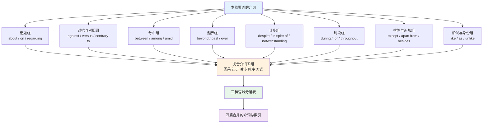
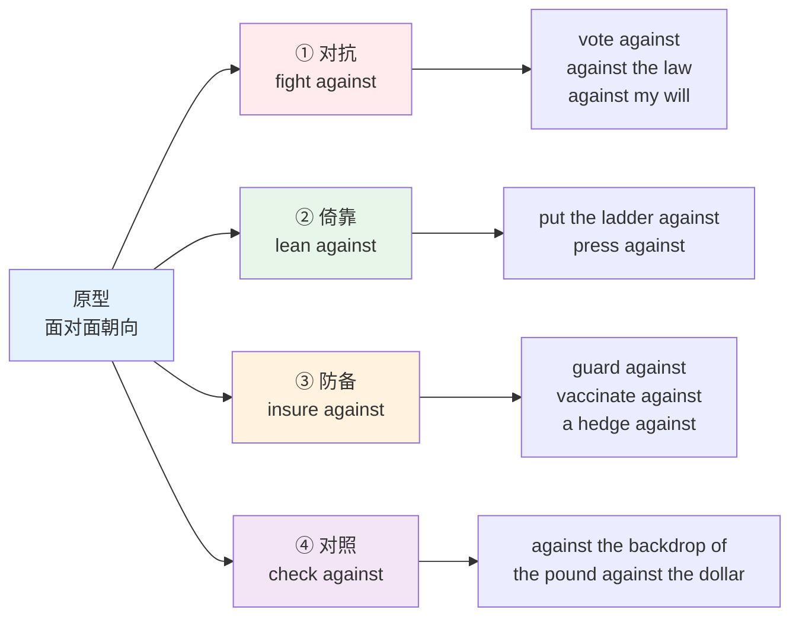
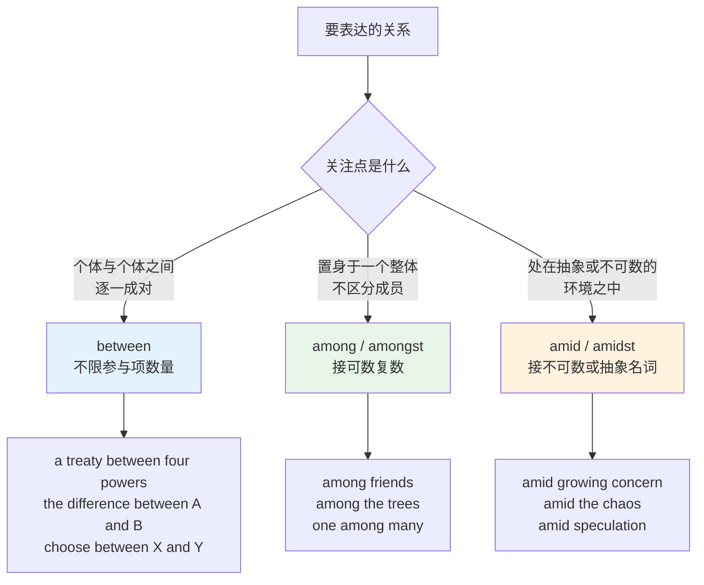
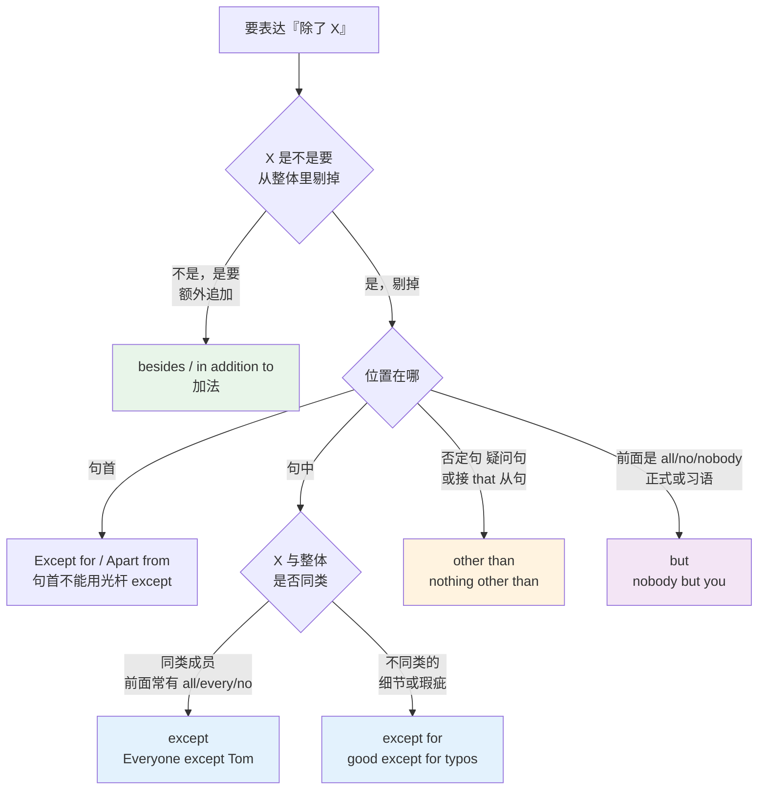

# 其余介词与复合介词：语义分组与语域分层

> [!info] 本篇定位
>
> 介词四篇的收口篇。[[02.功能词与封闭词类速查/02.空间与路径介词：空间原型义到抽象义的引申\|空间与路径介词]] 处理了 in/on/at/over/through 这批带空间原型的，[[02.功能词与封闭词类速查/03.of 与 to：属格网络与方向对象网络\|of 与 to]] 处理了两个最抽象的，[[02.功能词与封闭词类速查/04.with、by、for、from：伴随、施事、目的与来源\|with、by、for、from]] 处理了四个高频多义的。剩下的介词落在这一篇。
>
> 剩下的这批有个共同点：它们不共享一条空间原型，各走各的语义线。所以本篇不按引申路径讲，按**语义分组**讲——对抗组、排除组、让步组、话题组、比较组，一组一组收。
>
> 后半篇处理复合介词。`in spite of`、`with regard to`、`on behalf of` 这类由「介词 + 名词 + 介词」拼出来的多词单位，学习者的问题不是不认识，而是不知道什么场合该用、什么场合是臃肿，以及 `along with` 引导的成分到底影不影响谓语的单复数。
>
> 读完能做到三件事：给出一个语义，知道该调用哪个介词；看到 `except` 和 `except for` 能说清什么时候必须加 `for`；写正式文书时能在口语档、中性档、正式档之间有意识地切换。

---

## 1. 本篇导读：剩下的介词按什么分组

前三篇的介词有一个可依赖的抓手——空间原型。`in` 是容器、`on` 是接触面、`through` 是贯穿、`from` 是起点，抽象义全部是从那个空间图式引申出来的，讲清原型就讲清了半张网。

本篇这批没有这个便利。`despite` 的词源是「藐视」，`against` 的词源是「面对面」，`except` 的词源是「拿出来」，`during` 是 `endure` 的现在分词。它们各自从一个动词或名词固化成介词，语义线互不相干，硬套空间图式反而添乱。

可靠的组织方式是按**语义功能**分组。同一组内的成员语义近似，差别在细节和语域上，正好可以互相当参照物。

上图是本篇的路线。前八组是单词介词，按语义功能横向铺开；复合介词单独成组，因为它们的问题不在语义而在结构和语域；最后两节把四篇的内容合成一张分层表和一张总索引，作为长期查阅入口。

> [!info] 本篇的边界
>
> 「哪个动词固定配哪个介词」不在这里。`accuse sb of`、`blame sb for`、`congratulate sb on` 这类需要成表检索的搭配清单，全在 [[02.英语基础语法/13.附录/03.介词搭配速查\|介词搭配速查]] 里按动词、形容词、名词三类分组。
>
> 本篇给的是选词判据：面对一个待表达的语义，该往哪个介词去够。

---

## 2. about：话题的表面，兼 be about to

### 2.1 词表

| 英文 | 英式音标 | 美式音标 | 词性 | 中文 | 搭配与说明 |
| --- | --- | --- | --- | --- | --- |
| **about** | /əˈbaʊt/ | /əˈbaʊt/ | prep./adv. | 关于；大约；四处 | 话题义最泛，覆盖面浅 |
| **on** | /ɒn/ | /ɑːn/ | prep. | 关于（专论） | 话题义比 about 深，暗示系统论述 |
| **regarding** | /rɪˈɡɑːdɪŋ/ | /rɪˈɡɑːrdɪŋ/ | prep. | 关于 | 商务书信常用，比 about 正式一档 |
| **concerning** | /kənˈsɜːnɪŋ/ | /kənˈsɜːrnɪŋ/ | prep. | 关于 | 正式书面，公文与法律语体 |
| **re** | /riː/ | /riː/ | prep. | 事由 | 邮件与备忘录主题行的缩写式，正文里不用 |
| **as to** | — | — | prep. | 至于；关于 | 引出待判定的问题，多接 whether 从句 |
| **as for** | — | — | prep. | 至于 | 转换话题主体，句首用 |
| **approximately** | /əˈprɒksɪmətli/ | /əˈprɑːksɪmətli/ | adv. | 大约 | about 表约数时的正式对应 |
| **around** | /əˈraʊnd/ | /əˈraʊnd/ | prep./adv. | 大约；周围 | 表约数时与 about 通用，美式更偏 around |

### 2.2 about 与 on 的深浅差

两个词都能译成「关于」，区别在**论述的深度和系统性**。`about` 只声明话题范围，`on` 暗示这是一份有结构的专门论述。

> [!example] 同一本书的两种说法
>
> - She wrote a book **about** Rome.
>   - 她写了一本关于罗马的书。（可能是游记、随笔、回忆录）
> - She wrote a book **on** Roman law.
>   - 她写了一本罗马法专著。（学术性论述，有体系）
> - a lecture **on** distributed systems
>   - 一场关于分布式系统的讲座。（技术讲座，正规选题）
> - We talked **about** distributed systems over lunch.
>   - 午饭时我们聊了聊分布式系统。（闲聊，不成体系）

这条区别在技术阅读里有实际用处。论文标题、章节标题、正式讲座几乎一律用 `on`；口头交流、邮件里的随口一提用 `about`。写英文技术文档时，`Notes on caching`（缓存笔记，成篇）比 `Notes about caching` 更像一份正经文档。

> [!warning] about 后面接名词，不接从句
>
> `about` 是介词，后面接名词、代词或动名词，不能直接接主谓结构。
>
> - ❌ ~~I'm worried about he will fail.~~
> - ✅ I'm worried **about his failing**.
> - ✅ I'm worried **that he will fail**.
>
> 另一个高频误配是 `discuss about`。`discuss` 本身是及物动词，直接接宾语。
>
> - ❌ ~~Let's discuss about the schedule.~~
> - ✅ Let's **discuss the schedule**.
> - ✅ Let's **talk about the schedule**.
>
> 同类的还有 `mention`、`describe`、`explain`——三个都直接接宾语，中间不塞 `about`。这批误配的完整清单在 [[02.功能词与封闭词类速查/02.空间与路径介词：空间原型义到抽象义的引申\|空间与路径介词]] 一篇里。

### 2.3 about 的另外两支义

**「四处」义**是 `about` 最老的一支，来自古英语 `onbūtan`「在外围」。现代英语里主要留在英式用法和一批固定短语中。

| 英文 | 英式音标 | 美式音标 | 词性 | 中文 | 搭配与说明 |
| --- | --- | --- | --- | --- | --- |
| **look about** | — | — | v. | 四下张望 | 美式更常说 look around |
| **be out and about** | — | — | phr. | 病愈后能出门活动 | 固定说法，多用于康复语境 |
| **bring about** | — | — | v. | 导致；促成 | 主语是事件而非人时最自然 |
| **set about** | — | — | v. | 着手做 | 后接动名词：set about rewriting |
| **come about** | — | — | v. | 发生 | 与 happen 同义，偏书面 |

**「大约」义**由「在……周围」引申而来：`about twenty people` 就是「在二十这个数附近」。

> [!example] 约数的三档表达
>
> - There were **about** thirty people in the room.
>   - 房间里大约有三十人。（口语，最常用）
> - The repository contains **approximately** 4,000 files.
>   - 该仓库约含四千个文件。（技术文档、报告）
> - Losses are **in the region of** two million pounds.
>   - 损失在两百万英镑上下。（财经与正式报告）

### 2.4 be about to：即将

`be about to do` 表示动作马上发生，时间上比 `be going to` 近得多。

> [!example] be about to 的用法
>
> - The server **is about to** restart.
>   - 服务器马上要重启了。
> - I **was about to** leave when she called.
>   - 我正要走，她打电话来了。
> - He **was about to** say something, then thought better of it.
>   - 他刚要开口，又改了主意。

> [!warning] be about to 不接时间状语
>
> `be about to` 已经把「马上」包含在语义里，再加一个时间状语就冲突了。
>
> - ❌ ~~The meeting is about to start in two hours.~~
> - ✅ The meeting **is going to start** in two hours.
> - ✅ The meeting **is about to start**.
>
> 唯一能加的修饰是 `just`，用来进一步压缩时间：`I was just about to call you.`
>
> 否定式 `be not about to` 是另一个意思——不是「不会马上」，而是「绝不打算」，带明显的抗拒语气：`I'm not about to apologize.`（我才不会道歉。）

---

## 3. against：一个词的四张面孔

### 3.1 词表

| 英文 | 英式音标 | 美式音标 | 词性 | 中文 | 搭配与说明 |
| --- | --- | --- | --- | --- | --- |
| **against** | /əˈɡenst/ | /əˈɡenst/ | prep. | 反对；倚靠；防备；对照 | 英式也读 /əˈɡeɪnst/，两读并存 |
| **versus** | /ˈvɜːsəs/ | /ˈvɜːrsəs/ | prep. | 对；相对于 | 缩写 vs. 或 v.（法律案件用 v.） |
| **protest** | /prəˈtest/ | /prəˈtest/ | v. | 抗议 | 英式 protest against，美式可直接及物 |
| **oppose** | /əˈpəʊz/ | /əˈpoʊz/ | v. | 反对 | 及物动词，不接 against |
| **lean** | /liːn/ | /liːn/ | v. | 倚；靠 | lean against the wall |
| **guard** | /ɡɑːd/ | /ɡɑːrd/ | v./n. | 防备；警卫 | guard against complacency |
| **insure** | /ɪnˈʃʊə/ | /ɪnˈʃʊr/ | v. | 投保 | insure against fire/theft |
| **hedge** | /hedʒ/ | /hedʒ/ | n./v. | 对冲；树篱 | a hedge against inflation |
| **backdrop** | /ˈbækdrɒp/ | /ˈbækdrɑːp/ | n. | 背景 | against the backdrop of 是新闻套语 |
| **benchmark** | /ˈbentʃmɑːk/ | /ˈbentʃmɑːrk/ | n./v. | 基准；对标 | benchmark X against Y |
| **odds** | /ɒdz/ | /ɑːdz/ | n. | 几率；逆境 | against all odds 逆境中成功 |
| **grain** | /ɡreɪn/ | /ɡreɪn/ | n. | 纹理 | go against the grain 违背本性 |

### 3.2 四支义项怎么来的

`against` 的原型是「面对面地朝向」。人与人面对面是对抗，物与墙面对面是倚靠，盾与刀面对面是防备，两组数据面对面是对照。四支义全部从这一个空间关系发散出来。

上图的四支不是并列关系，而是同一个「面对面」在不同参与者之间的实例化。判断该用哪支，看的是两个参与项的性质：两个意志相对，是对抗；一个实体压在另一个平面上，是倚靠；一个防护措施针对一个风险，是防备；两组信息并置，是对照。

### 3.3 逐支例证

**① 对抗**是最常见的一支，覆盖行为对抗与规则冲突两类。

> [!example] 对抗义
>
> - Thousands marched **against** the new law.
>   - 数千人游行反对新法。
> - The committee voted **against** the proposal.
>   - 委员会投票否决了提案。
> - Parking here is **against** the rules.
>   - 这里停车违规。
> - She was made to sign it **against** her will.
>   - 她是被迫违心签的字。
> - I have nothing **against** him personally.
>   - 我对他个人没有意见。

> [!warning] oppose 不接 against
>
> `oppose` 本身就含「对抗」义，是及物动词。
>
> - ❌ ~~The board opposed against the merger.~~
> - ✅ The board **opposed** the merger.
> - ✅ The board **was opposed to** the merger.
>
> `protest` 情况不同：英式英语用 `protest against/about the decision`，美式英语允许直接及物 `protest the decision`。两种都成立，别把美式用法当错误。

**② 倚靠**是纯空间义，用得少但很直观。

> [!example] 倚靠义
>
> - He leaned **against** the door frame.
>   - 他靠在门框上。
> - Rain beat **against** the window all night.
>   - 雨整夜拍打着窗户。
> - She pressed her forehead **against** the cold glass.
>   - 她把额头贴在冰凉的玻璃上。

`against` 与 `on` 在这里有分工：`on` 是自上而下压在水平面上，`against` 是侧向抵住一个竖直面。`The ladder is against the wall`（梯子靠在墙上）不能换成 `on the wall`，后者意思变成「梯子挂在墙上」。

**③ 防备**是技术文档和保险、金融文本的高频义。

> [!example] 防备义
>
> - The system is protected **against** replay attacks.
>   - 系统对重放攻击有防护。
> - You should insure **against** flood damage.
>   - 你该投保洪水险。
> - Gold is traditionally a hedge **against** inflation.
>   - 黄金历来是对抗通胀的对冲手段。
> - Guard **against** the assumption that the input is well-formed.
>   - 别想当然认为输入格式正确。

**④ 对照**在数据报告和新闻里密集出现，也是四支里最容易漏掉的一支。

> [!example] 对照义
>
> - Always validate user input **against** the schema.
>   - 用户输入一律要对照 schema 校验。
> - The pound fell sharply **against** the dollar.
>   - 英镑对美元大幅下跌。
> - Revenue is up 12 percent **against** the same quarter last year.
>   - 营收较去年同季增长百分之十二。
> - The talks took place **against** a backdrop of rising tension.
>   - 会谈是在紧张局势升级的背景下举行的。
> - The mountains stood black **against** the evening sky.
>   - 群山在暮色天空的映衬下是黑的。

最后一句的「映衬」和第一句的「校验」看似无关，实际是同一个动作：把 A 放在 B 前面看它们的差别。这就是为什么校验代码里的 `validate against` 和风景描写里的 `black against the sky` 用的是同一个词。

### 3.4 versus 的分工

`versus` 只承担 `against` 的对抗与对照两支，且限于**并置两个名词**的场合，不进句子结构。

| 场合 | 写法 | 说明 |
| --- | --- | --- |
| 体育赛事 | Arsenal **vs.** Chelsea | 缩写 vs.，口语读作 /ˈvɜːsəs/ 或直接读 versus |
| 法律案件 | Roe **v.** Wade | 法律文书固定用单字母 v. |
| 技术对比 | REST **versus** GraphQL | 标题与图表常用，正文可写全 |
| 权衡取舍 | speed **versus** accuracy | 名词对名词，不带冠词 |

---

## 4. between 与 among：分工不在数量

### 4.1 教条与事实

学校语法给的规则是「between 用于两者，among 用于三者以上」。这条规则会导致学习者把大量正确的英语句子判为错句。

**事实是**：`between` 表示**逐一发生在个体之间的关系**，参与项可以是任意多个；`among` 表示**置身于一个未分化的集合之中**，不关心集合内部成员的个体身份。

> [!example] 三个以上的 between 全部成立
>
> - a treaty **between** the four powers
>   - 四国之间的条约。（四方两两之间都有约束关系）
> - relations **between** six countries
>   - 六国之间的关系。（六方相互之间的关系网）
> - Switzerland lies **between** France, Germany, Italy and Austria.
>   - 瑞士处在法、德、意、奥之间。（与四国逐一接壤）
> - The differences **between** the three implementations are minor.
>   - 三种实现之间的差别不大。（两两比较）

上面四句全是标准英语，把 `between` 换成 `among` 反而不对——因为句子要表达的正是「逐一之间」的关系，而不是「置身其中」。

> [!example] among 表示置身集合
>
> - He was **among** friends.
>   - 他置身朋友之中。（不关心具体是哪几个朋友）
> - The village lay hidden **among** the hills.
>   - 村子隐在群山之中。
> - She is **among** the finest engineers I know.
>   - 她是我认识的最优秀的工程师之一。
> - Panic spread **among** the crowd.
>   - 恐慌在人群中蔓延。

上图给的是可操作的判定路径：先问自己关注的是「成对关系」还是「置身其中」，成对就用 `between`，置身就在 `among` 和 `amid` 之间按后接名词的可数性再分一次。`among` 后面必须是可数名词复数或集合名词，`amid` 后面是不可数名词或抽象名词——这条界线在新闻英语里守得很严。

### 4.2 词表

| 英文 | 英式音标 | 美式音标 | 词性 | 中文 | 搭配与说明 |
| --- | --- | --- | --- | --- | --- |
| **between** | /bɪˈtwiːn/ | /bɪˈtwiːn/ | prep./adv. | 在……之间 | 词源含 twain「二」，但用法不限两者 |
| **among** | /əˈmʌŋ/ | /əˈmʌŋ/ | prep. | 在……之中 | 后接可数复数或集合名词 |
| **amongst** | /əˈmʌŋst/ | /əˈmʌŋst/ | prep. | 在……之中 | 与 among 同义，英式书面更常见 |
| **amid** | /əˈmɪd/ | /əˈmɪd/ | prep. | 在……之中 | 后接不可数或抽象名词，新闻高频 |
| **amidst** | /əˈmɪdst/ | /əˈmɪdst/ | prep. | 在……之中 | amid 的书面变体，语气更文 |
| **midst** | /mɪdst/ | /mɪdst/ | n. | 中间 | in the midst of，固定搭配 |
| **twain** | /tweɪn/ | /tweɪn/ | n. | 二 | 古语，只在 never the twain shall meet 里活着 |

### 4.3 三个高频坑

**坑一：between you and I。** 这是被引用得最多的英语误用之一。`between` 是介词，后面的人称代词必须用宾格。

> [!warning] 介词后一律用宾格
>
> - ❌ ~~Between you and I, the project is behind schedule.~~
> - ✅ **Between you and me**, the project is behind schedule.
>   - 你我私下说，项目进度落后了。
>
> 这个错误的成因是过度矫正：小时候被纠正过 `Me and Tom went...`，于是形成「and 后面用 I 才对」的错误直觉。检验方法是把并列项去掉一个——没人会说 `between I`。
>
> 同类的还有 `for you and I`、`with he and his wife`，全部同一个病因。

**坑二：between 与 among 在「分配」语境的分工。** 分给两个人用 `between`，分给一群人用 `among`，这条是成立的，但 `between` 用于三个以上的具名个体也没问题。

> [!example] 分配语境
>
> - She divided the money **between** her two sons.
>   - 她把钱分给两个儿子。
> - The estate was divided **among** the surviving relatives.
>   - 遗产分给了在世的亲属。（不点名，看作一群人）
> - Costs are shared **between** the four departments.
>   - 成本由四个部门分摊。（四个具名部门，逐一承担份额）

**坑三：between 后面的连接词。** `between A and B` 里的 `and` 不能换成 `to` 或 `or`，这是中文母语者的高频错误。

> [!warning] between…and，不是 between…to
>
> - ❌ ~~The temperature ranges between 5 to 10 degrees.~~
> - ✅ The temperature ranges **between 5 and 10 degrees**.
> - ✅ The temperature ranges **from 5 to 10 degrees**.
>
> `between` 配 `and`，`from` 配 `to`，两套不能混着用。混用产生的 `between…to` 在技术文档里出现频率很高，但它不是标准英语。

---

## 5. beyond：越过边界之后

### 5.1 词表

| 英文 | 英式音标 | 美式音标 | 词性 | 中文 | 搭配与说明 |
| --- | --- | --- | --- | --- | --- |
| **beyond** | /biˈjɒnd/ | /biˈjɑːnd/ | prep./adv. | 在……之外；超出 | 强调越过边界后的另一侧 |
| **past** | /pɑːst/ | /pæst/ | prep. | 经过；超过 | 空间与时钟时间：half past six |
| **repair** | /rɪˈpeə/ | /rɪˈper/ | n./v. | 修复 | beyond repair 已无法修复 |
| **doubt** | /daʊt/ | /daʊt/ | n./v. | 怀疑 | beyond doubt 无可置疑 |
| **belief** | /bɪˈliːf/ | /bɪˈliːf/ | n. | 相信 | beyond belief 难以置信 |
| **recognition** | /ˌrekəɡˈnɪʃn/ | /ˌrekəɡˈnɪʃn/ | n. | 辨认 | changed beyond recognition |
| **reach** | /riːtʃ/ | /riːtʃ/ | n./v. | 触及范围 | beyond reach 够不着 |
| **scope** | /skəʊp/ | /skoʊp/ | n. | 范围 | beyond the scope of 论文套语 |
| **dispute** | /dɪˈspjuːt/ | /dɪˈspjuːt/ | n./v. | 争议 | beyond dispute 无可争辩 |
| **control** | /kənˈtrəʊl/ | /kənˈtroʊl/ | n./v. | 控制 | beyond one's control 非人力可控 |

### 5.2 四类用法

**空间义**是原型：越过一条边界到另一侧。

> [!example] 空间与时间
>
> - The car park is **beyond** those trees.
>   - 停车场在那排树后面。
> - Don't stay out **beyond** midnight.
>   - 别过了午夜还不回来。
> - The contract runs **beyond** 2030.
>   - 合同期限延续到二〇三〇年之后。

`beyond` 与 `over`、`above` 的分工是：`over` 强调越过的**过程**或垂直方位，`above` 强调垂直方位的高低，`beyond` 强调越过之后**处在另一侧**。`beyond the river` 是「河那边」，`over the river` 是「跨过河去」。

**能力与范围义**是使用频率最高的一支，构成一批固定说法。

| 搭配 | 中文 | 用在什么场合 |
| --- | --- | --- |
| **beyond my control** | 非我能控制 | 免责说明、道歉信 |
| **beyond repair** | 无法修复 | 设备、关系、名誉 |
| **beyond doubt** | 毫无疑问 | 正式论断 |
| **beyond dispute** | 无可争辩 | 学术、法律 |
| **beyond belief** | 难以置信 | 感叹，带情绪 |
| **beyond recognition** | 面目全非 | 常配 changed / damaged |
| **beyond the scope of** | 超出……范围 | 论文与文档的自我限界 |
| **beyond a reasonable doubt** | 排除合理怀疑 | 英美刑事举证标准 |

> [!example] 范围义
>
> - The proposal was damaged **beyond repair** by the leak.
>   - 泄密把这份提案彻底毁了。
> - Concurrency is **beyond the scope of** this chapter.
>   - 并发不在本章讨论范围内。
> - The delay was **beyond our control**.
>   - 延误非我方所能控制。

**「It's beyond me」**是一个需要单独记的口语式。字面是「超出我」，实际有两个意思，靠上下文分。

> [!example] beyond me 的两义
>
> - Why they chose that framework **is beyond me**.
>   - 他们为什么选那个框架，我实在想不通。（理解不了）
> - Fixing this alone **is beyond me**.
>   - 一个人修这个，我做不到。（能力不够）

**否定加强义**：`beyond` 后接抽象名词时，整个短语等于一个强否定。`beyond doubt` = 完全没有疑问，`beyond dispute` = 完全没有争议。这类结构在正式论断里比 `certainly`、`definitely` 分量重。

> [!tip] 用 beyond 替换弱副词
>
> 写正式论断时，`It is beyond dispute that…` 比 `It is definitely true that…` 更有力量，因为它不是在强调说话人的确信，而是在陈述「争议空间不存在」这个客观状态。
>
> 反过来，日常邮件里写 `beyond dispute` 会显得过于用力，那种场合 `clearly` 或 `obviously` 就够了。

---

## 6. despite 与 in spite of：只接名词的让步

### 6.1 词表

| 英文 | 英式音标 | 美式音标 | 词性 | 中文 | 搭配与说明 |
| --- | --- | --- | --- | --- | --- |
| **despite** | /dɪˈspaɪt/ | /dɪˈspaɪt/ | prep. | 尽管 | 单词介词，后面绝不加 of |
| **spite** | /spaɪt/ | /spaɪt/ | n. | 恶意 | in spite of 里的 spite 已虚化 |
| **notwithstanding** | /ˌnɒtwɪθˈstændɪŋ/ | /ˌnɑːtwɪθˈstændɪŋ/ | prep./adv. | 尽管 | 法律与公文，可后置于宾语 |
| **regardless** | /rɪˈɡɑːdləs/ | /rɪˈɡɑːrdləs/ | adv. | 不顾 | regardless of，of 不可省 |
| **irrespective** | /ˌɪrɪˈspektɪv/ | /ˌɪrɪˈspektɪv/ | adj. | 不论 | irrespective of，与 regardless of 同义 |
| **although** | /ɔːlˈðəʊ/ | /ɔːlˈðoʊ/ | conj. | 虽然 | 连词，后接完整句子 |
| **though** | /ðəʊ/ | /ðoʊ/ | conj./adv. | 虽然；不过 | 句末作副词时意为「不过」 |
| **nevertheless** | /ˌnevəðəˈles/ | /ˌnevərðəˈles/ | adv. | 尽管如此 | 连接副词，前面用分号或句号 |

### 6.2 介词与连词的分界

让步语义有两套表达工具，选错工具是中文母语者最稳定的错误来源之一。中文的「尽管」既能接短语也能接句子，英语不行。

| 后面接什么 | 用什么 | 例子 |
| --- | --- | --- |
| 名词、代词、动名词 | despite / in spite of / notwithstanding | despite **the rain** |
| 完整句子（有主语有谓语） | although / though / even though | although **it was raining** |

> [!warning] 三个高频错法
>
> **错法一：despite 后面接句子。**
>
> - ❌ ~~Despite it was raining, we went out.~~
> - ✅ **Despite the rain**, we went out.
> - ✅ **Although it was raining**, we went out.
> - ✅ **Despite the fact that** it was raining, we went out.
>
> **错法二：despite of。** `despite` 本身就是介词，不需要第二个介词。
>
> - ❌ ~~Despite of the delay, the release shipped.~~
> - ✅ **Despite the delay**, the release shipped.
> - ✅ **In spite of the delay**, the release shipped.
>
> **错法三：although 与 but 同时出现。** 中文说「虽然……但是……」，英语里两个让步标记只能留一个。
>
> - ❌ ~~Although he was tired, but he kept working.~~
> - ✅ **Although** he was tired, he kept working.
> - ✅ He was tired, **but** he kept working.

### 6.3 despite the fact that 的定位

`despite the fact that` 是一个逃生通道：当你必须接一个完整句子、又想保留 `despite` 的句式时，插入 `the fact` 把从句名词化。

它语法上完全成立，但比 `although` 多出四个词。写作课上通常建议能用 `although` 就别用它。真正需要它的场合是：句子已经用过一次 `although`，为了不重复才换。

> [!example] 三种写法的取舍
>
> - **Although** the tests passed, we rolled back the deploy.
>   - 虽然测试通过了，我们还是回滚了这次部署。（最简洁）
> - **Despite the fact that** the tests passed, we rolled back the deploy.
>   - 同义，但多了四个词。
> - **Despite passing tests**, we rolled back the deploy.
>   - 用动名词压缩，最紧凑，正式文档偏好这种。

### 6.4 notwithstanding 的位置自由

`notwithstanding` 是让步组里唯一可以**后置**于宾语的介词，这是它从中古英语的独立结构继承来的特性。这个用法集中在法律文书里。

> [!example] notwithstanding 的两种语序
>
> - **Notwithstanding** any provision to the contrary, this clause survives termination.
>   - 尽管有任何相反约定，本条款在合同终止后仍然有效。（前置）
> - Any provision to the contrary **notwithstanding**, this clause survives termination.
>   - 同义。（后置，更古典的法律语体）

技术文档和商务邮件里不需要用它，`despite` 足够。它值得认识的原因是读合同、许可证、RFC 时会遇到——开源许可证的 `Notwithstanding the above` 是标准开头。

### 6.5 regardless of 与让步组的区别

`regardless of` 常被当成 `despite` 的同义词，但两者的逻辑不同。

- `despite X` = X 发生了，结果仍然如此。X 是**已知事实**。
- `regardless of X` = 不管 X 是什么，结果都如此。X 是**变量**。

> [!example] 两者不能互换的场合
>
> - **Despite the cost**, we went ahead.
>   - 尽管成本高，我们还是推进了。（成本高是已知的）
> - **Regardless of the cost**, we will go ahead.
>   - 不管成本多少，我们都会推进。（成本还未知）
>
> 第二句换成 `despite` 就不通了，因为「不管多少」这个不确定性正是 `regardless of` 提供的。

---

## 7. during 与 for：when 与 how long

### 7.1 一条提问检验法

这两个词的分工可以用一条问句判定：

- **during 回答 when**（在什么时间段之内发生的）
- **for 回答 how long**（持续了多长时间）

> [!example] 两问两答
>
> - *When did it happen?* — It happened **during** the war.
>   - 什么时候发生的？——战争期间。
> - *How long did it last?* — It lasted **for** four years.
>   - 持续了多久？——四年。

由此推出一条硬规则：`during` 后面接的必须是**有边界的时段名词**（the meeting, the war, the summer, my stay），不能接表示时间长度的数量短语。

> [!warning] during three years 是错的
>
> - ❌ ~~I lived in Berlin during three years.~~
> - ✅ I lived in Berlin **for three years**.
> - ✅ I lived in Berlin **during the war**.
>
> `three years` 是长度，不是时段名称，所以只能配 `for`。
>
> 反向的错误也存在：
>
> - ❌ ~~Three accidents happened for the night shift.~~
> - ✅ Three accidents happened **during the night shift**.

### 7.2 词表

| 英文 | 英式音标 | 美式音标 | 词性 | 中文 | 搭配与说明 |
| --- | --- | --- | --- | --- | --- |
| **during** | /ˈdjʊərɪŋ/ | /ˈdʊrɪŋ/ | prep. | 在……期间 | 词源是 endure 的分词，只接时段名词 |
| **for** | /fɔː/ | /fɔːr/ | prep. | 持续；为了 | 时长义详见第 04 篇 |
| **throughout** | /θruːˈaʊt/ | /θruːˈaʊt/ | prep./adv. | 自始至终 | 强调覆盖整个时段，无间断 |
| **within** | /wɪˈðɪn/ | /wɪˈðɪn/ | prep. | 在……之内 | 期限内完成，与 in 不同 |
| **over** | /ˈəʊvə/ | /ˈoʊvər/ | prep. | 在……期间 | over the weekend、over the past decade |
| **while** | /waɪl/ | /waɪl/ | conj. | 当……的时候 | 连词，接句子，不是介词 |
| **since** | /sɪns/ | /sɪns/ | prep./conj. | 自从 | 接时间点，配完成时 |
| **until** | /ənˈtɪl/ | /ənˈtɪl/ | prep./conj. | 直到 | 强调持续到某点，对比 by 的期限 |
| **till** | /tɪl/ | /tɪl/ | prep./conj. | 直到 | until 的口语变体，非缩写 |
| **pending** | /ˈpendɪŋ/ | /ˈpendɪŋ/ | prep. | 在……期间；有待 | 正式语体：pending approval |

### 7.3 during 不能接句子

`during` 是介词，后面接名词。要接主谓结构必须换 `while`。

> [!warning] during 与 while 的分工
>
> - ❌ ~~During I was writing the report, the server crashed.~~
> - ✅ **While I was writing** the report, the server crashed.
> - ✅ **During the report writing**, the server crashed.
> - ✅ **While writing** the report, I found two bugs.（主语相同可省略）
>
> 这条和 `despite` 与 `although` 的分工是同一个道理：介词接名词，连词接句子。中文母语者在这两处犯的是同一个错。

### 7.4 throughout、over、within 的补位

**throughout** 是 `during` 的加强版，强调覆盖整个时段没有间断。

> [!example] during 与 throughout
>
> - The lights flickered **during** the storm.
>   - 暴风雨期间灯闪过。（某几个时刻）
> - The lights flickered **throughout** the storm.
>   - 整场暴风雨里灯一直在闪。（全程无间断）

**over** 用于回顾一段跨度，尤其配 `the past/last + 时段`，在数据报告里高频。

> [!example] over 的时段义
>
> - Traffic doubled **over the past six months**.
>   - 过去半年流量翻了一倍。
> - Let's discuss it **over lunch**.
>   - 边吃午饭边聊。
> - She read three papers **over the weekend**.
>   - 她周末读了三篇论文。

**within** 是期限义，指「不超过这个长度」，和表示「这个长度之后」的 `in` 是两回事。

> [!warning] within two hours 与 in two hours
>
> - The build finishes **within two hours**.
>   - 构建在两小时之内完成。（可能一小时就好了）
> - The build finishes **in two hours**.
>   - 构建两小时后完成。（正好是两小时之后）
>
> 写 SLA、超时配置、交付承诺时这两个词不能混。承诺「两小时内响应」是 `within two hours`，写成 `in two hours` 变成了「两小时后才响应」。

---

## 8. beside 与 besides：一个 s 的鸿沟

### 8.1 词表

| 英文 | 英式音标 | 美式音标 | 词性 | 中文 | 搭配与说明 |
| --- | --- | --- | --- | --- | --- |
| **beside** | /bɪˈsaɪd/ | /bɪˈsaɪd/ | prep. | 在……旁边 | 纯空间义，等于 next to |
| **besides** | /bɪˈsaɪdz/ | /bɪˈsaɪdz/ | prep./adv. | 除……之外还有 | 加法义，与 except 的减法义相反 |
| **next to** | — | — | prep. | 紧挨着 | beside 的口语对应，更常用 |
| **alongside** | /əˈlɒŋsaɪd/ | /əˈlɔːŋsaɪd/ | prep./adv. | 与……并排 | 强调平行并列，也表「与……共事」 |
| **in addition to** | — | — | prep. | 除……之外还有 | besides 的正式对应 |
| **moreover** | /mɔːˈrəʊvə/ | /mɔːrˈoʊvər/ | adv. | 而且 | 连接副词，正式书面 |

### 8.2 一个 s 决定语义

`beside` 是空间的「旁边」，`besides` 是逻辑的「另外还有」。两者拼写只差一个字母，语义没有交集。

> [!example] 对照
>
> - She sat **beside** me.
>   - 她坐在我旁边。（位置）
> - **Besides** me, three others attended.
>   - 除了我，还有三个人到场。（人数是四）
> - There's a lamp **beside** the sofa.
>   - 沙发旁边有盏灯。
> - **Besides** the sofa, we need a lamp.
>   - 除了沙发，我们还需要一盏灯。（两样都要）

> [!tip] 记忆钩子
>
> 多一个 `s`，多一样东西。`besides` 比 `beside` 多的那个 `s` 就是它多出来的那一项。
>
> 这个钩子还能顺带记住 `besides` 与 `except` 的对立：`besides` 是加法（把它算进来还有别的），`except` 是减法（把它从整体里剔掉）。同一句话换这两个词，人数会差出一个。

### 8.3 besides 兼作副词

`besides` 除介词外还可以单独作副词，意思是「而且」「再说」，用在补充一个新理由的时候，语气偏口语。

> [!example] 副词用法
>
> - I don't want to go. **Besides**, it's too late.
>   - 我不想去。再说，太晚了。
> - The library is closed, and **besides**, I've read that book.
>   - 图书馆关门了，而且那本书我读过了。

正式书面里对应的是 `moreover`、`furthermore`、`in addition`。三者语气一档比一档正式，但都不能像 `besides` 那样带随口补充的语感。

### 8.4 beside 的两个固定短语

`beside` 本身用得不多，但有两个高频固定短语必须单独记，因为它们的意思从字面推不出来。

| 短语 | 中文 | 用法说明 |
| --- | --- | --- |
| **beside the point** | 离题；不相干 | 反驳时常用：That's beside the point. |
| **beside oneself (with)** | 忘乎所以；失控 | 配 joy、rage、grief：beside himself with rage |

> [!example] 两个短语
>
> - Whether it's cheap is **beside the point**; it doesn't work.
>   - 便不便宜不是重点，它根本不能用。
> - She was **beside herself with** worry.
>   - 她担心得六神无主。

---

## 9. 排除五分：except / except for / apart from / other than / but

### 9.1 五个词的分工总览

「除了」是中文里一个词，英语里至少五个。它们的差别在三个维度上：排除项与整体是否同类、句中位置、以及是否限定在否定与疑问句里。

上图的第一个分叉是最关键的一步：先分清要做的是加法还是减法。中文的「除了」两义兼有，英语必须先选边——加法走 `besides`，减法才进下面的四分。剩下的分叉按位置和同类性判定。

### 9.2 词表

| 英文 | 英式音标 | 美式音标 | 词性 | 中文 | 搭配与说明 |
| --- | --- | --- | --- | --- | --- |
| **except** | /ɪkˈsept/ | /ɪkˈsept/ | prep./conj. | 除……之外 | 排除同类成员，不用于句首 |
| **except for** | — | — | prep. | 除……之外 | 句首必用；排除不同类的细节 |
| **apart from** | — | — | prep. | 除……之外 | 兼有加法与减法两义，英式更常用 |
| **aside from** | — | — | prep. | 除……之外 | apart from 的美式对应 |
| **other than** | — | — | prep. | 除……之外 | 多用于否定句与疑问句 |
| **but** | /bʌt/ | /bʌt/ | prep./conj. | 除……之外 | 只跟在 all/no/every/nobody 之后 |
| **save** | /seɪv/ | /seɪv/ | prep. | 除……之外 | 古雅或法律语体，日常不用 |
| **excluding** | /ɪkˈskluːdɪŋ/ | /ɪkˈskluːdɪŋ/ | prep. | 不包括 | 报价单、清单用语 |
| **exclusive of** | — | — | prep. | 不含 | 合同语体：exclusive of VAT |
| **with the exception of** | — | — | prep. | 除……之外 | 正式书面，六个词的臃肿版 |
| **but for** | — | — | prep. | 要不是 | 虚拟条件，与排除无关 |
| **barring** | /ˈbɑːrɪŋ/ | /ˈbɑːrɪŋ/ | prep. | 除非发生 | barring accidents 除非出意外 |

### 9.3 except 与 except for 的真实分界

这是五分里唯一需要仔细辨的一对。两条规则：

**规则一：句首只能用 except for。** 光杆 `except` 不能起句。

> [!example] 句首位置
>
> - ❌ ~~Except a few typos, the draft is ready.~~
> - ✅ **Except for** a few typos, the draft is ready.
>   - 除了几处拼写错，稿子可以了。
> - ✅ **Apart from** a few typos, the draft is ready.

**规则二：排除项与整体同类时用 except，不同类时用 except for。**

「同类」的意思是：被排除的东西本身属于前面那个集合的成员。`Everyone came except Tom` 里，Tom 是 everyone 的成员之一，同类，用 `except`。`The room is clean except for the desk` 里，desk 不是 clean 的成员，它是对整体判断的一个例外细节，用 `except for`。

> [!example] 同类与不同类
>
> - All the tests passed **except** the last one.
>   - 除了最后一个，所有测试都通过了。（last one 是 tests 的成员）
> - The code is clean **except for** a few magic numbers.
>   - 代码挺干净，就是有几个魔法数。（magic numbers 不是 clean 的成员，是瑕疵）
> - He answered every question **except** the third.
>   - 除第三题外他都答了。（同类）
> - The trip was perfect **except for** the weather.
>   - 除了天气，这趟旅行很完美。（weather 不是 trip 的成员）

> [!tip] 一条实用的近似判据
>
> 前面出现 `all`、`every`、`everyone`、`no`、`none`、`anything` 这类全称词或否定全称词时，用 `except`；前面是一个整体评价（`good`、`fine`、`perfect`、`clean`、`ready`），后面跟的是扣分项时，用 `except for`。
>
> 拿不准的时候用 `apart from`，它两种场合都成立，是安全牌。

### 9.4 apart from 的双义

`apart from` 的特别之处是**兼有加法与减法两义**，具体是哪一义完全靠上下文。

> [!example] 同一个结构的两个方向
>
> - **Apart from** Tom, nobody came.
>   - 除了汤姆，没人来。（减法：来的只有汤姆）
> - **Apart from** Tom, three others came.
>   - 除了汤姆，还有三个人来。（加法：一共四人）

第一句因为主句是否定的，只能读作减法；第二句主句有具体数量，只能读作加法。这种依赖上下文的歧义在英语里是可接受的，但写重要文档时如果句子本身撑不起判断，就改用无歧义的词：减法用 `except for`，加法用 `in addition to`。

`aside from` 是美式对应，用法完全相同。英式文本里 `apart from` 占绝对多数。

### 9.5 other than 的分布限制

`other than` 主要活在**否定句和疑问句**里，肯定句里用它会显得别扭。

> [!example] other than 的典型环境
>
> - I know nothing about it **other than** what he told me.
>   - 除了他告诉我的，我一无所知。
> - Is there any way **other than** rewriting the whole module?
>   - 除了重写整个模块，还有别的办法吗？
> - No one **other than** the maintainer can merge to main.
>   - 除维护者外无人能合并到主干。
> - **Other than that**, everything works.
>   - 除此之外，一切正常。（这是最常见的用法，几乎成了固定式）

`other than that` 值得单独记，它在口语和邮件里出现频率极高，用于把前面提到的问题隔离出去，然后肯定其余部分。

### 9.6 but 作介词

`but` 作排除介词时，出现环境很窄：前面必须有 `all`、`no`、`none`、`nobody`、`nothing`、`everyone`、`anything` 这类全称或否定词。

> [!example] but 的排除用法
>
> - Nobody **but** you knows the password.
>   - 只有你知道密码。
> - He has done nothing **but** complain all week.
>   - 他整周除了抱怨什么也没干。（but 后接原形动词）
> - All **but** two of the servers are healthy.
>   - 除两台外所有服务器都正常。
> - The last **but** one is the one you want.
>   - 倒数第二个才是你要的。（英式说法，美式说 next to last）

`anything but` 是一个必须单独记的反义结构，它不是「除了……」而是「绝不是」。

> [!warning] anything but 的陷阱
>
> - The solution is **anything but** simple.
>   - 这个方案一点也不简单。（不是「除了简单什么都是」）
> - His reaction was **anything but** friendly.
>   - 他的反应非常不友好。
>
> 直译会把意思读反。同理 `nothing but` 等于 `only`：`It's nothing but a typo.`（不过是个拼写错误。）

`but for` 又是另一回事，它引导虚拟条件，意思是「要不是」。

> [!example] but for 引导虚拟
>
> - **But for** your help, I would have missed the deadline.
>   - 要不是你帮忙，我就误了截止日期。
> - **But for** the outage, we would have shipped on Friday.
>   - 要不是那次宕机，我们周五就能发版。

### 9.7 主谓一致：排除项不改变主语数

被 `except`、`apart from`、`besides` 引出的成分是插入语，不参与主语的数。谓语跟真正的主语走。

> [!warning] 排除短语不影响谓语
>
> - ✅ Everyone except the interns **is** required to attend.
>   - 除实习生外所有人都必须出席。（主语是 Everyone，单数）
> - ❌ ~~Everyone except the interns are required to attend.~~
> - ✅ The manager, apart from two team leads, **has** signed off.
>   - 除两位组长外，经理已经签字。
>
> 这条规则和下一节的复合介词主谓一致陷阱是同一条，只是触发词不同。

---

## 10. like 与 as：相似与身份的对立

### 10.1 一条语义分界

`like` 说的是「像，但不是」；`as` 说的是「就是这个身份」。这条界线在中文里不存在——中文的「作为」和「像」界限模糊，导致这一对是中高级学习者的稳定失分点。

> [!example] 一字之差，语义相反
>
> - He works **like** a slave.
>   - 他干活像个奴隶。（拼命干，但他不是奴隶）
> - He works **as** a slave.
>   - 他的身份是奴隶。（真的是奴隶）
> - **As** your manager, I have to raise this.
>   - 作为你的经理，我必须提这件事。（说话人就是经理）
> - **Like** your manager, I think the timeline is too tight.
>   - 和你经理一样，我也觉得排期太紧。（说话人不是经理）

第三句和第四句的差别在正式邮件里会造成实质误解。写 `As a senior engineer, I suggest…` 表示自己是资深工程师；写 `Like a senior engineer, I suggest…` 变成了「我像资深工程师那样建议」，听上去在自嘲。

### 10.2 词表

| 英文 | 英式音标 | 美式音标 | 词性 | 中文 | 搭配与说明 |
| --- | --- | --- | --- | --- | --- |
| **like** | /laɪk/ | /laɪk/ | prep./conj. | 像；比如 | 介词接名词；作连词在正式写作中受限 |
| **as** | /æz/ | /æz/ | prep./conj. | 作为；如同 | 表身份用介词，接句子用连词 |
| **unlike** | /ˌʌnˈlaɪk/ | /ˌʌnˈlaɪk/ | prep. | 不像；与……不同 | 句首常用作对照标记 |
| **such as** | — | — | prep. | 例如 | 举例的正式形式 |
| **similar to** | — | — | adj. | 与……相似 | 形容词短语，正式写作偏好 |
| **akin to** | — | — | adj. | 类似于 | 书面语，学术文本常见 |
| **analogous to** | /əˈnæləɡəs/ | /əˈnæləɡəs/ | adj. | 与……类似 | 学术语体，强调结构对应 |
| **as if** | — | — | conj. | 好像 | 接从句，虚拟语气常见 |
| **as though** | — | — | conj. | 好像 | 与 as if 同义 |
| **as of** | — | — | prep. | 自……起；截至 | as of Monday 从周一起 |

### 10.3 like 接名词，as 接句子

在规范写作里，`like` 是介词，后面接名词；引导完整句子要用 `as`。

> [!warning] 正式写作里的 like 与 as
>
> - ✅ Nobody understands the system **like** he does.（口语，广泛使用）
> - ✅ Nobody understands the system **as** he does.（正式写作）
> - ✅ **Like** the previous version, this release is backward compatible.（like 接名词，无争议）
> - ✅ **As** I said earlier, the deadline hasn't moved.（as 接句子）
> - 口语里的 `Like I said` 使用极广，母语者天天说，但正式文档、论文、对外邮件里应写 `As I said`。
>
> 这不是对错问题，是语域问题。判断标准是文本类型，不是语法直觉。

### 10.4 like 与 such as 举例

传统规定是 `such as` 用于举例（列出集合中的实际成员），`like` 用于类比（列出相似但不属于该集合的东西）。

> [!example] 传统区分
>
> - Languages **such as** Python and Go compile quickly.
>   - 像 Python 和 Go 这类语言编译快。（两者确实是所举例的语言）
> - I want a language **like** Python — readable and batteries-included.
>   - 我想要一种像 Python 那样的语言：可读性好、自带电池。（要的不是 Python 本身）

现代英语，尤其美式，已经普遍接受 `like` 直接举例，`Languages like Python and Go` 完全正常。学术写作和正式技术文档仍偏向 `such as`，因为它无歧义。

> [!tip] 一条省心的做法
>
> 举例一律用 `such as`，类比一律用 `similar to` 或 `along the lines of`。这样写出来的文本在任何语域都不会被挑毛病，代价只是多一个词。
>
> 口语和内部沟通里放开用 `like`，没有必要在聊天里守这条。

### 10.5 as 的其他固定用法

`as` 除了身份义，还有一批高频固定短语，值得成组记住。

| 短语 | 中文 | 例句要点 |
| --- | --- | --- |
| **as a result** | 结果 | 因果连接，后接完整句 |
| **as a rule** | 通常 | 表习惯性规律 |
| **as of** | 自……起；截至 | as of 1 January；as of today |
| **as to** | 至于；关于 | 后常接 whether：as to whether it works |
| **as for** | 至于 | 句首转换话题主体 |
| **as such** | 就其本身而言；因此 | 两义都常见，靠上下文分 |
| **as opposed to** | 而不是 | 对照两个选项 |
| **as well as** | 以及 | 主谓一致陷阱点，见下节 |

> [!example] as such 的两义
>
> - The tool is a linter, and **as such** it won't fix runtime bugs.
>   - 这工具是个 linter，因此它不会修运行时 bug。（因此）
> - There is no bug **as such** — the spec is ambiguous.
>   - 严格说不存在 bug，是规范本身有歧义。（就其本身而言）

---

## 11. 复合介词五组

### 11.1 什么是复合介词

复合介词是由两个或多个词固化成的介词单位，最常见的结构是「介词 + 名词 + 介词」（`in spite of`、`on behalf of`、`by means of`），其次是「副词/形容词 + 介词」（`apart from`、`due to`、`prior to`）。

它们整体承担一个介词的功能，内部成分不能拆开也不能替换。`in spite of` 不能说成 `in the spite of`，`on behalf of` 不能说成 `on the behalf of`（美式偶见带 the 的写法，但主流不带）。

按语义功能可以分成五组。

### 11.2 第一组：因果与依据

| 英文 | 英式音标 | 美式音标 | 词性 | 中文 | 搭配与说明 |
| --- | --- | --- | --- | --- | --- |
| **because of** | — | — | prep. | 因为 | 作状语，修饰动词，最中性 |
| **due to** | /djuː/ | /duː/ | prep. | 由于 | 传统上作表语修饰名词，见 12.2 |
| **owing to** | /ˈəʊɪŋ/ | /ˈoʊɪŋ/ | prep. | 由于 | 与 because of 同用法，稍正式 |
| **on account of** | /əˈkaʊnt/ | /əˈkaʊnt/ | prep. | 由于 | 书面，略显陈旧 |
| **thanks to** | — | — | prep. | 多亏；由于 | 正面结果为主，反讽时可用于负面 |
| **as a result of** | — | — | prep. | 由于 | 强调因果链，报告常用 |
| **by virtue of** | /ˈvɜːtʃuː/ | /ˈvɜːrtʃuː/ | prep. | 凭借；由于 | 法律与学术语体 |
| **in view of** | /vjuː/ | /vjuː/ | prep. | 鉴于 | 引出决策依据 |
| **in light of** | /laɪt/ | /laɪt/ | prep. | 鉴于 | 英式也写 in the light of |
| **according to** | /əˈkɔːdɪŋ/ | /əˈkɔːrdɪŋ/ | prep. | 根据；据……说 | 引信息来源，不用于第一人称 |

> [!example] 因果组的语域差
>
> - The flight was cancelled **because of** fog.
>   - 航班因雾取消。（中性，任何场合）
> - The cancellation was **due to** fog.
>   - 取消是因为大雾。（传统用法：修饰名词 cancellation）
> - **Owing to** unforeseen circumstances, the session is postponed.
>   - 由于不可预见的情况，本场推迟。（公告语体）
> - **In view of** the test results, we are delaying the release.
>   - 鉴于测试结果，我们推迟发版。（决策文书）
> - The clause is void **by virtue of** section 12.
>   - 依据第十二条，该条款无效。（法律）

> [!warning] according to 不用于自己
>
> `according to` 引出的是别人的说法或外部依据，不能引出说话人自己的观点。
>
> - ❌ ~~According to me, the design is over-engineered.~~
> - ✅ **In my view**, the design is over-engineered.
> - ✅ **According to the RFC**, this field is optional.
>
> 这个错误在中文母语者笔下高频出现，因为中文的「据我看来」可以这样说。

### 11.3 第二组：让步与对照

| 英文 | 英式音标 | 美式音标 | 词性 | 中文 | 搭配与说明 |
| --- | --- | --- | --- | --- | --- |
| **in spite of** | /spaɪt/ | /spaɪt/ | prep. | 尽管 | 三词固定，不加 the |
| **regardless of** | /rɪˈɡɑːdləs/ | /rɪˈɡɑːrdləs/ | prep. | 不管 | of 不可省 |
| **irrespective of** | /ˌɪrɪˈspektɪv/ | /ˌɪrɪˈspektɪv/ | prep. | 不论 | 正式，与 regardless of 同义 |
| **contrary to** | /ˈkɒntrəri/ | /ˈkɑːntreri/ | prep. | 与……相反 | contrary to expectations |
| **as opposed to** | /əˈpəʊzd/ | /əˈpoʊzd/ | prep. | 而不是 | 并置两个选项做对照 |
| **in contrast to** | /ˈkɒntrɑːst/ | /ˈkɑːntræst/ | prep. | 与……对比 | 也说 in contrast with |
| **unlike** | /ˌʌnˈlaɪk/ | /ˌʌnˈlaɪk/ | prep. | 与……不同 | 句首作对照标记最常见 |
| **far from** | — | — | prep. | 远非 | 后接形容词或名词，强否定 |
| **rather than** | /ˈrɑːðə/ | /ˈræðər/ | prep./conj. | 而不是 | 主谓一致陷阱点 |
| **instead of** | /ɪnˈsted/ | /ɪnˈsted/ | prep. | 而不是 | 后接名词或动名词 |

> [!example] 对照组的用法
>
> - **Contrary to** popular belief, the GIL does not make Python single-threaded.
>   - 与流行看法相反，GIL 并不使 Python 变成单线程。
> - We measure latency **as opposed to** throughput here.
>   - 这里衡量的是延迟而不是吞吐。
> - **Unlike** the previous release, this one requires Node 20.
>   - 与上一版不同，这一版需要 Node 20。
> - The docs are **far from** complete.
>   - 文档远远算不上完整。
> - Use a queue **instead of** polling.
>   - 用队列而不是轮询。

> [!warning] instead of 与 rather than 的后接形式
>
> `instead of` 后面接名词或动名词，不接原形动词。
>
> - ❌ ~~Instead of poll the API, use webhooks.~~
> - ✅ **Instead of polling** the API, use webhooks.
> - ✅ **Rather than poll** the API, use webhooks.（rather than 可接原形，与前面的原形平行）
> - ✅ **Rather than polling** the API, we use webhooks.
>
> `rather than` 的形式取决于它前后要保持平行的成分，这是它比 `instead of` 灵活的地方，也是它更容易出错的地方。

### 11.4 第三组：关涉与话题

| 英文 | 英式音标 | 美式音标 | 词性 | 中文 | 搭配与说明 |
| --- | --- | --- | --- | --- | --- |
| **with regard to** | /rɪˈɡɑːd/ | /rɪˈɡɑːrd/ | prep. | 关于 | 单数 regard，不加 s |
| **in regard to** | — | — | prep. | 关于 | 与 with regard to 同义 |
| **as regards** | — | — | prep. | 关于 | 这个才带 s，且不带 to |
| **with respect to** | /rɪˈspekt/ | /rɪˈspekt/ | prep. | 关于；相对于 | 数学与技术文本高频，缩写 w.r.t. |
| **in relation to** | /rɪˈleɪʃn/ | /rɪˈleɪʃn/ | prep. | 关于；相对于 | 强调两者的关联 |
| **in terms of** | /tɜːmz/ | /tɜːrmz/ | prep. | 就……而言 | 被滥用最严重的一个，见 12.4 |
| **with reference to** | /ˈrefrəns/ | /ˈrefrəns/ | prep. | 关于 | 商务信函开头套语 |
| **in the case of** | /keɪs/ | /keɪs/ | prep. | 就……来说 | 引出一个具体子情形 |
| **in respect of** | — | — | prep. | 关于 | 英式法律与财务文本 |
| **apropos of** | /ˌæprəˈpəʊ/ | /ˌæprəˈpoʊ/ | prep. | 关于；由……想起 | 借自法语，书面且少见 |

> [!warning] with regard to 的 s
>
> 单复数在这一组里是固定的，记混就出错。
>
> - ❌ ~~with regards to the schedule~~
> - ✅ **with regard to** the schedule
> - ✅ **as regards** the schedule
>
> `with regards` 带 s 只出现在信末问候语 `Best regards`、`Kind regards` 里，那是另一个意思（问候）。把问候语的 s 带进介词短语是极常见的错误。

### 11.5 第四组：时序与条件

| 英文 | 英式音标 | 美式音标 | 词性 | 中文 | 搭配与说明 |
| --- | --- | --- | --- | --- | --- |
| **prior to** | /ˈpraɪə/ | /ˈpraɪər/ | prep. | 在……之前 | before 的正式版，日常写作偏臃肿 |
| **subsequent to** | /ˈsʌbsɪkwənt/ | /ˈsʌbsɪkwənt/ | prep. | 在……之后 | after 的正式版，法律文本 |
| **ahead of** | /əˈhed/ | /əˈhed/ | prep. | 在……之前；领先于 | ahead of schedule 提前 |
| **in advance of** | /ədˈvɑːns/ | /ədˈvæns/ | prep. | 先于 | 强调提前量 |
| **in the course of** | /kɔːs/ | /kɔːrs/ | prep. | 在……过程中 | during 的正式版 |
| **in the event of** | /ɪˈvent/ | /ɪˈvent/ | prep. | 万一发生 | 后接名词，合同与应急预案 |
| **on the verge of** | /vɜːdʒ/ | /vɜːrdʒ/ | prep. | 濒临 | 多配负面事件：on the verge of collapse |
| **on the brink of** | /brɪŋk/ | /brɪŋk/ | prep. | 濒临 | 与 verge 同义，语气更强 |
| **on the point of** | /pɔɪnt/ | /pɔɪnt/ | prep. | 正要 | 后接动名词，接近 be about to |
| **pending** | /ˈpendɪŋ/ | /ˈpendɪŋ/ | prep. | 有待；在……期间 | pending approval 待批准 |

> [!example] 时序组的实际用法
>
> - Back up the database **prior to** the migration.
>   - 迁移之前先备份数据库。（正式文档）
> - We shipped two weeks **ahead of** schedule.
>   - 我们提前两周发版。
> - **In the event of** a network partition, writes are rejected.
>   - 发生网络分区时，写操作会被拒绝。
> - The service is on hold **pending** a security review.
>   - 该服务暂停，待安全评审。
> - The company was **on the brink of** insolvency.
>   - 公司濒临破产。

### 11.6 第五组：方式、替代与依据

| 英文 | 英式音标 | 美式音标 | 词性 | 中文 | 搭配与说明 |
| --- | --- | --- | --- | --- | --- |
| **by means of** | /miːnz/ | /miːnz/ | prep. | 借助；通过 | 正式，日常用 by 或 with 即可 |
| **in accordance with** | /əˈkɔːdns/ | /əˈkɔːrdns/ | prep. | 依照 | 法规与标准文本的标配 |
| **in line with** | /laɪn/ | /laɪn/ | prep. | 与……一致 | 商务语体，比 in accordance with 轻 |
| **in keeping with** | — | — | prep. | 与……相符 | 强调风格或原则上的协调 |
| **instead of** | /ɪnˈsted/ | /ɪnˈsted/ | prep. | 而不是 | 中性，各场合通用 |
| **in place of** | /pleɪs/ | /pleɪs/ | prep. | 代替 | 强调物理或功能上的替换 |
| **in lieu of** | /ljuː/ | /luː/ | prep. | 代替 | 法语借词，合同与 HR 文本 |
| **on behalf of** | /bɪˈhɑːf/ | /bɪˈhæf/ | prep. | 代表 | 代替某人行事，不带 the |
| **in favour of** | /ˈfeɪvə/ | /ˈfeɪvər/ | prep. | 支持；改用 | 美式拼 in favor of |
| **at the expense of** | /ɪkˈspens/ | /ɪkˈspens/ | prep. | 以……为代价 | 引出被牺牲的一方 |
| **in addition to** | /əˈdɪʃn/ | /əˈdɪʃn/ | prep. | 除……之外还有 | besides 的正式版，主谓一致陷阱点 |
| **along with** | — | — | prep. | 连同 | 主谓一致陷阱点 |
| **together with** | — | — | prep. | 连同 | 主谓一致陷阱点 |
| **as well as** | — | — | prep./conj. | 以及 | 主谓一致陷阱点 |

> [!example] 方式与替代组
>
> - Data is transferred **by means of** a signed URL.
>   - 数据通过签名 URL 传输。
> - The audit was conducted **in accordance with** ISO 27001.
>   - 审计依照 ISO 27001 进行。
> - We dropped Redis **in favour of** an in-process cache.
>   - 我们弃用 Redis，改用进程内缓存。
> - Speed was gained **at the expense of** readability.
>   - 速度是以可读性为代价换来的。
> - Employees may take pay **in lieu of** leave.
>   - 员工可以用工资折抵假期。
> - I'm writing **on behalf of** the platform team.
>   - 我代表平台组写这封信。

> [!warning] in favour of 的两义
>
> `in favour of` 有两个方向不同的意思，靠上下文区分。
>
> - The committee voted **in favour of** the proposal.
>   - 委员会投票支持该提案。（赞成）
> - They abandoned XML **in favour of** JSON.
>   - 他们弃用 XML 改用 JSON。（用后者取代前者）
>
> 第二义里被 `in favour of` 引出的是**胜出的一方**，被舍弃的在前面。方向读反会把技术决策理解颠倒。

---

## 12. 复合介词的四个陷阱

### 12.1 陷阱一：主谓一致

这是复合介词最实际的一个坑。`along with`、`together with`、`as well as`、`in addition to`、`rather than`、`accompanied by` 引导的成分是**附加语**，不参与主语的构成，谓语只跟真正的主语走。

对比 `and`：`and` 是并列连词，会把两侧合成一个复数主语。

> [!warning] 附加语不改变主语的数
>
> - ✅ The manager, **along with** two engineers, **is** attending.
>   - 经理连同两名工程师将出席。（主语是 manager，单数）
> - ❌ ~~The manager, along with two engineers, are attending.~~
> - ✅ The manager **and** two engineers **are** attending.
>   - （and 把两者合成复数主语）
> - ✅ The report, **as well as** the appendices, **needs** review.
>   - 报告连同附录都需要复核。
> - ✅ Python, **in addition to** Go, **is** supported.
>   - 除 Go 之外还支持 Python。

这类结构在书面语里通常用逗号隔开，逗号本身就是提示。由此得到一条可以机械执行的检验：**把逗号里的插入语整段删掉，剩下的骨架会给出正确的谓语形式**。`The manager, along with two engineers, is attending` 删掉插入语剩下 `The manager is attending`，单数无疑。这条检验对 `except`、`apart from`、`including`、`accompanied by` 引导的成分同样有效。

需要单独记的触发词只有七个：`along with`、`together with`、`as well as`、`in addition to`、`rather than`、`accompanied by`、`including`。除此之外的连接成分，尤其是 `and`，都会真正改变主语的数。

> [!tip] 想让谓语变复数怎么办
>
> 如果表达意图确实是「两者都」，直接用 `and`，不要用 `as well as` 硬凑。
>
> - 想说「经理和两名工程师都会出席」→ `The manager and two engineers are attending.`
> - `as well as` 的语义重心在前项，后项是附带信息。用它就意味着接受单数谓语。

### 12.2 陷阱二：due to 与 because of

传统语法规定：`due to` 是形容词性的，跟在 be 动词后修饰名词；`because of` 是副词性的，修饰动词。

| 用法 | 传统判定 | 例句 |
| --- | --- | --- |
| 跟在 be 后 | due to 正确 | The delay **was due to** fog. |
| 修饰动词 | because of 正确 | We arrived late **because of** fog. |
| 句首状语 | 传统上不用 due to | **Because of** fog, we arrived late. |

检验方法：能把 `due to` 换成 `caused by` 而句子仍通顺，这个位置就是 `due to` 的合法位置。

> [!example] 检验示范
>
> - The outage was **due to** a config error. → The outage was **caused by** a config error. ✓
> - We rolled back **due to** a config error. → ~~We rolled back caused by a config error.~~ ✗
>   - 这一句传统上应写 **because of**。

现实是：`due to` 作状语在当代英语里极为普遍，包括正规出版物。它已经不能算错误，但在学术论文、法律文书这类被严格审校的文本里，守传统区分仍然更安全。

### 12.3 陷阱三：of 不能脱落

一批复合介词的末尾 `of` 是结构的一部分，省掉就不成词。中文母语者容易漏，因为中文没有对应成分。

> [!warning] 五个高频漏 of
>
> - ❌ ~~regardless the cost~~ → ✅ **regardless of** the cost
> - ❌ ~~instead the old API~~ → ✅ **instead of** the old API
> - ❌ ~~in spite the warning~~ → ✅ **in spite of** the warning
> - ❌ ~~on behalf the team~~ → ✅ **on behalf of** the team
> - ❌ ~~in favour the new plan~~ → ✅ **in favour of** the new plan
>
> 反向错误也有：`despite` 后面**不能**加 of。`despite` 与 `in spite of` 是两个独立单位，不能杂交出 `despite of`。

### 12.4 陷阱四：臃肿与滥用

复合介词大多有一个更短的单词对应。在不需要正式语域的场合用长的那个，读起来是虚胖。

| 臃肿写法 | 简洁写法 | 什么时候值得用长的 |
| --- | --- | --- |
| prior to | before | 法律条款、正式流程文档 |
| subsequent to | after | 法律条款 |
| in the event of | if / in case of | 合同、应急预案 |
| in the course of | during | 正式报告 |
| at this point in time | now | 几乎从不 |
| with regard to | about / on | 商务信函 |
| in terms of | 常可整段删掉 | 表示「用……的度量」时 |
| due to the fact that | because | 几乎从不 |
| in order to | to | 需要强调目的时 |

`in terms of` 值得单独说。它的正当用法是引出一个度量维度：`cheap in terms of memory, expensive in terms of CPU`（内存上便宜，CPU 上贵）。但它被大量用作万能填充词，去掉之后句子反而更清楚。

> [!example] in terms of 的正当用法与滥用
>
> - ✅ The algorithm is optimal **in terms of** space but not time.
>   - 该算法在空间上最优，时间上不是。（真的在指定度量维度）
> - 滥用：~~In terms of the schedule, we are behind.~~
>   - 改写：**We are behind schedule.**（去掉后更短更清楚）
> - 滥用：~~In terms of performance, it's fine.~~
>   - 改写：**Performance is fine.**

> [!tip] 写英文文档时的自检
>
> 写完一段，搜一下 `prior to`、`in terms of`、`due to the fact that`、`in order to`。这四个短语在技术文档里出现时，八成能换成更短的说法而不损失信息。
>
> 这不是说长的写法错，而是说它们在中性语域里是纯粹的成本。写合同、写规范时该用就用，写 README 和 PR 描述时能短则短。

---

## 13. 三档语域分层表

### 13.1 分层的依据

同一个语义在英语里通常有三档表达：口语档（短、日耳曼源为主）、中性书面档、正式档（长、拉丁法语源为主）。介词与复合介词的三档对应关系比实词更规整，因为它们数量有限、边界清楚。

| 语义 | 口语档 | 中性书面档 | 正式档（法律、学术、公文） |
| --- | --- | --- | --- |
| 关于 | about | regarding / on | concerning / with regard to / in respect of |
| 因为 | because of | owing to / as a result of | by virtue of / on account of |
| 尽管 | though | despite / in spite of | notwithstanding |
| 不管 | whatever | regardless of | irrespective of |
| 除了（减法） | but / except | apart from / aside from | with the exception of / save |
| 除了（加法） | besides | in addition to | over and above |
| 之前 | before | ahead of | prior to / in advance of |
| 之后 | after | following | subsequent to |
| 期间 | during | over / throughout | in the course of |
| 万一 | if | in case of | in the event of |
| 代替 | instead of | in place of | in lieu of |
| 依照 | by | in line with | in accordance with |
| 用；靠 | with / by | through | by means of |
| 大约 | about / around | approximately | in the region of |
| 像 | like | similar to | analogous to / akin to |
| 每 | a / an（twice a day） | per | per annum / per capita |
| 代表 | for | on behalf of | for and on behalf of |
| 加上 | plus | in addition to | together with |

### 13.2 怎么用这张表

这张表的用法不是「越正式越好」，而是**按文本类型对齐**。选错档次的代价是两个方向的：

**向上错位**——日常场合用正式档，听起来像在念文件。

> [!example] 向上错位
>
> - ❌ **Prior to** lunch, I'll push the fix.
>   - 日常对话里说 prior to 显得做作。
> - ✅ **Before** lunch, I'll push the fix.
> - ❌ **In the event of** you being late, call me.
>   - 结构本身也不自然。
> - ✅ **If** you're late, call me.

**向下错位**——正式文书用口语档，显得不严谨。

> [!example] 向下错位
>
> - ❌ The parties agree **though** the above, this clause applies.
>   - 合同条款里用 though 不成立，也不合语法。
> - ✅ **Notwithstanding** the above, this clause applies.
> - ❌ Payment is due **before** the invoice date **plus** thirty days.
> - ✅ Payment is due **within thirty days of** the invoice date.

> [!tip] 程序员场景的档位建议
>
> - **PR 描述、代码注释、内部聊天** → 口语档到中性档。`because of`、`instead of`、`before`、`about` 就够。
> - **README、API 文档、设计文档** → 中性书面档。`regarding`、`in addition to`、`following`、`in accordance with`（引规范时）。
> - **许可证、SLA、安全合规文档** → 正式档。`notwithstanding`、`in the event of`、`prior to`、`in lieu of` 都会出现。
>
> 读开源许可证时正式档全套都在，所以正式档需要练到「认得」；写日常文档时中性档够用，那部分要练到「会用」。

---

## 14. 介词总索引：四篇合并

### 14.1 单词介词总表

四篇讲过的单词介词按字母排列，最后一列标注核心义与主讲位置。这张表是长期查阅入口。

| 英文 | 英式音标 | 美式音标 | 词性 | 中文 | 搭配与说明 |
| --- | --- | --- | --- | --- | --- |
| **about** | /əˈbaʊt/ | /əˈbaʊt/ | prep. | 关于；大约 | 话题表层义 · 本篇第 2 节 |
| **above** | /əˈbʌv/ | /əˈbʌv/ | prep. | 在……上方 | 垂直高低，无接触 · 第 02 篇 |
| **across** | /əˈkrɒs/ | /əˈkrɔːs/ | prep. | 横穿 | 二维平面横越 · 第 02 篇 |
| **after** | /ˈɑːftə/ | /ˈæftər/ | prep. | 在……之后 | 时序与追随 · 第 02 篇 |
| **against** | /əˈɡenst/ | /əˈɡenst/ | prep. | 反对；对照 | 四支义 · 本篇第 3 节 |
| **along** | /əˈlɒŋ/ | /əˈlɔːŋ/ | prep. | 沿着 | 线性路径 · 第 02 篇 |
| **amid** | /əˈmɪd/ | /əˈmɪd/ | prep. | 在……之中 | 接不可数或抽象 · 本篇第 4 节 |
| **among** | /əˈmʌŋ/ | /əˈmʌŋ/ | prep. | 在……之中 | 置身集合 · 本篇第 4 节 |
| **around** | /əˈraʊnd/ | /əˈraʊnd/ | prep. | 围绕；大约 | 环绕与约数 · 第 02 篇 |
| **as** | /æz/ | /æz/ | prep./conj. | 作为 | 身份义 · 本篇第 10 节 |
| **at** | /æt/ | /æt/ | prep. | 在（点） | 点状定位 · 第 02 篇 |
| **before** | /bɪˈfɔː/ | /bɪˈfɔːr/ | prep. | 在……之前 | 时序与空间 · 第 02 篇 |
| **behind** | /bɪˈhaɪnd/ | /bɪˈhaɪnd/ | prep. | 在……后面 | 空间后方与落后 · 第 02 篇 |
| **below** | /bɪˈləʊ/ | /bɪˈloʊ/ | prep. | 在……下方 | 垂直低于，无接触 · 第 02 篇 |
| **beneath** | /bɪˈniːθ/ | /bɪˈniːθ/ | prep. | 在……之下 | below 的书面变体 · 第 02 篇 |
| **beside** | /bɪˈsaɪd/ | /bɪˈsaɪd/ | prep. | 在……旁边 | 空间义 · 本篇第 8 节 |
| **besides** | /bɪˈsaɪdz/ | /bɪˈsaɪdz/ | prep./adv. | 除……之外还有 | 加法义 · 本篇第 8 节 |
| **between** | /bɪˈtwiːn/ | /bɪˈtwiːn/ | prep. | 在……之间 | 逐一成对关系 · 本篇第 4 节 |
| **beyond** | /biˈjɒnd/ | /biˈjɑːnd/ | prep. | 超出 | 越界后的另一侧 · 本篇第 5 节 |
| **but** | /bʌt/ | /bʌt/ | prep./conj. | 除……之外 | 跟在全称词后 · 本篇第 9 节 |
| **by** | /baɪ/ | /baɪ/ | prep. | 由；通过；不迟于 | 施事与期限 · 第 04 篇 |
| **despite** | /dɪˈspaɪt/ | /dɪˈspaɪt/ | prep. | 尽管 | 只接名词 · 本篇第 6 节 |
| **down** | /daʊn/ | /daʊn/ | prep./adv. | 向下 | 垂直向下路径 · 第 02 篇 |
| **during** | /ˈdjʊərɪŋ/ | /ˈdʊrɪŋ/ | prep. | 在……期间 | 答 when · 本篇第 7 节 |
| **except** | /ɪkˈsept/ | /ɪkˈsept/ | prep. | 除……之外 | 排除同类 · 本篇第 9 节 |
| **for** | /fɔː/ | /fɔːr/ | prep. | 为了；持续 | 目的与时长 · 第 04 篇 |
| **from** | /frɒm/ | /frʌm/ | prep. | 从；来自 | 来源与起点 · 第 04 篇 |
| **in** | /ɪn/ | /ɪn/ | prep. | 在……里 | 三维容器 · 第 02 篇 |
| **inside** | /ˌɪnˈsaɪd/ | /ˌɪnˈsaɪd/ | prep. | 在……内部 | 强调内外对立 · 第 02 篇 |
| **into** | /ˈɪntuː/ | /ˈɪntuː/ | prep. | 进入 | in 的动态形式 · 第 02 篇 |
| **like** | /laɪk/ | /laɪk/ | prep. | 像 | 相似非同一 · 本篇第 10 节 |
| **near** | /nɪə/ | /nɪr/ | prep. | 靠近 | 距离近 · 第 02 篇 |
| **of** | /ɒv/ | /ʌv/ | prep. | ……的 | 属格网络，原型是分离 · 第 03 篇 |
| **off** | /ɒf/ | /ɔːf/ | prep. | 离开（表面） | on 的反义 · 第 02 篇 |
| **on** | /ɒn/ | /ɑːn/ | prep. | 在……上；关于 | 接触面与专论 · 第 02 篇 |
| **onto** | /ˈɒntuː/ | /ˈɑːntuː/ | prep. | 到……上面 | on 的动态形式 · 第 02 篇 |
| **opposite** | /ˈɒpəzɪt/ | /ˈɑːpəzɪt/ | prep. | 在……对面 | 正对，中间隔开 · 第 02 篇 |
| **out of** | — | — | prep. | 从……出来 | into 的反义 · 第 02 篇 |
| **outside** | /ˌaʊtˈsaɪd/ | /ˌaʊtˈsaɪd/ | prep. | 在……外面 | inside 的反义 · 第 02 篇 |
| **over** | /ˈəʊvə/ | /ˈoʊvər/ | prep. | 在……上方；越过 | 垂直与越障 · 第 02 篇 |
| **past** | /pɑːst/ | /pæst/ | prep. | 经过；过（几点） | half past six · 第 02 篇 |
| **per** | /pɜː/ | /pɜːr/ | prep. | 每 | 单位换算与依据 · 本篇第 13 节 |
| **plus** | /plʌs/ | /plʌs/ | prep. | 加上 | 数学与口语追加 · 本篇第 13 节 |
| **since** | /sɪns/ | /sɪns/ | prep./conj. | 自从 | 接时间点配完成时 · 本篇第 7 节 |
| **through** | /θruː/ | /θruː/ | prep. | 穿过；通过 | 三维贯穿 · 第 02 篇 |
| **throughout** | /θruːˈaʊt/ | /θruːˈaʊt/ | prep. | 自始至终 | 全程无间断 · 本篇第 7 节 |
| **till** | /tɪl/ | /tɪl/ | prep./conj. | 直到 | until 的口语形 · 本篇第 7 节 |
| **to** | /tuː/ | /tuː/ | prep. | 到；向 | 方向与与格 · 第 03 篇 |
| **toward(s)** | /təˈwɔːd(z)/ | /tɔːrd(z)/ | prep. | 朝向 | 英式偏 towards，美式偏 toward |
| **under** | /ˈʌndə/ | /ˈʌndər/ | prep. | 在……下面 | 垂直下方，可接触 · 第 02 篇 |
| **underneath** | /ˌʌndəˈniːθ/ | /ˌʌndərˈniːθ/ | prep. | 在……正下方 | under 的强调形 · 第 02 篇 |
| **unlike** | /ˌʌnˈlaɪk/ | /ˌʌnˈlaɪk/ | prep. | 与……不同 | 句首对照标记 · 本篇第 10 节 |
| **until** | /ənˈtɪl/ | /ənˈtɪl/ | prep./conj. | 直到 | 持续到某点 · 本篇第 7 节 |
| **up** | /ʌp/ | /ʌp/ | prep./adv. | 向上 | 垂直向上路径 · 第 02 篇 |
| **versus** | /ˈvɜːsəs/ | /ˈvɜːrsəs/ | prep. | 对；相对于 | 并置两名词 · 本篇第 3 节 |
| **via** | /ˈvaɪə/ | /ˈvaɪə/ | prep. | 经由 | 路径中转与手段 · 第 02 篇 |
| **with** | /wɪð/ | /wɪð/ | prep. | 和；用 | 伴随与工具 · 第 04 篇 |
| **within** | /wɪˈðɪn/ | /wɪˈðɪn/ | prep. | 在……之内 | 期限内 · 本篇第 7 节 |
| **without** | /wɪˈðaʊt/ | /wɪˈðaʊt/ | prep. | 没有 | with 的反义 · 第 04 篇 |
| **worth** | /wɜːθ/ | /wɜːrθ/ | prep./adj. | 值得 | 后接名词或动名词 |

### 14.2 复合介词按语义速查

| 语义类 | 成员 |
| --- | --- |
| 因果与依据 | because of · due to · owing to · on account of · thanks to · as a result of · by virtue of · in view of · in light of · according to |
| 让步与对照 | in spite of · regardless of · irrespective of · contrary to · as opposed to · in contrast to · far from · rather than · instead of |
| 关涉与话题 | with regard to · in regard to · as regards · with respect to · in relation to · in terms of · with reference to · in the case of · in respect of |
| 时序与条件 | prior to · subsequent to · ahead of · in advance of · in the course of · in the event of · on the verge of · on the brink of · on the point of |
| 方式与替代 | by means of · in accordance with · in line with · in keeping with · in place of · in lieu of · on behalf of · in favour of · at the expense of |
| 追加与排除 | in addition to · along with · together with · as well as · apart from · aside from · except for · other than · with the exception of · excluding |

> [!info] 需要成表检索的搭配去哪查
>
> 「哪个动词固定接哪个介词」「哪些形容词后面接 of、哪些接 to」这类逐条清单，本教程一律不重列，全部在 [[02.英语基础语法/13.附录/03.介词搭配速查\|介词搭配速查]] 里，按动词、形容词、名词三类分组。
>
> 介词四篇给的是判据和地图；那份附录给的是可检索的清单。两者配合用：先用地图判断该往哪个方向找，再用清单确认具体形式。

---

## 15. 本篇小结

> [!success] 本篇核心要点回顾
>
> 1. `about` 只声明话题范围，`on` 暗示成体系的专论。论文标题、正式讲座用 `on`，闲聊用 `about`。`be about to` 表示即将，**不能带时间状语**。
> 2. `against` 的四支义——对抗、倚靠、防备、对照——全部来自「面对面朝向」这一个原型。技术文本里最容易漏的是对照支：`validate input against the schema`。
> 3. 「between 用于两者、among 用于三者以上」是错误教条。真实分工是：`between` 表**逐一成对的关系**，参与项可以任意多；`among` 表**置身未分化的集合**；`amid` 接不可数或抽象名词。
> 4. `beyond` 强调越过边界后处在另一侧，构成 `beyond repair`、`beyond doubt`、`beyond the scope of` 一批固定说法。`It's beyond me` 有「想不通」和「做不到」两义。
> 5. `despite` 和 `in spite of` 只接名词、代词、动名词，接句子必须换 `although`，或插入 `the fact that`。`despite` 后面**永远不加 of**。
> 6. `during` 答 when，接有边界的时段名词；`for` 答 how long，接时间长度。`during three years` 是错的，`while I was writing` 才能接句子。`within two hours` 是两小时内，`in two hours` 是两小时后。
> 7. 排除五分：句首必用 `except for`；同类成员用 `except`，不同类的瑕疵用 `except for`；`apart from` 兼有加减两义靠上下文；`other than` 主要用于否定与疑问；`but` 只跟在 `all/no/nobody` 之后。`besides` 是加法，与前四个方向相反。
> 8. `like` 是「像但不是」，`as` 是「就是这个身份」。`As your manager` 与 `Like your manager` 在正式邮件里会造成实质误解。
> 9. `along with`、`as well as`、`in addition to`、`rather than` 引导的是附加语，**不改变主语的数**。检验法是把逗号插入语整段删掉再看谓语。
> 10. 复合介词的四个坑：主谓一致、`due to` 与 `because of` 的传统分工、末尾 `of` 不能脱落、`prior to` 与 `in terms of` 这类臃肿写法在中性语域是纯成本。

> [!success] 本篇练习清单
>
> - [ ] 说清 `a book about Rome` 与 `a book on Roman law` 的差别，并各造一句技术场景的例句
> - [ ] 给 `against` 的四支义各写一个句子，其中对照支必须是技术场景（校验、对标、汇率任选）
> - [ ] 解释为什么 `relations between six countries` 不是错句，并写出一句必须用 `among` 的句子
> - [ ] 把「尽管测试通过了，我们还是回滚了」用 `although`、`despite the fact that`、`despite + 动名词` 三种写法各写一遍
> - [ ] 改正这三句：`during three years` / `Despite it was raining` / `Except a few typos, the draft is ready`
> - [ ] 判断 `within two hours` 与 `in two hours` 哪个适合写进 SLA 的「两小时内响应」条款
> - [ ] 给 `except`、`except for`、`apart from`、`other than`、`but` 各造一句，标出每句为什么不能换成另外四个中的某一个
> - [ ] 写出 `The manager ___ two engineers ___ attending.` 的两种填法（一种用 `and`，一种用 `along with`），并说明谓语为什么不同
> - [ ] 从第 13 节的三档表里挑五行，各写一组「口语档 / 正式档」对照句，体会档位错位的效果

### 15.1 下一篇预告

> [!info] 下一篇：连词、情态动词、助动词与感叹词
>
> 介词四篇到此收口。介词管的是名词与句子其余部分的关系，下一篇处理的是**句子与句子的关系**，以及说话人对命题的态度。
>
> [[02.功能词与封闭词类速查/06.连词、情态动词、助动词与感叹词速查\|连词、情态动词、助动词与感叹词速查]]
>
> 会覆盖并列连词与从属连词的语义分类、情态动词的可能性梯度（`must` / `should` / `may` / `might` / `could` 的强度排序）、助动词 `do` / `have` / `be` 的三种功能分工，以及 `ouch` / `oops` / `huh` / `well` 这类感叹词的语用功能。
>
> 本篇第 6 节反复出现的「介词接名词、连词接句子」这条分界，下一篇会从连词一侧再走一遍——`although` 与 `despite`、`while` 与 `during`、`because` 与 `because of`，三对全部是同一条分界的不同实例。
