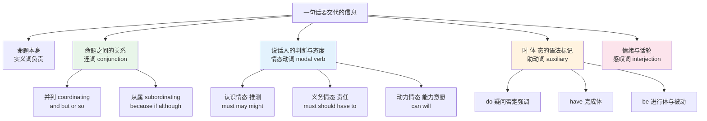
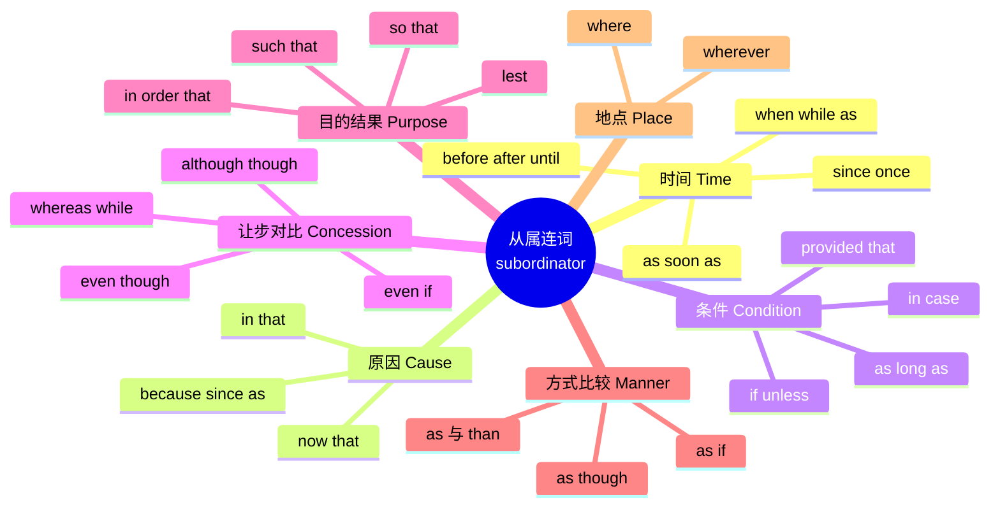
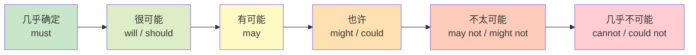
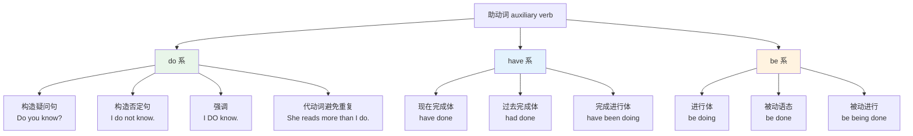
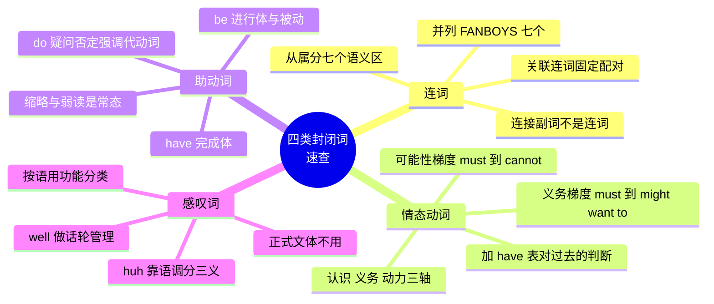

# 连词、情态动词、助动词与感叹词速查

> [!info] 本篇定位
>
> 封闭词类速查的第三篇，收尾本章剩下的四个封闭类：连词、情态动词、助动词、感叹词。加上前两篇的代词、限定词、介词，英语所有封闭词类就齐了。
>
> 这四类词加起来不到一百五十个，学完就再也不会新增。但它们在任何一段英文里的出现密度都极高——一段技术文档里 `if`、`when`、`can`、`must`、`should`、`do`、`have`、`be` 的出现次数，通常比所有专业名词加起来还多。
>
> 本篇只做**词汇视角**的工作：每个词占据语义空间的哪一格、相邻两个词差在哪里、哪些配对是固定的。至于「情态动词后面为什么接动词原形」「从句怎么倒装」这类句法规则，全部链回 `02.英语基础语法/07.助动词与情态动词` 和该教程的从句诸篇，这里不重复。

---

## 1. 本篇导读：四类词各自解决什么问题

这四类词看起来毫不相干，实际上分工很清楚：连词管**命题之间的关系**，情态动词管**说话人对命题的态度**，助动词管**命题的时体态**，感叹词管**说话人当下的情绪与话轮控制**。

上图把一句英文承载的信息拆成了五股。实义词只负责最左边那一股，剩下四股全部由本篇这些词承担。这解释了一个常见困惑：为什么背了几千个名词动词，读技术规范还是会误解意思——`The system may retry the request` 和 `The system must retry the request` 里实义词完全一样，差别全在那一个情态动词上，而这个差别在合规文档里是决定性的。

情态动词的三分（认识、义务、动力）是本篇最重要的一条主线。同一个 `must`，在 `You must submit the form` 里是义务，在 `He must be tired` 里是推测。中文里这两种用法分别对应「必须」和「一定是」，是两个词；英语共用一个形式，只能靠语境分辨。

---

## 2. 并列连词：七个 FANBOYS

英语的纯并列连词只有七个，首字母缩写成 FANBOYS。这七个词把两个语法地位平等的成分接在一起，本身不改变任何一边的结构。

| 英文 | 英式音标 | 美式音标 | 词性 | 中文 | 搭配与说明 |
| --- | --- | --- | --- | --- | --- |
| **for** | /fɔː/ | /fɔːr/ | conj. | 因为 | 只连接分句且必须后置，书面语，口语几乎不用 |
| **and** | /ænd/ | /ænd/ | conj. | 和；然后 | 弱读 /ənd/ 或 /ən/，最高频连词 |
| **nor** | /nɔː/ | /nɔːr/ | conj. | 也不 | 后接倒装：nor did he know |
| **but** | /bʌt/ | /bʌt/ | conj. | 但是 | 弱读 /bət/，转折的默认词 |
| **or** | /ɔː/ | /ɔːr/ | conj. | 或者 | 弱读 /ə/，也用于否定句表「和」 |
| **yet** | /jet/ | /jet/ | conj./adv. | 然而；还 | 转折比 but 更强调「出乎意料」 |
| **so** | /səʊ/ | /soʊ/ | conj. | 所以 | 表结果，口语最常用；正式文体改用 therefore |

### 2.1 三对最容易混的并列连词

**for 与 because。** 两个都表原因，但分工不同。`for` 给出的是**说话人的推断依据**，只能放在主句之后，且带明显的书面色彩；`because` 给出的是**事件的直接原因**，位置自由。

> [!example] for 与 because 的语义差
>
> - She must be at home, **for** the light is on.
>   - 她一定在家，灯亮着呢。（灯亮不是她在家的原因，是我推断的依据）
> - She stayed at home **because** she was ill.
>   - 她待在家里，因为她病了。（生病是待在家的真实原因）
> - ❌ ~~For the light is on, she must be at home.~~（for 不能前置）
> - ✅ **Because** the light is on, she must be at home.

**but 与 yet。** `yet` 作连词时语气比 `but` 重，强调「按常理不该如此」。技术写作里 `yet` 常用于点出反直觉的现象。

> [!example] but 与 yet
>
> - The build passes locally, **but** it fails on CI.
>   - 本地构建通过，但 CI 上失败了。（平铺直叙的转折）
> - The code is simple, **yet** it handles every edge case.
>   - 代码很简单，却处理了所有边界情况。（强调出人意料）

**or 与 nor。** `nor` 用于前一分句已经是否定的情况，且后面必须倒装。中文母语者常写成 `and not`，读起来生硬。

> [!warning] nor 的倒装是强制的
>
> - ❌ ~~He didn't call, nor he came.~~
> - ✅ He didn't call, **nor did he come**.
> - ✅ 也可以拆成两句：He didn't call. **He didn't come either.**
>
> 倒装规则属于语法范畴，详见 `02.英语基础语法` 的倒装篇。词汇上只需记住：**看到 nor 就准备把助动词提前**。

### 2.2 so 的语域问题

`so` 表结果在口语和邮件里完全正常，但在正式论文、规范文档里出现频率显著低于 `therefore`、`thus`、`consequently`。这不是对错问题，是语域问题。

| 语域 | 表「所以」的默认选择 | 例句片段 |
| --- | --- | --- |
| 口语 / 即时消息 | **so** | The server was down, so I retried. |
| 一般书面 | **so** / **therefore** | The test failed; therefore we rolled back. |
| 学术 / 规范 | **thus** / **hence** / **consequently** | The invariant no longer holds; hence the assertion fails. |

完整的语域判据见 `18.语域、英美差异与习语俚语`，本篇只给这三档的默认选项。

---

## 3. 从属连词：按语义分成七个区

从属连词的数量远多于并列连词，但它们的语义高度聚集，按「引导的从句表达什么关系」可以分成七个区。分区之后记忆量骤降——同一区里的词互相之间只差语气和语域。

上图是本节的索引。七个区里最容易出错的是「原因区」和「让步对比区」——`since` 同时属于时间区和原因区，`while` 同时属于时间区和对比区，`as` 三个区都有。这种一词多区的现象在下面各小节里会逐个点明。

### 3.1 时间区

| 英文 | 英式音标 | 美式音标 | 词性 | 中文 | 搭配与说明 |
| --- | --- | --- | --- | --- | --- |
| **when** | /wen/ | /wen/ | conj. | 当……时 | 时间点或时间段都可，最通用 |
| **while** | /waɪl/ | /waɪl/ | conj. | 在……期间 | 强调同时进行，从句多用进行体 |
| **as** | /æz/ | /æz/ | conj. | 随着；一边……一边 | 强调两个动作同步推进 |
| **before** | /bɪˈfɔː/ | /bɪˈfɔːr/ | conj./prep. | 在……之前 | 从句用现在时表将来 |
| **after** | /ˈɑːftə/ | /ˈæftər/ | conj./prep. | 在……之后 | 英美元音差别明显 |
| **until** | /ənˈtɪl/ | /ənˈtɪl/ | conj./prep. | 直到 | 强读 /ʌnˈtɪl/；否定句表「直到……才」 |
| **till** | /tɪl/ | /tɪl/ | conj./prep. | 直到 | until 的口语变体，不是缩写 |
| **since** | /sɪns/ | /sɪns/ | conj./prep. | 自从 | 主句常配完成体；另有原因义 |
| **once** | /wʌns/ | /wʌns/ | conj./adv. | 一旦 | 强调条件性的时间点 |
| **whenever** | /wenˈevə/ | /wenˈevər/ | conj. | 每当；无论何时 | 表反复或不确定时间 |
| **as soon as** | /əz ˈsuːn əz/ | /əz ˈsuːn əz/ | conj. | 一……就…… | 固定短语，不可拆 |
| **by the time** | /baɪ ðə ˈtaɪm/ | /baɪ ðə ˈtaɪm/ | conj. | 到……的时候 | 主句常用完成体 |

> [!warning] till 不是 until 的缩写
>
> 词源上 `till` 比 `until` 更早出现，`un-` 是后加的。`till` 不是从 `until` 掐头来的，所以那个撇号没有任何依据。
>
> - ✅ **until** / **till**（都是完整的词，都对）
> - ❌ ~~'till~~（多一个 l，任何词典都不收）
>
> `'til` 介于两者之间：主流词典把它列为非正式变体，不算错字，但正式写作里没人用。省事的做法是只写 `until` 和 `till` 这两个形式，撇号一概不碰。
>
> 正式文体优先 `until`，句首几乎只用 `until`。

> [!example] while 与 when 的分工
>
> - **While** the tests were running, I reviewed the diff.
>   - 测试跑着的时候，我在审代码。（两件事并行了一段时间）
> - **When** the tests finished, I merged the branch.
>   - 测试跑完时，我合并了分支。（一个瞬时时间点）
> - **As** the load increased, response time grew.
>   - 随着负载上升，响应时间变长。（两个变化同步推进）

### 3.2 原因区

| 英文 | 英式音标 | 美式音标 | 词性 | 中文 | 搭配与说明 |
| --- | --- | --- | --- | --- | --- |
| **because** | /bɪˈkɒz/ | /bɪˈkɔːz/ | conj. | 因为 | 提供新信息的原因，可回答 why |
| **since** | /sɪns/ | /sɪns/ | conj. | 既然 | 原因是双方已知的，多置于句首 |
| **as** | /æz/ | /æz/ | conj. | 由于 | 语气最弱，英式书面更常见 |
| **now that** | /naʊ ðət/ | /naʊ ðət/ | conj. | 既然现在 | 强调新出现的情况带来的后果 |
| **in that** | /ɪn ðət/ | /ɪn ðət/ | conj. | 在于；因为 | 正式，用于补充说明理由 |
| **seeing that** | /ˈsiːɪŋ ðət/ | /ˈsiːɪŋ ðət/ | conj. | 鉴于 | 口语，语气随意 |

三个高频词的分工可以用「这个原因听话人知不知道」来区分：`because` 引出的原因是**新信息**，`since` 和 `as` 引出的原因是**双方已知的背景**。

> [!example] because / since / as 的信息地位
>
> - The deploy failed **because** the certificate had expired.
>   - 部署失败了，因为证书过期。（证书过期是听者刚知道的关键信息）
> - **Since** you're already on the call, could you walk us through it?
>   - 既然你已经在会上了，能给我们讲一下吗？（在会上是双方都知道的）
> - **As** it was late, we postponed the release.
>   - 由于时间已晚，我们推迟了发布。（陈述背景，不强调因果）

`because` 从句本身不是完整句子，写作时不能单独成句。但用来回答 `why` 提问是例外：`Why did it fail?` — `Because the cert expired.` 这里省掉的是问句里已经出现过的主句，属于省略，不是病句。`since` 和 `as` 没有这个用法，不能拿来单独回答 why。

### 3.3 条件区

| 英文 | 英式音标 | 美式音标 | 词性 | 中文 | 搭配与说明 |
| --- | --- | --- | --- | --- | --- |
| **if** | /ɪf/ | /ɪf/ | conj. | 如果 | 条件的默认词，也引导宾语从句表「是否」 |
| **unless** | /ənˈles/ | /ənˈles/ | conj. | 除非 | 语义等于 if...not，但不能用于假设语气 |
| **provided** | /prəˈvaɪdɪd/ | /prəˈvaɪdɪd/ | conj. | 只要；条件是 | 正式，常写作 provided that |
| **providing** | /prəˈvaɪdɪŋ/ | /prəˈvaɪdɪŋ/ | conj. | 只要 | provided 的口语变体 |
| **as long as** | /əz ˈlɒŋ əz/ | /əz ˈlɔːŋ əz/ | conj. | 只要 | 强调条件持续有效 |
| **in case** | /ɪn ˈkeɪs/ | /ɪn ˈkeɪs/ | conj. | 以防 | 表预防，不是「如果」 |
| **supposing** | /səˈpəʊzɪŋ/ | /səˈpoʊzɪŋ/ | conj. | 假如 | 口语，引出假想情境 |
| **whether** | /ˈweðə/ | /ˈweðər/ | conj. | 是否；无论 | whether...or not 固定搭配 |

> [!warning] in case 不等于 if
>
> 这是中文母语者最常错的一组。`in case` 表达的是「预先防范可能发生的事」，动作发生在事情**之前**；`if` 表达的是「事情发生之后才做」。
>
> - Take an umbrella **in case** it rains.
>   - 带把伞，以防下雨。（现在就带，还没下）
> - Take an umbrella **if** it rains.
>   - 如果下雨就带伞。（下了才带）
>
> 换成 `in case of` 后接名词短语时，语义反而靠近 `if`：`In case of fire, use the stairs.` 这个形式英美通用，多见于告示牌。

> [!warning] unless 不能表达假设的否定
>
> `unless` 只能用在「真实条件」里。表示与事实相反的假设时，必须用 `if...not`。
>
> - ✅ I'll go **unless** it rains.（真实条件，等于 if it doesn't rain）
> - ❌ ~~I would have gone unless it had rained.~~
> - ✅ I would have gone **if it hadn't rained**.（虚拟语气只能用 if...not）
>
> 虚拟语气的完整形式变化见 `02.英语基础语法` 的虚拟语气篇。

### 3.4 让步与对比区

| 英文 | 英式音标 | 美式音标 | 词性 | 中文 | 搭配与说明 |
| --- | --- | --- | --- | --- | --- |
| **although** | /ɔːlˈðəʊ/ | /ɔːlˈðoʊ/ | conj. | 虽然 | 只作连词，比 though 正式 |
| **though** | /ðəʊ/ | /ðoʊ/ | conj./adv. | 虽然；不过 | 可作副词后置：It's cold, though. |
| **even though** | /ˈiːvən ðəʊ/ | /ˈiːvən ðoʊ/ | conj. | 尽管 | 事实让步，语气强于 although |
| **even if** | /ˈiːvən ɪf/ | /ˈiːvən ɪf/ | conj. | 即使 | 假设让步，事情未必为真 |
| **whereas** | /weərˈæz/ | /werˈæz/ | conj. | 而；反之 | 纯对比，无让步义，书面 |
| **while** | /waɪl/ | /waɪl/ | conj. | 而；尽管 | 句首时多为对比或让步义 |
| **whilst** | /waɪlst/ | — | conj. | 而；当……时 | 英式书面变体，美式基本不用 |
| **whereby** | /weəˈbaɪ/ | /werˈbaɪ/ | adv. | 凭此 | 正式关系副词，合同与规范常见 |

`even though` 和 `even if` 的差别是本区最实用的一条：前者说的事**是真的**，后者说的事**未必真**。

> [!example] even though 与 even if
>
> - **Even though** the tests passed, we rolled back.
>   - 尽管测试通过了，我们还是回滚了。（测试确实通过了）
> - **Even if** the tests pass, we'll roll back.
>   - 即使测试通过，我们也要回滚。（测试通没通过还不知道）

> [!warning] although 不能和 but 连用
>
> 中文说「虽然……但是……」，两个词都要出现。英语里这两个连接词只能留一个。
>
> - ❌ ~~Although it was late, but we kept working.~~
> - ✅ **Although** it was late, we kept working.
> - ✅ It was late, **but** we kept working.
>
> 同理，`because` 和 `so` 也不能在同一句里同时出现。

### 3.5 目的与结果区

| 英文 | 英式音标 | 美式音标 | 词性 | 中文 | 搭配与说明 |
| --- | --- | --- | --- | --- | --- |
| **so that** | /ˈsəʊ ðət/ | /ˈsoʊ ðət/ | conj. | 以便 | 从句常配 can/could/will/would |
| **in order that** | /ɪn ˈɔːdə ðət/ | /ɪn ˈɔːrdər ðət/ | conj. | 为了 | 比 so that 正式，书面语 |
| **lest** | /lest/ | /lest/ | conj. | 唯恐；免得 | 极正式，从句用虚拟或 should |
| **for fear that** | /fə ˈfɪə ðət/ | /fər ˈfɪr ðət/ | conj. | 唯恐 | lest 的口语替代 |
| **such that** | /ˈsʌtʃ ðət/ | /ˈsʌtʃ ðət/ | conj. | 使得 | 数学与技术写作高频 |

`so that` 既能表目的也能表结果，靠从句里有没有情态动词分辨：带情态动词是目的，不带是结果。

> [!example] so that 的两种读法
>
> - We cached the result **so that** the next call **would** be faster.
>   - 我们缓存了结果，好让下次调用更快。（目的，有 would）
> - We cached the result, **so that** the next call **was** much faster.
>   - 我们缓存了结果，于是下次调用快多了。（结果，无情态动词）

`such that` 在数学、算法和 API 文档里出现频率远高于日常英语：`Find the smallest n such that f(n) > 0.` 这个搭配值得单独记住，它在中文里对应「使得」。

### 3.6 方式与比较区

| 英文 | 英式音标 | 美式音标 | 词性 | 中文 | 搭配与说明 |
| --- | --- | --- | --- | --- | --- |
| **as** | /æz/ | /æz/ | conj. | 像；按照 | as ... as 构成同级比较 |
| **as if** | /əz ˈɪf/ | /əz ˈɪf/ | conj. | 好像 | 后接虚拟或陈述，看真实度 |
| **as though** | /əz ˈðəʊ/ | /əz ˈðoʊ/ | conj. | 好像 | 与 as if 同义，稍正式 |
| **than** | /ðæn/ | /ðæn/ | conj./prep. | 比 | 弱读 /ðən/，比较级专用 |
| **like** | /laɪk/ | /laɪk/ | conj./prep. | 像 | 作连词属口语，正式文体用 as |

> [!warning] like 作连词在正式写作中会被判错
>
> 口语里 `like` 引导从句很常见，但学术与商务写作仍然要求用 `as`。
>
> - 口语：Do it **like** I showed you.
> - 正式：Do it **as** I showed you.
>
> 判断办法：后面跟的是名词短语用 `like`，跟的是完整分句用 `as`。`He works like a machine.`（名词短语）对；`He works as I do.`（分句）对。

### 3.7 地点区

| 英文 | 英式音标 | 美式音标 | 词性 | 中文 | 搭配与说明 |
| --- | --- | --- | --- | --- | --- |
| **where** | /weə/ | /wer/ | conj./adv. | 在……的地方 | 也引导定语从句 |
| **wherever** | /weərˈevə/ | /werˈevər/ | conj. | 无论何处 | 表任意地点 |

地点区只有两个词，是七个区里最小的一区。`where` 在技术文档里有个高频的非地点用法——引出符号定义：`Let T be the timeout, where T > 0.` 这里的 `where` 中文对应「其中」。

---

## 4. 关联连词：八对固定搭配

关联连词成对出现，前后两半是固定配对，不能混搭。这一类的记忆负担全在「哪个配哪个」上。

| 英文 | 英式音标 | 美式音标 | 词性 | 中文 | 搭配与说明 |
| --- | --- | --- | --- | --- | --- |
| **both ... and** | /bəʊθ ... ənd/ | /boʊθ ... ənd/ | conj. | 既……又…… | 谓语一律用复数 |
| **either ... or** | /ˈaɪðə ... ɔː/ | /ˈiːðər ... ɔːr/ | conj. | 要么……要么…… | 英美首元音不同 |
| **neither ... nor** | /ˈnaɪðə ... nɔː/ | /ˈniːðər ... nɔːr/ | conj. | 既不……也不…… | 本身已是否定，不再加 not |
| **not only ... but also** | /nɒt ˈəʊnli/ | /nɑːt ˈoʊnli/ | conj. | 不但……而且…… | not only 置句首时主句倒装 |
| **whether ... or** | /ˈweðə ... ɔː/ | /ˈweðər ... ɔːr/ | conj. | 是……还是…… | 不能用 if 替换 whether |
| **no sooner ... than** | /nəʊ ˈsuːnə ... ðæn/ | /noʊ ˈsuːnər ... ðæn/ | conj. | 一……就…… | 配 than 不配 when，且倒装 |
| **hardly ... when** | /ˈhɑːdli ... wen/ | /ˈhɑːrdli ... wen/ | conj. | 刚一……就…… | 配 when 不配 than |
| **scarcely ... when** | /ˈskeəsli ... wen/ | /ˈskersli ... wen/ | conj. | 几乎刚……就…… | 与 hardly 同型，更书面 |

> [!warning] 最容易搭错的两组
>
> `no sooner` 配 `than`，`hardly` 和 `scarcely` 配 `when`。互换就错。
>
> - ✅ **No sooner** had he arrived **than** the meeting started.
> - ❌ ~~No sooner had he arrived when the meeting started.~~
> - ✅ **Hardly** had he arrived **when** the meeting started.
> - ❌ ~~Hardly had he arrived than the meeting started.~~
>
> 记忆钩子：`sooner` 是比较级，比较级后面天然跟 `than`。

`either` 和 `neither` 的英美读音差异是常被问到的一点：英式首音节读 /aɪ/，美式读 /iː/。两种读法在两边都能听懂，但同一段话里应该保持一致。

> [!tip] not only 置于句首必须倒装
>
> - 常规语序：He **not only** wrote the parser **but also** shipped the docs.
> - 句首倒装：**Not only did he write** the parser, **but** he **also** shipped the docs.
>
> 倒装的具体操作规则在 `02.英语基础语法` 的倒装篇，词汇上只需记住这个触发条件。

---

## 5. 连接副词不是连词

这一节解决一类高频语法错误，而错误的根源是词类归属判断错了。

`however`、`therefore`、`moreover` 这些词看起来在起连接作用，但它们的词类是**副词**，不是连词。副词没有连接两个分句的能力，所以用逗号把两个完整句子连起来会构成粘连句（comma splice）。

| 英文 | 英式音标 | 美式音标 | 词性 | 中文 | 搭配与说明 |
| --- | --- | --- | --- | --- | --- |
| **however** | /haʊˈevə/ | /haʊˈevər/ | adv. | 然而 | 前用分号或句号，后跟逗号 |
| **therefore** | /ˈðeəfɔː/ | /ˈðerfɔːr/ | adv. | 因此 | 正式文体表结果的默认词 |
| **thus** | /ðʌs/ | /ðʌs/ | adv. | 因而 | 学术写作高频，比 so 正式 |
| **hence** | /hens/ | /hens/ | adv. | 由此 | 后可直接接名词短语 |
| **moreover** | /mɔːˈrəʊvə/ | /mɔːrˈoʊvər/ | adv. | 此外 | 追加同向论据 |
| **furthermore** | /ˈfɜːðəmɔː/ | /ˈfɜːrðərmɔːr/ | adv. | 而且 | 与 moreover 近义，更书面 |
| **besides** | /bɪˈsaɪdz/ | /bɪˈsaɪdz/ | adv./prep. | 再说；除……外 | 口语色彩强于 moreover |
| **nevertheless** | /ˌnevəðəˈles/ | /ˌnevərðəˈles/ | adv. | 尽管如此 | 强转折，正式 |
| **nonetheless** | /ˌnʌnðəˈles/ | /ˌnʌnðəˈles/ | adv. | 但仍然 | 与 nevertheless 基本同义 |
| **consequently** | /ˈkɒnsɪkwəntli/ | /ˈkɑːnsəkwentli/ | adv. | 结果 | 强调因果链条 |
| **accordingly** | /əˈkɔːdɪŋli/ | /əˈkɔːrdɪŋli/ | adv. | 相应地 | 强调依据前文做出调整 |
| **otherwise** | /ˈʌðəwaɪz/ | /ˈʌðərwaɪz/ | adv. | 否则 | 隐含一个未说出的条件 |
| **meanwhile** | /ˈmiːnwaɪl/ | /ˈmiːnwaɪl/ | adv. | 与此同时 | 时间上的并行 |
| **instead** | /ɪnˈsted/ | /ɪnˈsted/ | adv. | 相反 | 单独用时不接 of |
| **likewise** | /ˈlaɪkwaɪz/ | /ˈlaɪkwaɪz/ | adv. | 同样地 | 表类比 |

> [!warning] 逗号粘连是中文母语者的重灾区
>
> 中文的逗号可以连接任意多个分句，英语不行。
>
> - ❌ ~~The test failed, however, we shipped anyway.~~
> - ✅ The test failed**;** however, we shipped anyway.（分号）
> - ✅ The test failed. **However,** we shipped anyway.（句号另起）
> - ✅ The test failed, **but** we shipped anyway.（换成真连词）
>
> 判断口诀：`however` 前面要么句号要么分号，绝不能只有逗号。同一条规则适用于上表所有十五个词。

### 5.1 三类连接手段的对照

| 类别 | 词类 | 能否单独连接两个分句 | 标点 | 代表词 |
| --- | --- | --- | --- | --- |
| 并列连词 | conjunction | 能 | 前面用逗号 | and, but, so, or |
| 从属连词 | conjunction | 能（把一句降为从句） | 从句在前时后加逗号 | because, although, if |
| 连接副词 | adverb | 不能 | 前面用分号或句号 | however, therefore |

这张表是本节的全部内容。判断一个连接词属于哪一类，直接决定该用什么标点。

---

## 6. 情态动词总表

英语的核心情态动词有九个，加上边缘成员共十二个左右。它们的共同形态特征是：第三人称单数不加 -s，没有不定式和分词形式，后面直接接动词原形。

| 英文 | 英式音标 | 美式音标 | 词性 | 中文 | 搭配与说明 |
| --- | --- | --- | --- | --- | --- |
| **can** | /kæn/ | /kæn/ | modal | 能；可以 | 弱读 /kən/；否定 can't |
| **could** | /kʊd/ | /kʊd/ | modal | 能（过去）；可能 | can 的过去式，也表委婉 |
| **may** | /meɪ/ | /meɪ/ | modal | 可以；可能 | 许可义偏正式 |
| **might** | /maɪt/ | /maɪt/ | modal | 也许 | 可能性低于 may |
| **must** | /mʌst/ | /mʌst/ | modal | 必须；一定是 | 义务与推测两义共形 |
| **shall** | /ʃæl/ | /ʃæl/ | modal | 将；应当 | 英式征询意见；法律文本表义务 |
| **should** | /ʃʊd/ | /ʃʊd/ | modal | 应该 | 建议与推测两义 |
| **will** | /wɪl/ | /wɪl/ | modal | 将；愿意 | 弱读 /wəl/；缩写 'll |
| **would** | /wʊd/ | /wʊd/ | modal | 会；愿意 | 缩写 'd；表委婉与习惯 |
| **ought to** | /ˈɔːt tə/ | /ˈɔːt tə/ | modal | 应该 | 唯一带 to 的情态动词 |
| **need** | /niːd/ | /niːd/ | modal/v. | 需要 | 情态用法只见于否定与疑问 |
| **dare** | /deə/ | /der/ | modal/v. | 敢 | 情态用法多见于 dare not |

### 6.1 情态动词的三条语义轴

同一个情态动词在不同句子里可以落在不同的轴上。这是情态动词最难的地方，也是必须先分清的地方。

| 语义类型 | 英文术语 | 说话人在做什么 | 例句 |
| --- | --- | --- | --- |
| 认识情态 | epistemic | 判断一件事有多可能为真 | He **must** be tired.（一定是累了） |
| 义务情态 | deontic | 施加或解除责任与许可 | You **must** sign here.（必须签） |
| 动力情态 | dynamic | 陈述主语本身的能力或意愿 | She **can** swim.（会游泳） |

> [!tip] 快速判断落在哪条轴上
>
> 看情态动词后面的动词是**状态**还是**动作**，再看主语是不是有意志的行为者。
>
> - `must` + be / seem / know 这类状态动词 → 多半是认识情态（推测）
> - `must` + 及物动作动词 + 第二人称主语 → 多半是义务情态（要求）
>
> `He must know the answer.` 是「他一定知道答案」，不是「他必须知道答案」。

---

## 7. 可能性梯度：从几乎确定到几乎不可能

认识情态最实用的成果是一条梯度。同一件事，换一个情态动词，说话人承诺的确定程度就变了。技术文档、合规条款、代码注释里的措辞轻重，全靠这条梯度调节。

上图从左到右是确定程度递减。要注意梯度的两端不对称：肯定端的最高位是 `must`，否定端的最低位却不是 `must not`，而是 `cannot`。`He must not be at home` 在标准英语里读作「他不许在家」，表达「他不可能在家」必须用 `He can't be at home`。这一条是中文母语者最容易踩的坑。

| 英文 | 英式音标 | 美式音标 | 词性 | 中文 | 搭配与说明 |
| --- | --- | --- | --- | --- | --- |
| **must be** | /məst ˈbiː/ | /məst ˈbiː/ | modal | 一定是 | 有依据的强推断 |
| **will be** | /wɪl ˈbiː/ | /wɪl ˈbiː/ | modal | 想必是 | 基于常识的推断，非将来时 |
| **should be** | /ʃəd ˈbiː/ | /ʃəd ˈbiː/ | modal | 应该是 | 预期如此，留有余地 |
| **may be** | /meɪ ˈbiː/ | /meɪ ˈbiː/ | modal | 可能是 | 中性可能性，两字分写 |
| **might be** | /maɪt ˈbiː/ | /maɪt ˈbiː/ | modal | 也许是 | 比 may 更不确定 |
| **could be** | /kʊd ˈbiː/ | /kʊd ˈbiː/ | modal | 有可能是 | 强调理论上的可能性 |
| **can't be** | /kɑːnt ˈbiː/ | /kænt ˈbiː/ | modal | 不可能是 | 否定端的最强推断 |
| **couldn't be** | /ˈkʊdnt ˈbiː/ | /ˈkʊdnt ˈbiː/ | modal | 不可能是 | 比 can't 稍缓和 |

> [!warning] must not 与 cannot 的分工
>
> - ✅ He **can't** be at home; his car is gone.
>   - 他不可能在家，车都不在。（推测的否定）
> - ✅ You **must not** enter without a badge.
>   - 没有证件不得入内。（禁止）
> - ❌ ~~He must not be at home; his car is gone.~~
>
> 一句话总结：**推测的否定用 can't，禁止用 mustn't**。

> [!warning] maybe 与 may be 是两个东西
>
> - **maybe** /ˈmeɪbi/ 是副词，等于 perhaps，通常放句首。
> - **may be** 是情态动词加系动词，中间是可以插词的。
>
> - ✅ **Maybe** he is right.
> - ✅ He **may be** right.
> - ❌ ~~Maybe he right.~~ / ~~He maybe right.~~

### 7.1 will 表推测不是表将来

`will` 在中文教材里几乎总被讲成将来时标记，但它有一个高频的推测用法，指的是**现在**。

> [!example] will 的推测用法
>
> - That **will** be the courier at the door.
>   - 门口那位想必是快递员。（说的是此刻，不是将来）
> - Don't call him now — he **will** be asleep.
>   - 别现在打给他，他这会儿准是睡了。
> - The build takes ten minutes, so it **will** still be running.
>   - 构建要十分钟，所以现在应该还在跑。

这个用法在英式口语里尤其常见。判断依据是：句子里有没有指向将来的时间状语，没有就要考虑推测义。

---

## 8. 义务与建议梯度

义务情态是另一条独立梯度，从「强制」到「随便你」。技术规范里对 MUST、SHOULD、MAY 的定义（见 RFC 2119）就是把这条梯度形式化了，这也是程序员最该熟练掌握的一组。

| 英文 | 英式音标 | 美式音标 | 词性 | 中文 | 搭配与说明 |
| --- | --- | --- | --- | --- | --- |
| **must** | /mʌst/ | /mʌst/ | modal | 必须 | 义务来自说话人自身权威 |
| **have to** | /ˈhæf tə/ | /ˈhæf tə/ | semi-modal | 不得不 | 义务来自外部规定或客观情况 |
| **have got to** | /həv ˈɡɒt tə/ | /həv ˈɡɑːt tə/ | semi-modal | 得 | 口语，缩略成 gotta |
| **shall** | /ʃæl/ | /ʃæl/ | modal | 应当 | 法律与合同文本里表强制义务 |
| **should** | /ʃʊd/ | /ʃʊd/ | modal | 应该 | 建议，留有不遵守的余地 |
| **ought to** | /ˈɔːt tə/ | /ˈɔːt tə/ | modal | 理应 | 与 should 近义，隐含客观准则 |
| **had better** | /həd ˈbetə/ | /həd ˈbetər/ | semi-modal | 最好 | 隐含不照做会有后果，语气偏重 |
| **be supposed to** | /bi səˈpəʊzd tə/ | /bi səˈpoʊzd tə/ | semi-modal | 本该 | 强调外部期待，常暗示没做到 |
| **might want to** | /maɪt ˈwɒnt tə/ | /maɪt ˈwɑːnt tə/ | phrase | 或许可以 | 最委婉的建议，英美职场常用 |

### 8.1 must 与 have to 的分工

这两个词的中文都是「必须」，英语里的区别在于**义务的来源**。

> [!example] 义务来自谁
>
> - You **must** finish this before you leave.
>   - 你走之前必须弄完。（我要求你的）
> - I **have to** finish this before I leave.
>   - 我走之前得弄完。（规定/情况逼的）
> - Employees **must** wear a badge at all times.
>   - 员工须全程佩戴工牌。（规章本身在说话，正式文告用 must）

在美式口语里 `have to` 的使用频率明显高于 `must`，`must` 听起来偏正式甚至有点强硬。写邮件给同事时用 `Could you...` 或 `You might want to...` 比 `You must...` 得体得多。

### 8.2 否定端的陷阱：mustn't 与 don't have to

肯定端 `must` 和 `have to` 意思接近，否定端却完全相反。这是本篇最重要的一条辨析。

| 形式 | 中文 | 含义 |
| --- | --- | --- |
| **must** | 必须做 | 有义务 |
| **have to** | 必须做 | 有义务 |
| **mustn't** | 不许做 | 义务是「不做」，即禁止 |
| **don't have to** | 不必做 | 没有义务，做不做都行 |

> [!warning] 把 mustn't 当成 don't have to 会造成严重误解
>
> - You **mustn't** tell him.
>   - 你不许告诉他。（禁止）
> - You **don't have to** tell him.
>   - 你不用告诉他。（可以不说，也可以说）
>
> 中文的「不必」和「不许」是两个词，英语里靠这两个结构区分。写规范文档时选错，含义会完全反过来。

`needn't` 与 `don't need to` 都等于 `don't have to`，都表示「不必」，不表示禁止。

### 8.3 had better 的语气比想象中重

很多学习者把 `had better` 当成温和建议，实际上它隐含「不这么做会有麻烦」，对上级或客户使用会显得失礼。

> [!example] 建议语气从重到轻
>
> - You **must** update the dependency.
>   - 你必须升级这个依赖。（命令）
> - You'**d better** update the dependency.
>   - 你最好升级这个依赖。（警告，不升级会出事）
> - You **should** update the dependency.
>   - 你应该升级这个依赖。（中性建议）
> - You **might want to** update the dependency.
>   - 你或许可以升级一下这个依赖。（最委婉）

`had better` 的缩写形式是 `'d better`，口语里 `had` 常被完全吞掉说成 `You better...`，属于非正式用法，书面不要写。

---

## 9. 情态动词加完成式：对过去的判断

情态动词本身没有过去形式来表达「对过去的推测」，这个功能由「情态动词 + have + 过去分词」承担。这组结构的形式—语义配对是固定的，值得整表背下来。

| 英文 | 英式音标 | 美式音标 | 词性 | 中文 | 搭配与说明 |
| --- | --- | --- | --- | --- | --- |
| **must have done** | /məst əv/ | /məst əv/ | phrase | 当时一定…… | 对过去的强推断 |
| **can't have done** | /kɑːnt əv/ | /kænt əv/ | phrase | 当时不可能…… | must have 的否定 |
| **may have done** | /meɪ əv/ | /meɪ əv/ | phrase | 当时可能…… | 中性推测 |
| **might have done** | /maɪt əv/ | /maɪt əv/ | phrase | 当时也许…… | 可能性更低 |
| **could have done** | /kʊd əv/ | /kʊd əv/ | phrase | 本来能…… | 有能力但没做，或表推测 |
| **should have done** | /ʃəd əv/ | /ʃəd əv/ | phrase | 本该…… | 该做而没做，带责备 |
| **ought to have done** | /ˈɔːt tə əv/ | /ˈɔːt tə əv/ | phrase | 本理应…… | should have 的正式版 |
| **would have done** | /wəd əv/ | /wəd əv/ | phrase | 本来会…… | 虚拟语气主句 |
| **needn't have done** | /ˈniːdnt əv/ | /ˈniːdnt əv/ | phrase | 本来不必…… | 做了，但其实没必要 |

> [!warning] needn't have done 与 didn't need to do
>
> 这两个形式看起来只差时态，含义差一整件事。
>
> - I **needn't have** bought milk — there were two bottles in the fridge.
>   - 我本来不用买牛奶的，冰箱里还有两瓶。（**买了**，白买）
> - I **didn't need to** buy milk, so I skipped the shop.
>   - 我不需要买牛奶，就没进店。（**没买**）
>
> 前者事情做了，后者事情没做。

> [!tip] have 在这组结构里几乎总是弱读成 /əv/
>
> 口语中 `must have` 听起来像 `musta`，`should have` 像 `shoulda`，`could have` 像 `coulda`。
>
> 这直接导致了英语母语者最常见的拼写错误之一：把 `should have` 写成 `should of`。
>
> - ❌ ~~I should of known.~~
> - ✅ I **should have** known. / I **should've** known.
>
> 听力上要建立 /əv/ 与 `have` 的对应，否则整句会听漏。

---

## 10. 半情态与情态短语

半情态动词（semi-modal）介于情态动词和实义动词之间：语义上表情态，形态上却像普通动词，有时态变化、能带不定式。

| 英文 | 英式音标 | 美式音标 | 词性 | 中文 | 搭配与说明 |
| --- | --- | --- | --- | --- | --- |
| **be able to** | /bi ˈeɪbl tə/ | /bi ˈeɪbl tə/ | semi-modal | 能够 | 补 can 缺失的不定式与完成形式 |
| **be going to** | /bi ˈɡəʊɪŋ tə/ | /bi ˈɡoʊɪŋ tə/ | semi-modal | 打算；即将 | 口语缩略成 gonna |
| **be about to** | /bi əˈbaʊt tə/ | /bi əˈbaʊt tə/ | semi-modal | 正要 | 极近的将来 |
| **be to** | /bi tə/ | /bi tə/ | semi-modal | 将要；须 | 正式，新闻标题与公文常见 |
| **used to** | /ˈjuːst tə/ | /ˈjuːst tə/ | semi-modal | 过去常常 | 只有过去形式，s 读清音 |
| **would rather** | /wəd ˈrɑːðə/ | /wəd ˈræðər/ | semi-modal | 宁愿 | 后接原形；rather 英美元音不同 |
| **had better** | /həd ˈbetə/ | /həd ˈbetər/ | semi-modal | 最好 | 后接原形，不加 to |
| **be supposed to** | /bi səˈpəʊzd tə/ | /bi səˈpoʊzd tə/ | semi-modal | 本应 | 常暗示实际没做到 |
| **be likely to** | /bi ˈlaɪkli tə/ | /bi ˈlaɪkli tə/ | phrase | 有可能 | 书面里替代 may/might |
| **be bound to** | /bi ˈbaʊnd tə/ | /bi ˈbaʊnd tə/ | phrase | 必然会 | 强调不可避免 |

### 10.1 used to 家族的三个形式

三个长得几乎一样的结构，意思完全不同。这是词汇层面最值得单独拎出来讲的一组。

| 结构 | 读音 | 中文 | 后接 | 例句 |
| --- | --- | --- | --- | --- |
| **used to** + 原形 | /ˈjuːst tə/ | 过去常常（现在不了） | 动词原形 | I **used to** commute by train. |
| **be used to** + 动名词 | /ˈjuːst tə/ | 习惯于 | 名词或 -ing | I'**m used to** working late. |
| **get used to** + 动名词 | /ˈjuːst tə/ | 逐渐习惯 | 名词或 -ing | You'll **get used to** the noise. |
| **use** + 名词 | /juːz/ | 使用 | 名词 | We **use** Postgres. |

> [!warning] used to 的三个坑
>
> 第一个坑是**读音**：`used to` 里的 s 读清音 /s/，和动词 `use` /juːz/ 的浊音不同。
>
> 第二个坑是**接什么**：`used to do` 接原形，`be used to doing` 接动名词。这两个只差一个 be 动词，意思天差地别。
>
> - I **used to** work here.（我以前在这儿工作，现在不了）
> - I **am used to** working here.（我习惯在这儿工作了）
>
> 第三个坑是**否定与疑问**：口语用 `didn't use to`（use 不带 d），书面也接受 `used not to`。
>
> - ✅ I **didn't use to** like coffee.
> - ✅ I **used not to** like coffee.（英式书面）

### 10.2 can 与 be able to 的分工

`can` 没有不定式、没有分词、没有完成形式，这些缺口全靠 `be able to` 补。

| 需要表达 | can 能不能 | 正确写法 |
| --- | --- | --- |
| 现在能力 | 能 | I **can** read Japanese. |
| 过去一般能力 | 能 | I **could** read Japanese at ten. |
| 过去某次成功做到 | 不能 | I **was able to** fix it yesterday. |
| 将来能力 | 不能 | I'**ll be able to** join after five. |
| 完成体 | 不能 | I'**ve been able to** reproduce it. |
| 不定式 | 不能 | I want **to be able to** debug this. |

> [!warning] could 不表示「过去某一次做成了」
>
> `could` 表达的是「过去具备某种能力」这个持续状态，不表达「某一次具体行动成功了」。
>
> - ❌ ~~The build broke, but I could fix it in ten minutes.~~
> - ✅ The build broke, but I **was able to** fix it in ten minutes.
> - ✅ 否定句里 couldn't 可以表单次：I **couldn't** fix it in time.（否定不受此限）

---

## 11. 助动词 do / have / be 的功能分工

英语只有三个真正的助动词，各自承担的语法功能互不重叠。搞清这张分工图，疑问句、否定句、完成体、进行体、被动语态的构造逻辑就统一了。

上图的三条支线是互相独立的：`do` 只在句子里没有其他助动词时才出现，`have` 专管完成，`be` 专管进行和被动。三者可以叠加使用，叠加顺序固定为「情态 → have → be(进行) → be(被动)」，例如 `The file may have been being processed` 就是全部四层同时出现的极端形式（实际写作里罕见，但结构合法）。

| 英文 | 英式音标 | 美式音标 | 词性 | 中文 | 搭配与说明 |
| --- | --- | --- | --- | --- | --- |
| **do** | /duː/ | /duː/ | aux./v. | 助动词；做 | 弱读 /də/；第三人称 does |
| **does** | /dʌz/ | /dʌz/ | aux./v. | do 的三单 | 弱读 /dəz/ |
| **did** | /dɪd/ | /dɪd/ | aux./v. | do 的过去式 | 后面主动词回原形 |
| **have** | /hæv/ | /hæv/ | aux./v. | 助动词；有 | 弱读 /həv/ 或 /əv/ |
| **has** | /hæz/ | /hæz/ | aux./v. | have 的三单 | 弱读 /həz/ 或 /əz/ |
| **had** | /hæd/ | /hæd/ | aux./v. | have 的过去式 | 弱读 /həd/ 或 /əd/ |
| **be** | /biː/ | /biː/ | aux./v. | 是；被 | 原形，用于情态动词之后 |
| **am** | /æm/ | /æm/ | aux./v. | 是（我） | 弱读 /əm/ |
| **is** | /ɪz/ | /ɪz/ | aux./v. | 是（三单） | 缩写 's |
| **are** | /ɑː/ | /ɑːr/ | aux./v. | 是（复数） | 弱读 /ə/ 或 /ər/ |
| **was** | /wɒz/ | /wɑːz/ | aux./v. | 是（过去单数） | 弱读 /wəz/ |
| **were** | /wɜː/ | /wɜːr/ | aux./v. | 是（过去复数） | 弱读 /wə/ 或 /wər/ |
| **been** | /biːn/ | /bɪn/ | aux./v. | be 的过去分词 | 英美读音不同 |
| **being** | /ˈbiːɪŋ/ | /ˈbiːɪŋ/ | aux./v. | be 的现在分词 | 用于被动进行 |

### 11.1 do 的四个用途

`do` 是三个助动词里最特殊的：另外两个有明确的语义贡献（完成、进行、被动），`do` 纯粹是**语法占位**——句子需要一个助动词来做倒装或承接 not，而句中又没有别的助动词时，`do` 才被临时召来。

> [!example] do 的四种出场
>
> - **Do** you have the log file?
>   - 你有日志文件吗？（构造疑问，因为句中没有其他助动词）
> - I **don't** have the log file.
>   - 我没有日志文件。（承接否定词）
> - I **did** send it — check your spam folder.
>   - 我确实发了，看看垃圾箱。（强调，重读 did）
> - She writes cleaner code than I **do**.
>   - 她的代码比我写得干净。（代动词，替代 write code）

`do` 作强调用法时必须重读，且主动词回原形。这个用法在书面里可以标记争议点，口语里则用来反驳对方的假设。

> [!warning] 已有助动词时不能再加 do
>
> - ❌ ~~Do you can help me?~~
> - ✅ **Can** you help me?（can 本身就是助动词，直接倒装）
> - ❌ ~~She doesn't has finished.~~
> - ✅ She **hasn't** finished.（has 本身就是助动词）

### 11.2 have 与 be 的双重身份

`have` 和 `be` 既可以当助动词，也可以当实义动词。判断办法是看后面跟的是什么。

| 词 | 助动词用法 | 实义动词用法 |
| --- | --- | --- |
| **have** | have + 过去分词：I **have finished**. | have + 名词：I **have** two monitors. |
| **be** | be + 现在分词/过去分词：It **is running**. / It **was deleted**. | be + 名词/形容词：It **is** a bug. |

这个区别有实际后果：作助动词时 `have` 可以直接倒装成疑问句（`Have you finished?`）；作实义动词时，`Do you have a minute?` 是英美通用的现代说法，`Have you a minute?` 属于偏旧的英式书面用法，今天已经很少见。英式口语里还有第三种 `Have you got a minute?`，用的是 `have got` 这个半情态形式。

---

## 12. 缩略与弱读形式速查

情态动词和助动词在自然语流里几乎从不重读，缩略与弱读是它们的常态。听力上分辨不出这些形式，整句的时态和情态信息就全丢了。

| 完整形式 | 缩略形式 | 英式音标 | 美式音标 | 说明 |
| --- | --- | --- | --- | --- |
| is not | **isn't** | /ˈɪznt/ | /ˈɪznt/ | — |
| are not | **aren't** | /ɑːnt/ | /ɑːrnt/ | — |
| was not | **wasn't** | /ˈwɒznt/ | /ˈwɑːznt/ | — |
| were not | **weren't** | /wɜːnt/ | /wɜːrnt/ | — |
| do not | **don't** | /dəʊnt/ | /doʊnt/ | — |
| does not | **doesn't** | /ˈdʌznt/ | /ˈdʌznt/ | — |
| did not | **didn't** | /ˈdɪdnt/ | /ˈdɪdnt/ | — |
| have not | **haven't** | /ˈhævnt/ | /ˈhævnt/ | — |
| has not | **hasn't** | /ˈhæznt/ | /ˈhæznt/ | — |
| had not | **hadn't** | /ˈhædnt/ | /ˈhædnt/ | — |
| cannot | **can't** | /kɑːnt/ | /kænt/ | 英美元音差别最大的一对 |
| could not | **couldn't** | /ˈkʊdnt/ | /ˈkʊdnt/ | — |
| will not | **won't** | /wəʊnt/ | /woʊnt/ | 拼写不规则，不是 willn't |
| would not | **wouldn't** | /ˈwʊdnt/ | /ˈwʊdnt/ | — |
| shall not | **shan't** | /ʃɑːnt/ | — | 英式，美式几乎不用 |
| should not | **shouldn't** | /ˈʃʊdnt/ | /ˈʃʊdnt/ | — |
| must not | **mustn't** | /ˈmʌsnt/ | /ˈmʌsnt/ | 中间的 t 不发音 |
| need not | **needn't** | /ˈniːdnt/ | /ˈniːdnt/ | — |
| ought not | **oughtn't** | /ˈɔːtnt/ | /ˈɔːtnt/ | 少见 |

> [!warning] can't 的英美差异
>
> 英式 /kɑːnt/ 与美式 /kænt/ 元音完全不同，而且美式的 `can't` 与 `can` 在快速语流里只差一个鼻化和轻微的停顿，非常难分辨。
>
> 实用办法：听句子的**重音**。`can` 通常弱读成 /kən/ 不带重音，`can't` 一定带重音。听到重读的 /kæn(t)/ 就按否定理解。

### 12.1 撇号后面那个字母的三种展开

`'d` 和 `'s` 各自对应多个完整形式，靠后面跟什么来还原。

| 缩略 | 可能的展开 | 判断依据 | 例句 |
| --- | --- | --- | --- |
| **'d** | had | 后接过去分词 | He'**d** finished. → had |
| **'d** | would | 后接动词原形 | He'**d** finish. → would |
| **'s** | is | 后接现在分词或形容词 | It'**s** running. → is |
| **'s** | has | 后接过去分词 | It'**s** crashed. → has |
| **'s** | us | 只在 let's 里 | **Let's** go. → let us |
| **'s** | 所有格 | 接在名词后 | the **server's** log |

> [!tip] 'd better 里的 'd 是 had
>
> `You'd better check` 展开是 `You had better check`，不是 would。这是 `had better` 这个半情态短语的固定形式，与时态无关——说的是现在的建议。

---

## 13. 感叹词：按语用功能分类

感叹词不参与句法结构，它们独立于句子之外，传达说话人此刻的情绪或控制对话进程。词汇视角要解决的问题是：什么情境下用哪一个。

| 英文 | 英式音标 | 美式音标 | 词性 | 中文 | 搭配与说明 |
| --- | --- | --- | --- | --- | --- |
| **ouch** | /aʊtʃ/ | /aʊtʃ/ | interj. | 哎哟 | 突发疼痛，也可比喻代价高 |
| **ow** | /aʊ/ | /aʊ/ | interj. | 哎哟 | ouch 的短形式 |
| **oops** | /ʊps/ | /uːps/ | interj. | 哎呀 | 自己犯了小错，带自嘲 |
| **whoops** | /wʊps/ | /wuːps/ | interj. | 哎呀 | oops 的变体 |
| **uh-oh** | /ˈʌ.əʊ/ | /ˈʌ.oʊ/ | interj. | 糟了 | 意识到麻烦要来 |
| **huh** | /hʌ/ | /hʌ/ | interj. | 啊？；嗯？ | 没听清或表意外，升调 |
| **hmm** | /hm/ | /hm/ | interj. | 唔 | 思考中，暂不表态 |
| **uh-huh** | /ʌˈhʌ/ | /ʌˈhʌ/ | interj. | 嗯嗯 | 表示在听并同意 |
| **uh-uh** | /ˈʌʌ/ | /ˈʌʌ/ | interj. | 不 | 否定，与 uh-huh 只差语调 |
| **um** | /əm/ | /əm/ | interj. | 呃 | 填充停顿，思考措辞 |
| **er** | /ɜː/ | — | interj. | 呃 | um 的英式变体 |
| **uh** | — | /ʌ/ | interj. | 呃 | um 的美式变体 |
| **well** | /wel/ | /wel/ | interj. | 那个；嗯 | 话轮起始，功能极多见下节 |
| **oh** | /əʊ/ | /oʊ/ | interj. | 哦 | 接收新信息，语调决定情绪 |
| **ah** | /ɑː/ | /ɑː/ | interj. | 啊 | 恍然大悟或满足 |
| **aha** | /ɑːˈhɑː/ | /ɑːˈhɑː/ | interj. | 原来如此 | 想通了 |
| **wow** | /waʊ/ | /waʊ/ | interj. | 哇 | 惊叹，正负面皆可 |
| **whoa** | /wəʊ/ | /woʊ/ | interj. | 慢着 | 叫停或表震惊 |
| **yikes** | /jaɪks/ | /jaɪks/ | interj. | 我的天 | 惊吓，带轻松语气 |
| **ugh** | /ʌɡ/ | /ʌɡ/ | interj. | 呃啊 | 厌恶或疲惫 |
| **ew** | /juː/ | /juː/ | interj. | 恶心 | 生理性厌恶，偏年轻口语 |
| **yuck** | /jʌk/ | /jʌk/ | interj. | 真恶心 | 与 ew 同义，稍儿童化 |
| **phew** | /fjuː/ | /fjuː/ | interj. | 呼 | 松了口气 |
| **shh** | /ʃː/ | /ʃː/ | interj. | 嘘 | 要求安静 |
| **ahem** | /əˈhem/ | /əˈhem/ | interj. | 咳咳 | 清嗓子引起注意或表不满 |
| **hey** | /heɪ/ | /heɪ/ | interj. | 嘿 | 呼唤或抗议 |
| **oi** | /ɔɪ/ | — | interj. | 喂 | 英式，粗率的呼唤 |
| **yay** | /jeɪ/ | /jeɪ/ | interj. | 太好了 | 欢呼 |
| **hooray** | /huˈreɪ/ | /huˈreɪ/ | interj. | 万岁 | 正式一点的欢呼 |
| **bravo** | /ˌbrɑːˈvəʊ/ | /ˈbrɑːvoʊ/ | interj. | 好啊 | 表演结束时喝彩 |
| **alas** | /əˈlæs/ | /əˈlæs/ | interj. | 唉 | 古雅，现代多用于反讽 |
| **gosh** | /ɡɒʃ/ | /ɡɑːʃ/ | interj. | 天哪 | God 的委婉替代 |
| **gee** | /dʒiː/ | /dʒiː/ | interj. | 哎呀 | 美式，略显过时 |
| **darn** | /dɑːn/ | /dɑːrn/ | interj. | 该死 | damn 的委婉替代 |
| **yeah** | /jeə/ | /jeə/ | interj. | 是啊 | yes 的口语形式 |
| **yep** | /jep/ | /jep/ | interj. | 对 | 干脆的肯定 |
| **nope** | /nəʊp/ | /noʊp/ | interj. | 不 | 干脆的否定 |
| **nah** | /nɑː/ | /nɑː/ | interj. | 不了 | 随意的拒绝 |
| **cheers** | /tʃɪəz/ | /tʃɪrz/ | interj. | 干杯；谢了 | 英式常用作「谢谢」和「再见」 |

### 13.1 按功能重新排布

上表按发音排列不便使用，按语用功能重排后才是真正的速查表。

| 语用功能 | 常用词 | 什么时候用 |
| --- | --- | --- |
| 疼痛 | ouch, ow | 被烫到、撞到的瞬间 |
| 自己失误 | oops, whoops | 打翻杯子、发错消息 |
| 预感出事 | uh-oh | 看到红色告警、听到异响 |
| 没听清 | huh, sorry, pardon | huh 最随意，pardon 最礼貌 |
| 思考中 | hmm, um, er, uh | 需要几秒组织语言 |
| 在听并同意 | uh-huh, mhm, right | 电话里维持对话 |
| 恍然大悟 | ah, aha, oh | 理解了对方的解释 |
| 惊叹 | wow, whoa, yikes | wow 中性，yikes 偏负面 |
| 厌恶 | ugh, ew, yuck | ugh 可指抽象的烦，ew 多指具体的脏 |
| 放松 | phew | 危机解除之后 |
| 要求安静 | shh | 图书馆、会议中 |
| 引起注意 | hey, ahem, excuse me | hey 随意，excuse me 正式 |
| 欢呼 | yay, hooray, bravo | yay 日常，bravo 限于表演场合 |
| 起始话轮 | well, so, right, okay | 见下节 |

### 13.2 well 的四种语用功能

`well` 是所有感叹词里功能最杂的一个，也是中文母语者最容易漏掉的一个。它在句首时几乎不表达「好」的意思，而是在做话轮管理。

> [!example] well 的四种用法
>
> - **Well**, I'm not sure that's the root cause.
>   - 这个嘛，我不太确定那是根因。（缓和不同意，避免直接反驳）
> - **Well**, where do I start...
>   - 嗯，从哪儿说起呢……（争取思考时间）
> - So we ran the migration, and **well**, it deleted half the rows.
>   - 我们跑了迁移，然后呢，它删了一半的行。（预示接下来是坏消息）
> - A: Did you fix it? B: **Well**, sort of.
>   - 修好了吗？——算是吧。（回答不完全肯定时的缓冲）

四种用法的共同点是「我接下来要说的东西不完全是你期待的」。中文母语者说英语时习惯直接给答案，缺了这层缓冲会显得生硬。在职场英语里，`Well` 加上后面半句委婉表达，比直接说 `No` 有效得多。

### 13.3 huh 的三种语调

`huh` 在书面上只有一种拼法，口语里靠语调区分三种完全不同的意思。

| 语调 | 含义 | 情境 |
| --- | --- | --- |
| 升调 ↗ | 没听清，请重复 | Huh? Could you say that again? |
| 降调 ↘ | 表示惊讶或不屑 | Huh. I didn't expect that. |
| 平调 + 句末 | 反问求认同 | Pretty neat, huh? |

> [!warning] huh 在正式场合不能用
>
> 用 `huh` 请对方重复，在朋友之间正常，对客户或上级则显得粗率。正式场合按礼貌度递增依次是：
>
> - `Sorry?`（英式常用）
> - `Pardon?` / `Excuse me?`（美式常用）
> - `I'm sorry, could you repeat that?`（最正式）
>
> ❌ ~~What?~~ 单说也偏冲，配合语调才不失礼。

### 13.4 感叹词的书写形式不稳定

感叹词大多来自口语拟声，书面拼法没有完全固定下来，词典之间也不一致。

| 常见词 | 主要变体 | 说明 |
| --- | --- | --- |
| **hmm** | hm, hmmm | m 的数量表示思考时长 |
| **shh** | sh, shhh | 同上 |
| **oops** | whoops, woops | oops 最常见 |
| **ugh** | urgh, ergh | ugh 最常见 |
| **yeah** | yeh, ya | yeah 最标准 |
| **uh-huh** | mhm, mm-hmm | 连字符位置各家不同 |

写作时选最常见的形式即可，不必纠结变体。技术文档和正式邮件里则应当避免使用感叹词，它们属于口语语域。

---

## 14. 中文母语者高频错误清单

把前面各节的坑集中成一张表，作为交付前自查清单。

| 错误写法 | 正确写法 | 根因 |
| --- | --- | --- |
| ~~Although it rained, but we went.~~ | Although it rained, we went. | 中文「虽然……但是」双标记，英语只留一个 |
| ~~Because I was late, so I ran.~~ | Because I was late, I ran. | 同上，因果也只留一个连接词 |
| ~~He must not be home, his car is gone.~~ | He **can't** be home... | 推测的否定用 can't，不用 mustn't |
| ~~You mustn't come if you're busy.~~ | You **don't have to** come... | 「不必」是 don't have to，mustn't 是禁止 |
| ~~The test failed, however we shipped.~~ | The test failed**;** however, we shipped. | however 是副词，不能单靠逗号连句 |
| ~~I should of checked.~~ | I **should have** checked. | of 是 have 弱读 /əv/ 的误写 |
| ~~I am used to work here.~~ | I am used to **working** here. | be used to 后接动名词 |
| ~~I used to working here.~~ | I **used to work** here. | used to 后接原形 |
| ~~Take an umbrella if it rains.~~（想说以防） | Take an umbrella **in case** it rains. | in case 表预防，if 表条件 |
| ~~He didn't call, nor he came.~~ | ...nor **did he** come. | nor 后强制倒装 |
| ~~No sooner had he left when...~~ | No sooner had he left **than**... | no sooner 配 than |
| ~~Maybe he right.~~ | **Maybe** he **is** right. / He **may be** right. | maybe 是副词，may be 是情态加系动词 |
| ~~The bug broke it, but I could fix it in time.~~ | ...I **was able to** fix it in time. | could 不表单次成功 |
| ~~Do you can help?~~ | **Can** you help? | 已有情态动词不再加 do |
| ~~She doesn't has finished.~~ | She **hasn't** finished. | has 本身是助动词 |
| ~~If you will come, tell me.~~ | If you **come**, tell me. | 条件从句用现在时表将来 |
| ~~Whether or not you will come?~~ | Will you come **or not**? | whether 不引导独立疑问句 |
| ~~Huh? （对客户）~~ | **Sorry?** / **Could you repeat that?** | huh 语域过低 |

> [!tip] 自查顺序
>
> 写完一段英文后按这个顺序扫一遍，命中率最高：
>
> 1. 有没有 `although...but` 或 `because...so` 双连接词
> 2. `however`、`therefore` 前面是不是只有逗号
> 3. 表「不必」的地方有没有误用 `mustn't`
> 4. `used to` 后面接的是原形还是 -ing
> 5. `should have` 有没有写成 `should of`

---

## 15. 本篇小结

上图的四条主枝对应四种不同性质的记忆任务。连词那一枝靠**分区**：七个语义区各占一格，遇到新连词先判断它进哪个区。情态动词那一枝靠**梯度**：把词按确定程度或强制程度排成一条线，记的是相邻两个词之间的落差而不是孤立的中文对译。助动词那一枝靠**功能分工**：三个词各管一摊，互不重叠，记住分工就不会出现 `Do you can` 这类叠用。感叹词那一枝靠**语用场景**：脱离场景背 `ouch` 和 `oops` 没有意义，要记的是「什么时候会脱口而出这个词」。

> [!success] 本篇核心要点回顾
>
> 1. **并列连词只有七个**（FANBOYS）。`for` 表推断依据且只能后置，`nor` 后强制倒装，`so` 在正式文体里让位给 `therefore`。
> 2. **从属连词按七个语义区记**：时间、原因、条件、让步对比、目的结果、方式比较、地点。`since`、`as`、`while` 跨区，靠语境分辨。
> 3. `however`、`therefore` 这类词是**副词不是连词**，前面必须用分号或句号，只用逗号构成粘连句。
> 4. 情态动词有**三条语义轴**：认识（推测）、义务（责任）、动力（能力意愿）。同一个 `must` 可以落在两条轴上。
> 5. 可能性梯度的两端不对称：肯定端顶点是 `must`，否定端顶点是 `can't` 而不是 `mustn't`。**推测的否定用 can't，禁止用 mustn't**。
> 6. `mustn't` 是「不许」，`don't have to` 是「不必」，中文里是两个词，英语里靠这两个结构区分，写规范文档选错会反义。
> 7. `used to do`（过去常常）、`be used to doing`（习惯于）、`get used to doing`（逐渐习惯）三者只差一个 be 动词，含义完全不同，且 s 读清音 /s/。
> 8. 三个助动词分工固定：**do 管疑问否定强调与代动词，have 管完成体，be 管进行体与被动**。句中已有助动词时不再借 `do`。

> [!success] 本篇练习清单
>
> - [ ] 默写 FANBOYS 七个词，并各造一个句子，注意 `for` 必须后置、`nor` 必须倒装
> - [ ] 把从属连词按七个语义区各写出三个，检查哪个区最空
> - [ ] 用 `even though` 和 `even if` 各造一句，说明两句里的事实性差别
> - [ ] 把「他不可能在家」和「你不许进去」分别译成英语，检查有没有混用 can't 和 mustn't
> - [ ] 写出「不必参加」和「不许参加」的两种英语表达
> - [ ] 用 `used to`、`be used to`、`get used to` 各造一句，读一遍确认 s 都读 /s/
> - [ ] 找一段自己写过的英文，检查 `however` 前面的标点
> - [ ] 说出 `huh` 的三种语调各表示什么，并各给一个替代的正式说法

### 15.1 下一篇预告

> [!info] 下一篇：不规则形态
>
> 封闭词类速查到本篇为止四类词齐了。下一篇转向另一类「数量有限但必须硬记」的内容：**不规则动词与不规则复数**。
>
> [[02.功能词与封闭词类速查/07.不规则动词形态分组与不规则复数全表\|不规则动词形态分组与不规则复数全表]]
>
> 会把两百多个不规则动词按元音交替模式分成 ABC、ABA、AAA、ABB 四大组，配上完整音标；不规则复数则按 `foot-feet` 的元音交替型、`child-children` 的 -en 型、`analysis-analyses` 的希腊拉丁型分别列表。
>
> 本篇第 11 节的 `be` 动词八个形式（be/am/is/are/was/were/been/being）是英语最不规则的动词，下一篇会把它放回整个不规则体系里看。
