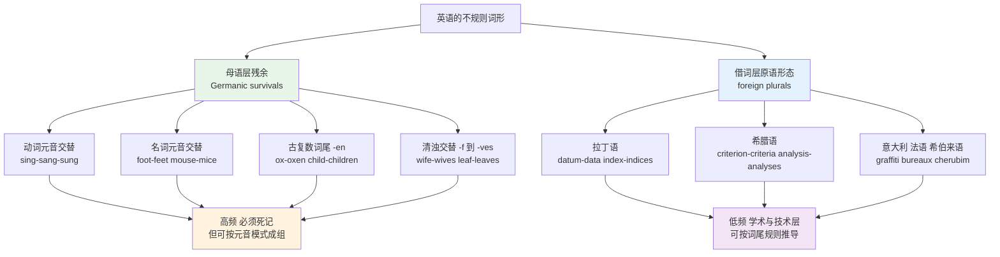
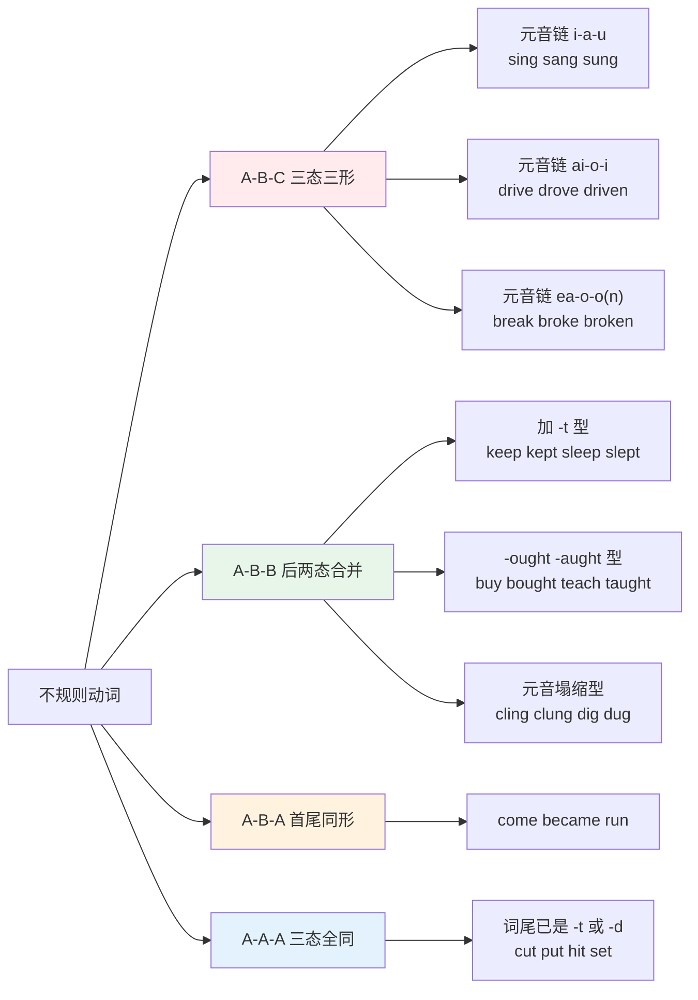
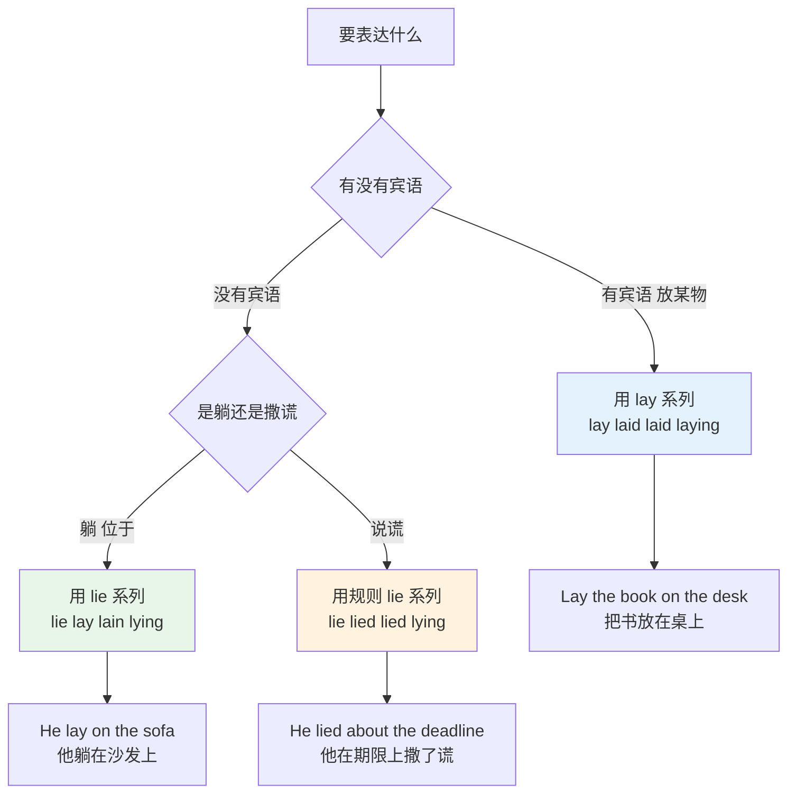
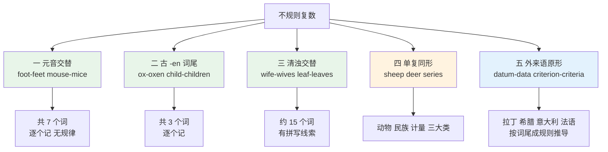
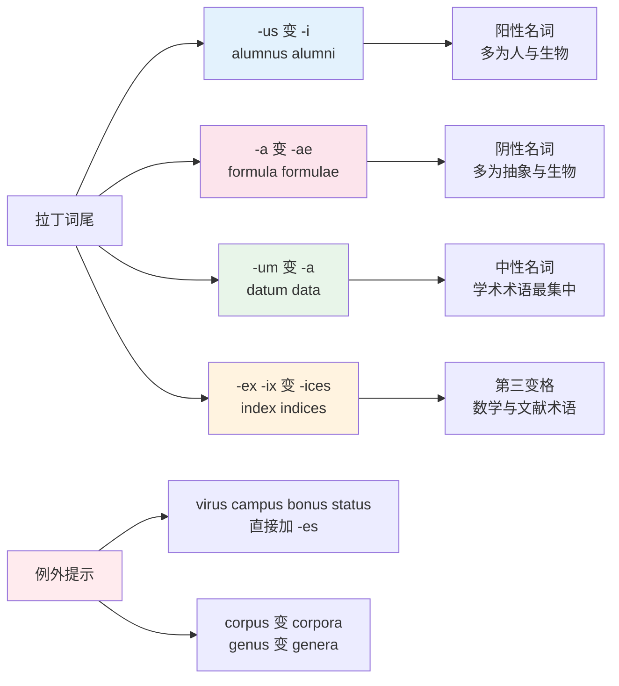
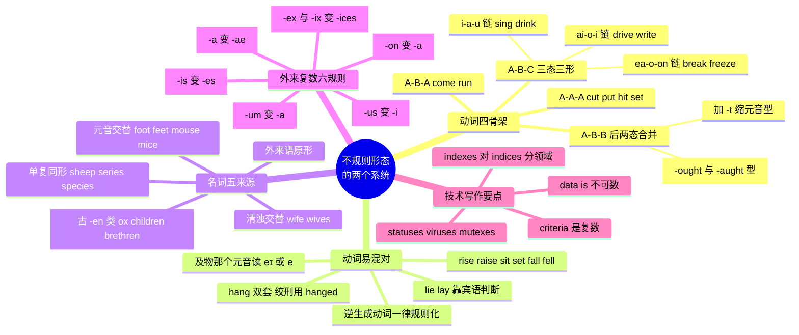

# 不规则动词形态分组与不规则复数全表

> [!info] 本篇定位
>
> 封闭词类速查的第四篇，处理英语里最后一批不能靠规则推出来的词形：不规则动词的三态和不规则名词的复数。
>
> 本篇不重排动词三态全表——那张表在 `02.英语基础语法/13.附录/02.常用动词变化表.md` 里已经按字母排完了。本篇做的是另一件事：把那张表按**元音交替模式**重切一遍，让两百多个孤立词条塌缩成十来个可以整组记的骨架，再单独处理 lie / lay、hang、shine 这几组靠字母表排序永远排不到一起的易混对。
>
> 不规则复数是本篇主体，给全表：母语层的 child / foot / wolf，拉丁层的 datum / index / formula，希腊层的 criterion / analysis，加上 sheep / series 这类单复同形词，一次列完。
>
> 读完你能回答三个具体问题：`sing` 的过去分词为什么是 `sung` 而不是 `sang`；`The data is` 和 `The data are` 哪个能写进技术文档；`indexes` 和 `indices` 在数据库文档里该用哪一个。

---

## 1. 本篇导读：不规则形态是化石，不是例外

「不规则」这个说法容易造成误解，好像这些词是随手扔进来的意外。实际情况相反——它们是英语更古老的规则留下的残迹，而现在的 `-ed` / `-s` 才是后来居上的新规则。

古英语的动词分两大类。**弱变化动词**靠加齿音后缀构成过去式，那个后缀演变成了今天的 `-ed`。**强变化动词**不加任何后缀，靠**改变词干元音**表示时态，这套元音更替叫 ablaut（元音交替）。`sing / sang / sung` 里那三个元音，是同一个词根在三种语法功能下的三种形态，跟 `walk / walked` 的加后缀是完全不同的机制。

名词复数同理。今天的 `-s` 来自古英语一类阳性名词的复数词尾，它后来吞并了其他所有类。没被吞并干净的残余就是 `children`、`oxen`、`feet`、`mice` 这些词。

上图把不规则形态劈成了性质完全不同的两半，这个划分决定了本篇的学法。左边这一半是母语层残余，词都是最高频的日常词，个数有限但推不出来，只能背；好在它们的元音交替是有模式的，按模式分组能把记忆负担压掉一大半。右边这一半是借词带进来的原语复数，词都是学术和技术层的低频词，但它们**规则性很强**——看到 `-is` 就知道复数是 `-es`，看到 `-um` 就知道是 `-a`，掌握六七条词尾对应关系就能覆盖绝大部分，几乎不需要逐个记。

两半的错误类型也不一样。左半边出错是「没背过」，右半边出错是「过度类推」——`viri`（`virus` 的假复数）、`octopi`（`octopus` 的假复数）这类错，都是把拉丁规则套到了不该套的词上。

> [!tip] 本篇的使用方式
>
> 动词部分（第 2 到第 8 节）建议**顺读**，因为元音模式是成组的，跳着看会打散分组。
>
> 名词部分（第 9 到第 16 节）建议**当查询表用**，按需要跳到对应的词尾类别。第 17 节是给技术文档场景的浓缩清单，写英文文档时直接查那一节。

---

## 2. 元音交替：四种形态骨架

不规则动词的三态可以只按一个维度分类：**原形、过去式、过去分词这三个形式里有几个是不同的**。这个维度把两百多个词压成了四个骨架。

| 骨架 | 含义 | 典型词 | 组内数量特征 |
| --- | --- | --- | --- |
| A-B-C | 三个形式互不相同 | sing / sang / sung | 数量最少，但最容易记错 |
| A-B-B | 过去式与分词同形 | keep / kept / kept | 数量最多的一类，子类也最多 |
| A-B-A | 原形与分词同形 | come / came / come | 只有四个常用成员 |
| A-A-A | 三个形式全同 | cut / cut / cut | 三十来个，词尾清一色 -t 或 -d |

上图给出了本篇动词部分的目录结构。A-B-C 组标红是因为它是错误集中区：中文母语者最常见的动词错误不是不认识 `sing` 的过去式，而是把 `sang` 和 `sung` 用反，或者把 A-B-C 型误当成 A-B-B 型说出 `I have drank`。A-A-A 型标蓝是因为它几乎不会出错——三个形式都一样，写错的机会都没有，唯一的坑是把 `cost`、`cast` 当成规则动词加上 `-ed`。

> [!warning] A-B-C 型的判定后果
>
> A-B-C 型的第三形（分词）只出现在两个位置：**完成时**（`have / has / had` 之后）和**被动语态**（`be` 之后）。除此之外的位置一律用第二形。
>
> - ❌ ~~I have **drank** three cups.~~
> - ✅ I have **drunk** three cups.
> - ❌ ~~The bell **rung** at noon.~~（这里是主动过去式，不是完成时）
> - ✅ The bell **rang** at noon.
>
> 判据只有一条：前面有没有助动词 `have` 或 `be`。有就用第三形，没有就用第二形。这条判据不属于本篇——它是语法层的内容，详见 `02.英语基础语法` 的时态章。本篇只负责保证你手里那三个形式是对的。

---

## 3. A-B-C 型：三条主元音链

### 3.1 元音链一：i → a → u

这是最整齐的一组，词干元音走 /ɪ/ → /æ/ → /ʌ/ 三级。绝大多数成员的词干以鼻音 `-ng` 或 `-nk` 结尾。

| 英文 | 英式音标 | 美式音标 | 词性 | 中文 | 搭配与说明 |
| --- | --- | --- | --- | --- | --- |
| **sing** | /sɪŋ/ | /sɪŋ/ | v. | 唱 | sing-sang-sung；sung 只跟在 have/be 后 |
| **ring** | /rɪŋ/ | /rɪŋ/ | v. | 响；打电话 | ring-rang-rung；「围绕」义时是规则的 ringed |
| **spring** | /sprɪŋ/ | /sprɪŋ/ | v. | 跳跃；涌现 | spring-sprang-sprung；美式常用 sprung 作过去式 |
| **drink** | /drɪŋk/ | /drɪŋk/ | v. | 喝 | drink-drank-drunk；drunk 另有形容词义「醉的」 |
| **sink** | /sɪŋk/ | /sɪŋk/ | v. | 下沉 | sink-sank-sunk；sunken 是形容词专用形 |
| **shrink** | /ʃrɪŋk/ | /ʃrɪŋk/ | v. | 收缩 | shrink-shrank-shrunk；shrunken 作形容词 |
| **stink** | /stɪŋk/ | /stɪŋk/ | v. | 发臭 | stink-stank-stunk；美式过去式也用 stunk |
| **swim** | /swɪm/ | /swɪm/ | v. | 游泳 | swim-swam-swum；无 -ng/-nk 却同链 |
| **begin** | /bɪˈɡɪn/ | /bɪˈɡɪn/ | v. | 开始 | begin-began-begun；重音在第二音节 |

> [!tip] 一句话锁住这一条链
>
> 这九个动词共用一句口诀：**过去式全押 /æ/，分词全押 /ʌ/**。
>
> 拿 `drink` 当锚点——`drank` 押 `bank`，`drunk` 押 `trunk`。剩下八个照抄这个元音。
>
> 记住分词那一档还有额外好处：`drunk`、`sunk`、`shrunk` 三个分词都能直接当形容词用（`a drunk driver`、`a sunk cost`），而过去式那一档一个都不行。

### 3.2 元音链二：aɪ → əʊ → ɪ

词干元音走 /aɪ/ → /əʊ/（美 /oʊ/）→ /ɪ/，分词一律带 `-en` 或 `-n`。这一组的词干几乎都是「长 i 加单辅音加 e」的拼写。

| 英文 | 英式音标 | 美式音标 | 词性 | 中文 | 搭配与说明 |
| --- | --- | --- | --- | --- | --- |
| **drive** | /draɪv/ | /draɪv/ | v. | 驾驶；驱动 | drive-drove-driven；软件语境 driven by |
| **ride** | /raɪd/ | /raɪd/ | v. | 骑；乘 | ride-rode-ridden |
| **rise** | /raɪz/ | /raɪz/ | v. | 上升 | rise-rose-risen；不及物，不能带宾语 |
| **arise** | /əˈraɪz/ | /əˈraɪz/ | v. | 出现；产生 | arise-arose-arisen；多用于抽象主语 |
| **write** | /raɪt/ | /raɪt/ | v. | 写 | write-wrote-written；分词双写 t |
| **strive** | /straɪv/ | /straɪv/ | v. | 努力 | strive-strove-striven；也接受规则 strived |
| **stride** | /straɪd/ | /straɪd/ | v. | 大步走 | stride-strode-stridden；分词罕用 |
| **smite** | /smaɪt/ | /smaɪt/ | v. | 重击 | smite-smote-smitten；smitten 现多作「着迷的」 |
| **bite** | /baɪt/ | /baɪt/ | v. | 咬 | bite-bit-bitten；过去式无 /əʊ/，是本组变体 |
| **hide** | /haɪd/ | /haɪd/ | v. | 隐藏 | hide-hid-hidden；同 bite 走短元音变体 |
| **slide** | /slaɪd/ | /slaɪd/ | v. | 滑动 | slide-slid-slid；已并入 A-B-B |
| **thrive** | /θraɪv/ | /θraɪv/ | v. | 兴旺 | thrive-throve-thriven；现代英语更常用 thrived |

`bite`、`hide`、`slide` 三个词是这条链的塌缩案例。它们本来该是 `bit / bitten` 这样的完整三态，但过去式的长元音先缩成了 /ɪ/，`slide` 更进一步连分词也丢了 `-en`，直接变成 A-B-B。这种塌缩方向是单向的：不规则动词只会往规则化的方向走，不会反过来。所以判断一个词该怎么变，遇到不确定的先查，不要从别的词类推。

### 3.3 元音链三：iː / eɪ → əʊ → əʊn

过去式与分词共用 /əʊ/（美 /oʊ/），分词加 `-n` 或 `-en`。原形的元音多是 /iː/ 或 /eɪ/，`choose` /tʃuːz/ 是组里唯一的 /uː/，靠后两态归队。这一组产出的分词形容词最多，第 8 节会单独处理。

| 英文 | 英式音标 | 美式音标 | 词性 | 中文 | 搭配与说明 |
| --- | --- | --- | --- | --- | --- |
| **freeze** | /friːz/ | /friːz/ | v. | 冻结 | freeze-froze-frozen；界面「卡死」也用 froze |
| **speak** | /spiːk/ | /spiːk/ | v. | 说 | speak-spoke-spoken |
| **steal** | /stiːl/ | /stiːl/ | v. | 偷 | steal-stole-stolen |
| **weave** | /wiːv/ | /wiːv/ | v. | 编织 | weave-wove-woven；「穿行」义用 weaved |
| **choose** | /tʃuːz/ | /tʃuːz/ | v. | 选择 | choose-chose-chosen；原形双 o，过去式单 o |
| **break** | /breɪk/ | /breɪk/ | v. | 打破 | break-broke-broken |
| **wake** | /weɪk/ | /weɪk/ | v. | 醒 | wake-woke-woken；美式分词也用 waked |
| **awake** | /əˈweɪk/ | /əˈweɪk/ | v./adj. | 唤醒；醒着的 | awake-awoke-awoken；形容词只作表语 |
| **tread** | /tred/ | /tred/ | v. | 踩 | tread-trod-trodden；原形元音是短 e |

`choose` 的拼写值得单独盯一下：原形两个 o（`choose`），过去式一个 o（`chose`），分词一个 o 加 n（`chosen`）。中文母语者最常见的错是把过去式写成 `choosed` 或 `choosen`，两个都不存在。

### 3.4 元音链四：eɪ → ʊ → eɪn 与 əʊ → uː → əʊn

这两条链数量少但全是超高频词，放在一起记。

| 英文 | 英式音标 | 美式音标 | 词性 | 中文 | 搭配与说明 |
| --- | --- | --- | --- | --- | --- |
| **take** | /teɪk/ | /teɪk/ | v. | 拿；花费 | take-took-taken |
| **shake** | /ʃeɪk/ | /ʃeɪk/ | v. | 摇 | shake-shook-shaken |
| **forsake** | /fəˈseɪk/ | /fərˈseɪk/ | v. | 抛弃 | forsake-forsook-forsaken；书面语 |
| **mistake** | /mɪˈsteɪk/ | /mɪˈsteɪk/ | v./n. | 弄错；错误 | mistake-mistook-mistaken；take 的派生 |
| **know** | /nəʊ/ | /noʊ/ | v. | 知道 | know-knew-known；k 不发音 |
| **grow** | /ɡrəʊ/ | /ɡroʊ/ | v. | 生长 | grow-grew-grown |
| **throw** | /θrəʊ/ | /θroʊ/ | v. | 扔；抛出 | throw-threw-thrown；抛异常 throw an error |
| **blow** | /bləʊ/ | /bloʊ/ | v. | 吹 | blow-blew-blown |
| **fly** | /flaɪ/ | /flaɪ/ | v. | 飞 | fly-flew-flown；棒球「击出高飞球」用 flied |
| **draw** | /drɔː/ | /drɔː/ | v. | 画；拉 | draw-drew-drawn；元音不同但同链 |
| **slay** | /sleɪ/ | /sleɪ/ | v. | 杀死 | slay-slew-slain；分词是 slain 不是 slayn |

`fly` 的例外用法值得记一笔：它在棒球术语里走规则变化 `flied out`，因为那个动词是从名词 `fly ball` 逆生成的，跟「飞行」不是同一个词。同类现象在 `ring`（围绕→ringed）、`hang`（绞刑→hanged）里都出现过——**逆生成的动词一律走规则变化**，这是判断双套形式的一条通用线索，第 7 节会展开。

### 3.5 元音链五：eə → ɔː → ɔːn 与零散成员

| 英文 | 英式音标 | 美式音标 | 词性 | 中文 | 搭配与说明 |
| --- | --- | --- | --- | --- | --- |
| **bear** | /beə/ | /ber/ | v. | 承受；生育 | bear-bore-borne；「出生」义分词用 born |
| **tear** | /teə/ | /ter/ | v. | 撕 | tear-tore-torn；名词「眼泪」读 /tɪə/ /tɪr/ |
| **wear** | /weə/ | /wer/ | v. | 穿；磨损 | wear-wore-worn |
| **swear** | /sweə/ | /swer/ | v. | 发誓；骂 | swear-swore-sworn |
| **give** | /ɡɪv/ | /ɡɪv/ | v. | 给 | give-gave-given；given 另作介词「鉴于」 |
| **forgive** | /fəˈɡɪv/ | /fərˈɡɪv/ | v. | 原谅 | forgive-forgave-forgiven |
| **eat** | /iːt/ | /iːt/ | v. | 吃 | eat-ate-eaten；ate 英式可读 /et/ |
| **see** | /siː/ | /siː/ | v. | 看见 | see-saw-seen |
| **fall** | /fɔːl/ | /fɔːl/ | v. | 落下 | fall-fell-fallen；不及物 |
| **forget** | /fəˈɡet/ | /fərˈɡet/ | v. | 忘记 | forget-forgot-forgotten；英式分词也用 forgot |
| **do** | /duː/ | /duː/ | v. | 做 | do-did-done |
| **go** | /ɡəʊ/ | /ɡoʊ/ | v. | 去 | go-went-gone；went 来自另一个动词 wend |

`bear` 的两个分词是本组唯一需要区分语义的地方：**borne** 用于「承受、携带、由某物传播」，**born** 只用于「出生」的被动式。

> [!example] borne 与 born 的分工
>
> - The costs were **borne** by the client.
>   - 费用由客户承担。
> - The disease is water**borne**.
>   - 这种疾病经水传播。
> - She was **born** in 1990.
>   - 她生于 1990 年。
> - She has **borne** three children.
>   - 她生育过三个孩子。（主动完成时用 borne，不用 born）

---

## 4. A-B-B 型：过去式与分词合并

这是不规则动词里数量最大的一类。好消息是它只需要记两个形式，坏消息是它的子类多，得按词尾特征分开看。

### 4.1 元音塌缩成 /ʌ/

原形是 /ɪ/ 或 /aɪ/，过去式与分词一律塌成 /ʌ/。这一组和第 3.1 节的 i-a-u 链长得很像，区别是**它没有中间那一档 /æ/**。

| 英文 | 英式音标 | 美式音标 | 词性 | 中文 | 搭配与说明 |
| --- | --- | --- | --- | --- | --- |
| **cling** | /klɪŋ/ | /klɪŋ/ | v. | 紧贴；依附 | cling-clung-clung；cling to a belief |
| **fling** | /flɪŋ/ | /flɪŋ/ | v. | 猛掷 | fling-flung-flung |
| **sling** | /slɪŋ/ | /slɪŋ/ | v. | 悬挂；投掷 | sling-slung-slung |
| **sting** | /stɪŋ/ | /stɪŋ/ | v. | 蜇；刺痛 | sting-stung-stung |
| **string** | /strɪŋ/ | /strɪŋ/ | v./n. | 串起；字符串 | string-strung-strung；编程术语用名词义 |
| **swing** | /swɪŋ/ | /swɪŋ/ | v. | 摆动 | swing-swung-swung |
| **wring** | /rɪŋ/ | /rɪŋ/ | v. | 拧；绞 | wring-wrung-wrung；w 不发音 |
| **spin** | /spɪn/ | /spɪn/ | v. | 旋转 | spin-spun-spun；spin up a server |
| **win** | /wɪn/ | /wɪn/ | v. | 赢 | win-won-won；won 读 /wʌn/ 与 one 同音 |
| **dig** | /dɪɡ/ | /dɪɡ/ | v. | 挖 | dig-dug-dug；dig into the logs |
| **stick** | /stɪk/ | /stɪk/ | v. | 粘；卡住 | stick-stuck-stuck；be stuck on a bug |
| **strike** | /straɪk/ | /straɪk/ | v. | 打击；罢工 | strike-struck-struck；「打动」义分词可用 stricken |
| **hang** | /hæŋ/ | /hæŋ/ | v. | 悬挂 | hang-hung-hung；「绞死」义走 hanged，见 7.1 |
| **sneak** | /sniːk/ | /sniːk/ | v. | 溜；偷偷做 | 标准形式 sneaked 是规则的；美式口语的 snuck 才落进本组 |

### 4.2 -ought 与 -aught

这七个词的过去式与分词共用 /ɔːt/ 韵，拼写只有 `ought` 和 `aught` 两种，靠原形的元音决定用哪种。

| 英文 | 英式音标 | 美式音标 | 词性 | 中文 | 搭配与说明 |
| --- | --- | --- | --- | --- | --- |
| **bring** | /brɪŋ/ | /brɪŋ/ | v. | 带来 | bring-brought-brought；不是 brang |
| **buy** | /baɪ/ | /baɪ/ | v. | 买 | buy-bought-bought |
| **think** | /θɪŋk/ | /θɪŋk/ | v. | 想 | think-thought-thought |
| **fight** | /faɪt/ | /faɪt/ | v. | 打；对抗 | fight-fought-fought |
| **seek** | /siːk/ | /siːk/ | v. | 寻求 | seek-sought-sought；书面语色彩 |
| **teach** | /tiːtʃ/ | /tiːtʃ/ | v. | 教 | teach-taught-taught；拼 aught |
| **catch** | /kætʃ/ | /kætʃ/ | v. | 抓住；捕获 | catch-caught-caught；异常处理里的 catch 块 |

拼写规律很直白：原形里的元音字母是 `i` 或 `uy` 的走 `-ought`（bring / think / fight / buy），原形里是 `ea` 或 `a` 的走 `-aught`（teach / catch）。`seek` 是这七个词里唯一不服从的——它的原形元音字母是 `ee`，过去式却是 `sought`，只能单独记。

> [!warning] bring 的错误率最高
>
> `bring` 长得像 `sing`、`ring`，中文母语者按类推会说出 `brang` / `brung`。这两个形式在标准英语里不存在，只出现在部分方言里。
>
> - ❌ ~~He **brang** the report yesterday.~~
> - ✅ He **brought** the report yesterday.
>
> 同类陷阱：`think` 长得像 `drink`，但 `thank` / `thunk` 也不存在。`-ink` 结尾的动词里，只有 `drink`、`sink`、`shrink`、`stink` 走 i-a-u 链，`think` 单独走 `-ought`。

### 4.3 加 -t 与元音缩短

原形是长元音，过去式与分词把元音缩短并加 `-t`。

| 英文 | 英式音标 | 美式音标 | 词性 | 中文 | 搭配与说明 |
| --- | --- | --- | --- | --- | --- |
| **keep** | /kiːp/ | /kiːp/ | v. | 保持 | keep-kept-kept |
| **sleep** | /sliːp/ | /sliːp/ | v. | 睡 | sleep-slept-slept |
| **sweep** | /swiːp/ | /swiːp/ | v. | 扫 | sweep-swept-swept |
| **weep** | /wiːp/ | /wiːp/ | v. | 哭泣 | weep-wept-wept；书面语 |
| **creep** | /kriːp/ | /kriːp/ | v. | 爬行；蔓延 | creep-crept-crept；scope creep 需求蔓延 |
| **feel** | /fiːl/ | /fiːl/ | v. | 感觉 | feel-felt-felt |
| **kneel** | /niːl/ | /niːl/ | v. | 跪 | kneel-knelt-knelt；美式也用 kneeled |
| **deal** | /diːl/ | /diːl/ | v. | 处理；发牌 | deal-dealt-dealt；dealt 读 /delt/ |
| **mean** | /miːn/ | /miːn/ | v. | 意味 | mean-meant-meant；meant 读 /ment/ |
| **leave** | /liːv/ | /liːv/ | v. | 离开；留下 | leave-left-left |
| **lose** | /luːz/ | /luːz/ | v. | 丢失 | lose-lost-lost；与 loose /luːs/ 不同词 |
| **shoot** | /ʃuːt/ | /ʃuːt/ | v. | 射击；拍摄 | shoot-shot-shot |

### 4.4 加 -t / -d 但元音不变

| 英文 | 英式音标 | 美式音标 | 词性 | 中文 | 搭配与说明 |
| --- | --- | --- | --- | --- | --- |
| **build** | /bɪld/ | /bɪld/ | v. | 建造；构建 | build-built-built；构建产物 a build |
| **send** | /send/ | /send/ | v. | 发送 | send-sent-sent |
| **spend** | /spend/ | /spend/ | v. | 花费 | spend-spent-spent |
| **bend** | /bend/ | /bend/ | v. | 弯曲 | bend-bent-bent |
| **lend** | /lend/ | /lend/ | v. | 借出 | lend-lent-lent |
| **make** | /meɪk/ | /meɪk/ | v. | 制造 | make-made-made |
| **have** | /hæv/ | /hæv/ | v. | 有 | have-had-had |
| **say** | /seɪ/ | /seɪ/ | v. | 说 | say-said-said；said 读 /sed/ |
| **pay** | /peɪ/ | /peɪ/ | v. | 支付 | pay-paid-paid；拼写 paid 不是 payed |
| **lay** | /leɪ/ | /leɪ/ | v. | 放置 | lay-laid-laid；见第 6 节 |
| **sell** | /sel/ | /sel/ | v. | 卖 | sell-sold-sold |
| **tell** | /tel/ | /tel/ | v. | 告诉 | tell-told-told |
| **hold** | /həʊld/ | /hoʊld/ | v. | 握住；持有 | hold-held-held |
| **stand** | /stænd/ | /stænd/ | v. | 站；忍受 | stand-stood-stood |
| **understand** | /ˌʌndəˈstænd/ | /ˌʌndərˈstænd/ | v. | 理解 | understand-understood-understood |
| **sit** | /sɪt/ | /sɪt/ | v. | 坐 | sit-sat-sat；见第 6 节 |
| **get** | /ɡet/ | /ɡet/ | v. | 得到 | get-got-got；美式分词 gotten，见 7.3 |
| **find** | /faɪnd/ | /faɪnd/ | v. | 找到 | find-found-found；与 found「创建」不同词 |
| **bind** | /baɪnd/ | /baɪnd/ | v. | 绑定 | bind-bound-bound；data binding 数据绑定 |
| **wind** | /waɪnd/ | /waɪnd/ | v. | 缠绕 | wind-wound-wound；wound 读 /waʊnd/ |

---

## 5. A-B-A 型与 A-A-A 型

### 5.1 A-B-A：原形与分词同形

只有四个常用成员，全部围绕 `come` 和 `run` 这两个词根。

| 英文 | 英式音标 | 美式音标 | 词性 | 中文 | 搭配与说明 |
| --- | --- | --- | --- | --- | --- |
| **come** | /kʌm/ | /kʌm/ | v. | 来 | come-came-come |
| **become** | /bɪˈkʌm/ | /bɪˈkʌm/ | v. | 变成 | become-became-become |
| **overcome** | /ˌəʊvəˈkʌm/ | /ˌoʊvərˈkʌm/ | v. | 克服 | overcome-overcame-overcome |
| **run** | /rʌn/ | /rʌn/ | v. | 跑；运行 | run-ran-run；run a test 跑测试 |

> [!warning] A-B-A 型的高频错误
>
> 分词与原形同形，容易在完成时里被误写成过去式。
>
> - ❌ ~~The build has **ran** for ten minutes.~~
> - ✅ The build has **run** for ten minutes.
> - ❌ ~~She has **became** the team lead.~~
> - ✅ She has **become** the team lead.
>
> `run` 在技术语境里出现频率极高，这个错在英文提交信息和工单里非常常见。

### 5.2 A-A-A：三态全同

成员全是以 `-t` 或 `-d` 结尾的短词。原因很实际——它们的词尾本来就是齿音，加 `-ed` 后读不出区别，索性就不加了。

| 英文 | 英式音标 | 美式音标 | 词性 | 中文 | 搭配与说明 |
| --- | --- | --- | --- | --- | --- |
| **cut** | /kʌt/ | /kʌt/ | v. | 切；削减 | cut-cut-cut |
| **put** | /pʊt/ | /pʊt/ | v. | 放 | put-put-put |
| **hit** | /hɪt/ | /hɪt/ | v. | 打；命中 | hit-hit-hit；cache hit 缓存命中 |
| **set** | /set/ | /set/ | v. | 设置 | set-set-set；见第 6 节与 sit 的对比 |
| **let** | /let/ | /let/ | v. | 让；出租 | let-let-let |
| **shut** | /ʃʌt/ | /ʃʌt/ | v. | 关闭 | shut-shut-shut；shut down 关机 |
| **quit** | /kwɪt/ | /kwɪt/ | v. | 退出；辞职 | quit-quit-quit；美式偶见 quitted |
| **split** | /splɪt/ | /splɪt/ | v. | 分割 | split-split-split；split a string |
| **spread** | /spred/ | /spred/ | v. | 传播；铺开 | spread-spread-spread；三态都读 /spred/ |
| **cost** | /kɒst/ | /kɔːst/ | v./n. | 花费；成本 | cost-cost-cost；「估价」义走 costed |
| **cast** | /kɑːst/ | /kæst/ | v. | 投；类型转换 | cast-cast-cast；type cast 强制转型 |
| **burst** | /bɜːst/ | /bɜːrst/ | v. | 爆裂 | burst-burst-burst |
| **thrust** | /θrʌst/ | /θrʌst/ | v. | 猛推 | thrust-thrust-thrust |
| **hurt** | /hɜːt/ | /hɜːrt/ | v. | 伤害；疼 | hurt-hurt-hurt |
| **rid** | /rɪd/ | /rɪd/ | v. | 摆脱 | rid-rid-rid；get rid of |
| **shed** | /ʃed/ | /ʃed/ | v. | 脱落；流出 | shed-shed-shed；shed light on |
| **bet** | /bet/ | /bet/ | v. | 打赌 | bet-bet-bet |
| **upset** | /ʌpˈset/ | /ʌpˈset/ | v./adj. | 使不安；心烦的 | upset-upset-upset |
| **broadcast** | /ˈbrɔːdkɑːst/ | /ˈbrɔːdkæst/ | v. | 广播 | broadcast-broadcast-broadcast |
| **read** | /riːd/ | /riːd/ | v. | 读 | read-read-read；后两态读 /red/ |

`read` 是这一组里唯一拼写相同但读音不同的词：原形 /riːd/，过去式与分词都读 /red/，与 `red`（红色）同音。写出来看不出时态，只能靠上下文和读音区分。

> [!example] read 的三态在句子里的读音
>
> - I **read** /riːd/ the spec every morning.
>   - 我每天早上读规格文档。（现在时）
> - I **read** /red/ the spec yesterday.
>   - 我昨天读了规格文档。（过去时）
> - I have **read** /red/ the spec twice.
>   - 我已经读过两遍规格文档。（完成时）

---

## 6. 易混对：lie / lay 和它的邻居

按字母表排序的动词表永远解决不了这一节的问题——`lie` 和 `lay` 在表里隔着好几页，而它们最需要摆在一起看。

### 6.1 三个 l 开头的形式纠缠在一起

| 英文 | 英式音标 | 美式音标 | 词性 | 中文 | 搭配与说明 |
| --- | --- | --- | --- | --- | --- |
| **lie** | /laɪ/ | /laɪ/ | vi. | 躺；位于 | lie-lay-lain-lying；不及物，不带宾语 |
| **lay** | /leɪ/ | /leɪ/ | vt. | 放置；下蛋 | lay-laid-laid-laying；及物，必须带宾语 |
| **lie** | /laɪ/ | /laɪ/ | vi./n. | 说谎；谎言 | lie-lied-lied-lying；规则变化 |

麻烦出在两处交叉：`lay` 既是「放置」的原形，又是「躺」的过去式；`lying` 既是「躺着」的现在分词，又是「说谎」的现在分词。

上图给的是可以现场执行的判据，不用回忆哪个词是哪个：**先看句子里有没有宾语**。有宾语只可能是 `lay` 系列，因为 `lie` 的两个义项都是不及物的。没有宾语再分「躺」还是「撒谎」，前者不规则、后者规则。这条判据的好处是它避开了「lay 是 lie 的过去式」这个最容易把人绕晕的事实——只要先问宾语，就不会走到那个岔口上。

> [!example] 四个形式在同一段里
>
> - She **lay** on the couch for an hour.
>   - 她在沙发上躺了一小时。（lie 的过去式）
> - She has **lain** there since noon.
>   - 她从中午起就躺在那儿。（lie 的分词）
> - She **laid** the report on my desk.
>   - 她把报告放在我桌上。（lay 的过去式，有宾语 report）
> - She **lied** to the auditor.
>   - 她对审计员撒了谎。（说谎义，规则变化）

> [!warning] 母语者也常错的一句
>
> `Lay down` 和 `lie down` 在英语母语者的口语里已经大面积混用，歌名 `Lay Lady Lay` 就是一个反例。但在书面语和技术文档里，编辑仍然按标准区分改稿。
>
> - ❌ ~~I'm going to **lay** down for a bit.~~（口语可接受，书面不合规范）
> - ✅ I'm going to **lie** down for a bit.
> - ✅ I'm going to **lay** the cables down.（有宾语 cables，正确）

### 6.2 rise / raise / arise 与 sit / set / seat

`lie` / `lay` 的困境不是孤例。英语里有一批**不及物与及物成对**的动词，它们成对的方式一模一样：不及物那个走元音交替，及物那个不走。

| 英文 | 英式音标 | 美式音标 | 词性 | 中文 | 搭配与说明 |
| --- | --- | --- | --- | --- | --- |
| **rise** | /raɪz/ | /raɪz/ | vi. | 上升；起身 | rise-rose-risen；无宾语 |
| **raise** | /reɪz/ | /reɪz/ | vt. | 抬高；提出；筹集 | raise-raised-raised；必须带宾语 |
| **arise** | /əˈraɪz/ | /əˈraɪz/ | vi. | 出现；产生 | arise-arose-arisen；主语多为抽象事物 |
| **arouse** | /əˈraʊz/ | /əˈraʊz/ | vt. | 唤起；激起 | arouse-aroused-aroused；带宾语 |
| **sit** | /sɪt/ | /sɪt/ | vi. | 坐 | sit-sat-sat；无宾语 |
| **set** | /set/ | /set/ | vt. | 放置；设定 | set-set-set；必须带宾语 |
| **seat** | /siːt/ | /siːt/ | vt. | 使就座；容纳 | seat-seated-seated；seat 300 people |
| **fall** | /fɔːl/ | /fɔːl/ | vi. | 落下 | fall-fell-fallen；无宾语 |
| **fell** | /fel/ | /fel/ | vt. | 砍倒 | fell-felled-felled；fell a tree |
| **hang** | /hæŋ/ | /hæŋ/ | vi./vt. | 悬挂 | hang-hung-hung；及物不及物同形 |

`lie` / `lay`、`rise` / `raise`、`sit` / `set`、`fall` / `fell` 这四对的排布方式完全一致：不及物那个走元音交替、不带宾语，及物那个不走元音交替、必须带宾语（`laid`、`raised`、`felled` 直接加 `-ed`，`set` 干脆三态同形）。

更有用的是及物那一个的元音：四个全部落在前中元音上——`lay` /eɪ/、`raise` /eɪ/、`set` /e/、`fell` /e/，而不及物那一个的元音四个各不相同（`lie` /aɪ/、`rise` /aɪ/、`sit` /ɪ/、`fall` /ɔː/）。这不是巧合，它们本来就是同一个词根加上古日耳曼语的致使态后缀构成的对子，那个后缀把词干元音一律前化成了 /eɪ/ 或 /e/。

表里剩下三个词不属于这个对子系统。`arouse` 是十六世纪按 `rise` / `raise` 的样子仿造出来的，词根跟 `arise` 无关；`seat` 是从名词 `seat`（座位）逆生成的动词，所以走规则变化；`hang` 更特殊，它的及物与不及物用的是同一套形式（`hang-hung-hung`），根本没分化出对子——它的双套形式分歧在语义那一层，见 7.1。

> [!tip] 用元音差记住及物性
>
> **及物的那一个，词干元音一律读 /eɪ/ 或 /e/。**
>
> `lay` /eɪ/、`raise` /eɪ/、`set` /e/、`fell` /e/ 四个全部符合，而它们的不及物搭档没有一个落在这两个元音上。判断时先读一遍两个词，元音是 /eɪ/ 或 /e/ 的那个后面必须跟宾语。

### 6.3 形近但完全不同源的对子

下面这几对长得像，词源上却毫无关系。把它们摆在一起是为了防止互相污染。

| 英文 | 英式音标 | 美式音标 | 词性 | 中文 | 搭配与说明 |
| --- | --- | --- | --- | --- | --- |
| **find** | /faɪnd/ | /faɪnd/ | v. | 找到 | find-found-found |
| **found** | /faʊnd/ | /faʊnd/ | v. | 创建；创办 | found-founded-founded；与上一行同形不同词 |
| **bind** | /baɪnd/ | /baɪnd/ | v. | 捆绑；绑定 | bind-bound-bound |
| **bound** | /baʊnd/ | /baʊnd/ | v./adj. | 跳跃；注定的 | bound-bounded-bounded；另有名词「界限」 |
| **wind** | /waɪnd/ | /waɪnd/ | v. | 缠绕；上发条 | wind-wound-wound；wound 读 /waʊnd/ |
| **wound** | /wuːnd/ | /wuːnd/ | v./n. | 使受伤；伤口 | wound-wounded-wounded；读音完全不同 |
| **fly** | /flaɪ/ | /flaɪ/ | v. | 飞 | fly-flew-flown |
| **flee** | /fliː/ | /fliː/ | v. | 逃离 | flee-fled-fled；不是 fly 的变体 |
| **flow** | /fləʊ/ | /floʊ/ | v. | 流动 | flow-flowed-flowed；规则动词 |
| **lie** | /laɪ/ | /laɪ/ | v. | 躺 | 见 6.1 |
| **lied** | /laɪd/ | /laɪd/ | v. | 撒谎（过去式） | 与 laid /leɪd/ 读音写法都不同 |

`wind` / `wound` 这一组值得多看一眼，因为它把三个不同的读音塞进了两个拼写：动词 `wind`「缠绕」读 /waɪnd/，它的过去式 `wound` 读 /waʊnd/；名词 `wind`「风」读 /wɪnd/；而完全不相干的动词 `wound`「使受伤」读 /wuːnd/。四个形式互不相通，只能靠语境和读音分开。

---

## 7. 一词两套形式

同一个动词挂着两套变化形式，是英语不规则系统里最容易踩空的地方。分歧有三个来源：语义分工、英美差异、规则化进行中。

### 7.1 语义分工：两套形式对应两个意思

| 英文 | 英式音标 | 美式音标 | 词性 | 中文 | 搭配与说明 |
| --- | --- | --- | --- | --- | --- |
| **hang** | /hæŋ/ | /hæŋ/ | v. | 悬挂；卡死 | hung；hang a picture / the app hung |
| **hang** | /hæŋ/ | /hæŋ/ | v. | 绞死 | hanged；只用于对人执行绞刑 |
| **shine** | /ʃaɪn/ | /ʃaɪn/ | vi. | 发光 | shone /ʃɒn/ /ʃoʊn/；The sun shone |
| **shine** | /ʃaɪn/ | /ʃaɪn/ | vt. | 擦亮 | shined；He shined his shoes |
| **ring** | /rɪŋ/ | /rɪŋ/ | v. | 响；打电话 | rang-rung；不规则 |
| **ring** | /rɪŋ/ | /rɪŋ/ | v. | 环绕；套环 | ringed；规则，由名词 ring 逆生成 |
| **fly** | /flaɪ/ | /flaɪ/ | v. | 飞 | flew-flown；不规则 |
| **fly** | /flaɪ/ | /flaɪ/ | v. | 击出高飞球 | flied；棒球术语，规则 |
| **lie** | /laɪ/ | /laɪ/ | v. | 躺 | lay-lain；不规则 |
| **lie** | /laɪ/ | /laɪ/ | v. | 说谎 | lied；规则 |
| **cost** | /kɒst/ | /kɔːst/ | v. | 花费 | cost-cost；三态同形 |
| **cost** | /kɒst/ | /kɔːst/ | v. | 估算成本 | costed；专业会计用法 |
| **weave** | /wiːv/ | /wiːv/ | v. | 编织 | wove-woven；不规则 |
| **weave** | /wiːv/ | /wiːv/ | v. | 迂回穿行 | weaved；规则 |
| **bid** | /bɪd/ | /bɪd/ | v. | 出价；投标 | bid-bid；商业与拍卖 |
| **bid** | /bɪd/ | /bɪd/ | v. | 吩咐；道别 | bade /bæd/ -bidden；书面语 |
| **hew** | /hjuː/ | /hjuː/ | v. | 砍伐 | hewed-hewn 或 hewed；hewn 多作形容词 |

规律在第 3.4 节已经露过头：**从名词逆生成出来的动词一律走规则变化**。`ring`「套环」来自名词 `ring`（环），`fly`「击高飞球」来自名词 `fly ball`，`cost`「估算成本」来自名词 `cost`。它们进入动词系统的时间晚于强变化规则失效的时间，所以只能加 `-ed`。

`hanged` 是个特例，它不是逆生成的产物，而是法律术语固化的结果——绞刑是一种正式刑罚，公文里用的那套形式被冻结在了古老的规则变化上，没跟着 `hung` 一起演变。

> [!example] hang 的两套形式各归各位
>
> - I **hung** the whiteboard on the wall.
>   - 我把白板挂在墙上。
> - The process **hung** for twenty minutes.
>   - 进程卡死了二十分钟。
> - The prisoner was **hanged** at dawn.
>   - 囚犯在黎明时被处以绞刑。
>
> 判据：宾语是人且语境是刑罚，用 `hanged`；其余全部用 `hung`。

### 7.2 英美差异：-t 与 -ed 的分歧

一批词在英式英语里保留 `-t` 形式，在美式英语里改用 `-ed`。两边都对，混用才是问题。

| 英文 | 英式音标 | 美式音标 | 词性 | 中文 | 搭配与说明 |
| --- | --- | --- | --- | --- | --- |
| **learn** | /lɜːn/ | /lɜːrn/ | v. | 学习 | 英 learnt 美 learned；learned 另有形容词义 |
| **burn** | /bɜːn/ | /bɜːrn/ | v. | 烧 | 英 burnt 美 burned；burnt 更常作形容词 |
| **dream** | /driːm/ | /driːm/ | v. | 做梦 | 英 dreamt /dremt/ 美 dreamed /driːmd/ |
| **spell** | /spel/ | /spel/ | v. | 拼写 | 英 spelt 美 spelled |
| **smell** | /smel/ | /smel/ | v. | 闻 | 英 smelt 美 smelled；smelt 另有「冶炼」义 |
| **spill** | /spɪl/ | /spɪl/ | v. | 溢出 | 英 spilt 美 spilled |
| **spoil** | /spɔɪl/ | /spɔɪl/ | v. | 弄坏；宠坏 | 英 spoilt 美 spoiled |
| **leap** | /liːp/ | /liːp/ | v. | 跳跃 | 英 leapt /lept/ 美 leaped /liːpt/ |
| **lean** | /liːn/ | /liːn/ | v. | 倾斜；倚 | 英 leant /lent/ 美 leaned |
| **kneel** | /niːl/ | /niːl/ | v. | 跪 | 英 knelt 美 kneeled |
| **dwell** | /dwel/ | /dwel/ | v. | 居住；细想 | 英 dwelt 美 dwelled；dwell on 纠结于 |
| **earn** | /ɜːn/ | /ɜːrn/ | v. | 赚 | 两边都用 earned，不属于本组 |

> [!warning] 一个文档里不要两套并用
>
> 挑一套贯穿到底。技术文档若面向国际读者，用美式 `-ed` 更稳妥——它是多数在线文档、API 参考和开源项目 README 的默认风格。
>
> `learned` 的一个陷阱：作形容词「博学的」时读 /ˈlɜːnɪd/（两个音节），跟动词过去式 /lɜːnd/（一个音节）不同音。`a learned professor` 读 /ˈlɜːnɪd/。

### 7.3 美式独有的分词形式

| 英文 | 英式音标 | 美式音标 | 词性 | 中文 | 搭配与说明 |
| --- | --- | --- | --- | --- | --- |
| **get** | /ɡet/ | /ɡet/ | v. | 得到 | 英 got-got 美 got-gotten；have got 表拥有时两边都用 got |
| **forget** | /fəˈɡet/ | /fərˈɡet/ | v. | 忘记 | forgot-forgotten；英式也偶用 forgot 作分词 |
| **prove** | /pruːv/ | /pruːv/ | v. | 证明 | proved-proved 或 proven；proven 作定语更常见 |
| **dive** | /daɪv/ | /daɪv/ | v. | 潜水；俯冲 | 英 dived 美 dove /doʊv/ 或 dived |
| **fit** | /fɪt/ | /fɪt/ | v. | 合身；适配 | 美式过去式常用 fit，英式用 fitted |
| **plead** | /pliːd/ | /pliːd/ | v. | 恳求；抗辩 | 美式法律语境用 pled，通用 pleaded |
| **sneak** | /sniːk/ | /sniːk/ | v. | 溜 | 美式口语 snuck，正式场合仍用 sneaked |
| **wake** | /weɪk/ | /weɪk/ | v. | 醒 | woke-woken；美式也有 waked |
| **strive** | /straɪv/ | /straɪv/ | v. | 努力 | strove-striven 或 strived；后者渐占上风 |

`have got` 与 `have gotten` 的分工在美式英语里是实在的语义差别，不是自由变体：`I've got a car` 表示「我有一辆车」（状态），`I've gotten a car` 表示「我搞到了一辆车」（获得的动作完成）。英式英语没有这个区分，全部用 `got`。

---

## 8. -en 分词与分词形容词

### 8.1 -en 分词的形态位置

带 `-en` 或 `-n` 的分词全部来自强变化动词，第 3 节的三条主元音链贡献了绝大部分。这批分词有一个特殊能力：**很多可以直接当形容词用**，放在名词前面作定语。

| 英文 | 英式音标 | 美式音标 | 词性 | 中文 | 搭配与说明 |
| --- | --- | --- | --- | --- | --- |
| **broken** | /ˈbrəʊkən/ | /ˈbroʊkən/ | adj./p.p. | 破损的；坏掉的 | a broken link 失效链接；broken build |
| **frozen** | /ˈfrəʊzn/ | /ˈfroʊzn/ | adj./p.p. | 冻结的 | frozen assets；a frozen UI 界面卡死 |
| **swollen** | /ˈswəʊlən/ | /ˈswoʊlən/ | adj./p.p. | 肿胀的 | a swollen ankle；来自 swell-swelled-swollen |
| **written** | /ˈrɪtn/ | /ˈrɪtn/ | adj./p.p. | 书面的 | written consent 书面同意 |
| **hidden** | /ˈhɪdn/ | /ˈhɪdn/ | adj./p.p. | 隐藏的 | a hidden field；hidden cost |
| **forbidden** | /fəˈbɪdn/ | /fərˈbɪdn/ | adj./p.p. | 被禁止的 | HTTP 403 Forbidden |
| **chosen** | /ˈtʃəʊzn/ | /ˈtʃoʊzn/ | adj./p.p. | 被选中的 | the chosen option |
| **stolen** | /ˈstəʊlən/ | /ˈstoʊlən/ | adj./p.p. | 被盗的 | stolen credentials 被盗凭据 |
| **fallen** | /ˈfɔːlən/ | /ˈfɔːlən/ | adj./p.p. | 落下的；阵亡的 | fallen leaves |
| **spoken** | /ˈspəʊkən/ | /ˈspoʊkən/ | adj./p.p. | 口头的 | spoken English；a spoken agreement |
| **given** | /ˈɡɪvn/ | /ˈɡɪvn/ | adj./prep. | 给定的；鉴于 | a given value；Given that… |
| **known** | /nəʊn/ | /noʊn/ | adj./p.p. | 已知的 | a known issue 已知问题 |
| **torn** | /tɔːn/ | /tɔːrn/ | adj./p.p. | 撕破的；纠结的 | torn between two options |
| **worn** | /wɔːn/ | /wɔːrn/ | adj./p.p. | 磨损的 | worn-out 用旧的 |
| **driven** | /ˈdrɪvn/ | /ˈdrɪvn/ | adj./p.p. | 驱动的；有干劲的 | data-driven 数据驱动 |
| **mistaken** | /mɪˈsteɪkən/ | /mɪˈsteɪkən/ | adj./p.p. | 弄错的 | You are mistaken. |
| **shaken** | /ˈʃeɪkən/ | /ˈʃeɪkən/ | adj./p.p. | 震惊的 | badly shaken |
| **risen** | /ˈrɪzn/ | /ˈrɪzn/ | p.p. | 上升的 | 注意元音是短 /ɪ/，不是 /aɪ/ |

`risen` 的读音是这一组的最大陷阱：原形 `rise` 读 /raɪz/，过去式 `rose` 读 /rəʊz/，但分词 `risen` 的元音塌成了短 /ɪ/，读 /ˈrɪzn/ 而不是 /ˈraɪzn/。同类的还有 `driven` /ˈdrɪvn/（不是 /ˈdraɪvn/）、`written` /ˈrɪtn/、`given` /ˈɡɪvn/、`hidden` /ˈhɪdn/。这条链的分词全部走短元音。

### 8.2 只作形容词的古分词

有一批 `-en` 形式已经不再充当动词分词，只保留形容词身份。它们的动词现在走规则变化，或者干脆换了个分词形式。

| 英文 | 英式音标 | 美式音标 | 词性 | 中文 | 搭配与说明 |
| --- | --- | --- | --- | --- | --- |
| **drunken** | /ˈdrʌŋkən/ | /ˈdrʌŋkən/ | adj. | 醉酒的 | 只作定语：a drunken brawl；表语用 drunk |
| **sunken** | /ˈsʌŋkən/ | /ˈsʌŋkən/ | adj. | 沉没的；凹陷的 | a sunken ship；sunken eyes |
| **shrunken** | /ˈʃrʌŋkən/ | /ˈʃrʌŋkən/ | adj. | 萎缩的 | a shrunken market |
| **molten** | /ˈməʊltən/ | /ˈmoʊltən/ | adj. | 熔化的 | molten metal；动词 melt 已规则化 |
| **shaven** | /ˈʃeɪvn/ | /ˈʃeɪvn/ | adj. | 剃过的 | clean-shaven；动词分词用 shaved |
| **graven** | /ˈɡreɪvn/ | /ˈɡreɪvn/ | adj. | 雕刻的 | a graven image；古语色彩 |
| **cloven** | /ˈkləʊvn/ | /ˈkloʊvn/ | adj. | 分蹄的；裂开的 | cloven hoof |
| **laden** | /ˈleɪdn/ | /ˈleɪdn/ | adj. | 满载的 | laden with debt；动词 load 已规则化 |
| **rotten** | /ˈrɒtn/ | /ˈrɑːtn/ | adj. | 腐烂的；糟糕的 | rotten wood；动词分词用 rotted |
| **stricken** | /ˈstrɪkən/ | /ˈstrɪkən/ | adj. | 受打击的 | grief-stricken；panic-stricken |
| **beholden** | /bɪˈhəʊldən/ | /bɪˈhoʊldən/ | adj. | 有义务的 | beholden to sb.；正式语域 |
| **misshapen** | /ˌmɪsˈʃeɪpən/ | /ˌmɪsˈʃeɪpən/ | adj. | 畸形的 | 动词 shape 已完全规则化 |
| **bereft** | /bɪˈreft/ | /bɪˈreft/ | adj. | 失去的；丧失的 | bereft of hope；来自 bereave |
| **sodden** | /ˈsɒdn/ | /ˈsɑːdn/ | adj. | 湿透的 | rain-sodden；对应动词已无此分词 |

> [!warning] drunk 与 drunken 的位置分工
>
> 这两个形式不能互换位置，判据是它在句子里站在哪儿。
>
> - ✅ He was **drunk**.（表语位置用 drunk）
> - ❌ ~~He was **drunken**.~~
> - ✅ a **drunken** argument（定语位置用 drunken）
> - ✅ a **drunk** driver（这一个例外：drunk driving 已固化）
>
> `sunken` / `sunk` 同理：`The ship has **sunk**.`（分词）对 `a **sunken** ship`（定语）。

### 8.3 分词形容词与 -ing 形容词的区别

`-en` 分词作形容词时表示**被动或已完成**，`-ing` 分词作形容词时表示**主动或正在进行**。这一对差别在描述人和事的时候后果最明显。

| 英文 | 英式音标 | 美式音标 | 词性 | 中文 | 搭配与说明 |
| --- | --- | --- | --- | --- | --- |
| **broken** | /ˈbrəʊkən/ | /ˈbroʊkən/ | adj. | 已损坏的 | 被动：the link is broken |
| **breaking** | /ˈbreɪkɪŋ/ | /ˈbreɪkɪŋ/ | adj. | 正在破坏的 | 主动：a breaking change 破坏性变更 |
| **frozen** | /ˈfrəʊzn/ | /ˈfroʊzn/ | adj. | 已冻结的 | 被动：a frozen account |
| **freezing** | /ˈfriːzɪŋ/ | /ˈfriːzɪŋ/ | adj. | 极冷的 | 主动：freezing weather |
| **known** | /nəʊn/ | /noʊn/ | adj. | 已知的 | 被动：a known bug |
| **knowing** | /ˈnəʊɪŋ/ | /ˈnoʊɪŋ/ | adj. | 会意的 | 主动：a knowing smile |
| **written** | /ˈrɪtn/ | /ˈrɪtn/ | adj. | 书面的 | 被动：written notice |
| **writing** | /ˈraɪtɪŋ/ | /ˈraɪtɪŋ/ | n./adj. | 写作；写字用的 | writing desk 书桌 |

`a breaking change` 是技术文档里的固定说法，指「会破坏下游兼容性的变更」——变更是施事方，所以用主动的 `-ing`。写成 `a broken change` 意思就变成「这个变更本身坏了」，完全不是一回事。

---

## 9. 不规则复数的五个来源

名词复数的规则部分只有三条读音规则（清辅音后读 /s/，浊音后读 /z/，咝音后加 /ɪz/），本篇不处理这部分。剩下的全部是不规则，按来源分成五类。

上图的三种底色对应三种学法。绿色的前三类是母语层残余，加起来只有二十来个词，全是高频日常词，必须背到不假思索。橙色的单复同形类不需要记形式（因为根本没有新形式），要记的是**哪些词属于这一类**，否则会给 `sheep` 加上 `-s`。蓝色的外来语类词数最多，但它是唯一可以靠规则推导的一类——记住六条词尾对应关系就够，不必逐词记忆。

> [!warning] 外来语复数最大的坑不是记不住，是用过头
>
> 掌握了 `-us → -i` 这条规则之后，很多学习者开始给所有 `-us` 结尾的词造复数，于是有了 `viri`、`octopi`、`campi`、`bonusi`。
>
> - ❌ ~~viri~~ / ~~octopi~~ / ~~campi~~
> - ✅ **viruses** / **octopuses** / **campuses**
>
> 原因分两种：`virus` 在拉丁语里是不可数的物质名词，本来就没有复数形式，英语的 `viruses` 是新造的；`octopus` 是希腊词，走的是希腊规则不是拉丁规则；`campus`、`bonus`、`status` 进入英语的时间晚，直接按英语规则加 `-es`。
>
> 规则只对**在拉丁语里本身就是那一类的词**有效。不确定的时候用英语规则的 `-es`，这是更安全的默认选择。

---

## 10. 母语层不规则复数

### 10.1 元音交替复数

七个词，全部来自古英语的一类词干名词。它们的复数原本靠词尾变化，那个词尾在演变中把前面的元音「拉」向了前高位置，然后词尾自己消失了，只剩下被拉走的元音。

| 英文 | 英式音标 | 美式音标 | 词性 | 中文 | 搭配与说明 |
| --- | --- | --- | --- | --- | --- |
| **man** | /mæn/ | /mæn/ | n. | 男人；人 | 复数 men /men/；构词 -man 一律变 -men |
| **woman** | /ˈwʊmən/ | /ˈwʊmən/ | n. | 女人 | 复数 women /ˈwɪmɪn/；两个音节都变 |
| **foot** | /fʊt/ | /fʊt/ | n. | 脚；英尺 | 复数 feet /fiːt/；six feet tall |
| **tooth** | /tuːθ/ | /tuːθ/ | n. | 牙齿 | 复数 teeth /tiːθ/ |
| **goose** | /ɡuːs/ | /ɡuːs/ | n. | 鹅 | 复数 geese /ɡiːs/ |
| **mouse** | /maʊs/ | /maʊs/ | n. | 老鼠；鼠标 | 复数 mice /maɪs/；鼠标复数也可用 mouses |
| **louse** | /laʊs/ | /laʊs/ | n. | 虱子 | 复数 lice /laɪs/ |

`woman` / `women` 是这七个里唯一**两个音节都变**的：第一音节 /ˈwʊ/ → /ˈwɪ/，第二音节 /mən/ → /mɪn/。拼写上只改了第一个元音字母（`o` → `e`），但读音改的是第一个音节，这个错位让它成了英语里发音最反直觉的复数。中文母语者最常见的错是把 `women` 读成 /ˈwʊmen/。

`-man` 作为构词成分时一律跟着变：`policeman` → `policemen`，`salesman` → `salesmen`，`chairman` → `chairmen`。但要小心那些**词尾碰巧是 man 却不是 -man 后缀**的词。

| 英文 | 英式音标 | 美式音标 | 词性 | 中文 | 搭配与说明 |
| --- | --- | --- | --- | --- | --- |
| **German** | /ˈdʒɜːmən/ | /ˈdʒɜːrmən/ | n. | 德国人 | 复数 Germans；man 不是后缀 |
| **human** | /ˈhjuːmən/ | /ˈhjuːmən/ | n. | 人类 | 复数 humans；来自拉丁 humanus |
| **Roman** | /ˈrəʊmən/ | /ˈroʊmən/ | n. | 罗马人 | 复数 Romans |
| **talisman** | /ˈtælɪzmən/ | /ˈtælɪzmən/ | n. | 护身符 | 复数 talismans；来自阿拉伯语 |
| **Norman** | /ˈnɔːmən/ | /ˈnɔːrmən/ | n. | 诺曼人 | 复数 Normans |
| **shaman** | /ˈʃɑːmən/ | /ˈʃɑːmən/ | n. | 萨满 | 复数 shamans |

判据是词源不是拼写：只有当 `man` 确实指「人」时才变 `men`。`German` 的 `-man` 来自地名后缀，跟「男人」无关，所以走规则复数。

### 10.2 古 -en 复数

古英语有一整类名词靠 `-an` 构成复数，这类后来几乎被 `-s` 全部吞并，只剩三个残余。

| 英文 | 英式音标 | 美式音标 | 词性 | 中文 | 搭配与说明 |
| --- | --- | --- | --- | --- | --- |
| **ox** | /ɒks/ | /ɑːks/ | n. | 公牛 | 复数 oxen /ˈɒksn/ /ˈɑːksn/ |
| **child** | /tʃaɪld/ | /tʃaɪld/ | n. | 孩子 | 复数 children /ˈtʃɪldrən/；-r- 加 -en 双重标记 |
| **brother** | /ˈbrʌðə/ | /ˈbrʌðər/ | n. | 兄弟 | 复数 brothers；宗教义用 brethren /ˈbreðrən/ |

`children` 带着两层复数标记：中间的 `-r-` 是古英语的复数词干标记，末尾的 `-en` 是复数词尾。等于同一个复数被标了两遍，因为第一层在中古英语时期已经不被感知为复数了，说话人又加了一层。这类现象叫双重复数。`brethren` 也是双重标记，只是第一层不是 `-r-`：古英语的复数 brēþer 靠元音前化（跟 foot / feet 同一个机制）标记复数，中古英语时期说话人感觉不到了，又在后面补了一层 `-en`。

`brother` 的两个复数已经完全分工：日常血缘意义上的兄弟用 `brothers`，教会或同业团体的成员用 `brethren`。

### 10.3 -f / -fe 变 -ves

词尾的清辅音 /f/ 在复数的浊音环境里变成 /v/，拼写跟着改成 `v`。这条规则在古英语时期是全面适用的，现在只保留在一批老词上。

| 英文 | 英式音标 | 美式音标 | 词性 | 中文 | 搭配与说明 |
| --- | --- | --- | --- | --- | --- |
| **leaf** | /liːf/ | /liːf/ | n. | 叶子 | 复数 leaves /liːvz/ |
| **knife** | /naɪf/ | /naɪf/ | n. | 刀 | 复数 knives /naɪvz/ |
| **wife** | /waɪf/ | /waɪf/ | n. | 妻子 | 复数 wives /waɪvz/ |
| **life** | /laɪf/ | /laɪf/ | n. | 生命 | 复数 lives /laɪvz/；与动词 lives /lɪvz/ 不同音 |
| **half** | /hɑːf/ | /hæf/ | n. | 一半 | 复数 halves /hɑːvz/ /hævz/ |
| **calf** | /kɑːf/ | /kæf/ | n. | 小牛；小腿 | 复数 calves |
| **shelf** | /ʃelf/ | /ʃelf/ | n. | 架子 | 复数 shelves /ʃelvz/ |
| **self** | /self/ | /self/ | n. | 自我 | 复数 selves /selvz/；themselves 等反身代词 |
| **wolf** | /wʊlf/ | /wʊlf/ | n. | 狼 | 复数 wolves /wʊlvz/ |
| **thief** | /θiːf/ | /θiːf/ | n. | 小偷 | 复数 thieves /θiːvz/ |
| **loaf** | /ləʊf/ | /loʊf/ | n. | 一条面包 | 复数 loaves /ləʊvz/ /loʊvz/ |
| **elf** | /elf/ | /elf/ | n. | 精灵 | 复数 elves /elvz/ |
| **sheaf** | /ʃiːf/ | /ʃiːf/ | n. | 一捆 | 复数 sheaves |
| **hoof** | /huːf/ | /hʊf/ | n. | 蹄 | 复数 hooves 或 hoofs 都可 |
| **scarf** | /skɑːf/ | /skɑːrf/ | n. | 围巾 | 复数 scarves 或 scarfs 都可 |
| **dwarf** | /dwɔːf/ | /dwɔːrf/ | n. | 矮人 | 复数 dwarfs；托尔金写作 dwarves |
| **wharf** | /wɔːf/ | /wɔːrf/ | n. | 码头 | 复数 wharves 或 wharfs |

不变的那一批同样要记，因为它们看起来完全一样：

| 英文 | 英式音标 | 美式音标 | 词性 | 中文 | 搭配与说明 |
| --- | --- | --- | --- | --- | --- |
| **roof** | /ruːf/ | /ruːf/ | n. | 屋顶 | 复数 roofs，不是 rooves |
| **chief** | /tʃiːf/ | /tʃiːf/ | n. | 首领 | 复数 chiefs；法语借词 |
| **belief** | /bɪˈliːf/ | /bɪˈliːf/ | n. | 信念 | 复数 beliefs |
| **proof** | /pruːf/ | /pruːf/ | n. | 证据 | 复数 proofs；动词 prove 才有 v |
| **cliff** | /klɪf/ | /klɪf/ | n. | 悬崖 | 复数 cliffs；双写 f 一律加 -s |
| **safe** | /seɪf/ | /seɪf/ | n. | 保险箱 | 复数 safes |
| **gulf** | /ɡʌlf/ | /ɡʌlf/ | n. | 海湾；鸿沟 | 复数 gulfs |
| **chef** | /ʃef/ | /ʃef/ | n. | 主厨 | 复数 chefs；法语借词 |
| **reef** | /riːf/ | /riːf/ | n. | 礁石 | 复数 reefs |
| **brief** | /briːf/ | /briːf/ | n. | 摘要；诉状 | 复数 briefs |

> [!tip] 一条粗略但好用的判据
>
> **词越老越可能变 -ves，越是借词越可能加 -s。**
>
> `leaf`、`knife`、`wife`、`life`、`wolf`、`thief` 全是古英语词，全部变 `-ves`。`chief`、`chef`、`brief`、`proof` 全是法语借词，全部加 `-s`。`roof` 是古英语词但走了规则化——它是这条判据的主要例外，单独记住。
>
> 双写辅音结尾的（`cliff`、`cuff`、`bluff`）一律加 `-s`。`staff` 是这里唯一要留神的：指「全体员工」时不加复数，指「棍杖」或乐谱「五线谱」时复数是 `staves`。

---

## 11. -o 结尾名词的复数

以 `-o` 结尾的名词在复数上分成三派，判据依然是词源与年龄。

### 11.1 加 -es 的一派

全是进入英语较早、已经完全归化的词。

| 英文 | 英式音标 | 美式音标 | 词性 | 中文 | 搭配与说明 |
| --- | --- | --- | --- | --- | --- |
| **potato** | /pəˈteɪtəʊ/ | /pəˈteɪtoʊ/ | n. | 土豆 | 复数 potatoes |
| **tomato** | /təˈmɑːtəʊ/ | /təˈmeɪtoʊ/ | n. | 番茄 | 复数 tomatoes；英美元音差异明显 |
| **hero** | /ˈhɪərəʊ/ | /ˈhɪroʊ/ | n. | 英雄 | 复数 heroes |
| **echo** | /ˈekəʊ/ | /ˈekoʊ/ | n./v. | 回声；回显 | 复数 echoes；shell 命令 echo |
| **veto** | /ˈviːtəʊ/ | /ˈviːtoʊ/ | n./v. | 否决 | 复数 vetoes |
| **torpedo** | /tɔːˈpiːdəʊ/ | /tɔːrˈpiːdoʊ/ | n. | 鱼雷 | 复数 torpedoes |
| **mosquito** | /məˈskiːtəʊ/ | /məˈskiːtoʊ/ | n. | 蚊子 | 复数 mosquitoes |
| **embargo** | /ɪmˈbɑːɡəʊ/ | /ɪmˈbɑːrɡoʊ/ | n. | 禁运 | 复数 embargoes |

### 11.2 只加 -s 的一派

缩略词、外来乐器名、以元音加 `-o` 结尾的词都在这一派。

| 英文 | 英式音标 | 美式音标 | 词性 | 中文 | 搭配与说明 |
| --- | --- | --- | --- | --- | --- |
| **photo** | /ˈfəʊtəʊ/ | /ˈfoʊtoʊ/ | n. | 照片 | 复数 photos；photograph 的缩略 |
| **piano** | /piˈænəʊ/ | /piˈænoʊ/ | n. | 钢琴 | 复数 pianos；意大利借词 |
| **radio** | /ˈreɪdiəʊ/ | /ˈreɪdioʊ/ | n. | 收音机 | 复数 radios；元音 + o |
| **studio** | /ˈstjuːdiəʊ/ | /ˈstuːdioʊ/ | n. | 工作室 | 复数 studios |
| **video** | /ˈvɪdiəʊ/ | /ˈvɪdioʊ/ | n. | 视频 | 复数 videos |
| **kilo** | /ˈkiːləʊ/ | /ˈkiːloʊ/ | n. | 千克 | 复数 kilos；kilogram 的缩略 |
| **memo** | /ˈmeməʊ/ | /ˈmemoʊ/ | n. | 备忘录 | 复数 memos；memorandum 的缩略 |
| **demo** | /ˈdeməʊ/ | /ˈdemoʊ/ | n. | 演示 | 复数 demos |
| **logo** | /ˈləʊɡəʊ/ | /ˈloʊɡoʊ/ | n. | 标志 | 复数 logos |
| **solo** | /ˈsəʊləʊ/ | /ˈsoʊloʊ/ | n. | 独奏 | 复数 solos |
| **avocado** | /ˌævəˈkɑːdəʊ/ | /ˌævəˈkɑːdoʊ/ | n. | 牛油果 | 复数 avocados |
| **casino** | /kəˈsiːnəʊ/ | /kəˈsiːnoʊ/ | n. | 赌场 | 复数 casinos |

### 11.3 两可的一派

| 英文 | 英式音标 | 美式音标 | 词性 | 中文 | 搭配与说明 |
| --- | --- | --- | --- | --- | --- |
| **volcano** | /vɒlˈkeɪnəʊ/ | /vɑːlˈkeɪnoʊ/ | n. | 火山 | volcanoes 或 volcanos |
| **tornado** | /tɔːˈneɪdəʊ/ | /tɔːrˈneɪdoʊ/ | n. | 龙卷风 | tornadoes 或 tornados |
| **zero** | /ˈzɪərəʊ/ | /ˈzɪroʊ/ | n. | 零 | zeros 或 zeroes；美式偏 zeros |
| **buffalo** | /ˈbʌfələʊ/ | /ˈbʌfəloʊ/ | n. | 水牛 | buffalo / buffaloes / buffalos 三种都有 |
| **cargo** | /ˈkɑːɡəʊ/ | /ˈkɑːrɡoʊ/ | n. | 货物 | cargoes 或 cargos |
| **mango** | /ˈmæŋɡəʊ/ | /ˈmæŋɡoʊ/ | n. | 芒果 | mangoes 或 mangos |
| **motto** | /ˈmɒtəʊ/ | /ˈmɑːtoʊ/ | n. | 座右铭 | mottoes 或 mottos |
| **halo** | /ˈheɪləʊ/ | /ˈheɪloʊ/ | n. | 光环 | halos 或 haloes |

两可的这一派在实际写作里不用纠结，选一种贯穿全文就行。若要一个默认值，美式出版物普遍偏向 `-os`。

---

## 12. 单复同形与恒复数

### 12.1 单复同形的动物名

这一类的成因是狩猎与畜牧语言的习惯：说的是「群体」而不是「个数」，所以不加复数标记。

| 英文 | 英式音标 | 美式音标 | 词性 | 中文 | 搭配与说明 |
| --- | --- | --- | --- | --- | --- |
| **sheep** | /ʃiːp/ | /ʃiːp/ | n. | 羊 | 单复同形；two sheep |
| **deer** | /dɪə/ | /dɪr/ | n. | 鹿 | 单复同形；a herd of deer |
| **fish** | /fɪʃ/ | /fɪʃ/ | n. | 鱼 | 同形；fishes 指不同鱼种 |
| **swine** | /swaɪn/ | /swaɪn/ | n. | 猪 | 单复同形；书面与农业术语 |
| **bison** | /ˈbaɪsn/ | /ˈbaɪsn/ | n. | 野牛 | 单复同形 |
| **moose** | /muːs/ | /muːs/ | n. | 驼鹿 | 单复同形；不是 meese |
| **salmon** | /ˈsæmən/ | /ˈsæmən/ | n. | 鲑鱼 | 单复同形；l 不发音 |
| **trout** | /traʊt/ | /traʊt/ | n. | 鳟鱼 | 单复同形 |
| **cod** | /kɒd/ | /kɑːd/ | n. | 鳕鱼 | 单复同形 |
| **carp** | /kɑːp/ | /kɑːrp/ | n. | 鲤鱼 | 单复同形 |
| **squid** | /skwɪd/ | /skwɪd/ | n. | 鱿鱼 | squid 或 squids |
| **shrimp** | /ʃrɪmp/ | /ʃrɪmp/ | n. | 虾 | shrimp 或 shrimps |
| **grouse** | /ɡraʊs/ | /ɡraʊs/ | n. | 松鸡 | 单复同形 |
| **elk** | /elk/ | /elk/ | n. | 麋鹿 | elk 或 elks |
| **antelope** | /ˈæntɪləʊp/ | /ˈæntɪloʊp/ | n. | 羚羊 | antelope 或 antelopes |
| **buffalo** | /ˈbʌfələʊ/ | /ˈbʌfəloʊ/ | n. | 水牛 | 猎人语境用同形 buffalo |

> [!warning] fish 与 fishes 的分工
>
> 这两个形式都存在，但指的不是同一件事。
>
> - I caught three **fish**.
>   - 我抓到三条鱼。（三个个体，同一种）
> - The lake contains five **fishes**.
>   - 这个湖里有五个鱼种。（五个物种，生物学用法）
>
> 同一逻辑适用于 `fruit` / `fruits`（水果个体对水果种类）和 `people` / `peoples`（人对民族）。

### 12.2 单复同形的民族与国籍名

以 `-ese`、`-ss`、`-sh`、`-ch` 结尾的国籍名单复同形，这批词后面不能加 `-s`。

| 英文 | 英式音标 | 美式音标 | 词性 | 中文 | 搭配与说明 |
| --- | --- | --- | --- | --- | --- |
| **Chinese** | /ˌtʃaɪˈniːz/ | /ˌtʃaɪˈniːz/ | n./adj. | 中国人；中文 | two Chinese；不是 Chineses |
| **Japanese** | /ˌdʒæpəˈniːz/ | /ˌdʒæpəˈniːz/ | n./adj. | 日本人 | 单复同形 |
| **Vietnamese** | /ˌvjetnəˈmiːz/ | /ˌvjetnəˈmiːz/ | n./adj. | 越南人 | 单复同形 |
| **Portuguese** | /ˌpɔːtʃuˈɡiːz/ | /ˌpɔːrtʃuˈɡiːz/ | n./adj. | 葡萄牙人 | 单复同形 |
| **Lebanese** | /ˌlebəˈniːz/ | /ˌlebəˈniːz/ | n./adj. | 黎巴嫩人 | 单复同形 |
| **Swiss** | /swɪs/ | /swɪs/ | n./adj. | 瑞士人 | 单复同形 |
| **English** | /ˈɪŋɡlɪʃ/ | /ˈɪŋɡlɪʃ/ | n./adj. | 英国人；英语 | the English 指全体；个体用 Englishman |
| **French** | /frentʃ/ | /frentʃ/ | n./adj. | 法国人；法语 | the French；个体用 Frenchman |
| **Dutch** | /dʌtʃ/ | /dʌtʃ/ | n./adj. | 荷兰人 | the Dutch |
| **Spanish** | /ˈspænɪʃ/ | /ˈspænɪʃ/ | n./adj. | 西班牙人 | the Spanish；个体 a Spaniard |
| **Englishman** | /ˈɪŋɡlɪʃmən/ | /ˈɪŋɡlɪʃmən/ | n. | 英国男人 | 复数 Englishmen |
| **Frenchman** | /ˈfrentʃmən/ | /ˈfrentʃmən/ | n. | 法国男人 | 复数 Frenchmen |
| **American** | /əˈmerɪkən/ | /əˈmerɪkən/ | n./adj. | 美国人 | 复数 Americans；-an 结尾走规则 |
| **Russian** | /ˈrʌʃn/ | /ˈrʌʃn/ | n./adj. | 俄罗斯人 | 复数 Russians |
| **Italian** | /ɪˈtæliən/ | /ɪˈtæliən/ | n./adj. | 意大利人 | 复数 Italians |
| **Korean** | /kəˈriːən/ | /kəˈriːən/ | n./adj. | 韩国人 | 复数 Koreans |

规律很整齐：**词尾是咝音（-ese、-ss、-sh、-ch）的不加 -s，词尾是 -an / -ian 的加 -s**。前者的原因是英语不喜欢在咝音后面再接一个咝音。

### 12.3 单复同形的计量与其他名词

| 英文 | 英式音标 | 美式音标 | 词性 | 中文 | 搭配与说明 |
| --- | --- | --- | --- | --- | --- |
| **hundred** | /ˈhʌndrəd/ | /ˈhʌndrəd/ | num. | 百 | 前有具体数字时不加 s：three hundred |
| **thousand** | /ˈθaʊznd/ | /ˈθaʊznd/ | num. | 千 | two thousand；hundreds of 才加 s |
| **million** | /ˈmɪljən/ | /ˈmɪljən/ | num. | 百万 | five million people |
| **dozen** | /ˈdʌzn/ | /ˈdʌzn/ | n. | 一打 | two dozen eggs；dozens of 表模糊 |
| **score** | /skɔː/ | /skɔːr/ | n. | 二十 | three score；文学色彩 |
| **head** | /hed/ | /hed/ | n. | 头（牲畜） | fifty head of cattle |
| **stone** | /stəʊn/ | /stoʊn/ | n. | 英石（体重单位） | ten stone；英式用法 |
| **series** | /ˈsɪəriːz/ | /ˈsɪriːz/ | n. | 系列 | one series / two series 同形 |
| **species** | /ˈspiːʃiːz/ | /ˈspiːʃiːz/ | n. | 物种 | one species / many species 同形 |
| **means** | /miːnz/ | /miːnz/ | n. | 手段 | a means to an end；单复同形 |
| **aircraft** | /ˈeəkrɑːft/ | /ˈerkræft/ | n. | 航空器 | 单复同形；spacecraft 同理 |
| **offspring** | /ˈɒfsprɪŋ/ | /ˈɔːfsprɪŋ/ | n. | 后代 | 单复同形 |
| **crossroads** | /ˈkrɒsrəʊdz/ | /ˈkrɔːsroʊdz/ | n. | 十字路口 | a crossroads 单数也带 s |
| **barracks** | /ˈbærəks/ | /ˈbærəks/ | n. | 军营 | a barracks / two barracks |
| **headquarters** | /ˌhedˈkwɔːtəz/ | /ˈhedkwɔːrtərz/ | n. | 总部 | 谓语单复皆可 |
| **corps** | /kɔː/ | /kɔːr/ | n. | 军团 | 单数读 /kɔː/，复数读 /kɔːz/ /kɔːrz/ |

`series` 和 `species` 是技术写作里的高频陷阱，因为它们**单数就带 s**，看起来像复数。写 `a series of tests`（一组测试）而不是 `a serie of tests`——`serie` 这个词在英语里不存在。

### 12.4 恒复数：只有复数形式的词

这一类词没有单数形式，因为它们指的东西天然成双或成套。谓语一律用复数。

| 英文 | 英式音标 | 美式音标 | 词性 | 中文 | 搭配与说明 |
| --- | --- | --- | --- | --- | --- |
| **scissors** | /ˈsɪzəz/ | /ˈsɪzərz/ | n. | 剪刀 | a pair of scissors 计数 |
| **trousers** | /ˈtraʊzəz/ | /ˈtraʊzərz/ | n. | 裤子 | 英式；美式用 pants |
| **pants** | /pænts/ | /pænts/ | n. | 裤子；内裤 | 美式指长裤，英式指内裤 |
| **jeans** | /dʒiːnz/ | /dʒiːnz/ | n. | 牛仔裤 | a pair of jeans |
| **shorts** | /ʃɔːts/ | /ʃɔːrts/ | n. | 短裤 | a pair of shorts |
| **pyjamas** | /pəˈdʒɑːməz/ | /pəˈdʒɑːməz/ | n. | 睡衣 | 美式拼 pajamas |
| **glasses** | /ˈɡlɑːsɪz/ | /ˈɡlæsɪz/ | n. | 眼镜 | a pair of glasses |
| **goggles** | /ˈɡɒɡlz/ | /ˈɡɑːɡlz/ | n. | 护目镜 | a pair of goggles |
| **binoculars** | /bɪˈnɒkjələz/ | /bɪˈnɑːkjələrz/ | n. | 双筒望远镜 | a pair of binoculars |
| **pliers** | /ˈplaɪəz/ | /ˈplaɪərz/ | n. | 钳子 | a pair of pliers |
| **tweezers** | /ˈtwiːzəz/ | /ˈtwiːzərz/ | n. | 镊子 | a pair of tweezers |
| **tongs** | /tɒŋz/ | /tɔːŋz/ | n. | 夹子 | a pair of tongs |
| **premises** | /ˈpremɪsɪz/ | /ˈpremɪsɪz/ | n. | 房产；场所 | 单数 premise 指「前提」，是另一个词 |
| **goods** | /ɡʊdz/ | /ɡʊdz/ | n. | 货物 | 无单数；the goods are ready |
| **belongings** | /bɪˈlɒŋɪŋz/ | /bɪˈlɔːŋɪŋz/ | n. | 随身物品 | 无单数 |
| **earnings** | /ˈɜːnɪŋz/ | /ˈɜːrnɪŋz/ | n. | 收益 | 财报常用；无单数 |
| **savings** | /ˈseɪvɪŋz/ | /ˈseɪvɪŋz/ | n. | 存款；节省额 | a savings account 作定语用单数形 |
| **surroundings** | /səˈraʊndɪŋz/ | /səˈraʊndɪŋz/ | n. | 环境 | 无单数 |
| **outskirts** | /ˈaʊtskɜːts/ | /ˈaʊtskɜːrts/ | n. | 郊区 | on the outskirts of |
| **clothes** | /kləʊðz/ | /kloʊðz/ | n. | 衣服 | 无单数；单件用 a piece of clothing |
| **odds** | /ɒdz/ | /ɑːdz/ | n. | 几率；胜算 | the odds are against us |
| **thanks** | /θæŋks/ | /θæŋks/ | n. | 感谢 | 无单数；give thanks |

> [!warning] 恒复数不能用数字直接修饰
>
> - ❌ ~~I bought **two trousers**.~~
> - ✅ I bought **two pairs of trousers**.
> - ❌ ~~Where is my **scissor**?~~
> - ✅ Where are my **scissors**?
>
> 计数一律靠 `a pair of` 或 `two pairs of`。这是中文母语者最稳定的一类错误，因为中文说「两条裤子」「一把剪刀」，量词本身不带复数概念。

### 12.5 形复实单：-s 结尾但用单数谓语

| 英文 | 英式音标 | 美式音标 | 词性 | 中文 | 搭配与说明 |
| --- | --- | --- | --- | --- | --- |
| **news** | /njuːz/ | /nuːz/ | n. | 新闻 | The news is good；不可数 |
| **mathematics** | /ˌmæθəˈmætɪks/ | /ˌmæθəˈmætɪks/ | n. | 数学 | 学科名用单数谓语 |
| **physics** | /ˈfɪzɪks/ | /ˈfɪzɪks/ | n. | 物理学 | Physics is hard |
| **economics** | /ˌiːkəˈnɒmɪks/ | /ˌiːkəˈnɑːmɪks/ | n. | 经济学 | 学科单数；「经济状况」义可用复数 |
| **statistics** | /stəˈtɪstɪks/ | /stəˈtɪstɪks/ | n. | 统计学；统计数据 | 学科单数；数据义复数 |
| **politics** | /ˈpɒlətɪks/ | /ˈpɑːlətɪks/ | n. | 政治 | 单数谓语居多 |
| **ethics** | /ˈeθɪks/ | /ˈeθɪks/ | n. | 伦理学；道德准则 | 学科单数；准则义复数 |
| **linguistics** | /lɪŋˈɡwɪstɪks/ | /lɪŋˈɡwɪstɪks/ | n. | 语言学 | 单数谓语 |
| **logistics** | /ləˈdʒɪstɪks/ | /ləˈdʒɪstɪks/ | n. | 物流；后勤 | 多用复数谓语 |
| **acoustics** | /əˈkuːstɪks/ | /əˈkuːstɪks/ | n. | 声学；音响效果 | 学科单数；效果义复数 |
| **gymnastics** | /dʒɪmˈnæstɪks/ | /dʒɪmˈnæstɪks/ | n. | 体操 | 单数谓语 |
| **measles** | /ˈmiːzlz/ | /ˈmiːzlz/ | n. | 麻疹 | Measles is contagious |
| **mumps** | /mʌmps/ | /mʌmps/ | n. | 腮腺炎 | 单数谓语 |
| **diabetes** | /ˌdaɪəˈbiːtiːz/ | /ˌdaɪəˈbiːtiːz/ | n. | 糖尿病 | 单数谓语 |
| **darts** | /dɑːts/ | /dɑːrts/ | n. | 飞镖（运动） | Darts is popular；运动名单数 |
| **billiards** | /ˈbɪliədz/ | /ˈbɪljərdz/ | n. | 台球 | 单数谓语 |

`statistics`、`economics`、`ethics`、`acoustics` 这四个词有双重身份，谓语跟着意思走：指学科用单数，指具体的数据、状况、准则、效果用复数。

> [!example] statistics 的两个身份
>
> - **Statistics is** a required course.
>   - 统计学是必修课。（学科）
> - These **statistics are** misleading.
>   - 这些统计数据有误导性。（数据）

---

## 13. 拉丁语复数全表

拉丁借词按原语词尾分四组，每组一条对应关系。这是本篇唯一可以靠规则推导的部分。

上图的四条主线覆盖了英语里绝大多数拉丁复数，右下角单列的两组是必须单独记的例外。`corpus` 和 `genus` 看起来是 `-us` 结尾，实际在拉丁语里属于中性第三变格，复数走 `-ora` 和 `-era`，跟 `alumnus` 那条线完全无关。而 `virus`、`campus`、`bonus`、`status` 是另一种情况：它们在英语里已经完全归化，只走英语规则。

### 13.1 -us → -i

| 英文 | 英式音标 | 美式音标 | 词性 | 中文 | 搭配与说明 |
| --- | --- | --- | --- | --- | --- |
| **alumnus** | /əˈlʌmnəs/ | /əˈlʌmnəs/ | n. | 男校友 | 复数 alumni /əˈlʌmnaɪ/ |
| **stimulus** | /ˈstɪmjələs/ | /ˈstɪmjələs/ | n. | 刺激 | 复数 stimuli /ˈstɪmjəlaɪ/ |
| **nucleus** | /ˈnjuːkliəs/ | /ˈnuːkliəs/ | n. | 核 | 复数 nuclei /ˈnjuːkliaɪ/ |
| **radius** | /ˈreɪdiəs/ | /ˈreɪdiəs/ | n. | 半径 | 复数 radii /ˈreɪdiaɪ/ |
| **fungus** | /ˈfʌŋɡəs/ | /ˈfʌŋɡəs/ | n. | 真菌 | 复数 fungi；英 /ˈfʌŋɡaɪ/ 美常 /ˈfʌndʒaɪ/ |
| **cactus** | /ˈkæktəs/ | /ˈkæktəs/ | n. | 仙人掌 | cacti /ˈkæktaɪ/ 或 cactuses |
| **syllabus** | /ˈsɪləbəs/ | /ˈsɪləbəs/ | n. | 教学大纲 | syllabi 或 syllabuses |
| **focus** | /ˈfəʊkəs/ | /ˈfoʊkəs/ | n. | 焦点 | foci /ˈfəʊsaɪ/ 数学用；日常用 focuses |
| **locus** | /ˈləʊkəs/ | /ˈloʊkəs/ | n. | 轨迹；位点 | 复数 loci /ˈləʊsaɪ/ /ˈloʊsaɪ/ |
| **terminus** | /ˈtɜːmɪnəs/ | /ˈtɜːrmɪnəs/ | n. | 终点站 | termini 或 terminuses |
| **bacillus** | /bəˈsɪləs/ | /bəˈsɪləs/ | n. | 杆菌 | 复数 bacilli /bəˈsɪlaɪ/ |
| **calculus** | /ˈkælkjələs/ | /ˈkælkjələs/ | n. | 微积分；结石 | 学科义不可数；结石义复数 calculi |
| **corpus** | /ˈkɔːpəs/ | /ˈkɔːrpəs/ | n. | 语料库 | 复数 corpora /ˈkɔːpərə/ /ˈkɔːrpərə/ |
| **genus** | /ˈdʒiːnəs/ | /ˈdʒiːnəs/ | n. | 属（生物） | 复数 genera /ˈdʒenərə/ |
| **virus** | /ˈvaɪrəs/ | /ˈvaɪrəs/ | n. | 病毒 | 复数 viruses；不存在 viri |
| **campus** | /ˈkæmpəs/ | /ˈkæmpəs/ | n. | 校园 | 复数 campuses |
| **bonus** | /ˈbəʊnəs/ | /ˈboʊnəs/ | n. | 奖金 | 复数 bonuses |
| **status** | /ˈsteɪtəs/ | /ˈstætəs/ | n. | 状态 | 复数 statuses；英美元音不同 |
| **census** | /ˈsensəs/ | /ˈsensəs/ | n. | 人口普查 | 复数 censuses |
| **octopus** | /ˈɒktəpəs/ | /ˈɑːktəpəs/ | n. | 章鱼 | 复数 octopuses；希腊词，不走 -i |

### 13.2 -a → -ae

| 英文 | 英式音标 | 美式音标 | 词性 | 中文 | 搭配与说明 |
| --- | --- | --- | --- | --- | --- |
| **formula** | /ˈfɔːmjələ/ | /ˈfɔːrmjələ/ | n. | 公式；配方 | formulae 学术用；formulas 日常用 |
| **larva** | /ˈlɑːvə/ | /ˈlɑːrvə/ | n. | 幼虫 | 复数 larvae /ˈlɑːviː/ /ˈlɑːrviː/ |
| **alga** | /ˈælɡə/ | /ˈælɡə/ | n. | 藻类 | 复数 algae /ˈældʒiː/；单数极少用 |
| **vertebra** | /ˈvɜːtɪbrə/ | /ˈvɜːrtɪbrə/ | n. | 椎骨 | 复数 vertebrae |
| **alumna** | /əˈlʌmnə/ | /əˈlʌmnə/ | n. | 女校友 | 复数 alumnae /əˈlʌmniː/ |
| **nebula** | /ˈnebjələ/ | /ˈnebjələ/ | n. | 星云 | nebulae 或 nebulas |
| **antenna** | /ænˈtenə/ | /ænˈtenə/ | n. | 触角；天线 | 触角用 antennae；天线用 antennas |
| **amoeba** | /əˈmiːbə/ | /əˈmiːbə/ | n. | 变形虫 | amoebae 或 amoebas；美式拼 ameba |
| **persona** | /pəˈsəʊnə/ | /pərˈsoʊnə/ | n. | 人格面具；用户画像 | personae 或 personas；产品设计用 personas |
| **agenda** | /əˈdʒendə/ | /əˈdʒendə/ | n. | 议程 | 本是 agendum 的复数，现已当单数用 |

`antenna` 的两个复数是语义分化的典型：生物学的「触角」保留拉丁复数 `antennae`，工程学的「天线」用英语复数 `antennas`。同一个词，两个领域两套形式。

`agenda` 走的路更远——它本来是拉丁语 `agendum`（待办事项）的复数，进入英语后被重新分析成了单数名词，于是有了 `agendas` 这个「复数的复数」。`data` 正在走同一条路，见第 17 节。

### 13.3 -um → -a

这一组在学术与技术文档里出现频率最高。

| 英文 | 英式音标 | 美式音标 | 词性 | 中文 | 搭配与说明 |
| --- | --- | --- | --- | --- | --- |
| **datum** | /ˈdeɪtəm/ | /ˈdeɪtəm/ | n. | 数据点；基准 | 复数 data；测绘学仍用单数 datum |
| **medium** | /ˈmiːdiəm/ | /ˈmiːdiəm/ | n. | 媒介 | 复数 media；「灵媒」义用 mediums |
| **curriculum** | /kəˈrɪkjələm/ | /kəˈrɪkjələm/ | n. | 课程体系 | curricula 或 curriculums |
| **bacterium** | /bækˈtɪəriəm/ | /bækˈtɪriəm/ | n. | 细菌 | 复数 bacteria；单数罕用 |
| **memorandum** | /ˌmeməˈrændəm/ | /ˌmeməˈrændəm/ | n. | 备忘录 | memoranda 或 memorandums |
| **stratum** | /ˈstrɑːtəm/ | /ˈstreɪtəm/ | n. | 层；阶层 | 复数 strata；英美元音不同 |
| **spectrum** | /ˈspektrəm/ | /ˈspektrəm/ | n. | 光谱；频谱 | 复数 spectra |
| **erratum** | /eˈrɑːtəm/ | /eˈrɑːtəm/ | n. | 勘误 | 复数 errata；出版物常用复数 |
| **referendum** | /ˌrefəˈrendəm/ | /ˌrefəˈrendəm/ | n. | 公投 | referenda 或 referendums |
| **symposium** | /sɪmˈpəʊziəm/ | /sɪmˈpoʊziəm/ | n. | 研讨会 | symposia 或 symposiums |
| **millennium** | /mɪˈleniəm/ | /mɪˈleniəm/ | n. | 千年 | 复数 millennia；双 l 双 n |
| **quantum** | /ˈkwɒntəm/ | /ˈkwɑːntəm/ | n. | 量子 | 复数 quanta |
| **addendum** | /əˈdendəm/ | /əˈdendəm/ | n. | 附录；补遗 | 复数 addenda |
| **ovum** | /ˈəʊvəm/ | /ˈoʊvəm/ | n. | 卵子 | 复数 ova |
| **maximum** | /ˈmæksɪməm/ | /ˈmæksɪməm/ | n. | 最大值 | maxima 数学用；maximums 日常用 |
| **minimum** | /ˈmɪnɪməm/ | /ˈmɪnɪməm/ | n. | 最小值 | minima 或 minimums |
| **forum** | /ˈfɔːrəm/ | /ˈfɔːrəm/ | n. | 论坛 | 复数 forums；fora 极书面 |
| **stadium** | /ˈsteɪdiəm/ | /ˈsteɪdiəm/ | n. | 体育场 | stadiums 或 stadia |
| **podium** | /ˈpəʊdiəm/ | /ˈpoʊdiəm/ | n. | 讲台 | podiums 或 podia |
| **aquarium** | /əˈkweəriəm/ | /əˈkweriəm/ | n. | 水族箱 | aquariums 或 aquaria |
| **ultimatum** | /ˌʌltɪˈmeɪtəm/ | /ˌʌltɪˈmeɪtəm/ | n. | 最后通牒 | ultimatums 或 ultimata |

### 13.4 -ex / -ix → -ices

| 英文 | 英式音标 | 美式音标 | 词性 | 中文 | 搭配与说明 |
| --- | --- | --- | --- | --- | --- |
| **index** | /ˈɪndeks/ | /ˈɪndeks/ | n. | 索引；指数 | indices 数学；indexes 书籍与数据库 |
| **appendix** | /əˈpendɪks/ | /əˈpendɪks/ | n. | 附录；阑尾 | 附录用 appendices；阑尾用 appendixes |
| **matrix** | /ˈmeɪtrɪks/ | /ˈmeɪtrɪks/ | n. | 矩阵 | 复数 matrices /ˈmeɪtrɪsiːz/ |
| **vertex** | /ˈvɜːteks/ | /ˈvɜːrteks/ | n. | 顶点 | 复数 vertices；图形学高频 |
| **apex** | /ˈeɪpeks/ | /ˈeɪpeks/ | n. | 顶点；巅峰 | apices 或 apexes |
| **vortex** | /ˈvɔːteks/ | /ˈvɔːrteks/ | n. | 漩涡 | vortices 或 vortexes |
| **codex** | /ˈkəʊdeks/ | /ˈkoʊdeks/ | n. | 古抄本 | 复数 codices |
| **helix** | /ˈhiːlɪks/ | /ˈhiːlɪks/ | n. | 螺旋 | 复数 helices；double helix 双螺旋 |
| **simplex** | /ˈsɪmpleks/ | /ˈsɪmpleks/ | n. | 单纯形 | simplices 或 simplexes |
| **mutex** | /ˈmjuːteks/ | /ˈmjuːteks/ | n. | 互斥锁 | 复数 mutexes；新造词走英语规则 |

`mutex` 值得单列一行：它是 `mutual exclusion` 的缩合，虽然长得像 `vertex`，但它是二十世纪的新造词，跟拉丁第三变格毫无关系，复数只能是 `mutexes`。写成 `mutices` 是过度类推。

---

## 14. 希腊语复数全表

### 14.1 -is → -es

这一组的复数发音是重点：词尾 `-es` 读 /iːz/ 而不是 /ɪz/，且倒数第二个音节的元音不变。

| 英文 | 英式音标 | 美式音标 | 词性 | 中文 | 搭配与说明 |
| --- | --- | --- | --- | --- | --- |
| **analysis** | /əˈnæləsɪs/ | /əˈnæləsɪs/ | n. | 分析 | 复数 analyses /əˈnæləsiːz/ |
| **basis** | /ˈbeɪsɪs/ | /ˈbeɪsɪs/ | n. | 基础 | 复数 bases /ˈbeɪsiːz/ |
| **crisis** | /ˈkraɪsɪs/ | /ˈkraɪsɪs/ | n. | 危机 | 复数 crises /ˈkraɪsiːz/ |
| **thesis** | /ˈθiːsɪs/ | /ˈθiːsɪs/ | n. | 论文；论点 | 复数 theses /ˈθiːsiːz/ |
| **hypothesis** | /haɪˈpɒθəsɪs/ | /haɪˈpɑːθəsɪs/ | n. | 假设 | 复数 hypotheses |
| **diagnosis** | /ˌdaɪəɡˈnəʊsɪs/ | /ˌdaɪəɡˈnoʊsɪs/ | n. | 诊断 | 复数 diagnoses |
| **prognosis** | /prɒɡˈnəʊsɪs/ | /prɑːɡˈnoʊsɪs/ | n. | 预后 | 复数 prognoses |
| **parenthesis** | /pəˈrenθəsɪs/ | /pəˈrenθəsɪs/ | n. | 圆括号；插入语 | 复数 parentheses；代码里常用复数 |
| **axis** | /ˈæksɪs/ | /ˈæksɪs/ | n. | 轴 | 复数 axes /ˈæksiːz/ |
| **ellipsis** | /ɪˈlɪpsɪs/ | /ɪˈlɪpsɪs/ | n. | 省略号；省略 | 复数 ellipses |
| **synopsis** | /sɪˈnɒpsɪs/ | /sɪˈnɑːpsɪs/ | n. | 提要 | 复数 synopses |
| **oasis** | /əʊˈeɪsɪs/ | /oʊˈeɪsɪs/ | n. | 绿洲 | 复数 oases |
| **emphasis** | /ˈemfəsɪs/ | /ˈemfəsɪs/ | n. | 强调 | 复数 emphases |
| **neurosis** | /njʊəˈrəʊsɪs/ | /nʊˈroʊsɪs/ | n. | 神经症 | 复数 neuroses |
| **synthesis** | /ˈsɪnθəsɪs/ | /ˈsɪnθəsɪs/ | n. | 合成；综合 | 复数 syntheses |
| **metamorphosis** | /ˌmetəˈmɔːfəsɪs/ | /ˌmetəˈmɔːrfəsɪs/ | n. | 变形；蜕变 | 复数 metamorphoses |

> [!warning] axes 与 bases 各有两个身份
>
> 这两个拼写各自对应两个不同的单数，读音也不同。
>
> - `axis` /ˈæksɪs/（轴）→ **axes** /ˈæksiːz/
> - `axe` /æks/（斧头）→ **axes** /ˈæksɪz/
> - `basis` /ˈbeɪsɪs/（基础）→ **bases** /ˈbeɪsiːz/
> - `base` /beɪs/（基地）→ **bases** /ˈbeɪsɪz/
>
> 书面上无法区分，只能靠上下文。读出来时词尾元音是长 /iː/ 还是短 /ɪ/ 决定了是哪个词。

### 14.2 -on → -a

| 英文 | 英式音标 | 美式音标 | 词性 | 中文 | 搭配与说明 |
| --- | --- | --- | --- | --- | --- |
| **criterion** | /kraɪˈtɪəriən/ | /kraɪˈtɪriən/ | n. | 标准 | 复数 criteria；单数常被误用成复数 |
| **phenomenon** | /fəˈnɒmɪnən/ | /fəˈnɑːmɪnɑːn/ | n. | 现象 | 复数 phenomena |
| **automaton** | /ɔːˈtɒmətən/ | /ɔːˈtɑːmətɑːn/ | n. | 自动机 | automata 或 automatons；计算理论用 automata |
| **polyhedron** | /ˌpɒliˈhiːdrən/ | /ˌpɑːliˈhiːdrən/ | n. | 多面体 | polyhedra 或 polyhedrons |
| **ganglion** | /ˈɡæŋɡliən/ | /ˈɡæŋɡliən/ | n. | 神经节 | ganglia 或 ganglions |
| **lexicon** | /ˈleksɪkən/ | /ˈleksɪkɑːn/ | n. | 词库 | lexica 或 lexicons；后者更常见 |

> [!warning] criteria 和 phenomena 是复数，不是单数
>
> 这两个词在中文语境里被当单数用的频率极高，因为它们看起来不像复数。
>
> - ❌ ~~This **criteria** is too strict.~~
> - ✅ This **criterion** is too strict.（一条标准）
> - ✅ These **criteria** are too strict.（多条标准）
> - ❌ ~~An interesting **phenomena** occurred.~~
> - ✅ An interesting **phenomenon** occurred.
>
> 同类还有 `bacteria`（单数 bacterium）、`media`（单数 medium）、`data`（单数 datum）。写英文文档时，看到 `-a` 结尾的学术词先问一句：这是不是复数。

### 14.3 -ma → -mata

这一组在现代英语里正在被英语复数取代，`-mata` 只在专业语境保留。

| 英文 | 英式音标 | 美式音标 | 词性 | 中文 | 搭配与说明 |
| --- | --- | --- | --- | --- | --- |
| **schema** | /ˈskiːmə/ | /ˈskiːmə/ | n. | 模式；架构 | 数据库用 schemas；认知科学用 schemata |
| **stigma** | /ˈstɪɡmə/ | /ˈstɪɡmə/ | n. | 污名；柱头 | 社会义 stigmas；宗教义 stigmata |
| **dogma** | /ˈdɒɡmə/ | /ˈdɔːɡmə/ | n. | 教条 | dogmas 常用；dogmata 罕见 |
| **lemma** | /ˈlemə/ | /ˈlemə/ | n. | 引理；词目 | 数学与语言学用 lemmas 或 lemmata |
| **stoma** | /ˈstəʊmə/ | /ˈstoʊmə/ | n. | 气孔 | 复数 stomata；植物学固定用法 |
| **trauma** | /ˈtrɔːmə/ | /ˈtrɑːmə/ | n. | 创伤 | traumas 常用；traumata 医学罕见 |
| **enigma** | /ɪˈnɪɡmə/ | /ɪˈnɪɡmə/ | n. | 谜 | 复数 enigmas |
| **magma** | /ˈmæɡmə/ | /ˈmæɡmə/ | n. | 岩浆 | 不可数，无复数 |

数据库文档里一律写 `schemas`，不写 `schemata`——后者只出现在认知心理学和哲学文献里。这是同一个词在两个领域被分成两套形式的又一个例子。

---

## 15. 双复数并存与其他外来复数

### 15.1 两个复数分管两个意思

| 英文 | 英式音标 | 美式音标 | 词性 | 中文 | 搭配与说明 |
| --- | --- | --- | --- | --- | --- |
| **index** | /ˈɪndeks/ | /ˈɪndeks/ | n. | 索引；指数 | indices 指数学下标；indexes 指书末索引与数据库索引 |
| **appendix** | /əˈpendɪks/ | /əˈpendɪks/ | n. | 附录；阑尾 | appendices 文档附录；appendixes 解剖学阑尾 |
| **medium** | /ˈmiːdiəm/ | /ˈmiːdiəm/ | n. | 媒介；灵媒 | media 传播媒介；mediums 通灵者与尺码 |
| **antenna** | /ænˈtenə/ | /ænˈtenə/ | n. | 触角；天线 | antennae 生物触角；antennas 工程天线 |
| **formula** | /ˈfɔːmjələ/ | /ˈfɔːrmjələ/ | n. | 公式；配方 | formulae 数学公式；formulas 配方与惯例 |
| **stigma** | /ˈstɪɡmə/ | /ˈstɪɡmə/ | n. | 污名 | stigmas 社会污名；stigmata 圣痕 |
| **genius** | /ˈdʒiːniəs/ | /ˈdʒiːniəs/ | n. | 天才；守护神 | geniuses 天才；genii 神话中的精灵 |
| **brother** | /ˈbrʌðə/ | /ˈbrʌðər/ | n. | 兄弟；教友 | brothers 血缘；brethren 宗教团体 |
| **penny** | /ˈpeni/ | /ˈpeni/ | n. | 便士 | pennies 指硬币个数；pence 指金额 |
| **die** | /daɪ/ | /daɪ/ | n. | 骰子；晶片 | dice 骰子；dies 冲模与芯片晶片 |
| **staff** | /stɑːf/ | /stæf/ | n. | 员工；棍杖 | staff 集合名词；staves 指棍杖与五线谱 |
| **cloth** | /klɒθ/ | /klɔːθ/ | n. | 布料 | cloths 指几块布；clothes 指衣服，已是另一个词 |

> [!tip] 一条通用倾向
>
> **保留外来复数的那个形式，意思也更「原装」；换成英语复数的那个形式，意思往往已经引申或专业化。**
>
> `antennae` 是原装的生物触角，`antennas` 是引申出的工程天线。`stigmata` 是原装的宗教圣痕，`stigmas` 是引申出的社会污名。`indices` 是原装的数学下标，`indexes` 是引申出的数据库结构。
>
> 这条倾向不是硬规则，但在拿不准的时候可以当判断线索：新引申义倾向于走英语规则。

### 15.2 意大利语、法语与希伯来语复数

| 英文 | 英式音标 | 美式音标 | 词性 | 中文 | 搭配与说明 |
| --- | --- | --- | --- | --- | --- |
| **graffito** | /ɡrəˈfiːtəʊ/ | /ɡrəˈfiːtoʊ/ | n. | 涂鸦（单件） | 复数 graffiti；英语里几乎只用复数形 |
| **libretto** | /lɪˈbretəʊ/ | /lɪˈbretoʊ/ | n. | 歌剧脚本 | libretti 或 librettos |
| **virtuoso** | /ˌvɜːtʃuˈəʊsəʊ/ | /ˌvɜːrtʃuˈoʊsoʊ/ | n. | 大师 | virtuosi 或 virtuosos |
| **concerto** | /kənˈtʃeətəʊ/ | /kənˈtʃertoʊ/ | n. | 协奏曲 | concerti 或 concertos |
| **paparazzo** | /ˌpæpəˈrætsəʊ/ | /ˌpɑːpəˈrɑːtsoʊ/ | n. | 狗仔（单人） | 复数 paparazzi；英语多用复数形 |
| **bureau** | /ˈbjʊərəʊ/ | /ˈbjʊroʊ/ | n. | 局；办事处 | bureaux 或 bureaus |
| **château** | /ˈʃætəʊ/ | /ʃæˈtoʊ/ | n. | 城堡 | châteaux 或 chateaus |
| **tableau** | /ˈtæbləʊ/ | /tæˈbloʊ/ | n. | 画面；场景 | tableaux 或 tableaus |
| **plateau** | /ˈplætəʊ/ | /plæˈtoʊ/ | n. | 高原；平台期 | plateaus 或 plateaux |
| **cherub** | /ˈtʃerəb/ | /ˈtʃerəb/ | n. | 小天使 | cherubim 宗教义；cherubs 指可爱孩童 |
| **seraph** | /ˈserəf/ | /ˈserəf/ | n. | 炽天使 | seraphim 或 seraphs |
| **kibbutz** | /kɪˈbʊts/ | /kɪˈbʊts/ | n. | 基布兹 | 复数 kibbutzim |

`graffiti` 和 `paparazzi` 在英语里已经被重新分析成不可数名词或复数名词，单数形 `graffito`、`paparazzo` 只在艺术评论和意大利语语境里出现。日常写作直接用复数形，谓语单复数皆可见：`Graffiti is illegal here.` 更常见。

### 15.3 复合名词的复数位置

复合名词的 `-s` 加在**中心词**上，不一定在末尾。

| 英文 | 英式音标 | 美式音标 | 词性 | 中文 | 搭配与说明 |
| --- | --- | --- | --- | --- | --- |
| **passer-by** | /ˌpɑːsəˈbaɪ/ | /ˌpæsərˈbaɪ/ | n. | 路人 | 复数 passers-by；中心词是 passer |
| **mother-in-law** | /ˈmʌðər ɪn lɔː/ | /ˈmʌðər ɪn lɔː/ | n. | 岳母；婆婆 | 复数 mothers-in-law |
| **runner-up** | /ˌrʌnər ˈʌp/ | /ˌrʌnər ˈʌp/ | n. | 亚军 | 复数 runners-up |
| **attorney general** | /əˌtɜːni ˈdʒenrəl/ | /əˌtɜːrni ˈdʒenrəl/ | n. | 总检察长 | 复数 attorneys general |
| **court-martial** | /ˌkɔːt ˈmɑːʃl/ | /ˌkɔːrt ˈmɑːrʃl/ | n. | 军事法庭 | 复数 courts-martial |
| **man-of-war** | /ˌmæn əv ˈwɔː/ | /ˌmæn əv ˈwɔːr/ | n. | 战舰 | 复数 men-of-war；两处都变 |
| **grown-up** | /ˈɡrəʊn ʌp/ | /ˈɡroʊn ʌp/ | n. | 成年人 | 复数 grown-ups；无名词中心词，加在末尾 |
| **standby** | /ˈstændbaɪ/ | /ˈstændbaɪ/ | n. | 备用；候补 | 复数 standbys；已完全融合 |
| **spoonful** | /ˈspuːnfʊl/ | /ˈspuːnfʊl/ | n. | 一勺的量 | 复数 spoonfuls；不是 spoonsful |
| **forget-me-not** | /fəˈɡet mi nɒt/ | /fərˈɡet mi nɑːt/ | n. | 勿忘我 | 复数 forget-me-nots |
| **workman** | /ˈwɜːkmən/ | /ˈwɜːrkmən/ | n. | 工人 | 复数 workmen；-man 变 -men |
| **passerby** | /ˌpɑːsəˈbaɪ/ | /ˌpæsərˈbaɪ/ | n. | 路人 | 连写形复数仍是 passersby |

判据是：**复合词里有名词中心词就加在中心词上，没有就加在末尾**。`passer-by` 的中心词是 `passer`（经过的人），`by` 只是方位副词，所以复数是 `passers-by`。`grown-up` 里没有名词，两个成分都是分词和副词，所以整体加 `-s`。

---

## 16. 集合名词与谓语数

集合名词不是不规则复数，但它引起的错误跟本篇同类：形式是单数，指的是一群人。英式和美式对它的处理不一样。

| 英文 | 英式音标 | 美式音标 | 词性 | 中文 | 搭配与说明 |
| --- | --- | --- | --- | --- | --- |
| **team** | /tiːm/ | /tiːm/ | n. | 团队 | 英式可用复数谓语；美式一律单数 |
| **staff** | /stɑːf/ | /stæf/ | n. | 全体员工 | The staff are / is；无 staffs 表人 |
| **police** | /pəˈliːs/ | /pəˈliːs/ | n. | 警方 | 永远用复数谓语：The police are |
| **people** | /ˈpiːpl/ | /ˈpiːpl/ | n. | 人们 | 复数谓语；peoples 指多个民族 |
| **cattle** | /ˈkætl/ | /ˈkætl/ | n. | 牛群 | 永远复数；无单数形式 |
| **committee** | /kəˈmɪti/ | /kəˈmɪti/ | n. | 委员会 | 英式可复数；美式单数 |
| **government** | /ˈɡʌvənmənt/ | /ˈɡʌvərnmənt/ | n. | 政府 | 英式 The government are 常见 |
| **audience** | /ˈɔːdiəns/ | /ˈɔːdiəns/ | n. | 观众 | 视为整体用单数，视为个体用复数 |
| **family** | /ˈfæməli/ | /ˈfæməli/ | n. | 家庭 | 同上判据 |
| **crew** | /kruː/ | /kruː/ | n. | 全体船员 | 同上判据 |
| **jury** | /ˈdʒʊəri/ | /ˈdʒʊri/ | n. | 陪审团 | 英式常用复数谓语 |
| **youth** | /juːθ/ | /juːθ/ | n. | 青年；年轻人 | the youth 集合；a youth 指一个年轻人 |

`police` 和 `cattle` 是这一组里唯二没有回旋余地的：它们永远配复数谓语，写 `The police is coming` 在任何变体里都是错的。

---

## 17. 技术文档里的高频判断清单

这一节把前面十六节里跟英文技术写作直接相关的条目抽出来单列，写文档时可以只看这一节。

| 英文 | 英式音标 | 美式音标 | 词性 | 中文 | 搭配与说明 |
| --- | --- | --- | --- | --- | --- |
| **data** | /ˈdeɪtə/ | /ˈdeɪtə/ | n. | 数据 | 技术写作当不可数：The data is stale |
| **index** | /ˈɪndeks/ | /ˈɪndeks/ | n. | 索引 | 数据库索引用 indexes；数组下标用 indices |
| **schema** | /ˈskiːmə/ | /ˈskiːmə/ | n. | 表结构 | 复数 schemas，不写 schemata |
| **matrix** | /ˈmeɪtrɪks/ | /ˈmeɪtrɪks/ | n. | 矩阵 | 复数 matrices |
| **vertex** | /ˈvɜːteks/ | /ˈvɜːrteks/ | n. | 顶点 | 复数 vertices；图形学与图论 |
| **axis** | /ˈæksɪs/ | /ˈæksɪs/ | n. | 坐标轴 | 复数 axes /ˈæksiːz/ |
| **radius** | /ˈreɪdiəs/ | /ˈreɪdiəs/ | n. | 半径 | 复数 radii；CSS 里 border-radius 不可数 |
| **status** | /ˈsteɪtəs/ | /ˈstætəs/ | n. | 状态 | 复数 statuses，不是 stati |
| **virus** | /ˈvaɪrəs/ | /ˈvaɪrəs/ | n. | 病毒 | 复数 viruses |
| **alias** | /ˈeɪliəs/ | /ˈeɪliəs/ | n. | 别名 | 复数 aliases |
| **mutex** | /ˈmjuːteks/ | /ˈmjuːteks/ | n. | 互斥锁 | 复数 mutexes |
| **regex** | /ˈreɡeks/ | /ˈreɡeks/ | n. | 正则表达式 | 复数 regexes；regexps 也见于文档 |
| **bus** | /bʌs/ | /bʌs/ | n. | 总线 | 复数 buses；busses 是罕见变体 |
| **criterion** | /kraɪˈtɪəriən/ | /kraɪˈtɪriən/ | n. | 判据 | 单数是 criterion，复数才是 criteria |
| **appendix** | /əˈpendɪks/ | /əˈpendɪks/ | n. | 附录 | 文档附录用 appendices |
| **analysis** | /əˈnæləsɪs/ | /əˈnæləsɪs/ | n. | 分析 | 复数 analyses；静态分析 static analysis |
| **parenthesis** | /pəˈrenθəsɪs/ | /pəˈrenθəsɪs/ | n. | 圆括号 | 成对出现，通常用复数 parentheses |
| **cache** | /kæʃ/ | /kæʃ/ | n./v. | 缓存 | 规则复数 caches；读音同 cash |
| **run** | /rʌn/ | /rʌn/ | v. | 运行 | run-ran-run；has run 不是 has ran |
| **build** | /bɪld/ | /bɪld/ | v./n. | 构建 | build-built-built；名词复数 builds |
| **break** | /breɪk/ | /breɪk/ | v. | 破坏兼容 | broke-broken；a breaking change 用 -ing |
| **freeze** | /friːz/ | /friːz/ | v. | 冻结版本 | froze-frozen；a feature freeze 功能冻结 |
| **throw** | /θrəʊ/ | /θroʊ/ | v. | 抛出异常 | threw-thrown；has thrown an error |
| **catch** | /kætʃ/ | /kætʃ/ | v. | 捕获异常 | caught-caught；不是 catched |
| **bind** | /baɪnd/ | /baɪnd/ | v. | 绑定 | bound-bound；data binding |
| **cast** | /kɑːst/ | /kæst/ | v. | 类型转换 | cast-cast-cast；不是 casted |
| **spin** | /spɪn/ | /spɪn/ | v. | 启动实例 | spun-spun；spin up a container |
| **shut** | /ʃʌt/ | /ʃʌt/ | v. | 关闭 | shut-shut-shut；graceful shutdown |
| **hang** | /hæŋ/ | /hæŋ/ | v. | 卡死 | hung-hung；the process hung |
| **read** | /riːd/ | /riːd/ | v. | 读取 | 三态同拼，后两态读 /red/ |

### 17.1 data 到底该配单数还是复数

`data` 是这份清单里争议最大的一条，值得单独说清楚。

三种用法在真实文本里都存在，各有各的场合。

| 用法 | 例句 | 出现场合 |
| --- | --- | --- |
| 不可数，单数谓语 | The data **is** incomplete. | 软件工程、日常商务写作、多数技术文档 |
| 可数复数，复数谓语 | The data **are** inconsistent. | 自然科学论文、统计学、部分学术期刊 |
| 保留单数 datum | Each **datum** carries a timestamp. | 测绘学、少数严格的学术语境 |

> [!tip] 技术文档的选择
>
> 写软件文档、API 参考、工程博客时，用 **`data is`**。这是绝大多数主流技术文档的实际写法，把 `data` 当成跟 `information`、`software` 一样的不可数名词。
>
> 写实验报告或投学术期刊时，先查目标期刊的作者指南——不少自然科学期刊仍然要求 `data are`。
>
> 唯一要避免的是在同一篇文档里两种混用。

### 17.2 索引类词的领域分工

| 词 | 用 -ices 的场合 | 用 -es 的场合 |
| --- | --- | --- |
| index | 数学下标、经济指数、矩阵索引 | 数据库索引、书末索引、搜索引擎索引 |
| appendix | 文档与论文的附录 | 解剖学的阑尾 |
| vertex | 全部场合都用 vertices | — |
| matrix | 全部场合都用 matrices | — |

数据库文档写 `create two indexes`，线性代数写 `the indices of the matrix`。两者不是对错关系，是领域惯例的分工。`vertex` 和 `matrix` 没有这种分工，任何场合都用拉丁复数。

---

## 18. 本篇小结

上面这张图是本篇的完整骨架，可以当复习索引用：左半边是动词，按四种形态骨架加一组易混对组织；右半边是名词，按五个来源加六条外来语规则组织；底部是把两边落到技术写作场景的四条结论。任何一条想不起来细节，回到对应的节次查表。

> [!success] 本篇核心要点回顾
>
> 1. 不规则形态是**古老规则的化石**，不是随机例外。动词的元音交替（ablaut）和名词的元音交替是同一个古日耳曼机制的两个分支。
> 2. 不规则动词按三个形式的异同压成**四个骨架**：A-B-C（sing-sang-sung）、A-B-B（keep-kept-kept，数量最多）、A-B-A（come-came-come，只有四个）、A-A-A（cut-cut-cut，全是短促单音节）。
> 3. A-B-C 型的三条主元音链是 **i-a-u**（sing / drink / swim）、**aɪ-əʊ-ɪ**（drive / write / rise）、**iː-əʊ-əʊn**（freeze / speak / break）。整链共用同一组元音，成组记比逐个记省一半力气。
> 4. `lie` / `lay` 的判据是**先看有没有宾语**：有宾语必是 lay-laid-laid，没有宾语再分「躺」（lie-lay-lain）和「说谎」（lie-lied-lied）。同一判据适用于 rise / raise、sit / set、fall / fell，且这四组里**及物的那一个词干元音一律读 /eɪ/ 或 /e/**（lay、raise、set、fell）。
> 5. 一词两套形式有三个来源：**语义分工**（hang / hanged 用于绞刑）、**英美差异**（learnt / learned）、**逆生成**（从名词造出来的动词一律走规则变化，如 ringed、flied、costed）。
> 6. `-en` 分词大量转作形容词，其中一批（drunken、sunken、molten、laden、stricken）**只能作定语**，表语位置要用另一个形式。`-en` 表被动完成，`-ing` 表主动进行，`a breaking change` 不能写成 `a broken change`。
> 7. 不规则复数分**五个来源**：元音交替七个词、古 `-en` 三个词、`-f` 变 `-ves` 十来个词、单复同形（动物 / 咝音结尾的国籍名 / 计量单位）、外来语原形。前四类必须死记，第五类可按词尾规则推导。
> 8. 拉丁与希腊复数的六条规则是 `-us→-i`、`-a→-ae`、`-um→-a`、`-ex/-ix→-ices`、`-is→-es`、`-on→-a`。最大的风险不是记不住而是**过度类推**：`virus`、`campus`、`status`、`octopus` 全部走英语的 `-es`。
> 9. `criteria`、`phenomena`、`bacteria`、`media`、`data` 全部是**复数形式**，它们的单数是 `criterion`、`phenomenon`、`bacterium`、`medium`、`datum`。
> 10. 技术写作里 `data is` 是主流写法；`indexes`（数据库）与 `indices`（数学）按领域分工；`statuses`、`viruses`、`mutexes`、`schemas` 全部走英语规则复数。

> [!success] 本篇练习清单
>
> - [ ] 不看表，把 i-a-u 链的九个动词的三态全部写出来，然后对照 3.1 节检查
> - [ ] 用 `lie`、`lay`、`lied`、`laid`、`lain` 五个形式各造一个句子，检查每句有没有宾语
> - [ ] 判断这四句哪句错了：`The app has hung.` / `The prisoner was hung.` / `He shined his shoes.` / `The sun shined all day.`
> - [ ] 说出 `drunk` 与 `drunken`、`sunk` 与 `sunken` 各自能站的位置，并各造一个短语
> - [ ] 写出 `man / woman / foot / tooth / goose / mouse / louse` 七个词的复数，并读出 `women` 的正确音
> - [ ] 把 `leaf / knife / roof / chief / belief / wolf / thief / proof` 八个词分成变 `-ves` 和加 `-s` 两组
> - [ ] 写出 `criterion / phenomenon / bacterium / medium / datum / analysis / thesis / index / matrix / vertex` 十个词的复数
> - [ ] 找一份你正在读的英文技术文档，搜一下里面 `data` 配的是 `is` 还是 `are`，`index` 的复数用的是哪一个

### 18.1 下一篇预告

> [!info] 下一篇：程度副词、频率副词与模糊限制词
>
> 本篇处理的是词形层面的不规则，下一篇转到另一类封闭词：**用来调节强度和确定性的副词**。
>
> [[02.功能词与封闭词类速查/08.程度副词、频率副词与模糊限制词\|程度副词、频率副词与模糊限制词]]
>
> 会覆盖 `quite`、`rather`、`fairly`、`pretty` 这四个英美语感差别最大的程度副词，`always` 到 `never` 的频率刻度尺，以及 `arguably`、`presumably`、`roughly`、`somewhat` 这批在技术写作和学术写作里承担「留余地」功能的模糊限制词。
>
> 这些词的共同点是：它们不改变句子说什么，只改变句子说得有多满。用错一个，语气就会从「谨慎陈述」滑到「过度断言」。
