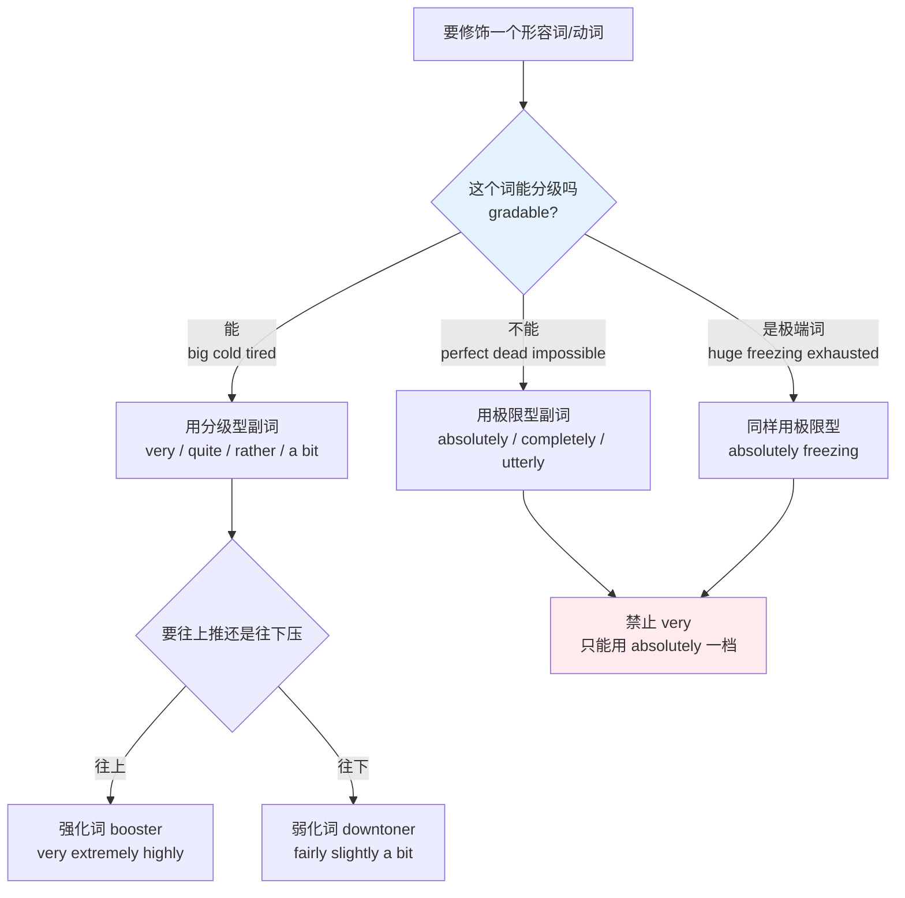
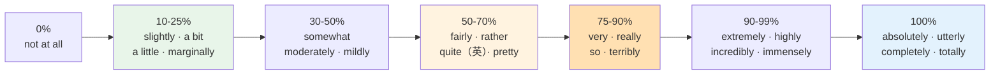
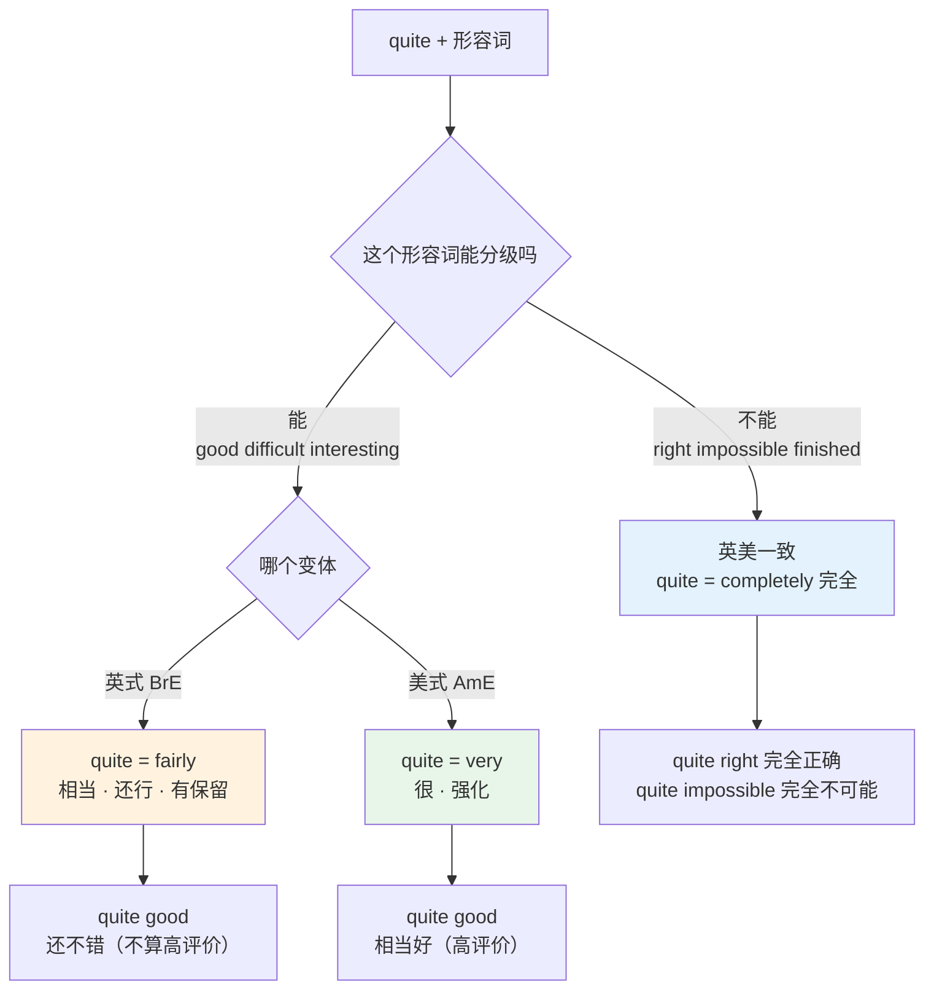
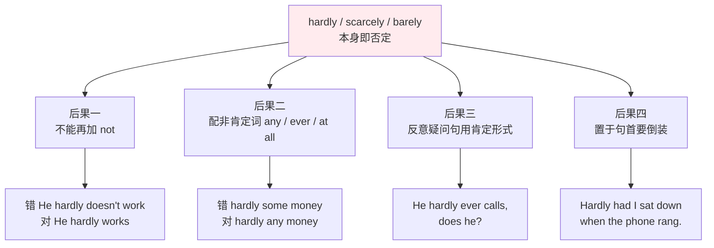
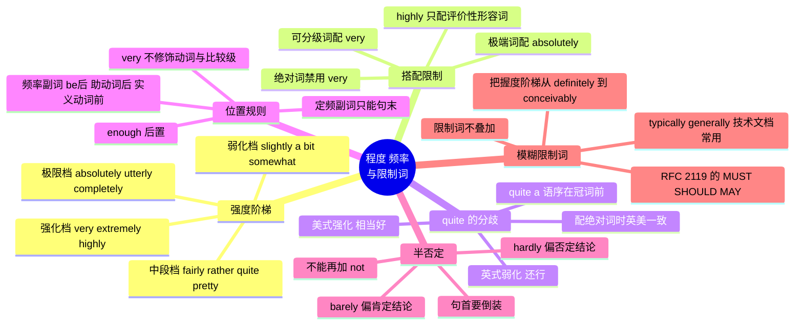

# 程度副词、频率副词与模糊限制词

> [!info] 本篇定位
>
> 封闭词类速查的第五篇，处理三类「不增加信息、只调节信息强度」的副词：程度副词、频率副词、模糊限制词。
>
> 这三类词的共同点是数量有限、可以列全，难点全在搭配限制上——不是「记不住哪个词」，而是「知道这个词却用错了配偶」。`very perfect`、`I very like it`、`He hardly not works` 这三个典型错句，各自坏在本篇的一节里。
>
> 读完你能做到三件事：给任意一个程度副词在强度轴上定位；判断一个形容词该配 `very` 还是配 `absolutely`；把频率副词放进句子的正确位置，并处理 `hardly` 带来的连锁语法反应。
>
> 上一篇 [[02.功能词与封闭词类速查/07.不规则动词形态分组与不规则复数全表\|不规则动词形态分组与不规则复数全表]] 解决的是词形，本篇解决的是强度。

---

## 1. 本篇导读：三类词共用一套判断逻辑

中文表达程度靠一个模糊的量词系统：很、挺、比较、有点、非常、极其。这套系统对搭配几乎不挑剔——「很完美」「很唯一」「很不可能」在中文里都能说，听起来最多是有点啰嗦。英语不是这样。英语的程度副词分成两个互不相通的池子，用错池子不是「不地道」，而是母语者会当场停顿的错误。

三类词表面上管的事不同，底层判断逻辑是同一个：**先看被修饰的词能不能分级，再看这个副词属于哪一档，最后看它该站在句子的哪个位置。**

| 词类 | 管什么 | 典型成员 | 本篇对应节 |
| --- | --- | --- | --- |
| 程度副词 | 强度有多高 | very, quite, slightly, absolutely | 第 2 到第 7 节 |
| 频率副词 | 发生得多密 | always, often, seldom, never | 第 8 节 |
| 模糊限制词 | 话说得多满 | probably, roughly, typically, arguably | 第 10 节 |

上图是本篇的主干判断树，也是全篇最需要形成条件反射的一步。所有搭配错误都发生在最上面那个分叉：把一个不可分级的词当成可分级的词来修饰。`very unique`、`very perfect`、`very impossible` 三个错句的成因完全相同——`unique`（唯一的）、`perfect`（完美的）、`impossible`（不可能的）在逻辑上都是二元的，没有中间刻度，因此没有「更唯一」这回事。

程度副词的另一半麻烦在位置。中文的「很」永远贴在形容词或动词前面，位置固定；英语的程度副词按修饰对象落在不同位置，修饰动词和比较级时还得换词。这是第 7 节要专门处理的问题。

---

## 2. 程度副词的强度阶梯

### 2.1 一条可比较的轴

程度副词最实用的组织方式是排成一条轴。下面这条轴不是精确刻度——语调、上下文都会推动一个词在轴上滑动——但作为选词时的第一直觉足够可靠。

这条轴上最后一格和前面六格之间有一条硬边界。前六格修饰的是可分级形容词，彼此可以替换，只是强度不同；最后一格修饰的是不可分级形容词，不能和前面互换。`fairly cold` 到 `very cold` 到 `extremely cold` 是同一条连续轴上的三个点，`absolutely freezing` 却是跳到了另一条轴——因为 `freezing` 本身已经是极限词。

### 2.2 弱化档：往下压强度

| 英文 | 英式音标 | 美式音标 | 词性 | 中文 | 搭配与说明 |
| --- | --- | --- | --- | --- | --- |
| **slightly** | /ˈslaɪtli/ | /ˈslaɪtli/ | adv. | 略微 | 最常配比较级：slightly better / slightly higher |
| **a bit** | /ə ˈbɪt/ | /ə ˈbɪt/ | phr. | 有点 | 口语；偏配负面形容词 a bit tired / a bit awkward |
| **a little** | /ə ˈlɪtl/ | /ə ˈlɪtl/ | phr. | 有点 | 比 a bit 略正式；a little nervous |
| **somewhat** | /ˈsʌmwɒt/ | /ˈsʌmwʌt/ | adv. | 稍微；有几分 | 书面语；学术写作里的标准弱化词 |
| **marginally** | /ˈmɑːdʒɪnəli/ | /ˈmɑːrdʒɪnəli/ | adv. | 微弱地 | 数据语境：marginally faster / marginally significant |
| **moderately** | /ˈmɒdərətli/ | /ˈmɑːdərətli/ | adv. | 中等地 | 技术文档常用：moderately complex |
| **mildly** | /ˈmaɪldli/ | /ˈmaɪldli/ | adv. | 轻微地 | mildly surprised / mildly irritating |

> [!warning] a bit 的极性偏好
>
> `a bit` 和 `a little` 天然往负面靠。它们后面接负面形容词自然，接正面形容词会让人觉得说话人在讽刺或在勉强承认。
>
> - ✅ I'm **a bit** tired.（有点累）
> - ✅ It's **a bit** expensive.（有点贵）
> - ❌ ~~She's **a bit** clever.~~（听起来像在贬低，暗示「也就还行」）
> - ✅ She's **fairly** clever.（中性偏正面）
>
> 想弱化一个正面形容词，用 `fairly` 或 `reasonably`，不要用 `a bit`。这条偏好在美式英语里稍弱，但在英式英语里非常明显。

`slightly` 的用法和其余几个不同：它的第一搭配对象是比较级，不是原级。

> [!example] slightly 的典型分布
>
> - The new build is **slightly** faster than the previous one.
>   - 新构建比上一版稍快一点。
> - Response times went up **slightly** after the migration.
>   - 迁移之后响应时间略有上升。
> - I'm **slightly** worried about the memory footprint.
>   - 我对内存占用有点担心。

### 2.3 中段档：强度居中的一批

| 英文 | 英式音标 | 美式音标 | 词性 | 中文 | 搭配与说明 |
| --- | --- | --- | --- | --- | --- |
| **fairly** | /ˈfeəli/ | /ˈferli/ | adv. | 相当；还算 | 中性偏正面；fairly easy / fairly common |
| **rather** | /ˈrɑːðə/ | /ˈræðər/ | adv. | 颇；相当 | 偏负面或「出乎意料」；rather difficult |
| **quite** | /kwaɪt/ | /kwaɪt/ | adv. | 相当（英）／很（美）；完全 | 英美义项分歧最大的程度副词，见第 5 节 |
| **pretty** | /ˈprɪti/ | /ˈprɪti/ | adv. | 挺；相当 | 口语；书面正式文体避免 |
| **reasonably** | /ˈriːznəbli/ | /ˈriːznəbli/ | adv. | 还算 | 中性；reasonably confident / reasonably priced |
| **relatively** | /ˈrelətɪvli/ | /ˈrelətɪvli/ | adv. | 相对地 | 隐含比较基准；relatively cheap |

### 2.4 强化档：往上推强度

| 英文 | 英式音标 | 美式音标 | 词性 | 中文 | 搭配与说明 |
| --- | --- | --- | --- | --- | --- |
| **very** | /ˈveri/ | /ˈveri/ | adv. | 很 | 只配可分级词；不能修饰动词 |
| **really** | /ˈrɪəli/ | /ˈriːəli/ | adv. | 真的；非常 | 唯一能同时修饰可分级词和极端词的强化词 |
| **so** | /səʊ/ | /soʊ/ | adv. | 这么；如此 | 带情绪；so tired / so glad；正式文体少用 |
| **terribly** | /ˈterəbli/ | /ˈterəbli/ | adv. | 非常 | 英式口语；terribly sorry，字面负义已褪去 |
| **awfully** | /ˈɔːfli/ | /ˈɔːfli/ | adv. | 非常 | 同上；awfully kind of you |
| **highly** | /ˈhaɪli/ | /ˈhaɪli/ | adv. | 高度地 | 挑搭配：highly likely / highly skilled，❌ highly big |
| **extremely** | /ɪkˈstriːmli/ | /ɪkˈstriːmli/ | adv. | 极其 | 正式与口语通吃，可安全替换 very |
| **incredibly** | /ɪnˈkredəbli/ | /ɪnˈkredəbli/ | adv. | 难以置信地 | 口语强化；incredibly fast |
| **remarkably** | /rɪˈmɑːkəbli/ | /rɪˈmɑːrkəbli/ | adv. | 显著地 | 书面；remarkably consistent |
| **hugely** | /ˈhjuːdʒli/ | /ˈhjuːdʒli/ | adv. | 极大地 | hugely popular / hugely influential |
| **immensely** | /ɪˈmensli/ | /ɪˈmensli/ | adv. | 极其 | 偏书面；immensely grateful |
| **particularly** | /pəˈtɪkjələli/ | /pərˈtɪkjələrli/ | adv. | 特别地 | 常用于否定：not particularly good（不怎么样） |
| **especially** | /ɪˈspeʃəli/ | /ɪˈspeʃəli/ | adv. | 尤其 | 更偏「在同类中突出」，不纯粹是强度 |

`highly` 是这一档里最容易用错的。它不是通用强化词，只配抽象的、评价性的、技术性的形容词，而且这些形容词多半以 `-ed`、`-ive`、`-able`、`-ly` 结尾或本身是抽象概念。

> [!warning] highly 的搭配白名单
>
> - ✅ **highly** likely / unlikely / probable（可能性）
> - ✅ **highly** effective / efficient / successful（效果）
> - ✅ **highly** skilled / qualified / trained / experienced（能力）
> - ✅ **highly** recommended / regarded / respected（评价）
> - ✅ **highly** competitive / controversial / sensitive（性质）
> - ❌ ~~highly big~~ / ~~highly cold~~ / ~~highly tired~~ / ~~highly happy~~
>
> 判断口诀：`highly` 配的是「需要评估才能得出的属性」，不配「用眼睛和身体直接感知的属性」。

---

## 3. 分级词与非分级词：搭配限制的源头

### 3.1 形容词的四种分级性

英语形容词按能不能分级分成四类，决定了它能配哪一池副词。这个分类不是语法书上的装饰，它是本篇所有搭配规则的唯一根据。

| 类别 | 英文术语 | 特征 | 例词 | 能配的副词 |
| --- | --- | --- | --- | --- |
| 可分级 | gradable | 有连续刻度，可比较级 | big, cold, tired, useful, expensive | very, quite, rather, fairly, a bit, extremely |
| 极端 | extreme / strong | 本身已在刻度顶端 | huge, freezing, exhausted, fascinating | absolutely, utterly, really, quite（=完全） |
| 绝对 | absolute / limit | 逻辑上二元，无中间态 | perfect, dead, impossible, unique, correct | absolutely, completely, totally, quite, virtually |
| 分类 | classifying | 表类属，不表程度 | nuclear, digital, wooden, annual | 几乎不配程度副词 |

### 3.2 可分级词与它的极端对应词

英语的一个系统性特点是：许多常用可分级形容词都有一个现成的极端对应词。学会成对记忆，能同时解决「词汇贫乏」和「搭配用错」两个问题。

| 可分级词 | 音标（英/美） | 极端对应词 | 音标（英/美） | 中文 |
| --- | --- | --- | --- | --- |
| **big** | /bɪɡ/ · /bɪɡ/ | **enormous** | /ɪˈnɔːməs/ · /ɪˈnɔːrməs/ | 大 → 巨大 |
| **small** | /smɔːl/ · /smɔːl/ | **tiny** | /ˈtaɪni/ · /ˈtaɪni/ | 小 → 微小 |
| **cold** | /kəʊld/ · /koʊld/ | **freezing** | /ˈfriːzɪŋ/ · /ˈfriːzɪŋ/ | 冷 → 冰冷 |
| **hot** | /hɒt/ · /hɑːt/ | **boiling** | /ˈbɔɪlɪŋ/ · /ˈbɔɪlɪŋ/ | 热 → 滚烫 |
| **tired** | /ˈtaɪəd/ · /ˈtaɪərd/ | **exhausted** | /ɪɡˈzɔːstɪd/ · /ɪɡˈzɔːstɪd/ | 累 → 精疲力竭 |
| **hungry** | /ˈhʌŋɡri/ · /ˈhʌŋɡri/ | **starving** | /ˈstɑːvɪŋ/ · /ˈstɑːrvɪŋ/ | 饿 → 饿坏了 |
| **angry** | /ˈæŋɡri/ · /ˈæŋɡri/ | **furious** | /ˈfjʊəriəs/ · /ˈfjʊriəs/ | 生气 → 暴怒 |
| **surprised** | /səˈpraɪzd/ · /sərˈpraɪzd/ | **astonished** | /əˈstɒnɪʃt/ · /əˈstɑːnɪʃt/ | 惊讶 → 震惊 |
| **bad** | /bæd/ · /bæd/ | **appalling** | /əˈpɔːlɪŋ/ · /əˈpɔːlɪŋ/ | 差 → 糟透 |
| **good** | /ɡʊd/ · /ɡʊd/ | **superb** | /suːˈpɜːb/ · /suːˈpɜːrb/ | 好 → 极好 |
| **interesting** | /ˈɪntrəstɪŋ/ · /ˈɪntrəstɪŋ/ | **fascinating** | /ˈfæsɪneɪtɪŋ/ · /ˈfæsɪneɪtɪŋ/ | 有趣 → 引人入胜 |
| **funny** | /ˈfʌni/ · /ˈfʌni/ | **hilarious** | /hɪˈleəriəs/ · /hɪˈleriəs/ | 好笑 → 爆笑 |
| **dirty** | /ˈdɜːti/ · /ˈdɜːrti/ | **filthy** | /ˈfɪlθi/ · /ˈfɪlθi/ | 脏 → 肮脏不堪 |
| **clean** | /kliːn/ · /kliːn/ | **spotless** | /ˈspɒtləs/ · /ˈspɑːtləs/ | 干净 → 一尘不染 |
| **wet** | /wet/ · /wet/ | **soaked** | /səʊkt/ · /soʊkt/ | 湿 → 湿透 |
| **crowded** | /ˈkraʊdɪd/ · /ˈkraʊdɪd/ | **packed** | /pækt/ · /pækt/ | 拥挤 → 挤满 |
| **necessary** | /ˈnesəsəri/ · /ˈnesəseri/ | **essential** | /ɪˈsenʃl/ · /ɪˈsenʃl/ | 必要 → 必不可少 |
| **sure** | /ʃʊə/ · /ʃʊr/ | **certain** | /ˈsɜːtn/ · /ˈsɜːrtn/ | 确信 → 确定无疑 |

> [!warning] 左右两列不能混用副词
>
> - ✅ It's **very** cold. / It's **absolutely** freezing.
> - ❌ ~~It's very freezing.~~
> - ✅ I'm **very** tired. / I'm **absolutely** exhausted.
> - ❌ ~~I'm very exhausted.~~
> - ✅ The film was **quite** interesting.（英式：还算有趣）/ The film was **absolutely** fascinating.
> - ❌ ~~The film was very fascinating.~~
>
> 口语里 `very exhausted` 这类说法确实听得到，但在书面表达和考试中会被判为搭配不当。稳妥策略：极端词只配 `absolutely` / `really` / `utterly` / `completely`。

### 3.3 绝对形容词清单

绝对形容词是逻辑上没有中间态的词。它们不能比较级，不能配 `very`。

| 英文 | 英式音标 | 美式音标 | 词性 | 中文 | 搭配与说明 |
| --- | --- | --- | --- | --- | --- |
| **perfect** | /ˈpɜːfɪkt/ | /ˈpɜːrfɪkt/ | adj. | 完美的 | ❌ very perfect；✅ absolutely perfect |
| **unique** | /juˈniːk/ | /juˈniːk/ | adj. | 独一无二的 | ❌ very unique；✅ truly unique |
| **impossible** | /ɪmˈpɒsəbl/ | /ɪmˈpɑːsəbl/ | adj. | 不可能的 | ✅ quite impossible（=完全不可能） |
| **dead** | /ded/ | /ded/ | adj. | 死的 | ✅ completely dead（用于机器电池等） |
| **correct** | /kəˈrekt/ | /kəˈrekt/ | adj. | 正确的 | ✅ absolutely correct / quite correct |
| **identical** | /aɪˈdentɪkl/ | /aɪˈdentɪkl/ | adj. | 完全相同的 | ✅ virtually identical（几乎相同） |
| **empty** | /ˈempti/ | /ˈempti/ | adj. | 空的 | ✅ completely empty；口语允许 half empty |
| **final** | /ˈfaɪnl/ | /ˈfaɪnl/ | adj. | 最终的 | ✅ absolutely final |
| **universal** | /ˌjuːnɪˈvɜːsl/ | /ˌjuːnɪˈvɜːrsl/ | adj. | 普遍的 | ✅ almost universal |
| **fatal** | /ˈfeɪtl/ | /ˈfeɪtl/ | adj. | 致命的 | ✅ potentially fatal，不用 very |

`unique` 是这批词里争议最大的。规范用法里它只表示「独一无二」，因此不能分级；但实际语料里 `very unique` 大量存在，用来表示「很特别」。写正式文本时避开这个用法——审稿人和语法检查工具都会标它。要表达「非常特别」，用 `truly unique`、`highly distinctive` 或 `quite exceptional`。

---

## 4. absolutely 与 utterly：极限档的分工

### 4.1 极限档词表

| 英文 | 英式音标 | 美式音标 | 词性 | 中文 | 搭配与说明 |
| --- | --- | --- | --- | --- | --- |
| **absolutely** | /ˌæbsəˈluːtli/ | /ˌæbsəˈluːtli/ | adv. | 绝对地 | 极限档通用词；褒贬皆可，可单独作答语 |
| **utterly** | /ˈʌtəli/ | /ˈʌtərli/ | adv. | 完全地 | 强烈偏负面；utterly useless / utterly ridiculous |
| **completely** | /kəmˈpliːtli/ | /kəmˈpliːtli/ | adv. | 完全地 | 最中性；completely different / completely wrong |
| **totally** | /ˈtəʊtəli/ | /ˈtoʊtəli/ | adv. | 完全地 | 口语色彩重于 completely；totally agree |
| **entirely** | /ɪnˈtaɪəli/ | /ɪnˈtaɪərli/ | adv. | 完全地 | 偏书面；entirely possible / not entirely clear |
| **perfectly** | /ˈpɜːfɪktli/ | /ˈpɜːrfɪktli/ | adv. | 完全地 | 固定搭配为主：perfectly clear / normal / legal |
| **thoroughly** | /ˈθʌrəli/ | /ˈθɜːroʊli/ | adv. | 彻底地 | 配动词更多：thoroughly tested / thoroughly enjoyed |
| **wholly** | /ˈhəʊlli/ | /ˈhoʊlli/ | adv. | 全然 | 正式书面；wholly owned subsidiary |
| **quite** | /kwaɪt/ | /kwaɪt/ | adv. | 完全 | 配绝对形容词时英美一致表「完全」 |
| **simply** | /ˈsɪmpli/ | /ˈsɪmpli/ | adv. | 简直 | 情绪强化：simply impossible / simply brilliant |
| **downright** | /ˈdaʊnraɪt/ | /ˈdaʊnraɪt/ | adv. | 简直是 | 只配负面：downright dangerous / downright rude |
| **practically** | /ˈpræktɪkli/ | /ˈpræktɪkli/ | adv. | 几乎 | 逼近极限但没到；practically impossible |
| **virtually** | /ˈvɜːtʃuəli/ | /ˈvɜːrtʃuəli/ | adv. | 实际上几乎 | 技术写作常用；virtually identical |

### 4.2 absolutely 与 utterly 的极性差异

两个词都表示「百分之百」，但分布完全不同：`absolutely` 中立，`utterly` 强烈偏负面。

| 词 | 极性 | 典型搭配 | 能否单独作答语 |
| --- | --- | --- | --- |
| **absolutely** | 褒贬通吃 | absolutely brilliant / absolutely terrible / absolutely right | 能：`Absolutely!` |
| **utterly** | 压倒性偏负面 | utterly useless / utterly ridiculous / utterly exhausted | 不能 |
| **completely** | 最中性 | completely different / completely wrong / completely free | 不能 |
| **totally** | 中性偏口语 | totally different / totally unacceptable / totally agree | 能：`Totally!` |
| **entirely** | 中性偏书面 | entirely possible / not entirely clear / entirely separate | 不能 |

表里列出的搭配不是穷举，是频率最高的几组。`utterly` 的负面倾向强到什么程度？`utterly delightful`（愉快极了）语法上完全成立，但在真实语料里出现频率远低于 `utterly appalling`，写出来会带上一点刻意的文学腔。要说「好得不得了」，`absolutely delightful` 才是默认选择。`utterly convinced`（深信不疑）和 `utterly determined`（决心已定）是这条负面倾向的两个常见例外，它们强调的是「不留余地」，不是「糟糕」。

> [!example] 三个极限词的替换测试
>
> - The proposal was **absolutely** brilliant.
>   - 这个提案棒极了。（褒义，自然）
> - The proposal was **utterly** brilliant.
>   - 这个提案精彩绝伦。（能说，但带文学腔）
> - The proposal was **utterly** pointless.
>   - 这个提案毫无意义。（负面，最自然的 utterly 用法）
> - The two files are **completely** different.
>   - 这两个文件完全不同。（中性事实陈述，此处不该用 utterly）

### 4.3 强化词与形容词的固定搭配

极限档之外，英语还有一批强化副词的搭配是半固定的，换一个近义词就会不自然。这类搭配必须成组记，不能靠推导。

| 强化副词 | 音标（英/美） | 高频搭配 | 中文 |
| --- | --- | --- | --- |
| **highly** | /ˈhaɪli/ · /ˈhaɪli/ | likely, recommended, skilled, controversial | 高度…… |
| **deeply** | /ˈdiːpli/ · /ˈdiːpli/ | concerned, moved, rooted, grateful, divided | 深深地…… |
| **strongly** | /ˈstrɒŋli/ · /ˈstrɔːŋli/ | recommend, agree, disagree, oppose, believe | 强烈地…… |
| **badly** | /ˈbædli/ · /ˈbædli/ | damaged, injured, need, affected, behaved | 严重地…… |
| **heavily** | /ˈhevɪli/ · /ˈhevɪli/ | rely, depend, criticised, armed, influenced | 严重地／大量地 |
| **bitterly** | /ˈbɪtəli/ · /ˈbɪtərli/ | disappointed, cold, regret, opposed | 极度地…… |
| **seriously** | /ˈsɪəriəsli/ · /ˈsɪriəsli/ | injured, ill, consider, doubt, damaged | 严重地／认真地 |
| **greatly** | /ˈɡreɪtli/ · /ˈɡreɪtli/ | appreciate, improved, exaggerated, reduced | 大大地…… |
| **widely** | /ˈwaɪdli/ · /ˈwaɪdli/ | used, known, available, regarded, accepted | 广泛地…… |
| **vastly** | /ˈvɑːstli/ · /ˈvæstli/ | different, improved, superior, overrated | 极大地…… |
| **fully** | /ˈfʊli/ · /ˈfʊli/ | aware, understand, support, automatic, booked | 完全地…… |
| **considerably** | /kənˈsɪdərəbli/ · /kənˈsɪdərəbli/ | faster, larger, reduced, improved | 相当大地…… |
| **significantly** | /sɪɡˈnɪfɪkəntli/ · /sɪɡˈnɪfɪkəntli/ | higher, lower, different, improved | 显著地…… |

> [!tip] 技术写作里最实用的四个
>
> 读英文技术文档和写英文提交信息时，下面四组出现频率最高：
>
> - **strongly recommend / strongly discouraged** —— 官方文档给建议的标准措辞
> - **heavily rely on / heavily depend on** —— 描述依赖关系
> - **significantly faster / significantly reduced** —— 性能对比，比 much faster 更适合正式基准报告
> - **fully supported / not fully supported** —— 兼容性说明
>
> 把这四组当整块记，比单独背 `strongly`、`heavily` 的中文释义有效得多。

---

## 5. quite：一个词的英美分歧

### 5.1 分歧在哪里

`quite` 是英语里方向感最混乱的程度副词，因为它在同一条轴上可以往两个相反方向走，而英式和美式的默认方向不同。

上图的分岔点在「形容词能不能分级」。配绝对形容词时，英美两个变体的理解完全一致：`quite` 就是 `completely`。分歧只发生在可分级形容词上，而这恰恰是日常最常用的情况。

### 5.2 同一句话的两种读法

> [!warning] quite good 是表扬还是敷衍
>
> 英国人说 `The presentation was quite good.`，多数情况下意思是「还行吧，没什么问题」——是一句有保留的评价，比 `good` 还低一档。
>
> 美国人说同一句话，多数情况下意思是「讲得相当好」——比 `good` 高一档。
>
> - **英式**：`quite good` ≈ `fairly good` ≈ 还可以
> - **美式**：`quite good` ≈ `very good` ≈ 相当好
>
> 后果很实际：中国学习者写邮件夸同事的方案 `Your design is quite good.`，如果收件人是英国人，读到的是一句不冷不热的评语。要明确表扬，换成 `really good`、`excellent` 或 `very well done`，这三个词在两个变体里方向一致。

英式用法里还有一个语调开关：重音落在 `quite` 上是弱化，重音落在形容词上是强化。`It was QUITE good`（也就还行）和 `It was quite GOOD`（真挺好的）是两个意思。这一层信息在文字里丢失，所以书面沟通更应该避开 `quite`。

### 5.3 quite 的其余四个用法

| 用法 | 结构 | 例句 | 含义 |
| --- | --- | --- | --- |
| 配绝对词 | quite + 绝对形容词 | You're **quite right**. | 完全正确（英美一致） |
| 配名词短语 | quite a/an + 名词 | That's **quite a difference**. | 差别不小（强化，英美一致） |
| 否定弱化 | not quite | I'm **not quite** finished. | 还差一点（不是完全否定） |
| 配动词 | quite + 动词 | I **quite like** it. | 还挺喜欢（英式，中等好感） |

> [!example] 四个用法的对照
>
> - You're **quite right** — that endpoint was deprecated last year.
>   - 你说得完全对，那个接口去年就废弃了。
> - Rewriting it in Rust made **quite a difference** to startup time.
>   - 用 Rust 重写对启动时间的影响不小。
> - The migration isn't **quite** done; two tables are still syncing.
>   - 迁移还没完全做完，还有两张表在同步。
> - I **quite like** the new API, though the naming is odd.
>   - 我还挺喜欢这套新接口的，虽然命名有点怪。

> [!warning] quite a 的语序
>
> `quite` 放在冠词前面，不是后面。这一点和 `such` 一致，和 `very` 相反。
>
> - ✅ It was **quite a** long meeting.
> - ❌ ~~It was a quite long meeting.~~
> - ✅ It was **such a** long meeting.
> - ✅ It was **a very** long meeting.（very 在冠词后）
>
> `rather` 两种语序都可以：`rather a long meeting` 和 `a rather long meeting` 都成立，前者略正式。

---

## 6. rather、fairly、pretty、somewhat：中段四个词的分工

### 6.1 极性是主要区别

这四个词的强度接近，真正的区别在情感极性和语域。

| 词 | 极性 | 语域 | 后接倾向 | 一句话判据 |
| --- | --- | --- | --- | --- |
| **fairly** | 中性偏正面 | 通用 | 正面形容词 | 说好话时的弱化词 |
| **rather** | 偏负面／意外 | 偏英式、偏书面 | 负面形容词 | 说坏话时的弱化词 |
| **pretty** | 中性 | 口语 | 都可以 | 非正式场合的通用中段词 |
| **somewhat** | 中性 | 正式书面 | 都可以 | 学术与技术文档的标准弱化词 |

> [!example] 同一个位置换四个词
>
> - The setup process is **fairly** straightforward.
>   - 安装过程还算直接。（正面，中性语域）
> - The setup process is **rather** convoluted.
>   - 安装过程相当绕。（负面，带抱怨）
> - The setup process is **pretty** straightforward.
>   - 安装过程挺直接的。（口语，同事之间）
> - The setup process is **somewhat** involved.
>   - 安装过程略显复杂。（正式，写进文档里）

把这四句里的形容词和副词交叉替换，会立刻感到不自然：`rather straightforward` 隐含「比我预想的直接，有点意外」；`fairly convoluted` 则像是在为一件坏事找补，两者都不是中性表述。

### 6.2 rather 的「出乎意料」义

`rather` 配正面形容词时不是简单的弱化，而是带上了「比预期好」的意外感。这是英式英语里一种常见的低调赞美。

> [!example] rather 的意外义
>
> - The new intern is **rather** good, actually.
>   - 那个新来的实习生其实相当不错。（言外之意：本来没抱期望）
> - I found the documentation **rather** helpful.
>   - 我觉得文档意外地有用。（暗示原以为文档很差）
> - It's **rather** colder than I expected.
>   - 比我预想的冷不少。（rather 也修饰比较级）

`rather` 能修饰比较级是它和 `very` 的一个重要区别，这一点归到第 7 节的位置规则里一并处理。

### 6.3 pretty 的语域限制

`pretty` 作程度副词时纯属口语，写进正式文档、学术论文、法律文本会显得随意。它在技术团队的内部沟通里非常常见，在对外发布的文档里应该换掉。

| 场景 | 该用 | 不该用 |
| --- | --- | --- |
| Slack 里跟同事说话 | It's **pretty** slow. | — |
| 提交信息 / PR 描述 | This is **noticeably** slower. | ~~This is pretty slow.~~ |
| 官方文档 | Performance is **somewhat** degraded. | ~~pretty bad~~ |
| 学术写作 | The effect is **moderately** strong. | ~~pretty strong~~ |

注意 `pretty` 和 `pretty much` 是两个东西。`pretty much` 意思是「基本上、差不多」，属于第 10 节的模糊限制词：`The migration is pretty much done.`（迁移基本完成了）。

---

## 7. 程度副词的位置规则

### 7.1 五种修饰对象，五套位置

程度副词的位置由修饰对象决定，放错了就是语法错误，不只是不地道。

| 修饰对象 | 副词放哪 | very 能不能用 | 示例 |
| --- | --- | --- | --- |
| 形容词 | 形容词之前 | 能 | **very** useful / **extremely** rare |
| 另一个副词 | 副词之前 | 能 | **quite** quickly / **very** carefully |
| 动词 | 动词前或句末 | 不能 | I **really** like it. / I like it **very much**. |
| 比较级 | 比较级之前 | 不能 | **much** better / **slightly** faster |
| 名词短语 | 冠词之前或之后 | 位置受限 | **quite a** long meeting / **a very** long meeting |

后两行是中文母语者错误最集中的两处。`very` 只能修饰形容词和副词，碰到动词和比较级都要换词——这是英语和中文最大的结构差异之一，中文的「很」在这五种情况下全部通用，英语没有任何一个程度副词能这么万能。

### 7.2 修饰动词：very 的替代方案

中文说「我很喜欢这个」，直译成 `I very like this` 是错的。英语修饰动词有三条路：

| 方案 | 结构 | 例句 | 语域 |
| --- | --- | --- | --- |
| really | really + 动词 | I **really** like this design. | 通用，最安全 |
| very much | 动词 + ... + very much | I like this design **very much**. | 略正式 |
| a lot | 动词 + ... + a lot | I like this design **a lot**. | 口语 |
| much | much + 动词（限定动词） | I **much** prefer the old layout. | 正式，只配 prefer/appreciate/regret 等 |

> [!warning] 中文母语者第一号错误
>
> - ❌ ~~I very like this library.~~
> - ✅ I **really** like this library.
> - ✅ I like this library **very much**.
> - ✅ I like this library **a lot**.
>
> - ❌ ~~I very want to go.~~
> - ✅ I **really** want to go.
> - ✅ I'd **very much** like to go.（更正式的说法）
>
> `very much` 在肯定句里的位置通常在句末；如果宾语很长，可以提到动词前：`I very much appreciate your help.`

### 7.3 修饰比较级：very 同样不行

| 场景 | 错误 | 正确 |
| --- | --- | --- |
| 大幅度 | ~~very better~~ | **much** better / **far** better / **a lot** better |
| 大幅度（正式） | ~~very faster~~ | **considerably** faster / **significantly** faster |
| 小幅度 | ~~a bit more better~~ | **slightly** better / **a bit** better |
| 数据描述 | ~~very higher~~ | **marginally** higher / **substantially** higher |

`very` 唯一能配的比较结构是最高级，而且是加强「就是这个」的意思：`the very best option`（最好的那个选择）、`the very last commit`（最后那一次提交）。这个 `very` 已经不是程度副词，而是强调词，等于 `exactly`。

### 7.4 enough 的特殊位置

`enough` 是程度词里唯一后置的：修饰形容词和副词时放在后面，修饰名词时放在前面。

> [!example] enough 的两种位置
>
> - The response is **fast enough** for our use case.
>   - 响应速度对我们的场景够快了。（形容词后）
> - He didn't explain it **clearly enough**.
>   - 他没解释得够清楚。（副词后）
> - We don't have **enough memory** to run both services.
>   - 我们内存不够同时跑这两个服务。（名词前）
> - ❌ ~~The response is enough fast.~~

### 7.5 too 不是 very

`too` 表示「超过了可接受的限度」，永远带负面判断；`very` 只是高强度，中性。

- ✅ This coffee is **very** hot.（很烫，可能正合适）
- ✅ This coffee is **too** hot.（太烫了，喝不了）
- ❌ ~~Thank you too much.~~ → ✅ Thank you **very** much.

中文的「太好了」是褒义，英语的 `too good` 不是。`too good to be true`（好得不像真的）说的是可疑，不是称赞。

---

## 8. 频率副词：频率带与三个位置

### 8.1 频率带词表

| 英文 | 英式音标 | 美式音标 | 词性 | 中文 | 搭配与说明 |
| --- | --- | --- | --- | --- | --- |
| **always** | /ˈɔːlweɪz/ | /ˈɔːlweɪz/ | adv. | 总是 | 100%；不能置于句末 |
| **constantly** | /ˈkɒnstəntli/ | /ˈkɑːnstəntli/ | adv. | 不断地 | 常带抱怨意味：constantly crashing |
| **usually** | /ˈjuːʒuəli/ | /ˈjuːʒuəli/ | adv. | 通常 | 约 80%；可置句首句末 |
| **normally** | /ˈnɔːməli/ | /ˈnɔːrməli/ | adv. | 正常情况下 | 隐含「有例外」；文档中常见 |
| **generally** | /ˈdʒenrəli/ | /ˈdʒenrəli/ | adv. | 一般来说 | 兼作模糊限制词 |
| **frequently** | /ˈfriːkwəntli/ | /ˈfriːkwəntli/ | adv. | 频繁地 | 比 often 正式 |
| **often** | /ˈɒfn/ | /ˈɔːfn/ | adv. | 经常 | 约 60%；t 可发可不发，/ˈɒftən/ 也标准 |
| **regularly** | /ˈreɡjələli/ | /ˈreɡjələrli/ | adv. | 定期地 | 强调规律性而非次数 |
| **repeatedly** | /rɪˈpiːtɪdli/ | /rɪˈpiːtɪdli/ | adv. | 反复地 | 常配负面事件：repeatedly failed |
| **sometimes** | /ˈsʌmtaɪmz/ | /ˈsʌmtaɪmz/ | adv. | 有时 | 约 40%；三个位置都能站 |
| **occasionally** | /əˈkeɪʒnəli/ | /əˈkeɪʒnəli/ | adv. | 偶尔 | 约 20%；比 sometimes 低 |
| **periodically** | /ˌpɪəriˈɒdɪkli/ | /ˌpɪriˈɑːdɪkli/ | adv. | 周期性地 | 技术文档高频：polls periodically |
| **seldom** | /ˈseldəm/ | /ˈseldəm/ | adv. | 很少 | 约 10%；书面，比 rarely 更正式 |
| **rarely** | /ˈreəli/ | /ˈrerli/ | adv. | 很少 | 约 10%；口语书面通用 |
| **never** | /ˈnevə/ | /ˈnevər/ | adv. | 从不 | 0%；本身否定，不能再加 not |
| **ever** | /ˈevə/ | /ˈevər/ | adv. | 曾经 | 非肯定语境用词：疑问、否定、条件句 |
| **continually** | /kənˈtɪnjuəli/ | /kənˈtɪnjuəli/ | adv. | 一再地 | 有间断的反复 |
| **continuously** | /kənˈtɪnjuəsli/ | /kənˈtɪnjuəsli/ | adv. | 连续不断地 | 无间断；两词区别是考点也是文档陷阱 |

表里的百分比是教学上惯用的相对刻度，用来标出这些词彼此之间的高低次序，不是语料统计出来的实际频率。`usually` 和 `often` 谁更高、`seldom` 和 `occasionally` 差多少，在真实语料里都随语境浮动，记住次序即可，不必记住数字。

> [!warning] continually 与 continuously
>
> 拼写只差两个字母，含义差一整个概念：
>
> - **continually** = 反复发生，中间有停顿。The service **continually** restarts.（服务反复重启，重启之间是停着的）
> - **continuously** = 不间断地持续。The logger writes **continuously** to disk.（日志持续不断地写盘）
>
> 写技术文档时选错会直接改变系统行为的描述。判断口诀：中间断不断？断 → continually；不断 → continuously。

### 8.2 三个位置及其规则

| 位置 | 例句 | 哪些词能站 |
| --- | --- | --- |
| 句首 front | **Sometimes** I work late. | sometimes, usually, normally, occasionally, frequently, generally |
| 句中 mid | I **often** work late. | 全部频率副词都能站，默认位置 |
| 句末 end | I work late **sometimes**. | 同句首那一批；always / never / rarely / seldom 通常不行 |

句中位置是默认位置，也是唯一所有频率副词都能站的位置。它的规则可以压成一句话：**be 之后、第一个助动词之后、实义动词之前。** 三条子规则互不冲突，因为一个句子里最多命中其中一条。

> [!example] 句中位置的四种句型
>
> - She **is** always **late** for standup.
>   - be 动词之后。她开站会总是迟到。
> - I have **never** used that framework.
>   - 第一个助动词 have 之后。我从没用过那个框架。
> - The build **usually** takes about six minutes.
>   - 实义动词之前。构建通常要六分钟左右。
> - This should **rarely** happen in production.
>   - 情态动词 should 之后（should 是第一个助动词）。这在生产环境应该很少发生。

> [!warning] 助动词多于一个时放哪
>
> 只跟在**第一个**助动词后面，不是最后一个。
>
> - ✅ I have **always** been interested in compilers.
> - ❌ ~~I have been always interested in compilers.~~
> - ✅ The report will **usually** have been generated by then.
> - ❌ ~~The report will have been usually generated by then.~~

### 8.3 例外：位置移动带来的意义变化

有两种情况副词要跳出默认位置。

**情况一：助动词被强调时，副词跑到助动词前面。** 这通常出现在反驳对方的语境里。

> [!example] 强调语序
>
> - I have **always** liked this design.
>   - 常规语序，中性陈述，重音在 liked 上。
> - A: You've never liked this design. B: I **always have** liked it.
>   - 副词提到助动词之前，重音落在 have 上，语气是反驳。
> - A: You never test your code. B: I **do always** test it.
>   - 另一种反驳手法：补一个助动词 do 承担重音，副词仍留在助动词之后。

**情况二：否定频率副词置于句首，主谓要倒装。** 这是正式书面语的手法。

> [!example] 否定副词前置倒装
>
> - **Rarely have I** seen a bug this hard to reproduce.
>   - 我很少见到这么难复现的 bug。
> - **Seldom does** a rewrite pay off this quickly.
>   - 重写很少能这么快见效。
> - **Never before had** the system handled this much traffic.
>   - 系统此前从未处理过这么大的流量。
> - 对比常规语序：I have **rarely** seen a bug this hard to reproduce.
>   - 同一个意思，不倒装，日常写作用这一句。

倒装是可选的修辞手段，不是必须。日常写作用常规语序即可，读技术书和论文时会遇到倒装句，需要能认出来。

### 8.4 定频副词只能放句末

表示确切频率的词组（`daily`、`twice a week`、`every day`、`once a month`）和上面的不定频副词不同，它们几乎只能放句末，不能放句中。

| 英文 | 英式音标 | 美式音标 | 词性 | 中文 | 搭配与说明 |
| --- | --- | --- | --- | --- | --- |
| **daily** | /ˈdeɪli/ | /ˈdeɪli/ | adv./adj. | 每天 | 兼形容词：a daily backup |
| **weekly** | /ˈwiːkli/ | /ˈwiːkli/ | adv./adj. | 每周 | 同上 |
| **monthly** | /ˈmʌnθli/ | /ˈmʌnθli/ | adv./adj. | 每月 | 同上 |
| **annually** | /ˈænjuəli/ | /ˈænjuəli/ | adv. | 每年 | 形容词形式是 annual |
| **once** | /wʌns/ | /wʌns/ | adv. | 一次；曾经 | once a day；也表「从前」 |
| **twice** | /twaɪs/ | /twaɪs/ | adv. | 两次 | 没有 ❌ twice times 这种说法 |

> [!warning] 定频副词的位置
>
> - ✅ The job runs **daily**. / The job runs **twice a day**.
> - ❌ ~~The job daily runs.~~
> - ✅ We **usually** deploy **on Fridays**.（不定频在句中，具体时间在句末）
> - ❌ ~~We deploy usually.~~（usually 单独放句末不自然）

`always` 唯一能站句首的场合是祈使句：`Always check the return value.`（一定要检查返回值。）这在技术文档的注意事项里非常常见。

---

## 9. 半否定副词：hardly、scarcely、barely

### 9.1 三个词的分工

这三个词的字面意思都是「几乎不」，但侧重点不同。

| 英文 | 英式音标 | 美式音标 | 词性 | 中文 | 搭配与说明 |
| --- | --- | --- | --- | --- | --- |
| **hardly** | /ˈhɑːdli/ | /ˈhɑːrdli/ | adv. | 几乎不 | 最通用；hardly any / hardly ever |
| **scarcely** | /ˈskeəsli/ | /ˈskersli/ | adv. | 几乎不 | 更书面、偏文学；scarcely...when 表时间 |
| **barely** | /ˈbeəli/ | /ˈberli/ | adv. | 勉强 | 强调「差一点就不行」，结果是肯定的 |
| **little** | /ˈlɪtl/ | /ˈlɪtl/ | adv. | 几乎不 | 正式；little did he know（他浑然不知） |
| **no sooner** | /nəʊ ˈsuːnə/ | /noʊ ˈsuːnər/ | phr. | 刚一…… | no sooner...than，注意配 than 不配 when |

> [!warning] hardly 与 barely 的方向差
>
> 两个词看起来同义，实际感情方向相反：
>
> - I **hardly** finished the task.（几乎没做完，重点是「没完成」）
> - I **barely** finished the task.（勉强做完了，重点是「完成了，但差点没完成」）
>
> `barely` 的隐含结论是肯定的，`hardly` 的隐含结论是否定的。
>
> - He **barely** passed the exam.（勉强及格了 —— 及格了）
> - He **hardly** studied for the exam.（几乎没复习 —— 没复习）

### 9.2 半否定带来的四个语法后果

这三个词本身携带否定意义，会触发一整套连锁反应。**没有意识到它们是否定词**，是中文母语者用错它们的根本原因。

上图四条后果里，第一条和第二条是硬性错误，第三条是母语者的自动反应，第四条是可选的正式用法。逐条展开：

**后果一：不能与 not 同现。** 一个句子里已经有 `hardly` 就不能再有 `not`、`no`、`never`。中文的「几乎不」是一个整体，容易让人误以为英语要写成 `hardly not`。

- ❌ ~~I can hardly not believe it.~~
- ✅ I can **hardly** believe it.（我简直不敢相信）
- ❌ ~~There's hardly no time left.~~
- ✅ There's **hardly any** time left.（几乎没时间了）

**后果二：后面接非肯定词。** 肯定句用 `some`、`already`、`too`；否定句和半否定句用 `any`、`yet`、`either`、`ever`、`at all`。

| 肯定句用 | 半否定句用 | 例句 |
| --- | --- | --- |
| some | any | There's **hardly any** documentation. |
| already | yet | The migration has **hardly** begun **yet**. |
| sometimes | ever | She **hardly ever** replies to email. |
| too | either | He **hardly** speaks French, and I don't **either**. |
| a lot | at all | I **scarcely** slept **at all** last night. |

**后果三：反意疑问句跟肯定形式。** 因为主句已经是否定的，附加疑问要转成肯定。

- He **hardly ever** shows up on time, **does he**?（他几乎没准时来过，是吧？）
- 对比肯定句：He shows up on time, **doesn't he**?

**后果四：置于句首触发倒装。** 和第 8.3 节的否定频率副词倒装是同一条规则。

> [!example] 三个词的倒装句式
>
> - **Hardly had** the deploy finished **when** the alerts started firing.
>   - 部署刚一结束，告警就开始响了。
> - **Scarcely had** we fixed one bug **before** two more appeared.
>   - 我们刚修好一个 bug，又冒出来两个。
> - **No sooner had** I closed the laptop **than** someone paged me.
>   - 我刚合上电脑就被呼叫了。
>
> 三个搭配词各不相同：hardly...**when**、scarcely...**when/before**、no sooner...**than**。混用是常见错误。

### 9.3 hardly 与 hard 不是同一个词的两种形式

这是中文母语者踩得最狠的一个坑。`hard` 作副词时意思是「努力地、猛烈地」；`hardly` 意思是「几乎不」。两者不是「形容词 + ly 变副词」的关系，语义完全相反。

> [!warning] 一个字母之差，意思相反
>
> - He works **hard**. —— 他工作很努力。
> - He **hardly** works. —— 他几乎不工作。
> - She hit the ball **hard**. —— 她把球打得很用力。
> - She **hardly** hit the ball. —— 她几乎没碰到球。
>
> 同类陷阱还有几对，一并记牢：
>
> | 副词 A | 含义 | 副词 B | 含义 |
> | --- | --- | --- | --- |
> | **late** | 迟；晚 | **lately** | 最近 |
> | **near** | 靠近 | **nearly** | 几乎 |
> | **high** | 高（位置） | **highly** | 高度地（评价） |
> | **deep** | 深（物理） | **deeply** | 深深地（情感） |
> | **most** | 最 | **mostly** | 大多数情况下 |
> | **short** | 突然（stop short） | **shortly** | 不久 |

### 9.4 hardly ever 与 rarely 的关系

`hardly ever` 是 `hardly` 加上频率副词 `ever` 构成的固定组合，频率意义等同于 `rarely` 和 `seldom`，但语域不同。

| 表达 | 语域 | 例句 |
| --- | --- | --- |
| **hardly ever** | 口语，最自然 | I **hardly ever** use that library any more. |
| **rarely** | 通用 | The bug **rarely** reproduces locally. |
| **seldom** | 正式书面 | Such failures **seldom** occur in practice. |
| **almost never** | 口语，稍强 | It **almost never** happens on Linux. |

四个表达可以在多数语境里互换，选哪个看文体。写文档用 `rarely`，跟同事说话用 `hardly ever`，写论文用 `seldom`。

---

## 10. 模糊限制词：把话说得不那么满

### 10.1 为什么技术写作需要它们

模糊限制词（hedges）不是含糊其辞，而是让陈述的确定性和证据强度匹配。技术文档、论文、代码注释里滥用绝对断言会带来实际后果：写 `This always returns null on failure`，只要有一个反例，整段文档就失效；写 `This typically returns null on failure`，留出了合法的例外空间。

英语在这方面比中文严格得多。中文技术文章里「该方法返回 null」是可接受的表述，英语里对应的写法通常要带一个限制词。

| 英文 | 英式音标 | 美式音标 | 词性 | 中文 | 搭配与说明 |
| --- | --- | --- | --- | --- | --- |
| **typically** | /ˈtɪpɪkli/ | /ˈtɪpɪkli/ | adv. | 通常 | 技术文档第一选择，表「常见情况」 |
| **generally** | /ˈdʒenrəli/ | /ˈdʒenrəli/ | adv. | 一般来说 | 略比 typically 宽泛 |
| **normally** | /ˈnɔːməli/ | /ˈnɔːrməli/ | adv. | 正常情况下 | 隐含存在异常情况 |
| **usually** | /ˈjuːʒuəli/ | /ˈjuːʒuəli/ | adv. | 通常 | 口语色彩略重 |
| **largely** | /ˈlɑːdʒli/ | /ˈlɑːrdʒli/ | adv. | 在很大程度上 | largely unchanged / largely irrelevant |
| **mostly** | /ˈməʊstli/ | /ˈmoʊstli/ | adv. | 大部分 | 比 largely 口语 |
| **broadly** | /ˈbrɔːdli/ | /ˈbrɔːdli/ | adv. | 大致上 | broadly compatible / broadly speaking |
| **essentially** | /ɪˈsenʃəli/ | /ɪˈsenʃəli/ | adv. | 本质上 | 忽略细节的概括 |
| **basically** | /ˈbeɪsɪkli/ | /ˈbeɪsɪkli/ | adv. | 基本上 | 口语；正式文体换 essentially |
| **effectively** | /ɪˈfektɪvli/ | /ɪˈfektɪvli/ | adv. | 实际上等于 | effectively a no-op（实际上等于空操作） |
| **roughly** | /ˈrʌfli/ | /ˈrʌfli/ | adv. | 大约 | 配数字：roughly 200 ms |
| **approximately** | /əˈprɒksɪmətli/ | /əˈprɑːksɪmətli/ | adv. | 大约 | roughly 的正式对应词 |
| **probably** | /ˈprɒbəbli/ | /ˈprɑːbəbli/ | adv. | 很可能 | 约 70%-80% 把握 |
| **possibly** | /ˈpɒsəbli/ | /ˈpɑːsəbli/ | adv. | 可能 | 把握明显低于 probably |
| **perhaps** | /pəˈhæps/ | /pərˈhæps/ | adv. | 也许 | 书面；常置句首 |
| **maybe** | /ˈmeɪbi/ | /ˈmeɪbi/ | adv. | 也许 | perhaps 的口语版 |
| **presumably** | /prɪˈzjuːməbli/ | /prɪˈzuːməbli/ | adv. | 据推测 | 有推理依据的猜测 |
| **apparently** | /əˈpærəntli/ | /əˈpærəntli/ | adv. | 看来；据说 | 信息来自他处，不担保真实性 |
| **seemingly** | /ˈsiːmɪŋli/ | /ˈsiːmɪŋli/ | adv. | 表面上看 | 常暗示实际未必如此 |
| **ostensibly** | /ɒˈstensəbli/ | /ɑːˈstensəbli/ | adv. | 表面上 | 强烈暗示真实情况不同 |
| **arguably** | /ˈɑːɡjuəbli/ | /ˈɑːrɡjuəbli/ | adv. | 可以说 | 提出一个可辩护但有争议的判断 |
| **conceivably** | /kənˈsiːvəbli/ | /kənˈsiːvəbli/ | adv. | 可以想见 | 把握最低的一档 |
| **allegedly** | /əˈledʒɪdli/ | /əˈledʒɪdli/ | adv. | 据称 | 法律与新闻语境，明确撇清责任 |
| **notably** | /ˈnəʊtəbli/ | /ˈnoʊtəbli/ | adv. | 尤其是 | 引出突出例子，非限制而是聚焦 |
| **relatively** | /ˈrelətɪvli/ | /ˈrelətɪvli/ | adv. | 相对而言 | 需要有隐含比较对象 |

### 10.2 把握度阶梯

模糊限制词也可以排成一条确定性的轴。写作时先想清楚自己有多少把握，再挑对应档位的词。

| 档位 | 词 | 大致把握 | 适用场合 |
| --- | --- | --- | --- |
| 确定 | certainly, definitely, undoubtedly | 接近 100% | 有确凿证据 |
| 高把握 | almost certainly, highly likely | 约 90% | 证据充分但留余地 |
| 中高把握 | probably, presumably, most likely | 约 70%-80% | 有推理链条 |
| 中等 | possibly, perhaps, maybe, may | 约 50% | 只是一种可能 |
| 低把握 | conceivably, might, could | 低于 50% | 提出但不主张 |
| 转述不担保 | apparently, allegedly, reportedly | 不表态 | 信息来自他处 |

最后一档和上面五档性质不同：`apparently`、`allegedly`、`reportedly` 不表示说话人自己的把握程度，而是标明信息来源不是第一手的。写 `The outage was allegedly caused by a config change` 的意思是「有人这么说，我不为此背书」，这在事故报告和新闻里是有法律含义的措辞，不能当成 `probably` 的同义替换。

> [!example] 同一句事实的六种把握度
>
> - The leak **is definitely** in the connection pool.
>   - 泄漏肯定在连接池里。（有确证）
> - The leak **is probably** in the connection pool.
>   - 泄漏很可能在连接池里。（证据指向这里）
> - The leak **is possibly** in the connection pool.
>   - 泄漏可能在连接池里。（只是一种可能）
> - The leak **is presumably** in the connection pool.
>   - 按推理泄漏应该在连接池里。（有推理链条）
> - The leak **is apparently** in the connection pool.
>   - 据说泄漏在连接池里。（听来的）
> - The leak **is arguably** in the connection pool.
>   - 可以说泄漏在连接池里。（这个判断可辩护但有争议）

### 10.3 技术规范里的限制词是有定义的

写英文技术文档时有一层特殊约定：RFC 2119（Bradner，1997）为一批词规定了确切的规范强度，之后被大量协议和 API 规范采用。这批词在符合该规范的文档里全部大写。

| 关键词 | 规范含义 | 中文 | 可否有例外 |
| --- | --- | --- | --- |
| **MUST** / **REQUIRED** / **SHALL** | 绝对要求 | 必须 | 不可 |
| **MUST NOT** / **SHALL NOT** | 绝对禁止 | 禁止 | 不可 |
| **SHOULD** / **RECOMMENDED** | 强烈建议 | 应当 | 充分理由下可以偏离 |
| **SHOULD NOT** / **NOT RECOMMENDED** | 强烈不建议 | 不应当 | 同上 |
| **MAY** / **OPTIONAL** | 可选 | 可以 | 完全自由 |

> [!tip] 读文档时的实际用处
>
> 看到全大写的 `SHOULD` 而不是 `MUST`，说明这条规定允许在有充分理由时不遵守，实现方可以自行判断。看到 `MAY`，说明这是纯粹的可选项，不实现也不算不合规。
>
> 反过来，自己写英文接口文档时，用 `should` 表达「必须」会造成实际的实现分歧。要求是硬的就写 `must`，别为了显得客气写成 `should`。
>
> 这套约定和日常英语的模糊限制词是两回事。日常语境里 `You should check the logs` 只是一句建议，没有规范强度。

### 10.4 中文式过度绝对与英语式过度模糊

两种偏差都要避免。

| 偏差方向 | 典型表现 | 修正 |
| --- | --- | --- |
| 过度绝对 | This **always** works. / This **never** fails. | This **typically** works. / This **rarely** fails. |
| 过度绝对 | It's **impossible** to reproduce. | We **haven't been able to** reproduce it. |
| 过度模糊 | It **might possibly perhaps** be a race condition. | It's **probably** a race condition. |
| 过度模糊 | **I think maybe** we **could perhaps** consider... | I'd **suggest** we... |

> [!warning] 限制词不叠加
>
> 一个句子里放一个模糊限制词就够了。`might possibly` 、`perhaps maybe`、`probably likely` 是冗余，读起来像在推卸责任。
>
> - ❌ ~~It might possibly be a caching issue.~~
> - ✅ It **might** be a caching issue.
> - ✅ It's **possibly** a caching issue.
>
> 例外是把握度确实极低时的固定组合 `it could conceivably`，但这属于修辞选择，不是常规写法。

---

## 11. 中文母语者高频错误清单

把前面十节的错误集中列一遍，这一节可以当独立的自查表用。

| # | 错误 | 正确 | 坏在哪 |
| --- | --- | --- | --- |
| 1 | ~~I very like it.~~ | I **really** like it. / I like it **very much**. | very 不修饰动词 |
| 2 | ~~very perfect~~ | **absolutely** perfect | perfect 是绝对形容词 |
| 3 | ~~very unique~~ | **truly** unique / **highly** distinctive | 同上 |
| 4 | ~~very exhausted~~ | **absolutely** exhausted / **very** tired | exhausted 是极端词 |
| 5 | ~~very better~~ | **much** better / **far** better | very 不修饰比较级 |
| 6 | ~~Thank you too much.~~ | Thank you **very** much. | too 表示超限，带负面 |
| 7 | ~~a quite good film~~ | **quite a** good film | quite 在冠词前 |
| 8 | ~~The response is enough fast.~~ | The response is fast **enough**. | enough 修饰形容词时后置 |
| 9 | ~~He hardly doesn't work.~~ | He **hardly** works. | hardly 本身已否定 |
| 10 | ~~There's hardly no time.~~ | There's **hardly any** time. | 半否定后接 any 不接 no |
| 11 | ~~He hardly works hard.~~（想说「他工作努力」）| He works **hard**. | hardly ≠ hard |
| 12 | ~~I have been always interested.~~ | I have **always been** interested. | 频率副词跟第一个助动词 |
| 13 | ~~We deploy usually.~~ | We **usually** deploy. | usually 不宜置句末 |
| 14 | ~~The job daily runs.~~ | The job runs **daily**. | 定频副词只能句末 |
| 15 | ~~highly big / highly tired~~ | **very** big / **very** tired | highly 只配评价性形容词 |
| 16 | ~~She's a bit clever.~~（想夸人）| She's **fairly** clever. | a bit 偏负面 |
| 17 | ~~It might possibly be a bug.~~ | It **might** be a bug. | 限制词不叠加 |
| 18 | ~~The service continuously restarts.~~（想说反复重启）| The service **continually** restarts. | 两词含义不同 |
| 19 | ~~No sooner had I left when it started.~~ | No sooner had I left **than** it started. | no sooner 配 than |
| 20 | ~~Your design is quite good.~~（想表扬英国同事）| Your design is **really** good. | 英式 quite 是弱化 |

> [!tip] 自查顺序
>
> 检查自己写的英文时，按下面顺序扫一遍最省时间：
>
> 1. 找出所有 `very`，逐个问「它后面是形容词还是副词」。是动词或比较级就改。
> 2. 找出所有 `very` 后面的形容词，问「这个词能不能分级」。不能就换 `absolutely`。
> 3. 找出所有 `hardly` / `barely` / `scarcely` / `never`，检查同一句里有没有第二个否定词。
> 4. 找出所有频率副词，确认它站在 be 之后、第一个助动词之后、或实义动词之前。
> 5. 找出所有 `quite`，如果读者可能是英国人，考虑换掉。

---

## 12. 本篇小结

> [!success] 本篇核心要点回顾
>
> 1. 程度副词分成**两个互不相通的池子**：可分级形容词配 `very`、`quite`、`rather` 一类；极端词和绝对词配 `absolutely`、`utterly`、`completely` 一类。用错池子是硬性搭配错误。
> 2. 强度阶梯从低到高是 `slightly / a bit` → `somewhat` → `fairly / rather / pretty` → `very / really` → `extremely / highly` → `absolutely / utterly`。前五档连续可比，最后一档跳到另一条轴。
> 3. `absolutely` 褒贬通吃，`utterly` 强烈偏负面，`completely` 最中性。`highly` 只配评价性、技术性形容词，不配感官形容词。
> 4. `quite` 配可分级形容词时**英式是弱化、美式是强化**，配绝对形容词时英美一致表「完全」。书面沟通中它是最容易被误读的程度副词。
> 5. `very` 不能修饰动词（换 `really` / `very much` / `a lot`），不能修饰比较级（换 `much` / `far` / `slightly`）。这两条是中文母语者最集中的错误。
> 6. 频率副词的默认位置是句中：**be 之后、第一个助动词之后、实义动词之前**。定频副词（`daily`、`twice a week`）只能放句末。
> 7. `hardly` / `scarcely` / `barely` **本身就是否定词**，会连带四个语法后果：不能再加 `not`、后接 `any` / `ever`、反意疑问用肯定形式、置于句首要倒装。
> 8. 模糊限制词让陈述强度与证据强度匹配。技术文档默认用 `typically` / `generally` 而不是 `always`；一句话里只放一个限制词，不叠加。

> [!success] 本篇练习清单
>
> - [ ] 给 `slightly / fairly / very / extremely / absolutely` 五个词各写一个句子，确认它们后面的形容词分级性正确
> - [ ] 找出 `huge`、`freezing`、`exhausted`、`furious`、`fascinating` 各自的可分级对应词，并说明各配哪个副词
> - [ ] 把 `I very like this framework` 改写成三种正确说法
> - [ ] 判断 `The API docs are quite good` 在英式和美式语境里分别是什么评价，并各给一个不会被误读的替换句
> - [ ] 用 `hardly`、`barely`、`scarcely` 各写一句，其中一句用句首倒装结构
> - [ ] 把 `He works hard` 和 `He hardly works` 的差别用中文写清楚，再造两对同类陷阱（late/lately、near/nearly）
> - [ ] 给下面这句加上正确位置的频率副词 `always`：`I have been interested in compilers.`
> - [ ] 拿一段自己写过的英文（提交信息、邮件、文档都可以），按第 11 节的五步自查顺序扫一遍，记录改了几处

### 12.1 下一篇预告

> [!info] 下一篇：数字系统的完整读法
>
> 封闭词类速查到这里结束。从下一章起进入封闭主题：词量有限、边界清晰、可以列全的领域，第一个是数字。
>
> [[03.数字与计量词汇/01.基数词、序数词与数字串读法\|基数词、序数词与数字串读法]]
>
> 会覆盖基数词与序数词的完整对照、`thirteen` 与 `thirty` 的重音辨别、英式 `and` 的插入位置（`two hundred and five`）、大数分节读法、电话号码与年份的特殊读法、小数与分数的口头表达，以及版本号、IP 地址、端口号这类技术场景里数字串怎么念。
>
> 数字是所有主题里最容易被跳过、又最容易在真实场合卡壳的一类——听懂一个报出来的电话号码和读出一个 IP 地址，靠的都不是词汇量。
