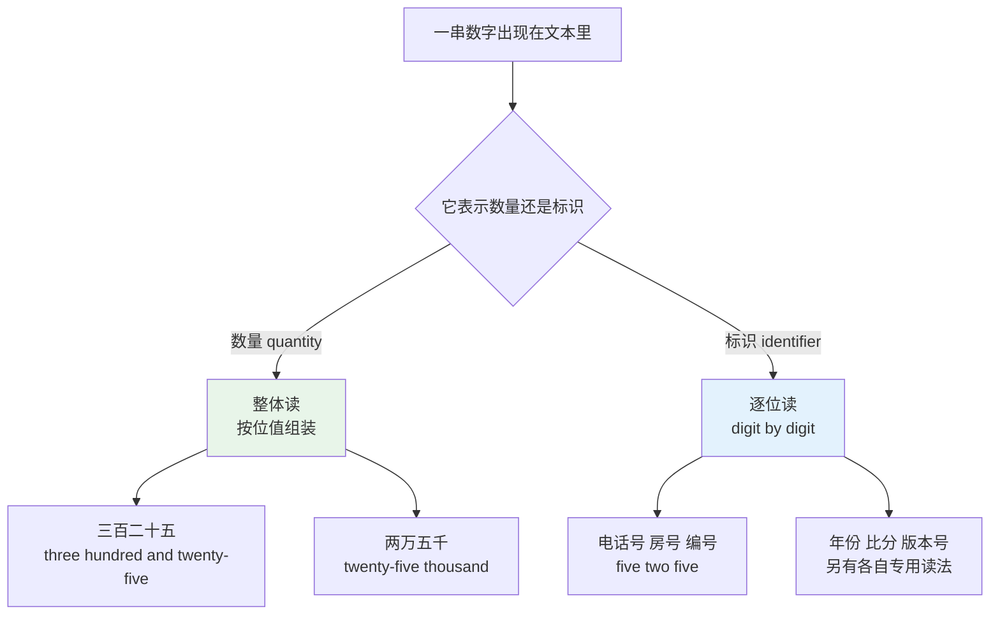
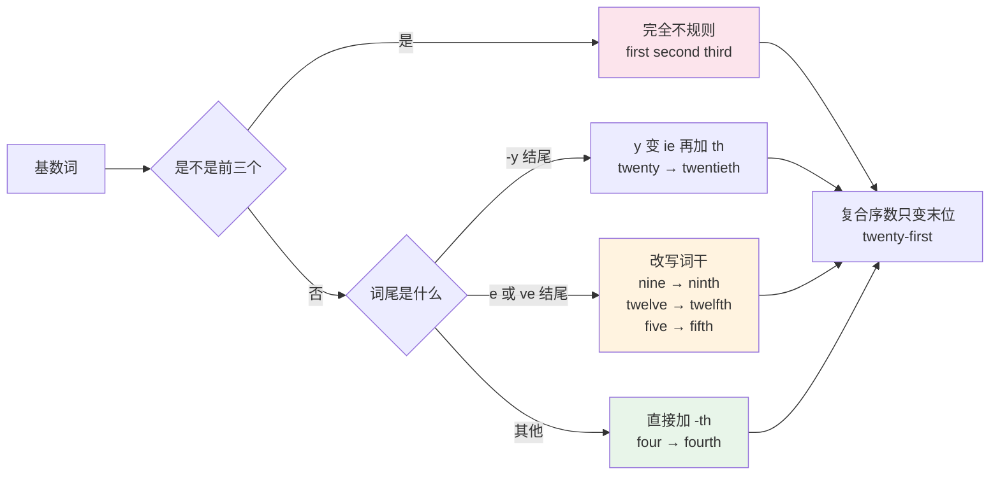
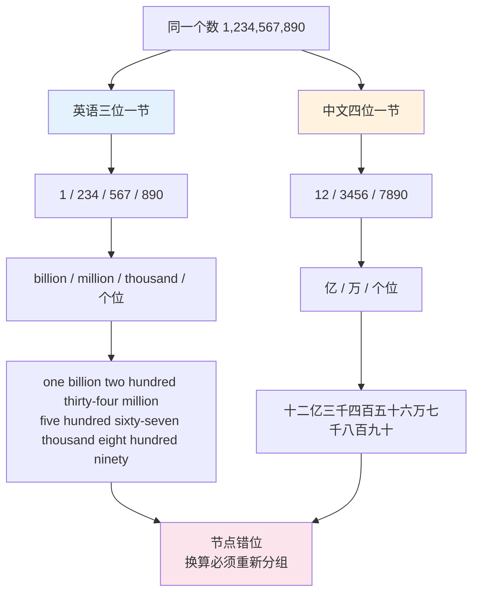
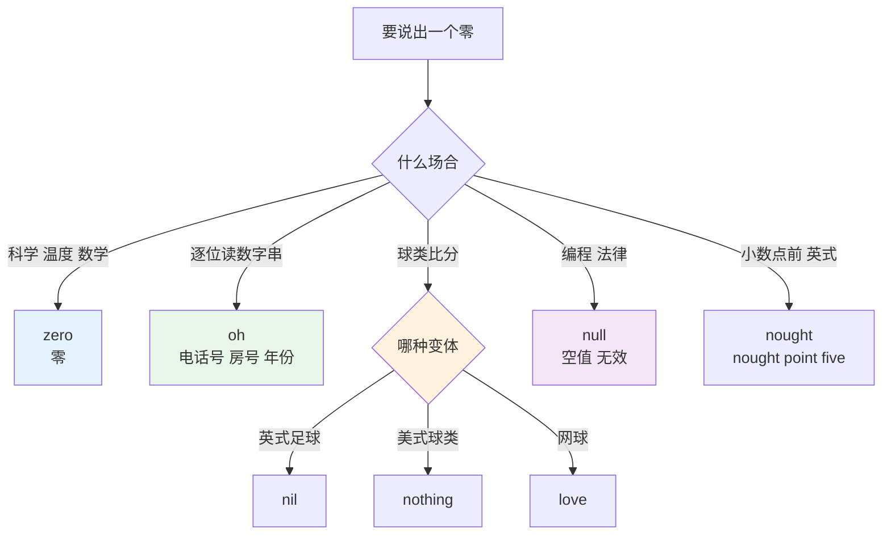
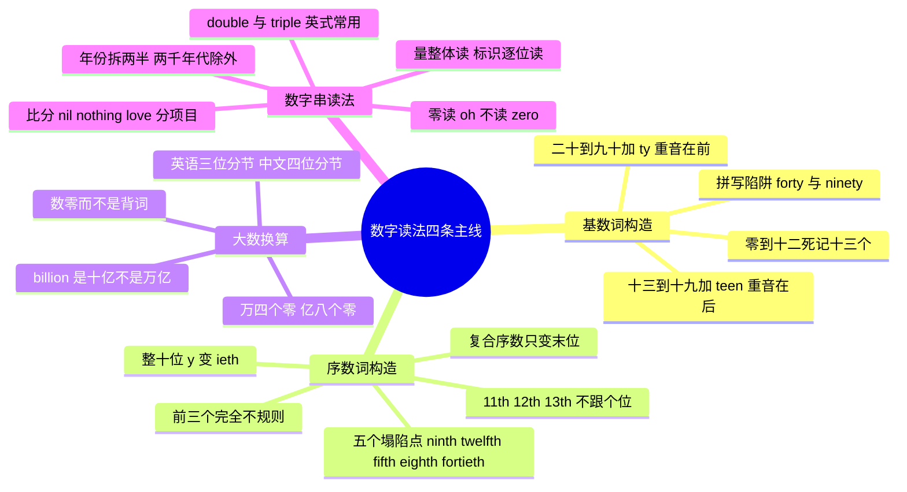

# 基数词、序数词与数字串读法

> [!info] 本篇定位
>
> 数字与计量这一章的入口篇，也是全书唯一系统讲数字读法的地方。
>
> 读完你能做到三件事：把任意一个整数完整拼写出来并读对重音；在英语的 thousand / million / billion 与中文的万 / 亿之间快速换算；判断一串数字该整体读还是逐位读，并说出电话号、房号、年份、比分各自的读法。
>
> 数词的语法用法（作定语、作主语时的谓语一致、`hundred` 什么时候加 -s）已经在 [[02.英语基础语法/03.代词与数词/05.数词的用法与表达\|数词的用法与表达]] 讲过，本篇不重复语法，只管词形、音标和读法。

---

## 1. 本篇导读：数字是最容易被高估的一章

中国学习者对数字普遍有一种错觉：`one` 到 `ten` 小学就会了，数字这块没问题。实际测一下就知道差在哪——把 `sixteen` 和 `sixty` 听成同一个词，`twelfth` 写成 `twelveth`，把 `three billion` 换算成「三十亿」时要停顿两秒，读手机号时把 `double seven` 听成两个词。

这些卡点有一个共同来源：**数字在中英之间不是一一对应的映射，而是两套结构不同的编码系统**。中文的数位是万进制（万、亿、兆），英语是千进制（thousand、million、billion）。中文的序数只是在基数前加「第」，英语要变词形，还有五个不规则点。中文报手机号一路念到底，英语要按分组、要用 `double`、零要读成 `oh`。



上图是整篇的判断主干。绝大多数读错都发生在把标识当数量读——把房间号 `Room 305` 读成 `three hundred and five` 是典型错误，母语者读的是 `Room three oh five`。这条分叉线会在第 5 节展开成一整套细则。

本篇的编排顺序是：先补齐基数词与序数词的**词形**（第 2、3 节），再解决**大数换算**（第 4 节），然后进入各类**数字串读法**（第 5 到 8 节），最后是近似数量词与书面写法规范（第 9、10 节）。

---

## 2. 基数词：三段式构造

英语基数词的构造分三段：0 到 12 完全不规则必须死记，13 到 19 靠 `-teen`，20 到 90 靠 `-ty`。三段之上再用连字符和 `hundred` / `thousand` 组装。

### 2.1 第一段：0 到 12 的十三个词

这十三个词一个都推不出来，来源全在古英语日耳曼层，形态被高频使用保护了下来。

| 英文 | 英式音标 | 美式音标 | 词性 | 中文 | 搭配与说明 |
| --- | --- | --- | --- | --- | --- |
| **zero** | /ˈzɪərəʊ/ | /ˈzɪroʊ/ | n./det. | 零 | 复数可写 zeros 或 zeroes，美式偏 zeros |
| **one** | /wʌn/ | /wʌn/ | n./det. | 一 | 与 won 同音；作代词时指代前文可数名词 |
| **two** | /tuː/ | /tuː/ | n./det. | 二 | w 不发音，与 too、to 同音 |
| **three** | /θriː/ | /θriː/ | n./det. | 三 | 起首 θ 是中文母语者的高频错音点 |
| **four** | /fɔː/ | /fɔːr/ | n./det. | 四 | 序数 fourth 保留 u，但 forty 丢掉 u |
| **five** | /faɪv/ | /faɪv/ | n./det. | 五 | 序数 fifth 元音变短，v 变 f |
| **six** | /sɪks/ | /sɪks/ | n./det. | 六 | 复数 sixes，读作 /ˈsɪksɪz/ |
| **seven** | /ˈsevn/ | /ˈsevn/ | n./det. | 七 | 第二音节的 e 通常不发音 |
| **eight** | /eɪt/ | /eɪt/ | n./det. | 八 | gh 完全不发音，与 ate 同音 |
| **nine** | /naɪn/ | /naɪn/ | n./det. | 九 | 序数 ninth 要去掉 e |
| **ten** | /ten/ | /ten/ | n./det. | 十 | 复数 tens 表示「几十个」 |
| **eleven** | /ɪˈlevn/ | /ɪˈlevn/ | n./det. | 十一 | 重音在第二音节 |
| **twelve** | /twelv/ | /twelv/ | n./det. | 十二 | 序数 twelfth 的 v 变 f |

> [!tip] 为什么英语数到十二才换构造
>
> `eleven` 和 `twelve` 的词源分别是「剩一」和「剩二」——十进位数完之后还剩几个的意思。日耳曼语支普遍有这个结构，德语的 `elf` / `zwölf` 同源。
>
> 这解释了为什么英语的规律段从 `thirteen` 开始，而不是从 `eleven` 开始。记不住时把它当成两个独立的词记，不要试图从 `ten + one` 推。

### 2.2 第二段：13 到 19 的 -teen 段

从 13 起进入规律区，构造是「个位词 + `-teen`」，但前三个的词干有变形。

| 英文 | 英式音标 | 美式音标 | 词性 | 中文 | 搭配与说明 |
| --- | --- | --- | --- | --- | --- |
| **thirteen** | /ˌθɜːˈtiːn/ | /ˌθɜːrˈtiːn/ | n./det. | 十三 | three 变 thir-，不是 threeteen |
| **fourteen** | /ˌfɔːˈtiːn/ | /ˌfɔːrˈtiːn/ | n./det. | 十四 | 保留 u，与 forty 形成对照 |
| **fifteen** | /ˌfɪfˈtiːn/ | /ˌfɪfˈtiːn/ | n./det. | 十五 | five 变 fif-，v 变 f |
| **sixteen** | /ˌsɪksˈtiːn/ | /ˌsɪksˈtiːn/ | n./det. | 十六 | 词干不变 |
| **seventeen** | /ˌsevnˈtiːn/ | /ˌsevnˈtiːn/ | n./det. | 十七 | 词干不变 |
| **eighteen** | /ˌeɪˈtiːn/ | /ˌeɪˈtiːn/ | n./det. | 十八 | eight 的 t 与 -teen 的 t 合并，只读一个 t |
| **nineteen** | /ˌnaɪnˈtiːn/ | /ˌnaɪnˈtiːn/ | n./det. | 十九 | 词干不变 |
| **teens** | /tiːnz/ | /tiːnz/ | n. | 十几岁；十几 | in his teens 十几岁；temperatures in the teens 气温十几度 |

三个变形点：`three → thir-`、`five → fif-`、`eight` 的 t 与 `-teen` 的 t 合并。除此之外直接拼接。

### 2.3 第三段：20 到 90 的 -ty 段

整十位用 `-ty`，词干变形点比 `-teen` 段多一个：`four` 到 `forty` 丢了 u。

| 英文 | 英式音标 | 美式音标 | 词性 | 中文 | 搭配与说明 |
| --- | --- | --- | --- | --- | --- |
| **twenty** | /ˈtwenti/ | /ˈtwenti/ | n./det. | 二十 | 美式口语常把 nt 弱化成 /ˈtweni/ |
| **thirty** | /ˈθɜːti/ | /ˈθɜːrti/ | n./det. | 三十 | 与 thirteen 同一词干变形 |
| **forty** | /ˈfɔːti/ | /ˈfɔːrti/ | n./det. | 四十 | 拼写陷阱：没有 u，写 fourty 是错的 |
| **fifty** | /ˈfɪfti/ | /ˈfɪfti/ | n./det. | 五十 | fif- 词干同 fifteen |
| **sixty** | /ˈsɪksti/ | /ˈsɪksti/ | n./det. | 六十 | 词干不变 |
| **seventy** | /ˈsevnti/ | /ˈsevnti/ | n./det. | 七十 | 词干不变 |
| **eighty** | /ˈeɪti/ | /ˈeɪti/ | n./det. | 八十 | eight + y，只有一个 t |
| **ninety** | /ˈnaɪnti/ | /ˈnaɪnti/ | n./det. | 九十 | 拼写陷阱：保留 e，写 ninty 是错的 |

> [!warning] 四个必背拼写陷阱
>
> 这四条是听写题和邮件里最常出错的位置：
>
> - ❌ ~~fourty~~ → ✅ **forty**（四十无 u，但 fourteen、fourth 有 u）
> - ❌ ~~ninty~~ → ✅ **ninety**（九十有 e，但序数 ninth 无 e）
> - ❌ ~~fivety~~ → ✅ **fifty**
> - ❌ ~~threeteen~~ → ✅ **thirteen**
>
> 一个方便的对照口诀：`four` 家族里只有 `forty` 掉 u；`nine` 家族里只有 `ninth` 掉 e。两个都是唯一的例外，其余保持原形。

### 2.4 -teen 与 -ty 的听辨

这是数字听力里损失最大的一处：`fifteen` 和 `fifty`、`sixteen` 和 `sixty` 在快速语流里非常接近。区分靠两点。

| 对比项 | -teen 型（13—19） | -ty 型（20—90） |
| --- | --- | --- |
| 重音位置 | 单说时重音在后：fif**TEEN** | 重音永远在前：**FIF**ty |
| 尾音元音 | 长音 /iː/，且末尾有 /n/ | 短音 /i/，无鼻音收尾 |
| 中间辅音 | /t/ 清晰送气且带重音 | 元音之间的 t 在美音里闪音化，接近 /d/：forty → /ˈfɔːrdi/、eighty → /ˈeɪdi/ |
| 句中重音漂移 | 后接名词时重音可能前移：**FIF**teen men | 不变 |

> [!tip] 听不清时的补救问法
>
> 母语者自己也会听混，所以有一套固定的确认说法，直接用即可：
>
> - Fifteen, one-five? Or fifty, five-oh?
>   - 十五，一五？还是五十，五零？
> - Sorry, was that one-three or three-zero?
>   - 抱歉，是一三还是三零？
>
> 把数字拆成单个数码来复述，比重复整个词有效得多。这是国际电话会议里的通行做法。

### 2.5 组装规则：连字符与 and

两位数的十位与个位之间必须加连字符，这是拼写规范不是可选项。

```text
21   twenty-one
47   forty-seven
99   ninety-nine
325  three hundred and twenty-five   (英式)
325  three hundred twenty-five       (美式)
```

三位以上的组装规则：

- **百位与十位之间**：英式习惯加 `and`，美式习惯省略。写正式文书时按目标读者的变体走。
- **连字符只用在 21—99 的复合词内部**，`hundred`、`thousand` 前后不加。
- **`hundred` / `thousand` / `million` 作数词时不加 -s**：`three hundred people`，不是 ~~three hundreds people~~。加 -s 的形式只用在 `hundreds of` 这类模糊数量表达里，见第 9 节。

| 数值 | 英式读法 | 美式读法 |
| --- | --- | --- |
| 108 | a hundred and eight | one hundred eight |
| 250 | two hundred and fifty | two hundred fifty |
| 1 000 | a thousand | one thousand |
| 1 015 | a thousand and fifteen | one thousand fifteen |
| 2 400 | two thousand four hundred | twenty-four hundred（口语常用） |
| 5 280 | five thousand two hundred and eighty | fifty-two eighty（口语） |

> [!warning] `a` 与 `one` 不能随便换
>
> `a hundred` 和 `one hundred` 在多数场合可换，但有两处不行：
>
> - 数字前有其他成分时只能用 `one`：`two thousand one hundred`，不能说 ~~two thousand a hundred~~。
> - 强调「正好一个」时只能用 `one`：`It costs one hundred, not two.`
>
> 反过来，句首和随口说的场合 `a hundred` 更自然：`There were about a hundred people.`

---

## 3. 序数词：一条规则加五个例外

### 3.1 通则与五个塌陷点

序数词的通则是「基数词 + `-th`」，读音是加 /θ/。真正要记的只有开头五个不规则形和三条拼写调整。



上图把序数词的全部规则压成了一张判断图。真正需要单独记的只有左边那两个粉色和橙色分支——前三个不规则形，以及 `five` / `nine` / `twelve` 三个词干改写。其余全走绿色的直接加 `-th` 通道，包括 `hundredth`、`thousandth`、`millionth`。

| 英文 | 英式音标 | 美式音标 | 词性 | 中文 | 搭配与说明 |
| --- | --- | --- | --- | --- | --- |
| **first** | /fɜːst/ | /fɜːrst/ | ord. | 第一 | 缩写 1st；与 fist 只差一个 r |
| **second** | /ˈsekənd/ | /ˈsekənd/ | ord./n. | 第二；秒 | 缩写 2nd；同形词还有「秒」和「附议」 |
| **third** | /θɜːd/ | /θɜːrd/ | ord. | 第三 | 缩写 3rd；three 的 r 位置前移 |
| **fourth** | /fɔːθ/ | /fɔːrθ/ | ord. | 第四 | 保留 u，与 forty 相反 |
| **fifth** | /fɪfθ/ | /fɪfθ/ | ord. | 第五 | five 的 ve 变 f；末尾 /fθ/ 是难音 |
| **sixth** | /sɪksθ/ | /sɪksθ/ | ord. | 第六 | 末尾 /ksθ/ 三辅音连缀，最难读的序数 |
| **seventh** | /ˈsevnθ/ | /ˈsevnθ/ | ord. | 第七 | 直接加 th |
| **eighth** | /eɪtθ/ | /eɪtθ/ | ord. | 第八 | 只写一个 t：eigh + th，不是 eightth |
| **ninth** | /naɪnθ/ | /naɪnθ/ | ord. | 第九 | 去掉 nine 的 e，拼写高频错点 |
| **tenth** | /tenθ/ | /tenθ/ | ord. | 第十 | 直接加 th |
| **eleventh** | /ɪˈlevnθ/ | /ɪˈlevnθ/ | ord. | 第十一 | at the eleventh hour 最后关头 |
| **twelfth** | /twelfθ/ | /twelfθ/ | ord. | 第十二 | ve 变 f；英语中最难拼的序数之一 |
| **thirteenth** | /ˌθɜːˈtiːnθ/ | /ˌθɜːrˈtiːnθ/ | ord. | 第十三 | -teen 段一律直接加 th |
| **twentieth** | /ˈtwentiəθ/ | /ˈtwentiəθ/ | ord. | 第二十 | y 变 ie 再加 th，多出一个音节 |
| **thirtieth** | /ˈθɜːtiəθ/ | /ˈθɜːrtiəθ/ | ord. | 第三十 | 同一变形 |
| **fortieth** | /ˈfɔːtiəθ/ | /ˈfɔːrtiəθ/ | ord. | 第四十 | 无 u，且 y 变 ie |
| **fiftieth** | /ˈfɪftiəθ/ | /ˈfɪftiəθ/ | ord. | 第五十 | 金婚 the fiftieth anniversary |
| **ninetieth** | /ˈnaɪntiəθ/ | /ˈnaɪntiəθ/ | ord. | 第九十 | 保留 e，与 ninth 对照 |
| **hundredth** | /ˈhʌndrədθ/ | /ˈhʌndrədθ/ | ord. | 第一百 | 也指「百分之一」 |
| **thousandth** | /ˈθaʊzəntθ/ | /ˈθaʊzəntθ/ | ord. | 第一千 | 末尾四辅音，实际口语常简化 |
| **millionth** | /ˈmɪljənθ/ | /ˈmɪljənθ/ | ord. | 第一百万 | the millionth customer 第一百万位顾客 |

> [!warning] 五个必须单独记的拼写
>
> - ❌ ~~nineth~~ → ✅ **ninth**（去 e）
> - ❌ ~~twelveth~~ → ✅ **twelfth**（v 变 f）
> - ❌ ~~fiveth~~ → ✅ **fifth**（ve 变 f）
> - ❌ ~~eightth~~ → ✅ **eighth**（只有一个 t）
> - ❌ ~~fourtieth~~ → ✅ **fortieth**（无 u）
>
> 这五个占了序数词错误的绝大多数。剩下的按通则推即可。

### 3.2 整十位的 -y 到 -ieth

`twenty` 到 `ninety` 全部走同一条路：把 `-y` 改成 `-ie` 再加 `-th`，读音多出一个 /ə/ 音节。

```text
twenty  →  twentie + th  →  twentieth   /ˈtwentiəθ/
thirty  →  thirtie  + th  →  thirtieth   /ˈθɜːtiəθ/
forty   →  fortie   + th  →  fortieth    /ˈfɔːtiəθ/
ninety  →  ninetie  + th  →  ninetieth   /ˈnaɪntiəθ/
```

这个变形和名词复数里 `city → cities`、动词第三人称 `carry → carries` 是同一条正字法规则：辅音字母加 y 结尾时，y 改 i。不是数词特有的。

### 3.3 复合序数只变最后一位

两位数以上的序数，前面全部保持基数形式，只有末位变序数。

| 数值 | 正确写法 | 常见错误 |
| --- | --- | --- |
| 21st | twenty-first | ~~twentieth-first~~ |
| 32nd | thirty-second | ~~thirtieth-second~~ |
| 45th | forty-fifth | ~~fortieth-fifth~~ |
| 99th | ninety-ninth | ~~ninetieth-ninth~~ |
| 101st | one hundred and first | ~~one hundredth and first~~ |
| 1000th | one thousandth | — |

末位是整十时才用 `-ieth`：`the fortieth day`（第四十天）、`the sixtieth birthday`（六十大寿）。

### 3.4 阿拉伯数字缩写形式

书面里序数常写成数字加两个字母，字母取的是完整拼写的最后两个字母。

| 数字 | 缩写 | 取自 | 适用范围 |
| --- | --- | --- | --- |
| 1 | 1st | fir**st** | 1, 21, 31, 41…101 |
| 2 | 2nd | seco**nd** | 2, 22, 32, 42…102 |
| 3 | 3rd | thi**rd** | 3, 23, 33, 43…103 |
| 4—20 | 4th…20th | four**th** | 含 11th、12th、13th 三个例外 |

> [!warning] 11、12、13 不跟个位走
>
> 个位是 1、2、3 时用 st / nd / rd，但 11、12、13 是例外，一律用 th。
>
> - ✅ **11th**, **12th**, **13th**（不是 ~~11st~~、~~12nd~~、~~13rd~~）
> - ✅ **21st**, **22nd**, **23rd**（这里才回到 st / nd / rd）
> - ✅ **111th**, **112th**, **113th**（百位不影响，仍看末两位）
>
> 写代码格式化日期序数时，这三个是最常见的边界条件——判断依据是「末两位落在 11—13 就用 th」，而不是「末一位」。

### 3.5 序数词的读法要点

序数词在日期、章节、楼层、排名里高频出现，读时几乎都要带 `the`。

> [!example] 序数词的典型语境
>
> - Our office is on the **twelfth** floor.
>   - 我们办公室在十二楼。
> - She finished **third** in the marathon.
>   - 她在马拉松里跑了第三名。（表语位置不加 the）
> - This is the **fourth** time you've asked me.
>   - 这是你第四次问我了。
> - The meeting is on the **twenty-third** of March.
>   - 会议在三月二十三日。（英式日期读法）
> - Turn to Chapter **Nine**.
>   - 翻到第九章。（编号位置用基数词，不是 ninth）

最后一条是中文母语者容易忽略的：**编号跟在名词后面时用基数词，不用序数词**。`Chapter 9` 读 `Chapter Nine`，`Room 5` 读 `Room Five`，`Page 40` 读 `Page Forty`。序数只出现在「名词前 + the」的结构里：`the ninth chapter`。

---

## 4. 大数：thousand、million、billion 与中文的错位

### 4.1 两套分节制的根本冲突

英语按三位分节，每三位换一个单位；中文按四位分节，每四位换一个单位。这是中国学习者听大数时反应慢的唯一原因，跟词汇量无关。



上图说明了为什么直接背「million 等于百万」不够用。两套系统的**切分位置本身就对不齐**：英语在第 3、6、9 位切，中文在第 4、8 位切。听到 `two hundred million` 时，脑子里要先还原成 2 后面八个零，再按中文四位重新切成「2 / 0000 / 0000」，才得到「两亿」。跳过还原步骤直接硬记词对词，遇到 `three hundred and fifty million` 这种就会卡住。

### 4.2 大数单位词表

| 英文 | 英式音标 | 美式音标 | 词性 | 中文 | 搭配与说明 |
| --- | --- | --- | --- | --- | --- |
| **hundred** | /ˈhʌndrəd/ | /ˈhʌndrəd/ | n./det. | 百 | 作数词不加 s；hundreds of 才加 |
| **thousand** | /ˈθaʊznd/ | /ˈθaʊznd/ | n./det. | 千 | 十千 = 一万，中文无对应单位 |
| **million** | /ˈmɪljən/ | /ˈmɪljən/ | n./det. | 百万 | 百 million = 一亿 |
| **billion** | /ˈbɪljən/ | /ˈbɪljən/ | n./det. | 十亿 | 现代英美同义，历史上英式曾指万亿 |
| **trillion** | /ˈtrɪljən/ | /ˈtrɪljən/ | n./det. | 万亿 | 中文口语也说「一兆」，但兆在计量学是百万 |
| **quadrillion** | /kwɒˈdrɪljən/ | /kwɑːˈdrɪljən/ | n. | 千万亿 | 10 的 15 次方，仅见于科普与金融文本 |
| **dozen** | /ˈdʌzn/ | /ˈdʌzn/ | n. | 一打，十二个 | two dozen eggs 不加 s |
| **gross** | /ɡrəʊs/ | /ɡroʊs/ | n. | 一罗，一百四十四个 | 十二打；旧式商业计量单位 |
| **score** | /skɔː/ | /skɔːr/ | n. | 二十 | 古旧用法，见于 four score and seven years ago |
| **grand** | /ɡrænd/ | /ɡrænd/ | n. | 一千（美元等） | 俚语，复数不变：ten grand 一万块 |
| **myriad** | /ˈmɪriəd/ | /ˈmɪriəd/ | n./adj. | 无数；万 | 希腊语原义正好是「一万」 |
| **googol** | /ˈɡuːɡɒl/ | /ˈɡuːɡɔːl/ | n. | 古戈尔 | 10 的 100 次方；Google 的名字源自它的误拼 |

### 4.3 换算对照表

这张表建议直接背下来，比现场推算快得多。

| 阿拉伯数字 | 英语读法 | 中文 | 零的个数 |
| --- | --- | --- | --- |
| 1 000 | one thousand | 一千 | 3 |
| 10 000 | ten thousand | 一万 | 4 |
| 100 000 | one hundred thousand | 十万 | 5 |
| 1 000 000 | one million | 一百万 | 6 |
| 10 000 000 | ten million | 一千万 | 7 |
| 100 000 000 | one hundred million | 一亿 | 8 |
| 1 000 000 000 | one billion | 十亿 | 9 |
| 10 000 000 000 | ten billion | 一百亿 | 10 |
| 100 000 000 000 | one hundred billion | 一千亿 | 11 |
| 1 000 000 000 000 | one trillion | 一万亿 | 12 |

> [!tip] 数零而不是背词
>
> 换算最可靠的方法是数零，不是记词对应。三个锚点足够覆盖日常：
>
> - **万 = 4 个零 = ten thousand**
> - **亿 = 8 个零 = one hundred million**
> - **万亿 = 12 个零 = one trillion**
>
> 中文的每个单位差 4 个零（千、万、亿），英语每个单位差 3 个零（thousand、million、billion）。记住两条步长，任何中间值都能推。
>
> 读财报时还有一个更快的办法：把 `million` 当成「百万」直接乘，`3.5 million` 就是「350 万」——小数点后移两位。这个技巧在 [[03.数字与计量词汇/02.分数、小数、百分数与数学运算读法\|下一篇]] 的小数一节展开。

### 4.4 billion 的历史歧义

`billion` 在英式英语里曾经指 10 的 12 次方（长级差制，long scale），美式一直是 10 的 9 次方（短级差制，short scale）。英国政府在 1974 年正式改用短级差制，此后英美一致。

这个历史遗留还有两处会碰到：

- **读老文献时**：1974 年以前的英国出版物里 `billion` 可能是「万亿」，遇到数量级明显不对时要警觉。
- **翻译其他欧洲语言时**：法语 `billion`、德语 `Billion`、西班牙语 `billón` 至今仍是 10 的 12 次方。看到欧陆来源的英译数据出现数量级偏差，多半是这个原因。

> [!warning] 数量级校验的实用习惯
>
> 读到大数时顺手做一次量纲检查。世界人口约八十亿（`about eight billion`），一个国家的年度 GDP 通常在 trillion 量级，一家中型公司的年营收在 million 量级。
>
> 出现「某创业公司年营收 five billion dollars」这类句子时，先怀疑是不是 million 听错了，再怀疑数据本身。这个习惯在读英文财经新闻和技术白皮书时能挡掉大量误读。

### 4.5 口语里的缩略说法

| 英文 | 英式音标 | 美式音标 | 词性 | 中文 | 搭配与说明 |
| --- | --- | --- | --- | --- | --- |
| **k** | /keɪ/ | /keɪ/ | n. | 千 | 50k 读 fifty k，招聘与薪资语境高频 |
| **mil** | /mɪl/ | /mɪl/ | n. | 百万 | million 的口语缩略，two mil 两百万 |
| **bn** | — | — | abbr. | 十亿 | 只用于书面，读出来仍是 billion |
| **m** | — | — | abbr. | 百万 | 财报表头常见 $12m，读 twelve million |
| **G** | /dʒiː/ | /dʒiː/ | n. | 一千美元 | 美式俚语，同 grand |
| **ton** | /tʌn/ | /tʌn/ | n. | 很多 | a ton of work 一大堆活，非精确数量 |

> [!example] 缩略说法的实际语境
>
> - The role pays around **80k** a year.
>   - 这个职位年薪八万左右。
> - They raised **two mil** in the seed round.
>   - 他们在种子轮融了两百万。
> - Revenue was **$4.2bn** last quarter.
>   - 上季度营收四十二亿美元。（读作 four point two billion dollars）

---

## 5. 数字串：什么时候逐位读

### 5.1 量与标识的分界

回到第 1 节那张判断图。一串数字要么表示**数量**，要么表示**标识**。数量整体读，标识逐位读。判断依据是这串数字能不能做加减——房号加房号没有意义，所以房号是标识。

| 类型 | 例子 | 读法 | 原因 |
| --- | --- | --- | --- |
| 数量 | 325 people | three hundred and twenty-five | 可以做算术 |
| 数量 | $1,200 | twelve hundred dollars | 可以做算术 |
| 标识 | Room 325 | Room three two five | 编号，不参与运算 |
| 标识 | Flight AA 325 | flight A A three two five | 编号 |
| 标识 | 555-0198 | five five five oh one nine eight | 电话号 |
| 混合 | Route 66 | Route sixty-six | 短编号常整体读 |
| 混合 | Room 305 | Room three oh five | 中间零读 oh |

最后两行说明这条规则不是绝对的：**两位数的编号通常整体读**（`Route 66`、`Gate 12`、`Platform 9`），三位以上才逐位读。分界大致在三位数。

### 5.2 电话号码

电话号码是最典型的逐位读场景，有四条固定规则。

**规则一：一位一位读，不组装位值。**

```text
555-0198   →  five five five, oh one nine eight
020 7946 0958  →  oh two oh, seven nine four six, oh nine five eight
```

**规则二：零读 `oh`，不读 `zero`。** 英美都一样。`zero` 用在需要绝对清晰的场合（航空、军事、报数据）。

**规则三：连续相同数字用 `double` / `triple`。** 这是英式的强习惯，美式用得少，通常仍逐位读。

```text
7700         英式：double seven, double oh
             美式：seven seven zero zero
555          英式：triple five  /  美式：five five five
```

**规则四：按分组停顿。** 停顿位置对应号码的结构分段（区号、局号、用户号），不是随意断。

| 英文 | 英式音标 | 美式音标 | 词性 | 中文 | 搭配与说明 |
| --- | --- | --- | --- | --- | --- |
| **double** | /ˈdʌbl/ | /ˈdʌbl/ | det./v./adj. | 两个连续的；加倍 | double four = 44，英式读号必备 |
| **triple** | /ˈtrɪpl/ | /ˈtrɪpl/ | det./v./adj. | 三个连续的；三倍 | triple nine = 999，英国报警号 |
| **quadruple** | /kwɒˈdruːpl/ | /kwɑːˈdruːpl/ | v./adj. | 四倍 | 读号时极少用，一般改为逐位 |
| **oh** | /əʊ/ | /oʊ/ | n. | 零 | 读号专用的零，与字母 O 同音 |
| **digit** | /ˈdɪdʒɪt/ | /ˈdɪdʒɪt/ | n. | 数码，位 | a six-digit code 六位验证码 |
| **figure** | /ˈfɪɡə/ | /ˈfɪɡjər/ | n. | 数字；数额 | six figures 六位数收入 |
| **area code** | /ˈeəriə kəʊd/ | /ˈeriə koʊd/ | n. | 区号 | 美式；英式叫 dialling code |
| **country code** | /ˈkʌntri kəʊd/ | /ˈkʌntri koʊd/ | n. | 国家代码 | 中国 +86 读 plus eight six |
| **extension** | /ɪkˈstenʃn/ | /ɪkˈstenʃn/ | n. | 分机号 | 缩写 ext.；ext. 204 |
| **landline** | /ˈlændlaɪn/ | /ˈlændlaɪn/ | n. | 固定电话 | 与 mobile（英）/ cell（美）相对 |
| **hotline** | /ˈhɒtlaɪn/ | /ˈhɑːtlaɪn/ | n. | 热线 | a 24-hour hotline |
| **toll-free** | /ˌtəʊl ˈfriː/ | /ˌtoʊl ˈfriː/ | adj. | 免费拨打的 | 美式；英式说 freephone |
| **dial** | /ˈdaɪəl/ | /ˈdaɪəl/ | v./n. | 拨号；表盘 | dial the number；旧式转盘电话遗留词 |
| **hyphen** | /ˈhaɪfn/ | /ˈhaɪfn/ | n. | 连字符 | 读号时一般不读出来，只作停顿 |
| **hash** | /hæʃ/ | /hæʃ/ | n. | 井号 | 英式；美式叫 pound sign 或 number sign |
| **asterisk** | /ˈæstərɪsk/ | /ˈæstərɪsk/ | n. | 星号 | 语音菜单里 press the asterisk key |

> [!example] 一段完整的电话交换
>
> - A: Could I take your number?
>   - 能给我你的电话吗？
> - B: Sure, it's **oh seven nine double one, four six oh two**.
>   - 好，是 07911 4602。
> - A: Let me read that back — **oh seven nine one one, four six oh two**?
>   - 我复述一下，07911 4602？
> - B: That's right. And the office line is **oh two oh, seven nine four six oh nine five eight**, extension **two oh four**.
>   - 对。办公室座机是 020 7946 0958，分机 204。

> [!warning] 中国学习者报手机号的两个典型问题
>
> 第一是把 1 读成 `one` 之后又按中文习惯把 7 读成 `seven` 却把 0 读成 `zero`——同一串号码里 `oh` 和 `zero` 混用，听者会以为你在换格式。选一种贯穿到底。
>
> 第二是按中文的三四四分组（138-1234-5678）报英文号码，但对方按自己的习惯断句，结果双方对不上。跨国场合的稳妥做法是**逐位读、每三到四位停一下、报完主动复述一遍**。

### 5.3 房号、楼层与座位

| 英文 | 英式音标 | 美式音标 | 词性 | 中文 | 搭配与说明 |
| --- | --- | --- | --- | --- | --- |
| **room** | /ruːm/ | /ruːm/ | n. | 房间 | Room 305 读 Room three oh five |
| **suite** | /swiːt/ | /swiːt/ | n. | 套房；套间 | 与 sweet 同音；办公楼常用 Suite 400 |
| **floor** | /flɔː/ | /flɔːr/ | n. | 楼层 | on the fifth floor |
| **storey** | /ˈstɔːri/ | /ˈstɔːri/ | n. | 层（英式拼写） | 美式拼 story；a twelve-storey building |
| **ground floor** | /ˌɡraʊnd ˈflɔː/ | /ˌɡraʊnd ˈflɔːr/ | n. | 一楼（英式） | 英式的 first floor 是中文的二楼 |
| **basement** | /ˈbeɪsmənt/ | /ˈbeɪsmənt/ | n. | 地下室 | 电梯按钮 B1、B2 |
| **block** | /blɒk/ | /blɑːk/ | n. | 楼栋；街区 | Block 3；美式还指「一个街区距离」 |
| **unit** | /ˈjuːnɪt/ | /ˈjuːnɪt/ | n. | 单元 | Unit 12，公寓地址常用 |
| **apartment** | /əˈpɑːtmənt/ | /əˈpɑːrtmənt/ | n. | 公寓（美式） | 英式说 flat |
| **flat** | /flæt/ | /flæt/ | n. | 公寓（英式） | Flat 4B 读 flat four B |
| **row** | /rəʊ/ | /roʊ/ | n. | 排 | Row 14, seat C 十四排 C 座 |
| **seat** | /siːt/ | /siːt/ | n. | 座位 | 登机牌上 22A 读 twenty-two A |
| **aisle** | /aɪl/ | /aɪl/ | n. | 过道 | s 不发音；an aisle seat 过道座 |
| **gate** | /ɡeɪt/ | /ɡeɪt/ | n. | 登机口 | Gate 42 读 Gate forty-two |
| **platform** | /ˈplætfɔːm/ | /ˈplætfɔːrm/ | n. | 站台 | Platform 9 读 platform nine |
| **carriage** | /ˈkærɪdʒ/ | /ˈkærɪdʒ/ | n. | 车厢（英式） | 美式说 car；Carriage F |

> [!warning] 英美楼层制的错位
>
> 这是订酒店和找会议室时真会走错的一处：
>
> - 英式 `ground floor` = 美式 `first floor` = 中文一楼
> - 英式 `first floor` = 美式 `second floor` = 中文二楼
>
> 英国电梯按钮上的 `G` 是地面层，`1` 是二楼。美国电梯上的 `1` 就是地面层。对方说 `Come up to the first floor` 时，先确认对方是哪种变体。

### 5.4 编号、版本号与技术数字串

程序员会大量遇到的一类数字串，读法有自己的一套约定。

| 英文 | 英式音标 | 美式音标 | 词性 | 中文 | 搭配与说明 |
| --- | --- | --- | --- | --- | --- |
| **number** | /ˈnʌmbə/ | /ˈnʌmbər/ | n./v. | 号码；编号 | 缩写 No.，读作 number 不是 no |
| **serial number** | /ˌsɪəriəl ˈnʌmbə/ | /ˌsɪriəl ˈnʌmbər/ | n. | 序列号 | 缩写 S/N，逐位读 |
| **version** | /ˈvɜːʃn/ | /ˈvɜːrʒn/ | n. | 版本 | v3.2.1 读 version three point two point one |
| **release** | /rɪˈliːs/ | /rɪˈliːs/ | n./v. | 发行版；发布 | release 24.04 |
| **revision** | /rɪˈvɪʒn/ | /rɪˈvɪʒn/ | n. | 修订号 | 缩写 rev.；rev 7 |
| **build** | /bɪld/ | /bɪld/ | n./v. | 构建号 | build 20418 逐位或分组读 |
| **patch** | /pætʃ/ | /pætʃ/ | n./v. | 补丁；补丁号 | 语义化版本里的第三位 |
| **edition** | /ɪˈdɪʃn/ | /ɪˈdɪʃn/ | n. | 版次 | the third edition 第三版 |
| **volume** | /ˈvɒljuːm/ | /ˈvɑːljuːm/ | n. | 卷 | 缩写 Vol.；Vol. 12 |
| **issue** | /ˈɪʃuː/ | /ˈɪʃuː/ | n. | 期 | Vol. 12, Issue 4 |
| **chapter** | /ˈtʃæptə/ | /ˈtʃæptər/ | n. | 章 | Chapter 9 用基数词读 |
| **clause** | /klɔːz/ | /klɔːz/ | n. | 条款 | Clause 3.2 合同高频 |
| **paragraph** | /ˈpærəɡrɑːf/ | /ˈpærəɡræf/ | n. | 段；条 | Paragraph 5 |
| **barcode** | /ˈbɑːkəʊd/ | /ˈbɑːrkoʊd/ | n. | 条形码 | 十三位，逐位或按段读 |
| **PIN** | /pɪn/ | /pɪn/ | n. | 个人识别码 | 读作单词不是字母；a four-digit PIN |
| **checksum** | /ˈtʃeksʌm/ | /ˈtʃeksʌm/ | n. | 校验和 | verify the checksum |
| **octet** | /ɒkˈtet/ | /ɑːkˈtet/ | n. | 八位组 | IPv4 地址的每一段 |
| **binary** | /ˈbaɪnəri/ | /ˈbaɪnəri/ | adj./n. | 二进制的 | in binary 用二进制 |
| **hexadecimal** | /ˌheksəˈdesɪml/ | /ˌheksəˈdesɪml/ | adj./n. | 十六进制的 | 口语缩略 hex /heks/ |
| **increment** | /ˈɪŋkrəmənt/ | /ˈɪŋkrəmənt/ | n./v. | 增量；递增 | increment the counter |

技术数字串的读法约定：

- **IP 地址**：点分隔，`192.168.1.1` 读 `one nine two dot one six eight dot one dot one`。每段三位以内逐位读，也可整体读 `one ninety-two`，但逐位读更不易误听。
- **端口号**：整体读，`port 8080` 读 `port eighty eighty`，`port 3000` 读 `port three thousand`。
- **版本号**：点读 `point`，各段逐个读，`v2.10.3` 读 `two point ten point three`（不是 `two point one zero`）。
- **哈希与令牌**：逐字符读，字母用无线电字母表（`Alpha`、`Bravo`）避免混淆。

> [!example] 技术场景里的数字串
>
> - We're still on **version one point eight**; the fix landed in **two point oh**.
>   - 我们还在 1.8 版，修复是在 2.0 里落地的。
> - The server's at **ten dot oh dot one dot two hundred**, port **five four three two**.
>   - 服务器在 10.0.1.200，端口 5432。
> - Can you read me the last **six digits** of the serial?
>   - 能把序列号后六位读给我吗？

---

## 6. 年份、世纪与年代

年份是数字串里规则最多的一类，因为它既不是纯数量也不是纯标识。

### 6.1 年份的四种读法

| 年份 | 读法 | 规则 |
| --- | --- | --- |
| 1984 | nineteen eighty-four | 四位年份拆成两个两位数 |
| 1066 | ten sixty-six | 同上，不读 one thousand |
| 1900 | nineteen hundred | 后两位是 00 时用 hundred |
| 1905 | nineteen oh five | 后两位以 0 开头时读 oh |
| 2000 | two thousand | 整千年只能这样读 |
| 2005 | two thousand and five（英）/ two thousand five（美） | 2000—2009 不拆读 |
| 2026 | twenty twenty-six | 2010 起恢复拆读 |
| 2100 | twenty-one hundred | 同 1900 的规则 |

> [!warning] 2000 到 2009 这十年是断层
>
> 这十年英语世界普遍不拆读，说 `two thousand and seven` 而不是 ~~twenty oh seven~~。原因是拆读听起来像在读电话号，且与 `nineteen oh seven` 容易混。
>
> 从 2010 开始拆读回归主流，`twenty ten`、`twenty twenty-six` 都是标准说法。但 `two thousand and twenty-six` 也不算错，正式播报里仍然常见。
>
> 记住这个断层的实际用处：听到 `two thousand and five` 就知道是 2005，听到 `twenty oh five` 要警惕对方可能在读别的东西。

### 6.2 世纪、年代与纪元

| 英文 | 英式音标 | 美式音标 | 词性 | 中文 | 搭配与说明 |
| --- | --- | --- | --- | --- | --- |
| **century** | /ˈsentʃəri/ | /ˈsentʃəri/ | n. | 世纪 | the 21st century 指 2001—2100 |
| **decade** | /ˈdekeɪd/ | /ˈdekeɪd/ | n. | 十年 | over the past decade 过去十年 |
| **millennium** | /mɪˈleniəm/ | /mɪˈleniəm/ | n. | 千年 | 复数 millennia；注意双 n 双 l |
| **era** | /ˈɪərə/ | /ˈɪrə/ | n. | 纪元；时代 | the digital era 数字时代 |
| **AD** | /ˌeɪ ˈdiː/ | /ˌeɪ ˈdiː/ | abbr. | 公元 | 拉丁 Anno Domini；写在年份前 AD 476 |
| **BC** | /ˌbiː ˈsiː/ | /ˌbiː ˈsiː/ | abbr. | 公元前 | before Christ；写在年份后 44 BC |
| **CE** | /ˌsiː ˈiː/ | /ˌsiː ˈiː/ | abbr. | 公元 | Common Era，学术界的中性替代 |
| **BCE** | /ˌbiː siː ˈiː/ | /ˌbiː siː ˈiː/ | abbr. | 公元前 | Before Common Era |
| **anniversary** | /ˌænɪˈvɜːsəri/ | /ˌænɪˈvɜːrsəri/ | n. | 周年 | the tenth anniversary |
| **centenary** | /senˈtiːnəri/ | /senˈtenəri/ | n. | 百年纪念（英式） | 美式常用 centennial |
| **centennial** | /senˈteniəl/ | /senˈteniəl/ | n./adj. | 百年纪念（美式） | the centennial celebration |
| **bicentennial** | /ˌbaɪsenˈteniəl/ | /ˌbaɪsenˈteniəl/ | n./adj. | 二百周年 | bi- 前缀表二 |
| **jubilee** | /ˈdʒuːbɪliː/ | /ˈdʒuːbɪliː/ | n. | 大庆 | golden jubilee 五十周年庆 |
| **leap year** | /ˈliːp jɪə/ | /ˈliːp jɪr/ | n. | 闰年 | 每四年一次，二月有二十九天 |

**世纪的编号错位**是另一个常见坑：21 世纪指的是 2001 到 2100 年，不是 2000 到 2099。原因是公元纪年从 1 年开始，没有 0 年。所以 1 到 100 年是第一个世纪，1901 到 2000 年是 20 世纪。

**年代的写法与读法**：

```text
the 1990s     the nineteen nineties      二十世纪九十年代
the '90s      the nineties               九十年代（省略世纪）
the mid-1980s the mid-nineteen-eighties  八十年代中期
the early 2000s                          两千年代初
```

`1990s` 不加撇号是现行规范，`1990's` 是旧式写法，现在多数风格手册视为错误（撇号在英语里表所有格或省略，年代复数两者都不是）。

> [!example] 年份与年代在句中的样子
>
> - The company was founded in **nineteen ninety-eight**.
>   - 公司成立于 1998 年。
> - He was born in **two thousand and one**.
>   - 他生于 2001 年。
> - Synthesizers defined the sound of the **eighties**.
>   - 合成器定义了八十年代的声音。
> - The manuscript dates from around **1200 BC**.
>   - 这份手稿大约成书于公元前 1200 年。（读 twelve hundred BC）

---

## 7. 比分、赛果与得分

体育比分有一套自成体系的读法，不同项目还不一样。这块词汇在日常闲聊里出现频率远高于多数人的预期。

| 英文 | 英式音标 | 美式音标 | 词性 | 中文 | 搭配与说明 |
| --- | --- | --- | --- | --- | --- |
| **score** | /skɔː/ | /skɔːr/ | n./v. | 比分；得分 | What's the score? 现在几比几 |
| **nil** | /nɪl/ | /nɪl/ | n. | 零（英式球类） | 3-0 读 three nil |
| **nothing** | /ˈnʌθɪŋ/ | /ˈnʌθɪŋ/ | n. | 零（美式球类） | 3-0 读 three to nothing |
| **love** | /lʌv/ | /lʌv/ | n. | 零（网球） | 40-0 读 forty love |
| **deuce** | /djuːs/ | /duːs/ | n. | 平分（网球 40-40） | 之后要连赢两分才拿下这一局 |
| **draw** | /drɔː/ | /drɑː/ | n./v. | 平局（英式） | The match ended in a draw |
| **tie** | /taɪ/ | /taɪ/ | n./v. | 平局（美式） | The game ended in a tie |
| **all** | /ɔːl/ | /ɔːl/ | adv. | 双方同分 | 2-2 读 two all；0-0 读 nil-nil |
| **lead** | /liːd/ | /liːd/ | n./v. | 领先 | a two-goal lead 领先两球 |
| **goal** | /ɡəʊl/ | /ɡoʊl/ | n. | 进球 | score a goal |
| **point** | /pɔɪnt/ | /pɔɪnt/ | n. | 分 | win by three points 赢三分 |
| **set** | /set/ | /set/ | n. | 盘（网球） | win the set 6-4 |
| **overtime** | /ˈəʊvətaɪm/ | /ˈoʊvərtaɪm/ | n. | 加时（美式） | 英式说 extra time |
| **penalty** | /ˈpenlti/ | /ˈpenlti/ | n. | 点球；罚分 | a penalty shootout 点球大战 |
| **aggregate** | /ˈæɡrɪɡət/ | /ˈæɡrɪɡət/ | n. | 总比分 | win 4-3 on aggregate 总分获胜 |
| **hat-trick** | /ˈhæt trɪk/ | /ˈhæt trɪk/ | n. | 帽子戏法 | 一场比赛进三球 |

各项目的零读法差异是这一节的核心：

| 项目 | 0 的读法 | 3-0 的完整读法 |
| --- | --- | --- |
| 足球（英式） | nil | three nil |
| 足球（美式） | nothing / zero | three to nothing |
| 网球 | love | forty love（局内分） |
| 篮球、棒球 | nothing / zero | three to nothing |
| 板球 | duck（击球手零分） | out for a duck |

> [!example] 比分在对话里的实际用法
>
> - What was the final score? — **Two nil** to United.
>   - 最终比分多少？曼联二比零。
> - It's **thirty love**, first serve.
>   - 三十比零，第一发球。
> - They drew **one all** at home.
>   - 他们主场一比一战平。
> - Chelsea went through **five-four on aggregate**.
>   - 切尔西以总比分五比四晋级。

> [!warning] nil 和 zero 不能互换
>
> `nil` 只用于英式球类比分和「零」的抽象义（`the risk is nil`），不能用来表示数量。
>
> - ❌ ~~There are nil apples left.~~
> - ✅ There are **no** apples left.
> - ✅ The score was two **nil**.
>
> 同样，`love` 只存在于网球（以及壁球、羽毛球的部分说法），说足球比分 ~~three love~~ 会让人以为你在开玩笑。

---

## 8. 零的六种说法

英语里表示「零」的词按场合分工，选错不会造成理解障碍，但会立刻暴露非母语身份。下表前六个是真正用来「说出零这个数」的六种说法，末尾的 `duck` 和 `null` 分别属于板球术语和编程法律术语，附在这里一起认。

| 英文 | 英式音标 | 美式音标 | 词性 | 中文 | 搭配与说明 |
| --- | --- | --- | --- | --- | --- |
| **zero** | /ˈzɪərəʊ/ | /ˈzɪroʊ/ | n. | 零 | 数学、温度、科学数据、需要绝对清晰时 |
| **oh** | /əʊ/ | /oʊ/ | n. | 零 | 电话号、房号、年份、任何逐位读的串 |
| **nought** | /nɔːt/ | /nɔːt/ | n. | 零 | 英式；小数点前的零 nought point five |
| **nil** | /nɪl/ | /nɪl/ | n. | 零 | 英式球类比分；抽象的「无」 |
| **love** | /lʌv/ | /lʌv/ | n. | 零 | 只用于网球局内分 |
| **nothing** | /ˈnʌθɪŋ/ | /ˈnʌθɪŋ/ | n. | 零 | 美式球类比分；口语化的「什么都没有」 |
| **duck** | /dʌk/ | /dʌk/ | n. | 零分 | 板球术语，指击球手未得分出局 |
| **null** | /nʌl/ | /nʌl/ | adj./n. | 空值 | 编程与法律；null and void 无效 |



上图把表示零的说法按场合分了岔。真正需要主动掌握的只有三个：`zero`（数据）、`oh`（读串）、`nil` 或 `nothing`（比分）。`nought`、`love`、`duck` 认得即可，除非你确实要谈网球或板球。

> [!warning] 温度和数据里不能用 oh
>
> `oh` 只在逐位读串时替代零。涉及可运算的数值时必须用 `zero`。
>
> - ❌ ~~It's oh degrees outside.~~
> - ✅ It's **zero** degrees outside.
> - ❌ ~~The error rate is oh point three percent.~~
> - ✅ The error rate is **zero point three** percent.（英式也可说 nought point three）
>
> 反过来，报电话号码时说 `zero` 虽然不算错，但会显得刻意——除非是在噪音环境下有意强调。

---

## 9. 近似数量：dozen、score 与 hundreds of

中文说「几十个」「上百个」，英语用一组固定的模糊数量表达，其中有一条容易出错的加 -s 规则。

| 英文 | 英式音标 | 美式音标 | 词性 | 中文 | 搭配与说明 |
| --- | --- | --- | --- | --- | --- |
| **a couple of** | /ə ˈkʌpl əv/ | /ə ˈkʌpl əv/ | phr. | 两个；两三个 | 严格是二，口语常松到二三 |
| **a few** | /ə ˈfjuː/ | /ə ˈfjuː/ | phr. | 几个 | 接可数名词，约三到五 |
| **several** | /ˈsevrəl/ | /ˈsevrəl/ | det. | 若干 | 比 a few 多，约三到七 |
| **dozens of** | /ˈdʌznz əv/ | /ˈdʌznz əv/ | phr. | 几十个 | 不是精确的「几打」 |
| **scores of** | /skɔːz əv/ | /skɔːrz əv/ | phr. | 许多；数十 | 书面语，略显文雅 |
| **hundreds of** | /ˈhʌndrədz əv/ | /ˈhʌndrədz əv/ | phr. | 数百 | 加 s 加 of，与数词用法相反 |
| **thousands of** | /ˈθaʊzndz əv/ | /ˈθaʊzndz əv/ | phr. | 数千 | 同一结构 |
| **millions of** | /ˈmɪljənz əv/ | /ˈmɪljənz əv/ | phr. | 数百万 | 同一结构 |
| **umpteen** | /ˌʌmpˈtiːn/ | /ˌʌmpˈtiːn/ | det. | 很多，数不清 | 非正式，带轻微不耐烦 |
| **countless** | /ˈkaʊntləs/ | /ˈkaʊntləs/ | adj. | 无数的 | countless attempts |
| **numerous** | /ˈnjuːmərəs/ | /ˈnuːmərəs/ | adj. | 众多的 | 正式，书面语偏好 |
| **odd** | /ɒd/ | /ɑːd/ | adj. | 出头，多一点 | thirty-odd people 三十来人 |
| **or so** | /ɔː ˈsəʊ/ | /ɔːr ˈsoʊ/ | phr. | 左右 | twenty or so 二十来个 |
| **roughly** | /ˈrʌfli/ | /ˈrʌfli/ | adv. | 大约 | roughly two hundred |
| **approximately** | /əˈprɒksɪmətli/ | /əˈprɑːksɪmətli/ | adv. | 大约 | 正式，技术文档偏好 |
| **upwards of** | /ˈʌpwədz əv/ | /ˈʌpwərdz əv/ | phr. | 超过 | upwards of fifty 五十以上 |

> [!warning] 加 -s 的分界线
>
> 这是数词最反直觉的一条规则：**前面有具体数字时不加 -s，没有具体数字表模糊数量时必须加 -s 加 of**。
>
> - ✅ **three hundred** students（三百名学生，精确）
> - ✅ **hundreds of** students（数百名学生，模糊）
> - ❌ ~~three hundreds students~~
> - ❌ ~~hundred of students~~
>
> `dozen` 同理：`two dozen eggs`（两打鸡蛋）不加 s，`dozens of eggs`（几十个鸡蛋）加 s 加 of。
>
> 一个例外要留意：`dozens` 之外还有 `a dozen or so`（十来个）这种混合式，此时 `dozen` 不加 s，因为前面有 `a`。

> [!tip] a couple of 到底是几个
>
> 字面是二，实际使用中弹性不小。`I'll be there in a couple of minutes` 里的 couple 可能是三分钟也可能是十分钟。
>
> 需要精确时不要用它：说 `two` 或 `exactly two`。在技术沟通和商务约定里，`a couple of days` 引起的误解相当常见——对方理解成两天，你想的是两三天。
>
> 美式口语里 of 常被吞掉：`a couple days`、`a couple beers`。这在书面语里仍算不规范，正式写作保留 of。

---

## 10. 写数字还是写单词

技术文档和商务邮件里都要面对这个选择。各大风格手册的细则不同，但有几条重合度很高的共识。

| 情况 | 写法 | 例子 |
| --- | --- | --- |
| 一到十（或一到九） | 拼成单词 | We hired **three** engineers. |
| 十以上 | 用阿拉伯数字 | We hired **42** engineers. |
| 句首的数字 | 一律拼成单词 | **Twenty-three** people attended. |
| 与计量单位连用 | 用数字 | 5 km, 12 MB, 30 °C |
| 百分数 | 用数字 | 15% of users |
| 日期时间 | 用数字 | 3 May 2026, 9:30 a.m. |
| 版本号编号 | 用数字 | version 3.2, Room 305 |
| 同句里的可比数量 | 统一格式 | We had 8 servers and 24 clients. |
| 大约数 | 拼成单词 | about **a hundred** people |
| 相邻的两个数 | 一个用词一个用数字 | twelve **50-page** reports |

> [!tip] 句首规则的实际处理
>
> 「句首不用阿拉伯数字」这条在技术写作里经常和内容冲突——句子开头就是一个大数时，拼出来又长又别扭。
>
> - ❌ ~~**1,247** users reported the bug.~~（句首用了阿拉伯数字）
> - ❌ ~~**One thousand two hundred and forty-seven** users reported the bug.~~（合规但笨重）
> - ✅ A total of **1,247** users reported the bug.（改写句式）
> - ✅ The bug was reported by **1,247** users.（改写句式）
>
> 遇到这个冲突时改写句式，不要硬拼。这是所有英文风格手册共同推荐的处理方式。

千位分隔符的写法在英语世界内部也不统一：英美用逗号（`1,234,567`），国际标准 ISO 80000-1 建议用窄空格（`1 234 567`），欧陆多国用点号（`1.234.567`）且小数点用逗号。技术文档面向国际读者时，用空格分隔或干脆不分隔更安全。

---

## 11. 本篇小结



> [!success] 本篇核心要点回顾
>
> 1. 基数词分三段：0—12 完全不规则必须死记，13—19 加 `-teen` 重音在后，20—90 加 `-ty` 重音在前。听辨 `fifteen` 与 `fifty` 靠重音位置和尾音长短。
> 2. 四个拼写陷阱固定要记：**forty**（无 u）、**ninety**（有 e）、**fifty**（fif- 词干）、**thirteen**（thir- 词干）。
> 3. 序数词只有一条通则加五个塌陷点：**first / second / third** 不规则，**ninth**（去 e）、**twelfth**（v 变 f）、**fifth**、**eighth**（一个 t）、**fortieth**（无 u）。整十位一律 `-y` 变 `-ieth`，复合序数只变末位。
> 4. 缩写形式 **11th、12th、13th 是例外**，不跟个位的 st / nd / rd 走。判断依据是末两位而不是末一位。
> 5. 英语三位分节、中文四位分节，切分位置本身就对不齐。换算靠**数零**：万 = 4 个零 = `ten thousand`，亿 = 8 个零 = `one hundred million`，万亿 = 12 个零 = `one trillion`。
> 6. `billion` 现代英美一致为十亿。1974 年前的英国文献和法德西语文本里它可能指万亿，读到数量级异常时先查这一条。
> 7. 数字串的读法取决于它是**数量**还是**标识**：数量整体读，标识逐位读。`Room 305` 读 `Room three oh five`，不是 `three hundred and five`。
> 8. 零有六种说法且各管一片：`zero`（数据）、`oh`（读串）、`nought`（英式小数）、`nil`（英式比分）、`nothing`（美式比分）、`love`（网球）。用错不影响理解但立刻暴露非母语身份。

> [!success] 本篇练习清单
>
> - [ ] 不看表把 13—19 和 20—90 全部拼写出来，检查 forty 和 ninety 两处
> - [ ] 写出 1st 到 20th 的全部缩写形式，重点核对 11th、12th、13th
> - [ ] 把 `ninth`、`twelfth`、`fifth`、`eighth`、`fortieth` 各抄三遍并读出声，注意末尾辅音连缀
> - [ ] 把「三亿五千万」「一万两千」「八十亿」三个数换算成英语并读出来
> - [ ] 用英式和美式两种方式读出自己的手机号，英式要用上 `double`
> - [ ] 读出 1066、1905、2000、2008、2026 五个年份，说明 2008 为什么不能拆读
> - [ ] 用 `nil`、`nothing`、`love` 三个词各造一个比分句子，标明是什么项目
> - [ ] 找一篇英文技术文档，标出其中所有数字，判断每个是该整体读还是逐位读

### 11.1 下一篇预告

> [!info] 下一篇：分数、小数、百分数与数学运算读法
>
> 本篇解决了整数，下一篇处理整数以外的部分：分数怎么用序数词表示分母、小数点后为什么要逐位读、百分数与百分点的区别、加减乘除方根在口语里怎么念。
>
> [[03.数字与计量词汇/02.分数、小数、百分数与数学运算读法\|分数、小数、百分数与数学运算读法]]
>
> 会覆盖 `two thirds`、`three quarters` 这类分数的单复数规则，`3.14` 读作 `three point one four` 而不是 `three point fourteen` 的原因，`increase by 5%` 与 `increase to 5%` 的区别，以及 `x squared`、`square root`、`to the power of` 这些运算表达。
>
> 读财报、技术指标和实验数据时用得上的读法，绝大部分集中在那一篇。
