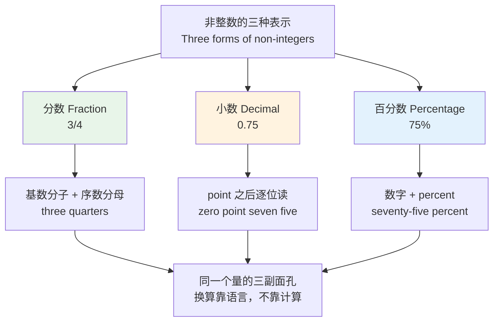
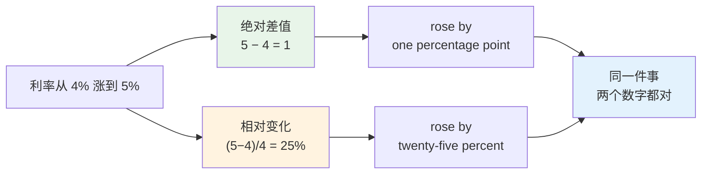
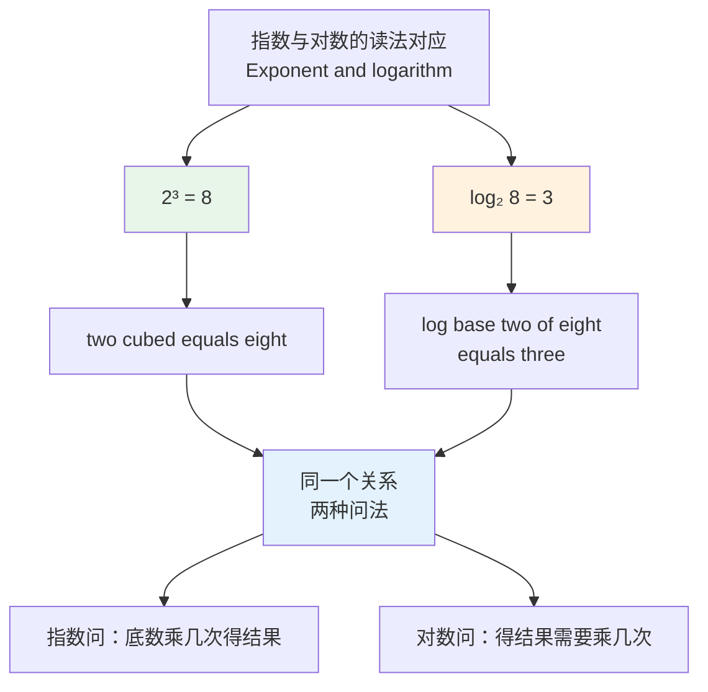
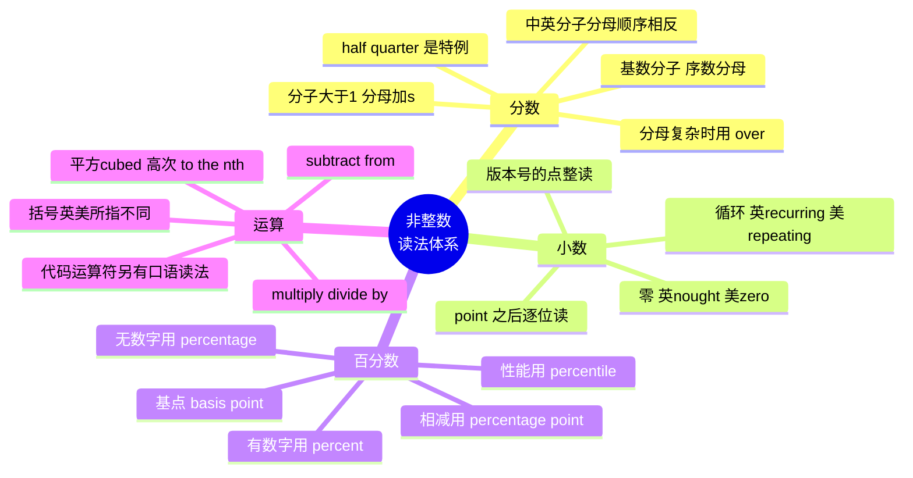

# 分数、小数、百分数与数学运算读法

> [!info] 本篇定位
>
> 上一篇解决了「整数怎么读」，这一篇解决整数之外的全部：**分数、小数、百分数，以及把它们组合起来的运算式**。
>
> 读完你能做到三件事：看到 `3/4`、`0.075`、`2.5%`、`x³ + 2x ≥ 7` 这类符号，能顺畅地读出英文；听到别人念一串运算能反写成算式；分得清 `rose by 2 percent` 和 `rose by 2 percentage points` 在钱上差多少。
>
> 本篇只讲词与读法，不讲语法。分数作主语时谓语用单数还是复数，属于主谓一致，在 `02.英语基础语法` 里；本篇不重复。

---

## 1. 本篇导读：会看不等于会读

数学符号是国际通用的，`3/4` 在中文和英文书面材料里长得一模一样。正因为长得一样，中文母语者读技术材料时会不自觉地跳过它——眼睛扫过 `3/4`，脑子里冒出的是「四分之三」，而不是 `three quarters`。

这个跳过在阅读时不出问题，在三种场合会立刻出问题：

**场合一：听力。** 技术会议、公开课、播客里，讲者念的是 `zero point seven five`，你脑子里没有这串音对应的符号，整句就断了。

**场合二：口头交流。** 要说「响应时间的第 95 百分位是 200 毫秒」，卡在 `95th percentile` 上；要说「误差不超过千分之三」，卡在 `three parts per thousand` 上。

**场合三：写作。** 英文技术文档里数字什么时候写阿拉伯数字、什么时候拼成单词、`percent` 和 `%` 什么时候换用，这些是有惯例的，写错会显得业余。



上图是本篇的骨架。同一个量 `0.75` 有三副面孔，三副面孔各有各的读法规则，而且互不相通——分数的规则套不到小数上，小数的规则套不到百分数上。把三套规则分别练熟，再练它们之间的口头换算，是本篇的全部任务。

后面各节按符号类型推进：第 2 到第 4 节讲分数，第 5 节讲小数，第 6 节讲百分数，第 7 到第 9 节讲运算与方程。第 10 节把三者串起来做换算，第 11 节收拢错误清单。

---

## 2. 分数：基数分子加序数分母

### 2.1 先把术语立起来

讲分数之前要有一套说分数的词。这几个词在英文数学材料、算法文档、统计报告里到处都是。

| 英文 | 英式音标 | 美式音标 | 词性 | 中文 | 搭配与说明 |
| --- | --- | --- | --- | --- | --- |
| **fraction** | /ˈfrækʃn/ | /ˈfrækʃn/ | n. | 分数 | 也指「一小部分」：a fraction of the cost |
| **numerator** | /ˈnjuːməreɪtə/ | /ˈnuːməreɪtər/ | n. | 分子 | 分数线上方的数 |
| **denominator** | /dɪˈnɒmɪneɪtə/ | /dɪˈnɑːmɪneɪtər/ | n. | 分母 | common denominator 公分母 |
| **proper fraction** | /ˌprɒpə ˈfrækʃn/ | /ˌprɑːpər ˈfrækʃn/ | n. | 真分数 | 分子小于分母，如 3/4 |
| **improper fraction** | /ɪmˌprɒpə ˈfrækʃn/ | /ɪmˌprɑːpər ˈfrækʃn/ | n. | 假分数 | 分子大于等于分母，如 7/4 |
| **mixed number** | /ˌmɪkst ˈnʌmbə/ | /ˌmɪkst ˈnʌmbər/ | n. | 带分数 | 英式也说 mixed fraction |
| **simplify** | /ˈsɪmplɪfaɪ/ | /ˈsɪmplɪfaɪ/ | v. | 化简 | simplify a fraction |
| **reduce** | /rɪˈdjuːs/ | /rɪˈduːs/ | v. | 约分 | reduce to lowest terms 化为最简 |
| **reciprocal** | /rɪˈsɪprəkl/ | /rɪˈsɪprəkl/ | n./adj. | 倒数；相互的 | the reciprocal of 3 is 1/3 |
| **ratio** | /ˈreɪʃiəʊ/ | /ˈreɪʃioʊ/ | n. | 比；比率 | a ratio of 3 to 1，写作 3:1 |

`common denominator` 在非数学语境里被借用成「共同点」：`Their only common denominator is a love of jazz.`（他们唯一的共同点是喜欢爵士乐。）技术文档里也会看到 `the lowest common denominator` 用来贬义地指「迁就最差水平」。

### 2.2 核心规则只有一条

英语分数的读法可以压缩成一句话：**分子读基数词，分母读序数词，分子大于一时分母加 -s**。

```text
    分子           分母
  cardinal      ordinal (+s if numerator > 1)
     ↓             ↓
  three    /    quarters      =  3/4
   two     /     thirds       =  2/3
    one    /      fifth       =  1/5
```

分母加不加 -s 只看分子，跟分母本身没关系。`2/3` 是 `two thirds`，`2/100` 是 `two hundredths`，两个的分母都要加 s，因为分子都是 2。

| 分数 | 英文读法 | 音标（英） | 音标（美） | 说明 |
| --- | --- | --- | --- | --- |
| 1/3 | one third / a third | /ə ˈθɜːd/ | /ə ˈθɜːrd/ | 分子为 1，分母不加 s |
| 2/3 | two thirds | /tuː ˈθɜːdz/ | /tuː ˈθɜːrdz/ | 分子为 2，分母加 s |
| 1/5 | one fifth / a fifth | /ə ˈfɪfθ/ | /ə ˈfɪfθ/ | — |
| 3/5 | three fifths | /θriː ˈfɪfθs/ | /θriː ˈfɪfθs/ | /fθs/ 三辅音连缀，是难点 |
| 4/7 | four sevenths | /fɔː ˈsevnθs/ | /fɔːr ˈsevnθs/ | — |
| 5/8 | five eighths | /faɪv ˈeɪtθs/ | /faɪv ˈeɪtθs/ | eighth 只有一个 t 音 |
| 7/9 | seven ninths | /ˈsevn ˈnaɪnθs/ | /ˈsevn ˈnaɪnθs/ | ninth 无 e，拼写易错 |
| 9/10 | nine tenths | /naɪn ˈtenθs/ | /naɪn ˈtenθs/ | — |
| 3/16 | three sixteenths | /θriː ˌsɪksˈtiːnθs/ | /θriː ˌsɪksˈtiːnθs/ | 重音在 -teenths |
| 11/12 | eleven twelfths | /ɪˈlevn ˈtwelfθs/ | /ɪˈlevn ˈtwelfθs/ | /lfθs/ 四辅音连缀，最难 |

### 2.3 序数分母的完整音标表

分母就是序数词，但因为要加 -s，末尾会出现中文里不存在的辅音串。下表把常用分母的单复数音标一并列出。

| 英文 | 英式音标 | 美式音标 | 词性 | 中文 | 搭配与说明 |
| --- | --- | --- | --- | --- | --- |
| **third** | /θɜːd/ | /θɜːrd/ | n. | 三分之一 | 复数 thirds /θɜːdz/ · /θɜːrdz/ |
| **fourth** | /fɔːθ/ | /fɔːrθ/ | n. | 四分之一 | 复数 fourths；美式比英式更常用 |
| **fifth** | /fɪfθ/ | /fɪfθ/ | n. | 五分之一 | 复数 fifths /fɪfθs/ |
| **sixth** | /sɪksθ/ | /sɪksθ/ | n. | 六分之一 | 复数 sixths /sɪksθs/ |
| **seventh** | /ˈsevnθ/ | /ˈsevnθ/ | n. | 七分之一 | 复数 sevenths |
| **eighth** | /eɪtθ/ | /eɪtθ/ | n. | 八分之一 | 拼写两个 h，读音只有一个 t |
| **ninth** | /naɪnθ/ | /naɪnθ/ | n. | 九分之一 | nine 去 e 加 th |
| **tenth** | /tenθ/ | /tenθ/ | n. | 十分之一 | 复数 tenths |
| **twelfth** | /twelfθ/ | /twelfθ/ | n. | 十二分之一 | twelve 的 v 变 f |
| **twentieth** | /ˈtwentiəθ/ | /ˈtwentiəθ/ | n. | 二十分之一 | y 变 ie 加 th |
| **hundredth** | /ˈhʌndrədθ/ | /ˈhʌndrədθ/ | n. | 百分之一 | 复数 hundredths |
| **thousandth** | /ˈθaʊzntθ/ | /ˈθaʊzntθ/ | n. | 千分之一 | 复数 thousandths |
| **millionth** | /ˈmɪljənθ/ | /ˈmɪljənθ/ | n. | 百万分之一 | one millionth of a second |
| **billionth** | /ˈbɪljənθ/ | /ˈbɪljənθ/ | n. | 十亿分之一 | 纳秒 = a billionth of a second |

> [!warning] /θs/ 与 /fθs/ 是中文母语者的实际发音障碍
>
> 中文没有齿间摩擦音 /θ/，更没有 /fθs/、/lfθs/ 这种连缀。母语者自己也会简化：`sixths` 在快速口语里常被读成近似 /sɪks/，`twelfths` 被读成近似 /twelfs/。
>
> 应对办法不是硬练三辅音连缀，而是**换说法**：
>
> - ❌ 硬念 ~~eleven twelfths~~ 卡住
> - ✅ 说 **eleven over twelve**（见 4.2 节的 over 读法），完全合法且更清楚
>
> 分母大于 10 时，母语者本来就更常用 `over` 读法。序数分母主要用在 1/2 到 1/10 这个区间。

---

## 3. half 与 quarter：不走序数路线的两个特例

### 3.1 二分之一不说 second

分母 2 和分母 4 有各自的专用词，不用序数形式。这是英语分数里唯一需要单独记的两个点。

| 英文 | 英式音标 | 美式音标 | 词性 | 中文 | 搭配与说明 |
| --- | --- | --- | --- | --- | --- |
| **half** | /hɑːf/ | /hæf/ | n./adj./adv. | 一半 | 复数 halves /hɑːvz/ · /hævz/ |
| **halve** | /hɑːv/ | /hæv/ | v. | 减半；对半分 | 动词拼写带 e，读浊音 |
| **quarter** | /ˈkwɔːtə/ | /ˈkwɔːrtər/ | n. | 四分之一 | 也指季度、25 美分硬币 |
| **fourth** | /fɔːθ/ | /fɔːrθ/ | n. | 四分之一 | 美式数学教材偏好 fourth |
| **whole** | /həʊl/ | /hoʊl/ | n./adj. | 整数；整个的 | whole number 整数 |
| **third** | /θɜːd/ | /θɜːrd/ | n. | 三分之一 | 分母 3 走常规序数路线 |
| **double** | /ˈdʌbl/ | /ˈdʌbl/ | v./adj. | 加倍；双倍的 | 与 halve 构成反义对 |
| **treble** | /ˈtrebl/ | /ˈtrebl/ | v./adj. | 增至三倍 | 英式用 treble，美式用 triple |
| **triple** | /ˈtrɪpl/ | /ˈtrɪpl/ | v./adj. | 增至三倍 | 美式主用 |
| **quadruple** | /kwɒˈdruːpl/ | /kwɑːˈdruːpl/ | v./adj. | 增至四倍 | 重音在第二音节 |

> [!warning] 三个高频错误
>
> - ❌ ~~one second~~ 表示 1/2 —— `second` 只有「第二」和「秒」的意思
> - ✅ **one half** 或 **a half**
> - ❌ ~~two seconds~~ 表示 2/2 —— 会被听成「两秒钟」
> - ✅ **two halves**（两个一半）
> - ❌ ~~one four~~ 表示 1/4
> - ✅ **a quarter**（英美通用）或 **one fourth**（美式数学语境）

### 3.2 half 的用法比其他分数词复杂

`half` 不只是个名词，它还能当限定词、副词，而且在不同结构里 `of` 加不加不一样。

> [!example] half 的五种结构
>
> - **Half** the team is remote.
>   - 团队有一半远程办公。（限定词，后接 the，不加 of）
> - **Half of** the students passed.
>   - 一半学生通过了。（half of + 限定词，最通用的写法）
> - Cut the cake in **half**.
>   - 把蛋糕切成两半。（固定搭配 in half，不加 s）
> - The bottle is **half** empty.
>   - 瓶子空了一半。（副词修饰形容词）
> - Two and **a half** hours.
>   - 两个半小时。（带分数结构）

> [!tip] half 前面加不加 a
>
> 单独说「一半」时，`half` 前面不加 `a`：`Half of them left.` 而不是 ~~A half of them left.~~
>
> 但跟在整数后面组成带分数时必须加：`one and a half`、`three and a half`。
>
> 判断办法：句子里已经有整数在前，就用 `a half`；没有整数，直接 `half`。

### 3.3 quarter 的三条平行语义

`quarter` 是本篇里语义分叉最多的词，程序员读财报、读日程、读硬件文档时三种意思都会撞上。

| 语义 | 例子 | 中文 | 出现场合 |
| --- | --- | --- | --- |
| 四分之一 | three quarters of the budget | 四分之三的预算 | 数学、统计 |
| 季度 | Q3 = the third quarter | 第三季度 | 财报、OKR |
| 一刻钟 | a quarter past nine | 九点一刻 | 时间表达 |
| 25 美分 | a roll of quarters | 一卷 25 分硬币 | 美国日常 |

> [!example] 同一个词的四种场合
>
> - We shipped **three quarters** of the features.
>   - 我们交付了四分之三的功能。
> - Revenue grew 8% in the fourth **quarter**.
>   - 第四季度营收增长百分之八。
> - The standup starts at **quarter past ten**.
>   - 站会十点一刻开始。
> - The vending machine only takes **quarters**.
>   - 自动售货机只收 25 分硬币。

---

## 4. 带分数、复杂分数与 over 读法

### 4.1 带分数：整数 + and + 分数

带分数的读法是 `整数 + and + 分数`，`and` 不能省。

| 数值 | 英文读法 | 中文 | 说明 |
| --- | --- | --- | --- |
| 1 1/2 | one and a half | 一又二分之一 | 最常见的带分数 |
| 2 1/4 | two and a quarter | 二又四分之一 | 英式偏好 quarter |
| 2 1/4 | two and one fourth | 二又四分之一 | 美式数学教材写法 |
| 3 2/5 | three and two fifths | 三又五分之二 | — |
| 5 3/8 | five and three eighths | 五又八分之三 | 英寸尺寸常见 |
| 10 7/16 | ten and seven sixteenths | 十又十六分之七 | 美制扳手规格 |

> [!warning] 带分数的 and 与整数的 and 是两回事
>
> 英式英语在读三位数时也用 `and`：`350` 读作 `three hundred and fifty`。这个 `and` 和带分数的 `and` 位置不同，含义也不同。
>
> - `three hundred and fifty` = 350（整数内部的连接）
> - `three and a half hundred` —— 不是英语，没人这么说
> - `three hundred and a half` = 300.5（整数 + 分数）
>
> 上一篇 [[03.数字与计量词汇/01.基数词、序数词与数字串读法\|基数词、序数词与数字串读法]] 讲过整数内部的 `and` 规则，两者不要混。

### 4.2 over 读法：分母复杂时的默认选择

分母超过 10、或者分子分母是变量时，母语者一律用 `over`。

| 算式 | 英文读法 | 中文 | 使用场合 |
| --- | --- | --- | --- |
| 21/37 | twenty-one over thirty-seven | 三十七分之二十一 | 分母不规则 |
| 355/113 | three hundred and fifty-five over one hundred and thirteen | π 的近似分数 | 大数分子分母 |
| x/y | x over y | y 分之 x | 代数式 |
| (a+b)/2 | a plus b over two | 二分之（a 加 b） | 公式朗读 |
| n/(n-1) | n over n minus one | n 减一分之 n | 统计公式 |
| 1/n | one over n | n 分之一 | 也可说 the reciprocal of n |

> [!warning] over 读法有歧义，需要靠停顿消解
>
> `a plus b over two` 可以理解成 `(a+b)/2`，也可以理解成 `a + b/2`。母语者靠停顿区分：
>
> ```text
> (a+b)/2   →  "a plus b …… over two"    （在 over 前停顿）
> a + b/2   →  "a …… plus b over two"    （在 plus 前停顿）
> ```
>
> 要绝对不歧义就把括号读出来：`open bracket a plus b close bracket over two`（英式）或 `open paren a plus b close paren over two`（美式）。括号词见第 9 节。

### 4.3 分数在文字里的形容词用法

分数当形容词修饰名词时，中间要加连字符，而且分母不加 s。

| 英文 | 英式音标 | 美式音标 | 词性 | 中文 | 搭配与说明 |
| --- | --- | --- | --- | --- | --- |
| **half-hour** | /ˌhɑːf ˈaʊə/ | /ˌhæf ˈaʊər/ | adj./n. | 半小时的 | a half-hour meeting |
| **half-price** | /ˌhɑːf ˈpraɪs/ | /ˌhæf ˈpraɪs/ | adj. | 半价的 | half-price tickets |
| **quarter-final** | /ˌkwɔːtə ˈfaɪnl/ | /ˌkwɔːrtər ˈfaɪnl/ | n. | 四分之一决赛 | 复数 quarter-finals |
| **two-thirds** | /ˌtuː ˈθɜːdz/ | /ˌtuː ˈθɜːrdz/ | adj. | 三分之二的 | a two-thirds majority 三分之二多数 |
| **three-quarter** | /ˌθriː ˈkwɔːtə/ | /ˌθriː ˈkwɔːrtər/ | adj. | 四分之三的 | three-quarter sleeves 七分袖 |
| **fivefold** | /ˈfaɪvfəʊld/ | /ˈfaɪvfoʊld/ | adj./adv. | 五倍的 | a fivefold increase 五倍增长 |
| **tenfold** | /ˈtenfəʊld/ | /ˈtenfoʊld/ | adj./adv. | 十倍的 | 后缀 -fold 表倍数 |
| **hundredfold** | /ˈhʌndrədfəʊld/ | /ˈhʌndrədfoʊld/ | adj./adv. | 一百倍的 | 表倍数时 -fold 不加 s |
| **half-yearly** | /ˌhɑːf ˈjɪəli/ | /ˌhæf ˈjɪrli/ | adj./adv. | 半年一次的 | 美式更常说 semiannual |

> [!warning] a two-thirds majority 的分母保留 s
>
> 形容词化时分母加不加 s 有分歧，实际用法要分两类：
>
> - `a two-thirds majority`（三分之二多数）—— 分数整体作定语，s 保留
> - `a three-quarter view`（四分之三侧视角）—— quarter 作单数定语，不加 s
>
> 记忆办法：`two-thirds` 里的 thirds 已经和 two 绑成一个数值单位，改不了；`three-quarter sleeves` 里 quarter 已经名词化成一个规格名，跟数值无关。拿不准就查具体搭配，不要推。

---

## 5. 小数：point 之后逐位读

### 5.1 唯一的铁律

小数点后的数字**一位一位读**，绝不组合成两位数或三位数。这是全篇最容易被中文思维破坏的规则，因为中文的「零点七五」在结构上恰好和英文一致，但「零点二十五」这种说法在中文口语里也存在，一旦类推到英文就错。

```text
  0.75      →  zero point seven five     ✅
            →  zero point seventy-five   ❌

  3.14159   →  three point one four one five nine   ✅
            →  three point fourteen thousand ...    ❌

  2.05      →  two point zero five       ✅  （零必须读出来）
            →  two point five            ❌  （变成了 2.5）
```

小数点左边的整数部分照常规读法读，小数点右边逐位读。两侧规则不同，这是唯一需要切换思维的地方。

| 英文 | 英式音标 | 美式音标 | 词性 | 中文 | 搭配与说明 |
| --- | --- | --- | --- | --- | --- |
| **decimal** | /ˈdesɪml/ | /ˈdesɪml/ | n./adj. | 小数；十进制的 | decimal point 小数点 |
| **point** | /pɔɪnt/ | /pɔɪnt/ | n. | 小数点 | 读小数时的固定词 |
| **zero** | /ˈzɪərəʊ/ | /ˈzɪroʊ/ | n. | 零 | 美式读小数零的默认词 |
| **nought** | /nɔːt/ | /nɔːt/ | n. | 零 | 英式，nought point five |
| **oh** | /əʊ/ | /oʊ/ | n. | 零 | 口语读法，非正式 |
| **place** | /pleɪs/ | /pleɪs/ | n. | 位 | two decimal places 两位小数 |
| **digit** | /ˈdɪdʒɪt/ | /ˈdɪdʒɪt/ | n. | 数位；数字 | a four-digit number |
| **recurring** | /rɪˈkɜːrɪŋ/ | /rɪˈkɜːrɪŋ/ | adj. | 循环的 | 英式：0.3 recurring |
| **repeating** | /rɪˈpiːtɪŋ/ | /rɪˈpiːtɪŋ/ | adj. | 循环的 | 美式：repeating decimal |
| **terminating** | /ˈtɜːmɪneɪtɪŋ/ | /ˈtɜːrmɪneɪtɪŋ/ | adj. | 有限的 | terminating decimal 有限小数 |
| **significant** | /sɪɡˈnɪfɪkənt/ | /sɪɡˈnɪfɪkənt/ | adj. | 有效的 | significant figures 有效数字 |
| **precision** | /prɪˈsɪʒn/ | /prɪˈsɪʒn/ | n. | 精度 | double precision 双精度 |

### 5.2 零怎么读：英美与语域的三分

小数点前的零和小数点后的零，英美读法不同，正式与口语也不同。

| 数值 | 英式常读 | 美式常读 | 口语简读 | 说明 |
| --- | --- | --- | --- | --- |
| 0.5 | nought point five | zero point five | point five | 口语常直接省掉整数零 |
| 0.05 | nought point nought five | zero point zero five | point oh five | oh 只用于口语 |
| 0.001 | nought point nought nought one | zero point zero zero one | point double oh one | double oh 是英式口语 |
| 10.0 | ten point nought | ten point zero | ten point oh | 强调精度时才读出来 |
| 0.75 | nought point seven five | zero point seven five | point seven five | — |

> [!tip] 什么时候必须把整数零读出来
>
> 技术、医疗、金融场合一律读出来。药物剂量 `0.5 mg` 读成 `point five` 存在被听成 `five` 的风险，医疗规范要求读 `zero point five`。
>
> 日常聊天可以省整数零：`It's point five, not point six.` 体育统计里省得更彻底——棒球打击率写作 `.325`，解说员读 `three twenty-five`，零和 point 一起省掉，而且后三位是整读不是逐位读。
>
> 程序员在念版本号、超时阈值、采样率时按技术惯例读全，别学体育口语。

### 5.3 循环小数

| 数值 | 英式读法 | 美式读法 | 中文 |
| --- | --- | --- | --- |
| 0.333… | zero point three recurring | zero point three repeating | 零点三循环 |
| 0.1666… | zero point one six recurring | zero point one six repeating | 零点一六循环 |
| 0.142857… | zero point one four two eight five seven recurring | …repeating | 七分之一的循环节 |
| 1/3 | one third | one third | 更常直接说分数 |

> [!tip] 循环小数在口语里几乎不出现
>
> 母语者要表达 1/3 时说 `a third`，不说 `zero point three recurring`。循环小数的读法主要用在数学课堂和证明里。
>
> 认得就够，不需要练到脱口而出。

### 5.4 小数与其他「点」的区别

英语里 `point` 这个词用来读小数点，但版本号、IP 地址、域名里的点不叫 `point`。

| 场景 | 符号 | 读法 | 说明 |
| --- | --- | --- | --- |
| 小数 | 3.14 | three point one four | 用 point |
| 版本号 | v2.5.1 | version two point five point one | 也用 point |
| IP 地址 | 192.168.0.1 | one nine two dot one six eight dot zero dot one | 用 dot |
| 域名 | api.example.com | A P I dot example dot com | 用 dot |
| 文件名 | main.py | main dot py | 用 dot |
| 时间 | 3.30 pm | three thirty | 英式书面用点，读成时间 |

> [!warning] 版本号里的点是 point 不是 dot
>
> 这条最反直觉。`Python 3.12` 读作 `Python three point twelve`，不是 `three dot twelve`。
>
> 而且版本号里的段可以是两位数一起读：`3.12` 读 `three point twelve` 是标准读法，因为版本号的 `12` 是一个整体的次版本号，不是小数位。这一点跟小数的逐位规则正好相反。
>
> - `Python 3.12` → three point twelve（版本号，12 整读）
> - `π ≈ 3.12` → three point one two（小数，逐位读）
>
> 同一串符号，语境不同读法不同。判断依据是它是不是数值。

---

## 6. 百分数：percent 与 percentage point

### 6.1 词族先分清

`percent`、`percentage`、`percentile`、`percentage point` 是四个不同的词，混用会让整句话的数值含义变掉。

| 英文 | 英式音标 | 美式音标 | 词性 | 中文 | 搭配与说明 |
| --- | --- | --- | --- | --- | --- |
| **percent** | /pəˈsent/ | /pərˈsent/ | n./adv. | 百分之…… | 美式拼一个词，前面必须有数字 |
| **per cent** | /pə ˈsent/ | /pər ˈsent/ | n./adv. | 百分之…… | 英式传统拼法，分写两词 |
| **percentage** | /pəˈsentɪdʒ/ | /pərˈsentɪdʒ/ | n. | 百分比 | 不带具体数字时用它 |
| **percentage point** | /pəˈsentɪdʒ pɔɪnt/ | /pərˈsentɪdʒ pɔɪnt/ | n. | 百分点 | 两个百分数之差的单位 |
| **percentile** | /pəˈsentaɪl/ | /pərˈsentaɪl/ | n. | 百分位 | the 95th percentile，性能指标常用 |
| **basis point** | /ˈbeɪsɪs pɔɪnt/ | /ˈbeɪsɪs pɔɪnt/ | n. | 基点 | 万分之一，即 0.01 个百分点 |
| **per mille** | /pə ˈmɪl/ | /pər ˈmɪl/ | n. | 千分之…… | 符号 ‰，也拼作 per mil |
| **parts per thousand** | /ˌpɑːts pə ˈθaʊznd/ | /ˌpɑːrts pər ˈθaʊznd/ | n. | 千分之…… | 缩写 ppt，工程文档比 per mille 更常见 |
| **parts per million** | /ˌpɑːts pə ˈmɪljən/ | /ˌpɑːrts pər ˈmɪljən/ | n. | 百万分之…… | 缩写 ppm，读作 P P M 或读全称 |
| **proportion** | /prəˈpɔːʃn/ | /prəˈpɔːrʃn/ | n. | 比例；占比 | a large proportion of users |
| **share** | /ʃeə/ | /ʃer/ | n. | 份额 | market share 市场份额 |
| **rate** | /reɪt/ | /reɪt/ | n. | 率 | growth rate、error rate |
| **odds** | /ɒdz/ | /ɑːdz/ | n. | 几率；赔率 | 恒用复数，odds of 3 to 1 |
| **quota** | /ˈkwəʊtə/ | /ˈkwoʊtə/ | n. | 配额 | 不表示百分数，别混 |

`percent`、`per mille`、`parts per million` 是同一把尺子的三个刻度：百分之一、千分之一、百万分之一。误差率、杂质浓度、时钟漂移这类小量在英文技术文档里几乎不用百分数，而是直接写 `3 ppt`、`50 ppm`。中文的「千分之三」对应 `three parts per thousand`，不要按字面译成 ~~three thousandths percent~~。

`quota` 排在表尾是因为它最容易被中文的「比例」牵连进来。`quota` 是分配下来的固定数量或上限（`a hiring quota of twenty`），跟占比无关；说「占比」要用 `proportion`、`share` 或 `percentage`。

### 6.2 percent 与 percentage 的分工

规则很干净：**前面有具体数字用 percent，没有具体数字用 percentage**。

> [!example] 两个词的分工
>
> - Sales rose **12 percent** last quarter.
>   - 上季度销售额增长了百分之十二。（有数字）
> - What **percentage** of users are on mobile?
>   - 多少比例的用户在用移动端？（无数字，问的是比例本身）
> - A large **percentage** of the traffic comes from search.
>   - 很大一部分流量来自搜索。（无具体数字）
> - The error rate is under **one percent**.
>   - 错误率低于百分之一。（有数字）

> [!warning] 三个常见误写
>
> - ❌ ~~a 12 percentage increase~~
> - ✅ a **12 percent** increase
> - ❌ ~~What percent of users…~~（口语可接受，正式写作不推荐）
> - ✅ What **percentage** of users…
> - ❌ ~~The percent of failures is rising.~~
> - ✅ The **percentage** of failures is rising.

### 6.3 percentage point：本节的重点

这是全篇最实用、也是中文母语者错得最多的一个概念。中文里「百分之」和「百分点」两个词长得像，英文里 `percent` 和 `percentage point` 更容易混。

**差别是：`percent` 描述相对变化，`percentage point` 描述绝对差值。**



上图说明的是：利率从 4% 涨到 5% 这一件事，用两种口径描述会得到两个完全不同的数字，而两个数字都是正确的。写成 `rose by 1 percent` 就错了——那意思是从 4% 涨到了 4.04%。金融、统计、A/B 测试报告里，这个错误会直接导致结论错误。

| 场景 | 数据 | 正确说法 | 错误说法 |
| --- | --- | --- | --- |
| 利率 4% → 5% | 绝对差 1 | rose by **one percentage point** | ~~rose by one percent~~ |
| 利率 4% → 5% | 相对差 25% | rose **25 percent** | ~~rose 25 percentage points~~ |
| 转化率 2% → 3% | 绝对差 1 | up **one percentage point** | ~~up one percent~~ |
| 转化率 2% → 3% | 相对差 50% | a **50 percent** lift | ~~a 50 percentage point lift~~ |
| 失业率 7.2% → 6.8% | 绝对差 0.4 | fell **0.4 percentage points** | ~~fell 0.4 percent~~ |

> [!tip] 一个判断口诀
>
> 问自己：这个数字是**减出来的**还是**除出来的**？
>
> - 两个百分数直接相减 → **percentage point**
> - 差值再除以起始值 → **percent**
>
> A/B 测试报告里两种都要给。只给相对提升会夸大效果（基线越小相对提升越夸张），只给绝对差会低估效果。母语者写报告的标准句式是：`Conversion rose from 2.0% to 3.0%, a gain of 1 percentage point, or 50% relative.`

### 6.4 basis point：金融文档的高频词

`basis point` 简写 `bp`，复数 `bps`，口语读作 `bips` /bɪps/ 或 `beeps` /biːps/。一个基点等于 0.01 个百分点。

| 表达 | 数值 | 中文 | 说明 |
| --- | --- | --- | --- |
| 25 basis points | 0.25 个百分点 | 二十五个基点 | 美联储常见加息幅度 |
| 50 bps | 0.50 个百分点 | 五十个基点 | 读作 fifty bips |
| 100 bps | 1 个百分点 | 一百个基点 | 等于 one percentage point |
| 1 bp | 0.01 个百分点 | 一个基点 | 万分之一 |

> [!warning] bps 在两个行业里含义完全不同
>
> - 金融：`bps` = basis points（基点）
> - 网络：`bps` = bits per second（比特每秒）
>
> 读财报时看到 `raised rates 75 bps` 是加息 0.75 个百分点；读网络文档时看到 `100 Mbps` 是每秒一亿比特。靠上下文区分，没有别的办法。

### 6.5 percentile：性能指标的标准词

后端工程师看监控面板每天都会碰到 `p50`、`p95`、`p99`。

| 写法 | 读法 | 中文 | 说明 |
| --- | --- | --- | --- |
| p50 | the fiftieth percentile | 第五十百分位 | 等于中位数 median |
| p95 | the ninety-fifth percentile | 第九十五百分位 | 口语常读 "p ninety-five" |
| p99 | the ninety-ninth percentile | 第九十九百分位 | 读 "p ninety-nine" |
| p99.9 | the ninety-nine point nine percentile | 第 99.9 百分位 | 读 "p three nines" 也常见 |

> [!example] 监控场景的完整句子
>
> - Our **p99 latency** is 240 milliseconds.
>   - 我们的 P99 延迟是 240 毫秒。
> - The **ninety-fifth percentile** response time doubled after the deploy.
>   - 部署后第 95 百分位的响应时间翻倍了。
> - We're targeting three nines of availability, or **99.9 percent**.
>   - 我们的可用性目标是三个九，也就是百分之九十九点九。

---

## 7. 加减乘除：四则运算的读法

### 7.1 运算词的三套形态

每种运算都有动词、名词、结果名三种形态。技术文档里三种都会出现。

| 英文 | 英式音标 | 美式音标 | 词性 | 中文 | 搭配与说明 |
| --- | --- | --- | --- | --- | --- |
| **add** | /æd/ | /æd/ | v. | 加 | add A to B |
| **addition** | /əˈdɪʃn/ | /əˈdɪʃn/ | n. | 加法 | in addition to 另作介词短语 |
| **plus** | /plʌs/ | /plʌs/ | prep./n. | 加；加号 | 读算式时的默认词 |
| **sum** | /sʌm/ | /sʌm/ | n./v. | 和；求和 | the sum of A and B |
| **subtract** | /səbˈtrækt/ | /səbˈtrækt/ | v. | 减 | subtract A from B，介词是 from |
| **subtraction** | /səbˈtrækʃn/ | /səbˈtrækʃn/ | n. | 减法 | — |
| **minus** | /ˈmaɪnəs/ | /ˈmaɪnəs/ | prep./n. | 减；减号 | 也指负号 |
| **difference** | /ˈdɪfrəns/ | /ˈdɪfrəns/ | n. | 差 | the difference between A and B |
| **multiply** | /ˈmʌltɪplaɪ/ | /ˈmʌltɪplaɪ/ | v. | 乘 | multiply A by B，介词是 by |
| **multiplication** | /ˌmʌltɪplɪˈkeɪʃn/ | /ˌmʌltɪplɪˈkeɪʃn/ | n. | 乘法 | multiplication table 乘法表 |
| **times** | /taɪmz/ | /taɪmz/ | prep. | 乘以 | 口语读算式的默认词 |
| **product** | /ˈprɒdʌkt/ | /ˈprɑːdʌkt/ | n. | 积 | the product of A and B |
| **divide** | /dɪˈvaɪd/ | /dɪˈvaɪd/ | v. | 除 | divide A by B，介词是 by |
| **division** | /dɪˈvɪʒn/ | /dɪˈvɪʒn/ | n. | 除法 | integer division 整数除法 |
| **quotient** | /ˈkwəʊʃnt/ | /ˈkwoʊʃnt/ | n. | 商 | 词尾 -tient 读 /ʃnt/，没有 /t/ 音 |
| **remainder** | /rɪˈmeɪndə/ | /rɪˈmeɪndər/ | n. | 余数 | 也指「剩余部分」 |
| **dividend** | /ˈdɪvɪdend/ | /ˈdɪvɪdend/ | n. | 被除数；股息 | 金融义项更常见 |
| **divisor** | /dɪˈvaɪzə/ | /dɪˈvaɪzər/ | n. | 除数 | common divisor 公约数 |
| **factor** | /ˈfæktə/ | /ˈfæktər/ | n./v. | 因数；分解 | factor out 提取公因式 |
| **modulo** | /ˈmɒdjʊləʊ/ | /ˈmɑːdʒəloʊ/ | prep. | 模 | 程序里读 mod /mɒd/ · /mɑːd/ |

> [!warning] 三个介词固定死，不能互换
>
> 这三个搭配错了句子会变成反义或无意义：
>
> - subtract A **from** B = B − A（不是 A − B）
> - multiply A **by** B = A × B
> - divide A **by** B = A ÷ B
>
> - ❌ ~~subtract 3 to 10~~
> - ✅ **subtract 3 from 10**（10 减 3）
> - ❌ ~~divide 20 to 4~~
> - ✅ **divide 20 by 4**（20 除以 4）

### 7.2 算式怎么念

等号读 `equals` 或 `is`。日常口语用 `is`，正式场合和课堂用 `equals`。

| 算式 | 标准读法 | 口语读法 | 中文 |
| --- | --- | --- | --- |
| 5 + 3 = 8 | five plus three equals eight | five and three is eight | 五加三等于八 |
| 12 − 7 = 5 | twelve minus seven equals five | twelve take away seven is five | 十二减七等于五 |
| 6 × 7 = 42 | six multiplied by seven equals forty-two | six times seven is forty-two | 六乘七等于四十二 |
| 20 ÷ 4 = 5 | twenty divided by four equals five | four into twenty goes five times | 二十除以四等于五 |
| 17 ÷ 5 | seventeen divided by five is three remainder two | — | 十七除以五商三余二 |
| 17 % 5 = 2 | seventeen mod five equals two | seventeen modulo five | 十七模五等于二 |
| −3 + 8 = 5 | negative three plus eight equals five | minus three plus eight is five | 负三加八等于五 |
| 2 + 3 × 4 = 14 | two plus three times four equals fourteen | — | 先乘后加 |

> [!tip] take away 与 goes into 是小学课堂用语
>
> `Twelve take away seven` 和 `Four into twenty goes five times` 是英国小学教学用语，成年人之间用会显得幼稚。
>
> 成年人的默认组合是 `plus / minus / times / divided by` 加 `is` 或 `equals`。技术会议上用这一套就够了。

### 7.3 负号与减号是同一个符号，读法不同

| 场景 | 符号 | 英式常读 | 美式常读 | 说明 |
| --- | --- | --- | --- | --- |
| 减法 | 8 − 3 | eight minus three | eight minus three | 英美一致 |
| 负数 | −5 | minus five | negative five | 美式偏好 negative |
| 温度 | −5°C | minus five degrees | five below zero | 天气播报用 below |
| 负指数 | 10⁻³ | ten to the minus three | ten to the negative three | — |
| 正负号 | ±2 | plus or minus two | plus or minus two | 误差范围 |

> [!example] 负数在三种场合的说法
>
> - The result is **minus five**.
>   - 结果是负五。（英式中性说法）
> - The account balance is **negative** two hundred dollars.
>   - 账户余额是负两百美元。（美式，金融场合）
> - It was **five below** last night.
>   - 昨晚零下五度。（口语天气，below 后面省略 zero）

### 7.4 运算优先级怎么说

| 英文 | 英式音标 | 美式音标 | 词性 | 中文 | 搭配与说明 |
| --- | --- | --- | --- | --- | --- |
| **precedence** | /ˈpresɪdəns/ | /ˈpresɪdəns/ | n. | 优先级 | operator precedence 运算符优先级 |
| **order of operations** | — | — | n. | 运算顺序 | 数学课堂标准说法 |
| **associativity** | /əˌsəʊʃəˈtɪvəti/ | /əˌsoʊʃəˈtɪvəti/ | n. | 结合性 | left-associative 左结合 |
| **commutative** | /kəˈmjuːtətɪv/ | /kəˈmjuːtətɪv/ | adj. | 交换律的 | addition is commutative |
| **associative** | /əˈsəʊʃiətɪv/ | /əˈsoʊʃiətɪv/ | adj. | 结合律的 | — |
| **distributive** | /dɪˈstrɪbjətɪv/ | /dɪˈstrɪbjətɪv/ | adj. | 分配律的 | the distributive law |
| **operand** | /ˈɒpərænd/ | /ˈɑːpərænd/ | n. | 操作数 | 编程文档高频 |
| **operator** | /ˈɒpəreɪtə/ | /ˈɑːpəreɪtər/ | n. | 运算符 | unary operator 一元运算符 |
| **unary** | /ˈjuːnəri/ | /ˈjuːnəri/ | adj. | 一元的 | unary minus 一元负号 |
| **binary** | /ˈbaɪnəri/ | /ˈbaɪnəri/ | adj. | 二元的；二进制的 | 两个义项都高频 |

> [!example] 说清运算顺序
>
> - Multiplication takes **precedence over** addition.
>   - 乘法优先级高于加法。
> - The operators are **left-associative**, so `a - b - c` means `(a - b) - c`.
>   - 这些运算符是左结合的，所以 a 减 b 减 c 等于（a 减 b）再减 c。
> - Put the addition in **parentheses** to force it first.
>   - 把加法放在括号里让它先算。

---

## 8. 乘方、开方与指数对数

### 8.1 平方和立方有专用词

二次方和三次方各有专用说法，四次方以上走通用格式。

| 算式 | 英文读法 | 中文 | 说明 |
| --- | --- | --- | --- |
| x² | x squared | x 的平方 | 专用词，不说 x to the two |
| x³ | x cubed | x 的立方 | 专用词 |
| x⁴ | x to the fourth power | x 的四次方 | power 可省，说 x to the fourth |
| x⁵ | x to the fifth | x 的五次方 | 指数读序数 |
| xⁿ | x to the n | x 的 n 次方 | 变量指数读基数 |
| 2¹⁰ | two to the tenth | 二的十次方 | 程序员常读 two to the ten |
| 10⁻³ | ten to the minus three | 十的负三次方 | 美式 negative three |
| e^x | e to the x | e 的 x 次方 | 也说 exp of x |
| 5² = 25 | five squared equals twenty-five | 五的平方等于二十五 | — |

> [!warning] 指数读序数还是基数，看它是不是具体数字
>
> - `x⁵` 的 5 是具体数字 → 读序数 `to the fifth`
> - `xⁿ` 的 n 是变量 → 读基数 `to the n`
> - `x^(n+1)` → `x to the n plus one`（整个指数读基数）
>
> 程序员口语里 `2^10` 也常被读成 `two to the ten`，不算错，但正式场合读 `two to the tenth` 更稳。

### 8.2 开方

| 算式 | 英文读法 | 中文 | 说明 |
| --- | --- | --- | --- |
| √9 | the square root of nine | 九的平方根 | 口语简读 root nine |
| ∛8 | the cube root of eight | 八的立方根 | — |
| ⁴√16 | the fourth root of sixteen | 十六的四次方根 | — |
| ⁿ√x | the nth root of x | x 的 n 次方根 | nth 读 /enθ/ |
| √(a+b) | the square root of a plus b | 根号下 a 加 b | 有歧义，需停顿 |
| √2 ≈ 1.414 | root two is approximately one point four one four | — | — |

| 英文 | 英式音标 | 美式音标 | 词性 | 中文 | 搭配与说明 |
| --- | --- | --- | --- | --- | --- |
| **square** | /skweə/ | /skwer/ | n./v./adj. | 平方；正方形 | square the number 求平方 |
| **squared** | /skweəd/ | /skwerd/ | adj. | 平方的 | x squared |
| **cube** | /kjuːb/ | /kjuːb/ | n./v. | 立方；立方体 | — |
| **cubed** | /kjuːbd/ | /kjuːbd/ | adj. | 立方的 | x cubed |
| **root** | /ruːt/ | /ruːt/ | n. | 根 | square root、root of an equation |
| **radical** | /ˈrædɪkl/ | /ˈrædɪkl/ | n. | 根号 | 数学术语，日常少用 |
| **power** | /ˈpaʊə/ | /ˈpaʊər/ | n. | 幂；次方 | raise to the power of |
| **exponent** | /ɪkˈspəʊnənt/ | /ɪkˈspoʊnənt/ | n. | 指数 | exponential 形容词 |
| **exponential** | /ˌekspəˈnenʃl/ | /ˌekspəˈnenʃl/ | adj. | 指数的 | exponential growth |
| **logarithm** | /ˈlɒɡərɪðəm/ | /ˈlɔːɡərɪðəm/ | n. | 对数 | 简写 log |
| **logarithmic** | /ˌlɒɡəˈrɪðmɪk/ | /ˌlɔːɡəˈrɪðmɪk/ | adj. | 对数的 | logarithmic scale 对数坐标 |
| **factorial** | /fækˈtɔːriəl/ | /fækˈtɔːriəl/ | n./adj. | 阶乘 | n factorial 读作 n 阶乘 |
| **absolute value** | /ˌæbsəluːt ˈvæljuː/ | /ˌæbsəluːt ˈvæljuː/ | n. | 绝对值 | 英式口语也说 mod |
| **magnitude** | /ˈmæɡnɪtjuːd/ | /ˈmæɡnɪtuːd/ | n. | 量级 | orders of magnitude 数量级 |

### 8.3 对数、阶乘与复杂度记号

| 写法 | 英文读法 | 中文 | 说明 |
| --- | --- | --- | --- |
| log x | log x | x 的对数 | log 读 /lɒɡ/ · /lɔːɡ/ |
| log₂ n | log base two of n | 以二为底 n 的对数 | 也说 log to the base two |
| ln x | natural log of x | x 的自然对数 | 字母读法 ell en x 也常见 |
| n! | n factorial | n 的阶乘 | — |
| 5! = 120 | five factorial equals one hundred and twenty | 五的阶乘等于一百二十 | — |
| \|x\| | the absolute value of x | x 的绝对值 | 英式口语 mod x |
| O(n log n) | big O of n log n | 大 O 括号 n log n | 算法复杂度标准读法 |
| O(1) | big O of one / constant time | 常数时间 | 口语常直接说 constant time |
| Θ(n) | big theta of n | 大 Θ n | theta 英 /ˈθiːtə/ 美 /ˈθeɪtə/ |
| Σ | sigma / the sum of | 求和号 | 读公式时说 the sum of |



上图把指数和对数的读法并排放，是为了说明一件事：这两个记号描述的是同一个关系，只是问法相反。英文读法也保留了这种对称——`two cubed` 强调底数，`log base two` 也把底数放在开头。念熟这两串，读算法复杂度分析时会顺很多。

> [!example] 复杂度分析的完整句子
>
> - Quicksort runs in **O(n log n)** on average.
>   - 快排的平均时间复杂度是 O(n log n)。（读 big O of n log n）
> - Hash lookup is **constant time**, or **O(1)**.
>   - 哈希查找是常数时间，即 O(1)。
> - The memory footprint grows **exponentially** with depth.
>   - 内存占用随深度指数增长。
> - That's two **orders of magnitude** faster.
>   - 那快了两个数量级。

---

## 9. 方程、不等式与符号朗读

### 9.1 方程相关词

| 英文 | 英式音标 | 美式音标 | 词性 | 中文 | 搭配与说明 |
| --- | --- | --- | --- | --- | --- |
| **equation** | /ɪˈkweɪʒn/ | /ɪˈkweɪʒn/ | n. | 方程；等式 | 词尾读 /ʒn/ 不是 /ʃn/ |
| **equal** | /ˈiːkwəl/ | /ˈiːkwəl/ | v./adj. | 等于；相等的 | 第三人称 equals |
| **formula** | /ˈfɔːmjələ/ | /ˈfɔːrmjələ/ | n. | 公式 | 复数 formulas 或 formulae |
| **variable** | /ˈveəriəbl/ | /ˈveriəbl/ | n./adj. | 变量；可变的 | — |
| **constant** | /ˈkɒnstənt/ | /ˈkɑːnstənt/ | n./adj. | 常量；恒定的 | — |
| **coefficient** | /ˌkəʊɪˈfɪʃnt/ | /ˌkoʊɪˈfɪʃnt/ | n. | 系数 | the coefficient of x |
| **term** | /tɜːm/ | /tɜːrm/ | n. | 项 | like terms 同类项 |
| **expression** | /ɪkˈspreʃn/ | /ɪkˈspreʃn/ | n. | 表达式 | 编程里也是这个词 |
| **solve** | /sɒlv/ | /sɑːlv/ | v. | 解 | solve for x 解出 x |
| **substitute** | /ˈsʌbstɪtjuːt/ | /ˈsʌbstɪtuːt/ | v. | 代入 | substitute x into the equation |
| **inequality** | /ˌɪnɪˈkwɒləti/ | /ˌɪnɪˈkwɑːləti/ | n. | 不等式；不平等 | 社会学义项同词 |
| **linear** | /ˈlɪniə/ | /ˈlɪniər/ | adj. | 线性的 | a linear equation |
| **quadratic** | /kwɒˈdrætɪk/ | /kwɑːˈdrætɪk/ | adj. | 二次的 | the quadratic formula |
| **integer** | /ˈɪntɪdʒə/ | /ˈɪntɪdʒər/ | n. | 整数 | g 读 /dʒ/ |
| **negative** | /ˈneɡətɪv/ | /ˈneɡətɪv/ | adj./n. | 负的；负数 | — |
| **positive** | /ˈpɒzətɪv/ | /ˈpɑːzətɪv/ | adj./n. | 正的；正数 | — |

### 9.2 比较符号的读法

| 符号 | 英文读法 | 中文 | 编程口语简读 |
| --- | --- | --- | --- |
| = | equals / is equal to | 等于 | — |
| ≠ | is not equal to | 不等于 | not equals |
| ≈ | is approximately equal to | 约等于 | approx |
| ≡ | is identical to / is congruent to | 恒等于；同余 | triple equals |
| < | is less than | 小于 | less than |
| > | is greater than | 大于 | greater than |
| ≤ | is less than or equal to | 小于等于 | less than or equal |
| ≥ | is greater than or equal to | 大于等于 | greater than or equal |
| ± | plus or minus | 正负 | plus minus |
| ∝ | is proportional to | 正比于 | — |
| ∞ | infinity | 无穷 | — |
| ∴ | therefore | 所以 | — |
| ∵ | because / since | 因为 | — |

> [!example] 完整的不等式朗读
>
> - x **is greater than** three **and less than or equal to** ten.
>   - x 大于三且小于等于十。（写作 3 < x ≤ 10）
> - The error stays **within plus or minus** two percent.
>   - 误差保持在正负百分之二以内。
> - Latency **is proportional to** the number of hops.
>   - 延迟与跳数成正比。
> - As n **approaches infinity**, the ratio **tends to** one.
>   - 当 n 趋于无穷时，比值趋于一。

### 9.3 括号：英美用词不同

括号是英美差异最明显的一组数学词，程序员在读代码时天天用得到。

| 符号 | 英式称呼 | 美式称呼 | 中文 | 说明 |
| --- | --- | --- | --- | --- |
| ( ) | brackets / round brackets | parentheses | 圆括号 | 美式口语简称 parens |
| [ ] | square brackets | brackets | 方括号 | 美式 brackets 默认指方括号 |
| { } | curly brackets | braces / curly braces | 花括号 | 英式也说 braces |
| ⟨ ⟩ | angle brackets | angle brackets | 尖括号 | 英美一致 |

| 英文 | 英式音标 | 美式音标 | 词性 | 中文 | 搭配与说明 |
| --- | --- | --- | --- | --- | --- |
| **bracket** | /ˈbrækɪt/ | /ˈbrækɪt/ | n. | 括号 | 英美默认所指不同 |
| **parenthesis** | /pəˈrenθəsɪs/ | /pəˈrenθəsɪs/ | n. | 圆括号 | 复数 parentheses /pəˈrenθəsiːz/ |
| **brace** | /breɪs/ | /breɪs/ | n. | 花括号 | 编程文档主用词 |
| **caret** | /ˈkærət/ | /ˈkerət/ | n. | 脱字符 ^ | 与 carrot 同音 |
| **asterisk** | /ˈæstərɪsk/ | /ˈæstərɪsk/ | n. | 星号 * | 常被误读成 asterix |
| **slash** | /slæʃ/ | /slæʃ/ | n. | 斜杠 / | forward slash 全称 |
| **backslash** | /ˈbækslæʃ/ | /ˈbækslæʃ/ | n. | 反斜杠 \\ | Windows 路径分隔符 |
| **tilde** | /ˈtɪldə/ | /ˈtɪldə/ | n. | 波浪号 ~ | 也读 /ˈtɪldi/ |
| **underscore** | /ˈʌndəskɔː/ | /ˈʌndərskɔːr/ | n. | 下划线 _ | snake_case 用它 |
| **subscript** | /ˈsʌbskrɪpt/ | /ˈsʌbskrɪpt/ | n. | 下标 | a subscript one 读 a 一 |
| **superscript** | /ˈsuːpəskrɪpt/ | /ˈsuːpərskrɪpt/ | n. | 上标 | 指数就是上标 |

> [!warning] 英式 brackets 和美式 brackets 指的不是同一个符号
>
> 英国人说 `put it in brackets` 指的是圆括号 `( )`；美国人说同一句话指的是方括号 `[ ]`。
>
> 跨国团队沟通时避免歧义的办法是加限定词：
>
> - `round brackets` 或 `parentheses` → ( )
> - `square brackets` → [ ]
> - `curly braces` → { }
>
> 三个说法英美都能听懂，没有歧义。

### 9.4 程序员的运算符读法

代码里的运算符有一套口语读法，跟数学符号不完全一样。结对编程、代码评审、技术面试口述代码时都要用。

| 运算符 | 常见读法 | 中文 | 出现语言 |
| --- | --- | --- | --- |
| `==` | double equals / equals equals | 等于比较 | C、Java、Python、JS |
| `===` | triple equals / strict equals | 严格等于 | JavaScript |
| `!=` | not equals / bang equals | 不等于 | 多数语言 |
| `<=` | less than or equal | 小于等于 | 多数语言 |
| `&&` | and and / double ampersand | 逻辑与 | C 系 |
| `\|\|` | or or / double pipe | 逻辑或 | C 系 |
| `!` | bang / not | 逻辑非 | 多数语言 |
| `**` | double star / to the power of | 乘方 | Python |
| `//` | double slash / floor division | 整除 | Python |
| `%` | mod / percent | 取模 | 多数语言 |
| `->` | arrow | 箭头 | Rust、C |
| `=>` | fat arrow | 胖箭头 | JavaScript |
| `::` | double colon / scope operator | 作用域符 | C++、Rust |
| `?.` | optional chaining / question dot | 可选链 | JS、Swift |
| `??` | nullish coalescing / double question | 空值合并 | JS、C# |

> [!example] 口述一行代码
>
> - `if (x != 0 && y >= 10)` → if x **not equals** zero **and and** y **greater than or equal** ten
>   - 如果 x 不等于零并且 y 大于等于十。
> - `count += 1` → count **plus equals** one
>   - count 加等于一。
> - `arr[i] = arr[i] ?? 0` → arr **sub** i equals arr **sub** i **double question** zero
>   - 数组第 i 项赋值为它自身或零。

---

## 10. 三种形式之间的换算表达

### 10.1 换算的动词

技术会议上经常要口头说明「把这个转成百分比」，这些动词是固定的。

| 英文 | 英式音标 | 美式音标 | 词性 | 中文 | 搭配与说明 |
| --- | --- | --- | --- | --- | --- |
| **convert** | /kənˈvɜːt/ | /kənˈvɜːrt/ | v. | 转换 | convert A to B / into B |
| **express** | /ɪkˈspres/ | /ɪkˈspres/ | v. | 表示为 | express it as a percentage |
| **round** | /raʊnd/ | /raʊnd/ | v. | 四舍五入 | round to two decimal places |
| **round up** | /ˌraʊnd ˈʌp/ | /ˌraʊnd ˈʌp/ | v. | 向上取整 | 对应 ceiling |
| **round down** | /ˌraʊnd ˈdaʊn/ | /ˌraʊnd ˈdaʊn/ | v. | 向下取整 | 对应 floor |
| **truncate** | /trʌŋˈkeɪt/ | /ˈtrʌŋkeɪt/ | v. | 截断 | 直接丢弃小数位，不四舍五入 |
| **approximate** | /əˈprɒksɪmət/ | /əˈprɑːksɪmət/ | adj. | 近似的 | 动词读 /əˈprɒksɪmeɪt/ |
| **approximately** | /əˈprɒksɪmətli/ | /əˈprɑːksɪmətli/ | adv. | 大约 | 缩写 approx. |
| **roughly** | /ˈrʌfli/ | /ˈrʌfli/ | adv. | 大致 | 比 approximately 口语 |
| **estimate** | /ˈestɪmeɪt/ | /ˈestɪmeɪt/ | v. | 估算 | 名词读 /ˈestɪmət/ |
| **precise** | /prɪˈsaɪs/ | /prɪˈsaɪs/ | adj. | 精确的 | to be precise 确切地说 |
| **accurate** | /ˈækjərət/ | /ˈækjərət/ | adj. | 准确的 | accurate to three decimals |

> [!warning] round 和 truncate 结果不同，别混用
>
> - `round(2.7)` = 3，`truncate(2.7)` = 2
> - `round(-2.7)` = −3，`truncate(-2.7)` = −2
>
> 中文的「取整」两种都能指，英文必须选一个词。写接口文档时说 `rounded to the nearest integer` 和 `truncated toward zero` 是两种完全不同的行为约定。

### 10.2 一个量的三种说法并列

| 数值 | 分数说法 | 小数说法 | 百分数说法 |
| --- | --- | --- | --- |
| 0.5 | a half | zero point five | fifty percent |
| 0.25 | a quarter | zero point two five | twenty-five percent |
| 0.75 | three quarters | zero point seven five | seventy-five percent |
| 0.2 | a fifth | zero point two | twenty percent |
| 0.125 | an eighth | zero point one two five | twelve point five percent |
| 0.333… | a third | zero point three recurring | thirty-three point three percent |
| 1.5 | one and a half | one point five | a hundred and fifty percent |
| 0.01 | a hundredth | zero point zero one | one percent |

> [!tip] 口语里三种说法的自然度不一样
>
> 同一个数值，母语者选哪种说法有明显偏好：
>
> - 谈**比例、份额**用分数：`Three quarters of the team agreed.`
> - 谈**测量、精度**用小数：`The gap is zero point seven five millimetres.`
> - 谈**变化、统计**用百分数：`Adoption is at seventy-five percent.`
>
> 说 `Zero point seven five of the team agreed` 语法没错，但没人这么说。选错形式不会被误解，只是听起来生硬。

### 10.3 表达近似的一组词

| 英文 | 英式音标 | 美式音标 | 词性 | 中文 | 搭配与说明 |
| --- | --- | --- | --- | --- | --- |
| **about** | /əˈbaʊt/ | /əˈbaʊt/ | adv. | 大约 | 最通用，各场合都行 |
| **around** | /əˈraʊnd/ | /əˈraʊnd/ | adv. | 大约 | 与 about 基本互换 |
| **nearly** | /ˈnɪəli/ | /ˈnɪrli/ | adv. | 将近 | 只表示略少于 |
| **almost** | /ˈɔːlməʊst/ | /ˈɔːlmoʊst/ | adv. | 几乎 | 只表示略少于 |
| **just over** | /dʒʌst ˈəʊvə/ | /dʒʌst ˈoʊvər/ | phr. | 略多于 | just over 40 percent |
| **just under** | /dʒʌst ˈʌndə/ | /dʒʌst ˈʌndər/ | phr. | 略少于 | just under a third |
| **well over** | /wel ˈəʊvə/ | /wel ˈoʊvər/ | phr. | 远多于 | well over half |
| **give or take** | /ˌɡɪv ɔː ˈteɪk/ | /ˌɡɪv ɔːr ˈteɪk/ | phr. | 上下浮动 | ten minutes, give or take |
| **or so** | /ɔː ˈsəʊ/ | /ɔːr ˈsoʊ/ | phr. | 左右 | twenty or so |
| **in the region of** | — | — | phr. | 在……左右 | 英式正式说法 |
| **on the order of** | — | — | phr. | 数量级为 | 科技写作常用 |
| **ballpark** | /ˈbɔːlpɑːk/ | /ˈbɔːlpɑːrk/ | n./adj. | 大致范围 | a ballpark figure 粗略数字 |

> [!warning] nearly 和 almost 不能用于超出
>
> 这两个词只能表示「还差一点到」，不能表示「刚超过」。
>
> - ❌ ~~Nearly 105 percent of target.~~
> - ✅ **Just over** a hundred percent of target.
> - ✅ **Nearly** a hundred percent of target.（还没到 100%）
>
> 中文的「将近」有时会被用得比较松，英文的 `nearly` 严格指未达到。

---

## 11. 易错清单

### 11.1 中文思维直译造成的错误

| 中文表达 | 直译（错） | 正确说法 | 出错原因 |
| --- | --- | --- | --- |
| 三分之二 | ~~three of two~~ | two thirds | 中英分子分母顺序相反 |
| 二分之一 | ~~one second~~ | one half | half 是专用词 |
| 四分之一 | ~~one four~~ | a quarter / one fourth | 分母要用序数 |
| 零点二十五 | ~~zero point twenty-five~~ | zero point two five | 小数后必须逐位 |
| 增长了一个百分点 | ~~rose one percent~~ | rose one percentage point | 绝对差用 point |
| 十减三 | ~~subtract 10 from 3~~ | subtract 3 from 10 | from 后面是被减数 |
| 二十除以四 | ~~divide 20 to 4~~ | divide 20 by 4 | 介词固定用 by |
| 百分之几的用户 | ~~what percent of users~~ | what percentage of users | 无具体数字用 percentage |

> [!warning] 分子分母顺序是最根本的一条
>
> 中文说「**三分之二**」，先说分母 3 再说分子 2；英文说 `two thirds`，先说分子 2 再说分母 3。**顺序完全相反**。
>
> 这条不熟练会导致所有分数都说反。练习办法是先在心里把中文改造成「二个三分之一」再翻译：
>
> ```text
>  中文原句  ：  三分之二
>  中间形态  ：  二个 三分之一
>  英文对应  ：  two   thirds
> ```
>
> 练熟之后不再需要中间步骤，但初期这一步能把错误率降到零。

### 11.2 拼写与形态陷阱

| 正确 | 常见错拼 | 说明 |
| --- | --- | --- |
| ninth | ~~nineth~~ | nine 去 e |
| twelfth | ~~twelth~~ | 有 f |
| eighth | ~~eightth~~ | 只有一个 t |
| fortieth | ~~fourtieth~~ | 词根是 forty，无 u |
| percent | ~~percentage 12~~ | 有数字用 percent |
| halves | ~~halfs~~ | f 变 v |
| formulae / formulas | ~~formulaes~~ | 两种复数任选其一 |
| parentheses | ~~parenthesises~~ | 希腊式复数，单数是 parenthesis |
| multiplied | ~~multiplyed~~ | 辅音加 y 结尾，y 变 i 再加 ed |
| dividing | ~~divideing~~ | 去掉词尾 e 再加 ing |
| denominator | ~~denominater~~ | 词尾是 -or，不是 -er |

### 11.3 语域陷阱

> [!warning] 数学动词在日常语境里的误用
>
> `multiply`、`divide`、`subtract` 是数学动词，日常语境里说人做算术不用它们。
>
> - ❌ Can you ~~multiply~~ these two numbers for me?（生硬）
> - ✅ Can you **work out** what these two come to?
> - ❌ We need to ~~subtract~~ the tax.（不自然）
> - ✅ We need to **take off** the tax. / **deduct** the tax.
>
> 日常算数的常用动词是 `work out`、`add up`、`take off`、`come to`、`split`。数学动词留在数学、财务、技术语境里用。

> [!example] 同一件事的日常与技术两种说法
>
> - Technical: **Divide** the total **by** the number of shards.
>   - 技术：把总数除以分片数。
> - Everyday: Just **split** it between the four of us.
>   - 日常：我们四个人平分就行。
> - Technical: The values **sum to** one point zero.
>   - 技术：这些值加起来是一点零。
> - Everyday: It all **adds up to** about twenty quid.
>   - 日常：加起来大概二十英镑。

---

## 12. 本篇小结



> [!success] 本篇核心要点回顾
>
> 1. 分数的核心规则是**基数分子 + 序数分母**，分子大于一时分母加 -s；`2/3` 是 `two thirds`。中英的分子分母顺序**完全相反**，这是最根本的错误来源。
> 2. 分母 2 和 4 有专用词 `half`、`quarter`，不走序数路线。`one second` 只能理解成「一秒」，不是二分之一。
> 3. 分母超过 10 或含变量时，母语者一律用 **over** 读法：`21/37` 读 `twenty-one over thirty-seven`，`x/y` 读 `x over y`。
> 4. 小数点后**逐位读**，`0.75` 是 `zero point seven five`，绝不能读成 `seventy-five`。但版本号的 `3.12` 读 `three point twelve`，因为它不是数值。
> 5. **有具体数字用 percent，没有具体数字用 percentage**。`a 12 percent increase` 对，`a 12 percentage increase` 错。
> 6. `percentage point` 是两个百分数**相减**的单位，`percent` 是**相除**得到的相对变化。利率 4% 到 5% 是「涨了 1 个百分点」也是「涨了 25%」，说成 `rose 1 percent` 就错了。
> 7. 三个运算介词固定死：`subtract A from B`、`multiply A by B`、`divide A by B`。搭配错了含义会反过来。
> 8. 括号的英美差异要主动规避：说 `parentheses`、`square brackets`、`curly braces` 三个限定说法，不要只说 `brackets`。

> [!success] 本篇练习清单
>
> - [ ] 不看表，读出 `2/3`、`5/8`、`7/16`、`11/12` 四个分数，检查分母的 s 加对了没有
> - [ ] 读出 `0.5`、`0.05`、`3.14159`、`10.0` 四个小数，注意零的位置
> - [ ] 用一句话解释 `rose 2 percent` 和 `rose 2 percentage points` 差在哪，并各造一个句子
> - [ ] 把「从十里减去三」和「二十除以四」写成正确的英文祈使句，检查介词
> - [ ] 读出 `x³ + 2x ≥ 7`、`√(a+b)`、`log₂ n`、`O(n log n)` 四个表达式
> - [ ] 用 `parentheses` / `square brackets` / `curly braces` 三个词分别造句描述一段代码
> - [ ] 挑一段你正在读的英文技术文档，把里面所有数字符号出声读一遍，标出卡住的位置
> - [ ] 找一份英文财报或 A/B 测试报告，数一数 `percent` 和 `percentage point` 各出现了几次，判断作者用对了没有

### 12.1 下一篇预告

> [!info] 下一篇：度量衡词表
>
> 本篇把数字本身读顺了，下一篇处理数字后面跟的那个单位。
>
> [[03.数字与计量词汇/03.度量衡词表\|度量衡词表]]
>
> 会覆盖公制与英制两套体系的词形与缩写：`metre` 与 `meter` 的英美拼写分歧、`inch` `foot` `yard` `mile` 的换算与复数、重量的 `pound` `ounce` `stone`、容量的 `pint` `gallon` 在英美的实际容积差异、温度的 `Celsius` 与 `Fahrenheit`，以及 `kilo-` `milli-` `micro-` `nano-` 这组词头的读音与在技术文档里的固定缩写。
>
> 本篇的 `0.75` 加上下一篇的 `millimetre`，才能读出完整的 `zero point seven five millimetres`。
