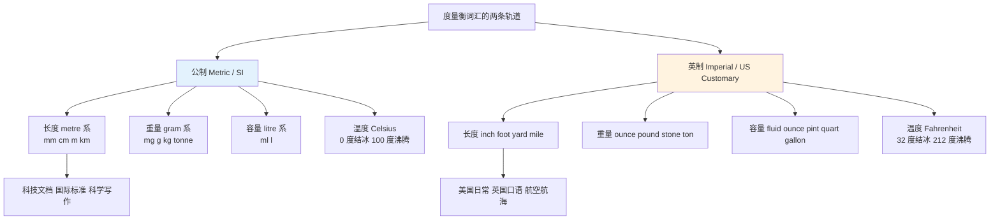
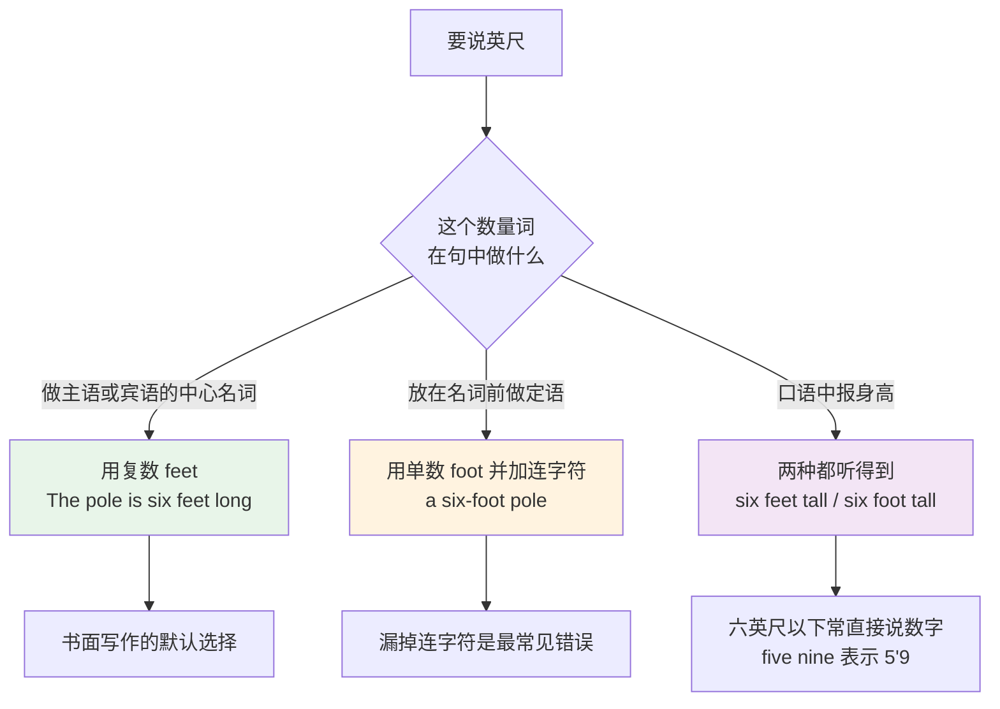
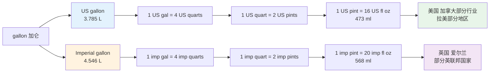
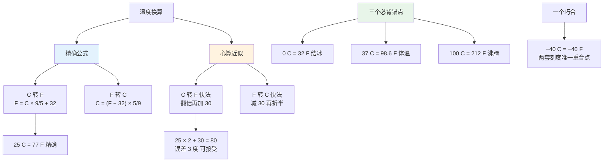
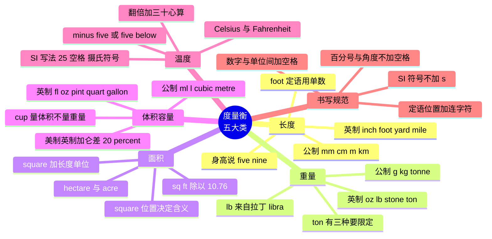

# 度量衡词表

> [!info] 本篇定位
>
> `03.数字与计量词汇` 的第三篇，接在 `02.分数、小数、百分数与数学运算读法` 之后。前两篇解决「数字怎么读」，这一篇解决「数字后面跟的那个单位怎么说」。
>
> 读完你会拿到五类度量衡的完整词表（长度、重量、面积、体积、温度，约一百五十条），一套换算表述句型，以及英美两套单位系统之间的对照关系。
>
> 三个中文母语者最容易翻车的点会单独展开：`foot` 什么时候不变 `feet`、美制加仑与英制加仑差了将近百分之二十、以及华氏度的心算换算法。

---

## 1. 本篇导读：两套单位系统同时在用

英语度量衡词汇难在一个结构性事实：**英美两套单位系统并行使用，而且没有一方在退场**。

中文使用者的直觉是「公制是标准，英制是历史遗留」。这个直觉在中国成立，在英语世界不成立。美国的日常生活几乎完全跑在英制上——身高说 feet 和 inches，体重说 pounds，开车看 miles，天气报 Fahrenheit，牛奶买 gallon。英国的情况更复杂：官方文件用公制，但路标用英里、酒吧用品脱、体重用石（stone）、身高用英尺英寸。

这意味着两件事：

**第一，两套词都要认。** 读技术文档时会遇到 `a 0.5 mm pitch connector`，读产品页时会遇到 `a 15.6-inch display`，同一份文档里两套单位混排是常态。

**第二，重点不是背换算数字，是掌握表述方式。** 具体的换算系数查一次就有，但「三点五米长的桌子」用英语怎么组织、身高 176 cm 用英尺英寸怎么说、把摄氏度换成华氏度时用什么句型，这些是词汇问题，查不出来，只能学。



上图把全篇的词汇按两条轨道分开。左边这条在技术文档、论文、国际标准里占主导；右边这条在美国日常对话、英国口语、航空航海（英尺高度、海里距离）里占主导。两条轨道的词汇量都不大——加起来五六十个核心单位词——但每一条都有自己的复数规则、缩写惯例和读法，混着用就会出洋相。

`04.货币、价格、折扣与统计图表趋势` 会接着讲另一类「数字后面的东西」：货币符号与图表趋势。度量衡与货币的表述句型高度相似，本篇建立的框架在下一篇会直接复用。

---

## 2. 长度（一）：公制单位

### 2.1 公制长度词表

公制长度以 `metre` 为基准，其余全部靠前缀调整数量级。前缀本身是一套独立的构词素材，`14.构词法：前缀与后缀` 会系统讲，这里先按单位记。

| 英文 | 英式音标 | 美式音标 | 词性 | 中文 | 搭配与说明 |
| --- | --- | --- | --- | --- | --- |
| **nanometre** | /ˈnænəʊmiːtə/ | /ˈnænoʊmiːtər/ | n. | 纳米 | 美式拼 nanometer；缩写 nm，半导体工艺常用 |
| **micron** | /ˈmaɪkrɒn/ | /ˈmaɪkrɑːn/ | n. | 微米 | 等于 micrometre，工程口语更常说 micron |
| **millimetre** | /ˈmɪlɪmiːtə/ | /ˈmɪləmiːtər/ | n. | 毫米 | 缩写 mm；机械图纸的默认单位 |
| **centimetre** | /ˈsentɪmiːtə/ | /ˈsentəmiːtər/ | n. | 厘米 | 缩写 cm；量身高体尺的常用刻度 |
| **decimetre** | /ˈdesɪmiːtə/ | /ˈdesəmiːtər/ | n. | 分米 | 英语实际极少用，中文教材里的分米在英语中通常换算成 cm |
| **metre** | /ˈmiːtə/ | /ˈmiːtər/ | n. | 米 | 美式拼 meter；SI 长度基本单位 |
| **kilometre** | /ˈkɪləmiːtə/ | /kɪˈlɑːmətər/ | n. | 千米；公里 | 缩写 km；英美重音位置不同，见 2.3 |
| **light year** | /ˈlaɪt jɪə/ | /ˈlaɪt jɪr/ | n. | 光年 | 是长度不是时间；写作两个词或加连字符 |

> [!warning] decimetre 是中文教材造成的错觉
>
> 中文小学教材把「分米」当作常用单位教，很多学习者以为英语里 `decimetre` 同样常用。实际情况相反：英语母语者几乎不用它，`3 decimetres` 一律说成 `30 centimetres`。
>
> - ❌ ~~The board is 8 decimetres long.~~（语法没错，但没人这么说）
> - ✅ The board is **80 centimetres** long.

### 2.2 metre 与 meter：拼写与词义的双重分裂

`metre` / `meter` 这一对是英美拼写差异里最容易出事的一组，因为它不只是拼写不同，**英式英语里这两个拼法是两个词**。

| 拼写 | 英式英语的含义 | 美式英语的含义 |
| --- | --- | --- |
| **metre** | 长度单位「米」；诗歌的格律 | 不用这个拼法 |
| **meter** | 计量器具（水表、电表、停车计时器） | 既是「米」，也是「计量器具」 |

> [!example] 同一句话的英式与美式写法
>
> - 英式：The **metre** reading was taken from the water **meter**.
>   - 米数是从水表上读的。（两个拼法各司其职）
> - 美式：The **meter** reading was taken from the water **meter**.
>   - 同一句在美式里两个词同形，靠上下文区分。

同一组规律覆盖 `litre` / `liter`、`centre` / `center`、`theatre` / `theater`。判断方法：英式的 `-tre` 在美式里一律变 `-ter`，但 `meter`（器具）这个词在英式里本来就写 `-ter`，所以只有它出现了「一个拼法两个词」的局面。

技术文档里怎么选？看文档整体的拼写风格。ISO、IEC、欧盟标准用 `metre`；IEEE、美国国家标准、多数开源项目文档用 `meter`。**同一份文档里保持一致比选对更重要。**

### 2.3 kilometre 的两种重音

`kilometre` 的重音位置是英美差异里少见的「同一个国家内部也不统一」的例子。

```text
英式主流：  /ˈkɪl-ə-miː-tə/      重音在第一音节，与 kilogram 对齐
英式次要：  /kɪ-ˈlɒm-ɪ-tə/      重音在第二音节，被部分英国人视为不规范
美式主流：  /kɪ-ˈlɑː-mə-tər/    重音在第二音节，与 thermometer 同型
美式次要：  /ˈkɪl-ə-miː-tər/    科学界与部分播音偏好这个
```

两种都能被听懂，选一种用到底即可。规律是：**重音在前**的读法把它当成「kilo + metre」的合成词看待，与 `kilogram`、`kilowatt` 一致；**重音在第二音节**的读法把它当成 `-meter` 结尾的器具词看待，与 `thermometer`、`barometer`、`speedometer` 一致。

其余带 `kilo-` 的单位不存在这个分歧，一律重音在前：`kilogram` /ˈkɪləɡræm/、`kilowatt` /ˈkɪləwɒt/、`kilobyte` /ˈkɪləbaɪt/。

---

## 3. 长度（二）：英制单位

### 3.1 英制长度词表

英制长度单位之间不是十进制，换算系数需要单独记：12 英寸等于 1 英尺，3 英尺等于 1 码，1760 码等于 1 英里。

| 英文 | 英式音标 | 美式音标 | 词性 | 中文 | 搭配与说明 |
| --- | --- | --- | --- | --- | --- |
| **inch** | /ɪntʃ/ | /ɪntʃ/ | n. | 英寸 | 复数 inches；等于 2.54 cm，符号 `"` |
| **foot** | /fʊt/ | /fʊt/ | n. | 英尺 | 等于 12 inches、30.48 cm，符号 `'` |
| **feet** | /fiːt/ | /fiːt/ | n. | foot 的复数 | 元音交替复数，不是加 -s |
| **yard** | /jɑːd/ | /jɑːrd/ | n. | 码 | 等于 3 feet、0.9144 m；美式橄榄球场的刻度 |
| **mile** | /maɪl/ | /maɪl/ | n. | 英里 | 等于 1760 yards、1.609 km |
| **nautical mile** | /ˈnɔːtɪkl maɪl/ | /ˈnɔːtɪkl maɪl/ | n. | 海里 | 等于 1852 m，与陆地英里不同，航海航空专用 |
| **furlong** | /ˈfɜːlɒŋ/ | /ˈfɜːrlɔːŋ/ | n. | 弗隆 | 八分之一英里、220 码；今天只用于赛马 |
| **fathom** | /ˈfæðəm/ | /ˈfæðəm/ | n./v. | 英寻；看透 | 等于 6 feet，量水深；动词义「理解透彻」 |
| **league** | /liːɡ/ | /liːɡ/ | n. | 里格 | 约 3 miles，已废弃，只在文学作品里出现 |
| **hand** | /hænd/ | /hænd/ | n. | 手 | 等于 4 inches，专门量马的肩高 |
| **mil** | /mɪl/ | /mɪl/ | n. | 密耳 | 千分之一英寸，PCB 走线与薄膜厚度用 |

> [!tip] 只需要记住四个换算数字
>
> 英制长度的全部日常需求由四个数字支撑：
>
> - 1 inch = **2.54** cm（唯一的精确定义值，其余都是从它推出来的）
> - 1 foot = **12** inches ≈ 30 cm
> - 1 yard = **3** feet ≈ 0.9 m
> - 1 mile = **1.6** km（更精确是 1.609）
>
> 心算时把 mile 当 1.6 倍，反向把 km 当 0.6 倍：`60 mph` 约等于 `96 km/h`，`100 km` 约等于 `62 miles`。这个精度足够读懂路标和新闻。

### 3.2 foot 与 feet：什么时候不加复数

这是本篇最需要花力气的一个点。`foot` 的复数是 `feet`，但在**充当定语的复合形容词**里必须用单数 `foot`。



上图分三种情形。做中心名词时用 `feet`，这是最基本的用法；一旦整个数量短语被搬到名词前面充当定语，数量词就要退回单数并用连字符连起来，这条规则不只管 `foot`，它管所有度量衡单位。

> [!example] 复合形容词里单位一律用单数
>
> - The pole is **six feet** long. → a **six-foot** pole
>   - 这根杆子六英尺长。→ 一根六英尺的杆子。
> - The container is **forty feet** long. → a **forty-foot** container
>   - 集装箱四十英尺长。→ 一个四十英尺的集装箱。
> - The walk took **ten minutes**. → a **ten-minute** walk
>   - 这段路走了十分钟。→ 十分钟的路程。
> - The bag weighs **three pounds**. → a **three-pound** bag
>   - 这袋子重三磅。→ 一个三磅的袋子。
> - The bottle holds **two litres**. → a **two-litre** bottle
>   - 这瓶装两升。→ 一个两升的瓶子。

> [!warning] 三个高频错法
>
> - ❌ ~~a six-feet pole~~ → ✅ a **six-foot** pole（定语位置不用复数）
> - ❌ ~~a six foot pole~~ → ✅ a **six-foot** pole（正式书面必须加连字符）
> - ❌ ~~The pole is six-foot long.~~ → ✅ The pole is **six feet** long.（谓语位置不用连字符也不用单数）
>
> 记忆钩子：**连字符和复数 -s 不共存**。看到连字符就把 -s 去掉，看到 -s 就把连字符去掉。

### 3.3 身高的三种说法

身高在英语世界几乎不用厘米表达，即使在英国也是英尺英寸。三种说法从正式到口语排列：

| 写法 | 读法 | 使用场合 |
| --- | --- | --- |
| He is 5 feet 9 inches tall. | five feet nine inches | 表格、医疗记录、正式文书 |
| He is 5 foot 9. | five foot nine | 日常对话，最常见 |
| He's five nine. | five nine | 口语，单位词全省略 |

> [!example] 身高对话的完整样例
>
> - **How tall are you?**
>   - 你多高？
> - I'm **five eight**. — About **173 centimetres**.
>   - 我五英尺八。大约一米七三。
> - She's just under **six foot**.
>   - 她差一点到六英尺。
> - The doorway is only **six feet two**, so mind your head.
>   - 门只有六英尺二高，小心头。

常用身高的换算参照，记住其中两三个作锚点就够推算其余：

```text
5'0"  = 152 cm        5'8"  = 173 cm
5'2"  = 157 cm        5'10" = 178 cm
5'4"  = 163 cm        6'0"  = 183 cm
5'6"  = 168 cm        6'2"  = 188 cm
```

每增加 1 英寸约等于 2.5 cm，每增加 1 英尺约等于 30 cm。以 `5'0" = 152 cm` 为起点往上加，误差在一厘米以内。

### 3.4 屏幕、纸张与集装箱：inch 的实际战场

即使在完全公制化的中国，`inch` 仍然活跃在几个具体场景里，这些场景对程序员尤其常见。

| 场景 | 英语表述 | 说明 |
| --- | --- | --- |
| 显示器 | a **27-inch** monitor | 量的是对角线 diagonal，不是宽度 |
| 笔记本 | a **15.6-inch** laptop | 读作 fifteen point six inch |
| 手机屏 | a **6.1-inch** display | 同样是对角线 |
| 轮毂 | **18-inch** wheels | 量的是轮辋直径 rim diameter |
| 管径 | a **half-inch** pipe | 读作 half inch，不读 zero point five |
| 集装箱 | a **20-foot** / **40-foot** container | 行业缩写 TEU 就是 twenty-foot equivalent unit |
| 硬盘 | a **3.5-inch** drive | 传统机械硬盘的规格尺寸 |

纸张尺寸是另一个英美分歧点，写国际化软件时会直接遇到：

| 规格 | 尺寸 | 使用地区 | 英语表述 |
| --- | --- | --- | --- |
| **A4** | 210 × 297 mm | 除美加外全球通用 | ISO A4 size |
| **US Letter** | 8.5 × 11 inches | 美国、加拿大、菲律宾 | US Letter size |
| **US Legal** | 8.5 × 14 inches | 美国法律文书 | Legal size |
| **A3** | 297 × 420 mm | 图纸、海报 | ISO A3 size |
| **Tabloid** | 11 × 17 inches | 美国大幅打印 | Tabloid size 或 Ledger |

`210 × 297 mm` 读作 `two hundred and ten by two hundred and ninety-seven millimetres`，其中 `×` 一律读 `by`。

---

## 4. 尺寸维度词与「有多长」的问法

### 4.1 维度名词

单位词只解决「多少」，维度词解决「哪个方向」。这批词是名词与形容词成对出现的，名词多数由形容词加 `-th` 构成，而且伴随元音变化。

| 英文 | 英式音标 | 美式音标 | 词性 | 中文 | 搭配与说明 |
| --- | --- | --- | --- | --- | --- |
| **length** | /leŋθ/ | /leŋθ/ | n. | 长度 | 对应形容词 long；注意不是 lenght |
| **width** | /wɪdθ/ | /wɪdθ/ | n. | 宽度 | 对应 wide；口语也说 how wide |
| **breadth** | /bredθ/ | /bredθ/ | n. | 宽度；广度 | 对应 broad；比 width 更书面，常用比喻义 |
| **height** | /haɪt/ | /haɪt/ | n. | 高度 | 对应 high 与 tall；拼写无 -th，读 /t/ 不读 /θ/ |
| **depth** | /depθ/ | /depθ/ | n. | 深度 | 对应 deep；也指颜色浓度、知识深度 |
| **thickness** | /ˈθɪknəs/ | /ˈθɪknəs/ | n. | 厚度 | 对应 thick；不说 thickth |
| **distance** | /ˈdɪstəns/ | /ˈdɪstəns/ | n. | 距离 | within walking distance 步行可达 |
| **diameter** | /daɪˈæmɪtə/ | /daɪˈæmətər/ | n. | 直径 | 缩写 dia. 或 Ø；圆管圆孔的标注单位 |
| **radius** | /ˈreɪdiəs/ | /ˈreɪdiəs/ | n. | 半径 | 拉丁复数 radii /ˈreɪdiaɪ/；也指圆角半径 |
| **circumference** | /səˈkʌmfərəns/ | /sərˈkʌmfərəns/ | n. | 周长（圆） | circum「绕」+ fer「带」 |
| **perimeter** | /pəˈrɪmɪtə/ | /pəˈrɪmətər/ | n. | 周长（多边形） | 圆形用 circumference，方形用 perimeter |
| **altitude** | /ˈæltɪtjuːd/ | /ˈæltɪtuːd/ | n. | 海拔；飞行高度 | 航空高度一律用英尺 |
| **elevation** | /ˌelɪˈveɪʃn/ | /ˌeləˈveɪʃn/ | n. | 海拔；立面图 | 地形图与建筑图纸都用 |
| **span** | /spæn/ | /spæn/ | n./v. | 跨度；跨越 | wingspan 翼展，bridge span 桥跨 |

对应的形容词单独列一张表，因为它们在「多长」的问句里出现频率比名词更高：

| 英文 | 英式音标 | 美式音标 | 词性 | 中文 | 搭配与说明 |
| --- | --- | --- | --- | --- | --- |
| **long** | /lɒŋ/ | /lɔːŋ/ | adj. | 长的 | 名词 length；比较级 longer |
| **wide** | /waɪd/ | /waɪd/ | adj. | 宽的 | 名词 width；three metres wide |
| **broad** | /brɔːd/ | /brɔːd/ | adj. | 宽阔的 | 名词 breadth；broad shoulders 宽肩 |
| **tall** | /tɔːl/ | /tɔːl/ | adj. | 高的（人、树、楼） | 说人只能用 tall，不能用 high |
| **high** | /haɪ/ | /haɪ/ | adj. | 高的（离地距离） | a high wall；a high shelf |
| **deep** | /diːp/ | /diːp/ | adj. | 深的 | 名词 depth；two metres deep |
| **shallow** | /ˈʃæləʊ/ | /ˈʃæloʊ/ | adj. | 浅的 | deep 的反义；也指理解肤浅 |
| **thick** | /θɪk/ | /θɪk/ | adj. | 厚的；粗的 | 名词 thickness；thick fog 浓雾 |
| **thin** | /θɪn/ | /θɪn/ | adj. | 薄的；细的 | thick 的反义；说人是「瘦」 |
| **narrow** | /ˈnærəʊ/ | /ˈnæroʊ/ | adj. | 窄的 | wide 的反义；a narrow street |

> [!warning] tall 与 high 不能互换
>
> 两个词都译成「高」，但英语里分工明确：
>
> - **tall** 用于**基部立在地面、纵向延展**的事物：人、树、建筑物、烟囱、长颈鹿。
> - **high** 用于**离地面的距离**，或没有明确「站立」形态的高度：墙、架子、山、云、价格。
>
> - ❌ ~~He is 1.8 metres high.~~ → ✅ He is 1.8 metres **tall**.
> - ❌ ~~a tall mountain~~ → ✅ a **high** mountain（山用 high；但 a tall peak 说尖峰可以）
> - ✅ a **tall** building = a **high** building（建筑物两者都行，tall 更常见）
> - ✅ The shelf is too **high** for me to reach.（架子说离地高度，不说 tall）

### 4.2 提问与回答的固定格式

问尺寸的句型高度模式化，掌握下面这组就覆盖了绝大多数情形。

| 问句 | 中文 | 典型回答 |
| --- | --- | --- |
| **How long** is it? | 多长？ | It's **two metres** long. |
| **How wide** is it? | 多宽？ | It's **80 centimetres** wide. |
| **How tall** are you? | 你多高？ | I'm **five ten**. |
| **How high** is the ceiling? | 天花板多高？ | About **three metres**. |
| **How deep** is the pool? | 泳池多深？ | **1.5 metres** at the shallow end. |
| **How thick** is the board? | 板子多厚？ | **18 millimetres**. |
| **How far** is it? | 有多远？ | About **ten kilometres**. |
| **How heavy** is it? | 有多重？ | Roughly **five kilos**. |
| **How much does it weigh?** | 它重多少？ | It weighs **2.3 kilograms**. |
| **What size** is it? | 什么尺寸？ | It's **A4**. |
| **What are the dimensions?** | 尺寸是多少？ | **120 by 60 by 75 centimetres**. |

回答的语序是固定的：**数字 + 单位 + 形容词**。`two metres long`，不是 `long two metres`，也不是 `two metres of length`。

> [!example] 同一个尺寸的三种表达
>
> - The table is **1.8 metres** long.
>   - 桌子长一米八。（最常用，形容词后置）
> - The table has a **length of 1.8 metres**.
>   - 桌子的长度为一米八。（正式书面，用名词 length）
> - The table measures **1.8 metres** in length.
>   - 桌子长度量得一米八。（技术文档常见，动词 measure 作不及物）

### 4.3 三维尺寸的读法

产品规格里的三维尺寸有一套固定读法，`×` 一律读 `by`，单位只在最后说一次。

```text
书写：  120 × 60 × 75 cm
读作：  a hundred and twenty by sixty by seventy-five centimetres

书写：  W 120 × D 60 × H 75 cm
读作：  width a hundred and twenty, depth sixty, height seventy-five centimetres

书写：  1920 × 1080
读作：  nineteen twenty by ten eighty（分辨率读法，数字成对读）
```

产品页上的 `W`、`D`、`H` 分别是 width、depth、height。家具行业习惯的顺序是「宽 × 深 × 高」，电子产品常用「长 × 宽 × 厚」，读的时候把字母还原成完整单词比较稳妥。

分辨率 `1920 × 1080` 的读法值得单独说：**这里的数字按屏幕数字读法拆成两组两位数**，读 `nineteen twenty by ten eighty`，不读 `one thousand nine hundred and twenty`。同理 `2560 × 1440` 读 `twenty-five sixty by fourteen forty`。这套拆读法在年份、门牌号、房间号上同样适用，详见 `02.分数、小数、百分数与数学运算读法` 里的数字分组规则。

### 4.4 测量动作与工具词

单位词与维度词之外，还有一批描述「量」这个动作本身的词。它们在说明书、实验记录和工程文档里出现频率很高。

| 英文 | 英式音标 | 美式音标 | 词性 | 中文 | 搭配与说明 |
| --- | --- | --- | --- | --- | --- |
| **measure** | /ˈmeʒə/ | /ˈmeʒər/ | v./n. | 测量；措施 | 名词义「措施」同样高频，take measures 采取措施 |
| **measurement** | /ˈmeʒəmənt/ | /ˈmeʒərmənt/ | n. | 测量值；尺寸 | 复数 measurements 指一组身材尺寸 |
| **dimension** | /daɪˈmenʃn/ | /daɪˈmenʃn/ | n. | 维度；尺寸 | 首音节 /daɪ/ 与 /dɪ/ 两读并存，英美都能听到；复数指具体长宽高 |
| **ruler** | /ˈruːlə/ | /ˈruːlər/ | n. | 尺；统治者 | 两义同源，都来自 rule「规则、划线」 |
| **tape measure** | /teɪp ˈmeʒə/ | /teɪp ˈmeʒər/ | n. | 卷尺；软尺 | 裁缝与装修都用它，不说 soft ruler |
| **scales** | /skeɪlz/ | /skeɪlz/ | n. | 秤 | 英式惯用复数，美式常说 a scale |
| **caliper** | /ˈkælɪpə/ | /ˈkælɪpər/ | n. | 卡尺 | 英式也拼 calliper；vernier caliper 游标卡尺 |
| **gauge** | /ɡeɪdʒ/ | /ɡeɪdʒ/ | n./v. | 量规；估量 | 拼写不规则，读音与 gage 同；pressure gauge 压力表 |
| **protractor** | /prəˈtræktə/ | /proʊˈtræktər/ | n. | 量角器 | pro「向前」+ tract「拉」 |
| **yardstick** | /ˈjɑːdstɪk/ | /ˈjɑːrdstɪk/ | n. | 码尺；衡量标准 | 比喻义远比本义常用 |
| **calibrate** | /ˈkælɪbreɪt/ | /ˈkælɪbreɪt/ | v. | 校准 | 名词 calibration；仪器与模型都能 calibrate |
| **benchmark** | /ˈbentʃmɑːk/ | /ˈbentʃmɑːrk/ | n./v. | 基准；跑分 | 本义是测量师留在石头上的基准标记 |

> [!tip] gauge 的拼写与读音要分开记
>
> `gauge` 是英语里拼写与读音落差最大的常用词之一：五个字母里的 `au` 读 /eɪ/，与 `gate`、`gay` 同韵，不读 /ɔː/ 也不读 /aʊ/。
>
> 拼写上有两个坑：一是元音顺序容易写反成 `guage`（这是英语拼写错误统计里的常客），二是它还有个已被淘汰的异体 `gage`，在旧文献里能见到。
>
> 记忆钩子：把它和同样 `-au-` 读 /eɪ/ 的 `gauche` 区分开——后者读 /ɡəʊʃ/，是法语借词。`gauge` 走英语读法，`gauche` 走法语读法。

---

## 5. 重量：从 gram 到 stone

### 5.1 公制重量词表

公制重量的基准单位是 `kilogram` 而非 `gram`——SI 里唯一一个自带前缀的基本单位。日常口语几乎不说 kilogram 全称，一律缩成 `kilo`。

| 英文 | 英式音标 | 美式音标 | 词性 | 中文 | 搭配与说明 |
| --- | --- | --- | --- | --- | --- |
| **microgram** | /ˈmaɪkrəʊɡræm/ | /ˈmaɪkroʊɡræm/ | n. | 微克 | 缩写 μg 或 mcg；药品剂量常用 |
| **milligram** | /ˈmɪlɪɡræm/ | /ˈmɪləɡræm/ | n. | 毫克 | 缩写 mg；营养标签与处方的主力单位 |
| **gram** | /ɡræm/ | /ɡræm/ | n. | 克 | 英式旧拼法 gramme 已基本退出 |
| **kilogram** | /ˈkɪləɡræm/ | /ˈkɪləɡræm/ | n. | 千克；公斤 | 缩写 kg；SI 质量基本单位 |
| **kilo** | /ˈkiːləʊ/ | /ˈkiːloʊ/ | n. | 公斤（口语） | 复数 kilos；注意第一音节读 /kiː/ 不读 /kɪ/ |
| **tonne** | /tʌn/ | /tʌn/ | n. | 公吨 | 1000 kg；也说 metric ton |
| **carat** | /ˈkærət/ | /ˈkerət/ | n. | 克拉 | 200 mg，宝石重量；金纯度用 karat 拼法 |

> [!warning] kilo 的第一个音节容易读错
>
> `kilogram` /ˈkɪləɡræm/ 里的 kilo- 读 /ˈkɪlə/，短音；但单独成词的 `kilo` /ˈkiːləʊ/ 读长音 /kiː/。
>
> - **kilogram** → /ˈ**kɪ**ləɡræm/（短 i）
> - **kilo** → /ˈ**kiː**ləʊ/（长 i）
>
> 中文学习者常把两者读成同一个音，说 `two kilos` 时读成 /ˈkɪləʊz/，母语者能听懂但明显不自然。

### 5.2 英制重量词表

| 英文 | 英式音标 | 美式音标 | 词性 | 中文 | 搭配与说明 |
| --- | --- | --- | --- | --- | --- |
| **grain** | /ɡreɪn/ | /ɡreɪn/ | n. | 格令 | 约 64.8 mg；弹药与药剂的古老单位 |
| **dram** | /dræm/ | /dræm/ | n. | 打兰 | 十六分之一盎司；今天多见于比喻「一点点」 |
| **ounce** | /aʊns/ | /aʊns/ | n. | 盎司 | 缩写 oz，约 28.35 g；十六盎司为一磅 |
| **troy ounce** | /trɔɪ aʊns/ | /trɔɪ aʊns/ | n. | 金衡盎司 | 31.1 g，只用于贵金属，与普通盎司不同 |
| **pound** | /paʊnd/ | /paʊnd/ | n. | 磅 | 缩写 lb，来自拉丁 libra；约 453.6 g |
| **stone** | /stəʊn/ | /stoʊn/ | n. | 英石 | 14 磅、约 6.35 kg；英国报体重专用，复数常不变 |
| **hundredweight** | /ˈhʌndrədweɪt/ | /ˈhʌndrədweɪt/ | n. | 英担 | 缩写 cwt；英制 112 磅，美制 100 磅 |
| **short ton** | /ʃɔːt tʌn/ | /ʃɔːrt tʌn/ | n. | 短吨（美吨） | 2000 磅、约 907 kg；美国说 ton 默认指这个 |
| **long ton** | /lɒŋ tʌn/ | /lɔːŋ tʌn/ | n. | 长吨（英吨） | 2240 磅、约 1016 kg |

> [!tip] lb 这个缩写为什么和 pound 一个字母都不沾
>
> `lb` 来自拉丁语 `libra pondo`（一磅重）。英语借走了后半截 `pondo` 变成 `pound`，缩写却沿用了前半截 `libra` 的 `lb`。同一个来源还留下了英镑符号 `£`——那是花体的 L。
>
> 同类的还有 `oz`，它来自意大利语 `onza`；`#` 在美式手写里也表示磅，所以电话按键上的井号在美国叫 pound key。

### 5.3 ton 与 tonne：同音不同量

`ton` 和 `tonne` 在英语里**发音完全相同**，都是 /tʌn/，但代表三个不同的重量。

| 词 | 重量 | 使用地区 | 消歧说法 |
| --- | --- | --- | --- |
| **tonne** | 1000 kg | 英国、欧洲、国际 | metric ton / metric tonne |
| **short ton** | 907 kg | 美国 | US ton；美国人说 ton 默认这个 |
| **long ton** | 1016 kg | 英国传统 | imperial ton；今天已少见 |

三者最大差幅约 12%，在船运、货运、碳排放数据里这个差值足以造成实质误差。技术文档和商务合同里的规避写法是**永远带限定词**：写 `metric tons (t)`、`short tons (ST)`，不写光秃秃的 `tons`。

> [!example] 消歧的实际写法
>
> - The plant emits 50,000 **metric tonnes** of CO₂ a year.
>   - 这家工厂每年排放五万公吨二氧化碳。
> - The truck has a capacity of 20 **short tons**.
>   - 这辆卡车载重二十美吨。
> - Shipping is quoted per **metric ton**, not per **short ton**.
>   - 运价按公吨报，不按美吨报。

### 5.4 与重量有关的动词与形容词

| 英文 | 英式音标 | 美式音标 | 词性 | 中文 | 搭配与说明 |
| --- | --- | --- | --- | --- | --- |
| **weigh** | /weɪ/ | /weɪ/ | v. | 重；称重 | 既作系动词 it weighs 5 kg，也作及物 weigh the box |
| **weight** | /weɪt/ | /weɪt/ | n. | 重量；砝码 | 与 wait 同音；lose weight 减重 |
| **mass** | /mæs/ | /mæs/ | n. | 质量 | 物理概念，与 weight（重力）区分 |
| **scales** | /skeɪlz/ | /skeɪlz/ | n. | 秤 | 英式常用复数 scales，美式常说 a scale |
| **heavy** | /ˈhevi/ | /ˈhevi/ | adj. | 重的 | heavy traffic 拥堵，heavy rain 大雨 |
| **light** | /laɪt/ | /laɪt/ | adj. | 轻的 | 与「光」同形；light meal 便餐 |
| **lightweight** | /ˈlaɪtweɪt/ | /ˈlaɪtweɪt/ | adj./n. | 轻量的；轻量级 | 技术文档里指轻量框架、轻量进程 |
| **heavyweight** | /ˈheviweɪt/ | /ˈheviweɪt/ | adj./n. | 重量级的 | 拳击级别，也比喻重要人物 |
| **net weight** | /net weɪt/ | /net weɪt/ | n. | 净重 | 缩写 N.W.；不含包装 |
| **gross weight** | /ɡrəʊs weɪt/ | /ɡroʊs weɪt/ | n. | 毛重 | 缩写 G.W.；gross 读 /ɡrəʊs/ 不读 /ɡrɒs/ |
| **tare** | /teə/ | /ter/ | n./v. | 皮重；去皮 | 电子秤上的 TARE 键就是这个 |
| **payload** | /ˈpeɪləʊd/ | /ˈpeɪloʊd/ | n. | 有效载荷 | 运输业指载重，网络协议里指数据主体 |
| **density** | /ˈdensəti/ | /ˈdensəti/ | n. | 密度 | 单位 kg/m³，读 kilograms per cubic metre |

> [!warning] weigh 的两种句式不要混
>
> `weigh` 既能当系动词又能当及物动词，两种句式意思相反。
>
> - **It weighs 5 kilos.** — 它重五公斤。（系动词，主语是被称的东西）
> - **I weighed the parcel.** — 我称了包裹。（及物动词，主语是称的人）
> - ❌ ~~The parcel is weighed 5 kilos.~~（混了两种句式）
> - ✅ The parcel **weighs** 5 kilos. / The parcel **was weighed** at the post office.

### 5.5 中文「斤」怎么说

中文的「斤」在英语里没有对应词，必须换算。市斤等于 500 g，正好是半公斤，所以最自然的说法是 `half a kilo`。

| 中文单位 | 换算 | 推荐英语表述 | 备注 |
| --- | --- | --- | --- |
| 一斤 | 500 g | **half a kilo** / 500 grams | 不要音译成 jin，对方听不懂 |
| 两斤 | 1 kg | **a kilo** | 直接说公斤最省事 |
| 一两 | 50 g | **50 grams** | 十两为一斤 |
| 半斤 | 250 g | **250 grams** | 或说 a quarter of a kilo |
| 一钱 | 5 g | **5 grams** | 中药方剂里的单位 |

需要保留中国单位的语境（比如翻译菜谱或中医文献），写法是 `jin (500 g)`，第一次出现时括号给出换算，之后可直接用。这个处理方式对所有文化专有单位通用。

---

## 6. 面积：square 结构与 acre / hectare

### 6.1 面积词表

面积的构成规律很简单：长度单位前面加 `square`。真正需要单独记的只有 `acre` 和 `hectare` 两个不走这个套路的词。

| 英文 | 英式音标 | 美式音标 | 词性 | 中文 | 搭配与说明 |
| --- | --- | --- | --- | --- | --- |
| **area** | /ˈeəriə/ | /ˈeriə/ | n. | 面积；地区 | 两个义项常见，靠上下文分辨 |
| **square** | /skweə/ | /skwer/ | adj./n./v. | 平方的；正方形；广场 | 作数学动词指「求平方」 |
| **square metre** | /skweə ˈmiːtə/ | /skwer ˈmiːtər/ | n. | 平方米 | 缩写 m² 或 sq m；房产面积的国际单位 |
| **square kilometre** | /skweə ˈkɪləmiːtə/ | /skwer kɪˈlɑːmətər/ | n. | 平方千米 | 缩写 km²；国土与城市面积 |
| **square foot** | /skweə fʊt/ | /skwer fʊt/ | n. | 平方英尺 | 复数 square feet，缩写 sq ft；美国房产单位 |
| **square mile** | /skweə maɪl/ | /skwer maɪl/ | n. | 平方英里 | 等于 640 acres；美国郡县面积 |
| **hectare** | /ˈhekteə/ | /ˈhekter/ | n. | 公顷 | 10000 m²，缩写 ha；农林与土地规划 |
| **acre** | /ˈeɪkə/ | /ˈeɪkər/ | n. | 英亩 | 约 4047 m²，缩写 ac；一公顷约 2.47 英亩 |
| **surface area** | /ˈsɜːfɪs ˈeəriə/ | /ˈsɜːrfɪs ˈeriə/ | n. | 表面积 | 立体几何与散热计算 |
| **floor area** | /flɔː ˈeəriə/ | /flɔːr ˈeriə/ | n. | 建筑面积 | 房产广告的核心指标 |
| **footprint** | /ˈfʊtprɪnt/ | /ˈfʊtprɪnt/ | n. | 占地面积；足迹 | 引申出 carbon footprint 碳足迹 |
| **plot** | /plɒt/ | /plɑːt/ | n. | 地块 | 美式也说 lot；building plot 建筑用地 |

### 6.2 square 放在哪里

`square` 在面积表述里有两个位置，含义不同。

| 结构 | 例子 | 含义 |
| --- | --- | --- |
| square + 单位 | **square metres** | 面积单位「平方米」 |
| 数字 + 单位 + square | **ten metres square** | 边长十米的正方形，面积是 100 m² |

这个区别在实际使用中造成过真实的工程误会。`ten square metres` 是十平方米，`ten metres square` 是一百平方米，差了十倍。

> [!example] 两种说法的对照
>
> - The room is **twenty square metres**.
>   - 房间面积二十平方米。
> - The room is **twenty metres square**.
>   - 房间是二十米见方的，也就是四百平方米。
> - The plot measures **50 by 40 metres**, giving **2,000 square metres**.
>   - 这块地五十米乘四十米，合两千平方米。

第三句是最不容易被误解的写法：给出两条边长，再给出面积。技术文档和合同里推荐这种冗余写法。

### 6.3 中文「平米」「亩」的英语表述

| 中文 | 换算 | 英语表述 |
| --- | --- | --- |
| 平方米 | — | **square metres**（英）/ **square meters**（美） |
| 平米（口语） | — | 同上，英语没有对应的口语简称 |
| 一亩 | 666.7 m² | **about 667 square metres** 或 **0.0667 hectares** |
| 一公顷 | 10000 m² | **one hectare**（十五亩） |
| 一平方公里 | 100 ha | **one square kilometre** |

「亩」和「斤」一样没有英语对应词，翻译时给换算值。农业文献里保留原词时写 `mu (about 667 m²)`。

> [!warning] 房产面积的英美差异
>
> 美国房产广告用 **square feet**，中国和欧洲用 **square metres**，换算系数约 10.76。
>
> 一套 100 m² 的房子在美国广告里是 `1,076 sq ft`；一套 `2,000 sq ft` 的美国房子约合 186 m²。看到 sq ft 时**先除以 10.76** 再判断大小，直接按数字对比会得出完全错误的印象。

---

## 7. 体积与容量

### 7.1 公制体积容量词表

英语里体积（volume）与容量（capacity）分工明确：立方单位量空间体积，升制单位量液体容量。

| 英文 | 英式音标 | 美式音标 | 词性 | 中文 | 搭配与说明 |
| --- | --- | --- | --- | --- | --- |
| **millilitre** | /ˈmɪlɪliːtə/ | /ˈmɪləliːtər/ | n. | 毫升 | 美式拼 milliliter；缩写 ml 或 mL |
| **centilitre** | /ˈsentɪliːtə/ | /ˈsentəliːtər/ | n. | 厘升 | 缩写 cl；欧洲酒瓶标签常见，美国不用 |
| **litre** | /ˈliːtə/ | /ˈliːtər/ | n. | 升 | 美式拼 liter；缩写 l 或 L |
| **cubic** | /ˈkjuːbɪk/ | /ˈkjuːbɪk/ | adj. | 立方的 | cubic metre 立方米，cubic centimetre 立方厘米 |
| **cubic centimetre** | /ˈkjuːbɪk ˈsentɪmiːtə/ | /ˈkjuːbɪk ˈsentəmiːtər/ | n. | 立方厘米 | 缩写 cc 或 cm³；等于 1 ml，发动机排量常用 |
| **cubic metre** | /ˈkjuːbɪk ˈmiːtə/ | /ˈkjuːbɪk ˈmiːtər/ | n. | 立方米 | 缩写 m³；水费燃气费的计量单位 |
| **volume** | /ˈvɒljuːm/ | /ˈvɑːljuːm/ | n. | 体积；音量；卷 | 三个义项都高频，靠上下文分辨 |
| **capacity** | /kəˈpæsəti/ | /kəˈpæsəti/ | n. | 容量；产能 | fuel tank capacity 油箱容量 |
| **displacement** | /dɪsˈpleɪsmənt/ | /dɪsˈpleɪsmənt/ | n. | 排量；排水量 | 发动机排量、船舶排水量 |

> [!tip] 升的缩写为什么大小写都行
>
> SI 规定单位符号只有源自人名时才大写，`litre` 不是人名，所以本该写小写 `l`。但小写 l 在多数字体里和数字 1 难以区分，1979 年国际计量大会破例允许大写 `L`。
>
> 结果是两种写法并存：欧洲文献偏好 `l`，美国和医学领域偏好 `L`，`mL`（小写 m 大写 L）在实验室文档里最常见。三种写法都对，同一份文档统一即可。

### 7.2 英美制容量词表

| 英文 | 英式音标 | 美式音标 | 词性 | 中文 | 搭配与说明 |
| --- | --- | --- | --- | --- | --- |
| **fluid ounce** | /ˈfluːɪd aʊns/ | /ˈfluːɪd aʊns/ | n. | 液量盎司 | 缩写 fl oz；美制 29.6 ml，英制 28.4 ml |
| **cup** | /kʌp/ | /kʌp/ | n. | 杯（量具） | 美制 240 ml；食谱专用，不是随便一个杯子 |
| **pint** | /paɪnt/ | /paɪnt/ | n. | 品脱 | 美制 473 ml，英制 568 ml；英国酒吧的标准杯 |
| **quart** | /kwɔːt/ | /kwɔːrt/ | n. | 夸脱 | 两品脱；美制约 946 ml |
| **gallon** | /ˈɡælən/ | /ˈɡælən/ | n. | 加仑 | 美制 3.785 L，英制 4.546 L；差 20% |
| **barrel** | /ˈbærəl/ | /ˈbærəl/ | n. | 桶 | 石油一桶等于 42 美加仑、约 159 L |
| **bushel** | /ˈbʊʃl/ | /ˈbʊʃl/ | n. | 蒲式耳 | 约 35.2 L；谷物期货的报价单位 |
| **tablespoon** | /ˈteɪblspuːn/ | /ˈteɪblspuːn/ | n. | 汤匙 | 缩写 tbsp；约 15 ml |
| **teaspoon** | /ˈtiːspuːn/ | /ˈtiːspuːn/ | n. | 茶匙 | 缩写 tsp；约 5 ml，三茶匙为一汤匙 |
| **pinch** | /pɪntʃ/ | /pɪntʃ/ | n. | 一撮 | a pinch of salt；无精确定义 |
| **dash** | /dæʃ/ | /dæʃ/ | n. | 少许（液体） | a dash of milk；比 pinch 更少 |

### 7.3 美制加仑与英制加仑不是一回事

这是度量衡词汇里差异最大、后果最严重的一组。



上图展示的关键差异有两层。第一层是加仑本身差了约 20%——美制 3.785 升对英制 4.546 升。第二层更隐蔽：**一品脱含多少液量盎司，两边也不同**，美制 16，英制 20。这意味着即使两边都说 `a pint of beer`，英国酒吧的一品脱比美国多出将近百分之二十。

对程序员的直接影响是单位换算库的实现。`gallon` 这个 key 在没有地区限定时是有歧义的，成熟的单位库（如 Python 的 pint、JavaScript 的 convert-units）都强制区分 `gal_us` 与 `gal_imp`。写换算代码时把地区当成必填参数，而不是给一个默认值。

> [!warning] 油耗数字的跨国比较陷阱
>
> 美国说油耗用 **miles per gallon (mpg)**，英国也说 mpg，但两边的 gallon 不同，同一辆车在英国报的 mpg 数字天然比美国高约 20%。
>
> - 一辆车在美国标称 `30 mpg`，在英国的同口径数据是约 `36 mpg`。
> - 中国和欧洲用的是反向指标 **litres per 100 km（L/100 km）**，数字越小越省油，与 mpg 方向相反。
> - `30 US mpg` 约等于 `7.8 L/100 km`。
>
> 看到 mpg 时先确认是 US 还是 imperial，再做任何比较。

### 7.4 厨房计量：cup / tbsp / tsp

美式食谱按体积计量，中式和欧式食谱按重量计量，这是两套完全不同的操作逻辑。

| 缩写 | 全称 | 容量 | 中文 |
| --- | --- | --- | --- |
| **tsp** | teaspoon | 约 5 ml | 茶匙 |
| **tbsp** | tablespoon | 约 15 ml（3 tsp） | 汤匙 |
| **fl oz** | fluid ounce | 约 30 ml（2 tbsp） | 液量盎司 |
| **c** | cup | 约 240 ml（8 fl oz） | 杯 |
| **pt** | pint | 约 473 ml（2 cups） | 品脱 |
| **qt** | quart | 约 946 ml（2 pints） | 夸脱 |
| **gal** | gallon | 约 3.785 L（4 quarts） | 加仑 |

> [!warning] cup 量的是体积，不能直接换算成克
>
> 美式食谱里的 `1 cup of flour` 和 `1 cup of sugar` 体积相同，重量却差很多——面粉约 120 g，白砂糖约 200 g，因为密度不同。
>
> - ❌ 把 `1 cup = 240 g` 当成通用换算（这只对水成立）
> - ✅ 按食材分别查密度，或直接买一套美式量杯量勺
>
> 食谱里出现 `1 cup, packed`（压实一杯）或 `1 cup, sifted`（过筛后一杯）时，重量还会再变，这也是体积计量法被诟病的原因。

> [!example] 食谱里的量词读法
>
> - Add **two tablespoons** of olive oil.
>   - 加两汤匙橄榄油。（tbsp 读全称，不读字母）
> - Stir in **half a teaspoon** of salt.
>   - 拌入半茶匙盐。
> - Pour in **a cup and a half** of milk.
>   - 倒入一杯半牛奶。
> - Bring **four cups** of water to the boil.
>   - 把四杯水烧开。

缩写 `tbsp` 和 `tsp` 在朗读时一律还原成全称 `tablespoon` / `teaspoon`，不按字母念。这与 `cm`、`kg` 的处理一致：**度量衡缩写是书写形式，不是读音形式**。

---

## 8. 温度：Celsius 与 Fahrenheit

### 8.1 温度词表

| 英文 | 英式音标 | 美式音标 | 词性 | 中文 | 搭配与说明 |
| --- | --- | --- | --- | --- | --- |
| **temperature** | /ˈtemprətʃə/ | /ˈtemprətʃər/ | n. | 温度；体温 | 常读作三音节 /ˈtemprə-/，中间的 e 脱落 |
| **degree** | /dɪˈɡriː/ | /dɪˈɡriː/ | n. | 度 | 温度、角度、学位三义同形 |
| **Celsius** | /ˈselsiəs/ | /ˈselsiəs/ | n./adj. | 摄氏 | 首字母大写，来自瑞典天文学家姓氏 |
| **centigrade** | /ˈsentɪɡreɪd/ | /ˈsentəɡreɪd/ | n./adj. | 百分度；摄氏 | Celsius 的旧称，1948 年后官方改用 Celsius |
| **Fahrenheit** | /ˈfærənhaɪt/ | /ˈferənhaɪt/ | n./adj. | 华氏 | 首字母大写；Fah- 里的 h 不发音，-heit 里的 h 要发音 |
| **Kelvin** | /ˈkelvɪn/ | /ˈkelvɪn/ | n. | 开尔文 | 绝对温标，不加 degree，直接说 300 kelvins |
| **thermometer** | /θəˈmɒmɪtə/ | /θərˈmɑːmətər/ | n. | 温度计 | 重音在第二音节，不在第一 |
| **freezing point** | /ˈfriːzɪŋ pɔɪnt/ | /ˈfriːzɪŋ pɔɪnt/ | n. | 冰点 | 水的冰点 0 °C / 32 °F |
| **boiling point** | /ˈbɔɪlɪŋ pɔɪnt/ | /ˈbɔɪlɪŋ pɔɪnt/ | n. | 沸点 | 水的沸点 100 °C / 212 °F |
| **absolute zero** | /ˈæbsəluːt ˈzɪərəʊ/ | /ˈæbsəluːt ˈzɪroʊ/ | n. | 绝对零度 | 0 K，等于 −273.15 °C |
| **sub-zero** | /ˌsʌbˈzɪərəʊ/ | /ˌsʌbˈzɪroʊ/ | adj. | 零下的 | sub-zero temperatures 零下气温 |
| **minus** | /ˈmaɪnəs/ | /ˈmaɪnəs/ | prep./adj. | 负；零下 | minus five 零下五度 |
| **room temperature** | /ruːm ˈtemprətʃə/ | /ruːm ˈtemprətʃər/ | n. | 室温 | 约 20 °C / 68 °F；食谱与实验常用 |
| **body temperature** | /ˈbɒdi ˈtemprətʃə/ | /ˈbɑːdi ˈtemprətʃər/ | n. | 体温 | 正常约 37 °C / 98.6 °F |

### 8.2 两套刻度的换算与心算法



上图给出两条路径。精确公式用于写代码和做题；心算近似用于听天气预报、看美国新闻时快速建立体感。「翻倍加三十」的误差等于「摄氏度数乘零点二再减二」的绝对值，在 0—30 °C 这个日常区间里不超过 4 度，完全够用；到 35 °C 时误差涨到 5 度，天气之外的场合还是走精确公式。

天气区间的对照表值得直接背下来，因为听懂华氏温度靠的是体感锚点而不是运算：

| 摄氏 | 华氏 | 体感 | 英语描述 |
| --- | --- | --- | --- |
| −10 °C | 14 °F | 严寒 | **freezing** / bitterly cold |
| 0 °C | 32 °F | 结冰 | **freezing point** |
| 10 °C | 50 °F | 凉 | **chilly** / cool |
| 20 °C | 68 °F | 舒适 | **mild** / pleasant |
| 25 °C | 77 °F | 温暖 | **warm** |
| 30 °C | 86 °F | 热 | **hot** |
| 37 °C | 98.6 °F | 体温 | **normal body temperature** |
| 40 °C | 104 °F | 酷热 | **scorching** / sweltering |

> [!tip] 美国天气预报的数字直觉
>
> 华氏温度的整十档正好对应体感等级，这是它在日常生活里没被淘汰的原因：
>
> - **30s**（华氏三十几度）→ 接近结冰，要穿厚外套
> - **50s** → 凉爽，薄外套
> - **70s** → 舒适，最理想的天气
> - **90s** → 很热
> - **100+** → 极端高温，会发预警
>
> 读法是 `in the seventies`（七十几度），`highs in the low 80s`（最高温八十出头），`lows in the upper 40s`（最低温四十七八度）。`low` / `mid` / `upper` 分别指该十位段的前段、中段、后段。

### 8.3 度数的读法与写法

温度的书写有一套排版规范，技术文档和正式写作里会被检查。

| 写法 | 规范性 | 说明 |
| --- | --- | --- |
| **25 °C** | SI 标准 | 数字与 °C 之间有空格，度符号与 C 之间无空格 |
| **25°C** | 常见但非标准 | 出版物中广泛使用，SI 建议加空格 |
| **25 degrees Celsius** | 正式书面 | 全拼，适合正文叙述 |
| **77 °F** | 美式标准 | 同样规则 |
| **300 K** | 开尔文 | 不加 degree，不加 °，直接写 K |

> [!example] 温度的读法示范
>
> - The oven should be at **180 degrees Celsius**.
>   - 烤箱应设在摄氏一百八十度。
> - It's **seventy-two degrees** outside.
>   - 外面七十二度。（美国日常省略 Fahrenheit）
> - Tonight's low will be **minus three**.
>   - 今晚最低温零下三度。
> - It dropped to **five below zero**.
>   - 降到了零下五度。（美式口语也说 five below）
> - Water boils at **a hundred degrees**.
>   - 水在一百度沸腾。
> - Store between **2 and 8 °C**.
>   - 储存于二至八摄氏度。（读 two to eight degrees Celsius）
> - Her temperature is **38.5**.
>   - 她体温三十八度五。（读 thirty-eight point five）

零下温度有三种说法，使用地区不同：

- `minus five degrees` — 国际通用，英式主流
- `five degrees below zero` — 正式，两地通用
- `five below` — 美式口语，省略 degrees 和 zero

> [!warning] 说体温不要用 Celsius 全称
>
> 医院和日常对话里报体温，英语的习惯是**只说数字**，因为语境已经确定了刻度。
>
> - ❌ ~~My temperature is 38.5 degrees Celsius.~~（正确但过于冗长，像在做实验记录）
> - ✅ My temperature is **38.5**. / I'm running a temperature of **101**.（美式用华氏）
>
> 美式的 `101` 指华氏 101 度，约合 38.3 °C。听到英美人说 `I have a fever of 102` 时不要按摄氏理解。

### 8.4 描述冷热的形容词梯度

温度形容词有清晰的强度梯度，选错一档会让描述失真。

| 英文 | 英式音标 | 美式音标 | 词性 | 中文 | 搭配与说明 |
| --- | --- | --- | --- | --- | --- |
| **frigid** | /ˈfrɪdʒɪd/ | /ˈfrɪdʒɪd/ | adj. | 严寒的 | 书面语；也形容态度冷淡 |
| **freezing** | /ˈfriːzɪŋ/ | /ˈfriːzɪŋ/ | adj. | 冻死人的 | 口语最强档，It's freezing 不必真的零度 |
| **chilly** | /ˈtʃɪli/ | /ˈtʃɪli/ | adj. | 微寒的 | 带不适感；也形容气氛尴尬 |
| **cool** | /kuːl/ | /kuːl/ | adj. | 凉爽的 | 中性偏舒适；与 chilly 的差别是无不适感 |
| **mild** | /maɪld/ | /maɪld/ | adj. | 温和的 | 说天气指不冷不热，说食物指不辣 |
| **lukewarm** | /ˌluːkˈwɔːm/ | /ˌluːkˈwɔːrm/ | adj. | 温吞的 | 只说液体；比喻反应冷淡 |
| **tepid** | /ˈtepɪd/ | /ˈtepɪd/ | adj. | 微温的 | 比 lukewarm 更书面，同样带贬义 |
| **warm** | /wɔːm/ | /wɔːrm/ | adj. | 暖和的 | 正面词；warm welcome 热情欢迎 |
| **hot** | /hɒt/ | /hɑːt/ | adj. | 热的 | 也指辣；hot sauce 辣酱不是热酱 |
| **boiling** | /ˈbɔɪlɪŋ/ | /ˈbɔɪlɪŋ/ | adj. | 滚烫的 | 口语夸张用法，I'm boiling 我热死了 |
| **scorching** | /ˈskɔːtʃɪŋ/ | /ˈskɔːrtʃɪŋ/ | adj. | 灼热的 | 多形容日照与天气 |
| **sweltering** | /ˈsweltərɪŋ/ | /ˈsweltərɪŋ/ | adj. | 闷热的 | 强调湿热难受，带汗意 |

> [!tip] cool 与 chilly 的分界在于舒适度
>
> 两个词都指「凉」，但情感色彩相反：
>
> - **cool** 是舒服的凉，夏天的傍晚、空调房、井水。`a cool breeze` 是好事。
> - **chilly** 是让人想加衣服的凉，带轻微不适。`a chilly room` 是抱怨。
>
> 同理 `warm`（舒服的暖）与 `hot`（可能过热）的关系也是这样。判断依据不是温度数值，是说话人的感受倾向。

---

## 9. 换算的英语表述

### 9.1 换算句型

单位换算在英语里有一批固定句型，掌握后可以处理任何单位对之间的转换表述。

| 句型 | 例句 | 中文 |
| --- | --- | --- |
| A **equals** B | One inch **equals** 2.54 centimetres. | 一英寸等于二点五四厘米。 |
| A **is equal to** B | A mile **is equal to** 1.609 kilometres. | 一英里等于一点六零九千米。 |
| A **is equivalent to** B | Five kilos **is equivalent to** about eleven pounds. | 五公斤约等于十一磅。 |
| **There are** N B **in** one A | **There are** twelve inches **in** a foot. | 一英尺有十二英寸。 |
| A **converts to** B | 100 °C **converts to** 212 °F. | 一百摄氏度换算成二百一十二华氏度。 |
| **To convert** A **to** B, ... | **To convert** miles **to** kilometres, multiply by 1.6. | 英里换千米，乘以一点六。 |
| A **comes out at** B | Ten pounds **comes out at** about 4.5 kilos. | 十磅算下来约四点五公斤。 |
| A **works out at** B | The area **works out at** 85 square metres. | 面积算出来是八十五平方米。 |

> [!example] 一段完整的换算说明
>
> - **To convert** Celsius **to** Fahrenheit, multiply by nine-fifths and add thirty-two.
>   - 摄氏换华氏，乘以五分之九再加三十二。
> - **There are** 1,760 yards **in** a mile, which **works out at** roughly 1.6 kilometres.
>   - 一英里有一千七百六十码，算下来大约一点六千米。
> - A US gallon **is equivalent to** 3.785 litres, whereas an imperial gallon **comes out at** 4.546.
>   - 一美制加仑相当于三点七八五升，而英制加仑是四点五四六升。

### 9.2 近似与精确的表达

度量衡表述里几乎每句话都要标明精度，这批限定词是必备的。

| 英文 | 英式音标 | 美式音标 | 词性 | 中文 | 搭配与说明 |
| --- | --- | --- | --- | --- | --- |
| **approximately** | /əˈprɒksɪmətli/ | /əˈprɑːksɪmətli/ | adv. | 大约 | 书面正式，缩写 approx. |
| **roughly** | /ˈrʌfli/ | /ˈrʌfli/ | adv. | 大致 | 口语常用，精度低于 approximately |
| **about** | /əˈbaʊt/ | /əˈbaʊt/ | adv. | 大约 | 最常用最中性 |
| **around** | /əˈraʊnd/ | /əˈraʊnd/ | adv. | 大约 | 与 about 基本同义 |
| **roughly speaking** | /ˈrʌfli ˈspiːkɪŋ/ | /ˈrʌfli ˈspiːkɪŋ/ | phr. | 粗略地说 | 句首插入语 |
| **just over** | /dʒʌst ˈəʊvə/ | /dʒʌst ˈoʊvər/ | phr. | 略多于 | just over two metres 两米出头 |
| **just under** | /dʒʌst ˈʌndə/ | /dʒʌst ˈʌndər/ | phr. | 略少于 | just under a kilo 不到一公斤 |
| **precisely** | /prɪˈsaɪsli/ | /prɪˈsaɪsli/ | adv. | 精确地 | 强调数值本身没有余量 |
| **exactly** | /ɪɡˈzæktli/ | /ɪɡˈzæktli/ | adv. | 恰好 | 比 precisely 口语化 |
| **round up** | /raʊnd ʌp/ | /raʊnd ʌp/ | v. | 向上取整 | round up to the nearest whole number |
| **round down** | /raʊnd daʊn/ | /raʊnd daʊn/ | v. | 向下取整 | 与 round up 成对 |
| **round off** | /raʊnd ɒf/ | /raʊnd ɔːf/ | v. | 四舍五入 | round off to two decimal places |
| **accuracy** | /ˈækjərəsi/ | /ˈækjərəsi/ | n. | 准确度 | 测得值与真值的接近程度 |
| **precision** | /prɪˈsɪʒn/ | /prɪˈsɪʒn/ | n. | 精密度 | 重复测量的一致程度，与 accuracy 不同 |
| **tolerance** | /ˈtɒlərəns/ | /ˈtɑːlərəns/ | n. | 公差 | ±0.05 mm 读 plus or minus |
| **margin of error** | /ˈmɑːdʒɪn əv ˈerə/ | /ˈmɑːrdʒɪn əv ˈerər/ | n. | 误差范围 | 统计与民调常用 |
| **metric** | /ˈmetrɪk/ | /ˈmetrɪk/ | adj./n. | 公制的；指标 | 软件工程里 metrics 指监控指标 |
| **imperial** | /ɪmˈpɪəriəl/ | /ɪmˈpɪriəl/ | adj. | 英制的 | imperial units 英制单位 |

> [!warning] accuracy 与 precision 不是同义词
>
> 中文都译作「精度」，英语里是两个正交的概念，工程文档里混用会造成实质误解。
>
> - **accuracy 准确度**：测量值离真值有多近。打靶时子弹是否落在靶心附近。
> - **precision 精密度**：多次测量彼此有多接近。打靶时子弹是否聚成一簇。
>
> 一把系统性偏高 2 cm 的尺子每次读数都一致——**precise but not accurate**（精密但不准确）。一把读数随机跳动但平均值正确的尺子——**accurate but not precise**（准确但不精密）。

### 9.3 复合单位的读法

带斜杠的复合单位在朗读时把斜杠读成 `per`。

| 书写 | 读法 | 中文 |
| --- | --- | --- |
| km/h | kilometres **per** hour | 千米每小时 |
| mph | miles **per** hour | 英里每小时 |
| m/s | metres **per** second | 米每秒 |
| kg/m³ | kilograms **per** cubic metre | 千克每立方米 |
| L/100 km | litres **per** hundred kilometres | 升每百千米 |
| mpg | miles **per** gallon | 英里每加仑 |
| g/L | grams **per** litre | 克每升 |
| rpm | revolutions **per** minute | 转每分 |
| $/kg | dollars **per** kilo | 美元每公斤 |

`km/h`、`m/s`、`kg/m³` 这类带斜杠的写法朗读时一律还原成全称，斜杠读 `per`，没有按字母读的说法。`mph`、`mpg`、`rpm` 这类三字母缩写则两读并存：`rpm` 多按字母读 `ar pee em`，`mph` 和 `mpg` 按字母读和还原成 `miles per hour` / `miles per gallon` 都很常见，口语里 `miles an hour` 比 `miles per hour` 更多。判据是：**带斜杠的必须读全称，纯字母缩写可读可拆**。

> [!example] 速度与油耗的表述
>
> - The speed limit here is **thirty miles an hour**.
>   - 这里限速三十英里。（口语常用 an hour 代替 per hour）
> - It does **zero to sixty in 4.2 seconds**.
>   - 零到六十英里加速四点二秒。（美式测 0—60 mph，欧洲测 0—100 km/h，就是中文说的百公里加速）
> - The car gets **thirty-five miles per gallon** on the motorway.
>   - 这车高速油耗每加仑三十五英里。
> - Wind speeds reached **120 kilometres per hour**.
>   - 风速达到每小时一百二十千米。

---

## 10. 单位的缩写、复数与书写规范

### 10.1 缩写对照表

| 单位 | 缩写 | 加复数 s？ | 加句点？ | 备注 |
| --- | --- | --- | --- | --- |
| millimetre | **mm** | 否 | 否 | SI 符号一律不变形 |
| centimetre | **cm** | 否 | 否 | ❌ ~~cms~~ |
| metre | **m** | 否 | 否 | 小写 m |
| kilometre | **km** | 否 | 否 | ❌ ~~kms~~ |
| gram | **g** | 否 | 否 | 小写 g |
| kilogram | **kg** | 否 | 否 | ❌ ~~kgs~~ |
| tonne | **t** | 否 | 否 | 小写 t |
| litre | **l** 或 **L** | 否 | 否 | 两种写法都被认可 |
| millilitre | **ml** 或 **mL** | 否 | 否 | 实验室偏好 mL |
| inch | **in** 或 **"** | 少数写 ins | 美式常写 in. | 英制符号规范较松 |
| foot | **ft** 或 **'** | 否 | 美式常写 ft. | ❌ ~~fts~~ |
| yard | **yd** | 可写 yds | 可有可无 | 英制允许加 s |
| mile | **mi** | 可写 mi | 可有可无 | 通常直接写全称 |
| ounce | **oz** | 少数写 ozs | 可有可无 | 来自意大利语 onza |
| pound | **lb** | 常见 lbs | 可有可无 | 严格写法不加 s |
| gallon | **gal** | 少数写 gals | 可有可无 | 需注明 US 或 imp |
| square metre | **m²** 或 **sq m** | 否 | 否 | 上标 2 或写 sq |
| hectare | **ha** | 否 | 否 | 小写 |
| acre | **ac** | 少数写 ac | 可有可无 | 常直接写全称 |
| degree Celsius | **°C** | 否 | 否 | 度符号紧贴 C |
| degree Fahrenheit | **°F** | 否 | 否 | 同上 |
| kelvin | **K** | 否 | 否 | 不带度符号 |

### 10.2 复数规则的分界线

度量衡缩写的复数规则有一条清晰分界：**SI 公制符号绝不变形，英制缩写宽松得多。**

| 写法类别 | 规则 | 理由 |
| --- | --- | --- |
| SI 符号（mm cm m km g kg l t） | 永不加 s，永不加句点 | 它们是国际约定的**记号**，不是英语单词的缩写，因此不受英语复数规则约束 |
| 英制缩写（ft lb oz gal） | 加 s 与句点都能见到 | 英制没有统一的标准化机构，各行业惯例不同；正式写作倾向不加 |
| 单位全称（kilograms pounds） | 公制英制一律照常加 s | 全称就是普通英语名词，走普通名词的复数规则 |

判据落地时只需记两句话：**符号不加 s，全称照常加 s**。`5 kg` 和 `five kilograms` 都对，`5 kgs` 在技术文档里会被审校打回。英制的 `5 lbs` 虽然常见到几乎标准化，但正式场合仍写 `5 lb`。

单数量的处理另有一条：**数量为 1 时全称用单数**。

- ✅ **one kilogram** / **1 kg**
- ✅ **one metre** / **1 m**
- ❌ ~~one kilograms~~
- ✅ **zero degrees**（零用复数，这是英语数量词的通例）
- ✅ **0.5 kilograms**（小于 1 的小数也用复数）

### 10.3 空格与连字符

| 场景 | 正确写法 | 错误写法 |
| --- | --- | --- |
| 数字与单位符号之间 | 5 kg、25 °C、10 m | ~~5kg~~、~~25°C~~（后者常见但非 SI 标准） |
| 百分号与角度 | 50%、45° | ~~50 %~~（多数风格指南要求百分号紧贴数字） |
| 做定语的复合词 | a **5-kg** bag、a **10-metre** pole | ~~a 5 kg bag~~（正式写作要加连字符） |
| 复合词里的单位 | a **three-hour** meeting | ~~a three-hours meeting~~ |
| 尺寸区间 | **2 to 8 °C**、**2–8 °C** | ~~2 °C to 8 °C~~（单位只在末尾出现一次） |
| 加减公差 | **10 ± 0.5 mm** | ~~10mm ± 0.5mm~~ |

> [!warning] 百分号和度符号的空格规则要分开记
>
> SI 的通则是数字与单位符号之间加空格，但落到这三个符号上有分歧：
>
> - **角度符号 °** 紧贴数字：`45°`，不写 `45 °`。平面角的度、分、秒是 SI 明文规定的例外。
> - **百分号 %** 在 SI 文本里其实建议留空格（`50 %`），但绝大多数英语风格指南和出版物要求紧贴数字，写 `50%`。日常与技术写作跟随后者。
> - **温度的 °C 要加空格**：`25 °C`，因为这里的 ° 与 C 合起来才是一个单位符号，而不是一个独立的角度符号。
>
> 最后一条在出版界并未被普遍遵守，`25°C` 随处可见。写技术规范时按 SI 来，写一般文章时跟随所在出版物的风格指南。

---

## 11. 高频错误集中处理

前面各节的易错点在这里汇总成一张速查表，按错误类型分组。

**类型一：复数与单复数**

| 错误 | 正确 | 原因 |
| --- | --- | --- |
| ~~a six-feet man~~ | a **six-foot** man | 定语位置用单数 |
| ~~The wall is two-metre high.~~ | The wall is **two metres** high. | 谓语位置用复数且不加连字符 |
| ~~5 kgs~~ | **5 kg** | SI 符号不加 s |
| ~~two kilos and a half~~ | **two and a half kilos** | 数量词的语序 |
| ~~one degrees~~ | **one degree** | 数量为 1 用单数 |
| ~~zero degree~~ | **zero degrees** | 零用复数 |

**类型二：词义混淆**

| 错误 | 正确 | 原因 |
| --- | --- | --- |
| ~~He is 1.8 m high.~~ | He is 1.8 m **tall**. | 人的身高用 tall |
| ~~a tall mountain~~ | a **high** mountain | 山用 high |
| ~~The room is 20 metres square.~~（想说 20 m²） | The room is **20 square metres**. | square 的位置决定含义 |
| ~~It weighs about 3 tons.~~（在国际合同里） | It weighs about 3 **metric tonnes**. | ton 有三种，必须限定 |
| ~~1 gallon = 3.785 L~~（在英国语境） | 1 **US gallon** = 3.785 L | 英制加仑是 4.546 L |
| ~~high precision means accurate~~ | precision ≠ accuracy | 两个概念正交 |

**类型三：读音**

| 词 | 常见错读 | 正确读法 |
| --- | --- | --- |
| **kilo** | /ˈkɪləʊ/ | /ˈ**kiː**ləʊ/，长音 |
| **thermometer** | /ˈθɜːməmiːtə/ | /θəˈ**mɒ**mɪtə/，重音第二音节 |
| **Fahrenheit** | /ˈfɑːhrənhaɪt/ | /ˈ**fær**ənhaɪt/，Fah- 的 h 不发音 |
| **gross** | /ɡrɒs/ | /ɡ**rəʊ**s/，长音 |
| **height** | /haɪθ/ | /haɪ**t**/，结尾是 /t/ 不是 /θ/ |
| **fathom** | /ˈfæθəm/ | /ˈfæ**ð**əm/，浊音 |

**类型四：中式直译**

| 中文 | 错误直译 | 正确表达 |
| --- | --- | --- |
| 三斤苹果 | ~~three jin of apples~~ | **1.5 kilos** of apples |
| 五亩地 | ~~five mu of land~~ | about **3,300 square metres** |
| 一米八的个子 | ~~a height of one metre eight~~ | **one metre eighty** / **five foot eleven** |
| 长十米宽五米 | ~~ten metres long and five metres wide~~ | 语法正确，但更自然的是 **ten by five metres** |
| 温度三十八度五 | ~~thirty-eight degrees five~~ | **thirty-eight point five** |
| 两米见方 | ~~two square metres~~ | **two metres square** |

**类型五：书写规范**

| 错误 | 正确 |
| --- | --- |
| ~~The box is 30cm long.~~ | The box is **30 cm** long. |
| ~~Store at 2°C to 8°C.~~ | Store at **2 to 8 °C**. |
| ~~a 5 kg bag~~（正式文档） | a **5-kg** bag |
| ~~50 % of users~~ | **50%** of users |
| ~~300 °K~~ | **300 K**（开尔文不加度符号） |
| ~~5 Kg~~ | **5 kg**（k 小写，g 小写） |

---

## 12. 本篇小结



> [!success] 本篇核心要点回顾
>
> 1. 英美两套单位系统**同时在用**，公制主导技术文档与国际标准，英制主导美国日常与英国口语。两套词都要认，重点是掌握表述方式而非死记换算系数。
> 2. `foot` 做定语时用**单数并加连字符**（a six-foot pole），做谓语时用**复数且不加连字符**（six feet long）。这条规则管所有度量衡单位，`three-pound bag`、`ten-minute walk` 同理。
> 3. 身高在英语世界用英尺英寸，三种说法依正式度排列：`5 feet 9 inches` → `5 foot 9` → `five nine`。
> 4. `ton` 有三种：公吨 1000 kg、美吨 907 kg、英吨 1016 kg，发音都是 /tʌn/。合同与技术文档必须写 `metric tonne` 或 `short ton` 消歧。
> 5. **美制加仑 3.785 L，英制加仑 4.546 L，相差约 20%**；一品脱含的液量盎司数也不同（美 16，英 20）。写换算代码时把地区当必填参数。
> 6. `square` 的位置决定含义：`ten square metres` 是十平方米，`ten metres square` 是一百平方米。
> 7. 摄氏转华氏的心算法是**翻倍加三十**，在 0—30 °C 区间误差不超过 4 度。三个锚点是 0/32、37/98.6、100/212，唯一重合点是 −40。
> 8. SI 单位符号**永不加 s、永不加句点**（`5 kg` 不是 `5 kgs`），写全称时照常加 s（`five kilograms`）。数字与单位之间加空格，角度符号 `°` 与惯例上的百分号 `%` 紧贴数字。

> [!success] 本篇练习清单
>
> - [ ] 把 `a pole six feet long` 改写成定语形式，并解释为什么不能写 `six-feet`
> - [ ] 用三种方式说出你自己的身高（英尺英寸的完整式、口语式、纯数字式）
> - [ ] 不查表说出 `1 inch`、`1 foot`、`1 mile`、`1 pound` 对应的公制近似值
> - [ ] 解释 `ten square metres` 与 `ten metres square` 的差别，并各举一个使用场景
> - [ ] 用心算法把 `85 °F` 转成摄氏，再用精确公式验证误差有多大
> - [ ] 说明为什么同一辆车在美国和英国的 mpg 数字不同，差多少
> - [ ] 找出下面五处书写错误：`5kgs`、`25°C to 30°C`、`a 10 metre pole`、`300 °K`、`50 %`
> - [ ] 把「这块地长五十米宽四十米，合两千平方米」译成英语，用 by 结构

### 12.1 下一篇预告

> [!info] 下一篇：钱与图表
>
> 本篇的单位跟在数字后面表示「多少量」，下一篇的符号跟在数字前面表示「多少钱」。
>
> [[03.数字与计量词汇/04.货币、价格、折扣与统计图表趋势\|货币、价格、折扣与统计图表趋势]]
>
> 会覆盖三件事：货币词汇与符号（`$` `£` `€` `¥` 的读法、美元英镑的辅币名、`dollar` 与 `buck` 的语域差别）、价格与折扣的表述（`30% off`、`buy one get one free`、`marked down from`、`RRP`），以及统计图表的趋势动词与形容词（`surge`、`plummet`、`plateau`、`level off`，配合 `sharply`、`steadily`、`marginally` 这组副词）。
>
> 本篇建立的「数字 + 单位 + 精度限定词」框架在下一篇会直接复用，`approximately`、`just over`、`round off` 这批词在讲价格与统计数据时同样是主力。
