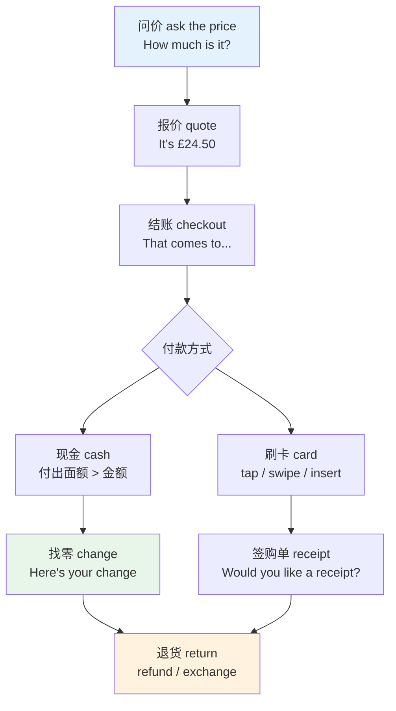
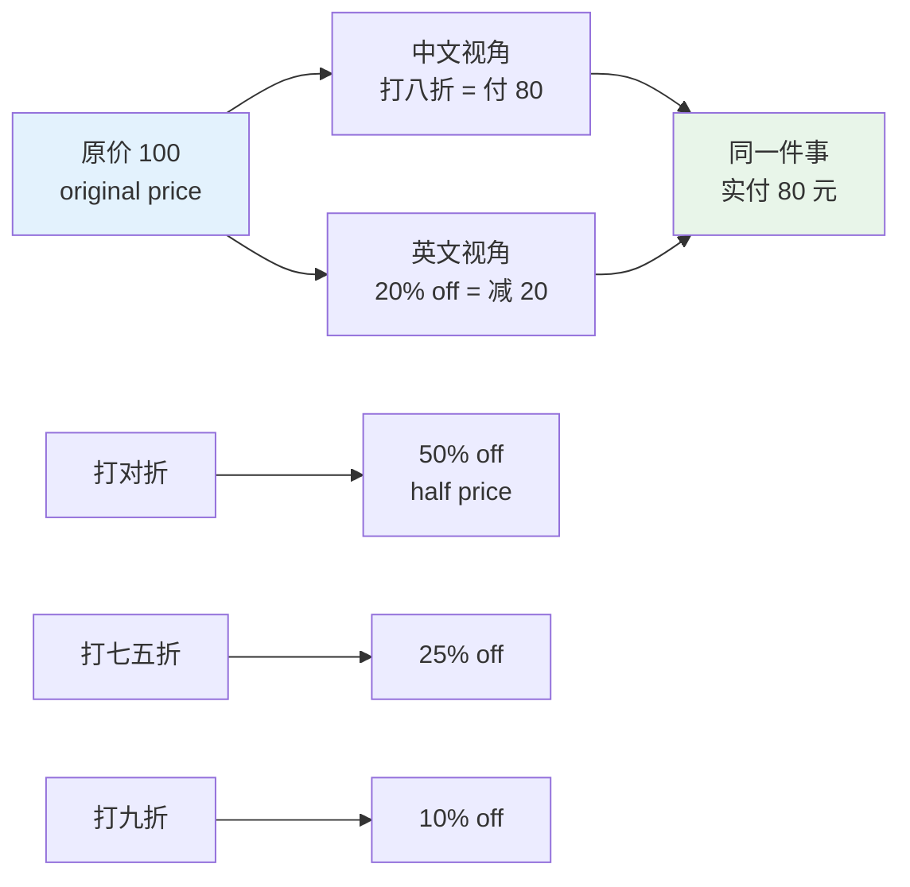
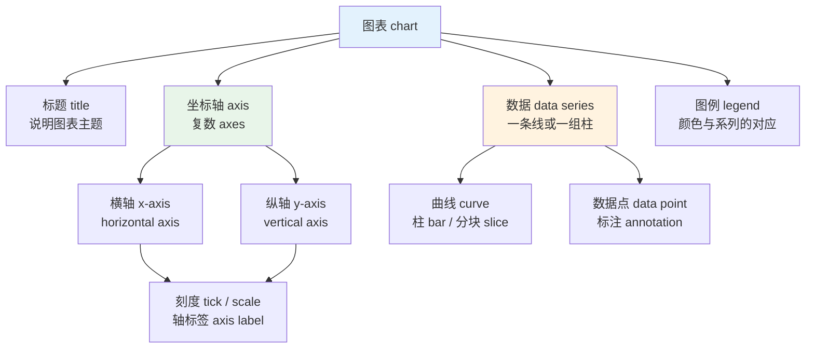
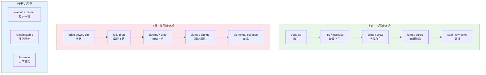
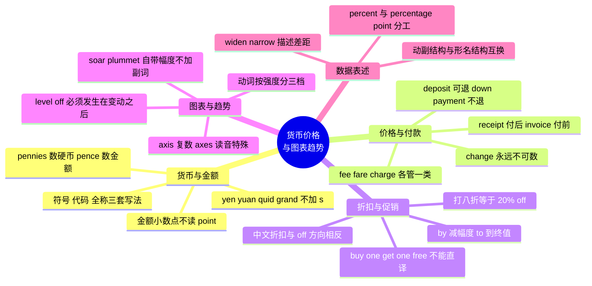

# 货币、价格、折扣与统计图表趋势

> [!info] 本篇定位
>
> 数字与计量章的收尾篇，也是这一章里唯一同时管「读数」和「说趋势」的一篇。
>
> 前三篇解决了数字本身怎么读（基数序数、运算、度量衡），本篇解决数字带上单位和方向之后怎么说：`$3.50` 念出来是什么，`打八折` 对应哪个英文表达，一条上升曲线该配 `rose sharply` 还是 `soared`。
>
> 读完能做三件事：在英美商店里完整走完问价、付款、找零、退货的对话；读懂 SaaS 账单和定价页上的每一个词；用英文描述一张折线图的走势而不只会 `go up` 和 `go down`。

---

## 1. 本篇导读：钱数和图表读的是同一批数字

价格和图表看起来是两个话题，放在同一篇里是因为它们共用同一批语言零件。

一张营收折线图上的每个点都是一个金额，描述这张图必须同时具备两样东西：把 `$4.2m` 读出来的能力，和把「从三月到六月缓慢爬升然后突然跳水」说清楚的能力。少了任何一样，图就描述不完整。

程序员会更早撞上这两件事的合并版本。云服务账单页上写着 `$0.023 per GB-month`、`prorated`、`overage charges`；监控面板上写着 `p99 latency spiked to 1.2s then leveled off`。这两句话里的词，一半来自本篇的价格部分，一半来自本篇的趋势部分。

本篇有两条主线。第一条从数字走到交易：数字带上货币单位就成了价格，于是有了 `price`、`fee`、`deposit`、`discount` 这一批词，覆盖第 2 到第 8 节。第二条从数字走到数据描述：数字带上方向和速度就成了趋势，于是有了 `rise`、`plunge`、`level off` 加副词的整套搭配，覆盖第 9 到第 12 节。

两条线在实际使用中必然汇合。一份季度财报既要报金额也要说走势，一页定价对比图既有价格又有曲线，两套词汇要一起调用。

本篇不讲语法规则。`rise` 是不及物动词、`raise` 是及物动词这类信息会出现在搭配列里，但那是作为词条属性给出的，不是作为语法条目讲解的。语法层面的完整处理在 `02.英语基础语法` 那一套里。

---

## 2. 货币名称与符号

### 2.1 主要货币的名称、符号与读法

英语里货币有三套写法：符号（`$`）、代码（`USD`）、全称（`US dollar`）。三套用在不同场合，不能混。

| 英文 | 英式音标 | 美式音标 | 词性 | 中文 | 搭配与说明 |
| --- | --- | --- | --- | --- | --- |
| **currency** | /ˈkʌrənsi/ | /ˈkɜːrənsi/ | n. | 货币 | foreign currency；重音音节的元音英美不同 |
| **dollar** | /ˈdɒlə/ | /ˈdɑːlər/ | n. | 美元 | 符号 $；复数 dollars |
| **cent** | /sent/ | /sent/ | n. | 分 | 100 cents = 1 dollar；符号 ¢ |
| **pound** | /paʊnd/ | /paʊnd/ | n. | 英镑 | 符号 £；同形词也表「磅」，见上一篇度量衡 |
| **penny** | /ˈpeni/ | /ˈpeni/ | n. | 便士 | 两种复数，见 2.3 |
| **pence** | /pens/ | /pens/ | n. | 便士（金额复数） | 50 pence = 50p |
| **sterling** | /ˈstɜːlɪŋ/ | /ˈstɜːrlɪŋ/ | n. | 英镑（正式） | pound sterling 用于金融文本 |
| **euro** | /ˈjʊərəʊ/ | /ˈjʊroʊ/ | n. | 欧元 | 符号 €；复数 euros |
| **yen** | /jen/ | /jen/ | n. | 日元 | 符号 ¥；单复数同形，five yen |
| **yuan** | /juˈɑːn/ | /juˈɑːn/ | n. | 人民币元 | 单复数同形；符号也是 ¥ |
| **renminbi** | /ˌrenmɪnˈbiː/ | /ˌrenmɪnˈbiː/ | n. | 人民币 | 货币名，不用于计数 |
| **rupee** | /ruːˈpiː/ | /ruːˈpiː/ | n. | 卢比 | 印度、巴基斯坦等国货币 |
| **won** | /wɒn/ | /wɑːn/ | n. | 韩元 | 与动词 win 的过去式同形不同音 |
| **franc** | /fræŋk/ | /fræŋk/ | n. | 法郎 | 现主要指瑞士法郎 CHF |
| **exchange rate** | /ɪksˈtʃeɪndʒ reɪt/ | /ɪksˈtʃeɪndʒ reɪt/ | n. | 汇率 | the exchange rate against the dollar |
| **conversion** | /kənˈvɜːʃn/ | /kənˈvɜːrʒn/ | n. | 换算；转换 | currency conversion fee 货币转换费 |

> [!warning] 三个高频误用
>
> - ❌ ~~The price is 100 RMB dollars.~~
> - ✅ The price is **100 yuan**. / The price is **100 RMB**.
>   - `renminbi` 是货币体系的名字，`yuan` 才是计数单位。日常口语两者都能说 `100 RMB`，但 `RMB dollars` 是拼错了的组合。
>
> - ❌ ~~It costs five yens.~~
> - ✅ It costs **five yen**.
>   - `yen` 和 `yuan` 都是单复数同形，绝不加 -s。`dollar`、`euro`、`pound` 则正常加 -s。
>
> - ❌ ~~£ 50~~（符号后加空格）
> - ✅ **£50**
>   - 货币符号紧贴数字，不留空格。这是英文排版惯例，也是简历和报价单里最容易露怯的细节。

### 2.2 ISO 货币代码

金融文本、机票、跨境支付接口里出现的是三字母代码，读法是逐字母拼读。

| 代码 | 货币 | 符号 | 读法 |
| --- | --- | --- | --- |
| USD | 美元 | $ | /ˌjuː es ˈdiː/ |
| GBP | 英镑 | £ | /ˌdʒiː biː ˈpiː/ |
| EUR | 欧元 | € | /ˌiː juː ˈɑː/ · /ˌiː juː ˈɑːr/ |
| JPY | 日元 | ¥ | /ˌdʒeɪ piː ˈwaɪ/ |
| CNY | 人民币 | ¥ | /ˌsiː en ˈwaɪ/ |
| HKD | 港元 | HK$ | /ˌeɪtʃ keɪ ˈdiː/ |
| AUD | 澳元 | A$ | /ˌeɪ juː ˈdiː/ |
| CAD | 加元 | C$ | /ˌsiː eɪ ˈdiː/ |

代码的三个字母里前两位是国家代码，第三位是货币首字母。`USD` 是 US + Dollar，`GBP` 是 Great Britain + Pound。知道这个构成规律，看到 `CHF`（Confoederatio Helvetica + Franc）也能推出来。

代码前置写法 `USD 500` 和符号写法 `$500` 都对，但同一份文档里不要混用。多币种场景优先用代码，因为 `$` 可能是美元、加元、澳元、港元中的任何一个。

### 2.3 penny 的两种复数

`penny` 是英语里少数几个复数形式按语义分岔的名词，考试和实际使用都会撞上。

| 形式 | 音标（英/美） | 用于 | 例子 |
| --- | --- | --- | --- |
| **pennies** | /ˈpeniz/ · /ˈpeniz/ | 数硬币个数 | I found three **pennies** under the sofa. |
| **pence** | /pens/ · /pens/ | 数金额 | The stamp costs seventy **pence**. |

判据是「你在数硬币还是在数钱」。三枚一便士硬币是 `three pennies`；七十便士这个金额是 `seventy pence`，哪怕它由多枚不同面值硬币凑成。

书面缩写 `70p` 在口语里读作 `seventy p` /ˈsevnti piː/，直接念字母 p，不念 pence。这是英式日常口语的标准读法，念全 `seventy pence` 反而显得刻意。

---

## 3. 金额的读法规则

### 3.1 带小数点的金额

金额的小数点在英语里不读 `point`，这是与普通小数最大的区别。

```text
$3.50   → three fifty            （最常用，省略单位）
        → three dollars fifty     （英式风格，也通行）
        → three dollars and fifty cents （正式、报数、电话确认）

£2.99   → two ninety-nine
        → two pounds ninety-nine

$0.99   → ninety-nine cents
£0.99   → ninety-nine p

$1,200  → twelve hundred dollars   （美式口语偏好）
        → one thousand two hundred dollars （正式）
```

> [!warning] 金额不读 point
>
> - ❌ ~~three point five zero dollars~~
> - ✅ **three fifty** / **three dollars and fifty cents**
>
> `point` 只用于纯数值：`3.50 seconds` 读 `three point five zero seconds`。一旦前面挂了货币符号，小数点就变成「元与分的分界」，直接把两段数字连读。
>
> 另一个连带错误是把分位读成整数：`$3.05` 不是 `three five`，而是 **three oh five** 或 **three dollars and five cents**。零必须念出来，否则听成 `$3.50`。

### 3.2 大额金额的缩写与读法

商业和技术场景大量使用 k / m / bn 缩写，读法有固定套路。

| 写法 | 读法 | 含义 | 使用场景 |
| --- | --- | --- | --- |
| $5k | five K /keɪ/ | 五千 | 口语、内部文档、招聘薪资 |
| $2.5m | two point five million | 两百五十万 | 财报、融资新闻 |
| $1.2bn | one point two billion | 十二亿 | 财报、宏观数据 |
| $3tn | three trillion | 三万亿 | 国家级统计 |
| 10 grand | ten grand | 一万 | 纯口语，多指美元或英镑 |

缩写形态里的数字部分读法回到普通小数：`2.5m` 的 `.5` 读 `point five`，因为这时候小数点分隔的是「百万的整数位与小数位」，不是元与分。

薪资场景有一套固定说法：`60k a year` 或 `a 60k salary`，读作 `sixty K`。`per annum` /pər ˈænəm/ 是正式写法，缩写 `p.a.`，常见于英式招聘广告。

### 3.3 价格区间与近似值

| 英文 | 英式音标 | 美式音标 | 词性 | 中文 | 搭配与说明 |
| --- | --- | --- | --- | --- | --- |
| **around** | /əˈraʊnd/ | /əˈraʊnd/ | prep. | 大约 | around $50，最中性的近似词 |
| **roughly** | /ˈrʌfli/ | /ˈrʌfli/ | adv. | 大致 | roughly £200，略偏口语 |
| **approximately** | /əˈprɒksɪmətli/ | /əˈprɑːksɪmətli/ | adv. | 约 | 正式文本首选，报告常用 |
| **upwards of** | /ˈʌpwədz/ | /ˈʌpwərdz/ | phr. | 超过 | upwards of $1m，暗示不止 |
| **in the region of** | — | — | phr. | 在……左右 | 英式正式，in the region of £5m |
| **starting at** | — | — | phr. | 起价 | starting at $9.99，定价页标配 |
| **as low as** | — | — | phr. | 低至 | as low as $3/month，营销用语 |
| **ranging from … to …** | — | — | phr. | 从……到…… | 描述价格带 |

`starting at` 和 `as low as` 是定价页上的高频组合，两者都暗示这是最便宜档位的价格。中文的「起」对应 `starting at`，而不是 `from up`。

---

## 4. 硬币、纸币与口语俗称

### 4.1 美式与英式的通用词

| 英文 | 英式音标 | 美式音标 | 词性 | 中文 | 搭配与说明 |
| --- | --- | --- | --- | --- | --- |
| **cash** | /kæʃ/ | /kæʃ/ | n. | 现金 | 不可数；pay in cash（英）/ pay cash（美） |
| **coin** | /kɔɪn/ | /kɔɪn/ | n. | 硬币 | 可数；a handful of coins |
| **note** | /nəʊt/ | /noʊt/ | n. | 纸币（英式） | a ten-pound note |
| **bill** | /bɪl/ | /bɪl/ | n. | 纸币（美式）；账单 | a ten-dollar bill；英式此义只作「账单」 |
| **banknote** | /ˈbæŋknəʊt/ | /ˈbæŋknoʊt/ | n. | 钞票 | 正式书面词，两地通用 |
| **change** | /tʃeɪndʒ/ | /tʃeɪndʒ/ | n. | 零钱；找零 | 不可数，绝不加 -s |
| **wallet** | /ˈwɒlɪt/ | /ˈwɑːlɪt/ | n. | 钱包（对折式） | 美式也说 billfold |
| **purse** | /pɜːs/ | /pɜːrs/ | n. | 英：钱包；美：手提包 | 英美所指不同，容易误会 |
| **small change** | — | — | n. | 零钱 | Do you have any small change? |
| **loose change** | — | — | n. | 散落的零钱 | 口袋里那些叮当响的硬币 |
| **ATM** | /ˌeɪ tiː ˈem/ | /ˌeɪ tiː ˈem/ | n. | 自动取款机 | 英式口语也说 cashpoint |
| **cashier** | /kæˈʃɪə/ | /kæˈʃɪr/ | n. | 收银员 | 重音在后，不在 cash 上 |
| **till** | /tɪl/ | /tɪl/ | n. | 收银机（英式） | 美式说 register 或 checkout |
| **counterfeit** | /ˈkaʊntəfɪt/ | /ˈkaʊntərfɪt/ | adj./n. | 假的；伪钞 | counterfeit note |

> [!warning] change 永远不加 s
>
> - ❌ ~~Here are your changes.~~
> - ✅ Here's your **change**.
>   - 「找零」义的 change 是不可数名词，谓语用单数。加了 -s 会变成「变化」的复数，语义完全跑偏。
>
> - ❌ ~~Keep the changes.~~
> - ✅ **Keep the change.**（不用找了）
>
> 另一个高频混淆是 `purse`：在英国它是女式小钱包，在美国它是手提包。跟美国人说 `I left my purse at home`，对方脑子里出现的是一个包，不是钱夹。

### 4.2 美式硬币与俚语

美国硬币每一枚都有专名，这些名字在超市、停车场、洗衣房里天天出现。

| 英文 | 英式音标 | 美式音标 | 词性 | 中文 | 搭配与说明 |
| --- | --- | --- | --- | --- | --- |
| **penny** | /ˈpeni/ | /ˈpeni/ | n. | 一美分 | 1¢；正式名 one-cent piece |
| **nickel** | /ˈnɪkl/ | /ˈnɪkl/ | n. | 五美分 | 5¢；得名于镍材质 |
| **dime** | /daɪm/ | /daɪm/ | n. | 一角 | 10¢；直径最小的流通硬币 |
| **quarter** | /ˈkwɔːtə/ | /ˈkwɔːrtər/ | n. | 两角五分 | 25¢；投币机最常用 |
| **buck** | /bʌk/ | /bʌk/ | n. | 一美元（俚） | 复数加 s：ten bucks |
| **grand** | /ɡrænd/ | /ɡrænd/ | n. | 一千（俚） | 单复数同形：five grand |
| **greenback** | /ˈɡriːnbæk/ | /ˈɡriːnbæk/ | n. | 美钞（俚） | 财经报道里代指美元 |

`quarter` 在美国的实际重要性高于其他硬币：自助洗衣、投币停车、街边贩卖机大量只收 quarter。`Do you have change for a dollar?` 这句话的实际含义通常是「能把一美元换成四个 quarter 吗」。

### 4.3 英式纸币俚语

| 英文 | 英式音标 | 美式音标 | 词性 | 中文 | 搭配与说明 |
| --- | --- | --- | --- | --- | --- |
| **quid** | /kwɪd/ | /kwɪd/ | n. | 英镑（俚） | 单复数同形：twenty quid |
| **fiver** | /ˈfaɪvə/ | /ˈfaɪvər/ | n. | 五镑钞票 | 也可指五美元钞票 |
| **tenner** | /ˈtenə/ | /ˈtenər/ | n. | 十镑钞票 | 构词同 fiver，加 -er |
| **p** | /piː/ | /piː/ | n. | 便士（口语） | 50p 读 fifty p |
| **a bob** | /bɒb/ | /bɑːb/ | n. | 先令（旧） | 已废止，只在习语中残存 |

> [!tip] fiver 与 tenner 的构词逻辑
>
> 这两个词是数词加 `-er` 后缀构成的口语名词，指「面值为 N 的那张钞票」。
>
> - **fiver** = a five-pound note
> - **tenner** = a ten-pound note
>
> 这个模式只固化到十为止。二十镑钞票不说 twentier，而说 `a twenty`；五十镑说 `a fifty`。直接用数词当名词是更常见的做法：`Can you break a fifty?`（能把五十镑找开吗）。
>
> 使用边界要拿准：`quid`、`fiver`、`tenner` 都是口语俚语，写进邮件或报告里不合适。正式文本一律写 `£5`、`£10`。语域判断的完整框架在 [[18.语域、英美差异与习语俚语/02.语域分层与英语词汇的历史层次\|语域分层与英语词汇的历史层次]]。

---

## 5. 价格、费用与付款

### 5.1 「价钱」的一族名词各管什么

中文一个「费」字覆盖了英语的六七个词，选错会让句子听起来别扭。

| 英文 | 英式音标 | 美式音标 | 词性 | 中文 | 搭配与说明 |
| --- | --- | --- | --- | --- | --- |
| **price** | /praɪs/ | /praɪs/ | n. | 价格 | 商品的标价，最通用 |
| **cost** | /kɒst/ | /kɔːst/ | n./v. | 成本；花费 | 侧重花出去的钱，含隐性成本 |
| **fee** | /fiː/ | /fiː/ | n. | 服务费 | 专业服务、手续：legal fee, entry fee |
| **fare** | /feə/ | /fer/ | n. | 车船机票价 | 只用于交通：bus fare, airfare |
| **charge** | /tʃɑːdʒ/ | /tʃɑːrdʒ/ | n./v. | 收费；索价 | 服务方主动收取的钱 |
| **rate** | /reɪt/ | /reɪt/ | n. | 费率 | 按单位计的价：hourly rate, interest rate |
| **tariff** | /ˈtærɪf/ | /ˈtærɪf/ | n. | 关税；资费表 | 贸易语境是关税，通信语境是资费 |
| **premium** | /ˈpriːmiəm/ | /ˈpriːmiəm/ | n./adj. | 保费；溢价的 | insurance premium；premium plan |
| **expense** | /ɪkˈspens/ | /ɪkˈspens/ | n. | 开支；报销款 | 复数 expenses 指可报销费用 |
| **expenditure** | /ɪkˈspendɪtʃə/ | /ɪkˈspendɪtʃər/ | n. | 支出（正式） | 财务报表用词 |
| **quote** | /kwəʊt/ | /kwoʊt/ | n./v. | 报价 | request a quote 索取报价 |
| **estimate** | /ˈestɪmət/ | /ˈestɪmət/ | n. | 估价 | 动词读 /ˈestɪmeɪt/，名动异读 |
| **budget** | /ˈbʌdʒɪt/ | /ˈbʌdʒɪt/ | n./v./adj. | 预算；经济型的 | budget airline 廉航 |
| **value** | /ˈvæljuː/ | /ˈvæljuː/ | n. | 价值 | good value for money 性价比高 |

> [!warning] fee、fare、charge 三选一
>
> 三个词都译作「费」，但覆盖面互不重叠。
>
> - ❌ ~~The taxi fee was £20.~~
> - ✅ The taxi **fare** was £20.
>   - 交通工具的乘坐费只能用 `fare`。
>
> - ❌ ~~There is an extra fare for baggage.~~
> - ✅ There is an extra **charge** for baggage.
>   - 附加收取的钱用 `charge`。
>
> - ❌ ~~I paid a 200-pound charge to the lawyer.~~
> - ✅ I paid a 200-pound **fee** to the lawyer.
>   - 专业服务的酬金用 `fee`。

### 5.2 贵与便宜

| 英文 | 英式音标 | 美式音标 | 词性 | 中文 | 搭配与说明 |
| --- | --- | --- | --- | --- | --- |
| **expensive** | /ɪkˈspensɪv/ | /ɪkˈspensɪv/ | adj. | 昂贵的 | 最中性的「贵」 |
| **pricey** | /ˈpraɪsi/ | /ˈpraɪsi/ | adj. | 有点贵 | 口语，语气比 expensive 轻 |
| **costly** | /ˈkɒstli/ | /ˈkɔːstli/ | adj. | 代价高的 | 常指后果，a costly mistake |
| **overpriced** | /ˌəʊvəˈpraɪst/ | /ˌoʊvərˈpraɪst/ | adj. | 定价虚高的 | 含「不值这个价」的判断 |
| **cheap** | /tʃiːp/ | /tʃiːp/ | adj. | 便宜的 | 可能带「劣质」暗示 |
| **inexpensive** | /ˌɪnɪkˈspensɪv/ | /ˌɪnɪkˈspensɪv/ | adj. | 不贵的 | 中性，无贬义 |
| **affordable** | /əˈfɔːdəbl/ | /əˈfɔːrdəbl/ | adj. | 负担得起的 | 营销文案首选 |
| **reasonable** | /ˈriːznəbl/ | /ˈriːznəbl/ | adj. | 价格合理的 | a reasonable price |
| **bargain** | /ˈbɑːɡɪn/ | /ˈbɑːrɡɪn/ | n./v. | 便宜货；讨价还价 | It's a bargain! 太划算了 |
| **steep** | /stiːp/ | /stiːp/ | adj. | 价格偏高的 | 口语，也用于形容陡坡 |
| **afford** | /əˈfɔːd/ | /əˈfɔːrd/ | v. | 买得起 | 几乎只用于 can/could 句式 |
| **worth** | /wɜːθ/ | /wɜːrθ/ | adj. | 值 | worth $50；worth doing |

> [!tip] cheap 的语气陷阱
>
> 说一家店的东西 `cheap`，母语者听到的往往不只是「便宜」，还有「档次低」。称赞商品价格实惠，用 `inexpensive`、`affordable`、`good value` 更安全。
>
> - 中性：These headphones are **inexpensive**.
> - 褒义：These headphones are **great value for money**.
> - 隐含贬义：These headphones are **cheap**.（可能被理解为做工差）
>
> 同理，`cheap` 形容人是「小气」：`He's cheap` 等于说他抠门，不是说他便宜。

### 5.3 付款、找零与支付方式

| 英文 | 英式音标 | 美式音标 | 词性 | 中文 | 搭配与说明 |
| --- | --- | --- | --- | --- | --- |
| **pay** | /peɪ/ | /peɪ/ | v. | 付款 | pay for sth；pay sb；不规则 pay-paid-paid |
| **spend** | /spend/ | /spend/ | v. | 花费 | spend money on sth / doing sth |
| **charge** | /tʃɑːdʒ/ | /tʃɑːrdʒ/ | v. | 收取；记账 | charge it to my card |
| **come to** | — | — | phr.v. | 总计 | That comes to £24.50. |
| **owe** | /əʊ/ | /oʊ/ | v. | 欠 | How much do I owe you? w 不发音 |
| **settle** | /ˈsetl/ | /ˈsetl/ | v. | 结清 | settle the bill 结账 |
| **split** | /splɪt/ | /splɪt/ | v. | 分摊 | split the bill AA 制 |
| **treat** | /triːt/ | /triːt/ | v./n. | 请客 | My treat. 我请 |
| **swipe** | /swaɪp/ | /swaɪp/ | v. | 刷（卡） | swipe your card |
| **tap** | /tæp/ | /tæp/ | v. | 感应支付 | tap to pay 非接触支付 |
| **withdraw** | /wɪðˈdrɔː/ | /wɪðˈdrɔː/ | v. | 取款 | withdraw cash；名词 withdrawal |
| **transfer** | /trænsˈfɜː/ | /trænsˈfɜːr/ | v. | 转账 | 名词重音前移 /ˈtrænsfɜː/ · /ˈtrænsfɜːr/ |
| **debit card** | /ˈdebɪt/ | /ˈdebɪt/ | n. | 借记卡 | 与 credit card 相对 |
| **contactless** | /ˈkɒntæktləs/ | /ˈkɑːntæktləs/ | adj. | 非接触的 | 英国便利店的默认支付方式 |



上图是一条完整交易链路，每个节点都对应一句必须听懂的固定问句。收银员最常说的三句是 `Cash or card?`、`Would you like a receipt?`、`Do you have a loyalty card?`。听不懂第三句时对方通常会重复「会员卡」的意思，直接说 `No, thanks` 即可。

> [!example] 收银台高频对话
>
> - How much **does it come to**?
>   - 一共多少钱？
> - That'll be **twelve ninety-nine**, please.
>   - 一共十二块九毛九。
> - I'm afraid I only have **a fifty**. Can you **break** it?
>   - 我只有五十的，能找开吗？
> - Sorry, we're **short of change** at the moment.
>   - 抱歉，我们现在零钱不够。
> - **Keep the change.**
>   - 不用找了。

---

## 6. 押金、分期与退款

### 6.1 预付类词汇

租房、租车、酒店、办卡都会碰到预付款，中文一个「押金」在英语里至少分成三种。

| 英文 | 英式音标 | 美式音标 | 词性 | 中文 | 搭配与说明 |
| --- | --- | --- | --- | --- | --- |
| **deposit** | /dɪˈpɒzɪt/ | /dɪˈpɑːzɪt/ | n./v. | 押金；存款 | 可退；pay a deposit；也指银行存钱 |
| **down payment** | — | — | n. | 首付 | 不可退，计入总价，买房买车用 |
| **prepayment** | /ˌpriːˈpeɪmənt/ | /ˌpriːˈpeɪmənt/ | n. | 预付款 | 服务开始前付清 |
| **retainer** | /rɪˈteɪnə/ | /rɪˈteɪnər/ | n. | 聘用定金 | 律师、顾问的预聘费 |
| **security deposit** | — | — | n. | 保证金 | 租房场景标准词，退租时退还 |
| **collateral** | /kəˈlætərəl/ | /kəˈlætərəl/ | n. | 抵押物 | 贷款语境 |
| **advance** | /ədˈvɑːns/ | /ədˈvæns/ | n./v. | 预支；预付 | in advance 提前；pay in advance |
| **upfront** | /ˌʌpˈfrʌnt/ | /ˌʌpˈfrʌnt/ | adj./adv. | 预先的 | pay upfront 先付全款 |

> [!warning] deposit 与 down payment 的关键差别
>
> 两者中文都可能说成「先付一笔」，但性质相反。
>
> - **deposit** 是押金，交易结束后**退还**：`You'll get your deposit back when you return the keys.`
> - **down payment** 是首付，**计入**总价不退还：`We made a 20% down payment on the house.`
>
> 租房时说 `I paid a down payment` 会让房东以为你在买这套房。英国租房的标准表述是 `a deposit equal to five weeks' rent`。

### 6.2 分期与退款

| 英文 | 英式音标 | 美式音标 | 词性 | 中文 | 搭配与说明 |
| --- | --- | --- | --- | --- | --- |
| **installment** | /ɪnˈstɔːlmənt/ | /ɪnˈstɔːlmənt/ | n. | 分期付款 | 英式拼 instalment，单 l |
| **in installments** | — | — | phr. | 分期地 | pay in twelve installments |
| **interest-free** | — | — | adj. | 免息的 | interest-free installments |
| **APR** | /ˌeɪ piː ˈɑː/ | /ˌeɪ piː ˈɑːr/ | n. | 年化利率 | annual percentage rate 缩写 |
| **mortgage** | /ˈmɔːɡɪdʒ/ | /ˈmɔːrɡɪdʒ/ | n./v. | 房贷 | t 不发音，高频误读词 |
| **loan** | /ləʊn/ | /loʊn/ | n./v. | 贷款 | take out a loan 办贷款 |
| **refund** | /ˈriːfʌnd/ | /ˈriːfʌnd/ | n. | 退款 | 动词读 /rɪˈfʌnd/，重音后移 |
| **reimburse** | /ˌriːɪmˈbɜːs/ | /ˌriːɪmˈbɜːrs/ | v. | 报销 | 公司报销费用的正式动词 |
| **reimbursement** | /ˌriːɪmˈbɜːsmənt/ | /ˌriːɪmˈbɜːrsmənt/ | n. | 报销款 | expense reimbursement |
| **exchange** | /ɪksˈtʃeɪndʒ/ | /ɪksˈtʃeɪndʒ/ | n./v. | 换货 | 与 refund 相对：换而不退 |
| **warranty** | /ˈwɒrənti/ | /ˈwɔːrənti/ | n. | 保修 | a two-year warranty |
| **chargeback** | /ˈtʃɑːdʒbæk/ | /ˈtʃɑːrdʒbæk/ | n. | 拒付；退单 | 支付行业术语 |
| **outstanding** | /aʊtˈstændɪŋ/ | /aʊtˈstændɪŋ/ | adj. | 未付清的 | outstanding balance 欠款余额 |
| **overdue** | /ˌəʊvəˈdjuː/ | /ˌoʊvərˈduː/ | adj. | 逾期的 | an overdue invoice |

`refund` 的名动异读是这一组里最容易出错的：名词重音在第一音节 /ˈriːfʌnd/，动词重音在第二音节 /rɪˈfʌnd/。同一模式的还有 `record`、`present`、`increase`、`decrease`——名词前重、动词后重。这个规律在 [[03.数字与计量词汇/02.分数、小数、百分数与数学运算读法\|分数、小数、百分数与数学运算读法]] 里已经用 `increase` 演示过，本篇的趋势动词部分会再次用到。

---

## 7. 折扣与促销

### 7.1 中文的「折」和英文的 off 方向相反

这是中国学习者在购物场景里最高频的错误，因为两种语言的参照点不同。

- 中文说的是**打完折之后付多少**：打八折 = 付原价的 80%。
- 英文说的是**减掉了多少**：`20% off` = 减掉 20%。



上图给出换算方法：**英文的 off 百分比 = 100 减去中文的折扣数**。打八折对应 20% off，打七五折对应 25% off，打对折对应 50% off。反向换算同理，看到 `30% off` 就是打七折。

> [!warning] 三种典型说错的方式
>
> - ❌ ~~It's 80% off.~~（想说打八折）
> - ✅ It's **20% off**.
>   - 说成 80% off 等于宣布一折甩卖，差了四倍。
>
> - ❌ ~~The price is discounted to 20%.~~
> - ✅ The price is discounted **by 20%**.
>   - `by` 表减掉的幅度，`to` 表降到的终值。`discounted to 20% of the original price` 才是打二折。
>
> - ❌ ~~I bought it with 30% off price.~~
> - ✅ I bought it **at 30% off**. / I got **30% off**.
>   - 固定搭配是 `at ... off` 或直接 `get ... off`。

### 7.2 折扣与促销词表

| 英文 | 英式音标 | 美式音标 | 词性 | 中文 | 搭配与说明 |
| --- | --- | --- | --- | --- | --- |
| **discount** | /ˈdɪskaʊnt/ | /ˈdɪskaʊnt/ | n. | 折扣 | a 20% discount；动词重音可后移 |
| **off** | /ɒf/ | /ɔːf/ | prep./adv. | 减去 | 30% off；£10 off |
| **sale** | /seɪl/ | /seɪl/ | n. | 促销；打折季 | on sale 促销中；for sale 待售 |
| **half price** | /ˌhɑːf ˈpraɪs/ | /ˌhæf ˈpraɪs/ | n./adj. | 半价 | at half price |
| **clearance** | /ˈklɪərəns/ | /ˈklɪrəns/ | n. | 清仓 | clearance sale；标签写 clearance |
| **markdown** | /ˈmɑːkdaʊn/ | /ˈmɑːrkdaʊn/ | n. | 降价 | 零售业术语，与 markup 相对 |
| **markup** | /ˈmɑːkʌp/ | /ˈmɑːrkʌp/ | n. | 加价率 | 成本到售价的加成 |
| **promotion** | /prəˈməʊʃn/ | /prəˈmoʊʃn/ | n. | 促销活动 | 也表「晋升」，看语境 |
| **coupon** | /ˈkuːpɒn/ | /ˈkuːpɑːn/ | n. | 优惠券 | 美式也读 /ˈkjuːpɑːn/ |
| **voucher** | /ˈvaʊtʃə/ | /ˈvaʊtʃər/ | n. | 代金券 | 英式更常用；gift voucher |
| **gift card** | — | — | n. | 礼品卡 | 美式说法，对应英式 gift voucher |
| **rebate** | /ˈriːbeɪt/ | /ˈriːbeɪt/ | n. | 返现 | 买后返还部分金额 |
| **cashback** | /ˈkæʃbæk/ | /ˈkæʃbæk/ | n. | 返现 | 信用卡权益；英式也指超市取现 |
| **freebie** | /ˈfriːbi/ | /ˈfriːbi/ | n. | 赠品 | 口语；正式说 complimentary item |
| **complimentary** | /ˌkɒmplɪˈmentri/ | /ˌkɑːmplɪˈmentri/ | adj. | 免费赠送的 | 注意与 complementary 拼写不同 |
| **bundle** | /ˈbʌndl/ | /ˈbʌndl/ | n./v. | 套餐；捆绑 | a software bundle |
| **flash sale** | — | — | n. | 限时抢购 | 电商术语 |
| **limited-time offer** | — | — | n. | 限时优惠 | 定价页高频短语 |
| **loyalty card** | /ˈlɔɪəlti kɑːd/ | /ˈlɔɪəlti kɑːrd/ | n. | 会员积分卡 | 英国超市标配问句 |
| **no strings attached** | — | — | phr. | 无附加条件 | 营销常用，字面「不带绳子」 |

### 7.3 买一送一及其变体

「买一送一」的英文不是把中文逐字翻译，而是一个固定句式。

| 英文 | 缩写 | 中文 | 说明 |
| --- | --- | --- | --- |
| buy one get one free | BOGOF / BOGO | 买一送一 | 英国超市标签最常见写法 |
| buy one get one half price | — | 第二件半价 | 英式促销主力形式 |
| two for one | 2-for-1 | 两件一件价 | 读作 two for one |
| three for two | 3-for-2 | 三件付两件的钱 | 英国书店常见 |
| second item 50% off | — | 第二件五折 | 与中文表述最接近 |
| spend £50, save £10 | — | 满五十减十 | 满减的标准写法 |

> [!warning] 买一送一不能直译
>
> - ❌ ~~Buy one give one.~~
> - ❌ ~~Buy one send one.~~
> - ✅ **Buy one get one free.**
>
> 关键在动词 `get`：站在顾客视角说「你买一件，你得到一件免费的」。`give` 和 `send` 都是商家视角，句子主语一错，整句就不成立。
>
> 缩写 `BOGOF` 在英国超市货架上直接印出来，读作 /ˈbəʊɡɒf/。美国更常写 `BOGO`。

---

## 8. 账单构成：税、小费与发票

### 8.1 一张账单上的每一行

| 英文 | 英式音标 | 美式音标 | 词性 | 中文 | 搭配与说明 |
| --- | --- | --- | --- | --- | --- |
| **bill** | /bɪl/ | /bɪl/ | n. | 账单 | 英式餐厅结账说 the bill |
| **check** | /tʃek/ | /tʃek/ | n. | 账单（美式） | 美式餐厅说 the check |
| **receipt** | /rɪˈsiːt/ | /rɪˈsiːt/ | n. | 收据 | p 不发音，高频误读 |
| **invoice** | /ˈɪnvɔɪs/ | /ˈɪnvɔɪs/ | n./v. | 发票；开票 | B2B 场景；动词 invoice sb |
| **subtotal** | /ˈsʌbtəʊtl/ | /ˈsʌbtoʊtl/ | n. | 小计 | 税前合计 |
| **total** | /ˈtəʊtl/ | /ˈtoʊtl/ | n./v. | 总计 | grand total 总合计 |
| **tax** | /tæks/ | /tæks/ | n./v. | 税 | before tax / after tax |
| **VAT** | /ˌviː eɪ ˈtiː/ | /ˌviː eɪ ˈtiː/ | n. | 增值税 | 英国 20%；也可整词读 /væt/ |
| **sales tax** | — | — | n. | 销售税 | 美国按州不同，标价不含税 |
| **surcharge** | /ˈsɜːtʃɑːdʒ/ | /ˈsɜːrtʃɑːrdʒ/ | n. | 附加费 | fuel surcharge 燃油附加费 |
| **service charge** | — | — | n. | 服务费 | 英国餐厅常自动加 12.5% |
| **tip** | /tɪp/ | /tɪp/ | n./v. | 小费 | leave a tip；tip the waiter |
| **gratuity** | /ɡrəˈtjuːəti/ | /ɡrəˈtuːəti/ | n. | 小费（正式） | 账单上的正式写法 |
| **itemized** | /ˈaɪtəmaɪzd/ | /ˈaɪtəmaɪzd/ | adj. | 逐项列明的 | an itemized bill |
| **balance** | /ˈbæləns/ | /ˈbæləns/ | n. | 余额；欠款 | outstanding balance |
| **statement** | /ˈsteɪtmənt/ | /ˈsteɪtmənt/ | n. | 对账单 | a monthly bank statement |

> [!warning] receipt 与 invoice 不是一回事
>
> - **receipt** 是**付款之后**的凭证，证明钱已经付了。
> - **invoice** 是**付款之前**的账单，是要钱的单据。
>
> 跟客户说 `Please send me the receipt` 而实际想催款，对方会困惑。要钱应该说 `Please send us the invoice` 或 `We'll invoice you at the end of the month`。
>
> 中文的「发票」在两种场景下分别对应这两个词，翻译时必须看是先付还是后付。

### 8.2 英美小费惯例的语言差别

小费的英语表达受实际惯例影响，两地话术不同。

| 场景 | 美国 | 英国 |
| --- | --- | --- |
| 餐厅正餐 | 15%–20%，几乎是义务 | 通常 10%，或账单已含 service charge |
| 账单上是否已含 | 通常不含，需自己加 | 常见 `Service charge included` 一行 |
| 询问用语 | Is gratuity included? | Is service included? |
| 拒绝已含服务费 | — | Could you remove the service charge, please? |

`Service charge included` 出现在英国账单上时，不需要再额外给小费。看到这行字还按 15% 另给，等于付了两次。

标价含税与否也是两地最大的差别之一：英国标价含 VAT，看到 `£9.99` 付的就是 9.99；美国标价不含 sales tax，看到 `$9.99` 结账时会变成 `$10.86` 之类的数字。这是初到美国最容易被打断节奏的地方。

---

## 9. 统计图表的名称与部件

### 9.1 图表类型

| 英文 | 英式音标 | 美式音标 | 词性 | 中文 | 搭配与说明 |
| --- | --- | --- | --- | --- | --- |
| **chart** | /tʃɑːt/ | /tʃɑːrt/ | n. | 图表 | 泛指，最通用 |
| **graph** | /ɡrɑːf/ | /ɡræf/ | n. | 图；曲线图 | 英美元音差别明显 |
| **diagram** | /ˈdaɪəɡræm/ | /ˈdaɪəɡræm/ | n. | 示意图 | 侧重结构而非数据 |
| **bar chart** | — | — | n. | 条形图 | 泛指条柱类图；Excel 里特指横条 |
| **column chart** | /ˈkɒləm tʃɑːt/ | /ˈkɑːləm tʃɑːrt/ | n. | 柱形图 | Excel 里 column 竖 bar 横 |
| **line chart** | — | — | n. | 折线图 | 描述趋势的默认图型 |
| **pie chart** | /ˈpaɪ tʃɑːt/ | /ˈpaɪ tʃɑːrt/ | n. | 饼图 | 分块叫 slice 或 segment |
| **histogram** | /ˈhɪstəɡræm/ | /ˈhɪstəɡræm/ | n. | 直方图 | 表分布，柱之间无间隙 |
| **scatter plot** | /ˈskætə plɒt/ | /ˈskætər plɑːt/ | n. | 散点图 | 也叫 scatter diagram |
| **flow chart** | — | — | n. | 流程图 | 与数据图表不同类 |
| **table** | /ˈteɪbl/ | /ˈteɪbl/ | n. | 表格 | 行 row，列 column |
| **dashboard** | /ˈdæʃbɔːd/ | /ˈdæʃbɔːrd/ | n. | 仪表盘 | 多图汇总页 |
| **heat map** | — | — | n. | 热力图 | 用颜色深浅表数值 |
| **stacked** | /stækt/ | /stækt/ | adj. | 堆叠的 | a stacked bar chart |
| **gauge** | /ɡeɪdʒ/ | /ɡeɪdʒ/ | n. | 仪表图；量规 | a gauge chart；au 读 /eɪ/，见 13.1 |
| **funnel** | /ˈfʌnl/ | /ˈfʌnl/ | n. | 漏斗图 | a funnel chart，转化率分析常用 |
| **area chart** | /ˈeəriə tʃɑːt/ | /ˈeriə tʃɑːrt/ | n. | 面积图 | 折线图下方填色，看累计量 |
| **plot** | /plɒt/ | /plɑːt/ | n./v. | 图；绘制 | plot the data against time |

### 9.2 图表部件



上图拆开了一张标准图表的四个组成部分。描述图表时的常见顺序是：先说图型和标题（这是什么图、画的是什么），再说两条轴（横轴是时间、纵轴是金额），最后才进入趋势本身。跳过前两步直接说走势，听的人会不知道数据在讲什么。

| 英文 | 英式音标 | 美式音标 | 词性 | 中文 | 搭配与说明 |
| --- | --- | --- | --- | --- | --- |
| **axis** | /ˈæksɪs/ | /ˈæksɪs/ | n. | 坐标轴 | 复数 axes /ˈæksiːz/，读音变化大 |
| **horizontal** | /ˌhɒrɪˈzɒntl/ | /ˌhɔːrɪˈzɑːntl/ | adj. | 水平的 | the horizontal axis = x-axis |
| **vertical** | /ˈvɜːtɪkl/ | /ˈvɜːrtɪkl/ | adj. | 垂直的 | the vertical axis = y-axis |
| **label** | /ˈleɪbl/ | /ˈleɪbl/ | n./v. | 标签；标注 | axis label 轴标签 |
| **legend** | /ˈledʒənd/ | /ˈledʒənd/ | n. | 图例 | 与「传说」同形不同义 |
| **scale** | /skeɪl/ | /skeɪl/ | n. | 刻度；比例尺 | a logarithmic scale 对数刻度 |
| **gridline** | /ˈɡrɪdlaɪn/ | /ˈɡrɪdlaɪn/ | n. | 网格线 | 图表背景的辅助线 |
| **curve** | /kɜːv/ | /kɜːrv/ | n. | 曲线 | a growth curve |
| **slope** | /sləʊp/ | /sloʊp/ | n./v. | 斜率；倾斜 | a steep slope 陡峭斜率 |
| **slice** | /slaɪs/ | /slaɪs/ | n. | 饼图分块 | the largest slice |
| **segment** | /ˈseɡmənt/ | /ˈseɡmənt/ | n. | 分段；区块 | 也指市场细分 |
| **caption** | /ˈkæpʃn/ | /ˈkæpʃn/ | n. | 图注 | 图下方的文字说明 |
| **annotation** | /ˌænəˈteɪʃn/ | /ˌænəˈteɪʃn/ | n. | 标注 | 图上加的说明文字 |
| **baseline** | /ˈbeɪslaɪn/ | /ˈbeɪslaɪn/ | n. | 基准线 | 对比的起点值 |
| **benchmark** | /ˈbentʃmɑːk/ | /ˈbentʃmɑːrk/ | n. | 基准 | 行业对标值 |
| **figure** | /ˈfɪɡə/ | /ˈfɪɡjər/ | n. | 数字；插图 | 英美读音差别大；Figure 3 指第三张图 |

> [!warning] axis 的复数不按常规读
>
> `axis` 的复数是 `axes` /ˈæksiːz/，来自希腊拉丁复数模式，和 `analysis → analyses`、`crisis → crises` 同一路。
>
> 麻烦在于 `axe`（斧头）的复数也拼作 `axes`，但读 /ˈæksɪz/。同一串字母，两个读音，两个意思。
>
> - both **axes** /ˈæksiːz/ of the graph — 图的两条轴
> - two **axes** /ˈæksɪz/ in the shed — 棚子里的两把斧头
>
> 完整的希腊拉丁复数清单在 [[02.功能词与封闭词类速查/07.不规则动词形态分组与不规则复数全表\|不规则动词形态分组与不规则复数全表]]。

---

## 10. 趋势动词：升、降、平、波动

### 10.1 上升系

上升类动词按幅度和速度排成一条强度谱系，选错会让描述失真。

| 英文 | 英式音标 | 美式音标 | 词性 | 中文 | 搭配与说明 |
| --- | --- | --- | --- | --- | --- |
| **rise** | /raɪz/ | /raɪz/ | v./n. | 上升 | 不及物；rise-rose-risen；名词 a rise in |
| **increase** | /ɪnˈkriːs/ | /ɪnˈkriːs/ | v. | 增加 | 名词读 /ˈɪnkriːs/，重音前移 |
| **grow** | /ɡrəʊ/ | /ɡroʊ/ | v. | 增长 | grow-grew-grown；名词 growth |
| **climb** | /klaɪm/ | /klaɪm/ | v. | 攀升 | b 不发音；暗示持续爬升 |
| **go up** | — | — | phr.v. | 上涨 | 口语，最中性最安全 |
| **edge up** | — | — | phr.v. | 微升 | 幅度很小的上升 |
| **pick up** | — | — | phr.v. | 回升 | 从低位恢复 |
| **jump** | /dʒʌmp/ | /dʒʌmp/ | v./n. | 跳涨 | 短时间的大幅上升 |
| **surge** | /sɜːdʒ/ | /sɜːrdʒ/ | v./n. | 激增 | 势头猛，常用于需求、流量 |
| **soar** | /sɔː/ | /sɔːr/ | v. | 飙升 | 幅度大且持续，财经报道高频 |
| **rocket** | /ˈrɒkɪt/ | /ˈrɑːkɪt/ | v. | 暴涨 | 口语色彩更重 |
| **skyrocket** | /ˈskaɪrɒkɪt/ | /ˈskaɪrɑːkɪt/ | v. | 飞涨 | 强调幅度惊人 |
| **spike** | /spaɪk/ | /spaɪk/ | v./n. | 突增 | 涨完就回落，监控图常用 |
| **double** | /ˈdʌbl/ | /ˈdʌbl/ | v. | 翻倍 | Sales doubled. 不加 by |
| **peak** | /piːk/ | /piːk/ | v./n. | 达到峰值 | peak at 200 在 200 触顶 |

### 10.2 下降系

| 英文 | 英式音标 | 美式音标 | 词性 | 中文 | 搭配与说明 |
| --- | --- | --- | --- | --- | --- |
| **fall** | /fɔːl/ | /fɔːl/ | v./n. | 下降 | fall-fell-fallen；a fall in |
| **drop** | /drɒp/ | /drɑːp/ | v./n. | 下跌 | 比 fall 更口语，幅度可大可小 |
| **decline** | /dɪˈklaɪn/ | /dɪˈklaɪn/ | v./n. | 下滑 | 偏书面，暗示持续性 |
| **decrease** | /dɪˈkriːs/ | /dɪˈkriːs/ | v. | 减少 | 名词读 /ˈdiːkriːs/ |
| **go down** | — | — | phr.v. | 下降 | 口语通用 |
| **dip** | /dɪp/ | /dɪp/ | v./n. | 小幅回落 | 短暂下降后回升 |
| **edge down** | — | — | phr.v. | 微降 | 与 edge up 对称 |
| **slip** | /slɪp/ | /slɪp/ | v. | 小幅下滑 | 财经报道常用于股价 |
| **slide** | /slaɪd/ | /slaɪd/ | v./n. | 滑落 | 持续性下跌 |
| **slump** | /slʌmp/ | /slʌmp/ | v./n. | 骤降；萧条 | 名词也指经济衰退期 |
| **plunge** | /plʌndʒ/ | /plʌndʒ/ | v./n. | 暴跌 | 幅度大且突然 |
| **plummet** | /ˈplʌmɪt/ | /ˈplʌmɪt/ | v. | 直线下跌 | 比 plunge 更强，几乎垂直 |
| **collapse** | /kəˈlæps/ | /kəˈlæps/ | v./n. | 崩塌 | 跌到接近归零 |
| **shrink** | /ʃrɪŋk/ | /ʃrɪŋk/ | v. | 缩减 | shrink-shrank-shrunk；用于规模 |
| **halve** | /hɑːv/ | /hæv/ | v. | 减半 | l 不发音；与 double 对称 |
| **bottom out** | — | — | phr.v. | 触底 | 跌到最低点后企稳 |
| **trough** | /trɒf/ | /trɔːf/ | n. | 谷值 | 与 peak 相对；gh 读 /f/ |



上图把三组动词排成了可对照的强度梯度。实际写作里的取词原则是：默认用中段（`rise`、`fall`、`increase`、`decline`），只有数据本身确实剧烈时才动用两端。一份报告里每条曲线都 `soar` 和 `plummet`，读者会立刻察觉夸张。

`soar` 和 `plummet` 这类词自带幅度信息，再配 `sharply` 就冗余了：`soared sharply` 是重复，写 `soared` 就够。反过来 `rise` 和 `fall` 不含幅度信息，必须靠副词补足。

### 10.3 持平与波动

| 英文 | 英式音标 | 美式音标 | 词性 | 中文 | 搭配与说明 |
| --- | --- | --- | --- | --- | --- |
| **level off** | /ˈlevl/ | /ˈlevl/ | phr.v. | 趋于平稳 | 涨或跌之后变平；也说 level out |
| **plateau** | /ˈplætəʊ/ | /plæˈtoʊ/ | v./n. | 进入平台期 | 英美重音位置不同 |
| **flatten out** | /ˈflætn/ | /ˈflætn/ | phr.v. | 走平 | 与 level off 近义 |
| **stabilise** | /ˈsteɪbəlaɪz/ | /ˈsteɪbəlaɪz/ | v. | 趋稳 | 美式拼 stabilize |
| **remain stable** | — | — | phr. | 保持稳定 | 报告里最常用的持平说法 |
| **hold steady** | — | — | phr. | 保持不变 | 略口语，财经新闻常见 |
| **stagnate** | /stæɡˈneɪt/ | /ˈstæɡneɪt/ | v. | 停滞 | 含贬义，暗示本该增长 |
| **fluctuate** | /ˈflʌktʃueɪt/ | /ˈflʌktʃueɪt/ | v. | 波动 | fluctuate between A and B |
| **oscillate** | /ˈɒsɪleɪt/ | /ˈɑːsɪleɪt/ | v. | 振荡 | 更技术化，物理与工程常用 |
| **volatile** | /ˈvɒlətaɪl/ | /ˈvɑːlətl/ | adj. | 波动剧烈的 | 英美读音差别极大 |
| **rebound** | /rɪˈbaʊnd/ | /rɪˈbaʊnd/ | v./n. | 反弹 | 名词重音前移 /ˈriːbaʊnd/ |
| **recover** | /rɪˈkʌvə/ | /rɪˈkʌvər/ | v. | 恢复 | 名词 recovery |
| **stall** | /stɔːl/ | /stɔːl/ | v. | 停滞不前 | Growth stalled in Q3. |
| **flat** | /flæt/ | /flæt/ | adj. | 持平的 | Sales were flat year on year. |

> [!tip] level off 的时间点含义
>
> `level off` 不是「一直很平」，而是「原本在动，现在变平了」。它必须发生在一段上升或下降之后。
>
> - ✅ Sales rose steadily until June and then **levelled off**.
>   - 销量稳步上升到六月，之后趋于平稳。
> - ❌ ~~Sales levelled off throughout the year.~~
>   - 全年都平的情况应该说 `Sales remained flat throughout the year.`
>
> 拼写上英式写 `levelled`（双 l），美式写 `leveled`（单 l）。同一模式的还有 `travelled/traveled`、`cancelled/canceled`、`modelled/modeled`。

---

## 11. 副词与形容词：给趋势加上速度和幅度

### 11.1 副词表

趋势动词单独用信息不全，`Sales rose` 只说了方向，没说涨得快不快、多不多。副词补的就是这两条信息。

| 英文 | 英式音标 | 美式音标 | 词性 | 中文 | 搭配与说明 |
| --- | --- | --- | --- | --- | --- |
| **sharply** | /ˈʃɑːpli/ | /ˈʃɑːrpli/ | adv. | 急剧地 | 幅度大且快，最高频的强度副词 |
| **steeply** | /ˈstiːpli/ | /ˈstiːpli/ | adv. | 陡峭地 | 强调曲线斜率 |
| **dramatically** | /drəˈmætɪkli/ | /drəˈmætɪkli/ | adv. | 显著地 | 幅度极大 |
| **significantly** | /sɪɡˈnɪfɪkəntli/ | /sɪɡˈnɪfɪkəntli/ | adv. | 明显地 | 学术写作首选 |
| **considerably** | /kənˈsɪdərəbli/ | /kənˈsɪdərəbli/ | adv. | 相当大地 | 正式，幅度可观 |
| **substantially** | /səbˈstænʃəli/ | /səbˈstænʃəli/ | adv. | 大幅地 | 报告用词 |
| **steadily** | /ˈstedɪli/ | /ˈstedɪli/ | adv. | 稳步地 | 匀速持续，不快不慢 |
| **gradually** | /ˈɡrædʒuəli/ | /ˈɡrædʒuəli/ | adv. | 逐渐地 | 慢，强调过程 |
| **slowly** | /ˈsləʊli/ | /ˈsloʊli/ | adv. | 缓慢地 | 最直白的慢 |
| **slightly** | /ˈslaɪtli/ | /ˈslaɪtli/ | adv. | 略微地 | 幅度小 |
| **marginally** | /ˈmɑːdʒɪnəli/ | /ˈmɑːrdʒɪnəli/ | adv. | 微弱地 | 比 slightly 更小 |
| **moderately** | /ˈmɒdərətli/ | /ˈmɑːdərətli/ | adv. | 适度地 | 中等幅度 |
| **rapidly** | /ˈræpɪdli/ | /ˈræpɪdli/ | adv. | 迅速地 | 强调速度而非幅度 |
| **abruptly** | /əˈbrʌptli/ | /əˈbrʌptli/ | adv. | 突然地 | 强调无预兆 |
| **suddenly** | /ˈsʌdnli/ | /ˈsʌdnli/ | adv. | 突然地 | 口语常用 |
| **consistently** | /kənˈsɪstəntli/ | /kənˈsɪstəntli/ | adv. | 持续一致地 | 强调没有反复 |

### 11.2 对应的形容词

同一批意思有形容词形态，因为描述趋势有两套句式，一套用动副结构，一套用形名结构。

| 英文 | 英式音标 | 美式音标 | 词性 | 中文 | 搭配与说明 |
| --- | --- | --- | --- | --- | --- |
| **sharp** | /ʃɑːp/ | /ʃɑːrp/ | adj. | 急剧的 | 副词 sharply；a sharp rise |
| **steep** | /stiːp/ | /stiːp/ | adj. | 陡峭的 | 副词 steeply；a steep decline |
| **dramatic** | /drəˈmætɪk/ | /drəˈmætɪk/ | adj. | 显著的 | 副词 dramatically；幅度极大 |
| **significant** | /sɪɡˈnɪfɪkənt/ | /sɪɡˈnɪfɪkənt/ | adj. | 明显的 | 副词 significantly；学术文本首选 |
| **considerable** | /kənˈsɪdərəbl/ | /kənˈsɪdərəbl/ | adj. | 相当大的 | 副词 considerably；正式 |
| **steady** | /ˈstedi/ | /ˈstedi/ | adj. | 平稳的 | 副词 steadily；a steady increase |
| **gradual** | /ˈɡrædʒuəl/ | /ˈɡrædʒuəl/ | adj. | 逐渐的 | 副词 gradually；强调过程慢 |
| **slight** | /slaɪt/ | /slaɪt/ | adj. | 轻微的 | 副词 slightly；a slight dip |
| **marginal** | /ˈmɑːdʒɪnl/ | /ˈmɑːrdʒɪnl/ | adj. | 微小的 | 副词 marginally；比 slight 更小 |
| **moderate** | /ˈmɒdərət/ | /ˈmɑːdərət/ | adj. | 适度的 | 副词 moderately；动词读 /ˈmɒdəreɪt/ |
| **rapid** | /ˈræpɪd/ | /ˈræpɪd/ | adj. | 迅速的 | 副词 rapidly；侧重速度 |
| **marked** | /mɑːkt/ | /mɑːrkt/ | adj. | 明显的 | 副词 markedly /ˈmɑːkɪdli/ · /ˈmɑːrkɪdli/，多一个音节 |
| **modest** | /ˈmɒdɪst/ | /ˈmɑːdɪst/ | adj. | 不大的 | 副词 modestly；a modest gain |
| **abrupt** | /əˈbrʌpt/ | /əˈbrʌpt/ | adj. | 突然的 | 副词 abruptly；无预兆 |

### 11.3 两套句式的互换

同一个意思有两种写法，学会互换能让整段描述不重复。

```text
动副结构：Sales rose sharply.
形名结构：There was a sharp rise in sales.
         Sales saw a sharp rise.
         The chart shows a sharp rise in sales.
```

三种形名写法里，`There was a ... in ...` 最通用，`saw` 稍显生动，`The chart shows ...` 用在正式报告里。

> [!example] 同一条曲线的四种描述
>
> - Revenue **increased steadily** from January to April.
>   - 营收从一月到四月稳步增长。
> - There was a **steady increase** in revenue between January and April.
>   - 一月到四月间营收稳步增长。
> - Revenue **saw a steady increase** over the first quarter.
>   - 第一季度营收稳步增长。
> - The graph shows a **steady upward trend** in revenue.
>   - 图表显示营收呈稳步上升趋势。
>
> 四句意思相同，写一段落时轮换使用，避免连着三句都是 `rose`。

> [!warning] 副词与动词的搭配冲突
>
> 强度动词已经含幅度，再加同向副词会重复。
>
> - ❌ ~~Prices soared sharply.~~（soar 本身就含「急剧」）
> - ✅ Prices **soared**. / Prices **rose sharply**.
>
> - ❌ ~~Sales plummeted slightly.~~（plummet 与 slightly 语义打架）
> - ✅ Sales **dipped slightly**. / Sales **plummeted**.
>
> 判断方法：把动词换成 `rise` 或 `fall`，如果句子仍然通顺，说明副词是必要的；如果原动词已经能独立表达那个幅度，副词就该删掉。

---

## 12. 数据描述的句型与百分比陷阱

### 12.1 by 和 to 的分工

这是描述数据变化时最高频的错误来源，两个介词指向完全不同的数字。

| 结构 | 含义 | 例句 |
| --- | --- | --- |
| rise **by** + 变化量 | 涨了多少 | Sales rose **by** 20%. 销量涨了 20% |
| rise **to** + 终值 | 涨到多少 | Sales rose **to** 20 million. 销量涨到两千万 |
| rise **from** A **to** B | 从 A 到 B | Sales rose **from** 15m **to** 20m. |
| a rise **of** + 变化量 | 涨幅为 | a rise **of** 20% |
| a rise **in** + 对象 | 什么在涨 | a rise **in** sales |

> [!warning] by 和 to 混用会让数字差一个量级
>
> - `Revenue rose **by** $2m.` — 增加了两百万。
> - `Revenue rose **to** $2m.` — 涨到了两百万，可能只增加了十万。
>
> 两句话在财报里的含义天差地别。中文的「增长了两百万」和「增长到两百万」也有同样的区分，只是口语里常被省略，写英文时不能省。
>
> - ❌ ~~Sales increased 20% to 15% .~~
> - ✅ Sales increased **from** 15% **to** 20%.

### 12.2 percent 与 percentage point

比例数据的描述有一个专门的坑：百分比本身发生变化时，用哪个单位。

| 情况 | 正确表述 | 说明 |
| --- | --- | --- |
| 市场份额从 5% 到 7% | up 2 **percentage points** | 相减得到的差是百分点 |
| 市场份额从 5% 到 7% | up 40 **percent** | 相除得到的比例是百分比 |
| 利率从 2% 到 3% | a 1 **percentage point** increase | 央行公告的标准表述 |
| 利率从 2% 到 3% | a 50% increase | 相对增幅，会误导读者 |

写 `market share rose by 2 percent` 而实际是从 5% 到 7%，读者会算成 5.1%。这个错误在中文报道里也常见，英文正式文本对它更敏感。

`percentage point` 常缩写为 `pp` 或 `ppt`，读作 `percentage points`，不读字母。

| 英文 | 英式音标 | 美式音标 | 词性 | 中文 | 搭配与说明 |
| --- | --- | --- | --- | --- | --- |
| **percent** | /pəˈsent/ | /pərˈsent/ | n./adv. | 百分之 | 英式也写 per cent 分开 |
| **percentage** | /pəˈsentɪdʒ/ | /pərˈsentɪdʒ/ | n. | 百分比 | a high percentage of |
| **percentage point** | — | — | n. | 百分点 | 两个百分比之差的单位 |
| **proportion** | /prəˈpɔːʃn/ | /prəˈpɔːrʃn/ | n. | 比例 | a large proportion of |
| **ratio** | /ˈreɪʃiəʊ/ | /ˈreɪʃioʊ/ | n. | 比率 | a ratio of 3 to 1 |
| **share** | /ʃeə/ | /ʃer/ | n. | 份额 | market share |
| **average** | /ˈævərɪdʒ/ | /ˈævərɪdʒ/ | n./adj. | 平均值 | on average 平均而言 |
| **median** | /ˈmiːdiən/ | /ˈmiːdiən/ | n. | 中位数 | median salary |
| **mean** | /miːn/ | /miːn/ | n. | 算术平均 | 统计术语，与 median 区分 |
| **fold** | /fəʊld/ | /foʊld/ | suffix | 倍 | a threefold increase 三倍增长 |
| **year on year** | — | — | phr. | 同比 | 缩写 YoY；美式写 year over year |
| **quarter on quarter** | — | — | phr. | 环比 | 缩写 QoQ |
| **compound** | /ˈkɒmpaʊnd/ | /ˈkɑːmpaʊnd/ | adj. | 复合的 | compound annual growth rate, CAGR |
| **cumulative** | /ˈkjuːmjələtɪv/ | /ˈkjuːmjələtɪv/ | adj. | 累计的 | cumulative revenue |

### 12.3 一段完整的图表描述模板

```text
① 引入：The line chart shows / illustrates + 主题 + 时间范围
② 总体：Overall, X rose / fell / fluctuated over the period.
③ 分段：X 副词 + 动词 + from A to B, reaching a peak of C in 月份.
④ 转折：However, it then + 动词 + before levelling off at D.
⑤ 对比：By contrast, Y showed the opposite trend.
⑥ 收尾：The gap between X and Y widened / narrowed throughout.
```

> [!example] 模板填出的完整段落
>
> - The line chart **illustrates** monthly revenue for two products between January and December 2025.
>   - 折线图展示了两款产品 2025 年一到十二月的月度营收。
> - **Overall**, Product A grew steadily while Product B fluctuated.
>   - 总体上，产品 A 稳步增长，产品 B 波动明显。
> - Revenue for Product A rose **from** $1.2m **to** $3.4m, **peaking at** $3.6m in October.
>   - 产品 A 的营收从一百二十万增至三百四十万，十月触及三百六十万的峰值。
> - Product B **surged** in March but **plunged** in April **before levelling off** at around $2m.
>   - 产品 B 三月激增，四月暴跌，随后在两百万左右趋于平稳。
> - **By contrast**, Product C **remained flat** throughout the year.
>   - 相比之下，产品 C 全年持平。
> - The gap between the two **widened** in the second half.
>   - 两者的差距在下半年拉大。

`widen` /ˈwaɪdn/ 和 `narrow` /ˈnærəʊ/ · /ˈneroʊ/ 是描述两条曲线间距变化的固定动词，比 `become bigger` 精确得多。

---

## 13. 易错点合集

### 13.1 发音陷阱

| 词 | 正确读音 | 常见误读 | 说明 |
| --- | --- | --- | --- |
| **receipt** | /rɪˈsiːt/ | ~~/rɪˈsiːpt/~~ | p 不发音 |
| **mortgage** | /ˈmɔːɡɪdʒ/ · /ˈmɔːrɡɪdʒ/ | ~~/ˈmɔːtɡeɪdʒ/~~ | t 不发音，重音在首 |
| **debt** | /det/ | ~~/debt/~~ | b 不发音 |
| **halve** | /hɑːv/ · /hæv/ | ~~/hælv/~~ | l 不发音 |
| **climb** | /klaɪm/ | ~~/klɪmb/~~ | b 不发音 |
| **trough** | /trɒf/ · /trɔːf/ | ~~/traʊ/~~ | gh 读 /f/ |
| **gauge** | /ɡeɪdʒ/ | ~~/ɡɔːdʒ/~~ | 拼 au 读 /eɪ/，仪表图 gauge chart |
| **cashier** | /kæˈʃɪə/ · /kæˈʃɪr/ | ~~/ˈkæʃiə/~~ | 重音在第二音节 |
| **volatile** | /ˈvɒlətaɪl/ · /ˈvɑːlətl/ | — | 英式末尾读 /taɪl/，美式弱化 |
| **plateau** | /ˈplætəʊ/ · /plæˈtoʊ/ | — | 英式重音在首，美式在尾 |

`debt` 和 `mortgage` 里的哑音字母来自中古时期学者按拉丁词源硬加上去的拼写，读音从未跟着改。这类拼读失效词的完整处理在 [[01.词汇入门与学习方法/02.自然拼读：拼写与发音对应规则\|自然拼读：拼写与发音对应规则]]。

### 13.2 用法陷阱

> [!warning] 八条最常踩的坑
>
> - ❌ ~~The price is expensive.~~
> - ✅ The **product** is expensive. / The price is **high**.
>   - 贵的是东西不是价格。价格只能 high 或 low。
>
> - ❌ ~~How much is the cost of this?~~
> - ✅ **How much is this?** / **How much does this cost?**
>   - 两个问法二选一，不要嵌套。
>
> - ❌ ~~I want to buy this with 50 dollars.~~
> - ✅ I want to buy this **for** 50 dollars.
>   - 表价格用 for，不用 with。
>
> - ❌ ~~Can you give me a discount price?~~
> - ✅ Can you **give me a discount**? / Is there a **discounted price**?
>   - discount 作定语要用过去分词 discounted。
>
> - ❌ ~~The number of users raised sharply.~~
> - ✅ The number of users **rose** sharply.
>   - rise 不及物，raise 及物。数据自己涨用 rise。
>
> - ❌ ~~Sales increased in 20%.~~
> - ✅ Sales increased **by** 20%.
>   - 增幅用 by，没有 increase in + 数字这个结构（in 后面接的是对象，不是数字）。
>
> - ❌ ~~The graph shows the number is increasing more and more high.~~
> - ✅ The graph shows a **steady increase**.
>   - 中式叠加副词要换成形名结构。
>
> - ❌ ~~Compare to last year, sales doubled.~~
> - ✅ **Compared to** last year, sales doubled.
>   - 固定表达用过去分词形式。

### 13.3 英美差异速查

| 概念 | 英式 | 美式 |
| --- | --- | --- |
| 餐厅账单 | the bill | the check |
| 纸币 | note | bill |
| 增值税 | VAT | sales tax |
| 分期付款 | instalment | installment |
| 取款机 | cashpoint / ATM | ATM |
| 收银台 | till | register / checkout |
| 排队 | queue | line |
| 支票 | cheque | check |
| 图表持平 | levelled off | leveled off |
| 会员卡 | loyalty card | rewards card |

`cheque` 和 `check` 这一组特别绕：英式里 `cheque` 是支票、`check` 是核对；美式里 `check` 同时是支票、核对和餐厅账单。看到美式文本里的 `check`，得靠语境判断是哪一个。

---

## 14. 本篇小结



> [!success] 本篇核心要点回顾
>
> 1. 金额里的小数点**不读 point**：`$3.50` 读 `three fifty`，`$3.05` 读 `three oh five`，零必须念出来。`point` 只用于不带货币符号的纯数值。
> 2. `yen`、`yuan`、`quid`、`grand` 单复数同形，绝不加 -s；`dollar`、`euro`、`pound`、`buck` 正常加 -s。`penny` 分两种复数：`pennies` 数硬币，`pence` 数金额。
> 3. 「费」在英语里至少分四个词：商品标价 `price`，交通票价 `fare`，专业服务 `fee`，服务方收取 `charge`。按单位计的是 `rate`。
> 4. `change`（找零）永远不可数，`Keep the change` 不能写成 `changes`。`purse` 在英国是钱包，在美国是手提包。
> 5. **中文的折扣数与英文的 off 百分比互为补数**：打八折 = 20% off，打对折 = 50% off。买一送一是 `buy one get one free`，动词必须是 `get`。
> 6. `deposit` 是可退押金，`down payment` 是不退首付；`receipt` 是付款后的凭证，`invoice` 是付款前的账单。四个词两两不能互换。
> 7. 趋势动词按强度分三档，中段的 `rise`/`fall` 需要副词补幅度，两端的 `soar`/`plummet` 自带幅度，**再加同向副词是冗余**。`level off` 只能用在一段变动之后。
> 8. `rise by` 是涨了多少，`rise to` 是涨到多少；百分比自身的变化用 `percentage point`，不用 `percent`。

> [!success] 本篇练习清单
>
> - [ ] 把 `$4.05`、`£12.99`、`$2.5m`、`60k a year` 四个金额分别读出来，检查零和小数点的处理
> - [ ] 说出 `fee`、`fare`、`charge`、`rate` 各自的典型搭配各两个
> - [ ] 把「打七五折」「打九折」「第二件半价」「满一百减二十」翻成英文
> - [ ] 用 `deposit`、`down payment`、`refund`、`invoice` 四个词各造一个租房或购物场景的句子
> - [ ] 找一张真实的折线图，按 12.3 的六步模板写一段完整描述，至少用上三个不同强度的趋势动词
> - [ ] 把 `Sales rose sharply` 改写成三种形名结构的说法
> - [ ] 判断这两句哪句对：`Market share rose by 2 percent.` / `Market share rose by 2 percentage points.`（份额从 5% 到 7%）
> - [ ] 列出本篇十个哑音字母词的正确读音，重点检查 `receipt`、`mortgage`、`halve`、`trough`

### 14.1 下一篇预告

> [!info] 下一篇：日历与钟点
>
> 数字与计量章到此结束。下一章换一个封闭词类系统：时间。
>
> [[04.时间与日历词汇/01.日历与钟点：星期、月份、四季与日期时刻读法\|日历与钟点：星期、月份、四季与日期时刻读法]]
>
> 会覆盖七个星期名与十二个月名的词源与缩写、四季的冠词用法、日期的英美两套写法与读法差别（`5/3/2026` 在英美是两个不同的日子）、钟点的 `quarter past`/`half past` 与 `a.m.`/`p.m.`，以及二十四小时制在英式口语里的实际使用范围。
>
> 本篇练过的基数序数读法会在日期读法里直接复用：`March 5` 要读成 `March the fifth`，序数不能省。
