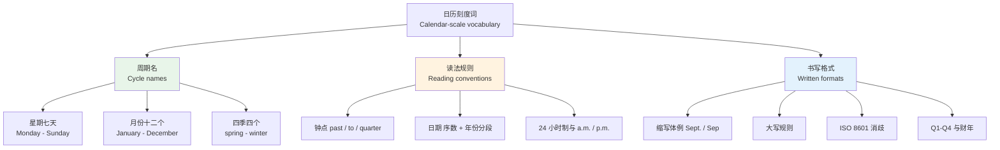
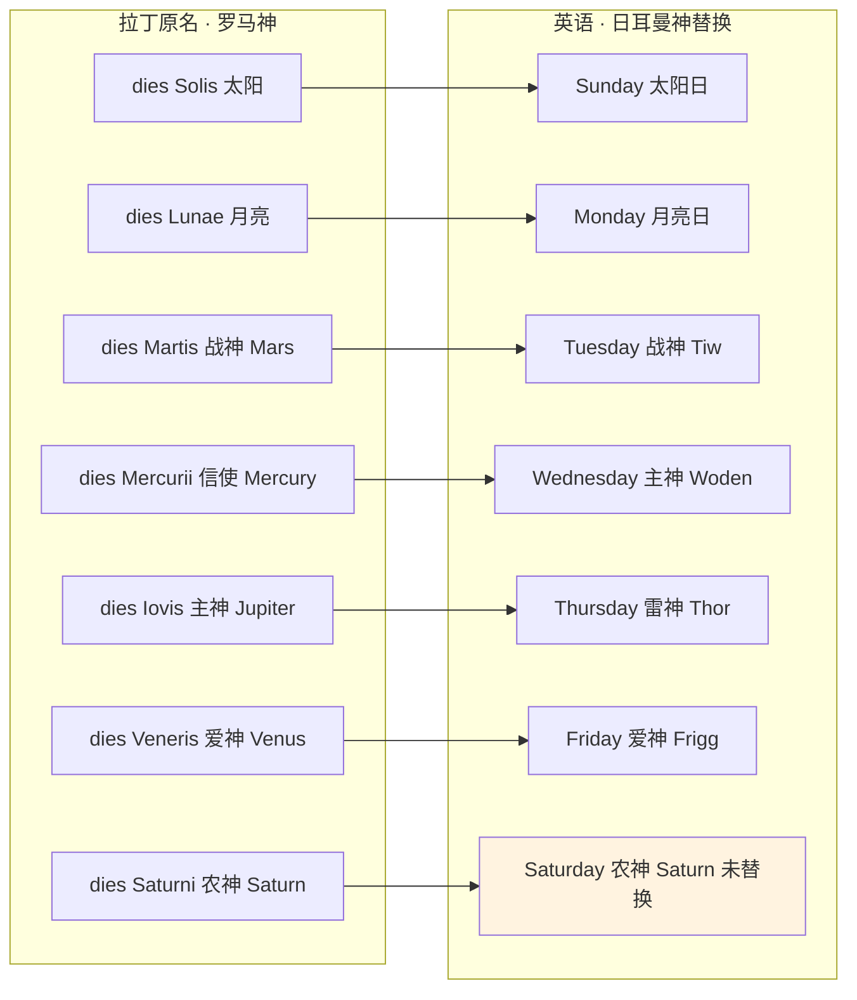
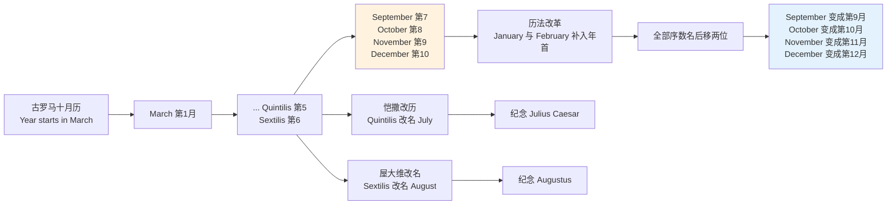
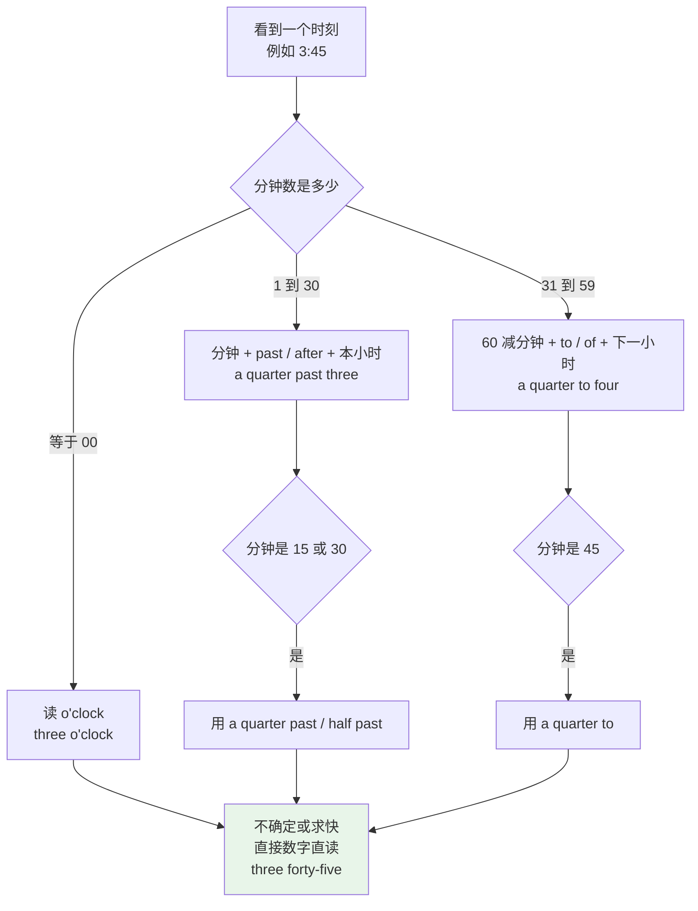
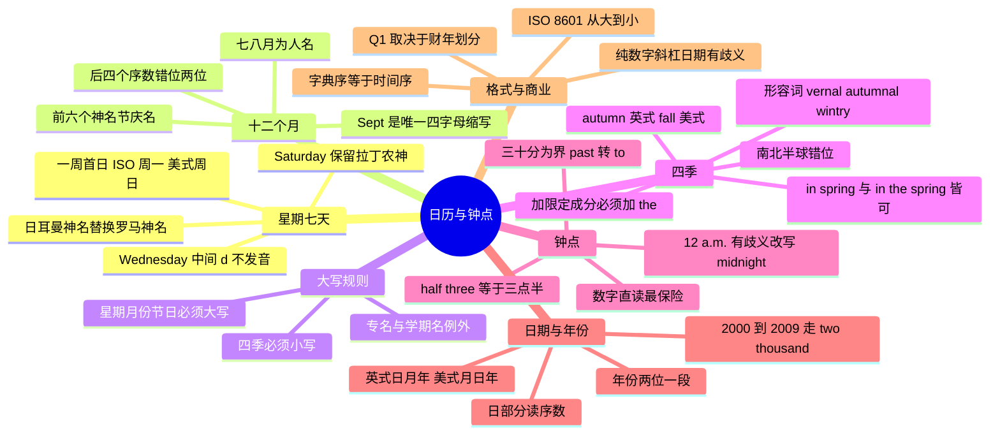

# 日历与钟点：星期、月份、四季与日期时刻读法

> [!info] 本篇定位
>
> 时间与日历这一章的主讲篇，处理**日历刻度**：星期、月份、四季、钟点、日期、年份、季度。
>
> 这批词的特殊之处是它是一个**封闭集合**——七天、十二个月、四季，数量固定，背完就是背完了，不存在"还有没背到的"。读完这一篇，你手上应该有一张能默写出来的完整日历表，外加一套读出任意时刻和任意日期的规则。
>
> 与相邻篇目的分工：本篇只讲刻度本身；`04.时间与日历词汇/02` 讲时段、时长、频率与时间状语；季节的天文与物候含义（`solstice`、`equinox`、`dormancy`）归 `06.天气、自然与地理/05`，本篇不碰。序数词的完整构成规则在 `03.数字与计量词汇/02`，本篇只用它读日期。

---

## 1. 本篇导读：为什么日历词值得单独花一篇

日历词看起来是最没有技术含量的一批词——`Monday`、`March`、`spring`，谁不认识。但中文母语者在这批词上的实际出错率高得反常，原因是它们全部踩在**中英不对称**的地方。

第一处不对称是**命名逻辑**。中文的星期和月份是纯数字：星期一到星期日，一月到十二月，数出来就完了。英语这两套全是专有名词，每个词背后是一位北欧神或一位罗马神，没有任何数字规律可循，只能整套记住。

第二处不对称更麻烦：英语月份**看起来有数字规律，但那个规律是错的**。`September` 里的 `sept` 确实是拉丁语的"七"，`October` 的 `oct` 确实是"八"，可它们分别是九月和十月。中文学习者一旦按字面推，全部错两位。

第三处不对称是**大小写**。中文没有大小写的概念，写 `monday` 和 `Monday` 在中文母语者眼里没有差别；而在英语里前者是拼写错误。更细的一层是：星期和月份必须大写，四季却必须小写——这条规则每年在无数封英文邮件里被写错。

第四处不对称是**读法**。`14:30` 这个时刻，中文只有一种读法"十四点三十"，英语至少有五种说法，而且英式和美式的默认选择不同。日期 `07/04/2026` 在英国是四月七日，在美国是七月四日——同一串字符，两种含义，这个歧义在真实的跨国协作里造成过实际损失。



上图是本篇的骨架：左侧是要背下来的名字，中间是要练熟的读法，右侧是要守住的书写规范。三块的学习方式完全不同——名字靠记，读法靠练，格式靠约定。把它们混在一起学，就会出现"背熟了十二个月却读不出一个日期"的情况。

本篇约一百四十个词条，其中真正需要死记的只有二十三个（七天加十二个月加四季）。剩下的一百多条都是规则和搭配，理解了就能用。

---

## 2. 星期七天：命名逻辑与全表

### 2.1 七天全表

| 英文 | 英式音标 | 美式音标 | 词性 | 中文 | 搭配与说明 |
| --- | --- | --- | --- | --- | --- |
| **Monday** | /ˈmʌndeɪ/ | /ˈmʌndeɪ/ | n. | 星期一 | 非重读音节可弱化为 /ˈmʌndi/ |
| **Tuesday** | /ˈtjuːzdeɪ/ | /ˈtuːzdeɪ/ | n. | 星期二 | 英式有 /j/ 滑音，美式没有 |
| **Wednesday** | /ˈwenzdeɪ/ | /ˈwenzdeɪ/ | n. | 星期三 | 中间的 d 不发音，两音节不是三音节 |
| **Thursday** | /ˈθɜːzdeɪ/ | /ˈθɜːrzdeɪ/ | n. | 星期四 | 首音是 /θ/ 不是 /s/ |
| **Friday** | /ˈfraɪdeɪ/ | /ˈfraɪdeɪ/ | n. | 星期五 | — |
| **Saturday** | /ˈsætədeɪ/ | /ˈsætərdeɪ/ | n. | 星期六 | 三音节，美式中间 t 常闪音化 |
| **Sunday** | /ˈsʌndeɪ/ | /ˈsʌndeɪ/ | n. | 星期日 | 与 sundae（圣代）同音 |

> [!warning] 三个高频发音错误
>
> - ❌ ~~/ˈwednezdeɪ/~~（把 Wednesday 读成三音节）
> - ✅ **Wednesday** /ˈwenzdeɪ/——拼写里的第一个 `d` 是历史遗留，现代英语完全不发音
> - ❌ ~~/ˈsɜːzdeɪ/~~（把 Thursday 的 th 读成 /s/）
> - ✅ **Thursday** /ˈθɜːzdeɪ/——舌尖必须出齿
> - ❌ ~~/ˈtʃuːzdeɪ/~~（把 Tuesday 读成 choose-day）
> - ✅ 英式 /ˈtjuːzdeɪ/，美式 /ˈtuːzdeɪ/；英式口语中 /tj/ 确实会腭化成 /tʃ/，属于可接受变体，但学习阶段先掌握标准读法

### 2.2 七个名字的来源

英语的星期名是一套**混血系统**：底层是罗马人的"七曜日"（以七颗肉眼可见的天体命名），传入日耳曼地区后，除周六外的罗马神名被替换成了对应的日耳曼神名。



这张图解释了一个长期困扰学习者的现象：为什么 `Saturday` 长得跟其余六天不像。前六天走了"日耳曼神替换"这条路，`Sunday`、`Monday` 保留了天体本义，`Tuesday` 到 `Friday` 换成了 Tiw、Woden、Thor、Frigg 四位北欧神；只有周六的农神 Saturn 没被替换，直接留了拉丁名，所以它的拼写里能看到完整的 `Satur-` 词干。

| 英文 | 英式音标 | 美式音标 | 词性 | 中文 | 搭配与说明 |
| --- | --- | --- | --- | --- | --- |
| **weekday** | /ˈwiːkdeɪ/ | /ˈwiːkdeɪ/ | n. | 工作日 | 指周一至周五；on weekdays |
| **weekend** | /ˌwiːkˈend/ | /ˈwiːkend/ | n. | 周末 | 英式重音常在后，美式常在前 |
| **fortnight** | /ˈfɔːtnaɪt/ | /ˈfɔːrtnaɪt/ | n. | 两周 | 英式常用，美式罕见，源自 fourteen nights |
| **eve** | /iːv/ | /iːv/ | n. | 前夜 | Christmas Eve、New Year's Eve |
| **midweek** | /ˌmɪdˈwiːk/ | /ˌmɪdˈwiːk/ | n./adj. | 周中 | a midweek meeting |
| **workday** | /ˈwɜːkdeɪ/ | /ˈwɜːrkdeɪ/ | n. | 工作日 | 美式更常用，强调"上班的那天" |
| **business day** | /ˈbɪznəs deɪ/ | /ˈbɪznəs deɪ/ | n. | 工作日 | 商务合同标准用词，排除周末与法定假日 |

> [!tip] business day 是程序员必须精确的词
>
> 合同和接口文档里的 `within 3 business days` 不等于 `within 3 days`。`business day` 排除周末和当地法定假日，所以算出来的实际日期依赖节假日日历，跨国系统里必须按目标地区的 holiday calendar 计算，不能简单地加三天再跳过周末。

### 2.3 一周从哪天开始

这是一个纯粹的约定差异，但它会直接影响日历控件和数据统计。

| 体系 | 一周首日 | 依据 |
| --- | --- | --- |
| ISO 8601（国际标准、多数欧洲国家） | Monday | 周一为第 1 天，周日为第 7 天 |
| 美国、加拿大、日本的多数日历 | Sunday | 传统宗教历法 |
| Unix cron 的 day-of-week 字段 | Sunday = 0 | 0–6，部分实现允许 7 也表示 Sunday |
| JavaScript `Date.prototype.getDay()` | Sunday = 0 | 返回 0–6 |

写"上周"的统计报表时，如果后端按 ISO 周（周一起算）而前端日历按周日起算，两边算出的"第 37 周"会差一天的数据。这个坑与语言无关，但它的英文表述就出现在这批词里：`week starts on Monday` / `week commencing`（英式商务缩写 `w/c`）。

### 2.4 星期的常用搭配

> [!example] 星期怎么用在句子里
>
> - The release is scheduled for **Tuesday**.
>   - 发布定在周二。
> - We have a standup **on Mondays**.
>   - 我们每周一有站会。（复数表示习惯性重复）
> - I'll get back to you **by Friday**.
>   - 我周五之前回复你。
> - The office is closed **at the weekend**.
>   - 办公室周末不上班。（英式）
> - The office is closed **on the weekend**.
>   - 办公室周末不上班。（美式）
> - Let's move it to **a week on Tuesday**.
>   - 挪到下下周二。（英式；美式说 a week from Tuesday）

> [!warning] this Friday 到底是哪个周五
>
> `this Friday`、`next Friday` 在母语者之间也会产生歧义，尤其在周三之后说这句话时。安全做法是加日期：
>
> - ❌ Let's meet **next Friday**.（对方可能理解成本周五，也可能理解成下周五）
> - ✅ Let's meet **on Friday the 12th**.
> - ✅ Let's meet **this coming Friday**.（本周五）
> - ✅ Let's meet **Friday next week**.（下周五）
>
> 跨国邮件里排会议，永远把日期数字写出来。

---

## 3. 十二个月：全表与缩写体例

### 3.1 十二个月全表

| 英文 | 英式音标 | 美式音标 | 词性 | 中文 | 搭配与说明 |
| --- | --- | --- | --- | --- | --- |
| **January** | /ˈdʒænjuəri/ | /ˈdʒænjueri/ | n. | 一月 | 缩写 Jan. |
| **February** | /ˈfebruəri/ | /ˈfebrueri/ | n. | 二月 | 口语中第一个 r 常脱落，读近 /ˈfebjueri/ |
| **March** | /mɑːtʃ/ | /mɑːrtʃ/ | n. | 三月 | 与"行军、游行"同形同源 |
| **April** | /ˈeɪprəl/ | /ˈeɪprəl/ | n. | 四月 | April Fools' Day 愚人节 |
| **May** | /meɪ/ | /meɪ/ | n. | 五月 | 唯一与情态动词同形的月份 |
| **June** | /dʒuːn/ | /dʒuːn/ | n. | 六月 | 也是常见女名 |
| **July** | /dʒuˈlaɪ/ | /dʒuˈlaɪ/ | n. | 七月 | 重音在后，不是 /ˈdʒuːli/ |
| **August** | /ˈɔːɡəst/ | /ˈɔːɡəst/ | n. | 八月 | 形容词 august /ɔːˈɡʌst/「威严的」重音在后 |
| **September** | /sepˈtembə/ | /sepˈtembər/ | n. | 九月 | 缩写 Sept.（传统）或 Sep（三字母系统） |
| **October** | /ɒkˈtəʊbə/ | /ɑːkˈtoʊbər/ | n. | 十月 | 缩写 Oct. |
| **November** | /nəʊˈvembə/ | /noʊˈvembər/ | n. | 十一月 | 缩写 Nov. |
| **December** | /dɪˈsembə/ | /dɪˈsembər/ | n. | 十二月 | 缩写 Dec. |

> [!warning] August 的两个重音
>
> 月份 `August` 重音在第一音节 /ˈɔːɡəst/；同拼写的形容词 `august`「威严的、庄严的」重音在第二音节 /ɔːˈɡʌst/，而且小写。
>
> - ✅ We met in **August**. /ˈɔːɡəst/ 我们八月见过面。
> - ✅ an **august** assembly /ɔːˈɡʌst/ 一场庄严的集会
>
> 同理 `March`（三月，大写）与 `march`（行军，小写）、`May`（五月）与 `may`（可以）。大小写在这里承担了区分词义的功能。

### 3.2 September 为什么是九月

这是全套日历词里唯一需要讲历史才能讲清的点，也是中文学习者最容易长期记错的点。

最早的罗马历只有**十个月**，从三月（Martius）开始，冬天那段没有月份名，是一段无名的空白期。这十个月里，后四个直接用序数命名：

| 月名 | 拉丁词根 | 词根义 | 在古罗马历中的位置 | 今天的位置 | 同词根英语词 |
| --- | --- | --- | --- | --- | --- |
| **September** | septem | 七 | 第 7 月 | 第 9 月 | septet 七重奏、septuagenarian 七旬老人 |
| **October** | octo | 八 | 第 8 月 | 第 10 月 | octopus 章鱼、octagon 八边形、octave 八度 |
| **November** | novem | 九 | 第 9 月 | 第 11 月 | novena 九日连祷；nonagon 九边形（来自序数 nonus，与 novem 同族） |
| **December** | decem | 十 | 第 10 月 | 第 12 月 | decimal 十进制、decade 十年、decimate 大量毁灭 |

后来 `Ianuarius`（一月）和 `Februarius`（二月）被补在了年首，全部序数月名整体后移两位。序数名字没有跟着改，于是"第七月"变成了九月，一直错位到今天。



上图把三次改动叠在一起：先是年首补进两个月造成整体错位，再是两位罗马统治者把第五、第六月改成了自己的名字。今天的十二个月里，前六个是神名或节庆名，七月八月是人名，最后四个是错位的序数——这四种命名逻辑混在一张表里，所以英语月份没有任何可推导的规律。

> [!tip] 把错位当成记忆工具而不是障碍
>
> 与其抱怨这个错位，不如反过来利用它。记住"字面数字 + 2 = 实际月份"这一条，四个月份同时解决：
>
> ```text
> sept 七  + 2 = 9  → September 九月
> oct  八  + 2 = 10 → October   十月
> nov  九  + 2 = 11 → November  十一月
> dec  十  + 2 = 12 → December  十二月
> ```
>
> 同时这四个词根本身在别处高频出现：`octagon`（八边形）、`octet`（八重奏）、`decimal`（十进制）、`decade`（十年）。学会一次，多处受益。词根系统在 `15.词根、合成与缩略` 展开。

### 3.3 月份缩写的两套体例

缩写不是随便截三个字母，英语世界里同时存在两套并行的规范。

| 月份 | 传统英语缩写 | 三字母系统（ISO / 编程） | AP 新闻体例 |
| --- | --- | --- | --- |
| January | Jan. | Jan | Jan. |
| February | Feb. | Feb | Feb. |
| March | Mar. | Mar | March（不缩写） |
| April | Apr. | Apr | April（不缩写） |
| May | May | May | May（不缩写） |
| June | Jun. | Jun | June（不缩写） |
| July | Jul. | Jul | July（不缩写） |
| August | Aug. | Aug | Aug. |
| September | **Sept.** | **Sep** | Sept. |
| October | Oct. | Oct | Oct. |
| November | Nov. | Nov | Nov. |
| December | Dec. | Dec | Dec. |

三条要点：

**第一，`Sept.` 是传统英语里唯一的四字母月份缩写。** 因为 `Sep` 单独出现时辨识度低，传统排版习惯多留一个字母。但在需要等宽对齐的三字母系统里，统一裁成 `Sep`。程序员会在 `strftime` 的 `%b`、Java 的 `MMM` 格式里看到的是 `Sep` 而不是 `Sept`。

**第二，`May` 从不缩写**，因为它本来就只有三个字母，加不加点都是它自己。

**第三，AP（美联社）体例只缩写七个月**：Jan.、Feb.、Aug.、Sept.、Oct.、Nov.、Dec.，其余五个月一律拼全。理由是 March 到 July 这五个词本身够短。写英文新闻稿或对外发布材料时，这一条会被编辑逐个核查。

> [!warning] 缩写点号的英美差异
>
> 美式书写在缩写后加句点：`Jan.`、`Sept.`。英式现代排版倾向于不加：`Jan`、`Sept`。同一份文档里必须统一，不能一半加一半不加。
>
> - ✅ 美式：Jan. 15, 2026
> - ✅ 英式：15 Jan 2026
> - ❌ ~~15 Jan. 2026~~（英式语序配美式点号，风格混用）

### 3.4 与月份相关的高频词

| 英文 | 英式音标 | 美式音标 | 词性 | 中文 | 搭配与说明 |
| --- | --- | --- | --- | --- | --- |
| **month** | /mʌnθ/ | /mʌnθ/ | n. | 月 | 复数 months /mʌnθs/ 词尾辅音丛较难 |
| **monthly** | /ˈmʌnθli/ | /ˈmʌnθli/ | adj./adv. | 每月的 | a monthly report |
| **calendar** | /ˈkælɪndə/ | /ˈkælɪndər/ | n. | 日历 | 拼写是 -ar 不是 -er |
| **leap year** | /ˈliːp jɪə/ | /ˈliːp jɪr/ | n. | 闰年 | 因为多出的一天"跳过"了一个星期几 |
| **leap day** | /ˈliːp deɪ/ | /ˈliːp deɪ/ | n. | 闰日 | 即 29 February |
| **month-end** | /ˌmʌnθˈend/ | /ˌmʌnθˈend/ | n./adj. | 月末 | 财务语境；month-end closing 月结 |
| **turn of the month** | — | — | phr. | 月末月初交替 | 偏正式 |
| **the first of the month** | — | — | phr. | 每月一号 | 房租、账单常用 |

`leap year` 的字面是"跳跃年"，来源是：平年里同一个日期每年往后推一个星期几，闰年则一次推两个，等于"跳过"了一个。这个词理解了就不会拼成 `leaf year`。

---

## 4. 大写规则：哪些日历词必须大写

### 4.1 大写与小写的分界

中文没有大小写，这条规则完全靠记。好消息是它极其规整。

| 类别 | 大写？ | 例子 |
| --- | --- | --- |
| 星期名 | **必须大写** | Monday, Friday, Sunday |
| 月份名 | **必须大写** | January, September, December |
| 节日名 | **必须大写** | Christmas, New Year's Day, Thanksgiving |
| 四季名 | **必须小写** | spring, summer, autumn, fall, winter |
| 世纪、年代 | 小写 | the twenty-first century, the eighties |
| 时段词 | 小写 | morning, afternoon, evening, night, noon, midnight |

判据是"专有名词还是普通名词"。星期和月份是各自唯一的、有名字的对象，属于专有名词；四季是可以反复出现的普通周期，属于普通名词。

> [!warning] 中文母语者的两个反向错误
>
> - ❌ ~~I'll see you on monday.~~
> - ✅ I'll see you on **Monday**.
> - ❌ ~~We hired six people last Spring.~~
> - ✅ We hired six people last **spring**.
>
> 第一个错误来自"中文没有大写意识"，第二个错误来自"过度纠正"——知道日历词要大写之后，把四季也一起大写了。这两个错误经常出现在同一个人的同一封邮件里。

### 4.2 四季什么时候要大写

四季只在三种情况下大写：

**情况一，它是专名的一部分。**

| 英文 | 英式音标 | 美式音标 | 词性 | 中文 | 搭配与说明 |
| --- | --- | --- | --- | --- | --- |
| **Spring Festival** | /ˈsprɪŋ ˌfestɪvl/ | /ˈsprɪŋ ˌfestɪvl/ | n. | 春节 | 作为节日专名，Spring 大写 |
| **Summer Olympics** | /ˈsʌmə əˈlɪmpɪks/ | /ˈsʌmər əˈlɪmpɪks/ | n. | 夏季奥运会 | 赛事专名 |
| **Winter Olympics** | /ˈwɪntə əˈlɪmpɪks/ | /ˈwɪntər əˈlɪmpɪks/ | n. | 冬季奥运会 | 赛事专名 |
| **Arab Spring** | /ˈærəb sprɪŋ/ | /ˈærəb sprɪŋ/ | n. | 阿拉伯之春 | 历史事件专名 |

**情况二，用在标题里且该标题体例要求实词首字母大写**（title case）。这时 `Spring` 大写是因为标题规则，不是因为它是季节。

**情况三，学期或学年名。** 美国高校把学期叫 `Fall 2026`、`Spring 2027`，这时它是学期编号的一部分，大写。

> [!tip] 一个可靠的自检问题
>
> 写完之后问自己：把这个词换成 `the season that comes after winter` 这样一句描述，句子还成立吗？成立就是普通名词，小写；不成立（因为它是某个特定事物的名字）就大写。
>
> `I love spring.` → 换成描述后仍成立 → 小写。
> `The Spring Festival lasts fifteen days.` → 换不了 → 大写。

---

## 5. 四季作为日历刻度

### 5.1 四季名与形容词形式

季节名本身只有五个词（秋天有两个），但它们的**形容词形式**极不规则，是这一节的真正难点。

| 英文 | 英式音标 | 美式音标 | 词性 | 中文 | 搭配与说明 |
| --- | --- | --- | --- | --- | --- |
| **spring** | /sprɪŋ/ | /sprɪŋ/ | n. | 春天 | 同形还有"弹簧、泉水、跳跃"义 |
| **summer** | /ˈsʌmə/ | /ˈsʌmər/ | n. | 夏天 | — |
| **autumn** | /ˈɔːtəm/ | /ˈɔːtəm/ | n. | 秋天 | 词尾 n 不发音，两音节 |
| **fall** | /fɔːl/ | /fɔːl/ | n. | 秋天 | 美式常用；同形动词"落下" |
| **winter** | /ˈwɪntə/ | /ˈwɪntər/ | n. | 冬天 | — |
| **vernal** | /ˈvɜːnl/ | /ˈvɜːrnl/ | adj. | 春天的 | 拉丁 ver「春」；正式、多用于科技与文学 |
| **autumnal** | /ɔːˈtʌmnəl/ | /ɔːˈtʌmnəl/ | adj. | 秋天的 | 注意重音在第二音节，且此处 mn 的 n 要发音 |
| **wintry** | /ˈwɪntri/ | /ˈwɪntri/ | adj. | 冬天般的；冷淡的 | 也拼作 wintery；a wintry smile 冷淡的笑 |
| **summery** | /ˈsʌməri/ | /ˈsʌməri/ | adj. | 夏天似的 | 与 summary /ˈsʌməri/ 同音异义，注意拼写 |
| **springlike** | /ˈsprɪŋlaɪk/ | /ˈsprɪŋlaɪk/ | adj. | 春意般的 | 日常语域，比 vernal 常见得多 |
| **midsummer** | /ˌmɪdˈsʌmə/ | /ˌmɪdˈsʌmər/ | n. | 仲夏 | A Midsummer Night's Dream |
| **midwinter** | /ˌmɪdˈwɪntə/ | /ˌmɪdˈwɪntər/ | n. | 隆冬 | — |
| **off-season** | /ˌɒfˈsiːzn/ | /ˌɔːfˈsiːzn/ | n./adj. | 淡季 | 旅游与商业语境 |
| **peak season** | /ˌpiːk ˈsiːzn/ | /ˌpiːk ˈsiːzn/ | n. | 旺季 | — |
| **seasonal** | /ˈsiːzənl/ | /ˈsiːzənl/ | adj. | 季节性的 | seasonal demand 季节性需求 |

> [!warning] 形容词形式的两处陷阱
>
> **陷阱一：`autumnal` 里的 n 要发音。** 名词 `autumn` /ˈɔːtəm/ 词尾的 n 不发音，但加了后缀之后 `autumnal` /ɔːˈtʌmnəl/ 里的 n 重新出现，而且重音从第一音节移到第二音节。同类现象：`column` /ˈkɒləm/ → `columnar` /kəˈlʌmnə/，`damn` /dæm/ → `damnation` /dæmˈneɪʃn/。
>
> **陷阱二：`summery` 与 `summary` 同音。** /ˈsʌməri/ 一个是"夏天似的"，一个是"摘要"。写作时拼错不会被发音提醒，只能靠检查。
>
> **一个空缺：夏天没有与 vernal / autumnal 平级的正式形容词。** 拉丁系的对应词在现代英语里已经边缘化，实际写作中夏天就用 `summer` 作定语（`summer heat`、`summer holidays`）或用 `summery`。不要为了对称去造一个不存在的词。

### 5.2 fall 与 autumn 的英美差异

这是四季里唯一的实质性英美分歧，也是被问得最多的一组。

| 维度 | autumn | fall |
| --- | --- | --- |
| 英式默认 | **默认词** | 能听懂，但基本不用 |
| 美式默认 | 认识、偏书面偏文学 | **默认词** |
| 语域 | 中性偏正式，各种场合都成立 | 口语化，日常 |
| 固定搭配 | autumn leaves、autumn term（英式学期） | fall semester（美式学期）、fall foliage |
| 派生形容词 | autumnal（唯一形式） | 无对应形容词，只能用 autumnal |

一条实用信息：`fall` 并不是美国人发明的新词，它是十六世纪英格兰的说法 `fall of the leaf`（叶落时节）的缩略，随移民带到北美后在美国保留下来，在英国本土反而被 `autumn` 取代了。所以这不是"美式创新"，而是"英式淘汰"。

> [!example] 两个词在真实句子里的分布
>
> - The leaves turn red in **autumn**.
>   - 秋天树叶变红。（英式；美式书面语也成立）
> - I'm taking three courses in the **fall** semester.
>   - 我秋季学期选三门课。（美式校园语境的固定说法）
> - She has an **autumnal** melancholy about her.
>   - 她身上有一种秋日般的忧郁。（形容词只有这一个形式，英美通用）
> - **Fall** is my favorite season.
>   - 秋天是我最喜欢的季节。（典型美式口语）

> [!tip] 怎么选
>
> 面向国际读者的书面材料用 `autumn`——英国人和美国人都懂，且不会显得刻意。面向美国同事的日常沟通用 `fall`。形容词场合无论英美一律 `autumnal`，因为 `fall` 没有形容词形式。

### 5.3 in spring 还是 in the spring

季节前的定冠词是这一节的第二个高频问题。答案是：**两个都对**，差别很小。

| 写法 | 语感 | 使用倾向 |
| --- | --- | --- |
| `in spring` | 把季节当抽象周期，泛指 | 英式略多，书面语略多 |
| `in the spring` | 略微具体一点，常暗示"某一个春天" | 美式略多，口语略多 |
| `in springtime` | 文学化 | 诗歌、歌词、抒情文本 |
| `in the spring of 2026` | 特指某年的春天 | **必须**加 the |

一条硬规则：**加了限定成分就必须加定冠词。**

- ✅ in **spring** / in **the spring**（泛指，两可）
- ✅ in **the spring of 2026**（特指某年）
- ❌ ~~in spring of 2026~~
- ✅ in **the spring of that year**
- ❌ ~~in spring of that year~~

另一条：**last / this / next 前面不加介词也不加冠词。**

- ✅ **last spring** 去年春天
- ❌ ~~in the last spring~~
- ✅ **next winter** 明年冬天
- ❌ ~~in next winter~~

这条规则对星期、月份、年份同样成立：`last Monday`、`next May`、`this year` 前面都不加 `in` / `on`。中文母语者最常见的多余介词就出现在这里。

> [!warning] 介词与冠词的组合错误
>
> - ❌ ~~I visited Kyoto in last April.~~
> - ✅ I visited Kyoto **last April**.
> - ❌ ~~The project starts on next Monday.~~
> - ✅ The project starts **next Monday**.
> - ❌ ~~Sales peak in the every summer.~~
> - ✅ Sales peak **every summer**. / Sales peak **in summer**.

### 5.4 南北半球错位

季节名指的是**当地的季节**，不是月份区间。这一条在跨国协作里会真的出问题。

| 月份区间 | 北半球 | 南半球（澳、新、南非、阿根廷等） |
| --- | --- | --- |
| 12 月—2 月 | winter | **summer** |
| 3 月—5 月 | spring | **autumn** |
| 6 月—8 月 | summer | **winter** |
| 9 月—11 月 | autumn / fall | **spring** |

所以 `Christmas in summer`（夏天过圣诞）在澳大利亚是常态描述而不是笑话，`a summer internship` 对悉尼的学生指的是十二月到二月。

> [!tip] 跨时区跨半球协作的写法
>
> 面向全球读者的文档里，**不要用季节表示时间**，改用季度或月份区间。
>
> - ❌ We'll ship the feature in the summer.（南半球读者会理解成年底）
> - ✅ We'll ship the feature in **Q3**.
> - ✅ We'll ship the feature between **June and August**.
>
> 这是很多国际化文档规范里明确写进去的一条。

关于季节的**天文与物候**含义——春分秋分、夏至冬至、候鸟迁徙、植物休眠——本篇不展开，那批词属于自然与地理范畴，在 `06.天气、自然与地理/05` 主讲。本篇对季节的处理只到"日历刻度"这一层为止。

---

## 6. 钟点读法：past、to、quarter 与 24 小时制

### 6.1 基础词汇

| 英文 | 英式音标 | 美式音标 | 词性 | 中文 | 搭配与说明 |
| --- | --- | --- | --- | --- | --- |
| **o'clock** | /əˈklɒk/ | /əˈklɑːk/ | adv. | 点钟 | 只用于整点，源自 of the clock |
| **past** | /pɑːst/ | /pæst/ | prep. | （几点）过 | 英式主用；ten past three |
| **after** | /ˈɑːftə/ | /ˈæftər/ | prep. | （几点）过 | 美式主用；ten after three |
| **to** | /tə/ | /tə/ | prep. | 差（几分到） | 英式主用；ten to four |
| **of** | /əv/ | /əv/ | prep. | 差（几分到） | 美式区域用法；ten of four |
| **till** | /tɪl/ | /tɪl/ | prep. | 差（几分到） | 美式；ten till four |
| **quarter** | /ˈkɔːtə/ | /ˈkɔːrtər/ | n. | 一刻钟（15 分） | a quarter past / to |
| **half** | /hɑːf/ | /hæf/ | n. | 半小时 | half past three |
| **sharp** | /ʃɑːp/ | /ʃɑːrp/ | adv. | 整（准时） | at nine o'clock sharp |
| **noon** | /nuːn/ | /nuːn/ | n. | 正午 | at noon 不加冠词 |
| **midday** | /ˌmɪdˈdeɪ/ | /ˌmɪdˈdeɪ/ | n. | 中午 | 英式更常用 |
| **midnight** | /ˈmɪdnaɪt/ | /ˈmɪdnaɪt/ | n. | 午夜 | at midnight |
| **a.m.** | /ˌeɪ ˈem/ | /ˌeɪ ˈem/ | adv. | 上午 | 拉丁 ante meridiem |
| **p.m.** | /ˌpiː ˈem/ | /ˌpiː ˈem/ | adv. | 下午 | 拉丁 post meridiem |
| **hour** | /ˈaʊə/ | /ˈaʊər/ | n. | 小时 | h 不发音，冠词用 an hour |
| **minute** | /ˈmɪnɪt/ | /ˈmɪnɪt/ | n. | 分钟 | 与形容词 minute /maɪˈnjuːt/「微小的」同形 |
| **second** | /ˈsekənd/ | /ˈsekənd/ | n. | 秒 | 与序数词"第二"同形 |
| **clock** | /klɒk/ | /klɑːk/ | n. | 钟 | 挂钟、台钟 |
| **watch** | /wɒtʃ/ | /wɑːtʃ/ | n. | 手表 | 戴在身上的才叫 watch |

> [!warning] minute 的两个读音
>
> 名词"分钟"读 /ˈmɪnɪt/，重音在前；形容词"极微小的、细致的"读 /maɪˈnjuːt/（美式 /maɪˈnuːt/），重音在后。
>
> - ✅ Give me five **minutes**. /ˈmɪnɪts/ 给我五分钟。
> - ✅ a **minute** difference /maɪˈnjuːt/ 一处细微差别
>
> 技术文档里 `minute detail`（细节）出现频率不低，读错会造成理解中断。

### 6.2 十二小时制的完整读法表

英语的十二小时制读法以三十分为界：前半用 `past`（英）或 `after`（美），后半用 `to`（英）或 `of` / `till`（美），且后半段要报**下一个整点**。

```text
时刻      英式主流                    美式主流                 数字直读（英美通用）
h:00      h o'clock                   h o'clock                h
h:05      five past h                 five after h             h oh five
h:10      ten past h                  ten after h              h ten
h:15      a quarter past h            a quarter after h        h fifteen
h:20      twenty past h               twenty after h           h twenty
h:25      twenty-five past h          twenty-five after h      h twenty-five
h:30      half past h                 half past h              h thirty
h:35      twenty-five to (h+1)        twenty-five of (h+1)     h thirty-five
h:40      twenty to (h+1)             twenty of (h+1)          h forty
h:45      a quarter to (h+1)          a quarter of (h+1)       h forty-five
h:50      ten to (h+1)                ten of (h+1)             h fifty
h:55      five to (h+1)               five till (h+1)          h fifty-five
```



这张图给的是一条保底路线：任何时刻都可以走最右边那条"数字直读"，`three forty-five` 英美都能听懂，不会出错。`past` / `to` 这套读法更地道，但需要现场做减法，初期容易卡壳。建议的练法是先把数字直读练成本能，再把 `a quarter past`、`half past`、`a quarter to` 这三个最高频的加进来，最后再补全其余的分钟。

> [!example] 同一个时刻的几种说法
>
> - It's **a quarter past seven**.
>   - 七点一刻。（英式）
> - It's **a quarter after seven**.
>   - 七点一刻。（美式）
> - It's **seven fifteen**.
>   - 七点十五。（英美通用，最省事）
> - It's **nineteen fifteen**.
>   - 十九点十五。（24 小时制，时刻表、军事、欧陆风格）

### 6.3 half three 是个陷阱

英式口语会把 `half past three` 缩成 `half three`，意思仍然是 **3:30**。

这对学过德语或荷兰语的人是个反向陷阱：德语 `halb drei` 指的是 **2:30**（"到三点还有半小时"）。两种语言逻辑相反。

> [!warning] half 的用法边界
>
> - ✅ **half past three** = 3:30（英美通用，最安全）
> - ✅ **half three** = 3:30（英式口语，非正式）
> - ❌ ~~half to four~~（不存在这种说法）
>
> 美式偶见 `half after three`，但使用频率很低，不建议主动模仿。跟不确定背景的人约时间时用 `three thirty`，一个歧义都没有。

### 6.4 24 小时制与 a.m. / p.m.

| 场景 | 英式习惯 | 美式习惯 |
| --- | --- | --- |
| 日常口语 | 12 小时制 | 12 小时制 |
| 火车、航班时刻表 | **24 小时制**（18:45） | 12 小时制（6:45 p.m.） |
| 军事、航空、急救 | 24 小时制 | 24 小时制 |
| 日程软件与日历 | 可配置，欧洲默认 24 小时 | 默认 12 小时 |

24 小时制的读法有两种：

- **18:45** → `eighteen forty-five`（民用，直读数字）
- **1845** → `eighteen forty-five hours` 或 `eighteen hundred forty-five hours`（军事、航空；整点读 `eighteen hundred hours`）

> [!warning] 12 a.m. 与 12 p.m. 是真歧义
>
> `12 a.m.` 和 `12 p.m.` 哪个是午夜哪个是中午，母语者也经常搞混。技术上 `12 a.m.` = 午夜，`12 p.m.` = 正午（因为 meridiem 指正午本身，正午后的第一瞬间才算 p.m.），但依赖这条规则是危险的。
>
> - ❌ The maintenance window starts at **12 a.m.**（一半读者会理解错）
> - ✅ The maintenance window starts at **12 midnight**.
> - ✅ The maintenance window starts at **00:00**.
> - ✅ The deadline is **12 noon**.
>
> 系统公告、合同、SLA 文档里一律写 `midnight` / `noon` 或用 24 小时制，不写 `12 a.m.` / `12 p.m.`。

### 6.5 钟点的介词与常用搭配

| 英文 | 英式音标 | 美式音标 | 词性 | 中文 | 搭配与说明 |
| --- | --- | --- | --- | --- | --- |
| **at** | /ət/ | /ət/ | prep. | 在（某时刻） | at 3 o'clock、at noon、at midnight |
| **around** | /əˈraʊnd/ | /əˈraʊnd/ | prep. | 大约在 | around five 五点左右 |
| **about** | /əˈbaʊt/ | /əˈbaʊt/ | prep. | 大约在 | 与 around 基本互换 |
| **by** | /baɪ/ | /baɪ/ | prep. | 不迟于 | by 5 p.m. 五点前 |
| **until** | /ənˈtɪl/ | /ənˈtɪl/ | prep. | 直到 | open until nine |
| **from … to …** | — | — | phr. | 从……到…… | from nine to five |
| **on the dot** | — | — | phr. | 分秒不差 | at eight on the dot |
| **on time** | — | — | phr. | 准时 | 与 in time 区分 |
| **in time** | — | — | phr. | 及时（赶得上） | just in time |
| **running late** | — | — | phr. | 要迟到 | I'm running ten minutes late. |

> [!warning] on time 与 in time 的差别
>
> - **on time** = 按照预定时间，不早不晚
> - **in time** = 赶在某事发生之前，来得及
>
> - ✅ The train arrived **on time**.
>   - 火车准点到达。（按时刻表）
> - ✅ We got to the station **in time** to catch the train.
>   - 我们及时赶到车站，赶上了火车。（赶上了，不一定准点）
>
> 中文都译成"准时/及时"，但英语这两个短语不能互换。

---

## 7. 日期读法：序数、年份分段与英美语序

### 7.1 日期用序数不用基数

日期的日部分**读作序数词**，即使写的时候只写数字。

| 写法 | 读法 | 中文 |
| --- | --- | --- |
| 1 May / May 1 | the first of May / May first | 五月一日 |
| 2 June / June 2 | the second of June / June second | 六月二日 |
| 3 March / March 3 | the third of March / March third | 三月三日 |
| 12 July / July 12 | the twelfth of July / July twelfth | 七月十二日 |
| 21 April / April 21 | the twenty-first of April / April twenty-first | 四月二十一日 |
| 30 August / August 30 | the thirtieth of August / August thirtieth | 八月三十日 |
| 31 December / December 31 | the thirty-first of December / December thirty-first | 十二月三十一日 |

常用序数的读音单列如下，容易读错的都在这里。

| 英文 | 英式音标 | 美式音标 | 词性 | 中文 | 搭配与说明 |
| --- | --- | --- | --- | --- | --- |
| **first** | /fɜːst/ | /fɜːrst/ | num. | 第一 | 缩写 1st |
| **second** | /ˈsekənd/ | /ˈsekənd/ | num. | 第二 | 缩写 2nd |
| **third** | /θɜːd/ | /θɜːrd/ | num. | 第三 | 缩写 3rd |
| **fourth** | /fɔːθ/ | /fɔːrθ/ | num. | 第四 | 缩写 4th；与 forth 同音 |
| **fifth** | /fɪfθ/ | /fɪfθ/ | num. | 第五 | /fθ/ 辅音丛，口语中前一个 f 常弱化 |
| **sixth** | /sɪksθ/ | /sɪksθ/ | num. | 第六 | /ksθ/ 是英语最难的辅音丛之一 |
| **seventh** | /ˈsevnθ/ | /ˈsevnθ/ | num. | 第七 | — |
| **eighth** | /eɪtθ/ | /eɪtθ/ | num. | 第八 | 拼写只有一个 t，常被多写 |
| **ninth** | /naɪnθ/ | /naɪnθ/ | num. | 第九 | 拼写去掉 nine 的 e |
| **twelfth** | /twelfθ/ | /twelfθ/ | num. | 第十二 | 拼写是 -lfth，不是 -lvth |
| **twentieth** | /ˈtwentiəθ/ | /ˈtwentiəθ/ | num. | 第二十 | y 变 ie 再加 -th |
| **thirtieth** | /ˈθɜːtiəθ/ | /ˈθɜːrtiəθ/ | num. | 第三十 | 同一变形规则 |

> [!warning] 三个高频拼写错误
>
> - ❌ ~~eightth~~ → ✅ **eighth**（eight 的 t 与后缀的 th 共用一个 t）
> - ❌ ~~nineth~~ → ✅ **ninth**（去掉 nine 的 e）
> - ❌ ~~twelveth~~ → ✅ **twelfth**（v 变 f）
>
> 序数词的完整构成规则在 `03.数字与计量词汇/02` 讲透，本篇只列日期会用到的部分。

### 7.2 英式与美式的日期语序

| 维度 | 英式 | 美式 |
| --- | --- | --- |
| 书写顺序 | 日—月—年：`5 May 2026` | 月—日—年：`May 5, 2026` |
| 逗号 | 不用逗号 | 年份前必须有逗号 |
| 序数后缀 | 现代排版倾向省略：`5 May` | 也常省略：`May 5` |
| 朗读 | the fifth of May, twenty twenty-six | May fifth, twenty twenty-six |
| 数字缩写 | `05/05/2026` = 5 May | `05/05/2026` = May 5（此例恰好相同） |

> [!example] 同一个日期的两种写法与读法
>
> - **英式**：The contract expires on **5 May 2026**.
>   - 读作：the fifth of May, twenty twenty-six
>   - 合同于二〇二六年五月五日到期。
> - **美式**：The contract expires on **May 5, 2026**.
>   - 读作：May fifth, twenty twenty-six
>   - 合同于二〇二六年五月五日到期。

一条容易被忽略的细节：**美式写法里，如果日期后面还有内容，年份后面还要再加一个逗号。**

- ✅ On **May 5, 2026,** the system will be retired.
- ❌ ~~On May 5, 2026 the system will be retired.~~
- ✅ 英式无此问题：On **5 May 2026** the system will be retired.

### 7.3 年份的分段读法

四位数年份的默认读法是**两位一段**，不是当成一个四位数读。

| 年份 | 读法 | 说明 |
| --- | --- | --- |
| 1066 | ten sixty-six | 两位两位读 |
| 1492 | fourteen ninety-two | 同上 |
| 1900 | nineteen hundred | 后两位是 00 时读 hundred |
| 1905 | nineteen oh five | 后两位是 0X 时读 oh |
| 1999 | nineteen ninety-nine | — |
| 2000 | two thousand | 特例，不读 twenty hundred |
| 2005 | two thousand and five（英）/ two thousand five（美） | 2000–2009 走这条路 |
| 2010 | twenty ten / two thousand and ten | 两种并存，前者渐成主流 |
| 2026 | twenty twenty-six | 2010 之后两位分段读法已是默认 |

整套读法可以收敛成四条互斥判断，按顺序套用即可：

| 判断顺序 | 条件 | 读法 | 例子 |
| --- | --- | --- | --- |
| 第一步 | 年份在 2000–2009 之间 | two thousand (and) X | 2005 = two thousand and five |
| 第二步 | 后两位是 00 | 前两位 + hundred | 1900 = nineteen hundred |
| 第三步 | 后两位是 0X | 前两位 + oh + X | 1905 = nineteen oh five |
| 第四步 | 其余全部情况 | 前两位 + 后两位 | 2026 = twenty twenty-six |

绝大多数年份会落在第四条——前两位加后两位，这也是最该练熟的一条。2000 到 2009 这十年是唯一必须换路线的区间，因为 `twenty oh five` 虽然语法上说得通，但几乎没人这么说。跨过 2009 之后规则重新回到主线，所以 `twenty ten`、`twenty twenty-six` 这类读法在近十几年已经成为默认。

### 7.4 世纪、年代与纪年

| 英文 | 英式音标 | 美式音标 | 词性 | 中文 | 搭配与说明 |
| --- | --- | --- | --- | --- | --- |
| **decade** | /ˈdekeɪd/ | /ˈdekeɪd/ | n. | 十年 | 重音在第一音节，不是 /dɪˈkeɪd/ |
| **century** | /ˈsentʃəri/ | /ˈsentʃəri/ | n. | 世纪 | the 21st century |
| **millennium** | /mɪˈleniəm/ | /mɪˈleniəm/ | n. | 千年 | 复数 millennia；双 l 双 n |
| **era** | /ˈɪərə/ | /ˈɪrə/ | n. | 时代 | a new era |
| **epoch** | /ˈiːpɒk/ | /ˈepək/ | n. | 纪元 | 英美读音差异大；Unix epoch 计算机纪元 |
| **BC** | /ˌbiː ˈsiː/ | /ˌbiː ˈsiː/ | abbr. | 公元前 | before Christ；置于年份**之后**：44 BC |
| **AD** | /ˌeɪ ˈdiː/ | /ˌeɪ ˈdiː/ | abbr. | 公元 | anno Domini；传统上置于年份**之前**：AD 1066 |
| **BCE** | /ˌbiː siː ˈiː/ | /ˌbiː siː ˈiː/ | abbr. | 公元前 | before Common Era；学术界中性替代 |
| **CE** | /ˌsiː ˈiː/ | /ˌsiː ˈiː/ | abbr. | 公元 | Common Era；置于年份之后 |

年代的写法与读法：

| 写法 | 读法 | 中文 |
| --- | --- | --- |
| the 1980s / the 1980's | the nineteen eighties | 二十世纪八十年代 |
| the '80s / the 80s | the eighties | 八十年代 |
| the 2000s | the two thousands / the noughties（英）/ the aughts（美） | 二十一世纪头十年 |

> [!warning] 世纪编号比年份大一
>
> `the 21st century`（二十一世纪）指的是 2001—2100 年，不是 2100 年代。因为没有"公元 0 年"，第一世纪从公元 1 年起算，此后每个世纪的编号都比它包含的年份前两位大一。
>
> - ✅ 1999 年属于 **the 20th century**（二十世纪）
> - ❌ ~~1999 年属于 the 19th century~~
>
> 口语里说 `the 1900s` 指的是 1900—1999，这与 `the 20th century`（1901—2000）差一年，但日常表达中没人计较。正式的历史写作里要区分。

---

## 8. 日期格式歧义与 ISO 8601

### 8.1 07/04/2026 到底是哪一天

纯数字日期是跨国协作中最常见的一处真实歧义。

| 解读体系 | 采用地区 | `07/04/2026` 的含义 |
| --- | --- | --- |
| MM/DD/YYYY | 美国 | 2026 年 **7 月 4 日**（July 4） |
| DD/MM/YYYY | 英国、爱尔兰、多数欧洲与英联邦国家 | 2026 年 **4 月 7 日**（7 April） |
| YYYY/MM/DD | 部分东亚系统、ISO 风格 | 该串不符合本格式，无法解析 |

同一串字符在两个地区指向相隔近三个月的两个日期。这个歧义在真实项目里造成过合同履约日的争议、发票账期的错算、订单交付日的误判。只有当日号大于 12 时（比如 `25/04/2026`）才能靠常识排除美式解读——因为没有第 25 个月——而 1 到 12 号之间的日期全部落在歧义区，也就是每个月的前十二天写成纯数字都是不安全的。

美国独立日恰好是 `July 4`，所以 `07/04` 这个例子在美式语境里辨识度很高，反而更容易让美国读者忘记它在别处会被读成四月七日。

### 8.2 ISO 8601 的写法

| 英文 | 英式音标 | 美式音标 | 词性 | 中文 | 搭配与说明 |
| --- | --- | --- | --- | --- | --- |
| **ISO 8601** | — | — | n. | 国际日期时间标准 | 读作 I-S-O eighty-six oh one |
| **timestamp** | /ˈtaɪmstæmp/ | /ˈtaɪmstæmp/ | n. | 时间戳 | 也作动词：timestamped |
| **UTC** | /ˌjuː tiː ˈsiː/ | /ˌjuː tiː ˈsiː/ | abbr. | 协调世界时 | ISO 时间中用后缀 Z 表示 |
| **offset** | /ˈɒfset/ | /ˈɔːfset/ | n. | 偏移量 | +08:00 是相对 UTC 的偏移 |
| **week number** | — | — | n. | 周序号 | ISO 周从周一起算 |
| **ordinal date** | — | — | n. | 年内日序 | 2026-185 表示当年第 185 天 |
| **unambiguous** | /ˌʌnæmˈbɪɡjuəs/ | /ˌʌnæmˈbɪɡjuəs/ | adj. | 无歧义的 | an unambiguous date format |
| **locale** | /ləʊˈkɑːl/ | /loʊˈkæl/ | n. | 区域设置 | 决定日期显示格式 |

ISO 8601 的核心规则是**从大到小**：年—月—日，时—分—秒，每一段都补零到固定位数。

```text
日期            2026-07-04
日期时间        2026-07-04T14:30:00
带 UTC 标记     2026-07-04T14:30:00Z
带时区偏移      2026-07-04T14:30:00+08:00
年月            2026-07
周日期          2026-W27-6      （2026 年第 27 周的星期六）
年内日序        2026-185
时长            P1Y2M3DT4H5M    （1 年 2 月 3 天 4 小时 5 分）
```

这套格式有一个实用副作用：**字典序等于时间序**。因为高位在前且补零对齐，`2026-07-04` 这样的字符串直接按字符串排序就是按时间排序，这是文件命名、日志行、数据库字符串列都在用它的原因。

> [!tip] 三条写日期的实用规则
>
> **规则一：面向机器写 ISO。** 文件名、日志、API 字段、数据库列一律 `2026-07-04` 或完整时间戳。
>
> **规则二：面向人写月名。** 邮件、合同、公告里把月份拼出来：`4 July 2026` 或 `July 4, 2026`。月名一旦拼出来，语序就不重要了，怎么写都不会被误读。
>
> **规则三：永远不要在跨国语境里写纯数字斜杠格式。** `07/04/2026` 这种写法只在你确定读者与你同一地区时才安全。

### 8.3 程序员会遇到的几种日期格式

日期格式化字符串里的这批字母，本质上就是这一篇的词汇被编码成了符号。

| 格式符（strftime） | 含义 | 示例输出 | 对应本篇内容 |
| --- | --- | --- | --- |
| `%A` | 星期全称 | Saturday | 2.1 节 |
| `%a` | 星期缩写 | Sat | 2.1 节 |
| `%B` | 月份全称 | July | 3.1 节 |
| `%b` | 月份缩写（三字母） | Jul / **Sep** | 3.3 节 |
| `%Y` | 四位年份 | 2026 | 7.3 节 |
| `%m` | 两位月份数字 | 07 | 8.2 节 |
| `%d` | 两位日期数字 | 04 | 8.2 节 |
| `%H:%M` | 24 小时制时分 | 14:30 | 6.4 节 |
| `%I:%M %p` | 12 小时制时分加 AM/PM | 02:30 PM | 6.4 节 |

HTTP 协议头里的日期用的是另一套固定格式，它把星期缩写、日、月份缩写、年份、24 小时制时间和 GMT 拼在一起：

```text
Date: Sat, 04 Jul 2026 14:30:00 GMT
```

这行里同时出现了 `Sat`（星期三字母缩写）、`Jul`（月份三字母缩写）、日—月—年语序和 24 小时制——本篇讲的四类知识各出现一次。

> [!warning] JavaScript 的月份从 0 开始
>
> `new Date(2026, 6, 4)` 得到的是 **2026 年 7 月 4 日**，因为 `getMonth()` 和构造函数的月份参数都是 0–11。这个设计与 September 的历史错位无关，但造成的心理效果一模一样：字面数字与实际月份对不上。
>
> `getDay()` 同理返回 0–6 且 0 表示 Sunday，与 ISO 8601 的"周一为第 1 天"也对不上。写跨库日期逻辑时，这两处偏移要各自确认一遍。

---

## 9. 季度、财年与商业时间刻度

### 9.1 季度词汇

`quarter` 这个词在本篇出现了两次，语义是同一个——四分之一。在钟点里它是一小时的四分之一（15 分钟），在日历里它是一年的四分之一（3 个月）。

| 英文 | 英式音标 | 美式音标 | 词性 | 中文 | 搭配与说明 |
| --- | --- | --- | --- | --- | --- |
| **quarter** | /ˈkɔːtə/ | /ˈkɔːrtər/ | n. | 季度；一刻钟 | Q1 读作 quarter one 或 Q one |
| **quarterly** | /ˈkɔːtəli/ | /ˈkɔːrtərli/ | adj./adv. | 季度的；按季 | quarterly results 季报 |
| **half-year** | /ˌhɑːfˈjɪə/ | /ˌhæfˈjɪr/ | n. | 半年 | H1 上半年，H2 下半年 |
| **annual** | /ˈænjuəl/ | /ˈænjuəl/ | adj. | 年度的 | annual report 年报 |
| **annually** | /ˈænjuəli/ | /ˈænjuəli/ | adv. | 每年 | — |
| **fiscal** | /ˈfɪskl/ | /ˈfɪskl/ | adj. | 财政的 | 美式常用；fiscal year |
| **financial year** | /faɪˈnænʃl jɪə/ | /faɪˈnænʃl jɪr/ | n. | 财年 | 英式、澳式常用 |
| **calendar year** | /ˈkælɪndə jɪə/ | /ˈkælɪndər jɪr/ | n. | 日历年 | 1 月 1 日至 12 月 31 日 |
| **year-end** | /ˌjɪərˈend/ | /ˌjɪrˈend/ | n./adj. | 年终 | year-end review 年终回顾 |
| **year to date** | — | — | phr. | 年初至今 | 缩写 YTD |
| **year-on-year** | — | — | adj./adv. | 同比 | 英式；缩写 YoY |
| **year-over-year** | — | — | adj./adv. | 同比 | 美式；同样缩写 YoY |
| **quarter-on-quarter** | — | — | adj./adv. | 环比（季） | 缩写 QoQ |
| **interim** | /ˈɪntərɪm/ | /ˈɪntərɪm/ | adj./n. | 中期的 | interim results 中期业绩 |
| **run through** | — | — | phr.v. | 持续到 | The FY runs through September. |

季度与月份的对应（以日历年为准）：

| 季度 | 月份 | 读法 |
| --- | --- | --- |
| Q1 | January – March | the first quarter / Q one |
| Q2 | April – June | the second quarter / Q two |
| Q3 | July – September | the third quarter / Q three |
| Q4 | October – December | the fourth quarter / Q four |
| H1 | January – June | the first half |
| H2 | July – December | the second half |

### 9.2 财年不等于日历年

这是商业英语里最容易踩的一个坑：`Q1` 是几月份，取决于这家机构的财年怎么划。

| 机构 / 地区 | 财年起止 | 该机构的 Q1 |
| --- | --- | --- |
| 多数中国企业、多数欧洲企业 | 1 月 1 日 – 12 月 31 日 | 1–3 月 |
| 美国联邦政府 | 10 月 1 日 – 9 月 30 日 | 10–12 月 |
| 英国政府财政年度 | 4 月 1 日 – 3 月 31 日 | 4–6 月 |
| 英国个人所得税年度 | 4 月 6 日 – 次年 4 月 5 日 | — |
| 日本企业与政府（多数） | 4 月 1 日 – 3 月 31 日 | 4–6 月 |
| 澳大利亚 | 7 月 1 日 – 6 月 30 日 | 7–9 月 |
| Apple 公司 | 九月最后一个周六结束 | 10–12 月 |

Apple 那一行值得单独看：因为它的财年在九月末结束，它的 `Q1 FY2026` 指的是 2025 年 10 月到 12 月这个假日购物季。财经新闻里说 "Apple's record Q1" 时，讲的是上一年的圣诞季，不是今年的一到三月。

> [!warning] 收到 by end of Q3 这句话要先问清楚
>
> - ❌ 默认理解成"九月底"——只有当对方走日历年财年时才对。
> - ✅ 回一句：`Just to confirm — is that calendar Q3 (July–September), or your fiscal Q3?`
>
> 跨国项目排期时，把季度换算成具体月份写进文档：`by end of Q3 (30 September 2026)`。多写六个字符，省掉一次返工。

### 9.3 财年的写法

| 写法 | 含义 | 使用场景 |
| --- | --- | --- |
| `FY2026` | 财年 2026 | 最常见的缩写 |
| `FY26` | 同上 | 内部文档、图表轴标签 |
| `fiscal 2026` | 财年 2026 | 美式新闻写法 |
| `FY2025/26` | 跨两个日历年的财年 | 英式、澳式、日式常用 |
| `Q3 FY2026` | 财年 2026 的第三季度 | 季度加财年，最精确 |

英式的 `FY2025/26` 写法有个好处：它把财年跨越的两个日历年都写出来了，读者不用猜这个财年主要落在哪一年。美式的 `FY2026` 按财年**结束**的那一年命名，所以美国联邦政府的 FY2026 是 2025 年 10 月到 2026 年 9 月。

> [!example] 商业时间刻度在真实句子里
>
> - Revenue grew 12% **year-on-year** in **Q2**.
>   - 第二季度营收同比增长 12%。
> - We're tracking **ahead of plan** for **FY2026**.
>   - 本财年进度超前于计划。
> - The board reviews performance on a **quarterly** basis.
>   - 董事会按季度审阅业绩。
> - **Year-to-date** signups are up 30%.
>   - 年初至今注册量增长 30%。
> - The migration must be complete by **year-end**.
>   - 迁移必须在年底前完成。

> [!tip] 与下一篇的边界
>
> `biweekly`、`bimonthly`、`semiannual` 这类**频率词**本身带歧义（`biweekly` 既可指"每两周"也可指"每周两次"），它们属于频率范畴，在 `04.时间与日历词汇/02` 主讲。本篇只提醒一句：合同和排期文档里不要用 `biweekly`，改写成 `every two weeks` 或 `twice a week`，把歧义消掉。

---

## 10. 日历词的介词系统

### 10.1 三个介词的分工

英语用 `at` / `on` / `in` 三个介词覆盖所有时间点，规则是**范围越小越用 at，范围越大越用 in**。

```text
范围收窄                                                    范围放宽
   ←──────────────────────────────────────────────────────────→

   at              on                    in
   精确到点        具体某一天            较长时段
   at 3 o'clock    on Monday             in May
   at noon         on 5 May              in spring
   at midnight     on Christmas Day      in 2026
   at night        on Monday morning     in the 21st century

   ──────────────────────────────────────────────────────────
   零介词：last Monday · next May · this year · every summer
```

这套系统里最该记牢的是最后一行：`last`、`next`、`this`、`every` 这四个限定词一出现，介词就必须去掉。中文母语者在这里的错误率极高，因为中文说"在去年春天"完全自然，直译成 `in last spring` 就错了。这四个词自己已经把时间点定死了，再加介词就是重复定位。

| 时间单位 | 介词 | 例子 |
| --- | --- | --- |
| 钟点 | at | at 7:30, at a quarter past six |
| 正午、午夜、夜晚 | at | at noon, at midnight, at night |
| 星期 | on | on Tuesday, on Tuesdays |
| 具体日期 | on | on 5 May, on May 5 |
| 具体某天的时段 | on | on Monday morning, on the evening of the 5th |
| 节日（单日） | on | on Christmas Day, on New Year's Day |
| 节日期间（英式） | at | at Christmas, at Easter |
| 月份 | in | in September |
| 季节 | in | in spring, in the summer |
| 年份 | in | in 2026 |
| 世纪、年代 | in | in the 1990s, in the 21st century |
| 一天中的时段 | in | in the morning, in the afternoon, in the evening |

> [!warning] 一天中时段的两个例外
>
> `in the morning` / `in the afternoon` / `in the evening` 用 `in`，但 `at night` 用 `at`——这是个必须单记的例外，没有道理可讲。
>
> 另一个例外：一旦时段挂在**具体某一天**上，介词从 `in` 变成 `on`。
>
> - ✅ **in** the morning 早上（泛指）
> - ✅ **on** Monday morning 周一早上（具体某天）
> - ✅ **on** the morning of 5 May 五月五日早上
> - ❌ ~~in Monday morning~~

### 10.2 中文母语者的高频介词错误

> [!warning] 逐条对照
>
> - ❌ ~~I was born in 5 May.~~
> - ✅ I was born **on** 5 May.（具体日期用 on）
> - ❌ ~~The meeting is on May.~~
> - ✅ The meeting is **in** May.（月份用 in）
> - ❌ ~~See you at Monday.~~
> - ✅ See you **on** Monday.
> - ❌ ~~He arrived in 3 o'clock.~~
> - ✅ He arrived **at** 3 o'clock.
> - ❌ ~~We launched it in last September.~~
> - ✅ We launched it **last September**.
> - ❌ ~~It happens in every winter.~~
> - ✅ It happens **every winter**.
> - ❌ ~~I'll finish it in this Friday.~~
> - ✅ I'll finish it **this Friday**.
> - ❌ ~~She works on the night shift in Sundays.~~
> - ✅ She works the night shift **on Sundays**.

### 10.3 几个高频时间短语

| 英文 | 英式音标 | 美式音标 | 词性 | 中文 | 搭配与说明 |
| --- | --- | --- | --- | --- | --- |
| **the day after tomorrow** | — | — | phr. | 后天 | 无单词形式，只能用短语 |
| **the day before yesterday** | — | — | phr. | 前天 | 同上 |
| **the other day** | — | — | phr. | 前几天 | 指过去不确定的某一天 |
| **one of these days** | — | — | phr. | 改天 | 模糊的将来 |
| **first thing** | — | — | phr. | 一早 | first thing tomorrow 明天一早 |
| **end of day** | — | — | phr. | 当天结束前 | 缩写 EOD，商务邮件高频 |
| **close of business** | — | — | phr. | 营业结束时 | 缩写 COB，比 EOD 更正式 |
| **as of** | — | — | phr. | 自……起；截至 | as of 1 January 自一月一日起 |
| **effective** | /ɪˈfektɪv/ | /ɪˈfektɪv/ | adj. | 自……生效 | effective 1 May 自五月一日生效 |
| **on or before** | — | — | phr. | 不迟于 | 合同用语，包含当日 |
| **no later than** | — | — | phr. | 不迟于 | 缩写 NLT |
| **back-to-back** | — | — | adj. | 连续的 | back-to-back meetings 连轴会议 |

> [!tip] EOD 与 COB 有实际差别
>
> `EOD`（end of day）通常理解成当天午夜前，`COB`（close of business）指对方所在时区的下班时间，一般是下午五点到六点。跨时区协作里两者能差出七八个小时。
>
> - ✅ Please send it by **COB Friday, London time**.
>   - 请在周五伦敦时间下班前发出。
>
> 加上时区，这句话才是可执行的。

---

## 11. 本篇小结



这张图按学习方式分了三类枝：最上面两枝（星期、月份）是纯记忆量，背完即止；中间三枝（大写、四季、钟点）是规则加少量例外，理解了再练几遍就能稳定输出；最下面两枝（日期年份、格式与商业）是约定，靠的是知道有几套并行体系、以及在什么场合选哪一套。复习时按枝走比按篇顺序走更省时间——记忆枝要反复默写，规则枝要造句检验，约定枝只要能说清"什么时候会被误读"就算过关。

> [!success] 本篇核心要点回顾
>
> 1. **星期和月份必须大写，四季必须小写。** 前两者是专有名词，后者是普通名词。四季只在专名（Spring Festival）、标题体例、学期名（Fall 2026）三种情况下大写。
> 2. **September 到 December 的字面数字比实际月份小 2。** 古罗马历从三月起算，后来在年首补进一月和二月，序数月名整体后移两位而名字没改。记住"字面 + 2"一次解决四个月份。
> 3. **`Sept.` 是传统英语里唯一的四字母月份缩写**，三字母系统与编程格式符（`%b`、`MMM`）里统一裁成 `Sep`。AP 体例只缩写 Jan.、Feb.、Aug.、Sept.、Oct.、Nov.、Dec. 七个。
> 4. **`autumn` 是英式默认，`fall` 是美式默认**，但形容词只有 `autumnal` 一个形式，英美通用。`fall` 是十六世纪英格兰旧说法在北美的留存，不是美式创新。
> 5. **`in spring` 与 `in the spring` 都对**；但一加限定成分（`the spring of 2026`）就必须有 the，一用 last / next / this / every 就必须去掉介词和冠词。
> 6. **钟点以三十分为界**：前半 `past`（英）/ `after`（美），后半 `to`（英）/ `of`（美）并报下一个整点。`half three` 在英式口语里是 3:30，与德语逻辑相反；不确定时一律用数字直读 `three thirty`。`12 a.m.` 与 `12 p.m.` 是真歧义，正式文本改写成 `12 midnight` / `12 noon` 或 24 小时制。
> 7. **`07/04/2026` 在英美指向相隔近三个月的两个日期。** 面向机器写 ISO 8601（`2026-07-04`，字典序即时间序），面向人写出月名（`4 July 2026`），跨国语境永远不写纯数字斜杠格式。`Q1` 是几月同样取决于财年划分，收到季度截止日要求时先换算成具体日期。
> 8. **时间介词按范围收敛**：钟点用 at，具体某天用 on，月份季节年份用 in；`last` / `next` / `this` / `every` 之前不加介词。`at night` 是唯一需要单记的时段例外。

> [!success] 本篇练习清单
>
> - [ ] 默写星期七天与十二个月的完整拼写，检查 Wednesday、February、September 三处易错拼写
> - [ ] 说出 September 到 December 四个词的拉丁词根义与实际月份，并各举一个同词根的英语词
> - [ ] 判断下面四句的大小写对错：`See you on monday.` / `We hired in Spring.` / `The Spring Festival lasts fifteen days.` / `I love Autumn.`
> - [ ] 把 `2:15`、`6:30`、`9:45`、`11:05` 四个时刻分别用英式、美式和数字直读三种方式说一遍
> - [ ] 把 `1905`、`2000`、`2007`、`2026` 四个年份读出来，说明各自走的是哪条规则
> - [ ] 把今天的日期分别写成英式、美式和 ISO 8601 三种格式，并各读一遍
> - [ ] 给 `autumn` 和 `fall` 各造一个只能用该词的句子（提示：形容词场合和学期名场合）
> - [ ] 找出这段里的三个介词错误并改正：`I was born in 5 May. We'll launch it in last September, and the review happens in every Monday morning.`

### 11.1 下一篇预告

> [!info] 下一篇：时段、时长、频率与时间状语
>
> 本篇处理的是**刻度**——七天、十二个月、四季、钟点、日期，全是固定的位置标记。下一篇处理**运动**：一段时间有多长，一件事多久发生一次，一个动作发生在什么时候。
>
> [[04.时间与日历词汇/02.时段、时长、频率与时间状语词群\|时段、时长、频率与时间状语词群]]
>
> 会覆盖 `dawn` / `dusk` / `noon` / `midnight` 这条时段轴，`for` 与 `since` 的分工，`during` 与 `while` 的词性差别，`always` / `usually` / `often` / `sometimes` / `rarely` / `never` 的频率梯度与在句中的位置，`biweekly` / `bimonthly` 的歧义处理，以及 `already` / `yet` / `still` / `no longer` 这组极易混淆的时间副词。
>
> 本篇的介词表在下一篇会被扩成完整的时间状语系统——刻度只是坐标，状语才是把事件挂到坐标上的钩子。
