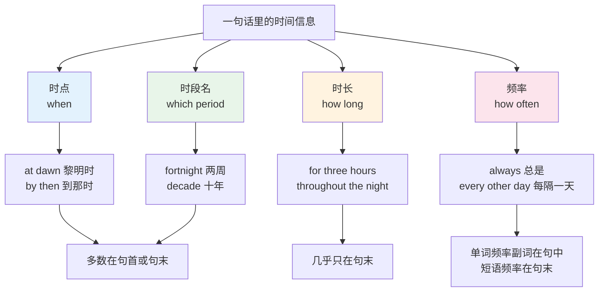
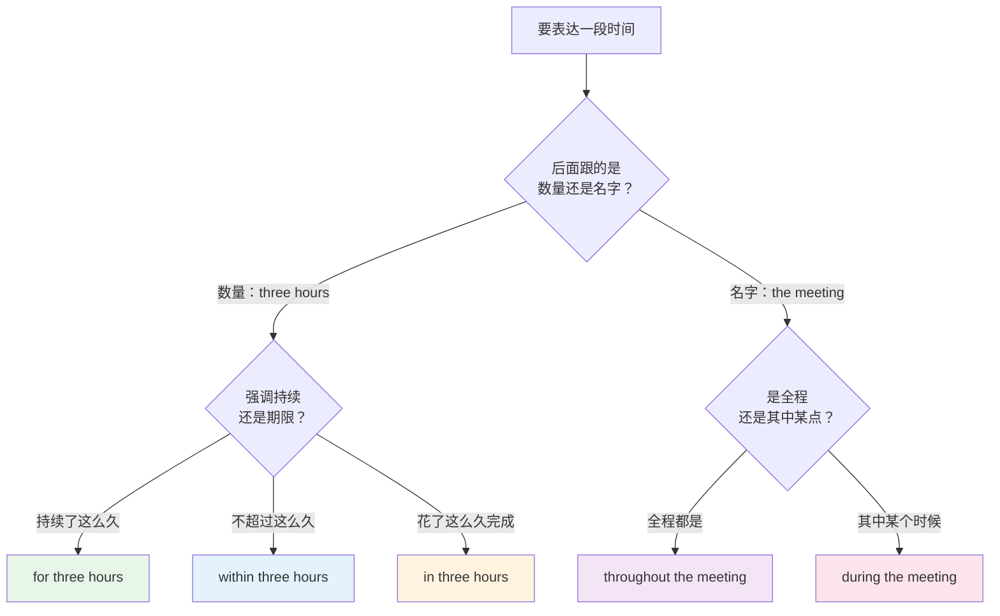
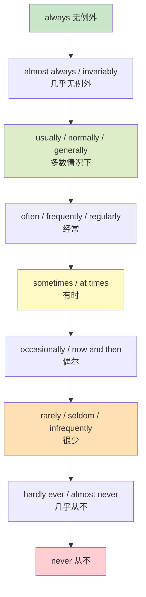
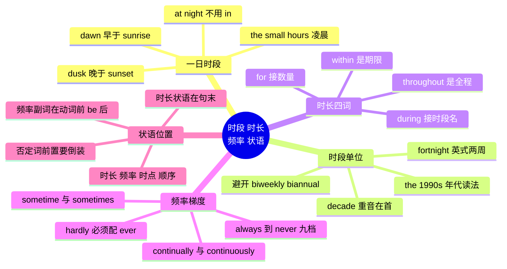

# 时段、时长、频率与时间状语词群

> [!info] 本篇定位
>
> 上一篇 [[04.时间与日历词汇/01.日历与钟点：星期、月份、四季与日期时刻读法\|日历与钟点]] 处理的是刻度本身——星期几、几月、几点几分怎么读。本篇处理刻度之外的四类词：**一段时间叫什么**（dawn、dusk、fortnight、decade）、**持续多久怎么说**（for、during、within、throughout）、**多频繁怎么说**（always 到 never 的整条梯度）、**时间状语放在句子哪里**（the other day、by then、in no time）。
>
> 读完能做三件事：说出「凌晨三点」「过去十年」「每隔一周」而不用绕圈子；分清 `for two hours` 和 `during two hours` 哪个是错的；把频率副词放在句子里不会位置出错。
>
> 时间介词的完整体系归 [[02.功能词与封闭词类速查/02.空间与路径介词：空间原型义到抽象义的引申\|介词语义地图]]，本篇只从**搭配**角度讲这几个词跟什么名词走。频率副词作为词类的位置规则与半否定用法在 [[02.功能词与封闭词类速查/08.程度副词、频率副词与模糊限制词\|程度副词、频率副词与模糊限制词]] 里已经系统讲过，本篇第 9 节只保留时间状语选词时用得上的那几条。时间类前后缀 `pre-` / `post-` / `-ward` 归 `14.构词法：前缀与后缀/03`，本篇不碰。

---

## 1. 本篇导读：时间词的四条轴

中文表达时间靠的是「点 + 段 + 次数」三样东西的自由拼装：「早上六点」「三个小时」「一周两次」。英语不是这么组织的，它把时间信息拆成四条互不重叠的轴，每条轴有各自的一套词和各自的句法位置。

| 轴 | 回答的问题 | 典型词 | 本篇位置 |
| --- | --- | --- | --- |
| 时点 | 什么时候？ | at dawn, by then, the other day | 第 2、8 节 |
| 时段名 | 哪一段？ | morning, fortnight, decade | 第 2、3 节 |
| 时长 | 多久？ | for two hours, throughout the night | 第 4、5 节 |
| 频率 | 多常？ | always, twice a week, once in a blue moon | 第 6、7 节 |

四条轴分开的直接好处是选词有了判据。`during` 属于时点轴（在哪一段之内发生），`for` 属于时长轴（持续了多长），二者不可互换；`always` 属于频率轴，`throughout` 属于时长轴，中文都可能译成「一直」，但英文里换不得。

上图右侧那一列是本篇第 9 节的内容：四条轴不只是语义分类，它们在句中的落点也不同。时长状语几乎只能待在句末，单词形式的频率副词却要挤进主语和主动词之间。中文母语者最常见的语序错误——`Always I check the logs`——就是把频率副词按中文习惯扔到了句首。

---

## 2. 一天之内的时段词

### 2.1 从黎明到深夜的完整序列

英语把一天切成的段比中文细，而且切分点是靠**光线**定义的，不是靠钟点。`dawn` 不等于「早上五点」，它是天开始亮的那段；同一个 `dawn`，六月和十二月对应的钟点差好几个小时。

| 英文 | 英式音标 | 美式音标 | 词性 | 中文 | 搭配与说明 |
| --- | --- | --- | --- | --- | --- |
| **dawn** | /dɔːn/ | /dɔːn/ | n./v. | 黎明；破晓 | at dawn（黎明时）、from dawn to dusk；动词义「渐渐明白」：it dawned on me |
| **daybreak** | /ˈdeɪbreɪk/ | /ˈdeɪbreɪk/ | n. | 破晓 | at daybreak，与 dawn 近义，书面味略重 |
| **first light** | /ˌfɜːst ˈlaɪt/ | /ˌfɜːrst ˈlaɪt/ | n. | 天刚亮 | at first light，军事与户外语境常用 |
| **sunrise** | /ˈsʌnraɪz/ | /ˈsʌnraɪz/ | n. | 日出 | 指太阳露出地平线那一刻，比 dawn 晚 |
| **morning** | /ˈmɔːnɪŋ/ | /ˈmɔːrnɪŋ/ | n. | 上午 | in the morning，但 on Monday morning 用 on |
| **forenoon** | /ˈfɔːnuːn/ | /ˈfɔːrnuːn/ | n. | 午前 | 罕用，仅见于航海与旧式公文 |
| **midday** | /ˌmɪdˈdeɪ/ | /ˌmɪdˈdeɪ/ | n. | 正午 | at midday，比 noon 更书面 |
| **noon** | /nuːn/ | /nuːn/ | n. | 中午十二点 | at noon 不加 the；高频 |
| **afternoon** | /ˌɑːftəˈnuːn/ | /ˌæftərˈnuːn/ | n. | 下午 | in the afternoon；英美元音差别明显 |
| **dusk** | /dʌsk/ | /dʌsk/ | n. | 黄昏 | at dusk，与 dawn 对称，指光线渐暗那段 |
| **twilight** | /ˈtwaɪlaɪt/ | /ˈtwaɪlaɪt/ | n. | 暮色；晨昏微光 | 技术上晨昏都可用，日常默认指傍晚 |
| **sunset** | /ˈsʌnset/ | /ˈsʌnset/ | n. | 日落 | 与 sunrise 对称，指落到地平线那一刻 |
| **sundown** | /ˈsʌndaʊn/ | /ˈsʌndaʊn/ | n. | 日落 | 美式偏好，英式多用 sunset |
| **nightfall** | /ˈnaɪtfɔːl/ | /ˈnaɪtfɔːl/ | n. | 入夜 | before nightfall（天黑前），书面 |
| **evening** | /ˈiːvnɪŋ/ | /ˈiːvnɪŋ/ | n. | 傍晚到睡前 | in the evening；e 后无独立音节，两音节 |
| **night** | /naɪt/ | /naɪt/ | n. | 夜晚 | at night 不用 in；all night 不加 for |
| **midnight** | /ˈmɪdnaɪt/ | /ˈmɪdnaɪt/ | n. | 午夜零点 | at midnight；burn the midnight oil 熬夜 |
| **the small hours** | /ðə ˌsmɔːl ˈaʊəz/ | /ðə ˌsmɔːl ˈaʊərz/ | n. | 凌晨一到四点 | 英式；in the small hours |
| **the wee hours** | /ðə ˌwiː ˈaʊəz/ | /ðə ˌwiː ˈaʊərz/ | n. | 凌晨 | 美式对应说法，wee 本义「小的」 |
| **daytime** | /ˈdeɪtaɪm/ | /ˈdeɪtaɪm/ | n./adj. | 白天 | in the daytime；作定语 daytime job |
| **nighttime** | /ˈnaɪttaɪm/ | /ˈnaɪttaɪm/ | n./adj. | 夜间 | at nighttime；美式常写 nighttime，英式 night-time |
| **overnight** | /ˌəʊvəˈnaɪt/ | /ˌoʊvərˈnaɪt/ | adv./adj. | 通宵；一夜之间 | stay overnight；an overnight flight |
| **broad daylight** | /ˌbrɔːd ˈdeɪlaɪt/ | /ˌbrɔːd ˈdeɪlaɪt/ | n. | 光天化日 | in broad daylight，几乎只用于「明目张胆做坏事」 |
| **eve** | /iːv/ | /iːv/ | n. | 前夕 | on the eve of the launch；节日义见下一篇 |

这条环形序列有两处容易搞反。`dawn` 在 `sunrise` **之前**（天亮了但太阳还没出来），`dusk` 在 `sunset` **之后**（太阳落了但天还没全黑）——中文的「黎明」「黄昏」大致对应 dawn 和 dusk，「日出」「日落」对应 sunrise 和 sunset，四个词不是两两同义。另一处是 `the small hours` 属于「昨夜」还是「今晨」：英语把它算在 night 那一侧，`I got home in the small hours` 说的是「凌晨才到家」，语感上仍是前一晚的延续。

### 2.2 时段词的介词固定搭配

时段词跟哪个介词是死记的，不讲道理。

| 介词 | 搭配的时段词 | 例子 |
| --- | --- | --- |
| in | morning, afternoon, evening, daytime | in the morning |
| at | night, noon, midnight, dawn, dusk, sunrise, sunset | at night |
| on | 具体某天的时段 | on Monday morning, on the evening of 3 May |

> [!warning] 三个高频错误
>
> - ❌ ~~in the night~~（泛指夜里时）→ ✅ **at night**
>   - `in the night` 不是绝对错误，但它特指「在那一夜之中的某个时刻」：`I woke up twice in the night.` 泛指「晚上」一律用 `at night`。
> - ❌ ~~in Monday morning~~ → ✅ **on Monday morning**
>   - 一旦时段前面挂了具体日期，介词从 in 变成 on。
> - ❌ ~~at the dawn~~ → ✅ **at dawn**
>   - dawn、dusk、noon、midnight、sunrise、sunset 作时点讲时不带冠词。

### 2.3 一日时段的动词与形容词延伸

| 英文 | 英式音标 | 美式音标 | 词性 | 中文 | 搭配与说明 |
| --- | --- | --- | --- | --- | --- |
| **dawn on** | /dɔːn ɒn/ | /dɔːn ɑːn/ | v. | （某事）使人恍然明白 | It dawned on me that... 主语是事，不是人 |
| **nocturnal** | /nɒkˈtɜːnl/ | /nɑːkˈtɜːrnl/ | adj. | 夜行的 | nocturnal animals；正式，拉丁层 |
| **diurnal** | /daɪˈɜːnl/ | /daɪˈɜːrnl/ | adj. | 昼行的；每日一次的 | 与 nocturnal 对称，学术用词；diurnal cycle 指昼夜节律 |
| **matinee** | /ˈmætɪneɪ/ | /ˌmætnˈeɪ/ | n. | 日场演出 | a matinee performance，法语借词 |
| **all-nighter** | /ˌɔːlˈnaɪtə/ | /ˌɔːlˈnaɪtər/ | n. | 通宵 | pull an all-nighter（熬通宵），口语 |
| **graveyard shift** | /ˈɡreɪvjɑːd ʃɪft/ | /ˈɡreɪvjɑːrd ʃɪft/ | n. | 夜班 | work the graveyard shift，美式口语 |
| **night owl** | /ˌnaɪt ˈaʊl/ | /ˌnaɪt ˈaʊl/ | n. | 夜猫子 | I'm a night owl. 对应 early bird |
| **early bird** | /ˌɜːli ˈbɜːd/ | /ˌɜːrli ˈbɜːrd/ | n. | 早起的人 | 也指早鸟票：early bird pricing |

> [!example] 时段词在真实句子里
>
> - The build kicked off **at dawn** and was still running **at dusk**.
>   - 构建凌晨就开跑，到黄昏还没结束。
> - We deploy **overnight** so nobody notices the downtime.
>   - 我们通宵部署，这样没人会注意到停机。
> - He rewrote the parser **in the small hours** and regretted it the next morning.
>   - 他凌晨重写了解析器，第二天早上就后悔了。
> - The outage happened **in broad daylight**, right in the middle of the demo.
>   - 那次故障发生在光天化日之下，正好在演示中途。

---

## 3. 大于一天的时段单位：从 fortnight 到 millennium

### 3.1 标准单位链

| 英文 | 英式音标 | 美式音标 | 词性 | 中文 | 搭配与说明 |
| --- | --- | --- | --- | --- | --- |
| **second** | /ˈsekənd/ | /ˈsekənd/ | n. | 秒 | 缩写 s / sec；序数「第二」同形 |
| **minute** | /ˈmɪnɪt/ | /ˈmɪnɪt/ | n. | 分钟 | 形容词「微小的」读 /maɪˈnjuːt/，同形异读 |
| **hour** | /ˈaʊə/ | /ˈaʊər/ | n. | 小时 | h 不发音，冠词用 an hour |
| **day** | /deɪ/ | /deɪ/ | n. | 天 | 高频；the other day 见第 8 节 |
| **week** | /wiːk/ | /wiːk/ | n. | 周 | 与 weak 同音，拼写勿混 |
| **fortnight** | /ˈfɔːtnaɪt/ | /ˈfɔːrtnaɪt/ | n. | 两周 | 英式高频，美式几乎不用；源自 fourteen nights |
| **month** | /mʌnθ/ | /mʌnθ/ | n. | 月 | 复数 months /mʌnθs/，词尾辅音串难读 |
| **quarter** | /ˈkwɔːtə/ | /ˈkwɔːrtər/ | n. | 季度 | Q1 到 Q4；财报语境高频 |
| **season** | /ˈsiːzn/ | /ˈsiːzn/ | n. | 季节；赛季 | 四季词详见上一篇 |
| **semester** | /sɪˈmestə/ | /sɪˈmestər/ | n. | 学期（两学期制） | 美式高校常用 |
| **term** | /tɜːm/ | /tɜːrm/ | n. | 学期；任期 | 英式学期用 term；总统 a second term |
| **year** | /jɪə/ | /jɪr/ | n. | 年 | 英式还有 /jɜː/ 一读 |
| **decade** | /ˈdekeɪd/ | /ˈdekeɪd/ | n. | 十年 | 重音在首音节，读成 /dɪˈkeɪd/ 是常见错误 |
| **generation** | /ˌdʒenəˈreɪʃn/ | /ˌdʒenəˈreɪʃn/ | n. | 一代（约二三十年） | 世代名称见下一篇 |
| **century** | /ˈsentʃəri/ | /ˈsentʃəri/ | n. | 世纪 | the 21st century；序数读法见上一篇 |
| **millennium** | /mɪˈleniəm/ | /mɪˈleniəm/ | n. | 千年 | 复数 millennia；注意双 n 双 l 拼写 |
| **era** | /ˈɪərə/ | /ˈɪrə/ | n. | 时代 | the post-war era；比 age 更中性 |
| **epoch** | /ˈiːpɒk/ | /ˈepək/ | n. | 纪元；时期 | 英美读音差别大；ML 训练轮次也用它 |
| **age** | /eɪdʒ/ | /eɪdʒ/ | n. | 时代 | the Ice Age；年龄义归下一篇 |
| **eon / aeon** | /ˈiːən/ | /ˈiːɑːn/ | n. | 万古 | 夸张口语 it took eons，地质学也用 |

### 3.2 短于一秒与「一瞬间」

| 英文 | 英式音标 | 美式音标 | 词性 | 中文 | 搭配与说明 |
| --- | --- | --- | --- | --- | --- |
| **millisecond** | /ˈmɪlisekənd/ | /ˈmɪlisekənd/ | n. | 毫秒 | 缩写 ms，技术文档高频 |
| **microsecond** | /ˈmaɪkrəʊsekənd/ | /ˈmaɪkroʊsekənd/ | n. | 微秒 | 缩写 μs |
| **nanosecond** | /ˈnænəʊsekənd/ | /ˈnænoʊsekənd/ | n. | 纳秒 | 缩写 ns |
| **instant** | /ˈɪnstənt/ | /ˈɪnstənt/ | n./adj. | 瞬间；即时的 | in an instant；instant messaging |
| **moment** | /ˈməʊmənt/ | /ˈmoʊmənt/ | n. | 片刻 | in a moment（马上）、at the moment（此刻），两者含义不同 |
| **split second** | /ˌsplɪt ˈsekənd/ | /ˌsplɪt ˈsekənd/ | n. | 一刹那 | in a split second；作定语 split-second decision |
| **jiffy** | /ˈdʒɪfi/ | /ˈdʒɪfi/ | n. | 一会儿 | in a jiffy，口语，非正式场合才用 |
| **flash** | /flæʃ/ | /flæʃ/ | n. | 闪念；一瞬 | in a flash（转眼间） |
| **blink** | /blɪŋk/ | /blɪŋk/ | n./v. | 眨眼 | in the blink of an eye（眨眼之间） |
| **heartbeat** | /ˈhɑːtbiːt/ | /ˈhɑːrtbiːt/ | n. | 心跳；一瞬 | in a heartbeat（毫不犹豫地） |

> [!warning] in a moment 与 at the moment
>
> 两个都带 moment，意思正好错开：
>
> - `in a moment` = 马上、过一会儿（指向未来）
>   - I'll be with you **in a moment**.（我马上过来。）
> - `at the moment` = 目前、此刻（指向现在）
>   - He's in a meeting **at the moment**.（他此刻在开会。）
>
> 说 `I'll be with you at the moment` 是逻辑矛盾。同类陷阱还有 `for the moment`（暂时）和 `for a moment`（有一会儿）。

### 3.3 fortnight：英式的两周

`fortnight` 是英美差异里最实用的一个。英式英语把「两周」当作一个基本时间单位，工资周期、假期长度、租约都按 fortnight 算；美式英语没有这个词，遇到时会照字面理解成「十四夜」，但不会主动使用。

| 场景 | 英式说法 | 美式说法 |
| --- | --- | --- |
| 两周后 | in a fortnight | in two weeks |
| 每两周一次 | fortnightly | every two weeks / biweekly |
| 两周的假期 | a fortnight's holiday | a two-week vacation |
| 两周前 | a fortnight ago | two weeks ago |

> [!tip] biweekly 是个坑，绕开它
>
> 美式的 `biweekly` 同时有「每两周一次」和「一周两次」两种用法，母语者自己也会误解，正式文书里普遍避免使用。
>
> 需要明确表达时，直接写 `every two weeks` 或 `twice a week`，不留歧义。同理 `bimonthly` 也不要用。`biannual`（一年两次）和 `biennial`（两年一次）这一对更是拼写只差两个字母、意思完全相反，写作时一律换成 `twice a year` 和 `every two years`。

### 3.4 用世纪与十年表达年代

英语讲「上世纪九十年代」有固定说法，直译中文语序会出错。

| 中文 | 英文 | 说明 |
| --- | --- | --- |
| 九十年代 | the nineties / the '90s | 加 the，加 s |
| 二十世纪九十年代 | the 1990s | 读作 the nineteen-nineties |
| 八十年代中期 | the mid-1980s | mid- 加连字符 |
| 七十年代末 | the late 1970s | 对应 the early 1970s |
| 过去十年 | the past decade / the last decade | 不说 the past ten years 也行，但 decade 更书面 |
| 未来十年 | the coming decade / the next decade | — |
| 几十年来 | for decades | 复数，不加数字 |
| 上个世纪 | the last century / the previous century | 注意 the last century 有歧义，可能指「刚过去的一百年」 |

> [!example] 年代表达的实际用法
>
> - The library has barely changed **since the late 1990s**.
>   - 这个库从九十年代末起几乎没变过。
> - COBOL has been declared dead **for decades**, and it is still running payroll.
>   - COBOL 被宣告死亡几十年了，工资系统还在跑它。
> - **Over the past decade**, the toolchain has been rewritten three times.
>   - 过去十年里这套工具链被重写了三次。

---

## 4. 时长表述的四个核心词：for、during、within、throughout

### 4.1 一张分工表

这四个词中文都可能译成「在……期间」，但它们各管一件事，互换就出错。判断依据是**后面接什么**以及**回答哪个问题**。

| 词 | 后面接 | 回答的问题 | 例子 |
| --- | --- | --- | --- |
| **for** | 时长（数量 + 单位） | 持续了多久？ | for three hours, for two weeks |
| **during** | 时段名（有名字的一段） | 在哪一段之内？ | during the meeting, during the summer |
| **within** | 期限（数量 + 单位） | 不迟于多久？ | within 24 hours, within a week |
| **throughout** | 时段名 | 是否贯穿全程？ | throughout the night, throughout 2025 |

| 英文 | 英式音标 | 美式音标 | 词性 | 中文 | 搭配与说明 |
| --- | --- | --- | --- | --- | --- |
| **for** | /fɔː/ | /fɔːr/ | prep. | 持续（多久） | 后面必须是时长数量；弱读 /fə/ · /fər/ |
| **during** | /ˈdjʊərɪŋ/ | /ˈdʊrɪŋ/ | prep. | 在……期间 | 后面必须是时段名词，不能是纯数量 |
| **within** | /wɪˈðɪn/ | /wɪˈðɪn/ | prep. | 在……之内 | 强调期限，暗含「不超过」 |
| **throughout** | /θruːˈaʊt/ | /θruːˈaʊt/ | prep./adv. | 自始至终；遍及 | 时间与空间两用；throughout the file |
| **over** | /ˈəʊvə/ | /ˈoʊvər/ | prep. | 在……过程中；跨越 | over the weekend、over the past year |
| **through** | /θruː/ | /θruː/ | prep. | 直到……结束（含当天） | 美式 Monday through Friday |
| **in** | /ɪn/ | /ɪn/ | prep. | （花了）多久；（之后）多久 | done in two hours；I'll call in ten minutes |
| **since** | /sɪns/ | /sɪns/ | prep./conj. | 自从（起点） | 后接时间点，配完成时 |
| **until / till** | /ənˈtɪl/ /tɪl/ | /ənˈtɪl/ /tɪl/ | prep./conj. | 直到（终点） | till 不是 until 的缩写，两者都是完整词 |
| **by** | /baɪ/ | /baɪ/ | prep. | 不迟于（截止点） | by Friday；与 within 的差别见 4.4 |

上图把选词压缩成两个判断。第一个判断只看后面跟的词：跟数量走 for / within / in 这一支，跟名字走 during / throughout 这一支。第二个判断看语义重点：`during the meeting` 只说事情发生在会议这段里，不承诺持续多久；`throughout the meeting` 明确说从头到尾都在。这两句差别很大——`He was on his phone during the meeting` 是「会上有几次看手机」，`He was on his phone throughout the meeting` 是「整场会都在看手机」。

### 4.2 for 与 during 的分界线

这是中文母语者最高频的时间表达错误，根源是中文的「在三个小时里」和「在会议期间」用同一个「在……里」结构。

> [!warning] during 后面不能接纯数量
>
> - ❌ ~~I waited during three hours.~~
> - ✅ I waited **for three hours**.（我等了三个小时。）
> - ❌ ~~We talked during two days.~~
> - ✅ We talked **for two days**.
>
> 反过来也一样，for 后面不能接时段名：
>
> - ❌ ~~Nobody spoke for the meeting.~~
> - ✅ Nobody spoke **during the meeting**.（会议期间没人发言。）

有一类中间情况：时段名前面加了数量词，比如 `during the two weeks I was away`。这时 `the two weeks` 已经被定语从句限定成一个具体时段，有了「名字」，所以能跟 during。判据仍然成立——看的是有没有被限定成具体的一段，不是看有没有数字。

`for` 还有一个省略规则：跟 `all` 开头的时长时，for 通常不出现。

- ✅ I worked **all day**.（不说 for all day）
- ✅ It rained **all night**.
- ✅ She has been at it **all week**.

### 4.3 throughout：贯穿全程

`throughout` 是 `during` 的加强版，语义里带着「无间断、从头到尾」。

| 英文 | 英式音标 | 美式音标 | 词性 | 中文 | 搭配与说明 |
| --- | --- | --- | --- | --- | --- |
| **throughout the day** | /θruːˈaʊt ðə deɪ/ | /θruːˈaʊt ðə deɪ/ | phr. | 一整天里（多次） | 强调分布在整天，不是持续不断 |
| **throughout the year** | /θruːˈaʊt ðə jɪə/ | /θruːˈaʊt ðə jɪr/ | phr. | 全年 | 常与 available、open 搭配 |
| **throughout history** | /θruːˈaʊt ˈhɪstri/ | /θruːˈaʊt ˈhɪstri/ | phr. | 纵观历史 | 不加冠词 |
| **all through** | /ˌɔːl ˈθruː/ | /ˌɔːl ˈθruː/ | phr. | 整个……期间 | all through the winter，口语版 throughout |
| **from start to finish** | /frəm ˌstɑːt tə ˈfɪnɪʃ/ | /frəm ˌstɑːrt tə ˈfɪnɪʃ/ | phr. | 从头到尾 | 与 throughout 近义，更口语 |
| **from beginning to end** | /frəm bɪˌɡɪnɪŋ tu ˈend/ | /frəm bɪˌɡɪnɪŋ tu ˈend/ | phr. | 自始至终 | 同上 |

> [!example] during 与 throughout 的语义差
>
> - The server crashed twice **during** the demo.
>   - 演示期间服务器崩了两次。（两个时间点）
> - The server was unstable **throughout** the demo.
>   - 整场演示服务器都不稳定。（覆盖全程）
> - Support is available **throughout** the year.
>   - 全年提供支持。（一年内不间断可用）

### 4.4 within 与 by：期限的两种说法

两个都表示「截止到某个界限之前」，差别在参照物：`within` 后面是**时长**，`by` 后面是**时点**。

| 说法 | 后面接 | 例子 | 中文 |
| --- | --- | --- | --- |
| within | 时长 | within 24 hours | 24 小时内 |
| by | 时点 | by Friday | 周五前 |
| no later than | 时点 | no later than 5 p.m. | 不迟于下午五点 |
| in | 时长（将来） | in 24 hours | 24 小时后 |

> [!warning] within 24 hours 与 in 24 hours 不是一回事
>
> - We'll reply **within** 24 hours. = 24 小时内的**任何时候**都可能回复，最迟 24 小时。
> - We'll reply **in** 24 hours. = 24 小时**之后**才回复。
>
> 写服务承诺、SLA、邮件自动回复时这个差别是硬性的。中文的「24 小时内回复」只能对应 `within`。
>
> 同样要区分的还有 `after two hours`（两小时之后，通常叙述过去）和 `in two hours`（两小时后，通常指将来），以及 `in two hours`（用了两小时完成）——最后这个义项只出现在完成类动词后：`She fixed it in two hours.`

### 4.5 over、through 与起止表达

| 英文 | 英式音标 | 美式音标 | 词性 | 中文 | 搭配与说明 |
| --- | --- | --- | --- | --- | --- |
| **over the weekend** | /ˌəʊvə ðə ˈwiːkend/ | /ˌoʊvər ðə ˈwiːkend/ | phr. | 周末期间 | 美式也说 on the weekend，英式 at the weekend |
| **over the past year** | /ˌəʊvə ðə ˌpɑːst ˈjɪə/ | /ˌoʊvər ðə ˌpæst ˈjɪr/ | phr. | 过去一年里 | 配完成时；书面高频 |
| **from … to …** | /frəm tuː/ | /frəm tuː/ | phr. | 从……到…… | from Monday to Friday，含不含末日靠上下文，见 4.5 末尾 |
| **from … through …** | /frəm θruː/ | /frəm θruː/ | phr. | 从……到……（含末日） | 美式，明确包含最后一天 |
| **between … and …** | /bɪˈtwiːn ənd/ | /bɪˈtwiːn ənd/ | phr. | 在……与……之间 | between 9 and 5 |
| **up to** | /ˌʌp tə/ | /ˌʌp tə/ | phr. | 至多；直到 | up to three days |
| **as from** | /əz ˈfrɒm/ | /əz ˈfrɑːm/ | phr. | 自……起 | 英式公文，美式用 as of |
| **as of** | /ˈæz əv/ | /ˈæz əv/ | phr. | 自……起；截至 | as of today，两个方向都能用，靠上下文判断 |
| **effective** | /ɪˈfektɪv/ | /ɪˈfektɪv/ | adj. | 自……生效 | effective immediately，公告用语 |

> [!tip] Monday through Friday 的英美差异
>
> 美式 `Monday through Friday` 明确包含周五。英式没有这个用法，写 `Monday to Friday`，但「到底含不含周五」在英式里是靠常识判断的，法律文书里会补一句 `inclusive`：`from 1 May to 31 May inclusive`。
>
> 给国际团队写文档时，`Monday through Friday`（美式）或 `Monday to Friday inclusive`（英式）都比裸写 `Mon-Fri` 稳妥。

---

## 5. 时长的名词与形容词词群

### 5.1 表示「一段」的名词

英语里「一段时间」有一整排词，区别在于这段时间的性质：有没有边界、是不是重复、带不带感情色彩。

| 英文 | 英式音标 | 美式音标 | 词性 | 中文 | 搭配与说明 |
| --- | --- | --- | --- | --- | --- |
| **duration** | /djuˈreɪʃn/ | /duˈreɪʃn/ | n. | 持续时间 | for the duration of the contract；正式 |
| **period** | /ˈpɪəriəd/ | /ˈpɪriəd/ | n. | 时期；一段 | a three-month period；最中性的一个 |
| **span** | /spæn/ | /spæn/ | n./v. | 跨度 | attention span、a span of five years |
| **length** | /leŋθ/ | /leŋθ/ | n. | 长度 | the length of the session；空间时间两用 |
| **spell** | /spel/ | /spel/ | n. | 一阵子 | a cold spell（一段冷天）、a dizzy spell |
| **stretch** | /stretʃ/ | /stretʃ/ | n. | 连续的一段 | a long stretch of quiet；口语常用 |
| **stint** | /stɪnt/ | /stɪnt/ | n. | 一段任期 | a two-year stint in Berlin |
| **bout** | /baʊt/ | /baʊt/ | n. | 一阵（发作） | a bout of flu；多与不好的事搭配 |
| **interval** | /ˈɪntəvl/ | /ˈɪntərvl/ | n. | 间隔；幕间休息 | at regular intervals；英式剧院中场也叫 interval |
| **gap** | /ɡæp/ | /ɡæp/ | n. | 空档 | a gap in the schedule、a gap year |
| **phase** | /feɪz/ | /feɪz/ | n. | 阶段 | go through a phase；ph 读 /f/ |
| **stage** | /steɪdʒ/ | /steɪdʒ/ | n. | 阶段 | at this stage；比 phase 更强调步骤顺序 |
| **session** | /ˈseʃn/ | /ˈseʃn/ | n. | 一场；会话 | a two-hour session；技术义为会话 |
| **while** | /waɪl/ | /waɪl/ | n. | 一会儿 | a while、in a while、a good while |
| **run** | /rʌn/ | /rʌn/ | n. | 连续的一段 | a run of bad luck、a three-week run |
| **window** | /ˈwɪndəʊ/ | /ˈwɪndoʊ/ | n. | 时间窗口 | a two-hour maintenance window |
| **timeframe** | /ˈtaɪmfreɪm/ | /ˈtaɪmfreɪm/ | n. | 时间框架 | within the agreed timeframe |
| **lifetime** | /ˈlaɪftaɪm/ | /ˈlaɪftaɪm/ | n. | 一生；使用期 | in my lifetime；object lifetime 也用它 |
| **lifespan** | /ˈlaɪfspæn/ | /ˈlaɪfspæn/ | n. | 寿命 | the lifespan of a battery |
| **deadline** | /ˈdedlaɪn/ | /ˈdedlaɪn/ | n. | 截止期限 | meet / miss a deadline，不说 catch |
| **turnaround** | /ˈtɜːnəraʊnd/ | /ˈtɜːrnəraʊnd/ | n. | 周转时间 | a 24-hour turnaround |
| **lead time** | /ˈliːd taɪm/ | /ˈliːd taɪm/ | n. | 前置时间 | a two-week lead time，供应链与排期常用 |
| **downtime** | /ˈdaʊntaɪm/ | /ˈdaʊntaɪm/ | n. | 停机时间；休息 | scheduled downtime；也指个人休息时间 |
| **uptime** | /ˈʌptaɪm/ | /ˈʌptaɪm/ | n. | 正常运行时间 | uptime guarantee |
| **latency** | /ˈleɪtnsi/ | /ˈleɪtnsi/ | n. | 延迟 | low latency；技术文档高频 |

> [!tip] 一段时间的三个近义词怎么挑
>
> - `period` 中性，什么场合都能用，不确定时选它。
> - `spell` 和 `bout` 自带「短暂而且反复」的味道，`a spell of rain` 是一阵雨，`a bout of coughing` 是一阵咳嗽。
> - `stretch` 强调连续不断，`a long stretch without a break` 是「一长段没休息」。
>
> 这三个不能互换。`a bout of good weather` 听起来很怪，因为 bout 通常配不好的事。

### 5.2 持续与终止类动词

| 英文 | 英式音标 | 美式音标 | 词性 | 中文 | 搭配与说明 |
| --- | --- | --- | --- | --- | --- |
| **last** | /lɑːst/ | /læst/ | v. | 持续 | The meeting lasted two hours. 不及物，后面直接跟时长 |
| **take** | /teɪk/ | /teɪk/ | v. | 花费（时间） | It takes ten minutes. 主语常是 it |
| **spend** | /spend/ | /spend/ | v. | 花（时间）做 | spend two hours doing sth，后面跟动名词 |
| **elapse** | /ɪˈlæps/ | /ɪˈlæps/ | v. | （时间）流逝 | Two years elapsed.；正式，主语是时间 |
| **persist** | /pəˈsɪst/ | /pərˈsɪst/ | v. | 持续存在 | The bug persists after the patch. |
| **linger** | /ˈlɪŋɡə/ | /ˈlɪŋɡər/ | v. | 逗留不去 | The smell lingered for days. |
| **drag on** | /ˌdræɡ ˈɒn/ | /ˌdræɡ ˈɑːn/ | v. | 拖沓地持续 | The meeting dragged on.；带负面色彩 |
| **endure** | /ɪnˈdjʊə/ | /ɪnˈdʊr/ | v. | 持久；忍受 | 两个义项都常见，看及物与否 |
| **prolong** | /prəˈlɒŋ/ | /prəˈlɔːŋ/ | v. | 延长 | prolong the deadline；正式 |
| **extend** | /ɪkˈstend/ | /ɪkˈstend/ | v. | 延长；延伸 | extend the trial by a week |
| **shorten** | /ˈʃɔːtn/ | /ˈʃɔːrtn/ | v. | 缩短 | shorten the sprint |
| **postpone** | /pəˈspəʊn/ | /poʊstˈpoʊn/ | v. | 推迟 | postpone until Friday，不说 postpone to |
| **delay** | /dɪˈleɪ/ | /dɪˈleɪ/ | v./n. | 延误 | a two-hour delay |
| **bring forward** | /ˌbrɪŋ ˈfɔːwəd/ | /ˌbrɪŋ ˈfɔːrwərd/ | v. | 提前 | bring the meeting forward to Monday |
| **push back** | /ˌpʊʃ ˈbæk/ | /ˌpʊʃ ˈbæk/ | v. | 往后推 | push the launch back a week；口语 |
| **run over** | /ˌrʌn ˈəʊvə/ | /ˌrʌn ˈoʊvər/ | v. | 超时 | The demo ran over by ten minutes. |
| **wrap up** | /ˌræp ˈʌp/ | /ˌræp ˈʌp/ | v. | 收尾结束 | Let's wrap up by five. |

> [!warning] last、take、spend 的主语各不相同
>
> - **last** 的主语是**事件**：The film **lasts** two hours.（电影长两小时。）
> - **take** 的主语通常是 **it** 或事情：It **took** me two hours.（花了我两小时。）
> - **spend** 的主语是**人**：I **spent** two hours on it.（我在这上面花了两小时。）
>
> - ❌ ~~I lasted two hours to fix it.~~
> - ✅ It **took** me two hours to fix it.
> - ✅ I **spent** two hours fixing it.（注意 spend 后面用 -ing，不用 to do）

### 5.3 时长类形容词

| 英文 | 英式音标 | 美式音标 | 词性 | 中文 | 搭配与说明 |
| --- | --- | --- | --- | --- | --- |
| **brief** | /briːf/ | /briːf/ | adj. | 简短的 | a brief pause；比 short 更书面 |
| **momentary** | /ˈməʊməntri/ | /ˈmoʊmənteri/ | adj. | 短暂的（一瞬） | a momentary lapse |
| **fleeting** | /ˈfliːtɪŋ/ | /ˈfliːtɪŋ/ | adj. | 转瞬即逝的 | a fleeting glance；文学色彩 |
| **transient** | /ˈtrænziənt/ | /ˈtrænʃnt/ | adj. | 暂时的；瞬态的 | a transient error；技术文档高频 |
| **temporary** | /ˈtemprəri/ | /ˈtempəreri/ | adj. | 临时的 | a temporary fix；反义 permanent |
| **interim** | /ˈɪntərɪm/ | /ˈɪntərɪm/ | adj./n. | 过渡的；期间 | an interim report、in the interim |
| **provisional** | /prəˈvɪʒənl/ | /prəˈvɪʒənl/ | adj. | 临时的；暂定的 | a provisional date |
| **lengthy** | /ˈleŋθi/ | /ˈleŋθi/ | adj. | 冗长的 | a lengthy discussion；略带负面 |
| **prolonged** | /prəˈlɒŋd/ | /prəˈlɔːŋd/ | adj. | 长时间的 | prolonged exposure |
| **protracted** | /prəˈtræktɪd/ | /prəˈtræktɪd/ | adj. | 拖长的 | a protracted dispute；负面色彩明显 |
| **ongoing** | /ˈɒnɡəʊɪŋ/ | /ˈɑːnɡoʊɪŋ/ | adj. | 进行中的 | an ongoing investigation |
| **sustained** | /səˈsteɪnd/ | /səˈsteɪnd/ | adj. | 持续的 | sustained growth；正面色彩 |
| **permanent** | /ˈpɜːmənənt/ | /ˈpɜːrmənənt/ | adj. | 永久的 | a permanent fix |
| **perpetual** | /pəˈpetʃuəl/ | /pərˈpetʃuəl/ | adj. | 无休止的 | perpetual licence；也可带厌烦意味 |
| **eternal** | /ɪˈtɜːnl/ | /ɪˈtɜːrnl/ | adj. | 永恒的 | eternal debate；夸张时用 |
| **indefinite** | /ɪnˈdefɪnət/ | /ɪnˈdefɪnət/ | adj. | 无限期的 | postponed indefinitely |
| **short-lived** | /ˌʃɔːtˈlɪvd/ | /ˌʃɔːrtˈlaɪvd/ | adj. | 短命的 | 英美元音不同，美式常读 /laɪvd/ |
| **long-standing** | /ˌlɒŋˈstændɪŋ/ | /ˌlɔːŋˈstændɪŋ/ | adj. | 由来已久的 | a long-standing issue |
| **long-running** | /ˌlɒŋˈrʌnɪŋ/ | /ˌlɔːŋˈrʌnɪŋ/ | adj. | 长期运行的 | a long-running process |
| **overdue** | /ˌəʊvəˈdjuː/ | /ˌoʊvərˈduː/ | adj. | 逾期的 | long overdue（早该做了） |

---

## 6. 频率梯度：从 always 到 never

### 6.1 整条梯度

频率副词构成一条从「无例外」到「零次」的连续带。中文只有「总是、经常、有时、很少、从不」五档，英语这条带上排着三十多个词，选错档位听起来会不自然。

这条梯度有两个使用要点。一是**相邻档位可以互换，隔档不行**：把 `usually` 换成 `often` 一般不会造成误解，把 `usually` 换成 `sometimes` 就改变了事实。二是**梯度下半段带否定含义**：`rarely`、`seldom`、`hardly ever` 本身就是否定词，句子里不能再加 `not`——`I don't rarely go` 是错的。

| 英文 | 英式音标 | 美式音标 | 词性 | 中文 | 搭配与说明 |
| --- | --- | --- | --- | --- | --- |
| **always** | /ˈɔːlweɪz/ | /ˈɔːlweɪz/ | adv. | 总是 | 与进行时连用表抱怨：He's always complaining. |
| **invariably** | /ɪnˈveəriəbli/ | /ɪnˈveriəbli/ | adv. | 无一例外地 | 正式，书面报告常用 |
| **constantly** | /ˈkɒnstəntli/ | /ˈkɑːnstəntli/ | adv. | 不断地 | 常带负面：constantly interrupted |
| **continually** | /kənˈtɪnjuəli/ | /kənˈtɪnjuəli/ | adv. | 反复不断地 | 有间断的重复 |
| **continuously** | /kənˈtɪnjuəsli/ | /kənˈtɪnjuəsli/ | adv. | 不间断地 | 真正无间断，与 continually 有别 |
| **perpetually** | /pəˈpetʃuəli/ | /pərˈpetʃuəli/ | adv. | 没完没了地 | 夸张与抱怨 |
| **forever** | /fəˈrevə/ | /fəˈrevər/ | adv. | 永远；老是 | be forever doing sth 表不耐烦 |
| **usually** | /ˈjuːʒuəli/ | /ˈjuːʒuəli/ | adv. | 通常 | 最中性的高频档 |
| **normally** | /ˈnɔːməli/ | /ˈnɔːrməli/ | adv. | 一般来说 | 暗含「除非有特殊情况」 |
| **generally** | /ˈdʒenrəli/ | /ˈdʒenrəli/ | adv. | 大体上 | 也可表「笼统地说」，一词两义 |
| **typically** | /ˈtɪpɪkli/ | /ˈtɪpɪkli/ | adv. | 典型地；一般 | 技术文档高频：typically takes 3 s |
| **ordinarily** | /ˈɔːdnrəli/ | /ˌɔːrdnˈerəli/ | adv. | 通常 | 英美重音位置不同 |
| **as a rule** | /əz ə ˈruːl/ | /əz ə ˈruːl/ | phr. | 一般而言 | 句首或句末，逗号隔开 |
| **more often than not** | /ˌmɔːr ˈɒfn ðən nɒt/ | /ˌmɔːr ˈɔːfn ðən nɑːt/ | phr. | 多半 | 语气比 usually 略弱 |
| **often** | /ˈɒfn/ | /ˈɔːfn/ | adv. | 经常 | t 通常不发音，读 /ˈɒftən/ 也被接受 |
| **frequently** | /ˈfriːkwəntli/ | /ˈfriːkwəntli/ | adv. | 频繁地 | 比 often 正式 |
| **regularly** | /ˈreɡjələli/ | /ˈreɡjələrli/ | adv. | 定期地 | 强调有规律，不只是次数多 |
| **repeatedly** | /rɪˈpiːtɪdli/ | /rɪˈpiːtɪdli/ | adv. | 反复地 | 常用于抱怨或事故报告 |
| **routinely** | /ruːˈtiːnli/ | /ruːˈtiːnli/ | adv. | 例行地 | routinely checked |
| **habitually** | /həˈbɪtʃuəli/ | /həˈbɪtʃuəli/ | adv. | 习惯性地 | 指人的习惯 |
| **commonly** | /ˈkɒmənli/ | /ˈkɑːmənli/ | adv. | 常见地 | commonly used，说的是普遍性 |
| **sometimes** | /ˈsʌmtaɪmz/ | /ˈsʌmtaɪmz/ | adv. | 有时 | 位置最灵活，句首句中句末都行 |
| **at times** | /ət ˈtaɪmz/ | /ət ˈtaɪmz/ | phr. | 有时候 | 比 sometimes 略书面 |
| **occasionally** | /əˈkeɪʒnəli/ | /əˈkeɪʒnəli/ | adv. | 偶尔 | 比 sometimes 频率更低 |
| **periodically** | /ˌpɪəriˈɒdɪkli/ | /ˌpɪriˈɑːdɪkli/ | adv. | 周期性地 | 强调间隔规律 |
| **intermittently** | /ˌɪntəˈmɪtəntli/ | /ˌɪntərˈmɪtəntli/ | adv. | 断断续续地 | 故障报告高频：fails intermittently |
| **sporadically** | /spəˈrædɪkli/ | /spəˈrædɪkli/ | adv. | 零星地 | 无规律的偶发 |
| **now and then** | /ˌnaʊ ən ˈðen/ | /ˌnaʊ ən ˈðen/ | phr. | 时不时 | 也说 now and again，口语 |
| **from time to time** | /frəm ˌtaɪm tə ˈtaɪm/ | /frəm ˌtaɪm tə ˈtaɪm/ | phr. | 不时 | 比 now and then 略正式 |
| **every so often** | /ˌevri səʊ ˈɒfn/ | /ˌevri soʊ ˈɔːfn/ | phr. | 偶尔 | 注意不是「每隔一段固定时间」 |
| **infrequently** | /ɪnˈfriːkwəntli/ | /ɪnˈfriːkwəntli/ | adv. | 不常 | 书面，口语更常说 not often |
| **rarely** | /ˈreəli/ | /ˈrerli/ | adv. | 很少 | 本身是否定词，不再加 not |
| **seldom** | /ˈseldəm/ | /ˈseldəm/ | adv. | 难得 | 比 rarely 更书面 |
| **hardly ever** | /ˌhɑːdli ˈevə/ | /ˌhɑːrdli ˈevər/ | phr. | 几乎从不 | hardly 不能单独表频率，必须配 ever |
| **scarcely ever** | /ˌskeəsli ˈevə/ | /ˌskersli ˈevər/ | phr. | 几乎从不 | 正式，用得比 hardly ever 少 |
| **once in a blue moon** | /ˌwʌns ɪn ə ˌbluː ˈmuːn/ | /ˌwʌns ɪn ə ˌbluː ˈmuːn/ | phr. | 千载难逢地 | 习语，口语，语气夸张 |
| **never** | /ˈnevə/ | /ˈnevər/ | adv. | 从不 | 否定词，句中不再加 not |
| **ever** | /ˈevə/ | /ˈevər/ | adv. | 曾经；任何时候 | 疑问与否定句用，肯定句里一般不单用 |

### 6.2 三对最容易混的频率词

> [!warning] continually 与 continuously
>
> - `continuously` = 中间不断。`The server ran continuously for 400 days.`（连续跑了 400 天没停。）
> - `continually` = 反复发生但有间断。`He continually interrupts.`（他老是打断别人，不是「一刻不停地打断」。）
>
> 判据是「中间有没有停」。写监控报告时这两个词意思完全不同，混用会给出错误信息。

> [!warning] hardly ever 不能写成 hardly
>
> `hardly` 单独用不表示频率，它表示程度「几乎不」：`I can hardly hear you.`（我几乎听不见你。）
>
> - ❌ ~~I hardly go to the office.~~（意思含混）
> - ✅ I **hardly ever** go to the office.（我几乎不去办公室。）
>
> 同样，`rarely` 和 `seldom` 可以单独用，`hardly` 和 `scarcely` 表频率时必须带 `ever`。

> [!warning] sometime、sometimes、some time 三个词
>
> 拼写只差一个空格和一个 s，意思完全不同：
>
> - **sometimes** /ˈsʌmtaɪmz/ 有时（频率副词）：`Sometimes it fails.`
> - **sometime** /ˈsʌmtaɪm/ 某个时候（不确定时点）：`Let's meet sometime next week.`
> - **some time** /ˌsʌm ˈtaɪm/ 一段时间（时长）：`It took some time.`
>
> 中文母语者写作时最常把「有时」写成 `sometime`，把「花了些时间」写成 `sometimes`。

### 6.3 频率形容词

| 英文 | 英式音标 | 美式音标 | 词性 | 中文 | 搭配与说明 |
| --- | --- | --- | --- | --- | --- |
| **frequent** | /ˈfriːkwənt/ | /ˈfriːkwənt/ | adj. | 频繁的 | frequent flyer；动词读 /frɪˈkwent/ |
| **occasional** | /əˈkeɪʒənl/ | /əˈkeɪʒənl/ | adj. | 偶尔的 | an occasional bug |
| **rare** | /reə/ | /rer/ | adj. | 罕见的 | a rare case；也指牛排三分熟 |
| **constant** | /ˈkɒnstənt/ | /ˈkɑːnstənt/ | adj. | 不断的；恒定的 | constant pressure；数学常量也用它 |
| **sporadic** | /spəˈrædɪk/ | /spəˈrædɪk/ | adj. | 零星的 | sporadic failures |
| **intermittent** | /ˌɪntəˈmɪtənt/ | /ˌɪntərˈmɪtənt/ | adj. | 间歇的 | intermittent connectivity |
| **periodic** | /ˌpɪəriˈɒdɪk/ | /ˌpɪriˈɑːdɪk/ | adj. | 周期性的 | periodic review |
| **routine** | /ruːˈtiːn/ | /ruːˈtiːn/ | adj./n. | 例行的；常规 | routine maintenance；重音在后 |
| **habitual** | /həˈbɪtʃuəl/ | /həˈbɪtʃuəl/ | adj. | 习惯性的 | a habitual latecomer |
| **chronic** | /ˈkrɒnɪk/ | /ˈkrɑːnɪk/ | adj. | 长期的；慢性的 | a chronic shortage；反义 acute |
| **recurrent** | /rɪˈkʌrənt/ | /rɪˈkɜːrənt/ | adj. | 反复出现的 | a recurrent theme |
| **recurring** | /rɪˈkɜːrɪŋ/ | /rɪˈkɜːrɪŋ/ | adj. | 周期重复的 | a recurring payment（订阅扣款） |
| **one-off** | /ˌwʌnˈɒf/ | /ˌwʌnˈɔːf/ | adj./n. | 一次性的 | 英式；美式说 one-time |
| **ad hoc** | /ˌæd ˈhɒk/ | /ˌæd ˈhɑːk/ | adj./adv. | 临时的 | an ad hoc meeting；拉丁短语 |
| **perennial** | /pəˈreniəl/ | /pəˈreniəl/ | adj. | 常年的 | a perennial problem；植物学指多年生 |

---

## 7. 频率的量化表达：once、daily 与 on a … basis

### 7.1 次数词

| 英文 | 英式音标 | 美式音标 | 词性 | 中文 | 搭配与说明 |
| --- | --- | --- | --- | --- | --- |
| **once** | /wʌns/ | /wʌns/ | adv. | 一次；曾经 | once a week；也表「从前」：once upon a time |
| **twice** | /twaɪs/ | /twaɪs/ | adv. | 两次 | twice a day；不说 two times a day（虽可懂） |
| **thrice** | /θraɪs/ | /θraɪs/ | adv. | 三次 | 古旧，现代英语说 three times |
| **three times** | /ˌθriː ˈtaɪmz/ | /ˌθriː ˈtaɪmz/ | phr. | 三次 | 三次起一律用 number + times |
| **a couple of times** | /ə ˌkʌpl əv ˈtaɪmz/ | /ə ˌkʌpl əv ˈtaɪmz/ | phr. | 两三次 | 口语，不精确 |
| **several times** | /ˌsevrəl ˈtaɪmz/ | /ˌsevrəl ˈtaɪmz/ | phr. | 好几次 | 比 a few times 略多 |
| **countless times** | /ˌkaʊntləs ˈtaɪmz/ | /ˌkaʊntləs ˈtaɪmz/ | phr. | 无数次 | 夸张表达 |
| **per** | /pɜː/ | /pɜːr/ | prep. | 每 | 20 requests per second；弱读 /pə/ · /pər/ |
| **apiece** | /əˈpiːs/ | /əˈpiːs/ | adv. | 每个 | 数量分配，不常用于时间 |

英语表达「一周三次」有两种结构，都成立：

- `three times a week`（口语常用，a 是「每」的意思）
- `three times per week`（书面与技术文档常用）

### 7.2 -ly 频率形容词与副词

这一组词形容词副词同形，既能作定语也能作状语。

| 英文 | 英式音标 | 美式音标 | 词性 | 中文 | 搭配与说明 |
| --- | --- | --- | --- | --- | --- |
| **hourly** | /ˈaʊəli/ | /ˈaʊərli/ | adj./adv. | 每小时的 | an hourly rate；hourly updated |
| **daily** | /ˈdeɪli/ | /ˈdeɪli/ | adj./adv. | 每日的 | a daily standup；也可作名词指日报 |
| **nightly** | /ˈnaɪtli/ | /ˈnaɪtli/ | adj./adv. | 每夜的 | a nightly build |
| **weekly** | /ˈwiːkli/ | /ˈwiːkli/ | adj./adv. | 每周的 | a weekly report |
| **fortnightly** | /ˈfɔːtnaɪtli/ | /ˈfɔːrtnaɪtli/ | adj./adv. | 每两周的 | 英式；美式无对应词 |
| **monthly** | /ˈmʌnθli/ | /ˈmʌnθli/ | adj./adv. | 每月的 | a monthly subscription |
| **quarterly** | /ˈkwɔːtəli/ | /ˈkwɔːrtərli/ | adj./adv. | 每季度的 | quarterly earnings |
| **yearly** | /ˈjɪəli/ | /ˈjɪrli/ | adj./adv. | 每年的 | 与 annually 同义，更口语 |
| **annually** | /ˈænjuəli/ | /ˈænjuəli/ | adv. | 每年 | 正式；形容词 annual |
| **biannual** | /baɪˈænjuəl/ | /baɪˈænjuəl/ | adj. | 一年两次的 | 歧义高发，建议改写 |
| **biennial** | /baɪˈeniəl/ | /baɪˈeniəl/ | adj. | 两年一次的 | 与 biannual 只差两个字母，意思相反 |
| **semiannual** | /ˌsemiˈænjuəl/ | /ˌsemiˈænjuəl/ | adj. | 半年一次的 | 比 biannual 明确，优先用它 |
| **perennially** | /pəˈreniəli/ | /pəˈreniəli/ | adv. | 常年地 | perennially understaffed |

### 7.3 「每隔」怎么说

中文的「每隔一天」有歧义（是隔一天还是隔两天），英语有一套明确说法。

| 中文 | 英文 | 说明 |
| --- | --- | --- |
| 每天 | every day | 注意与形容词 everyday（日常的）分开写 |
| 每隔一天 | every other day / every second day | 周一、周三、周五这种间隔 |
| 每隔两天 | every third day / every three days | 两种说法都常见 |
| 每两周 | every two weeks / every fortnight | 避免用 biweekly |
| 每隔几分钟 | every few minutes | few 前不加 a |
| 每次 | every time / each time | every time 也可作连词引导从句 |
| 隔一个 | every other one | 空间时间通用 |

> [!warning] every day 与 everyday
>
> - **every day** 两个词，状语，「每天」：`I check the logs **every day**.`
> - **everyday** 一个词，形容词，「日常的」：`This is an **everyday** problem.`
>
> 同类的还有 `some time` / `sometime`（第 6.2 节）、`any more` / `anymore`、`a while` / `awhile`。这几组都是写作时的高频拼写错误，口语听不出来。

### 7.4 on a … basis 与其他正式结构

书面语里表达频率还有一批固定框架，语域偏正式，出现在合同、SLA、公告里。

| 英文 | 英式音标 | 美式音标 | 词性 | 中文 | 搭配与说明 |
| --- | --- | --- | --- | --- | --- |
| **on a daily basis** | /ɒn ə ˈdeɪli ˈbeɪsɪs/ | /ɑːn ə ˈdeɪli ˈbeɪsɪs/ | phr. | 每天 | 与 daily 同义，仅语域更正式 |
| **on a regular basis** | /ɒn ə ˈreɡjələ ˈbeɪsɪs/ | /ɑːn ə ˈreɡjələr ˈbeɪsɪs/ | phr. | 定期地 | 商务邮件常见 |
| **at regular intervals** | /ət ˈreɡjələr ˈɪntəvlz/ | /ət ˈreɡjələr ˈɪntərvlz/ | phr. | 每隔一定时间 | 技术描述 |
| **at intervals of** | /ət ˈɪntəvlz əv/ | /ət ˈɪntərvlz əv/ | phr. | 以……为间隔 | at intervals of five minutes |
| **round the clock** | /ˌraʊnd ðə ˈklɒk/ | /ˌraʊnd ðə ˈklɑːk/ | phr. | 全天候 | 英式；美式说 around the clock |
| **day in, day out** | /ˌdeɪ ˈɪn ˌdeɪ ˈaʊt/ | /ˌdeɪ ˈɪn ˌdeɪ ˈaʊt/ | phr. | 日复一日 | 带厌倦语气 |
| **round-the-clock** | /ˌraʊnd ðə ˈklɒk/ | /ˌraʊnd ðə ˈklɑːk/ | adj. | 全天候的 | 作定语时加连字符 |
| **24/7** | /ˌtwentifɔː ˈsevn/ | /ˌtwentifɔːr ˈsevn/ | adv./adj. | 全天候 | 读作 twenty-four seven，口语与营销 |
| **without fail** | /wɪˌðaʊt ˈfeɪl/ | /wɪˌðaʊt ˈfeɪl/ | phr. | 必定 | every Monday without fail |
| **like clockwork** | /laɪk ˈklɒkwɜːk/ | /laɪk ˈklɑːkwɜːrk/ | phr. | 像钟表一样准 | 强调规律性 |

> [!tip] on a daily basis 是不是废话
>
> `on a daily basis` 和 `daily` 意思完全一样，多用了四个词。技术写作与新闻写作里普遍建议直接用 `daily`。
>
> 保留 `on a … basis` 的场合只有两个：一是基数词无法直接副词化时（`on a case-by-case basis`），二是与前面的名词短语并列时（`on a first-come, first-served basis`）。其余情况能换成一个副词就换。

---

## 8. 时间状语短语库

### 8.1 指向过去的短语

| 英文 | 英式音标 | 美式音标 | 词性 | 中文 | 搭配与说明 |
| --- | --- | --- | --- | --- | --- |
| **the other day** | /ði ˈʌðə deɪ/ | /ði ˈʌðər deɪ/ | phr. | 前几天 | 指最近但不确切的过去，配一般过去时 |
| **the other night** | /ði ˈʌðə naɪt/ | /ði ˈʌðər naɪt/ | phr. | 前几天晚上 | 同一结构，还有 the other week |
| **back then** | /ˌbæk ˈðen/ | /ˌbæk ˈðen/ | phr. | 当时；那会儿 | 口语，常与现在对比 |
| **at that time** | /ət ˈðæt taɪm/ | /ət ˈðæt taɪm/ | phr. | 那时 | 中性书面版 back then |
| **in those days** | /ɪn ˌðəʊz ˈdeɪz/ | /ɪn ˌðoʊz ˈdeɪz/ | phr. | 那些年 | 带怀旧色彩 |
| **once upon a time** | /ˌwʌns əˌpɒn ə ˈtaɪm/ | /ˌwʌns əˌpɑːn ə ˈtaɪm/ | phr. | 很久以前 | 童话开场，日常用是打趣 |
| **ages ago** | /ˌeɪdʒɪz əˈɡəʊ/ | /ˌeɪdʒɪz əˈɡoʊ/ | phr. | 老早以前 | 口语夸张 |
| **just now** | /dʒəst ˈnaʊ/ | /dʒəst ˈnaʊ/ | phr. | 刚才 | 英式也可指「此刻」，有歧义 |
| **a moment ago** | /ə ˈməʊmənt əˌɡəʊ/ | /ə ˈmoʊmənt əˌɡoʊ/ | phr. | 片刻前 | 比 just now 更明确 |
| **earlier today** | /ˌɜːliə təˈdeɪ/ | /ˌɜːrliər təˈdeɪ/ | phr. | 今天早些时候 | 新闻高频 |
| **the day before yesterday** | /ðə ˌdeɪ bɪˌfɔː ˈjestədeɪ/ | /ðə ˌdeɪ bɪˌfɔːr ˈjestərdeɪ/ | phr. | 前天 | 英语没有单词形式 |
| **last but one** | /ˌlɑːst bət ˈwʌn/ | /ˌlæst bət ˈwʌn/ | phr. | 倒数第二个 | 英式；美式说 second to last |
| **ever since** | /ˌevə ˈsɪns/ | /ˌevər ˈsɪns/ | phr./conj. | 自那以后一直 | 配完成时 |
| **since then** | /sɪns ˈðen/ | /sɪns ˈðen/ | phr. | 从那时起 | 配现在完成或过去完成 |
| **to date** | /tə ˈdeɪt/ | /tə ˈdeɪt/ | phr. | 迄今 | 正式，常放句末 |
| **so far** | /ˌsəʊ ˈfɑː/ | /ˌsoʊ ˈfɑːr/ | phr. | 到目前为止 | 中性，配完成时 |
| **thus far** | /ˌðʌs ˈfɑː/ | /ˌðʌs ˈfɑːr/ | phr. | 至此 | so far 的正式版 |
| **up to now** | /ˌʌp tə ˈnaʊ/ | /ˌʌp tə ˈnaʊ/ | phr. | 直到现在 | 与 so far 同义 |
| **hitherto** | /ˌhɪðəˈtuː/ | /ˌhɪðərˈtuː/ | adv. | 迄今为止 | 非常正式，学术与法律文本 |
| **formerly** | /ˈfɔːməli/ | /ˈfɔːrmərli/ | adv. | 以前；原名 | formerly known as |
| **previously** | /ˈpriːviəsli/ | /ˈpriːviəsli/ | adv. | 之前 | 中性书面 |
| **lately** | /ˈleɪtli/ | /ˈleɪtli/ | adv. | 最近 | 多配完成时，常在疑问否定句 |
| **recently** | /ˈriːsntli/ | /ˈriːsntli/ | adv. | 最近 | 比 lately 灵活，肯定句也常用 |

> [!warning] the other day 不是「另外一天」
>
> `the other day` 是个整体习语，意思是「前几天」，指最近几天到几周内某个不必说明的日子，只配一般过去时。
>
> - ✅ I ran into him **the other day**.（前几天碰到他了。）
> - ❌ ~~I will see him the other day.~~（不能指未来）
>
> 想说「改天」用 `some other day` 或 `another day`：`Let's do it **another day**.`

### 8.2 指向现在与将来的短语

| 英文 | 英式音标 | 美式音标 | 词性 | 中文 | 搭配与说明 |
| --- | --- | --- | --- | --- | --- |
| **at the moment** | /ət ðə ˈməʊmənt/ | /ət ðə ˈmoʊmənt/ | phr. | 此刻 | 多配现在进行时 |
| **at present** | /ət ˈpreznt/ | /ət ˈpreznt/ | phr. | 目前 | 书面版 at the moment |
| **currently** | /ˈkʌrəntli/ | /ˈkɜːrəntli/ | adv. | 当前 | 技术文档高频 |
| **these days** | /ˌðiːz ˈdeɪz/ | /ˌðiːz ˈdeɪz/ | phr. | 现如今 | 配一般现在时，带对比意味 |
| **nowadays** | /ˈnaʊədeɪz/ | /ˈnaʊədeɪz/ | adv. | 如今 | 一个词，常在句首或句末 |
| **for the time being** | /fə ðə ˈtaɪm biːɪŋ/ | /fər ðə ˈtaɪm biːɪŋ/ | phr. | 暂时 | 暗示会变，常配临时方案 |
| **for now** | /fə ˈnaʊ/ | /fər ˈnaʊ/ | phr. | 暂且 | 口语版 for the time being |
| **in the meantime** | /ɪn ðə ˈmiːntaɪm/ | /ɪn ðə ˈmiːntaɪm/ | phr. | 与此同时 | 承接两件事之间的空档 |
| **meanwhile** | /ˈmiːnwaɪl/ | /ˈmiːnwaɪl/ | adv. | 同时；另一方面 | 一个词，常在句首 |
| **by then** | /baɪ ˈðen/ | /baɪ ˈðen/ | phr. | 到那时（已经） | 配完成时，常与将来完成连用 |
| **by now** | /baɪ ˈnaʊ/ | /baɪ ˈnaʊ/ | phr. | 到现在（应该已经） | 配现在完成 |
| **by the time** | /baɪ ðə ˈtaɪm/ | /baɪ ðə ˈtaɪm/ | conj. | 等到……时候 | 引导从句，从句用现在时表将来 |
| **in no time** | /ɪn ˈnəʊ taɪm/ | /ɪn ˈnoʊ taɪm/ | phr. | 很快就 | 强调速度快，不是「没时间」 |
| **at once** | /ət ˈwʌns/ | /ət ˈwʌns/ | phr. | 立刻；同时 | 两个义项，靠上下文分辨 |
| **right away** | /ˌraɪt əˈweɪ/ | /ˌraɪt əˈweɪ/ | phr. | 马上 | 美式口语高频 |
| **straight away** | /ˌstreɪt əˈweɪ/ | /ˌstreɪt əˈweɪ/ | phr. | 立刻 | 英式，美式少用 |
| **immediately** | /ɪˈmiːdiətli/ | /ɪˈmiːdiətli/ | adv. | 立即 | 中性，各语域通用 |
| **instantly** | /ˈɪnstəntli/ | /ˈɪnstəntli/ | adv. | 瞬间地 | 强调零延迟 |
| **promptly** | /ˈprɒmptli/ | /ˈprɑːmptli/ | adv. | 迅速地；准时地 | 两个义项都常用 |
| **shortly** | /ˈʃɔːtli/ | /ˈʃɔːrtli/ | adv. | 不久 | shortly after、shortly before |
| **presently** | /ˈprezntli/ | /ˈprezntli/ | adv. | 不久；目前 | 英式偏「不久」，美式偏「目前」，歧义高 |
| **momentarily** | /ˈməʊməntrəli/ | /ˌmoʊmənˈterəli/ | adv. | 片刻地；马上 | 英式「短暂地」，美式「马上」，语义分裂 |
| **before long** | /bɪˌfɔː ˈlɒŋ/ | /bɪˌfɔːr ˈlɔːŋ/ | phr. | 不久后 | 书面，句首句末皆可 |
| **any minute now** | /ˌeni ˈmɪnɪt naʊ/ | /ˌeni ˈmɪnɪt naʊ/ | phr. | 随时都可能 | 口语，带期待或焦虑 |
| **sooner or later** | /ˌsuːnər ɔː ˈleɪtə/ | /ˌsuːnər ɔːr ˈleɪtər/ | phr. | 迟早 | 固定顺序不能颠倒 |
| **eventually** | /ɪˈventʃuəli/ | /ɪˈventʃuəli/ | adv. | 最终 | 不表示「可能」，是「终于」 |
| **ultimately** | /ˈʌltɪmətli/ | /ˈʌltɪmətli/ | adv. | 归根结底 | 也可表逻辑上的最终 |
| **in due course** | /ɪn ˌdjuː ˈkɔːs/ | /ɪn ˌduː ˈkɔːrs/ | phr. | 在适当时候 | 公文常用，语气不承诺具体时间 |
| **from now on** | /frəm ˌnaʊ ˈɒn/ | /frəm ˌnaʊ ˈɑːn/ | phr. | 今后 | 句首句末皆可 |
| **henceforth** | /ˌhensˈfɔːθ/ | /ˌhensˈfɔːrθ/ | adv. | 自此以后 | 法律与公文用词 |
| **the day after tomorrow** | /ðə ˌdeɪ ɑːftə təˈmɒrəʊ/ | /ðə ˌdeɪ æftər təˈmɑːroʊ/ | phr. | 后天 | 英语同样没有单词形式 |

> [!warning] in no time 不是「没有时间」
>
> `in no time` = 很快、转眼就。它是个整体习语，`no` 在里面表示「几乎为零的时间」，不是否定。
>
> - ✅ The build finished **in no time**.（构建转眼就跑完了。）
> - ✅ You'll get the hang of it **in no time**.（你很快就会上手。）
>
> 想说「没时间」是 `have no time`：`I have no time for this.`

> [!warning] presently 与 momentarily 的英美分裂
>
> 这两个词是英美语义分裂最严重的时间副词：
>
> | 词 | 英式主流义 | 美式主流义 |
> | --- | --- | --- |
> | presently | 不久、马上 | 目前、现在 |
> | momentarily | 短暂地 | 马上、立刻 |
>
> 美国航班上广播 `We will be landing momentarily`，英式听感是「我们将短暂着陆」。给国际读者写东西时这两个词都建议避开，改用 `soon` / `currently` / `briefly` 这类无歧义词。

### 8.3 突发、连续与「第几次」

准时、延误、赶截止日这一族（`on time` / `in time` / `ahead of schedule` / `at the eleventh hour`）是 [[04.时间与日历词汇/04.日程、时区、准时延误与时间习语\|日程、时区、准时延误与时间习语]] 的正题，那里有完整的分工判据和褒贬差别，本节不重复。留在这里的是另外三组时间状语：事情**突然**发生、事情**连续**发生、事情发生了**第几次**。

| 英文 | 英式音标 | 美式音标 | 词性 | 中文 | 搭配与说明 |
| --- | --- | --- | --- | --- | --- |
| **all of a sudden** | /ˌɔːl əv ə ˈsʌdn/ | /ˌɔːl əv ə ˈsʌdn/ | phr. | 突然 | 与 suddenly 同义，更口语 |
| **out of the blue** | /ˌaʊt əv ðə ˈbluː/ | /ˌaʊt əv ðə ˈbluː/ | phr. | 冷不丁地 | 强调毫无预兆，多配意外来信来电 |
| **without warning** | /wɪˌðaʊt ˈwɔːnɪŋ/ | /wɪˌðaʊt ˈwɔːrnɪŋ/ | phr. | 毫无预警地 | 中性书面，事故报告常用 |
| **on the spot** | /ɒn ðə ˈspɒt/ | /ɑːn ðə ˈspɑːt/ | phr. | 当场 | 也指「陷入窘境」：put sb on the spot |
| **there and then** | /ˌðeər ən ˈðen/ | /ˌðer ən ˈðen/ | phr. | 当时当场 | 也可倒过来说 then and there |
| **at short notice** | /ət ˌʃɔːt ˈnəʊtɪs/ | /ət ˌʃɔːrt ˈnoʊtɪs/ | phr. | 临时通知 | 英式用 at，美式用 on short notice |
| **at a moment's notice** | /ət ə ˈməʊmənts ˈnəʊtɪs/ | /ət ə ˈmoʊmənts ˈnoʊtɪs/ | phr. | 随时待命地 | 比 at short notice 更强调「说走就走」 |
| **any day now** | /ˌeni ˈdeɪ naʊ/ | /ˌeni ˈdeɪ naʊ/ | phr. | 这几天就 | 与 any minute now 同构，时间尺度更大 |
| **about time** | /əˌbaʊt ˈtaɪm/ | /əˌbaʊt ˈtaɪm/ | phr. | 也该……了 | 语气带埋怨：About time. |
| **in a row** | /ɪn ə ˈrəʊ/ | /ɪn ə ˈroʊ/ | phr. | 连续地 | three days in a row，放在时间名词后 |
| **running** | /ˈrʌnɪŋ/ | /ˈrʌnɪŋ/ | adv. | 连续地 | three years running，与 in a row 同义，更书面 |
| **in succession** | /ɪn səkˈseʃn/ | /ɪn səkˈseʃn/ | phr. | 接连地 | four releases in quick succession；正式 |
| **on end** | /ɒn ˈend/ | /ɑːn ˈend/ | phr. | 一连…… | for hours on end，只配复数时间名词 |
| **at a stretch** | /ət ə ˈstretʃ/ | /ət ə ˈstretʃ/ | phr. | 一口气（持续） | six hours at a stretch；英式偏好 |
| **back to back** | /ˌbæk tə ˈbæk/ | /ˌbæk tə ˈbæk/ | phr. | 一场接一场 | 作定语加连字符：back-to-back meetings |
| **in one go** | /ɪn ˌwʌn ˈɡəʊ/ | /ɪn ˌwʌn ˈɡoʊ/ | phr. | 一口气（做完） | 英式口语；美式说 in one shot |
| **over and over** | /ˌəʊvər ənd ˈəʊvə/ | /ˌoʊvər ənd ˈoʊvər/ | phr. | 一遍又一遍 | 也说 over and over again |
| **time and again** | /ˌtaɪm ənd əˈɡen/ | /ˌtaɪm ənd əˈɡen/ | phr. | 屡次 | 书面，常配批评语气 |
| **for the umpteenth time** | /fə ði ˌʌmpˈtiːnθ ˈtaɪm/ | /fər ði ˌʌmpˈtiːnθ ˈtaɪm/ | phr. | 第无数次 | umpteenth 是虚指序数，带不耐烦 |
| **at one point** | /ət ˌwʌn ˈpɔɪnt/ | /ət ˌwʌn ˈpɔɪnt/ | phr. | 一度 | 叙述过去某个未指明的时刻 |
| **at some point** | /ət ˌsʌm ˈpɔɪnt/ | /ət ˌsʌm ˈpɔɪnt/ | phr. | 某个时候 | 过去将来都能用，不承诺具体时间 |
| **in the long run** | /ɪn ðə ˌlɒŋ ˈrʌn/ | /ɪn ðə ˌlɔːŋ ˈrʌn/ | phr. | 长远看 | 反义 in the short run |
| **for good** | /fə ˈɡʊd/ | /fər ˈɡʊd/ | phr. | 永久地 | left for good（一去不回），不是「为了好」 |
| **once and for all** | /ˌwʌns ən fər ˈɔːl/ | /ˌwʌns ən fər ˈɔːl/ | phr. | 一劳永逸地 | 常配 fix、settle、sort out |
| **in a flash** | /ɪn ə ˈflæʃ/ | /ɪn ə ˈflæʃ/ | phr. | 一闪而过 | 与 in no time 近义 |
| **in a jiffy** | /ɪn ə ˈdʒɪfi/ | /ɪn ə ˈdʒɪfi/ | phr. | 一会儿工夫 | 非正式，略显老派 |

> [!warning] 连续类短语各有各的搭配限制
>
> 四个「连续」短语不能随便换，限制在于后面跟什么、放在哪里：
>
> - `in a row` 与 `running` 都跟在**复数时间名词后**：`three days in a row` / `three days running`。不能说 ~~in a row three days~~。
> - `on end` 只跟**复数**时间名词，而且必须带 for：`for hours on end`、`for days on end`。说 `for an hour on end` 是错的。
> - `at a stretch` 强调**一次不间断**的时长：`He coded for six hours at a stretch.`
> - `back to back` 修饰的是**一件接一件的事**，不是一段时间：`back-to-back meetings` 对，~~six hours back to back~~ 就别扭。
>
> 判据一句话：数天数用 in a row，说「一连好几小时」用 for hours on end，说「一次不歇」用 at a stretch，说「会挨着会」用 back to back。

> [!example] 突发与连续在句子里
>
> - The service went down **without warning**, right in the middle of the release.
>   - 服务毫无预警地挂了，正好在发版中途。
> - She emailed me **out of the blue** after three years.
>   - 三年没消息，她冷不丁给我发了封邮件。
> - We shipped on time **four quarters in a row**.
>   - 我们连着四个季度按时交付。
> - The tests failed **for the umpteenth time**, and nobody had touched that module.
>   - 测试第无数次挂掉，可谁都没动过那个模块。
> - I want this fixed **once and for all**, not patched again.
>   - 这个问题我要一劳永逸地解决，不要再打补丁。

---

## 9. 时间状语在句中的位置

### 9.1 三个位置

英语的状语有三个可能落点，时间类状语各有偏好。

| 位置 | 英文术语 | 谁落在这里 | 例子 |
| --- | --- | --- | --- |
| 句首 | front position | 整句的时间背景，常带逗号 | **Yesterday**, the pipeline broke. |
| 句中 | mid position | 单词形式的频率副词 | She **always** checks the logs. |
| 句末 | end position | 时长、具体时点、短语频率 | The migration ran **for six hours**. |

这张表给的是默认落点，不是硬规则。同一个词换位置往往还是合法句，只是重心变了：`Sometimes I forget` 把「有时」提到最前，重心在对比；`I sometimes forget` 是最中性的陈述；`I forget sometimes` 语气最随意，像补充说明。真正有硬规则的是下面两条。

### 9.2 单词频率副词的句中位置

`always`、`usually`、`often`、`sometimes`、`rarely`、`never` 这类单词形式的频率副词，默认位置是**句中**，落点看主动词的类型：

| 情况 | 位置 | 例子 |
| --- | --- | --- |
| 主动词是实义动词 | 动词**前** | She **always** checks the logs. |
| 主动词是 be | be **后** | She is **always** late. |
| 有助动词或情态动词 | 第一个助动词**后** | She has **always** done it this way. |
| 否定句 | 频率词跟在 not 之后 | She **doesn't usually** work weekends. |
| 强调时 | 助动词**前** | She **always** does check the logs.（强调「确实总是」） |

> [!warning] 中文母语者最高频的语序错误
>
> 中文的「我总是……」把频率词放在最前，直译会出错。
>
> - ❌ ~~Always I check the logs before deploying.~~
> - ✅ I **always** check the logs before deploying.
> - ❌ ~~I check always the logs.~~（不能插在动词和宾语之间）
> - ✅ I **always** check the logs.
> - ❌ ~~He always is late.~~
> - ✅ He is **always** late.（be 动词后面）

`always` 和 `never` 不能放句首作陈述句的状语，但有两个例外：

- 祈使句：`Always check the return value.`（一定要检查返回值。）
- 倒装强调：`Never have I seen a stack trace that long.`（我从没见过这么长的堆栈。）后半句必须倒装。

### 9.3 需要倒装的否定频率词

`rarely`、`seldom`、`hardly ever`、`never`、`at no time`、`not once` 这类否定意味的频率词一旦放到**句首**，后面的主谓必须倒装。

> [!example] 否定前置与倒装
>
> - **Rarely** *does a rewrite* come in on schedule.
>   - 重写项目很少能按期完成。
> - **Seldom** *have I seen* a migration go this smoothly.
>   - 我很少见到迁移进行得这么顺利。
> - **Never** *had the team* shipped on a Friday before.
>   - 团队此前从没在周五发过版。
> - **Not once** *did anyone* question the estimate.
>   - 没有一个人质疑过那个工期估算。

不倒装的写法（`Rarely a rewrite comes in on schedule`）在语法上是错的。这个结构语域偏正式，日常口语里更常见的是把否定词放回句中：`A rewrite rarely comes in on schedule.`

倒装的成因、适用范围与完整的否定前置词清单属于语法范畴，讲解在语法教程的倒装章。从词汇角度需要记住的只有一条：上面这六个词自带否定，把它们提到句首就得改写句序，其余位置照 9.2 的落点走。

### 9.4 短语形式的频率与时长状语

多词形式的频率短语（`every day`、`twice a week`、`from time to time`）和几乎所有时长状语（`for three hours`、`all night`）默认放**句末**。

| 类型 | 默认位置 | 例子 |
| --- | --- | --- |
| 短语频率 | 句末 | I run the tests **twice a day**. |
| 时长 | 句末 | The migration ran **for six hours**. |
| 具体时点 | 句末或句首 | We deploy **on Thursdays**. / **On Thursdays**, we deploy. |
| 时间背景 | 句首带逗号 | **Back in 2019**, nobody used this. |

### 9.5 多个时间状语同时出现的顺序

一句话里堆两三个时间状语时，英语的默认顺序是**时长 → 频率 → 时点**，从小范围到大范围。

> [!example] 三个时间状语的排列
>
> - I trained **for an hour** **every morning** **last summer**.
>   - 去年夏天我每天早上练一小时。
> - The job runs **for ten minutes** **every night** **at two**.
>   - 这个任务每晚两点跑十分钟。
> - She worked there **for three years** **in the early 2010s**.
>   - 她二十一世纪一零年代前期在那里干过三年。

顺序颠倒不一定错，但会读起来别扭。真正需要打破默认顺序的场景是把某个成分提到句首做强调：`Every morning last summer, I trained for an hour.`

### 9.6 by then 与 by the time 的时态配合

`by then`、`by now`、`by the time` 这一组带着「到某个点为止已经完成」的含义，跟完成时是绑定的。

| 结构 | 配合时态 | 例子 |
| --- | --- | --- |
| by now | 现在完成 | The email **should have arrived** by now. |
| by then | 过去完成 / 将来完成 | By then, they **had already merged** the branch. |
| by the time + 从句 | 主句用完成时 | By the time you read this, the server **will have been** rebuilt. |

> [!warning] by the time 从句里不用将来时
>
> `by the time` 引导的时间从句用一般现在时表示将来，主句才用将来完成时。
>
> - ❌ ~~By the time you will arrive, we will have finished.~~
> - ✅ **By the time you arrive**, we will have finished.（等你到的时候我们已经做完了。）
>
> 这是时间从句的通用规则，`when`、`before`、`after`、`until` 同理。规则本身属于语法范畴，完整讲解在语法教程的时态章；这里只需要记住 `by the time` 这个短语的固定搭配形态。

---

## 10. 易错清单与中式英语纠正

### 10.1 高频错误对照

> [!warning] 十二个必须记牢的对错
>
> - ❌ ~~I have worked here since three years.~~
> - ✅ I have worked here **for three years**.（since 接时点，for 接时长）
> - ❌ ~~I waited during two hours.~~
> - ✅ I waited **for two hours**.
> - ❌ ~~Please reply in 24 hours.~~（承诺场景）
> - ✅ Please reply **within 24 hours**.
> - ❌ ~~Always I test before pushing.~~
> - ✅ I **always** test before pushing.
> - ❌ ~~He is often not on time.~~ 语序可接受但生硬
> - ✅ He **often isn't** on time. / He is **often** late.
> - ❌ ~~I don't rarely use it.~~
> - ✅ I **rarely** use it.（rarely 本身是否定）
> - ❌ ~~Two times a week~~ 可懂但不自然
> - ✅ **Twice a week**
> - ❌ ~~In the last Monday~~
> - ✅ **Last Monday**（last、next、this 前面不加介词）
> - ❌ ~~I will see you the other day.~~
> - ✅ I will see you **another day**.
> - ❌ ~~It spent me two hours.~~
> - ✅ It **took** me two hours. / I **spent** two hours on it.
> - ❌ ~~Everyday I check the dashboard.~~
> - ✅ **Every day** I check the dashboard.（两个词）
> - ❌ ~~We meet in every Monday.~~
> - ✅ We meet **every Monday**.（every 前不加介词）

### 10.2 中文时间表达直译陷阱

| 中文 | 直译（错） | 正确说法 | 原因 |
| --- | --- | --- | --- |
| 我等了半天 | I waited half a day | I waited **ages** / **for a long time** | 「半天」是夸张不是六小时 |
| 三天两头 | three days two heads | **every other day** / **all the time** | 汉语成语不能字面翻 |
| 一时半会儿 | one hour half meeting | **any time soon** / **for a while** | It won't be ready any time soon. |
| 从小到大 | from small to big | **growing up** / **all my life** | 用动名词或 all my life |
| 上个礼拜天 | the last week Sunday | **last Sunday** | 不叠加两个时间词 |
| 前后花了两周 | before and after two weeks | it took **about two weeks in total** | 「前后」是「总共」 |
| 到时候 | at that time（有时可用） | **when the time comes** / **then** | 口语更自然 |
| 隔三差五 | every three five | **every few days** | — |
| 时不时 | sometimes time not time | **now and then** / **from time to time** | — |
| 一整天 | one whole day | **all day** / **the whole day** | 不说 one whole day |
| 抽空 | pull out time | **find time** / **when you get a chance** | Find time to review the PR. |
| 赶时间 | catch time | **be in a hurry** / **be pressed for time** | — |

### 10.3 时间词的可数与不可数

`time` 这个词本身是个陷阱：作「时间」讲不可数，作「次数」讲可数，作「时代」讲通常复数。

| 用法 | 可数性 | 例子 | 中文 |
| --- | --- | --- | --- |
| 时间 | 不可数 | I don't have **time**. | 我没时间 |
| 次数 | 可数 | I've read it three **times**. | 读过三遍 |
| 一段时间 | 可数（a + 形容词 + time） | We had **a great time**. | 玩得很开心 |
| 时代 | 复数 | in modern **times** | 现代 |
| 倍数 | 可数 | three **times** faster | 快三倍 |

> [!warning] have time 与 have a time
>
> - `I don't have time.` = 我没空。（不可数，泛指时间）
> - `We had a great time.` = 我们玩得很开心。（可数，指一段经历）
> - `Do you have the time?` = 请问几点了？（带 the 是问时刻，不是问有没有空）
>
> 最后这条最容易出事。想问对方有没有空，说 `Do you have time?` 或 `Do you have a minute?`；加了 the 就变成问时间了。

### 10.4 speed 与 duration 的形容词不能混

描述「快」和描述「短」在英语里是两套词，中文都可能说「快」。

| 想表达 | 用词 | 例子 |
| --- | --- | --- |
| 速度快 | fast, quick, rapid, swift | a fast query |
| 时间短 | short, brief | a short meeting |
| 很快就发生 | soon, shortly, in no time | It'll be done shortly. |
| 延迟低 | low-latency, responsive | a low-latency API |
| 反应快 | responsive, snappy | a snappy interface |

> [!example] 四个词的分工
>
> - The query is **fast**.（查询本身跑得快。）
> - The meeting was **short**.（会开得短。）
> - The fix landed **soon** after the report.（报告之后不久修复就上线了。）
> - The UI feels **snappy**.（界面反应很跟手。）
>
> 说 `a fast meeting` 母语者能懂，但自然说法是 `a short meeting`。同样 `a short query` 会被理解成「查询语句很短」而不是「跑得快」。

---

## 11. 本篇小结

五个分支的复习成本差得很远。一日时段与时段单位两支是纯词汇量，认识就够，产出时用得上的不过十来个；时长四词那一支只有一条判据（后面跟数量还是跟名字），判据吃透了四个词就同时解决；频率梯度那一支要的是语感校准，靠的是把同一件事从 always 说到 never 造九遍句，光背词表没用；状语位置那一支是唯一会在口语里当场暴露的，`Always I check` 这类语序错误母语者一听就知道不是母语者写的，值得单独拿出来练到不假思索。复习时把时间压在后两支上，前三支扫读词表即可。

> [!success] 本篇核心要点回顾
>
> 1. 一日时段词按**光线**而非钟点划分：`dawn` 早于 `sunrise`，`dusk` 晚于 `sunset`，四个词两两不同义。介词搭配是死记的——`in the morning` 但 `at night`，一旦前面挂日期一律改用 `on`。
> 2. `fortnight` 是英式的基本时间单位，美式没有；`biweekly`、`bimonthly`、`biannual` 三个词都有歧义，写作时一律换成 `every two weeks`、`twice a year` 这类明确说法。
> 3. **for 接数量、during 接时段名**，这是中文母语者时间表达的第一号错误来源。`for three hours` 对，`during three hours` 错；`during the meeting` 对，`for the meeting` 表时长时错。
> 4. `throughout` 是 `during` 的加强版，含「贯穿全程」；`within` 是期限（不迟于），`in` 表将来是「之后」，服务承诺里两者不能混用。
> 5. 频率梯度从 `always` 到 `never` 有九档，**相邻可换、隔档不可换**；下半段的 `rarely`、`seldom`、`hardly ever` 本身带否定，句中不再加 `not`。
> 6. `continually`（反复但有间断）与 `continuously`（不间断）意思不同；`sometimes`、`sometime`、`some time` 三者拼写只差空格和 s，意思完全不同。
> 7. 单词形式的频率副词位置固定：**实义动词前、be 动词后、第一个助动词后**。`Always I check` 是典型的中式语序错误。
> 8. `rarely`、`seldom`、`never`、`not once` 放句首时后面必须**倒装**；多个时间状语并列的默认顺序是**时长 → 频率 → 时点**。

> [!success] 本篇练习清单
>
> - [ ] 按时间顺序默写 dawn、dusk、sunrise、sunset、nightfall、twilight 六个词，标出各自在一天中的位置
> - [ ] 说出 `for`、`during`、`within`、`throughout` 四个词各自后面接什么，各造一个句子
> - [ ] 把「我们会在 24 小时内回复」和「我们会在 24 小时后回复」两句分别译成英文，检查用的是 within 还是 in
> - [ ] 从 always 到 never 的九档梯度里，每档写出一个词，然后用同一件事造九个句子
> - [ ] 判断这三句哪句对：`He always is late.` / `He is always late.` / `Always he is late.`
> - [ ] 用倒装结构改写 `I have seldom seen such a clean diff.`，把 seldom 提到句首
> - [ ] 区分 `in a moment` 与 `at the moment`、`sometimes` 与 `sometime`、`in a row` 与 `at a stretch`，各造一对句子
> - [ ] 把「三天两头出问题」「一时半会儿修不好」「抽空看一下」三句用地道英语说出来，不许逐字直译

### 11.1 下一篇预告

> [!info] 下一篇：节日、假期、年龄与世代
>
> 本篇处理的是抽象的时间刻度，下一篇转向挂在时间轴上的**具体事件与人**：节日名称与祝福语、假期与请假的说法、年龄的表达方式，以及 Gen Z、millennial 这类世代标签。
>
> [[04.时间与日历词汇/03.节日、假期、年龄与世代词汇\|节日、假期、年龄与世代词汇]]
>
> 会覆盖 `Christmas Eve`、`Thanksgiving`、`Lunar New Year` 等节日词与各自的固定祝福语，`holiday` 与 `vacation` 的英美差异，`take a day off`、`annual leave`、`sick leave`、`sabbatical` 这一组请假词，年龄的三种说法（`He is thirty` / `a thirty-year-old` / `in his thirties`），以及 `toddler` 到 `senior citizen` 的人生阶段词群。
>
> 本篇的 `eve`、`generation`、`age` 三个词会在那里拿到完整义项。
