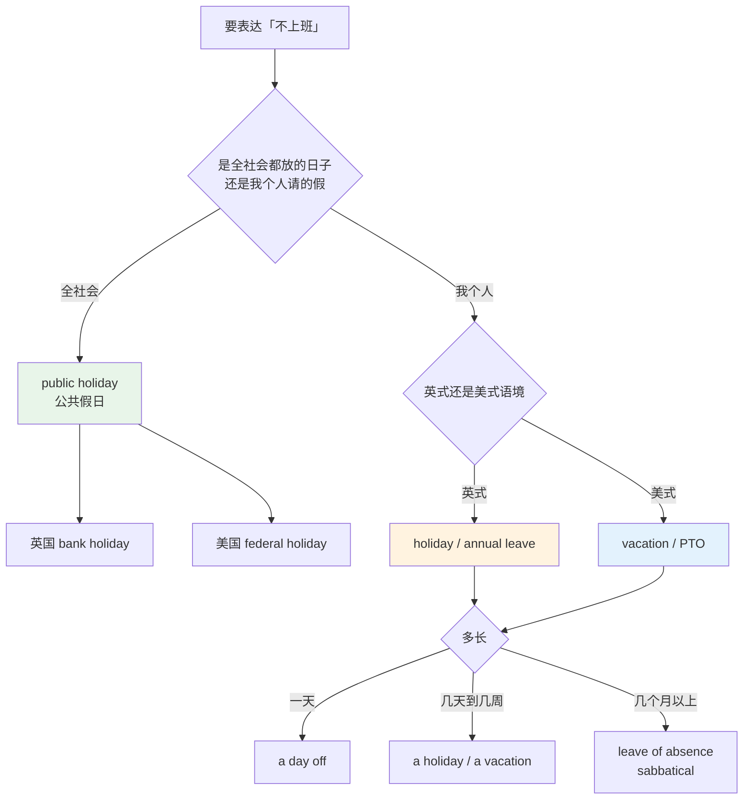
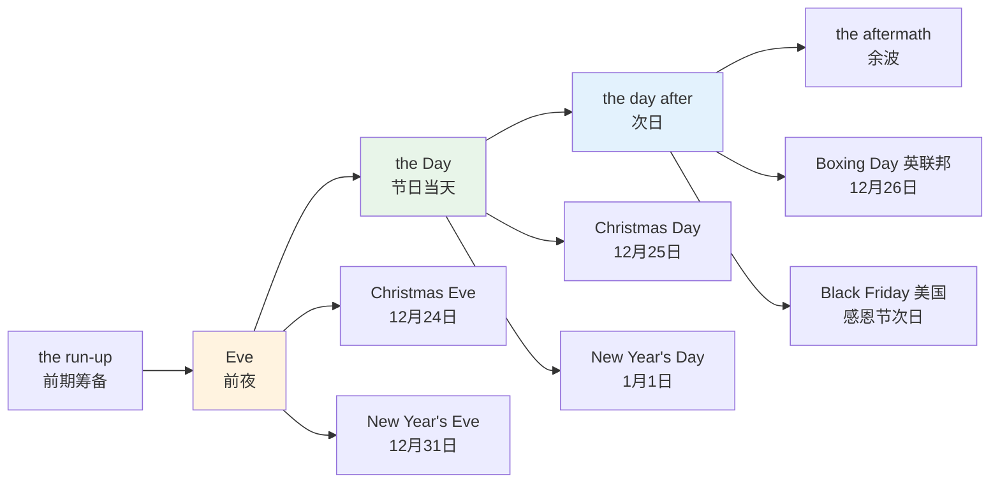
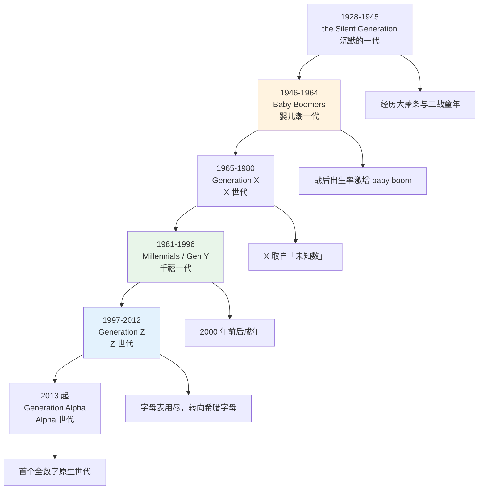
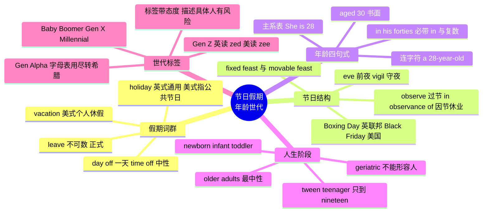

# 节日、假期、年龄与世代词汇

> [!info] 本篇定位
>
> 第 04 章的第三篇，处理日历上「被标记出来的那些天」和「被年份切开的那些人」。
>
> 前两篇讲的是刻度本身：星期月份怎么读、时段时长怎么表达。这一篇讲刻度上的记号——节日、假期、生日、世代。这些词的共同特点是中英不对齐：一个中文词往往对应英美两个不同的英文词，或者一个英文词在英美两地指完全不同的东西。
>
> 读完你能做到三件事：写请假邮件时选对 `leave` 的类型；跟英美同事聊节日时不把 `holiday` 用错地方；准确说出「他四十多岁」「她是九零后」这两句中文对应的英文，而不是逐字翻译。

---

## 1. 本篇导读：两组词，两种直译陷阱

节日和年龄看起来是两个不相干的主题，放在一篇里讲是因为它们踩的是同一个坑：**中文的构造方式在英语里没有对应件**。

第一个坑是假期。中文只有一个「假」字，前面加限定词就够了——公假、年假、病假、产假。英语没有这样一个通用词根：`holiday`、`vacation`、`leave`、`break`、`day off` 分工不同，而且分工在英国和美国还不一样。同一句「我下周休假」，英国人说 `I'm on holiday next week`，美国人说 `I'm on vacation next week`；反过来美国人说 `holiday` 时，指的多半是圣诞节这类公共节日，不是你自己请的假。

第二个坑是年龄。中文说「三十多岁」是「三十 + 多 + 岁」，英语说的是 `in his thirties`——一个必须带 `in`、必须用所有格、必须用复数的固定结构。把它拆成 `thirty more years old` 或 `over thirty years old` 都不对。「三十多岁」和「三十岁以上」在中文里差别很小，在英语里是两个结构。

第三个坑是世代。中文用出生年代命名：八零后、九零后、零零后。英语不用年代数字，用的是一套有名字的标签：`Baby Boomer`、`Gen X`、`Millennial`、`Gen Z`。这两套体系的分界线不重合，把「九零后」翻成 `the post-90s generation` 在中文语境的英文报道里能看懂，但对英美读者来说是个需要解释的外来概念。

本篇按这三条线展开，中间插入节日通名与英美节日日历，因为「节日」是「假期」的原因，两组词在实际使用中总是缠在一起。

---

## 2. holiday 与 vacation：一个概念的英美分裂

### 2.1 分裂的实际边界

`holiday` 的本义是 `holy day`（圣日）——中世纪不干活的日子都是宗教节日。这个词在英国保留了「不上班的日子」这个宽泛义，既能指公共节日，也能指个人休假。美国英语则把这两个义项拆给了两个词：`holiday` 收缩到「公共节日」，`vacation` 接管「个人休假」。

| 场景 | 英式说法 | 美式说法 |
| --- | --- | --- |
| 我下周休年假 | I'm on **holiday** next week. | I'm on **vacation** next week. |
| 圣诞节是公共假日 | Christmas is a **bank holiday**. | Christmas is a **federal holiday**. |
| 我们去西班牙度假了 | We went on **holiday** to Spain. | We took a **vacation** in Spain. |
| 暑假 | the summer **holidays** | **summer vacation** |
| 年末假期季 | **Christmas** / the festive season | **the holidays** |
| 我攒了十天假 | ten days' **annual leave** | ten **vacation days** / ten days of **PTO** |

> [!warning] 最容易翻车的一句
>
> 美国同事说 `See you after the holidays`，指的是感恩节到元旦这段年末假期季，不是「等你休完假」。
>
> - ❌ 理解成「等你度假回来」
> - ✅ 理解成「过完年末这段节日再说」
>
> 反过来，对英国同事说 `Happy holidays` 会显得像美剧腔。英国人在十二月说的是 `Happy Christmas` 或 `Merry Christmas`，需要中性表达时说 `Season's greetings`。

### 2.2 假期词群速查

| 英文 | 英式音标 | 美式音标 | 词性 | 中文 | 搭配与说明 |
| --- | --- | --- | --- | --- | --- |
| **holiday** | /ˈhɒlədeɪ/ | /ˈhɑːlədeɪ/ | n. | 假期；节日 | 英式两义通用，美式主要指公共节日 |
| **vacation** | /vəˈkeɪʃn/ | /veɪˈkeɪʃn/ | n./v. | 假期；度假 | 美式个人休假默认词，英美重音不同 |
| **break** | /breɪk/ | /breɪk/ | n. | 短假；间歇 | spring break，coffee break |
| **leave** | /liːv/ | /liːv/ | n. | 休假（正式） | 不可数，on leave，见第 3 节 |
| **recess** | /rɪˈses/ | /ˈriːses/ | n. | 休会；课间休息 | 名词重音英后美前，是常考差异 |
| **furlough** | /ˈfɜːləʊ/ | /ˈfɜːrloʊ/ | n./v. | 停薪留职；强制休假 | 企业裁员前的临时停工安排 |
| **sabbatical** | /səˈbætɪkl/ | /səˈbætɪkl/ | n. | 学术休假 | on sabbatical，源自 Sabbath |
| **staycation** | /steɪˈkeɪʃn/ | /steɪˈkeɪʃn/ | n. | 居家度假 | stay 与 vacation 的混成词 |
| **getaway** | /ˈɡetəweɪ/ | /ˈɡetəweɪ/ | n. | 短途出游 | a weekend getaway |
| **excursion** | /ɪkˈskɜːʃn/ | /ɪkˈskɜːrʒn/ | n. | 短途旅行 | 英美辅音不同，/ʃ/ 对 /ʒ/ |
| **outing** | /ˈaʊtɪŋ/ | /ˈaʊtɪŋ/ | n. | 郊游 | a family outing |
| **retreat** | /rɪˈtriːt/ | /rɪˈtriːt/ | n. | 静修；封闭活动 | a company retreat 公司团建 |
| **honeymoon** | /ˈhʌnimuːn/ | /ˈhʌnimuːn/ | n. | 蜜月 | 英式 on honeymoon，美式 on a honeymoon |
| **bank holiday** | /ˌbæŋk ˈhɒlədeɪ/ | /ˌbæŋk ˈhɑːlədeɪ/ | n. | 法定假日 | 英国专称，源自银行歇业 |
| **public holiday** | /ˌpʌblɪk ˈhɒlədeɪ/ | /ˌpʌblɪk ˈhɑːlədeɪ/ | n. | 公共假日 | 国际场合最中性的说法 |
| **federal holiday** | /ˌfedərəl ˈhɒlədeɪ/ | /ˌfedərəl ˈhɑːlədeɪ/ | n. | 联邦假日 | 美国专称，各州另有 state holiday |
| **statutory** | /ˈstætʃətri/ | /ˈstætʃətɔːri/ | adj. | 法定的 | statutory holiday，statutory leave |
| **long weekend** | /ˌlɒŋ ˈwiːkend/ | /ˌlɔːŋ ˈwiːkend/ | n. | 三天连休 | 假日与周末相连形成 |
| **half-term** | /ˌhɑːf ˈtɜːm/ | /ˌhæf ˈtɜːrm/ | n. | 期中假 | 英国中小学学期中的一周假 |
| **day off** | /ˌdeɪ ˈɒf/ | /ˌdeɪ ˈɔːf/ | n. | 休息日 | 复数是 days off，不是 day offs |
| **time off** | /ˌtaɪm ˈɒf/ | /ˌtaɪm ˈɔːf/ | n. | 不上班的时间 | 不可数，PTO 即 paid time off |
| **gap year** | /ˈɡæp jɪə/ | /ˈɡæp jɪr/ | n. | 间隔年 | 升学或就业前空出的一年 |

### 2.3 选词决策图

上图把选词拆成三个判断。第一个判断是「全社会还是我个人」——这一步决定了要不要用 `holiday` 的公共义。第二个判断是语域来源，英式默认 `holiday`，美式默认 `vacation`。第三个判断是长度，一天用 `day off`，几天到几周用主词，几个月以上就得换成正式的 `leave of absence` 或学术界的 `sabbatical`，因为 `vacation` 说不了三个月。

> [!tip] 写给国际团队时的安全选择
>
> 邮件收件人英美混杂时，两个词都别用，改用中性的 `time off`：`I'll be out of office / taking time off from 3 to 10 March.`
>
> `time off` 两边都通，也不带任何「度假」的联想，适合请假事由不想说明的情况。

---

## 3. leave 家族：请假的正式说法

### 3.1 leave 为什么不可数

`leave` 作「休假」讲时是不可数名词，指的是「被批准离开岗位的额度」这个抽象概念，不是一次次具体的假期。

> - I have twelve days of annual **leave** left.
>   - 我还剩十二天年假。
> - She's on maternity **leave** until September.
>   - 她休产假到九月。
> - He applied for a **leave** of absence.
>   - 他申请了停职。（这里 leave of absence 整体是可数的，指一次具体的申请）

- ❌ ~~I have three leaves this month.~~
- ✅ I have three **days of leave** this month.
- ✅ I have three **days off** this month.

`leaves` 只有「树叶」的意思，或者是动词 `leave` 的第三人称单数。写成 `three leaves` 会被读成「三片叶子」。

### 3.2 leave 家族速查

| 英文 | 英式音标 | 美式音标 | 词性 | 中文 | 搭配与说明 |
| --- | --- | --- | --- | --- | --- |
| **annual leave** | /ˌænjuəl ˈliːv/ | /ˌænjuəl ˈliːv/ | n. | 年假 | 英式职场默认词，美式说 vacation days |
| **paid leave** | /ˌpeɪd ˈliːv/ | /ˌpeɪd ˈliːv/ | n. | 带薪假 | 对应 unpaid leave |
| **unpaid leave** | /ˌʌnpeɪd ˈliːv/ | /ˌʌnpeɪd ˈliːv/ | n. | 无薪假 | 额度用完后的选项 |
| **sick leave** | /ˈsɪk liːv/ | /ˈsɪk liːv/ | n. | 病假 | on sick leave 表示正在休 |
| **sick day** | /ˈsɪk deɪ/ | /ˈsɪk deɪ/ | n. | 病假日 | 美式口语，take a sick day |
| **maternity leave** | /məˈtɜːnəti liːv/ | /məˈtɜːrnəti liːv/ | n. | 产假 | 母亲一方，词根 matern 母 |
| **paternity leave** | /pəˈtɜːnəti liːv/ | /pəˈtɜːrnəti liːv/ | n. | 陪产假 | 父亲一方，词根 patern 父 |
| **parental leave** | /pəˈrentl liːv/ | /pəˈrentl liːv/ | n. | 育儿假 | 中性，不区分父母，政策文件常用 |
| **compassionate leave** | /kəmˈpæʃənət liːv/ | /kəmˈpæʃənət liːv/ | n. | 事假 | 家属重病或身故，英式常用 |
| **bereavement leave** | /bɪˈriːvmənt liːv/ | /bɪˈriːvmənt liːv/ | n. | 丧假 | 美式常用，比上一条指向更明确 |
| **garden leave** | /ˈɡɑːdn liːv/ | /ˈɡɑːrdn liːv/ | n. | 花园假 | 离职通知期内带薪不上班，英式 |
| **leave of absence** | /ˌliːv əv ˈæbsəns/ | /ˌliːv əv ˈæbsəns/ | n. | 停职；长假 | 正式，通常数月以上 |
| **absence** | /ˈæbsəns/ | /ˈæbsəns/ | n. | 缺勤 | in my absence 我不在时 |
| **absentee** | /ˌæbsənˈtiː/ | /ˌæbsənˈtiː/ | n. | 缺勤者 | absenteeism 指旷工率 |
| **entitlement** | /ɪnˈtaɪtlmənt/ | /ɪnˈtaɪtlmənt/ | n. | 应享额度 | your holiday entitlement 你的假期额度 |
| **accrue** | /əˈkruː/ | /əˈkruː/ | v. | 累积 | Leave accrues monthly. 假按月累积 |
| **carry over** | /ˌkæri ˈəʊvə/ | /ˌkæri ˈoʊvər/ | v. | 结转 | carry over unused leave 把没休的假转到下年 |
| **roster** | /ˈrɒstə/ | /ˈrɑːstər/ | n. | 值班表 | 美式常用 |
| **rota** | /ˈrəʊtə/ | /ˈroʊtə/ | n. | 轮值表 | 英式专用，美国人多半不认识 |
| **cover** | /ˈkʌvə/ | /ˈkʌvər/ | n./v. | 代班 | arrange cover 安排人顶班 |
| **secondment** | /sɪˈkɒndmənt/ | /sɪˈkɑːndmənt/ | n. | 借调 | 英式，美式多说 detail 或 assignment |
| **out of office** | /ˌaʊt əv ˈɒfɪs/ | /ˌaʊt əv ˈɔːfɪs/ | phr. | 不在办公室 | 自动回复缩写 OOO |

### 3.3 请假邮件的三种语域

> [!example] 同一件事的三级说法
>
> - 口语，跟同组同事说：
>   - I'm **taking Friday off**. 我周五休一天。
> - 中性书面，发给团队：
>   - I'll be **on leave** from 3 to 7 March and back on the 10th.
>   - 我三月三号到七号休假，十号回来。
> - 正式，提交给人事：
>   - I would like to request five days of **annual leave** from 3 March, in accordance with my remaining **entitlement**.
>   - 我申请从三月三日起休五天年假，在我剩余额度之内。

三句话的区别不在信息量，在语域。第一句用短语动词 `take ... off`，是典型的日耳曼层口语；第三句用 `request`、`in accordance with`、`entitlement`，是拉丁层的公文语气。把第三句发给同组同事会显得生分，把第一句写进人事系统会显得不正式。这条语域梯度的原理在 [[01.词汇入门与学习方法/01.英语词汇的来源、分层与学习地图\|英语词汇的来源、分层与学习地图]] 里讲过。

> [!warning] furlough 不等于 vacation
>
> `furlough` 是雇主单方面决定的强制停工，通常不带薪或减薪，员工没得选。翻成「休假」会丢掉最关键的信息。
>
> - ❌ 把 `10,000 workers were furloughed` 理解成「一万名员工放假了」
> - ✅ 理解成「一万名员工被强制停工」，这是裁员的前一步

---

## 4. 节日的通名词群

### 4.1 festival、feast 与 holiday 的分工

中文的「节」在英语里至少对应四个词，选哪个取决于这个日子的性质。

| 中文的「节」 | 英文 | 判据 |
| --- | --- | --- |
| 春节、中秋节、音乐节 | **festival** | 有持续几天的庆祝活动，可以是宗教的也可以是世俗的 |
| 教会日历上的节日 | **feast** | 宗教语域，feast day 是圣人纪念日 |
| 国庆节、劳动节 | **holiday** | 强调「这天不上班」这个法律属性 |
| 教师节、护士节 | **day** | 只是一个被命名的日子，不放假 |

`Teachers' Day` 不能说成 `Teachers' Festival`，因为它没有庆祝活动，只是一个名号。反过来 `the Spring Festival` 不能只说 `the Spring Holiday`，因为春节的核心不是放假而是一整套习俗。

### 4.2 通名词群速查

| 英文 | 英式音标 | 美式音标 | 词性 | 中文 | 搭配与说明 |
| --- | --- | --- | --- | --- | --- |
| **festival** | /ˈfestɪvl/ | /ˈfestɪvl/ | n. | 节日；节庆 | 中国传统节日英译多用此词 |
| **feast** | /fiːst/ | /fiːst/ | n. | 盛宴；宗教节日 | feast day 教会纪念日 |
| **fete** | /feɪt/ | /feɪt/ | n. | 义卖游园会 | 英式，也拼作 fête |
| **carnival** | /ˈkɑːnɪvl/ | /ˈkɑːrnɪvl/ | n. | 狂欢节 | 四旬期前的狂欢，词源「告别肉食」 |
| **parade** | /pəˈreɪd/ | /pəˈreɪd/ | n./v. | 游行 | a Thanksgiving parade |
| **pageant** | /ˈpædʒənt/ | /ˈpædʒənt/ | n. | 庆典表演 | 重音在前，不读 /peɪ-/ |
| **celebration** | /ˌselɪˈbreɪʃn/ | /ˌselɪˈbreɪʃn/ | n. | 庆祝 | in celebration of 为庆祝 |
| **commemorate** | /kəˈmeməreɪt/ | /kəˈmeməreɪt/ | v. | 纪念 | 用于严肃的纪念，不用于生日 |
| **commemoration** | /kəˌmeməˈreɪʃn/ | /kəˌmeməˈreɪʃn/ | n. | 纪念活动 | in commemoration of |
| **observance** | /əbˈzɜːvəns/ | /əbˈzɜːrvəns/ | n. | 节日的遵行 | religious observance 宗教节期活动 |
| **observe** | /əbˈzɜːv/ | /əbˈzɜːrv/ | v. | 过节；守（斋） | We don't observe Halloween. |
| **ceremony** | /ˈserəməni/ | /ˈserəmoʊni/ | n. | 仪式 | 英美后半段元音差别明显 |
| **ritual** | /ˈrɪtʃuəl/ | /ˈrɪtʃuəl/ | n./adj. | 仪式；例行的 | 也可贬义指走过场 |
| **custom** | /ˈkʌstəm/ | /ˈkʌstəm/ | n. | 习俗 | 复数 customs 另有海关义 |
| **tradition** | /trəˈdɪʃn/ | /trəˈdɪʃn/ | n. | 传统 | by tradition 按传统 |
| **anniversary** | /ˌænɪˈvɜːsəri/ | /ˌænɪˈvɜːrsəri/ | n. | 周年纪念 | 不能指个人生日，见 4.4 |
| **jubilee** | /ˈdʒuːbɪliː/ | /ˈdʒuːbɪliː/ | n. | 大庆 | silver 25 年，golden 50 年 |
| **solstice** | /ˈsɒlstɪs/ | /ˈsɑːlstɪs/ | n. | 至日 | summer solstice 夏至 |
| **equinox** | /ˈekwɪnɒks/ | /ˈiːkwɪnɑːks/ | n. | 分日 | 首音节英美常读法不同 |
| **greeting** | /ˈɡriːtɪŋ/ | /ˈɡriːtɪŋ/ | n. | 问候语 | Season's greetings 节日问候 |
| **decoration** | /ˌdekəˈreɪʃn/ | /ˌdekəˈreɪʃn/ | n. | 装饰 | Christmas decorations |
| **fireworks** | /ˈfaɪəwɜːks/ | /ˈfaɪərwɜːrks/ | n. | 烟花 | 常用复数，单数指一枚烟花 |

### 4.3 observe 与 observance 的双重身份

`observe` 是这组词里最容易漏的一个，因为它的日常义是「观察」，节日义在中文里没有对应词。

> - Not everyone in the office **observes** Christmas.
>   - 办公室里不是每个人都过圣诞节。
> - The bank will be closed in **observance** of Memorial Day.
>   - 银行将因阵亡将士纪念日休业。
> - Muslims **observe** a fast during Ramadan.
>   - 穆斯林在斋月期间守斋。

三句里的 `observe` 都不是「观察」，而是「遵行、守」。银行公告和政府通知里的 `in observance of` 是固定搭配，等于「为遵行……而」。看到这个短语要直接读成「因为某节日」，不要拆开硬译。

美国日历上还有一个相关缩写：`(observed)`。当法定假日落在周末时，实际放假日会挪到就近的工作日，日历上标 `July 4 (observed)`，意思是「观察日」而非节日本身。

### 4.4 anniversary 不是生日

> [!warning] 中文母语者的高频错误
>
> `anniversary` 指的是某件事发生若干年后的同一天，用于结婚、公司成立、事件发生，**不用于人的出生**。
>
> - ❌ ~~Happy anniversary!~~（对着过生日的人说）
> - ✅ **Happy birthday!**
> - ✅ Happy **anniversary**!（对结婚纪念日的夫妻说）
>
> 说人的话只有一个例外：`the anniversary of someone's death`（某人的忌日）。活着的人过的是 birthday。

`jubilee` 是 `anniversary` 的隆重版本，只用于重大周年，尤其是君主在位周年和机构大庆。英国王室的用法给了一张现成的对照表。

| 年数 | 英文 | 中文 |
| --- | --- | --- |
| 25 | **silver jubilee** | 银禧 |
| 40 | **ruby jubilee** | 红宝石禧 |
| 50 | **golden jubilee** | 金禧 |
| 60 | **diamond jubilee** | 钻禧 |
| 70 | **platinum jubilee** | 白金禧 |

个人结婚纪念日用的是同一套宝石命名，但说的是 `silver wedding anniversary`（银婚），不说 `silver jubilee`。

---

## 5. eve、vigil 与节日的前后

### 5.1 一个节日在英语里有三段

中文说「除夕」「大年初一」，是两个独立的日子名。英语的处理方式不同：它用 `eve`（前夜）、节日本名、以及 `Boxing Day` 这类专名，把一个节期切成前后相连的几段。

上图给出的是英语节期的完整时间结构。最容易出问题的是「次日」这一段：英联邦国家有 `Boxing Day` 且是法定假日，美国没有这个词；美国有 `Black Friday` 且已经成为全球购物节，但它不是法定假日。两边的日历在这一格上完全不重合，这是英美节日差异里最实际的一条。

`eve` 本身不限于节日，它可以泛指任何重大事件的前夕：`on the eve of the election`（大选前夕）、`on the eve of the merger`（合并前夕）。这个比喻用法在新闻英语里很常见。

### 5.2 前后词群速查

| 英文 | 英式音标 | 美式音标 | 词性 | 中文 | 搭配与说明 |
| --- | --- | --- | --- | --- | --- |
| **eve** | /iːv/ | /iːv/ | n. | 前夜；前夕 | 可比喻，on the eve of |
| **vigil** | /ˈvɪdʒɪl/ | /ˈvɪdʒɪl/ | n. | 守夜 | 宗教守夜或哀悼守夜 |
| **watch night** | /ˈwɒtʃ naɪt/ | /ˈwɑːtʃ naɪt/ | n. | 除夕守夜礼拜 | 教会用语 |
| **midnight** | /ˈmɪdnaɪt/ | /ˈmɪdnaɪt/ | n. | 午夜 | 节日的切换点 |
| **countdown** | /ˈkaʊntdaʊn/ | /ˈkaʊntdaʊn/ | n. | 倒计时 | the countdown to midnight |
| **run-up** | /ˈrʌn ʌp/ | /ˈrʌn ʌp/ | n. | 前期阶段 | the run-up to Christmas，英式 |
| **lead-up** | /ˈliːd ʌp/ | /ˈliːd ʌp/ | n. | 前期阶段 | 美式更常用，含义同上 |
| **aftermath** | /ˈɑːftəmæθ/ | /ˈæftərmæθ/ | n. | 之后的时期 | 语感偏负面，多用于灾难 |
| **Boxing Day** | /ˈbɒksɪŋ deɪ/ | /ˈbɑːksɪŋ deɪ/ | n. | 节礼日 | 12月26日，英联邦有美国没有 |
| **holy day** | /ˈhəʊli deɪ/ | /ˈhoʊli deɪ/ | n. | 圣日 | holiday 的词源，两词已分家 |
| **observed** | /əbˈzɜːvd/ | /əbˈzɜːrvd/ | adj. | 顺延观察日 | 美国日历写作 July 4 (observed) |
| **eve of** | /ˈiːv əv/ | /ˈiːv əv/ | phr. | 在……前夕 | 后接事件名，不接日期 |

> [!tip] Boxing Day 跟拳击无关
>
> 名字来自 `Christmas box`——旧时雇主在圣诞次日给仆人和送货人的赏钱盒。词里的 box 是「盒子」，不是「拳击」。
>
> 这个日子在英国、爱尔兰、澳大利亚、新西兰、加拿大都是法定假日，也是英国的传统购物打折日。美国没有这个概念，对美国同事提 Boxing Day 需要解释。

---

## 6. 英国节日日历

### 6.1 一年的骨架

英国的公共假日叫 `bank holiday`，数量不多，集中在年初、复活节、五月和年末。除法定假日外，还有一批不放假但全民参与的日子，比如 `Bonfire Night`。

| 英文 | 英式音标 | 美式音标 | 词性 | 中文 | 搭配与说明 |
| --- | --- | --- | --- | --- | --- |
| **New Year's Day** | /ˌnjuː jɪəz ˈdeɪ/ | /ˌnuː jɪrz ˈdeɪ/ | n. | 元旦 | 1月1日，法定假日 |
| **New Year's Eve** | /ˌnjuː jɪəz ˈiːv/ | /ˌnuː jɪrz ˈiːv/ | n. | 跨年夜 | 12月31日 |
| **Hogmanay** | /ˌhɒɡməˈneɪ/ | /ˌhɑːɡməˈneɪ/ | n. | 苏格兰跨年 | 苏格兰规模超过圣诞的庆典 |
| **Burns Night** | /ˈbɜːnz naɪt/ | /ˈbɜːrnz naɪt/ | n. | 彭斯之夜 | 1月25日，苏格兰纪念诗人 |
| **Epiphany** | /ɪˈpɪfəni/ | /ɪˈpɪfəni/ | n. | 主显节 | 1月6日，圣诞第十二天 |
| **Valentine's Day** | /ˈvæləntaɪnz deɪ/ | /ˈvæləntaɪnz deɪ/ | n. | 情人节 | 2月14日，英美同 |
| **Shrove Tuesday** | /ˌʃrəʊv ˈtjuːzdeɪ/ | /ˌʃroʊv ˈtuːzdeɪ/ | n. | 忏悔星期二 | 俗称 Pancake Day |
| **Ash Wednesday** | /ˌæʃ ˈwenzdeɪ/ | /ˌæʃ ˈwenzdeɪ/ | n. | 圣灰星期三 | 四旬期首日 |
| **Lent** | /lent/ | /lent/ | n. | 四旬期 | 复活节前四十天斋期 |
| **Mothering Sunday** | /ˌmʌðərɪŋ ˈsʌndeɪ/ | /ˌmʌðərɪŋ ˈsʌndeɪ/ | n. | 母亲节 | 英国在四旬期第四个周日，与美国不同日 |
| **St Patrick's Day** | /snt ˈpætrɪks deɪ/ | /seɪnt ˈpætrɪks deɪ/ | n. | 圣帕特里克节 | 3月17日；英式 St 读弱化音 |
| **April Fools' Day** | /ˌeɪprəl ˈfuːlz deɪ/ | /ˌeɪprəl ˈfuːlz deɪ/ | n. | 愚人节 | 4月1日；英式恶作剧只到正午 |
| **Good Friday** | /ˌɡʊd ˈfraɪdeɪ/ | /ˌɡʊd ˈfraɪdeɪ/ | n. | 耶稣受难日 | 复活节前的周五，法定假日 |
| **Easter** | /ˈiːstə/ | /ˈiːstər/ | n. | 复活节 | 日期浮动，见第 8 节 |
| **Easter Monday** | /ˌiːstə ˈmʌndeɪ/ | /ˌiːstər ˈmʌndeɪ/ | n. | 复活节后周一 | 英国法定假日，美国不放 |
| **May Day** | /ˈmeɪ deɪ/ | /ˈmeɪ deɪ/ | n. | 五一 | 与求救信号 mayday 拼法相近但无关 |
| **Spring Bank Holiday** | /ˌsprɪŋ ˈbæŋk hɒlədeɪ/ | /ˌsprɪŋ ˈbæŋk hɑːlədeɪ/ | n. | 春季银行假日 | 五月最后一个周一 |
| **Halloween** | /ˌhæləʊˈiːn/ | /ˌhæloʊˈiːn/ | n. | 万圣夜 | 10月31日；重音在末音节 |
| **Guy Fawkes Night** | /ˌɡaɪ ˈfɔːks naɪt/ | /ˌɡaɪ ˈfɔːks naɪt/ | n. | 盖伊福克斯之夜 | 11月5日，不放假但全民放烟花 |
| **Bonfire Night** | /ˈbɒnfaɪə naɪt/ | /ˈbɑːnfaɪər naɪt/ | n. | 篝火之夜 | 同上，更口语的叫法 |
| **Remembrance Day** | /rɪˈmembrəns deɪ/ | /rɪˈmembrəns deɪ/ | n. | 阵亡将士纪念日 | 11月11日，戴虞美人胸花 |
| **Remembrance Sunday** | /rɪˌmembrəns ˈsʌndeɪ/ | /rɪˌmembrəns ˈsʌndeɪ/ | n. | 纪念主日 | 最接近11月11日的那个周日 |
| **poppy** | /ˈpɒpi/ | /ˈpɑːpi/ | n. | 虞美人花 | 纪念日的标志物 |
| **Advent** | /ˈædvent/ | /ˈædvent/ | n. | 将临期 | advent calendar 降临日历 |
| **Christmas Eve** | /ˌkrɪsməs ˈiːv/ | /ˌkrɪsməs ˈiːv/ | n. | 平安夜 | 12月24日 |
| **Christmas** | /ˈkrɪsməs/ | /ˈkrɪsməs/ | n. | 圣诞节 | 中间的 t 不发音 |

### 6.2 三个发音陷阱

**Christmas 的 t 不发音。** 读作 /ˈkrɪsməs/，不是 /ˈkrɪstməs/。同类的还有 `often` 的 t（英美都可省）、`listen` 的 t（必须省）、`castle` 的 t（必须省）。

**Halloween 的重音在最后一个音节。** /ˌhæləʊˈiːn/，不是 /ˈhæləʊiːn/。这个词是 `All Hallows' Even` 的缩合，重音落在原来的 `Even` 上。中文母语者容易按中文「万圣节」的节奏读成前重，听起来会很明显。

**St 在英式里读弱化音。** `St Patrick's` 英式读 /snt ˈpætrɪks/，`St Paul's` 读 /snt ˈpɔːlz/，那个 St 几乎只剩一个鼻音。美式则读足 /seɪnt/。这不是随便读读的差别，是两地稳定的习惯。

> [!warning] Halloween 的归属误解
>
> Halloween 起源于爱尔兰和苏格兰的凯尔特传统，但今天的形态（南瓜灯、trick-or-treat、成人化装派对）是在美国定型后再输出回英国的。
>
> 因此它同时出现在英国和美国的节日表里。在英国它不放假、规模小；在美国它是仅次于圣诞的消费节日。

---

## 7. 美国节日日历

### 7.1 联邦假日与全民节日

美国的法定假日叫 `federal holiday`，联邦层面十一个。除此之外还有一批不放假但全民参与的日子，比如 `Halloween` 和 `Super Bowl Sunday`。

| 英文 | 英式音标 | 美式音标 | 词性 | 中文 | 搭配与说明 |
| --- | --- | --- | --- | --- | --- |
| **Martin Luther King Day** | /ˌmɑːtɪn ˈluːθə kɪŋ deɪ/ | /ˌmɑːrtɪn ˈluːθər kɪŋ deɪ/ | n. | 马丁路德金日 | 一月第三个周一；全称带 Jr.，口语说 MLK Day |
| **Groundhog Day** | /ˈɡraʊndhɒɡ deɪ/ | /ˈɡraʊndhɑːɡ deɪ/ | n. | 土拨鼠日 | 2月2日；引申指日复一日的重复 |
| **Presidents' Day** | /ˈprezɪdənts deɪ/ | /ˈprezɪdənts deɪ/ | n. | 总统日 | 二月第三个周一 |
| **Memorial Day** | /məˈmɔːriəl deɪ/ | /məˈmɔːriəl deɪ/ | n. | 阵亡将士纪念日 | 五月最后一个周一，夏季的非正式开端 |
| **Juneteenth** | /ˌdʒuːnˈtiːnθ/ | /ˌdʒuːnˈtiːnθ/ | n. | 六月节 | 6月19日，纪念奴隶解放，2021年入联邦假日 |
| **Independence Day** | /ˌɪndɪˈpendəns deɪ/ | /ˌɪndɪˈpendəns deɪ/ | n. | 独立日 | 7月4日，口语多说 the Fourth of July |
| **Labor Day** | /ˈleɪbə deɪ/ | /ˈleɪbər deɪ/ | n. | 劳动节 | 九月第一个周一；英式拼 Labour |
| **Columbus Day** | /kəˈlʌmbəs deɪ/ | /kəˈlʌmbəs deɪ/ | n. | 哥伦布日 | 十月第二个周一，部分州已改名 |
| **Indigenous Peoples' Day** | /ɪnˌdɪdʒənəs ˈpiːplz deɪ/ | /ɪnˌdɪdʒənəs ˈpiːplz deɪ/ | n. | 原住民日 | 替代上一条的名称，同一天 |
| **Veterans Day** | /ˈvetərənz deɪ/ | /ˈvetərənz deɪ/ | n. | 退伍军人节 | 11月11日，对应英国 Remembrance Day |
| **Thanksgiving** | /ˌθæŋksˈɡɪvɪŋ/ | /ˌθæŋksˈɡɪvɪŋ/ | n. | 感恩节 | 十一月第四个周四 |
| **Black Friday** | /ˌblæk ˈfraɪdeɪ/ | /ˌblæk ˈfraɪdeɪ/ | n. | 黑色星期五 | 感恩节次日，不放假但普遍不上班 |
| **Cyber Monday** | /ˌsaɪbə ˈmʌndeɪ/ | /ˌsaɪbər ˈmʌndeɪ/ | n. | 网络星期一 | 感恩节后的周一 |
| **Super Bowl Sunday** | /ˌsuːpə bəʊl ˈsʌndeɪ/ | /ˌsuːpər boʊl ˈsʌndeɪ/ | n. | 超级碗周日 | 二月初，非法定但收视全国最高 |
| **Election Day** | /ɪˈlekʃn deɪ/ | /ɪˈlekʃn deɪ/ | n. | 选举日 | 十一月第一个周二 |
| **Tax Day** | /ˈtæks deɪ/ | /ˈtæks deɪ/ | n. | 报税截止日 | 通常在4月15日前后 |
| **Mother's Day** | /ˈmʌðəz deɪ/ | /ˈmʌðərz deɪ/ | n. | 母亲节 | 五月第二个周日 |
| **Father's Day** | /ˈfɑːðəz deɪ/ | /ˈfɑːðərz deɪ/ | n. | 父亲节 | 六月第三个周日 |
| **the holidays** | /ðə ˈhɒlədeɪz/ | /ðə ˈhɑːlədeɪz/ | n. | 年末假期季 | 美式特指感恩节到元旦这段 |
| **Happy holidays** | /ˌhæpi ˈhɒlədeɪz/ | /ˌhæpi ˈhɑːlədeɪz/ | phr. | 节日快乐 | 美式不预设宗教的通用祝福 |
| **holiday season** | /ˈhɒlədeɪ siːzn/ | /ˈhɑːlədeɪ siːzn/ | n. | 节日季 | 商业语境的常用表达 |
| **festive season** | /ˈfestɪv siːzn/ | /ˈfestɪv siːzn/ | n. | 节庆季 | 英式对应说法 |

### 7.2 「第几个星期几」这个日期结构

美国假日大量使用「某月第几个星期几」而不是固定日期，这个结构在英文里有固定说法，必须整体记住。

> - Thanksgiving falls on **the fourth Thursday in November**.
>   - 感恩节在十一月的第四个星期四。
> - Labor Day is **the first Monday in September**.
>   - 劳动节是九月的第一个星期一。
> - Memorial Day is **the last Monday in May**.
>   - 阵亡将士纪念日是五月的最后一个星期一。

结构是「the + 序数词 + 星期几 + in + 月份」。两个细节：序数词前必须有 `the`；「最后一个」用 `the last`，不用序数词。

- ❌ ~~fourth Thursday in November~~（漏 the）
- ❌ ~~the four Thursday in November~~（要序数词不要基数词）
- ✅ **the fourth Thursday in November**

介词 `in` 和 `of` 在这个结构里都能用：`the fourth Thursday in November` 和 `the fourth Thursday of November` 都是地道英语，前者在英式里稍多，后者在美式官方文本里更常见。真正会出错的是漏掉 `the`，或者把序数词写成基数词。

### 7.3 Groundhog Day 的比喻义

`Groundhog Day` 因为 1993 年的同名电影，在英语里获得了一个固定的比喻义：**每天重复同一件事、毫无进展的状态**。这个用法在职场英语里出现频率很高，跟土拨鼠已经没有关系。

> - Every stand-up feels like **Groundhog Day**: same blockers, same excuses.
>   - 每次站会都像在过同一天，同样的阻塞项，同样的借口。

类似的从节日衍生出比喻义的还有 `Black Friday`（本义是感恩节后购物日，也可指股市暴跌的某个星期五）和 `carnival`（可指乱哄哄的场面）。

---

## 8. 宗教节日与移动日期

### 8.1 固定节日与移动节日

英语区分 `fixed feast` 和 `movable feast`：前者日期固定，后者按月相或另一套历法推算，每年在公历上落点不同。

| 类型 | 英文 | 代表 | 推算方式 |
| --- | --- | --- | --- |
| 固定 | **fixed feast** | Christmas 12月25日 | 公历固定日期 |
| 移动 | **movable feast** | Easter | 春分后第一个满月之后的第一个星期日 |
| 移动 | **movable feast** | Ramadan | 纯阴历，每年在公历上提前约十一天 |
| 移动 | **movable feast** | Spring Festival | 阴阳合历，落在公历一月下旬到二月中旬 |

`movable feast` 本身也有比喻义，指「日期总在变的活动」：`Our team offsite has become a movable feast.`（我们的团队外出活动日期总在改。）

### 8.2 宗教与外来节日速查

| 英文 | 英式音标 | 美式音标 | 词性 | 中文 | 搭配与说明 |
| --- | --- | --- | --- | --- | --- |
| **Passover** | /ˈpɑːsəʊvə/ | /ˈpæsoʊvər/ | n. | 逾越节 | 犹太教，春季 |
| **Hanukkah** | /ˈhɑːnəkə/ | /ˈhɑːnəkə/ | n. | 光明节 | 也拼 Chanukah，八天 |
| **Rosh Hashanah** | /ˌrɒʃ həˈʃɑːnə/ | /ˌrɑːʃ həˈʃɑːnə/ | n. | 犹太新年 | 秋季 |
| **Yom Kippur** | /ˌjɒm kɪˈpʊə/ | /ˌjoʊm kɪˈpʊr/ | n. | 赎罪日 | 犹太历最重要的斋日 |
| **bar mitzvah** | /ˌbɑː ˈmɪtsvə/ | /ˌbɑːr ˈmɪtsvə/ | n. | 男孩成年礼 | 13岁；女孩的是 bat mitzvah |
| **Ramadan** | /ˌræməˈdɑːn/ | /ˈrɑːmədɑːn/ | n. | 斋月 | 伊斯兰历第九月，英美重音不同 |
| **Eid** | /iːd/ | /iːd/ | n. | 开斋节 | 全称 Eid al-Fitr |
| **fast** | /fɑːst/ | /fæst/ | n./v. | 斋戒 | break one's fast 开斋 |
| **Diwali** | /dɪˈwɑːli/ | /dɪˈwɑːli/ | n. | 排灯节 | 印度教，秋季 |
| **Lunar New Year** | /ˌluːnə njuː ˈjɪə/ | /ˌluːnər nuː ˈjɪr/ | n. | 农历新年 | 国际场合比 Chinese New Year 更中性 |
| **Spring Festival** | /ˌsprɪŋ ˈfestɪvl/ | /ˌsprɪŋ ˈfestɪvl/ | n. | 春节 | 中国官方英译 |
| **Lantern Festival** | /ˈlæntən festɪvl/ | /ˈlæntərn festɪvl/ | n. | 元宵节 | 正月十五 |
| **Tomb-Sweeping Day** | /ˈtuːm swiːpɪŋ deɪ/ | /ˈtuːm swiːpɪŋ deɪ/ | n. | 清明节 | 也说 Qingming Festival |
| **Dragon Boat Festival** | /ˈdræɡən bəʊt festɪvl/ | /ˈdræɡən boʊt festɪvl/ | n. | 端午节 | 五月初五 |
| **Mid-Autumn Festival** | /ˌmɪd ˈɔːtəm festɪvl/ | /ˌmɪd ˈɑːtəm festɪvl/ | n. | 中秋节 | 八月十五 |
| **movable feast** | /ˌmuːvəbl ˈfiːst/ | /ˌmuːvəbl ˈfiːst/ | n. | 移动节日 | 日期每年变化的节日 |
| **fixed feast** | /ˌfɪkst ˈfiːst/ | /ˌfɪkst ˈfiːst/ | n. | 固定节日 | 日期不变的节日 |
| **lunisolar** | /ˌluːnɪˈsəʊlə/ | /ˌluːnɪˈsoʊlər/ | adj. | 阴阳历的 | 中国农历属于这一类 |

### 8.3 跟外国同事介绍中国节日

> [!example] 三种介绍精度
>
> - 最简：It's **the Lunar New Year**, the biggest holiday of the year in China.
>   - 这是农历新年，中国一年里最大的节日。
> - 中等：**Mid-Autumn Festival** falls on the fifteenth day of the eighth **lunar** month, usually in September.
>   - 中秋节在农历八月十五，通常落在九月。
> - 详细：**Tomb-Sweeping Day** is when families visit ancestors' graves. It's a **fixed** date on the solar calendar, around 4 or 5 April, unlike most Chinese festivals, which are **lunisolar**.
>   - 清明节是家人扫墓的日子。它在公历上日期固定，四月四号或五号，跟大多数按阴阳历推算的中国节日不同。

> [!tip] Chinese New Year 与 Lunar New Year
>
> 两种说法都在用。`Chinese New Year` 历史更久、认知度更高；`Lunar New Year` 更中性，因为韩国、越南等地也过同一个节。
>
> 对纯中国语境说 `Chinese New Year` 没问题；面向多国团队时 `Lunar New Year` 更稳妥。这是语域选择，不是对错问题。

---

## 9. 年龄怎么说：四种句式

### 9.1 四个句型

英语说年龄有四种结构，语域和用途各不相同。

① **主系表**——最基础，口语书面通用。

> - She **is** twenty-eight.
>   - 她二十八岁。
> - She **is** twenty-eight **years old**.
>   - 她二十八岁。

`years old` 可以省，省掉更口语。不能只说 `She is twenty-eight years.`——要么带 `old`，要么全省。

② **连字符定语**——放在名词前作修饰语。

> - a **twenty-eight-year-old** engineer
>   - 一位二十八岁的工程师
> - a **six-month-old** puppy
>   - 一只六个月大的小狗

这里的 `year` **必须单数**，因为整个短语已经被连字符捆成一个形容词。这是中文母语者错得最多的一处。

- ❌ ~~a twenty-eight-years-old engineer~~
- ✅ a **twenty-eight-year-old** engineer

`a twenty-eight-year-old` 还能单独作名词用，指「一个二十八岁的人」：`The victim was a twenty-eight-year-old.`

③ **aged + 数字**——书面、正式、新闻体。

> - Two men, **aged** 34 and 41, were arrested.
>   - 两名男子，年龄分别为三十四岁和四十一岁，被捕。
> - Children **aged** 5 to 11 are eligible.
>   - 五到十一岁的儿童符合条件。

④ **in one's + 十位数复数**——表示笼统的年龄段。

> - He's **in his forties**.
>   - 他四十多岁。
> - She's **in her early thirties**.
>   - 她三十出头。
> - They're both **in their late twenties**.
>   - 他们俩都快三十了。

结构是 `in + 所有格 + 数字的复数形式`。三个不能少的成分：介词 `in`、所有格代词、复数 `-ies`/`-s`。

- ❌ ~~He is in forties.~~（漏所有格）
- ❌ ~~He is in his forty.~~（漏复数）
- ❌ ~~He is forties.~~（漏介词）
- ✅ He is **in his forties**.

加 `early` / `mid-` / `late` 可以把十年再切成三段：`in her early forties`（四十到四十三左右）、`in her mid-forties`（四十五上下）、`in her late forties`（四十七到四十九）。

### 9.2 aged 的两种读法

> [!warning] 同一个拼写，两个音，两个意思
>
> - **aged** /eɪdʒd/，单音节，形容词，「……岁的」
>   - a boy **aged** ten 一个十岁的男孩
> - **aged** /ˈeɪdʒɪd/，两音节，形容词，「年老的」
>   - an **aged** relative 一位年迈的亲戚
>
> 两个读法不能互换。说 `a boy /ˈeɪdʒɪd/ ten` 会变成「一个年老的男孩十」，完全说不通。
>
> 同类的还有 `blessed`：/blest/ 是动词过去式，/ˈblesɪd/ 是形容词「神圣的」；`learned`：/lɜːnd/ 是「学会了」，/ˈlɜːnɪd/ 是「博学的」。

### 9.3 年龄相关词群

| 英文 | 英式音标 | 美式音标 | 词性 | 中文 | 搭配与说明 |
| --- | --- | --- | --- | --- | --- |
| **age** | /eɪdʒ/ | /eɪdʒ/ | n./v. | 年龄；变老 | at the age of 在……岁时 |
| **aged** | /eɪdʒd/ | /eɪdʒd/ | adj. | ……岁的 | 单音节，aged 30 |
| **aged** | /ˈeɪdʒɪd/ | /ˈeɪdʒɪd/ | adj. | 年老的 | 两音节，the aged 老年人 |
| **ageing** | /ˈeɪdʒɪŋ/ | /ˈeɪdʒɪŋ/ | n./adj. | 老化 | 英式拼 ageing，美式拼 aging |
| **birthday** | /ˈbɜːθdeɪ/ | /ˈbɜːrθdeɪ/ | n. | 生日 | 不能用 anniversary 替代 |
| **turn** | /tɜːn/ | /tɜːrn/ | v. | 满（多少岁） | She turns forty next month. |
| **milestone** | /ˈmaɪlstəʊn/ | /ˈmaɪlstoʊn/ | n. | 整岁生日 | a milestone birthday 逢十的生日 |
| **underage** | /ˌʌndərˈeɪdʒ/ | /ˌʌndərˈeɪdʒ/ | adj. | 未成年的 | underage drinking 未成年饮酒 |
| **of age** | /əv ˈeɪdʒ/ | /əv ˈeɪdʒ/ | phr. | 达到法定年龄 | come of age 成年 |
| **coming-of-age** | /ˌkʌmɪŋ əv ˈeɪdʒ/ | /ˌkʌmɪŋ əv ˈeɪdʒ/ | adj. | 成长题材的 | a coming-of-age novel |
| **minor** | /ˈmaɪnə/ | /ˈmaɪnər/ | n. | 未成年人 | 法律用语，对应 adult |
| **legal age** | /ˌliːɡl ˈeɪdʒ/ | /ˌliːɡl ˈeɪdʒ/ | n. | 法定年龄 | the legal drinking age |
| **age group** | /ˈeɪdʒ ɡruːp/ | /ˈeɪdʒ ɡruːp/ | n. | 年龄段 | the 18-24 age group |
| **age bracket** | /ˈeɪdʒ brækɪt/ | /ˈeɪdʒ brækɪt/ | n. | 年龄区间 | 统计与市场语域 |
| **age range** | /ˈeɪdʒ reɪndʒ/ | /ˈeɪdʒ reɪndʒ/ | n. | 年龄跨度 | a wide age range |
| **longevity** | /lɒnˈdʒevəti/ | /lɑːnˈdʒevəti/ | n. | 长寿 | 也可指产品寿命 |
| **life expectancy** | /ˌlaɪf ɪkˈspektənsi/ | /ˌlaɪf ɪkˈspektənsi/ | n. | 预期寿命 | 人口统计术语 |
| **prime** | /praɪm/ | /praɪm/ | n. | 全盛期 | in his prime 正当壮年 |

### 9.4 中英年龄观念的两个差别

**没有虚岁。** 英语只有周岁一个口径。跟英美人说 `I'm twenty-nine in Chinese reckoning` 会引出一串解释，不如直接说周岁。要解释虚岁概念，说法是 `In the traditional Chinese system, you're counted as one year old at birth.`

**婴儿用月和周计。** 一岁以下不说 `zero years old`，说月：`three months old`；一个月以下说周：`five weeks old`。

> - The baby is **eleven months old**.
>   - 这个宝宝十一个月大。
> - He's **two and a half**.
>   - 他两岁半。（口语省掉 years old）
> - She's **eighteen months**.
>   - 她一岁半。（英美常用月表达一到两岁之间）

---

## 10. 人生阶段词阶梯

### 10.1 从出生到老年的完整序列

```mermaid
flowchart LR
    A["newborn<br/>新生儿 0-1月"] --> B["infant / baby<br/>婴儿 0-1岁"]
    B --> C["toddler<br/>学步儿 1-3岁"]
    C --> D["preschooler<br/>学龄前 3-5岁"]
    D --> E["child / kid<br/>儿童 5-12岁"]
    E --> F["tween<br/>十岁上下 9-12岁"]
    F --> G["teenager<br/>青少年 13-19岁"]
    G --> H["young adult<br/>青年 18-30岁"]
    H --> I["adult<br/>成年 30-45岁"]
    I --> J["middle-aged<br/>中年 45-65岁"]
    J --> K["senior / elderly<br/>老年 65岁以上"]

    style B fill:#e8f5e9
    style G fill:#fff3e0
    style J fill:#e3f2fd
    style K fill:#f3e5f5
```

上图给的是英语人生阶段词的顺序和大致年龄边界。三处需要留意：`toddler` 和 `tween` 在中文里没有单独的词，前者靠「学步」，后者靠「十来岁」勉强对应；`teenager` 的边界是**词形决定的**——英语里以 `-teen` 结尾的数字只有 thirteen 到 nineteen，所以十二岁不是 teenager，二十岁也不是；`young adult` 在图书馆分类里特指面向十二到十八岁读者的书，跟日常用法的年龄段不同。

### 10.2 阶段词速查

| 英文 | 英式音标 | 美式音标 | 词性 | 中文 | 搭配与说明 |
| --- | --- | --- | --- | --- | --- |
| **newborn** | /ˈnjuːbɔːn/ | /ˈnuːbɔːrn/ | n./adj. | 新生儿 | 出生到一个月左右 |
| **infant** | /ˈɪnfənt/ | /ˈɪnfənt/ | n. | 婴儿 | 正式；英国 infant school 指低年级小学 |
| **baby** | /ˈbeɪbi/ | /ˈbeɪbi/ | n. | 宝宝 | 口语，也用作昵称 |
| **infancy** | /ˈɪnfənsi/ | /ˈɪnfənsi/ | n. | 婴儿期 | 比喻义指事物的初期 |
| **toddler** | /ˈtɒdlə/ | /ˈtɑːdlər/ | n. | 学步儿童 | 约1到3岁，来自 toddle 蹒跚学步 |
| **preschooler** | /ˈpriːskuːlə/ | /ˈpriːskuːlər/ | n. | 学龄前儿童 | 3到5岁 |
| **child** | /tʃaɪld/ | /tʃaɪld/ | n. | 儿童 | 不规则复数 children |
| **childhood** | /ˈtʃaɪldhʊd/ | /ˈtʃaɪldhʊd/ | n. | 童年 | -hood 表示时期或状态 |
| **kid** | /kɪd/ | /kɪd/ | n. | 小孩 | 口语，正式文书不用 |
| **youngster** | /ˈjʌŋstə/ | /ˈjʌŋstər/ | n. | 年轻人 | 带年长者视角，略显老派 |
| **tween** | /twiːn/ | /twiːn/ | n. | 十岁上下的孩子 | between 与 teen 的混成词 |
| **teenager** | /ˈtiːneɪdʒə/ | /ˈtiːneɪdʒər/ | n. | 青少年 | 严格指13到19岁 |
| **teen** | /tiːn/ | /tiːn/ | n./adj. | 青少年（的） | in her teens 她十几岁时 |
| **adolescent** | /ˌædəˈlesnt/ | /ˌædəˈlesnt/ | n./adj. | 青春期的（人） | 偏医学与心理学语域 |
| **adolescence** | /ˌædəˈlesns/ | /ˌædəˈlesns/ | n. | 青春期 | 抽象名词 |
| **puberty** | /ˈpjuːbəti/ | /ˈpjuːbərti/ | n. | 发育期 | 生理概念，不能替代 adolescence |
| **juvenile** | /ˈdʒuːvənaɪl/ | /ˈdʒuːvənl/ | n./adj. | 少年（的） | 法律语域；美式末音节常弱化 |
| **youth** | /juːθ/ | /juːθ/ | n. | 青年；青年期 | 复数 youths 指具体的年轻人 |
| **young adult** | /ˌjʌŋ ˈædʌlt/ | /ˌjʌŋ əˈdʌlt/ | n. | 青年 | 图书分类缩写 YA |
| **adult** | /ˈædʌlt/ | /əˈdʌlt/ | n./adj. | 成年人 | 英美重音位置不同 |
| **grown-up** | /ˈɡrəʊn ʌp/ | /ˈɡroʊn ʌp/ | n. | 大人 | 儿童视角的口语 |
| **maturity** | /məˈtʃʊərəti/ | /məˈtʃʊrəti/ | n. | 成熟 | 也指债券到期 |
| **middle-aged** | /ˌmɪdl ˈeɪdʒd/ | /ˌmɪdl ˈeɪdʒd/ | adj. | 中年的 | 约45到65岁 |
| **midlife** | /ˈmɪdlaɪf/ | /ˈmɪdlaɪf/ | n./adj. | 中年 | a midlife crisis 中年危机 |
| **elderly** | /ˈeldəli/ | /ˈeldərli/ | adj. | 年长的 | 比 old 委婉，但已渐被回避 |
| **senior** | /ˈsiːniə/ | /ˈsiːniər/ | n./adj. | 老年人；年长的 | 美式 senior citizen |
| **pensioner** | /ˈpenʃənə/ | /ˈpenʃənər/ | n. | 领养老金者 | 英式，缩写 OAP |
| **retiree** | /rɪˌtaɪəˈriː/ | /rɪˌtaɪˈriː/ | n. | 退休者 | 美式常用 |
| **octogenarian** | /ˌɒktədʒəˈneəriən/ | /ˌɑːktədʒəˈneriən/ | n. | 八十多岁的人 | 词根 octo 八 |
| **centenarian** | /ˌsentɪˈneəriən/ | /ˌsentɪˈneriən/ | n. | 百岁老人 | 词根 cent 百 |
| **geriatric** | /ˌdʒeriˈætrɪk/ | /ˌdʒeriˈætrɪk/ | adj. | 老年医学的 | 用来形容人时是冒犯 |

### 10.3 称呼老年人的语域雷区

> [!warning] 这几个词不是同义替换
>
> 英语里指称老年人的词在过去三十年发生了明显漂移，几个词的可接受度不同。
>
> - **old** — 最直接，用于第三人称描述没问题，当面说 `You're old` 是冒犯
> - **elderly** — 曾是委婉语，现在在新闻和医疗写作里逐渐被回避，因为它隐含「衰弱」
> - **senior** / **senior citizen** — 美式中性，机构和商业场合的标准词（senior discount 老年优惠）
> - **older adult** — 学术与政策写作现在的首选，最中性
> - **pensioner** — 英式，中性偏事务性，强调的是领养老金这个身份
> - ❌ **geriatric** — 只能修饰医学概念（geriatric care 老年护理），形容人是明确的冒犯
>
> 拿不准时用 `older adults` 或直接说年龄段（`people over 65`），这两个在任何语域都安全。

### 10.4 child、kid、youth 的语域差

| 词 | 语域 | 能用的地方 | 不能用的地方 |
| --- | --- | --- | --- |
| **child** | 中性到正式 | 法律文书、学术、日常 | 无 |
| **kid** | 口语 | 对话、非正式邮件 | 合同、论文、正式报告 |
| **youth** | 正式或新闻 | 政策文件、犯罪报道 | 日常对话（听起来像官腔） |
| **juvenile** | 法律 | juvenile court 少年法庭 | 日常，用来形容成年人是骂人「幼稚」 |
| **minor** | 法律 | 年龄限制条款 | 日常描述 |

> [!example] 同一句话的四种语域
>
> - Three **kids** were playing in the yard.
>   - 三个小孩在院子里玩。（口语叙述）
> - Three **children** were reported missing.
>   - 三名儿童被报失踪。（中性新闻）
> - Three **youths** were questioned by police.
>   - 三名青年被警方问话。（新闻，暗示是青少年且事涉负面）
> - The suspects are **minors** and cannot be named.
>   - 嫌疑人是未成年人，不能公开姓名。（法律）

`youths` 在英美新闻里常带负面联想，因为它经常出现在治安报道中。描述中性场合的年轻人用 `young people` 更安全。

---

## 11. 世代标签

### 11.1 英语世代命名的逻辑

中文用出生年代命名世代：八零后、九零后、零零后。英语不用数字，用的是带含义的名字，而且每个名字背后都有一个具体的历史指涉。

上图的年份区间采用 Pew Research Center 的划分，这是英美媒体引用最多的一套口径。四个命名逻辑值得记：`Baby Boomer` 来自战后出生率激增这个人口学事实；`Generation X` 的 X 是数学上的未知数，表示这代人「难以定义」；`Millennial` 指的是在千禧年前后成年；到了 Z 之后拉丁字母用完了，于是从希腊字母重新开始，得到 `Generation Alpha`。

这套划分没有官方标准，不同机构的年份边界会差一两年，而且它本质上是**美国视角**的——`Baby Boom` 说的是美国战后婴儿潮，中国的人口结构完全不同。用这套标签描述中国人时会出现错位。

### 11.2 世代词群速查

| 英文 | 英式音标 | 美式音标 | 词性 | 中文 | 搭配与说明 |
| --- | --- | --- | --- | --- | --- |
| **generation** | /ˌdʒenəˈreɪʃn/ | /ˌdʒenəˈreɪʃn/ | n. | 一代人 | 也指产品的「第几代」 |
| **cohort** | /ˈkəʊhɔːt/ | /ˈkoʊhɔːrt/ | n. | 同期群 | 社会学与统计学的中性替代词 |
| **the Silent Generation** | /ˈsaɪlənt/ | /ˈsaɪlənt/ | n. | 沉默的一代 | 1928到1945年出生 |
| **Baby Boomer** | /ˈbeɪbi buːmə/ | /ˈbeɪbi buːmər/ | n. | 婴儿潮一代 | 1946到1964年出生 |
| **boomer** | /ˈbuːmə/ | /ˈbuːmər/ | n. | 婴儿潮世代的人 | 简称，近年带轻微贬义 |
| **boom** | /buːm/ | /buːm/ | n./v. | 激增 | baby boom 出生率激增 |
| **Generation X** | /ˌdʒenəreɪʃn ˈeks/ | /ˌdʒenəreɪʃn ˈeks/ | n. | X 世代 | 1965到1980年出生 |
| **Gen X** | /ˌdʒen ˈeks/ | /ˌdʒen ˈeks/ | n. | X 世代 | 口语简称 |
| **Gen Xer** | /ˌdʒen ˈeksə/ | /ˌdʒen ˈeksər/ | n. | X 世代的人 | 加 -er 表示成员 |
| **Millennial** | /mɪˈleniəl/ | /mɪˈleniəl/ | n./adj. | 千禧一代（的） | 1981到1996年出生，旧称 Gen Y |
| **millennium** | /mɪˈleniəm/ | /mɪˈleniəm/ | n. | 千年 | 复数 millennia，注意双 l 双 n |
| **Gen Z** | /ˌdʒen ˈzed/ | /ˌdʒen ˈziː/ | n. | Z 世代 | 1997到2012年；字母 Z 英美读法不同 |
| **Zoomer** | /ˈzuːmə/ | /ˈzuːmər/ | n. | Z 世代的人 | 仿 boomer 造词，网络口语 |
| **Generation Alpha** | /ˌdʒenəreɪʃn ˈælfə/ | /ˌdʒenəreɪʃn ˈælfə/ | n. | Alpha 世代 | 2013年以后出生 |
| **digital native** | /ˌdɪdʒɪtl ˈneɪtɪv/ | /ˌdɪdʒɪtl ˈneɪtɪv/ | n. | 数字原住民 | 生来就在数字环境中的人 |
| **generation gap** | /ˌdʒenəˈreɪʃn ɡæp/ | /ˌdʒenəˈreɪʃn ɡæp/ | n. | 代沟 | 固定搭配 |
| **peer** | /pɪə/ | /pɪr/ | n. | 同龄人 | peer pressure 同辈压力 |
| **contemporary** | /kənˈtemprəri/ | /kənˈtempəreri/ | n./adj. | 同时代的（人） | 英美音节数不同 |
| **ancestor** | /ˈænsestə/ | /ˈænsestər/ | n. | 祖先 | 对应 descendant |
| **descendant** | /dɪˈsendənt/ | /dɪˈsendənt/ | n. | 后代 | 注意结尾是 -ant 不是 -ent |
| **forebear** | /ˈfɔːbeə/ | /ˈfɔːrber/ | n. | 先辈 | 书面语，与 forbear 忍耐拼写相近 |
| **legacy** | /ˈleɡəsi/ | /ˈleɡəsi/ | n. | 遗产；遗留 | 技术语境指老旧系统 |
| **succession** | /səkˈseʃn/ | /səkˈseʃn/ | n. | 继承；接续 | in succession 连续地 |

### 11.3 Gen Z 的字母读法差异

> [!warning] 一个字母造成的听力障碍
>
> 英式把字母 Z 读作 `zed` /zed/，美式读作 `zee` /ziː/。所以同一个词：
>
> - 英式：**Gen Z** /ˌdʒen ˈzed/
> - 美式：**Gen Z** /ˌdʒen ˈziː/
>
> 中国英语教学多数跟美音，听英式播客讲 `Gen Zed` 时容易听不懂。同理还有 `A to Z` 的读法、`the Z axis`（Z 轴）在英美技术讨论里的读音差异。
>
> 这条差异不只影响这一个词——所有含字母 Z 的缩写都受影响，比如 `JPEG` 里没有 Z 但 `ZIP` 有，读 `ZIP file` 时字母名不出现所以不受影响，而拼读 `Z-I-P` 时就会分岔。

### 11.4 世代标签的语用色彩

这批词在英语里不是中性的描述词，多数带态度。

| 表达 | 字面 | 实际语用 |
| --- | --- | --- |
| **OK boomer** | 好吧，婴儿潮的 | 年轻人回敬年长者说教的网络流行语，带轻蔑 |
| **typical millennial** | 典型的千禧一代 | 多用于抱怨，暗指娇气或不切实际 |
| **Gen Z slang** | Z 世代黑话 | 中性描述，指年轻人的网络用语 |
| **boomer mentality** | 婴儿潮心态 | 贬义，指守旧、不理解新技术 |
| **digital native** | 数字原住民 | 中性偏褒，常用于教育与产品讨论 |

> [!tip] 在职场里怎么用这些词
>
> 用这些标签描述具体的同事有风险，尤其是 `boomer` 和 `millennial`，它们在英美职场已经带上刻板印象色彩，跟年龄歧视的边界很近。
>
> 讨论用户群体或市场分层时用是安全的：`Our core users are Millennials and Gen Z.`（我们的核心用户是千禧一代和 Z 世代。）
>
> 描述具体的人时改用中性说法：`a colleague in her fifties`（一位五十多岁的同事），而不是 `a boomer colleague`。

### 11.5 中文世代词怎么翻

「八零后」「九零后」这类表达在英语里没有现成对应件，有三种处理方式，精度递增。

> - 直译加解释：the **post-90s generation**, meaning Chinese people born in the 1990s
>   - 中英媒体的常见做法，需要跟一句解释。
> - 换算成年龄段：**people in their thirties**
>   - 丢掉了世代含义，但信息最清楚。
> - 换算成英语标签：roughly equivalent to **younger Millennials and older Gen Z**
>   - 便于英美读者定位，但边界并不精确对齐。

选哪种取决于读者。写给国际团队的产品文档用第二种最不容易出歧义；写文化类文章时第一种加解释更准确。

---

## 12. 易错点合集

### 12.1 复数与所有格

| 错误 | 正确 | 说明 |
| --- | --- | --- |
| ~~two day offs~~ | two **days off** | 中心词是 day，复数加在 day 上 |
| ~~ten annual leaves~~ | **ten days of annual leave** | leave 不可数，用 days of 计量 |
| ~~a 30-years-old man~~ | a **30-year-old** man | 连字符复合形容词里 year 必须单数 |
| ~~in his thirty~~ | **in his thirties** | 必须复数 |
| ~~New Years Eve~~ | **New Year's Eve** | 需要所有格撇号 |
| ~~Mothers Day~~ | **Mother's Day** | 美式官方拼法是单数所有格 |
| ~~Presidents Day~~ | **Presidents' Day** | 复数所有格，撇号在 s 后 |
| ~~Veteran's Day~~ | **Veterans Day** | 美国官方拼法不带撇号 |

最后三条不是随便定的：`Mother's Day` 的创立者坚持用单数所有格，意思是「属于每个人自己的母亲的那一天」；`Presidents' Day` 纪念多位总统，用复数所有格；`Veterans Day` 的官方拼法由美国政府明确规定不带撇号，因为它不是「属于退伍军人的日子」而是「为退伍军人而设的日子」。

`Presidents' Day` 还有一层麻烦：这一天在联邦法律里的正式名称是 `Washington's Birthday`，`Presidents' Day` 是各州和商家通用的俗称，撇号位置在实际使用中并不统一，`Presidents Day` 和 `President's Day` 都能见到。写正式文件时用 `Washington's Birthday`，写日常文本时跟着你所在机构的惯例走。

### 12.2 介词搭配

| 中文 | 错误 | 正确 |
| --- | --- | --- |
| 在圣诞节 | ~~in Christmas~~ | **at** Christmas（英式泛指节期）/ **on** Christmas Day（具体那天） |
| 在感恩节 | ~~in Thanksgiving~~ | **on** Thanksgiving |
| 在假期中 | ~~in holiday~~ | **on** holiday（英）/ **on** vacation（美） |
| 休病假 | ~~in sick leave~~ | **on** sick leave |
| 在他四十多岁时 | ~~at his forties~~ | **in** his forties |
| 在十岁时 | ~~in the age of ten~~ | **at** the age of ten |
| 五到十一岁的儿童 | ~~children aged between 5 to 11~~ | children **aged 5 to 11** / children **aged between 5 and 11** |

`at Christmas` 与 `on Christmas Day` 的区别值得单拎出来：`at Christmas` 指圣诞节前后那一段（英式常用），`on Christmas Day` 指十二月二十五日当天。美式两者都说 `on Christmas`，不太用 `at`。

### 12.3 词义混淆

> [!warning] 五组高频混淆
>
> - **holiday** 与 **vacation**：见第 2 节，核心是英美分工不同
> - **anniversary** 与 **birthday**：前者不用于人的出生
> - **festival** 与 **holiday**：前者强调庆祝活动，后者强调不上班
> - **elderly** 与 **older**：前者隐含衰弱，正式写作现在偏好 `older adults`
> - **aged** /eɪdʒd/ 与 **aged** /ˈeɪdʒɪd/：同拼不同音不同义

### 12.4 中式直译清单

- ❌ ~~I will have a holiday tomorrow.~~ → ✅ I'm **taking tomorrow off**. / I'm **off** tomorrow.
- ❌ ~~He has 35 years old.~~ → ✅ He **is** 35.
- ❌ ~~My age is 35.~~ → ✅ I'**m** 35.（`My age is` 语法正确但极不自然，只出现在表格里）
- ❌ ~~She is a 90s.~~ → ✅ She was **born in the 1990s**.
- ❌ ~~Happy Teachers' Festival!~~ → ✅ Happy **Teachers' Day**!
- ❌ ~~I ask for a leave.~~ → ✅ I'd like to **request leave**. / I need to **take a day off**.
- ❌ ~~We will have three days holiday.~~ → ✅ We have a **three-day** holiday. / We're **off** for three days.

`ask for leave` 这个说法在中式英语里很常见，语法上不算错，但英美职场里更常说 `request leave`（正式）或 `take time off`（口语）。`ask for a leave` 加冠词则明确是错的。

---

## 13. 本篇小结

> [!success] 本篇核心要点回顾
>
> 1. `holiday` 在英式里既指公共节日也指个人休假，美式把后者交给了 `vacation`；国际团队里用 `time off` 最安全。美式 `the holidays` 特指感恩节到元旦这段。
> 2. `leave` 作休假义时**不可数**，`three leaves` 会被读成三片树叶。请假额度说 `days of leave` 或 `days off`。
> 3. `leave` 家族按事由分：`annual` 年假、`sick` 病假、`maternity` 产假、`paternity` 陪产假、`parental` 育儿假、`compassionate`/`bereavement` 丧假、`garden leave` 花园假、`furlough` 强制停工。`furlough` 不是休假，是停工。
> 4. `anniversary` **不能指人的生日**，只有忌日是例外。`jubilee` 是它的隆重版，用于君主在位周年与机构大庆。
> 5. `observe` 除「观察」外还有「过节、守斋」义，`in observance of` 是公告里的固定搭配，直接读成「因某节日」。
> 6. 连字符年龄定语里 `year` 必须单数：`a 28-year-old engineer`。表笼统年龄段的 `in his forties` 三个成分缺一不可——介词 `in`、所有格、复数。
> 7. `aged` 有两个读音：/eɪdʒd/ 是「……岁的」，/ˈeɪdʒɪd/ 是「年老的」，不能互换。
> 8. 世代标签用 Pew Research Center 的口径：Baby Boomer 1946-1964、Gen X 1965-1980、Millennial 1981-1996、Gen Z 1997-2012、Gen Alpha 2013 起。`Gen Z` 英式读 `zed`、美式读 `zee`。

> [!success] 本篇练习清单
>
> - [ ] 用英式和美式各写一遍「我下周休三天假」，并说出两句里哪个词不能互换
> - [ ] 列出 `leave` 家族里的六种假，写出各自的英文全称
> - [ ] 把「他四十出头」「她五十五岁上下」「他们快三十了」三句译成英文，检查 `in`、所有格、复数三个成分是否齐全
> - [ ] 说出 `aged` 两个读音的音标，各造一个句子
> - [ ] 写出 Boxing Day 和 Black Friday 分别是哪天、哪个国家过、是否法定假日
> - [ ] 用 `the + 序数词 + 星期几 + in + 月份` 的结构写出感恩节、劳动节、母亲节三个日期
> - [ ] 把「我是九零后」用三种精度译成英文，并说明各自适合什么读者
> - [ ] 检查你最近写过的一封英文请假邮件，看语域是否和收件人匹配

### 13.1 下一篇预告

> [!info] 下一篇：日程、时区与准时延误
>
> 本篇处理的是日历上被标出来的日子，下一篇回到工作日：**约时间、跨时区协作、以及迟到早退怎么说**。
>
> [[04.时间与日历词汇/04.日程、时区、准时延误与时间习语\|日程、时区、准时延误与时间习语]]
>
> 会覆盖 `schedule` 的英美读音分裂（/ˈʃedjuːl/ 对 /ˈskedʒuːl/）、`appointment`/`meeting`/`reservation` 的分工、`reschedule`/`postpone`/`push back` 的差别、时区缩写 `UTC`/`GMT`/`EST`/`PST` 与夏令时 `DST`、`punctual`/`on time`/`in time` 的辨析，以及 `around the clock`、`in the nick of time`、`call it a day` 这类时间习语。
>
> 那一篇和本篇合起来构成第 04 章的应用层：本篇管日历，下一篇管钟表。
