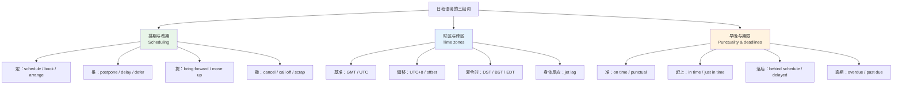
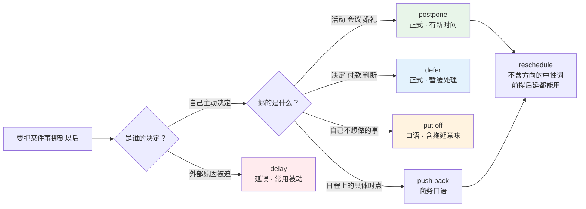
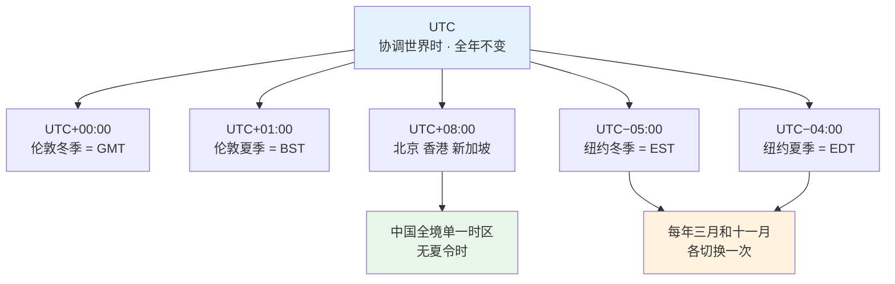
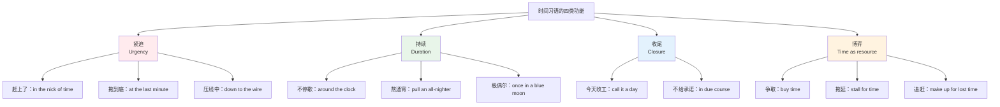
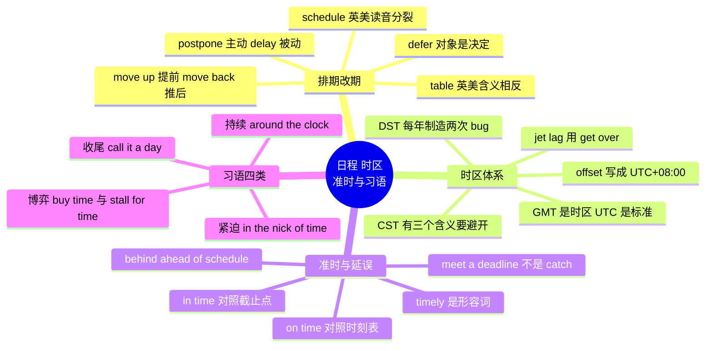

# 日程、时区、准时延误与时间习语

> [!info] 本篇定位
>
> 时间与日历章的收尾篇，也是四篇里最贴近工作场景的一篇。前三篇处理的是时间的**刻度**（星期月份、钟点日期、节日假期），这一篇处理时间的**操作**：怎么排、怎么改、怎么描述早晚、怎么跨时区对齐。
>
> 读完能做到三件事：把「推迟」这一个中文词拆成 `postpone` / `delay` / `defer` / `put off` 四个用法不同的英文词并分别用对；看懂 `UTC+8`、`DST`、`EST/EDT` 这套时区记法并能在邮件里正确写出会议时间；分辨 `on time` 与 `in time`、`in the nick of time` 与 `at the last minute` 这些形近义不同的表达。
>
> 本篇收录约 230 个词条，其中日程动词与期限词群是写英文工作邮件的刚需，时区词群是读技术文档和配置服务器的刚需。

---

## 1. 本篇导读：三组词管住整个日程语境

一封典型的英文工作邮件里，时间信息通常挤在三句话里：

> - Could we **move** the review **up** to Thursday? I have a **hard stop** at 4 p.m.
>   - 评审能提到周四吗？我四点必须走。
> - The build is **running behind schedule**; the release will **slip** by two days.
>   - 构建进度落后了，发版要延后两天。
> - Please confirm — the invite says **9:00 UTC**, which is **17:00** your **local time**.
>   - 请确认一下，日程邀请写的是 UTC 9:00，换成你那边的当地时间是 17:00。

这三句里没有一个生僻词，但中文母语者写起来常常卡壳，原因不是词汇量，而是**词的分工不清楚**。「推迟」到底用 `postpone` 还是 `delay`，「提前」到底用 `advance` 还是 `move up`，「准时」到底用 `on time` 还是 `in time`——这些在中文里是同一个词，在英语里是不同的词，各有各的搭配和语域。

上图是本篇的目录结构。三组词并不是并列的三块知识，它们在真实句子里交织出现：排期动词决定动作，时区词决定基准，早晚词决定评价。第 9 节的时间习语是这三组词的口语化外壳——`in the nick of time` 说的还是 `in time`，`around the clock` 说的还是 `twenty-four hours a day`，只是换了更地道的说法。

本篇不讲时态语法（那属于同库《英语基础语法》教程的范围），只讲词。凡是涉及「什么时候用什么词」的判断，本篇给判据；涉及「这个句子的时态对不对」的问题，本篇不碰。

---

## 2. 排期：schedule 及其近义动词群

### 2.1 schedule 一词的四个坑

`schedule` 是本章最值得单独立一节的词，因为它同时踩中了四个坑。

| 英文 | 英式音标 | 美式音标 | 词性 | 中文 | 搭配与说明 |
| --- | --- | --- | --- | --- | --- |
| **schedule** | /ˈʃedjuːl/ | /ˈskedʒuːl/ | n./v. | 日程；安排 | 英美读音差异最大的常用词之一 |
| **rescheduling** | /ˌriːˈʃedjuːlɪŋ/ | /ˌriːˈskedʒuːlɪŋ/ | n. | 改期 | 动名词，正式文书里常用 |
| **scheduler** | /ˈʃedjuːlə/ | /ˈskedʒuːlər/ | n. | 调度器；排程程序 | 操作系统与任务系统的核心概念 |
| **scheduled** | /ˈʃedjuːld/ | /ˈskedʒuːld/ | adj. | 预定的 | scheduled maintenance 计划内维护 |
| **unscheduled** | /ˌʌnˈʃedjuːld/ | /ˌʌnˈskedʒuːld/ | adj. | 计划外的 | unscheduled downtime 计划外停机 |
| **timetable** | /ˈtaɪmteɪbl/ | /ˈtaɪmteɪbl/ | n./v. | 时刻表；课程表 | 英式常用词，对应美式的 schedule |

**坑一：读音。** 英式 /ˈʃedjuːl/ 开头是 sh 音，美式 /ˈskedʒuːl/ 开头是 sk 音。这不是口音的细微差别，是两个听起来完全不同的词。听力材料里第一次听到英式读法的中国学习者往往认不出来。选定一种坚持用就行，不要混。

**坑二：词性。** 它既是名词也是动词，且动词用法极高频。`schedule a meeting`（安排会议）在工作场景里的出现频率远高于名词。中文母语者习惯说 `make a schedule for the meeting`，绕了一圈，直接用动词更自然。

**坑三：英美用词分工。** 火车时刻表、课程表在英国叫 `timetable`，在美国叫 `schedule`。英国人也用 `schedule` 但更偏向「个人日程」，美国人则两个意思都用 `schedule`。

**坑四：介词。** 表示「按计划」用 `on schedule`，「落后」用 `behind schedule`，「提前」用 `ahead of schedule`。三个搭配都不带冠词，写成 ~~on the schedule~~ 就变成「在那张表上」了。

> [!warning] schedule 的三个高频错误
>
> - ❌ ~~The meeting is scheduled **on** Monday.~~
> - ✅ The meeting is scheduled **for** Monday.（安排在周一，用 for）
>
> - ❌ ~~We are **on the schedule**.~~
> - ✅ We are **on schedule**.（进度正常，不带冠词）
>
> - ❌ ~~I will **schedule** you a call.~~
> - ✅ I will **set up** a call with you. / I will **schedule** a call with you.
>   （schedule 不接双宾语）

### 2.2 定日程的动词：十个词的分工

「安排一次会议」在英语里有一整排动词可选，语域和适用对象各不相同。

| 英文 | 英式音标 | 美式音标 | 词性 | 中文 | 搭配与说明 |
| --- | --- | --- | --- | --- | --- |
| **schedule** | /ˈʃedjuːl/ | /ˈskedʒuːl/ | v. | 排期 | 中性通用，最安全的默认选择 |
| **arrange** | /əˈreɪndʒ/ | /əˈreɪndʒ/ | v. | 安排；张罗 | arrange a meeting 含「协调各方」的意味 |
| **set up** | /ˌset ˈʌp/ | /ˌset ˈʌp/ | v. | 约；建 | 口语首选，set up a call 最自然 |
| **book** | /bʊk/ | /bʊk/ | v. | 预订 | 对象是资源：会议室、机票、酒店 |
| **reserve** | /rɪˈzɜːv/ | /rɪˈzɜːrv/ | v. | 预留 | 比 book 正式，餐厅座位常用 |
| **fix** | /fɪks/ | /fɪks/ | v. | 定下 | fix a date 定日期，英式偏多 |
| **slot in** | /ˌslɒt ˈɪn/ | /ˌslɑːt ˈɪn/ | v. | 插入日程 | 强调塞进已排满的表里 |
| **pencil in** | /ˌpensl ˈɪn/ | /ˌpensl ˈɪn/ | v. | 暂定 | 字面「用铅笔写」，表示可改 |
| **lock in** | /ˌlɒk ˈɪn/ | /ˌlɑːk ˈɪn/ | v. | 敲定 | 与 pencil in 相对，表示不再变 |
| **convene** | /kənˈviːn/ | /kənˈviːn/ | v. | 召集 | 正式语域，董事会、委员会 |
| **call** | /kɔːl/ | /kɔːl/ | v. | 召开 | call a meeting，有权召集者才用 |
| **line up** | /ˌlaɪn ˈʌp/ | /ˌlaɪn ˈʌp/ | v. | 张罗好 | line up a speaker 找好讲者 |

`pencil in` 和 `lock in` 这一对值得记牢，它们在真实邮件里承担了非常具体的功能——区分「暂定」和「敲定」。

> [!example] pencil in 与 lock in 的实际用法
>
> - Let's **pencil in** Thursday at 2, and I'll confirm by tomorrow.
>   - 先暂定周四两点，我明天确认。
> - Can we **lock in** Thursday? I need to book the room.
>   - 周四能定死吗？我得订会议室。
> - I've **pencilled in** the whole afternoon, but it may shrink to an hour.
>   - 我先把整个下午留出来了，但可能会缩到一小时。

英式拼写 `pencilled`，美式拼写 `penciled`，这属于 l 双写的英美差异，同类的还有 `travelled/traveled`、`cancelled/canceled`。

### 2.3 日程表上的名词群

| 英文 | 英式音标 | 美式音标 | 词性 | 中文 | 搭配与说明 |
| --- | --- | --- | --- | --- | --- |
| **calendar** | /ˈkælɪndə/ | /ˈkælɪndər/ | n. | 日历；日程表 | 拼写注意是 -ar 不是 -er |
| **agenda** | /əˈdʒendə/ | /əˈdʒendə/ | n. | 议程 | 复数 agendas；on the agenda 在议程上 |
| **itinerary** | /aɪˈtɪnərəri/ | /aɪˈtɪnəreri/ | n. | 行程单 | 出差旅行用，含交通住宿细节 |
| **appointment** | /əˈpɔɪntmənt/ | /əˈpɔɪntmənt/ | n. | 预约 | 看医生、见客户；make an appointment |
| **slot** | /slɒt/ | /slɑːt/ | n. | 时段；空档 | a 30-minute slot；an open slot |
| **availability** | /əˌveɪləˈbɪləti/ | /əˌveɪləˈbɪləti/ | n. | 可约时间 | send me your availability 报空闲时段 |
| **invite** | /ˈɪnvaɪt/ | /ˈɪnvaɪt/ | n. | 日程邀请 | 名词重音在前，动词 /ɪnˈvaɪt/ 在后 |
| **attendee** | /ˌætenˈdiː/ | /ˌætenˈdiː/ | n. | 参会人 | -ee 后缀表受动方 |
| **venue** | /ˈvenjuː/ | /ˈvenjuː/ | n. | 场地 | 会议、演出的地点 |
| **reminder** | /rɪˈmaɪndə/ | /rɪˈmaɪndər/ | n. | 提醒 | set a reminder 设提醒 |
| **recurrence** | /rɪˈkʌrəns/ | /rɪˈkɜːrəns/ | n. | 重复规则 | 日历工具里的「重复」设置 |
| **occurrence** | /əˈkʌrəns/ | /əˈkɜːrəns/ | n. | 单次实例 | 重复日程里的某一次 |
| **block** | /blɒk/ | /blɑːk/ | n./v. | 时间块；占用 | block out two hours 占掉两小时 |
| **conflict** | /ˈkɒnflɪkt/ | /ˈkɑːnflɪkt/ | n. | 日程冲突 | 名词重音在前，动词在后 |

`invite` 作名词属于非正式用法，正式书面语仍偏好 `invitation`。日历软件里发出的那个东西说 `invite` 完全自然，写给客户的正式函件里用 `invitation` 更稳。

> [!tip] 报空闲时间的标准说法
>
> 中文习惯问「你什么时候有空」，直译成 `When do you have time?` 会显得像是在质疑对方是不是很闲。工作邮件里的标准问法是：
>
> - Could you send me your **availability** for next week?
> - What does your **calendar** look like on Thursday?
> - Do you have a **slot** free on Friday morning?
>
> 回答时给区间不给单点：`I'm free 2–5 p.m. Tuesday and anytime Wednesday.` 给单点会导致来回三四轮。

---

## 3. 改期：往后推、往前提与撤销

### 3.1 往后推：六个词的精确分工

「推迟」是中文里的一个词，在英语里至少要分成六个，它们的差别不在语气强弱，而在**谁推的、推去哪、推的是什么**。

| 英文 | 英式音标 | 美式音标 | 词性 | 中文 | 搭配与说明 |
| --- | --- | --- | --- | --- | --- |
| **postpone** | /pəˈspəʊn/ | /poʊstˈpoʊn/ | v. | 延期 | 主动决定推到以后，通常已知新时间 |
| **delay** | /dɪˈleɪ/ | /dɪˈleɪ/ | v./n. | 耽误；延误 | 多为被动、非计划的晚点 |
| **defer** | /dɪˈfɜː/ | /dɪˈfɜːr/ | v. | 推迟；暂缓 | 正式；对象多为决定、付款、征兵 |
| **put off** | /ˌpʊt ˈɒf/ | /ˌpʊt ˈɔːf/ | v. | 往后拖 | 口语，常带「不想做」的意味 |
| **push back** | /ˌpʊʃ ˈbæk/ | /ˌpʊʃ ˈbæk/ | v. | 往后挪 | 商务口语，push the deadline back |
| **adjourn** | /əˈdʒɜːn/ | /əˈdʒɜːrn/ | v. | 休会 | 会议中途暂停，稍后续开 |
| **reschedule** | /ˌriːˈʃedjuːl/ | /ˌriːˈskedʒuːl/ | v. | 改期 | 中性，不含方向，前后都可 |
| **hold over** | /ˌhəʊld ˈəʊvə/ | /ˌhoʊld ˈoʊvər/ | v. | 留到下次 | 议题挪到下次会议 |

上图的分叉点是「谁的决定」。`delay` 的典型主语是外部因素，句子常写成被动：`The flight was delayed by fog.` 而 `postpone` 的典型主语是有决定权的人：`We postponed the launch to March.` 把「航班延误」说成 `The flight was postponed` 听起来像航空公司主动改了航班计划，与事实不符。

> [!example] 六个词各自的典型句
>
> - The concert has been **postponed** to 15 June.
>   - 演唱会延期到六月十五日。（有明确新日期）
> - Our train was **delayed** by forty minutes.
>   - 我们的火车晚点了四十分钟。（被动，非计划）
> - The board **deferred** the decision until the next quarter.
>   - 董事会把决定推迟到下季度。（对象是决定）
> - Stop **putting off** the dentist appointment.
>   - 别再拖着不去看牙医了。（含逃避意味）
> - Can we **push** the demo **back** to Friday?
>   - 演示能往后挪到周五吗？（商务口语）
> - The meeting was **adjourned** until two o'clock.
>   - 会议休会到两点。（中途暂停）

> [!warning] postpone 后面不能直接接不定式
>
> `postpone` 只接名词或动名词，不接不定式。
>
> - ❌ ~~We postponed **to launch** the product.~~
> - ✅ We postponed **launching** the product.
> - ✅ We postponed **the launch**.
>
> 同类的还有 `delay`、`put off`、`defer`（三个都只接 -ing 或名词）：
>
> - ✅ She kept **delaying making** a decision.
> - ✅ He **deferred paying** the fee until January.

另有一个高危词值得单列：`table`。

> [!warning] table a motion：英美含义完全相反
>
> - 英式：**table** a proposal = 把提案**提交**讨论（放到桌面上）
> - 美式：**table** a proposal = 把提案**搁置**（放到一边去）
>
> 同一个词在跨大西洋会议上会造成实质误解。安全做法是避开它，改用无歧义的说法：
>
> - 想说「提交讨论」→ `put forward` / `submit` / `bring up`
> - 想说「搁置」→ `shelve` / `put on hold` / `put on the back burner`

### 3.2 往前提：bring forward 与 move up 的英美分裂

「提前」比「推迟」更容易出错，因为它的两个主流说法分属英美，且字面方向感相反。

| 英文 | 英式音标 | 美式音标 | 词性 | 中文 | 搭配与说明 |
| --- | --- | --- | --- | --- | --- |
| **bring forward** | /ˌbrɪŋ ˈfɔːwəd/ | /ˌbrɪŋ ˈfɔːrwərd/ | v. | 提前 | 英式主流；bring the meeting forward |
| **move up** | /ˌmuːv ˈʌp/ | /ˌmuːv ˈʌp/ | v. | 提前 | 美式主流；move the meeting up |
| **advance** | /ədˈvɑːns/ | /ədˈvæns/ | v. | 提前 | 正式书面；advance the deadline |
| **expedite** | /ˈekspədaɪt/ | /ˈekspədaɪt/ | v. | 加急处理 | 正式；对象是流程不是时点 |
| **fast-track** | /ˈfɑːst træk/ | /ˈfæst træk/ | v. | 走快速通道 | 商务；fast-track the approval |
| **prepone** | /priːˈpəʊn/ | /priːˈpoʊn/ | v. | 提前 | 印度英语用词，英美母语者不认，只需听懂 |

`prepone` 是印度英语里构造出来的 `postpone` 反义词，语法上很合理，但英美母语者不认，正式场合会引起困惑。列在这里是为了让你读到时能反应过来，不是让你用。

> [!warning] move up 与 move back 的方向陷阱
>
> 这一对是英语时间表达里最反直觉的部分。
>
> - **move up** = 提前（时间轴上往「更早」移动）
> - **move back** = 推后（往「更晚」移动）
>
> 中文母语者容易按空间直觉理解成「往后 = 往未来 = up」，正好反了。记忆方法是把日程表想成一张竖排的清单：往上移就是排到前面去，往下移就是排到后面去。
>
> - Can we **move** the call **up** to 9? → 能提到九点吗？
> - Can we **move** the call **back** to 11? → 能推到十一点吗？
>
> 更保险的做法是直接说时间，不依赖方向词：`Can we do 9 instead of 10?` 这句话没有任何歧义空间。

### 3.3 撤销与中止

| 英文 | 英式音标 | 美式音标 | 词性 | 中文 | 搭配与说明 |
| --- | --- | --- | --- | --- | --- |
| **cancel** | /ˈkænsl/ | /ˈkænsl/ | v. | 取消 | 英式拼 cancelled，美式 canceled |
| **cancellation** | /ˌkænsəˈleɪʃn/ | /ˌkænsəˈleɪʃn/ | n. | 取消 | 名词两边都双写 l |
| **call off** | /ˌkɔːl ˈɒf/ | /ˌkɔːl ˈɔːf/ | v. | 取消 | 口语，call off the search 停止搜救 |
| **scrap** | /skræp/ | /skræp/ | v. | 废弃 | 彻底放弃计划，不再重启 |
| **shelve** | /ʃelv/ | /ʃelv/ | v. | 搁置 | 暂停但保留复活可能 |
| **suspend** | /səˈspend/ | /səˈspend/ | v. | 中止 | 正式；suspend service 暂停服务 |
| **abort** | /əˈbɔːt/ | /əˈbɔːrt/ | v. | 中断 | 技术语境；abort the deployment |
| **withdraw** | /wɪðˈdrɔː/ | /wɪðˈdrɔː/ | v. | 撤回 | 对象是申请、提案、参赛资格 |
| **no-show** | /ˈnəʊ ʃəʊ/ | /ˈnoʊ ʃoʊ/ | n. | 爽约者 | 订了位没来的人 |
| **stand up** | /ˌstænd ˈʌp/ | /ˌstænd ˈʌp/ | v. | 放鸽子 | 口语；He stood me up. |

`cancel` 的拼写差异是英美 l 双写规则的典型：英式在重音不在最后一个音节时也双写 l（`cancelled`、`travelling`、`modelling`），美式只在重音落在末音节时双写（`controlled` 两边都双写，因为重音在 -trol）。

> [!example] 取消与搁置的语气梯度
>
> - The launch has been **cancelled**.
>   - 发布会取消了。（这次不办了，未说以后）
> - The project has been **shelved** pending budget approval.
>   - 项目暂时搁置，等预算批下来再说。（保留复活可能）
> - The project has been **scrapped**.
>   - 项目彻底砍了。（不会再有了）
> - Service will be **suspended** for maintenance from 2 to 4 a.m.
>   - 服务将于凌晨两点到四点暂停维护。（有明确恢复时间）

---

## 4. 日程操作：塞进去与腾出来

### 4.1 争夺日历空间的动词

排期的另一半是「怎么把事塞进已经满了的日历」，这一组动词在职场邮件里极高频。

| 英文 | 英式音标 | 美式音标 | 词性 | 中文 | 搭配与说明 |
| --- | --- | --- | --- | --- | --- |
| **squeeze in** | /ˌskwiːz ˈɪn/ | /ˌskwiːz ˈɪn/ | v. | 挤进去 | squeeze in a quick call |
| **fit in** | /ˌfɪt ˈɪn/ | /ˌfɪt ˈɪn/ | v. | 安排得下 | Can you fit me in tomorrow? |
| **carve out** | /ˌkɑːv ˈaʊt/ | /ˌkɑːrv ˈaʊt/ | v. | 硬挤出 | carve out an hour 挤出一小时 |
| **free up** | /ˌfriː ˈʌp/ | /ˌfriː ˈʌp/ | v. | 腾出 | free up Friday afternoon |
| **clear** | /klɪə/ | /klɪr/ | v. | 清空 | clear my calendar 清空日程 |
| **double-book** | /ˌdʌbl ˈbʊk/ | /ˌdʌbl ˈbʊk/ | v. | 重复预订 | 同一时段约了两件事 |
| **overbook** | /ˌəʊvəˈbʊk/ | /ˌoʊvərˈbʊk/ | v. | 超额预订 | 航空公司超售 |
| **block out** | /ˌblɒk ˈaʊt/ | /ˌblɑːk ˈaʊt/ | v. | 占出整块 | block out the morning |
| **overlap** | /ˌəʊvəˈlæp/ | /ˌoʊvərˈlæp/ | v. | 时间重叠 | 动词重音在后 |
| **overlap** | /ˈəʊvəlæp/ | /ˈoʊvərlæp/ | n. | 重叠时段 | 名词重音在前 |
| **stagger** | /ˈstæɡə/ | /ˈstæɡər/ | v. | 错开 | stagger the start times 错峰开始 |
| **space out** | /ˌspeɪs ˈaʊt/ | /ˌspeɪs ˈaʊt/ | v. | 拉开间隔 | space out the sessions |

`overlap` 是名动同形重音不同的典型词。同一模式的还有本章出现过的 `conflict`、`invite`，以及 `03.数字与计量词汇` 里的 `record`、`increase`、`present`。规律是：**名词重音在第一音节，动词重音在第二音节**。

> [!example] 腾时间的一组标准表达
>
> - I can **squeeze** you **in** at 4:15, but only for fifteen minutes.
>   - 四点一刻能挤出个空给你，但只有十五分钟。
> - Let me **free up** Thursday morning and get back to you.
>   - 我把周四上午腾出来，回头告诉你。
> - I've **blocked out** two hours for deep work — no meetings.
>   - 我留了两小时做专注工作，不排会。
> - Sorry, I **double-booked** myself. Can we move to 3?
>   - 抱歉，我这个时段约重了，能改到三点吗？

### 4.2 会议进行中的时间词

| 英文 | 英式音标 | 美式音标 | 词性 | 中文 | 搭配与说明 |
| --- | --- | --- | --- | --- | --- |
| **run over** | /ˌrʌn ˈəʊvə/ | /ˌrʌn ˈoʊvər/ | v. | 超时 | The meeting ran over by 20 minutes. |
| **overrun** | /ˌəʊvəˈrʌn/ | /ˌoʊvərˈrʌn/ | v./n. | 超时；超支 | 比 run over 正式 |
| **run late** | /ˌrʌn ˈleɪt/ | /ˌrʌn ˈleɪt/ | v. | 迟到；进度晚 | I'm running late. 我要晚到了 |
| **wrap up** | /ˌræp ˈʌp/ | /ˌræp ˈʌp/ | v. | 收尾 | Let's wrap up in five minutes. |
| **cut short** | /ˌkʌt ˈʃɔːt/ | /ˌkʌt ˈʃɔːrt/ | v. | 提前结束 | cut the trip short |
| **hard stop** | /ˌhɑːd ˈstɒp/ | /ˌhɑːrd ˈstɑːp/ | n. | 硬性结束点 | I have a hard stop at 3. |
| **back-to-back** | /ˌbæk tə ˈbæk/ | /ˌbæk tə ˈbæk/ | adj. | 连轴的 | back-to-back meetings 会连着会 |
| **buffer** | /ˈbʌfə/ | /ˈbʌfər/ | n. | 缓冲时间 | leave a buffer 留缓冲 |
| **downtime** | /ˈdaʊntaɪm/ | /ˈdaʊntaɪm/ | n. | 停机时间；空闲 | 技术义与生活义都常用 |
| **turnaround** | /ˈtɜːnəraʊnd/ | /ˈtɜːrnəraʊnd/ | n. | 周转时间 | 24-hour turnaround 一天出结果 |

`hard stop` 是英文会议文化里很实用的一个词，中文没有直接对应。它的功能是提前告知「我到点必须走，不是不给面子」，说出来对方就知道要压缩议程。

> [!tip] 会议开场先声明 hard stop
>
> - Just so you know, I have a **hard stop** at four.
>   - 先说一下，我四点必须走。
> - We're **back-to-back** today, so let's keep this tight.
>   - 今天会连着会，我们抓紧点。
> - I've built in a ten-minute **buffer** between the two sessions.
>   - 两场之间我留了十分钟缓冲。
>
> 这三句在英文职场里属于礼貌行为而非无礼，中文母语者常因为怕失礼而不说，结果是超时后突然离场，反而更尴尬。

---

## 5. 时区：GMT、UTC 与偏移

### 5.1 GMT 与 UTC 到底差在哪

两个缩写在日常使用中常被当作同义词，严格说不是。

| 英文 | 英式音标 | 美式音标 | 词性 | 中文 | 搭配与说明 |
| --- | --- | --- | --- | --- | --- |
| **GMT** | /ˌdʒiː em ˈtiː/ | /ˌdʒiː em ˈtiː/ | n. | 格林尼治标准时 | Greenwich Mean Time 的缩写 |
| **Greenwich** | /ˈɡrenɪtʃ/ | /ˈɡrenɪtʃ/ | n. | 格林尼治 | w 不发音，读作 gren-itch |
| **meridian** | /məˈrɪdiən/ | /məˈrɪdiən/ | n. | 子午线 | the prime meridian 本初子午线 |
| **UTC** | /ˌjuː tiː ˈsiː/ | /ˌjuː tiː ˈsiː/ | n. | 协调世界时 | Coordinated Universal Time |
| **coordinated** | /kəʊˈɔːdɪneɪtɪd/ | /koʊˈɔːrdɪneɪtɪd/ | adj. | 协调的 | 拼写可写 co-ordinated（英式旧式） |
| **universal** | /ˌjuːnɪˈvɜːsl/ | /ˌjuːnɪˈvɜːrsl/ | adj. | 通用的 | UTC 中的 U |
| **atomic clock** | /əˌtɒmɪk ˈklɒk/ | /əˌtɑːmɪk ˈklɑːk/ | n. | 原子钟 | UTC 的时间基准来源 |
| **leap second** | /ˈliːp sekənd/ | /ˈliːp sekənd/ | n. | 闰秒 | 用于把 UTC 对齐地球自转 |
| **time zone** | /ˈtaɪm zəʊn/ | /ˈtaɪm zoʊn/ | n. | 时区 | 英式常分写，美式也见 timezone |
| **offset** | /ˈɒfset/ | /ˈɔːfset/ | n. | 偏移量 | UTC offset；+08:00 |
| **local time** | /ˌləʊkl ˈtaɪm/ | /ˌloʊkl ˈtaɪm/ | n. | 当地时间 | 与 UTC 相对 |
| **standard time** | /ˌstændəd ˈtaɪm/ | /ˌstændərd ˈtaɪm/ | n. | 标准时 | 与夏令时相对的冬季基准 |

**GMT 是一个时区名**，指英国冬季使用的时间，属于地理概念，源自格林尼治天文台的本初子午线。**UTC 是一个时间标准**，由原子钟定义，通过插入闰秒与地球自转保持在一秒之内，属于计量概念。

日常对话里两者数值相同，混用不会造成误解。写技术文档、配置服务器、设计 API 时必须用 UTC——因为 GMT 在英国夏天会变成 BST（British Summer Time），而 UTC 全年不变。

上图说明了一件容易被忽略的事：**同一个城市在一年里属于两个不同的时区缩写**。纽约冬天是 EST（UTC−5），夏天是 EDT（UTC−4）。写「纽约时间下午三点」时如果只说 `3 p.m. EST`，在七月份其实是错的，正确的是 `3 p.m. EDT`。规避方法是写 `3 p.m. ET`（Eastern Time，不区分冬夏）或者直接写 UTC。

### 5.2 时区缩写与偏移速查

下表是数据速查，不是词条表——除 GMT/UTC 外，这些缩写在口语里通常整体读字母。

| 缩写 | 全称 | 标准时偏移 | 夏令时缩写与偏移 | 主要地区 |
| --- | --- | --- | --- | --- |
| GMT | Greenwich Mean Time | UTC+00:00 | BST / UTC+01:00 | 英国、爱尔兰、葡萄牙 |
| CET | Central European Time | UTC+01:00 | CEST / UTC+02:00 | 德国、法国、意大利 |
| EET | Eastern European Time | UTC+02:00 | EEST / UTC+03:00 | 希腊、芬兰、罗马尼亚 |
| IST | India Standard Time | UTC+05:30 | 无 | 印度、斯里兰卡 |
| CST | China Standard Time | UTC+08:00 | 无 | 中国全境 |
| JST | Japan Standard Time | UTC+09:00 | 无 | 日本 |
| AEST | Australian Eastern Standard Time | UTC+10:00 | AEDT / UTC+11:00 | 悉尼、墨尔本 |
| EST | Eastern Standard Time | UTC−05:00 | EDT / UTC−04:00 | 纽约、多伦多 |
| CST | Central Standard Time | UTC−06:00 | CDT / UTC−05:00 | 芝加哥、达拉斯 |
| MST | Mountain Standard Time | UTC−07:00 | MDT / UTC−06:00 | 丹佛、盐湖城 |
| PST | Pacific Standard Time | UTC−08:00 | PDT / UTC−07:00 | 洛杉矶、西雅图 |

> [!warning] CST 是三个不同时区的缩写
>
> `CST` 同时是 China Standard Time（UTC+8）、Central Standard Time（UTC−6）和 Cuba Standard Time（UTC−5）的缩写，相差十四个小时。
>
> 在跨国邮件里写 `10 a.m. CST` 是危险的，对方按美国中部时间理解就差了半天。
>
> 安全写法是三选一：
>
> - 写偏移：`10 a.m. UTC+8`
> - 写 IANA 时区标识：`10:00 Asia/Shanghai`
> - 写城市：`10 a.m. Beijing time`
>
> 服务器配置里一律用 IANA 标识（`Asia/Shanghai`、`America/New_York`），不要用三字母缩写。

### 5.3 描述时差的句型

时差的表达在英语里靠 `ahead of` 与 `behind` 这一对介词短语。

> [!example] 时差表达的六个标准句
>
> - Beijing is eight hours **ahead of** London.
>   - 北京比伦敦早八小时。
> - London is eight hours **behind** Beijing.
>   - 伦敦比北京晚八小时。
> - There's a thirteen-hour **time difference** between Beijing and New York.
>   - 北京和纽约有十三小时时差。
> - We're in different **time zones**, so let's find an **overlap**.
>   - 我们不在一个时区，找个重叠时段吧。
> - What time works for you **your time**?
>   - 按你那边的时间，几点方便？
> - The deploy window is 2 a.m. **UTC**, which is 10 a.m. **for you**.
>   - 发布窗口是 UTC 凌晨两点，对你来说是上午十点。

> [!warning] ahead 与 behind 说的是钟面不是地理
>
> `ahead` 指钟面数字更大（时间更晚），不是「在地图上更靠前」。北京的钟显示 20:00 时伦敦是 12:00，所以北京 `ahead`。
>
> - ❌ ~~Beijing is eight hours **faster than** London.~~（faster 指走得快，钟坏了）
> - ✅ Beijing is eight hours **ahead of** London.
>
> 另一个高频错误是把 `time difference` 说成 `time distance` 或 `time gap`。固定搭配就是 `time difference`。

---

## 6. 夏令时与跨时区旅行

### 6.1 DST：一个每年制造两次 bug 的制度

| 英文 | 英式音标 | 美式音标 | 词性 | 中文 | 搭配与说明 |
| --- | --- | --- | --- | --- | --- |
| **daylight saving time** | /ˌdeɪlaɪt ˈseɪvɪŋ taɪm/ | /ˌdeɪlaɪt ˈseɪvɪŋ taɪm/ | n. | 夏令时 | 美式说法；缩写 DST |
| **summer time** | /ˈsʌmə taɪm/ | /ˈsʌmər taɪm/ | n. | 夏令时 | 英式说法；British Summer Time |
| **spring forward** | /ˌsprɪŋ ˈfɔːwəd/ | /ˌsprɪŋ ˈfɔːrwərd/ | v. | 春季拨快 | 春天把钟往前拨一小时 |
| **fall back** | /ˌfɔːl ˈbæk/ | /ˌfɔːl ˈbæk/ | v. | 秋季拨慢 | 秋天把钟往回拨一小时 |
| **set the clocks** | /ˌset ðə ˈklɒks/ | /ˌset ðə ˈklɑːks/ | v. | 调钟 | set the clocks forward / back |
| **observe DST** | /əbˌzɜːv diː es ˈtiː/ | /əbˌzɜːrv diː es ˈtiː/ | v. | 实行夏令时 | China does not observe DST. |

英美两地的说法不同：美国说 `daylight saving time`（注意是单数 `saving`，虽然口语里 `savings` 也常见），英国说 `summer time`，官方缩写 `BST`。

`spring forward, fall back` 是英语国家的记忆口诀，利用了 `spring`（春天/向前跳）和 `fall`（秋天/落下）的双关。

> [!warning] DST 对程序员的三个具体影响
>
> 1. **一年里有一天是 23 小时，另一天是 25 小时。** 用「加 86400 秒」来算「明天同一时刻」在切换日会算错一小时。
> 2. **一年里有一个本地时间不存在。** 美国东部时间三月某个周日的 02:30 被直接跳过，把这个字符串解析成时间戳会抛异常或被静默修正。
> 3. **一年里有一个本地时间出现两次。** 十一月切换日的 01:30 会走两遍，仅凭本地时间无法区分是哪一次。
>
> 这也是所有时间库都建议**存储用 UTC、展示时再转本地时区**的原因。存本地时间会永久丢失第三种情况的信息。

### 6.2 跨时区旅行词群

| 英文 | 英式音标 | 美式音标 | 词性 | 中文 | 搭配与说明 |
| --- | --- | --- | --- | --- | --- |
| **jet lag** | /ˈdʒet læɡ/ | /ˈdʒet læɡ/ | n. | 时差反应 | 名词分写；have jet lag |
| **jet-lagged** | /ˈdʒet læɡd/ | /ˈdʒet læɡd/ | adj. | 有时差反应的 | 形容词加连字符 |
| **lag** | /læɡ/ | /læɡ/ | n./v. | 滞后 | 技术语境指网络延迟 |
| **body clock** | /ˈbɒdi klɒk/ | /ˈbɑːdi klɑːk/ | n. | 生物钟 | 口语说法 |
| **circadian rhythm** | /sɜːˌkeɪdiən ˈrɪðəm/ | /sɜːrˌkeɪdiən ˈrɪðəm/ | n. | 昼夜节律 | 学术说法 |
| **red-eye** | /ˈred aɪ/ | /ˈred aɪ/ | n. | 红眼航班 | take the red-eye 坐夜航 |
| **overnight flight** | /ˌəʊvəˈnaɪt flaɪt/ | /ˌoʊvərˈnaɪt flaɪt/ | n. | 过夜航班 | red-eye 的中性说法 |
| **layover** | /ˈleɪəʊvə/ | /ˈleɪoʊvər/ | n. | 经停 | 美式常用 |
| **stopover** | /ˈstɒpəʊvə/ | /ˈstɑːpoʊvər/ | n. | 中途停留 | 英式常用，可指过夜停留 |
| **International Date Line** | /ˌɪntəˈnæʃnəl ˈdeɪt laɪn/ | /ˌɪntərˈnæʃnəl ˈdeɪt laɪn/ | n. | 国际日期变更线 | 跨越时日期加减一天 |
| **acclimatise** | /əˈklaɪmətaɪz/ | /əˈklaɪmətaɪz/ | v. | 适应 | 美式拼 acclimatize |
| **adjust** | /əˈdʒʌst/ | /əˈdʒʌst/ | v. | 调整；适应 | adjust to the time difference |

> [!example] jet lag 的常用搭配
>
> - I'm still **getting over** the **jet lag**.
>   - 我还没倒过时差来。
> - **Jet lag** always hits me harder flying **east**.
>   - 往东飞时差反应总是更重。
> - She took the **red-eye** and went straight to the office.
>   - 她坐红眼航班直接去了办公室。
> - Give yourself a day to **adjust to** the time difference.
>   - 留一天时间适应时差。
>
> 中文说「倒时差」，英语没有对应的单一动词，用 `get over jet lag`、`adjust to the time difference`、`get onto local time` 三种说法。
>
> - ❌ ~~I need to **turn over** my jet lag.~~
> - ✅ I need to **get over** my jet lag.

---

## 7. 准时与延误

### 7.1 on time 与 in time：本篇最重要的一对

这一对是中文母语者的经典失分点，因为中文两个都译作「及时」或「准时」。

| 表达 | 含义 | 反义 | 是否带 for/to |
| --- | --- | --- | --- |
| **on time** | 按预定时刻，不早不晚 | late 迟到 | 不接 |
| **in time** | 在事情发生前赶到，来得及 | too late 来不及 | 常接 for + n. / to + v. |

判据只有一条：`on time` 对照的是**时刻表**，`in time` 对照的是**某个截止点**。

| 英文 | 英式音标 | 美式音标 | 词性 | 中文 | 搭配与说明 |
| --- | --- | --- | --- | --- | --- |
| **on time** | /ɒn ˈtaɪm/ | /ɑːn ˈtaɪm/ | phr. | 准时 | 对照时刻表；后面不接 for/to |
| **in time** | /ɪn ˈtaɪm/ | /ɪn ˈtaɪm/ | phr. | 及时；来得及 | in time for dinner / in time to catch it |
| **in good time** | /ɪn ˌɡʊd ˈtaɪm/ | /ɪn ˌɡʊd ˈtaɪm/ | phr. | 从容提早 | 英式常用，含「留了余量」 |
| **just in time** | /ˌdʒʌst ɪn ˈtaɪm/ | /ˌdʒʌst ɪn ˈtaɪm/ | phr. | 刚好赶上 | 精益生产 JIT 一词的来源 |
| **in no time** | /ɪn ˈnəʊ taɪm/ | /ɪn ˈnoʊ taɪm/ | phr. | 一转眼就 | 与「时间点」无关，义为「很快」 |
| **with time to spare** | /wɪð ˌtaɪm tə ˈspeə/ | /wɪð ˌtaɪm tə ˈsper/ | phr. | 还剩富余 | 比 in good time 更强调余量可量化 |
| **behind time** | /bɪˌhaɪnd ˈtaɪm/ | /bɪˌhaɪnd ˈtaɪm/ | phr. | 晚点 | 说交通工具，behind schedule 说项目 |
| **ahead of time** | /əˌhed əv ˈtaɪm/ | /əˌhed əv ˈtaɪm/ | phr. | 提前 | 既说时点也说编译期（AOT） |

`behind time` 和 `behind schedule` 是最容易混的一对：前者说的是交通工具比时刻表晚了（`The train is running behind time.`），后者说的是一项工作比计划晚了（`The migration is behind schedule.`）。把项目进度说成 `behind time` 会让英语母语者以为你在说火车。

> [!example] 同一个场景的两种说法
>
> - The train arrived **on time**.
>   - 火车准点到达。（时刻表上写 9:00，它 9:00 到）
> - I got to the station **in time** to catch the train.
>   - 我及时赶到车站，赶上了那班火车。（不管几点到，赶上就行）
> - The meeting started **on time** for once.
>   - 会议难得准时开始了一次。
> - She finished the report **in time for** the review.
>   - 她赶在评审前把报告写完了。
> - Please be **on time** — we start at nine sharp.
>   - 请准时，我们九点整开始。
> - Call an ambulance — we may still be **in time**.
>   - 快叫救护车，也许还来得及。

> [!warning] 三个衍生表达
>
> - **in good time** = 提早留出余量（英式常用）
>   - We arrived **in good time** for the flight.（提早到了机场，不慌不忙）
> - **in no time** = 很快，一转眼（与「时间」的字面义无关）
>   - The install finished **in no time**.（安装一下就好了）
> - **just in time** = 刚好赶上（也是精益生产 JIT 的来源）
>   - He grabbed the door **just in time**.（刚好抓住了门）
>
> 三个都不能替换成 `on time`：
>
> - ❌ ~~We arrived in good **on time**.~~
> - ❌ ~~The install finished in no **on time**.~~

### 7.2 准时的形容词梯度

| 英文 | 英式音标 | 美式音标 | 词性 | 中文 | 搭配与说明 |
| --- | --- | --- | --- | --- | --- |
| **punctual** | /ˈpʌŋktʃuəl/ | /ˈpʌŋktʃuəl/ | adj. | 守时的 | 描述人的习惯，不描述单次 |
| **punctuality** | /ˌpʌŋktʃuˈæləti/ | /ˌpʌŋktʃuˈæləti/ | n. | 守时 | 名词形式 |
| **prompt** | /prɒmpt/ | /prɑːmpt/ | adj. | 迅速的；准时的 | prompt reply 及时回复 |
| **promptly** | /ˈprɒmptli/ | /ˈprɑːmptli/ | adv. | 准时地；立即 | promptly at nine 九点整 |
| **timely** | /ˈtaɪmli/ | /ˈtaɪmli/ | adj. | 适时的 | 是形容词不是副词 |
| **early** | /ˈɜːli/ | /ˈɜːrli/ | adj./adv. | 早的 | 形副同形 |
| **late** | /leɪt/ | /leɪt/ | adj./adv. | 迟的 | 副词 lately 义为「最近」不是「迟」 |
| **tardy** | /ˈtɑːdi/ | /ˈtɑːrdi/ | adj. | 迟到的 | 美式校园语境常用 |
| **overdue** | /ˌəʊvəˈdjuː/ | /ˌoʊvərˈduː/ | adj. | 逾期的 | 见 8.2 节 |
| **belated** | /bɪˈleɪtɪd/ | /bɪˈleɪtɪd/ | adj. | 迟来的 | belated birthday wishes 迟到的祝福 |

> [!warning] timely 是形容词，lately 不是 late 的副词
>
> `-ly` 结尾未必是副词。`timely`、`friendly`、`lively`、`lonely` 都是形容词。
>
> - ❌ ~~He responded **timely**.~~
> - ✅ He responded **promptly**. / He gave a **timely** response.
>
> `lately` 虽是副词，但意思是「最近」而不是「迟」。
>
> - ❌ ~~He arrived **lately**.~~（想说「他迟到了」）
> - ✅ He arrived **late**.
> - ✅ He has been late a lot **lately**.（他最近经常迟到）

### 7.3 延误的动词与名词

| 英文 | 英式音标 | 美式音标 | 词性 | 中文 | 搭配与说明 |
| --- | --- | --- | --- | --- | --- |
| **delay** | /dɪˈleɪ/ | /dɪˈleɪ/ | n./v. | 延误 | a two-hour delay 两小时延误 |
| **hold-up** | /ˈhəʊld ʌp/ | /ˈhoʊld ʌp/ | n. | 耽搁 | What's the hold-up? 卡在哪了 |
| **holdup** | /ˈhəʊld ʌp/ | /ˈhoʊld ʌp/ | n. | 耽搁 | 美式常不带连字符 |
| **setback** | /ˈsetbæk/ | /ˈsetbæk/ | n. | 挫折；倒退 | 比 delay 严重，含进度倒退 |
| **backlog** | /ˈbæklɒɡ/ | /ˈbæklɔːɡ/ | n. | 积压 | clear the backlog 清积压 |
| **bottleneck** | /ˈbɒtlnek/ | /ˈbɑːtlnek/ | n. | 瓶颈 | 造成延误的卡点 |
| **slip** | /slɪp/ | /slɪp/ | v./n. | 顺延；滑期 | The date slipped by a week. |
| **slippage** | /ˈslɪpɪdʒ/ | /ˈslɪpɪdʒ/ | n. | 进度滑移 | 项目管理术语 |
| **stall** | /stɔːl/ | /stɔːl/ | v. | 停滞；拖延 | 及物时义为「拖住对方」 |
| **drag on** | /ˌdræɡ ˈɒn/ | /ˌdræɡ ˈɔːn/ | v. | 拖沓不完 | The negotiation dragged on. |
| **linger** | /ˈlɪŋɡə/ | /ˈlɪŋɡər/ | v. | 逗留不去 | 人或状态迟迟不散 |
| **procrastinate** | /prəˈkræstɪneɪt/ | /prəˈkræstɪneɪt/ | v. | 拖延 | 主观拖延，非客观延误 |
| **procrastination** | /prəˌkræstɪˈneɪʃn/ | /prəˌkræstɪˈneɪʃn/ | n. | 拖延症 | 名词形式 |
| **dawdle** | /ˈdɔːdl/ | /ˈdɔːdl/ | v. | 磨蹭 | 走路做事慢吞吞 |

> [!warning] delay 与 procrastinate 不是一回事
>
> - **delay** 侧重结果：事情比预定晚了，原因可能在外部。
> - **procrastinate** 侧重主观：明知该做却一直不做，只用于人。
>
> - ❌ ~~The flight **procrastinated** for two hours.~~
> - ✅ The flight was **delayed** for two hours.
>
> - ❌ ~~I **delayed** writing the report because I hated it.~~（语法对但味道不准）
> - ✅ I **procrastinated** on the report because I hated it.

### 7.4 behind schedule 一族

`schedule` 配三个介词短语，构成描述项目进度的标准三档。

| 英文 | 英式音标 | 美式音标 | 词性 | 中文 | 搭配与说明 |
| --- | --- | --- | --- | --- | --- |
| **on schedule** | /ɒn ˈʃedjuːl/ | /ɑːn ˈskedʒuːl/ | phr. | 按计划 | 不带冠词 |
| **behind schedule** | /bɪˌhaɪnd ˈʃedjuːl/ | /bɪˌhaɪnd ˈskedʒuːl/ | phr. | 进度落后 | two weeks behind schedule |
| **ahead of schedule** | /əˌhed əv ˈʃedjuːl/ | /əˌhed əv ˈskedʒuːl/ | phr. | 进度提前 | 也说 ahead of time |
| **on track** | /ɒn ˈtræk/ | /ɑːn ˈtræk/ | phr. | 走在正轨 | on track to ship in May |
| **off track** | /ɒf ˈtræk/ | /ɔːf ˈtræk/ | phr. | 偏离轨道 | 比 behind schedule 更泛 |
| **on target** | /ɒn ˈtɑːɡɪt/ | /ɑːn ˈtɑːrɡɪt/ | phr. | 达标 | 偏向数量目标 |
| **at risk** | /ət ˈrɪsk/ | /ət ˈrɪsk/ | phr. | 有风险 | 项目状态标签，介于绿黄之间 |
| **blocked** | /blɒkt/ | /blɑːkt/ | adj. | 被阻塞 | 敏捷开发状态词 |

> [!example] 项目周报里的四句话
>
> - The migration is **on schedule** for the 20th.
>   - 迁移按计划在二十号完成。
> - We're about three days **behind schedule** on the API work.
>   - API 那块进度落后大约三天。
> - Testing finished two days **ahead of schedule**.
>   - 测试比计划提前两天完成。
> - The release is **at risk** — we're **blocked** on the vendor's response.
>   - 发版有风险，我们被供应商的回复卡住了。

---

## 8. 期限：deadline、due 与 overdue

### 8.1 到期词群

| 英文 | 英式音标 | 美式音标 | 词性 | 中文 | 搭配与说明 |
| --- | --- | --- | --- | --- | --- |
| **deadline** | /ˈdedlaɪn/ | /ˈdedlaɪn/ | n. | 截止期限 | meet / miss / extend a deadline |
| **due** | /djuː/ | /duː/ | adj. | 到期的；预定的 | The report is due Friday. |
| **due date** | /ˈdjuː deɪt/ | /ˈduː deɪt/ | n. | 到期日 | 也指预产期 |
| **cut-off** | /ˈkʌt ɒf/ | /ˈkʌt ɔːf/ | n. | 截止点 | the cut-off for applications |
| **closing date** | /ˈkləʊzɪŋ deɪt/ | /ˈkloʊzɪŋ deɪt/ | n. | 截止日期 | 招聘、投标常用 |
| **expiry** | /ɪkˈspaɪəri/ | /ɪkˈspaɪəri/ | n. | 到期 | 英式常用；expiry date |
| **expiration** | /ˌekspəˈreɪʃn/ | /ˌekspəˈreɪʃn/ | n. | 到期 | 美式常用；expiration date |
| **expire** | /ɪkˈspaɪə/ | /ɪkˈspaɪər/ | v. | 过期 | The token has expired. |
| **lapse** | /læps/ | /læps/ | v./n. | 失效；间隔 | 保险、会员未续而自动失效 |
| **ETA** | /ˌiː tiː ˈeɪ/ | /ˌiː tiː ˈeɪ/ | n. | 预计到达时间 | estimated time of arrival |
| **lead time** | /ˈliːd taɪm/ | /ˈliːd taɪm/ | n. | 前置期 | 下单到交付所需时间 |
| **milestone** | /ˈmaɪlstəʊn/ | /ˈmaɪlstoʊn/ | n. | 里程碑 | 项目的阶段节点 |
| **timeframe** | /ˈtaɪmfreɪm/ | /ˈtaɪmfreɪm/ | n. | 时间范围 | within a two-week timeframe |
| **timeline** | /ˈtaɪmlaɪn/ | /ˈtaɪmlaɪn/ | n. | 时间安排；时间线 | tight timeline 时间紧 |

`due` 的用法比多数人以为的宽。它不止表示「款项到期」，还能表示「预定发生」：

> [!example] due 的五种用法
>
> - The report is **due** on Friday.
>   - 报告周五交。
> - Payment is **due** within thirty days.
>   - 三十天内付款。
> - The train is **due** at 6:15.
>   - 火车预计六点十五到。
> - She is **due to** speak after lunch.
>   - 她安排在午饭后发言。
> - The baby is **due** in March.
>   - 预产期在三月。

> [!warning] deadline 的动词搭配是固定的
>
> - ✅ **meet** a deadline（赶上期限）
> - ✅ **miss** a deadline（错过期限）
> - ✅ **extend** / **push back** a deadline（延长期限）
> - ✅ **set** a deadline（定期限）
> - ✅ **tight** deadline（时间紧的期限）
>
> - ❌ ~~**catch** the deadline~~
> - ❌ ~~**arrive** the deadline~~
> - ❌ ~~**finish** the deadline~~
>
> 中文说「赶上截止日期」，英语的动词是 `meet` 不是 `catch`。这是死记搭配，没有道理可讲。

### 8.2 逾期与宽限

| 英文 | 英式音标 | 美式音标 | 词性 | 中文 | 搭配与说明 |
| --- | --- | --- | --- | --- | --- |
| **overdue** | /ˌəʊvəˈdjuː/ | /ˌoʊvərˈduː/ | adj. | 逾期的 | overdue books 逾期图书 |
| **past due** | /ˌpɑːst ˈdjuː/ | /ˌpæst ˈduː/ | adj. | 逾期未付 | 美式账单常用 |
| **outstanding** | /aʊtˈstændɪŋ/ | /aʊtˈstændɪŋ/ | adj. | 未结清的 | 与「杰出的」同形，看语境 |
| **in arrears** | /ɪn əˈrɪəz/ | /ɪn əˈrɪrz/ | phr. | 拖欠中 | 正式；三个月拖欠 |
| **grace period** | /ˈɡreɪs pɪəriəd/ | /ˈɡreɪs pɪriəd/ | n. | 宽限期 | 逾期后不罚的缓冲期 |
| **late fee** | /ˈleɪt fiː/ | /ˈleɪt fiː/ | n. | 滞纳金 | 也说 late charge |
| **extension** | /ɪkˈstenʃn/ | /ɪkˈstenʃn/ | n. | 延期批准 | ask for an extension |
| **reminder notice** | /rɪˈmaɪndə ˈnəʊtɪs/ | /rɪˈmaɪndər ˈnoʊtɪs/ | n. | 催缴通知 | 逾期后的第一封提醒 |
| **imminent** | /ˈɪmɪnənt/ | /ˈɪmɪnənt/ | adj. | 迫在眉睫的 | 中性偏负面 |
| **impending** | /ɪmˈpendɪŋ/ | /ɪmˈpendɪŋ/ | adj. | 即将来临的 | 多修饰不好的事 |
| **forthcoming** | /ˌfɔːθˈkʌmɪŋ/ | /ˌfɔːrθˈkʌmɪŋ/ | adj. | 即将到来的 | 中性；forthcoming release |
| **upcoming** | /ˈʌpkʌmɪŋ/ | /ˈʌpkʌmɪŋ/ | adj. | 即将到来的 | 比 forthcoming 口语 |
| **pending** | /ˈpendɪŋ/ | /ˈpendɪŋ/ | adj./prep. | 待处理的；在等待期间 | pending approval 待批 |

> [!warning] outstanding 的两个义项相差极远
>
> - The work was **outstanding**.（这份工作很出色）
> - The balance is still **outstanding**.（余额仍未结清）
>
> 判断方法是看修饰对象：修饰人或作品是「杰出」，修饰金额、账单、事项是「未结」。财务邮件里出现的 `outstanding invoices` 绝不是「优秀发票」，而是「未付发票」。

> [!tip] 三个「即将」的语气差
>
> - **imminent**：马上就要发生，通常是坏事或大事。`an imminent collapse`
> - **impending**：即将来临，几乎只用于不好的事。`impending layoffs`
> - **upcoming / forthcoming**：中性，纯粹指日程上靠前。`the upcoming release`
>
> 写「即将发布的新版本」用 `upcoming release`，写成 `impending release` 会让读者以为你在暗示这次发版要出事。

---

## 9. 时间习语

习语是本篇最难靠推理得出的部分。下面按功能分四组，每组的词条都直接可用。

### 9.1 紧迫与压线

| 英文 | 英式音标 | 美式音标 | 词性 | 中文 | 搭配与说明 |
| --- | --- | --- | --- | --- | --- |
| **in the nick of time** | /ɪn ðə ˌnɪk əv ˈtaɪm/ | /ɪn ðə ˌnɪk əv ˈtaɪm/ | idiom | 千钧一发之际 | nick 原义「刻痕」；比 just in time 更戏剧化 |
| **at the eleventh hour** | /ət ði ɪˌlevnθ ˈaʊə/ | /ət ði ɪˌlevnθ ˈaʊər/ | idiom | 最后关头 | 源自圣经；正式书面常用 |
| **at the last minute** | /ət ðə ˌlɑːst ˈmɪnɪt/ | /ət ðə ˌlæst ˈmɪnɪt/ | idiom | 临到最后一刻 | 中性偏贬，含准备不足意味 |
| **down to the wire** | /ˌdaʊn tə ðə ˈwaɪə/ | /ˌdaʊn tə ðə ˈwaɪər/ | idiom | 拖到最后一刻见分晓 | 源自赛马终点线 |
| **against the clock** | /əˌɡenst ðə ˈklɒk/ | /əˌɡenst ðə ˈklɑːk/ | idiom | 与时间赛跑 | work against the clock |
| **beat the clock** | /ˌbiːt ðə ˈklɒk/ | /ˌbiːt ðə ˈklɑːk/ | idiom | 抢在时限前完成 | 强调成功赶上 |
| **race against time** | /ˌreɪs əˌɡenst ˈtaɪm/ | /ˌreɪs əˌɡenst ˈtaɪm/ | idiom | 与时间赛跑 | 名词短语，a race against time |
| **the clock is ticking** | /ðə ˌklɒk ɪz ˈtɪkɪŋ/ | /ðə ˌklɑːk ɪz ˈtɪkɪŋ/ | idiom | 时间不多了 | 施压用语 |
| **crunch time** | /ˈkrʌntʃ taɪm/ | /ˈkrʌntʃ taɪm/ | n. | 冲刺期 | 软件行业指发版前的赶工期 |
| **time is of the essence** | /ˌtaɪm ɪz əv ði ˈesns/ | /ˌtaɪm ɪz əv ði ˈesns/ | idiom | 时间至关重要 | 合同术语，有法律效力含义 |

> [!warning] in the nick of time 与 at the last minute 的褒贬差
>
> 两个都表示「最后关头」，但评价方向相反。
>
> - **in the nick of time** 是庆幸：差一点就来不及了，还好赶上。
>   - The fix landed **in the nick of time** — the demo started five minutes later.
> - **at the last minute** 是抱怨：本来有时间，非拖到最后。
>   - He always cancels **at the last minute**.（他总是临时取消）
>
> 表扬别人时用前者，抱怨别人时用后者。用反了会让人误解你的态度。

> [!warning] time is of the essence 在合同里不是修辞
>
> 这句话在英美合同法里是有实际效力的条款：一旦写入，任何一方未按时履约即构成实质性违约，对方可直接解约。日常写邮件催进度时说这句话，对懂行的人来说语气非常重。
>
> 日常催办用轻一些的说法：`We're a bit tight on time.` / `The deadline is coming up fast.`

### 9.2 持续与频率

| 英文 | 英式音标 | 美式音标 | 词性 | 中文 | 搭配与说明 |
| --- | --- | --- | --- | --- | --- |
| **around the clock** | /əˌraʊnd ðə ˈklɒk/ | /əˌraʊnd ðə ˈklɑːk/ | idiom | 全天候 | 美式常用；英式也说 round the clock |
| **round the clock** | /ˌraʊnd ðə ˈklɒk/ | /ˌraʊnd ðə ˈklɑːk/ | idiom | 全天候 | 英式常用变体 |
| **24/7** | /ˌtwenti fɔː ˈsevn/ | /ˌtwenti fɔːr ˈsevn/ | adv. | 全年无休 | 读作 twenty-four seven |
| **day in, day out** | /ˌdeɪ ɪn ˌdeɪ ˈaʊt/ | /ˌdeɪ ɪn ˌdeɪ ˈaʊt/ | idiom | 日复一日 | 含单调乏味意味 |
| **from time to time** | /frəm ˌtaɪm tə ˈtaɪm/ | /frəm ˌtaɪm tə ˈtaɪm/ | idiom | 时不时 | 中性频率副词 |
| **once in a while** | /ˌwʌns ɪn ə ˈwaɪl/ | /ˌwʌns ɪn ə ˈwaɪl/ | idiom | 偶尔 | 比 from time to time 口语 |
| **once in a blue moon** | /ˌwʌns ɪn ə ˌbluː ˈmuːn/ | /ˌwʌns ɪn ə ˌbluː ˈmuːn/ | idiom | 极少 | 频率远低于 once in a while |
| **burn the midnight oil** | /ˌbɜːn ðə ˌmɪdnaɪt ˈɔɪl/ | /ˌbɜːrn ðə ˌmɪdnaɪt ˈɔɪl/ | idiom | 熬夜苦干 | 略偏书面，含褒义 |
| **pull an all-nighter** | /ˌpʊl ən ˌɔːlˈnaɪtə/ | /ˌpʊl ən ˌɔːlˈnaɪtər/ | idiom | 通宵 | 口语，学生与程序员常用 |
| **graveyard shift** | /ˈɡreɪvjɑːd ʃɪft/ | /ˈɡreɪvjɑːrd ʃɪft/ | n. | 夜班 | 通常指午夜到清晨那班 |
| **on call** | /ɒn ˈkɔːl/ | /ɑːn ˈkɔːl/ | phr. | 随时待命 | 医生与运维工程师的值班状态 |
| **off the clock** | /ˌɒf ðə ˈklɒk/ | /ˌɔːf ðə ˈklɑːk/ | phr. | 下班状态 | 与 on the clock 相对 |

> [!example] 全天候的三种说法各用在哪
>
> - Support is available **around the clock**.
>   - 支持服务全天候可用。（中性，产品文案常用）
> - The service runs **24/7**.
>   - 服务全年无休运行。（技术文档与营销文案）
> - The team worked **round the clock** to ship the patch.
>   - 团队连轴转把补丁赶了出来。（强调人的辛苦）
>
> `24/7` 写在正式书面语里略随意，学术论文与法律文书用 `continuously` 或 `on a twenty-four-hour basis`。

### 9.3 收尾与停手

| 英文 | 英式音标 | 美式音标 | 词性 | 中文 | 搭配与说明 |
| --- | --- | --- | --- | --- | --- |
| **call it a day** | /ˌkɔːl ɪt ə ˈdeɪ/ | /ˌkɔːl ɪt ə ˈdeɪ/ | idiom | 今天到此为止 | 白天收工时说 |
| **call it a night** | /ˌkɔːl ɪt ə ˈnaɪt/ | /ˌkɔːl ɪt ə ˈnaɪt/ | idiom | 今晚到此为止 | 晚上散场时说 |
| **wrap it up** | /ˌræp ɪt ˈʌp/ | /ˌræp ɪt ˈʌp/ | idiom | 收个尾 | 会议主持人用语 |
| **knock off** | /ˌnɒk ˈɒf/ | /ˌnɑːk ˈɔːf/ | v. | 下班 | 英式与澳式口语 |
| **clock off** | /ˌklɒk ˈɒf/ | /ˌklɑːk ˈɔːf/ | v. | 打卡下班 | 英式；美式说 clock out |
| **clock in** | /ˌklɒk ˈɪn/ | /ˌklɑːk ˈɪn/ | v. | 打卡上班 | 美式也说 punch in |
| **that's a wrap** | /ˌðæts ə ˈræp/ | /ˌðæts ə ˈræp/ | idiom | 收工了 | 源自影视拍摄术语 |
| **in due course** | /ɪn ˌdjuː ˈkɔːs/ | /ɪn ˌduː ˈkɔːrs/ | idiom | 到时候自然会 | 正式；不承诺具体时间 |

> [!warning] call it a day 是「停手」不是「叫一天」
>
> 这个习语的字面拆解毫无意义，必须整条记。它的语义是「今天的活干到这儿了，剩下的明天再说」，可以用于结束会议、结束工作、也可以用于宣布放弃某个尝试。
>
> - It's past seven — let's **call it a day**.
>   - 七点多了，今天就到这儿吧。
> - After three failed attempts, we **called it a day** on that approach.
>   - 试了三次都不行，那条路我们就不走了。
>
> `in due course` 是另一条需要留意的：它表面礼貌，实际含义是「不给你时间承诺」。收到 `We will respond in due course.` 意味着对方不打算说什么时候回复。

### 9.4 浪费、争取与追赶

| 英文 | 英式音标 | 美式音标 | 词性 | 中文 | 搭配与说明 |
| --- | --- | --- | --- | --- | --- |
| **kill time** | /ˌkɪl ˈtaɪm/ | /ˌkɪl ˈtaɪm/ | idiom | 消磨时间 | 中性，等待时做点什么 |
| **waste time** | /ˌweɪst ˈtaɪm/ | /ˌweɪst ˈtaɪm/ | v. | 浪费时间 | 明确贬义 |
| **buy time** | /ˌbaɪ ˈtaɪm/ | /ˌbaɪ ˈtaɪm/ | idiom | 争取时间 | 用手段拖延以换取余地 |
| **play for time** | /ˌpleɪ fə ˈtaɪm/ | /ˌpleɪ fər ˈtaɪm/ | idiom | 拖延战术 | 比 buy time 更明显含策略性 |
| **stall for time** | /ˌstɔːl fə ˈtaɪm/ | /ˌstɔːl fər ˈtaɪm/ | idiom | 故意拖时间 | 贬义最重的一个 |
| **make up for lost time** | /ˌmeɪk ʌp fə ˌlɒst ˈtaɪm/ | /ˌmeɪk ʌp fər ˌlɔːst ˈtaɪm/ | idiom | 弥补失去的时间 | 加速追赶 |
| **catch up** | /ˌkætʃ ˈʌp/ | /ˌkætʃ ˈʌp/ | v. | 赶上进度；叙旧 | catch up on work / catch up with a friend |
| **take your time** | /ˌteɪk jɔː ˈtaɪm/ | /ˌteɪk jʊr ˈtaɪm/ | idiom | 慢慢来 | 安抚对方，不催 |
| **time flies** | /ˌtaɪm ˈflaɪz/ | /ˌtaɪm ˈflaɪz/ | idiom | 时间过得真快 | 完整版 time flies when you're having fun |
| **on the back burner** | /ɒn ðə ˌbæk ˈbɜːnə/ | /ɑːn ðə ˌbæk ˈbɜːrnər/ | idiom | 暂时搁一边 | 源自灶台后排小火 |
| **in the long run** | /ɪn ðə ˌlɒŋ ˈrʌn/ | /ɪn ðə ˌlɔːŋ ˈrʌn/ | idiom | 长远来看 | 反义 in the short run |
| **high time** | /ˌhaɪ ˈtaɪm/ | /ˌhaɪ ˈtaɪm/ | idiom | 早该如此 | It's high time we + 过去式 |
| **better late than never** | /ˌbetə ˌleɪt ðən ˈnevə/ | /ˌbetər ˌleɪt ðən ˈnevər/ | idiom | 迟做总比不做好 | 谚语，可自嘲可安慰 |
| **ahead of time** | /əˌhed əv ˈtaɪm/ | /əˌhed əv ˈtaɪm/ | phr. | 提前 | 见 7.1 节；也可指编译期（AOT 编译） |
| **in no time** | /ɪn ˈnəʊ taɪm/ | /ɪn ˈnoʊ taɪm/ | idiom | 很快 | 见 7.1 节 |

上图把四组习语按功能而非字面归类。这样归类的好处是选词时可以先问「我要表达的是紧迫、持续、收尾还是博弈」，再从对应分支挑一条，而不是在三十条习语里凭印象捞。第四组「博弈」类的三条（`buy time` / `stall for time` / `make up for lost time`）褒贬差别明显，是最容易用错的一组。

> [!warning] kill time 与 waste time 不能互换
>
> - **kill time** 是中性的：有一段必须等的空档，找点事做。
>   - I read a magazine to **kill time** before the flight.
> - **waste time** 是贬义的：本来该做正事，结果没做。
>   - Stop **wasting time** on that bug — it's not blocking us.
>
> 说 `I killed two hours in the meeting` 是抱怨会议无意义，说 `I wasted two hours in the meeting` 语气更重，接近指责。

---

## 10. 程序员场景的时间词

技术文档与代码里的时间词自成一套，与日常用词有交集但不完全重合。

| 英文 | 英式音标 | 美式音标 | 词性 | 中文 | 搭配与说明 |
| --- | --- | --- | --- | --- | --- |
| **timestamp** | /ˈtaɪmstæmp/ | /ˈtaɪmstæmp/ | n./v. | 时间戳 | Unix timestamp 从 1970 起的秒数 |
| **epoch** | /ˈiːpɒk/ | /ˈepək/ | n. | 纪元起点 | 英美读音差异大，注意首元音 |
| **timeout** | /ˈtaɪmaʊt/ | /ˈtaɪmaʊt/ | n. | 超时 | request timeout；也写 time-out |
| **time out** | /ˌtaɪm ˈaʊt/ | /ˌtaɪm ˈaʊt/ | v. | 超时中断 | 动词分写；The request timed out. |
| **TTL** | /ˌtiː tiː ˈel/ | /ˌtiː tiː ˈel/ | n. | 存活时间 | time to live，缓存与 DNS 常见 |
| **latency** | /ˈleɪtnsi/ | /ˈleɪtnsi/ | n. | 延迟 | 与 delay 不同，指固有响应时间 |
| **throughput** | /ˈθruːpʊt/ | /ˈθruːpʊt/ | n. | 吞吐量 | 单位时间处理量 |
| **cron** | /krɒn/ | /krɑːn/ | n. | 定时任务 | cron job；crontab 配置文件 |
| **interval** | /ˈɪntəvl/ | /ˈɪntərvl/ | n. | 间隔 | polling interval 轮询间隔 |
| **uptime** | /ˈʌptaɪm/ | /ˈʌptaɪm/ | n. | 运行时长；可用率 | 99.9% uptime |
| **downtime** | /ˈdaʊntaɪm/ | /ˈdaʊntaɪm/ | n. | 停机时间 | planned downtime 计划内停机 |
| **maintenance window** | /ˈmeɪntənəns ˌwɪndəʊ/ | /ˈmeɪntənəns ˌwɪndoʊ/ | n. | 维护窗口 | 允许停机的时间段 |
| **cutover** | /ˈkʌtəʊvə/ | /ˈkʌtoʊvər/ | n. | 切换时点 | 新旧系统正式切换那一刻 |
| **rollout** | /ˈrəʊlaʊt/ | /ˈroʊlaʊt/ | n. | 分批上线 | phased rollout 灰度发布 |
| **stale** | /steɪl/ | /steɪl/ | adj. | 过期未刷新的 | stale cache 陈旧缓存 |
| **backoff** | /ˈbækɒf/ | /ˈbækɔːf/ | n. | 退避 | exponential backoff 指数退避重试 |
| **deprecate** | /ˈdeprəkeɪt/ | /ˈdeprəkeɪt/ | v. | 标记弃用 | 宣布未来移除但当前仍可用 |
| **sunset** | /ˈsʌnset/ | /ˈsʌnset/ | v./n. | 停止支持 | sunset the v1 API |
| **EOL** | /ˌiː əʊ ˈel/ | /ˌiː oʊ ˈel/ | n. | 生命周期终止 | end of life 的缩写，逐字母读 |
| **SLA** | /ˌes el ˈeɪ/ | /ˌes el ˈeɪ/ | n. | 服务等级协议 | 含可用率与响应时限承诺 |

> [!warning] latency 与 delay 不是同一个概念
>
> - **latency** 是系统固有的响应时间，即使一切正常也存在。`网络延迟 50 毫秒` 说的是 latency。
> - **delay** 是相对于预期的额外滞后，是异常。`请求延迟了两秒` 说的是 delay。
>
> - ✅ The API has a **latency** of about 40 ms.（正常状态下的响应时间）
> - ✅ There was a two-second **delay** before the response came back.（比预期慢）
>
> 把「延迟低」说成 `low delay` 语法上通，但技术圈的固定说法是 `low latency`。

> [!tip] epoch 的读音
>
> `epoch` 英式 /ˈiːpɒk/（ee-pok），美式 /ˈepək/（ep-uhk）。这是英美元音差异较大的一个技术词，讨论 Unix 时间戳时会频繁出现。选定一种坚持用即可，但要能听懂另一种。
>
> 同类的技术词还有 `schedule`（见 2.1）、`route`（英 /ruːt/，美 /raʊt/ 或 /ruːt/）、`data`（英 /ˈdeɪtə/，美 /ˈdeɪtə/ 或 /ˈdætə/）。

> [!example] 一段典型的运维公告
>
> - We will perform **scheduled maintenance** during the **maintenance window** on Sunday, 02:00–04:00 **UTC**.
>   - 我们将于周日 UTC 凌晨两点至四点的维护窗口内执行计划内维护。
> - Expected **downtime** is under fifteen minutes.
>   - 预计停机时间不超过十五分钟。
> - The v1 endpoints are **deprecated** and will be **sunset** on 31 March.
>   - v1 接口已标记弃用，将于三月三十一日停止支持。
> - Cached responses have a **TTL** of 300 seconds; **stale** entries are refreshed in the background.
>   - 缓存响应的存活时间为三百秒，过期条目在后台刷新。

---

## 11. 本篇小结

这张思维导图按四个词群收拢全篇。四个分支的记忆负担并不相同：排期改期一支考的是动词分工，靠判据推导；时区一支考的是事实记忆，靠一次搞清 GMT 与 UTC 的关系就能长期受用；准时与延误一支考的是搭配，`on time` 与 `in time`、`meet a deadline` 与 `catch a deadline` 都是死记项；习语一支考的是褒贬，同一件事用哪条习语说，传达的态度完全不同。复习时按分支性质分配时间，不要平均用力。

> [!success] 本篇核心要点回顾
>
> 1. `schedule` 英式读 /ˈʃedjuːl/、美式读 /ˈskedʒuːl/，是两个听起来完全不同的词。搭配固定为 `scheduled **for** Monday`、`**on** schedule`（不带冠词）。
> 2. 「推迟」要按**决定者与对象**分词：主动推活动用 `postpone`，被动晚点用 `delay`，推的是决定或付款用 `defer`，口语带逃避意味用 `put off`，商务口语挪时点用 `push back`。四个词后面都只接名词或 -ing，不接不定式。
> 3. 「提前」英式说 `bring forward`，美式说 `move up`。`move up` 是提前、`move back` 是推后，方向与中文空间直觉相反，最保险的做法是直接说具体时间。
> 4. `table a proposal` 在英式是「提交讨论」、美式是「搁置」，含义完全相反，跨国场合应避开，改用 `put forward` 或 `shelve`。
> 5. **GMT 是时区名，UTC 是时间标准**。技术文档一律用 UTC，因为 GMT 在英国夏季会变成 BST。城市时区应写 IANA 标识（`Asia/Shanghai`），不要写三字母缩写——`CST` 同时代表中国、美国中部和古巴三个时区。
> 6. `on time` 对照的是**时刻表**（反义 late），`in time` 对照的是**某个截止点**（反义 too late，常接 for/to）。衍生的 `in good time`（提早留余量）、`in no time`（很快）、`just in time`（刚好赶上）三条不能换成 `on time`。
> 7. `timely` 是形容词不是副词，「及时回复」用 `respond promptly` 或 `a timely response`；`lately` 意思是「最近」而非「迟」。
> 8. `deadline` 的动词搭配是 `meet` / `miss` / `extend` / `set`，不能用 `catch` 或 `finish`。`outstanding` 修饰金额账单时是「未结清」，不是「杰出」。
> 9. `in the nick of time` 是庆幸（还好赶上了），`at the last minute` 是抱怨（非拖到最后）；`kill time` 中性（等待时打发时间），`waste time` 贬义（该做没做）。褒贬用反会传达相反的态度。
> 10. `time is of the essence` 在合同里是有法律效力的条款，日常催进度不要用；`in due course` 表面礼貌，实际含义是不给具体时间承诺。

> [!success] 本篇练习清单
>
> - [ ] 用 `postpone` / `delay` / `defer` / `put off` 各写一句，检查主语和宾语是否符合各自的分工
> - [ ] 把「会议能提到周四吗」写成英式与美式两种说法，并说明 `move back` 为什么是推后
> - [ ] 解释 GMT 与 UTC 的区别，并说出为什么邮件里不该写 `10 a.m. CST`
> - [ ] 各造两句 `on time` 和 `in time`，其中 `in time` 一句接 for、一句接 to
> - [ ] 写出 `deadline` 的五个正确动词搭配，再写出三个常见错误搭配
> - [ ] 判断这两句的态度差别：`He submitted it in the nick of time.` 与 `He submitted it at the last minute.`
> - [ ] 从 9.1 至 9.4 各挑一条习语，写进一封真实的英文工作邮件里
> - [ ] 用 `maintenance window`、`downtime`、`UTC`、`TTL` 四个词写一段运维公告

### 11.1 下一篇预告

> [!info] 下一篇：从时间轴转向空间轴
>
> 时间与日历章到此结束。四篇走完，从星期月份的刻度、钟点日期的读法、节日假期的文化背景，一直到本篇的日程操作与时区体系。
>
> 下一章换一个维度——**空间**。第一篇处理方位词的三种形式：`north` 作名词、`northern` 作形容词、`northward` 作副词，以及为什么 `the North` 带定冠词而 `northern China` 不带。
>
> [[05.方位与空间词汇/01.东南西北：方位词的三种形式\|东南西北：方位词的三种形式]]
>
> 方位词与本篇有一个共同点：它们看起来简单，但介词搭配极其固定，靠中文直觉推导必错。`in the north of China` 和 `to the north of China` 差一个介词，说的是完全不同的两个地方。
