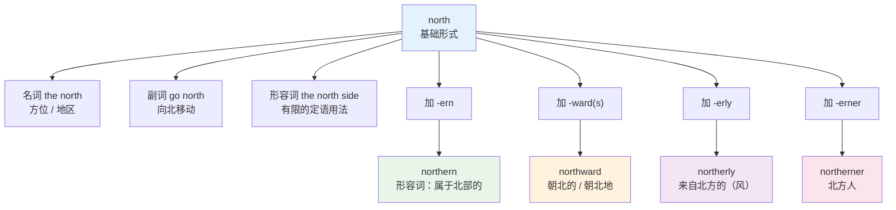
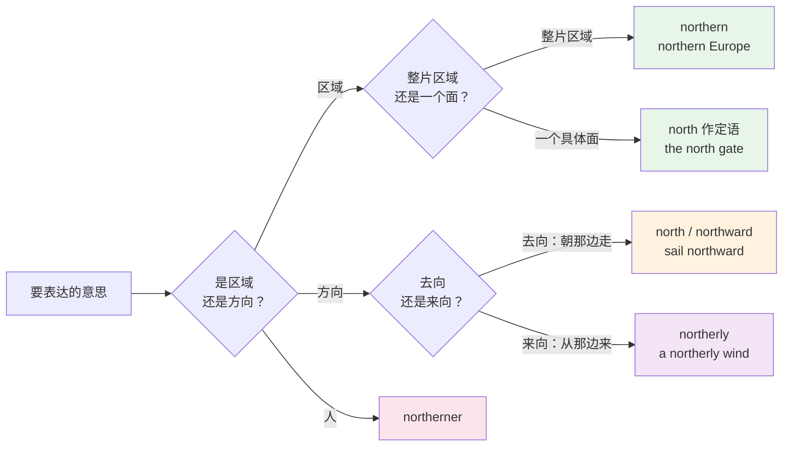
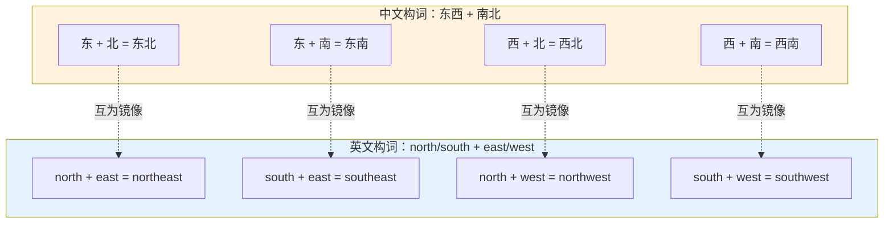
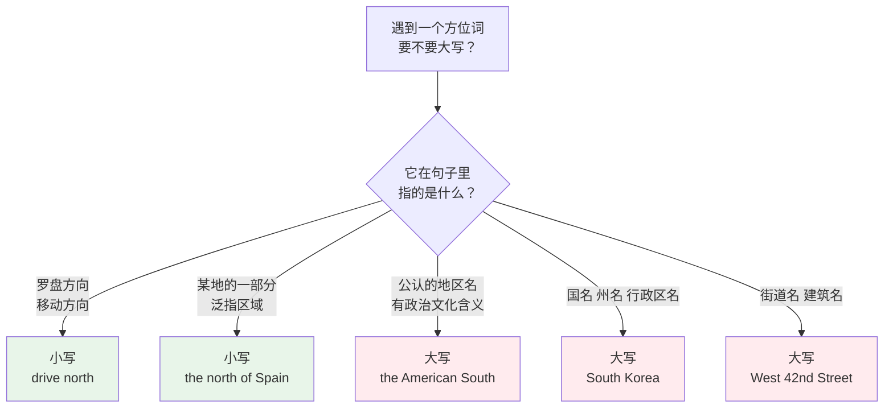
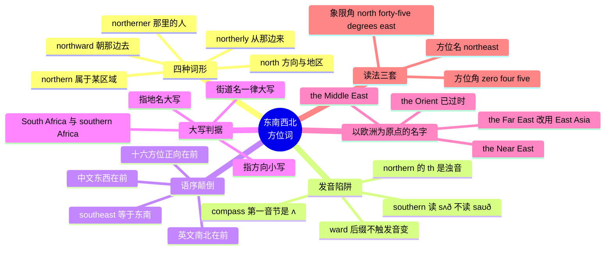

# 东南西北：方位词的三种形式

> [!info] 本篇定位
>
> 第五章的开篇，也是全章的坐标系。这一章讲空间关系，而空间关系的第一层是绝对方位——不依赖观察者站位的东南西北。
>
> 读完你会拿到四样东西：`north` 一个词衍生出的四种形式各自管什么；中文「东南」为什么在英语里是 `southeast` 而不是 `eastsouth`；什么时候写 `the north`、什么时候必须写 `the North`；`the Far East` 和 `the Middle East` 这套名字是从哪里量出来的。
>
> 下一篇 [[05.方位与空间词汇/02.上下左右里外|上下左右里外]] 处理的是相对方位——依赖观察者的上下左右。两篇合起来才是完整的空间坐标系。介词本身的用法归 `02.功能词与封闭词类速查/02` 管，本篇只讲方位词自己的搭配。

---

## 1. 本篇导读：一个方位为什么要有四个词

中文表达方位，一个「北」字通吃所有场合：北方、北边、往北走、北风、北方人。词形不变，靠上下文和搭配的字区分。

英语不是这样。同一个方位概念在英语里至少有四个不同的词形，各自有固定的岗位：

```text
north       名词 / 副词      the north 北方；drive north 向北开
northern    形容词           northern Europe 北欧
northward   副词 / 形容词     move northward 向北移动
northerly   形容词 / 名词     a northerly wind 北风
```

把这四个词形当成同义词随便换，会造出母语者一眼看出问题的句子。`a northern wind` 不是完全不能说，但气象报告里没人这么写，因为「北风」这个概念在英语里被 `-erly` 这个后缀专门包了下来。

中文母语者在这一组词上的典型症状有三个。

**症状一：只会用光杆的 `north`。** 想说「北欧国家」，写成 `the north Europe countries`，正确说法是 `northern European countries`。`north` 做定语的场合远比中文的「北」窄。

**症状二：复合方位词顺序照搬中文。** 「东南亚」写成 `East South Asia`，正确是 `Southeast Asia`。中英在这里的语序是完全反的，不是偶尔反，是全部反。

**症状三：大写全凭感觉。** `I grew up in the North.` 和 `The kitchen faces north.` 两句里的方位词一个大写一个小写，判据是什么，多数人说不清。



上图是本篇前半部分的骨架。一个方位词根往外长出四条枝：`-ern` 管「属于哪个区域」，`-ward` 管「朝哪个方向运动」，`-erly` 管「从哪个方向来」加上「大致朝向」，`-erner` 管「哪里的人」。四条枝的语义边界清楚，混用就出错。后半部分处理的是复合方位、大写规则和地区专名，那部分的难点不在词形，在约定。

---

## 2. 四个基本方位：先把发音钉死

### 2.1 四个词本身

| 英文 | 英式音标 | 美式音标 | 词性 | 中文 | 搭配与说明 |
| --- | --- | --- | --- | --- | --- |
| **north** | /nɔːθ/ | /nɔːrθ/ | n./adv./adj. | 北；向北 | the north 方位；go north 向北；北半球习惯把它画在地图上方 |
| **south** | /saʊθ/ | /saʊθ/ | n./adv./adj. | 南；向南 | 英美同音；元音是双元音 /aʊ/，不是 /ɔː/ |
| **east** | /iːst/ | /iːst/ | n./adv./adj. | 东；向东 | 英美同音；日出方向，词源与「黎明」同根 |
| **west** | /west/ | /west/ | n./adv./adj. | 西；向西 | 英美同音；短元音 /e/，不要拉成 /eɪ/ |
| **cardinal points** | /ˈkɑːdɪnl pɔɪnts/ | /ˈkɑːrdɪnl pɔɪnts/ | n. | 基本方位（四正向） | 术语，指 N/E/S/W 四个；单数 cardinal point |
| **intercardinal** | /ˌɪntəˈkɑːdɪnl/ | /ˌɪntərˈkɑːrdɪnl/ | adj. | 隅向的（四斜向） | 指 NE/SE/SW/NW；同义词 ordinal directions |
| **compass** | /ˈkʌmpəs/ | /ˈkʌmpəs/ | n. | 罗盘；指南针 | 第一个音节是 /ʌ/ 不是 /ɒ/；复数 compasses 还指圆规 |
| **compass rose** | /ˈkʌmpəs rəʊz/ | /ˈkʌmpəs roʊz/ | n. | 罗盘花（地图上的方位标） | 地图角落那个星形方位标就叫这个 |

四个基本方位词里只有 `north` 有英美差异，差在词尾的 r。这个 r 在英式 RP 里不发音（非儿化），在美式 GenAm 里必须发出来。写音标时 `/nɔːθ/` 和 `/nɔːrθ/` 的区别就在这一个符号上。

`east` 和 `west` 完全同音，`south` 也完全同音——因为它们的词尾没有 r。这条规律贯穿本篇所有词表：凡是词干里带 r 的（north、及其派生），两列必然不同；不带 r 的，只在加了 `-er`、`-ern` 这类后缀之后才产生差异。

### 2.2 加后缀之后的发音突变

这是本节的重点，也是中文母语者读方位词时出错最多的地方。

`north` 的 th 读清辅音 /θ/，但 `northern` 的 th 读**浊辅音** /ð/。`south` 同理，而且 `southern` 除了 th 浊化，元音还从 /aʊ/ 塌成了 /ʌ/。

| 英文 | 英式音标 | 美式音标 | 词性 | 中文 | 搭配与说明 |
| --- | --- | --- | --- | --- | --- |
| **north** | /nɔːθ/ | /nɔːrθ/ | n. | 北 | th 清音 /θ/ |
| **northern** | /ˈnɔːðn/ | /ˈnɔːrðərn/ | adj. | 北部的 | th 变浊音 /ð/，这是不规则的 |
| **south** | /saʊθ/ | /saʊθ/ | n. | 南 | 元音 /aʊ/，th 清音 /θ/ |
| **southern** | /ˈsʌðn/ | /ˈsʌðərn/ | adj. | 南部的 | 元音变 /ʌ/ 且 th 变浊音，双重变化 |
| **southward** | /ˈsaʊθwəd/ | /ˈsaʊθwərd/ | adv./adj. | 向南 | 元音和 th 都不变，与 southern 形成对照 |
| **southerly** | /ˈsʌðəli/ | /ˈsʌðərli/ | adj./n. | 来自南方的；南风 | 跟着 southern 走，读 /ʌ/ |
| **southerner** | /ˈsʌðənə/ | /ˈsʌðərnər/ | n. | 南方人 | 同样读 /ʌ/ |

> [!warning] 最高频的两个读音错误
>
> - ❌ ~~southern 读成 /ˈsaʊðən/~~
> - ✅ **southern** /ˈsʌðn/ · /ˈsʌðərn/，第一个音节和 `sun`、`some`、`money` 的元音相同
>
> - ❌ ~~northern 的 th 读成清音 /θ/~~
> - ✅ **northern** /ˈnɔːðn/ · /ˈnɔːrðərn/，th 是浊的，和 `mother`、`brother` 同一个音
>
> 规律记法：`-ern` 和 `-erly` 会触发音变，`-ward` 不会。所以 `southward` 保留 /saʊθ/，`southern` 变成 /sʌð/。同一个词根，两条后缀走了两条路。

`east` 和 `west` 加后缀不发生音变，`eastern` /ˈiːstən/、`western` /ˈwestən/ 直接在词干后面接就行。这也解释了为什么学习者对 `southern` 特别没有防备——另外三个都是规则的，只有南北这两个不规则。

> [!tip] 顺带记住一个地名
>
> 伦敦的 Southwark 区读 /ˈsʌðək/，不读 /ˈsaʊθwɔːk/。和 `southern` 走的是同一条音变路线，词里的 w 完全不发音。看到 `south-` 开头的英国地名，先怀疑它读 /sʌð/。

---

## 3. 四种形式的分工

### 3.1 `-ern`：描述归属，回答「属于哪片区域」

`northern`、`southern`、`eastern`、`western` 是最常用的方位形容词，语义是「位于某地区北部的、属于某地区北部的」。

| 英文 | 英式音标 | 美式音标 | 词性 | 中文 | 搭配与说明 |
| --- | --- | --- | --- | --- | --- |
| **northern** | /ˈnɔːðn/ | /ˈnɔːrðərn/ | adj. | 北部的 | northern Europe；the northern hemisphere |
| **southern** | /ˈsʌðn/ | /ˈsʌðərn/ | adj. | 南部的 | southern China；a southern accent |
| **eastern** | /ˈiːstən/ | /ˈiːstərn/ | adj. | 东部的 | eastern Europe；Eastern philosophy（大写时指东方文明） |
| **western** | /ˈwestən/ | /ˈwestərn/ | adj. | 西部的 | western Canada；a western（名词义：西部片） |
| **midwestern** | /ˌmɪdˈwestən/ | /ˌmɪdˈwestərn/ | adj. | （美国）中西部的 | 只用于美国语境 |
| **northeastern** | /ˌnɔːθˈiːstən/ | /ˌnɔːrθˈiːstərn/ | adj. | 东北部的 | northeastern China |
| **northwestern** | /ˌnɔːθˈwestən/ | /ˌnɔːrθˈwestərn/ | adj. | 西北部的 | the northwestern United States |
| **southeastern** | /ˌsaʊθˈiːstən/ | /ˌsaʊθˈiːstərn/ | adj. | 东南部的 | southeastern Australia |
| **southwestern** | /ˌsaʊθˈwestən/ | /ˌsaʊθˈwestərn/ | adj. | 西南部的 | the southwestern desert |

> [!example] `-ern` 的典型用法
>
> - The company opened three offices in **northern** Italy.
>   - 公司在意大利北部开了三家办事处。
> - She has a strong **southern** accent.
>   - 她有很重的南方口音。
> - **Western** medicine and traditional Chinese medicine take different approaches.
>   - 西医和中医的路径不同。
> - The storm hit the **northeastern** coast overnight.
>   - 暴风雨夜间袭击了东北海岸。

裸用 `north` 做定语的场合比 `northern` 少得多，而且义项不同。`the north side of the building`（建筑的北面）指的是具体的一个面，`the northern side` 反而别扭。粗略的判据是：修饰**具体的、可指认的一个面或一部分**用 `north`，修饰**一片区域**用 `northern`。

| 用 north 做定语 | 用 northern 做定语 |
| --- | --- |
| the north wall 北墙 | northern Europe 北欧 |
| the north gate 北门 | the northern half 北半部 |
| the north bank 北岸 | northern accent 北方口音 |
| North Station 北站（专名） | northern climate 北方气候 |

### 3.2 `-ward(s)`：描述运动，回答「朝哪个方向去」

| 英文 | 英式音标 | 美式音标 | 词性 | 中文 | 搭配与说明 |
| --- | --- | --- | --- | --- | --- |
| **northward** | /ˈnɔːθwəd/ | /ˈnɔːrθwərd/ | adv./adj. | 向北（地/的） | 美式偏好不带 s 的形式 |
| **northwards** | /ˈnɔːθwədz/ | /ˈnɔːrθwərdz/ | adv. | 向北地 | 英式常用；只能作副词 |
| **southward** | /ˈsaʊθwəd/ | /ˈsaʊθwərd/ | adv./adj. | 向南（地/的） | 注意保留 /aʊ/ |
| **eastward** | /ˈiːstwəd/ | /ˈiːstwərd/ | adv./adj. | 向东（地/的） | eastward expansion 东扩 |
| **westward** | /ˈwestwəd/ | /ˈwestwərd/ | adv./adj. | 向西（地/的） | westward migration 西迁 |
| **homeward** | /ˈhəʊmwəd/ | /ˈhoʊmwərd/ | adv./adj. | 向家的方向 | homeward bound 归途中 |
| **seaward** | /ˈsiːwəd/ | /ˈsiːwərd/ | adv./adj. | 朝海的方向 | 与 landward 相对 |
| **landward** | /ˈlændwəd/ | /ˈlændwərd/ | adv./adj. | 朝陆地的方向 | 多见于航海与海岸工程 |

`-ward` 的语义核心是**运动的指向**，不是位置。它拆开看是 `north` + `-ward`（古英语 `-weard`，意为「朝向」）。

带 s 与不带 s 的区别只有两条，都很好记：

1. 不带 s 的 `northward` 既能作副词也能作形容词；带 s 的 `northwards` 只能作副词。所以 `a northward journey` 成立，~~`a northwards journey`~~ 不成立。
2. 作副词时，英式英语偏好 `northwards`，美式英语偏好 `northward`。两者都不算错。

> [!example] `-ward` 与 `-ern` 不能互换
>
> - ✅ The birds migrate **southward** in October.
>   - 候鸟十月南飞。（描述运动方向）
> - ❌ ~~The birds migrate southern in October.~~
> - ✅ The birds spend winter in **southern** Spain.
>   - 候鸟在西班牙南部过冬。（描述所在区域）
> - ❌ ~~The birds spend winter in southward Spain.~~

裸用的 `north` 也能作方向副词，`go north`、`head north`、`drive north` 都成立，而且比 `go northward` 更口语。`-ward` 形式偏书面，常出现在地理、航海、军事、迁徙这类语境里。

### 3.3 `-erly`：气象专用，回答「风从哪里来」

这是四种形式里最容易被中文母语者忽略的一个，也是最容易搞反的一个。

| 英文 | 英式音标 | 美式音标 | 词性 | 中文 | 搭配与说明 |
| --- | --- | --- | --- | --- | --- |
| **northerly** | /ˈnɔːðəli/ | /ˈnɔːrðərli/ | adj./n. | 来自北方的；北风 | a northerly wind 北风（从北吹来） |
| **southerly** | /ˈsʌðəli/ | /ˈsʌðərli/ | adj./n. | 来自南方的；南风 | 读 /ʌ/，跟 southern 一致 |
| **easterly** | /ˈiːstəli/ | /ˈiːstərli/ | adj./n. | 来自东方的；东风 | a strong easterly 一场强东风 |
| **westerly** | /ˈwestəli/ | /ˈwestərli/ | adj./n. | 来自西方的；西风 | the westerlies 西风带（复数专名） |
| **northeasterly** | /ˌnɔːθˈiːstəli/ | /ˌnɔːrθˈiːstərli/ | adj./n. | 来自东北的；东北风 | 气象预报高频 |
| **southwesterly** | /ˌsaʊθˈwestəli/ | /ˌsaʊθˈwestərli/ | adj./n. | 来自西南的；西南风 | 同上 |

> [!warning] 风向词的方向是反的
>
> 英语描述风，用的是**风的来源方向**，不是风吹去的方向。这一点和中文一致（中文的「北风」也是从北边来的风），但和 `-ward` 形式的直觉相反，一旦两个词形放在同一句里就容易乱。
>
> - **a northerly wind** = 从北边吹来的风 = 北风，把东西往南吹
> - **a northward current** = 朝北流的水流
>
> 同一个词根，`-erly` 表来向，`-ward` 表去向。气象与航海文本里两个词经常同段出现，读错方向后面整段推理都会歪。
>
> - ✅ A **northerly** gale pushed the boat **southward**.
>   - 北风把船往南推。
> - ❌ ~~A northward gale pushed the boat southerly.~~

`-erly` 还有第二个义项，跟风无关：表示「大致朝某个方向的」，语气比 `-ern` 松。`the most northerly point of the island`（岛上最北端的一点）里的 `northerly` 和风毫无关系，它强调的是「在所有点里最靠北」。这个义项在描述极值、边界、航线时常见。

> [!example] `-erly` 的第二个义项
>
> - Reykjavik is the world's most **northerly** capital.
>   - 雷克雅未克是世界上最靠北的首都。
> - The plane changed to a more **westerly** course.
>   - 飞机转向了偏西的航线。
> - They set off in a general **easterly** direction.
>   - 他们朝大致向东的方向出发。

注意最后一句里的 `direction`。`in a northerly direction` 是固定说法，比 `northward` 更常见于正式书面语；而 ~~`in a northern direction`~~ 不成立，因为 `northern` 不描述方向，只描述区域。

### 3.4 `-erner`：方位变成人

| 英文 | 英式音标 | 美式音标 | 词性 | 中文 | 搭配与说明 |
| --- | --- | --- | --- | --- | --- |
| **northerner** | /ˈnɔːðənə/ | /ˈnɔːrðərnər/ | n. | 北方人 | 大写 Northerner 特指某国北部居民 |
| **southerner** | /ˈsʌðənə/ | /ˈsʌðərnər/ | n. | 南方人 | 美国语境里 Southerner 指南方各州人 |
| **easterner** | /ˈiːstənə/ | /ˈiːstərnər/ | n. | 东方人；东部人 | 美国指东岸人；泛指亚洲人时用词过时 |
| **westerner** | /ˈwestənə/ | /ˈwestərnər/ | n. | 西方人；西部人 | 大写 Westerner 指欧美人 |
| **Midwesterner** | /ˌmɪdˈwestənə/ | /ˌmɪdˈwestərnər/ | n. | 美国中西部人 | 固定大写 |

这一组和上面三组的差别在于它们全是名词，而且带有明显的文化含义。`a Southerner` 在美国语境里不只是「住在南边的人」，还携带口音、饮食、历史这一整套联想。第八章 `08.家庭人际与社会身份` 会展开这类身份名词，本篇只标出词形。

### 3.5 四种形式对照判据

| 你想说什么 | 用哪个形式 | 例子 |
| --- | --- | --- |
| 这片地方属于北部 | **northern** | northern Italy |
| 建筑物具体的北面 | **north**（定语） | the north wall |
| 朝北移动 | **north** / **northward(s)** | head north / drift northward |
| 风从北边来 | **northerly** | a northerly breeze |
| 在所有点里最靠北 | **northerly**（最高级） | the most northerly island |
| 北方来的人 | **northerner** | a northerner from Manchester |
| 北方这个地区（作名词） | **the north** / **the North** | he moved to the North |



上图把选词过程拆成两次二选一。第一次问的是「我说的是一片地方、一个动作，还是一个人」，第二次在区域和方向两条分支里各再切一刀。绝大部分选词困难在走完这两步之后就消失了。真正需要背的只有一条：来向用 `-erly`，去向用 `-ward`，这两个后缀的语义方向是相反的。

---

## 4. 中英语序颠倒：东南为什么是 southeast

### 4.1 一条没有例外的规则

中文的复合方位词把东西放前面、南北放后面：**东**南、**东**北、**西**南、**西**北。

英语正好相反，把南北放前面、东西放后面：**south**east、**north**east、**south**west、**north**west。

这条规则在英语里没有例外。~~`eastnorth`~~、~~`westsouth`~~ 这类形式在英语中不存在，不是罕见，是根本不合法。原因是英语的复合方位词遵循「先取南北基准，再往东西偏」的构造逻辑——`northeast` 字面就是「北，往东偏」。

| 中文 | 英文 | 英式音标 | 美式音标 | 缩写 | 顺序对照 |
| --- | --- | --- | --- | --- | --- |
| 东北 | **northeast** | /ˌnɔːθˈiːst/ | /ˌnɔːrθˈiːst/ | NE | 中文东在前，英文北在前 |
| 东南 | **southeast** | /ˌsaʊθˈiːst/ | /ˌsaʊθˈiːst/ | SE | 中文东在前，英文南在前 |
| 西北 | **northwest** | /ˌnɔːθˈwest/ | /ˌnɔːrθˈwest/ | NW | 中文西在前，英文北在前 |
| 西南 | **southwest** | /ˌsaʊθˈwest/ | /ˌsaʊθˈwest/ | SW | 中文西在前，英文南在前 |



上图把两套构词摆在一起对照。中文的第一个字对应英文的第二个词素，中文的第二个字对应英文的第一个词素，四组全部如此。翻译时把两个字调个个儿就行，不需要记四条独立的对应关系。

> [!tip] 一个不会记反的办法
>
> 记住 `north` 和 `south` 永远排在前面，`east` 和 `west` 永远排在后面。这样只需要记住一句话，不需要记四个词。
>
> 反过来推：看到 `southeast`，先读到 `south`（南），再读到 `east`（东），中文按「东西在前」的习惯重排，就是「东南」。

`Southeast Asia`（东南亚）是这条规则最高频的检验点。写成 ~~`East South Asia`~~ 或 ~~`Eastsouth Asia`~~ 都是错的，这两个形式在中国学习者的写作里反复出现。

| 英文 | 英式音标 | 美式音标 | 词性 | 中文 | 搭配与说明 |
| --- | --- | --- | --- | --- | --- |
| **Southeast Asia** | /ˌsaʊθiːst ˈeɪʃə/ | /ˌsaʊθiːst ˈeɪʒə/ | n. | 东南亚 | 两词都大写，Southeast 不加连字符；Asia 英式读 /ˈeɪʃə/，美式读 /ˈeɪʒə/ |
| **Northeast China** | /ˌnɔːθiːst ˈtʃaɪnə/ | /ˌnɔːrθiːst ˈtʃaɪnə/ | n. | 中国东北 | 也常写 the Northeast 或音译 Dongbei |
| **the Northwest Passage** | /ˌnɔːθwest ˈpæsɪdʒ/ | /ˌnɔːrθwest ˈpæsɪdʒ/ | n. | 西北航道 | 加拿大北极群岛间的航线 |
| **the Southwest** | /ðə ˌsaʊθˈwest/ | /ðə ˌsaʊθˈwest/ | n. | （美国）西南部 | 亚利桑那、新墨西哥一带 |
| **the Pacific Northwest** | /pəˌsɪfɪk ˌnɔːθˈwest/ | /pəˌsɪfɪk ˌnɔːrθˈwest/ | n. | 太平洋西北地区 | 华盛顿州、俄勒冈州、不列颠哥伦比亚 |

### 4.2 十六方位与三十二方位

四正向加四隅向是八个点。再往下细分是十六点，做法是把隅向的名字再和相邻的正向拼一次，正向永远写在前面。

| 缩写 | 全称 | 中文 | 方位角 |
| --- | --- | --- | --- |
| N | north | 正北 | 0° / 360° |
| NNE | north-northeast | 北北东 | 22.5° |
| NE | northeast | 东北 | 45° |
| ENE | east-northeast | 东北东 | 67.5° |
| E | east | 正东 | 90° |
| ESE | east-southeast | 东南东 | 112.5° |
| SE | southeast | 东南 | 135° |
| SSE | south-southeast | 南南东 | 157.5° |
| S | south | 正南 | 180° |
| SSW | south-southwest | 南南西 | 202.5° |
| SW | southwest | 西南 | 225° |
| WSW | west-southwest | 西南西 | 247.5° |
| W | west | 正西 | 270° |
| WNW | west-northwest | 西北西 | 292.5° |
| NW | northwest | 西北 | 315° |
| NNW | north-northwest | 北北西 | 337.5° |

十六点的构造规律有两条：

1. 名字里出现两个词素时，正向（N/S/E/W）在前，隅向（NE/SE/SW/NW）在后。所以是 `north-northeast` 不是 ~~`northeast-north`~~。
2. 十六点里的三词素名（NNE、ENE 等）一律用连字符连接，两个词素的隅向名（NE、SE）在美式拼写里不加连字符。

再往下是三十二点，用 `by` 连接：`north by east`（N by E）、`northeast by north`（NE by N）。这一层只在传统航海和文学作品里出现，现代导航直接用度数。三十二点里每一点相隔 11.25°。

> [!tip] 罗盘全读一遍叫 box the compass
>
> `box the compass` 是航海术语，指按顺序背出罗盘所有三十二个点。引申义是「兜了一圈又回到原点」，用来说某人立场绕了一整圈。
>
> - He has **boxed the compass** on this issue three times this year.
>   - 他今年在这个问题上立场绕了三圈。

### 4.3 连字符：英美拼写的一处分歧

| 形式 | 英式偏好 | 美式偏好 | 说明 |
| --- | --- | --- | --- |
| 八方位 | north-east / south-west | northeast / southwest | 英式传统上加连字符，但现代英式媒体也大量用不加的形式 |
| 十六方位 | north-north-east | north-northeast | 三词素时两边都用连字符，只是切分点不同 |
| 形容词形式 | north-eastern | northeastern | 同上 |
| 专名 | 一律不加：Southeast Asia、Northwest Territories | 同 | 专名跟随官方拼写 |

写作时的处理原则很简单：一篇文档里保持一致就行。给国际读者写技术文档时，选美式的紧凑拼写（`northeast`、`southeastern`）风险最低——它在英式语境里也完全可接受，反过来则会显得刻意。

---

## 5. compass point 的三套读法

### 5.1 方位名读法

日常场合直接读方位名，缩写要还原成全称。

```text
NE   读作 north-east / northeast     不读 "en ee"
SSW  读作 south-southwest            不读 "es es double-u"
WNW  读作 west-northwest             不读 "double-u en double-u"
```

例外是地址和表格里的缩写，那里可以按字母读：`123 N Main St` 口头念作 `one twenty-three North Main Street`，但表格里的列头 `N/S` 可以直接念字母。

### 5.2 方位角读法：一位一位念

导航、航空、军事里用 000° 到 359° 的三位数表示方位，**逐位读出**，不读整数。

```text
045    读作 zero four five        不读 forty-five
270    读作 two seven zero        不读 two hundred seventy
360    读作 three six zero        表示正北
```

这个规则的原因是无线电通话里数字容易听错，逐位读把误听的代价降到最低。同样的逻辑下，ICAO 的标准通话字母数字表把 9 读作 `niner`，把 3 读作 `tree`、5 读作 `fife`——都是为了让每个数字的音在噪声里彼此拉开距离。

| 英文 | 英式音标 | 美式音标 | 词性 | 中文 | 搭配与说明 |
| --- | --- | --- | --- | --- | --- |
| **bearing** | /ˈbeərɪŋ/ | /ˈberɪŋ/ | n. | 方位角；方位 | take a bearing 测方位；复数 bearings 另有「方向感」义 |
| **heading** | /ˈhedɪŋ/ | /ˈhedɪŋ/ | n. | 航向 | 飞机与船只当前机头/船头指向 |
| **azimuth** | /ˈæzɪməθ/ | /ˈæzɪməθ/ | n. | 方位角 | 天文与测量术语，从正北顺时针量 |
| **degree** | /dɪˈɡriː/ | /dɪˈɡriː/ | n. | 度 | 符号 °；45 degrees |
| **quadrant** | /ˈkwɒdrənt/ | /ˈkwɑːdrənt/ | n. | 象限 | 罗盘被四正向分成四个象限 |
| **grid north** | /ˌɡrɪd ˈnɔːθ/ | /ˌɡrɪd ˈnɔːrθ/ | n. | 坐标北 | 地图投影网格的北，与真北有偏差 |
| **true north** | /ˌtruː ˈnɔːθ/ | /ˌtruː ˈnɔːrθ/ | n. | 真北 | 指向地理北极 |
| **magnetic north** | /mæɡˌnetɪk ˈnɔːθ/ | /mæɡˌnetɪk ˈnɔːrθ/ | n. | 磁北 | 指南针指向的方向，逐年漂移 |
| **declination** | /ˌdekləˈneɪʃn/ | /ˌdekləˈneɪʃn/ | n. | 磁偏角 | 真北与磁北的夹角；英式也说 variation |
| **due** | /djuː/ | /duː/ | adv. | 正（方向） | due north 正北；只与四正向搭配 |

> [!warning] `due` 只能配四正向
>
> `due north`、`due south`、`due east`、`due west` 都成立，意思是「正北、正南、正东、正西」，没有任何偏差。
>
> - ❌ ~~due northeast~~
> - ✅ **northeast** 本身已经是精确的 45°，不需要 due 加强
>
> 另外注意 `due` 的英美读音差异：英式 /djuː/ 有个 j 音，美式 /duː/ 没有。这个差异和 `duty`、`during`、`Tuesday` 是同一条规律。

### 5.3 象限角读法：测绘专用

测绘和产权文书里用第三套记法，从南北出发朝东西偏，写成 `N 30° E`，读作 `north thirty degrees east`。

```text
N 30° E    读 north thirty degrees east      从正北向东偏 30°
S 45° W    读 south forty-five degrees west  从正南向西偏 45°
N 0° E     等价于 due north
```

这套记法的角度永远在 0° 到 90° 之间，因为它是相对于最近的南北基准量的。看到 `N 30° E` 千万别理解成方位角 30° 加上东——它就等于方位角 030°。

> [!example] 三套读法读同一个方向
>
> 同一个「北偏东 45 度」，三套体系的说法：
>
> - 方位名：**northeast**（NE）
> - 方位角：**zero four five**（045°）
> - 象限角：**north forty-five degrees east**（N 45° E）
>
> 三种写法出现在不同文本里：天气预报和日常对话用第一种，航海航空用第二种，土地测绘和法律文书用第三种。

---

## 6. 大写规则：the north 与 the North

### 6.1 一句话判据

**指方向，小写；指有名有姓的地区，大写。**

这条判据背后的逻辑是英语的普通名词与专有名词之分。`north` 表示罗盘上的一个方向时是普通名词，和 `left`、`up` 一样，没理由大写。而 `the North` 指美国南北战争里的北方阵营、指英格兰的北部诸郡时，它已经变成了一个地区的名字，等同于 `the Midlands`、`Scotland`，必须大写。



上图把大写判断收成五个出口，前两个小写、后三个大写。灰色地带只有一处：某个区域算不算「公认的地区名」，各家风格手册的宽严不一。芝加哥手册的取向是从宽小写，遇到不确定的先写小写；而报社风格手册对本国内的知名区域大多从严大写。

### 6.2 对照词表

| 小写用法 | 大写用法 | 差别在哪 |
| --- | --- | --- |
| Walk **north** for two blocks. 向北走两个街区 | He moved to **the North** after college. 他毕业后搬去了北方 | 前者是方向，后者是地区 |
| the **north** of England 英格兰的北部 | **the North of England** 英格兰北部（作为一个文化区域） | 后者已被当作专名对待 |
| **northern** China 中国北部 | the **North** China Plain 华北平原 | 后者是地理专名 |
| **southern** Africa 非洲南部这片地方 | **South Africa** 南非（国家） | 一个是区域一个是国家 |
| **western** countries 西边的国家（字面） | **Western** countries 西方国家（政治文化概念） | 后者指欧美阵营 |
| the **east** coast 东边的海岸（泛指） | the **East Coast** 美国东岸（专指） | 后者是美国语境里的固定区域 |
| a **southerly** wind 南风 | — | 风向词从不大写 |

> [!warning] `southern Africa` 和 `South Africa` 完全是两码事
>
> 这一对是方位词大写规则里代价最高的错误。
>
> - **South Africa** = 南非共和国，一个国家，首都行政中心在比勒陀利亚
> - **southern Africa** = 非洲南部这一整片地区，包含南非、纳米比亚、博茨瓦纳、津巴布韦等
>
> 写 `He works in South Africa` 和 `He works in southern Africa` 传递的是两个不同的事实。同样的对立还有：
>
> - **North Korea**（朝鲜）vs **northern Korea**（朝鲜半岛的北部地区）
> - **West Virginia**（西弗吉尼亚州）vs **western Virginia**（弗吉尼亚州的西部）
> - **East Timor**（东帝汶）vs **eastern Timor**（帝汶岛的东部）

### 6.3 固定大写的国名与行政区名

| 英文 | 英式音标 | 美式音标 | 词性 | 中文 | 搭配与说明 |
| --- | --- | --- | --- | --- | --- |
| **North Korea** | /ˌnɔːθ kəˈriːə/ | /ˌnɔːrθ kəˈriːə/ | n. | 朝鲜 | 官方名 the DPRK |
| **South Korea** | /ˌsaʊθ kəˈriːə/ | /ˌsaʊθ kəˈriːə/ | n. | 韩国 | 官方名 the Republic of Korea |
| **South Africa** | /ˌsaʊθ ˈæfrɪkə/ | /ˌsaʊθ ˈæfrɪkə/ | n. | 南非 | 形容词 South African |
| **Northern Ireland** | /ˌnɔːðən ˈaɪələnd/ | /ˌnɔːrðərn ˈaɪərlənd/ | n. | 北爱尔兰 | 英国四个构成国之一，注意用 Northern 不用 North |
| **West Virginia** | /ˌwest vəˈdʒɪniə/ | /ˌwest vərˈdʒɪniə/ | n. | 西弗吉尼亚州 | 与 Virginia 是两个州 |
| **East Timor** | /ˌiːst ˈtiːmɔː/ | /ˌiːst ˈtiːmɔːr/ | n. | 东帝汶 | 也叫 Timor-Leste |
| **the Midwest** | /ðə ˌmɪdˈwest/ | /ðə ˌmɪdˈwest/ | n. | 美国中西部 | 芝加哥、底特律一带；固定带 the |
| **the West Coast** | /ðə ˌwest ˈkəʊst/ | /ðə ˌwest ˈkoʊst/ | n. | 美国西岸 | 加州、俄勒冈、华盛顿州 |
| **the Deep South** | /ðə ˌdiːp ˈsaʊθ/ | /ðə ˌdiːp ˈsaʊθ/ | n. | （美国）深南部 | 密西西比、亚拉巴马等州 |
| **Northern Europe** | /ˌnɔːðən ˈjʊərəp/ | /ˌnɔːrðərn ˈjʊrəp/ | n. | 北欧 | 联合国分区用大写；泛指时也写 northern Europe |
| **Southern California** | /ˌsʌðən kæləˈfɔːniə/ | /ˌsʌðərn kæləˈfɔːrniə/ | n. | 南加州 | 缩写 SoCal |
| **the Antipodes** | /ði ænˈtɪpədiːz/ | /ði ænˈtɪpədiːz/ | n. | 对跖地（指澳新） | 英式用语，带戏谑色彩 |

`Northern Ireland` 是个值得单独记的点：它用的是 `-ern` 形容词，不是裸的 `North`。而 `North Korea` 用的是裸词。这类专名的构造没有规律，只能按名字记住，不能类推。

### 6.4 街道、路线与地址

美国的城市街道大量使用方位词作为名字的一部分，一律大写。

```text
West 42nd Street          西 42 街
North Michigan Avenue     北密歇根大道
123 S Main St             缩写形式，S 大写不加句点（美式邮政格式）
Interstate 95 North       95 号州际公路北行方向
```

交通标识上的 `North`、`South` 表示的是**行进方向**而非地区，但因为它是路线名的一部分，仍然大写。这是判据的一个边角情形：**只要它构成了名称的一部分，就大写**，哪怕语义上仍然是方向。

---

## 7. the Far East 与 the Middle East：从欧洲量出来的名字

### 7.1 三个「东」

`the Near East`、`the Middle East`、`the Far East` 这套名字是十九世纪英国人从伦敦往东数出来的：近的叫近东，中间的叫中东，远的叫远东。中国在这套体系里属于远东。

| 英文 | 英式音标 | 美式音标 | 词性 | 中文 | 搭配与说明 |
| --- | --- | --- | --- | --- | --- |
| **the Near East** | /ðə ˌnɪər ˈiːst/ | /ðə ˌnɪr ˈiːst/ | n. | 近东 | 旧称，指土耳其、黎凡特一带；现已基本被 Middle East 吸收 |
| **the Middle East** | /ðə ˌmɪdl ˈiːst/ | /ðə ˌmɪdl ˈiːst/ | n. | 中东 | 形容词 Middle Eastern；最常用的一个 |
| **the Far East** | /ðə ˌfɑːr ˈiːst/ | /ðə ˌfɑːr ˈiːst/ | n. | 远东 | 指中日韩与东南亚；带殖民时代色彩，正式文本多改用 East Asia |
| **East Asia** | /ˌiːst ˈeɪʃə/ | /ˌiːst ˈeɪʒə/ | n. | 东亚 | 中性的地理术语，联合国用语 |
| **West Asia** | /ˌwest ˈeɪʃə/ | /ˌwest ˈeɪʒə/ | n. | 西亚 | 联合国用来替代 Middle East 的中性名 |
| **the Levant** | /ðə ləˈvænt/ | /ðə ləˈvænt/ | n. | 黎凡特（东地中海沿岸） | 词源是法语「日出之地」 |
| **MENA** | /ˈmiːnə/ | /ˈmiːnə/ | n. | 中东与北非 | Middle East and North Africa 的首字母缩略 |
| **the Orient** | /ði ˈɔːriənt/ | /ði ˈɔːriənt/ | n. | 东方 | 陈旧且带异国情调滤镜，现代写作避免使用 |
| **oriental** | /ˌɔːriˈentl/ | /ˌɔːriˈentl/ | adj. | 东方的 | 用于形容人时在美式语境中被视为冒犯，改用 Asian |
| **the Occident** | /ði ˈɒksɪdənt/ | /ði ˈɑːksɪdənt/ | n. | 西方 | 与 Orient 对应，更加陈旧，仅见于历史文本 |

同一片地理空间在英语里有两套命名。旧的一套以伦敦为原点按距离排：近东（土耳其、黎凡特）、中东（阿拉伯半岛、伊朗）、远东（中国、日本、朝鲜半岛）。新的一套不依赖观察者位置，按地理分区排：西亚、中亚、东亚。

| 旧称（以欧洲为原点） | 现代中性替代名 | 使用现状 |
| --- | --- | --- |
| the Near East | West Asia / the Eastern Mediterranean | 除考古学外基本退出 |
| the Middle East | West Asia | 旧称仍占主导，中性名主要见于联合国文件 |
| the Far East | East Asia | 正式写作已普遍改用新称 |

学术写作、国际组织文件、新闻稿越来越多地采用右列，因为「远东」这个说法预设了一个特定的观察点——对东京来说，欧洲才是远西。

`the Middle East` 是三个里唯一仍然广泛使用的，中文媒体也直接用「中东」，短期内不会被替代。`the Far East` 在日常英语里还能听到，但在正式文本里会被换成 `East Asia`。`the Near East` 现在几乎只出现在考古学和圣经研究里（`Ancient Near East` 古代近东是标准学术术语）。

### 7.2 `the West` 与语域问题

| 英文 | 英式音标 | 美式音标 | 词性 | 中文 | 搭配与说明 |
| --- | --- | --- | --- | --- | --- |
| **the West** | /ðə ˈwest/ | /ðə ˈwest/ | n. | 西方（政治文化概念） | 指欧美国家；也可指美国西部 |
| **Western** | /ˈwestən/ | /ˈwestərn/ | adj. | 西方的 | Western democracies；大写时是文化概念 |
| **Westernize** | /ˈwestənaɪz/ | /ˈwestərnaɪz/ | v. | 西化 | 英式也拼 Westernise |
| **the East** | /ði ˈiːst/ | /ði ˈiːst/ | n. | 东方；（美国）东部 | 语境决定所指 |
| **the Eastern Bloc** | /ði ˌiːstən ˈblɒk/ | /ði ˌiːstərn ˈblɑːk/ | n. | 东方集团 | 冷战术语，指苏联及东欧卫星国 |
| **the Global South** | /ðə ˌɡləʊbl ˈsaʊθ/ | /ðə ˌɡloʊbl ˈsaʊθ/ | n. | 全球南方 | 指发展中国家群体，取代旧称 Third World |
| **the Global North** | /ðə ˌɡləʊbl ˈnɔːθ/ | /ðə ˌɡloʊbl ˈnɔːrθ/ | n. | 全球北方 | 指发达经济体 |
| **north–south divide** | /ˌnɔːθ ˈsaʊθ dɪˌvaɪd/ | /ˌnɔːrθ ˈsaʊθ dɪˌvaɪd/ | n. | 南北差距 | 用于一国内部或全球尺度 |
| **Nordic** | /ˈnɔːdɪk/ | /ˈnɔːrdɪk/ | adj./n. | 北欧的 | 特指丹麦、挪威、瑞典、芬兰、冰岛五国 |
| **Scandinavian** | /ˌskændɪˈneɪviən/ | /ˌskændɪˈneɪviən/ | adj./n. | 斯堪的纳维亚的 | 范围比 Nordic 窄，通常不含芬兰、冰岛 |

> [!warning] 三个需要小心的词
>
> - **Oriental** 用来形容物品（Oriental rug 东方地毯）在英式英语里仍可接受，但用来形容人在美式语境里被普遍视为冒犯。指人一律用 `Asian`。
> - **the Far East** 在正式写作中最好换成 `East Asia`，除非在引用历史文献。
> - **the Third World** 已被 `the Global South` 或 `developing countries` 取代，前者带有冷战阵营划分的含义。
>
> 这三个词的问题都不是语法，是语域和时代。第十七章 `18.语域、英美差异与习语俚语` 会系统处理这类「语法正确但不合时宜」的词。

### 7.3 中文地名里的方位字

中文地名里的方位字进入英语时基本走两条路：音译或意译，很少混用。

| 中文 | 英文 | 处理方式 | 说明 |
| --- | --- | --- | --- |
| 北京 | Beijing | 音译 | 字面义「北方的京城」在英语里完全不体现 |
| 南京 | Nanjing | 音译 | 同上 |
| 河北 / 河南 | Hebei / Henan | 音译 | 不译成 North of the River |
| 山东 / 山西 | Shandong / Shanxi | 音译 | 陕西为区分写作 Shaanxi |
| 华北平原 | the North China Plain | 意译 | 地理术语走意译，且大写 |
| 东北 | Northeast China / Dongbei | 两种都用 | 学术文献两种并见 |
| 东南亚 | Southeast Asia | 意译 | 国际通行名，非中文特有 |
| 越南 | Vietnam | 音译 | 字面「越之南」不体现 |

行政区名一律音译，地理区域名倾向意译，这是一条比较可靠的分界。写英文时把「北京」写成 ~~`North Capital`~~ 是明显的错误，但把「华北平原」写成 ~~`Huabei Plain`~~ 也不地道。

---

## 8. 方位词的核心搭配：in、to 与 on 的三种空间关系

方位词最高频的三个搭配是三个不同的介词，对应三种空间关系。介词本身的完整体系在 `02.功能词与封闭词类速查/02` 里，本节只处理它们和方位词组合时的语义差别。

| 结构 | 空间关系 | 例句 | 中文 |
| --- | --- | --- | --- |
| **in** the north of A | B 在 A 内部的北部 | Scotland is **in the north of** Britain. | 苏格兰在不列颠北部（是不列颠的一部分） |
| **to** the north of A | B 在 A 之外的北边 | Norway is **to the north of** Denmark. | 挪威在丹麦以北（两国分离） |
| **on** the north side of A | B 在 A 的北侧那一面上 | The entrance is **on the north side of** the building. | 入口在楼的北侧 |

选这三个结构的过程是两层判断。第一层问 A 是什么：一片地域（国家、大洲、岛屿），还是一个有明确面的实体（建筑、广场、街区）。地域走第二层判断——B 在它范围之内用 `in`，在范围之外用 `to`；有面的实体不分内外，直接用 `on the ... side of`。中文的「在……北部」和「在……以北」正好对应前两支，第三支中文说「在……北侧」。

裸的 `on the north of A` 在现代英语里几乎不用。想表达「两国北边接壤」，母语者写 `A borders B to the north` 或 `A is on the northern border of B`，不会写 ~~`A is on the north of B`~~。中国的英语教材把三个介词并列教学，容易让人以为 `on the north of` 和另外两个是同一层级的选项。实际写作中 `in` 和 `to` 是主力，`on` 只在「某个面」和「边界」这两种情形下出现。

> [!example] 三种关系的完整对照
>
> - Guangdong is **in the south of** China.
>   - 广东在中国南部。（广东是中国的一部分）
> - Vietnam lies **to the south of** China.
>   - 越南在中国以南。（越南在中国之外）
> - The loading dock is **on the south side of** the warehouse.
>   - 装卸口在仓库的南侧。（同一实体的一个面）
> - Mongolia **borders** China **to the north**.
>   - 蒙古国与中国北部接壤。（接壤关系用 border，不用介词硬套）

另一组高频搭配是方位词直接跟在名词后面作后置修饰，这在新闻和地理描述里非常常见：

> [!example] 后置的方位表达
>
> - The town lies fifty kilometres **north of** the capital.
>   - 该镇位于首都以北五十公里。（north of 前面可以直接接距离）
> - The wind shifted **from the north to the northwest**.
>   - 风向从北转为西北。
> - The building faces **due south**.
>   - 这栋楼朝正南。（房产广告高频句式）
> - Turn **to your left** and keep heading **north**.
>   - 向左转，继续向北走。（左右是相对方位，见下一篇）

`fifty kilometres north of X` 这个结构里，`north of` 前面直接放距离，不需要任何介词。中文母语者常写成 ~~`in fifty kilometres to the north of X`~~，多了两个词。

---

## 9. 风向、航海与交通里的方位词

### 9.1 风向与气象

| 英文 | 英式音标 | 美式音标 | 词性 | 中文 | 搭配与说明 |
| --- | --- | --- | --- | --- | --- |
| **windward** | /ˈwɪndwəd/ | /ˈwɪndwərd/ | adj./n. | 迎风的；上风处 | 航海术语；the windward side 迎风面 |
| **leeward** | /ˈliːwəd/ | /ˈliːwərd/ | adj./n. | 背风的；下风处 | 航海口语里读 /ˈluːəd/ |
| **upwind** | /ˌʌpˈwɪnd/ | /ˌʌpˈwɪnd/ | adv./adj. | 逆风地 | sail upwind 顶风航行 |
| **downwind** | /ˌdaʊnˈwɪnd/ | /ˌdaʊnˈwɪnd/ | adv./adj. | 顺风地 | 也指气味传播的下风向 |
| **the westerlies** | /ðə ˈwestəliz/ | /ðə ˈwestərliz/ | n. | 西风带 | 中纬度盛行风，复数固定 |
| **the trade winds** | /ðə ˈtreɪd wɪndz/ | /ðə ˈtreɪd wɪndz/ | n. | 信风 | 低纬度东风带，帆船时代贸易航线靠它 |
| **monsoon** | /mɒnˈsuːn/ | /mɑːnˈsuːn/ | n. | 季风；雨季 | 词源阿拉伯语「季节」 |
| **nor'easter** | /nɔːˈriːstə/ | /nɔːrˈiːstər/ | n. | 东北风暴 | 美国东岸特有天气现象，省略式拼写 |
| **veer** | /vɪə/ | /vɪr/ | v. | （风向）顺时针转变；偏转 | 气象术语：风向顺时针转叫 veer |
| **back** | /bæk/ | /bæk/ | v. | （风向）逆时针转变 | 与 veer 相对，气象专用义 |

`veer` 和 `back` 这一对是气象英语里的专门用法：风向顺时针改变（如从南转西）叫 `veer`，逆时针改变（如从西转南）叫 `back`。这两个词在通用英语里的意思完全不同（`veer` 是「突然转向」，`back` 是「后退、支持」），读天气类文本时不能按通用义理解。

### 9.2 船与岸

| 英文 | 英式音标 | 美式音标 | 词性 | 中文 | 搭配与说明 |
| --- | --- | --- | --- | --- | --- |
| **starboard** | /ˈstɑːbəd/ | /ˈstɑːrbərd/ | n./adj. | 右舷 | 面朝船头时的右边；与方位无关 |
| **port** | /pɔːt/ | /pɔːrt/ | n./adj. | 左舷 | 旧称 larboard，因与 starboard 易混而改 |
| **offshore** | /ˌɒfˈʃɔː/ | /ˌɔːfˈʃɔːr/ | adj./adv. | 离岸的；海上的 | offshore wind 离岸风；offshore account 境外账户 |
| **onshore** | /ˌɒnˈʃɔː/ | /ˌɑːnˈʃɔːr/ | adj./adv. | 向岸的；陆上的 | onshore breeze 海风（从海吹向陆） |
| **inland** | /ˈɪnlənd/ | /ˈɪnlənd/ | adj./adv. | 内陆的；向内陆 | 作副词时重音后移 /ˌɪnˈlænd/ |
| **coastal** | /ˈkəʊstl/ | /ˈkoʊstl/ | adj. | 沿海的 | coastal region 沿海地区 |
| **upstream** | /ˌʌpˈstriːm/ | /ˌʌpˈstriːm/ | adv./adj. | 上游的；向上游 | 软件供应链里也用这个词 |
| **downstream** | /ˌdaʊnˈstriːm/ | /ˌdaʊnˈstriːm/ | adv./adj. | 下游的；向下游 | 同上 |
| **hinterland** | /ˈhɪntəlænd/ | /ˈhɪntərlænd/ | n. | 腹地 | 德语借词，指港口后方的内陆区域 |

`port` 和 `starboard` 是绝对方位在船上的替代品：船会转向，「左边」随之改变，但「左舷」不会。这套词的存在理由和方位词一致——需要一个不随观察者朝向而变的参照系。

`upstream` 和 `downstream` 对程序员另有一层含义。Git 里的 `upstream` 指被 fork 的原始仓库或本地分支跟踪的远程分支；供应链安全里的 `upstream dependency` 指你依赖的库，`downstream` 指依赖你的项目。这两个技术义项在第十九章 `20.专业领域词汇` 的 IT 篇里展开。

### 9.3 交通方向

| 英文 | 英式音标 | 美式音标 | 词性 | 中文 | 搭配与说明 |
| --- | --- | --- | --- | --- | --- |
| **northbound** | /ˈnɔːθbaʊnd/ | /ˈnɔːrθbaʊnd/ | adj. | 北行的 | the northbound platform 北行站台 |
| **southbound** | /ˈsaʊθbaʊnd/ | /ˈsaʊθbaʊnd/ | adj. | 南行的 | 同上结构 |
| **eastbound** | /ˈiːstbaʊnd/ | /ˈiːstbaʊnd/ | adj. | 东行的 | 高速公路标识常见 |
| **westbound** | /ˈwestbaʊnd/ | /ˈwestbaʊnd/ | adj. | 西行的 | 同上 |
| **inbound** | /ˈɪnbaʊnd/ | /ˈɪnbaʊnd/ | adj. | 进城的；入站的 | 网络语境指入站流量 |
| **outbound** | /ˈaʊtbaʊnd/ | /ˈaʊtbaʊnd/ | adj. | 出城的；出站的 | 同上 |
| **up north** | /ˌʌp ˈnɔːθ/ | /ˌʌp ˈnɔːrθ/ | adv. | 在北边；往北边 | 口语；隐含「北=上」的地图直觉 |
| **down south** | /ˌdaʊn ˈsaʊθ/ | /ˌdaʊn ˈsaʊθ/ | adv. | 在南边；往南边 | 与 up north 成对 |
| **out west** | /ˌaʊt ˈwest/ | /ˌaʊt ˈwest/ | adv. | 在西部 | 美式口语，指美国西部 |
| **back east** | /ˌbæk ˈiːst/ | /ˌbæk ˈiːst/ | adv. | 在东部 | 美式口语，从西部人视角说东岸 |

`up north` / `down south` 反映的是「北在地图上方」这个约定进入了语言。这个约定不是必然的——古代阿拉伯地图把南画在上方，中国古地图也有上南下北的传统——但现代英语已经把它固化成了 `up` 和 `down`。

英式英语有一个额外的复杂之处：伦敦人说去任何地方都可以是 `go down to X`，而去伦敦一律是 `go up to London`，不论地理方向。这套用法来自铁路时代的 `up line`（进京线）与 `down line`（出京线）。

---

## 10. 地理坐标系词汇

方位词往上一层就是坐标系。这一组词在读科普文章、地理资料、卫星与地图相关技术文档时是必备的。

| 英文 | 英式音标 | 美式音标 | 词性 | 中文 | 搭配与说明 |
| --- | --- | --- | --- | --- | --- |
| **latitude** | /ˈlætɪtjuːd/ | /ˈlætətuːd/ | n. | 纬度 | 横线；引申义「自由度」：give sb latitude |
| **longitude** | /ˈlɒŋɡɪtjuːd/ | /ˈlɑːndʒətuːd/ | n. | 经度 | 竖线；美式的 g 读 /dʒ/，英式读 /ɡ/ |
| **meridian** | /məˈrɪdiən/ | /məˈrɪdiən/ | n. | 子午线 | the prime meridian 本初子午线 |
| **parallel** | /ˈpærəlel/ | /ˈpærəlel/ | n. | 纬线；平行线 | the 38th parallel 三八线 |
| **the equator** | /ði ɪˈkweɪtə/ | /ði ɪˈkweɪtər/ | n. | 赤道 | 形容词 equatorial |
| **equatorial** | /ˌekwəˈtɔːriəl/ | /ˌekwəˈtɔːriəl/ | adj. | 赤道的 | equatorial rainforest 赤道雨林 |
| **hemisphere** | /ˈhemɪsfɪə/ | /ˈhemɪsfɪr/ | n. | 半球 | the northern hemisphere；也指大脑半球 |
| **pole** | /pəʊl/ | /poʊl/ | n. | 极；极点 | the North Pole 北极；the South Pole 南极 |
| **polar** | /ˈpəʊlə/ | /ˈpoʊlər/ | adj. | 极地的 | polar bear 北极熊；polar opposite 完全相反 |
| **the Arctic** | /ði ˈɑːktɪk/ | /ði ˈɑːrktɪk/ | n. | 北极地区 | 词源希腊语「熊」，指大熊星座 |
| **the Antarctic** | /ði ænˈtɑːktɪk/ | /ði ænˈtɑːrktɪk/ | n. | 南极地区 | anti- + arctic「熊的对面」 |
| **Antarctica** | /ænˈtɑːktɪkə/ | /ænˈtɑːrktɪkə/ | n. | 南极洲 | 大陆名，与 the Antarctic 区分 |
| **tropic** | /ˈtrɒpɪk/ | /ˈtrɑːpɪk/ | n. | 回归线 | the Tropic of Cancer 北回归线 |
| **tropical** | /ˈtrɒpɪkl/ | /ˈtrɑːpɪkl/ | adj. | 热带的 | tropical storm 热带风暴 |
| **temperate** | /ˈtempərət/ | /ˈtempərət/ | adj. | 温带的 | the temperate zone 温带 |
| **boreal** | /ˈbɔːriəl/ | /ˈbɔːriəl/ | adj. | 北方的（生态学） | the boreal forest 北方针叶林 |
| **navigate** | /ˈnævɪɡeɪt/ | /ˈnævɪɡeɪt/ | v. | 导航；航行 | 界面术语：navigate to a page |
| **navigation** | /ˌnævɪˈɡeɪʃn/ | /ˌnævɪˈɡeɪʃn/ | n. | 导航 | 前端的导航栏是 navigation bar |
| **coordinates** | /kəʊˈɔːdɪnəts/ | /koʊˈɔːrdɪnəts/ | n. | 坐标 | 复数使用；GPS coordinates |

> [!tip] 三个词根帮你记住这一组
>
> - **polar** 里的 `pol` 来自希腊语「轴」，所以 `pole` 是地轴的端点，`polar opposite` 是「轴的两端」即完全相反。
> - **Arctic** 来自希腊语 `arktos`「熊」，指北天极附近的大熊星座；`Antarctic` 就是 `anti-`「对面」加上它。北极的名字来自星象，南极的名字来自北极。
> - **tropic** 来自希腊语 `tropos`「转」，因为太阳直射点走到回归线就掉头返回。所以 `tropic` 和 `heliotrope`（向日葵）、`entropy`（熵）共享同一个词根。
>
> 这三条推导在第十五章 `15.词根、合成与缩略` 里属于希腊词根组，本篇提前用它们说明方位词并不孤立。

`latitude` 的引申义值得单独留意。`give someone latitude` 是「给某人自由裁量的余地」，`considerable latitude` 是「相当大的回旋空间」。这个引申来自纬度线的「宽度」意象，在管理和法律文本里出现频率不低。

---

## 11. 方位习语与引申义

方位词进入习语后，字面的空间义几乎完全消失，得单独记。

| 英文 | 英式音标 | 美式音标 | 词性 | 中文 | 搭配与说明 |
| --- | --- | --- | --- | --- | --- |
| **go south** | /ɡəʊ ˈsaʊθ/ | /ɡoʊ ˈsaʊθ/ | v. | 变糟；急转直下 | 美式口语，源自图表下跌方向 |
| **head north** | /hed ˈnɔːθ/ | /hed ˈnɔːrθ/ | v. | （数字）上涨 | 与 go south 成对，用于价格、股价 |
| **go west** | /ɡəʊ ˈwest/ | /ɡoʊ ˈwest/ | v. | 完蛋；坏掉 | 英式俚语，一战时期军队用语 |
| **poles apart** | /ˌpəʊlz əˈpɑːt/ | /ˌpoʊlz əˈpɑːrt/ | adj. | 天差地别 | 主谓结构：they are poles apart |
| **polar opposite** | /ˌpəʊlər ˈɒpəzɪt/ | /ˌpoʊlər ˈɑːpəzɪt/ | n. | 完全相反的事物 | the polar opposite of X |
| **get one's bearings** | /ɡet wʌnz ˈbeərɪŋz/ | /ɡet wʌnz ˈberɪŋz/ | v. | 弄清方向；熟悉状况 | 到新环境时的固定说法 |
| **lose one's bearings** | /luːz wʌnz ˈbeərɪŋz/ | /luːz wʌnz ˈberɪŋz/ | v. | 迷失方向；乱了阵脚 | 与上条相对 |
| **true north** | /ˌtruː ˈnɔːθ/ | /ˌtruː ˈnɔːrθ/ | n. | 真北；根本准则 | 管理语境里指「核心价值」 |
| **the north star** | /ðə ˈnɔːθ stɑː/ | /ðə ˈnɔːrθ stɑːr/ | n. | 北极星；指路方针 | 产品与战略语境高频：our north star metric |
| **the four corners of the earth** | /ðə ˌfɔː ˈkɔːnəz əv ði ˈɜːθ/ | /ðə ˌfɔːr ˈkɔːrnərz əv ði ˈɜːrθ/ | n. | 天涯海角 | from the four corners of the earth |
| **east and west, home is best** | — | — | — | 金窝银窝不如自家草窝 | 谚语，也说 east or west |
| **Down Under** | /ˌdaʊn ˈʌndə/ | /ˌdaʊn ˈʌndər/ | n./adv. | 澳大利亚与新西兰 | 从北半球视角的戏称，固定大写 |
| **the Wild West** | /ðə ˌwaɪld ˈwest/ | /ðə ˌwaɪld ˈwest/ | n. | 蛮荒西部；无规则地带 | 引申指缺乏监管的领域 |
| **orient** | /ˈɔːrient/ | /ˈɔːrient/ | v. | 使适应；定向 | orient oneself 辨明方向 |
| **orientate** | /ˈɔːriənteɪt/ | /ˈɔːriənteɪt/ | v. | 同 orient | 英式变体，美式罕用 |
| **orientation** | /ˌɔːriənˈteɪʃn/ | /ˌɔːriənˈteɪʃn/ | n. | 方向；入职培训 | new employee orientation 新员工培训 |
| **disoriented** | /dɪsˈɔːriəntɪd/ | /dɪsˈɔːriəntɪd/ | adj. | 迷失方向的；晕头转向的 | 英式也用 disorientated |

> [!example] 几个引申义的实际用法
>
> - The negotiations **went south** after the third round.
>   - 谈判在第三轮之后急转直下。
> - Their views on the issue are **poles apart**.
>   - 他们在这个问题上的看法天差地别。
> - Give me a day to **get my bearings** in the new codebase.
>   - 给我一天时间熟悉一下这个新代码库。
> - Retention is our **north star metric** this quarter.
>   - 这个季度我们的核心指标是留存率。
> - He felt completely **disoriented** after the long flight.
>   - 长途飞行之后他完全晕头转向。

`orient` 这个动词值得多说一句。它的名词形式 `the Orient`（东方）和动词形式 `orient`（定向）同源：中世纪欧洲的地图把东方画在上方，绘制地图的动作就叫「找出东方在哪」，于是 `orient` 从「朝东」泛化成了「定向」。今天说 `orient the map`（把地图摆正）时，已经没有任何「东」的含义残留。

`north star` 在产品和商业语境里是近十年高频起来的说法，`north star metric` 指一家公司或一个团队用来衡量核心价值的单一指标。这个用法是隐喻——北极星在夜空中位置固定，可以用来校准方向。

---

## 12. 中文母语者的错误清单

> [!warning] 高频错误逐条对照
>
> **词形选错**
>
> - ❌ ~~the north Europe countries~~
> - ✅ **northern European countries** 北欧国家
>
> - ❌ ~~a northern wind~~（气象语境）
> - ✅ **a northerly wind** 北风
>
> - ❌ ~~The ship sailed northern.~~
> - ✅ The ship sailed **northward**. / The ship sailed **north**. 船向北航行
>
> - ❌ ~~in a northern direction~~
> - ✅ **in a northerly direction** 朝大致向北的方向
>
> **语序照搬中文**
>
> - ❌ ~~East South Asia~~ / ~~Eastsouth Asia~~
> - ✅ **Southeast Asia** 东南亚
>
> - ❌ ~~the westnorth corner~~
> - ✅ **the northwest corner** 西北角
>
> **大写判断**
>
> - ❌ ~~He works in southern Africa's government.~~（想说南非政府）
> - ✅ He works in **South Africa**'s government. 他在南非政府工作
>
> - ❌ ~~I grew up in the north.~~（指美国北方阵营时）
> - ✅ I grew up in **the North**. 我在北方长大
>
> - ❌ ~~Drive North for two blocks.~~
> - ✅ Drive **north** for two blocks. 向北开两个街区
>
> **搭配与介词**
>
> - ❌ ~~Japan is in the east of China.~~（日本不在中国境内）
> - ✅ Japan is **to the east of** China. 日本在中国以东
>
> - ❌ ~~in fifty kilometres to the north of the city~~
> - ✅ **fifty kilometres north of** the city 城北五十公里处
>
> - ❌ ~~due northeast~~
> - ✅ **northeast**（隅向本身就精确，不加 due）
>
> **读音**
>
> - ❌ southern 读 ~~/ˈsaʊðən/~~
> - ✅ **southern** /ˈsʌðn/ · /ˈsʌðərn/
>
> - ❌ compass 读 ~~/ˈkɒmpəs/~~
> - ✅ **compass** /ˈkʌmpəs/ · /ˈkʌmpəs/
>
> - ❌ 045° 读 ~~forty-five degrees~~（导航场合）
> - ✅ **zero four five**

这份清单里最值得反复检查的是「语序」和「大写」两组。词形选错和读音错误影响的是自然度，语序和大写错误影响的是准确性——`South Africa` 和 `southern Africa` 的差别不是风格问题，是事实问题。

> [!tip] 一个自查动作
>
> 写完任何含方位词的句子，问自己两句话：
>
> 1. 这个方位词指的是**方向**还是**地名**？地名才大写。
> 2. 如果是复合方位，我有没有把 north/south 放在前面？
>
> 这两问覆盖了本篇八成的错误。

---

## 13. 本篇小结



这张图的六个分支对应本篇的六条主线：词形分工是选词问题，发音陷阱是产出问题，语序颠倒和大写判据是准确性问题，欧洲原点的地区名是语域问题，三套读法是文本类型问题。复习时按分支自查，哪一支答不上来就回到对应的章节，不必从头重读。

> [!success] 本篇核心要点回顾
>
> 1. 一个方位概念在英语里有四种形式，分工固定：`-ern` 指区域归属，`-ward(s)` 指去向，`-erly` 指来向（风）与大致朝向，`-erner` 指人。混用会造出母语者一眼看出问题的句子。
> 2. `-ern` 和 `-erly` 会触发发音突变，`-ward` 不会。`southern` 读 /ˈsʌðn/ 而 `southward` 读 /ˈsaʊθwəd/，同一个词根走了两条路。
> 3. 复合方位词的中英语序**完全相反**：中文东西在前，英文 north/south 在前。「东南」= `southeast`，没有例外。
> 4. 十六方位的构造规律是正向写在隅向前面：`north-northeast` 而不是 `northeast-north`。
> 5. 大写判据只有一句话：**指方向小写，指有名有姓的地区大写**。`South Africa`（南非）与 `southern Africa`（非洲南部）是两回事。
> 6. `the Far East` / `the Middle East` 这套名字是从伦敦往东量出来的，正式写作里 `the Far East` 已被 `East Asia` 取代，`Oriental` 指人在美式语境中被视为冒犯。
> 7. 三种介词搭配对应三种空间关系：`in the north of`（地域内部）、`to the north of`（地域之外）、`on the north side of`（实体的一个面）；接壤关系不用介词，改写成 `border ... to the north`。距离直接接 `north of`，不需要额外介词。
> 8. compass point 有三套读法：日常读方位名，导航逐位读方位角（045 读 zero four five），测绘读象限角（N 45° E）。

> [!success] 本篇练习清单
>
> - [ ] 把 `north` 的四种形式各写一个句子，确认 `-ern`、`-ward`、`-erly`、`-erner` 用在了对的岗位
> - [ ] 朗读 `north / northern / south / southern / southward / southerly` 六个词，检查 th 的清浊和 southern 的元音
> - [ ] 不看词表，写出「东北、东南、西北、西南」四个英文词及其三字母缩写
> - [ ] 背出十六方位里的八个隅向名（NNE 到 NNW），确认正向都写在前面
> - [ ] 判断下面四句该大写还是小写：`drive n/North`、`the n/North of England`、`s/South Africa`、`s/Southern California`
> - [ ] 用 `in the north of` / `to the north of` 各造一句，句中的两个地名要真的构成「内部」和「外部」关系
> - [ ] 把 `045°`、`270°`、`N 30° E` 三个方位读出来，用对各自的读法体系
> - [ ] 解释 `the Far East` 为什么在正式写作里被 `East Asia` 取代，并说出 `Oriental` 的使用禁忌

### 13.1 下一篇预告

> [!info] 下一篇：上下左右里外
>
> 本篇处理的是绝对方位——东南西北不随观察者改变。下一篇进入相对方位：`up`、`down`、`left`、`right`、`inside`、`outside` 这一套，它们的所指完全取决于观察者站在哪儿、朝哪边。
>
> [[05.方位与空间词汇/02.上下左右里外|上下左右里外]]
>
> 会覆盖 `up/down` 的方位义与引申义、`left/right` 的政治义项、`inside/outside` 与 `interior/exterior` 的语域差别、`top/bottom` 与 `above/below` 的区分，以及中文「里外」在英语里被拆成好几个词的现象。
>
> 本篇的 `port` / `starboard` 之所以存在，正是因为「左右」不可靠——下一篇会把这个问题彻底讲清楚。
