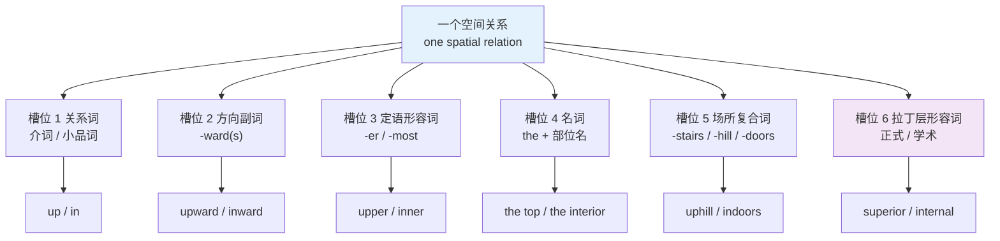
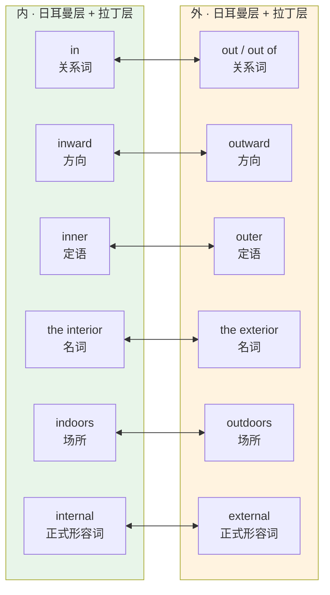
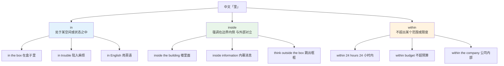
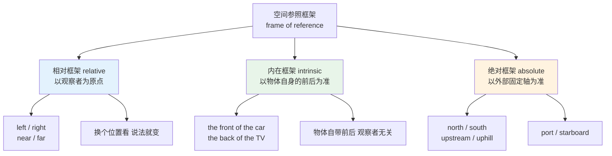
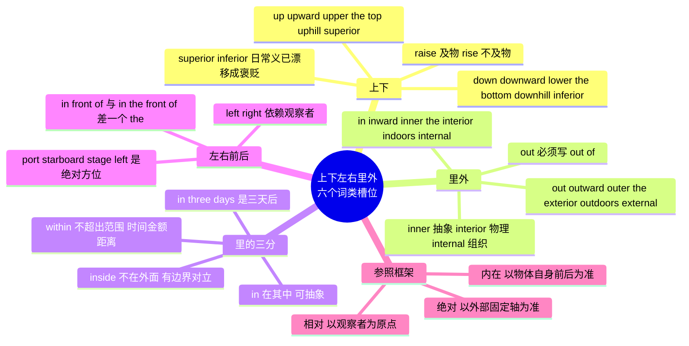

# 上下左右里外

> [!info] 本篇定位
>
> 上一篇 [[05.方位与空间词汇/01.东南西北：方位词的三种形式\|东南西北：方位词的三种形式]] 处理的是罗盘方位，那套体系只有四个基本方向，边界干净。这一篇处理的是以观察者或物体为原点的方位：上下、里外、左右、前后。
>
> 核心不是「up 是上、down 是下」这种一对一映射——那个层次的对应中文母语者早就会了。真正卡人的是同一个空间关系在英语里散落成六种词形，各自占一个句法位置，换位置就要换词。`up` 不能当形容词修饰名词，`upper` 不能当副词用在动词后面，`the top` 不能直接接在动词后面。
>
> 读完能做到三件事：给定一个空间关系，说出它在六个词类槽位上分别是哪个词；判断中文的「里」在具体句子里该用 `in`、`inside` 还是 `within`；识别一句话里的 `left` / `in front of` 到底以谁为参照。
>
> 介词本身的用法（`in` 与 `at` 的选择、`on` 的接触义、`over` 与 `above` 的路径差别）在 `02.功能词与封闭词类速查` 的介词篇里成体系展开，本篇只在需要对比时点到。

---

## 1. 本篇导读：一个空间关系，六个槽位

中文表达空间关系的方式非常经济。「上」这个字，在「上面」「向上」「上层」「上坡」「顶上」里都是同一个字，靠前后搭配区分功能。英语做不到，因为英语的词类边界是靠词形标记的：能修饰名词的形式和能修饰动词的形式必须长得不一样。

结果是同一个空间概念在英语里裂成了一支同源词族，每个成员固定占一个句法位置。



这张图是全篇的骨架。上下里外左右前后每一组关系，都可以按这六个槽位填一张表；填不满的槽位本身就是信息——比如「左」这一组在槽位 6 上是空的，英语没有一个通用的拉丁层形容词表示「左边的」，只有 `sinistral` 这种极冷僻的解剖学用词。哪里有词、哪里没词，决定了你在正式文体里能不能把某个说法直接搬过去。

六个槽位里最容易被忽略的是槽位 3 和槽位 4 的分工。`upper` 只能放在名词前面（`the upper deck`），不能单独作表语说 `The deck is upper`；`the top` 是名词，要表达同样的意思得说 `the top deck` 或 `the top of the ship`。两者看起来可以互换，实际上前者表示「相对靠上的那一个」，后者表示「最上面的那一个」，这个差别在第 2 节展开。

> [!tip] 建议的读法
>
> 这一篇的词表密度高，不要试图一次背完。正确用法是先通读六个槽位的框架，然后每次遇到一个具体的空间表达需求（写文档、描述界面布局、指路），回来查对应那一组的表。
>
> 六个槽位记熟之后，遇到没学过的方位词族也能自己推：看到 `forward` 就知道它在槽位 2，`front` 在槽位 4，那槽位 3 大概率是 `front-` 的某个定语形式（确实是 `front` 直接作定语，或者 `frontal`），槽位 6 应该有一个拉丁词（`anterior`）。

---

## 2. up 家族：向上这件事的六种说法

### 2.1 完整词表

| 英文 | 英式音标 | 美式音标 | 词性 | 中文 | 搭配与说明 |
| --- | --- | --- | --- | --- | --- |
| **up** | /ʌp/ | /ʌp/ | prep./adv./adj. | 向上；在上面 | 槽位 1；作形容词只能表语 the escalator is up |
| **upward** | /ˈʌpwəd/ | /ˈʌpwərd/ | adj./adv. | 向上的；向上 | 槽位 2；an upward trend 上升趋势 |
| **upwards** | /ˈʌpwədz/ | /ˈʌpwərdz/ | adv. | 向上 | 只作副词；英式偏好带 -s，美式偏好不带 |
| **upper** | /ˈʌpə/ | /ˈʌpər/ | adj. | 上面的；较高的 | 槽位 3；只作定语 the upper limit |
| **uppermost** | /ˈʌpəməʊst/ | /ˈʌpərmoʊst/ | adj. | 最上面的 | 定语；比 topmost 正式 |
| **top** | /tɒp/ | /tɑːp/ | n./adj. | 顶部；顶上的 | 槽位 4；the top of the page |
| **topmost** | /ˈtɒpməʊst/ | /ˈtɑːpmoʊst/ | adj. | 最顶端的 | 定语；日常用 the top 更多 |
| **uphill** | /ˌʌpˈhɪl/ | /ˌʌpˈhɪl/ | adv./adj. | 上坡；艰难的 | 槽位 5；an uphill battle 硬仗 |
| **upstairs** | /ˌʌpˈsteəz/ | /ˌʌpˈsterz/ | adv./n. | 楼上 | 副词前不加介词：go upstairs |
| **upstream** | /ˌʌpˈstriːm/ | /ˌʌpˈstriːm/ | adv./adj. | 上游 | Git 的 upstream 分支借自此义 |
| **upside** | /ˈʌpsaɪd/ | /ˈʌpsaɪd/ | n. | 上面；好处 | upside down 上下颠倒；投资语境指涨幅空间 |
| **superior** | /suːˈpɪəriə/ | /suːˈpɪriər/ | adj./n. | 上方的；更好的；上级 | 槽位 6；解剖学 superior vena cava 上腔静脉 |
| **above** | /əˈbʌv/ | /əˈbʌv/ | prep./adv. | 在……之上 | 不接触，位置高于；见 2.4 |
| **overhead** | /ˌəʊvəˈhed/ | /ˌoʊvərˈhed/ | adv./adj. | 头顶上 | 名词 /ˈəʊvəhed/ 表间接成本 |
| **apex** | /ˈeɪpeks/ | /ˈeɪpeks/ | n. | 顶点 | 复数 apexes 或 apices；几何与解剖常用 |
| **summit** | /ˈsʌmɪt/ | /ˈsʌmɪt/ | n. | 山顶；峰会 | 山峰义与政治峰会义同源 |
| **peak** | /piːk/ | /piːk/ | n./v. | 顶峰；达到峰值 | peak hours 高峰时段；与 peek 偷看同音异义 |
| **crest** | /krest/ | /krest/ | n. | 顶脊；浪尖 | the crest of a wave / hill |
| **elevate** | /ˈelɪveɪt/ | /ˈelɪveɪt/ | v. | 抬高；提升 | 正式；elevate the leg 抬高腿部 |
| **ascend** | /əˈsend/ | /əˈsend/ | v. | 上升；攀登 | 正式；名词 ascent /əˈsent/ |

### 2.2 槽位错配：最高频的三类错误

up 家族最常见的问题不是不认识词，而是把词放进了错误的槽位。

> [!warning] 三种槽位错配
>
> **错配一：用 up 修饰名词**
>
> - ❌ ~~the up floor~~ / ~~an up trend~~
> - ✅ **the upper floor** 上面那一层 / **an upward trend** 上升趋势
> - `up` 在名词前只出现在少数固定合成词里（`upmarket`、`upcountry`），不能自由造词。
>
> **错配二：用 upper 作表语**
>
> - ❌ ~~This shelf is upper than that one.~~
> - ✅ **This shelf is higher than that one.**
> - `upper` 虽然形式上是比较级，但已经词汇化成一个定语形容词，不参与 than 比较结构。要比较高低用 `higher`。
>
> **错配三：把 the top 当副词**
>
> - ❌ ~~Put it the top of the box.~~
> - ✅ **Put it on top of the box.** 放在盒子顶上
> - ✅ **Put it at the top of the page.** 放在页面顶部
> - `top` 是名词，前面必须有介词。注意 `on top of`（叠在上面，接触）与 `at the top of`（位于顶端位置）不同。

### 2.3 upper 与 the top：相对与绝对

这两个词的中文都可以是「上面的」，但它们描述的关系不同。

`upper` 表示二分中偏上的那一半，隐含一个与之对应的 `lower`。用了 `upper` 就意味着存在下半部分。

`top` 表示序列中最靠上的那一个或那一部分，隐含的对应词是 `bottom`，但它强调的是端点而不是二分。

> [!example] 两个词的实际差别
>
> - The **upper** half of the screen shows the chart.
>   - 屏幕的上半部分显示图表。（暗示还有下半部分）
> - The **top** row of the table is the header.
>   - 表格的第一行是表头。（强调最上面那一行，不暗示二分）
> - He lives on the **upper** floors of the building.
>   - 他住在楼的上面几层。（相对靠上，可以是第 8 到 12 层）
> - He lives on the **top** floor of the building.
>   - 他住在楼的顶层。（只能是最高那一层）

这个差别在描述界面布局时特别有用。`the upper right corner` 和 `the top right corner` 都能说，但前者语感上更宽松（右上区域），后者更精确（右上角那个点）。技术文档里描述精确位置一律用 `top`。

### 2.4 above 与 over 的分工

这两个词的完整对比属于介词篇，这里只给使用中最要紧的一条判据：`above` 描述静态的高度差，`over` 描述覆盖或跨越，往往带路径。

| 场景 | 用 above | 用 over |
| --- | --- | --- |
| 静态高度比较 | The lamp hangs **above** the table. | — |
| 覆盖住 | — | She spread a cloth **over** the table. |
| 跨越运动 | — | The plane flew **over** the city. |
| 数值超过 | temperatures **above** zero | ages **over** 18（口语更常用 over） |
| 文档指代 | as noted **above** 如上文所述 | — |

> [!warning] as noted above 的固定性
>
> 文档里回指上文只能用 `above`，不能用 `over`。`see above` / `as mentioned above` / `the above table` 都是固定说法。反向指后文用 `below`：`see below` / `as described below`。
>
> `the above table` 这个用法里 `above` 罕见地当了定语形容词，这是文书英语的固定例外，不要类推到别的词上。

---

## 3. down 家族与垂直关系的完整对照

### 3.1 down 家族词表

| 英文 | 英式音标 | 美式音标 | 词性 | 中文 | 搭配与说明 |
| --- | --- | --- | --- | --- | --- |
| **down** | /daʊn/ | /daʊn/ | prep./adv./adj. | 向下；在下面 | 槽位 1；the system is down 系统宕机 |
| **downward** | /ˈdaʊnwəd/ | /ˈdaʊnwərd/ | adj./adv. | 向下的；向下 | a downward spiral 恶性循环 |
| **downwards** | /ˈdaʊnwədz/ | /ˈdaʊnwərdz/ | adv. | 向下 | 英式偏好；美式多用不带 -s 的形式 |
| **lower** | /ˈləʊə/ | /ˈloʊər/ | adj./v. | 下面的；降低 | 槽位 3 与动词兼职；lower the price |
| **lowermost** | /ˈləʊəməʊst/ | /ˈloʊərmoʊst/ | adj. | 最下面的 | 书面；口语说 the bottom |
| **bottom** | /ˈbɒtəm/ | /ˈbɑːtəm/ | n./adj. | 底部；底下的 | 槽位 4；at the bottom of the page |
| **downhill** | /ˌdaʊnˈhɪl/ | /ˌdaʊnˈhɪl/ | adv./adj. | 下坡；每况愈下 | go downhill 走下坡路 |
| **downstairs** | /ˌdaʊnˈsteəz/ | /ˌdaʊnˈsterz/ | adv./n. | 楼下 | 同 upstairs，前面不加介词 |
| **downstream** | /ˌdaʊnˈstriːm/ | /ˌdaʊnˈstriːm/ | adv./adj. | 下游 | 软件里指依赖你的下游项目 |
| **underside** | /ˈʌndəsaɪd/ | /ˈʌndərsaɪd/ | n. | 底面 | the underside of the leaf 叶片背面 |
| **inferior** | /ɪnˈfɪəriə/ | /ɪnˈfɪriər/ | adj./n. | 下方的；较差的 | 槽位 6；日常义偏贬，解剖学义中性 |
| **below** | /bɪˈləʊ/ | /bɪˈloʊ/ | prep./adv. | 在……之下 | 不接触；see below 见下文 |
| **beneath** | /bɪˈniːθ/ | /bɪˈniːθ/ | prep. | 在……下方 | 比 below 正式；beneath contempt 不值一提 |
| **underneath** | /ˌʌndəˈniːθ/ | /ˌʌndərˈniːθ/ | prep./adv. | 在……底下 | 强调紧贴下方且被遮住 |
| **base** | /beɪs/ | /beɪs/ | n. | 底座；基部 | the base of the triangle 三角形底边 |
| **foot** | /fʊt/ | /fʊt/ | n. | 底部 | the foot of the page / the hill；书面 |
| **descend** | /dɪˈsend/ | /dɪˈsend/ | v. | 下降 | 正式；名词 descent /dɪˈsent/ |
| **sink** | /sɪŋk/ | /sɪŋk/ | v. | 下沉 | 不规则 sink-sank-sunk |
| **plunge** | /plʌndʒ/ | /plʌndʒ/ | v./n. | 骤降；跳入 | prices plunged 价格暴跌 |
| **vertical** | /ˈvɜːtɪkl/ | /ˈvɜːrtɪkl/ | adj. | 垂直的 | 与 horizontal /ˌhɒrɪˈzɒntl/ · /ˌhɔːrɪˈzɑːntl/ 成对 |

### 3.2 上下这一组的槽位对照表

把 up 与 down 两族按槽位对齐，缺口和不对称立刻可见。

| 槽位 | 上 | 下 | 备注 |
| --- | --- | --- | --- |
| 1 关系词 | up | down | 对称 |
| 2 方向副词 | upward(s) | downward(s) | 对称 |
| 3 定语形容词 | upper | lower | 对称，但 lower 兼职动词 |
| 3 最高级 | uppermost / topmost | lowermost / bottommost | bottommost 罕见 |
| 4 名词 | the top | the bottom | 对称 |
| 4 书面名词 | the summit / apex / crest | the base / foot | 不对称，上方的名词更丰富 |
| 5 场所复合词 | upstairs / uphill / upstream | downstairs / downhill / downstream | 对称 |
| 6 拉丁形容词 | superior | inferior | 日常义都发生了语义漂移 |

> [!warning] superior 和 inferior 的两张脸
>
> 这一对词在解剖学、地质学里是纯方位词，中性：`superior vena cava`（上腔静脉）、`inferior colliculus`（下丘）。
>
> 但在日常英语里它们的方位义已经基本消失，剩下的是价值判断：`superior` = 更好的，`inferior` = 更差的、劣等的。`inferior` 尤其带贬义，形容人时非常伤人。
>
> - ❌ ~~the inferior floor of the building~~（会被理解成「这栋楼比较差的那层」）
> - ✅ **the lower floor of the building**
>
> 判据很简单：描述物理位置一律用 upper / lower，只有在专业术语里才用 superior / inferior 的方位义。

### 3.3 lower 的双重身份

`lower` 是这一族里唯一一个同时占两个槽位的词：它既是槽位 3 的定语形容词，又是一个及物动词，意思是「把……放低、降低」。

> [!example] lower 的两种用法
>
> - Check the **lower** left corner of the screen.
>   - 检查屏幕左下角。（形容词，定语）
> - They **lowered** the price by twenty percent.
>   - 他们把价格降了两成。（动词，及物）
> - Please **lower** your voice.
>   - 请小声一点。（动词，固定搭配）

对应的「上」这一侧没有 `upper` 作动词的用法，要表达「提高」得用 `raise`（及物）或 `rise`（不及物）。这一对是全书最容易混的动词之一。

| 英文 | 英式音标 | 美式音标 | 词性 | 中文 | 搭配与说明 |
| --- | --- | --- | --- | --- | --- |
| **raise** | /reɪz/ | /reɪz/ | v. | 提高；举起 | 及物，必须带宾语；raise-raised-raised |
| **rise** | /raɪz/ | /raɪz/ | v./n. | 上升 | 不及物，不带宾语；rise-rose-risen |
| **lift** | /lɪft/ | /lɪft/ | v./n. | 举起；电梯 | 及物；英式 lift = 美式 elevator |
| **drop** | /drɒp/ | /drɑːp/ | v./n. | 掉落；下降 | 及物不及物均可，这是它与 lower 的差别 |

> [!warning] raise 与 rise 的判据
>
> - ❌ ~~The price raised by ten percent.~~
> - ✅ **The price rose by ten percent.** 价格上涨了一成。
> - ✅ **They raised the price by ten percent.** 他们把价格上调了一成。
>
> 一句话判据：句子里有没有「谁把什么弄上去」的那个「什么」。有宾语用 raise，没有用 rise。`drop` 之所以好用，正是因为它两边通吃，不确定时可以退回 drop。

---

## 4. in 家族：里面的六个槽位

### 4.1 完整词表

| 英文 | 英式音标 | 美式音标 | 词性 | 中文 | 搭配与说明 |
| --- | --- | --- | --- | --- | --- |
| **in** | /ɪn/ | /ɪn/ | prep./adv. | 在……里 | 槽位 1；最通用，可用于抽象 in trouble |
| **into** | /ˈɪntuː/ | /ˈɪntuː/ | prep. | 进入 | 带方向，与 in 的静态义相对；英美口语都弱读成 /ˈɪntə/ |
| **inward** | /ˈɪnwəd/ | /ˈɪnwərd/ | adj./adv. | 向内的；向内 | 槽位 2；inward investment 外来投资 |
| **inwards** | /ˈɪnwədz/ | /ˈɪnwərdz/ | adv. | 向内 | 英式偏好带 -s |
| **inner** | /ˈɪnə/ | /ˈɪnər/ | adj. | 内部的；内心的 | 槽位 3；只作定语 the inner circle |
| **innermost** | /ˈɪnəməʊst/ | /ˈɪnərmoʊst/ | adj. | 最里面的 | 定语；innermost thoughts 内心深处的想法 |
| **inside** | /ˌɪnˈsaɪd/ | /ˌɪnˈsaɪd/ | prep./adv./n./adj. | 在里面；内部 | 四个词类通吃，见第 6 节 |
| **interior** | /ɪnˈtɪəriə/ | /ɪnˈtɪriər/ | n./adj. | 内部；内部的 | 槽位 4；建筑与汽车语境高频 |
| **internal** | /ɪnˈtɜːnl/ | /ɪnˈtɜːrnl/ | adj. | 内部的 | 槽位 6；internal review 内部评审 |
| **indoor** | /ˈɪndɔː/ | /ˈɪndɔːr/ | adj. | 室内的 | 只作定语 an indoor pool |
| **indoors** | /ˌɪnˈdɔːz/ | /ˌɪnˈdɔːrz/ | adv. | 在室内 | 只作副词 stay indoors |
| **within** | /wɪˈðɪn/ | /wɪˈðɪn/ | prep. | 在……之内 | 正式；强调不超出范围，见第 6 节 |
| **inland** | /ˈɪnlənd/ | /ˈɪnlənd/ | adj./adv. | 内陆的 | 与 coastal 相对 |
| **core** | /kɔː/ | /kɔːr/ | n./adj. | 核心 | the core of the problem 问题核心 |
| **centre / center** | /ˈsentə/ | /ˈsentər/ | n. | 中心 | 英式 centre，美式 center，读音相同 |
| **contain** | /kənˈteɪn/ | /kənˈteɪn/ | v. | 装有；容纳 | 静态包含，不表示动作 |
| **enclose** | /ɪnˈkləʊz/ | /ɪnˈkloʊz/ | v. | 围住；随函附上 | please find enclosed 随函附上 |
| **embed** | /ɪmˈbed/ | /ɪmˈbed/ | v. | 嵌入 | 双写 embedded；技术文档高频 |
| **immerse** | /ɪˈmɜːs/ | /ɪˈmɜːrs/ | v. | 浸入 | immerse yourself in 沉浸于 |
| **insert** | /ɪnˈsɜːt/ | /ɪnˈsɜːrt/ | v. | 插入 | 动词重音在后，名词 /ˈɪnsɜːt/ 重音在前 |

### 4.2 inner 与 interior 各管什么

`inner` 和 `interior` 都是「内部的」，分工是这样的：

`inner` 更抽象、更常和圈层结构搭配，也大量用于心理与比喻义。`the inner circle`（核心圈子）、`inner peace`（内心平静）、`the inner city`（内城区，英美含义还不同）。

`interior` 更物理、更具体，主要用于建筑物、车辆、房间的内部空间，也是一个能独立当名词的词。`the interior of the car`（车内）、`interior design`（室内设计）、`the Ministry of the Interior`（内政部）。

> [!example] 两个词不能互换的场合
>
> - She found **inner** strength she didn't know she had.
>   - 她发现了自己不知道的内在力量。（心理义，不能用 interior）
> - The **interior** of the building was completely renovated.
>   - 这栋建筑的内部彻底翻新了。（物理空间，不能用 inner）
> - The **inner** ring road is closed.
>   - 内环路封闭了。（圈层结构，用 inner）

`internal` 的领地又不一样：它主要用在组织、系统、身体这三类语境里，指「机构内部的」「系统内部的」「体内的」。`internal audit`（内部审计）、`internal API`、`internal bleeding`（内出血）。它的反义词 `external` 同理。

---

## 5. out 家族与内外的完整对照

### 5.1 out 家族词表

| 英文 | 英式音标 | 美式音标 | 词性 | 中文 | 搭配与说明 |
| --- | --- | --- | --- | --- | --- |
| **out** | /aʊt/ | /aʊt/ | adv./adj. | 出去；在外 | 槽位 1；out of 才是介词形式 |
| **outward** | /ˈaʊtwəd/ | /ˈaʊtwərd/ | adj./adv. | 向外的；表面上 | outward appearance 外表 |
| **outwards** | /ˈaʊtwədz/ | /ˈaʊtwərdz/ | adv. | 向外 | 英式偏好带 -s |
| **outer** | /ˈaʊtə/ | /ˈaʊtər/ | adj. | 外部的 | 槽位 3；outer space 外太空 |
| **outermost** | /ˈaʊtəməʊst/ | /ˈaʊtərmoʊst/ | adj. | 最外面的 | 定语；the outermost layer |
| **outside** | /ˌaʊtˈsaɪd/ | /ˌaʊtˈsaɪd/ | prep./adv./n./adj. | 在外面；外部 | 与 inside 完全对称的四词类 |
| **exterior** | /ɪkˈstɪəriə/ | /ɪkˈstɪriər/ | n./adj. | 外部；外部的 | 槽位 4；与 interior 成对 |
| **external** | /ɪkˈstɜːnl/ | /ɪkˈstɜːrnl/ | adj. | 外部的 | 槽位 6；external drive 外置硬盘 |
| **outdoor** | /ˈaʊtdɔː/ | /ˈaʊtdɔːr/ | adj. | 户外的 | 只作定语 outdoor gear |
| **outdoors** | /ˌaʊtˈdɔːz/ | /ˌaʊtˈdɔːrz/ | adv./n. | 在户外 | 只作副词或名词 the great outdoors |
| **without** | /wɪˈðaʊt/ | /wɪˈðaʊt/ | prep. | 没有 | 空间义已基本消失，只剩「缺少」义 |
| **outskirts** | /ˈaʊtskɜːts/ | /ˈaʊtskɜːrts/ | n. | 城郊 | 恒复数；on the outskirts of the city |
| **surface** | /ˈsɜːfɪs/ | /ˈsɜːrfɪs/ | n./v. | 表面；浮现 | 重音在前，第二音节弱读 |
| **shell** | /ʃel/ | /ʃel/ | n. | 外壳 | 命令行的 shell 借自此义 |
| **periphery** | /pəˈrɪfəri/ | /pəˈrɪfəri/ | n. | 外围 | 形容词 peripheral /pəˈrɪfərəl/ |
| **exit** | /ˈeksɪt/ | /ˈeɡzɪt/ | n./v. | 出口；退出 | /ˈeksɪt/ 与 /ˈeɡzɪt/ 两读在英美都存在，美式更常听到 /ˈeɡzɪt/ |
| **extract** | /ɪkˈstrækt/ | /ɪkˈstrækt/ | v. | 提取 | 动词重音在后，名词 /ˈekstrækt/ 在前 |
| **eject** | /iˈdʒekt/ | /iˈdʒekt/ | v. | 弹出 | 光驱与 U 盘的「推出」按钮 |
| **expel** | /ɪkˈspel/ | /ɪkˈspel/ | v. | 驱逐；排出 | 双写 expelled；开除学籍也用它 |
| **exclude** | /ɪkˈskluːd/ | /ɪkˈskluːd/ | v. | 排除 | 与 include 成对；名词 exclusion |

### 5.2 内外槽位对照图



内外这一组的槽位对称性比上下更完整——六个槽位一个不缺，而且左右两侧的词形高度平行：`inward` / `outward`、`inner` / `outer`、`indoors` / `outdoors`、`internal` / `external`。唯一的不对称在槽位 1：`in` 直接可以带宾语（`in the box`），但 `out` 必须写成 `out of`（`out of the box`），单独的 `out` 只能作副词。

这个不对称是初学者最常踩的坑之一。

> [!warning] out 不能直接带宾语
>
> - ❌ ~~He walked out the room.~~（美式口语里偶尔听到，正式书面不成立）
> - ✅ **He walked out of the room.** 他走出了房间。
> - ✅ **He walked out.** 他走了出去。（无宾语，out 作副词，成立）
>
> 一个真实例外是 `look out the window`（往窗外看），这在美式英语里完全标准。原因是这里 `out` 后面接的是「穿过的通道」而不是「离开的容器」。英式英语会说 `look out of the window`。

### 5.3 inside out 与 upside down

这两个短语的构造方式相同，都是「方位名词 + 方位副词」，表示某种颠倒状态，但颠倒的轴不同。

| 短语 | 音标（英/美） | 中文 | 颠倒的是什么 |
| --- | --- | --- | --- |
| **inside out** | /ˌɪnsaɪd ˈaʊt/ · /ˌɪnsaɪd ˈaʊt/ | 里朝外 | 内外翻转，衣服穿反了 |
| **upside down** | /ˌʌpsaɪd ˈdaʊn/ · /ˌʌpsaɪd ˈdaʊn/ | 上下颠倒 | 垂直翻转，画挂倒了 |
| **back to front** | /ˌbæk tə ˈfrʌnt/ · /ˌbæk tə ˈfrʌnt/ | 前后穿反 | 前后翻转，英式说法 |
| **the wrong way round** | /ðə ˌrɒŋ weɪ ˈraʊnd/ · — | 方向弄反了 | 泛指，只在英式里说；美式换成 the wrong way around |

`inside out` 还有一个高频引申义：`know something inside out` 表示对某事了如指掌，字面是「里里外外都知道」。

> [!example] 三个短语的实际句子
>
> - You're wearing your T-shirt **inside out**.
>   - 你 T 恤穿反了（里子朝外）。
> - The painting is hanging **upside down**.
>   - 这幅画挂倒了。
> - She knows the codebase **inside out**.
>   - 她对这套代码库了如指掌。

---

## 6. 中文「里」的三分：in、inside、within

### 6.1 一个中文字对应三个英文词

中文的「里」是一个极度笼统的字。「盒子里」「三天里」「预算里」「公司里」用的是同一个字，但英语要分成三个不同的词，选错了句子意思会变。



三个词的分工可以用一句话概括：`in` 说的是「在其中」，`inside` 说的是「不在外面」，`within` 说的是「不超出去」。

`in` 是默认选项，覆盖面最广，而且是三者中唯一能大量用于抽象状态的（`in love`、`in a hurry`、`in doubt`）。`inside` 永远隐含一个明确的边界，用它就意味着说话人心里有个「外面」在对照。`within` 是正式词，强调的不是位置而是**范围的上限**——时间上限、金额上限、距离上限、权限上限。

### 6.2 三个词的选择判据

| 判据问题 | 答案是 | 选哪个 |
| --- | --- | --- |
| 是抽象状态吗（麻烦、恋爱、匆忙） | 是 | in |
| 是语言、材质、方式吗（用英语、用铅笔） | 是 | in |
| 想强调「不在外面」这个对立吗 | 是 | inside |
| 有一个物理外壳或围墙吗 | 是 | inside（in 也可以，但 inside 更明确） |
| 是时间期限吗（几天内、几小时内） | 是 | within |
| 是数值或距离上限吗（预算内、一英里内） | 是 | within |
| 是抽象的范围或权限吗（法律范围内、职权内） | 是 | within |

### 6.3 最要命的一个差别：in three days 与 within three days

> [!warning] in 表示时间时不是「之内」
>
> `in + 时间段` 在英语里表示「从现在起，经过这段时间之后」，是一个**未来时间点**，不是一段区间。
>
> - **I'll finish it in three days.**
>   - 我三天后完成。（第三天才交，前两天不一定动工）
> - **I'll finish it within three days.**
>   - 我三天之内完成。（可能第一天就交，最晚第三天）
>
> 这个差别在承诺交付时间时是实打实的合同风险。中文说「三天内交」，直译成 `in three days` 就把承诺改成了「第三天交」。
>
> - ❌ ~~We will respond in 24 hours.~~（想说 24 小时内，说成了 24 小时后）
> - ✅ **We will respond within 24 hours.**
>
> 反过来，如果你真的想说「过三天再说」，那 `in three days` 才是对的。

### 6.4 三个词在同一批场景里的对照

> [!example] 同一个「里」的三种译法
>
> ① 空间容器
>
> - The keys are **in** the drawer.
>   - 钥匙在抽屉里。（中性陈述）
> - The keys are **inside** the drawer, not on top of it.
>   - 钥匙在抽屉里面，不是在抽屉上面。（有对立，用 inside）
>
> ② 时间
>
> - The package will arrive **in** two days.
>   - 包裹两天后到。
> - The package will arrive **within** two days.
>   - 包裹两天内到。
>
> ③ 组织
>
> - She works **in** the marketing department.
>   - 她在市场部工作。（说的是归属）
> - The issue was resolved **within** the department.
>   - 这个问题在部门内部解决了。（说的是没出部门这个范围）
>
> ④ 距离
>
> - There's a station **within** walking distance.
>   - 有个车站在步行距离内。（固定搭配，不能用 in）
> - We live **within** a mile of the office.
>   - 我们住在离办公室一英里以内。

### 6.5 inside 的四个词类

`inside` 是这一族里句法最灵活的词，四个词类都能当，各自的位置不同。

| 词类 | 例句 | 中文 |
| --- | --- | --- |
| 介词 | Wait **inside** the car. | 在车里等。 |
| 副词 | Let's go **inside**. | 我们进去吧。（后面不接名词） |
| 名词 | The **inside** of the box was lined with foam. | 盒子内壁衬了泡沫。 |
| 形容词 | He has **inside** information. | 他有内幕消息。 |

> [!tip] inside 作副词时不要加介词
>
> - ❌ ~~Let's go in inside.~~ / ~~Come to inside.~~
> - ✅ **Let's go inside.** / **Come inside.**
>
> 这一条对 `outside`、`upstairs`、`downstairs`、`indoors`、`outdoors`、`uphill`、`downhill` 全部适用。这些词已经把方向义包在词里了，前面再加介词是冗余。唯一的例外是 `outside of` 在美式英语里可以表示「除……之外」，那是另一个意思。

---

## 7. 左与右：相对方位的典型代表

### 7.1 词表

| 英文 | 英式音标 | 美式音标 | 词性 | 中文 | 搭配与说明 |
| --- | --- | --- | --- | --- | --- |
| **left** | /left/ | /left/ | n./adj./adv. | 左；左边的 | on the left / turn left；与 leave 的过去式同形 |
| **right** | /raɪt/ | /raɪt/ | n./adj./adv. | 右；右边的 | 同时有「正确」「权利」两个高频义 |
| **leftward** | /ˈleftwəd/ | /ˈleftwərd/ | adj./adv. | 向左的 | 书面；日常说 to the left |
| **rightward** | /ˈraɪtwəd/ | /ˈraɪtwərd/ | adj./adv. | 向右的 | 书面 |
| **left-hand** | /ˌleft ˈhænd/ | /ˌleft ˈhænd/ | adj. | 左侧的 | 只作定语 the left-hand column |
| **right-hand** | /ˌraɪt ˈhænd/ | /ˌraɪt ˈhænd/ | adj. | 右侧的 | right-hand man 得力助手 |
| **left-handed** | /ˌleft ˈhændɪd/ | /ˌleft ˈhændɪd/ | adj. | 左撇子的 | 与 left-hand 差一个 -ed，含义完全不同 |
| **port** | /pɔːt/ | /pɔːrt/ | n. | 左舷 | 航海术语；与「港口」「端口」同形 |
| **starboard** | /ˈstɑːbəd/ | /ˈstɑːrbərd/ | n. | 右舷 | 航海术语，重音在前 |
| **dexterous** | /ˈdekstrəs/ | /ˈdekstrəs/ | adj. | 灵巧的 | 拉丁 dexter「右」；也拼作 dextrous |
| **ambidextrous** | /ˌæmbiˈdekstrəs/ | /ˌæmbiˈdekstrəs/ | adj. | 左右手都灵巧的 | ambi「两者」+ dexter「右」 |
| **clockwise** | /ˈklɒkwaɪz/ | /ˈklɑːkwaɪz/ | adv./adj. | 顺时针 | 前面不加介词：turn it clockwise |
| **anticlockwise** | /ˌæntiˈklɒkwaɪz/ | — | adv./adj. | 逆时针 | 英式说法 |
| **counterclockwise** | — | /ˌkaʊntərˈklɑːkwaɪz/ | adv./adj. | 逆时针 | 美式说法 |
| **lateral** | /ˈlætərəl/ | /ˈlætərəl/ | adj. | 侧向的 | 拉丁层；lateral movement 横向移动 |
| **flank** | /flæŋk/ | /flæŋk/ | n./v. | 侧翼；位于侧面 | 军事与建筑常用 |

### 7.2 left-hand 与 left-handed 差一个字母

这两个词形近义远，混用会闹笑话。

`left-hand` 修饰位置：「左边的那个」。`the left-hand side of the page`（页面左侧）、`the left-hand lane`（左车道）。

`left-handed` 修饰人或器物的使用习惯：「左撇子的、为左手设计的」。`a left-handed player`（左撇子选手）、`left-handed scissors`（左手剪刀）。

> [!warning] 一个字母的差别
>
> - ❌ ~~Click the button in the left-handed corner.~~
> - ✅ **Click the button in the bottom left corner.** 点击左下角的按钮。
> - ✅ **She's left-handed.** 她是左撇子。
>
> 描述界面位置最自然的说法其实两个词都不用，直接说 `top left` / `bottom right`，中间不加连字符也不加 hand。

### 7.3 表达「在左边」的四种句式

英语描述左右位置的句式有细微分工，用错不会不懂，但会显得生硬。

| 句式 | 例句 | 用在什么时候 |
| --- | --- | --- |
| on the left | The lift is **on the left**. | 泛指左侧区域，最通用 |
| on your left | You'll see it **on your left**. | 指路，明确以对方为参照 |
| to the left of X | The chart is **to the left of** the table. | 在 X 的左边（X 之外） |
| on the left of X | Her name is **on the left of** the form. | 在 X 内部的左侧部分 |

> [!warning] to the left of 与 on the left of
>
> 这两个短语的差别是「在外面」还是「在里面」。
>
> - The tree is **to the left of** the house.
>   - 树在房子左边。（树在房子外面）
> - The door is **on the left of** the house.
>   - 门在房子的左侧。（门是房子的一部分）
>
> 中文两句都说「在……左边」，英语靠介词区分。写技术文档描述界面元素时几乎都用 `on the left of`，因为元素在容器内部。

---

## 8. 前与后：视角决定一切

### 8.1 词表

| 英文 | 英式音标 | 美式音标 | 词性 | 中文 | 搭配与说明 |
| --- | --- | --- | --- | --- | --- |
| **front** | /frʌnt/ | /frʌnt/ | n./adj. | 前面；前部的 | in front of 在……前面；the front row |
| **back** | /bæk/ | /bæk/ | n./adj./adv. | 后面；背部 | 兼「返回」义：go back |
| **forward** | /ˈfɔːwəd/ | /ˈfɔːrwərd/ | adv./adj./v. | 向前；转发 | 邮件的转发按钮就是它 |
| **forwards** | /ˈfɔːwədz/ | /ˈfɔːrwərdz/ | adv. | 向前 | 英式副词形式 |
| **backward** | /ˈbækwəd/ | /ˈbækwərd/ | adj./adv. | 向后的；落后的 | backward compatibility 向后兼容 |
| **backwards** | /ˈbækwədz/ | /ˈbækwərdz/ | adv. | 向后 | 英式偏好 |
| **ahead** | /əˈhed/ | /əˈhed/ | adv. | 在前面 | ahead of schedule 提前 |
| **behind** | /bɪˈhaɪnd/ | /bɪˈhaɪnd/ | prep./adv. | 在后面 | behind schedule 落后于计划 |
| **rear** | /rɪə/ | /rɪr/ | n./adj. | 后部；后面的 | the rear window 后窗；比 back 正式 |
| **frontal** | /ˈfrʌntl/ | /ˈfrʌntl/ | adj. | 正面的 | frontal view 正视图；解剖学 frontal lobe |
| **anterior** | /ænˈtɪəriə/ | /ænˈtɪriər/ | adj. | 前面的 | 拉丁层，医学解剖专用 |
| **posterior** | /pɒˈstɪəriə/ | /pɑːˈstɪriər/ | adj. | 后面的 | 拉丁层；名词义指臀部，注意语境 |
| **bow** | /baʊ/ | /baʊ/ | n. | 船头 | 与「鞠躬」同形同音；「弓」读 /bəʊ/ · /boʊ/ |
| **stern** | /stɜːn/ | /stɜːrn/ | n./adj. | 船尾；严厉的 | 两个义项要靠语境分 |
| **fore** | /fɔː/ | /fɔːr/ | adj./n. | 前部的 | 多作构词成分 forehead、foreground |
| **aft** | /ɑːft/ | /æft/ | adv./adj. | 在船尾 | 航海与航空术语 |
| **foreground** | /ˈfɔːɡraʊnd/ | /ˈfɔːrɡraʊnd/ | n. | 前景 | 与 background 成对；也指前台进程 |
| **background** | /ˈbækɡraʊnd/ | /ˈbækɡraʊnd/ | n. | 背景 | run in the background 后台运行 |

### 8.2 in front of 与 in the front of

只差一个 the，指的位置完全不同。

`in front of X` = 在 X 的前方，且在 X 的外部。
`in the front of X` = 在 X 内部的前半部分。

> [!example] 一个 the 的距离
>
> - The bus stop is **in front of** the school.
>   - 公交站在学校前面。（站在校门外的马路边）
> - He sits **in the front of** the classroom.
>   - 他坐在教室前排。（人在教室里面）
> - There's a car parked **in front of** mine.
>   - 有辆车停在我车前面。
> - Put the heavy items **in the front of** the box.
>   - 把重的东西放在箱子前部。

同样的规律适用于 `at the back of` 与 `behind`：`behind the school`（学校后面，在外面），`at the back of the classroom`（教室后排，在里面）。

### 8.3 forward 与 backward 的比喻义

这一对词的比喻义在技术文档里出现频率极高，而且方向感和中文直觉正好对得上，是少见的好记的一组。

| 术语 | 中文 | 含义 |
| --- | --- | --- |
| backward compatibility | 向后兼容 | 新版本能处理旧版本的数据或调用 |
| forward compatibility | 向前兼容 | 旧版本能容忍将来版本的数据 |
| look-ahead | 前瞻 | 提前读取后续内容再决定 |
| forward reference | 前向引用 | 引用了尚未定义的符号 |
| roll forward | 前滚 | 数据库把日志重放到某个时间点 |
| roll back | 回滚 | 撤销到之前的状态 |

> [!warning] backward 还有一个贬义
>
> `backward` 形容地区、社会、技术时表示「落后的」，带明显贬义。描述发展中地区不要用它。
>
> - ❌ ~~a backward country~~（冒犯）
> - ✅ **a developing country** 发展中国家
>
> 技术语境里的 `backward compatibility` 是中性术语，不受这一条影响。

---

## 9. 相对方位与绝对方位

### 9.1 三种参照框架

同一句「球在车前面」，在英语里可能有两个完全不同的意思，取决于用哪个参照框架。语言学家 Stephen Levinson 在跨语言空间认知研究中把参照框架分成三类，这个分类对理解英语的方位表达非常实用。



三种框架里，英语日常最常用的是相对框架和内在框架，而且**优先级取决于物体本身有没有内在的前后面**。

有内在前后的物体（车、房子、人、电视、书），英语默认用内在框架。`in front of the car` 指的是车头那一侧，不管你站在哪里。

没有内在前后的物体（树、球、石头、柱子），只能用相对框架。`in front of the tree` 指的是树与观察者之间的那一侧，你换个位置站，「前面」就换了地方。

> [!example] 同一句话的两种理解
>
> - The ball is **in front of** the car.
>   - 球在车头前面。（内在框架，车自带前后，与观察者位置无关）
> - The ball is **in front of** the tree.
>   - 球在树的这一侧，也就是靠近我这边。（相对框架，树没有前后）
>
> 中文的「前面」在这两句里都成立，而且中文母语者往往会把树那句也理解成某个固定方向，这就是分歧点。

### 9.2 绝对框架在英语里的残留

英语不像某些语言那样把绝对方位当作日常默认。澳大利亚昆士兰的 Guugu Yimithirr 语没有相对意义上的「左右」，任何空间关系都用东南西北描述——「你左脚上有只蚂蚁」在那门语言里得说成「你东边那只脚上有只蚂蚁」，这是 Levinson 团队记录并反复讨论的案例。

英语的绝对框架只在几个专门领域里存活。

| 领域 | 绝对方位词 | 说明 |
| --- | --- | --- |
| 罗盘方位 | north / south / east / west | 完整体系见上一篇 |
| 河流 | upstream / downstream | 以水流方向为轴 |
| 地形 | uphill / downhill / inland / seaward | 以地势或海岸为轴 |
| 航海 | port / starboard / fore / aft | 以船头方向为轴 |
| 航空 | port / starboard | 沿用航海术语 |
| 剧场 | stage left / stage right | 以演员面向观众的视角为准 |
| 剧场 | house left / house right | 以观众的视角为准 |
| 医学 | patient's left / right | 以病人自身为准，不是看片人的左右 |

> [!warning] 剧场与医学的左右陷阱
>
> `stage left` 是演员站在台上、面向观众时的左手边，从观众席看过去它在**右边**。`house left` 才是观众的左边。这两个词在剧场调度里绝不能混。
>
> 医学影像同理：X 光片、CT 上标注的 L 是**病人的左侧**，在正位片上它出现在画面的右边。手术前核对部位时这条是安全红线。
>
> 两个例子说明的是同一件事：英语里凡是有专业术语的领域，左右几乎都被重新定义成了以被描述对象为准的绝对方位，而不是以说话人为准的相对方位。

### 9.3 指路时的相对方位

日常指路是相对框架最典型的应用场景，有一套高度固定的句式。

> [!example] 指路的固定说法
>
> ① 明确以对方为参照
>
> - It's **on your right**, just past the bank.
>   - 就在你右手边，过了银行就是。
>
> ② 拐弯指令，不加介词
>
> - **Turn left** at the traffic lights.
>   - 在红绿灯处左转。
> - **Take the second right**.
>   - 走第二个路口右转。
>
> ③ 描述相对位置
>
> - The café is **opposite** the station.
>   - 咖啡馆在车站对面。（英式；美式常说 across from）
> - The pharmacy is **next to** the post office.
>   - 药店在邮局旁边。
>
> ④ 描述前后顺序
>
> - Keep going **straight ahead** for about two blocks.
>   - 一直往前走大约两个街区。

> [!tip] turn left 前面不加介词
>
> - ❌ ~~Turn to the left at the corner.~~（不算错但啰嗦，母语者少说）
> - ✅ **Turn left at the corner.**
>
> `left` / `right` 在 turn 后面直接当副词用。加 `to the` 的完整形式主要出现在书面路线说明里。

---

## 10. 中间、边缘与侧面

### 10.1 词表

| 英文 | 英式音标 | 美式音标 | 词性 | 中文 | 搭配与说明 |
| --- | --- | --- | --- | --- | --- |
| **middle** | /ˈmɪdl/ | /ˈmɪdl/ | n./adj. | 中间 | in the middle of 在……中间 |
| **central** | /ˈsentrəl/ | /ˈsentrəl/ | adj. | 中心的；关键的 | central to the argument 论证的核心 |
| **midst** | /mɪdst/ | /mɪdst/ | n. | 当中 | 书面；in the midst of 在……当中 |
| **amid** | /əˈmɪd/ | /əˈmɪd/ | prep. | 在……之中 | 新闻体高频；amid concerns 在担忧声中 |
| **edge** | /edʒ/ | /edʒ/ | n./v. | 边缘 | on the edge of 在……边缘 |
| **border** | /ˈbɔːdə/ | /ˈbɔːrdər/ | n./v. | 边界；接壤 | 国界；CSS 的边框也是它 |
| **boundary** | /ˈbaʊndri/ | /ˈbaʊndri/ | n. | 界限 | 抽象边界比 border 更常用 |
| **margin** | /ˈmɑːdʒɪn/ | /ˈmɑːrdʒɪn/ | n. | 页边距；余地 | 排版与商业利润率共用此词 |
| **corner** | /ˈkɔːnə/ | /ˈkɔːrnər/ | n. | 角落 | in the corner 屋内角；at the corner 街角 |
| **side** | /saɪd/ | /saɪd/ | n. | 边；侧面 | side by side 并排 |
| **surroundings** | /səˈraʊndɪŋz/ | /səˈraʊndɪŋz/ | n. | 周围环境 | 恒复数 |
| **perimeter** | /pəˈrɪmɪtə/ | /pəˈrɪmɪtər/ | n. | 周长；周界 | 几何与安防语境 |
| **peripheral** | /pəˈrɪfərəl/ | /pəˈrɪfərəl/ | adj./n. | 外围的；外设 | 计算机外设就用这个名词义 |
| **verge** | /vɜːdʒ/ | /vɜːrdʒ/ | n. | 边缘 | on the verge of 濒临 |
| **brink** | /brɪŋk/ | /brɪŋk/ | n. | 悬崖边 | on the brink of collapse 濒临崩溃 |
| **halfway** | /ˌhɑːfˈweɪ/ | /ˌhæfˈweɪ/ | adv./adj. | 中途 | halfway through 进行到一半 |

### 10.2 in the corner 与 at the corner 与 on the corner

三个介词配同一个名词，指三个不同的地方。这是介词篇里的经典例子，但因为和方位强相关，这里给出判据。

| 短语 | 指哪里 | 例句 |
| --- | --- | --- |
| in the corner | 房间内部的墙角 | The plant is **in the corner** of the room. |
| at the corner | 街道交汇的那个点 | Meet me **at the corner** of Fifth and Main. |
| on the corner | 街角上的建筑或物体 | There's a café **on the corner**. |

`in` 用于凹进去的角（房间内角），`at` 用于把街角当作一个点，`on` 用于坐落在街角的东西。中文都是「角上」，英语靠介词区分了三层意思。

### 10.3 边缘词的强度梯度

`edge`、`verge`、`brink` 都能表示「边缘」，但引申义的紧迫程度不同。

| 词 | 字面义 | 引申义强度 | 典型搭配 |
| --- | --- | --- | --- |
| edge | 任何物体的边 | 最弱，可以纯字面 | the edge of the table / on the cutting edge 前沿 |
| verge | 路边、草地边缘 | 中等，表示即将 | on the verge of tears 快哭了 |
| brink | 悬崖边 | 最强，表示危险临界 | on the brink of war 战争边缘 |

> [!warning] brink 不能用于中性场景
>
> - ❌ ~~She's on the brink of finishing her homework.~~
> - ✅ **She's about to finish her homework.**
> - ✅ **The company is on the brink of bankruptcy.** 公司濒临破产。
>
> `brink` 只能接负面或重大的事。中性的「快要」用 `about to` 或 `on the verge of`。

---

## 11. 远近与相邻

### 11.1 词表

| 英文 | 英式音标 | 美式音标 | 词性 | 中文 | 搭配与说明 |
| --- | --- | --- | --- | --- | --- |
| **near** | /nɪə/ | /nɪr/ | prep./adj./adv. | 靠近 | 既是介词又是形容词，用法灵活 |
| **nearby** | /ˌnɪəˈbaɪ/ | /ˌnɪrˈbaɪ/ | adj./adv. | 附近的 | 作副词时后面不接宾语 |
| **close** | /kləʊs/ | /kloʊs/ | adj./adv. | 近的 | 形容词读 /s/，动词「关闭」读 /kləʊz/ |
| **far** | /fɑː/ | /fɑːr/ | adj./adv. | 远的 | 比较级 farther / further |
| **distant** | /ˈdɪstənt/ | /ˈdɪstənt/ | adj. | 遥远的 | 也形容人冷淡 |
| **distance** | /ˈdɪstəns/ | /ˈdɪstəns/ | n. | 距离 | in the distance 在远处 |
| **remote** | /rɪˈməʊt/ | /rɪˈmoʊt/ | adj. | 偏远的；远程的 | remote work 远程办公 |
| **adjacent** | /əˈdʒeɪsnt/ | /əˈdʒeɪsnt/ | adj. | 相邻的 | adjacent to 紧邻；技术文档高频 |
| **adjoining** | /əˈdʒɔɪnɪŋ/ | /əˈdʒɔɪnɪŋ/ | adj. | 毗连的 | 强调共用一堵墙 adjoining rooms |
| **neighbouring / neighboring** | /ˈneɪbərɪŋ/ | /ˈneɪbərɪŋ/ | adj. | 邻近的 | 英式 -bour，美式 -bor |
| **proximity** | /prɒkˈsɪməti/ | /prɑːkˈsɪməti/ | n. | 邻近 | in close proximity to 正式 |
| **beside** | /bɪˈsaɪd/ | /bɪˈsaɪd/ | prep. | 在……旁边 | 与 besides「此外」只差一个 s |
| **alongside** | /əˌlɒŋˈsaɪd/ | /əˌlɔːŋˈsaɪd/ | prep./adv. | 在……旁边 | 并排且同向 |
| **opposite** | /ˈɒpəzɪt/ | /ˈɑːpəzɪt/ | prep./adj./n. | 在对面 | 英式；美式常说 across from |
| **apart** | /əˈpɑːt/ | /əˈpɑːrt/ | adv. | 相隔 | two metres apart 相隔两米 |
| **midway** | /ˌmɪdˈweɪ/ | /ˌmɪdˈweɪ/ | adv./adj. | 中途 | midway between A and B |

### 11.2 near 的三副面孔

`near` 是英语里少见的同时能当介词、形容词、副词的词，三种用法的句法位置不同。

> [!example] near 的三个位置
>
> - The hotel is **near** the airport.
>   - 酒店离机场很近。（介词，后接宾语）
> - The deadline is **near**.
>   - 截止日期快到了。（形容词，作表语）
> - Don't come any **nearer**.
>   - 别再靠近了。（副词，比较级）

> [!warning] beside 与 besides
>
> - **beside** = 在旁边（位置）
> - **besides** = 除此之外（补充）
>
> - ✅ **Sit beside me.** 坐我旁边。
> - ✅ **Besides the cost, there's the time.** 除了成本，还有时间问题。
> - ❌ ~~Sit besides me.~~
>
> 一个 s 的差别，但意思毫无关系。写作时容易手滑，值得单独记。

### 11.3 adjacent 在技术文档里的地位

`adjacent` 是技术写作里描述相邻关系的默认词，比 `next to` 正式，比 `beside` 精确。

> [!example] adjacent 的典型用法
>
> - The two buttons are **adjacent to** each other.
>   - 两个按钮彼此相邻。
> - Select the cell **adjacent to** the header.
>   - 选中表头旁边的单元格。
> - **Adjacent** nodes share an edge in the graph.
>   - 图中相邻的节点共享一条边。

注意它的固定介词是 `to`，不是 `with` 或 `of`。图论、几何、界面布局这三类文档里 `adjacent` 出现频率很高，属于必须练到产出级的词。

---

## 12. 方位的动词形式

### 12.1 词表

| 英文 | 英式音标 | 美式音标 | 词性 | 中文 | 搭配与说明 |
| --- | --- | --- | --- | --- | --- |
| **enter** | /ˈentə/ | /ˈentər/ | v. | 进入 | 及物，后面不加 into：enter the room |
| **exit** | /ˈeksɪt/ | /ˈeɡzɪt/ | v./n. | 退出 | 可及物可不及物：exit the app / exit through the side door |
| **approach** | /əˈprəʊtʃ/ | /əˈproʊtʃ/ | v./n. | 靠近；方法 | 及物，后面不加 to |
| **depart** | /dɪˈpɑːt/ | /dɪˈpɑːrt/ | v. | 离开 | 正式；depart from 从……出发 |
| **traverse** | /trəˈvɜːs/ | /trəˈvɜːrs/ | v. | 穿过；遍历 | 数据结构的树遍历就用它 |
| **penetrate** | /ˈpenɪtreɪt/ | /ˈpenɪtreɪt/ | v. | 穿透 | 重音在首音节 |
| **surround** | /səˈraʊnd/ | /səˈraʊnd/ | v. | 包围 | 常用被动 be surrounded by |
| **span** | /spæn/ | /spæn/ | v./n. | 横跨；跨度 | 双写 spanned；CSS 的 span 同源 |
| **align** | /əˈlaɪn/ | /əˈlaɪn/ | v. | 对齐 | align with 与……一致；名词 alignment |
| **shift** | /ʃɪft/ | /ʃɪft/ | v./n. | 移动；轮班 | 位移与班次两义共用 |
| **rotate** | /rəʊˈteɪt/ | /ˈroʊteɪt/ | v. | 旋转 | 英美重音位置不同 |
| **flip** | /flɪp/ | /flɪp/ | v. | 翻转 | flip horizontally 水平翻转 |
| **invert** | /ɪnˈvɜːt/ | /ɪnˈvɜːrt/ | v. | 倒置 | 比 flip 正式；inverted index 倒排索引 |
| **reverse** | /rɪˈvɜːs/ | /rɪˈvɜːrs/ | v./n./adj. | 反转；倒车 | in reverse order 逆序 |
| **protrude** | /prəˈtruːd/ | /proʊˈtruːd/ | v. | 突出 | 正式；名词 protrusion |
| **recede** | /rɪˈsiːd/ | /rɪˈsiːd/ | v. | 后退；消退 | receding hairline 发际线后移 |

### 12.2 enter 和 approach 后面不加介词

中文的「进入到」「靠近于」会诱导出多余的介词，这是高频错误。

> [!warning] 三个及物动词的介词陷阱
>
> - ❌ ~~enter into the room~~ → ✅ **enter the room**
> - ❌ ~~approach to the building~~ → ✅ **approach the building**
> - ❌ ~~reach to the top~~ → ✅ **reach the top**
>
> `enter into` 确实存在，但意思是「签订、开始（协议、谈判、关系）」：`enter into a contract`（签订合同）、`enter into negotiations`（进入谈判）。空间义的「进入」绝不带 into。
>
> `approach` 作名词时可以带 to：`a new approach to the problem`（解决问题的新方法）。动词形式不带。

### 12.3 in- 与 ex- 前缀的动词对

拉丁前缀 `in-`（进入）和 `ex-`（出去）造出了大批成对的动词，认识这个对应关系可以成组地推词义。

| 进入（in- / im- / em-） | 出去（ex- / e-） | 中文对照 |
| --- | --- | --- |
| **include** /ɪnˈkluːd/ | **exclude** /ɪkˈskluːd/ | 包括 / 排除 |
| **import** /ɪmˈpɔːt/ · /ɪmˈpɔːrt/ | **export** /ɪkˈspɔːt/ · /ɪkˈspɔːrt/ | 导入 / 导出 |
| **inject** /ɪnˈdʒekt/ | **eject** /iˈdʒekt/ | 注入 / 弹出 |
| **inhale** /ɪnˈheɪl/ | **exhale** /eksˈheɪl/ | 吸气 / 呼气 |
| **implode** /ɪmˈpləʊd/ · /ɪmˈploʊd/ | **explode** /ɪkˈspləʊd/ · /ɪkˈsploʊd/ | 内爆 / 爆炸 |
| **immigrate** /ˈɪmɪɡreɪt/ | **emigrate** /ˈemɪɡreɪt/ | 移入 / 移出 |
| **insert** /ɪnˈsɜːt/ · /ɪnˈsɜːrt/ | **extract** /ɪkˈstrækt/ | 插入 / 提取 |
| **invade** /ɪnˈveɪd/ | **evade** /ɪˈveɪd/ | 侵入 / 躲避 |

> [!tip] immigrate 与 emigrate 的记忆抓手
>
> 两个词形只差一个字母，方向相反，中文都翻成「移民」，是最容易混的一对。
>
> 抓手是首字母：**i**mmigrate 的 i 想成 **in**（移入这个国家），**e**migrate 的 e 想成 **exit**（离开原国家）。
>
> - She **emigrated** from Ireland in 1998.
>   - 她 1998 年从爱尔兰移出。
> - She **immigrated** to Canada in 1998.
>   - 她 1998 年移民到加拿大。
>
> 同一件事，站在出发国说 emigrate，站在目的国说 immigrate。介词也跟着变：emigrate **from**，immigrate **to**。
>
> 派生名词分别是 emigrant（移出者）和 immigrant（移入者），拼写规律一致。

---

## 13. 程序员场景里的方位词

### 13.1 界面与排版

写前端、写技术文档时描述位置的词有一套自己的惯用法，和日常英语不完全一样。

| 英文 | 英式音标 | 美式音标 | 词性 | 中文 | 搭配与说明 |
| --- | --- | --- | --- | --- | --- |
| **viewport** | /ˈvjuːpɔːt/ | /ˈvjuːpɔːrt/ | n. | 视口 | 浏览器可视区域 |
| **offset** | /ˈɒfset/ | /ˈɔːfset/ | n./v. | 偏移量 | 名词重音在前；动词义「抵消」 |
| **padding** | /ˈpædɪŋ/ | /ˈpædɪŋ/ | n. | 内边距 | 边框内侧的留白 |
| **indent** | /ɪnˈdent/ | /ɪnˈdent/ | v./n. | 缩进 | 动词重音在后，名词 /ˈɪndent/ 在前 |
| **nest** | /nest/ | /nest/ | v./n. | 嵌套 | nested loops 嵌套循环 |
| **overflow** | /ˈəʊvəfləʊ/ | /ˈoʊvərfloʊ/ | n./v. | 溢出 | 名词重音在前，动词 /ˌəʊvəˈfləʊ/ 在后 |
| **wrap** | /ræp/ | /ræp/ | v. | 换行；包裹 | word wrap 自动换行；w 不发音 |
| **collapse** | /kəˈlæps/ | /kəˈlæps/ | v./n. | 折叠；坍塌 | 与 expand 成对 |
| **expand** | /ɪkˈspænd/ | /ɪkˈspænd/ | v. | 展开 | 树形控件的展开操作 |
| **anchor** | /ˈæŋkə/ | /ˈæŋkər/ | n./v. | 锚点 | ch 读 /k/ 不读 /tʃ/ |
| **inline** | /ˌɪnˈlaɪn/ | /ˌɪnˈlaɪn/ | adj. | 行内的 | 与 block 块级相对 |
| **top-level** | /ˌtɒp ˈlevl/ | /ˌtɑːp ˈlevl/ | adj. | 顶层的 | top-level domain 顶级域名 |

### 13.2 数据与流程方向

| 英文 | 英式音标 | 美式音标 | 词性 | 中文 | 搭配与说明 |
| --- | --- | --- | --- | --- | --- |
| **ascending** | /əˈsendɪŋ/ | /əˈsendɪŋ/ | adj. | 升序的 | in ascending order 按升序 |
| **descending** | /dɪˈsendɪŋ/ | /dɪˈsendɪŋ/ | adj. | 降序的 | 排序参数常缩写为 desc |
| **inbound** | /ˈɪnbaʊnd/ | /ˈɪnbaʊnd/ | adj. | 入站的 | inbound traffic 入站流量 |
| **outbound** | /ˈaʊtbaʊnd/ | /ˈaʊtbaʊnd/ | adj. | 出站的 | outbound requests 出站请求 |
| **upload** | /ˌʌpˈləʊd/ | /ˌʌpˈloʊd/ | v./n. | 上传 | 名词重音可前移到 /ˈʌpləʊd/ |
| **download** | /ˌdaʊnˈləʊd/ | /ˌdaʊnˈloʊd/ | v./n. | 下载 | 同上 |
| **upgrade** | /ˌʌpˈɡreɪd/ | /ˌʌpˈɡreɪd/ | v./n. | 升级 | 名词重音常在前 |
| **downgrade** | /ˌdaʊnˈɡreɪd/ | /ˌdaʊnˈɡreɪd/ | v./n. | 降级 | 与 upgrade 成对 |
| **rollback** | /ˈrəʊlbæk/ | /ˈroʊlbæk/ | n. | 回滚 | 动词写作 roll back 分开 |
| **fallback** | /ˈfɔːlbæk/ | /ˈfɔːlbæk/ | n./adj. | 降级方案 | 动词写作 fall back on |
| **traverse** | /trəˈvɜːs/ | /trəˈvɜːrs/ | v. | 遍历 | 树与图的遍历 |
| **propagate** | /ˈprɒpəɡeɪt/ | /ˈprɑːpəɡeɪt/ | v. | 传播 | 事件传播 event propagation；冒泡那一段叫 bubbling |

### 13.3 名词与动词的重音迁移

上面两张表里反复出现一个规律：同一个拼写既是名词又是动词时，**名词重音在前，动词重音在后**。这在英语里是一条相当成体系的规则，尤其集中在双音节的拉丁借词上。

```text
名词 · 重音在第一音节        动词 · 重音在第二音节
ˈoffset   偏移量              ofˈfset    抵消
ˈindent   缩进量              inˈdent    缩进
ˈinsert   插入物              inˈsert    插入
ˈextract  摘录                exˈtract   提取
ˈprogress 进展                proˈgress  推进
ˈrecord   记录                reˈcord    录制
ˈexport   出口                exˈport    导出
ˈimport   进口                imˈport    导入
ˈincrease 增长                inˈcrease  增加
ˈdecrease 减少                deˈcrease  降低
```

> [!tip] 这条规则的适用边界
>
> 规则覆盖的是双音节的名动同形词，而且主要是拉丁法语来源的那一批。日耳曼层的名动同形词（`walk`、`run`、`drop`、`shift`、`wrap`）是单音节，不存在重音迁移问题。
>
> 也有不遵守的：`ˈcomment`（名词动词都重音在前）、`reˈport`（都在后）、`reˈply`（都在后）。遇到不确定的词查词典，但知道有这条规则，至少能在听力里意识到「同一个词的两个读音不是听错了」。

### 13.4 文件系统的方位词

| 英文 | 英式音标 | 美式音标 | 词性 | 中文 | 搭配与说明 |
| --- | --- | --- | --- | --- | --- |
| **root** | /ruːt/ | /ruːt/ | n. | 根目录 | the root directory；英式与 route 同音，美式 route 另有 /raʊt/ 一读 |
| **parent** | /ˈpeərənt/ | /ˈperənt/ | n. | 父级 | parent directory 上级目录 |
| **child** | /tʃaɪld/ | /tʃaɪld/ | n. | 子级 | 复数 children；child node 子节点 |
| **sibling** | /ˈsɪblɪŋ/ | /ˈsɪblɪŋ/ | n. | 同级 | sibling elements 同级元素 |
| **leaf** | /liːf/ | /liːf/ | n. | 叶子节点 | 复数 leaves |
| **depth** | /depθ/ | /depθ/ | n. | 深度 | depth-first search 深度优先搜索 |
| **breadth** | /bredθ/ | /bredθ/ | n. | 广度 | breadth-first search 广度优先搜索；与 depth 成对 |
| **hierarchy** | /ˈhaɪərɑːki/ | /ˈhaɪərɑːrki/ | n. | 层级 | 形容词 hierarchical |
| **ancestor** | /ˈænsestə/ | /ˈænsestər/ | n. | 祖先节点 | DOM 与 Git 都用这个词 |
| **descendant** | /dɪˈsendənt/ | /dɪˈsendənt/ | n. | 后代节点 | 注意拼写是 -ant 不是 -ent |

> [!warning] descendant 与 descendent
>
> 名词形式标准拼写是 **descendant**（-ant），形容词才偶尔写作 descendent。CSS 选择器叫 descendant selector，Git 文档里说 `A is a descendant of B`，都用 -ant。
>
> 拼错在代码注释和文档里很常见，值得单独记一次。

---

## 14. 集中处理易错点

### 14.1 中文直译造成的六个典型错误

> [!warning] 六个高频错误
>
> **① 「在楼上」加介词**
>
> - ❌ ~~He is in upstairs.~~
> - ✅ **He is upstairs.**
>
> **② 「三天内」用 in**
>
> - ❌ ~~Please reply in three days.~~（变成了「三天后回复」）
> - ✅ **Please reply within three days.**
>
> **③ 「走出房间」漏掉 of**
>
> - ❌ ~~She walked out the room.~~
> - ✅ **She walked out of the room.**
>
> **④ 「进入房间」多加 into**
>
> - ❌ ~~He entered into the room.~~
> - ✅ **He entered the room.**
>
> **⑤ 「上面那层」用 up**
>
> - ❌ ~~the up floor~~
> - ✅ **the upper floor** / **the floor above**
>
> **⑥ 「价格上升」用 raise**
>
> - ❌ ~~The price raised sharply.~~
> - ✅ **The price rose sharply.**

### 14.2 六列速查：容易混的同族词

| 英文 | 英式音标 | 美式音标 | 词性 | 中文 | 与谁容易混 |
| --- | --- | --- | --- | --- | --- |
| **beside** | /bɪˈsaɪd/ | /bɪˈsaɪd/ | prep. | 在旁边 | besides 除此之外 |
| **besides** | /bɪˈsaɪdz/ | /bɪˈsaɪdz/ | prep./adv. | 除此之外 | beside 在旁边 |
| **further** | /ˈfɜːðə/ | /ˈfɜːrðər/ | adj./adv. | 进一步；更远 | farther 只表物理距离 |
| **farther** | /ˈfɑːðə/ | /ˈfɑːrðər/ | adj./adv. | 更远（距离） | further 可表抽象程度 |
| **lay** | /leɪ/ | /leɪ/ | v. | 放置 | 及物；lay-laid-laid |
| **lie** | /laɪ/ | /laɪ/ | v. | 躺；位于 | 不及物；lie-lay-lain |
| **loose** | /luːs/ | /luːs/ | adj. | 松的 | lose 丢失，读 /luːz/ |
| **through** | /θruː/ | /θruː/ | prep. | 穿过 | thorough 彻底的，读 /ˈθʌrə/ · /ˈθɜːroʊ/ |
| **across** | /əˈkrɒs/ | /əˈkrɔːs/ | prep. | 横过 | through 表示穿过内部 |
| **along** | /əˈlɒŋ/ | /əˈlɔːŋ/ | prep. | 沿着 | across 是横穿 |

> [!warning] further 与 farther
>
> 物理距离两个都能用，但 `farther` **只**能表物理距离。抽象义（进一步讨论、更深入研究）只能用 `further`。
>
> - ✅ **The station is farther than I thought.** / **The station is further than I thought.**
> - ✅ **We need further discussion.** 我们需要进一步讨论。
> - ❌ ~~We need farther discussion.~~
>
> 不确定时用 `further` 更安全，因为它的覆盖面严格包含 `farther`。美式英语在物理距离上仍偏好 farther，英式两者混用。

### 14.3 lie 与 lay 的完整变形

这一对是英语里最容易混的动词，而且和「位于」这个空间义直接相关。

| 原形 | 音标 | 含义 | 过去式 | 过去分词 | 现在分词 |
| --- | --- | --- | --- | --- | --- |
| **lie** | /laɪ/ | 躺；位于（不及物） | lay | lain | lying |
| **lay** | /leɪ/ | 放置（及物） | laid | laid | laying |
| **lie** | /laɪ/ | 撒谎（不及物） | lied | lied | lying |

麻烦在于 `lie`（躺）的过去式恰好是 `lay`，和另一个动词的原形撞了形。

> [!example] 三个 lie/lay 的正确用法
>
> - The village **lies** at the foot of the mountain.
>   - 村子位于山脚下。（不及物，无宾语）
> - She **lay** on the sofa all afternoon.
>   - 她整个下午躺在沙发上。（lie 的过去式）
> - He **laid** the map on the table.
>   - 他把地图铺在桌上。（lay 的过去式，有宾语 the map）
>
> 判据和 raise/rise 一样：有宾语用 lay，没宾语用 lie。

---

## 15. 本篇小结



这张图把全篇压缩成四条主干加一条方法论。四条主干是四组空间关系各自的六槽位词族，方法论是参照框架——它解释了为什么同一句英文在不同物体上会有不同的解读，也解释了为什么专业领域要把左右重新定义成绝对方位。

> [!success] 本篇核心要点回顾
>
> 1. 同一个空间关系在英语里裂成**六个词类槽位**：关系词、方向副词（-ward）、定语形容词（-er）、名词（the top / the interior）、场所复合词（-stairs / -doors / -hill）、拉丁层形容词（superior / internal）。换句法位置就要换词。
> 2. `upper` 只能作定语，不能作表语也不参与 than 比较；要比较高低用 `higher`。`the top` 是名词，前面必须有介词。
> 3. `superior` / `inferior` 的方位义只存活在解剖学等专业术语里，日常英语里它们是价值判断，描述物理位置一律用 upper / lower。
> 4. `raise` 及物、`rise` 不及物；`lay` 及物、`lie` 不及物。判据都是同一条：句子里有没有宾语。
> 5. 内外槽位六个全满且高度对称，唯一的不对称是 `in` 可直接带宾语而 `out` 必须写成 `out of`。
> 6. 中文「里」在英语里三分：`in` 是在其中（可抽象），`inside` 是不在外面（有边界对立），`within` 是不超出范围（时间、金额、距离、权限）。
> 7. `in three days` 是「三天后」，`within three days` 才是「三天内」。承诺交付时间时这是实打实的风险点。
> 8. `in front of X` 在 X 外部，`in the front of X` 在 X 内部；`to the left of X` 与 `on the left of X` 同理。
> 9. 英语的方位默认用相对框架和内在框架：有内在前后的物体（车、房子）用内在框架，没有的（树、球）用相对框架。绝对框架只残留在罗盘、河流、航海、剧场、医学等专门领域。
> 10. 双音节名动同形词遵循「名词重音在前、动词重音在后」的规律：ˈoffset / ofˈfset、ˈindent / inˈdent、ˈinsert / inˈsert。

> [!success] 本篇练习清单
>
> - [ ] 给「上」这一组填满六个槽位，再给「外」这一组填一遍，不看表默写
> - [ ] 判断下面哪句在承诺三天内交付：`I'll send it in three days.` / `I'll send it within three days.`
> - [ ] 用 in、inside、within 各造三句，覆盖空间、时间、抽象范围三类场景
> - [ ] 解释 `in front of the bus` 和 `in the front of the bus` 分别站在哪里
> - [ ] 说出 `stage left` 从观众席看是在画面的哪一侧，并说明原因
> - [ ] 把 raise / rise、lay / lie 的四个动词各造一个正确句子，标出哪句有宾语
> - [ ] 打开一个你常用的英文界面，用 top left / bottom right / adjacent to / on the left of 描述五个元素的位置
> - [ ] 读出 ˈoffset 与 ofˈfset、ˈindent 与 inˈdent，说明各自是名词还是动词

### 15.1 下一篇预告

> [!info] 下一篇：地图、坐标、导航与行政区划
>
> 本篇处理的是以人或物体为原点的方位，下一篇换一个尺度：**如何在地图和坐标系上定位**。
>
> [[05.方位与空间词汇/03.地图、坐标、导航与行政区划\|地图、坐标、导航与行政区划]]
>
> 会覆盖经纬度（latitude / longitude）与坐标读法、地图要素词（scale、legend、contour、projection）、导航指令的固定句式（head north on、take the exit、merge onto）、以及英美中三国行政区划名称的对应关系——state 与 province 的差别、county 在英美的不同所指、中文「区」为什么有 district 和 zone 两种译法。
>
> 本篇的 `within`、`adjacent to`、`border` 会在行政区划那一节继续出现，届时是描述辖区边界关系的核心词。
