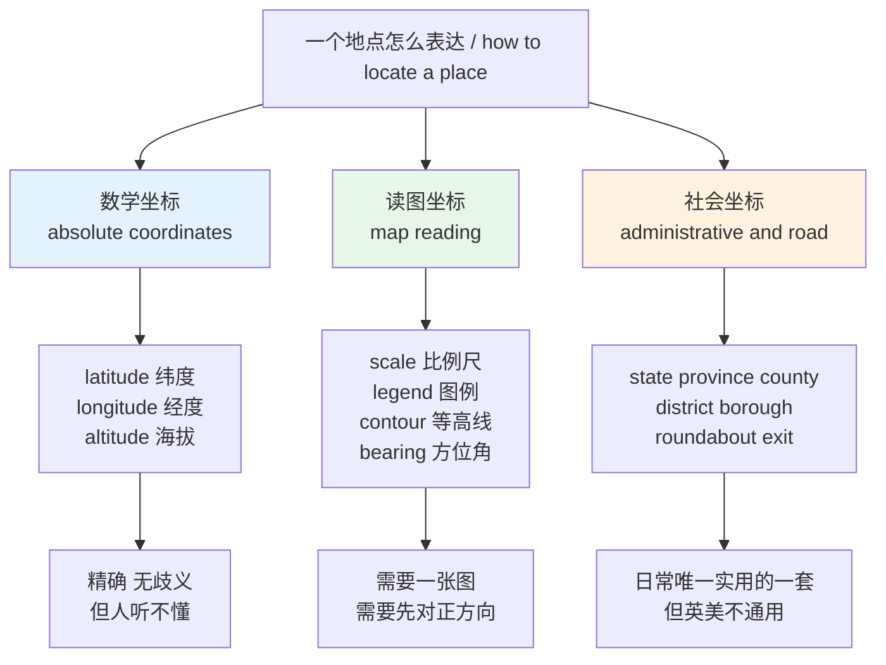
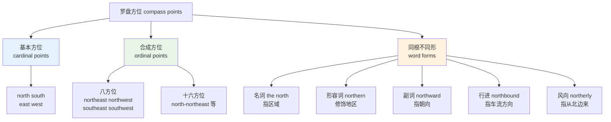
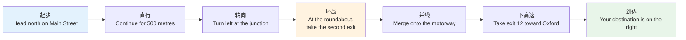
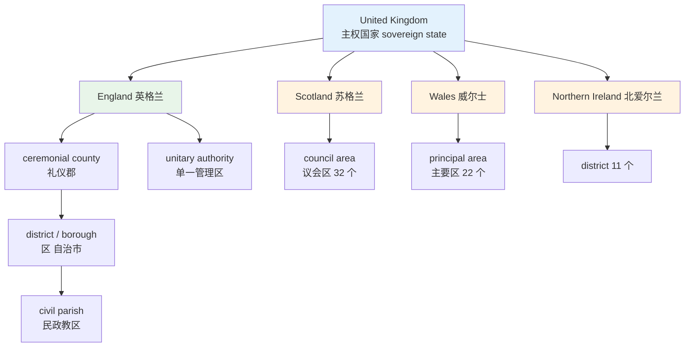
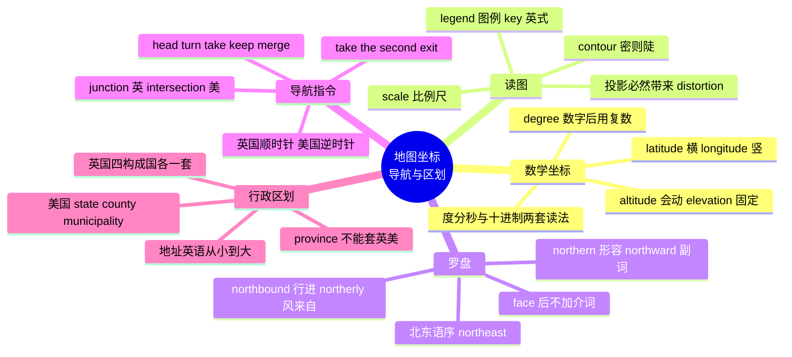

# 地图、坐标、导航与行政区划

> [!info] 本篇定位
>
> 本章第三篇，也是方位词汇里最「硬」的一篇：前两篇讲的是相对于说话人的方位（前后左右、上下里外），这一篇讲的是**脱离说话人也成立的方位**——经纬度、罗盘、路网、行政边界。
>
> 读完你能做三件事：把一个坐标念出来，把一张英文地图的图例读懂，把车载导航和路牌上的指令听懂看懂；并且知道 `state`、`province`、`county`、`district`、`borough` 在英美各自指什么，不会再把「省」直接译成 `province` 就交差。
>
> 与 [[05.方位与空间词汇/02.上下左右里外\|02.上下左右里外]] 的分工：那一篇管相对方位，本篇管绝对方位。介词本身（`at` / `on` / `in` 接地名）在 `02.02` 讲，本篇只列名词、形容词、动词和固定指令句式。

---

## 1. 本篇导读：三套互不通约的定位系统

说清「一个地方在哪」，英语里有三套完全独立的系统，它们的词汇互不重叠，混用会立刻暴露。

**第一套是数学坐标**：`latitude`、`longitude`、`altitude`。它不依赖任何人，也不依赖任何道路，只依赖地球本身。适合写进数据库、GPS 设备、航空管制。

**第二套是读图坐标**：`scale`、`legend`、`contour`、`bearing`。它依赖一张纸或一块屏幕，你必须先把图摆正，再在图上找到自己。

**第三套是社会坐标**：`state`、`county`、`district`、`postcode`、`take the second exit`。它依赖人为划定的边界和人为修的路，换一个国家就换一套词。



上图给出的是本篇的推进顺序，也是一个实用判断：跟人问路、跟人描述位置，用的永远是第三套；读论文、读设备文档、读航海航空材料，用的是第一套；第二套是把前两套接起来的桥。三套里最容易被中文母语者搞混的是第三套，因为中文的「省—市—县—区」是一套整齐的四级结构，而英语世界没有任何国家是这个结构。

后面十一节按这个顺序展开：第 2、3 节是数学坐标与地形，第 4 到 6 节是读图与导航，第 7 到 11 节是路网与行政区划，第 12 节把最易混的八组词集中辨析。

---

## 2. 经纬度：地球表面的绝对坐标

### 2.1 核心词表

这一组词的共同特点是拉丁词根、四音节居多、重音靠前。`latitude` 与 `longitude` 的词根分别是 `lat`「宽」和 `long`「长」——古人把地球的东西方向看作「宽度」，南北方向看作「长度」，所以纬线是横的，经线是竖的。这个词源提示能一次性解决「哪个是横哪个是竖」的记忆问题。

| 英文 | 英式音标 | 美式音标 | 词性 | 中文 | 搭配与说明 |
| --- | --- | --- | --- | --- | --- |
| **latitude** | /ˈlætɪtjuːd/ | /ˈlætɪtuːd/ | n. | 纬度 | at a latitude of 40 degrees north；横线 |
| **longitude** | /ˈlɒndʒɪtjuːd/ | /ˈlɑːndʒətuːd/ | n. | 经度 | 竖线；形容词 longitudinal |
| **coordinate** | /kəʊˈɔːdɪnət/ | /koʊˈɔːrdɪnət/ | n. | 坐标 | 复数 coordinates；动词读 /-neɪt/ 重音同 |
| **equator** | /ɪˈkweɪtə/ | /ɪˈkweɪtər/ | n. | 赤道 | 定冠词固定：the equator |
| **meridian** | /məˈrɪdiən/ | /məˈrɪdiən/ | n. | 子午线；经线 | the prime meridian 本初子午线 |
| **parallel** | /ˈpærəlel/ | /ˈpærəlel/ | n. | 纬线；平行线 | the 38th parallel 三八线 |
| **hemisphere** | /ˈhemɪsfɪə/ | /ˈhemɪsfɪr/ | n. | 半球 | the northern / southern hemisphere |
| **pole** | /pəʊl/ | /poʊl/ | n. | 极点 | the North Pole 大写专名 |
| **axis** | /ˈæksɪs/ | /ˈæksɪs/ | n. | 轴 | 复数 axes /ˈæksiːz/ |
| **degree** | /dɪˈɡriː/ | /dɪˈɡriː/ | n. | 度 | 符号 °，读 degrees |
| **minute** | /ˈmɪnɪt/ | /ˈmɪnɪt/ | n. | 分（角度） | 符号 ′；与时间的 minute 同形同音 |
| **second** | /ˈsekənd/ | /ˈsekənd/ | n. | 秒（角度） | 符号 ″ |
| **datum** | /ˈdeɪtəm/ | /ˈdeɪtəm/ | n. | 基准面 | WGS 84 datum；复数 data 在此义少用 |
| **geodetic** | /ˌdʒiːəˈdetɪk/ | /ˌdʒiːəˈdetɪk/ | adj. | 大地测量的 | geodetic coordinates |
| **antipode** | /ˈæntɪpəʊd/ | /ˈæntɪpoʊd/ | n. | 对跖点 | 常用复数 antipodes |
| **geolocation** | /ˌdʒiːəʊləʊˈkeɪʃn/ | /ˌdʒiːoʊloʊˈkeɪʃn/ | n. | 地理定位 | 技术文档高频，动词 geolocate |

### 2.2 关键纬线、极区与半球

| 英文 | 英式音标 | 美式音标 | 词性 | 中文 | 搭配与说明 |
| --- | --- | --- | --- | --- | --- |
| **the Tropic of Cancer** | /ˈtrɒpɪk əv ˈkænsə/ | /ˈtrɑːpɪk əv ˈkænsər/ | n. | 北回归线 | 三个词都大写 |
| **the Tropic of Capricorn** | /ˈkæprɪkɔːn/ | /ˈkæprɪkɔːrn/ | n. | 南回归线 | 与星座名同形 |
| **the Arctic Circle** | /ˈɑːktɪk/ | /ˈɑːrktɪk/ | n. | 北极圈 | 第一个 c 常被漏读，正音是 /kt/ |
| **the Antarctic** | /ænˈtɑːktɪk/ | /ænˈtɑːrktɪk/ | n. | 南极地区 | 形容词同形 |
| **the tropics** | /ˈtrɒpɪks/ | /ˈtrɑːpɪks/ | n. | 热带 | 恒用复数加 the |
| **temperate zone** | /ˈtempərət/ | /ˈtempərət/ | n. | 温带 | 注意不读 /ˈtempəreɪt/ |
| **the poles** | /pəʊlz/ | /poʊlz/ | n. | 两极 | polar 为形容词 |
| **polar** | /ˈpəʊlə/ | /ˈpoʊlər/ | adj. | 极地的 | polar bear；polar coordinates 极坐标 |
| **Greenwich** | /ˈɡrenɪtʃ/ | /ˈɡrenɪtʃ/ | n. | 格林尼治 | w 不发音，最经典的地名读音陷阱 |
| **GMT** | /ˌdʒiː em ˈtiː/ | /ˌdʒiː em ˈtiː/ | n. | 格林尼治标准时 | Greenwich Mean Time 的缩写 |
| **time zone** | /ˈtaɪm zəʊn/ | /ˈtaɪm zoʊn/ | n. | 时区 | 与经度直接挂钩，每 15 度一时区 |
| **International Date Line** | /ˈdeɪt laɪn/ | /ˈdeɪt laɪn/ | n. | 国际日期变更线 | 大致沿 180 度经线 |

### 2.3 坐标怎么读出来

写法有两套：度分秒（DMS）和十进制度（decimal degrees）。技术文档里两套都会出现，读法完全不同。

```text
度分秒写法    39°54′27″N, 116°23′17″E
读作          thirty-nine degrees fifty-four minutes twenty-seven seconds north,
              one hundred and sixteen degrees twenty-three minutes seventeen seconds east

十进制写法    39.9075, 116.3883
读作          thirty-nine point nine zero seven five degrees north,
              one hundred and sixteen point three eight eight three degrees east
```

> [!warning] 三个高频错误
>
> 第一，`degree` 在数字后面必须用复数：`40 degrees north`，不能说 ~~40 degree north~~。只有 `one degree` 用单数。
>
> 第二，方向词放最后，而且是 `north` 不是 `northern`。
>
> - ❌ ~~forty northern degrees~~
> - ✅ **40 degrees north**（口语）／ **40°N**（书面）
>
> 第三，英式读大数会插 `and`（`one hundred and sixteen`），美式通常不插（`one hundred sixteen`）。写代码注释、写论文时按目标读者选，别混着来。

> [!example] 坐标出现在句子里的样子
>
> - Beijing lies at a **latitude** of about 40 degrees north.
>   - 北京大致位于北纬四十度。
> - The two cities are on almost the same **meridian**.
>   - 这两座城市几乎在同一条经线上。
> - Everything below the **equator** is in the southern **hemisphere**.
>   - 赤道以南都属于南半球。
> - Store the **coordinates** as a pair of floats, latitude first.
>   - 坐标存成一对浮点数，纬度在前。

最后一句是程序员会天天遇到的坑：GeoJSON 规范里的顺序是 `[longitude, latitude]`（经度在前），而多数地图 API 的界面显示是 `latitude, longitude`（纬度在前）。英文文档里 `lat/lng`、`lat/lon`、`LatLng`、`lnglat` 四种缩写都存在，读到时必须逐个确认顺序，不能想当然。

---

## 3. 高度、深度与地形起伏

### 3.1 四个「高度」的分工

中文一个「高」字，英语至少分四个词，选错会让技术文本读起来不专业。

| 英文 | 英式音标 | 美式音标 | 词性 | 中文 | 搭配与说明 |
| --- | --- | --- | --- | --- | --- |
| **height** | /haɪt/ | /haɪt/ | n. | 高度 | 物体自身从底到顶，最通用 |
| **altitude** | /ˈæltɪtjuːd/ | /ˈæltɪtuːd/ | n. | 海拔；飞行高度 | 飞机、气球，强调离地或离海面 |
| **elevation** | /ˌelɪˈveɪʃn/ | /ˌelɪˈveɪʃn/ | n. | 海拔（地面点） | 地图上标某点海拔用这个词 |
| **depth** | /depθ/ | /depθ/ | n. | 深度 | 形容词 deep，动词 deepen |
| **sea level** | /ˈsiː levl/ | /ˈsiː levl/ | n. | 海平面 | above / below sea level 固定搭配 |
| **relief** | /rɪˈliːf/ | /rɪˈliːf/ | n. | 地势起伏 | relief map 地势图；不是「救济」义 |
| **terrain** | /təˈreɪn/ | /təˈreɪn/ | n. | 地形；地面状况 | rough terrain；重音在后 |
| **topography** | /təˈpɒɡrəfi/ | /təˈpɑːɡrəfi/ | n. | 地形学；地貌 | 形容词 topographic |
| **gradient** | /ˈɡreɪdiənt/ | /ˈɡreɪdiənt/ | n. | 坡度 | 英式常用；美式路牌多用 grade |
| **grade** | /ɡreɪd/ | /ɡreɪd/ | n. | 坡度（美） | a 6% grade 路牌写法 |
| **slope** | /sləʊp/ | /sloʊp/ | n./v. | 斜坡；倾斜 | steep slope；the roof slopes down |
| **summit** | /ˈsʌmɪt/ | /ˈsʌmɪt/ | n. | 顶峰 | 也指首脑会议，同一「顶」义 |
| **ridge** | /rɪdʒ/ | /rɪdʒ/ | n. | 山脊 | 等高线图上凸向低处的一组线 |
| **valley** | /ˈvæli/ | /ˈvæli/ | n. | 谷地 | 等高线凸向高处 |
| **plateau** | /ˈplætəʊ/ | /plæˈtoʊ/ | n. | 高原 | 英美重音位置不同，注意听辨 |
| **basin** | /ˈbeɪsn/ | /ˈbeɪsn/ | n. | 盆地；流域 | the Amazon basin |
| **benchmark** | /ˈbentʃmɑːk/ | /ˈbentʃmɑːrk/ | n. | 水准点 | 原义是测量标石，转义才是「基准」 |

### 3.2 高度的表达句式

> [!example] altitude 与 elevation 的实际分工
>
> - We are cruising at an **altitude** of 35,000 feet.
>   - 我们正在三万五千英尺高度巡航。（机上广播固定说法，不用 elevation）
> - Denver sits at an **elevation** of about 1,600 metres.
>   - 丹佛海拔约一千六百米。（地面城市用 elevation）
> - The village is 200 metres **above sea level**.
>   - 这个村子海拔两百米。（口语最自然的说法）
> - The trench reaches a **depth** of 11 kilometres.
>   - 这条海沟深达十一公里。

一条实用规则：**会动的东西用 `altitude`，不会动的地面点用 `elevation`**。飞机、无人机、气球用 `altitude`；城市、山峰、机场跑道用 `elevation`。GIS 数据里的 DEM 全称是 Digital Elevation Model（数字高程模型），用的正是 `elevation`，因为它描述的是固定地面。

> [!warning] high 不能直接当名词用
>
> 中文说「这座山的高度是三千米」，英语不能写成 ~~the high of the mountain~~。
>
> - ❌ ~~The high of the mountain is 3,000 metres.~~
> - ✅ The **height** of the mountain is 3,000 metres.
> - ✅ The mountain is 3,000 metres **high**.（形容词后置，最自然）
>
> `high` 是形容词与副词，名词形式是 `height`；同理 `deep` 的名词是 `depth`，`long` 的名词是 `length`，`wide` 的名词是 `width`。这四组是同一条构词规律，元音要变。

---

## 4. 读图：比例尺、图例、等高线

### 4.1 一张地图上的部件

拿到一张英文地图，四样东西决定能不能读懂：比例尺、图例、方向标、格网。

| 英文 | 英式音标 | 美式音标 | 词性 | 中文 | 搭配与说明 |
| --- | --- | --- | --- | --- | --- |
| **scale** | /skeɪl/ | /skeɪl/ | n. | 比例尺 | a scale of 1:50,000；读作 one to fifty thousand |
| **scale bar** | /ˈskeɪl bɑː/ | /ˈskeɪl bɑːr/ | n. | 比例尺条 | 图上那根带刻度的线段 |
| **legend** | /ˈledʒənd/ | /ˈledʒənd/ | n. | 图例 | 地图与图表通用；不是「传说」义 |
| **key** | /kiː/ | /kiː/ | n. | 图例（英式） | 英国地图多写 key，美国多写 legend |
| **symbol** | /ˈsɪmbl/ | /ˈsɪmbl/ | n. | 符号 | map symbols 图式符号 |
| **grid** | /ɡrɪd/ | /ɡrɪd/ | n. | 格网 | grid reference 格网坐标 |
| **grid square** | /ˈɡrɪd skweə/ | /ˈɡrɪd skwer/ | n. | 网格方格 | 英国 OS 地图定位单位 |
| **easting** | /ˈiːstɪŋ/ | /ˈiːstɪŋ/ | n. | 东距（横坐标） | 读格网坐标时先读 easting |
| **northing** | /ˈnɔːθɪŋ/ | /ˈnɔːrθɪŋ/ | n. | 北距（纵坐标） | 顺序口诀 along the corridor, up the stairs |
| **compass rose** | /ˈkʌmpəs rəʊz/ | /ˈkʌmpəs roʊz/ | n. | 方位罗盘图 | 图角落那个指北的花瓣图案 |
| **north arrow** | /ˈnɔːθ ærəʊ/ | /ˈnɔːrθ eroʊ/ | n. | 指北针 | 简化版 compass rose |
| **inset** | /ˈɪnset/ | /ˈɪnset/ | n. | 插图；局部放大图 | inset map；重音在前 |
| **projection** | /prəˈdʒekʃn/ | /prəˈdʒekʃn/ | n. | 投影 | the Mercator projection |
| **distortion** | /dɪˈstɔːʃn/ | /dɪˈstɔːrʃn/ | n. | 变形 | 投影必然带来的面积或角度失真 |
| **atlas** | /ˈætləs/ | /ˈætləs/ | n. | 地图册 | 复数 atlases |
| **gazetteer** | /ˌɡæzəˈtɪə/ | /ˌɡæzəˈtɪr/ | n. | 地名索引 | 地图册后面那张地名表 |
| **cartography** | /kɑːˈtɒɡrəfi/ | /kɑːrˈtɑːɡrəfi/ | n. | 制图学 | cartographer 制图员 |
| **surveyor** | /səˈveɪə/ | /sərˈveɪər/ | n. | 测量员 | 动词 survey，名词重音在前 |

> [!warning] legend 与 caption 不是一回事
>
> `legend` 是图上符号与含义的对照表，`caption` 是图下面那句说明文字。技术文档里写错会被审稿人挑出来。
>
> - ❌ ~~See the caption for what the red dots mean.~~（红点含义在图例里，不在标题里）
> - ✅ See the **legend** for what the red dots mean.
>
> 另外 `scale` 在地图上指比例尺，在数据可视化里指坐标轴的标度，在音乐里指音阶——同一个词三个专业义，靠上下文区分。

### 4.2 等高线与地形图

| 英文 | 英式音标 | 美式音标 | 词性 | 中文 | 搭配与说明 |
| --- | --- | --- | --- | --- | --- |
| **contour** | /ˈkɒntʊə/ | /ˈkɑːntʊr/ | n. | 等高线；轮廓 | contour line 全写；重音在前 |
| **contour interval** | /ˈɪntəvl/ | /ˈɪntərvl/ | n. | 等高距 | 相邻两条线的高差 |
| **spot height** | /ˈspɒt haɪt/ | /ˈspɑːt haɪt/ | n. | 高程点 | 图上打点标数字的那种 |
| **isoline** | /ˈaɪsəʊlaɪn/ | /ˈaɪsoʊlaɪn/ | n. | 等值线 | iso- 表「等」，见构词法章 |
| **isobar** | /ˈaɪsəʊbɑː/ | /ˈaɪsoʊbɑːr/ | n. | 等压线 | 气象图常见 |
| **steep** | /stiːp/ | /stiːp/ | adj. | 陡的 | 等高线密集表示陡 |
| **gentle** | /ˈdʒentl/ | /ˈdʒentl/ | adj. | 平缓的 | a gentle slope 缓坡 |
| **saddle** | /ˈsædl/ | /ˈsædl/ | n. | 鞍部 | 两峰之间的低处 |
| **escarpment** | /ɪˈskɑːpmənt/ | /ɪˈskɑːrpmənt/ | n. | 陡崖 | 一侧陡一侧缓的长条地形 |
| **watershed** | /ˈwɔːtəʃed/ | /ˈwɔːtərʃed/ | n. | 分水岭；流域（美） | 英式指分界线，美式常指整个流域 |

读等高线只需要三条规则：线越密坡越陡；线闭合成圈是山顶或洼地；线向高处凸出是谷，向低处凸出是脊。英文材料里描述这三条的固定说法分别是 `closely spaced contours`（线密）、`concentric rings`（同心圈）和 `contours pointing upstream`（V 字指向上游即为谷）。

---

## 5. 罗盘方位：四个词衍生出的一整套形态

### 5.1 从 north 派生出的五种形式

`north` 这一个词根能变出名词、形容词、副词、行进方向、风向五种用法，形态各不相同。四个基本方位都遵循同一套变化，学会一个就学会四个。



上图右侧那一列是中文母语者最容易漏掉的部分。中文只有一个「北」字，英语却要求你在「北方地区」「向北」「北行列车」「北风」四种语境里换四个词。用错不会造成误解，但会立刻显出不地道。特别注意 `northerly wind` 指的是**从北边吹来的风**，不是吹向北边——风向词描述来源，这与其他所有方位词的逻辑相反。

| 英文 | 英式音标 | 美式音标 | 词性 | 中文 | 搭配与说明 |
| --- | --- | --- | --- | --- | --- |
| **north** | /nɔːθ/ | /nɔːrθ/ | n./adj./adv. | 北 | the north 名词要加 the |
| **south** | /saʊθ/ | /saʊθ/ | n./adj./adv. | 南 | 形容词 southern 读 /ˈsʌðən/，元音变了 |
| **east** | /iːst/ | /iːst/ | n./adj./adv. | 东 | the Far East 远东 |
| **west** | /west/ | /west/ | n./adj./adv. | 西 | the West 大写时指西方世界 |
| **northern** | /ˈnɔːðən/ | /ˈnɔːrðərn/ | adj. | 北方的 | th 浊化为 /ð/，与 north 的 /θ/ 不同 |
| **southern** | /ˈsʌðən/ | /ˈsʌðərn/ | adj. | 南方的 | 元音由 /aʊ/ 变 /ʌ/，是高频误读点 |
| **eastern** | /ˈiːstən/ | /ˈiːstərn/ | adj. | 东方的 | — |
| **western** | /ˈwestən/ | /ˈwestərn/ | adj. | 西方的 | a western 也指西部片 |
| **northward** | /ˈnɔːθwəd/ | /ˈnɔːrθwərd/ | adv./adj. | 向北 | 英式常加 s：northwards |
| **northbound** | /ˈnɔːθbaʊnd/ | /ˈnɔːrθbaʊnd/ | adj. | 北行的 | the northbound carriageway 北行车道 |
| **northerly** | /ˈnɔːðəli/ | /ˈnɔːrðərli/ | adj. | 偏北的；北来的 | a northerly wind 是北风 |
| **northeast** | /ˌnɔːθˈiːst/ | /ˌnɔːrθˈiːst/ | n./adj. | 东北 | 英语顺序是「北东」，与中文相反 |
| **southwest** | /ˌsaʊθˈwest/ | /ˌsaʊθˈwest/ | n./adj. | 西南 | 同样是「南西」顺序 |
| **cardinal points** | /ˈkɑːdɪnl/ | /ˈkɑːrdɪnl/ | n. | 基本方位 | 指东南西北四个 |
| **due north** | /ˌdjuː ˈnɔːθ/ | /ˌduː ˈnɔːrθ/ | adv. | 正北 | due 表示「正」，不能换成 exactly |

> [!warning] 复合方位的语序与中文相反
>
> 中文说「东北」「西南」，英语说 `northeast`「北东」、`southwest`「南西」——南北在前，东西在后。四个复合方位没有例外。
>
> - ❌ ~~eastnorth~~ ／ ~~westsouth~~
> - ✅ **northeast** ／ **southwest**
>
> 同理十六方位制里 `north-northeast`（北北东）也是南北打头。中文习惯的「东北风」对应 `a northeasterly wind`。

### 5.2 方位角与朝向动词

| 英文 | 英式音标 | 美式音标 | 词性 | 中文 | 搭配与说明 |
| --- | --- | --- | --- | --- | --- |
| **bearing** | /ˈbeərɪŋ/ | /ˈberɪŋ/ | n. | 方位角 | on a bearing of 045 degrees；三位数读法 |
| **azimuth** | /ˈæzɪməθ/ | /ˈæzɪməθ/ | n. | 方位角（天文） | 重音在首，比 bearing 更技术 |
| **heading** | /ˈhedɪŋ/ | /ˈhedɪŋ/ | n. | 航向 | 航空管制固定用词 |
| **orient** | /ˈɔːrient/ | /ˈɔːrient/ | v. | 定向；对正 | orient the map to north 把图对正北方 |
| **orientation** | /ˌɔːriənˈteɪʃn/ | /ˌɔːriənˈteɪʃn/ | n. | 朝向；方位 | 也指手机屏幕的横竖屏方向 |
| **face** | /feɪs/ | /feɪs/ | v. | 朝向 | The house faces south. 不加介词 |
| **overlook** | /ˌəʊvəˈlʊk/ | /ˌoʊvərˈlʊk/ | v. | 俯瞰；朝向 | The room overlooks the sea. |
| **head** | /hed/ | /hed/ | v. | 朝某方向行进 | head north 导航第一指令 |
| **veer** | /vɪə/ | /vɪr/ | v. | 偏转 | The road veers left. 缓慢偏离 |
| **clockwise** | /ˈklɒkwaɪz/ | /ˈklɑːkwaɪz/ | adv./adj. | 顺时针 | 英国环岛按顺时针走 |
| **anticlockwise** | /ˌæntiˈklɒkwaɪz/ | — | adv. | 逆时针（英） | 美式说 counterclockwise |
| **counterclockwise** | — | /ˌkaʊntərˈklɑːkwaɪz/ | adv. | 逆时针（美） | 美国环岛按逆时针走 |
| **upstream** | /ˌʌpˈstriːm/ | /ˌʌpˈstriːm/ | adv./adj. | 上游 | 技术语境也指数据流上游 |
| **downstream** | /ˌdaʊnˈstriːm/ | /ˌdaʊnˈstriːm/ | adv./adj. | 下游 | 同上 |

> [!example] 方位角与朝向在句子里
>
> - Set off on a **bearing** of 045.
>   - 按零四五方位角出发。（三位数逐位读：zero four five）
> - The cabin **faces** due west, so you get the sunset.
>   - 小屋正朝西，能看到日落。
> - **Orient** the map first, then find your position.
>   - 先把地图对正方向，再找自己的位置。
> - Traffic on the **northbound** carriageway is at a standstill.
>   - 北行车道完全堵死了。

`face` 后面直接跟方位词，不加介词，这是中文母语者常错的一处：不能说 ~~face to south~~ 或 ~~face towards south~~，就是 `face south`。加介词的版本 `face towards the sea` 只在宾语是具体物体时成立。

---

## 6. 导航指令：车载语音的固定句式

### 6.1 一条完整路线的指令序列

导航语音的英文是一套高度模板化的祈使句，词汇量不大但组合固定，听懂了就能全部听懂。



上面七步覆盖了英国导航语音的绝大部分句型。四个动词撑起整套系统：`head`（起步定向）、`turn` / `take`（转向与选出口）、`continue` / `keep`（保持）、`merge` / `exit`（并入与驶离）。注意 `take` 在这里有两个完全不同的用法：`take the second exit` 是选环岛出口，`take exit 12` 是选高速出口，后者的 `exit` 带编号且不加 the。

### 6.2 转向、掉头与保持

| 英文 | 英式音标 | 美式音标 | 词性 | 中文 | 搭配与说明 |
| --- | --- | --- | --- | --- | --- |
| **head** | /hed/ | /hed/ | v. | 朝…行进 | head north / head towards the bridge |
| **turn left** | /tɜːn left/ | /tɜːrn left/ | phr. | 左转 | 不加介词，不说 turn to left |
| **turn right** | /tɜːn raɪt/ | /tɜːrn raɪt/ | phr. | 右转 | — |
| **bear left** | /beə left/ | /ber left/ | phr. | 靠左偏行 | 分岔口缓转，比 turn 角度小 |
| **keep left** | /kiːp left/ | /kiːp left/ | phr. | 保持左侧 | 路面标线的固定说法 |
| **make a U-turn** | /ˈjuː tɜːn/ | /ˈjuː tɜːrn/ | phr. | 掉头 | 英式也说 do a U-turn |
| **go straight on** | /streɪt ɒn/ | /streɪt ɑːn/ | phr. | 直行（英） | 美式说 go straight ahead |
| **continue** | /kənˈtɪnjuː/ | /kənˈtɪnjuː/ | v. | 继续行驶 | continue for two miles |
| **proceed** | /prəˈsiːd/ | /prəˈsiːd/ | v. | 前行 | 比 continue 正式，路牌与广播用 |
| **follow** | /ˈfɒləʊ/ | /ˈfɑːloʊ/ | v. | 沿…行驶 | follow the signs for the airport |
| **stay in lane** | /steɪ ɪn leɪn/ | /steɪ ɪn leɪn/ | phr. | 保持车道 | 英国路面漆字的原文 |
| **turn around** | /tɜːn əˈraʊnd/ | /tɜːrn əˈraʊnd/ | phr. | 调头返回 | 比 U-turn 口语 |
| **double back** | /ˌdʌbl ˈbæk/ | /ˌdʌbl ˈbæk/ | phr. | 原路折返 | 走错路后的说法 |

### 6.3 环岛、出口与并线

`roundabout` 是英式路网的标志性设施，也是英美差异最集中的一个词。

| 英文 | 英式音标 | 美式音标 | 词性 | 中文 | 搭配与说明 |
| --- | --- | --- | --- | --- | --- |
| **roundabout** | /ˈraʊndəbaʊt/ | /ˈraʊndəbaʊt/ | n. | 环岛（英） | 英国最常用；也指旋转木马 |
| **traffic circle** | /ˈtræfɪk sɜːkl/ | /ˈtræfɪk sɜːrkl/ | n. | 环岛（美） | 美国通用说法 |
| **rotary** | /ˈrəʊtəri/ | /ˈroʊtəri/ | n. | 环岛（美东北） | 新英格兰地区的地方说法 |
| **exit** | /ˈeksɪt/ | /ˈeɡzɪt/ | n./v. | 出口；驶离 | 英式多读 /ˈeksɪt/，美式两读都有 |
| **take the first exit** | — | — | phr. | 走第一个出口 | 环岛指令的标准句式 |
| **slip road** | /ˈslɪp rəʊd/ | — | n. | 匝道（英） | 上下高速的连接路 |
| **ramp** | — | /ræmp/ | n. | 匝道（美） | on-ramp 上匝道，off-ramp 下匝道 |
| **merge** | /mɜːdʒ/ | /mɜːrdʒ/ | v. | 并线汇入 | merge onto the motorway |
| **junction** | /ˈdʒʌŋkʃn/ | /ˈdʒʌŋkʃn/ | n. | 路口；枢纽（英） | 英国高速出口编号写 Junction 12 |
| **intersection** | /ˌɪntəˈsekʃn/ | /ˌɪntərˈsekʃn/ | n. | 路口（美） | 美国城市街道交叉口 |
| **crossroads** | /ˈkrɒsrəʊdz/ | /ˈkrɔːsroʊdz/ | n. | 十字路口 | 单复数同形，单数也带 s |
| **fork** | /fɔːk/ | /fɔːrk/ | n. | 岔路 | take the left fork |
| **detour** | /ˈdiːtʊə/ | /ˈdiːtʊr/ | n./v. | 绕行（美） | 美国施工路牌写 DETOUR |
| **diversion** | /daɪˈvɜːʃn/ | /daɪˈvɜːrʒn/ | n. | 绕行（英） | 英国施工路牌写 DIVERSION |
| **destination** | /ˌdestɪˈneɪʃn/ | /ˌdestɪˈneɪʃn/ | n. | 目的地 | You have reached your destination. |
| **route** | /ruːt/ | /ruːt/ 或 /raʊt/ | n. | 路线 | 美式两读并存，路由器 router 同理 |
| **reroute** | /ˌriːˈruːt/ | /ˌriːˈraʊt/ | v. | 重新规划路线 | 导航说 Rerouting. |
| **waypoint** | /ˈweɪpɔɪnt/ | /ˈweɪpɔɪnt/ | n. | 途经点 | GPS 与航空通用 |
| **ETA** | /ˌiː tiː ˈeɪ/ | /ˌiː tiː ˈeɪ/ | n. | 预计到达时间 | estimated time of arrival |

> [!example] 环岛指令的完整说法
>
> - At the **roundabout**, take the **second exit** onto the A40.
>   - 在环岛走第二个出口，上 A40 公路。
> - Go straight over at the **roundabout**.
>   - 在环岛直行通过。（等于走第二个出口的口语说法）
> - **Merge** onto the M25 and **keep left**.
>   - 汇入 M25 并保持左侧车道。
> - Take **exit 12** toward Oxford, then **bear right** at the **fork**.
>   - 走十二号出口去牛津方向，然后在岔路口靠右。

> [!warning] 数出口时英美起算方式不同
>
> 英国环岛按顺时针行车，第一个出口是**左手边**那个；美国和欧洲大陆按逆时针，第一个出口是**右手边**那个。同一句 `take the first exit` 在两地指向相反方向。
>
> 出口编号也不同：英国高速用 `Junction 12`（简写 J12），美国州际公路用 `Exit 12`。英国路标上出现 `J12`，美国出现 `EXIT 12`，看到哪种写法就知道在哪个体系里。

---

## 7. 路网词汇：英美两套并行的名字

### 7.1 道路等级

同一类道路在英美有不同的名字，混用不会造成误解但会显出来源。下表按同一概念的英式说法和美式说法相邻排列。

| 英文 | 英式音标 | 美式音标 | 词性 | 中文 | 搭配与说明 |
| --- | --- | --- | --- | --- | --- |
| **motorway** | /ˈməʊtəweɪ/ | — | n. | 高速公路（英） | 编号以 M 开头，如 M1 |
| **freeway** | — | /ˈfriːweɪ/ | n. | 高速公路（美） | 不收费的快速路 |
| **highway** | /ˈhaɪweɪ/ | /ˈhaɪweɪ/ | n. | 公路 | 两地都用，泛指干道 |
| **interstate** | — | /ˈɪntərsteɪt/ | n. | 州际公路（美） | I-95 读作 Interstate ninety-five |
| **expressway** | /ɪkˈspresweɪ/ | /ɪkˈspresweɪ/ | n. | 快速路 | 亚洲英语与美式常用 |
| **dual carriageway** | /ˌdjuːəl ˈkærɪdʒweɪ/ | — | n. | 双向分隔道路（英） | 中间有隔离带 |
| **divided highway** | — | /dɪˌvaɪdɪd ˈhaɪweɪ/ | n. | 双向分隔道路（美） | 同上 |
| **carriageway** | /ˈkærɪdʒweɪ/ | — | n. | 行车道（英） | 一个方向的整幅路面 |
| **A road** | /ˈeɪ rəʊd/ | — | n. | A 级公路（英） | 次于 motorway 的干道 |
| **street** | /striːt/ | /striːt/ | n. | 街 | 城市内，通常有建筑 |
| **avenue** | /ˈævənjuː/ | /ˈævənuː/ | n. | 大道 | 美国常与 street 垂直交叉 |
| **boulevard** | /ˈbuːləvɑːd/ | /ˈbʊləvɑːrd/ | n. | 林荫大道 | 法语借词，简写 Blvd |
| **lane** | /leɪn/ | /leɪn/ | n. | 小路；车道 | 两义并存，靠上下文分 |
| **alley** | /ˈæli/ | /ˈæli/ | n. | 小巷 | 英式也说 alleyway |
| **cul-de-sac** | /ˈkʌldəsæk/ | /ˈkʌldəsæk/ | n. | 死胡同 | 法语借词，住宅区常见 |
| **dead end** | /ˌded ˈend/ | /ˌded ˈend/ | n. | 断头路 | 路牌直接写 DEAD END |
| **toll road** | /ˈtəʊl rəʊd/ | /ˈtoʊl roʊd/ | n. | 收费公路 | toll booth 收费亭 |
| **ring road** | /ˈrɪŋ rəʊd/ | — | n. | 环路（英） | 美式说 beltway 或 loop |
| **beltway** | — | /ˈbeltweɪ/ | n. | 环城路（美） | 华盛顿的 the Beltway 转指政界 |

### 7.2 路侧设施与行人空间

| 英文 | 英式音标 | 美式音标 | 词性 | 中文 | 搭配与说明 |
| --- | --- | --- | --- | --- | --- |
| **pavement** | /ˈpeɪvmənt/ | /ˈpeɪvmənt/ | n. | 人行道（英）／路面（美） | 同形异义，最危险的一对 |
| **sidewalk** | — | /ˈsaɪdwɔːk/ | n. | 人行道（美） | 英国人不用这个词 |
| **kerb** | /kɜːb/ | — | n. | 路缘石（英） | 美式拼作 curb，读音相同 |
| **curb** | /kɜːb/ | /kɜːrb/ | n./v. | 路缘石（美）；抑制 | 动词义两地通用 |
| **verge** | /vɜːdʒ/ | /vɜːrdʒ/ | n. | 路肩草地（英） | 美式多说 shoulder |
| **shoulder** | /ˈʃəʊldə/ | /ˈʃoʊldər/ | n. | 路肩 | hard shoulder 英式硬路肩 |
| **lay-by** | /ˈleɪbaɪ/ | — | n. | 路侧停车带（英） | 美式说 pull-off 或 rest area |
| **crossing** | /ˈkrɒsɪŋ/ | /ˈkrɔːsɪŋ/ | n. | 人行横道（英） | zebra crossing 斑马线 |
| **crosswalk** | — | /ˈkrɔːswɔːk/ | n. | 人行横道（美） | — |
| **zebra** | /ˈzebrə/ | /ˈziːbrə/ | n. | 斑马 | 英美元音差异极大的常用词 |
| **flyover** | /ˈflaɪəʊvə/ | — | n. | 立交桥（英） | 美式 flyover 指飞行表演掠过 |
| **overpass** | — | /ˈoʊvərpæs/ | n. | 立交桥（美） | — |
| **underpass** | /ˈʌndəpɑːs/ | /ˈʌndərpæs/ | n. | 地下通道 | 两地通用 |
| **subway** | /ˈsʌbweɪ/ | /ˈsʌbweɪ/ | n. | 地下人行道（英）／地铁（美） | 又一对同形异义 |
| **roadworks** | /ˈrəʊdwɜːks/ | — | n. | 道路施工（英） | 恒用复数；美式说 construction |
| **traffic light** | /ˈtræfɪk laɪt/ | /ˈtræfɪk laɪt/ | n. | 红绿灯 | 美式口语也说 stoplight |
| **give way** | /ɡɪv ˈweɪ/ | — | phr. | 让行（英） | 路牌原文 GIVE WAY |
| **yield** | — | /jiːld/ | v. | 让行（美） | 路牌原文 YIELD |
| **one-way** | /ˌwʌn ˈweɪ/ | /ˌwʌn ˈweɪ/ | adj. | 单行的 | a one-way street |
| **landmark** | /ˈlændmɑːk/ | /ˈlændmɑːrk/ | n. | 地标 | 指路时最常用的参照物 |
| **block** | /blɒk/ | /blɑːk/ | n. | 街区（美） | 美式指路单位，英国人不这么算 |

> [!warning] pavement 与 subway 是真会出事的两个词
>
> `pavement` 在英国指人行道，在美国指铺装路面（也就是车走的地方）。一个英国人说 `Walk on the pavement`，意思是走人行道；一个美国人听成「走在马路上」，就成了危险指令。
>
> - 英式 the **pavement** = 美式 the **sidewalk**（人行道）
> - 美式 the **pavement** = 英式 the **road surface**（路面）
>
> `subway` 同理：在伦敦指的是过街地下通道，在纽约指的是地铁。伦敦地铁叫 `the Underground` 或 `the Tube`。
>
> - ❌ 在伦敦问 Where is the subway?（对方会指给你一条过街地道）
> - ✅ 在伦敦问 Where is the nearest **Tube** station?

> [!tip] 美式指路的 block 是个计量单位
>
> 美国城市多是棋盘格路网，所以 `block` 成了距离单位：`three blocks north` 就是「往北过三个路口」。英国街道不规则，没有这个用法，英国人指路靠地标和路名：`Turn left at the church, then follow the road round.`
>
> 到了美国要习惯用 block 数距离，到了英国要习惯记住 landmark。这不是词汇差异，是城市形态差异带来的表达差异。

---

## 8. 行政区划：美国体系

### 8.1 从联邦到市镇

美国的层级是 **federal → state → county → municipality**，四层里只有前三层稳定，第四层名称各州不同。

| 英文 | 英式音标 | 美式音标 | 词性 | 中文 | 搭配与说明 |
| --- | --- | --- | --- | --- | --- |
| **federal** | /ˈfedərəl/ | /ˈfedərəl/ | adj. | 联邦的 | the federal government |
| **state** | /steɪt/ | /steɪt/ | n. | 州 | 五十个；不能译作「省」 |
| **commonwealth** | /ˈkɒmənwelθ/ | /ˈkɑːmənwelθ/ | n. | 联邦；州（自称） | 麻州等四州正式名用此词 |
| **territory** | /ˈterətri/ | /ˈterətɔːri/ | n. | 属地 | 关岛、波多黎各等 |
| **county** | /ˈkaʊnti/ | /ˈkaʊnti/ | n. | 县 | 州以下一级，全美约三千个 |
| **parish** | /ˈpærɪʃ/ | /ˈpærɪʃ/ | n. | 教区（路易斯安那州的县） | 该州不用 county |
| **borough** | /ˈbʌrə/ | /ˈbɜːroʊ/ | n. | 自治市镇；区 | 阿拉斯加用它代替 county |
| **municipality** | /mjuːˌnɪsɪˈpæləti/ | /mjuːˌnɪsɪˈpæləti/ | n. | 市政单位 | 泛指有自治权的市镇 |
| **township** | /ˈtaʊnʃɪp/ | /ˈtaʊnʃɪp/ | n. | 镇区 | 中西部县下一级 |
| **city** | /ˈsɪti/ | /ˈsɪti/ | n. | 市 | 需经 incorporate 程序设立 |
| **town** | /taʊn/ | /taʊn/ | n. | 镇 | 规模小于 city，但法律地位各州不同 |
| **village** | /ˈvɪlɪdʒ/ | /ˈvɪlɪdʒ/ | n. | 村；小镇 | 纽约州等有正式的 village 建制 |
| **hamlet** | /ˈhæmlət/ | /ˈhæmlət/ | n. | 小村落 | 无自治机构的聚落 |
| **district** | /ˈdɪstrɪkt/ | /ˈdɪstrɪkt/ | n. | 特区；学区 | school district、congressional district |
| **precinct** | /ˈpriːsɪŋkt/ | /ˈpriːsɪŋkt/ | n. | 选区；警区 | 投票与警务的最小划分 |
| **ward** | /wɔːd/ | /wɔːrd/ | n. | 选区（市内） | 市议员按 ward 选出 |
| **county seat** | /ˈkaʊnti siːt/ | /ˈkaʊnti siːt/ | n. | 县治所在地 | 县政府所在的城镇 |
| **incorporated** | /ɪnˈkɔːpəreɪtɪd/ | /ɪnˈkɔːrpəreɪtɪd/ | adj. | 已建制的 | 反义 unincorporated 未建制 |
| **metropolitan area** | /ˌmetrəˈpɒlɪtən/ | /ˌmetrəˈpɑːlɪtən/ | n. | 都会区 | 简称 metro area，跨行政边界 |
| **suburb** | /ˈsʌbɜːb/ | /ˈsʌbɜːrb/ | n. | 郊区 | 形容词 suburban /səˈbɜːrbən/ 重音移位 |

### 8.2 三个特例值得单独记

**纽约市的 borough。** 纽约市下辖五个 `borough`：Manhattan、Brooklyn、Queens、the Bronx、Staten Island。这里的 `borough` 译作「区」，是纽约独有的建制，与阿拉斯加州那个相当于县的 `borough` 不是一回事。

**华盛顿特区。** 全称 Washington, D.C.，`D.C.` 是 District of Columbia 的缩写，它不属于任何州，直接受联邦管辖。所以美国有五十个 state 加一个 federal district。中文说「华盛顿」有歧义，英语必须区分 Washington State（西北角那个州）和 Washington, D.C.（首都）。

**路易斯安那的 parish。** 该州因为法国天主教传统，把县叫 `parish`。写地址、填表时用 parish 而不是 county。

> [!example] 美式地址里的层级
>
> - She lives in Cook **County**, Illinois.
>   - 她住在伊利诺伊州库克县。
> - The bill passed both **state** and **federal** review.
>   - 这项议案通过了州和联邦两级审查。
> - Brooklyn is one of the five **boroughs** of New York City.
>   - 布鲁克林是纽约市五个区之一。

---

## 9. 行政区划：英国体系

### 9.1 国家之上还有国家

英国最反直觉的一点：United Kingdom 本身不是一个 country，而是由四个 country 组成的主权国家。`England`、`Scotland`、`Wales`、`Northern Ireland` 在英语里都被称作 country，尽管它们不是主权国家。



上图暴露了英美体系最大的结构差异：美国四层整齐，英国四个构成国各有一套。英格兰内部还并行着「礼仪郡」和「行政郡」两套郡界——前者用于传统、体育、邮政习惯，后者用于实际行政。所以同一个地方可能属于礼仪郡 Greater Manchester，行政上却归某个 unitary authority 管。中文材料把这些一律译成「郡」，读英文原文时必须看清是哪一套。

| 英文 | 英式音标 | 美式音标 | 词性 | 中文 | 搭配与说明 |
| --- | --- | --- | --- | --- | --- |
| **county** | /ˈkaʊnti/ | /ˈkaʊnti/ | n. | 郡 | 英国的郡与美国的县同词不同级 |
| **shire** | /ˈʃaɪə/ | /ˈʃaɪər/ | n. | 郡（古称） | 单用时读 /ʃaɪə/ |
| **-shire** | /ʃə/ | /ʃər/ | suf. | 郡（后缀） | 作后缀时弱读，Yorkshire /ˈjɔːkʃə/ |
| **borough** | /ˈbʌrə/ | /ˈbɜːroʊ/ | n. | 自治市；伦敦区 | London borough 伦敦下辖 32 个 |
| **district** | /ˈdɪstrɪkt/ | /ˈdɪstrɪkt/ | n. | 区 | 郡以下一级 |
| **parish** | /ˈpærɪʃ/ | /ˈpærɪʃ/ | n. | 教区；民政教区 | civil parish 是最基层建制 |
| **ward** | /wɔːd/ | /wɔːrd/ | n. | 选区 | 地方议员按 ward 产生 |
| **constituency** | /kənˈstɪtjuənsi/ | /kənˈstɪtʃuənsi/ | n. | 选区（议会） | 下议院议员的选区 |
| **council** | /ˈkaʊnsl/ | /ˈkaʊnsl/ | n. | 议会；地方政府 | county council、borough council |
| **unitary authority** | /ˈjuːnɪtri ɔːˈθɒrəti/ | /ˈjuːnəteri əˈθɔːrəti/ | n. | 单一管理区 | 郡区两级合一的地方政府 |
| **metropolitan borough** | /ˌmetrəˈpɒlɪtən/ | /ˌmetrəˈpɑːlɪtən/ | n. | 都市自治市 | 大都会区内的区 |
| **Greater London** | /ˌɡreɪtə ˈlʌndən/ | /ˌɡreɪtər ˈlʌndən/ | n. | 大伦敦 | 含 32 个 borough 加 City of London |
| **the City of London** | — | — | n. | 伦敦金融城 | 面积约一平方英里，独立建制 |
| **devolved** | /dɪˈvɒlvd/ | /dɪˈvɑːlvd/ | adj. | 权力下放的 | the devolved administrations |
| **the Home Nations** | — | — | n. | 英国四构成国 | 体育报道高频 |
| **Crown dependency** | /kraʊn dɪˈpendənsi/ | /kraʊn dɪˈpendənsi/ | n. | 王室属地 | 马恩岛、海峡群岛；不属于英国 |

### 9.2 地名读音陷阱

英国地名的拼写与读音脱节程度远超普通词汇，这批词单独列出来记，靠拼读规则推是推不出来的。

| 英文 | 英式音标 | 美式音标 | 词性 | 中文 | 搭配与说明 |
| --- | --- | --- | --- | --- | --- |
| **Greenwich** | /ˈɡrenɪtʃ/ | /ˈɡrenɪtʃ/ | n. | 格林尼治 | w 完全不发音 |
| **Worcester** | /ˈwʊstə/ | /ˈwʊstər/ | n. | 伍斯特 | 中间的 ce 不读，酱汁同名 |
| **Leicester** | /ˈlestə/ | /ˈlestər/ | n. | 莱斯特 | 同一 -cester 缩读模式 |
| **Gloucester** | /ˈɡlɒstə/ | /ˈɡlɑːstər/ | n. | 格洛斯特 | 同上 |
| **Norwich** | /ˈnɒrɪdʒ/ | /ˈnɔːrɪdʒ/ | n. | 诺里奇 | -wich 读 /ɪdʒ/ |
| **Reading** | /ˈredɪŋ/ | /ˈredɪŋ/ | n. | 雷丁 | 与 read 的现在分词不同音 |
| **Edinburgh** | /ˈedɪnbrə/ | /ˈedɪnbɜːroʊ/ | n. | 爱丁堡 | 英式尾音极轻 |
| **Thames** | /temz/ | /temz/ | n. | 泰晤士河 | th 读 /t/，a 读 /e/ |
| **Arkansas** | /ˈɑːkənsɔː/ | /ˈɑːrkənsɔː/ | n. | 阿肯色 | 末尾 s 不发音 |
| **Illinois** | /ˌɪlɪˈnɔɪ/ | /ˌɪlɪˈnɔɪ/ | n. | 伊利诺伊 | 末尾 s 不发音 |
| **Connecticut** | /kəˈnetɪkət/ | /kəˈnetɪkət/ | n. | 康涅狄格 | 第二个 c 不发音 |
| **Missouri** | /mɪˈzʊəri/ | /mɪˈzʊri/ | n. | 密苏里 | ss 读 /z/ |
| **Oregon** | /ˈɒrɪɡən/ | /ˈɔːrɪɡən/ | n. | 俄勒冈 | 末尾弱读，不读 /ɡɒn/ |
| **Iowa** | /ˈaɪəwə/ | /ˈaɪəwə/ | n. | 艾奥瓦 | 三音节 |

> [!tip] -cester 与 -wich 是可归纳的
>
> 英格兰地名里 `-cester` 几乎一律缩读成 /stə/（Worcester、Leicester、Gloucester、Bicester），例外是 Cirencester 有全读的变体。`-wich` 结尾多读 /ɪdʒ/ 或 /ɪtʃ/（Norwich、Greenwich、Ipswich），而不是 /wɪtʃ/。
>
> 这两条规律来自古英语与拉丁语借词的缩合，记住模式比逐个记单词划算。完整的拼读规则见 [[01.词汇入门与学习方法/02.自然拼读：拼写与发音对应规则\|02.自然拼读：拼写与发音对应规则]]。

---

## 10. 中国行政区划的英译

### 10.1 官方译法与常见误译

写简历、写论文、填表格时都要用到。国内通行译法与国际机构（联合国地名标准化、ISO 3166-2）用法基本一致，下表按层级排列。

| 英文 | 英式音标 | 美式音标 | 词性 | 中文 | 搭配与说明 |
| --- | --- | --- | --- | --- | --- |
| **province** | /ˈprɒvɪns/ | /ˈprɑːvɪns/ | n. | 省 | Sichuan Province，专名在前 |
| **autonomous region** | /ɔːˈtɒnəməs/ | /ɔːˈtɑːnəməs/ | n. | 自治区 | Tibet Autonomous Region |
| **municipality** | /mjuːˌnɪsɪˈpæləti/ | /mjuːˌnɪsɪˈpæləti/ | n. | 直辖市 | 全写 municipality directly under the central government |
| **special administrative region** | /ədˈmɪnɪstrətɪv/ | /ədˈmɪnɪstreɪtɪv/ | n. | 特别行政区 | 缩写 SAR，指港澳 |
| **prefecture** | /ˈpriːfektʃə/ | /ˈpriːfektʃər/ | n. | 州；地区 | autonomous prefecture 自治州 |
| **prefecture-level city** | — | — | n. | 地级市 | 学术与统计文本的标准译法 |
| **county** | /ˈkaʊnti/ | /ˈkaʊnti/ | n. | 县 | county-level city 县级市 |
| **district** | /ˈdɪstrɪkt/ | /ˈdɪstrɪkt/ | n. | 市辖区 | Haidian District |
| **township** | /ˈtaʊnʃɪp/ | /ˈtaʊnʃɪp/ | n. | 乡 | 与美国的 township 不同级 |
| **town** | /taʊn/ | /taʊn/ | n. | 镇 | — |
| **subdistrict** | /ˈsʌbdɪstrɪkt/ | /ˈsʌbdɪstrɪkt/ | n. | 街道（办事处） | 也译 subdistrict office |
| **administrative village** | — | — | n. | 行政村 | 与自然村 natural village 相对 |
| **residential community** | /ˌrezɪˈdenʃl/ | /ˌrezɪˈdenʃl/ | n. | 社区 | 也用 neighbourhood committee 指居委会 |

> [!warning] province 不能反过来套到英美头上
>
> 中文的「省」译成 `province` 是对的，但反方向不成立：**美国没有 province，英国也没有**。
>
> - ❌ ~~California is a province of the United States.~~
> - ✅ California is a **state** of the United States.
> - ❌ ~~Which province of England is Oxford in?~~
> - ✅ Which **county** is Oxford in?
>
> 用 `province` 的英语国家主要是加拿大（十个 province 加三个 territory）、南非、荷兰、意大利等。写作时先确认目标国家的建制名称，别用中文的层级去套。

### 10.2 专名与通名的搭配

中国地名英译有两种模式，看场合选。

**模式一，通名意译**：`Sichuan Province`、`Haidian District`、`Chaoyang Road`。用于正式文书、学术论文、涉外材料。通名首字母大写，专名在前。

**模式二，通名音译并入专名**：`Zhongshanlu`（中山路）。用于邮政地址和路牌，因为投递员和出租车司机认的是拼音串。

> [!example] 两种模式的对比
>
> - The lab is in **Haidian District**, Beijing.
>   - 实验室在北京市海淀区。（正式表达）
> - No. 5 Zhongguancun South Street, Haidian District, Beijing 100081, China
>   - 中国北京市海淀区中关村南大街 5 号，邮编 100081。（邮政地址）

---

## 11. 地址书写与邮政编码

### 11.1 三国地址的顺序

中文地址从大到小，英语地址从小到大——这是完全相反的两个方向，写错会导致邮件延误。

```text
中文顺序   国 → 省 → 市 → 区 → 街道 → 门牌 → 收件人
英语顺序   收件人 → 门牌 街道 → 城市 → 州/郡 → 邮编 → 国

美式示例
  Jane Miller
  1600 Pennsylvania Avenue NW
  Washington, DC 20500
  USA

英式示例
  Mr John Smith
  221B Baker Street
  London
  NW1 6XE
  United Kingdom
```

两处细节：美式把城市、州、邮编写在同一行，城市后有逗号，州名用两字母缩写，州与邮编之间只空格不加逗号；英式把城市和邮编分成两行，邮编单独一行且必须大写。

| 英文 | 英式音标 | 美式音标 | 词性 | 中文 | 搭配与说明 |
| --- | --- | --- | --- | --- | --- |
| **postcode** | /ˈpəʊstkəʊd/ | — | n. | 邮编（英） | 字母数字混排，如 NW1 6XE |
| **ZIP code** | — | /ˈzɪp koʊd/ | n. | 邮编（美） | 五位数字，ZIP+4 为九位 |
| **postal code** | /ˈpəʊstl kəʊd/ | /ˈpoʊstl koʊd/ | n. | 邮政编码 | 国际通用的中性说法 |
| **house number** | — | — | n. | 门牌号 | 英式也说 door number |
| **street address** | — | — | n. | 街道地址 | 表单里与 city、state 并列 |
| **apartment** | /əˈpɑːtmənt/ | /əˈpɑːrtmənt/ | n. | 公寓（美） | 缩写 Apt.；英式说 flat |
| **flat** | /flæt/ | — | n. | 公寓（英） | Flat 3, 12 Green Lane |
| **suite** | /swiːt/ | /swiːt/ | n. | 套间；办公单元 | 读音同 sweet，不读 /suːt/ |
| **PO box** | /ˌpiː əʊ ˈbɒks/ | /ˌpiː oʊ ˈbɑːks/ | n. | 邮政信箱 | post office box |
| **addressee** | /ˌædreˈsiː/ | /ˌædreˈsiː/ | n. | 收件人 | 与 sender 相对 |
| **c/o** | /ˈkeər əv/ | /ˈker əv/ | abbr. | 转交 | care of 的缩写，写在收件人下一行 |
| **county line** | — | — | n. | 县界 | 美式；英式说 county boundary |
| **boundary** | /ˈbaʊndri/ | /ˈbaʊndri/ | n. | 边界 | 行政边界通用词 |
| **border** | /ˈbɔːdə/ | /ˈbɔːrdər/ | n. | 国界；边境 | 国与国之间用 border |
| **jurisdiction** | /ˌdʒʊərɪsˈdɪkʃn/ | /ˌdʒʊrɪsˈdɪkʃn/ | n. | 管辖权；辖区 | outside our jurisdiction 不归我们管 |

> [!warning] boundary 与 border 不能互换
>
> `border` 指国与国、州与州之间有实际管控意味的边界，常带出入境含义；`boundary` 指纯粹的划线，包括地块界、行政界、学区界。
>
> - ✅ We crossed the **border** into Canada.（跨国境）
> - ✅ The fence marks the **boundary** of the property.（地界）
> - ❌ ~~We crossed the boundary into Canada.~~（听起来像跨过一条抽象的线）
>
> 第三个词 `frontier` 在英式英语里也指国界，在美式英语里更多指「未开发的边疆」，语义已经分岔，不要当同义词用。

---

## 12. 集中辨析：八组最容易混的词

| 词对 | 差别 | 记忆抓手 |
| --- | --- | --- |
| altitude ／ elevation | 会动的用 altitude，固定地面点用 elevation | DEM 是 Digital Elevation Model |
| latitude ／ longitude | lat「宽」是横线，long「长」是竖线 | 拉丁词根直接对应 |
| legend ／ caption | legend 是符号对照表，caption 是图下说明 | legend 在图内，caption 在图外 |
| junction ／ intersection | 英式用 junction，美式用 intersection | 英国高速出口牌写 J12 |
| roundabout ／ traffic circle | 英式 ／ 美式；行车方向也相反 | 英国顺时针，美国逆时针 |
| pavement ／ sidewalk | 英式 pavement 是人行道，美式 pavement 是路面 | 美式人行道只说 sidewalk |
| county ／ province | 英美用 county，中加荷用 province | 美国没有 province |
| border ／ boundary | border 有管控含义，boundary 是纯划线 | 过境说 cross the border |

> [!tip] 一条快速自检
>
> 写完一段涉及地理的英文，先问三个问题：这是英式读者还是美式读者？这个词在对方体系里存在吗？这个层级在对方国家叫什么？
>
> 三个问题里最容易漏掉第二个。`motorway`、`slip road`、`roadworks`、`postcode` 在美国人听来都是外来词；`interstate`、`freeway`、`ZIP code`、`sidewalk` 在英国人听来同样如此。都能听懂，但都能听出你在用哪一套。

> [!example] 同一段路况的两种说法
>
> - 英式：There are **roadworks** on the **motorway**, so take the **slip road** and follow the **diversion**.
>   - 高速上在施工，走匝道跟着绕行标志。
> - 美式：There's **construction** on the **freeway**, so take the **off-ramp** and follow the **detour**.
>   - 同一句话，四个词全换。

这两句话的语法完全一样，动词完全一样，只有四个名词不同。这正是本篇要传达的核心：方位与路网词汇的英美差异不在语法层，全在词汇层，所以只能靠词表逐个记，推不出来。

---

## 13. 本篇小结



这张图的五个分支对应本篇的五条主线，也对应五种不同性质的记忆任务：数学坐标是词根记忆（lat 宽、long 长、alt 高，记住词根就不会张冠李戴），读图是概念记忆（比例尺、图例、等高线各自解决一个问题），罗盘是形态记忆（一个词根五种形式，只能背表），导航指令是句式记忆（四组动词的固定搭配，成句记比拆词记快），行政区划是对照记忆（英美中三套体系没有可推导的对应关系，只能建表）。复习时按分支自查，哪一支说不出三个例词就回到对应章节重看词表。

> [!success] 本篇核心要点回顾
>
> 1. 定位有三套系统：数学坐标（经纬高）、读图坐标（比例尺图例方位角）、社会坐标（行政区划与路网）。三套词汇互不重叠，混用会露怯。
> 2. `latitude` 词根「宽」是横线，`longitude` 词根「长」是竖线；坐标读法里 `degree` 在数字后必须用复数，方向词放最后且用 `north` 不用 `northern`。
> 3. `altitude` 用于会移动的对象（飞机），`elevation` 用于固定地面点（城市、山峰）；`height` 是最通用的名词，`high` 不能当名词用。
> 4. 地图部件里 `legend` 是符号对照表（英式常写 `key`），`caption` 是图下说明，两者不能互换；等高线密集表示坡陡。
> 5. 方位词有五种形态：名词 `the north`、形容词 `northern`、副词 `northward`、行进方向 `northbound`、风向 `northerly`。风向词描述风从哪来，与其他方位词逻辑相反。
> 6. 复合方位英语是「南北在前」：`northeast`、`southwest`，与中文的「东北」「西南」语序相反。
> 7. 导航指令由四组动词撑起：`head`（定向）、`turn` / `take`（转向选出口）、`continue` / `keep`（保持）、`merge` / `exit`（并入驶离）。环岛出口的起算方向英美相反。
> 8. 行政区划没有通用译法：美国是 state–county–municipality，英国四个构成国各一套，中国的「省」译 `province` 但不能反向套到英美头上。
> 9. 英美路网词汇是两套平行系统，`pavement` 与 `subway` 是两个真会造成误解的同形异义词。
> 10. 英语地址从小到大写，与中文完全相反；英式邮编字母数字混排单独成行，美式 ZIP code 五位数字与州名同行。

> [!success] 本篇练习清单
>
> - [ ] 把 `39°54′27″N, 116°23′17″E` 完整读出来，再换成十进制度读一遍
> - [ ] 用 `altitude`、`elevation`、`height`、`depth` 各造一个句子，说明为什么不能互换
> - [ ] 说出 `north` 的五种形态并各配一个搭配（区域、形容、朝向、行进、风向）
> - [ ] 把「在环岛走第二个出口然后并入高速」翻成英式和美式两个版本
> - [ ] 列出 `motorway`、`slip road`、`roadworks`、`postcode`、`pavement` 五个词的美式对应词
> - [ ] 解释纽约的 `borough` 与阿拉斯加的 `borough` 分别相当于哪一级
> - [ ] 写出自己单位地址的英文版，检查顺序、逗号、邮编位置是否符合英式或美式规范
> - [ ] 读一段英文地图图例或导航截图，圈出所有本篇出现过的词

### 13.1 下一篇预告

> [!info] 下一篇：形状轮廓、大小规模与运动方向
>
> 本篇解决了「在哪」，下一篇解决「长什么样、多大、往哪动」。
>
> [[05.方位与空间词汇/04.形状轮廓、大小规模与运动方向\|形状轮廓、大小规模与运动方向]]
>
> 会覆盖二维与三维形状名（`triangle`、`cylinder`、`sphere`）、轮廓与边缘词（`edge`、`rim`、`outline`、`silhouette`）、大小规模的形容词梯度（`tiny`–`huge` 与 `narrow`–`broad` 两条轴），以及运动方向动词（`approach`、`recede`、`traverse`、`circle`）与它们各自要求的介词。
>
> 本篇的 `contour`、`gradient`、`slope` 会在下一篇被重新接进形状描述体系里，两篇合起来才是完整的空间描述工具。
