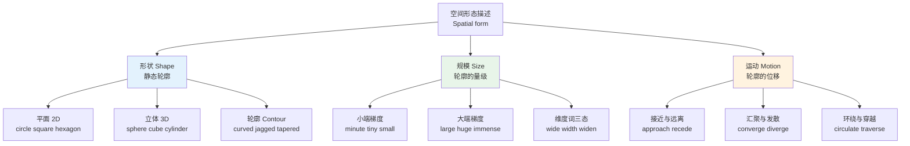
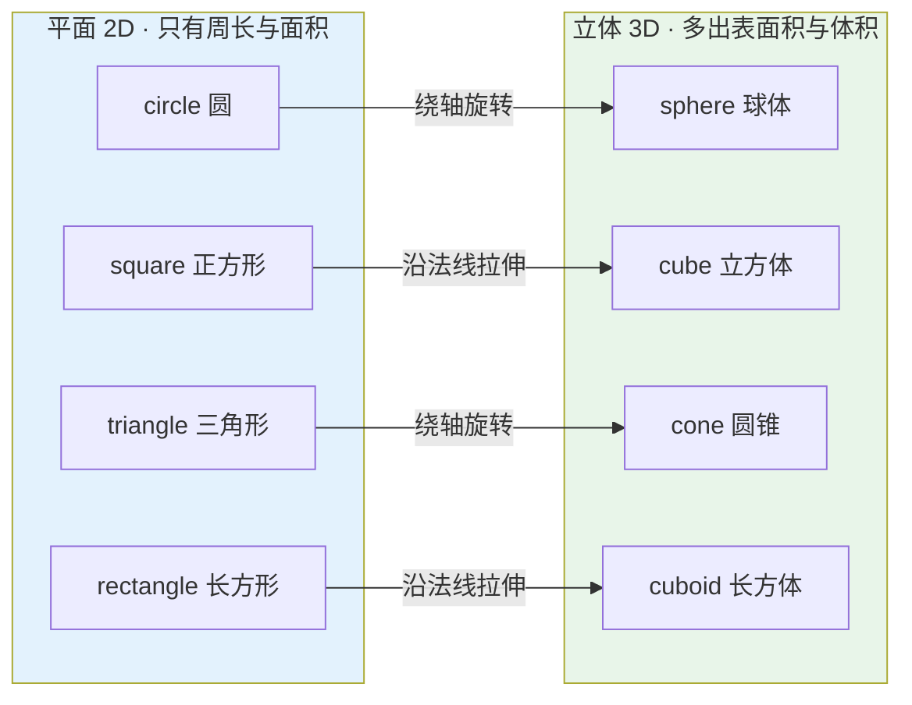
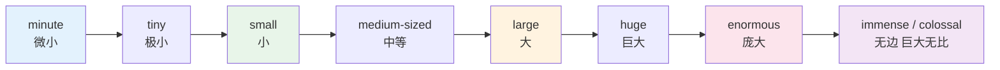
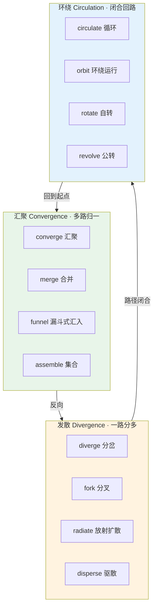
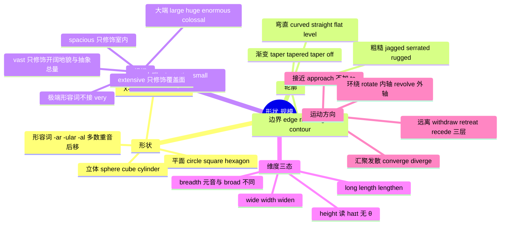

# 形状轮廓、大小规模与运动方向

> [!info] 本篇定位
>
> 05 章的收尾篇。前三篇处理的是「东西在哪里」——相对位置、绝对方位、地图坐标；这一篇处理「东西长什么样、有多大、往哪个方向动」。
>
> 三条线索：**形状**（circle / sphere / hexagon 这类几何名词与它们的形容词）、**规模**（tiny 到 immense 的强度梯度，以及为什么 `vast` 不能修饰 `room`）、**运动方向**（approach / withdraw / converge / diverge 这批带方向义的动词）。
>
> 读完能做到三件事：看到一个物体能用英语描述它的轮廓；在十几个「大」的形容词里选对搭配；读技术文档里 `the curve tapers off`、`requests converge on the primary node` 这类句子时知道方向是往哪走的。

---

## 1. 本篇导读：三条线为什么放在一篇里

形状、规模、运动方向表面上是三个话题，实际共用同一套认知底层——**它们都在描述物体在空间里的形态与形态变化**。形状是静态轮廓，规模是这个轮廓的量级，运动方向是轮廓在空间里的位移路径。

英语在这三条线上都有一个中文没有的特征：**形容词、名词、动词三态齐全且形式各不相同**。中文说「宽」，可以直接当形容词（很宽）、名词（宽度）、动词（加宽），字面不变；英语必须换形：`wide` / `width` / `widen`。这种三态转换在本篇会反复出现，是第 7 节的主线。

第二个特征是**梯度密集**。中文表达「大」主要靠副词加码：大、很大、非常大、巨大、极其巨大。英语则是换词：`big` → `large` → `huge` → `enormous` → `immense` → `colossal`。换词的代价是每个词都有自己的搭配限制，不能互换。第 5、6 节专门处理这个。

第三个特征是**运动动词自带方向**。中文的「走」不含方向，方向靠后面的补语给（走过去、走回来）。英语的 `approach`（靠近）、`recede`（后退变远）、`converge`（汇聚）本身就把方向编码进了词根，不需要额外的方向词。这一批词在技术文档、数据描述、路线说明里出现频率极高。

上图是本篇的目录结构。三条主线各自往下分三支，九个分支对应第 2 到第 10 节。这九支之间不是并列的孤立词表——`taper`（渐细）既是轮廓词也是运动词（`taper off` 指曲线渐渐趋平），`expand`（膨胀）既描述规模变化也描述向外的运动。跨支复用的词会在对应位置标注。

---

## 2. 平面形状：从 circle 到 polygon

### 2.1 基础平面图形

这一组是小学几何词汇，但成年学习者反而经常卡在 `rhombus` 和 `trapezoid` 这类中层词上——中文的「菱形」「梯形」太熟悉，导致完全没意识到英语对应词从没背过。

| 英文 | 英式音标 | 美式音标 | 词性 | 中文 | 搭配与说明 |
| --- | --- | --- | --- | --- | --- |
| **circle** | /ˈsɜːkl/ | /ˈsɜːrkl/ | n./v. | 圆；圆圈 | draw a circle；动词义「盘旋、圈出」 |
| **square** | /skweə/ | /skwer/ | n./adj. | 正方形；方的 | 同时是「广场」和「平方」，见 03 章计量篇 |
| **triangle** | /ˈtraɪæŋɡl/ | /ˈtraɪæŋɡl/ | n. | 三角形 | tri-「三」+ angle「角」 |
| **rectangle** | /ˈrektæŋɡl/ | /ˈrektæŋɡl/ | n. | 长方形 | rect「直」+ angle，直角四边形 |
| **oval** | /ˈəʊvl/ | /ˈoʊvl/ | n./adj. | 椭圆；卵形的 | 词根 ov「蛋」，日常口语用它而非 ellipse |
| **ellipse** | /ɪˈlɪps/ | /ɪˈlɪps/ | n. | 椭圆 | 数学术语，重音在后 |
| **rhombus** | /ˈrɒmbəs/ | /ˈrɑːmbəs/ | n. | 菱形 | 复数 rhombi 或 rhombuses |
| **diamond** | /ˈdaɪəmənd/ | /ˈdaɪəmənd/ | n. | 菱形；钻石 | 日常说菱形用 diamond，几何课用 rhombus |
| **parallelogram** | /ˌpærəˈleləɡræm/ | /ˌpærəˈleləɡræm/ | n. | 平行四边形 | parallel + -gram「所画之形」 |
| **trapezium** | /trəˈpiːziəm/ | /trəˈpiːziəm/ | n. | 梯形（英） | 英美所指相反，见下方警告框 |
| **trapezoid** | /ˈtræpəzɔɪd/ | /ˈtræpəzɔɪd/ | n. | 梯形（美） | 同上 |
| **pentagon** | /ˈpentəɡən/ | /ˈpentəɡɑːn/ | n. | 五边形 | 大写 the Pentagon 指美国国防部 |
| **hexagon** | /ˈheksəɡən/ | /ˈheksəɡɑːn/ | n. | 六边形 | hex-「六」，蜂巢结构常用 |
| **octagon** | /ˈɒktəɡən/ | /ˈɑːktəɡɑːn/ | n. | 八边形 | 美国停车标志就是 octagon |
| **polygon** | /ˈpɒliɡən/ | /ˈpɑːliɡɑːn/ | n. | 多边形 | 图形学高频词，poly-「多」 |
| **quadrilateral** | /ˌkwɒdrɪˈlætərəl/ | /ˌkwɑːdrɪˈlætərəl/ | n. | 四边形 | quadri「四」+ later「边」 |
| **crescent** | /ˈkresnt/ | /ˈkresnt/ | n. | 新月形 | crescent moon；也指弯月形街道 |
| **arc** | /ɑːk/ | /ɑːrk/ | n. | 弧 | 与 arch（拱）同源但不同词 |
| **semicircle** | /ˈsemisɜːkl/ | /ˈsemisɜːrkl/ | n. | 半圆 | semi-「半」 |
| **ring** | /rɪŋ/ | /rɪŋ/ | n. | 环形 | 中空的圆，区别于实心 disc |

> [!warning] trapezium 与 trapezoid 的英美倒置
>
> 这是英美术语里最容易出事的一对，因为两个词的所指在大西洋两岸**正好相反**。
>
> - 英式：**trapezium** = 有一对平行边的四边形（中文的「梯形」）；trapezoid = 没有平行边的四边形。
> - 美式：**trapezoid** = 有一对平行边的四边形（中文的「梯形」）；trapezium = 没有平行边的四边形。
>
> 处理办法：写技术文档时不要赌读者的地区，直接写 `a quadrilateral with one pair of parallel sides`，或者写 `trapezoid (US) / trapezium (UK)`。这类英美术语冲突的完整清单在 [[18.语域、英美差异与习语俚语/01.英式与美式词汇差异\|英式与美式词汇差异]]。

### 2.2 形状名词转形容词

描述一个物体的形状时，英语更常用形容词而不是 `in the shape of a circle` 这类短语。形容词形式必须单独记，因为构成方式不统一。

| 英文 | 英式音标 | 美式音标 | 词性 | 中文 | 搭配与说明 |
| --- | --- | --- | --- | --- | --- |
| **circular** | /ˈsɜːkjələ/ | /ˈsɜːrkjələr/ | adj. | 圆形的 | 也指「循环的」：circular reasoning 循环论证 |
| **triangular** | /traɪˈæŋɡjələ/ | /traɪˈæŋɡjələr/ | adj. | 三角形的 | 重音在第二音节，与名词不同 |
| **rectangular** | /rekˈtæŋɡjələ/ | /rekˈtæŋɡjələr/ | adj. | 长方形的 | UI 里 rectangular button |
| **elliptical** | /ɪˈlɪptɪkl/ | /ɪˈlɪptɪkl/ | adj. | 椭圆的 | 也指语言上的「省略的」 |
| **hexagonal** | /hekˈsæɡənl/ | /hekˈsæɡənl/ | adj. | 六边形的 | 重音移到第二音节 |
| **octagonal** | /ɒkˈtæɡənl/ | /ɑːkˈtæɡənl/ | adj. | 八边形的 | 同上重音移动 |
| **spiral** | /ˈspaɪrəl/ | /ˈspaɪrəl/ | n./adj./v. | 螺旋；螺旋的 | spiral staircase 旋转楼梯；spiral out of control |
| **helical** | /ˈhelɪkl/ | /ˈhelɪkl/ | adj. | 螺旋状的 | 技术词，double helix 双螺旋 |
| **zigzag** | /ˈzɪɡzæɡ/ | /ˈzɪɡzæɡ/ | n./adj./v. | 之字形 | 三种词性同形 |
| **linear** | /ˈlɪniə/ | /ˈlɪniər/ | adj. | 线性的 | 与 circular 常成对出现 |

> [!tip] 名词转形容词的三种路径
>
> 平面形状词变形容词有三条路，记住路径比逐个背省力。
>
> - **加 -ar / -ular**：circle → circular，triangle → triangular，rectangle → rectangular。规律是**重音落在 -ular 前面那个音节**上，因此多数词会发生重音后移：`triangle` /ˈtraɪæŋɡl/ 重音在首，`triangular` /traɪˈæŋɡjələr/ 移到了第二音节；`rectangle` /ˈrektæŋɡl/ → `rectangular` /rekˈtæŋɡjələr/ 同理。`circular` /ˈsɜːrkjələr/ 的重音本来就在那个位置上，所以听起来没动。
> - **加 -al**：ellipse → elliptical，hexagon → hexagonal，octagon → octagonal。规律相同，重音落在 `-al` 前面第二个音节：`hexagon` /ˈheksəɡən/ → `hexagonal` /hekˈsæɡənl/ 后移了一位，而 `ellipse` /ɪˈlɪps/ 的重音本来就在那儿，`elliptical` /ɪˈlɪptɪkl/ 保持不变。
> - **零变化**：oval、square、diamond 本身就能直接当形容词用，`an oval table`、`a square tile` 都成立。
>
> 拿不准形容词形式时，`X-shaped` 是万能退路：`a hexagon-shaped tile`、`a crescent-shaped bay`。这个结构在任何语域下都不算错，只是比正规形容词稍显啰嗦。

### 2.3 例句：描述界面元素

> [!example] 平面形状词在技术语境里的用法
>
> - The avatar is displayed in a **circular** frame with a two-pixel border.
>   - 头像显示在一个带两像素边框的圆形框里。
> - Each cell of the grid is a regular **hexagon**, which eliminates the diagonal-neighbour problem.
>   - 网格的每个单元是正六边形，这消除了对角相邻的问题。
> - The loading indicator draws a partial **arc** that sweeps clockwise.
>   - 加载指示器画出一段顺时针扫过的圆弧。
> - Collision detection treats every sprite as an axis-aligned **rectangle**.
>   - 碰撞检测把每个精灵都当作轴对齐的矩形处理。

---

## 3. 立体形状：从 sphere 到 tetrahedron

### 3.1 基础立体图形

三维形状词的一个共同麻烦是名词与形容词的读音差得远，尤其 `sphere` 和 `spherical` 的元音完全不同。

| 英文 | 英式音标 | 美式音标 | 词性 | 中文 | 搭配与说明 |
| --- | --- | --- | --- | --- | --- |
| **sphere** | /sfɪə/ | /sfɪr/ | n. | 球体 | 引申义「领域」：the political sphere |
| **cube** | /kjuːb/ | /kjuːb/ | n./v. | 立方体；三次方 | 动词义「求三次方」；cube root 立方根 |
| **cone** | /kəʊn/ | /koʊn/ | n. | 圆锥 | traffic cone 路锥；ice-cream cone 蛋筒 |
| **cylinder** | /ˈsɪlɪndə/ | /ˈsɪlɪndər/ | n. | 圆柱 | 引擎的「气缸」也是这个词 |
| **pyramid** | /ˈpɪrəmɪd/ | /ˈpɪrəmɪd/ | n. | 金字塔；棱锥 | 重音在首音节 |
| **prism** | /ˈprɪzəm/ | /ˈprɪzəm/ | n. | 棱柱；棱镜 | 两个义项同形 |
| **cuboid** | /ˈkjuːbɔɪd/ | /ˈkjuːbɔɪd/ | n. | 长方体 | 英式常用；美式常说 rectangular prism |
| **hemisphere** | /ˈhemɪsfɪə/ | /ˈhemɪsfɪr/ | n. | 半球 | 地理与解剖学共用 |
| **torus** | /ˈtɔːrəs/ | /ˈtɔːrəs/ | n. | 环面；圆环体 | 复数 tori；网络拓扑里高频 |
| **tetrahedron** | /ˌtetrəˈhiːdrən/ | /ˌtetrəˈhiːdrən/ | n. | 四面体 | tetra「四」+ hedron「面」 |
| **dome** | /dəʊm/ | /doʊm/ | n. | 穹顶；圆屋顶 | 建筑高频；the dome of the sky |
| **wedge** | /wedʒ/ | /wedʒ/ | n./v. | 楔形；楔入 | a wedge of cheese 一角奶酪 |
| **slab** | /slæb/ | /slæb/ | n. | 厚板；石板 | a slab of concrete |
| **disc** | /dɪsk/ | /dɪsk/ | n. | 圆盘 | 美式日常拼 disk；计算机里硬盘写 disk、光盘写 disc |
| **block** | /blɒk/ | /blɑːk/ | n. | 方块；块 | 最口语的立体形状词 |

### 3.2 立体形状的形容词形式

| 英文 | 英式音标 | 美式音标 | 词性 | 中文 | 搭配与说明 |
| --- | --- | --- | --- | --- | --- |
| **spherical** | /ˈsferɪkl/ | /ˈsfɪrɪkl/ | adj. | 球形的 | 元音与名词 sphere 不同，易读错 |
| **cubic** | /ˈkjuːbɪk/ | /ˈkjuːbɪk/ | adj. | 立方的 | cubic metre 立方米 |
| **conical** | /ˈkɒnɪkl/ | /ˈkɑːnɪkl/ | adj. | 圆锥形的 | 名词 cone 的元音在此变短 |
| **cylindrical** | /səˈlɪndrɪkl/ | /səˈlɪndrɪkl/ | adj. | 圆柱形的 | 首音节弱化为 /sə/ |
| **pyramidal** | /pɪˈræmɪdl/ | /pɪˈræmɪdl/ | adj. | 金字塔形的 | 重音从首音节移到第二音节 |
| **domed** | /dəʊmd/ | /doʊmd/ | adj. | 穹顶状的 | a domed roof |
| **wedge-shaped** | /ˈwedʒ ʃeɪpt/ | /ˈwedʒ ʃeɪpt/ | adj. | 楔形的 | 无独立形容词，用 -shaped |
| **three-dimensional** | /ˌθriː daɪˈmenʃənl/ | /ˌθriː dɪˈmenʃənl/ | adj. | 三维的 | 缩写 3D，读作 /ˌθriː ˈdiː/ |

上图给出的是记忆钩子而不是几何定义：平面图形绕轴旋转或沿法线拉伸就得到对应的立体图形，把八个词两两配对记，比割裂成两张表要省力。这个对应关系在描述三维建模操作时也用得上——`extrude`（挤出）和 `revolve`（旋转成体）正是图里两条边所标注的动作。

> [!warning] 中文「圆」对应两个英语词
>
> 中文一个「圆」字在英语里必须分二维和三维。
>
> - ❌ ~~The Earth is a circle.~~（地球是个圆——把三维物体说成了平面图形）
> - ✅ The Earth is a **sphere**.（地球是个球体）
> - ✅ The orbit is a **circle**.（轨道是个圆——轨道确实是平面曲线，用 circle 正确）
>
> 同理，「方」也分 `square`（正方形，平面）和 `cube`（立方体，三维）。说「一个方形的盒子」要用 `a cube` 或 `a cube-shaped box`，不能用 `a square box` 表示三维立方体——那读起来像盒子的某个面是正方形。

---

## 4. 轮廓与边缘：curved、jagged、tapered 一族

### 4.1 弯与直

轮廓词是形状描述里最实用的一批，因为现实中的物体极少是标准几何体，绝大多数要靠轮廓形容词来刻画。

| 英文 | 英式音标 | 美式音标 | 词性 | 中文 | 搭配与说明 |
| --- | --- | --- | --- | --- | --- |
| **curved** | /kɜːvd/ | /kɜːrvd/ | adj. | 弯曲的 | a curved screen 曲面屏 |
| **curve** | /kɜːv/ | /kɜːrv/ | n./v. | 曲线；弯曲 | learning curve 学习曲线 |
| **bend** | /bend/ | /bend/ | n./v. | 弯道；弯折 | 不规则变化 bend-bent-bent |
| **arch** | /ɑːtʃ/ | /ɑːrtʃ/ | n./v. | 拱；拱起 | 建筑用词；arch one's back 弓背 |
| **arched** | /ɑːtʃt/ | /ɑːrtʃt/ | adj. | 拱形的 | an arched doorway |
| **bow** | /bəʊ/ | /boʊ/ | n./v. | 弓形；弯曲 | 与「鞠躬」的 bow /baʊ/ 拼写同形读音不同 |
| **bulge** | /bʌldʒ/ | /bʌldʒ/ | n./v. | 凸起；鼓出 | bulge out 向外鼓 |
| **convex** | /ˈkɒnveks/ | /kɑːnˈveks/ | adj. | 凸的 | 英美重音位置不同 |
| **concave** | /ˈkɒnkeɪv/ | /kɑːnˈkeɪv/ | adj. | 凹的 | 记忆钩：cave「洞」是往里凹的 |
| **straight** | /streɪt/ | /streɪt/ | adj./adv. | 直的；直接地 | 与 strait「海峡」同音异形 |
| **flat** | /flæt/ | /flæt/ | adj. | 平的；扁的 | 强调无起伏，不强调水平 |
| **level** | /ˈlevl/ | /ˈlevl/ | adj./n./v. | 水平的；层级 | 强调水平，与重力方向垂直 |
| **wavy** | /ˈweɪvi/ | /ˈweɪvi/ | adj. | 波浪状的 | wavy hair 卷发（大波浪） |
| **undulating** | /ˈʌndjuleɪtɪŋ/ | /ˈʌndʒəleɪtɪŋ/ | adj. | 起伏的 | undulating hills 起伏的丘陵 |
| **crooked** | /ˈkrʊkɪd/ | /ˈkrʊkɪd/ | adj. | 歪的；不直的 | 两个音节，-ed 读 /ɪd/；引申义「不正当的」 |

> [!warning] flat 与 level 不是同义词
>
> 两个词中文都可以译成「平」，但描述的属性不同。
>
> - **flat** = 表面没有凹凸起伏。斜坡可以是 flat 的——`a flat but sloping roof`（平整但有坡度的屋顶）完全成立。
> - **level** = 与水平面平行。凹凸不平的地面如果整体不倾斜，也可以说 `roughly level`。
>
> 装修场景里两个词经常连用：`Make sure the surface is both flat and level.`（确保表面既平整又水平。）中文一句「找平」把两件事混成了一件，英语必须分开说。

### 4.2 光滑与粗糙

| 英文 | 英式音标 | 美式音标 | 词性 | 中文 | 搭配与说明 |
| --- | --- | --- | --- | --- | --- |
| **smooth** | /smuːð/ | /smuːð/ | adj./v. | 光滑的；抚平 | 词尾是浊音 /ð/ 不是 /θ/ |
| **rough** | /rʌf/ | /rʌf/ | adj. | 粗糙的 | -ough 读 /ʌf/，见拼读篇 |
| **jagged** | /ˈdʒæɡɪd/ | /ˈdʒæɡɪd/ | adj. | 锯齿状的；参差的 | 两个音节；jagged rocks 嶙峋的岩石 |
| **serrated** | /səˈreɪtɪd/ | /ˈsereɪtɪd/ | adj. | 有锯齿的 | 英美重音不同；serrated knife 锯齿刀 |
| **notched** | /nɒtʃt/ | /nɑːtʃt/ | adj. | 有缺口的 | notch 是单个凹口 |
| **ragged** | /ˈræɡɪd/ | /ˈræɡɪd/ | adj. | 参差不齐的；破烂的 | 两个音节；ragged edge 毛边 |
| **uneven** | /ʌnˈiːvn/ | /ʌnˈiːvn/ | adj. | 不平整的；不均匀的 | uneven distribution 分布不均 |
| **rugged** | /ˈrʌɡɪd/ | /ˈrʌɡɪd/ | adj. | 崎岖的；结实耐用的 | 两个音节；rugged laptop 三防笔记本 |
| **corrugated** | /ˈkɒrəɡeɪtɪd/ | /ˈkɔːrəɡeɪtɪd/ | adj. | 波纹的 | corrugated cardboard 瓦楞纸板 |
| **grooved** | /ɡruːvd/ | /ɡruːvd/ | adj. | 有凹槽的 | groove 是长条形的槽 |

> [!tip] -ged 结尾的三个词都读两个音节
>
> `jagged`、`ragged`、`rugged` 三个词的 `-ed` 都读成独立音节 /ɪd/，不是词尾辅音。同类的还有 `crooked` /ˈkrʊkɪd/、`wicked` /ˈwɪkɪd/、`naked` /ˈneɪkɪd/、`learned`（有学问的）/ˈlɜːnɪd/。
>
> 判断依据很简单：这些不是动词的过去分词，而是**独立的形容词**，`-ed` 属于词干的一部分。而真正由动词来的分词形容词，比如 `notched` /nɒtʃt/、`grooved` /ɡruːvd/，`-ed` 只读一个辅音。
>
> 读错的代价不小：把 `jagged` 读成一个音节的 /dʒæɡd/，母语者要迟疑一下才能反应过来。

### 4.3 渐变与端点

`taper` 这一组是本节最值得投入的部分，因为它同时覆盖形状描述和趋势描述两个高频场景。

| 英文 | 英式音标 | 美式音标 | 词性 | 中文 | 搭配与说明 |
| --- | --- | --- | --- | --- | --- |
| **taper** | /ˈteɪpə/ | /ˈteɪpər/ | v./n. | 逐渐变细 | taper off 逐渐减弱（趋势义） |
| **tapered** | /ˈteɪpəd/ | /ˈteɪpərd/ | adj. | 锥形的；渐细的 | tapered trousers 锥形裤 |
| **pointed** | /ˈpɔɪntɪd/ | /ˈpɔɪntɪd/ | adj. | 尖的 | 引申义「尖刻的」：a pointed remark |
| **blunt** | /blʌnt/ | /blʌnt/ | adj./v. | 钝的；直率的 | 引申义「说话直白」：to be blunt |
| **rounded** | /ˈraʊndɪd/ | /ˈraʊndɪd/ | adj. | 圆角的 | rounded corners 圆角 |
| **angular** | /ˈæŋɡjələ/ | /ˈæŋɡjələr/ | adj. | 棱角分明的 | 与 rounded 相对 |
| **sharp** | /ʃɑːp/ | /ʃɑːrp/ | adj. | 锋利的；急剧的 | a sharp bend 急弯；a sharp rise 陡增 |
| **tip** | /tɪp/ | /tɪp/ | n. | 尖端 | the tip of the iceberg 冰山一角 |
| **apex** | /ˈeɪpeks/ | /ˈeɪpeks/ | n. | 顶点 | 复数 apexes 或 apices |
| **vertex** | /ˈvɜːteks/ | /ˈvɜːrteks/ | n. | 顶点；顶角 | 复数 vertices；图形学高频 |
| **warped** | /wɔːpt/ | /wɔːrpt/ | adj. | 翘曲的；扭曲的 | 木板受潮变形用这个词 |
| **twisted** | /ˈtwɪstɪd/ | /ˈtwɪstɪd/ | adj. | 扭曲的 | 沿轴向的扭转 |
| **coiled** | /kɔɪld/ | /kɔɪld/ | adj. | 盘绕的 | a coiled cable 卷线 |
| **lopsided** | /ˌlɒpˈsaɪdɪd/ | /ˌlɑːpˈsaɪdɪd/ | adj. | 一边倒的；歪斜的 | 也指比分悬殊 |

### 4.4 边界与外形

| 英文 | 英式音标 | 美式音标 | 词性 | 中文 | 搭配与说明 |
| --- | --- | --- | --- | --- | --- |
| **edge** | /edʒ/ | /edʒ/ | n. | 边缘；棱 | 最通用的边缘词 |
| **rim** | /rɪm/ | /rɪm/ | n. | 圆形边缘 | 杯口、车轮、镜框的边 |
| **brim** | /brɪm/ | /brɪm/ | n. | 容器上沿；帽檐 | filled to the brim 满到边 |
| **border** | /ˈbɔːdə/ | /ˈbɔːrdər/ | n./v. | 边界；镶边 | CSS 属性名就是这个词 |
| **margin** | /ˈmɑːdʒɪn/ | /ˈmɑːrdʒɪn/ | n. | 页边距；余地 | 与 padding 的差别见 CSS 盒模型 |
| **outline** | /ˈaʊtlaɪn/ | /ˈaʊtlaɪn/ | n./v. | 轮廓；概述 | 双义高频，写作提纲也是 outline |
| **silhouette** | /ˌsɪluˈet/ | /ˌsɪluˈet/ | n. | 剪影 | 法语借词，词尾 -ette 读 /et/ |
| **contour** | /ˈkɒntʊə/ | /ˈkɑːntʊr/ | n. | 等高线；外形轮廓 | 地图术语见本章第 3 篇 |
| **profile** | /ˈprəʊfaɪl/ | /ˈproʊfaɪl/ | n. | 侧面轮廓；简介 | 侧脸义与个人资料义同源 |
| **perimeter** | /pəˈrɪmɪtə/ | /pəˈrɪmɪtər/ | n. | 周长；外围 | peri「周围」+ meter「测量」 |
| **symmetrical** | /sɪˈmetrɪkl/ | /sɪˈmetrɪkl/ | adj. | 对称的 | 名词 symmetry /ˈsɪmətri/ 重音在首 |
| **asymmetrical** | /ˌeɪsɪˈmetrɪkl/ | /ˌeɪsɪˈmetrɪkl/ | adj. | 不对称的 | 也作 asymmetric |

> [!example] 轮廓词的连用示范
>
> - The blade has a **serrated** edge that stays **sharp** far longer than a **smooth** one.
>   - 这刀有锯齿刃口，比平刃保持锋利的时间长得多。
> - The coastline is **jagged** in the north and gently **undulating** further south.
>   - 这段海岸线北段嶙峋破碎，往南则平缓起伏。
> - The tower **tapers** towards the top, so each floor is slightly smaller than the one below.
>   - 塔身向上渐收，因此每层都比下面一层略小。
> - Traffic peaked at nine and then **tapered off** through the afternoon.
>   - 流量在九点见顶，之后整个下午逐渐回落。
> - Give the card **rounded** corners; the **angular** version looks dated.
>   - 卡片用圆角，直角那版看起来过时了。

---

## 5. 大小梯度：从 minute 到 colossal

### 5.1 小端梯度

英语描述「小」的词各自带着不同的附加信息，不是单纯的程度差别。

| 英文 | 英式音标 | 美式音标 | 词性 | 中文 | 搭配与说明 |
| --- | --- | --- | --- | --- | --- |
| **minute** | /maɪˈnjuːt/ | /maɪˈnuːt/ | adj. | 微小的；细致的 | 形容词重音在后，与「分钟」/ˈmɪnɪt/ 完全不同 |
| **minuscule** | /ˈmɪnəskjuːl/ | /ˈmɪnəskjuːl/ | adj. | 极小的 | 常被误拼成 miniscule |
| **microscopic** | /ˌmaɪkrəˈskɒpɪk/ | /ˌmaɪkrəˈskɑːpɪk/ | adj. | 显微镜级的 | 强调肉眼不可见 |
| **tiny** | /ˈtaɪni/ | /ˈtaɪni/ | adj. | 极小的 | 口语最常用，中性 |
| **little** | /ˈlɪtl/ | /ˈlɪtl/ | adj. | 小的 | 带感情色彩，常含喜爱或轻视 |
| **small** | /smɔːl/ | /smɔːl/ | adj. | 小的 | 纯客观，无感情色彩 |
| **petite** | /pəˈtiːt/ | /pəˈtiːt/ | adj. | 娇小的 | 只用于女性身材，法语借词 |
| **compact** | /kəmˈpækt/ | /kəmˈpækt/ | adj. | 紧凑的 | 褒义：小但功能齐全 |
| **modest** | /ˈmɒdɪst/ | /ˈmɑːdɪst/ | adj. | 不大的；适度的 | 委婉说法，a modest increase |
| **slight** | /slaɪt/ | /slaɪt/ | adj. | 轻微的 | 多修饰抽象量：a slight delay |
| **cramped** | /kræmpt/ | /kræmpt/ | adj. | 狭窄局促的 | 贬义，专说空间不够用 |
| **confined** | /kənˈfaɪnd/ | /kənˈfaɪnd/ | adj. | 受限的；封闭的 | a confined space 密闭空间（安全术语） |
| **poky** | /ˈpəʊki/ | /ˈpoʊki/ | adj. | 又小又挤的 | 英式口语贬义，形容房间 |
| **narrow** | /ˈnærəʊ/ | /ˈnæroʊ/ | adj. | 窄的 | 只说宽度维度，不说整体大小 |

> [!warning] small 与 little 的选择不是随意的
>
> 两个词的差别不在程度，在**感情色彩**与**句法位置**。
>
> - **small** 是中性的尺寸描述，可以做表语：`The room is small.` 成立。
> - **little** 带主观态度，通常只做定语，做表语时听起来别扭：~~The room is little.~~ 不自然。
> - `a little house` 常带亲昵感（小房子，可爱的那种），`a small house` 只是陈述面积。
> - 骂人的时候用 little：`that little troublemaker`（那个小捣蛋鬼），换成 small 就没有那层意思了。
>
> 还有一层：`a little water` 里的 little 是量词，跟尺寸无关，那是不可数名词的量的表达，属于 [[02.功能词与封闭词类速查/01.代词与限定词的词形矩阵\|代词与限定词的词形矩阵]] 的范围。

### 5.2 大端梯度

| 英文 | 英式音标 | 美式音标 | 词性 | 中文 | 搭配与说明 |
| --- | --- | --- | --- | --- | --- |
| **big** | /bɪɡ/ | /bɪɡ/ | adj. | 大的 | 口语；也说重要性：a big decision |
| **large** | /lɑːdʒ/ | /lɑːrdʒ/ | adj. | 大的 | 偏书面，只说尺寸数量，不说重要性 |
| **great** | /ɡreɪt/ | /ɡreɪt/ | adj. | 巨大的；极好的 | 现代英语「大」的义项多用于抽象名词 |
| **sizeable** | /ˈsaɪzəbl/ | /ˈsaɪzəbl/ | adj. | 相当大的 | 也拼 sizable；a sizeable portion |
| **substantial** | /səbˈstænʃl/ | /səbˈstænʃl/ | adj. | 可观的 | 多修饰数量金额：a substantial sum |
| **considerable** | /kənˈsɪdərəbl/ | /kənˈsɪdərəbl/ | adj. | 相当大的 | 学术写作高频，见 18 章 |
| **huge** | /hjuːdʒ/ | /hjuːdʒ/ | adj. | 巨大的 | 首音有 /h/，不能读成 /juːdʒ/ |
| **enormous** | /ɪˈnɔːməs/ | /ɪˈnɔːrməs/ | adj. | 庞大的 | e-「出」+ norm「常规」，超出常规 |
| **immense** | /ɪˈmens/ | /ɪˈmens/ | adj. | 无边的 | im-「不」+ mens「测量」，大到无法丈量 |
| **vast** | /vɑːst/ | /væst/ | adj. | 辽阔的 | 英美元音差别明显；搭配受限，见 6.1 |
| **massive** | /ˈmæsɪv/ | /ˈmæsɪv/ | adj. | 厚重巨大的 | 强调质量与体积，不只是面积 |
| **colossal** | /kəˈlɒsl/ | /kəˈlɑːsl/ | adj. | 巨大无比的 | 源自 colossus「巨像」，最有名的那尊是罗德岛巨像 |
| **gigantic** | /dʒaɪˈɡæntɪk/ | /dʒaɪˈɡæntɪk/ | adj. | 巨人般的 | 词根 giant |
| **mammoth** | /ˈmæməθ/ | /ˈmæməθ/ | adj./n. | 庞大的；猛犸象 | a mammoth task 艰巨任务 |
| **monumental** | /ˌmɒnjuˈmentl/ | /ˌmɑːnjəˈmentl/ | adj. | 纪念碑般宏大的 | 多修饰成就或失误 |
| **tremendous** | /trəˈmendəs/ | /trəˈmendəs/ | adj. | 极大的 | 词源是「令人战栗的」 |
| **hefty** | /ˈhefti/ | /ˈhefti/ | adj. | 沉甸甸的；数额大的 | a hefty fine 一笔重罚 |
| **bulky** | /ˈbʌlki/ | /ˈbʌlki/ | adj. | 笨重占地的 | 贬义，强调不好搬运 |

上图是一条纯强度轴，但它只给出了**默认排序**，不代表可以在同一句里自由替换。从 `huge` 往右的四个词都属于「极端级」形容词，它们已经含有「极」的意思，因此不能再被 `very` 修饰——这是下一小节要处理的语法性搭配问题。

### 5.3 极端形容词不接 very

> [!warning] very huge 是错的
>
> `huge`、`enormous`、`immense`、`colossal`、`gigantic` 都是 **extreme adjectives**（极端形容词），本身已经等于 very + large，再加 very 就是叠床架屋。
>
> - ❌ ~~a very huge building~~
> - ✅ an **absolutely** huge building
> - ✅ a **truly** enormous cost
> - ✅ a **simply** colossal mistake
>
> 能修饰极端形容词的副词是另一批：`absolutely`、`utterly`、`completely`、`totally`、`simply`、`quite`（英式的 quite 在这里表示「完全」而非「相当」）。
>
> 反过来，普通形容词 `large`、`small`、`big` 可以接 very，但不能接 absolutely：~~absolutely large~~ 也不成立。两批副词与两批形容词是配套的。

---

## 6. vast、spacious、extensive：搭配限制

### 6.1 四个「大」的适用对象各不相同

这四个词在词典里的中文释义高度重叠（辽阔的、宽敞的、广泛的、广阔的），但搭配对象几乎不交叉。选错的后果不是语法错误，而是母语者一眼看出不是本族语者写的。

| 英文 | 英式音标 | 美式音标 | 词性 | 中文 | 搭配与说明 |
| --- | --- | --- | --- | --- | --- |
| **vast** | /vɑːst/ | /væst/ | adj. | 广袤的 | 修饰开阔地貌与抽象总量，不修饰室内 |
| **spacious** | /ˈspeɪʃəs/ | /ˈspeɪʃəs/ | adj. | 宽敞的 | 只修饰室内与容器内部空间 |
| **roomy** | /ˈruːmi/ | /ˈruːmi/ | adj. | 宽绰的 | spacious 的口语版，也修饰衣物鞋子 |
| **capacious** | /kəˈpeɪʃəs/ | /kəˈpeɪʃəs/ | adj. | 容量大的 | 正式词，多修饰包、行李箱、口袋 |
| **extensive** | /ɪkˈstensɪv/ | /ɪkˈstensɪv/ | adj. | 广泛的；大范围的 | 修饰覆盖面：research、damage、network |
| **expansive** | /ɪkˈspænsɪv/ | /ɪkˈspænsɪv/ | adj. | 开阔的；健谈的 | 修饰视野与姿态，也形容人「侃侃而谈」 |
| **broad** | /brɔːd/ | /brɔːd/ | adj. | 宽的；宽泛的 | 抽象义高频：a broad definition |
| **wide** | /waɪd/ | /waɪd/ | adj. | 宽的 | 强调两侧距离，具体尺寸用 wide |
| **ample** | /ˈæmpl/ | /ˈæmpl/ | adj. | 充足的 | 强调「够用还有余」：ample storage |
| **generous** | /ˈdʒenərəs/ | /ˈdʒenərəs/ | adj. | 宽裕的 | 修饰尺寸时指「给得比预期多」 |

> [!warning] 搭配对错清单
>
> - ❌ ~~a vast room~~ → ✅ a **spacious** room（房间是室内，用 spacious）
> - ❌ ~~a spacious desert~~ → ✅ a **vast** desert（沙漠是开阔地貌，用 vast）
> - ❌ ~~vast damage~~ → ✅ **extensive** damage（损坏讲的是覆盖范围）
> - ❌ ~~an extensive room~~ → ✅ a **large** room
> - ❌ ~~a spacious bag~~ → ✅ a **capacious** bag / a **roomy** bag
> - ✅ a **vast** majority / a **vast** amount of data（vast 可以修饰抽象总量，这是它唯一的非地貌用法）
> - ✅ **extensive** research / an **extensive** network / **extensive** experience（覆盖面广）
> - ✅ an **expansive** view of the valley（视野开阔）

### 6.2 vast 的两种合法用法

`vast` 让中文母语者反复出错，是因为它的适用面比看上去窄。它只在两类语境里自然。

第一类是**开阔的地貌与空间**：`a vast desert`、`the vast ocean`、`vast plains`、`the vast expanse of the sky`。共同特征是没有边界感、一眼望不到头。房间、车厢、抽屉这类有明确墙壁的空间不属于此类。

第二类是**抽象的巨大数量**：`a vast amount of data`、`the vast majority of users`、`vast sums of money`、`a vast improvement`。这一类里 `vast` 起的是「压倒性地多」的作用。

`the vast majority` 是使用频率最高的固定搭配，在技术文档和数据报告里几乎是套语，值得直接背下来。

### 6.3 extensive 与 intensive 的对立

这一对词的差别是中文母语者的另一个盲区，因为中文的「广泛」和「深入」不像英语这样共用一个词根。

| 英文 | 英式音标 | 美式音标 | 词性 | 中文 | 搭配与说明 |
| --- | --- | --- | --- | --- | --- |
| **extensive** | /ɪkˈstensɪv/ | /ɪkˈstensɪv/ | adj. | 广度上的 | ex-「向外」，铺得广 |
| **intensive** | /ɪnˈtensɪv/ | /ɪnˈtensɪv/ | adj. | 强度上的 | in-「向内」，扎得深 |
| **comprehensive** | /ˌkɒmprɪˈhensɪv/ | /ˌkɑːmprɪˈhensɪv/ | adj. | 全面的 | 强调无遗漏，不强调面积 |
| **thorough** | /ˈθʌrə/ | /ˈθɜːroʊ/ | adj. | 彻底的 | 英美读音差别大，注意美音 |
| **exhaustive** | /ɪɡˈzɔːstɪv/ | /ɪɡˈzɔːstɪv/ | adj. | 穷尽的 | 比 comprehensive 更绝对 |

> [!example] extensive 与 intensive 的对照
>
> - We ran **extensive** tests across twelve browsers.
>   - 我们在十二种浏览器上做了大范围测试。（横向铺开）
> - We ran **intensive** tests on the payment flow alone.
>   - 我们只对支付流程做了高强度测试。（纵向深挖）
> - The report is **comprehensive** but not **exhaustive**.
>   - 这份报告很全面，但不算穷尽。

---

## 7. 尺寸维度：名词、形容词、动词的三态

### 7.1 六组基础维度词

英语的维度词在三种词性之间形态各异，这张表要横着记而不是竖着记。

| 形容词 | 音标（英/美） | 名词 | 音标（英/美） | 动词 | 中文 |
| --- | --- | --- | --- | --- | --- |
| **long** | /lɒŋ/ · /lɔːŋ/ | **length** | /leŋθ/ · /leŋθ/ | **lengthen** | 长 |
| **wide** | /waɪd/ · /waɪd/ | **width** | /wɪdθ/ · /wɪdθ/ | **widen** | 宽 |
| **broad** | /brɔːd/ · /brɔːd/ | **breadth** | /bredθ/ · /bredθ/ | **broaden** | 宽（偏抽象） |
| **high** | /haɪ/ · /haɪ/ | **height** | /haɪt/ · /haɪt/ | **heighten** | 高 |
| **deep** | /diːp/ · /diːp/ | **depth** | /depθ/ · /depθ/ | **deepen** | 深 |
| **thick** | /θɪk/ · /θɪk/ | **thickness** | /ˈθɪknəs/ · /ˈθɪknəs/ | **thicken** | 厚 |

> [!warning] 名词形式的三个坑
>
> **坑一：length 的拼写。** 是 `length` 不是 ~~lenght~~，也不是 ~~lengh~~。词根 long 里的 o 变成了 e，g 保留但不单独发音，/ŋθ/ 是一个整体。
>
> **坑二：height 的读音。** 是 /haɪt/，词尾只有 /t/ 没有 /θ/。其余五个维度名词里有四个以 /θ/ 结尾（length、width、breadth、depth），唯独 height 不是，因此极易被类推读成 ~~/haɪθ/~~。
>
> **坑三：breadth 的元音。** 形容词 broad 是 /brɔːd/，名词 breadth 却是 /bredθ/，元音完全变了。同一组还有 broad → broaden /ˈbrɔːdn/，动词又回到 /ɔː/。三个形式两种元音。

### 7.2 尺寸表达的两种句式

描述具体尺寸有两个固定句式，中文母语者常混用。

**句式一：数量 + 单位 + 形容词**（最常用）

> [!example] 数量在前的说法
>
> - The table is two metres **long** and one metre **wide**.
>   - 这张桌子长两米，宽一米。
> - The wall is three metres **high**.
>   - 这堵墙三米高。
> - The lake is forty metres **deep** at its centre.
>   - 湖心处水深四十米。

**句式二：名词 + of + 数量**（偏正式，多用于书面规格）

> [!example] 名词结构的说法
>
> - The beam has a **length of** 2.4 m and a **thickness of** 18 mm.
>   - 这根梁长 2.4 米，厚 18 毫米。
> - Enter a **width of** at least 320 pixels.
>   - 请输入至少 320 像素的宽度。

两种句式不能混杂：~~The table is two metres length.~~ 是错的，要么写 `two metres long`，要么写 `a length of two metres`。

### 7.3 圆形与体积的专用维度词

| 英文 | 英式音标 | 美式音标 | 词性 | 中文 | 搭配与说明 |
| --- | --- | --- | --- | --- | --- |
| **diameter** | /daɪˈæmɪtə/ | /daɪˈæmɪtər/ | n. | 直径 | dia「贯穿」+ meter「测量」 |
| **radius** | /ˈreɪdiəs/ | /ˈreɪdiəs/ | n. | 半径 | 复数 radii /ˈreɪdiaɪ/ |
| **circumference** | /səˈkʌmfərəns/ | /sərˈkʌmfərəns/ | n. | 圆周长 | circum「环绕」+ fer「带」 |
| **girth** | /ɡɜːθ/ | /ɡɜːrθ/ | n. | 周长（树干、腰身） | 非几何语境用 girth 而非 circumference |
| **area** | /ˈeəriə/ | /ˈeriə/ | n. | 面积；区域 | 三个音节 /ˈeə-ri-ə/ |
| **volume** | /ˈvɒljuːm/ | /ˈvɑːljuːm/ | n. | 体积；音量；卷 | 三个常用义项，靠语境区分 |
| **capacity** | /kəˈpæsəti/ | /kəˈpæsəti/ | n. | 容量 | 强调「能装多少」，不是几何体积 |
| **span** | /spæn/ | /spæn/ | n./v. | 跨度；跨越 | wingspan 翼展；span three decades |
| **scale** | /skeɪl/ | /skeɪl/ | n. | 规模；比例尺 | on a large scale 大规模地 |
| **magnitude** | /ˈmæɡnɪtjuːd/ | /ˈmæɡnɪtuːd/ | n. | 量级 | an order of magnitude 一个数量级 |
| **proportion** | /prəˈpɔːʃn/ | /prəˈpɔːrʃn/ | n. | 比例；相对大小 | out of proportion 不成比例 |
| **dimension** | /daɪˈmenʃn/ | /dɪˈmenʃn/ | n. | 尺寸；维度 | 复数 dimensions 指长宽高整套数据 |
| **extent** | /ɪkˈstent/ | /ɪkˈstent/ | n. | 范围；程度 | to what extent 到何种程度 |
| **bulk** | /bʌlk/ | /bʌlk/ | n. | 体积；大部分 | the bulk of the work 大部分工作 |

### 7.4 规模变化动词

| 英文 | 英式音标 | 美式音标 | 词性 | 中文 | 搭配与说明 |
| --- | --- | --- | --- | --- | --- |
| **expand** | /ɪkˈspænd/ | /ɪkˈspænd/ | v. | 扩张 | 及物不及物皆可 |
| **enlarge** | /ɪnˈlɑːdʒ/ | /ɪnˈlɑːrdʒ/ | v. | 放大 | 及物为主，enlarge a photo |
| **magnify** | /ˈmæɡnɪfaɪ/ | /ˈmæɡnɪfaɪ/ | v. | 放大（视觉） | 光学放大用它，不用 enlarge |
| **swell** | /swel/ | /swel/ | v. | 膨胀；肿胀 | 不规则：swell-swelled-swollen |
| **inflate** | /ɪnˈfleɪt/ | /ɪnˈfleɪt/ | v. | 充气；夸大 | inflate a tyre；inflated figures |
| **contract** | /kənˈtrækt/ | /kənˈtrækt/ | v. | 收缩 | 动词重音在后，名词 /ˈkɒntrækt/ 在前 |
| **shrink** | /ʃrɪŋk/ | /ʃrɪŋk/ | v. | 缩小；缩水 | 不规则：shrink-shrank-shrunk |
| **compress** | /kəmˈpres/ | /kəmˈpres/ | v. | 压缩 | 数据压缩就是这个词 |
| **dwindle** | /ˈdwɪndl/ | /ˈdwɪndl/ | v. | 逐渐减少 | 只作不及物，dwindle to nothing |
| **stretch** | /stretʃ/ | /stretʃ/ | v./n. | 拉伸；一段 | a stretch of road 一段路 |
| **scale up** | /skeɪl ʌp/ | /skeɪl ʌp/ | v. | 扩容 | 技术语境高频，反义 scale down |

> [!tip] shrink 与 contract 的分工
>
> 两个词都是「变小」，但物理机制不同。
>
> - **shrink** 指整体尺寸减小，常伴随材料变化：毛衣洗后缩水 `the sweater shrank`、市场萎缩 `the market is shrinking`。
> - **contract** 指受力或温度导致的收缩，通常可逆：金属遇冷收缩 `metal contracts when cooled`、肌肉收缩 `the muscle contracts`。
>
> 一句话记：可逆的、有对应 expand 的用 contract；不可逆的、带损失感的用 shrink。

---

## 8. 运动方向（一）：接近与远离

### 8.1 靠近方向

| 英文 | 英式音标 | 美式音标 | 词性 | 中文 | 搭配与说明 |
| --- | --- | --- | --- | --- | --- |
| **approach** | /əˈprəʊtʃ/ | /əˈproʊtʃ/ | v./n. | 接近；方法 | **及物动词，不加 to** |
| **near** | /nɪə/ | /nɪr/ | v./adj./prep. | 靠近 | 动词用法偏书面：as winter neared |
| **advance** | /ədˈvɑːns/ | /ədˈvæns/ | v./n. | 前进；进展 | advance on the enemy 向敌方推进 |
| **proceed** | /prəˈsiːd/ | /prəˈsiːd/ | v. | 继续前行 | proceed to the gate 前往登机口 |
| **head** | /hed/ | /hed/ | v. | 朝某方向去 | head north / head for the exit |
| **converge** | /kənˈvɜːdʒ/ | /kənˈvɜːrdʒ/ | v. | 汇聚 | converge on a point 向一点汇聚 |
| **close in** | /kləʊz ɪn/ | /kloʊz ɪn/ | v. | 逼近 | close in on the target |
| **encroach** | /ɪnˈkrəʊtʃ/ | /ɪnˈkroʊtʃ/ | v. | 侵占；蚕食 | encroach on someone's territory |
| **approximate** | /əˈprɒksɪmeɪt/ | /əˈprɑːksɪmeɪt/ | v. | 逼近；近似 | 形容词读 /əˈprɒksɪmət/，词尾不同 |

> [!warning] approach 后面不加 to
>
> `approach` 表示「接近」时是**及物动词**，直接跟宾语。中文的「接近于」诱导出多余的 to，这是本节最高频的错误。
>
> - ❌ ~~The train is approaching to the station.~~
> - ✅ The train is **approaching the station**.
> - ❌ ~~We approached to the problem from a different angle.~~
> - ✅ We **approached the problem** from a different angle.
>
> 只有名词 `approach` 后面才可能出现介词，而且介词是 **to** 表「处理某事的方法」：`a new approach to testing`（一种新的测试方法）。名词后接 to，动词后不接 to，这个反差要记牢。

### 8.2 远离方向

| 英文 | 英式音标 | 美式音标 | 词性 | 中文 | 搭配与说明 |
| --- | --- | --- | --- | --- | --- |
| **withdraw** | /wɪðˈdrɔː/ | /wɪðˈdrɔː/ | v. | 撤回；撤离 | 不规则：withdraw-withdrew-withdrawn |
| **retreat** | /rɪˈtriːt/ | /rɪˈtriːt/ | v./n. | 撤退；静修 | 军事义与「隐居处」义同源 |
| **recede** | /rɪˈsiːd/ | /rɪˈsiːd/ | v. | 后退变远；消退 | 潮水、发际线、记忆都可以 recede |
| **retract** | /rɪˈtrækt/ | /rɪˈtrækt/ | v. | 缩回；收回 | 起落架收起、收回声明都用它 |
| **depart** | /dɪˈpɑːt/ | /dɪˈpɑːrt/ | v. | 出发；离开 | depart **from**，正式词 |
| **diverge** | /daɪˈvɜːdʒ/ | /daɪˈvɜːrdʒ/ | v. | 分岔；背离 | 与 converge 严格反义 |
| **veer** | /vɪə/ | /vɪr/ | v. | 突然转向 | veer off course 偏离航线 |
| **swerve** | /swɜːv/ | /swɜːrv/ | v. | 急转躲避 | 比 veer 更急、更紧急 |
| **deviate** | /ˈdiːvieɪt/ | /ˈdiːvieɪt/ | v. | 偏离 | deviate **from** the plan |
| **stray** | /streɪ/ | /streɪ/ | v./adj. | 走失；离群的 | a stray dog 流浪狗 |
| **disperse** | /dɪˈspɜːs/ | /dɪˈspɜːrs/ | v. | 驱散；散开 | 人群、烟雾 disperse |
| **scatter** | /ˈskætə/ | /ˈskætər/ | v. | 撒开；四散 | 比 disperse 更随机无序 |
| **drift** | /drɪft/ | /drɪft/ | v./n. | 漂移 | 无动力的被动移动；配置漂移也用它 |

> [!warning] withdraw、retreat、recede 的三个层次
>
> 三个词都译作「退」，但主语类型与语义完全不同。
>
> - **withdraw** 是**主动的、有意的撤回**，主语通常是人或机构：`withdraw the troops`（撤军）、`withdraw an application`（撤回申请）、`withdraw money`（取款）。
> - **retreat** 是**在压力下的后撤**，隐含被迫：`the army retreated`（军队撤退）、`retreat from a position`（放弃立场）。
> - **recede** 是**无主观意志的自然变远或消退**，主语多为无生命体：`the floodwaters receded`（洪水退去）、`his hairline is receding`（发际线后移）、`the pain receded`（疼痛消退）。
>
> 判据是问一句：谁在决定退？人决定用 withdraw，敌人逼迫用 retreat，没人决定用 recede。

### 8.3 例句：方向动词在技术文本里

> [!example] 接近与远离的实际用法
>
> - As the deadline **approached**, the team froze all non-critical changes.
>   - 随着截止日期临近，团队冻结了所有非关键改动。
> - The client should **retract** the request if no response arrives within thirty seconds.
>   - 若三十秒内无响应，客户端应撤回该请求。
> - Cache hit rates **receded** steadily after the schema change.
>   - 改了表结构之后，缓存命中率持续下滑。
> - Our implementation **deviates from** the spec in one place, and it is documented below.
>   - 我们的实现有一处偏离规范，下面有说明。
> - Traffic **converges on** the primary node, which then fans it out to the replicas.
>   - 流量汇聚到主节点，再由主节点分发给各副本。

---

## 9. 运动方向（二）：环绕、汇聚与发散

### 9.1 环绕类动词

`circulate` 这一族共享词根 `circ`「环」，是词根记忆法的一个标准案例。

| 英文 | 英式音标 | 美式音标 | 词性 | 中文 | 搭配与说明 |
| --- | --- | --- | --- | --- | --- |
| **circulate** | /ˈsɜːkjəleɪt/ | /ˈsɜːrkjəleɪt/ | v. | 循环；传阅 | 血液循环、文件传阅共用此词 |
| **circulation** | /ˌsɜːkjəˈleɪʃn/ | /ˌsɜːrkjəˈleɪʃn/ | n. | 循环；发行量 | 报刊发行量也叫 circulation |
| **encircle** | /ɪnˈsɜːkl/ | /ɪnˈsɜːrkl/ | v. | 包围 | 比 surround 更强调闭合 |
| **surround** | /səˈraʊnd/ | /səˈraʊnd/ | v. | 围绕 | 最中性的包围词 |
| **orbit** | /ˈɔːbɪt/ | /ˈɔːrbɪt/ | v./n. | 环绕运行；轨道 | 及物：orbit the Earth，不加 around |
| **revolve** | /rɪˈvɒlv/ | /rɪˈvɑːlv/ | v. | 绕外部轴旋转 | revolve **around** the sun |
| **rotate** | /rəʊˈteɪt/ | /ˈroʊteɪt/ | v. | 绕自身轴旋转 | 英美重音位置不同 |
| **spin** | /spɪn/ | /spɪn/ | v. | 快速自转 | 不规则：spin-spun-spun |
| **swirl** | /swɜːl/ | /swɜːrl/ | v./n. | 打旋 | 液体、烟雾的旋涡运动 |
| **loop** | /luːp/ | /luːp/ | v./n. | 绕圈；循环 | 编程的循环也是 loop |
| **skirt** | /skɜːt/ | /skɜːrt/ | v. | 沿边缘绕行 | skirt the issue 回避问题 |
| **bypass** | /ˈbaɪpɑːs/ | /ˈbaɪpæs/ | v./n. | 绕过；旁路 | 绕城公路与心脏搭桥共用此词 |
| **detour** | /ˈdiːtʊə/ | /ˈdiːtʊr/ | n./v. | 绕道 | make a detour 绕行 |

> [!warning] revolve 与 rotate 的物理区别
>
> 两个词中文都是「转」，英语按**转轴在哪里**区分。
>
> - **rotate** = 绕**自身内部**的轴转。地球自转 `the Earth rotates on its axis`，一天一圈。
> - **revolve** = 绕**外部**的轴或中心转。地球公转 `the Earth revolves around the sun`，一年一圈。
>
> 引申用法沿用了同一逻辑：`Her whole life revolves around her work.`（她整个生活都围着工作转。）这里工作是外部中心，所以用 revolve。而 `rotate the image 90 degrees`（把图片旋转 90 度）是图片绕自身中心转，用 rotate。
>
> 图形界面里的「旋转」按钮一律是 rotate；轮岗、轮值也用 rotate（`rotate shifts` 轮班），因为是围绕一个固定序列内部循环。

### 9.2 汇聚与发散

| 英文 | 英式音标 | 美式音标 | 词性 | 中文 | 搭配与说明 |
| --- | --- | --- | --- | --- | --- |
| **converge** | /kənˈvɜːdʒ/ | /kənˈvɜːrdʒ/ | v. | 汇聚 | con-「共同」+ verge「转向」 |
| **convergence** | /kənˈvɜːdʒəns/ | /kənˈvɜːrdʒəns/ | n. | 收敛；汇合 | 算法收敛就是这个词 |
| **diverge** | /daɪˈvɜːdʒ/ | /daɪˈvɜːrdʒ/ | v. | 发散；分岔 | di-「分开」+ verge |
| **divergence** | /daɪˈvɜːdʒəns/ | /daɪˈvɜːrdʒəns/ | n. | 分歧；发散 | 也指版本分叉 |
| **merge** | /mɜːdʒ/ | /mɜːrdʒ/ | v. | 合并 | 车道合流与代码合并同词 |
| **fork** | /fɔːk/ | /fɔːrk/ | v./n. | 分叉 | 道路分岔与仓库分叉同词 |
| **branch** | /brɑːntʃ/ | /bræntʃ/ | v./n. | 分支 | branch off 岔开 |
| **radiate** | /ˈreɪdieɪt/ | /ˈreɪdieɪt/ | v. | 呈放射状扩散 | 从中心向四周 |
| **emanate** | /ˈeməneɪt/ | /ˈeməneɪt/ | v. | 发出；散发 | emanate from，偏正式 |
| **funnel** | /ˈfʌnl/ | /ˈfʌnl/ | v./n. | 汇入；漏斗 | funnel traffic into one gateway |
| **channel** | /ˈtʃænl/ | /ˈtʃænl/ | v./n. | 引导；渠道 | channel requests to a queue |
| **gather** | /ˈɡæðə/ | /ˈɡæðər/ | v. | 聚集 | 最口语的汇聚词 |
| **assemble** | /əˈsembl/ | /əˈsembl/ | v. | 集合；组装 | 人与零件都可以 assemble |

上图把三组动词按拓扑关系摆在一起：汇聚是多条路径归为一条，发散是一条路径分成多条，环绕是路径首尾闭合。技术写作里这三组词几乎是画架构图的口头版本——`requests converge on the gateway, then fan out to services, and metrics circulate back to the dashboard`（请求汇聚到网关，再分发到各服务，指标再循环回到仪表盘），一句话就把数据流向说清楚了。

---

## 10. 运动方向（三）：升降与穿越

### 10.1 垂直方向

| 英文 | 英式音标 | 美式音标 | 词性 | 中文 | 搭配与说明 |
| --- | --- | --- | --- | --- | --- |
| **ascend** | /əˈsend/ | /əˈsend/ | v. | 上升；登上 | 正式词，名词 ascent /əˈsent/ |
| **descend** | /dɪˈsend/ | /dɪˈsend/ | v. | 下降 | 名词 descent /dɪˈsent/ |
| **soar** | /sɔː/ | /sɔːr/ | v. | 猛升；翱翔 | 数据激增高频：prices soared |
| **plunge** | /plʌndʒ/ | /plʌndʒ/ | v. | 骤降；纵身跳入 | 与 soar 对称使用 |
| **dive** | /daɪv/ | /daɪv/ | v./n. | 俯冲；跳水 | 美式过去式可作 dove /doʊv/ |
| **plummet** | /ˈplʌmɪt/ | /ˈplʌmɪt/ | v. | 垂直暴跌 | 比 plunge 更强调失控 |
| **hover** | /ˈhɒvə/ | /ˈhʌvər/ | v. | 悬停 | 英美元音差别大；鼠标悬停也是它 |
| **elevate** | /ˈelɪveɪt/ | /ˈelɪveɪt/ | v. | 抬升 | 及物，elevate the platform |
| **lower** | /ˈləʊə/ | /ˈloʊər/ | v. | 放低 | 及物，与 raise 对称 |
| **sink** | /sɪŋk/ | /sɪŋk/ | v. | 下沉 | 不规则：sink-sank-sunk |
| **collapse** | /kəˈlæps/ | /kəˈlæps/ | v./n. | 坍塌；折叠 | UI 里的折叠面板用它 |

### 10.2 穿越与贯通

| 英文 | 英式音标 | 美式音标 | 词性 | 中文 | 搭配与说明 |
| --- | --- | --- | --- | --- | --- |
| **traverse** | /trəˈvɜːs/ | /trəˈvɜːrs/ | v. | 横穿；遍历 | 数据结构遍历就是 traverse |
| **cross** | /krɒs/ | /krɔːs/ | v. | 穿过；横渡 | 最通用的穿越词 |
| **penetrate** | /ˈpenɪtreɪt/ | /ˈpenɪtreɪt/ | v. | 穿透；渗入 | penetrate the market 打入市场 |
| **permeate** | /ˈpɜːmieɪt/ | /ˈpɜːrmieɪt/ | v. | 弥漫；渗透 | 强调全面浸透而非打穿 |
| **pierce** | /pɪəs/ | /pɪrs/ | v. | 刺穿 | 尖锐物穿孔 |
| **span** | /spæn/ | /spæn/ | v. | 横跨 | the bridge spans the river |
| **navigate** | /ˈnævɪɡeɪt/ | /ˈnævɪɡeɪt/ | v. | 导航；穿行 | 见本章第 3 篇导航词汇 |
| **weave** | /wiːv/ | /wiːv/ | v. | 迂回穿行 | weave through traffic 在车流中穿行 |
| **thread** | /θred/ | /θred/ | v. | 穿过（细缝） | thread one's way through |
| **infiltrate** | /ˈɪnfɪltreɪt/ | /ˈɪnfɪltreɪt/ | v. | 渗透进入 | 安全语境高频，含负面色彩 |

### 10.3 往复与偏摆

| 英文 | 英式音标 | 美式音标 | 词性 | 中文 | 搭配与说明 |
| --- | --- | --- | --- | --- | --- |
| **oscillate** | /ˈɒsɪleɪt/ | /ˈɑːsɪleɪt/ | v. | 振荡；来回摆 | 物理与情绪都能用 |
| **sway** | /sweɪ/ | /sweɪ/ | v. | 摇摆 | 缓慢的整体摆动 |
| **swing** | /swɪŋ/ | /swɪŋ/ | v. | 摆动；甩 | 不规则：swing-swung-swung |
| **vibrate** | /vaɪˈbreɪt/ | /ˈvaɪbreɪt/ | v. | 振动 | 英美重音位置不同 |
| **rebound** | /rɪˈbaʊnd/ | /rɪˈbaʊnd/ | v. | 反弹 | 名词重音在首 /ˈriːbaʊnd/ |
| **deflect** | /dɪˈflekt/ | /dɪˈflekt/ | v. | 使偏转 | deflect a question 转移话题 |
| **propel** | /prəˈpel/ | /prəˈpel/ | v. | 推进 | pro「向前」+ pel「推」 |
| **recoil** | /rɪˈkɔɪl/ | /rɪˈkɔɪl/ | v./n. | 后坐；退缩 | 枪械后坐力与心理退缩同词 |
| **migrate** | /maɪˈɡreɪt/ | /ˈmaɪɡreɪt/ | v. | 迁徙；迁移 | 数据迁移也是 migrate |
| **shift** | /ʃɪft/ | /ʃɪft/ | v./n. | 移位；转变 | 位移量小，方向不特指 |

> [!example] 三组方向动词的连贯用法
>
> - The drone **hovered** at ten metres, then **descended** and landed on the pad.
>   - 无人机在十米高度悬停，随后下降落到停机坪上。
> - Response times **soared** during the migration and **plummeted** back to normal afterwards.
>   - 迁移期间响应时间飙升，之后又骤降回正常水平。
> - The algorithm **traverses** the tree depth-first, so sibling nodes are never visited consecutively.
>   - 该算法按深度优先遍历这棵树，因此兄弟节点不会被连续访问。
> - Cold air **permeates** the whole building because the seals have **warped**.
>   - 冷空气弥漫整栋楼，因为密封条已经翘曲变形。

---

## 11. 中文母语者的十个高频错误

### 11.1 形状与轮廓类

**错误一：把三维物体说成平面图形。** 中文的「圆」「方」不分维度，英语必须分。
- ❌ ~~The bubble is a circle.~~（气泡是三维的）→ ✅ The bubble is a **sphere**.
- ❌ ~~The dice is a square.~~ → ✅ The die is a **cube**.（单数是 die，dice 是复数；形状是立方体不是正方形）

**错误二：形容词形式漏掉重音移动。** `triangle` /ˈtraɪæŋɡl/ 重音在首，`triangular` /traɪˈæŋɡjələr/ 重音在第二音节。念成 ~~/ˈtraɪæŋɡjələr/~~ 会明显不自然。

**错误三：-ged 形容词读成一个音节。** `jagged`、`ragged`、`rugged`、`crooked` 的 -ed 都读 /ɪd/，独立成一个音节。

### 11.2 大小与搭配类

**错误四：very + 极端形容词。**
- ❌ ~~very enormous~~ → ✅ **absolutely** enormous

**错误五：vast 修饰室内空间。**
- ❌ ~~a vast living room~~ → ✅ a **spacious** living room

**错误六：extensive 与 large 混用。**
- ❌ ~~an extensive house~~ → ✅ a **large** house
- ✅ **extensive** renovations（大范围翻修，说的是工程覆盖面）

**错误七：尺寸句式混杂。**
- ❌ ~~The room is five metres length.~~
- ✅ The room is five metres **long**. / The room has a **length of** five metres.

### 11.3 运动方向类

**错误八：approach 后加 to。**
- ❌ ~~approach to the target~~（动词用法）→ ✅ **approach the target**
- ✅ a fresh **approach to** the problem（名词用法，此时 to 是对的）

**错误九：rotate 与 revolve 互换。**
- ❌ ~~The Earth rotates around the sun.~~ → ✅ The Earth **revolves around** the sun.
- ✅ The Earth **rotates on** its axis.

**错误十：withdraw 与 recede 不分。**
- ❌ ~~The floodwaters withdrew.~~（洪水没有主观意志）→ ✅ The floodwaters **receded**.
- ✅ The company **withdrew** the product.（公司主动撤回，用 withdraw 正确）

> [!tip] 自查的三个问题
>
> 写完一句涉及本篇词汇的英文，问自己三句话就能拦下大部分错误。
>
> 1. **维度对不对？** 我描述的是平面还是立体？用的词属于哪一类？
> 2. **搭配限制过了没？** 这个「大」的形容词能修饰这类名词吗？室内还是户外？具体还是抽象？
> 3. **方向谁决定的？** 主动撤是 withdraw，被逼退是 retreat，自然消退是 recede。转的轴在内是 rotate，在外是 revolve。

---

## 12. 本篇小结

> [!success] 本篇核心要点回顾
>
> 1. 平面形状与立体形状**必须分开**：中文一个「圆」对应 `circle`（二维）和 `sphere`（三维），一个「方」对应 `square` 和 `cube`。
> 2. 形状名词转形容词有三条路径（`-ar/-ular`、`-al`、零变化），加后缀的两条多数**伴随重音后移**（`triangular`、`hexagonal`），`circular`、`elliptical` 是不后移的例外；拿不准就用 `X-shaped` 兜底。
> 3. `trapezium` 与 `trapezoid` 的所指在英美**正好相反**，写技术文档时要标注地区或改用描述性说法。
> 4. 轮廓词的两个坑：`flat` 说的是没有起伏、`level` 说的是与水平面平行，两者不同义；`jagged` / `ragged` / `rugged` / `crooked` 的 `-ed` 读独立音节 /ɪd/，因为它们是形容词而非分词。
> 5. `huge`、`enormous`、`immense`、`colossal` 属于极端形容词，**不能接 very**，要用 `absolutely`、`utterly`、`simply`。
> 6. 三个「大」的搭配互不交叉：`vast` 配开阔地貌与抽象总量，`spacious` 配室内空间，`extensive` 配覆盖范围。
> 7. 维度词的三态形式各不相同（`wide` / `width` / `widen`），`height` 读 /haɪt/ 结尾无 /θ/，`breadth` /bredθ/ 的元音与 `broad` /brɔːd/ 不同。
> 8. 方向动词的三组判据：`approach` 作动词及物、**后面不加 to**（只有名词 `approach` 才接 `to`）；「退」分主动撤回 `withdraw`、被迫后撤 `retreat`、自然消退 `recede`；「转」按轴分，绕自身轴 `rotate`，绕外部中心 `revolve`。

> [!success] 本篇练习清单
>
> - [ ] 用英语描述你手边一个物体的形状与轮廓，至少用上一个立体形状词和两个轮廓形容词
> - [ ] 说出 circle / triangle / hexagon / octagon 四个词的形容词形式，并标出重音位置
> - [ ] 判断下面四个搭配哪些成立：`a vast room` / `a spacious desert` / `extensive damage` / `an extensive room`
> - [ ] 把「这张桌子长 1.2 米、宽 0.8 米、高 0.75 米」用两种句式各写一遍
> - [ ] 写出 long / wide / high / deep / thick 五个形容词对应的名词与动词形式，检查 height 和 breadth 有没有拼错
> - [ ] 用 approach 造两个句子，一个用动词、一个用名词，注意介词 to 只出现在名词那句
> - [ ] 解释 withdraw / retreat / recede 三个词的差别，各造一句
> - [ ] 读一段你手头的英文技术文档，找出所有带方向义的动词，标出它们的方向是靠近、远离、汇聚、发散还是环绕

### 12.1 下一篇预告

> [!info] 下一篇：进入第 06 章天气与自然
>
> 05 章到此收尾。空间是静态的容器，天气是这个容器里持续变化的状态——而描述变化恰好复用了本篇的梯度思路：`chilly` 到 `freezing` 的冷热阶梯，与 `tiny` 到 `colossal` 的大小阶梯是同一种结构。
>
> [[06.天气、自然与地理/01.基础天气词与冷热强度阶梯\|基础天气词与冷热强度阶梯]]
>
> 会覆盖 sunny / cloudy / overcast 的天空状态词，drizzle / shower / downpour 的降水强度分级，freezing / chilly / mild / warm / scorching 的完整温度阶梯，以及 `It's raining.` 这类天气句里 it 的语法角色。
>
> 天气词的一个特点是**强度分级极细**：光是「下雨」，英语按雨量就有五个以上的词，选错一个整句话的画面感就变了。
