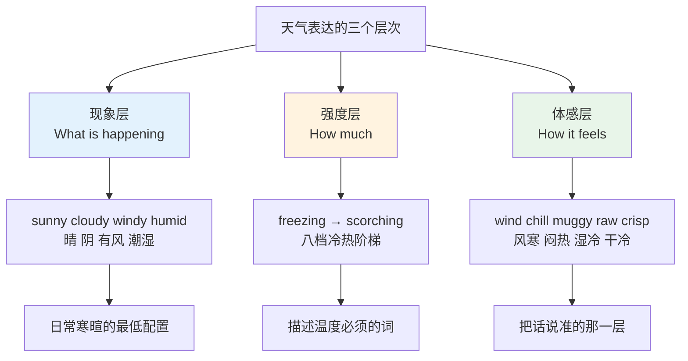
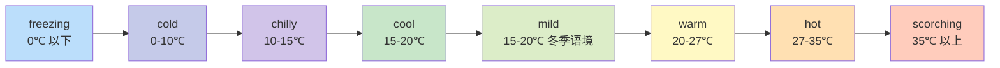
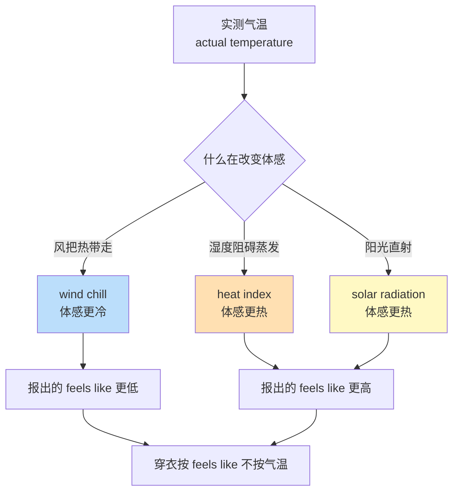
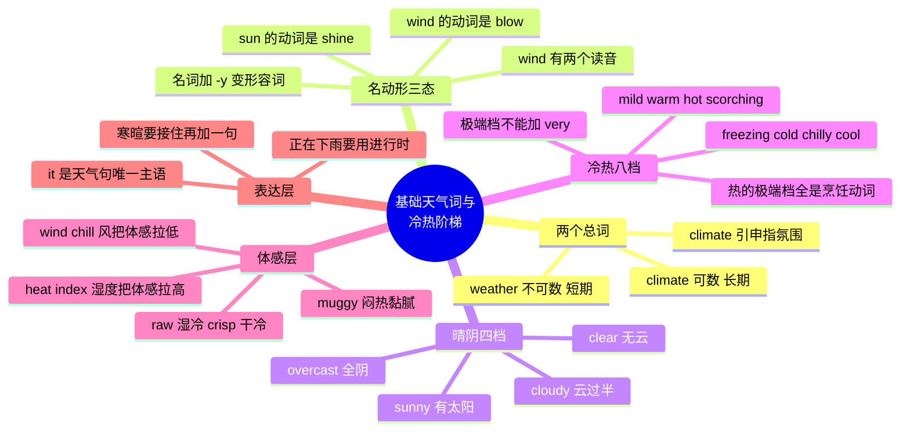

# 基础天气词与冷热强度阶梯

> [!info] 本篇定位
>
> 天气章的第一篇，也是整章的总入口。
>
> 读完你会拿到三组东西：一套区分 `weather` 与 `climate` 的判据，一张从 `freezing` 到 `scorching` 的八档冷热强度阶梯，以及 `sunny`、`cloudy`、`windy`、`humid` 这批基础天气词的名词、动词、形容词三种形态之间的换算规则。
>
> 本章后两篇是本篇的展开：降水、风力、云与能见度的细分词进 [[06.天气、自然与地理/02.降水、风与云雾能见度|02]]，飓风、暴雪、干旱这类极端天气词进 [[06.天气、自然与地理/03.极端天气、自然灾害与天气预报|03]]。本篇不碰它们，只把日常天气对话的骨架搭起来。
>
> 天气是英语里最难回避的一组词——它是寒暄的默认话题，是新闻广播的固定栏目，也是技术文档里 `temperature`、`humidity`、`threshold` 这些术语的日常来源。

---

## 1. 本篇导读：为什么天气词最先用上却最容易说错

天气词的特殊之处在于，它是极少数「中文说得出、英文说不对」的高频领域。中文里「今天很热」「今天天气不好」的说法几乎不需要思考，直译成英语却会连着踩三个坑。

**第一个坑是主语。** 中文的天气句主语是「天气」，英语的天气句主语是虚指的 `it`。「今天下雨了」不是 `The weather is raining`，而是 `It's raining`。

**第二个坑是强度阶梯的断层。** 中文的冷热是「很冷—冷—凉—温—暖—热—很热」，靠副词加减，词根只有冷热两个。英语的冷热是八个独立的形容词，各自有各自的温度带和搭配限制，`very freezing` 这种说法在英语里不成立。

**第三个坑是体感与读数不分。** 中文的「闷」「湿冷」「干冷」在英语里分别是 `muggy`、`raw`、`crisp`，各是一个专门的词，不是「湿 + 冷」的组合。而 `wind chill`（风寒温度）、`heat index`（体感高温指数）这类概念在英语天气预报里天天出现，中文预报里只笼统说「体感温度」。

上图是本篇的骨架。现象层回答「天上正在发生什么」，强度层回答「到什么程度」，体感层回答「人站在里面是什么感觉」。三层用的是三批不同的词，混着用就会说出 `It's very hot and wet today` 这种语法没错但没人这么说的句子——母语者会说 `It's muggy today`。

本篇按这三层推进，最后收在寒暄用法和习语上。

---

## 2. weather 与 climate：此刻与长期

### 2.1 两个词的分界线是时间跨度

`weather` 指某个具体时间点或短时段的大气状态，`climate` 指一个地区长期的平均天气型态。分界大约在三十年——气象学界惯用三十年平均值定义气候常态。

| 英文 | 英式音标 | 美式音标 | 词性 | 中文 | 搭配与说明 |
| --- | --- | --- | --- | --- | --- |
| **weather** | /ˈweðə/ | /ˈweðər/ | n./v. | 天气；经受住 | 不可数，永远不加 a 和 -s |
| **climate** | /ˈklaɪmət/ | /ˈklaɪmət/ | n. | 气候；氛围 | 可数，a dry climate / two climates |
| **forecast** | /ˈfɔːkɑːst/ | /ˈfɔːrkæst/ | n./v. | 预报 | 动词过去式可写 forecast 或 forecasted |
| **temperature** | /ˈtemprətʃə/ | /ˈtemprətʃər/ | n. | 温度；体温 | 口语常读三音节，中间 e 脱落 |
| **atmosphere** | /ˈætməsfɪə/ | /ˈætməsfɪr/ | n. | 大气；气氛 | 派生 atmospheric |
| **meteorology** | /ˌmiːtiəˈrɒlədʒi/ | /ˌmiːtiəˈrɑːlədʒi/ | n. | 气象学 | 词根 meteor 原指高空现象 |
| **meteorologist** | /ˌmiːtiəˈrɒlədʒɪst/ | /ˌmiːtiəˈrɑːlədʒɪst/ | n. | 气象学家 | 电视上的天气主播用 weather presenter |
| **thermometer** | /θəˈmɒmɪtə/ | /θərˈmɑːmɪtər/ | n. | 温度计 | thermo「热」+ meter「计」 |
| **barometer** | /bəˈrɒmɪtə/ | /bəˈrɑːmɪtər/ | n. | 气压计 | 比喻义「晴雨表、风向标」 |
| **season** | /ˈsiːzn/ | /ˈsiːzn/ | n./v. | 季节；调味 | 两个义项同源，都来自「适时」 |
| **seasonal** | /ˈsiːzənl/ | /ˈsiːzənl/ | adj. | 季节性的 | seasonal affective disorder 季节性情绪失调 |
| **outlook** | /ˈaʊtlʊk/ | /ˈaʊtlʊk/ | n. | 前景展望；天气展望 | 预报里指未来几天的趋势 |

`weather` 不可数这一条要单独记牢，因为中文的「一个好天气」诱导力很强。

> [!warning] weather 的三个高频错误
>
> - ❌ ~~What a good weather!~~
> - ✅ **What lovely weather!**（不可数名词前不能用 a）
> - ✅ **What a lovely day!**（要用不定冠词就换成 day）
>
> - ❌ ~~The weathers in Beijing and Shanghai are different.~~
> - ✅ **The weather in Beijing is different from that in Shanghai.**
> - ✅ **Beijing and Shanghai have different climates.**（长期差异用 climate，这个词可数）
>
> - ❌ ~~How is the weather like today?~~（两种句式串了）
> - ✅ **What's the weather like today?**
> - ✅ **How's the weather today?**

### 2.2 climate 的引申义比本义更常用

`climate` 在非气象语境里指「氛围、大环境」，这个引申义在商业和技术文档里出现频率很高，读英文材料时遇到的 `climate` 有一多半不是在讲天气。

| 英文 | 英式音标 | 美式音标 | 词性 | 中文 | 搭配与说明 |
| --- | --- | --- | --- | --- | --- |
| **climatic** | /klaɪˈmætɪk/ | /klaɪˈmætɪk/ | adj. | 气候的 | 与 climactic「高潮的」拼写只差一个字母 |
| **temperate** | /ˈtempərət/ | /ˈtempərət/ | adj. | 温带的；温和的 | temperate zone 温带 |
| **tropical** | /ˈtrɒpɪkl/ | /ˈtrɑːpɪkl/ | adj. | 热带的 | tropical climate / tropical storm |
| **arid** | /ˈærɪd/ | /ˈærɪd/ | adj. | 干旱的 | 比 dry 正式，多用于气候与地理 |
| **continental** | /ˌkɒntɪˈnentl/ | /ˌkɑːntɪˈnentl/ | adj. | 大陆性的 | continental climate 冬冷夏热温差大 |
| **monsoon** | /mɒnˈsuːn/ | /mɑːnˈsuːn/ | n. | 季风；雨季 | the monsoon season |
| **microclimate** | /ˈmaɪkrəʊklaɪmət/ | /ˈmaɪkroʊklaɪmət/ | n. | 小气候 | 一个山谷、一个城区的局部气候 |

> [!example] climate 的引申义
>
> - The current economic **climate** makes hiring difficult.
>   - 当前的经济大环境使招聘变得困难。
> - We need a **climate** of trust before people will report bugs honestly.
>   - 得先有信任的氛围，大家才会如实上报缺陷。
> - Chengdu has a humid subtropical **climate**.
>   - 成都属于湿润的亚热带气候。
> - The **weather** in Chengdu today is unusually clear.
>   - 成都今天的天气异常晴朗。

最后两句放在一起看，`climate` 与 `weather` 的分工就一目了然：一个描述这个城市三十年的常态，一个描述今天这一天。

---

## 3. 天气词的名动形三态与 -y 后缀

### 3.1 -y 后缀是天气形容词的默认造法

英语天气形容词的主干是一条极规整的构形规则：**天气现象名词 + -y = 对应的形容词**。这条规则的覆盖面在整个英语词汇里都属于罕见的高，几乎没有例外。

| 名词 | 音标（英/美） | 形容词 | 音标（英/美） | 中文 | 拼写变化 |
| --- | --- | --- | --- | --- | --- |
| **sun** | /sʌn/ · /sʌn/ | **sunny** | /ˈsʌni/ · /ˈsʌni/ | 太阳 → 晴朗的 | 短元音末尾辅音双写 |
| **cloud** | /klaʊd/ · /klaʊd/ | **cloudy** | /ˈklaʊdi/ · /ˈklaʊdi/ | 云 → 多云的 | 直接加 -y |
| **wind** | /wɪnd/ · /wɪnd/ | **windy** | /ˈwɪndi/ · /ˈwɪndi/ | 风 → 有风的 | 直接加 -y |
| **rain** | /reɪn/ · /reɪn/ | **rainy** | /ˈreɪni/ · /ˈreɪni/ | 雨 → 下雨的 | 直接加 -y |
| **snow** | /snəʊ/ · /snoʊ/ | **snowy** | /ˈsnəʊi/ · /ˈsnoʊi/ | 雪 → 有雪的 | 直接加 -y |
| **fog** | /fɒɡ/ · /fɔːɡ/ | **foggy** | /ˈfɒɡi/ · /ˈfɔːɡi/ | 雾 → 有雾的 | 短元音末尾辅音双写 |
| **mist** | /mɪst/ · /mɪst/ | **misty** | /ˈmɪsti/ · /ˈmɪsti/ | 薄雾 → 有薄雾的 | 直接加 -y |
| **ice** | /aɪs/ · /aɪs/ | **icy** | /ˈaɪsi/ · /ˈaɪsi/ | 冰 → 结冰的 | 去 e 加 -y |
| **frost** | /frɒst/ · /frɔːst/ | **frosty** | /ˈfrɒsti/ · /ˈfrɔːsti/ | 霜 → 有霜的 | 直接加 -y |
| **haze** | /heɪz/ · /heɪz/ | **hazy** | /ˈheɪzi/ · /ˈheɪzi/ | 霾 → 有霾的 | 去 e 加 -y |
| **breeze** | /briːz/ · /briːz/ | **breezy** | /ˈbriːzi/ · /ˈbriːzi/ | 微风 → 有微风的 | 去 e 加 -y |
| **storm** | /stɔːm/ · /stɔːrm/ | **stormy** | /ˈstɔːmi/ · /ˈstɔːrmi/ | 风暴 → 有风暴的 | 直接加 -y |
| **chill** | /tʃɪl/ · /tʃɪl/ | **chilly** | /ˈtʃɪli/ · /ˈtʃɪli/ | 寒意 → 微冷的 | 直接加 -y |
| **dust** | /dʌst/ · /dʌst/ | **dusty** | /ˈdʌsti/ · /ˈdʌsti/ | 灰尘 → 有沙尘的 | 直接加 -y |

拼写变化只有三种情况：单音节短元音后跟单个辅音字母时双写辅音（`sun`→`sunny`、`fog`→`foggy`），词尾是不发音的 e 时去 e（`ice`→`icy`、`haze`→`hazy`），其余直接加。

> [!tip] 用 -y 规则反推词义
>
> 读英文天气报道时遇到不认识的 `-y` 结尾形容词，先切掉 `-y` 看词干。`blustery` 切掉后是 `bluster`（狂吹），`squally` 切掉后是 `squall`（骤风），`sleety` 切掉后是 `sleet`（雨夹雪）。
>
> 这个反推在天气语域里成功率极高，因为这批词全部走同一条构形路径。词干本身不认识时再查，比整词查省事。

### 3.2 三态换算表：名词、动词、形容词

`-y` 规则解决了名词到形容词，但天气词还有第三态：动词。天气动词的形态不统一，需要单独记。

| 名词 | 动词 | 形容词 | 动词音标（英/美） | 说明 |
| --- | --- | --- | --- | --- |
| sun | **shine** | sunny | /ʃaɪn/ · /ʃaɪn/ | 名动不同源，shine-shone-shone |
| cloud | **cloud over** | cloudy | /klaʊd/ · /klaʊd/ | 动词多用短语 cloud over「转阴」 |
| wind | **blow** | windy | /bləʊ/ · /bloʊ/ | 名动不同源，blow-blew-blown |
| rain | **rain** | rainy | /reɪn/ · /reɪn/ | 名动同形，规则变化 |
| snow | **snow** | snowy | /snəʊ/ · /snoʊ/ | 名动同形，规则变化 |
| frost | **frost over** | frosty | /frɒst/ · /frɔːst/ | 常用 frost over「结满霜」 |
| ice | **freeze** | icy | /friːz/ · /friːz/ | freeze-froze-frozen |
| heat | **heat up** | hot | /hiːt/ · /hiːt/ | 形容词是 hot 不是 heaty |
| chill | **chill** | chilly | /tʃɪl/ · /tʃɪl/ | 名动同形 |
| warmth | **warm up** | warm | /wɔːm/ · /wɔːrm/ | 名词是 warmth 不是 warm |

这张表里有两处特别容易翻车。第一处是 `sun` 和 `wind` 的动词不是自身：太阳的动作用 `shine`，风的动作用 `blow`，`The sun is sunning` 和 `The wind is winding` 都不成立。第二处是 `heat` 与 `warmth` 的形容词不走 `-y`：热是 `hot`，暖是 `warm`，不存在 `heaty` 和 `warmy`。

> [!warning] wind 这个词有两个读音，意思完全不同
>
> - **wind** /wɪnd/ 名词，风。The **wind** is strong today.
> - **wind** /waɪnd/ 动词，缠绕、上发条、蜿蜒。过去式 wound /waʊnd/。
>   - **Wind** the cable around the post. 把线缠在柱子上。
>   - The road **winds** through the mountains. 这条路在山间蜿蜒。
>
> 两者拼写完全相同，只能靠语境和词性判断。做技术文档时尤其注意：`rewind`（倒带、回卷）读 /ˌriːˈwaɪnd/，跟风没有任何关系。

### 3.3 天气名词的可数性

天气名词的可数性不统一，这是词表里必须逐个标注的信息。

| 英文 | 英式音标 | 美式音标 | 词性 | 中文 | 搭配与说明 |
| --- | --- | --- | --- | --- | --- |
| **sunshine** | /ˈsʌnʃaɪn/ | /ˈsʌnʃaɪn/ | n. | 阳光 | 不可数；a ray of sunshine 也指开心果 |
| **sunlight** | /ˈsʌnlaɪt/ | /ˈsʌnlaɪt/ | n. | 日光 | 不可数，偏中性描述，无褒义色彩 |
| **ray** | /reɪ/ | /reɪ/ | n. | 光线 | 可数；UV rays 紫外线 |
| **glare** | /ɡleə/ | /ɡler/ | n./v. | 刺眼强光；怒视 | 不可数；screen glare 屏幕反光 |
| **shade** | /ʃeɪd/ | /ʃeɪd/ | n. | 阴凉处 | 不可数；sit in the shade 坐在阴凉处 |
| **shadow** | /ˈʃædəʊ/ | /ˈʃædoʊ/ | n. | 影子 | 可数；指物体投出的具体形状 |
| **heat** | /hiːt/ | /hiːt/ | n. | 热；暑气 | 不可数；the heat 特指酷暑 |
| **warmth** | /wɔːmθ/ | /wɔːrmθ/ | n. | 温暖 | 不可数；也指人的热情 |
| **cold** | /kəʊld/ | /koʊld/ | n./adj. | 寒冷；感冒 | 寒冷不可数，感冒可数 a cold |
| **chill** | /tʃɪl/ | /tʃɪl/ | n. | 寒意；着凉 | there's a chill in the air 有点凉意 |
| **humidity** | /hjuːˈmɪdəti/ | /hjuːˈmɪdəti/ | n. | 湿度 | 不可数；重音在第二音节 |
| **moisture** | /ˈmɔɪstʃə/ | /ˈmɔɪstʃər/ | n. | 水分；潮气 | 不可数；比 humidity 更泛指 |
| **dew** | /djuː/ | /duː/ | n. | 露水 | 不可数；英美读音差在 /dj/ 与 /d/ |

`shade` 与 `shadow` 是这里最需要辨清的一对。`shade` 指没有阳光直射的区域，是一片可以待的地方；`shadow` 指某个具体物体挡光形成的轮廓。树下乘凉是 `in the shade of a tree`，看到自己的影子是 `see my shadow`。

---

## 4. 晴阴四档：sunny、clear、cloudy、overcast

### 4.1 从全晴到全阴的连续带

英语描述天空状态用的是一条四档带，中间还有几个补充档。区分它们的标准是**云量**，不是亮度。

| 英文 | 英式音标 | 美式音标 | 词性 | 中文 | 搭配与说明 |
| --- | --- | --- | --- | --- | --- |
| **sunny** | /ˈsʌni/ | /ˈsʌni/ | adj. | 晴朗的 | 强调有太阳；也形容人性格开朗 |
| **clear** | /klɪə/ | /klɪr/ | adj. | 晴朗无云的 | 强调无云，夜里也能说 a clear night |
| **bright** | /braɪt/ | /braɪt/ | adj. | 明亮的 | bright but cold 亮而冷，英式预报常用 |
| **fine** | /faɪn/ | /faɪn/ | adj. | 晴好的 | 英式偏好；a fine day 天气好 |
| **fair** | /feə/ | /fer/ | adj. | 晴好的 | 气象术语，云量少于一半 |
| **partly cloudy** | /ˌpɑːtli ˈklaʊdi/ | /ˌpɑːrtli ˈklaʊdi/ | adj. | 局部多云 | 预报标准用语，云量约三到五成 |
| **cloudy** | /ˈklaʊdi/ | /ˈklaʊdi/ | adj. | 多云的 | 云量过半；也形容液体浑浊 |
| **overcast** | /ˌəʊvəˈkɑːst/ | /ˈoʊvərkæst/ | adj. | 阴天的 | 云量接近全覆盖，天空一片灰 |
| **grey / gray** | /ɡreɪ/ | /ɡreɪ/ | adj. | 灰蒙蒙的 | 英式拼 grey，美式拼 gray |
| **dull** | /dʌl/ | /dʌl/ | adj. | 阴沉的 | 英式口语；a dull day 没太阳的一天 |
| **gloomy** | /ˈɡluːmi/ | /ˈɡluːmi/ | adj. | 昏暗阴郁的 | 带情绪色彩，暗示心情也压抑 |
| **dreary** | /ˈdrɪəri/ | /ˈdrɪri/ | adj. | 沉闷乏味的 | 阴天连着好几天时用 |
| **bleak** | /bliːk/ | /bliːk/ | adj. | 阴冷荒凉的 | 阴 + 冷 + 空旷，程度最重 |
| **hazy** | /ˈheɪzi/ | /ˈheɪzi/ | adj. | 有霾的 | 也指记忆模糊 a hazy memory |

上图把七个词排在同一条云量轴上。`clear` 和 `overcast` 是两个端点，`partly cloudy` 是中点，`gloomy` 不在气象量表上——它是主观感受词，云量跟 `overcast` 差不多但带情绪。写正式的天气记录用左边六个，写日记和聊天用最右边那个。

### 4.2 sunny 与 clear 的差别在于看什么

`sunny` 的焦点是太阳，`clear` 的焦点是云。白天两者常常同时成立，但它们在两种场合分开：

> [!example] sunny 与 clear 的分道口
>
> - It was a **clear** night — you could see every star.
>   - 那是个晴朗的夜晚，星星一颗颗都看得清。（夜里没有太阳，只能用 clear）
> - It's **sunny** but there are a few clouds around.
>   - 出太阳了，不过天上还有几片云。（有太阳但不是无云，只能用 sunny）
> - The sky was **clear** and the air was crisp.
>   - 天空万里无云，空气清冽。
> - She has a **sunny** personality.
>   - 她性格开朗。（sunny 的引申义，clear 没有这个用法）

`bright` 是英国天气预报的高频词，它填补了一个空档：**云挺多但光线很足**。中文里没有对应的单字，只能说「天亮但不见太阳」。英式预报里 `bright but breezy`、`bright spells`（间歇的明亮时段）都属于标准表达。

---

## 5. 风与湿的基础层：windy、humid 及其邻居

### 5.1 风的基础形容词

风力的细分等级（`gale`、`gust`、`squall`、蒲福风级）归 [[06.天气、自然与地理/02.降水、风与云雾能见度|下一篇]]，这里只交付日常对话必须的一小组。

| 英文 | 英式音标 | 美式音标 | 词性 | 中文 | 搭配与说明 |
| --- | --- | --- | --- | --- | --- |
| **windy** | /ˈwɪndi/ | /ˈwɪndi/ | adj. | 有风的 | 中性偏强；It's windy 一般指风不小 |
| **breezy** | /ˈbriːzi/ | /ˈbriːzi/ | adj. | 微风习习的 | 褒义，舒服的风；也形容语气轻松 |
| **blustery** | /ˈblʌstəri/ | /ˈblʌstəri/ | adj. | 风大而阵阵的 | 风忽大忽小，英式预报常用 |
| **calm** | /kɑːm/ | /kɑːm/ | adj. | 无风的；平静的 | l 不发音，与 come 读音无关 |
| **still** | /stɪl/ | /stɪl/ | adj. | 静止无风的 | a still evening 一个无风的傍晚 |
| **draught** | /drɑːft/ | — | n. | 穿堂风 | 英式拼写；室内的冷风 |
| **draft** | — | /dræft/ | n. | 穿堂风 | 美式拼写；同一个词 |
| **breeze** | /briːz/ | /briːz/ | n. | 微风 | a breeze 可数；也指「轻而易举的事」 |
| **gust** | /ɡʌst/ | /ɡʌst/ | n. | 一阵疾风 | gusts of up to 60 km/h 阵风达 60 公里 |
| **airy** | /ˈeəri/ | /ˈeri/ | adj. | 通风的 | 形容房间，不形容天气 |
| **stuffy** | /ˈstʌfi/ | /ˈstʌfi/ | adj. | 闷不透气的 | 室内空气不流通；也形容人古板 |
| **stale** | /steɪl/ | /steɪl/ | adj. | 污浊的；不新鲜的 | stale air 浊气；stale bread 陈面包 |
| **ventilate** | /ˈventɪleɪt/ | /ˈventɪleɪt/ | v. | 通风 | 名词 ventilation |

> [!warning] windy 不是中性词
>
> 中文说「今天有点风」是轻描淡写，英语的 `It's windy` 通常意味着**风大到影响活动**——头发会乱、伞会翻、走路会顶风。
>
> 想说微风舒服，用 `breezy`：
>
> - ❌ ~~It's a bit windy, very comfortable.~~（语义打架）
> - ✅ **It's breezy today — really pleasant.**
>
> 想说完全没风，用 `calm` 或 `still`，不要用 `no windy`：
>
> - ❌ ~~There is no windy today.~~
> - ✅ **There's no wind today.**（wind 是名词）
> - ✅ **It's completely still today.**

`draught` 与 `draft` 是英美拼写差异里最需要注意的一组，因为两个拼法在美式英语里都存在但意思不同：美式 `draft` 兼指穿堂风、草稿、征兵、生啤（`draft beer`）；英式则把「穿堂风、生啤」拼成 `draught`，把「草稿、征兵」拼成 `draft`。读音在两边都是同一个。

### 5.2 湿度的基础形容词

湿度词是中文母语者最容易说笼统的一组，因为中文只有「潮」「湿」「干」三个字在用。

| 英文 | 英式音标 | 美式音标 | 词性 | 中文 | 搭配与说明 |
| --- | --- | --- | --- | --- | --- |
| **humid** | /ˈhjuːmɪd/ | /ˈhjuːmɪd/ | adj. | 湿度高的 | 专指空气湿度，不形容物体 |
| **damp** | /dæmp/ | /dæmp/ | adj. | 潮的 | 略带不适；damp walls 返潮的墙 |
| **moist** | /mɔɪst/ | /mɔɪst/ | adj. | 湿润的 | 褒义；moist cake 松软湿润的蛋糕 |
| **wet** | /wet/ | /wet/ | adj. | 湿的 | 有明显水分；wet clothes 湿衣服 |
| **soggy** | /ˈsɒɡi/ | /ˈsɑːɡi/ | adj. | 湿透变软的 | 泡得发软；soggy chips 软塌的薯条 |
| **dry** | /draɪ/ | /draɪ/ | adj./v. | 干燥的；弄干 | dry air / dry spell 干燥期 |
| **parched** | /pɑːtʃt/ | /pɑːrtʃt/ | adj. | 干裂的；口渴的 | I'm parched 我渴死了 |
| **muggy** | /ˈmʌɡi/ | /ˈmʌɡi/ | adj. | 闷热潮湿的 | 高温 + 高湿，最常用的「闷」 |
| **sultry** | /ˈsʌltri/ | /ˈsʌltri/ | adj. | 湿热难耐的 | 比 muggy 书面；也形容人妖娆 |
| **clammy** | /ˈklæmi/ | /ˈklæmi/ | adj. | 湿冷黏腻的 | 常形容皮肤 clammy hands 手心冒冷汗 |
| **close** | /kləʊs/ | /kloʊs/ | adj. | 闷的 | 英式口语；读 /s/ 不读 /z/ |
| **oppressive** | /əˈpresɪv/ | /əˈpresɪv/ | adj. | 闷得让人喘不过气的 | 书面语；也指政权压迫 |
| **humidity** | /hjuːˈmɪdəti/ | /hjuːˈmɪdəti/ | n. | 湿度 | relative humidity 相对湿度 |
| **humidifier** | /hjuːˈmɪdɪfaɪə/ | /hjuːˈmɪdɪfaɪər/ | n. | 加湿器 | 反义 dehumidifier 除湿机 |

> [!tip] 三个「湿」字怎么分
>
> - **wet** 是有可见的水。摸上去会沾手。
> - **damp** 是没有可见的水但明显潮，带负面色彩。地下室、久放的被褥是 damp。
> - **moist** 也是潮但带正面色彩。蛋糕、皮肤、松软的土壤是 moist。
>
> 用错色彩会闹笑话：`a damp cake` 是「一块受潮的蛋糕」，`a moist cake` 才是「一块湿润松软的蛋糕」。
>
> **humid** 只用于空气。`humid weather` 成立，`humid towel` 不成立——毛巾要说 `damp towel`。

### 5.3 close 这个形容词的读音陷阱

`close` 有两个读音，形容天气闷时读 /kləʊs/（清辅音结尾），跟形容词「近的」同音；读 /kləʊz/ 时是动词「关闭」。

> [!example] close 的三种用法
>
> - It's very **close** /kləʊs/ today — I can hardly breathe.
>   - 今天真闷，喘不过气。（英式口语，形容词，读 s）
> - The station is **close** /kləʊs/ to my flat.
>   - 车站离我住的地方很近。（形容词，读 s）
> - Please **close** /kləʊz/ the window.
>   - 请关上窗户。（动词，读 z）

「闷」这个义项在美式英语里几乎不用，美国人会说 `It's so humid` 或 `It's muggy`。读英国小说和 BBC 天气预报时会碰上，说的时候按自己的目标口音选。

---

## 6. 冷热强度阶梯：八档主轴

### 6.1 完整阶梯

英语的冷热不是靠副词调节一个词根，而是八个各自独立的形容词排成一条带。这条带是本篇的核心，值得整块背下来。

| 英文 | 英式音标 | 美式音标 | 词性 | 中文 | 搭配与说明 |
| --- | --- | --- | --- | --- | --- |
| **freezing** | /ˈfriːzɪŋ/ | /ˈfriːzɪŋ/ | adj. | 冻死了 | 极端档；不能加 very |
| **cold** | /kəʊld/ | /koʊld/ | adj. | 冷的 | 基础档；可加 very / quite |
| **chilly** | /ˈtʃɪli/ | /ˈtʃɪli/ | adj. | 微冷的 | 需要加件外套的程度 |
| **cool** | /kuːl/ | /kuːl/ | adj. | 凉爽的 | 中性偏褒；夏天的 cool 是好事 |
| **mild** | /maɪld/ | /maɪld/ | adj. | 温和的 | 主要用于冬天不冷 |
| **warm** | /wɔːm/ | /wɔːrm/ | adj. | 暖和的 | 舒适档；也形容人热情 |
| **hot** | /hɒt/ | /hɑːt/ | adj. | 热的 | 基础档；可加 very / really |
| **scorching** | /ˈskɔːtʃɪŋ/ | /ˈskɔːrtʃɪŋ/ | adj. | 酷热灼人 | 极端档；不能加 very |

上图给的温度区间是使用惯例的粗略对应，不是硬性定义。真实用法带很强的相对性：同样是 15 度，伦敦人在二月说 `mild`，在八月说 `chilly`；哈尔滨人说的 `cold` 和广州人说的 `cold` 差了十几度。这条阶梯要记的是**相对顺序**，绝对温度只作参照。

`mild` 在图上跟 `cool` 温度重叠，是因为这两个词的差别不在温度而在**参照系**：`cool` 说的是「比常温低但舒服」，`mild` 说的是「比这个季节该有的温度高」。冬天说 `a mild winter` 是暖冬，夏天不说 `a mild summer` 说 `a cool summer`。

### 6.2 每一档的实际语感

> [!example] 八档各配一句
>
> - It's **freezing** out there — the pipes have frozen solid.
>   - 外面冻死了，水管都冻实了。
> - It's **cold**; you'll need a proper coat.
>   - 天冷，你得穿件像样的外套。
> - It's a bit **chilly** in the mornings now.
>   - 早上有点凉了。
> - The evening air was **cool** and pleasant.
>   - 傍晚的空气凉爽宜人。
> - We've had a remarkably **mild** winter this year.
>   - 今年冬天格外暖和。
> - The water's **warm** enough to swim in.
>   - 水够暖了，可以下去游泳。
> - It was **hot** all week — nobody wanted to go outside.
>   - 热了一整周，没人想出门。
> - Don't go out at noon, it's absolutely **scorching**.
>   - 中午别出去，晒得能烤人。

### 6.3 阶梯的扩展档

八档主轴之外还有一批更精确的词，用于描述特定质感的冷或热。这些词是把话说准的关键。

| 英文 | 英式音标 | 美式音标 | 词性 | 中文 | 搭配与说明 |
| --- | --- | --- | --- | --- | --- |
| **bitter** | /ˈbɪtə/ | /ˈbɪtər/ | adj. | 刺骨的 | bitter cold / bitterly cold 常一起用 |
| **raw** | /rɔː/ | /rɔː/ | adj. | 湿冷刺骨的 | 冷 + 湿 + 有风的那种难受 |
| **nippy** | /ˈnɪpi/ | /ˈnɪpi/ | adj. | 有点冻人的 | 英式口语，比 chilly 更轻快 |
| **crisp** | /krɪsp/ | /krɪsp/ | adj. | 清冽干冷的 | 褒义；晴朗的秋冬早晨 |
| **brisk** | /brɪsk/ | /brɪsk/ | adj. | 凉爽提神的 | 冷得让人精神一振 |
| **frosty** | /ˈfrɒsti/ | /ˈfrɔːsti/ | adj. | 结霜的 | 也形容态度冷淡 a frosty reply |
| **icy** | /ˈaɪsi/ | /ˈaɪsi/ | adj. | 结冰的 | icy roads 结冰路面；也形容眼神 |
| **balmy** | /ˈbɑːmi/ | /ˈbɑːmi/ | adj. | 温暖宜人的 | 带点湿润的暖，多用于夏夜 |
| **pleasant** | /ˈpleznt/ | /ˈpleznt/ | adj. | 舒适的 | 温度体感总评价，不指具体度数 |
| **moderate** | /ˈmɒdərət/ | /ˈmɑːdərət/ | adj. | 适中的 | 气象报告用语，中性无褒贬 |
| **sweltering** | /ˈsweltərɪŋ/ | /ˈsweltərɪŋ/ | adj. | 热得人直冒汗 | 强调出汗，含湿热成分 |
| **stifling** | /ˈstaɪflɪŋ/ | /ˈstaɪflɪŋ/ | adj. | 闷热得透不过气 | 强调空气不流通 |
| **blistering** | /ˈblɪstərɪŋ/ | /ˈblɪstərɪŋ/ | adj. | 灼热的 | 字面「起水泡的」；也形容速度极快 |
| **searing** | /ˈsɪərɪŋ/ | /ˈsɪrɪŋ/ | adj. | 灼烧般的 | 书面语；searing heat |
| **boiling** | /ˈbɔɪlɪŋ/ | /ˈbɔɪlɪŋ/ | adj. | 热得像烧开一样 | 口语；I'm boiling 我热死了 |
| **baking** | /ˈbeɪkɪŋ/ | /ˈbeɪkɪŋ/ | adj. | 烤箱般热 | 口语；the baking sun |
| **roasting** | /ˈrəʊstɪŋ/ | /ˈroʊstɪŋ/ | adj. | 热得像在烤 | 口语，与 baking 近义 |
| **lukewarm** | /ˌluːkˈwɔːm/ | /ˌluːkˈwɔːrm/ | adj. | 微温的 | 主要形容液体；引申「不热心」 |
| **tepid** | /ˈtepɪd/ | /ˈtepɪd/ | adj. | 温吞的 | 比 lukewarm 书面；同带贬义 |

> [!tip] 冷的四种质感怎么选
>
> 中文的「冷」不分质感，英语分得很细。选词时问自己冷里带什么：
>
> - 带**风** → `bitter`（刺骨），`It was bitterly cold on the platform.`
> - 带**湿** → `raw`（湿冷），`a raw November day`
> - 带**干和晴** → `crisp`（清冽），`a crisp winter morning`
> - 带**轻微且不讨厌** → `nippy`（微冻），`It's a bit nippy out.`
>
> 同样是零度，`bitter`、`raw`、`crisp` 三个词描绘的是三种完全不同的体验。这一组词是把英语说细的第一步。

### 6.4 热的口语档全是分词形容词

热的极端档有个显著规律：`scorching`、`sweltering`、`boiling`、`baking`、`roasting`、`blistering`、`searing`、`stifling` 全部是 `-ing` 结尾的分词形容词，而且全部来自烹饪或烧灼的动作。

这不是巧合。冷的极端只有一种物理路径（结冰），所以只有 `freezing`；热的极端在生活里对应各种加热方式，于是「烤、煮、烧、燎」的动词全被借来形容天气。

| 动词原义 | 分词形容词 | 中文原义 | 用作天气时的语感 |
| --- | --- | --- | --- |
| **scorch** /skɔːtʃ/ · /skɔːrtʃ/ | scorching | 烤焦、烫伤 | 太阳直射灼人，最常用 |
| **swelter** /ˈsweltə/ · /ˈsweltər/ | sweltering | 热得发昏 | 湿热出汗，室内也能用 |
| **boil** /bɔɪl/ · /bɔɪl/ | boiling | 煮沸 | 口语最随意，形容人也形容天 |
| **bake** /beɪk/ · /beɪk/ | baking | 烘烤 | 干热，太阳晒地面 |
| **roast** /rəʊst/ · /roʊst/ | roasting | 烘烤 | 与 baking 近义，更口语 |
| **blister** /ˈblɪstə/ · /ˈblɪstər/ | blistering | 起水泡 | 书面语，程度极重 |
| **sear** /sɪə/ · /sɪr/ | searing | 高温快煎 | 书面语，多用于文学描写 |
| **stifle** /ˈstaɪfl/ · /ˈstaɪfl/ | stifling | 使窒息 | 闷热无风，重点在憋 |

记这一批的办法是从原义倒推：`boiling` 是水开了那种热，`baking` 是烤箱那种干热，`stifling` 是捂住口鼻那种憋闷。原义记住了，用哪个词就有依据。

---

## 7. 阶梯两端的加强词：freezing 与 boiling 的搭配规则

### 7.1 极端档不能加 very

`freezing`、`boiling`、`scorching` 这类词本身已经含「极端」的意思，前面不能再加表示程度的 `very`、`quite`、`a bit`。这不是可选的风格问题——加了会让母语者觉得别扭，就像中文说「非常冻死了」。

| 类别 | 词例 | 能配的副词 | 不能配的副词 |
| --- | --- | --- | --- |
| 可分级 | cold, hot, warm, cool, chilly, mild | very, quite, rather, a bit, fairly, extremely | absolutely, utterly |
| 极端 | freezing, boiling, scorching, sweltering, baking | absolutely, utterly, totally, simply | very, quite, a bit, rather |

> [!warning] 极端档形容词的搭配
>
> - ❌ ~~It's very freezing today.~~
> - ✅ **It's freezing today.**
> - ✅ **It's absolutely freezing today.**
>
> - ❌ ~~I'm quite boiling.~~
> - ✅ **I'm boiling.**
> - ✅ **I'm absolutely boiling.**
>
> - ❌ ~~a bit scorching~~
> - ✅ **absolutely scorching**
>
> 中间档反过来：`absolutely cold` 也不对，得说 `very cold`。两组副词各配各的形容词，不能交叉。

`quite` 在这里还有个英美陷阱。英式 `quite cold` 意思是「有点冷」（减弱），美式 `quite cold` 意思是「相当冷」（加强）。同一个短语在两岸的语气差着一档。写给英国同事的邮件里说 `The office is quite cold`，对方理解成「有点凉」；写给美国同事，对方理解成「挺冷的」。

### 7.2 -ish 后缀是给中间档降档的工具

口语里给温度词降一档最省事的办法是加 `-ish`，这个后缀把确定的形容词变成模糊的。

| 原词 | 加 -ish | 音标（英/美） | 语感 |
| --- | --- | --- | --- |
| **cold** | **coldish** | /ˈkəʊldɪʃ/ · /ˈkoʊldɪʃ/ | 有点冷，说不上冷 |
| **warm** | **warmish** | /ˈwɔːmɪʃ/ · /ˈwɔːrmɪʃ/ | 有点暖 |
| **cool** | **coolish** | /ˈkuːlɪʃ/ · /ˈkuːlɪʃ/ | 稍微凉一点 |
| **hot** | **hottish** | /ˈhɒtɪʃ/ · /ˈhɑːtɪʃ/ | 偏热，不常用 |
| **damp** | **dampish** | /ˈdæmpɪʃ/ · /ˈdæmpɪʃ/ | 有点潮 |

`-ish` 是纯口语手段，正式书面写作里不用。它跟 `freezing` 这类极端词也不搭：`freezingish` 不成立。

### 7.3 阶梯词加副词的完整梯度

把副词和形容词组合起来，就得到了一条更细的梯度。这张表是日常表达温度时最实用的一张。

| 表达 | 大致语感 | 场合 |
| --- | --- | --- |
| absolutely freezing | 冻得受不了 | 口语，抱怨 |
| freezing | 极冷 | 口语通用 |
| bitterly cold | 刺骨的冷 | 书面与口语皆可 |
| very cold | 很冷 | 通用 |
| cold | 冷 | 通用 |
| coldish / a bit cold | 有点冷 | 口语 |
| chilly | 微冷 | 通用 |
| cool | 凉爽 | 通用，含褒义 |
| mild | 温和（针对冬天） | 通用 |
| pleasantly warm | 暖得舒服 | 通用 |
| warm | 暖 | 通用 |
| very warm | 很暖，接近热 | 通用 |
| hot | 热 | 通用 |
| really hot | 很热 | 口语 |
| sweltering | 湿热难当 | 通用 |
| absolutely boiling | 热死了 | 口语，抱怨 |
| scorching | 酷热灼人 | 通用 |

---

## 8. 体感与读数的落差：wind chill、muggy、dew point

### 8.1 温度计读数不等于人的感受

英语天气预报会同时给两个数：实测气温和体感温度。这套区分在英语世界比中文世界普及得多，相关词汇因此进了日常。

| 英文 | 英式音标 | 美式音标 | 词性 | 中文 | 搭配与说明 |
| --- | --- | --- | --- | --- | --- |
| **wind chill** | /ˈwɪnd tʃɪl/ | /ˈwɪnd tʃɪl/ | n. | 风寒效应 | 风把体感温度拉低多少度 |
| **wind chill factor** | /ˈwɪnd tʃɪl ˌfæktə/ | /ˈwɪnd tʃɪl ˌfæktər/ | n. | 风寒指数 | 常见完整说法 |
| **heat index** | /ˈhiːt ˌɪndeks/ | /ˈhiːt ˌɪndeks/ | n. | 体感高温指数 | 湿度把体感温度拉高多少度 |
| **feels like** | /fiːlz laɪk/ | /fiːlz laɪk/ | phr. | 体感 | 天气 App 上的标准标签 |
| **apparent temperature** | /əˌpærənt ˈtemprətʃə/ | /əˌpærənt ˈtemprətʃər/ | n. | 表观温度 | 气象学正式术语 |
| **dew point** | /ˈdjuː pɔɪnt/ | /ˈduː pɔɪnt/ | n. | 露点 | 空气开始凝露的温度，判断闷不闷 |
| **relative humidity** | /ˌrelətɪv hjuːˈmɪdəti/ | /ˌrelətɪv hjuːˈmɪdəti/ | n. | 相对湿度 | 缩写 RH |
| **UV index** | /ˌjuːˈviː ˌɪndeks/ | /ˌjuːˈviː ˌɪndeks/ | n. | 紫外线指数 | 读字母 U-V，不读整词 |
| **exposure** | /ɪkˈspəʊʒə/ | /ɪkˈspoʊʒər/ | n. | 暴露；受冻 | die of exposure 冻死在野外 |
| **frostbite** | /ˈfrɒstbaɪt/ | /ˈfrɔːstbaɪt/ | n. | 冻疮；冻伤 | 医学与户外场景 |
| **hypothermia** | /ˌhaɪpəˈθɜːmiə/ | /ˌhaɪpəˈθɜːrmiə/ | n. | 体温过低 | hypo「低」+ therm「热」 |
| **heatstroke** | /ˈhiːtstrəʊk/ | /ˈhiːtstroʊk/ | n. | 中暑 | 也写 heat stroke |
| **sunstroke** | /ˈsʌnstrəʊk/ | /ˈsʌnstroʊk/ | n. | 日射病 | 比 heatstroke 略旧 |
| **sunburn** | /ˈsʌnbɜːn/ | /ˈsʌnbɜːrn/ | n./v. | 晒伤 | 形容词 sunburnt / sunburned |
| **dehydrated** | /ˌdiːhaɪˈdreɪtɪd/ | /ˌdiːhaɪˈdreɪtɪd/ | adj. | 脱水的 | 名词 dehydration |
| **sunscreen** | /ˈsʌnskriːn/ | /ˈsʌnskriːn/ | n. | 防晒霜 | 英式也说 sun cream |
| **shiver** | /ˈʃɪvə/ | /ˈʃɪvər/ | v./n. | 打哆嗦 | shiver with cold |
| **sweat** | /swet/ | /swet/ | v./n. | 出汗 | 注意读 /swet/ 不是 /swiːt/ |
| **perspire** | /pəˈspaɪə/ | /pərˈspaɪər/ | v. | 出汗 | sweat 的正式版，名词 perspiration |

上图解释了 `feels like` 这个数字是怎么来的：风会加速体表散热，把感受往冷的方向推；湿度会阻碍汗液蒸发，把感受往热的方向推；阳光直射也往热的方向推。英语天气对话里 `It's 5 degrees but feels like minus 2` 是完全正常的一句话，中文里没有这么日常的对应说法。

### 8.2 muggy 是英语天气词里最实用的一个

`muggy` 在中文里没有一个字对应，它专指**高温加高湿的那种黏腻闷热**。中国南方的夏天、日本的梅雨季、美国东南部的七月，都是 `muggy` 的典型场景。

> [!example] muggy 与它的近义词
>
> - It's so **muggy** today — my shirt's stuck to my back.
>   - 今天闷得要命，衬衫都贴在背上了。（口语首选）
> - The **sultry** August air made sleeping impossible.
>   - 八月湿热的空气让人无法入睡。（书面，带文学色彩）
> - The heat in the server room was **stifling**.
>   - 机房里闷得喘不过气。（强调空气不流通）
> - His hands were cold and **clammy**.
>   - 他的手又冷又黏。（形容皮肤，不形容天气）
> - The atmosphere in the meeting was **oppressive**.
>   - 会议的气氛压抑得让人透不过气。（引申义，形容氛围）

> [!warning] 别用 hot and wet 表达「闷热」
>
> - ❌ ~~It's very hot and wet today.~~（`wet` 指有实际水分，这句听起来像下雨了）
> - ✅ **It's really muggy today.**
> - ✅ **It's hot and humid today.**（可以，但 muggy 更地道）
>
> `wet` 说的是「有水」，`humid` 说的是「空气含水量高」，两者不能互换。下雨天是 `wet weather`，蒸笼天是 `humid weather`。

### 8.3 露点这个词值得单独理解

`dew point` 是判断闷不闷最准的指标，比相对湿度更可靠。英语天气 App 上通常都有这一栏，读英文预报时会遇到。

| 露点温度 | 英语常见描述 | 体感 |
| --- | --- | --- |
| 低于 10℃ | **dry** / **comfortable** | 干爽 |
| 10—15℃ | **comfortable** | 舒适 |
| 16—18℃ | **noticeably humid** | 明显潮 |
| 19—21℃ | **muggy** / **sticky** | 黏腻 |
| 22℃ 以上 | **oppressive** / **tropical** | 闷得难受 |

`sticky` 是 `muggy` 的口语替换，字面「黏的」，形容汗贴在身上的感觉。`It's sticky out there` 和 `It's muggy out there` 在美式口语里基本等价。

---

## 9. 温度怎么说：度数、零下、摄氏与华氏

### 9.1 度数的说法

| 英文 | 英式音标 | 美式音标 | 词性 | 中文 | 搭配与说明 |
| --- | --- | --- | --- | --- | --- |
| **degree** | /dɪˈɡriː/ | /dɪˈɡriː/ | n. | 度 | 复数 degrees；重音在第二音节 |
| **Celsius** | /ˈselsiəs/ | /ˈselsiəs/ | n./adj. | 摄氏 | 国际通用；符号 ℃ |
| **centigrade** | /ˈsentɪɡreɪd/ | /ˈsentɪɡreɪd/ | n./adj. | 摄氏 | 英式旧称，与 Celsius 同义 |
| **Fahrenheit** | /ˈfærənhaɪt/ | /ˈferənhaɪt/ | n./adj. | 华氏 | 美国日常使用；符号 ℉ |
| **Kelvin** | /ˈkelvɪn/ | /ˈkelvɪn/ | n. | 开尔文 | 科学计量；不说 degrees Kelvin |
| **minus** | /ˈmaɪnəs/ | /ˈmaɪnəs/ | prep./n. | 负；零下 | minus five 零下五度 |
| **subzero** | /ˌsʌbˈzɪərəʊ/ | /ˌsʌbˈzɪroʊ/ | adj. | 零下的 | subzero temperatures |
| **below freezing** | /bɪˌləʊ ˈfriːzɪŋ/ | /bɪˌloʊ ˈfriːzɪŋ/ | phr. | 冰点以下 | 英语里的「零下」惯用说法 |
| **freezing point** | /ˈfriːzɪŋ pɔɪnt/ | /ˈfriːzɪŋ pɔɪnt/ | n. | 冰点 | 摄氏 0 度 |
| **boiling point** | /ˈbɔɪlɪŋ pɔɪnt/ | /ˈbɔɪlɪŋ pɔɪnt/ | n. | 沸点 | 也比喻情绪爆发点 |
| **high** | /haɪ/ | /haɪ/ | n. | 最高气温 | a high of 32 最高 32 度 |
| **low** | /ləʊ/ | /loʊ/ | n. | 最低气温 | a low of 4 最低 4 度 |
| **average** | /ˈævərɪdʒ/ | /ˈævərɪdʒ/ | n./adj. | 平均值 | above average 高于常年 |
| **record** | /ˈrekɔːd/ | /ˈrekərd/ | n. | 纪录 | a record high 历史最高 |

> [!example] 度数的标准说法
>
> - It's **twenty-eight degrees** today.
>   - 今天二十八度。（数字 + degrees，最常用）
> - The high will be **32 degrees Celsius**.
>   - 最高温度将达摄氏 32 度。（正式报告写全单位）
> - It dropped to **minus five** last night.
>   - 昨晚降到零下五度。（英式说法）
> - It dropped to **five below zero** last night.
>   - 昨晚降到零下五度。（美式说法，below zero 后置）
> - Temperatures stayed **below freezing** all week.
>   - 整周气温都在冰点以下。
> - Today's **high** is 30 and the **low** is 21.
>   - 今天最高 30 度，最低 21 度。

### 9.2 英美的单位差异

美国日常生活用华氏，英国和其他英语国家用摄氏。这个差异在阅读中会造成实质误解。

| 场景 | 摄氏 | 华氏 | 语感 |
| --- | --- | --- | --- |
| 冰点 | 0℃ | 32℉ | freezing |
| 凉爽的春日 | 15℃ | 59℉ | cool / mild |
| 舒适的室温 | 22℃ | 72℉ | comfortable |
| 热天 | 30℃ | 86℉ | hot |
| 酷热 | 38℃ | 100℉ | scorching |
| 正常体温 | 37℃ | 98.6℉ | normal body temperature |

读到 `It hit 100 today` 时要先判断出处：美国媒体说的是华氏 100 度（约 38℃，酷热），英国媒体说的是摄氏 100 度（不可能，所以一定不是气温）。反过来，`It's 30 degrees` 在英国是热天，在美国是接近冰点的冷天（华氏 30 度约合 -1℃）。

> [!tip] 华氏摄氏的心算换算
>
> 精确公式是 `℃ = (℉ − 32) × 5 / 9`，口算太慢。日常估算用这条：**华氏减 30 再除以 2**。
>
> - 70℉ → (70 − 30) ÷ 2 = 20℃（精确值 21.1℃）
> - 90℉ → (90 − 30) ÷ 2 = 30℃（精确值 32.2℃）
> - 50℉ → (50 − 30) ÷ 2 = 10℃（精确值 10℃）
>
> 误差在两度以内，判断穿什么衣服完全够用。反向估算就是**乘 2 再加 30**。

### 9.3 温度变化的动词

英语描述温度升降有一整套动词，程度各不相同，在读财经和技术文档时同样用得上——这批词描述任何数值的变化。

| 英文 | 英式音标 | 美式音标 | 词性 | 中文 | 搭配与说明 |
| --- | --- | --- | --- | --- | --- |
| **rise** | /raɪz/ | /raɪz/ | v. | 上升 | 不及物；rise-rose-risen |
| **climb** | /klaɪm/ | /klaɪm/ | v. | 攀升 | b 不发音；缓慢持续地升 |
| **soar** | /sɔː/ | /sɔːr/ | v. | 飙升 | 幅度大且快 |
| **hit** | /hɪt/ | /hɪt/ | v. | 达到 | temperatures hit 40 气温达 40 度 |
| **peak** | /piːk/ | /piːk/ | v./n. | 达到峰值 | peak at noon 正午达到最高 |
| **fall** | /fɔːl/ | /fɔːl/ | v. | 下降 | fall-fell-fallen |
| **drop** | /drɒp/ | /drɑːp/ | v. | 下降 | 比 fall 更口语 |
| **plunge** | /plʌndʒ/ | /plʌndʒ/ | v. | 骤降 | 幅度大且突然 |
| **plummet** | /ˈplʌmɪt/ | /ˈplʌmɪt/ | v. | 暴跌 | 比 plunge 更书面 |
| **dip** | /dɪp/ | /dɪp/ | v./n. | 短暂下降 | 降一点又回去 |
| **hover** | /ˈhɒvə/ | /ˈhʌvər/ | v. | 徘徊在 | hover around zero 在零度上下徘徊 |
| **fluctuate** | /ˈflʌktʃueɪt/ | /ˈflʌktʃueɪt/ | v. | 波动 | 名词 fluctuation |
| **stabilise / stabilize** | /ˈsteɪbəlaɪz/ | /ˈsteɪbəlaɪz/ | v. | 趋于稳定 | 英式 -ise，美式 -ize |
| **warm up** | /ˌwɔːm ˈʌp/ | /ˌwɔːrm ˈʌp/ | phr.v. | 转暖 | 也指热身、加热食物 |
| **cool down** | /ˌkuːl ˈdaʊn/ | /ˌkuːl ˈdaʊn/ | phr.v. | 转凉 | 也指冷静下来 |
| **cool off** | /ˌkuːl ˈɒf/ | /ˌkuːl ˈɔːf/ | phr.v. | 凉快下来 | 美式偏好 |
| **heat up** | /ˌhiːt ˈʌp/ | /ˌhiːt ˈʌp/ | phr.v. | 变热 | 也指局势升温 |
| **thaw** | /θɔː/ | /θɔː/ | v./n. | 解冻 | 也指关系缓和 |
| **melt** | /melt/ | /melt/ | v. | 融化 | melt away 消融 |

> [!example] 温度变化动词的实际用法
>
> - Temperatures are expected to **soar** above 40 this weekend.
>   - 本周末气温预计将飙升到 40 度以上。
> - The mercury **plummeted** overnight.
>   - 气温一夜暴跌。（mercury 水银柱，代指气温，媒体常用）
> - It'll **warm up** by Thursday.
>   - 到周四会转暖。
> - Temperatures have been **hovering** around freezing for a week.
>   - 气温已经在冰点上下徘徊一周了。
> - There'll be a **dip** in temperature on Wednesday before it picks up again.
>   - 周三气温会小幅回落，之后再回升。

---

## 10. 天气寒暄：英语社交的默认开场

### 10.1 为什么天气是英语的默认话题

英语文化里天气之所以成为万能开场，原因是它满足三个条件：双方都能观察到、没有立场分歧、不涉及隐私。这三条决定了它在电梯、排队、等会议开始的场合被反复使用。

需要理解的是，天气寒暄的目的**不是交换气象信息**，而是确认对方愿意搭话。所以回答不需要准确，需要顺着接。

| 英文 | 英式音标 | 美式音标 | 词性 | 中文 | 搭配与说明 |
| --- | --- | --- | --- | --- | --- |
| **lovely** | /ˈlʌvli/ | /ˈlʌvli/ | adj. | 宜人的 | 英式天气寒暄第一高频词 |
| **glorious** | /ˈɡlɔːriəs/ | /ˈɡlɔːriəs/ | adj. | 极好的 | 形容大晴天，英式偏爱 |
| **miserable** | /ˈmɪzrəbl/ | /ˈmɪzrəbl/ | adj. | 糟糕的 | 阴冷下雨天的标准评价 |
| **awful** | /ˈɔːfl/ | /ˈɔːfl/ | adj. | 糟透的 | 通用负面评价 |
| **grim** | /ɡrɪm/ | /ɡrɪm/ | adj. | 阴沉难看的 | 英式口语 |
| **decent** | /ˈdiːsnt/ | /ˈdiːsnt/ | adj. | 还不错的 | 低调的褒义，英式常用 |
| **settled** | /ˈsetld/ | /ˈsetld/ | adj. | 稳定的 | settled weather 天气稳定 |
| **unsettled** | /ʌnˈsetld/ | /ʌnˈsetld/ | adj. | 不稳定的 | 预报术语，暗示可能变天 |
| **changeable** | /ˈtʃeɪndʒəbl/ | /ˈtʃeɪndʒəbl/ | adj. | 多变的 | 英国天气的标准形容词 |
| **unpredictable** | /ˌʌnprɪˈdɪktəbl/ | /ˌʌnprɪˈdɪktəbl/ | adj. | 难以预测的 | 比 changeable 语气更重 |
| **spell** | /spel/ | /spel/ | n. | 一段时期 | a cold spell 一段冷天 |
| **snap** | /snæp/ | /snæp/ | n. | 骤变 | a cold snap 一次寒潮 |
| **heatwave** | /ˈhiːtweɪv/ | /ˈhiːtweɪv/ | n. | 热浪 | 也分写 heat wave |
| **front** | /frʌnt/ | /frʌnt/ | n. | 锋面 | a cold front 冷锋 |
| **due** | /djuː/ | /duː/ | adj. | 预计到来 | Rain is due tomorrow. |
| **brighten up** | /ˌbraɪtn ˈʌp/ | /ˌbraɪtn ˈʌp/ | phr.v. | 放晴 | 也指让心情变好 |
| **clear up** | /ˌklɪər ˈʌp/ | /ˌklɪr ˈʌp/ | phr.v. | 转晴 | 也指收拾整理、澄清 |
| **cloud over** | /ˌklaʊd ˈəʊvə/ | /ˌklaʊd ˈoʊvər/ | phr.v. | 转阴 | 天空被云覆盖 |
| **hold** | /həʊld/ | /hoʊld/ | v. | 保持 | Will the weather hold? 天气能撑住吗 |

### 10.2 寒暄的固定句式

天气寒暄有一批高度固定的句式，几乎是套语。记住之后可以直接调用。

| 句式 | 中文 | 用在什么场合 |
| --- | --- | --- |
| **Lovely day, isn't it?** | 天气真好，是吧？ | 晴天，英式经典开场 |
| **Beautiful weather we're having.** | 这天气真不错。 | 晴天，美式常见 |
| **Bit chilly today.** | 今天有点凉。 | 降温，英式，主语常省略 |
| **Cold enough for you?** | 够冷的吧？ | 严寒，美式半开玩笑 |
| **Hot enough for you?** | 够热的吧？ | 酷暑，美式半开玩笑 |
| **Can you believe this weather?** | 这天气也太离谱了吧？ | 反常天气，褒贬皆可 |
| **It's not supposed to be this hot in May.** | 五月不该这么热的。 | 反常天气，抱怨 |
| **Looks like it's clearing up.** | 看样子要放晴了。 | 雨后，乐观 |
| **Miserable out there, isn't it?** | 外面真够呛，是吧？ | 阴雨，英式 |
| **We could do with some rain.** | 该下点雨了。 | 久旱，英式 |
| **Any idea what it's doing tomorrow?** | 知道明天什么天气吗？ | 询问，极口语 |
| **Supposed to rain later.** | 说是待会儿要下雨。 | 转述预报 |

> [!example] 一段完整的天气寒暄
>
> - A: **Bit nippy this morning, isn't it?**
>   - 今早有点冻人，是吧？
> - B: **Freezing. I had to scrape the car.**
>   - 冻死了。我还得刮车窗上的霜。
> - A: **Supposed to warm up by the weekend though.**
>   - 不过说是周末就转暖了。
> - B: **About time. It's been like this for two weeks.**
>   - 也该了。都这样两周了。

这段对话里没有一句在交换有用信息，但它完成了社交功能。中文母语者常犯的错是把天气寒暄当问答处理，对方说 `Lovely day, isn't it?` 时回答 `Yes, the temperature is twenty-three degrees Celsius` —— 语法完全正确，社交上却像在做汇报。正确的接法是同意加一句延展：`Gorgeous. Makes a change.`

> [!warning] 反问句的回答不要只答 Yes
>
> - ❌ A: Lovely day, isn't it? — B: ~~Yes.~~（对话到此终止，显得冷淡）
> - ✅ A: Lovely day, isn't it? — B: **Gorgeous, isn't it? First bit of sun all week.**
>
> 天气寒暄的规则是：接住、同意、再加一句。第三步是关键，它把单向的招呼变成对话。

---

## 11. 天气动词与非人称 it

### 11.1 天气句的主语永远是 it

英语的天气句用一个不指代任何事物的 `it` 作主语。这个 `it` 不能省略，也不能换成 `the weather`。

> [!warning] 天气句主语的四类错误
>
> - ❌ ~~The weather is raining.~~
> - ✅ **It's raining.**
>
> - ❌ ~~Today is rain.~~
> - ✅ **It's raining today.**
> - ✅ **It's going to rain today.**
>
> - ❌ ~~Is very hot today.~~（漏主语，受中文影响）
> - ✅ **It's very hot today.**
>
> - ❌ ~~The weather is 30 degrees.~~
> - ✅ **It's 30 degrees.**
> - ✅ **The temperature is 30 degrees.**（要用名词主语就换成 temperature）

`the weather` 可以作主语，但只能配 `is + 形容词` 或表示变化的动词，不能配天气现象动词。

> [!example] the weather 能配什么
>
> - The **weather** is terrible.
>   - 天气糟透了。（配形容词，成立）
> - The **weather** has improved.
>   - 天气好转了。（配变化动词，成立）
> - The **weather** turned nasty in the afternoon.
>   - 下午天气变糟了。（turn + 形容词，成立）
> - The **weather** held for the whole trip.
>   - 整趟旅行天气都撑住了。（hold 表示天气保持好，成立）

### 11.2 天气句的时态与体

天气动词在英语里对时态和体特别敏感，因为天气本身有「正在」和「一般」之分。

| 形式 | 例句 | 中文 | 含义差别 |
| --- | --- | --- | --- |
| 现在进行 | It's **raining**. | 正在下雨。 | 此刻窗外有雨 |
| 一般现在 | It **rains** a lot in Guangzhou. | 广州经常下雨。 | 常态描述，不是此刻 |
| 现在完成 | It's **been raining** all day. | 下了一整天雨。 | 持续到现在 |
| 一般过去 | It **rained** yesterday. | 昨天下雨了。 | 已完成的事件 |
| 将来 | It's **going to rain**. | 要下雨了。 | 有迹象的预测 |
| 将来 | It **will rain** tomorrow. | 明天会下雨。 | 中性预测，预报常用 |

> [!warning] 一般现在时描述此刻的天气是错的
>
> - ❌ ~~Look, it rains!~~
> - ✅ **Look, it's raining!**
>
> `It rains` 说的是「这地方经常下雨」，不是「正在下雨」。这个错误在中文母语者里极其常见，因为中文的「下雨了」不区分这两种情况。
>
> 形容词句不受这条限制：`It's hot` 就是此刻热，不需要进行时。区别在于 `rain` `snow` 是动词，`hot` `cold` 是形容词。

### 11.3 天气短语动词

| 英文 | 英式音标 | 美式音标 | 词性 | 中文 | 搭配与说明 |
| --- | --- | --- | --- | --- | --- |
| **blow over** | /ˌbləʊ ˈəʊvə/ | /ˌbloʊ ˈoʊvər/ | phr.v. | 风暴过去 | 也指风波平息 |
| **let up** | /ˌlet ˈʌp/ | /ˌlet ˈʌp/ | phr.v. | 雨势减弱 | The rain has let up. |
| **set in** | /ˌset ˈɪn/ | /ˌset ˈɪn/ | phr.v. | 天气型态稳定下来 | winter has set in 入冬了 |
| **pick up** | /ˌpɪk ˈʌp/ | /ˌpɪk ˈʌp/ | phr.v. | 风势增强；转好 | The wind picked up. |
| **die down** | /ˌdaɪ ˈdaʊn/ | /ˌdaɪ ˈdaʊn/ | phr.v. | 风势减弱 | The wind died down at dusk. |
| **freeze over** | /ˌfriːz ˈəʊvə/ | /ˌfriːz ˈoʊvər/ | phr.v. | 结满冰 | The lake froze over. |
| **ice over** | /ˌaɪs ˈəʊvə/ | /ˌaɪs ˈoʊvər/ | phr.v. | 表面结冰 | The windscreen iced over. |
| **burn off** | /ˌbɜːn ˈɒf/ | /ˌbɜːrn ˈɔːf/ | phr.v. | 雾被晒散 | The fog burned off by ten. |
| **break** | /breɪk/ | /breɪk/ | v. | 天气突变 | The heatwave finally broke. |

> [!example] 天气短语动词的用法
>
> - The storm should **blow over** by tonight.
>   - 这场风暴今晚应该就过去了。
> - Once the rain **lets up**, we'll head out.
>   - 雨小一点我们就出发。
> - Winter has really **set in** now.
>   - 冬天算是真正来了。
> - The wind **picked up** in the afternoon.
>   - 下午风大了起来。
> - The morning mist usually **burns off** by nine.
>   - 早上的雾一般九点前就晒散了。

---

## 12. 天气词进入习语

天气词在英语习语里的占比极高，因为它们是最古老、最日常的一批词。这些习语在技术文档里也会出现，尤其是项目管理和团队沟通语境。

| 习语 | 音标要点 | 字面 | 实际含义 | 例句 |
| --- | --- | --- | --- | --- |
| **under the weather** | /ˈʌndə ðə ˈweðə/ | 在天气之下 | 身体不适 | I'm feeling a bit under the weather. |
| **take a rain check** | /ˌteɪk ə ˈreɪn tʃek/ | 拿张雨天票 | 改天再约 | Can I take a rain check on dinner? |
| **a fair-weather friend** | /ə ˌfeəˈweðə ˈfrend/ | 好天气朋友 | 只能共富贵的朋友 | He turned out to be a fair-weather friend. |
| **come rain or shine** | /kʌm ˈreɪn ɔː ˈʃaɪn/ | 无论雨晴 | 风雨无阻 | She runs every morning, come rain or shine. |
| **weather the storm** | /ˈweðə ðə ˈstɔːm/ | 经受住风暴 | 渡过难关 | The company weathered the storm. |
| **a ray of sunshine** | /ə ˌreɪ əv ˈsʌnʃaɪn/ | 一缕阳光 | 让人开心的人或事 | The new hire is a ray of sunshine. |
| **make hay while the sun shines** | /meɪk ˈheɪ/ | 趁晴天晒干草 | 抓住时机 | Sales are up — make hay while the sun shines. |
| **on cloud nine** | /ɒn ˌklaʊd ˈnaɪn/ | 在九号云上 | 欣喜若狂 | She's been on cloud nine since the offer. |
| **have your head in the clouds** | /hed ɪn ðə ˈklaʊdz/ | 头在云里 | 心不在焉、不切实际 | He's got his head in the clouds. |
| **break the ice** | /ˌbreɪk ði ˈaɪs/ | 破冰 | 打破僵局 | A joke helped break the ice. |
| **get wind of** | /ɡet ˈwɪnd əv/ | 闻到风声 | 得到风声 | The press got wind of the merger. |
| **a breath of fresh air** | /ə ˌbreθ əv freʃ ˈeə/ | 一口新鲜空气 | 令人耳目一新 | Her approach is a breath of fresh air. |
| **snowed under** | /ˌsnəʊd ˈʌndə/ | 被雪埋了 | 忙得不可开交 | I'm snowed under with tickets. |
| **a storm in a teacup** | /ə ˈstɔːm ɪn ə ˈtiːkʌp/ | 茶杯里的风暴 | 小题大做（英式） | It's a storm in a teacup. |
| **a tempest in a teapot** | /ə ˈtempɪst/ | 茶壶里的风暴 | 小题大做（美式） | 同上，美式说法 |
| **blow hot and cold** | /bləʊ ˌhɒt ən ˈkəʊld/ | 一会儿吹热一会儿吹冷 | 反复无常 | The client blows hot and cold. |
| **in the heat of the moment** | /ɪn ðə ˈhiːt/ | 在那一刻的热度里 | 一时冲动 | I said it in the heat of the moment. |
| **cold feet** | /ˌkəʊld ˈfiːt/ | 脚发凉 | 临阵退缩 | He got cold feet before the demo. |
| **give someone the cold shoulder** | /ˌkəʊld ˈʃəʊldə/ | 给冷肩膀 | 冷落某人 | They gave him the cold shoulder. |
| **the calm before the storm** | /ðə ˈkɑːm/ | 暴风雨前的平静 | 大事前的宁静 | This week is the calm before the storm. |

> [!tip] 哪些习语在工作场合真的会用
>
> 上表二十条里，程序员在英文工作环境里最常撞见的是这五条：
>
> - **snowed under**（活干不完，Slack 里高频）
> - **weather the storm**（挺过难关，管理层邮件里高频）
> - **get cold feet**（临上线退缩）
> - **a storm in a teacup**（把小问题吵成大事）
> - **take a rain check**（婉拒邀约，不失礼）
>
> 其余的认得就行，不必强求主动使用。习语用错比不用更尴尬，因为它们的语域和语气都很挑场合。

---

## 13. 中文母语者的高频错误清单

### 13.1 十个最容易踩的坑

> [!warning] 逐条对照检查
>
> **1. weather 加冠词或复数**
> - ❌ ~~a good weather~~ / ~~the weathers~~
> - ✅ **good weather** / **a good day**
>
> **2. 天气句用 the weather 作主语配现象动词**
> - ❌ ~~The weather is raining.~~
> - ✅ **It's raining.**
>
> **3. 用一般现在时描述此刻在下的雨**
> - ❌ ~~Look, it rains!~~
> - ✅ **Look, it's raining!**
>
> **4. 给极端档形容词加 very**
> - ❌ ~~very freezing~~ / ~~very boiling~~
> - ✅ **absolutely freezing** / **boiling**
>
> **5. 用 hot and wet 表示闷热**
> - ❌ ~~It's hot and wet today.~~
> - ✅ **It's muggy today.**
>
> **6. 混淆 windy 和 breezy 的强度**
> - ❌ ~~It's windy and very comfortable.~~
> - ✅ **It's breezy and very pleasant.**
>
> **7. 把 wind 的两个读音搞混**
> - ❌ 名词「风」读成 ~~/waɪnd/~~
> - ✅ 名词 **wind /wɪnd/**，动词「缠绕」**wind /waɪnd/**
>
> **8. 度数表达多加一个形容词**
> - ❌ ~~It's 30 degrees hot.~~
> - ✅ **It's 30 degrees.**
>
> **9. 疑问句式串行**
> - ❌ ~~How is the weather like?~~
> - ✅ **What's the weather like?** / **How's the weather?**
>
> **10. 天气寒暄只答 Yes**
> - ❌ A: Lovely day, isn't it? — B: ~~Yes.~~
> - ✅ B: **Beautiful. Long overdue.**

### 13.2 六组容易混的形近词

| 混淆对 | 两词音标（英式） | 区别 |
| --- | --- | --- |
| **climate** vs **climax** | /ˈklaɪmət/ · /ˈklaɪmæks/ | 气候 vs 高潮；形容词 climatic vs climactic |
| **weather** vs **whether** | /ˈweðə/ · /ˈweðə/ | 同音；天气 vs 是否 |
| **desert** vs **dessert** | /ˈdezət/ · /dɪˈzɜːt/ | 沙漠（前重）vs 甜点（后重） |
| **humid** vs **humble** | /ˈhjuːmɪd/ · /ˈhʌmbl/ | 潮湿 vs 谦逊；词源无关 |
| **sweat** vs **sweet** | /swet/ · /swiːt/ | 出汗 /e/ vs 甜 /iː/ |
| **cold** vs **cool** | /kəʊld/ · /kuːl/ | 冷（负面）vs 凉爽（正面） |

`weather` 和 `whether` 在多数英语口音里完全同音，只能靠语境区分。写作时是高频拼写错误，写完最好搜一遍。

### 13.3 一个自查方法

学完这批词以后，做一件事验证掌握程度：打开任意一个英文天气 App，把今天的完整页面逐项读一遍，包括 `feels like`、`humidity`、`dew point`、`UV index`、`wind`、`visibility`、`pressure`、`sunrise`、`sunset`。

每一项都要能说出：它是什么、单位是什么、数值大意味着什么、对应的形容词是哪个。有一项说不出来，回到本篇对应小节。

这个方法比背单词表可靠，因为它检验的是「看到实物能不能调用」，而不是「看到中文能不能想起英文」。

---

## 14. 本篇小结

> [!success] 本篇核心要点回顾
>
> 1. `weather` 不可数、指短期，`climate` 可数、指长期三十年常态；`climate` 的引申义「氛围、大环境」在非气象文本里比本义更常见。
> 2. 天气形容词的默认造法是**名词加 -y**：`sun`→`sunny`、`fog`→`foggy`、`ice`→`icy`；`heat` 和 `warmth` 是例外，形容词是 `hot` 和 `warm`。动词也不同源：`sun` 的动词是 `shine`，`wind` 的动词是 `blow`，而 `wind` 名词读 /wɪnd/、动词「缠绕」读 /waɪnd/。
> 3. 晴阴四档按云量排：`clear` → `sunny` → `cloudy` → `overcast`。`clear` 的焦点是云，`sunny` 的焦点是太阳，夜里只能用 `clear`。
> 4. 冷热八档主轴是 `freezing` — `cold` — `chilly` — `cool` — `mild` — `warm` — `hot` — `scorching`。`mild` 与 `cool` 温度重叠但参照系不同，`mild` 说的是「比这个季节该有的暖」。
> 5. 极端档（`freezing`、`boiling`、`scorching`）配 `absolutely` 不配 `very`；中间档（`cold`、`hot`）配 `very` 不配 `absolutely`。
> 6. 热的极端档全部是烹饪或烧灼动词的分词形式：`boiling`（煮沸）、`baking`（烘烤）、`roasting`（烤）、`scorching`（烤焦）、`searing`（快煎）。从原义倒推能记住选哪个。
> 7. 冷的质感分四种：带风是 `bitter`，带湿是 `raw`，干而晴是 `crisp`，轻微不讨厌是 `nippy`。中文的「冷」不分这些，说英语要补上。
> 8. `muggy` 专指高温加高湿的黏腻闷热，不能用 `hot and wet` 替代——`wet` 指有实际水分；天气句的主语永远是虚指的 `it`，不能换成 `the weather`，此刻在下的雨必须用进行时 `It's raining`。

> [!success] 本篇练习清单
>
> - [ ] 不看书写出冷热八档形容词，按温度从低到高排序，并给每档配一句话
> - [ ] 说明 `clear`、`sunny`、`bright`、`overcast` 四个词各自的焦点是什么，并各造一句
> - [ ] 给 `sun`、`wind`、`ice`、`heat`、`warmth` 五个名词各写出对应的动词和形容词
> - [ ] 解释 `bitter cold`、`raw`、`crisp`、`nippy` 四个词描述的冷分别带什么质感
> - [ ] 判断下面四句哪句正确：`very freezing` / `absolutely freezing` / `absolutely cold` / `very cold`
> - [ ] 用 `muggy`、`wind chill`、`feels like` 三个词各写一句描述今天真实天气的句子
> - [ ] 把「今天二十八度，体感三十二度，闷得厉害」翻译成英语，不使用 `hot and wet`
> - [ ] 打开一个英文天气 App，把 `feels like`、`humidity`、`dew point`、`UV index` 四项逐项解释一遍

### 14.1 下一篇预告

> [!info] 下一篇：降水、风与云雾能见度
>
> 本篇搭好了天气对话的骨架，下一篇把三个现象类别做细分：**雨下到什么程度、风刮到几级、云和雾怎么分**。
>
> [[06.天气、自然与地理/02.降水、风与云雾能见度\|降水、风与云雾能见度]]
>
> 会覆盖降水的强度带（`drizzle` / `shower` / `downpour` / `torrential`）、雨的伴生词（`puddle`、`soaked`、`drenched`、`shelter`）、雪与冰的分支（`sleet`、`hail`、`slush`、`blizzard` 的边界）、风力从 `breeze` 到 `gale` 的蒲福等级对应词，以及 `fog`、`mist`、`haze`、`smog` 四个词的能见度分界和 `visibility` 这个正式术语的读法。
>
> 本篇的 `-y` 后缀规则在下一篇会继续用到——那一章的形容词几乎全部由它生成。
