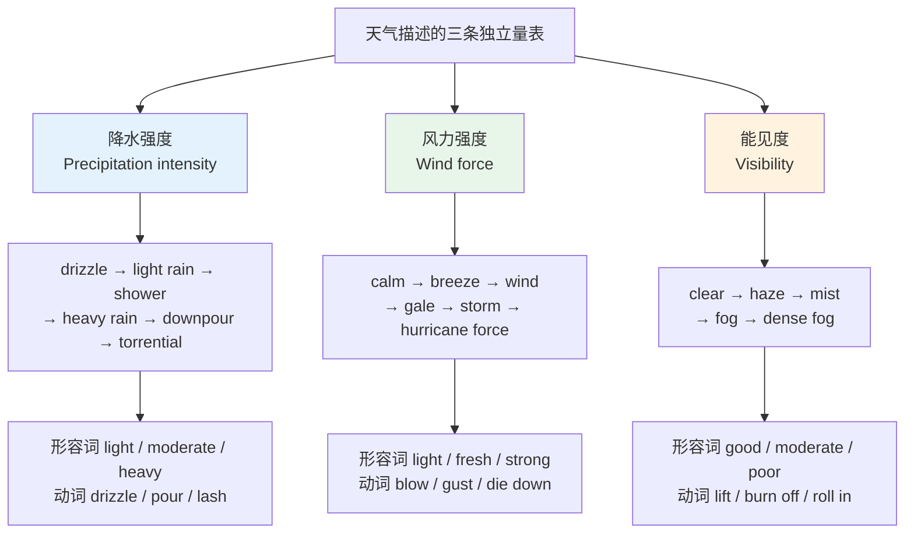
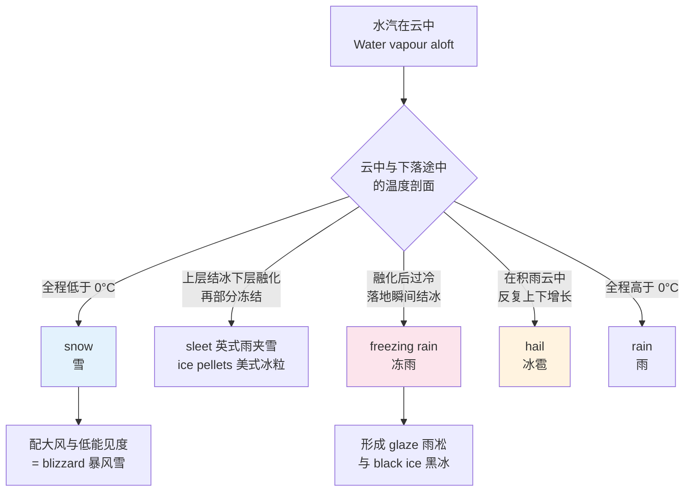
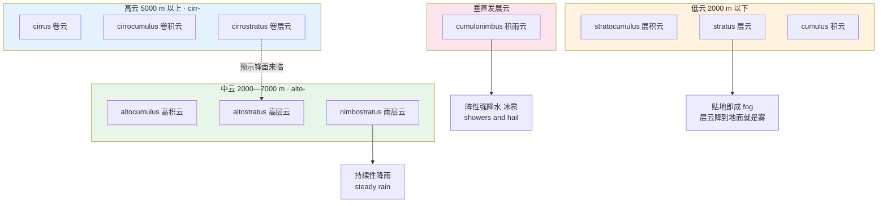
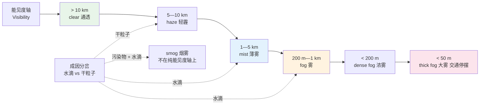
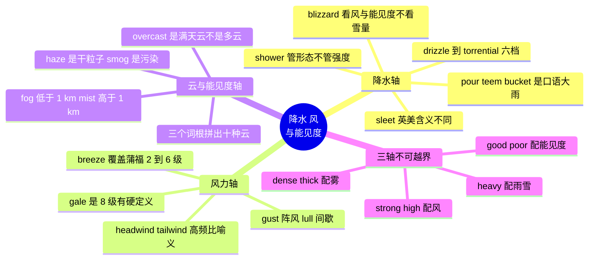

# 降水、风与云雾能见度

> [!info] 本篇定位
>
> 上一篇 `01.基础天气词与冷热强度阶梯` 处理的是温度这一条轴。本篇接手另外三条：**水落下来的强度**、**空气流动的强度**、**看得多远**。
>
> 三条轴各自有一套完整的词，彼此不能混用。`heavy` 修饰雨，不修饰风；`strong` 修饰风，不修饰雨；`poor` 修饰能见度，不修饰前面两个。中文里「大」可以同时修饰雨、风、雾，英语里三个位置是三个不同的词——这是本篇要拆掉的最大一块干扰。
>
> 读完你能做到三件事：看天气预报原文时知道 `scattered showers` 和 `persistent rain` 意味着今天要不要带伞；读到 `gale-force winds gusting to 60 mph` 时知道那是几级风；在航空、航海、户外运动这类文档里看懂 `visibility 800 m in fog` 这种写法。

---

## 1. 本篇导读：把「大」拆成三条量表

中文母语者说天气时，形容词库其实非常小：大雨、大风、大雾，一个「大」字通吃。英语在这三处用的是三套完全不重叠的词，而且每一套内部还有五到六档强度分级。

三条量表的独立性可以从一句话看出来：`It was a still, misty morning with heavy rain overnight.`（清晨无风、有薄雾，夜里下过大雨。）风力档位是最低的 `still`，能见度档位是中间的 `misty`，降水档位是偏高的 `heavy`。三个档位互不牵连。



上图是本篇的骨架。三条量表各占一列，从上到下分别是「档位词」和「配套的形容词、动词」。注意第三行——每条量表配的形容词和动词都不一样，把 `heavy` 拿去修饰 `wind`（写成 `heavy wind`）就是典型的越轴错误，母语者会立刻听出不对。

本篇的编排按三条轴顺序推进：第 2 到第 5 节走降水轴，第 6 到第 8 节走风力轴，第 9 到第 11 节走云与能见度轴。第 12 节把中文母语者最常犯的越轴错误集中列出。

---

## 2. 降水的总称、基本词与量化单位

### 2.1 学术词 precipitation 与日常词 rain

天气学上把所有从云里落到地面的水统称 `precipitation`，中文一般译作「降水」。这个词在日常对话里几乎不用——没人会说 `There's precipitation outside`，但读气象报告、看天气 API 的字段名、读技术文档时它是标准词。

| 英文 | 英式音标 | 美式音标 | 词性 | 中文 | 搭配与说明 |
| --- | --- | --- | --- | --- | --- |
| **precipitation** | /prɪˌsɪpɪˈteɪʃn/ | /prɪˌsɪpɪˈteɪʃn/ | n. | 降水（总称） | 不可数；涵盖雨雪雹霰。天气 API 里常缩写为 precip |
| **precipitate** | /prɪˈsɪpɪteɪt/ | /prɪˈsɪpɪteɪt/ | v. | 降下（水汽） | 化学里是「沉淀」，同一词根 |
| **rain** | /reɪn/ | /reɪn/ | n./v. | 雨；下雨 | 名词不可数；动词用形式主语 it rains |
| **rainfall** | /ˈreɪnfɔːl/ | /ˈreɪnfɔːl/ | n. | 降雨量 | 强调累计量：annual rainfall 年降雨量 |
| **raindrop** | /ˈreɪndrɒp/ | /ˈreɪndrɑːp/ | n. | 雨滴 | 可数 |
| **moisture** | /ˈmɔɪstʃə/ | /ˈmɔɪstʃər/ | n. | 水汽；湿气 | 不可数；moisture in the air |
| **condensation** | /ˌkɒndenˈseɪʃn/ | /ˌkɑːndenˈseɪʃn/ | n. | 凝结 | 窗上的水雾也叫 condensation |
| **evaporate** | /ɪˈvæpəreɪt/ | /ɪˈvæpəreɪt/ | v. | 蒸发 | 名词 evaporation |
| **humidity** | /hjuːˈmɪdəti/ | /hjuːˈmɪdəti/ | n. | 湿度 | relative humidity 相对湿度 |
| **humid** | /ˈhjuːmɪd/ | /ˈhjuːmɪd/ | adj. | 潮湿闷热的 | 只用于空气，不用于物体表面 |
| **damp** | /dæmp/ | /dæmp/ | adj./n. | 潮的；潮气 | 用于物体：damp clothes 潮衣服 |
| **muggy** | /ˈmʌɡi/ | /ˈmʌɡi/ | adj. | 闷湿的 | 口语；humid 的口语版，带不适感 |
| **dank** | /dæŋk/ | /dæŋk/ | adj. | 阴湿的 | 贬义，多形容地下室、洞穴 |
| **gauge** | /ɡeɪdʒ/ | /ɡeɪdʒ/ | n. | 量器 | rain gauge 雨量计；注意拼写不是 guage |

> [!warning] humid、damp、wet 不能互换
>
> 三个词分工很清楚，中文都可能译成「潮」「湿」。
>
> - **humid** 只说空气：`a humid afternoon`（闷湿的下午）。不能说 ~~humid towel~~。
> - **damp** 说物体含有少量水分：`damp clothes`（没干透的衣服）、`a damp wall`（返潮的墙）。
> - **wet** 说物体明显湿了：`wet clothes`（湿透的衣服）、`wet roads`（湿路面）。
>
> - ❌ ~~The weather is very wet today.~~（母语者会理解成「今天多雨」，而不是「空气潮」）
> - ✅ **It's really humid today.**（今天很闷湿）
> - ✅ **It's been wet all week.**（这周一直在下雨，wet 指多雨，是固定用法）

`wet` 用于 weather 时指的是「多雨的」，不是「潮湿的」——`a wet summer` 是多雨的夏天。这个用法很高频，值得单独记住。

### 2.2 降雨量的量化表达

技术文档和新闻里的降雨量有固定说法。英美单位不同：英国及大部分国家用毫米，美国用英寸。

| 英文 | 英式音标 | 美式音标 | 词性 | 中文 | 搭配与说明 |
| --- | --- | --- | --- | --- | --- |
| **millimetre** | /ˈmɪlɪmiːtə/ | — | n. | 毫米（英式拼写） | 缩写 mm |
| **millimeter** | — | /ˈmɪləmiːtər/ | n. | 毫米（美式拼写） | 同一词，拼写差异见 17 章 |
| **inch** | /ɪntʃ/ | /ɪntʃ/ | n. | 英寸 | 复数 inches；1 inch ≈ 25.4 mm |
| **accumulate** | /əˈkjuːmjəleɪt/ | /əˈkjuːmjəleɪt/ | v. | 累积 | rainfall accumulating to 30 mm |
| **total** | /ˈtəʊtl/ | /ˈtoʊtl/ | n./v. | 总量；总计 | rainfall totals 降雨总量 |
| **average** | /ˈævərɪdʒ/ | /ˈævərɪdʒ/ | n./adj. | 平均值 | above average rainfall 高于平均降雨量 |
| **record** | /ˈrekɔːd/ | /ˈrekərd/ | n. | 纪录 | 名词重音在前，动词 /rɪˈkɔːd/ 在后 |

> [!example] 降雨量的四种标准说法
>
> - We had **30 millimetres of rain** in six hours.
>   - 六小时内下了三十毫米的雨。
> - Rainfall **totals** could reach **two inches** by tonight.
>   - 到今晚累计降雨量可能达到两英寸。
> - This has been the wettest April **on record**.
>   - 这是有记录以来最湿的四月。
> - Rainfall is running **well above average** for the season.
>   - 本季降雨量远高于平均水平。

---

## 3. 雨的强度梯度：从 drizzle 到 torrential

### 3.1 六档梯度

英语描述雨的强度不是靠一个形容词加程度副词，而是有一批各占一档的独立名词。这是本节的核心。

| 英文 | 英式音标 | 美式音标 | 词性 | 中文 | 搭配与说明 |
| --- | --- | --- | --- | --- | --- |
| **drizzle** | /ˈdrɪzl/ | /ˈdrɪzl/ | n./v. | 毛毛雨；下毛毛雨 | 最弱一档，雨滴细到几乎不用打伞 |
| **drizzly** | /ˈdrɪzli/ | /ˈdrɪzli/ | adj. | 下毛毛雨的 | a drizzly grey morning |
| **light rain** | /laɪt reɪn/ | /laɪt reɪn/ | n. | 小雨 | 预报标准档位词 |
| **shower** | /ˈʃaʊə/ | /ˈʃaʊər/ | n. | 阵雨 | 强调**时间短、来去快**，不强调雨量 |
| **showery** | /ˈʃaʊəri/ | /ˈʃaʊəri/ | adj. | 阵雨性的 | showery weather 阵雨天气 |
| **moderate rain** | /ˈmɒdərət reɪn/ | /ˈmɑːdərət reɪn/ | n. | 中雨 | 预报标准档位词 |
| **steady rain** | /ˈstedi reɪn/ | /ˈstedi reɪn/ | n. | 持续稳定的雨 | 强调不间断，与 shower 相对 |
| **heavy rain** | /ˈhevi reɪn/ | /ˈhevi reɪn/ | n. | 大雨 | 最常用的「大雨」说法 |
| **downpour** | /ˈdaʊnpɔː/ | /ˈdaʊnpɔːr/ | n. | 倾盆大雨 | 可数：a sudden downpour |
| **cloudburst** | /ˈklaʊdbɜːst/ | /ˈklaʊdbɜːrst/ | n. | 骤雨；暴雨 | 强调突发且集中在小范围 |
| **torrential** | /təˈrenʃl/ | /təˈrenʃl/ | adj. | 倾泻般的 | 几乎只搭配 rain：torrential rain |
| **torrent** | /ˈtɒrənt/ | /ˈtɔːrənt/ | n. | 急流；洪流 | torrents of rain；也说数据洪流 |
| **deluge** | /ˈdeljuːdʒ/ | /ˈdeljuːdʒ/ | n. | 大洪水；暴雨 | 书面语，程度高于 downpour |
| **monsoon** | /mɒnˈsuːn/ | /mɑːnˈsuːn/ | n. | 季风；季风雨 | 特指南亚东亚季风，不是泛指暴雨 |

```text
drizzle → light rain → moderate rain → heavy rain → downpour → torrential rain
 毛毛雨    小雨         中雨            大雨        倾盆大雨    暴雨
  ↑                                                              ↑
 几乎不用打伞                                          道路排水来不及 涉水风险
```

`shower` 严格说不在这条强度线上。它描述的是**持续时间和分布**——一场雨来得快去得快、天空局部下、别处不下，就叫 shower，哪怕它下的那几分钟雨很大。所以预报里会出现 `heavy showers`（强阵雨）这种组合，`heavy` 管强度，`showers` 管形态，两个维度叠加，不矛盾。

同理，`steady rain` 也是形态词而非强度词，它的反义不是「小雨」而是 `intermittent rain`（时下时停）。中文母语者常把「中雨」直接对应到 shower，实际上两者一个在强度轴、一个在形态轴，落点完全不同。

### 3.2 shower 的两个维度与预报常用组合

`shower` 是天气预报里出现频率最高的词之一，配套的修饰语有一整套。

| 英文 | 英式音标 | 美式音标 | 词性 | 中文 | 搭配与说明 |
| --- | --- | --- | --- | --- | --- |
| **scattered** | /ˈskætəd/ | /ˈskætərd/ | adj. | 零星的；分散的 | scattered showers 零星阵雨，最高频组合 |
| **isolated** | /ˈaɪsəleɪtɪd/ | /ˈaɪsəleɪtɪd/ | adj. | 孤立的 | isolated showers 比 scattered 更稀疏 |
| **widespread** | /ˈwaɪdspred/ | /ˈwaɪdspred/ | adj. | 大范围的 | widespread rain 大范围降雨 |
| **intermittent** | /ˌɪntəˈmɪtənt/ | /ˌɪntərˈmɪtənt/ | adj. | 间歇的 | intermittent rain 时下时停 |
| **persistent** | /pəˈsɪstənt/ | /pərˈsɪstənt/ | adj. | 持续不断的 | persistent rain 连绵不停 |
| **occasional** | /əˈkeɪʒənl/ | /əˈkeɪʒənl/ | adj. | 偶尔的 | occasional showers |
| **prolonged** | /prəˈlɒŋd/ | /prəˈlɔːŋd/ | adj. | 长时间的 | prolonged heavy rain |
| **outbreak** | /ˈaʊtbreɪk/ | /ˈaʊtbreɪk/ | n. | 一阵；爆发 | outbreaks of rain 是英式预报套话 |
| **spell** | /spel/ | /spel/ | n. | 一段时期 | a wet spell 一段多雨期 |
| **patchy** | /ˈpætʃi/ | /ˈpætʃi/ | adj. | 零散的；不均匀的 | patchy rain 局部有雨 |

> [!example] 预报原文里的四种组合读法
>
> - **Scattered showers** are expected this afternoon.
>   - 今天下午有零星阵雨。（会下，但不一定下到你头上；伞可带可不带）
> - **Persistent heavy rain** will continue into the evening.
>   - 持续大雨将延续到晚间。（一直下，必须带伞）
> - **Outbreaks of rain**, heavy at times, moving east.
>   - 有阵雨，局部时段较大，自西向东移动。（英式预报的标准句式）
> - Cloudy with **occasional drizzle**.
>   - 多云，偶有毛毛雨。（几乎不用打伞）

> [!tip] 判断该不该带伞的三个关键词
>
> 只看三个词就够了：
>
> 1. 出现 **persistent / prolonged / widespread** → 带伞，而且带大的。
> 2. 出现 **scattered / isolated / occasional** → 带折叠伞，多半用不上。
> 3. 出现 **drizzle** 且没有其他修饰 → 带帽子就行。
>
> 剩下的词都是在这三档之间微调。

---

## 4. 描写下雨的动词与短语

### 4.1 从轻到重的动词序列

英语描写下雨大量依赖动词，而不是「下 + 形容词 + 雨」的结构。这一组动词各自带着不同的力度和声音意象，是英语天气表达最生动的部分。

| 英文 | 英式音标 | 美式音标 | 词性 | 中文 | 搭配与说明 |
| --- | --- | --- | --- | --- | --- |
| **spit** | /spɪt/ | /spɪt/ | v. | 飘细雨 | 英式口语：It's spitting.（飘着雨点） |
| **drip** | /drɪp/ | /drɪp/ | v. | 滴 | 屋檐滴水，不用于天上下雨 |
| **trickle** | /ˈtrɪkl/ | /ˈtrɪkl/ | v./n. | 细流；缓缓流 | 雨水沿玻璃流下 |
| **patter** | /ˈpætə/ | /ˈpætər/ | v./n. | 淅沥作响 | the patter of rain on the roof |
| **spatter** | /ˈspætə/ | /ˈspætər/ | v. | 溅洒 | rain spattered the window |
| **splash** | /splæʃ/ | /splæʃ/ | v./n. | 溅；水花 | 踩水坑的动作 |
| **fall** | /fɔːl/ | /fɔːl/ | v. | 降下 | 中性书面：rain fell overnight |
| **pour** | /pɔː/ | /pɔːr/ | v. | 倾泻 | It's pouring. 是「大雨」的最常用说法 |
| **teem** | /tiːm/ | /tiːm/ | v. | 倾盆而下 | 英式：It's teeming down. |
| **bucket** | /ˈbʌkɪt/ | /ˈbʌkɪt/ | v. | 瓢泼 | 英式口语：It's bucketing down. |
| **lash** | /læʃ/ | /læʃ/ | v. | 抽打 | rain lashing the windows，带风向意味 |
| **pelt** | /pelt/ | /pelt/ | v. | 猛砸 | pelting rain；也说 pelting down |
| **batter** | /ˈbætə/ | /ˈbætər/ | v. | 拍打；重创 | storms battering the coast |
| **hammer** | /ˈhæmə/ | /ˈhæmər/ | v. | 猛敲 | rain hammering on the roof |
| **drench** | /drentʃ/ | /drentʃ/ | v. | 淋透 | 常用被动：I got drenched. |
| **soak** | /səʊk/ | /soʊk/ | v. | 浸湿 | soaked through 湿透了 |

> [!example] 同一场雨的六种强度说法
>
> - It's **spitting** — we can still walk.
>   - 就飘点雨，还能走。
> - It's **drizzling**, take a hood.
>   - 下毛毛雨，戴个帽子吧。
> - It **started raining** around noon.
>   - 中午前后开始下雨了。（中性，最安全）
> - It's **pouring** out there.
>   - 外面下大雨呢。（最高频的「大雨」口语）
> - It's absolutely **bucketing down**.
>   - 雨下得跟倒的一样。（英式，程度很高）
> - The rain was **lashing** the windows all night.
>   - 雨整夜抽打着窗户。（书面，带风）

### 4.2 雨停与转晴的动词短语

雨停也有一套专门的动词短语，用得对能显著提高自然度。

| 英文 | 英式音标 | 美式音标 | 词性 | 中文 | 搭配与说明 |
| --- | --- | --- | --- | --- | --- |
| **let up** | /let ʌp/ | /let ʌp/ | phr.v. | （雨）变小、停下 | The rain finally let up. |
| **ease off** | /iːz ɒf/ | /iːz ɔːf/ | phr.v. | 减弱 | The rain is easing off. |
| **die down** | /daɪ daʊn/ | /daɪ daʊn/ | phr.v. | 减弱平息 | 更常用于风，也可用于雨 |
| **clear up** | /klɪər ʌp/ | /klɪr ʌp/ | phr.v. | 转晴 | It should clear up by noon. |
| **brighten up** | /ˈbraɪtn ʌp/ | /ˈbraɪtn ʌp/ | phr.v. | 转亮 | 英式预报常用 |
| **set in** | /set ɪn/ | /set ɪn/ | phr.v. | （坏天气）开始并持续 | The rain has set in for the day. |
| **blow over** | /bləʊ ˈəʊvə/ | /bloʊ ˈoʊvər/ | phr.v. | （风雨）过去 | The storm blew over by dawn. |
| **hold off** | /həʊld ɒf/ | /hoʊld ɔːf/ | phr.v. | （雨）暂时不来 | The rain held off until we got home. |

> [!warning] set in 是个陷阱
>
> `set in` 只用于**不好的、会持续一阵子**的状况：雨、雾、寒冷、腐烂、恐慌。不能用于好天气。
>
> - ❌ ~~The sunshine has set in.~~
> - ✅ **The rain has set in.**（雨下起来了，短时间停不了）
> - ✅ **Winter is setting in.**（入冬了）
>
> 想说好天气持续，用 `settle`：`The weather has settled.`（天气稳定下来了。）

### 4.3 雨后的地面状态

| 英文 | 英式音标 | 美式音标 | 词性 | 中文 | 搭配与说明 |
| --- | --- | --- | --- | --- | --- |
| **puddle** | /ˈpʌdl/ | /ˈpʌdl/ | n. | 水坑 | 可数：step in a puddle |
| **soggy** | /ˈsɒɡi/ | /ˈsɑːɡi/ | adj. | 湿软的 | soggy ground；也说 soggy chips |
| **waterlogged** | /ˈwɔːtəlɒɡd/ | /ˈwɔːtərlɔːɡd/ | adj. | 积水的；被水浸透的 | 球场因积水停赛的标准词 |
| **slippery** | /ˈslɪpəri/ | /ˈslɪpəri/ | adj. | 湿滑的 | slippery roads |
| **greasy** | /ˈɡriːsi/ | /ˈɡriːsi/ | adj. | 油滑的 | 赛车报道里指初雨后的路面 |
| **runoff** | /ˈrʌnɒf/ | /ˈrʌnɔːf/ | n. | 径流 | 城市排水与水文文档常见 |
| **drainage** | /ˈdreɪnɪdʒ/ | /ˈdreɪnɪdʒ/ | n. | 排水 | drainage system 排水系统 |
| **gutter** | /ˈɡʌtə/ | /ˈɡʌtər/ | n. | 檐槽；路边水沟 | 屋顶排水槽 |
| **umbrella** | /ʌmˈbrelə/ | /ʌmˈbrelə/ | n. | 伞 | 重音在第二音节，不是首音节 |
| **raincoat** | /ˈreɪnkəʊt/ | /ˈreɪnkoʊt/ | n. | 雨衣 | 英式口语也说 mac |
| **waterproof** | /ˈwɔːtəpruːf/ | /ˈwɔːtərpruːf/ | adj./n. | 防水的；防水外套 | 与 water-resistant 有等级差别 |

---

## 5. 固态与混合降水：sleet、hail、snow、blizzard

### 5.1 三个容易混淆的核心词

`sleet`、`hail`、`snow` 是三种物理机制完全不同的降水，中文分别叫「雨夹雪／冻雨」「冰雹」「雪」。麻烦的是 `sleet` 在英美两地含义不同。

| 英文 | 英式音标 | 美式音标 | 词性 | 中文 | 搭配与说明 |
| --- | --- | --- | --- | --- | --- |
| **sleet** | /sliːt/ | /sliːt/ | n./v. | 雨夹雪（英）／冰粒（美） | 英美含义不同，见下方专项说明 |
| **hail** | /heɪl/ | /heɪl/ | n./v. | 冰雹；下冰雹 | 不可数；动词 it's hailing |
| **hailstone** | /ˈheɪlstəʊn/ | /ˈheɪlstoʊn/ | n. | 冰雹粒 | 可数，用来说尺寸 |
| **hailstorm** | /ˈheɪlstɔːm/ | /ˈheɪlstɔːrm/ | n. | 雹暴 | 可数 |
| **snow** | /snəʊ/ | /snoʊ/ | n./v. | 雪；下雪 | 不可数；it's snowing |
| **snowfall** | /ˈsnəʊfɔːl/ | /ˈsnoʊfɔːl/ | n. | 降雪；降雪量 | heavy snowfall |
| **snowflake** | /ˈsnəʊfleɪk/ | /ˈsnoʊfleɪk/ | n. | 雪花 | 可数 |
| **snowstorm** | /ˈsnəʊstɔːm/ | /ˈsnoʊstɔːrm/ | n. | 暴风雪 | 比 blizzard 弱一档 |
| **blizzard** | /ˈblɪzəd/ | /ˈblɪzərd/ | n. | 暴风雪（强风+大雪+低能见度） | 有严格气象定义，不是「雪很大」的同义词 |
| **flurry** | /ˈflʌri/ | /ˈflɜːri/ | n. | 小雪阵 | 常用复数：snow flurries |
| **freezing rain** | /ˈfriːzɪŋ reɪn/ | /ˈfriːzɪŋ reɪn/ | n. | 冻雨 | 落地成冰，最危险的一种降水 |
| **graupel** | /ˈɡraʊpl/ | /ˈɡraʊpl/ | n. | 霰 | 德语借词，专业气象文本里出现 |

> [!warning] sleet 的英美分歧
>
> 这是英美气象术语差别最大的一个词，读预报时必须先确定是哪边的文本。
>
> - **英式 sleet**：雨和雪的混合体，落地是半融化的湿雪水。中文对应「雨夹雪」。
> - **美式 sleet**：雨滴在下落途中冻成的**小冰粒**（美国气象局称 ice pellets），打在地上会弹。中文对应「冰粒」。
> - 美式表达「雨夹雪」用 **rain mixed with snow** 或 **wintry mix**。
>
> - ❌ 把英国预报里的 sleet 理解成硬冰粒
> - ✅ 看到 sleet 先判断文本来源；不确定时用 **wintry mix**（美）或 **rain and snow mixed**（通用），意思不会被误解

### 5.2 blizzard 有硬性判据

`blizzard` 在中文里常被当成「大雪」的高级说法随便用，但它在英美气象定义里是有量化门槛的。

美国气象局的定义要求同时满足三条：持续风速或频繁阵风达到每小时 35 英里以上；有雪（下的或被风卷起的）导致能见度降到四分之一英里以下；这个状态持续三小时以上。也就是说，**blizzard 的核心是风和能见度，不是雪量**——一场无风的鹅毛大雪不叫 blizzard。

| 英文 | 英式音标 | 美式音标 | 词性 | 中文 | 搭配与说明 |
| --- | --- | --- | --- | --- | --- |
| **whiteout** | /ˈwaɪtaʊt/ | /ˈwaɪtaʊt/ | n. | 白毛风；乳白天空 | 能见度归零、失去地平线参照 |
| **snowdrift** | /ˈsnəʊdrɪft/ | /ˈsnoʊdrɪft/ | n. | 雪堆 | 被风堆积形成的 |
| **drifting snow** | /ˈdrɪftɪŋ snəʊ/ | /ˈdrɪftɪŋ snoʊ/ | n. | 吹雪 | 已落地的雪被风重新卷起 |
| **blowing snow** | /ˈbləʊɪŋ snəʊ/ | /ˈbloʊɪŋ snoʊ/ | n. | 高吹雪 | 卷起高度超过视线水平 |
| **slush** | /slʌʃ/ | /slʌʃ/ | n. | 雪泥 | 不可数；踩上去很脏的半融雪 |
| **slushy** | /ˈslʌʃi/ | /ˈslʌʃi/ | adj. | 雪泥状的 | slushy pavements |
| **powder** | /ˈpaʊdə/ | /ˈpaʊdər/ | n. | 粉雪 | 滑雪术语：fresh powder |
| **crust** | /krʌst/ | /krʌst/ | n. | 雪壳 | 表层重新冻结的硬壳 |
| **accumulation** | /əˌkjuːmjəˈleɪʃn/ | /əˌkjuːmjəˈleɪʃn/ | n. | 积雪量 | 美式预报常用：3 inches of accumulation |
| **settle** | /ˈsetl/ | /ˈsetl/ | v. | （雪）积住不化 | 英式：the snow won't settle |

> [!tip] settle 的这个义项很实用
>
> 英式天气预报里 `Will the snow settle?` 问的是「雪会不会积起来」。落在温暖地面立刻化掉的雪叫 `not settling`；能在地面留住的叫 `settling`。
>
> - **Snow is falling but not settling on the roads.**
>   - 在下雪，但路面上积不住。
>
> 美式表达同一件事用 `stick`：`The snow isn't sticking.`

### 5.3 冰、霜与融化

| 英文 | 英式音标 | 美式音标 | 词性 | 中文 | 搭配与说明 |
| --- | --- | --- | --- | --- | --- |
| **frost** | /frɒst/ | /frɔːst/ | n./v. | 霜；结霜 | ground frost 地面霜，air frost 空气霜 |
| **hoarfrost** | /ˈhɔːfrɒst/ | /ˈhɔːrfrɔːst/ | n. | 白霜；雾凇 | 书面语，日常说 heavy frost |
| **frosty** | /ˈfrɒsti/ | /ˈfrɔːsti/ | adj. | 结霜的；严寒的 | a frosty morning |
| **ice** | /aɪs/ | /aɪs/ | n. | 冰 | 不可数 |
| **icy** | /ˈaɪsi/ | /ˈaɪsi/ | adj. | 结冰的；冰冷的 | icy roads |
| **black ice** | /blæk aɪs/ | /blæk aɪs/ | n. | 黑冰；薄冰 | 路面透明薄冰，看不见所以最危险 |
| **glaze** | /ɡleɪz/ | /ɡleɪz/ | n./v. | 雨凇；结冰层 | 冻雨形成的透明冰壳 |
| **icicle** | /ˈaɪsɪkl/ | /ˈaɪsɪkl/ | n. | 冰锥；冰溜子 | 可数 |
| **thaw** | /θɔː/ | /θɔː/ | n./v. | 解冻；融化期 | a thaw set in 开始解冻 |
| **melt** | /melt/ | /melt/ | v. | 融化 | the snow melted 强调过程 |
| **de-ice** | /ˌdiːˈaɪs/ | /ˌdiːˈaɪs/ | v. | 除冰 | 航空高频：de-icing fluid 除冰液 |
| **grit** | /ɡrɪt/ | /ɡrɪt/ | n./v. | 砂砾；撒砂防滑 | 英式：gritting lorries 撒盐车 |
| **shovel** | /ˈʃʌvl/ | /ˈʃʌvl/ | n./v. | 铲；铲雪 | 美式：shovel the driveway |
| **plough** | /plaʊ/ | — | n./v. | 犁；扫雪车（英式拼写） | snowplough |
| **plow** | — | /plaʊ/ | n./v. | 扫雪车（美式拼写） | snowplow；同词不同拼 |



上图用温度剖面把五种降水串成一棵判定树。这张图解释了一个词汇问题：为什么 `hail` 和 `sleet` 不能互译成「冰雹」和「雨夹雪」就完事。`hail` 只在积雨云里形成，所以它多发于**夏季雷暴**而不是冬天；`sleet` 和 `freezing rain` 才是冬季现象。中文母语者常以为冰雹是冬天的事，这个直觉在英语语境里会导致理解偏差——读到 `hail` 出现在七月的报道时不要以为是笔误。

---

## 6. 风：从 calm 到 gale 的强度词

### 6.1 六档风力名词

风力这条轴的词比降水更麻烦，因为英语用**不同的名词**表示不同风力，而不是靠形容词。中文的「微风、大风、狂风」三档在英语里要展开成六到八档。

| 英文 | 英式音标 | 美式音标 | 词性 | 中文 | 搭配与说明 |
| --- | --- | --- | --- | --- | --- |
| **calm** | /kɑːm/ | /kɑːm/ | adj./n. | 无风的；平静 | l 不发音；a dead calm 完全无风 |
| **still** | /stɪl/ | /stɪl/ | adj. | 静止无风的 | a still evening；比 calm 更文学 |
| **light air** | /laɪt eə/ | /laɪt er/ | n. | 软风 | 蒲福 1 级的官方名称 |
| **breeze** | /briːz/ | /briːz/ | n. | 微风；和风 | 覆盖蒲福 2—6 级，范围很宽 |
| **breezy** | /ˈbriːzi/ | /ˈbriːzi/ | adj. | 有微风的 | 语气偏正面：a breezy afternoon |
| **wind** | /wɪnd/ | /wɪnd/ | n. | 风（总称） | 名词读 /wɪnd/，动词「缠绕」读 /waɪnd/ |
| **windy** | /ˈwɪndi/ | /ˈwɪndi/ | adj. | 有风的；风大的 | 最通用的「风大」说法 |
| **blustery** | /ˈblʌstəri/ | /ˈblʌstəri/ | adj. | 风势强劲且忽大忽小 | 预报高频词，带阵风意味 |
| **gale** | /ɡeɪl/ | /ɡeɪl/ | n. | 强风；大风（蒲福 8 级） | 有严格定义，不是随便的「大风」 |
| **gale-force** | /ˈɡeɪl fɔːs/ | /ˈɡeɪl fɔːrs/ | adj. | 大风级的 | gale-force winds |
| **storm** | /stɔːm/ | /stɔːrm/ | n. | 风暴（蒲福 10 级） | 日常也泛指暴风雨，见下一篇 |
| **gust** | /ɡʌst/ | /ɡʌst/ | n./v. | 阵风；刮阵风 | gusting to 50 mph 阵风达 50 英里 |
| **gusty** | /ˈɡʌsti/ | /ˈɡʌsti/ | adj. | 阵风频繁的 | gusty conditions |
| **squall** | /skwɔːl/ | /skwɔːl/ | n. | 飑；短时强风 | 常伴降水：a rain squall |
| **lull** | /lʌl/ | /lʌl/ | n. | 间歇；风暂停 | a lull in the wind |
| **draught** | /drɑːft/ | — | n. | 穿堂风（英式拼写） | 室内冷风；美式拼 draft |
| **draft** | — | /dræft/ | n. | 穿堂风（美式拼写） | 同词不同拼，另有「草稿」义 |
| **zephyr** | /ˈzefə/ | /ˈzefər/ | n. | 和煦西风 | 文学词，日常不用 |

> [!warning] breeze 与 gale 的落差比想象中大
>
> 中文母语者容易把 `breeze` 当成「有点风」、把 `gale` 当成「风挺大」，结果在描述里差出好几个量级。
>
> - **breeze** 覆盖蒲福 2 至 6 级，跨度从「树叶微动」一直到「大树枝摇动、撑伞困难」。所以 `a strong breeze` 已经是很大的风了。
> - **gale** 是蒲福 8 级，风速 34 至 40 节（约 62—74 km/h），足以吹断树枝、显著影响行走。英国气象局发 gale warning 是正式的航海与陆上预警。
>
> - ❌ ~~There was a small gale yesterday.~~（gale 不接 small）
> - ✅ **It was breezy yesterday.**（昨天有点风）
> - ✅ **Gale-force winds hit the coast overnight.**（夜里大风袭击海岸）

### 6.2 风的动词

| 英文 | 英式音标 | 美式音标 | 词性 | 中文 | 搭配与说明 |
| --- | --- | --- | --- | --- | --- |
| **blow** | /bləʊ/ | /bloʊ/ | v. | 吹 | 不规则：blow-blew-blown |
| **pick up** | /pɪk ʌp/ | /pɪk ʌp/ | phr.v. | （风）增强 | The wind is picking up. |
| **die down** | /daɪ daʊn/ | /daɪ daʊn/ | phr.v. | （风）减弱 | The wind died down at dusk. |
| **drop** | /drɒp/ | /drɑːp/ | v. | （风）突然停 | The wind dropped completely. |
| **whip** | /wɪp/ | /wɪp/ | v. | 抽打；卷起 | wind whipping through the streets |
| **howl** | /haʊl/ | /haʊl/ | v. | 呼啸 | the wind howled all night |
| **whistle** | /ˈwɪsl/ | /ˈwɪsl/ | v. | 呼哨 | wind whistling through gaps |
| **rattle** | /ˈrætl/ | /ˈrætl/ | v. | 使咯咯作响 | wind rattling the windows |
| **buffet** | /ˈbʌfɪt/ | /ˈbʌfɪt/ | v. | 反复冲击 | 注意与「自助餐」/ˈbʊfeɪ/ 读音不同 |
| **swirl** | /swɜːl/ | /swɜːrl/ | v. | 打旋 | leaves swirling in the wind |
| **rustle** | /ˈrʌsl/ | /ˈrʌsl/ | v. | 沙沙作响 | wind rustling the leaves |
| **sway** | /sweɪ/ | /sweɪ/ | v. | 摇摆 | trees swaying |
| **uproot** | /ʌpˈruːt/ | /ʌpˈruːt/ | v. | 连根拔起 | winds uprooted trees |

> [!example] 风力从小到大的六句话
>
> - There's a **gentle breeze** off the water.
>   - 水面上有阵和风。
> - It's quite **breezy** on the terrace.
>   - 露台上风挺大的。
> - The wind is really **picking up**.
>   - 风越来越大了。
> - It's **blustery** out — hold on to your hat.
>   - 外面风一阵一阵的，帽子按住。
> - **Gale-force winds** are forecast for tonight.
>   - 预报今晚有大风。
> - The wind was **howling** and **rattling** the windows.
>   - 风整夜呼啸，把窗户吹得咯咯响。

---

## 7. 蒲福风级：把风力词绑到数字上

### 7.1 十三个级别

蒲福风级（the Beaufort scale，/ˈbəʊfət/ · /ˈboʊfərt/）由英国海军将领 Francis Beaufort 于 1805 年提出，用可观察的现象而不是仪器来估计风力，至今仍是航海、航空和天气预报的通用参照。英语里那些风力名词——`light air`、`breeze`、`gale`、`storm`——其实都是这张表上的**官方级别名**，不是随口说的形容词。这是理解它们精确程度的关键。

| 级 | 英文名称 | 风速（节） | 风速（km/h） | 陆上征象 | 中文 |
| --- | --- | --- | --- | --- | --- |
| 0 | Calm | < 1 | < 1 | 烟直上 | 无风 |
| 1 | Light air | 1—3 | 2—5 | 烟能指示风向 | 软风 |
| 2 | Light breeze | 4—6 | 6—11 | 面部感觉有风，树叶微响 | 轻风 |
| 3 | Gentle breeze | 7—10 | 12—19 | 树叶与小枝摇动，旗帜展开 | 微风 |
| 4 | Moderate breeze | 11—16 | 20—28 | 吹起地面灰尘与纸张 | 和风 |
| 5 | Fresh breeze | 17—21 | 29—38 | 有叶小树摇摆 | 清劲风 |
| 6 | Strong breeze | 22—27 | 39—49 | 大树枝摇动，撑伞困难 | 强风 |
| 7 | High wind / Near gale | 28—33 | 50—61 | 全树摇动，迎风行走费力 | 疾风 |
| 8 | Gale | 34—40 | 62—74 | 小树枝折断，行走明显受阻 | 大风 |
| 9 | Strong gale | 41—47 | 75—88 | 建筑物轻微损坏，瓦片掀落 | 烈风 |
| 10 | Storm | 48—55 | 89—102 | 树木连根拔起，结构性损坏 | 狂风 |
| 11 | Violent storm | 56—63 | 103—117 | 大范围破坏 | 暴风 |
| 12 | Hurricane force | ≥ 64 | ≥ 118 | 毁灭性破坏 | 飓风级 |

十三个级别可以压缩成四段来记，每段对应一种日常说法。

| 级别段 | 官方名称 | 日常说法 | 实感 |
| --- | --- | --- | --- |
| 0—1 | calm, light air | still / calm | 基本无感 |
| 2—6 | light / gentle / moderate / fresh / strong breeze | breezy | 从树叶微动到撑伞困难 |
| 7—9 | near gale, gale, strong gale | windy / blustery，预报说 gale-force | 行走受阻，树枝折断 |
| 10—12 | storm, violent storm, hurricane force | 进入灾害天气范畴 | 结构性破坏 |

真正需要留意的是中间那个 `breeze` 家族——五个级别全部叫 breeze，只靠前面的形容词区分，这是英语风力词最反直觉的地方。`strong breeze`（6 级，39—49 km/h）在中文语感里已经是「大风」了，但英语还没轮到 `gale`。这个错位是中文母语者描述风力时失准的主要来源。

### 7.2 风速的单位与量化表达

| 英文 | 英式音标 | 美式音标 | 词性 | 中文 | 搭配与说明 |
| --- | --- | --- | --- | --- | --- |
| **knot** | /nɒt/ | /nɑːt/ | n. | 节（海里/小时） | 航海航空标准单位；1 knot ≈ 1.852 km/h |
| **mile per hour** | — | — | n. | 英里每小时 | 缩写 mph，英美陆上常用 |
| **wind speed** | /ˈwɪnd spiːd/ | /ˈwɪnd spiːd/ | n. | 风速 | sustained wind speed 持续风速 |
| **sustained** | /səˈsteɪnd/ | /səˈsteɪnd/ | adj. | 持续的 | 与 gust 相对，通常取十分钟平均 |
| **anemometer** | /ˌænɪˈmɒmɪtə/ | /ˌænəˈmɑːmɪtər/ | n. | 风速计 | 气象站标配仪器 |
| **weather vane** | /ˈweðə veɪn/ | /ˈweðər veɪn/ | n. | 风向标 | 也说 wind vane |
| **barometer** | /bəˈrɒmɪtə/ | /bəˈrɑːmɪtər/ | n. | 气压计 | 形容词 barometric |
| **pressure** | /ˈpreʃə/ | /ˈpreʃər/ | n. | 气压 | low pressure 低压，多雨多风 |
| **front** | /frʌnt/ | /frʌnt/ | n. | 锋 | cold front 冷锋，warm front 暖锋 |
| **wind chill** | /ˈwɪnd tʃɪl/ | /ˈwɪnd tʃɪl/ | n. | 风寒效应；体感温度 | 详见上一篇的体感温度一节 |

> [!example] 风速的四种标准写法
>
> - Winds of **25 to 30 mph**, **gusting to 45**.
>   - 风速每小时 25 至 30 英里，阵风达 45 英里。（gusting to 后省略单位是常规写法）
> - **Sustained winds** near **40 knots**.
>   - 持续风速接近 40 节。
> - **Gale-force 8** expected in coastal waters.
>   - 沿海水域预计有八级大风。
> - Southwesterly **5 to 7, occasionally gale 8 later**.
>   - 西南风 5 至 7 级，稍晚间或达 8 级大风。（英国航海预报 Shipping Forecast 的固定句式）

---

## 8. 风向、方位词与工程语境里的风

### 8.1 风向的构词规律

英语的风向词有一条硬规则：**风名按风的来向命名**。`a north wind` 是从北边吹来的风，不是吹向北边。中文的「北风」同理，但中文的「西南风」和英语 `southwesterly` 在语序上是相反的——英语先说 south 再说 west。

| 英文 | 英式音标 | 美式音标 | 词性 | 中文 | 搭配与说明 |
| --- | --- | --- | --- | --- | --- |
| **northerly** | /ˈnɔːðəli/ | /ˈnɔːrðərli/ | adj./n. | 北来的（风） | 预报标准词，比 north wind 正式 |
| **southerly** | /ˈsʌðəli/ | /ˈsʌðərli/ | adj./n. | 南来的（风） | 注意读 /ˈsʌð-/ 不是 /ˈsaʊð-/ |
| **easterly** | /ˈiːstəli/ | /ˈiːstərli/ | adj./n. | 东来的（风） | — |
| **westerly** | /ˈwestəli/ | /ˈwestərli/ | adj./n. | 西来的（风） | the prevailing westerlies 盛行西风带 |
| **southwesterly** | /ˌsaʊθˈwestəli/ | /ˌsaʊθˈwestərli/ | adj. | 西南来的 | 英语语序：south + west |
| **prevailing** | /prɪˈveɪlɪŋ/ | /prɪˈveɪlɪŋ/ | adj. | 盛行的 | prevailing wind direction 盛行风向 |
| **veer** | /vɪə/ | /vɪr/ | v. | 风向顺时针转 | 气象专用：wind veering northwest |
| **back** | /bæk/ | /bæk/ | v. | 风向逆时针转 | 与 veer 成对，航海预报常见 |
| **headwind** | /ˈhedwɪnd/ | /ˈhedwɪnd/ | n. | 逆风 | 航空与骑行；也比喻不利因素 |
| **tailwind** | /ˈteɪlwɪnd/ | /ˈteɪlwɪnd/ | n. | 顺风 | 比喻有利因素，商业报道常见 |
| **crosswind** | /ˈkrɒswɪnd/ | /ˈkrɔːswɪnd/ | n. | 侧风 | 航空着陆的关键参数 |
| **windward** | /ˈwɪndwəd/ | /ˈwɪndwərd/ | adj./n. | 迎风的；迎风侧 | 地理与建筑文档常见 |
| **leeward** | /ˈliːwəd/ | /ˈliːwərd/ | adj./n. | 背风的；背风侧 | 航海口语可读 /ˈluːəd/ |
| **updraught** | /ˈʌpdrɑːft/ | — | n. | 上升气流（英式拼写） | 美式 updraft |
| **updraft** | — | /ˈʌpdræft/ | n. | 上升气流（美式拼写） | 雹的形成机制 |
| **downdraught** | /ˈdaʊndrɑːft/ | — | n. | 下沉气流（英式拼写） | 与 updraught 同一套拼写 |
| **downdraft** | — | /ˈdaʊndræft/ | n. | 下沉气流（美式拼写） | 强下沉气流称 microburst |
| **turbulence** | /ˈtɜːbjələns/ | /ˈtɜːrbjələns/ | n. | 湍流；颠簸 | 航空广播高频词 |

> [!warning] headwind 与 tailwind 的比喻义在英文技术与商业文本里非常高频
>
> 这两个词早已越出气象范畴，成为「不利因素／有利因素」的标准比喻，出现在财报、产品文档、工程复盘里。
>
> - **The team faced significant headwinds in Q3.**
>   - 团队在第三季度面临不小的阻力。
> - **Falling hardware costs provided a tailwind for adoption.**
>   - 硬件成本下降为普及提供了助推。
>
> 读技术与商业英文时按气象义理解会完全读不通，遇到这两个词先往比喻义想。

### 8.2 风的比喻用法

英语里 wind 相关的表达大量进入日常语言，这批表达对读原版书很有用。

| 英文 | 英式音标 | 美式音标 | 词性 | 中文 | 搭配与说明 |
| --- | --- | --- | --- | --- | --- |
| **get wind of** | — | — | phr. | 风闻；听到风声 | get wind of a plan |
| **second wind** | — | — | n. | 第二次体力高峰 | 跑步与工作都能用 |
| **take the wind out of** | — | — | phr. | 挫某人的锐气 | 完整说法 take the wind out of sb's sails |
| **throw caution to the wind** | — | — | phr. | 抛开谨慎 | 也说 to the winds |
| **windfall** | /ˈwɪndfɔːl/ | /ˈwɪndfɔːl/ | n. | 意外之财 | 原指被风吹落的果子 |
| **breeze through** | /briːz θruː/ | /briːz θruː/ | phr.v. | 轻松通过 | breeze through the exam |
| **a breeze** | /ə briːz/ | /ə briːz/ | n. | 轻而易举的事 | It was a breeze. |
| **stormy** | /ˈstɔːmi/ | /ˈstɔːrmi/ | adj. | 暴风雨般的；激烈的 | a stormy relationship |

---

## 9. 云：从十种云属到日常云词

### 9.1 三个词根拼出十种云

国际气象界把云分成十个基本云属，全部由三个拉丁词根加上表示高度的前缀组合而成。掌握这三个词根，十个名字全部可推。这是第 15 章词根方法在天气领域的一次预演。

| 词根 | 含义 | 形态特征 | 典型云属 |
| --- | --- | --- | --- |
| **cumul-** | 堆积 heap | 团块状、有明显轮廓 | cumulus, cumulonimbus |
| **strat-** | 层 layer | 铺开成层、轮廓模糊 | stratus, altostratus |
| **cirr-** | 卷发 curl | 纤维状、丝缕状 | cirrus, cirrostratus |
| **nimb-** | 雨 rain | 会下雨 | nimbostratus, cumulonimbus |
| **alto-** | 高（中层前缀） | 2000—7000 米 | altocumulus, altostratus |

| 英文 | 英式音标 | 美式音标 | 词性 | 中文 | 搭配与说明 |
| --- | --- | --- | --- | --- | --- |
| **cirrus** | /ˈsɪrəs/ | /ˈsɪrəs/ | n. | 卷云 | 复数 cirri；高空冰晶，丝缕状 |
| **cirrocumulus** | /ˌsɪrəʊˈkjuːmjələs/ | /ˌsɪroʊˈkjuːmjələs/ | n. | 卷积云 | 俗称 mackerel sky 鱼鳞天 |
| **cirrostratus** | /ˌsɪrəʊˈstreɪtəs/ | /ˌsɪroʊˈstreɪtəs/ | n. | 卷层云 | 太阳周围出现晕环时多为此云 |
| **altocumulus** | /ˌæltəʊˈkjuːmjələs/ | /ˌæltoʊˈkjuːmjələs/ | n. | 高积云 | 中层，一片片羊群状 |
| **altostratus** | /ˌæltəʊˈstreɪtəs/ | /ˌæltoʊˈstreɪtəs/ | n. | 高层云 | 太阳像隔了毛玻璃 |
| **nimbostratus** | /ˌnɪmbəʊˈstreɪtəs/ | /ˌnɪmboʊˈstreɪtəs/ | n. | 雨层云 | 连续性降雨的主力云 |
| **stratocumulus** | /ˌstrætəʊˈkjuːmjələs/ | /ˌstrætoʊˈkjuːmjələs/ | n. | 层积云 | 最常见的云，块状连成片 |
| **stratus** | /ˈstreɪtəs/ | /ˈstreɪtəs/ | n. | 层云 | 亦读 /ˈstrɑːtəs/；贴地时即为雾 |
| **cumulus** | /ˈkjuːmjələs/ | /ˈkjuːmjələs/ | n. | 积云 | 复数 cumuli；晴天的棉花团云 |
| **cumulonimbus** | /ˌkjuːmjələʊˈnɪmbəs/ | /ˌkjuːmjəloʊˈnɪmbəs/ | n. | 积雨云 | 雷暴与冰雹的来源，顶部有砧状结构 |
| **anvil** | /ˈænvl/ | /ˈænvl/ | n. | 砧状云顶 | anvil cloud；铁砧的形状 |
| **contrail** | /ˈkɒntreɪl/ | /ˈkɑːntreɪl/ | n. | 凝结尾迹 | condensation + trail 的缩合 |



上图按高度把十种云分成四组，同时标出三条与降水、能见度的连接线。最值得记住的是右下那条：`stratus`（层云）贴到地面就变成 `fog`（雾）——两者是同一种现象在不同高度上的两个名字。这解释了为什么英语描述雾的动词会用 `lift`（抬升）：雾散不是消失，而是升起来变回了层云。

### 9.2 日常云况词与天空状态

十个云属属于专业词汇。日常对话与预报里用的是另一套更粗的分级，按**云量占天空的比例**划分。

| 英文 | 英式音标 | 美式音标 | 词性 | 中文 | 搭配与说明 |
| --- | --- | --- | --- | --- | --- |
| **clear** | /klɪə/ | /klɪr/ | adj. | 晴朗无云的 | clear skies；夜间用 clear night |
| **sunny** | /ˈsʌni/ | /ˈsʌni/ | adj. | 晴朗的 | 只用于白天 |
| **fair** | /feə/ | /fer/ | adj. | 晴好的 | 预报术语，指少云无降水 |
| **bright** | /braɪt/ | /braɪt/ | adj. | 明亮的 | 英式预报：bright spells 晴朗时段 |
| **partly cloudy** | — | — | adj. | 局部多云 | 云量约三成到五成 |
| **mostly cloudy** | — | — | adj. | 大部多云 | 云量五成到八成 |
| **cloudy** | /ˈklaʊdi/ | /ˈklaʊdi/ | adj. | 多云的 | 通用词 |
| **overcast** | /ˌəʊvəˈkɑːst/ | /ˌoʊvərˈkæst/ | adj. | 阴天的；完全被云覆盖 | 云量接近满天，看不见蓝天 |
| **broken cloud** | — | — | n. | 疏云 | 航空术语，云量 5—7 成 |
| **scattered cloud** | — | — | n. | 少云 | 航空术语，云量 3—4 成 |
| **cloud cover** | /ˈklaʊd kʌvə/ | /ˈklaʊd kʌvər/ | n. | 云量 | 用百分比或 okta 表示 |
| **okta** | /ˈɒktə/ | /ˈɑːktə/ | n. | 八分量（云量单位） | 把天空分成八份来数；5 oktas 即八分之五被云覆盖 |
| **dull** | /dʌl/ | /dʌl/ | adj. | 阴沉的 | 英式高频：a dull day |
| **grey / gray** | /ɡreɪ/ | /ɡreɪ/ | adj. | 灰蒙蒙的 | 英式拼 grey，美式拼 gray |
| **gloomy** | /ˈɡluːmi/ | /ˈɡluːmi/ | adj. | 阴郁昏暗的 | 带情绪色彩 |
| **leaden** | /ˈledn/ | /ˈledn/ | adj. | 铅灰色的 | 书面语：a leaden sky |
| **ominous** | /ˈɒmɪnəs/ | /ˈɑːmɪnəs/ | adj. | 不祥的 | ominous clouds 乌云压顶 |
| **wispy** | /ˈwɪspi/ | /ˈwɪspi/ | adj. | 缕状的；稀薄的 | wispy cirrus |
| **towering** | /ˈtaʊərɪŋ/ | /ˈtaʊərɪŋ/ | adj. | 高耸的 | towering cumulus |
| **billow** | /ˈbɪləʊ/ | /ˈbɪloʊ/ | v./n. | 翻腾；巨浪状云 | billowing clouds |
| **break** | /breɪk/ | /breɪk/ | n./v. | 云隙；放晴 | breaks in the cloud 云缝 |
| **roll in** | /rəʊl ɪn/ | /roʊl ɪn/ | phr.v. | （云雾）涌来 | clouds rolling in from the sea |

> [!warning] overcast 不等于 cloudy
>
> 中文都译「阴天」，但英语里两者的云量档位差得很远。
>
> - **cloudy**：云多，但天空还有缝隙，可能见到太阳。
> - **overcast**：云层完全覆盖，天空是一整片均匀的灰。这是航空气象里的严格档位（云量 8 oktas）。
>
> - ❌ ~~a very cloudy sky with no sun at all~~（描述准确但啰嗦）
> - ✅ **an overcast sky**（一个词说完）
>
> 另外 `overcast` 只作形容词用于天空，不能说 ~~an overcast mood~~，那要用 `gloomy`。

---

## 10. 雾、霭、霾、烟霾：四个词的分界

### 10.1 四个词各自的判据

`fog`、`mist`、`haze`、`smog` 在中文里常被笼统译成「雾」「霾」，但英语用**能见度距离**和**成因**两个标准把它们分得很清楚。

| 英文 | 英式音标 | 美式音标 | 词性 | 中文 | 搭配与说明 |
| --- | --- | --- | --- | --- | --- |
| **fog** | /fɒɡ/ | /fɔːɡ/ | n. | 雾 | 能见度低于 1 km；由水滴构成 |
| **foggy** | /ˈfɒɡi/ | /ˈfɔːɡi/ | adj. | 有雾的 | a foggy morning |
| **mist** | /mɪst/ | /mɪst/ | n. | 薄雾；霭 | 能见度 1—5 km；也由水滴构成，只是稀 |
| **misty** | /ˈmɪsti/ | /ˈmɪsti/ | adj. | 有薄雾的 | misty hills |
| **haze** | /heɪz/ | /heɪz/ | n. | 霾；烟霭 | 由干粒子构成（尘、盐、烟），非水滴 |
| **hazy** | /ˈheɪzi/ | /ˈheɪzi/ | adj. | 朦胧的 | a hazy summer afternoon |
| **smog** | /smɒɡ/ | /smɑːɡ/ | n. | 烟雾；雾霾 | smoke + fog 的合成词，指污染性混浊 |
| **smoggy** | /ˈsmɒɡi/ | /ˈsmɑːɡi/ | adj. | 烟雾弥漫的 | 城市空气污染语境 |
| **vapour** | /ˈveɪpə/ | — | n. | 蒸汽（英式拼写） | water vapour 水蒸气 |
| **vapor** | — | /ˈveɪpər/ | n. | 蒸汽（美式拼写） | 同词不同拼 |
| **steam** | /stiːm/ | /stiːm/ | n. | 蒸汽（可见的） | 与 vapour 的区别是肉眼可见 |
| **murk** | /mɜːk/ | /mɜːrk/ | n. | 昏暗；阴霾 | 书面语 |
| **murky** | /ˈmɜːki/ | /ˈmɜːrki/ | adj. | 混浊昏暗的 | murky water 也指浑水 |
| **gloom** | /ɡluːm/ | /ɡluːm/ | n. | 幽暗 | the gloom of a winter afternoon |
| **shroud** | /ʃraʊd/ | /ʃraʊd/ | v./n. | 笼罩；裹尸布 | shrouded in fog 被雾笼罩 |
| **blanket** | /ˈblæŋkɪt/ | /ˈblæŋkɪt/ | v./n. | 覆盖；毯 | a blanket of fog 一层浓雾 |
| **veil** | /veɪl/ | /veɪl/ | n./v. | 薄纱；遮蔽 | a veil of mist |
| **obscure** | /əbˈskjʊə/ | /əbˈskjʊr/ | v./adj. | 遮蔽；晦涩的 | fog obscuring the runway |
| **particulate** | /pɑːˈtɪkjələt/ | /pɑːrˈtɪkjələt/ | n./adj. | 颗粒物 | particulate matter，缩写 PM |
| **pollutant** | /pəˈluːtənt/ | /pəˈluːtənt/ | n. | 污染物 | airborne pollutants |
| **pollution** | /pəˈluːʃn/ | /pəˈluːʃn/ | n. | 污染 | air pollution |



上图把四个词摆到一条能见度轴上，同时用虚线标出成因这个正交维度。`smog` 被单独挂在轴外，因为它是按**成分**而不是按能见度定义的——同一个能见度值，成因是水滴就叫 fog，是污染物就叫 smog。中文的「雾霾」这个合成词恰好对应 smog 的构词逻辑（smoke + fog），但中文里「雾霾」经常被当成 fog 的同义词乱用，翻译时要按成因回判。

> [!warning] mist 与 fog 的分界线是 1 公里
>
> 英国气象局与国际民航组织采用同一条判据：**能见度低于 1000 米叫 fog，1000 米以上叫 mist**。相对湿度也是判据之一，通常 mist 的相对湿度在 95% 以上。
>
> - ❌ ~~There was a light fog this morning.~~（light 与 fog 的严格定义冲突，母语者会觉得别扭）
> - ✅ **There was mist this morning.** 或 **It was misty this morning.**
> - ✅ **Fog patches** are expected on low ground.（局部有雾）
>
> 日常口语里这条线没人严格守，但读预报、航空通告、航海文本时它是硬性的。

### 10.2 雾的类型与动词

| 英文 | 英式音标 | 美式音标 | 词性 | 中文 | 搭配与说明 |
| --- | --- | --- | --- | --- | --- |
| **freezing fog** | — | — | n. | 冻雾 | 雾滴过冷，接触物体结冰 |
| **sea fog** | — | — | n. | 海雾 | 暖湿空气流经冷海面形成 |
| **radiation fog** | — | — | n. | 辐射雾 | 晴朗无风的夜间地面辐射冷却形成 |
| **valley fog** | — | — | n. | 谷雾 | 冷空气沉在谷底形成 |
| **fog patch** | — | — | n. | 雾区；局部雾 | 预报常用复数 fog patches |
| **fog bank** | — | — | n. | 雾堤 | 边界清晰的一大团雾 |
| **pea-souper** | /ˈpiː suːpə/ | — | n. | 浓得像豌豆汤的雾 | 英式旧俗语，特指伦敦历史上的烟雾 |
| **lift** | /lɪft/ | /lɪft/ | v. | （雾）抬升消散 | The fog lifted by ten. |
| **burn off** | /bɜːn ɒf/ | /bɜːrn ɔːf/ | phr.v. | （雾被日照）蒸散 | Morning fog will burn off. |
| **descend** | /dɪˈsend/ | /dɪˈsend/ | v. | （雾）降下笼罩 | Fog descended on the valley. |
| **thicken** | /ˈθɪkən/ | /ˈθɪkən/ | v. | 变浓 | The fog thickened after dark. |
| **linger** | /ˈlɪŋɡə/ | /ˈlɪŋɡər/ | v. | 滞留不散 | Fog will linger in the valleys. |
| **disperse** | /dɪˈspɜːs/ | /dɪˈspɜːrs/ | v. | 消散 | 比 lift 更书面 |

> [!example] 雾从生成到消散的完整叙述
>
> - Fog **descended** on the valley just after sunset.
>   - 日落后不久，雾降临山谷。
> - It **thickened** overnight, reducing visibility to under 100 metres.
>   - 雾整夜变浓，能见度降到一百米以下。
> - Patches will **linger** in low-lying areas through the morning.
>   - 上午低洼地区仍会有局部残雾。
> - Most of it should **burn off** by midday.
>   - 中午前大部分会被日照蒸散。
> - The fog finally **lifted**, and the runway reopened.
>   - 雾终于散了，跑道重新开放。

---

## 11. 能见度的量化表述与航空气象缩写

### 11.1 能见度的形容词分级

`visibility` 这条轴配的形容词和另外两条完全不同：不用 heavy，不用 strong，用的是 `good / moderate / poor / very poor`。

| 英文 | 英式音标 | 美式音标 | 词性 | 中文 | 搭配与说明 |
| --- | --- | --- | --- | --- | --- |
| **visibility** | /ˌvɪzəˈbɪləti/ | /ˌvɪzəˈbɪləti/ | n. | 能见度 | 不可数；预报里常缩写为 vis |
| **good visibility** | — | — | n. | 能见度良好 | 通常指 10 km 以上 |
| **moderate visibility** | — | — | n. | 能见度中等 | 约 4—10 km |
| **poor visibility** | — | — | n. | 能见度差 | 约 1—4 km |
| **very poor visibility** | — | — | n. | 能见度很差 | 低于 1 km，即进入 fog 范畴 |
| **reduced** | /rɪˈdjuːst/ | /rɪˈduːst/ | adj. | 降低的 | visibility reduced to 500 m |
| **restricted** | /rɪˈstrɪktɪd/ | /rɪˈstrɪktɪd/ | adj. | 受限的 | restricted visibility 是航海标准表述 |
| **impaired** | /ɪmˈpeəd/ | /ɪmˈperd/ | adj. | 受损的 | impaired visibility，较书面 |
| **ceiling** | /ˈsiːlɪŋ/ | /ˈsiːlɪŋ/ | n. | 云底高 | 航空术语，指最低云层的底部高度 |
| **horizon** | /həˈraɪzn/ | /həˈraɪzn/ | n. | 地平线 | lose the horizon 失去地平线参照 |
| **landmark** | /ˈlændmɑːk/ | /ˈlændmɑːrk/ | n. | 地标 | 能见度描述里的参照物 |
| **dense** | /dens/ | /dens/ | adj. | 浓密的 | dense fog 是标准搭配 |
| **thick** | /θɪk/ | /θɪk/ | adj. | 浓的 | thick fog 与 dense fog 通用 |
| **patchy** | /ˈpætʃi/ | /ˈpætʃi/ | adj. | 零散的 | patchy fog 局部有雾 |
| **shallow** | /ˈʃæləʊ/ | /ˈʃæloʊ/ | adj. | 浅薄的 | shallow fog 贴地薄雾，人头高于雾顶 |

> [!warning] 能见度这条轴上不能用 heavy 或 strong
>
> 三条量表的形容词各管各的，越界会立刻暴露。
>
> - ❌ ~~heavy visibility~~ / ~~strong fog~~ / ~~big fog~~
> - ✅ **poor visibility**（能见度差）
> - ✅ **dense fog** 或 **thick fog**（浓雾）
> - ❌ ~~heavy wind~~ / ~~big wind~~
> - ✅ **strong wind**（大风）或 **high winds**（复数，指持续大风）
> - ❌ ~~strong rain~~ / ~~big rain~~
> - ✅ **heavy rain**（大雨）

### 11.2 航空气象报文里的缩写

读英文技术文档、对接天气 API、看飞行相关资料时会遇到 METAR 与 TAF 报文。这套缩写是国际标准，构词高度规律——两个字母一个天气现象，前面加强度符号。对程序员来说，这是天气数据字段里最常见的一层编码。

| 缩写 | 全称 | 中文 | 说明 |
| --- | --- | --- | --- |
| RA | rain | 雨 | 强度符号：`-RA` 小雨，`RA` 中雨，`+RA` 大雨 |
| DZ | drizzle | 毛毛雨 | `-DZ` 轻毛毛雨 |
| SN | snow | 雪 | `+SN` 大雪 |
| SG | snow grains | 米雪 | — |
| PL | ice pellets | 冰粒 | 美式 sleet 对应的国际码 |
| GR | hail | 冰雹 | 来自法语 grêle，直径 ≥ 5 mm |
| GS | small hail / snow pellets | 小雹；霰 | 即 graupel |
| SH | shower | 阵性 | 组合用：`SHRA` 阵雨，`SHSN` 阵雪 |
| TS | thunderstorm | 雷暴 | `TSRA` 雷雨 |
| FZ | freezing | 冻的 | `FZRA` 冻雨，`FZFG` 冻雾 |
| FG | fog | 雾 | 能见度 < 1000 m |
| BR | mist | 薄雾 | 来自法语 brume；1000—5000 m |
| HZ | haze | 霾 | 干粒子造成 |
| FU | smoke | 烟 | 来自法语 fumée |
| DU | dust | 浮尘 | — |
| SQ | squall | 飑 | — |
| SKC / CLR | sky clear | 碧空 | 云量 0 |
| FEW | few | 少云 | 1—2 oktas |
| SCT | scattered | 疏云 | 3—4 oktas |
| BKN | broken | 多云 | 5—7 oktas |
| OVC | overcast | 阴天 | 8 oktas |
| CAVOK | ceiling and visibility OK | 云高与能见度良好 | 读作 /ˈkævəʊkeɪ/ |

> [!example] 一条 METAR 报文的读法
>
> ```text
> EGLL 071250Z 24015G27KT 3000 -RA BR BKN008 OVC015 09/08 Q1003
> ```
>
> 逐段拆开：
>
> - `EGLL` 伦敦希思罗机场代码；`071250Z` 7 日 12:50 世界时
> - `24015G27KT` 风向 240 度，风速 15 节，**阵风 27 节**（G = gust）
> - `3000` 能见度 3000 米
> - `-RA BR` **小雨**加**薄雾**
> - `BKN008 OVC015` 800 英尺处多云，1500 英尺处阴天
> - `09/08` 气温 9°C，露点 8°C；`Q1003` 修正海压 1003 百帕
>
> 这条报文里出现的 `gust`、`rain`、`mist`、`broken`、`overcast` 全部是本篇讲过的词，只是换成了缩写形式。

> [!tip] 记 METAR 缩写的两条规律
>
> 1. **强度符号统一**：`-` 表示弱，无符号表示中等，`+` 表示强。这条规律适用于所有降水码。
> 2. **修饰码在前，现象码在后**：`SH`（阵性）、`TS`（雷暴）、`FZ`（冻的）都是修饰码，拼在现象码前面。所以 `FZDZ` 是冻毛毛雨，`SHGR` 是阵性冰雹。
>
> 记住这两条，二十多个组合不用逐个背。

---

## 12. 中文母语者的高频错误清单

### 12.1 越轴错误：形容词用错量表

这是本篇开头就点出的问题，集中列在这里。

| 中文表达 | 错误英语 | 正确英语 | 原因 |
| --- | --- | --- | --- |
| 雨很大 | ~~big rain~~ / ~~strong rain~~ | **heavy rain** / **It's pouring.** | 降水轴用 heavy |
| 风很大 | ~~big wind~~ / ~~heavy wind~~ | **strong wind** / **high winds** / **It's windy.** | 风力轴用 strong / high |
| 雾很大 | ~~big fog~~ / ~~heavy fog~~ | **dense fog** / **thick fog** | 能见度轴用 dense / thick |
| 雪很大 | ~~big snow~~ | **heavy snow** / **heavy snowfall** | 降水轴，雪归 heavy |
| 太阳很大 | ~~big sun~~ | **strong sunshine** / **The sun is fierce.** | 日照用 strong |
| 湿度很大 | ~~big humidity~~ | **high humidity** | 数值型指标用 high |

> [!tip] 一条选形容词的经验规则
>
> - 能称量、能累积的（雨、雪、交通、口音）→ **heavy**
> - 有作用力的（风、日照、气味、观点）→ **strong**
> - 有刻度读数的（湿度、气压、温度、价格）→ **high**
> - 有密度概念的（雾、烟、人群、森林）→ **dense**
>
> 这条规则覆盖不了全部情况，但对天气词几乎不出错。

### 12.2 语义误配：中英不对应的词

| 中文 | 直觉英语 | 正确英语 | 说明 |
| --- | --- | --- | --- |
| 阵雨 | ~~sudden rain~~ | **shower** | 一个词就够，不用两个 |
| 雨夹雪（美语境） | ~~sleet~~ | **wintry mix** | 美式 sleet 指冰粒 |
| 阴天 | ~~a dark day~~ | **overcast** / **a dull day** | dark 指光线暗，不指云量 |
| 下冰雹 | ~~ice rain~~ | **It's hailing.** / **hail** | ice rain 会被理解成冻雨 |
| 有点风 | ~~a little wind~~ | **a bit breezy** / **There's a breeze.** | 用形容词而不是 a little + 名词 |
| 空气很闷 | ~~the air is stuffy outside~~ | **It's muggy.** / **It's close.** | stuffy 只说室内不通风 |
| 天气转好了 | ~~the weather became good~~ | **It's brightened up.** / **The weather has settled.** | 用短语动词更自然 |

> [!warning] close 作天气词的这个用法
>
> 英式英语里 `close`（此处读 /kləʊs/，形容词，不是动词 /kləʊz/）指「闷热不透气」，与 `muggy` 近义。
>
> - **It's very close today — I think there's a storm coming.**
>   - 今天很闷，估计要来雷雨了。
>
> 这个词在英国日常对话里出现频率很高，但对中文母语者是完全不可猜的义项，遇到时不要往「近」的方向理解。

### 12.3 可数性与主谓的三个坑

**坑一：rain、snow、fog、hail 默认不可数。**

- ❌ ~~There were many rains yesterday.~~
- ✅ **It rained a lot yesterday.** 或 **There was a lot of rain yesterday.**

但 `shower`、`downpour`、`hailstorm`、`gust` 是可数的，因为它们指的是一次事件：`a sudden downpour`、`scattered showers`、`a gust of wind`。

**坑二：wind 的可数性取决于语境。**

- 泛指风：不可数，`The wind was strong.`
- 指多股或持续大风：可数复数，`High winds are forecast.`
- 气象预报几乎总用复数：`winds gusting to 50 mph`

**坑三：形式主语 it 不能省。**

- ❌ ~~Is raining outside.~~
- ✅ **It's raining outside.**
- ❌ ~~Was very windy yesterday.~~
- ✅ **It was very windy yesterday.**

中文的「下雨了」没有主语，直译时容易漏掉 `it`。天气句里的 `it` 是纯语法占位，没有指代对象，但不能省。

### 12.4 六个易读错的词

| 英文 | 英式音标 | 美式音标 | 词性 | 中文 | 搭配与说明 |
| --- | --- | --- | --- | --- | --- |
| **calm** | /kɑːm/ | /kɑːm/ | adj. | 无风的 | 常见错读：把 l 读出来。l 不发音，同 palm、half |
| **umbrella** | /ʌmˈbrelə/ | /ʌmˈbrelə/ | n. | 伞 | 常见错读：重音放首音节。重音在第二音节 |
| **southerly** | /ˈsʌðəli/ | /ˈsʌðərli/ | adj. | 南来的 | 常见错读：/ˈsaʊðəli/。元音变短，同 southern |
| **buffet** | /ˈbʌfɪt/ | /ˈbʌfɪt/ | v. | 反复冲击 | 常见错读：读成自助餐的 /ˈbʊfeɪ/。同形不同音 |
| **gauge** | /ɡeɪdʒ/ | /ɡeɪdʒ/ | n. | 量器 | 常见错读：/ɡɔːdʒ/。拼写是 gauge，读音同 gage |
| **Beaufort** | /ˈbəʊfət/ | /ˈboʊfərt/ | n. | 蒲福（人名） | 常见错读：/ˈbjuːfɔːt/。重音在首音节，-fort 弱读成 /fət/ · /fərt/ |

---

## 13. 本篇小结



上图把四条分支摊平：三条量表各占一支，第四支单列「不可越界」这条判据。三条轴上的词彼此不构成同义关系，`heavy` 换到风上、`strong` 换到雨上都不是「说得重了一点」，而是搭配错误。复习时按这张图倒着走——先看第四支记住四组搭配，再回到前三支把每条轴上的档位词填回去，比逐个词表重读效率高。

> [!success] 本篇核心要点回顾
>
> 1. 天气描述有**三条互相独立的量表**：降水强度、风力、能见度。三条轴各配一套形容词，`heavy rain` / `strong wind` / `dense fog` / `poor visibility` 不能交叉替换。
> 2. 雨的强度梯度是 **drizzle → light rain → moderate rain → heavy rain → downpour → torrential rain**。`shower` 不在这条线上，它描述的是**来去快、分布散**这个形态特征，所以能与 heavy 叠加成 `heavy showers`。
> 3. 判断要不要带伞看三个词：出现 **persistent / prolonged / widespread** 就带；出现 **scattered / isolated / occasional** 多半用不上；只有 **drizzle** 戴帽子就行。
> 4. **sleet 英美含义不同**：英式指雨夹雪，美式指冰粒。美式表达雨夹雪用 `wintry mix`。**blizzard 的判据是风速与能见度，不是雪量**——无风的鹅毛大雪不叫 blizzard。
> 5. 风力名词全部来自**蒲福风级**的官方级别名。`breeze` 一个词覆盖 2 到 6 级，跨度极大，`strong breeze` 已是撑伞困难的风；`gale` 专指 8 级，不能被随意用作「大风」。
> 6. **headwind / tailwind** 的比喻义（阻力／助推）在技术与商业英文里出现频率高于气象本义，遇到先往比喻方向想。
> 7. 十种云属由 **cumul-（堆）、strat-（层）、cirr-（卷）、nimb-（雨）** 四个词根加 **alto-** 前缀拼成，全部可推。**stratus 贴到地面就是 fog**，所以雾散用 `lift`。
> 8. 雾家族的分界是硬性的：**fog 能见度低于 1 km，mist 高于 1 km**，两者都是水滴；**haze 由干粒子构成**；**smog 按成分定义**（smoke + fog），不在纯能见度轴上。

> [!success] 本篇练习清单
>
> - [ ] 按强度从弱到强排出六个降水词，并说明 `shower` 为什么不属于这条序列
> - [ ] 用 `heavy` / `strong` / `high` / `dense` 四个词分别搭配雨、风、湿度、雾，各造一个句子
> - [ ] 说清英式 sleet 与美式 sleet 的差别，并写出美式「雨夹雪」的标准说法
> - [ ] 给出 blizzard 的三条气象判据，解释为什么它不等于「大雪」
> - [ ] 说出蒲福风级里五个带 breeze 的级别名，以及 gale 对应的级数和风速范围
> - [ ] 用 cumul- / strat- / cirr- / nimb- / alto- 五个成分拼出六个云属名并说出各自含义
> - [ ] 画一条能见度轴，把 clear、haze、mist、fog、dense fog 标到对应的距离区间上
> - [ ] 解读这条报文：`24020G35KT 0800 +SHRA BR OVC006`，逐段说出含义

### 13.1 下一篇预告

> [!info] 下一篇：极端天气、自然灾害与天气预报
>
> 本篇的三条量表停在了日常范围：雨最大到 torrential，风最大到 gale，能见度最低到 dense fog。再往上就进入灾害范畴。
>
> [[06.天气、自然与地理/03.极端天气、自然灾害与天气预报\|极端天气、自然灾害与天气预报]]
>
> 会覆盖 `hurricane` / `typhoon` / `cyclone` 三个词为什么指同一种风暴、`tornado` 与 `waterspout`、`flood` / `flash flood` / `drought` 的成灾梯度、`earthquake` / `landslide` / `avalanche` 这批地质灾害词，以及预警级别（`watch` 与 `warning` 的关键差别）和天气预报文本的固定句式。
>
> 本篇的 `gust`、`squall`、`visibility`、`accumulation` 会在那一篇里作为已知词被反复调用，蒲福风级的 10 到 12 级也会在那里接上飓风等级表。
