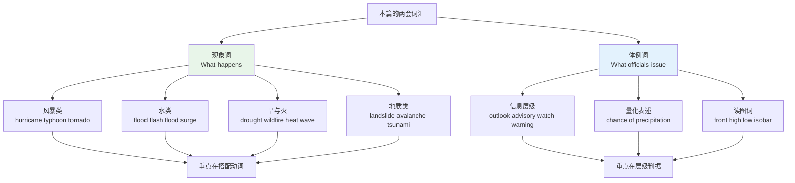
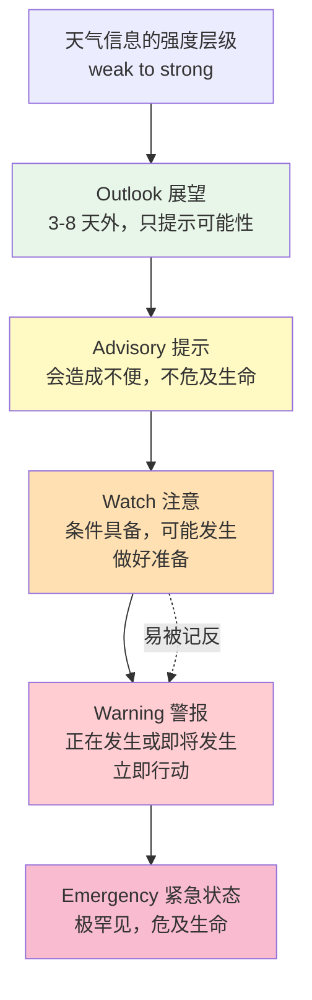
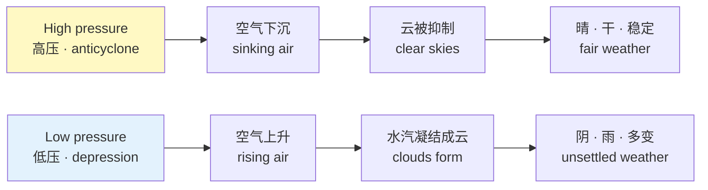
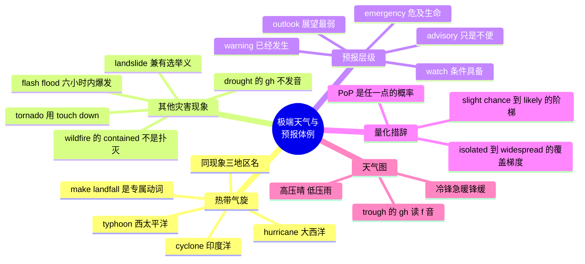

# 极端天气、自然灾害与天气预报

> [!info] 本篇定位
>
> 天气三篇的收尾篇，也是三篇里语域跨度最大的一篇。上一篇 `02.降水、风与云雾能见度` 处理的是日常天气描述，本篇处理的是**灾害级天气**和**官方预报文本**。
>
> 读完你会拿到三样东西：一张把同一种风暴在不同海域的叫法对齐的地区名表；六大类灾害各自的成套动词与名词，能读懂英文新闻里的灾情报道；以及美国国家气象局与英国气象局那套 `watch` / `warning` / `advisory` 的层级判据——这套词看着眼熟，但 `watch` 与 `warning` 的强弱关系在中文母语者手里常被记反。
>
> 本篇不讲天气语法结构，也不写天气对话。想找「今天天气怎么样」这类句型，去 `04.英语场景`。

---

## 1. 本篇导读：灾害词与预报词是两套系统

这一篇的词表其实是两个不相交的集合，混在一起学会很乱，分开就清楚了。

**第一套是现象词**：`hurricane`、`tornado`、`drought`、`wildfire`、`landslide`。这些词描述自然界发生了什么，绝大多数是名词，读新闻、读小说、看纪录片时用得上。学它们的重点是**搭配的动词**——龙卷用 `touch down`，飓风用 `make landfall`，河流用 `burst its banks`，动词错了句子就不像英语。

**第二套是预报体例词**：`forecast`、`outlook`、`advisory`、`watch`、`warning`、`chance of precipitation`。这些词不描述自然现象，它们描述的是**气象机构对公众发出的信息级别**。这套词是有严格定义的行政术语，不是同义词随便换。把 `warning` 说成 `watch`，在美国等于把「已经在下了，立刻躲」说成「有可能会来，留意一下」。



上图把本篇拆成左右两半。左半边（第 2 到第 8 节）按灾害类型走，每类给出「名词 + 专属动词 + 描述形容词」三件套；右半边（第 9 到第 11 节）按官方文本的组织方式走，从信息层级到量化措辞再到天气图。第 12 节把灾情新闻的固定表达单列，第 13 节收拢全篇最容易混的词对。

对程序员读者多说一句：这一篇的词在技术语境里有大量隐喻用法。`cascading failure`（级联故障）、`flood the queue`（灌满队列）、`storm of retries`（重试风暴）、`avalanche` 在缓存领域直接指缓存雪崩，`throttle` 与 `surge protection` 的原型都是本篇的物理现象。学会字面义之后，这些工程比喻读起来会顺很多。

---

## 2. 热带气旋：一个现象，三个地区名

### 2.1 名字只跟海域有关，跟强度无关

这是本篇最值得先破除的误解。`hurricane`、`typhoon`、`cyclone` 不是三种不同强度的风暴，而是**同一种天气系统在三片海域的三个本地叫法**。它们的物理机制、结构、生成条件完全一样。

科学上的统称是 `tropical cyclone`（热带气旋）。当它的持续风速达到某个门槛（约 64 节 / 119 公里每小时）时，在不同海域会被换上不同的名字。

| 英文 | 英式音标 | 美式音标 | 词性 | 中文 | 搭配与说明 |
| --- | --- | --- | --- | --- | --- |
| **tropical cyclone** | /ˌtrɒpɪkl ˈsaɪkləʊn/ | /ˌtrɑːpɪkl ˈsaɪkloʊn/ | n. | 热带气旋 | 学术统称，三个地区名的上位词 |
| **hurricane** | /ˈhʌrɪkən/ | /ˈhɜːrəkeɪn/ | n. | 飓风 | 大西洋与东太平洋；英美读音差异大 |
| **typhoon** | /taɪˈfuːn/ | /taɪˈfuːn/ | n. | 台风 | 西北太平洋；中国日本菲律宾用此名 |
| **cyclone** | /ˈsaɪkləʊn/ | /ˈsaɪkloʊn/ | n. | 气旋；旋风 | 印度洋与南太平洋；也泛指低压系统 |
| **tropical storm** | /ˌtrɒpɪkl ˈstɔːm/ | /ˌtrɑːpɪkl ˈstɔːrm/ | n. | 热带风暴 | 强度低于飓风门槛的一档 |
| **tropical depression** | /ˌtrɒpɪkl dɪˈpreʃn/ | /ˌtrɑːpɪkl dɪˈpreʃn/ | n. | 热带低压 | 最弱一档，尚未获得命名 |
| **basin** | /ˈbeɪsn/ | /ˈbeɪsn/ | n. | 海盆；流域 | the Atlantic basin 大西洋海域 |
| **season** | /ˈsiːzn/ | /ˈsiːzn/ | n. | 季 | hurricane season 六月至十一月 |

> [!warning] hurricane 的英美读音差异
>
> 这是英美音差最大的常用词之一，值得单独记。
>
> - 英式 /ˈhʌrɪkən/：第二音节弱化成 /ɪ/，末尾 -cane 读成 /kən/，整个词像「哈瑞肯」。
> - 美式 /ˈhɜːrəkeɪn/：第一音节的元音带 r 色彩，末尾 -cane 保留完整的 /keɪn/，像「赫惹凯恩」。
>
> 听 BBC 和听 CNN 报同一场风暴，这个词的听感差别会大到让人怀疑是两个词。

### 2.2 三个名字的地理边界

| 海域 | 英文说法 | 使用的名称 | 覆盖国家或地区 |
| --- | --- | --- | --- |
| 北大西洋、加勒比海 | the North Atlantic | **hurricane** | 美国东岸、墨西哥湾、加勒比诸岛 |
| 东北太平洋 | the eastern Pacific | **hurricane** | 墨西哥西岸、夏威夷 |
| 西北太平洋 | the western Pacific | **typhoon** | 中国、日本、韩国、菲律宾、越南 |
| 北印度洋 | the Indian Ocean | **cyclone** | 印度、孟加拉国、阿曼 |
| 南太平洋、澳洲附近 | the South Pacific | **cyclone** | 澳大利亚、斐济、新西兰 |

> [!tip] 一个记忆锚点
>
> `typhoon` 的词源本身就带着地理信息。它一般认为与汉语「大风」或粤语「颱風」的读音有关，也有说法指向阿拉伯语与希腊语的 Typhon（提丰，风暴巨人）。不管取哪一说，这个词进入英语的路径就是从东方海域来的——**名字本身就在西太平洋**。
>
> `hurricane` 来自加勒比地区泰诺人语言中的风暴神 Huracán，经西班牙语 huracán 进入英语——**名字本身就在加勒比**。
>
> 两个词各自带着自己的海域出生证明，记住来源就不会混。

### 2.3 描述气旋活动的动词

热带气旋这套词最难的不是名词，是动词。中文里「台风来了」一个「来」字包打天下，英语要分登陆、增强、减弱、转向、消散五个不同动作。

| 英文 | 英式音标 | 美式音标 | 词性 | 中文 | 搭配与说明 |
| --- | --- | --- | --- | --- | --- |
| **make landfall** | /ˌmeɪk ˈlændfɔːl/ | /ˌmeɪk ˈlændfɔːl/ | v. | 登陆 | 固定搭配，不说 arrive on land |
| **landfall** | /ˈlændfɔːl/ | /ˈlændfɔːl/ | n. | 登陆 | at landfall 登陆时 |
| **intensify** | /ɪnˈtensɪfaɪ/ | /ɪnˈtensɪfaɪ/ | v. | 增强 | rapidly intensify 快速增强 |
| **strengthen** | /ˈstreŋθn/ | /ˈstreŋθn/ | v. | 加强 | intensify 的中性同义词 |
| **weaken** | /ˈwiːkən/ | /ˈwiːkən/ | v. | 减弱 | weaken to a tropical storm 减弱为热带风暴 |
| **dissipate** | /ˈdɪsɪpeɪt/ | /ˈdɪsɪpeɪt/ | v. | 消散 | 系统彻底消失时用 |
| **stall** | /stɔːl/ | /stɔːl/ | v. | 滞留不动 | 风暴停滞会造成极端降水 |
| **veer** | /vɪə/ | /vɪr/ | v. | 转向 | veer north 转向北方 |
| **churn** | /tʃɜːn/ | /tʃɜːrn/ | v. | 翻搅 | churn in the Gulf 在墨西哥湾翻搅 |
| **barrel** | /ˈbærəl/ | /ˈbærəl/ | v. | 疾冲 | barrel toward the coast 直扑海岸 |
| **track** | /træk/ | /træk/ | n./v. | 路径；追踪 | the storm's track 风暴路径 |
| **path** | /pɑːθ/ | /pæθ/ | n. | 路线 | in the path of the storm 处于风暴路径上 |

> [!example] 五个动词在真实报道里的样子
>
> - Hurricane Ida **made landfall** near Port Fourchon on Sunday morning.
>   - 飓风艾达于周日上午在路易斯安那州富尔雄港附近登陆。
> - The system **rapidly intensified** from a tropical storm to a Category 4 in under a day.
>   - 该系统在不到一天内从热带风暴快速增强为四级飓风。
> - It **weakened** to a tropical depression after moving inland.
>   - 深入内陆后它减弱为热带低压。
> - Forecasters expect the storm to **stall** over the region for two days.
>   - 预报员预计风暴将在该地区滞留两天。
> - The storm is expected to **dissipate** by Thursday.
>   - 预计该风暴将在周四前消散。

`rapid intensification`（快速增强）这个术语在近年报道里出现频率很高，指 24 小时内风速跃升一大截。看到 `RI` 这个缩写在气象文本里指的就是它。

---

## 3. 气旋的部件与强度分级

### 3.1 结构词汇：从风眼到外围雨带

气象报道会拆开一个风暴谈它的各个部分。这批词很具体，记住之后卫星云图的解说词就能听懂。

| 英文 | 英式音标 | 美式音标 | 词性 | 中文 | 搭配与说明 |
| --- | --- | --- | --- | --- | --- |
| **eye** | /aɪ/ | /aɪ/ | n. | 风眼 | the eye of the storm 也用作比喻义 |
| **eyewall** | /ˈaɪwɔːl/ | /ˈaɪwɔːl/ | n. | 眼墙 | 风速最大的环状区域 |
| **rainband** | /ˈreɪnbænd/ | /ˈreɪnbænd/ | n. | 雨带 | outer rainbands 外围雨带 |
| **spiral** | /ˈspaɪrəl/ | /ˈspaɪrəl/ | n./adj. | 螺旋 | spiral bands 螺旋雨带 |
| **storm surge** | /ˈstɔːm sɜːdʒ/ | /ˈstɔːrm sɜːrdʒ/ | n. | 风暴潮 | 气旋致死的头号原因 |
| **swell** | /swel/ | /swel/ | n./v. | 涌浪；膨胀 | dangerous swells 危险涌浪 |
| **sustained wind** | /səˌsteɪnd ˈwɪnd/ | /səˌsteɪnd ˈwɪnd/ | n. | 持续风速 | 定级依据，取一分钟或十分钟平均 |
| **gust** | /ɡʌst/ | /ɡʌst/ | n./v. | 阵风 | gusting to 90 mph 阵风达 90 英里每小时 |
| **knot** | /nɒt/ | /nɑːt/ | n. | 节 | 气象与航海的速度单位，k 不发音 |
| **millibar** | /ˈmɪlibɑː/ | /ˈmɪlibɑːr/ | n. | 毫巴 | 中心气压单位，数值越低风暴越强 |
| **category** | /ˈkætəɡəri/ | /ˈkætəɡɔːri/ | n. | 级别 | a Category 4 hurricane 四级飓风 |
| **cone of uncertainty** | — | — | n. | 预测误差锥 | 路径预报图上的喇叭形区域 |

> [!warning] storm surge 不是海啸
>
> 这两个词在中文新闻里都常被笼统译作「巨浪」，英文里区分得很清楚。
>
> - **storm surge**（风暴潮）：气旋的低气压加强风把海水堆向岸边造成的持续水位抬升。成因是**气象**。
> - **tsunami**（海啸）：海底地震、滑坡或火山活动推动整个水柱造成的长波。成因是**地质**。
>
> 混用会让句子在英语母语者听来很外行。写作时判据很简单：起因是风就用 surge，起因是地动就用 tsunami。

### 3.2 Saffir-Simpson 分级与中文级别的错位

美国用 Saffir-Simpson Hurricane Wind Scale 给飓风定级，一到五级，只看持续风速。中文的台风分级用的是另一套（热带风暴、强热带风暴、台风、强台风、超强台风），两套不能直接换算。

| 级别 | 英文表述 | 持续风速（英里/小时） | 常见描述形容词 |
| --- | --- | --- | --- |
| 1 | **Category 1** | 74–95 | dangerous 有危险的 |
| 2 | **Category 2** | 96–110 | extremely dangerous 极度危险的 |
| 3 | **Category 3** | 111–129 | major hurricane 大型飓风起点 |
| 4 | **Category 4** | 130–156 | catastrophic 灾难性的 |
| 5 | **Category 5** | 157 以上 | catastrophic 灾难性的 |

`major hurricane`（大型飓风）是一个有精确定义的术语，指三级及以上，不是随口说的「很大的飓风」。看到这个词就知道它至少是 Category 3。

> [!tip] 报道里的读法
>
> 级别在句子里的三种常见写法，含义相同：
>
> - a **Category 4** hurricane
> - a hurricane of **Category 4** strength
> - a **Cat 4**（口语与推文里的缩略）
>
> 口语读作 "a cat four"，不读字母。

### 3.3 命名规则里的词汇

热带气旋是有名字的，这套命名机制本身带来几个词。

| 英文 | 英式音标 | 美式音标 | 词性 | 中文 | 搭配与说明 |
| --- | --- | --- | --- | --- | --- |
| **name list** | /ˈneɪm lɪst/ | /ˈneɪm lɪst/ | n. | 命名表 | 六年一轮回使用 |
| **retire** | /rɪˈtaɪə/ | /rɪˈtaɪər/ | v. | 除名 | 造成重大伤亡的名字会被永久除名 |
| **rotate** | /rəʊˈteɪt/ | /ˈroʊteɪt/ | v. | 轮换 | 名单按年轮换 |
| **alphabetical** | /ˌælfəˈbetɪkl/ | /ˌælfəˈbetɪkl/ | adj. | 按字母顺序的 | 一年内按首字母递增命名 |

`The name Katrina was retired after 2005.`（卡特里娜这个名字在 2005 年后被除名。）这个 `retire` 的用法在其他语境里不常见，属于气象专用义。

---

## 4. 雷暴、龙卷与冰雹

### 4.1 龙卷风的核心词

`tornado` 是本篇动词搭配最特殊的一个词。它不 `land`，不 `arrive`，它 `touch down`。

| 英文 | 英式音标 | 美式音标 | 词性 | 中文 | 搭配与说明 |
| --- | --- | --- | --- | --- | --- |
| **tornado** | /tɔːˈneɪdəʊ/ | /tɔːrˈneɪdoʊ/ | n. | 龙卷风 | 复数 tornadoes 或 tornados |
| **twister** | /ˈtwɪstə/ | /ˈtwɪstər/ | n. | 龙卷风 | 美式口语说法，新闻标题常用 |
| **touch down** | /ˌtʌtʃ ˈdaʊn/ | /ˌtʌtʃ ˈdaʊn/ | v. | 触地 | 龙卷专属动词，不用 land |
| **funnel cloud** | /ˈfʌnl klaʊd/ | /ˈfʌnl klaʊd/ | n. | 漏斗云 | 未触地的旋转云柱 |
| **vortex** | /ˈvɔːteks/ | /ˈvɔːrteks/ | n. | 涡旋 | 复数 vortices /ˈvɔːtɪsiːz/ |
| **waterspout** | /ˈwɔːtəspaʊt/ | /ˈwɔːtərspaʊt/ | n. | 水龙卷 | 发生在水面上的龙卷 |
| **supercell** | /ˈsuːpəsel/ | /ˈsuːpərsel/ | n. | 超级单体 | 孕育强龙卷的雷暴结构 |
| **updraft** | /ˈʌpdrɑːft/ | /ˈʌpdræft/ | n. | 上升气流 | 雷暴的能量输送带 |
| **downdraft** | /ˈdaʊndrɑːft/ | /ˈdaʊndræft/ | n. | 下沉气流 | 造成地面强风 |
| **rotation** | /rəʊˈteɪʃn/ | /roʊˈteɪʃn/ | n. | 旋转 | radar indicates rotation 雷达探测到旋转 |
| **debris** | /ˈdebriː/ | /dəˈbriː/ | n. | 碎片；残骸 | 不可数；英美重音位置不同 |
| **siren** | /ˈsaɪrən/ | /ˈsaɪrən/ | n. | 警报器 | tornado sirens 龙卷警报器 |

> [!warning] debris 的三个坑
>
> 1. **不可数**。不说 ~~debris are~~ 或 ~~a debris~~，说 `the debris was scattered`。
> 2. **末尾 s 不发音**。这是个法语借词，读 /ˈdebriː/ 或 /dəˈbriː/，不读 /-brɪs/。
> 3. **英美重音不同**。英式重音在前 /ˈdebriː/，美式在后 /dəˈbriː/。两个都对。

### 4.2 Enhanced Fujita 强度分级

龙卷的强度用 EF 分级（Enhanced Fujita Scale），从 EF0 到 EF5，依据是**破坏程度反推的风速**，不是直接测风。

| 级别 | 英文 | 典型破坏描述 |
| --- | --- | --- |
| EF0 | **EF-Zero** | light damage 轻微破坏，树枝折断 |
| EF1 | **EF-One** | moderate damage 中度破坏，屋顶掀开 |
| EF2 | **EF-Two** | considerable damage 相当程度破坏，屋顶掀走 |
| EF3 | **EF-Three** | severe damage 严重破坏，墙体倒塌 |
| EF4 | **EF-Four** | devastating damage 毁灭性破坏，房屋夷平 |
| EF5 | **EF-Five** | incredible damage 难以置信的破坏，地基扫空 |

这套形容词梯度本身值得记：`light` → `moderate` → `considerable` → `severe` → `devastating` → `incredible`。在描述任何损失程度时都可以借用这个序列。

### 4.3 雷暴与冰雹

| 英文 | 英式音标 | 美式音标 | 词性 | 中文 | 搭配与说明 |
| --- | --- | --- | --- | --- | --- |
| **thunderstorm** | /ˈθʌndəstɔːm/ | /ˈθʌndərstɔːrm/ | n. | 雷暴 | severe thunderstorm 强雷暴 |
| **lightning** | /ˈlaɪtnɪŋ/ | /ˈlaɪtnɪŋ/ | n. | 闪电 | 不可数；注意与 lightening 拼写区别 |
| **thunder** | /ˈθʌndə/ | /ˈθʌndər/ | n./v. | 雷；打雷 | 不可数，说 a clap of thunder |
| **hail** | /heɪl/ | /heɪl/ | n./v. | 冰雹；下冰雹 | 不可数；it is hailing |
| **hailstone** | /ˈheɪlstəʊn/ | /ˈheɪlstoʊn/ | n. | 冰雹粒 | 可数，golf-ball-sized hailstones |
| **squall** | /skwɔːl/ | /skwɔːl/ | n. | 飑；短时强风 | squall line 飑线 |
| **derecho** | /dəˈreɪtʃəʊ/ | /dəˈreɪtʃoʊ/ | n. | 直线风暴 | 西班牙语借词，长距离直线大风 |
| **microburst** | /ˈmaɪkrəʊbɜːst/ | /ˈmaɪkroʊbɜːrst/ | n. | 微下击暴流 | 航空气象重点词 |
| **strike** | /straɪk/ | /straɪk/ | v./n. | 击中 | struck by lightning 被雷击中 |
| **bolt** | /bəʊlt/ | /boʊlt/ | n. | 闪电束 | a bolt of lightning |

> [!warning] lightning 与 lightening 是两个词
>
> - **lightning** /ˈlaɪtnɪŋ/：闪电，名词，没有 e。
> - **lightening** /ˈlaɪtnɪŋ/：lighten（变亮、减轻）的现在分词，有 e。
>
> 两个词读音完全相同，只能靠拼写区分。写作时打错这个 e，是母语者也会犯的高频拼写错误。
>
> - ❌ ~~The sky was lit by lightening.~~
> - ✅ The sky was lit by **lightning**.

冰雹的大小在英文报道里几乎不用厘米，而是用日常物体类比，这套说法值得整个背下来：`pea-sized`（豌豆大）→ `marble-sized`（弹珠大）→ `golf-ball-sized`（高尔夫球大）→ `baseball-sized`（棒球大）→ `softball-sized`（垒球大）。

---

## 5. 洪水家族：flood、flash flood 与内涝

### 5.1 三种「淹」的区别

中文一个「淹」字对应英文一整族词，区别在水从哪来、来得多快、淹多深。

| 英文 | 英式音标 | 美式音标 | 词性 | 中文 | 搭配与说明 |
| --- | --- | --- | --- | --- | --- |
| **flood** | /flʌd/ | /flʌd/ | n./v. | 洪水；淹没 | 注意 oo 读 /ʌ/ 不读 /uː/ |
| **flash flood** | /ˌflæʃ ˈflʌd/ | /ˌflæʃ ˈflʌd/ | n. | 山洪；暴洪 | 数小时内爆发，最致命的一类 |
| **flooding** | /ˈflʌdɪŋ/ | /ˈflʌdɪŋ/ | n. | 积水；洪涝 | 不可数，指状态；flood 指事件 |
| **inundate** | /ˈɪnʌndeɪt/ | /ˈɪnʌndeɪt/ | v. | 淹没 | 正式词，也用于比喻「淹没在邮件里」 |
| **submerge** | /səbˈmɜːdʒ/ | /səbˈmɜːrdʒ/ | v. | 没入水下 | 强调完全没顶 |
| **deluge** | /ˈdeljuːdʒ/ | /ˈdeljuːdʒ/ | n./v. | 洪水；倾盆大雨 | 文学色彩较重 |
| **torrent** | /ˈtɒrənt/ | /ˈtɔːrənt/ | n. | 急流 | a torrent of water 一股激流 |
| **torrential** | /təˈrenʃl/ | /təˈrenʃl/ | adj. | 倾盆的 | torrential rain 固定搭配 |
| **downpour** | /ˈdaʊnpɔː/ | /ˈdaʊnpɔːr/ | n. | 暴雨 | 短时强降雨 |
| **overflow** | /ˌəʊvəˈfləʊ/ | /ˌoʊvərˈfloʊ/ | v. | 漫溢 | 动词重音在后，名词在前 |
| **burst its banks** | — | — | phr. | 决堤；漫过河岸 | 河流专用，英式常见 |
| **waterlogged** | /ˈwɔːtəlɒɡd/ | /ˈwɔːtərlɑːɡd/ | adj. | 积水的；浸透的 | waterlogged fields 泡水的农田 |

> [!warning] flood 的发音陷阱
>
> `flood` 里的 oo 读 /ʌ/，和 `blood` /blʌd/ 同一模式，**不读** /uː/。中文母语者受 `food` /fuːd/、`mood` /muːd/ 的影响很容易读错。
>
> 记忆办法：`blood` 和 `flood` 这两个和液体有关的词都读 /ʌ/，它们是一对，一起记。

### 5.2 flash flood 为什么单独成词

`flash flood` 不是「小一点的洪水」，它的定义包含时间要素：**通常在致灾降雨开始后六小时内爆发**。它的危险性来自速度——没有撤离窗口。

| 英文 | 英式音标 | 美式音标 | 词性 | 中文 | 搭配与说明 |
| --- | --- | --- | --- | --- | --- |
| **runoff** | /ˈrʌnɒf/ | /ˈrʌnɔːf/ | n. | 径流 | 地面无法吸收而流走的水 |
| **drainage** | /ˈdreɪnɪdʒ/ | /ˈdreɪnɪdʒ/ | n. | 排水；排水系统 | poor drainage 排水不良 |
| **storm drain** | /ˈstɔːm dreɪn/ | /ˈstɔːrm dreɪn/ | n. | 雨水排水口 | 美式；英式常说 gully |
| **watershed** | /ˈwɔːtəʃed/ | /ˈwɔːtərʃed/ | n. | 流域；分水岭 | 美式指流域，英式偏指分水岭 |
| **saturated** | /ˈsætʃəreɪtɪd/ | /ˈsætʃəreɪtɪd/ | adj. | 饱和的 | saturated soil 饱和土壤，无法再吸水 |
| **culvert** | /ˈkʌlvət/ | /ˈkʌlvərt/ | n. | 涵洞 | 山洪常见受灾点 |
| **low-lying** | /ˌləʊ ˈlaɪɪŋ/ | /ˌloʊ ˈlaɪɪŋ/ | adj. | 地势低洼的 | low-lying areas 低洼地区 |

> [!example] 美国国家气象局的经典标语
>
> - **Turn Around, Don't Drown.**
>   - 掉头走，别淹死。（提醒司机不要涉水通过被淹路面）
> - Just **six inches** of moving water can knock an adult off their feet.
>   - 仅六英寸的流动水就能把成年人冲倒。
> - Two feet of water can **sweep away** most vehicles.
>   - 两英尺深的水能冲走大多数车辆。
>
> `sweep away`（冲走）是洪水报道的高频动词，比 `wash away` 更强调横向推力。

### 5.3 防洪设施与人为因素

| 英文 | 英式音标 | 美式音标 | 词性 | 中文 | 搭配与说明 |
| --- | --- | --- | --- | --- | --- |
| **levee** | /ˈlevi/ | /ˈlevi/ | n. | 防洪堤 | 美式常用，尤指密西西比河沿岸 |
| **embankment** | /ɪmˈbæŋkmənt/ | /ɪmˈbæŋkmənt/ | n. | 堤岸；路堤 | 英式更常用 |
| **dike / dyke** | /daɪk/ | /daɪk/ | n. | 堤坝 | dike 美式拼法，dyke 英式拼法 |
| **dam** | /dæm/ | /dæm/ | n./v. | 水坝；筑坝拦 | 与 damn /dæm/ 同音 |
| **reservoir** | /ˈrezəvwɑː/ | /ˈrezərvwɑːr/ | n. | 水库 | 法语借词，oir 读 /wɑː/ |
| **floodplain** | /ˈflʌdpleɪn/ | /ˈflʌdpleɪn/ | n. | 洪泛区 | 保险与规划文件常见 |
| **breach** | /briːtʃ/ | /briːtʃ/ | n./v. | 决口；溃决 | the levee breached 堤坝溃决 |
| **sandbag** | /ˈsændbæɡ/ | /ˈsændbæɡ/ | n./v. | 沙袋；用沙袋堵 | fill sandbags 装沙袋 |
| **flood defence** | /ˈflʌd dɪfens/ | /ˈflʌd dɪfens/ | n. | 防洪工程 | 英式拼 defence，美式 defense |

`breach` 这个词在技术语境里指数据泄露（`a data breach`），原义就是这里的「堤坝被冲开一个口子」。两个义项共享同一个「屏障被撕开」的意象。

---

## 6. 干旱、野火与热浪

### 6.1 干旱的成套词汇

| 英文 | 英式音标 | 美式音标 | 词性 | 中文 | 搭配与说明 |
| --- | --- | --- | --- | --- | --- |
| **drought** | /draʊt/ | /draʊt/ | n. | 干旱 | gh 不发音，读 /draʊt/ 不读 /drɔːt/ |
| **arid** | /ˈærɪd/ | /ˈærɪd/ | adj. | 干旱的 | 描述气候区，arid climate |
| **semi-arid** | /ˌsemi ˈærɪd/ | /ˌsemi ˈærɪd/ | adj. | 半干旱的 | 气候分类术语 |
| **parched** | /pɑːtʃt/ | /pɑːrtʃt/ | adj. | 干裂的；焦渴的 | parched earth 龟裂的土地 |
| **barren** | /ˈbærən/ | /ˈbærən/ | adj. | 贫瘠的 | barren land 不毛之地 |
| **desertification** | /dɪˌzɜːtɪfɪˈkeɪʃn/ | /dɪˌzɜːrtɪfɪˈkeɪʃn/ | n. | 荒漠化 | 环境报告高频词 |
| **water shortage** | /ˈwɔːtə ˈʃɔːtɪdʒ/ | /ˈwɔːtər ˈʃɔːrtɪdʒ/ | n. | 缺水 | 也说 water scarcity |
| **rationing** | /ˈræʃənɪŋ/ | /ˈræʃənɪŋ/ | n. | 定量供应 | water rationing 限水 |
| **hosepipe ban** | /ˈhəʊzpaɪp bæn/ | /ˈhoʊzpaɪp bæn/ | n. | 禁用水管令 | 英式独有，干旱时禁止浇花洗车 |
| **irrigation** | /ˌɪrɪˈɡeɪʃn/ | /ˌɪrɪˈɡeɪʃn/ | n. | 灌溉 | irrigation system 灌溉系统 |
| **crop failure** | /ˈkrɒp feɪljə/ | /ˈkrɑːp feɪljər/ | n. | 农作物歉收 | 干旱的直接后果 |
| **famine** | /ˈfæmɪn/ | /ˈfæmɪn/ | n. | 饥荒 | 极端后果，不要随意用 |
| **reservoir level** | — | — | n. | 水库水位 | at record lows 处于历史低位 |

> [!warning] drought 的发音
>
> `-ough` 在英语里有七八种读法，`drought` 属于 /aʊ/ 那一支，和 `bough` /baʊ/（树枝）同类。
>
> 对照记一组，这组词的拼写完全无法预测读音：
>
> ```text
> drought  /draʊt/    干旱
> bough    /baʊ/      树枝
> though   /ðəʊ/      虽然
> through  /θruː/     穿过
> thought  /θɔːt/     想法
> tough    /tʌf/      艰难的
> cough    /kɒf/      咳嗽
> ```
>
> 这七个词的 -ough 读法各不相同，是英语拼读规则失效的经典例证，只能逐个记。

### 6.2 野火：wildfire、bushfire 与 forest fire

三个词都指野外的火，区别在地区习惯和植被类型。

| 英文 | 英式音标 | 美式音标 | 词性 | 中文 | 搭配与说明 |
| --- | --- | --- | --- | --- | --- |
| **wildfire** | /ˈwaɪldfaɪə/ | /ˈwaɪldfaɪər/ | n. | 野火 | 美加通用，最中性的说法 |
| **bushfire** | /ˈbʊʃfaɪə/ | /ˈbʊʃfaɪər/ | n. | 丛林大火 | 澳大利亚标准说法 |
| **forest fire** | /ˈfɒrɪst faɪə/ | /ˈfɔːrəst faɪər/ | n. | 森林火灾 | 强调林地 |
| **blaze** | /bleɪz/ | /bleɪz/ | n. | 大火 | 新闻标题偏爱的短词 |
| **inferno** | /ɪnˈfɜːnəʊ/ | /ɪnˈfɜːrnoʊ/ | n. | 烈焰地狱 | 情绪色彩重，慎用 |
| **flame** | /fleɪm/ | /fleɪm/ | n. | 火焰 | 常用复数 flames |
| **ember** | /ˈembə/ | /ˈembər/ | n. | 余烬；火星 | 复数 embers，随风引燃新火点 |
| **spark** | /spɑːk/ | /spɑːrk/ | n./v. | 火花；引发 | 也用作比喻「引发争议」 |
| **smoulder / smolder** | /ˈsməʊldə/ | /ˈsmoʊldər/ | v. | 阴燃 | 英式 smoulder，美式 smolder |
| **scorch** | /skɔːtʃ/ | /skɔːrtʃ/ | v. | 烧焦 | scorched earth 焦土 |
| **char** | /tʃɑː/ | /tʃɑːr/ | v. | 烧成炭 | charred remains 焦黑残骸 |
| **ash** | /æʃ/ | /æʃ/ | n. | 灰烬 | 不可数；ashes 指遗骸或残迹 |
| **soot** | /sʊt/ | /sʊt/ | n. | 烟灰；煤烟 | 注意读 /sʊt/ 不读 /suːt/ |

### 6.3 灭火与火情通报词汇

美国的火情通报有一套固定表达，`containment`（控制率）是其中最需要解释的一个。

| 英文 | 英式音标 | 美式音标 | 词性 | 中文 | 搭配与说明 |
| --- | --- | --- | --- | --- | --- |
| **containment** | /kənˈteɪnmənt/ | /kənˈteɪnmənt/ | n. | 火场控制率 | 40% contained 指周界被围住四成 |
| **contain** | /kənˈteɪn/ | /kənˈteɪn/ | v. | 控制住 | 不等于扑灭 |
| **extinguish** | /ɪkˈstɪŋɡwɪʃ/ | /ɪkˈstɪŋɡwɪʃ/ | v. | 扑灭 | 正式词，口语用 put out |
| **perimeter** | /pəˈrɪmɪtə/ | /pəˈrɪmɪtər/ | n. | 周界 | 火场外围边线 |
| **firebreak** | /ˈfaɪəbreɪk/ | /ˈfaɪərbreɪk/ | n. | 防火隔离带 | 也说 fire line |
| **firefighter** | /ˈfaɪəfaɪtə/ | /ˈfaɪərfaɪtər/ | n. | 消防员 | 中性词，取代旧称 fireman |
| **hotshot crew** | — | — | n. | 精锐野火扑救队 | 美式专有名词 |
| **water bomber** | /ˈwɔːtə bɒmə/ | /ˈwɔːtər bɑːmər/ | n. | 灭火飞机 | 也说 air tanker |
| **acreage** | /ˈeɪkərɪdʒ/ | /ˈeɪkərɪdʒ/ | n. | 面积（英亩计） | burned 20,000 acres 过火两万英亩 |
| **evacuation order** | — | — | n. | 撤离令 | 与 evacuation warning 分强弱两级 |
| **red flag warning** | — | — | n. | 红旗警报 | 高温干燥大风，极易起火的组合 |

> [!warning] contained 不是「扑灭」
>
> 火情通报里 `The fire is 40% contained` 常被误解为「火灭了四成」。它的真实含义是**火场周界有四成已经建立了隔离带**，火不会从这些边上继续外扩。火场内部可能仍在猛烈燃烧。
>
> - ❌ ~~The fire is 40% put out.~~（含义错误）
> - ✅ The fire is **40% contained**.（周界围住四成）
> - ✅ The fire was **fully contained** on Friday.（周五完全合围）
>
> 完全扑灭的说法是 `fully extinguished` 或 `out`，比 `contained` 晚得多。

### 6.4 热浪

| 英文 | 英式音标 | 美式音标 | 词性 | 中文 | 搭配与说明 |
| --- | --- | --- | --- | --- | --- |
| **heat wave** | /ˈhiːt weɪv/ | /ˈhiːt weɪv/ | n. | 热浪 | 英式常写作一个词 heatwave |
| **heat dome** | /ˈhiːt dəʊm/ | /ˈhiːt doʊm/ | n. | 热穹顶 | 高压盖住空气导致持续高温 |
| **scorching** | /ˈskɔːtʃɪŋ/ | /ˈskɔːrtʃɪŋ/ | adj. | 酷热的 | scorching temperatures |
| **sweltering** | /ˈsweltərɪŋ/ | /ˈsweltərɪŋ/ | adj. | 闷热难当的 | 强调湿热 |
| **heatstroke** | /ˈhiːtstrəʊk/ | /ˈhiːtstroʊk/ | n. | 中暑；热射病 | 不可数 |
| **heat exhaustion** | /ˈhiːt ɪɡzɔːstʃən/ | /ˈhiːt ɪɡzɔːstʃən/ | n. | 热衰竭 | 比 heatstroke 轻一级 |
| **heat index** | /ˈhiːt ɪndeks/ | /ˈhiːt ɪndeks/ | n. | 体感温度指数 | 综合温度与湿度，美式 |
| **dehydration** | /ˌdiːhaɪˈdreɪʃn/ | /ˌdiːhaɪˈdreɪʃn/ | n. | 脱水 | stay hydrated 保持水分 |
| **cooling centre** | — | — | n. | 避暑点 | 美式拼 center，公共降温场所 |

---

## 7. 地质灾害：landslide、avalanche 与地动海啸

### 7.1 坡面崩塌类

| 英文 | 英式音标 | 美式音标 | 词性 | 中文 | 搭配与说明 |
| --- | --- | --- | --- | --- | --- |
| **landslide** | /ˈlændslaɪd/ | /ˈlændslaɪd/ | n. | 滑坡；山体滑坡 | 另有「压倒性胜选」的引申义 |
| **mudslide** | /ˈmʌdslaɪd/ | /ˈmʌdslaɪd/ | n. | 泥石流 | 含水量高的滑坡 |
| **mudflow** | /ˈmʌdfləʊ/ | /ˈmʌdfloʊ/ | n. | 泥流 | 技术文本更常用 |
| **debris flow** | — | — | n. | 碎屑流 | 学术标准术语 |
| **rockfall** | /ˈrɒkfɔːl/ | /ˈrɑːkfɔːl/ | n. | 落石 | 山区公路警示牌常见 |
| **avalanche** | /ˈævəlɑːnʃ/ | /ˈævəlæntʃ/ | n. | 雪崩 | 英美末尾音不同 |
| **slope** | /sləʊp/ | /sloʊp/ | n. | 坡；斜面 | steep slope 陡坡 |
| **erosion** | /ɪˈrəʊʒn/ | /ɪˈroʊʒn/ | n. | 侵蚀 | soil erosion 水土流失 |
| **sinkhole** | /ˈsɪŋkhəʊl/ | /ˈsɪŋkhoʊl/ | n. | 塌陷坑；天坑 | 城市路面塌陷也用此词 |
| **subsidence** | /səbˈsaɪdns/ | /səbˈsaɪdns/ | n. | 地面沉降 | 房产报告与保险文件常见 |
| **collapse** | /kəˈlæps/ | /kəˈlæps/ | n./v. | 坍塌 | 建筑与地质通用 |
| **bury** | /ˈberi/ | /ˈberi/ | v. | 掩埋 | buried under debris 被碎石掩埋 |

> [!tip] landslide 的政治义
>
> 这个词在选举报道里出现的频率不比在灾害报道里低。
>
> - `win by a landslide`（以压倒性优势获胜）
> - `a landslide victory`（压倒性胜利）
>
> 意象是「票像山体一样整片倒向一边」。看到 `landslide` 先看语境是选举还是地质，两个义项的搭配完全不同。

### 7.2 地震与海啸

| 英文 | 英式音标 | 美式音标 | 词性 | 中文 | 搭配与说明 |
| --- | --- | --- | --- | --- | --- |
| **earthquake** | /ˈɜːθkweɪk/ | /ˈɜːrθkweɪk/ | n. | 地震 | 口语可简称 quake |
| **quake** | /kweɪk/ | /kweɪk/ | n./v. | 地震；颤抖 | 新闻标题偏爱的短形式 |
| **tremor** | /ˈtremə/ | /ˈtremər/ | n. | 震颤；小震 | 强度弱于 earthquake |
| **aftershock** | /ˈɑːftəʃɒk/ | /ˈæftərʃɑːk/ | n. | 余震 | 也用于「后续冲击」的比喻义 |
| **foreshock** | /ˈfɔːʃɒk/ | /ˈfɔːrʃɑːk/ | n. | 前震 | 主震前的小震 |
| **magnitude** | /ˈmæɡnɪtjuːd/ | /ˈmæɡnɪtuːd/ | n. | 震级 | a magnitude 7.2 quake |
| **epicentre / epicenter** | /ˈepɪsentə/ | /ˈepɪsentər/ | n. | 震中 | 英式 -tre，美式 -ter |
| **seismic** | /ˈsaɪzmɪk/ | /ˈsaɪzmɪk/ | adj. | 地震的 | seismic activity 地震活动 |
| **fault line** | /ˈfɔːlt laɪn/ | /ˈfɔːlt laɪn/ | n. | 断层线 | 也用作社会裂痕的比喻 |
| **tsunami** | /tsuːˈnɑːmi/ | /suːˈnɑːmi/ | n. | 海啸 | 日语借词；美式起首 ts 常简化为 s |
| **tidal wave** | /ˈtaɪdl weɪv/ | /ˈtaɪdl weɪv/ | n. | 巨浪 | 旧称，科学上已被 tsunami 取代 |
| **volcano** | /vɒlˈkeɪnəʊ/ | /vɑːlˈkeɪnoʊ/ | n. | 火山 | 复数 volcanoes |
| **eruption** | /ɪˈrʌpʃn/ | /ɪˈrʌpʃn/ | n. | 喷发 | volcanic eruption |
| **lava** | /ˈlɑːvə/ | /ˈlɑːvə/ | n. | 熔岩 | 地表流动的叫 lava，地下的叫 magma |
| **ash cloud** | /ˈæʃ klaʊd/ | /ˈæʃ klaʊd/ | n. | 火山灰云 | 影响航空的主要因素 |

> [!warning] tidal wave 是个已被淘汰的说法
>
> 老电影和旧书里用 `tidal wave` 指海啸，但这个词在科学上是错的——海啸和潮汐（tide）没有任何关系。现代英文媒体统一用 `tsunami`。
>
> `tidal wave` 现在主要活在比喻义里：`a tidal wave of criticism`（如潮的批评）、`a tidal wave of applications`（申请如潮水般涌来）。字面义已经退场，比喻义还很活跃。

---

## 8. 冬季极端天气

| 英文 | 英式音标 | 美式音标 | 词性 | 中文 | 搭配与说明 |
| --- | --- | --- | --- | --- | --- |
| **blizzard** | /ˈblɪzəd/ | /ˈblɪzərd/ | n. | 暴风雪 | 有严格定义：大风 + 低能见度 + 持续时长 |
| **snowstorm** | /ˈsnəʊstɔːm/ | /ˈsnoʊstɔːrm/ | n. | 暴雪 | 泛称，无强度门槛 |
| **whiteout** | /ˈwaɪtaʊt/ | /ˈwaɪtaʊt/ | n. | 白毛风；视野全白 | 能见度趋近于零 |
| **ice storm** | /ˈaɪs stɔːm/ | /ˈaɪs stɔːrm/ | n. | 冻雨风暴 | 电线结冰导致大面积停电 |
| **freezing rain** | /ˌfriːzɪŋ ˈreɪn/ | /ˌfriːzɪŋ ˈreɪn/ | n. | 冻雨 | 落地即结冰 |
| **black ice** | /ˌblæk ˈaɪs/ | /ˌblæk ˈaɪs/ | n. | 路面暗冰 | 透明薄冰，看不见，极危险 |
| **sleet** | /sliːt/ | /sliːt/ | n. | 雨夹雪 | 英美所指略有差异 |
| **cold snap** | /ˈkəʊld snæp/ | /ˈkoʊld snæp/ | n. | 寒潮；骤冷 | 短促的降温过程 |
| **cold spell** | /ˈkəʊld spel/ | /ˈkoʊld spel/ | n. | 持续低温期 | 比 cold snap 时间长 |
| **polar vortex** | /ˌpəʊlə ˈvɔːteks/ | /ˌpoʊlər ˈvɔːrteks/ | n. | 极涡 | 北美冬季新闻高频词 |
| **wind chill** | /ˈwɪnd tʃɪl/ | /ˈwɪnd tʃɪl/ | n. | 风寒温度 | 加风后的体感温度 |
| **frostbite** | /ˈfrɒstbaɪt/ | /ˈfrɔːstbaɪt/ | n. | 冻伤 | 不可数 |
| **hypothermia** | /ˌhaɪpəˈθɜːmiə/ | /ˌhaɪpəˈθɜːrmiə/ | n. | 体温过低症 | 医学词，急救报道常见 |
| **snowdrift** | /ˈsnəʊdrɪft/ | /ˈsnoʊdrɪft/ | n. | 雪堆 | 风吹积成的雪墙 |
| **thaw** | /θɔː/ | /θɔː/ | n./v. | 解冻 | 也指国际关系「回暖」 |
| **grit** | /ɡrɪt/ | /ɡrɪt/ | v./n. | 撒沙盐防滑 | 英式；gritting lorry 撒盐车 |

> [!warning] blizzard 不是「很大的雪」
>
> 美国国家气象局对 `blizzard` 的定义包含三个必要条件：持续风速或频繁阵风达到每小时 35 英里以上、大雪或吹雪导致能见度降到四分之一英里以下、上述条件持续三小时以上。
>
> 换句话说，**没有大风就不是 blizzard**，哪怕雪下得再厚。只下大雪不刮风的情况叫 `heavy snow` 或 `snowstorm`。
>
> - ❌ ~~We had a blizzard yesterday — a foot of snow, no wind.~~
> - ✅ We had **heavy snow** yesterday — a foot of it, no wind.

`black ice` 值得单独提。它并不黑，之所以叫这个名字是因为它薄而透明，透出下面深色的柏油路面，司机看不出路上有冰。冬季驾驶警示里 `patches of black ice`（零星暗冰）是固定搭配。

---

## 9. 预报体例（一）：五个信息层级

### 9.1 这一节是本篇的核心

前面七节的词是描述自然的，这一节的词是描述**官方文本本身**的。它们看起来是普通英语词，实际是有精确定义的行政术语。美国国家气象局（National Weather Service，缩写 NWS）用这套体系，英国气象局（Met Office）用一套颜色制的变体，两套都要认。



上图从上到下强度递增。中文母语者最常出错的是 `watch` 与 `warning` 这一对——凭字面感觉 `watch`（观察）像是「盯着」，`warning`（警告）像是「提醒」，很容易把两者的强弱关系记反。实际的判据是：**watch 是条件具备但尚未发生，warning 是已经发生或马上发生**。

### 9.2 五个层级的定义与词表

| 英文 | 英式音标 | 美式音标 | 词性 | 中文 | 搭配与说明 |
| --- | --- | --- | --- | --- | --- |
| **forecast** | /ˈfɔːkɑːst/ | /ˈfɔːrkæst/ | n./v. | 预报 | 过去式可用 forecast 或 forecasted |
| **outlook** | /ˈaʊtlʊk/ | /ˈaʊtlʊk/ | n. | 展望 | 时间跨度最长，确定性最低 |
| **advisory** | /ədˈvaɪzəri/ | /ədˈvaɪzəri/ | n. | 提示；预警提示 | 有不便无生命危险的层级 |
| **watch** | /wɒtʃ/ | /wɑːtʃ/ | n. | 注意报；预警 | 条件具备，可能发生，准备好 |
| **warning** | /ˈwɔːnɪŋ/ | /ˈwɔːrnɪŋ/ | n. | 警报 | 正在发生或即将发生，立即行动 |
| **emergency** | /ɪˈmɜːdʒənsi/ | /ɪˈmɜːrdʒənsi/ | n. | 紧急状态 | 最高级，极少使用 |
| **statement** | /ˈsteɪtmənt/ | /ˈsteɪtmənt/ | n. | 通报 | special weather statement 特别天气通报 |
| **bulletin** | /ˈbʊlətɪn/ | /ˈbʊlətɪn/ | n. | 公告 | 定时发布的简报 |
| **issue** | /ˈɪʃuː/ | /ˈɪʃuː/ | v. | 发布 | issue a warning 发布警报 |
| **lift** | /lɪft/ | /lɪft/ | v. | 解除 | the warning has been lifted 警报解除 |
| **expire** | /ɪkˈspaɪə/ | /ɪkˈspaɪər/ | v. | 到期失效 | the watch expires at 8 p.m. |
| **in effect** | /ɪn ɪˈfekt/ | /ɪn ɪˈfekt/ | phr. | 生效中 | a warning is in effect until midnight |
| **meteorologist** | /ˌmiːtiəˈrɒlədʒɪst/ | /ˌmiːtiəˈrɑːlədʒɪst/ | n. | 气象学家 | 口语里主播也这么称呼 |
| **forecaster** | /ˈfɔːkɑːstə/ | /ˈfɔːrkæstər/ | n. | 预报员 | 新闻里比 meteorologist 更常用 |

### 9.3 watch 与 warning 的记忆法

> [!tip] 用做菜类比记这一对
>
> 有一个在美国广泛流传的类比，用来教孩子记这两个词：
>
> - **Watch** = 食材都摆在台面上了。原料齐了，**可能**要做这道菜，你该把厨房准备好。
> - **Warning** = 菜已经端上桌了。它**就在眼前**，现在就得处理。
>
> 换成天气语言：
>
> - `Tornado Watch` = 大气条件适合生成龙卷，未来数小时该区域有可能出现。看好家人，留意广播。
> - `Tornado Warning` = 雷达探测到旋转，或者有人目击到龙卷。**立刻去地下室或内部无窗房间**。
>
> 两者的地理范围也不同：watch 覆盖大片区域（往往是几个县），warning 只覆盖风暴当前路径上的窄条区域。

| 对比项 | **Watch** | **Warning** |
| --- | --- | --- |
| 确定性 | 条件具备，可能发生 | 正在发生或即将发生 |
| 时间提前量 | 数小时 | 数分钟到一小时 |
| 覆盖范围 | 大范围，多个县 | 窄条，风暴路径上 |
| 该做什么 | be prepared 做好准备 | take action now 立刻行动 |
| 中文常见译法 | 注意报、蓝色预警 | 警报、红色预警 |

### 9.4 常见的具体警报名称

这套体系是「灾害类型 + 层级」的组合，词是拼出来的，记住组合规则就能读懂所有变体。

| 英文 | 中文 | 含义 |
| --- | --- | --- |
| **Flash Flood Warning** | 山洪警报 | 山洪正在发生或即将发生 |
| **Flash Flood Emergency** | 山洪紧急状态 | 已确认严重威胁生命 |
| **Tornado Watch** | 龙卷注意报 | 条件适合生成龙卷 |
| **Tornado Warning** | 龙卷警报 | 已探测或目击到龙卷 |
| **Severe Thunderstorm Warning** | 强雷暴警报 | 大风或大冰雹已确认 |
| **Hurricane Watch** | 飓风注意报 | 48 小时内可能出现飓风条件 |
| **Hurricane Warning** | 飓风警报 | 36 小时内预计出现飓风条件 |
| **Winter Storm Warning** | 冬季风暴警报 | 强降雪或冻雨即将来临 |
| **Winter Weather Advisory** | 冬季天气提示 | 会造成出行不便，未达警报门槛 |
| **Excessive Heat Warning** | 极端高温警报 | 危险高温已经或即将出现 |
| **Red Flag Warning** | 红旗警报 | 极端火险天气条件 |
| **High Wind Advisory** | 大风提示 | 阵风较强但未达警报级 |

> [!warning] 英国气象局用的是另一套
>
> Met Office 不用 watch / warning 两级制，而用**颜色制**：
>
> - **Yellow warning**（黄色警报）：做好准备，可能影响出行。
> - **Amber warning**（琥珀色警报）：影响加剧，考虑改变计划。
> - **Red warning**（红色警报）：危及生命，立即采取行动。
>
> 三个颜色都叫 `warning`，靠颜色分强弱。读英国天气报道时不要套用美国的 watch / warning 判据。另外英国气象局给风暴起名的体系叫 `named storms`，例如 Storm Eunice，用法与飓风命名类似。

---

## 10. 预报体例（二）：降水概率与预报措辞

### 10.1 precipitation chance 到底是什么意思

「明天降水概率 40%」这句话被误解的程度可能超过所有天气术语。它**不是**「明天有 40% 的时间在下雨」，也**不是**「40% 的区域会下雨」。

美国国家气象局的定义是：`Probability of Precipitation`（PoP）= 该预报区内**任意一点**在预报时段内出现至少 0.01 英寸降水的概率。

| 英文 | 英式音标 | 美式音标 | 词性 | 中文 | 搭配与说明 |
| --- | --- | --- | --- | --- | --- |
| **precipitation** | /prɪˌsɪpɪˈteɪʃn/ | /prɪˌsɪpɪˈteɪʃn/ | n. | 降水 | 统称雨雪雹，不可数 |
| **chance of rain** | — | — | n. | 降雨概率 | 口语说法，等同于 PoP |
| **probability** | /ˌprɒbəˈbɪləti/ | /ˌprɑːbəˈbɪləti/ | n. | 概率 | 正式术语用词 |
| **likelihood** | /ˈlaɪklihʊd/ | /ˈlaɪklihʊd/ | n. | 可能性 | 比 probability 口语 |
| **accumulation** | /əˌkjuːmjəˈleɪʃn/ | /əˌkjuːmjəˈleɪʃn/ | n. | 累积量 | snow accumulation 积雪量 |
| **rainfall** | /ˈreɪnfɔːl/ | /ˈreɪnfɔːl/ | n. | 降雨量 | 不可数 |
| **gauge** | /ɡeɪdʒ/ | /ɡeɪdʒ/ | n./v. | 量器；测量 | rain gauge 雨量计；拼写易错 |
| **radar** | /ˈreɪdɑː/ | /ˈreɪdɑːr/ | n. | 雷达 | Doppler radar 多普勒雷达 |
| **satellite imagery** | — | — | n. | 卫星云图 | imagery 不可数 |
| **model** | /ˈmɒdl/ | /ˈmɑːdl/ | n. | 数值模式 | forecast models 预报模式 |
| **ensemble** | /ɒnˈsɒmbl/ | /ɑːnˈsɑːmbl/ | n. | 集合预报 | 法语借词，多组模式取共识 |

> [!tip] PoP 的直觉换算
>
> NWS 的公式是 PoP = C × A，其中 C 是预报员对「降水事件会发生」的信心，A 是预报员认为降水会覆盖的区域比例。
>
> - 信心 100%、覆盖 40% 区域 → PoP 40%（一定会下，但只淋到四成地方）
> - 信心 40%、覆盖 100% 区域 → PoP 40%（不确定下不下，一旦下就全区都下）
>
> 两种情况报出来都是 40%，实际体验完全不同。这就是为什么专业预报文本会在数字之外加一句 `scattered showers`（零星阵雨）或 `widespread rain`（大范围降雨）来补充说明覆盖方式。

### 10.2 概率的语言表述阶梯

英文预报不是只报数字，还有一套对应的形容词，两者是配套的。

| 概率区间 | 官方措辞 | 音标 | 中文 |
| --- | --- | --- | --- |
| 10% | **slight chance** | /slaɪt tʃɑːns/ · /slaɪt tʃæns/ | 极小概率 |
| 20% | **slight chance** | 同上 | 小概率 |
| 30–50% | **chance** | /tʃɑːns/ · /tʃæns/ | 有可能 |
| 60–70% | **likely** | /ˈlaɪkli/ | 很可能 |
| 80–100% | 直接陈述 | — | 不加限定词，直接说会下 |

到了 80% 以上，预报文本不再说 `likely`，而是直接写 `Rain. Highs in the mid 60s.`（有雨。最高气温六十多度中段。）不加概率词本身就是最强的表述。

### 10.3 覆盖方式的形容词

| 英文 | 英式音标 | 美式音标 | 词性 | 中文 | 搭配与说明 |
| --- | --- | --- | --- | --- | --- |
| **isolated** | /ˈaɪsəleɪtɪd/ | /ˈaɪsəleɪtɪd/ | adj. | 局地零星的 | 覆盖不到两成区域 |
| **scattered** | /ˈskætəd/ | /ˈskætərd/ | adj. | 分散的 | 覆盖三到五成 |
| **numerous** | /ˈnjuːmərəs/ | /ˈnuːmərəs/ | adj. | 众多的 | 覆盖六到七成 |
| **widespread** | /ˈwaɪdspred/ | /ˈwaɪdspred/ | adj. | 大范围的 | 覆盖大部分区域 |
| **intermittent** | /ˌɪntəˈmɪtənt/ | /ˌɪntərˈmɪtənt/ | adj. | 断续的 | 时下时停 |
| **persistent** | /pəˈsɪstənt/ | /pərˈsɪstənt/ | adj. | 持续的 | 长时间不停 |
| **occasional** | /əˈkeɪʒənl/ | /əˈkeɪʒənl/ | adj. | 偶尔的 | occasional showers 间或有阵雨 |

> [!example] 一段完整的美式预报文本长什么样
>
> - **Tonight:** Showers **likely**, mainly after 2am. Cloudy, with a low around 48. East wind 5 to 10 mph. **Chance of precipitation** is 70%. New rainfall **amounts** between a tenth and quarter of an inch possible.
>   - 今夜：很可能有阵雨，主要在凌晨两点后。多云，最低气温约 48 度。东风 5 至 10 英里每小时。降水概率 70%。新增降雨量可能在 0.1 至 0.25 英寸之间。
> - **Wednesday:** A 40 percent **chance** of showers. Mostly cloudy, with a high near 61. **Breezy**, with gusts as high as 25 mph.
>   - 周三：40% 的阵雨概率。大部多云，最高气温接近 61 度。有风，阵风最高 25 英里每小时。
>
> 注意这套文本的语法特点：大量省略主语和系动词（`Cloudy, with a low around 48`），风向风速用固定格式，温度只给最高最低。这是气象电报体，不是普通英语句子，读的时候按信息槽位读而不是按句子读。

### 10.4 温度与体感的表述

| 英文 | 英式音标 | 美式音标 | 词性 | 中文 | 搭配与说明 |
| --- | --- | --- | --- | --- | --- |
| **high** | /haɪ/ | /haɪ/ | n. | 最高气温 | a high near 61 |
| **low** | /ləʊ/ | /loʊ/ | n. | 最低气温 | a low around 48 |
| **mid 60s** | — | — | phr. | 六十多度中段 | 读作 mid sixties，指 64-66 |
| **upper 40s** | — | — | phr. | 四十多度高段 | 读作 upper forties |
| **humidity** | /hjuːˈmɪdəti/ | /hjuːˈmɪdəti/ | n. | 湿度 | relative humidity 相对湿度 |
| **dew point** | /ˈdjuː pɔɪnt/ | /ˈduː pɔɪnt/ | n. | 露点 | 判断闷热程度比湿度更准 |
| **breezy** | /ˈbriːzi/ | /ˈbriːzi/ | adj. | 有风的 | 官方措辞，风力中等 |
| **blustery** | /ˈblʌstəri/ | /ˈblʌstəri/ | adj. | 大风的 | 比 breezy 强一档 |
| **feels like** | — | — | phr. | 体感 | feels like 95 体感 95 度 |

---

## 11. 天气图词汇：锋面与高低压

### 11.1 高压与低压

这是理解一切天气预报的底层框架。中文说「高压控制」「低压槽」，英文的对应词组要背成整块。



上图把气压和天气之间的因果链拆开了。高压区空气下沉，下沉过程中增温，云不容易形成，所以对应晴好天气；低压区空气上升，上升过程中冷却，水汽凝结成云致雨，所以对应阴雨天气。记住「高压晴、低压雨」这条对应之后，看天气图的第一眼就有了方向。

| 英文 | 英式音标 | 美式音标 | 词性 | 中文 | 搭配与说明 |
| --- | --- | --- | --- | --- | --- |
| **high pressure** | /ˌhaɪ ˈpreʃə/ | /ˌhaɪ ˈpreʃər/ | n. | 高压 | 天气图上标 H |
| **low pressure** | /ˌləʊ ˈpreʃə/ | /ˌloʊ ˈpreʃər/ | n. | 低压 | 天气图上标 L |
| **anticyclone** | /ˌæntiˈsaɪkləʊn/ | /ˌæntiˈsaɪkloʊn/ | n. | 反气旋；高压 | 高压的学术名 |
| **depression** | /dɪˈpreʃn/ | /dɪˈpreʃn/ | n. | 低压 | 英式常用，与「抑郁症」同形 |
| **barometric pressure** | /ˌbærəˌmetrɪk ˈpreʃə/ | /ˌberəˌmetrɪk ˈpreʃər/ | n. | 气压 | 也说 atmospheric pressure |
| **barometer** | /bəˈrɒmɪtə/ | /bəˈrɑːmɪtər/ | n. | 气压计 | 重音在第二音节 |
| **isobar** | /ˈaɪsəbɑː/ | /ˈaɪsəbɑːr/ | n. | 等压线 | 线越密风越大 |
| **ridge** | /rɪdʒ/ | /rɪdʒ/ | n. | 高压脊 | 从高压伸出的狭长区域 |
| **trough** | /trɒf/ | /trɔːf/ | n. | 低压槽 | gh 读 /f/，与 rough 同 |
| **fair** | /feə/ | /fer/ | adj. | 晴好的 | 预报专用，指晴或少云 |
| **settled** | /ˈsetld/ | /ˈsetld/ | adj. | 稳定的 | settled weather 稳定天气 |
| **unsettled** | /ʌnˈsetld/ | /ʌnˈsetld/ | adj. | 不稳定多变的 | 英式预报高频词 |

> [!warning] trough 的发音
>
> `trough` 读 /trɒf/（英）或 /trɔːf/（美），末尾的 gh 读 /f/，和 `rough` /rʌf/、`tough` /tʌf/、`cough` /kɒf/ 同一支。
>
> 这个词在气象之外还有两个常用义：喂食槽（a feeding trough）、经济周期的谷底（`peak and trough` 波峰与波谷）。数据可视化文档里 `trough` 指曲线低谷，和这里同一个词。

### 11.2 锋面

`front` 这个词在气象里指的是两个不同性质气团的交界面。四种锋面各有各的天气特征。

| 英文 | 英式音标 | 美式音标 | 词性 | 中文 | 搭配与说明 |
| --- | --- | --- | --- | --- | --- |
| **front** | /frʌnt/ | /frʌnt/ | n. | 锋；锋面 | a cold front is moving in |
| **cold front** | /ˌkəʊld ˈfrʌnt/ | /ˌkoʊld ˈfrʌnt/ | n. | 冷锋 | 蓝色三角符号，过境后转晴变冷 |
| **warm front** | /ˌwɔːm ˈfrʌnt/ | /ˌwɔːrm ˈfrʌnt/ | n. | 暖锋 | 红色半圆符号，带来持续小雨 |
| **stationary front** | /ˌsteɪʃənri ˈfrʌnt/ | /ˌsteɪʃəneri ˈfrʌnt/ | n. | 静止锋 | 红蓝交替符号，天气长时间不变 |
| **occluded front** | /əˌkluːdɪd ˈfrʌnt/ | /əˌkluːdɪd ˈfrʌnt/ | n. | 锢囚锋 | 紫色符号，冷锋追上暖锋 |
| **air mass** | /ˈeə mæs/ | /ˈer mæs/ | n. | 气团 | 性质均一的大范围空气 |
| **frontal** | /ˈfrʌntl/ | /ˈfrʌntl/ | adj. | 锋面的 | frontal system 锋面系统 |
| **pass through** | — | — | v. | 过境 | the front will pass through tonight |
| **sweep in** | — | — | v. | 席卷而来 | cold air sweeping in from the north |
| **push** | /pʊʃ/ | /pʊʃ/ | v. | 推进 | a front pushing east 锋面东移 |

> [!tip] 冷锋与暖锋的天气差别
>
> - **冷锋过境**：冷空气像楔子一样铲到暖空气下面，把它猛地抬升。上升快，对流强，所以是**短时强降雨、雷暴、大风**，过后迅速转晴、气温骤降、能见度变好。
> - **暖锋过境**：暖空气沿冷空气斜面缓慢爬升。上升慢，云层平缓铺开，所以是**长时间连绵小雨、层云、雾**，过后气温回升、湿度加大。
>
> 判断口诀：冷锋来得急去得快，暖锋来得慢拖得久。听预报时听到 `a cold front will move through this evening`，就知道今晚可能有一阵猛雨，明天会晴而冷。

### 11.3 大尺度环流背景

这批词在气候报道和长期展望里出现，属于中高阶词汇。

| 英文 | 英式音标 | 美式音标 | 词性 | 中文 | 搭配与说明 |
| --- | --- | --- | --- | --- | --- |
| **jet stream** | /ˈdʒet striːm/ | /ˈdʒet striːm/ | n. | 急流 | 高空强风带，驱动天气系统移动 |
| **El Niño** | /el ˈniːnjəʊ/ | /el ˈniːnjoʊ/ | n. | 厄尔尼诺 | 西班牙语借词，ñ 读 /nj/ |
| **La Niña** | /lɑː ˈniːnjə/ | /lɑː ˈniːnjə/ | n. | 拉尼娜 | 厄尔尼诺的反相位 |
| **monsoon** | /mɒnˈsuːn/ | /mɑːnˈsuːn/ | n. | 季风 | the monsoon season 雨季 |
| **trade winds** | /ˈtreɪd wɪndz/ | /ˈtreɪd wɪndz/ | n. | 信风 | 常用复数 |
| **wind shear** | /ˈwɪnd ʃɪə/ | /ˈwɪnd ʃɪr/ | n. | 风切变 | 强切变会撕碎发展中的气旋 |
| **anomaly** | /əˈnɒməli/ | /əˈnɑːməli/ | n. | 距平；异常 | temperature anomaly 气温距平 |
| **climate change** | /ˈklaɪmət tʃeɪndʒ/ | /ˈklaɪmət tʃeɪndʒ/ | n. | 气候变化 | 注意 climate 与 weather 之别 |
| **global warming** | /ˌɡləʊbl ˈwɔːmɪŋ/ | /ˌɡloʊbl ˈwɔːrmɪŋ/ | n. | 全球变暖 | 现多用 climate change 涵盖 |

> [!warning] weather 与 climate 不能混用
>
> - **weather** /ˈweðə/ · /ˈweðər/：短时间尺度的大气状态。今天下雨是 weather。
> - **climate** /ˈklaɪmət/：长时间尺度的平均状态与变率。一个地区三十年的平均降水是 climate。
>
> 有一句英文里很常见的说法把这个区别讲得很清楚：气候是你预期会得到的，天气是你实际得到的。写作时把 `climate change` 写成 ~~weather change~~ 会立刻暴露词汇分层没做好。

---

## 12. 灾情报道与应急词汇

### 12.1 描述后果

| 英文 | 英式音标 | 美式音标 | 词性 | 中文 | 搭配与说明 |
| --- | --- | --- | --- | --- | --- |
| **disaster** | /dɪˈzɑːstə/ | /dɪˈzæstər/ | n. | 灾难 | natural disaster 自然灾害 |
| **catastrophe** | /kəˈtæstrəfi/ | /kəˈtæstrəfi/ | n. | 大灾难 | 重音在第二音节，末尾读 /-fi/ |
| **calamity** | /kəˈlæməti/ | /kəˈlæməti/ | n. | 灾祸 | 书面语，略显文学 |
| **devastate** | /ˈdevəsteɪt/ | /ˈdevəsteɪt/ | v. | 摧毁 | devastated by the flood |
| **wreak havoc** | /ˌriːk ˈhævək/ | /ˌriːk ˈhævək/ | phr. | 造成严重破坏 | wreak 读 /riːk/ 不读 /rek/ |
| **death toll** | /ˈdeθ təʊl/ | /ˈdeθ toʊl/ | n. | 死亡人数 | the death toll rose to 30 |
| **casualty** | /ˈkæʒuəlti/ | /ˈkæʒuəlti/ | n. | 伤亡者 | 含死与伤，不只指死者 |
| **fatality** | /fəˈtæləti/ | /fəˈtæləti/ | n. | 死亡（事故中） | 只指死者，比 casualty 窄 |
| **displaced** | /dɪsˈpleɪst/ | /dɪsˈpleɪst/ | adj. | 流离失所的 | displaced residents 失所居民 |
| **stranded** | /ˈstrændɪd/ | /ˈstrændɪd/ | adj. | 滞留的；困住的 | stranded motorists 被困司机 |
| **rubble** | /ˈrʌbl/ | /ˈrʌbl/ | n. | 瓦砾 | 不可数，reduced to rubble 化为废墟 |
| **power outage** | /ˈpaʊə ˈaʊtɪdʒ/ | /ˈpaʊər ˈaʊtɪdʒ/ | n. | 停电 | 美式；英式说 power cut |
| **aftermath** | /ˈɑːftəmæθ/ | /ˈæftərmæθ/ | n. | 余波；后果 | in the aftermath of the storm |
| **toll** | /təʊl/ | /toʊl/ | n. | 代价；损失 | take a toll on 对…造成损害 |

> [!warning] casualty 不等于「死者」
>
> 中文新闻里「伤亡」是一个复合词，英文的 `casualty` 也是——它同时包含死亡和受伤。想只说死者要用 `fatality` 或 `death`。
>
> - `50 casualties`（50 人伤亡，可能是 10 死 40 伤）
> - `50 fatalities`（50 人死亡）
> - `a death toll of 50`（死亡人数 50）
>
> 把 `casualty` 直接译成「死亡人数」是新闻翻译里的高频错误。

### 12.2 应急与撤离

| 英文 | 英式音标 | 美式音标 | 词性 | 中文 | 搭配与说明 |
| --- | --- | --- | --- | --- | --- |
| **evacuate** | /ɪˈvækjueɪt/ | /ɪˈvækjueɪt/ | v. | 撤离 | 人被撤离，地方也被清空 |
| **evacuation** | /ɪˌvækjuˈeɪʃn/ | /ɪˌvækjuˈeɪʃn/ | n. | 撤离 | mandatory evacuation 强制撤离 |
| **evacuee** | /ɪˌvækjuˈiː/ | /ɪˌvækjuˈiː/ | n. | 撤离者 | 重音在最后 |
| **shelter** | /ˈʃeltə/ | /ˈʃeltər/ | n./v. | 避难所；躲避 | shelter in place 就地避险 |
| **take shelter** | — | — | phr. | 寻找掩蔽 | 龙卷警报时的标准指令 |
| **first responder** | — | — | n. | 一线应急人员 | 消防、医护、警察的统称 |
| **rescue** | /ˈreskjuː/ | /ˈreskjuː/ | n./v. | 救援 | search and rescue 搜救 |
| **relief** | /rɪˈliːf/ | /rɪˈliːf/ | n. | 救灾；救济 | disaster relief 灾难救助 |
| **aid** | /eɪd/ | /eɪd/ | n. | 援助 | humanitarian aid 人道主义援助 |
| **state of emergency** | — | — | n. | 紧急状态 | declare a state of emergency |
| **curfew** | /ˈkɜːfjuː/ | /ˈkɜːrfjuː/ | n. | 宵禁 | impose a curfew 实施宵禁 |
| **brace for** | /ˈbreɪs fɔː/ | /ˈbreɪs fɔːr/ | v. | 严阵以待 | residents braced for the storm |
| **ride out** | — | — | v. | 硬扛过去 | ride out the storm 熬过风暴 |
| **batten down the hatches** | — | — | phr. | 严密防范 | 航海来源的习语 |
| **preparedness** | /prɪˈpeədnəs/ | /prɪˈperdnəs/ | n. | 备灾程度 | disaster preparedness |
| **mitigation** | /ˌmɪtɪˈɡeɪʃn/ | /ˌmɪtɪˈɡeɪʃn/ | n. | 减灾；缓解 | flood mitigation 防洪减灾 |
| **resilience** | /rɪˈzɪliəns/ | /rɪˈzɪliəns/ | n. | 韧性；恢复力 | 也是软件工程高频词 |
| **contingency** | /kənˈtɪndʒənsi/ | /kənˈtɪndʒənsi/ | n. | 应急预案 | contingency plan |

> [!example] 灾害报道的固定句式
>
> - Residents were ordered to **evacuate** ahead of the storm's arrival.
>   - 居民被要求在风暴到来前撤离。
> - Officials urged people in the path of the tornado to **take shelter immediately**.
>   - 官员敦促处于龙卷路径上的人立即寻找掩蔽。
> - The governor **declared a state of emergency** for twelve counties.
>   - 州长宣布十二个县进入紧急状态。
> - Crews worked through the night to restore power to more than 200,000 homes **left in the dark**.
>   - 抢修队通宵作业，为二十多万户断电家庭恢复供电。
> - The full extent of the damage will not be known until floodwaters **recede**.
>   - 损失全貌要等到洪水退去才能知晓。
>
> `recede` /rɪˈsiːd/（退去）是洪水报道的专属动词，也用于发际线后退（`a receding hairline`）。

---

## 13. 易混词辨析速查

### 13.1 十组最容易搞混的

| 词对 | 区别 | 判据 |
| --- | --- | --- |
| **watch** / **warning** | 前者条件具备可能发生，后者正在或即将发生 | 后者强，立即行动 |
| **storm surge** / **tsunami** | 前者气象成因，后者地质成因 | 起因是风还是地动 |
| **flood** / **flooding** | 前者可数指事件，后者不可数指状态 | a flood 一场洪水；flooding 积水现象 |
| **contained** / **extinguished** | 前者围住周界，后者彻底熄灭 | contained 时火还在烧 |
| **casualty** / **fatality** | 前者含伤含死，后者只指死 | 数死亡人数用后者 |
| **climate** / **weather** | 前者长期平均，后者短期状态 | 时间尺度是三十年还是三天 |
| **lightning** / **lightening** | 前者闪电，后者变亮 | 有没有那个 e |
| **hurricane** / **typhoon** | 同一现象，海域不同 | 大西洋叫前者，西太平洋叫后者 |
| **advisory** / **warning** | 前者造成不便，后者危及生命 | 会不会死人 |
| **trough** / **through** | 前者低压槽读 /trɒf/，后者穿过读 /θruː/ | 差一个字母，读音全不同 |

### 13.2 几个容易读错的词

```text
drought      /draʊt/          干旱        gh 不发音，不读 /drɔːt/
flood        /flʌd/           洪水        oo 读 /ʌ/，和 blood 同
trough       /trɒf/ /trɔːf/   低压槽      gh 读 /f/
debris       /ˈdebriː/        碎片        末尾 s 不发音
tsunami      /tsuːˈnɑːmi/     海啸        英式起首 ts 都发，美式常简化为 s
wreak        /riːk/           造成        不读 /rek/
soot         /sʊt/            烟灰        不读 /suːt/
gauge        /ɡeɪdʒ/          量器        拼写 au 但读 /eɪ/
epicentre    /ˈepɪsentə/      震中        重音在第一音节
hurricane    /ˈhʌrɪkən/ 英    飓风        美式 /ˈhɜːrəkeɪn/ 差别极大
```

### 13.3 几组必须整块记的搭配

| 搭配 | 中文 | 不能替换成 |
| --- | --- | --- |
| **make landfall** | 登陆 | ~~arrive on land~~ |
| **touch down**（龙卷） | 触地 | ~~land~~ |
| **burst its banks**（河流） | 漫过河岸 | ~~break its banks~~ |
| **torrential rain** | 倾盆大雨 | ~~torrent rain~~ |
| **wreak havoc** | 造成严重破坏 | ~~make havoc~~ |
| **take shelter** | 寻找掩蔽 | ~~find shelter~~（可用但不是警报用语） |
| **declare a state of emergency** | 宣布进入紧急状态 | ~~announce an emergency state~~ |
| **the warning is in effect** | 警报生效中 | ~~the warning is effective~~ |
| **chance of precipitation** | 降水概率 | ~~possibility of precipitation~~ |
| **sustained winds of 120 mph** | 持续风速 120 英里每小时 | ~~continuous winds~~ |

> [!warning] 中文母语者的三个典型偏差
>
> **偏差一：把 flood 当动词滥用。** 中文「淹了」什么都能用，英文里 `The road was flooded` 成立，但 `The rain flooded heavily` 不成立，`flood` 需要一个被淹的对象。
>
> **偏差二：形容风暴强度时堆形容词。** 中文说「超级厉害的台风」，英文里 `a very very strong typhoon` 听着很幼稚。母语者用的是分级词：`a Category 4 hurricane`、`a major hurricane`、`catastrophic damage`，用量化和固定术语代替形容词堆砌。
>
> **偏差三：把 disaster 当口头禅。** 中文「今天真是场灾难」很随意，英文 `disaster` 在新闻语境里指真实的灾害事件，日常抱怨用 `a mess`、`a nightmare` 更贴切。

---

## 14. 本篇小结



> [!success] 本篇核心要点回顾
>
> 1. `hurricane`、`typhoon`、`cyclone` 是**同一种热带气旋在三片海域的三个本地名**，与强度无关。学术统称是 `tropical cyclone`。
> 2. 气旋的专属动词是 `make landfall`（登陆）、`intensify`（增强）、`weaken`（减弱）、`dissipate`（消散）、`stall`（滞留），龙卷的专属动词是 `touch down`（触地），河流的是 `burst its banks`。这些搭配不能换词。
> 3. `storm surge` 是气象成因的水位抬升，`tsunami` 是地质成因的长波，两者不是同义词。`tidal wave` 作为海啸的说法已被淘汰，只剩比喻义。
> 4. `watch` 弱于 `warning`：**watch 是条件具备可能发生，warning 是正在发生或即将发生**。完整层级是 outlook → advisory → watch → warning → emergency。
> 5. 英国气象局不用 watch / warning 两级制，用 **yellow / amber / red** 三色警报，读英国报道时不要套用美国判据。
> 6. `40% chance of precipitation` 指的是**预报区内任意一点出现至少 0.01 英寸降水的概率**，既不是时间比例也不是面积比例。覆盖方式要看 `isolated` / `scattered` / `numerous` / `widespread` 这组形容词。
> 7. 火情通报的 `40% contained` 指**周界围住四成**，不是「灭了四成」。彻底扑灭是 `fully extinguished`。
> 8. 高压对应下沉气流与晴好天气，低压对应上升气流与阴雨。冷锋过境急促猛烈随后转晴，暖锋过境缓慢带来连绵小雨。

> [!success] 本篇练习清单
>
> - [ ] 不看书说出 hurricane、typhoon、cyclone 各自对应哪片海域，并解释三者强度是否有差别
> - [ ] 给 tornado、hurricane、river、wildfire 各配上它们的专属动词，写成四个完整句子
> - [ ] 用自己的话解释 `Tornado Watch` 和 `Tornado Warning` 分别该做什么，说出两者覆盖范围的差别
> - [ ] 解释 `The fire is 55% contained` 的准确含义，并写出「已完全扑灭」的英文说法
> - [ ] 说清 `60% chance of rain` 到底在陈述什么概率，再补充 `scattered showers` 增加了什么信息
> - [ ] 读出 drought、flood、trough、debris、tsunami 五个词，对照音标检查有没有读错
> - [ ] 区分 casualty 与 fatality，把「地震造成 12 人死亡、80 人受伤」译成一句英文
> - [ ] 画一张冷锋与暖锋的对比表，各列出过境前、过境时、过境后的天气特征

### 14.1 下一篇预告

> [!info] 下一篇：从天上落回地面
>
> 天气三篇到这里结束。前三篇处理的是**大气里发生的事**，下一篇转向**地表本身的形态**。
>
> [[06.天气、自然与地理/04.山川平原海岸与水体地貌\|山川平原海岸与水体地貌]]
>
> 会覆盖 mountain / hill / peak / ridge / valley / canyon 的高度与形态梯度，plain / plateau / prairie / steppe 的地域差别，coast / shore / beach / cliff / bay / gulf 这组海岸词的精确边界，river / stream / creek / brook 的规模序列，以及 lake / pond / lagoon / marsh / swamp / wetland 这组水体词到底怎么分。
>
> 本篇里出现过的 `slope`、`basin`、`watershed`、`floodplain`、`trough` 会在下一篇拿到完整的地貌语境——它们在这里是灾害的背景板，在下一篇是主角。
