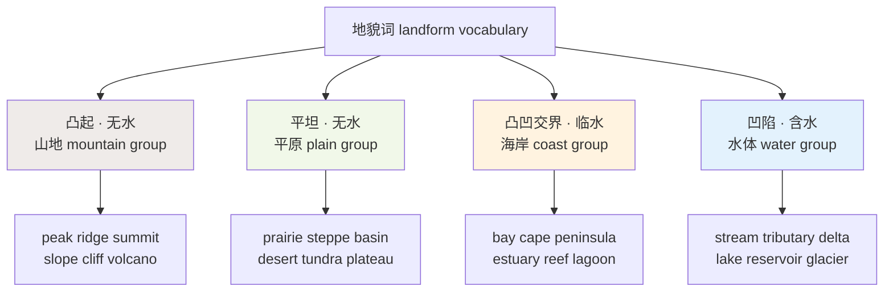
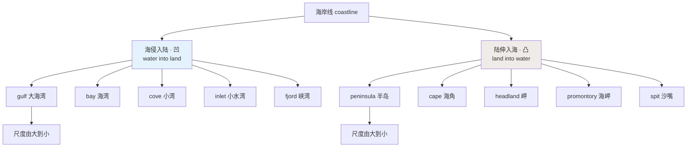
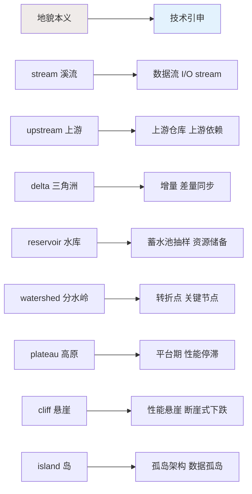
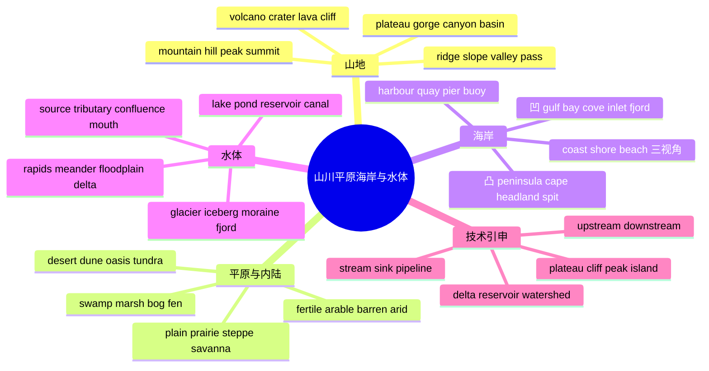

# 山川平原海岸与水体地貌

> [!info] 本篇定位
>
> 天气三篇讲的是「天上发生什么」，本篇转向「地上长什么样」。
>
> 覆盖四组词群：山地（peak / ridge / valley / plateau）、平原与内陆（prairie / steppe / basin）、海岸（cliff / bay / peninsula / estuary）、水体（stream / tributary / delta / reservoir / glacier / lagoon / reef）。
>
> 读完你能做三件事：读地理类文本时不再把 bay 和 gulf、swamp 和 marsh 混成一团；描述一条河时能从 source 说到 mouth 不断链；看到 `upstream`、`delta`、`reservoir sampling`、`Iceberg` 这些技术术语时知道它们借的是哪个地貌意象。
>
> 上一篇是 [[06.天气、自然与地理/03.极端天气、自然灾害与天气预报\|极端天气、自然灾害与天气预报]]，那里的 flood、drought、landslide 与本篇的 floodplain、arid、scree 是同一批地表过程的两个视角。

---

## 1. 本篇导读：地貌词沿两条轴排开

地貌词看起来杂乱，实际上只沿两条轴分布。第一条是**凸起还是凹陷**，第二条是**有水还是无水**。两条轴一交叉，四个象限就把绝大多数地貌词收进去了。



上图的四个板块就是本篇第 3 到第 14 节的顺序。中间两个板块有重叠：`plateau`（高原）既凸起又平坦，`basin`（盆地）既凹陷又可能无水，这类跨象限的词恰恰是最容易记混的，会在各节里单独点出来。

这批词还有一个共同的语言学特征值得先说明：它们分成清晰的三层。日耳曼层的 `hill`、`stream`、`brook`、`shore`、`bank` 都是单音节短词，出现在文学与日常描述里；法语层的 `mountain`、`valley`、`river`、`coast`、`plain` 是中性主力词；拉丁希腊层的 `estuary`、`alluvial`、`archipelago`、`promontory` 属于地理学与技术写作。**同一个地形，三层各有一个词**，选哪个取决于你在写小说还是写论文。这套判断依据在第 1 章讲过，本篇是它第一次在具体主题上大规模兑现。

---

## 2. 通用地形词：先定尺度，再谈形状

描述地貌的第一步不是说出具体地形名，而是选一个尺度合适的总称。`landscape` 是眼睛看到的一整片，`terrain` 强调走上去好不好走，`landform` 是地理学分类单位，三者不能互换。

| 英文 | 英式音标 | 美式音标 | 词性 | 中文 | 搭配与说明 |
| --- | --- | --- | --- | --- | --- |
| **land** | /lænd/ | /lænd/ | n. | 陆地；土地 | 与 sea 对立；dry land 特指「陆地」 |
| **ground** | /ɡraʊnd/ | /ɡraʊnd/ | n. | 地面 | 脚下那一层；high ground 制高点 |
| **soil** | /sɔɪl/ | /sɔɪl/ | n. | 土壤 | 农业与地质用词，不指「地面」 |
| **terrain** | /təˈreɪn/ | /təˈreɪn/ | n. | 地形；地势 | rough / rugged / flat terrain，强调通行难度 |
| **landform** | /ˈlændfɔːm/ | /ˈlændfɔːrm/ | n. | 地貌；地形单元 | 地理学术语，可数 |
| **landscape** | /ˈlændskeɪp/ | /ˈlændskeɪp/ | n. | 景观；风景 | 视觉整体；也指「格局」（引申义） |
| **scenery** | /ˈsiːnəri/ | /ˈsiːnəri/ | n. | 风景 | 不可数，不能说 a scenery |
| **geography** | /dʒiˈɒɡrəfi/ | /dʒiˈɑːɡrəfi/ | n. | 地理；地理学 | 也指「某地的地形状况」 |
| **geology** | /dʒiˈɒlədʒi/ | /dʒiˈɑːlədʒi/ | n. | 地质；地质学 | 关注岩层，不关注表面形状 |
| **topography** | /təˈpɒɡrəfi/ | /təˈpɑːɡrəfi/ | n. | 地形；地势测绘 | 强调高低起伏的测量结果 |
| **contour** | /ˈkɒntʊə/ | /ˈkɑːntʊr/ | n. | 等高线；轮廓 | contour line；地图上的闭合曲线 |
| **elevation** | /ˌelɪˈveɪʃn/ | /ˌelɪˈveɪʃn/ | n. | 海拔；高程 | 美式常用；at an elevation of 1,200 m |
| **altitude** | /ˈæltɪtjuːd/ | /ˈæltɪtuːd/ | n. | 高度；海拔 | 多用于飞行与登山；high-altitude sickness |
| **relief** | /rɪˈliːf/ | /rɪˈliːf/ | n. | 地势起伏 | 地理义；relief map 地形起伏图 |
| **feature** | /ˈfiːtʃə/ | /ˈfiːtʃər/ | n. | 地物；地貌特征 | natural features 自然地物 |
| **basin** | /ˈbeɪsn/ | /ˈbeɪsn/ | n. | 盆地；流域 | 两个义项都常见，靠上下文区分 |

> [!warning] scenery 不可数，landscape 可数
>
> 中文「一处风景」直译过去会出错。
>
> - ❌ ~~We saw a beautiful scenery.~~
> - ✅ We saw **beautiful scenery**.
> - ✅ We saw **a beautiful landscape**.
>
> `scenery` 是集合概念，前面不加不定冠词、不加复数。要说「一处」用 `a landscape`、`a view` 或 `a sight`。

`elevation` 与 `altitude` 的分工也值得记牢。地面上某一点距海平面多高，美式英语和地理文献偏好 `elevation`；飞机、气球、无人机在空中的高度用 `altitude`。登山语境两个都能用，`high altitude`（高海拔）是固定搭配，不说 high elevation sickness。

---

## 3. 山地词群：mountain 之下的六个层级

`mountain` 是总称，但真正描述一座山时，英语要求你指明是在说山的哪个部位。顶、脊、坡、脚、谷各有专词，混用会立刻暴露词汇层次不够。

| 英文 | 英式音标 | 美式音标 | 词性 | 中文 | 搭配与说明 |
| --- | --- | --- | --- | --- | --- |
| **mountain** | /ˈmaʊntɪn/ | /ˈmaʊntn/ | n. | 山；山脉 | 总称；地名中缩写为 Mt. |
| **mount** | /maʊnt/ | /maʊnt/ | n. | 山（专名前缀） | 只用于专名 Mount Everest，不单说 |
| **hill** | /hɪl/ | /hɪl/ | n. | 丘陵；小山 | 日耳曼层短词；无绝对高度界线 |
| **hillock** | /ˈhɪlək/ | /ˈhɪlək/ | n. | 小土丘 | 比 hill 更小，书面词 |
| **knoll** | /nəʊl/ | /noʊl/ | n. | 圆丘 | k 不发音；grassy knoll |
| **mound** | /maʊnd/ | /maʊnd/ | n. | 土堆；坟丘 | 常指人工堆起的 |
| **peak** | /piːk/ | /piːk/ | n. | 山峰；峰顶 | 指整座尖峰，也指最高点 |
| **summit** | /ˈsʌmɪt/ | /ˈsʌmɪt/ | n. | 峰顶 | 只指最高那一点；reach the summit |
| **pinnacle** | /ˈpɪnəkl/ | /ˈpɪnəkl/ | n. | 尖峰；顶点 | 细长的岩尖；引申义「巅峰」 |
| **crest** | /krest/ | /krest/ | n. | 山脊线；顶脊 | 也用于浪峰 the crest of a wave |
| **ridge** | /rɪdʒ/ | /rɪdʒ/ | n. | 山脊；山岭 | 长条形高地；也指屋脊、洋中脊 |
| **spur** | /spɜː/ | /spɜːr/ | n. | 山嘴；支脉 | 从主脊横伸出去的一小段 |
| **saddle** | /ˈsædl/ | /ˈsædl/ | n. | 鞍部 | 两峰之间的低凹处 |
| **col** | /kɒl/ | /kɑːl/ | n. | 山坳；垭口 | 登山术语，比 saddle 更窄 |
| **pass** | /pɑːs/ | /pæs/ | n. | 山口；隘口 | 可通行的鞍部；mountain pass |
| **slope** | /sləʊp/ | /sloʊp/ | n./v. | 斜坡；倾斜 | steep / gentle slope；ski slope 雪道 |
| **hillside** | /ˈhɪlsaɪd/ | /ˈhɪlsaɪd/ | n. | 山坡 | 山体侧面的一整片 |
| **foothill** | /ˈfʊthɪl/ | /ˈfʊthɪl/ | n. | 山麓丘陵 | 常用复数 the foothills of the Alps |
| **foot** | /fʊt/ | /fʊt/ | n. | 山脚 | at the foot of the mountain |
| **valley** | /ˈvæli/ | /ˈvæli/ | n. | 山谷；流域 | 两山之间；the Nile Valley 尼罗河流域 |
| **range** | /reɪndʒ/ | /reɪndʒ/ | n. | 山脉；山系 | a mountain range；平行排列的一列山 |
| **chain** | /tʃeɪn/ | /tʃeɪn/ | n. | 山链 | 与 range 近义，更强调首尾相连 |
| **massif** | /ˈmæsiːf/ | /mæˈsiːf/ | n. | 山块；山丘群 | 法语借词，地质学用；重音英美不同 |
| **highland** | /ˈhaɪlənd/ | /ˈhaɪlənd/ | n./adj. | 高地 | 常用复数 the Highlands 指苏格兰高地 |
| **upland** | /ˈʌplənd/ | /ˈʌplənd/ | n./adj. | 高地；山地的 | 与 lowland 成对 |
| **lowland** | /ˈləʊlənd/ | /ˈloʊlənd/ | n./adj. | 低地 | 地势低平但不一定是平原 |

### 3.1 peak 与 summit 的分工

两个词中文都译「峰顶」，但指的东西不同。`peak` 指**一整座尖锐的山体**，可数、可以命名、可以远看；`summit` 指**山体最高的那一个点**，通常只在「到达」「攀登」语境里用。

> [!example] 同一座山的两种说法
>
> - The **peak** was hidden in cloud all morning.
>   - 那座山峰整个上午都藏在云里。（说的是整座峰）
> - They reached the **summit** just after dawn.
>   - 他们在天刚亮时登顶。（说的是最高那一点）
> - Three **peaks** in this range are over four thousand metres.
>   - 这条山脉里有三座峰超过四千米。（可数、可比较）

`summit` 还有一个高频的政治义项：`summit meeting`（首脑会议），简称 `a summit`。这个引申走的是「最高层」的逻辑，与山顶同源。

### 3.2 ridge 是最被低估的词

`ridge` 在英语里出现的频率远高于中文「山脊」，因为它的适用面广得多：

- 山上的长条高地是 ridge。
- 屋顶两坡相交的那条线也是 ridge（屋脊）。
- 海底两大板块之间隆起的是 `mid-ocean ridge`（洋中脊）。
- 气象图上的高压伸出的舌状区叫 `a ridge of high pressure`（高压脊），这一义项在上一篇天气预报里出现过。
- 机器学习里的 `ridge regression`（岭回归）借的是同一个几何意象。

一个词形，五个领域，这正是本教程反复强调的「一词多域」现象：与其记五个词，不如把 ridge 的核心意象（长条形的隆起）记牢，义项自然分岔出去。

---

## 4. 火山、岩体与坡面物质

山不只有形状，还有材质。读科普文章、看纪录片时，下面这批词的出现密度很高。

| 英文 | 英式音标 | 美式音标 | 词性 | 中文 | 搭配与说明 |
| --- | --- | --- | --- | --- | --- |
| **volcano** | /vɒlˈkeɪnəʊ/ | /vɑːlˈkeɪnoʊ/ | n. | 火山 | 复数 volcanoes 或 volcanos |
| **volcanic** | /vɒlˈkænɪk/ | /vɑːlˈkænɪk/ | adj. | 火山的 | 注意重音在第二音节，元音变 /æ/ |
| **crater** | /ˈkreɪtə/ | /ˈkreɪtər/ | n. | 火山口；坑 | 也指陨石坑 impact crater |
| **caldera** | /kælˈdeərə/ | /kælˈderə/ | n. | 破火山口 | 火山口塌陷后形成的大凹地 |
| **lava** | /ˈlɑːvə/ | /ˈlɑːvə/ | n. | 熔岩 | 流出地表后的；不可数 |
| **magma** | /ˈmæɡmə/ | /ˈmæɡmə/ | n. | 岩浆 | 仍在地下的；与 lava 以地表为界 |
| **eruption** | /ɪˈrʌpʃn/ | /ɪˈrʌpʃn/ | n. | 喷发 | 动词 erupt；a violent eruption |
| **dormant** | /ˈdɔːmənt/ | /ˈdɔːrmənt/ | adj. | 休眠的 | a dormant volcano；对 active / extinct |
| **extinct** | /ɪkˈstɪŋkt/ | /ɪkˈstɪŋkt/ | adj. | 死的；灭绝的 | an extinct volcano 死火山 |
| **cliff** | /klɪf/ | /klɪf/ | n. | 悬崖；峭壁 | 陆上海边都能用；sheer cliff 垂直崖壁 |
| **crag** | /kræɡ/ | /kræɡ/ | n. | 峭壁；岩崖 | 文学与攀岩用词 |
| **bluff** | /blʌf/ | /blʌf/ | n. | 陡岸；断崖 | 美式常见，多指河边土崖 |
| **escarpment** | /ɪˈskɑːpmənt/ | /ɪˈskɑːrpmənt/ | n. | 陡崖；断崖面 | 地质学词，长条形陡坡 |
| **outcrop** | /ˈaʊtkrɒp/ | /ˈaʊtkrɑːp/ | n. | 露头 | 岩层露出地表的部分 |
| **bedrock** | /ˈbedrɒk/ | /ˈbedrɑːk/ | n. | 基岩 | 引申义「根基」：the bedrock of democracy |
| **boulder** | /ˈbəʊldə/ | /ˈboʊldər/ | n. | 巨砾；大圆石 | 单块巨石；bouldering 抱石运动 |
| **scree** | /skriː/ | /skriː/ | n. | 碎石坡 | 英式常用，不可数 |
| **talus** | /ˈteɪləs/ | /ˈteɪləs/ | n. | 岩屑堆 | 美式对应 scree 的词 |
| **gravel** | /ˈɡrævl/ | /ˈɡrævl/ | n. | 砾石 | 不可数；a gravel road 砂石路 |
| **granite** | /ˈɡrænɪt/ | /ˈɡrænɪt/ | n. | 花岗岩 | 硬岩代表；重音在首音节 |
| **limestone** | /ˈlaɪmstəʊn/ | /ˈlaɪmstoʊn/ | n. | 石灰岩 | 溶洞与喀斯特地貌的母岩 |
| **sandstone** | /ˈsændstəʊn/ | /ˈsændstoʊn/ | n. | 砂岩 | 峡谷红壁多为砂岩 |
| **basalt** | /ˈbæsɔːlt/ | /bəˈsɔːlt/ | n. | 玄武岩 | 英美重音位置不同 |
| **avalanche** | /ˈævəlɑːnʃ/ | /ˈævəlæntʃ/ | n. | 雪崩 | 英美词尾读音差别明显 |
| **landslide** | /ˈlændslaɪd/ | /ˈlændslaɪd/ | n. | 滑坡；山体滑坡 | 引申义「压倒性胜选」 |
| **erosion** | /ɪˈrəʊʒn/ | /ɪˈroʊʒn/ | n. | 侵蚀 | 动词 erode；coastal erosion |
| **weathering** | /ˈweðərɪŋ/ | /ˈweðərɪŋ/ | n. | 风化 | 与 erosion 分工见下 |

> [!tip] weathering 与 erosion 不是一回事
>
> `weathering`（风化）是岩石**在原地**被冷热、水分、生物作用破碎；`erosion`（侵蚀）是破碎物**被搬走**。地质学文本里两个词常连用：`weathering and erosion`，顺序不能反，因为先碎后搬。
>
> 判断口诀：物质有没有移动。没动是 weathering，动了是 erosion。

`dormant` 这个词值得单独记。除了休眠火山，它在技术语境里出现得很多：`a dormant account`（休眠账户）、`a dormant thread`（休眠线程）、`dormant code`（长期未执行的代码）。核心义是「还活着但暂时不动」，与 `extinct`（彻底没了）形成对立。

---

## 5. 高原、丘陵与山间通道

`plateau` 是最典型的跨象限词——它是山（凸起）也是平原（表面平坦）。这一节把高地上的平坦地形与山间的低洼通道放在一起，因为它们在描述一片山区时总是成对出现。

| 英文 | 英式音标 | 美式音标 | 词性 | 中文 | 搭配与说明 |
| --- | --- | --- | --- | --- | --- |
| **plateau** | /ˈplætəʊ/ | /plæˈtoʊ/ | n./v. | 高原；停滞期 | 英美重音位置相反，是重音差异的典型 |
| **tableland** | /ˈteɪbllænd/ | /ˈteɪbllænd/ | n. | 台地；高原 | plateau 的日耳曼式同义词 |
| **mesa** | /ˈmeɪsə/ | /ˈmeɪsə/ | n. | 方山；平顶山 | 西班牙语借词，美国西南部地貌 |
| **butte** | /bjuːt/ | /bjuːt/ | n. | 孤峰；孤丘 | 比 mesa 更窄更陡的残丘 |
| **terrace** | /ˈterəs/ | /ˈterəs/ | n. | 阶地；梯田 | river terrace 河流阶地 |
| **gorge** | /ɡɔːdʒ/ | /ɡɔːrdʒ/ | n. | 峡谷 | 窄而深，两壁陡立 |
| **canyon** | /ˈkænjən/ | /ˈkænjən/ | n. | 大峡谷 | 美式用词，比 gorge 大而开阔 |
| **ravine** | /rəˈviːn/ | /rəˈviːn/ | n. | 深谷；沟壑 | 比 gorge 小，常有小溪 |
| **gully** | /ˈɡʌli/ | /ˈɡʌli/ | n. | 冲沟 | 雨水冲刷出来的小沟 |
| **defile** | /dɪˈfaɪl/ | /dɪˈfaɪl/ | n. | 狭道；隘路 | 军事地理用词，低频 |
| **basin** | /ˈbeɪsn/ | /ˈbeɪsn/ | n. | 盆地 | 四周高中间低；the Tarim Basin |
| **depression** | /dɪˈpreʃn/ | /dɪˈpreʃn/ | n. | 洼地 | 地理义；与心理义、气象义同形 |
| **hollow** | /ˈhɒləʊ/ | /ˈhɑːloʊ/ | n./adj. | 洼地；空心的 | 小型凹地，文学色彩 |
| **cave** | /keɪv/ | /keɪv/ | n. | 洞穴 | 天然的；cave painting 洞穴壁画 |
| **cavern** | /ˈkævən/ | /ˈkævərn/ | n. | 大山洞 | 比 cave 大且深，书面词 |
| **karst** | /kɑːst/ | /kɑːrst/ | n. | 喀斯特地貌 | 石灰岩溶蚀地形；桂林地貌即是 |
| **sinkhole** | /ˈsɪŋkhəʊl/ | /ˈsɪŋkhoʊl/ | n. | 落水洞；塌陷坑 | 地面突然塌下去形成的 |

### 5.1 gorge、canyon、ravine、valley 的宽窄序列

四个词是同一维度上的四个刻度，从窄到宽排开：

```text
ravine  <  gorge  <  canyon  <  valley
沟壑       峡谷      大峡谷     山谷
窄深       窄而极深   宽而极深   宽而缓
```

`valley` 的底部通常是平的，能住人、能耕种；`gorge` 的底部往往只容得下一条河；`canyon` 是美式英语的专属词，英式文本里描述同样的地形多半会用 `gorge`，只有 the Grand Canyon 这类专名例外。`ravine` 规模最小，常出现在森林与丘陵地带的描写里。

> [!warning] plateau 的英美重音
>
> 这是英美重音差异最容易被忽略的一个词。
>
> - 英式 /ˈplætəʊ/，重音在**前**。
> - 美式 /plæˈtoʊ/，重音在**后**。
>
> 它还有一个高频动词义「进入平台期」：`Sales plateaued in the third quarter.`（第三季度销售额进入平台期。）这个用法在技术与商业文本里比地理义还常见，形容学习曲线、性能曲线、增长曲线都可以。

---

## 6. 平原与草地：plain、prairie、steppe、savanna

四个词中文都可能译成「草原」，但它们指的是四块地球上互不相同的地方，误用会显得对世界地理没概念。

| 英文 | 英式音标 | 美式音标 | 词性 | 中文 | 搭配与说明 |
| --- | --- | --- | --- | --- | --- |
| **plain** | /pleɪn/ | /pleɪn/ | n. | 平原 | 常用复数 the Great Plains；与形容词 plain 同形 |
| **prairie** | /ˈpreəri/ | /ˈpreri/ | n. | 北美大草原 | 特指北美中部，高草为主 |
| **steppe** | /step/ | /step/ | n. | 干草原 | 特指欧亚内陆，草矮而稀 |
| **savanna** | /səˈvænə/ | /səˈvænə/ | n. | 稀树草原 | 热带，草地上零星散布树木；也拼 savannah |
| **pampas** | /ˈpæmpəs/ | /ˈpæmpəz/ | n. | 潘帕斯草原 | 特指南美，形式为复数 |
| **grassland** | /ˈɡrɑːslænd/ | /ˈɡræslænd/ | n. | 草地；草原 | 最中性的总称，可数亦可不可数 |
| **meadow** | /ˈmedəʊ/ | /ˈmedoʊ/ | n. | 草甸；牧草地 | 湿润、有野花，规模小 |
| **pasture** | /ˈpɑːstʃə/ | /ˈpæstʃər/ | n. | 牧场 | 供牲畜吃草的地；put out to pasture |
| **moor** | /mɔː/ | /mʊr/ | n. | 荒野；高沼地 | 英国特有地貌，酸性土、长石楠 |
| **heath** | /hiːθ/ | /hiːθ/ | n. | 荒原；石楠丛 | 与 moor 近义，地势更低 |
| **field** | /fiːld/ | /fiːld/ | n. | 田地；旷野 | 有边界的一块地 |
| **plateau** | /ˈplætəʊ/ | /plæˈtoʊ/ | n. | 高原 | 与平原的差别只在海拔 |
| **flatland** | /ˈflætlænd/ | /ˈflætlænd/ | n. | 平地 | 口语化，与 hill country 对举 |
| **prairie dog** | /ˈpreəri dɒɡ/ | /ˈpreri dɔːɡ/ | n. | 草原犬鼠 | 复合词；不是狗，是啮齿类 |
| **turf** | /tɜːf/ | /tɜːrf/ | n. | 草皮 | 也指「地盘」：turf war 地盘之争 |
| **sod** | /sɒd/ | /sɑːd/ | n. | 草皮块 | 美式常用；sod house 草皮屋 |

### 6.1 四个草原词的地理归属

| 词 | 所指地域 | 植被特征 | 典型地名 |
| --- | --- | --- | --- |
| **prairie** | 北美中部 | 高草为主，土层深厚 | the Great Plains，美国玉米带与小麦带 |
| **steppe** | 欧亚内陆 | 草矮而稀，年降水少 | 蒙古高原、哈萨克斯坦，游牧文明带 |
| **savanna** | 非洲及热带 | 草地上零星散布乔木 | Serengeti，大型食草动物迁徙区 |
| **pampas** | 南美温带 | 湿润高草，形式恒为复数 | 阿根廷牛肉与皮革产区 |

这四个词是**地域专名化**的普通名词。用 `steppe` 描述北美，或用 `prairie` 描述蒙古，母语者会觉得别扭，就像中文里把内蒙古草原叫「潘帕斯」一样。要说一个中性的、不带地域指向的词，用 `grassland`——它没有地域负担，在学术写作与国际报告里也是标准词。

`savanna` 还有一个拼写问题值得留意：英式与美式都接受 `savanna` 与 `savannah` 两种拼法，但美国佐治亚州那座城市固定拼 Savannah，不能省掉词尾的 h。

`plain` 需要额外注意：它和形容词 `plain`（朴素的、明白的）完全同形，且都高频。`in plain English`（用大白话说）与 `on the plains`（在平原上）里的 plain 是两个词源分支——形容词来自拉丁 planus「平的」，名词也来自同一个词根，只是义项走远了。

> [!example] plain 的名词与形容词
>
> - The road runs straight across the **plain**.
>   - 这条路笔直穿过平原。（名词）
> - Just give me the **plain** facts.
>   - 把事实原原本本告诉我就行。（形容词）
> - It's **plain** that the design won't scale.
>   - 这个设计显然扛不住扩容。（形容词，「明显的」）

---

## 7. 盆地、荒漠与苔原

无水或少水的内陆地貌集中在这一节。这批词在气候变化、能源、地缘政治类文章里出现频率很高。

| 英文 | 英式音标 | 美式音标 | 词性 | 中文 | 搭配与说明 |
| --- | --- | --- | --- | --- | --- |
| **desert** | /ˈdezət/ | /ˈdezərt/ | n. | 沙漠；荒漠 | 重音在前；与动词 desert /dɪˈzɜːt/ 区分 |
| **dune** | /djuːn/ | /duːn/ | n. | 沙丘 | 英式保留 /j/，美式脱落；sand dune |
| **oasis** | /əʊˈeɪsɪs/ | /oʊˈeɪsɪs/ | n. | 绿洲 | 复数 oases /əʊˈeɪsiːz/ |
| **arid** | /ˈærɪd/ | /ˈærɪd/ | adj. | 干旱的 | arid climate；比 dry 更正式 |
| **semi-arid** | /ˌsemiˈærɪd/ | /ˌsemiˈærɪd/ | adj. | 半干旱的 | 学术写作常用 |
| **barren** | /ˈbærən/ | /ˈbærən/ | adj. | 贫瘠的；不毛的 | barren land；也可形容「无成果」 |
| **fertile** | /ˈfɜːtaɪl/ | /ˈfɜːrtl/ | adj. | 肥沃的 | 英美词尾读音差别大；名词 fertility |
| **arable** | /ˈærəbl/ | /ˈærəbl/ | adj. | 可耕的 | arable land 耕地，农业统计标准词 |
| **tundra** | /ˈtʌndrə/ | /ˈtʌndrə/ | n. | 苔原；冻原 | 高纬无树带；下有永冻层 |
| **taiga** | /ˈtaɪɡə/ | /ˈtaɪɡə/ | n. | 泰加林；针叶林带 | 苔原以南的针叶林 |
| **steppe** | /step/ | /step/ | n. | 干草原 | 见上节；常与荒漠相邻 |
| **wasteland** | /ˈweɪstlænd/ | /ˈweɪstlænd/ | n. | 荒地；不毛之地 | 也用于引申：a cultural wasteland |
| **salt flat** | /ˈsɔːlt flæt/ | /ˈsɔːlt flæt/ | n. | 盐滩 | 常用复数 salt flats |
| **sandstorm** | /ˈsændstɔːm/ | /ˈsændstɔːrm/ | n. | 沙尘暴 | 与上一篇的极端天气衔接 |
| **desertification** | /dɪˌzɜːtɪfɪˈkeɪʃn/ | /dɪˌzɜːrtɪfɪˈkeɪʃn/ | n. | 荒漠化 | 环境议题高频词 |
| **erosion** | /ɪˈrəʊʒn/ | /ɪˈroʊʒn/ | n. | 侵蚀 | soil erosion 水土流失 |

> [!warning] desert 的两个读音是两个词
>
> - 名词 **desert**「沙漠」：/ˈdezət/ · /ˈdezərt/，重音在**前**。
> - 动词 **desert**「抛弃、开小差」：/dɪˈzɜːt/ · /dɪˈzɜːrt/，重音在**后**。
> - 名词 **dessert**「甜点」：/dɪˈzɜːt/ · /dɪˈzɜːrt/，拼写多一个 s，读音与动词 desert 相同。
>
> - ❌ ~~We crossed the /dɪˈzɜːrt/.~~
> - ✅ We crossed the **/ˈdezərt/**.
>
> 记忆钩子：甜点（dessert）比沙漠（desert）多一个 s，因为「甜点想再来一份」。这是少数几个真正好用的拼写助记。

### 7.1 湿地四兄弟：swamp、marsh、bog、fen

湿地词是中文母语者的重灾区，因为中文只有「沼泽」一个常用词。英语里四个词各有明确的水文与植被条件。

| 英文 | 英式音标 | 美式音标 | 词性 | 中文 | 搭配与说明 |
| --- | --- | --- | --- | --- | --- |
| **wetland** | /ˈwetlənd/ | /ˈwetlənd/ | n. | 湿地 | 总称，环保文件标准词，常用复数 |
| **swamp** | /swɒmp/ | /swɑːmp/ | n./v. | 沼泽（有树） | 长树的湿地；动词义「淹没、压垮」 |
| **marsh** | /mɑːʃ/ | /mɑːrʃ/ | n. | 沼泽（无树） | 长草与芦苇，不长树 |
| **bog** | /bɒɡ/ | /bɑːɡ/ | n. | 泥炭沼；酸沼 | 靠雨水补给，酸性，积泥炭 |
| **fen** | /fen/ | /fen/ | n. | 碱沼；低位沼 | 靠地下水补给，偏碱性 |
| **mangrove** | /ˈmæŋɡrəʊv/ | /ˈmæŋɡroʊv/ | n. | 红树林 | 热带海岸的咸水湿地 |
| **peat** | /piːt/ | /piːt/ | n. | 泥炭 | 不可数；peat bog；苏格兰威士忌的烟熏味来源 |
| **quagmire** | /ˈkwæɡmaɪə/ | /ˈkwæɡmaɪər/ | n. | 泥潭；困境 | 引申义远比本义常用 |
| **mudflat** | /ˈmʌdflæt/ | /ˈmʌdflæt/ | n. | 泥滩 | 潮间带地貌，常用复数 |
| **floodplain** | /ˈflʌdpleɪn/ | /ˈflʌdpleɪn/ | n. | 泛滥平原；洪泛区 | 城市规划与保险文件高频词 |

判别口诀：**有树是 swamp，没树是 marsh；雨养是 bog，地下水养是 fen。** 前一对看植被，后一对看水源。日常写作里如果拿不准，用 `wetland` 兜底永远不会错。

`swamp` 的动词义使用频率其实高于名词义，值得单独掌握：

> [!example] swamp 作动词
>
> - We were **swamped** with support tickets after the release.
>   - 版本发布后我们被工单淹没了。
> - The small boat was **swamped** by a wave.
>   - 小船被一个浪打进了水。

---

## 8. 海岸线：凹进去的和凸出来的

海岸词有一个极其规整的内部结构：一半描述**海侵入陆地**（凹），一半描述**陆伸入海洋**（凸）。按这个对立记，二十多个词一次就能理清。



上图的两列都按尺度从大到小排。左列 `gulf` 最大（墨西哥湾、波斯湾都是 gulf），`inlet` 最小；右列 `peninsula` 最大（伊比利亚半岛、阿拉伯半岛），`spit` 最小。记住两个极端，中间的词自然就有了位置感。

| 英文 | 英式音标 | 美式音标 | 词性 | 中文 | 搭配与说明 |
| --- | --- | --- | --- | --- | --- |
| **coast** | /kəʊst/ | /koʊst/ | n. | 海岸 | 从地图或大尺度看的陆海分界 |
| **coastline** | /ˈkəʊstlaɪn/ | /ˈkoʊstlaɪn/ | n. | 海岸线 | 强调那条线本身的形状与长度 |
| **shore** | /ʃɔː/ | /ʃɔːr/ | n. | 岸；岸边 | 从水面看向陆地；湖岸河岸也用 |
| **shoreline** | /ˈʃɔːlaɪn/ | /ˈʃɔːrlaɪn/ | n. | 岸线 | 水陆实际相接的那条线，随潮位变 |
| **seaside** | /ˈsiːsaɪd/ | /ˈsiːsaɪd/ | n. | 海滨 | 英式度假语境；go to the seaside |
| **beach** | /biːtʃ/ | /biːtʃ/ | n. | 海滩 | 有沙或砾石的那一段岸 |
| **sand** | /sænd/ | /sænd/ | n. | 沙 | 不可数；the sands 指大片沙滩 |
| **pebble** | /ˈpebl/ | /ˈpebl/ | n. | 鹅卵石 | 可数；pebble beach |
| **shingle** | /ˈʃɪŋɡl/ | /ˈʃɪŋɡl/ | n. | 卵石滩 | 英式；不可数，指整片砾石 |
| **cliff** | /klɪf/ | /klɪf/ | n. | 海崖 | the white cliffs of Dover |
| **headland** | /ˈhedlənd/ | /ˈhedlənd/ | n. | 岬；海角 | 高而突出的一块陆地 |
| **promontory** | /ˈprɒməntri/ | /ˈprɑːməntɔːri/ | n. | 海岬 | headland 的正式同义词 |
| **cape** | /keɪp/ | /keɪp/ | n. | 海角 | 多用于专名 Cape Town、Cape Horn |
| **peninsula** | /pəˈnɪnsjələ/ | /pəˈnɪnsələ/ | n. | 半岛 | 三面环水；形容词 peninsular |
| **isthmus** | /ˈɪsməs/ | /ˈɪsməs/ | n. | 地峡 | th 不发音；the Isthmus of Panama |
| **spit** | /spɪt/ | /spɪt/ | n. | 沙嘴 | 从岸伸出的细长沙脊 |
| **bay** | /beɪ/ | /beɪ/ | n. | 海湾 | 最通用的凹岸词 |
| **gulf** | /ɡʌlf/ | /ɡʌlf/ | n. | 海湾（大） | 比 bay 大；引申义「鸿沟」 |
| **cove** | /kəʊv/ | /koʊv/ | n. | 小海湾 | 小而隐蔽，常有沙滩 |
| **inlet** | /ˈɪnlet/ | /ˈɪnlet/ | n. | 小湾；水口 | 窄口深入内陆 |
| **fjord** | /fjɔːd/ | /fjɔːrd/ | n. | 峡湾 | 冰川刻出的深窄海湾；也拼 fiord |
| **strait** | /streɪt/ | /streɪt/ | n. | 海峡 | 常用复数 the Straits of Malacca |
| **channel** | /ˈtʃænl/ | /ˈtʃænl/ | n. | 海峡；水道 | the English Channel 英吉利海峡 |
| **sound** | /saʊnd/ | /saʊnd/ | n. | 海湾；海峡 | 地理义；Puget Sound |
| **estuary** | /ˈestʃuəri/ | /ˈestʃueri/ | n. | 河口湾 | 河海交汇、受潮汐影响的一段 |
| **tide** | /taɪd/ | /taɪd/ | n. | 潮汐 | high tide 涨潮，low tide 落潮 |
| **tidal** | /ˈtaɪdl/ | /ˈtaɪdl/ | adj. | 潮汐的 | tidal range 潮差 |
| **surf** | /sɜːf/ | /sɜːrf/ | n./v. | 拍岸浪；冲浪 | 不可数名词；surf the web 是引申 |
| **swell** | /swel/ | /swel/ | n./v. | 涌浪；膨胀 | 远处传来的长周期波 |
| **undertow** | /ˈʌndətəʊ/ | /ˈʌndərtoʊ/ | n. | 回卷流；离岸流 | 游泳安全警示词 |

### 8.1 coast、shore、beach 三个词怎么选

这是本篇最实用的一组辨析，因为三个词的中文都可能是「海边」。

| 英文 | 英式音标 | 美式音标 | 词性 | 中文 | 搭配与说明 |
| --- | --- | --- | --- | --- | --- |
| **coast** | /kəʊst/ | /koʊst/ | n. | 海岸（地理区域） | 从地图上看的一条带；the east coast |
| **shore** | /ʃɔː/ | /ʃɔːr/ | n. | 岸（水陆界线） | 从水上看的岸；swim to shore |
| **beach** | /biːtʃ/ | /biːtʃ/ | n. | 沙滩（可活动的地面） | 能躺、能走、能玩的那一段 |

三者的视角不同：`coast` 是**地图视角**，说的是一整片沿海区域，所以能说 `the west coast of the US`（美国西海岸）指几千公里的地带；`shore` 是**水上视角**，落水的人游向 shore，不游向 coast；`beach` 是**脚下视角**，指具体那块能踩的沙地。

> [!example] 三个词各自的典型句
>
> - We drove down the **coast** from Seattle to San Diego.
>   - 我们沿海岸从西雅图开到圣迭戈。（大尺度区域）
> - The swimmer finally reached the **shore**.
>   - 那名游泳者终于游到了岸边。（水陆界线）
> - The kids spent all afternoon on the **beach**.
>   - 孩子们整个下午都在沙滩上。（具体地面）

`shore` 还有一个高频派生：`offshore`（离岸的）与 `onshore`（在岸的）。这两个词在能源与金融语境里的使用频率远高于地理语境：`offshore wind farm`（海上风电场）、`offshore account`（离岸账户）、`offshore development`（离岸外包开发）。

### 8.2 bay 与 gulf 的分界不在大小

多数教材说 `gulf` 比 `bay` 大，这个说法方向对但不精确。更可靠的判据是**开口的收窄程度**：`gulf` 通常有一个相对窄的入口，像一个被陆地几乎包起来的大水袋；`bay` 的开口相对开阔。孟加拉湾（the Bay of Bengal）面积远大于许多 gulf，但它开口极宽，所以是 bay。

`gulf` 的引申义使用极广：`the gulf between rich and poor`（贫富鸿沟）、`bridge the gulf`（弥合分歧）。这个引申走的是「难以跨越的宽阔空隙」意象，比 `gap` 更强烈也更正式。

---

## 9. 港湾与人工海岸设施

这批词在物流、贸易、旅游类文本里出现频率很高，而且藏着几个读音陷阱。

| 英文 | 英式音标 | 美式音标 | 词性 | 中文 | 搭配与说明 |
| --- | --- | --- | --- | --- | --- |
| **harbour** | /ˈhɑːbə/ | — | n. | 港湾 | 英式拼写；也作动词「怀有」 |
| **harbor** | — | /ˈhɑːrbər/ | n. | 港湾 | 美式拼写；同一个词 |
| **port** | /pɔːt/ | /pɔːrt/ | n. | 港口 | 侧重商业与行政；port authority 港务局 |
| **dock** | /dɒk/ | /dɑːk/ | n./v. | 船坞；靠岸 | 也指容器化里的 Docker 词源 |
| **quay** | /kiː/ | /kiː/ | n. | 码头 | 读音陷阱，读作 key，不读 /kweɪ/ |
| **wharf** | /wɔːf/ | /wɔːrf/ | n. | 码头 | 复数 wharves 或 wharfs |
| **pier** | /pɪə/ | /pɪr/ | n. | 栈桥；突堤 | 伸入水中的长条建筑 |
| **jetty** | /ˈdʒeti/ | /ˈdʒeti/ | n. | 防波堤；小码头 | 比 pier 短而实心 |
| **breakwater** | /ˈbreɪkwɔːtə/ | /ˈbreɪkwɔːtər/ | n. | 防波堤 | 专门挡浪的结构 |
| **seawall** | /ˈsiːwɔːl/ | /ˈsiːwɔːl/ | n. | 海堤；护岸墙 | 气候适应工程高频词 |
| **lighthouse** | /ˈlaɪthaʊs/ | /ˈlaɪthaʊs/ | n. | 灯塔 | 复合词，重音在前 |
| **buoy** | /bɔɪ/ | /ˈbuːi/ | n./v. | 浮标；使浮起 | 英美读音差别极大 |
| **anchor** | /ˈæŋkə/ | /ˈæŋkər/ | n./v. | 锚；抛锚 | ch 读 /k/；引申「支柱、主播」 |
| **mooring** | /ˈmɔːrɪŋ/ | /ˈmʊrɪŋ/ | n. | 系泊处 | 动词 moor 与荒野 moor 同形不同源 |
| **marina** | /məˈriːnə/ | /məˈriːnə/ | n. | 游艇码头 | 与 marine 同根，重音在中 |
| **shipping lane** | /ˈʃɪpɪŋ leɪn/ | /ˈʃɪpɪŋ leɪn/ | n. | 航道 | 也说 sea lane |

> [!warning] 三个读音陷阱
>
> - **quay** 读 /kiː/，与 key 完全同音。看到 Circular Quay（悉尼环形码头）不要读成 /kweɪ/。
> - **buoy** 英式 /bɔɪ/ 与 boy 同音，美式 /ˈbuːi/ 两个音节。两种读法差别之大，在英语常用词里罕见。
> - **isthmus** 读 /ˈɪsməs/，中间的 th 完全不发音，像 asthma /ˈæsmə/ 一样。

`harbour` / `harbor` 是英美拼写差异的标准例子，同类的还有 `colour/color`、`neighbour/neighbor`。在地貌词里这一组特别值得留意，因为专名不随读者变化：悉尼是 Sydney Harbour，珍珠港永远是 Pearl Harbor，写成另一边的拼法就是错的。

---

## 10. 岛屿、礁、潟湖与三角洲

从海岸再往外，就是岛与礁的世界。这一节还包括河海交汇处的两个关键词 `estuary` 与 `delta`——它们看起来都是「河口」，实际上是两种相反的地貌过程。

| 英文 | 英式音标 | 美式音标 | 词性 | 中文 | 搭配与说明 |
| --- | --- | --- | --- | --- | --- |
| **island** | /ˈaɪlənd/ | /ˈaɪlənd/ | n. | 岛 | s 不发音，是拼写史上的一次误加 |
| **isle** | /aɪl/ | /aɪl/ | n. | 岛（诗体/专名） | the British Isles；s 同样不发音 |
| **islet** | /ˈaɪlət/ | /ˈaɪlət/ | n. | 小岛 | -let 是缩小后缀 |
| **archipelago** | /ˌɑːkɪˈpeləɡəʊ/ | /ˌɑːrkɪˈpeləɡoʊ/ | n. | 群岛 | 希腊词根；重音在第三音节 |
| **atoll** | /ˈætɒl/ | /ˈætɔːl/ | n. | 环礁 | 环形珊瑚礁，中间围着潟湖 |
| **reef** | /riːf/ | /riːf/ | n. | 礁；暗礁 | coral reef 珊瑚礁；the Great Barrier Reef |
| **coral** | /ˈkɒrəl/ | /ˈkɔːrəl/ | n. | 珊瑚 | coral bleaching 珊瑚白化 |
| **shoal** | /ʃəʊl/ | /ʃoʊl/ | n. | 浅滩；沙洲 | 也指「鱼群」，同形两义 |
| **sandbar** | /ˈsændbɑː/ | /ˈsændbɑːr/ | n. | 沙洲；沙坝 | 河口与海岸都有 |
| **lagoon** | /ləˈɡuːn/ | /ləˈɡuːn/ | n. | 潟湖 | 被沙洲或礁盘隔开的浅水 |
| **mainland** | /ˈmeɪnlænd/ | /ˈmeɪnlænd/ | n. | 大陆；本土 | 与离岛对举 |
| **continent** | /ˈkɒntɪnənt/ | /ˈkɑːntɪnənt/ | n. | 洲；大陆 | 形容词 continental |
| **estuary** | /ˈestʃuəri/ | /ˈestʃueri/ | n. | 河口湾 | 河口被淹没、向海张开的喇叭形 |
| **delta** | /ˈdeltə/ | /ˈdeltə/ | n. | 三角洲 | 泥沙淤积、向海推进的扇形 |
| **distributary** | /dɪˈstrɪbjətri/ | /dɪˈstrɪbjəteri/ | n. | 汊流；分流 | 三角洲上河流分叉出去的支汊 |
| **alluvial** | /əˈluːviəl/ | /əˈluːviəl/ | adj. | 冲积的 | alluvial plain 冲积平原 |
| **silt** | /sɪlt/ | /sɪlt/ | n./v. | 淤泥；淤积 | silt up 淤塞 |
| **sediment** | /ˈsedɪmənt/ | /ˈsedɪmənt/ | n. | 沉积物 | 不可数；动词 sedimentation |
| **trench** | /trentʃ/ | /trentʃ/ | n. | 海沟；沟渠 | the Mariana Trench 马里亚纳海沟 |
| **seabed** | /ˈsiːbed/ | /ˈsiːbed/ | n. | 海床 | 美式也说 ocean floor |
| **continental shelf** | /ˌkɒntɪˈnentl ʃelf/ | /ˌkɑːntɪˈnentl ʃelf/ | n. | 大陆架 | 海洋法与能源开发核心词 |
| **abyss** | /əˈbɪs/ | /əˈbɪs/ | n. | 深渊 | 形容词 abyssal；文学引申义强 |

### 10.1 estuary 与 delta 是两个相反的过程

两个词都在河海交汇处，方向却相反。`estuary` 是**海赢了**：海平面上升淹没了河谷，河口变宽变深，成一个喇叭口，潮水能一直涌进内陆（泰晤士河口就是典型）。`delta` 是**河赢了**：河流带下来的泥沙淤积速度超过海浪的搬运速度，陆地不断向海推进，河道在上面分成许多汊（尼罗河、密西西比河、长江口都是典型）。

一个判据：看河口是**张开**还是**长出去**。张开是 estuary，长出去是 delta。

> [!tip] delta 这个词的来历与引申
>
> `delta` 就是希腊字母 Δ（大写德尔塔）。尼罗河口的形状像倒过来的三角形，希腊人直接用字母名给它命名，后来这个词被推广到所有同类地貌。
>
> 数学与工程里的 `delta`（增量、差值）走的是另一条路——来自 Δ 表示「difference」的传统。技术文档里的 `delta encoding`（增量编码）、`delta sync`（差量同步）、Delta Lake 用的都是这一支，与三角洲无关但共用同一个字母名。这是英语里同一个借词沿两条线各自发展的典型案例。

---

## 11. 河流：从 source 到 mouth 的完整词链

描述一条河，英语有一条从上游到下游的固定词序。掌握这条链，读任何地理与水利文本都不会断档。


上图是一条河从生到死的完整生命线。左边三格是上游（水量小、坡度大、侵蚀为主），中间三格是中游（水量增大、开始弯曲），右边三格是下游（坡度极缓、淤积为主）。地理教材、纪录片解说词、水利报告都按这个顺序展开，词也按这个顺序被引入。

| 英文 | 英式音标 | 美式音标 | 词性 | 中文 | 搭配与说明 |
| --- | --- | --- | --- | --- | --- |
| **river** | /ˈrɪvə/ | /ˈrɪvər/ | n. | 河；江 | 英语不区分「江」「河」，都是 river |
| **stream** | /striːm/ | /striːm/ | n./v. | 溪流；流动 | 比 river 小；动词义在技术语境极常用 |
| **brook** | /brʊk/ | /brʊk/ | n. | 小溪 | 文学与英式；比 stream 更小 |
| **creek** | /kriːk/ | /kriːk/ | n. | 小河；小湾 | 美式指小河，英式指海边小湾 |
| **rivulet** | /ˈrɪvjələt/ | /ˈrɪvjələt/ | n. | 细流 | 书面词，很小的一股水 |
| **tributary** | /ˈtrɪbjətri/ | /ˈtrɪbjəteri/ | n./adj. | 支流 | 与 trib「贡献」同根，向主流「进贡」 |
| **confluence** | /ˈkɒnfluəns/ | /ˈkɑːnfluəns/ | n. | 汇流处；汇合 | con-「共」+ flu「流」；引申「多因素汇聚」 |
| **source** | /sɔːs/ | /sɔːrs/ | n. | 源头 | the source of the Nile |
| **headwaters** | /ˈhedwɔːtəz/ | /ˈhedwɔːtərz/ | n. | 河源区 | 恒用复数 |
| **mouth** | /maʊθ/ | /maʊθ/ | n. | 河口 | at the mouth of the river |
| **bank** | /bæŋk/ | /bæŋk/ | n. | 河岸 | 与「银行」同形；the left bank 左岸 |
| **riverbed** | /ˈrɪvəbed/ | /ˈrɪvərbed/ | n. | 河床 | 也分写 river bed |
| **channel** | /ˈtʃænl/ | /ˈtʃænl/ | n. | 河道；水道 | 也指电视频道、通信信道 |
| **current** | /ˈkʌrənt/ | /ˈkɜːrənt/ | n. | 水流；洋流 | 与形容词 current「当前的」同形 |
| **flow** | /fləʊ/ | /floʊ/ | n./v. | 流量；流动 | flow rate 流速；river flow 径流 |
| **discharge** | /ˈdɪstʃɑːdʒ/ | /ˈdɪstʃɑːrdʒ/ | n. | 流量；排放 | 名词重音在前，动词在后 |
| **rapids** | /ˈræpɪdz/ | /ˈræpɪdz/ | n. | 急流；湍滩 | 恒用复数；shoot the rapids 闯滩 |
| **waterfall** | /ˈwɔːtəfɔːl/ | /ˈwɔːtərfɔːl/ | n. | 瀑布 | 也指软件开发的瀑布模型 |
| **cascade** | /kæˈskeɪd/ | /kæˈskeɪd/ | n./v. | 小瀑布；层叠 | CSS 的 C 就是这个词 |
| **meander** | /miˈændə/ | /miˈændər/ | n./v. | 曲流；蜿蜒 | 来自土耳其一条弯曲的河名 |
| **oxbow lake** | /ˈɒksbəʊ leɪk/ | /ˈɑːksboʊ leɪk/ | n. | 牛轭湖 | 曲流被截断后残留的弯月形湖 |
| **levee** | /ˈlevi/ | /ˈlevi/ | n. | 河堤；天然堤 | 美式常用，密西西比河治理核心词 |
| **embankment** | /ɪmˈbæŋkmənt/ | /ɪmˈbæŋkmənt/ | n. | 堤岸；路堤 | 英式常用 |
| **ford** | /fɔːd/ | /fɔːrd/ | n./v. | 浅滩；涉水而过 | 地名后缀 -ford 即由此来（Oxford） |
| **watershed** | /ˈwɔːtəʃed/ | /ˈwɔːtərʃed/ | n. | 分水岭；流域 | 英式指分水线，美式指整个流域 |
| **catchment** | /ˈkætʃmənt/ | /ˈkætʃmənt/ | n. | 集水区 | catchment area 也指「服务覆盖区」 |
| **drainage** | /ˈdreɪnɪdʒ/ | /ˈdreɪnɪdʒ/ | n. | 排水；水系 | drainage basin 流域 |
| **navigable** | /ˈnævɪɡəbl/ | /ˈnævɪɡəbl/ | adj. | 可通航的 | a navigable river |
| **upstream** | /ˌʌpˈstriːm/ | /ˌʌpˈstriːm/ | adv./adj. | 上游 | 技术义：上游仓库、上游依赖 |
| **downstream** | /ˌdaʊnˈstriːm/ | /ˌdaʊnˈstriːm/ | adv./adj. | 下游 | 技术义：下游服务、下游消费者 |

### 11.1 stream、brook、creek、river 的规模序列

四个词按水量从小到大排：`rivulet < brook < stream < river`，而 `creek` 的位置取决于你在哪个国家。

在美国，`creek` 是小河，大致等于英式的 `stream` 或 `brook`，规模在 stream 与 river 之间浮动，地名里极常见（Battle Creek、Walnut Creek）。在英国和澳大利亚，`creek` 指的是海岸边一条窄窄的潮汐水道，属于海岸词而不是河流词。同一个词在两岸指两种地貌，这在地貌词里是少见的分裂。

> [!warning] 英语没有「江」「河」之分
>
> 中文用「江」「河」区分南北或大小，英语一律 river。
>
> - 长江 → the Yangtze **River**
> - 黄河 → the Yellow **River**
>
> 反过来，英语靠 river / stream / brook / creek 区分**规模**，中文没有对应的四级刻度。翻译时只能靠加修饰语：「一条小溪」「一条大河」。这是典型的语言切分不对称，不要指望一一对应。

`bank` 是这一节最容易出问题的词，因为它与「银行」完全同形。两个义项其实同源——都来自日耳曼语「长凳、堆」的意思，钱庄最早在长凳上办公。判断靠搭配：`the river bank`、`the left bank of the Seine` 是河岸；`the bank of England`、`bank account` 是银行。

---

## 12. 静水与人工水体

从流动的水转到不流动的水，再转到人造的水体。`reservoir` 是本节最重要的词，因为它在技术语境里的复用率极高。

| 英文 | 英式音标 | 美式音标 | 词性 | 中文 | 搭配与说明 |
| --- | --- | --- | --- | --- | --- |
| **lake** | /leɪk/ | /leɪk/ | n. | 湖 | 专名中大写 Lake Baikal |
| **pond** | /pɒnd/ | /pɑːnd/ | n. | 池塘 | 比 lake 小，可人工可天然 |
| **pool** | /puːl/ | /puːl/ | n. | 水池；水洼 | 也指泳池、资源池（connection pool） |
| **puddle** | /ˈpʌdl/ | /ˈpʌdl/ | n. | 水坑 | 雨后地面的小积水 |
| **lagoon** | /ləˈɡuːn/ | /ləˈɡuːn/ | n. | 潟湖 | 也指污水处理塘 |
| **reservoir** | /ˈrezəvwɑː/ | /ˈrezərvwɑːr/ | n. | 水库；储藏 | 法语借词，词尾 -oir 读 /wɑː/ |
| **dam** | /dæm/ | /dæm/ | n./v. | 水坝；拦截 | dam up 堵住 |
| **weir** | /wɪə/ | /wɪr/ | n. | 堰 | 比 dam 矮，水可漫过顶 |
| **sluice** | /sluːs/ | /sluːs/ | n. | 水闸 | sluice gate 闸门 |
| **canal** | /kəˈnæl/ | /kəˈnæl/ | n. | 运河；渠 | 重音在后；the Suez Canal |
| **ditch** | /dɪtʃ/ | /dɪtʃ/ | n./v. | 沟渠；抛弃 | 动词义「甩掉」在口语里高频 |
| **aqueduct** | /ˈækwɪdʌkt/ | /ˈækwədʌkt/ | n. | 输水渡槽 | aqua「水」+ duct「导管」 |
| **spring** | /sprɪŋ/ | /sprɪŋ/ | n. | 泉 | 与「春天」「弹簧」同形三义 |
| **well** | /wel/ | /wel/ | n. | 井 | 也指油井 oil well |
| **geyser** | /ˈɡiːzə/ | /ˈɡaɪzər/ | n. | 间歇泉 | 英美读音差别极大，冰岛语借词 |
| **hot spring** | /ˌhɒt ˈsprɪŋ/ | /ˌhɑːt ˈsprɪŋ/ | n. | 温泉 | 日式温泉也说 onsen |
| **aquifer** | /ˈækwɪfə/ | /ˈækwɪfər/ | n. | 含水层 | 地下水资源核心词 |
| **groundwater** | /ˈɡraʊndwɔːtə/ | /ˈɡraʊndwɔːtər/ | n. | 地下水 | 不可数 |
| **water table** | /ˈwɔːtə teɪbl/ | /ˈwɔːtər teɪbl/ | n. | 地下水位 | 不是「水表」，是水位面 |
| **irrigation** | /ˌɪrɪˈɡeɪʃn/ | /ˌɪrɪˈɡeɪʃn/ | n. | 灌溉 | 动词 irrigate |
| **freshwater** | /ˈfreʃwɔːtə/ | /ˈfreʃwɔːtər/ | adj./n. | 淡水的 | 对 saltwater / seawater |
| **brackish** | /ˈbrækɪʃ/ | /ˈbrækɪʃ/ | adj. | 半咸的 | 河口水的标准描述词 |
| **stagnant** | /ˈstæɡnənt/ | /ˈstæɡnənt/ | adj. | 死水的；停滞的 | 引申义「停滞不前」高频 |
| **catch basin** | /ˈkætʃ beɪsn/ | /ˈkætʃ beɪsn/ | n. | 集水井；雨水口 | 市政工程词，分写；英式多说 gully |

> [!tip] reservoir 的拼写与读音
>
> 这个词是法语借词，拼写与读音的对应完全不符合英语规则，只能整体记：
>
> ```text
> res · er · voir
> /ˈrez/ /ə/  /vwɑː/     英式
> /ˈrez/ /ər/ /vwɑːr/    美式
> ```
>
> 词尾 `-voir` 读 /vwɑː(r)/，与 `repertoire`（/ˈrepətwɑː/ 保留剧目）、`memoir`（/ˈmemwɑː/ 回忆录）、`abattoir`（/ˈæbətwɑː/ 屠宰场）同一模式。把这四个词一起记，一个规则解决四个词。

`reservoir` 的引申义在技术与医学写作里非常活跃：`a reservoir of talent`（人才储备）、`a reservoir of infection`（传染源、病原储存宿主）、`reservoir sampling`（蓄水池抽样算法）。核心意象都是「一个装着东西、可持续取用的容器」。

---

## 13. 冰川与冰蚀地貌

冰川词看起来偏门，实际上气候变化报道让它们变成了新闻高频词。而且这一组词里藏着英美读音差异最大的一个常用词。

| 英文 | 英式音标 | 美式音标 | 词性 | 中文 | 搭配与说明 |
| --- | --- | --- | --- | --- | --- |
| **glacier** | /ˈɡlæsiə/ | /ˈɡleɪʃər/ | n. | 冰川 | 英美读音差异最大的地貌词之一 |
| **glacial** | /ˈɡleɪʃl/ | /ˈɡleɪʃl/ | adj. | 冰川的；极慢的 | at a glacial pace 慢得像冰川移动 |
| **ice sheet** | /ˈaɪs ʃiːt/ | /ˈaɪs ʃiːt/ | n. | 冰盖 | 格陵兰与南极那两块 |
| **ice cap** | /ˈaɪs kæp/ | /ˈaɪs kæp/ | n. | 冰帽 | 比 ice sheet 小 |
| **iceberg** | /ˈaɪsbɜːɡ/ | /ˈaɪsbɜːrɡ/ | n. | 冰山 | the tip of the iceberg 冰山一角 |
| **floe** | /fləʊ/ | /floʊ/ | n. | 浮冰 | ice floe；与 flow 同音不同词 |
| **crevasse** | /krəˈvæs/ | /krəˈvæs/ | n. | 冰隙；冰裂缝 | 重音在后；与 crevice 区分 |
| **crevice** | /ˈkrevɪs/ | /ˈkrevɪs/ | n. | 裂缝；缝隙 | 重音在前，指岩石上的小裂缝 |
| **moraine** | /məˈreɪn/ | /məˈreɪn/ | n. | 冰碛 | 冰川搬运堆积的石砾 |
| **cirque** | /sɜːk/ | /sɜːrk/ | n. | 冰斗 | 法语借词，qu 读 /k/ |
| **tarn** | /tɑːn/ | /tɑːrn/ | n. | 冰斗湖 | 英式山区用词 |
| **fjord** | /fjɔːd/ | /fjɔːrd/ | n. | 峡湾 | 冰川刻槽后被海水淹没 |
| **permafrost** | /ˈpɜːməfrɒst/ | /ˈpɜːrməfrɔːst/ | n. | 永久冻土 | 甲烷释放议题核心词 |
| **meltwater** | /ˈmeltwɔːtə/ | /ˈmeltwɔːtər/ | n. | 融水 | 不可数 |
| **snowline** | /ˈsnəʊlaɪn/ | /ˈsnoʊlaɪn/ | n. | 雪线 | 常年积雪的下界 |
| **treeline** | /ˈtriːlaɪn/ | /ˈtriːlaɪn/ | n. | 林线；树线 | 树木能生长的上界 |
| **alpine** | /ˈælpaɪn/ | /ˈælpaɪn/ | adj. | 高山的 | 来自 the Alps；alpine climate |
| **retreat** | /rɪˈtriːt/ | /rɪˈtriːt/ | n./v. | 退缩；后退 | glacier retreat 冰川退缩 |
| **calving** | /ˈkɑːvɪŋ/ | /ˈkævɪŋ/ | n. | 崩解 | 冰川末端断落成冰山；来自「产犊」 |
| **thaw** | /θɔː/ | /θɔː/ | n./v. | 解冻 | 引申义「关系缓和」：a diplomatic thaw |

> [!warning] glacier 的英美读音
>
> - 英式 /ˈɡlæsiə/：第一个音节是 /ɡlæs/，像 glass。
> - 美式 /ˈɡleɪʃər/：第一个音节是 /ɡleɪ/，像 glay，中间的 ci 读 /ʃ/。
>
> 两种读法差了元音也差了辅音，是同一个词在两岸分化最彻底的例子之一，和 `schedule`（/ˈʃedjuːl/ 对 /ˈskedʒuːl/）属于同一类现象。听纪录片时如果对不上，多半就是这个原因。

`calving` 这个词的来源值得一提：本义是母牛产犊（a cow calves），冰川末端崩落一块冰进海里，形状与过程被类比成「生下一块冰」，于是借用了这个词。这类从畜牧到地理的隐喻迁移在英语地貌词里不少，`the mouth of a river`（河口）、`the foot of a hill`（山脚）、`the head of a valley`（谷首）走的都是人体或动物的意象。

---

## 14. 十组高频辨析

前面各节按板块给词，这一节横向切一刀，把最容易混的十组集中处理。

### 14.1 mountain 与 hill

英语没有官方高度界线。英国传统上把 300 米（约 1000 英尺）作为参考，但这不是规定。实际用法靠**相对感觉与惯例**：苏格兰的 Ben Nevis 只有一千多米，仍叫 mountain；某些地方两百米的隆起因为周围极平，当地人也叫 mountain。判断标准是「相对于周围地面显得高不高」，而不是绝对海拔。

### 14.2 valley 与 basin

`valley` 是**两侧有山、有出口**的长条低地，水能流出去；`basin` 是**四周被围、可能没有出口**的碗形洼地。塔里木盆地是 basin（内流区），莱茵河谷是 valley（水流入海）。但 `basin` 还有第二个义项「流域」——`the Amazon Basin`（亚马逊流域）指的是整个集水范围，这时它反而包含许多 valley。

### 14.3 stream 与 creek 与 brook

见第 11.1 节。补一条实用规则：写国际读者都读的文本时，用 `stream` 最安全，它在英美澳都指同一种东西。

### 14.4 bay 与 gulf 与 cove

见第 8.2 节。补充 `cove`：小、隐蔽、常有沙滩，是度假与文学描写的词，不用在地理统计里。

### 14.5 island 与 isle

`island` 是通用词，`isle` 只在诗歌、专名和旅游宣传里出现（the Isle of Man、the British Isles、the Emerald Isle 指爱尔兰）。两个词的 s 都不发音，原因是 `island` 本来是古英语 `īgland`，中世纪学者误以为它跟法语 `isle` 同源，硬加了一个 s 进去——加错了却保留至今。

### 14.6 cliff 与 slope 与 hillside

三个词是坡度的三档：`cliff` 接近垂直，`slope` 是任意角度的斜面（可陡可缓），`hillside` 是山的一整个侧面（默认可以行走）。要强调「陡到爬不上去」用 `sheer cliff`；要强调「缓到能耕种」用 `gentle slope`。

### 14.7 coast 与 shore 与 beach

见第 8.1 节。

### 14.8 swamp 与 marsh 与 bog 与 fen

见第 7.1 节。口诀：有树 swamp，无树 marsh，雨养 bog，泉养 fen。

### 14.9 estuary 与 delta

见第 10.1 节。判据是河口张开还是长出去。

### 14.10 peak 与 summit 与 top

见第 3.1 节。补 `top`：最口语的一个，`the top of the hill` 在日常对话里比 summit 自然得多。`summit` 用在登山与正式描述里，`peak` 用在指认某座山峰时。

> [!warning] 这十组的共同错误模式
>
> 中文母语者的错误不是选错词，而是**选了一个过于精确的词**。看到「海边」就想用 promontory、estuary、archipelago 这类看起来专业的词，结果在日常语境里显得刻意。
>
> - ❌ We walked along the **promontory** yesterday evening.（除非确实是一个岬角，否则过于书面）
> - ✅ We walked along the **shore** yesterday evening.
>
> 默认用中性词（coast、shore、river、lake、hill、valley），只有在这个具体地形确实需要区分时才启用精确词。这条原则在第 1 章的语域分层里讲过，本篇是它在具象名词上的兑现。

---

## 15. 地貌词在技术文档里的引申义

对以读技术文档为目标的学习者，这一节的实用价值可能高于前面所有词表。地貌词是英语技术术语最大的隐喻来源之一，理解本义能让术语的含义变得可推。



上图列的八组只是最常见的。规律是：**地貌词提供空间直觉，技术领域借这个直觉描述抽象结构**。掌握本义之后，遇到新的技术隐喻通常不需要查词典就能猜对。

| 英文 | 英式音标 | 美式音标 | 词性 | 中文 | 搭配与说明 |
| --- | --- | --- | --- | --- | --- |
| **stream** | /striːm/ | /striːm/ | n./v. | 流；流式传输 | input stream；streaming API；本义是溪流 |
| **upstream** | /ˌʌpˈstriːm/ | /ˌʌpˈstriːm/ | adj./adv. | 上游的 | upstream repo；提交合并的方向 |
| **downstream** | /ˌdaʊnˈstriːm/ | /ˌdaʊnˈstriːm/ | adj./adv. | 下游的 | downstream service 调用链下游 |
| **pipeline** | /ˈpaɪplaɪn/ | /ˈpaɪplaɪn/ | n. | 管道；流水线 | CI/CD pipeline；本义是输油管 |
| **source** | /sɔːs/ | /sɔːrs/ | n. | 源；数据源 | data source；本义是河源 |
| **sink** | /sɪŋk/ | /sɪŋk/ | n. | 汇；接收端 | data sink；与 source 成对 |
| **tributary** | /ˈtrɪbjətri/ | /ˈtrɪbjəteri/ | n. | 支流 | 技术文档里少见，但读地理背景文常见 |
| **delta** | /ˈdeltə/ | /ˈdeltə/ | n. | 增量；差量 | delta encoding；Delta Lake |
| **reservoir** | /ˈrezəvwɑː/ | /ˈrezərvwɑːr/ | n. | 蓄水池；储备 | reservoir sampling 蓄水池抽样 |
| **watershed** | /ˈwɔːtəʃed/ | /ˈwɔːtərʃed/ | n. | 分水岭；转折点 | a watershed moment 关键转折 |
| **plateau** | /ˈplætəʊ/ | /plæˈtoʊ/ | n./v. | 平台期；进入停滞 | performance plateaued 性能停在平台 |
| **cliff** | /klɪf/ | /klɪf/ | n. | 断崖；急剧下跌 | a latency cliff 延迟断崖 |
| **ridge** | /rɪdʒ/ | /rɪdʒ/ | n. | 脊；岭 | ridge regression 岭回归 |
| **valley** | /ˈvæli/ | /ˈvæli/ | n. | 谷；低谷 | the uncanny valley 恐怖谷 |
| **peak** | /piːk/ | /piːk/ | n./adj. | 峰值 | peak traffic 峰值流量；peak QPS |
| **island** | /ˈaɪlənd/ | /ˈaɪlənd/ | n. | 孤岛 | data island 数据孤岛；islands architecture |
| **iceberg** | /ˈaɪsbɜːɡ/ | /ˈaɪsbɜːrɡ/ | n. | 冰山 | Apache Iceberg 表格式；tip of the iceberg |
| **glacier** | /ˈɡlæsiə/ | /ˈɡleɪʃər/ | n. | 冰川 | S3 Glacier 冷归档存储，取「极慢」义 |
| **basin** | /ˈbeɪsn/ | /ˈbeɪsn/ | n. | 盆地；吸引域 | basin of attraction（动力系统） |
| **cascade** | /kæˈskeɪd/ | /kæˈskeɪd/ | n./v. | 层叠；级联 | Cascading Style Sheets；cascade delete |
| **flood** | /flʌd/ | /flʌd/ | n./v. | 洪水；泛洪 | flooding 泛洪路由；flood fill 漫水填充 |
| **drift** | /drɪft/ | /drɪft/ | n./v. | 漂移 | config drift 配置漂移；clock drift 时钟漂移 |
| **erosion** | /ɪˈrəʊʒn/ | /ɪˈroʊʒn/ | n. | 侵蚀；蚕食 | margin erosion 利润侵蚀 |
| **bottleneck** | /ˈbɒtlnek/ | /ˈbɑːtlnek/ | n. | 瓶颈 | 本义是瓶颈，与山口 pass 同类意象 |

> [!example] 技术句里的地貌词
>
> - We need to pull the latest changes from **upstream** before rebasing.
>   - rebase 之前得先从上游拉最新改动。
> - The service reads from a Kafka **stream** and writes to a **sink** in S3.
>   - 该服务从 Kafka 数据流读入，写到 S3 的接收端。
> - Throughput **plateaued** at around eight thousand requests per second.
>   - 吞吐量在每秒八千请求左右进入平台期。
> - Cold data is moved to **Glacier** after ninety days.
>   - 冷数据九十天后转入 Glacier 归档层。
> - This release was a **watershed** for the project's architecture.
>   - 这个版本是该项目架构的分水岭。

`upstream` 与 `downstream` 值得单独练熟，因为它们在三个不同的技术语境里都高频出现，而且含义方向一致：

- **Git**：upstream 是你 fork 的原仓库，你的改动向上游合并。
- **依赖管理**：upstream 是被你依赖的库，downstream 是依赖你的项目。
- **服务调用**：调用方在上游，被调用方在下游（这一条与前两条方向感相反，容易混，注意上下文）。

---

## 16. 地名读音陷阱

地貌词学得再好，读错专名一样会露怯。下面这些是英语文本里出现频率高、且中国学习者容易按拼写硬读的地名。

| 英文 | 英式音标 | 美式音标 | 词性 | 中文 | 搭配与说明 |
| --- | --- | --- | --- | --- | --- |
| **Thames** | /temz/ | /temz/ | n. | 泰晤士河 | Th 读 /t/，a 读 /e/，最反直觉的一个 |
| **Arkansas** | /ˈɑːkənsɔː/ | /ˈɑːrkənsɔː/ | n. | 阿肯色（州/河） | 词尾 -sas 读 /sɔː/，不读 /zəs/ |
| **Seine** | /seɪn/ | /seɪn/ | n. | 塞纳河 | 保留法语读音 |
| **Rhine** | /raɪn/ | /raɪn/ | n. | 莱茵河 | 德语 Rhein 的英语形 |
| **Danube** | /ˈdænjuːb/ | /ˈdænjuːb/ | n. | 多瑙河 | 重音在首音节 |
| **Ganges** | /ˈɡændʒiːz/ | /ˈɡændʒiːz/ | n. | 恒河 | g 读 /dʒ/，词尾读 /iːz/ |
| **Euphrates** | /juːˈfreɪtiːz/ | /juːˈfreɪtiːz/ | n. | 幼发拉底河 | 四个音节，重音在第二 |
| **Nile** | /naɪl/ | /naɪl/ | n. | 尼罗河 | 单音节 |
| **Amazon** | /ˈæməzən/ | /ˈæməzɑːn/ | n. | 亚马逊河 | 词尾元音英美不同 |
| **Yangtze** | /ˈjæŋtsi/ | /ˈjæŋtsi/ | n. | 长江 | 两个音节；正式场合说 the Yangtze River |
| **Everest** | /ˈevərɪst/ | /ˈevərɪst/ | n. | 珠穆朗玛峰 | 三个音节，重音在首 |
| **Himalayas** | /ˌhɪməˈleɪəz/ | /ˌhɪməˈleɪəz/ | n. | 喜马拉雅山脉 | 恒用复数带 the |
| **Andes** | /ˈændiːz/ | /ˈændiːz/ | n. | 安第斯山脉 | 两个音节，词尾 /iːz/ |
| **Alps** | /ælps/ | /ælps/ | n. | 阿尔卑斯山 | 单音节；the Alps |
| **Sahara** | /səˈhɑːrə/ | /səˈhærə/ | n. | 撒哈拉沙漠 | 中间元音英美不同 |
| **Yosemite** | /jəʊˈsemɪti/ | /joʊˈsemɪti/ | n. | 优胜美地 | 四个音节，词尾读 /ti/ 不是无声 e |
| **Arctic** | /ˈɑːktɪk/ | /ˈɑːrktɪk/ | n./adj. | 北极（的） | 第一个 c 常被吞，标准读音要发 |
| **Antarctic** | /ænˈtɑːktɪk/ | /ænˈtɑːrktɪk/ | n./adj. | 南极（的） | 同上，中间的 c 要发 |
| **Mediterranean** | /ˌmedɪtəˈreɪniən/ | /ˌmedɪtəˈreɪniən/ | n./adj. | 地中海（的） | 六个音节，重音在第四 |
| **Pacific** | /pəˈsɪfɪk/ | /pəˈsɪfɪk/ | adj./n. | 太平洋（的） | 第一个 c 读 /s/，第二个读 /k/ |

> [!tip] 记地名读音的两条捷径
>
> 第一条：**看借入语言**。Seine、fjord、cirque、massif、mesa、butte 这些词保留了源语言的读音习惯，按英语拼读规则硬拼一定错。看到明显不像英语的拼写组合，先假设它是借词。
>
> 第二条：**专名读音会被简化**。Thames 读 /temz/、Arkansas 读 /ˈɑːrkənsɔː/、Leicester 读 /ˈlestə/、Worcester 读 /ˈwʊstə/，都是几百年口语磨损的结果。这类词无法推导，只能逐个记，好在数量有限。
>
> 拼读规则的完整体系与失效词清单在第 01 章的自然拼读一篇里，本节只处理地理专名这一小块。

---

## 17. 例句集训：把词串成描述

单个词记住之后，还需要能把它们组织成一段完整的地理描述。下面按三种典型语篇给出示范。

> [!example] 描述一片山区
>
> - The **range** runs north to south, with three **peaks** above four thousand metres.
>   - 这条山脉南北走向，有三座山峰超过四千米。
> - A narrow **pass** at the **saddle** between the two summits is the only crossing.
>   - 两峰之间鞍部的一个狭窄山口是唯一的通道。
> - Below the **treeline**, the **slopes** are covered in pine; above it, bare **scree**.
>   - 林线以下坡面覆盖着松林，以上是裸露的碎石坡。
> - **Foothills** on the eastern side give way to a broad **plateau**.
>   - 东侧的山麓丘陵过渡为一片开阔的高原。

> [!example] 描述一条河
>
> - The river rises at a **spring** high in the **headwaters** and flows east.
>   - 这条河发源于河源区高处的一眼泉，向东流。
> - Two **tributaries** join it at the **confluence** below the gorge.
>   - 两条支流在峡谷下方的汇流处汇入。
> - Downstream the channel **meanders** across a wide **floodplain**.
>   - 下游河道在宽阔的泛滥平原上蜿蜒。
> - At its **mouth** the river splits into a **delta** with a dozen **distributaries**.
>   - 在河口处，河流分成有十几条汊流的三角洲。

> [!example] 描述一段海岸
>
> - Chalk **cliffs** run for miles along this stretch of **coast**.
>   - 白垩崖沿着这段海岸绵延数英里。
> - A sheltered **cove** lies just west of the **headland**.
>   - 岬角以西有一处避风的小海湾。
> - **Offshore**, a coral **reef** encloses a shallow **lagoon**.
>   - 离岸处，一圈珊瑚礁围出一片浅浅的潟湖。
> - At low **tide** the **mudflats** stretch out for half a kilometre.
>   - 退潮时泥滩向外延伸半公里。

三段的共同点：**先给总称，再给部位，最后给细节**。这是英语地理描述的默认信息顺序，与中文习惯基本一致，可以直接迁移。差别在于英语要求部位词更精确——中文可以连说三个「山」，英语必须在 range / peak / slope / foothill 之间切换。

---

## 18. 本篇小结



这张图把全篇按四个板块加一条技术引申线收拢。四个板块的排列顺序与正文一致，从山地到水体正好是「从高到低、从干到湿」；最下面那支技术引申不是第五类地貌，而是前四支的投影——每个技术词都能在上面四支里找到本义出处。复习时从任一板块的第一行往下背，背不出的那一行就是要回去重读的小节。

> [!success] 本篇核心要点回顾
>
> 1. 地貌词沿**凸起与凹陷、有水与无水**两条轴分布，四个象限对应山地、平原、海岸、水体四个板块。
> 2. 山地词必须指明部位：`peak` 是整座尖峰，`summit` 只是最高那一点，`ridge` 是长条脊线，`col` 与 `pass` 是山间通道。
> 3. `prairie`、`steppe`、`savanna`、`pampas` 是**地域专名化**的草原词，各指一块具体大陆；要说中性总称用 `grassland`。
> 4. 湿地四词的判据是：**有树 swamp，无树 marsh，雨养 bog，泉养 fen**；拿不准就用 `wetland`。
> 5. 海岸词分成凹（gulf / bay / cove / inlet / fjord）与凸（peninsula / cape / headland / spit）两列各按尺度排序；`coast` 是地图视角，`shore` 是水上视角，`beach` 是脚下视角，三者不可互换。
> 6. 一条河的词链固定为 source → stream → tributary → confluence → meander → floodplain → estuary/delta → mouth，其中 `estuary` 是海淹没河谷形成的喇叭口，`delta` 是泥沙淤积推出的扇形，两者过程相反。
> 7. 英美读音差别最大的三个地貌词是 **glacier**、**buoy**、**plateau**（后者是重音差异）；`quay` 读 /kiː/ 是纯读音陷阱。
> 8. 地貌词是技术术语的主要隐喻来源：upstream、delta、reservoir、watershed、plateau、cliff、island 的技术义都能从本义推出来。

> [!success] 本篇练习清单
>
> - [ ] 用 peak、summit、ridge、slope、foothill 五个词描述一座你去过的山，每个词一句
> - [ ] 说清 prairie、steppe、savanna 分别指哪块大陆，各配一个地名
> - [ ] 默写湿地四词的判别口诀，并说出 swamp 的动词义与一个例句
> - [ ] 把 gulf、bay、cove、inlet 按尺度从大到小排序，再把 peninsula、cape、headland、spit 排一遍
> - [ ] 判断这三句该用 coast / shore / beach 中的哪个：沿海开车、游到岸边、在沙上晒太阳
> - [ ] 按 source 到 mouth 的顺序说出至少八个河流部位词，再用自己的话讲清 estuary 与 delta 的成因差别，各举一条真实河流
> - [ ] 读出 glacier、buoy、quay、Thames、Arkansas、plateau 六个词的英式与美式发音
> - [ ] 从技术引申表里挑五个词，各写一句真实出现在你工作里的英文句子

### 18.1 下一篇预告

> [!info] 下一篇：从地面抬头看天
>
> 本篇把地面上的形状讲完了，下一篇转向天上与时间：星体名称、日月运行、昼夜与四季的天文成因，以及气候变化议题的核心词汇。
>
> [[06.天气、自然与地理/05.天体宇宙、自然节律与气候环境议题\|天体宇宙、自然节律与气候环境议题]]
>
> 会覆盖 planet / orbit / eclipse / constellation 这一组天体词，solstice / equinox / dawn / dusk / tide 这一组节律词，以及 emission / carbon footprint / renewable / sustainability 这一组环境议题词。本篇的 glacier、permafrost、desertification、sea level 在那一篇里会作为气候变化的地表证据再次出现，两篇合起来构成完整的自然主题闭环。
