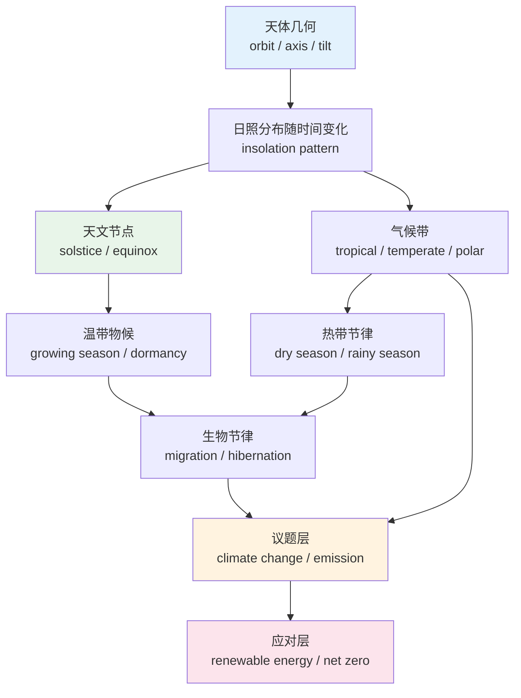
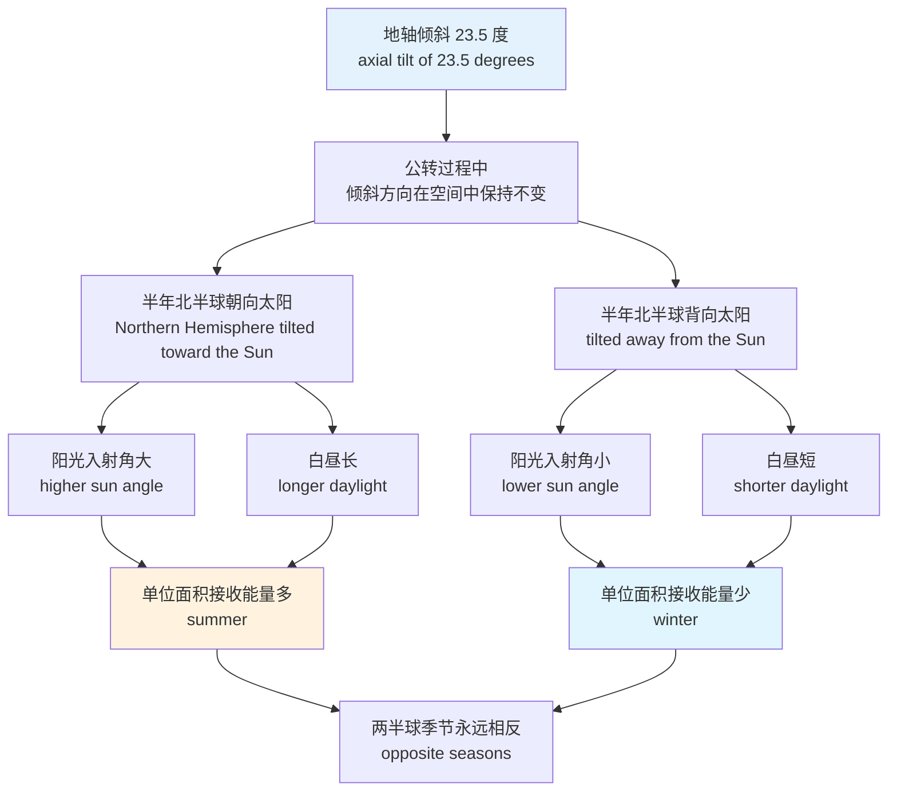
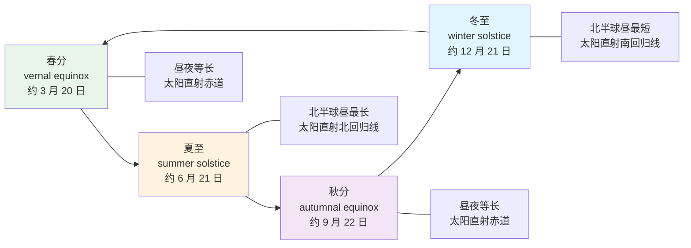
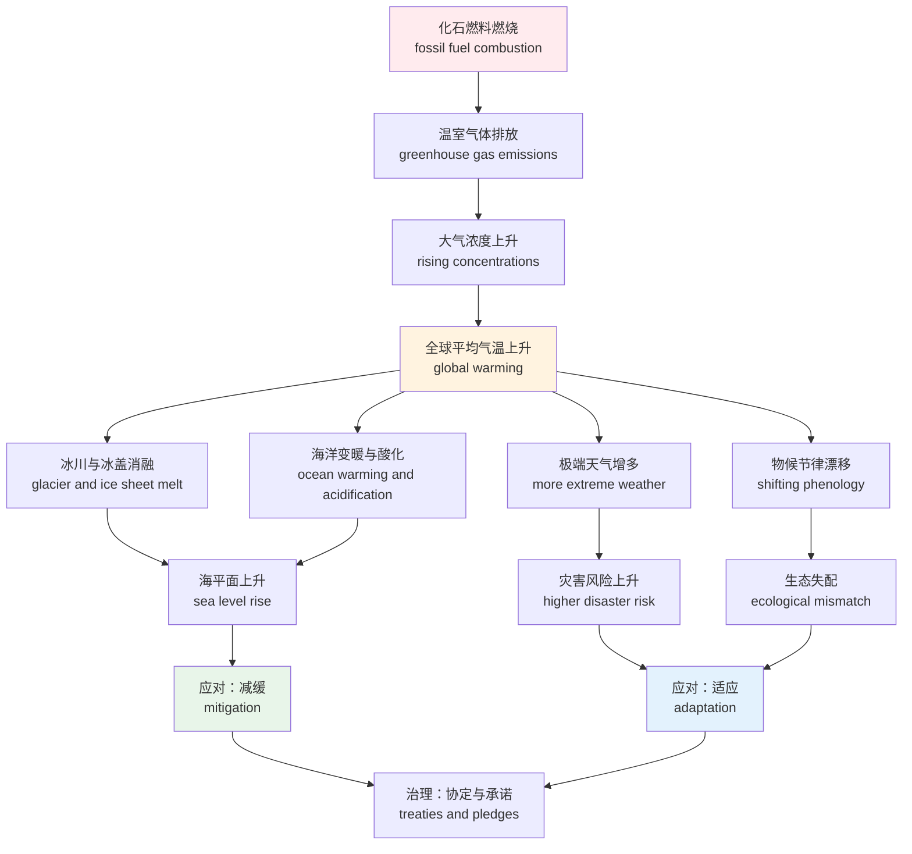
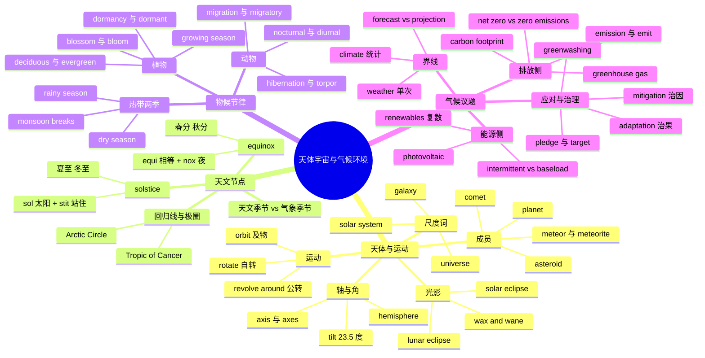

# 天体宇宙、自然节律与气候环境议题

> [!info] 本篇定位
>
> 06 章的收尾篇，也是全章里跨度最大的一篇：从太阳系一路写到碳中和。
>
> 三条线索串在一起：天体的位置与运动（orbit、axis、tilt）决定了地球接收到的日照分布，日照分布决定了 solstice、equinox 这些天文节点和 growing season、migration 这些物候节律，而人类活动改变大气成分之后，这套节律本身成了 climate change 讨论的对象。
>
> 前四篇讲的是「今天什么天气」，本篇讲的是「为什么会有天气」和「天气长期在变成什么样」。季节名称词 spring / summer / autumn / winter 本身已在 `04.英语场景` 与本章第 01 篇处理过，本篇只讲季节作为天文与物候现象的那一面，不再重复解释词形。
>
> 读完能做到两件事：读懂英文科普里描述天体运动和季节成因的段落；读懂一份英文的气候报告或企业 ESG 页面，认得 emission、offset、net zero、renewable 这套术语各指什么。

---

## 1. 本篇导读：一条从天文到政策的词链

这一篇的词表看起来跨度很大——`asteroid` 和 `carbon footprint` 表面上毫无关系。把它们放进同一篇是因为它们在真实文本里就是连着出现的。任意一篇讲气候的英文报道，开头两段几乎一定会提到地球接收太阳辐射的方式，中间提到季节反常，结尾提到减排政策。这三段用的词分属三个层，但读者必须一次性认全才能读顺。

三层的关系是单向的：

上图从上到下就是本篇的章节顺序。最上层是纯几何：地球绕太阳跑的路径 `orbit` 加上自转轴 `axis` 的倾角 `tilt`，两者相乘决定了地表每一点在一年里接收多少阳光。第二层把这个连续变化切成离散节点：一年四个节点是 `solstice` 和 `equinox`，同时纬度方向切出 `tropical`、`temperate`、`polar` 三条带。第三层是生物对这套节律的响应——温带的植物有 `growing season` 和 `dormancy` 的切换，热带的植物响应的不是温度而是 `dry season` 与 `rainy season` 的降水切换，动物则表现为 `migration` 和 `hibernation`。最下面两层是近三十年才进入日常英语的部分：当大气成分被改变，上述节律整体漂移，讨论这件事的词就是 `climate change`、`emission`、`carbon footprint`，讨论怎么办的词是 `renewable energy`、`net zero`。

对自学者来说，这条链的实际价值在于：读到 `The growing season has lengthened by two weeks` 这种句子时，能立刻反应过来它同时属于物候层和气候变化层，而不是当成两个陌生词。

---

## 2. 宇宙的尺度词：从 space 到 galaxy

这一组是最外层的容器词，数量不多但极常用，而且几个近义词的所指范围差别很大。

| 英文 | 英式音标 | 美式音标 | 词性 | 中文 | 搭配与说明 |
| --- | --- | --- | --- | --- | --- |
| **space** | /speɪs/ | /speɪs/ | n. | 太空；空间 | 表「太空」时不加冠词：in space，不说 in the space |
| **outer space** | /ˌaʊtə ˈspeɪs/ | /ˌaʊtər ˈspeɪs/ | n. | 外层空间 | 强调地球大气层之外，法律文本常用 |
| **universe** | /ˈjuːnɪvɜːs/ | /ˈjuːnɪvɜːrs/ | n. | 宇宙 | 几乎总带定冠词 the universe |
| **cosmos** | /ˈkɒzmɒs/ | /ˈkɑːzmoʊs/ | n. | 宇宙 | 比 universe 文学化，形容词 cosmic |
| **cosmic** | /ˈkɒzmɪk/ | /ˈkɑːzmɪk/ | adj. | 宇宙的 | cosmic ray 宇宙射线 |
| **galaxy** | /ˈɡæləksi/ | /ˈɡæləksi/ | n. | 星系 | 复数 galaxies；the Galaxy 大写特指银河系 |
| **the Milky Way** | /ˌmɪlki ˈweɪ/ | /ˌmɪlki ˈweɪ/ | n. | 银河 | 固定带 the，字面「奶路」 |
| **solar system** | /ˈsəʊlə ˈsɪstəm/ | /ˈsoʊlər ˈsɪstəm/ | n. | 太阳系 | 特指我们这个系时带 the |
| **celestial** | /səˈlestiəl/ | /səˈlestʃəl/ | adj. | 天体的 | celestial body 天体，正式书面词 |
| **astronomy** | /əˈstrɒnəmi/ | /əˈstrɑːnəmi/ | n. | 天文学 | 与 astrology 只差一个词根 |
| **astronomer** | /əˈstrɒnəmə/ | /əˈstrɑːnəmər/ | n. | 天文学家 | — |
| **astrology** | /əˈstrɒlədʒi/ | /əˈstrɑːlədʒi/ | n. | 占星术 | 不是科学，混用会显得很外行 |
| **astrophysics** | /ˌæstrəʊˈfɪzɪks/ | /ˌæstroʊˈfɪzɪks/ | n. | 天体物理学 | 形式复数，谓语用单数 |
| **light-year** | /ˈlaɪt jɪə/ | /ˈlaɪt jɪr/ | n. | 光年 | 距离单位不是时间单位 |
| **vacuum** | /ˈvækjuːm/ | /ˈvækjuːm/ | n. | 真空 | 也指吸尘器，动词 to vacuum |
| **void** | /vɔɪd/ | /vɔɪd/ | n./adj. | 虚空；无效的 | 法律义 null and void 无效 |
| **vast** | /vɑːst/ | /væst/ | adj. | 广袤的 | 英美元音差异典型词 |

`universe` 和 `cosmos` 中文都译「宇宙」，用法不重合。`universe` 是中性的科学词，物理学论文用它；`cosmos` 带一点哲学与美学色彩，强调宇宙作为有秩序的整体（词源就是希腊语「秩序」），科普散文和诗里更多。日常口语里 `universe` 还有一个转义用法：`in her universe`（在她的世界里），`cosmos` 没有这个用法。

> [!warning] astronomy 与 astrology 只差一个音节
>
> 两个词共享 `astro-`「星」这个词根，但后半截差别决定了性质：
>
> - `astronomy` = astro + nomy（`-nomy` 表「规律、法则」，同 economy、taxonomy）→ 研究星体规律的学科
> - `astrology` = astro + logy（`-logy` 在这里取「言说、教义」义）→ 用星象说人事的占卜术
>
> 把天文台叫成 `astrology station`、把天文学家叫成 `astrologer` 是常见错误，在专业语境里相当刺耳。

---

## 3. 太阳系的成员：planet、moon、asteroid、comet

行星名多数直接来自罗马神名，重音位置常与中文使用者的直觉不符，需要单独记。

| 英文 | 英式音标 | 美式音标 | 词性 | 中文 | 搭配与说明 |
| --- | --- | --- | --- | --- | --- |
| **planet** | /ˈplænɪt/ | /ˈplænɪt/ | n. | 行星 | the planet 单用可指地球 |
| **Mercury** | /ˈmɜːkjəri/ | /ˈmɜːrkjəri/ | n. | 水星 | 小写 mercury 是水银 |
| **Venus** | /ˈviːnəs/ | /ˈviːnəs/ | n. | 金星 | 形容词 Venusian |
| **Earth** | /ɜːθ/ | /ɜːrθ/ | n. | 地球 | 作天体名大写且常带 the |
| **Mars** | /mɑːz/ | /mɑːrz/ | n. | 火星 | 形容词 Martian /ˈmɑːʃn/ |
| **Jupiter** | /ˈdʒuːpɪtə/ | /ˈdʒuːpɪtər/ | n. | 木星 | 重音在首音节 |
| **Saturn** | /ˈsætən/ | /ˈsætərn/ | n. | 土星 | 环最著名，Saturn's rings |
| **Uranus** | /ˈjʊərənəs/ | /ˈjʊrənəs/ | n. | 天王星 | 重音在首音节的读法更常用 |
| **Neptune** | /ˈneptjuːn/ | /ˈneptuːn/ | n. | 海王星 | 英式保留 /tj/ |
| **Pluto** | /ˈpluːtəʊ/ | /ˈpluːtoʊ/ | n. | 冥王星 | 2006 年起归为矮行星 |
| **dwarf planet** | /ˈdwɔːf ˈplænɪt/ | /ˈdwɔːrf ˈplænɪt/ | n. | 矮行星 | dwarf 复数 dwarfs 或 dwarves |
| **moon** | /muːn/ | /muːn/ | n. | 月球；卫星 | 地球的那颗大写 the Moon |
| **satellite** | /ˈsætəlaɪt/ | /ˈsætəlaɪt/ | n. | 卫星 | 天然卫星与人造卫星同一个词 |
| **asteroid** | /ˈæstərɔɪd/ | /ˈæstərɔɪd/ | n. | 小行星 | asteroid belt 小行星带 |
| **comet** | /ˈkɒmɪt/ | /ˈkɑːmɪt/ | n. | 彗星 | comet's tail 彗尾 |
| **meteoroid** | /ˈmiːtiərɔɪd/ | /ˈmiːtiərɔɪd/ | n. | 流星体 | 还在太空里的那块碎石 |
| **meteor** | /ˈmiːtiə/ | /ˈmiːtiər/ | n. | 流星 | 指大气层里发光的那道痕 |
| **meteorite** | /ˈmiːtiəraɪt/ | /ˈmiːtiəraɪt/ | n. | 陨石 | 指落到地面的实体 |
| **meteor shower** | /ˈmiːtiə ˈʃaʊə/ | /ˈmiːtiər ˈʃaʊər/ | n. | 流星雨 | — |
| **crater** | /ˈkreɪtə/ | /ˈkreɪtər/ | n. | 陨石坑；火山口 | impact crater 撞击坑 |
| **surface** | /ˈsɜːfɪs/ | /ˈsɜːrfɪs/ | n. | 表面 | on the surface of Mars |

### 3.1 meteor / meteorite / asteroid 的三段式区别

这三个词中文常被笼统译成「陨石、流星」，英语里对应的是同一块石头在三个阶段的三种叫法。

| 阶段 | 英文 | 位置 | 中文 |
| --- | --- | --- | --- |
| 还在太空里 | **meteoroid** /ˈmiːtiərɔɪd/ | 绕日运行的小碎块 | 流星体 |
| 正在穿过大气层发光 | **meteor** | 大气层内 | 流星 |
| 已经砸到地面 | **meteorite** | 地表 | 陨石 |

`asteroid` 是另一条轴上的词：它按尺寸区分，指比 meteoroid 大得多、能被望远镜单独编号追踪的小天体，主要聚集在火星与木星之间的 `asteroid belt`。

> [!example] 三个词各自的典型句
>
> - A **meteor** streaked across the northern sky just after midnight.
>   - 午夜刚过，一颗流星划过北面天空。
> - The **meteorite** that landed in the field weighed about four kilograms.
>   - 落在田里的那块陨石重约四公斤。
> - An **asteroid** roughly the size of a bus passed between Earth and the Moon.
>   - 一颗公交车大小的小行星从地月之间掠过。

`moon` 作普通名词时指任何行星的天然卫星，可数：`Jupiter has dozens of moons`。指地球唯一那颗时首字母大写并带定冠词：`the Moon`。日常写作里不大写也不算错，但科技文本区分得很严。

---

## 4. 天体的运动：orbit、rotate、revolve

这一组是本篇最容易混的地方，因为中文的「转」把三种不同运动压成了一个字。

| 英文 | 英式音标 | 美式音标 | 词性 | 中文 | 搭配与说明 |
| --- | --- | --- | --- | --- | --- |
| **orbit** | /ˈɔːbɪt/ | /ˈɔːrbɪt/ | n./v. | 轨道；沿轨道运行 | 及物：orbit the Sun，不加 around |
| **orbital** | /ˈɔːbɪtl/ | /ˈɔːrbɪtl/ | adj. | 轨道的 | orbital period 公转周期 |
| **rotate** | /rəʊˈteɪt/ | /ˈroʊteɪt/ | v. | 自转；轮换 | 英美重音位置不同 |
| **rotation** | /rəʊˈteɪʃn/ | /roʊˈteɪʃn/ | n. | 自转；轮值 | Earth's rotation 地球自转 |
| **revolve** | /rɪˈvɒlv/ | /rɪˈvɑːlv/ | v. | 公转；围绕 | revolve around 后接被绕的中心 |
| **revolution** | /ˌrevəˈluːʃn/ | /ˌrevəˈluːʃn/ | n. | 公转；一圈；革命 | 三个义项同源，都是「转一整圈」 |
| **spin** | /spɪn/ | /spɪn/ | v./n. | 旋转 | 口语替代 rotate，spin-spun-spun |
| **gravity** | /ˈɡrævəti/ | /ˈɡrævəti/ | n. | 引力；重力 | 也指「严重性」：the gravity of the situation |
| **gravitational** | /ˌɡrævɪˈteɪʃənl/ | /ˌɡrævɪˈteɪʃənl/ | adj. | 引力的 | gravitational pull 引力拉扯 |
| **elliptical** | /ɪˈlɪptɪkl/ | /ɪˈlɪptɪkl/ | adj. | 椭圆的 | 名词 ellipse /ɪˈlɪps/ |
| **trajectory** | /trəˈdʒektəri/ | /trəˈdʒektəri/ | n. | 轨迹 | 比 orbit 宽，不必闭合 |
| **velocity** | /vəˈlɒsəti/ | /vəˈlɑːsəti/ | n. | 速度 | 含方向，比 speed 专业 |
| **period** | /ˈpɪəriəd/ | /ˈpɪriəd/ | n. | 周期 | orbital period 一圈用多久 |
| **cycle** | /ˈsaɪkl/ | /ˈsaɪkl/ | n./v. | 循环 | 形容词 cyclical /ˈsɪklɪkl/ |
| **align** | /əˈlaɪn/ | /əˈlaɪn/ | v. | 排成一线 | 名词 alignment，讲食时高频 |

### 4.1 rotate 与 revolve：绕自己还是绕别人

判据只有一条：**转轴在物体内部还是外部**。

- **rotate** 的转轴穿过物体自身——地球自转 24 小时一圈，`The Earth rotates once every 24 hours`。
- **revolve** 的转轴在物体之外——地球绕太阳一年一圈，`The Earth revolves around the Sun`。

`orbit` 与 `revolve` 意思接近，语法不同：`orbit` 是及物动词，后面直接跟被绕的天体，**不加介词**；`revolve` 是不及物动词，必须靠 `around` 引出中心。

> [!warning] 三个高频错误
>
> - ❌ ~~The Earth orbits around the Sun.~~
> - ✅ **The Earth orbits the Sun.** / **The Earth revolves around the Sun.**
> - ❌ ~~The Earth revolves once every 24 hours.~~（把自转说成公转）
> - ✅ **The Earth rotates once every 24 hours.**
> - ❌ ~~The moon rotates the Earth.~~（rotate 不能带被绕对象作宾语）
> - ✅ **The moon orbits the Earth.**

`revolution` 的三个义项来自同一个字面义「转满一圈」：天文上是公转一周，机械上是转速单位（`revolutions per minute`，缩写 rpm），政治上是「政权转了一圈换了人」。记住字面义，三个义项就不用分开背。

---

## 5. axis 与 tilt：一个倾角决定了四季

这一节是全篇的枢纽。中文母语者读英文科普时最容易卡在这里，不是因为词难，而是因为 `tilt` 这个词在中文里没有一个固定对译。

| 英文 | 英式音标 | 美式音标 | 词性 | 中文 | 搭配与说明 |
| --- | --- | --- | --- | --- | --- |
| **axis** | /ˈæksɪs/ | /ˈæksɪs/ | n. | 轴 | 复数 axes /ˈæksiːz/，与 axe 复数同形不同音 |
| **axial** | /ˈæksiəl/ | /ˈæksiəl/ | adj. | 轴的 | axial tilt 地轴倾角 |
| **tilt** | /tɪlt/ | /tɪlt/ | n./v. | 倾斜；倾角 | tilted at 23.5 degrees |
| **incline** | /ɪnˈklaɪn/ | /ɪnˈklaɪn/ | v./n. | 使倾斜；斜坡 | 名词重读首音节 /ˈɪnklaɪn/ |
| **inclination** | /ˌɪnklɪˈneɪʃn/ | /ˌɪnklɪˈneɪʃn/ | n. | 倾角；倾向 | 天文与心理两义并存 |
| **degree** | /dɪˈɡriː/ | /dɪˈɡriː/ | n. | 度 | 角度与温度共用此词 |
| **hemisphere** | /ˈhemɪsfɪə/ | /ˈhemɪsfɪr/ | n. | 半球 | the Northern Hemisphere 大写 |
| **equator** | /ɪˈkweɪtə/ | /ɪˈkweɪtər/ | n. | 赤道 | 形容词 equatorial /ˌekwəˈtɔːriəl/ |
| **pole** | /pəʊl/ | /poʊl/ | n. | 极 | the North Pole，也指杆子 |
| **polar** | /ˈpəʊlə/ | /ˈpoʊlər/ | adj. | 极地的 | polar bear 北极熊 |
| **latitude** | /ˈlætɪtjuːd/ | /ˈlætɪtuːd/ | n. | 纬度 | 引申义「自由度」：give sb latitude |
| **longitude** | /ˈlɒŋɡɪtjuːd/ | /ˈlɑːndʒətuːd/ | n. | 经度 | 英美读音差异明显 |
| **tropic** | /ˈtrɒpɪk/ | /ˈtrɑːpɪk/ | n. | 回归线 | the Tropic of Cancer 北回归线 |
| **the tropics** | /ˈtrɒpɪks/ | /ˈtrɑːpɪks/ | n. | 热带地区 | 复数形式固定 |
| **incidence** | /ˈɪnsɪdəns/ | /ˈɪnsɪdəns/ | n. | 入射；发生率 | angle of incidence 入射角 |
| **radiation** | /ˌreɪdiˈeɪʃn/ | /ˌreɪdiˈeɪʃn/ | n. | 辐射 | solar radiation 太阳辐射 |
| **insolation** | /ˌɪnsəˈleɪʃn/ | /ˌɪnsəˈleɪʃn/ | n. | 太阳辐照量 | 与 insulation 隔热只差一个字母 |

### 5.1 倾角如何造出季节

上图要说明的是一件反直觉的事：季节不是由地球离太阳的远近造成的。北半球夏天时地球其实处在轨道上离太阳略远的位置。真正起作用的是 `tilt`——自转轴与公转轨道面的法线之间有个 23.5 度的夹角，而且这个倾斜方向在整个公转过程中**指向不变**。于是半年里北半球朝向太阳，半年里背向太阳。朝向的那半年，阳光以更大的入射角打到地面，同样一束光铺开的面积更小，单位面积能量更高，同时白昼更长，加热时间更久，两个因素叠加就是夏天。

这个解释在英文里有一套固定的说法，读科普时会反复遇到：

> [!example] 描述倾角与季节的固定表达
>
> - The Earth's axis is **tilted at about 23.5 degrees** to the plane of its orbit.
>   - 地轴相对于轨道面倾斜约 23.5 度。
> - In June the Northern Hemisphere is **tilted toward** the Sun.
>   - 六月时北半球朝向太阳倾斜。
> - Seasons are caused by **axial tilt**, not by the Earth's distance from the Sun.
>   - 季节由地轴倾角造成，而非地球与太阳的距离。
> - The Sun's rays **strike** the surface at a steeper angle in summer.
>   - 夏天阳光以更陡的角度照射地面。

`strike` 在这里是「照射、打到」的意思，比 `hit` 正式，是科普文里描述光线入射的默认动词。

> [!warning] axis 的复数与同形词
>
> `axis` 的复数是 `axes` /ˈæksiːz/，重音在首音节，末尾是长音 /iːz/。
>
> `axe`（斧头，美式拼 `ax`）的复数也拼成 `axes`，但读 /ˈæksɪz/。
>
> 两个词在纸面上完全同形，只能靠上下文和读音区分。数学与图表里的「坐标轴」用的是前者：the x-axis and the y-axis，复数 both axes。

---

## 6. eclipse 与月相：光被挡住的两种说法

| 英文 | 英式音标 | 美式音标 | 词性 | 中文 | 搭配与说明 |
| --- | --- | --- | --- | --- | --- |
| **eclipse** | /ɪˈklɪps/ | /ɪˈklɪps/ | n./v. | 食；使黯然失色 | 转义高频：be eclipsed by |
| **solar eclipse** | /ˈsəʊlə ɪˈklɪps/ | /ˈsoʊlər ɪˈklɪps/ | n. | 日食 | 月球挡住太阳 |
| **lunar eclipse** | /ˈluːnə ɪˈklɪps/ | /ˈluːnər ɪˈklɪps/ | n. | 月食 | 地球影子落在月球上 |
| **total** | /ˈtəʊtl/ | /ˈtoʊtl/ | adj. | 全的 | total eclipse 全食 |
| **partial** | /ˈpɑːʃl/ | /ˈpɑːrʃl/ | adj. | 偏的 | partial eclipse 偏食 |
| **annular** | /ˈænjələ/ | /ˈænjələr/ | adj. | 环状的 | annular eclipse 日环食 |
| **shadow** | /ˈʃædəʊ/ | /ˈʃædoʊ/ | n. | 影子 | cast a shadow on 投影在 |
| **cast** | /kɑːst/ | /kæst/ | v. | 投射 | cast-cast-cast 三态同形 |
| **block** | /blɒk/ | /blɑːk/ | v. | 遮挡 | block out the sunlight |
| **phase** | /feɪz/ | /feɪz/ | n. | 相；阶段 | the phases of the Moon 月相 |
| **new moon** | /ˌnjuː ˈmuːn/ | /ˌnuː ˈmuːn/ | n. | 新月；朔 | 完全看不见的那一天 |
| **full moon** | /ˌfʊl ˈmuːn/ | /ˌfʊl ˈmuːn/ | n. | 满月；望 | — |
| **crescent** | /ˈkresnt/ | /ˈkresnt/ | n./adj. | 蛾眉月；月牙形 | crescent roll 牛角面包 |
| **gibbous** | /ˈɡɪbəs/ | /ˈɡɪbəs/ | adj. | 凸月的 | waxing gibbous 盈凸月 |
| **wax** | /wæks/ | /wæks/ | v. | 渐盈 | 与「蜡」同形不同源义 |
| **wane** | /weɪn/ | /weɪn/ | v. | 渐亏 | wax and wane 盛衰起伏 |
| **lunar** | /ˈluːnə/ | /ˈluːnər/ | adj. | 月球的 | lunar calendar 阴历 |
| **solar** | /ˈsəʊlə/ | /ˈsoʊlər/ | adj. | 太阳的 | 后面能源篇会反复用到 |

### 6.1 solar 与 lunar 谁挡谁

命名逻辑是「被遮住的是谁」，不是「谁去遮」。`solar eclipse` 里被遮的是太阳，遮它的是月亮；`lunar eclipse` 里被遮的是月亮，遮它的是地球的影子。中文的「日食」「月食」逻辑完全一致，反倒容易因为想太多而搞反。

一个可靠的排除法：日食只可能发生在 `new moon`（朔），月食只可能发生在 `full moon`（望）。因为只有月球跑到日地之间才能挡太阳，也只有月球跑到地球背后才会进入地影。

### 6.2 eclipse 的转义用法比本义更常用

`eclipse` 在非天文语境里是个高频动词，意思是「盖过、使相形见绌」，被动式尤其常见。

> [!example] eclipse 的转义
>
> - Her early novels were **eclipsed by** the success of her later work.
>   - 她早期的小说被后期作品的成功盖过了风头。
> - The announcement was **eclipsed** by news of the merger.
>   - 这项公告被并购消息抢了风头。

`wax and wane` 同样是个成对使用的固定搭配，字面是月亮的盈亏，实际用来说任何周期性起落：`Public interest in the project has waxed and waned over the years`（这些年公众对项目的兴趣时高时低）。

---

## 7. 恒星、星座与深空天体

| 英文 | 英式音标 | 美式音标 | 词性 | 中文 | 搭配与说明 |
| --- | --- | --- | --- | --- | --- |
| **star** | /stɑː/ | /stɑːr/ | n. | 恒星；明星 | 天文义与娱乐义同词 |
| **stellar** | /ˈstelə/ | /ˈstelər/ | adj. | 恒星的；出色的 | a stellar performance 极出色的表现 |
| **interstellar** | /ˌɪntəˈstelə/ | /ˌɪntərˈstelər/ | adj. | 星际的 | inter- 表「之间」 |
| **constellation** | /ˌkɒnstəˈleɪʃn/ | /ˌkɑːnstəˈleɪʃn/ | n. | 星座 | 也指「一组同类事物」 |
| **zodiac** | /ˈzəʊdiæk/ | /ˈzoʊdiæk/ | n. | 黄道十二宫 | 占星语境，与天文星座不完全重合 |
| **nebula** | /ˈnebjələ/ | /ˈnebjələ/ | n. | 星云 | 拉丁复数 nebulae /ˈnebjəliː/ |
| **supernova** | /ˌsuːpəˈnəʊvə/ | /ˌsuːpərˈnoʊvə/ | n. | 超新星 | 复数 supernovae 或 supernovas |
| **black hole** | /ˌblæk ˈhəʊl/ | /ˌblæk ˈhoʊl/ | n. | 黑洞 | 转义指「有去无回的地方」 |
| **cluster** | /ˈklʌstə/ | /ˈklʌstər/ | n./v. | 星团；聚集 | star cluster；计算机领域也用 |
| **luminous** | /ˈluːmɪnəs/ | /ˈluːmɪnəs/ | adj. | 发光的 | 名词 luminosity 光度 |
| **magnitude** | /ˈmæɡnɪtjuːd/ | /ˈmæɡnɪtuːd/ | n. | 星等；量级 | 数值越小越亮，反直觉 |
| **red giant** | /ˌred ˈdʒaɪənt/ | /ˌred ˈdʒaɪənt/ | n. | 红巨星 | — |
| **white dwarf** | /ˌwaɪt ˈdwɔːf/ | /ˌwaɪt ˈdwɔːrf/ | n. | 白矮星 | — |
| **twinkle** | /ˈtwɪŋkl/ | /ˈtwɪŋkl/ | v. | 闪烁 | 恒星闪、行星不闪，是肉眼分辨法 |
| **naked eye** | /ˌneɪkɪd ˈaɪ/ | /ˌneɪkɪd ˈaɪ/ | n. | 肉眼 | visible to the naked eye |
| **light pollution** | /ˈlaɪt pəˈluːʃn/ | /ˈlaɪt pəˈluːʃn/ | n. | 光污染 | 连接天文与环境两个话题 |

`constellation` 的转义在商业与科技英文里出现得非常频繁，指「一组配套的东西」：`a constellation of satellites`（卫星星座，指一批协同工作的卫星）、`a constellation of symptoms`（一组并发症状）。看到它不必默认是天文语境。

`magnitude` 有个必须记住的反直觉规则：星等数值越小越亮，负数最亮。这个词在非天文语境里指「量级、规模」，`an order of magnitude`（一个数量级）是技术写作的常用表达：`This approach is an order of magnitude faster`（这个方法快了一个数量级）。

---

## 8. 观测与航天：telescope、probe、launch

| 英文 | 英式音标 | 美式音标 | 词性 | 中文 | 搭配与说明 |
| --- | --- | --- | --- | --- | --- |
| **telescope** | /ˈtelɪskəʊp/ | /ˈtelɪskoʊp/ | n. | 望远镜 | tele-「远」+ scope「看」 |
| **observatory** | /əbˈzɜːvətri/ | /əbˈzɜːrvətɔːri/ | n. | 天文台 | 动词 observe |
| **lens** | /lenz/ | /lenz/ | n. | 透镜 | 复数 lenses，单数不是 len |
| **probe** | /prəʊb/ | /proʊb/ | n./v. | 探测器；探查 | 新闻里也指「调查」 |
| **spacecraft** | /ˈspeɪskrɑːft/ | /ˈspeɪskræft/ | n. | 航天器 | 单复数同形 |
| **launch** | /lɔːntʃ/ | /lɔːntʃ/ | v./n. | 发射；发布 | 产品发布也用这个词 |
| **orbiter** | /ˈɔːbɪtə/ | /ˈɔːrbɪtər/ | n. | 轨道飞行器 | 只绕不落 |
| **lander** | /ˈlændə/ | /ˈlændər/ | n. | 着陆器 | 落地不移动 |
| **rover** | /ˈrəʊvə/ | /ˈroʊvər/ | n. | 巡视器；火星车 | 落地后能跑 |
| **astronaut** | /ˈæstrənɔːt/ | /ˈæstrənɔːt/ | n. | 宇航员 | 俄方称 cosmonaut，中方称 taikonaut |
| **mission** | /ˈmɪʃn/ | /ˈmɪʃn/ | n. | 任务 | manned mission 载人任务 |
| **module** | /ˈmɒdjuːl/ | /ˈmɑːdʒuːl/ | n. | 舱段；模块 | 英美读音差别大 |
| **dock** | /dɒk/ | /dɑːk/ | v./n. | 对接；船坞 | docking manoeuvre 对接机动 |
| **payload** | /ˈpeɪləʊd/ | /ˈpeɪloʊd/ | n. | 有效载荷 | 网络安全领域也用 |
| **re-entry** | /ˌriːˈentri/ | /ˌriːˈentri/ | n. | 再入大气层 | 常带连字符 |
| **zero gravity** | /ˌzɪərəʊ ˈɡrævəti/ | /ˌzɪroʊ ˈɡrævəti/ | n. | 失重 | 同义 weightlessness |

`launch` 是这一组里最需要跨领域记的词。它在航天里是「发射」，在商业里是「发布上市」，在软件里是「启动」。三个义项共享「让某物开始运行起来」的核心义，搭配也一致：`launch a rocket`、`launch a product`、`launch an app`。

`orbiter` / `lander` / `rover` 三个词按功能分工，词形本身就说明了区别：`orbit` + `-er` 是「只绕轨道的那个」，`land` + `-er` 是「负责着陆的那个」，`rove`（漫游）+ `-er` 是「落地后到处跑的那个」。这类 `-er` 施事名词在科技英文里量很大，是 `14.构词法` 那两篇的重点。

---

## 9. solstice 与 equinox：一年的四个天文节点

季节名称词本身在别处讲过，这一节只处理季节的天文定义——把连续的日照变化切成四个精确时刻的那四个词。

| 英文 | 英式音标 | 美式音标 | 词性 | 中文 | 搭配与说明 |
| --- | --- | --- | --- | --- | --- |
| **solstice** | /ˈsɒlstɪs/ | /ˈsɑːlstɪs/ | n. | 至（夏至/冬至） | sol「太阳」+ stit「站住」 |
| **summer solstice** | — | — | n. | 夏至 | 北半球约 6 月 21 日 |
| **winter solstice** | — | — | n. | 冬至 | 北半球约 12 月 21 日 |
| **equinox** | /ˈekwɪnɒks/ | /ˈiːkwɪnɑːks/ | n. | 分（春分/秋分） | equi「相等」+ nox「夜」 |
| **vernal equinox** | /ˈvɜːnl/ | /ˈvɜːrnl/ | n. | 春分 | vernal 是「春天的」的书面说法 |
| **autumnal equinox** | /ɔːˈtʌmnəl/ | /ɔːˈtʌmnəl/ | n. | 秋分 | 美式也说 fall equinox |
| **the Tropic of Cancer** | /ˈkænsə/ | /ˈkænsər/ | n. | 北回归线 | 夏至日太阳直射处 |
| **the Tropic of Capricorn** | /ˈkæprɪkɔːn/ | /ˈkæprɪkɔːrn/ | n. | 南回归线 | 冬至日太阳直射处 |
| **daylight** | /ˈdeɪlaɪt/ | /ˈdeɪlaɪt/ | n. | 白昼；日光 | hours of daylight 昼长 |
| **daylight saving time** | — | — | n. | 夏令时 | 英式常说 summer time |
| **dawn** | /dɔːn/ | /dɔːn/ | n./v. | 黎明；破晓 | at dawn 拂晓时 |
| **dusk** | /dʌsk/ | /dʌsk/ | n. | 黄昏 | at dusk；比 evening 更精确 |
| **twilight** | /ˈtwaɪlaɪt/ | /ˈtwaɪlaɪt/ | n. | 曙暮光 | 日出前与日落后的散射光 |
| **midnight sun** | — | — | n. | 极昼太阳 | 高纬夏季午夜不落的太阳 |
| **polar night** | /ˈpəʊlə naɪt/ | /ˈpoʊlər naɪt/ | n. | 极夜 | 与 midnight sun 相对 |
| **the Arctic Circle** | /ˈɑːktɪk/ | /ˈɑːrktɪk/ | n. | 北极圈 | 注意第一个 c 要发音 |
| **the Antarctic Circle** | /ænˈtɑːktɪk/ | /ænˈtɑːrktɪk/ | n. | 南极圈 | — |

### 9.1 词源就是定义

这两个词的构造直接说出了它们指什么，记住拆法就不会记反。

| 词 | 拆解 | 字面义 | 实际所指 |
| --- | --- | --- | --- |
| **solstice** | sol（太阳）+ stit（站立，同 stand、static） | 太阳站住不动 | 太阳直射点移到最北或最南后掉头的那一刻 |
| **equinox** | equi（相等，同 equal）+ nox（夜，同 nocturnal） | 昼夜等长 | 太阳直射赤道、全球昼夜近似等长的那一刻 |

`solstice` 的字面义捕捉的是一个观察事实：夏至前后连续几天，正午太阳的高度几乎不变，看起来像「站住了」，之后才开始往回走。`equinox` 里的 `nox` 与 `nocturnal`（夜行的）、`equi-` 与 `equal`、`equator`（赤道，字面「均分者」）同源，这一串词可以互相提示。

上图是北半球视角的一年循环。四个节点把公转轨道均分成四段，`equinox` 是两个交叉点（太阳直射赤道），`solstice` 是两个极值点（太阳直射南北回归线）。南半球的对应关系完全颠倒：六月那个节点在澳大利亚是 `winter solstice`。这也是为什么英文气候文献很少写 `in summer`，而写 `in the boreal summer`（北半球夏季）或直接写月份——避免半球歧义。

> [!warning] 天文季节与气象季节的分界不同
>
> 英文里同一个「夏天」有两套定界方式，读数据时必须分清：
>
> - **astronomical season**（天文季节）：以 solstice 和 equinox 为界，夏天从 6 月 21 日左右开始。
> - **meteorological season**（气象季节）：以整月为界，北半球夏季固定为 6、7、8 三个月。
>
> 气象局发布的季节统计几乎全部用后者，因为整月便于计算平均值。看到 `meteorological summer` 不要理解成「气象学意义上很热的时候」，它就是一个日历定义。

> [!tip] 记住哪个词对应哪种现象
>
> 把两个词各挑一个熟词挂钩：
>
> - `solstice` → `solar`、`solo`，都带 sol，指向「太阳」，而太阳走到极端位置才需要「站住掉头」。
> - `equinox` → `equal`、`equator`，都带 equi/equa，指向「相等」，昼夜相等。
>
> 再补一条排除法：`equinox` 一年两次都在春秋，因为只有太阳直射赤道时昼夜才可能等长，那必然是冷热之间的过渡期。

---

## 10. 物候一：植物的 growing season 与 dormancy

`phenology`（物候学）研究生物的季节性周期，这套词在农业报道、园艺网站和气候变化研究里同时出现。

| 英文 | 英式音标 | 美式音标 | 词性 | 中文 | 搭配与说明 |
| --- | --- | --- | --- | --- | --- |
| **phenology** | /fɪˈnɒlədʒi/ | /fɪˈnɑːlədʒi/ | n. | 物候学 | 形容词 phenological |
| **growing season** | /ˈɡrəʊɪŋ/ | /ˈɡroʊɪŋ/ | n. | 生长季 | 末霜到初霜之间的时段 |
| **dormancy** | /ˈdɔːmənsi/ | /ˈdɔːrmənsi/ | n. | 休眠 | break dormancy 解除休眠 |
| **dormant** | /ˈdɔːmənt/ | /ˈdɔːrmənt/ | adj. | 休眠的 | 也说火山：a dormant volcano |
| **germinate** | /ˈdʒɜːmɪneɪt/ | /ˈdʒɜːrmɪneɪt/ | v. | 发芽 | 名词 germination |
| **sprout** | /spraʊt/ | /spraʊt/ | v./n. | 发芽；嫩芽 | Brussels sprouts 抱子甘蓝 |
| **bud** | /bʌd/ | /bʌd/ | n./v. | 芽；含苞 | in bud 含苞待放 |
| **leaf out** | /ˌliːf ˈaʊt/ | /ˌliːf ˈaʊt/ | v. | 展叶 | 物候学固定术语 |
| **blossom** | /ˈblɒsəm/ | /ˈblɑːsəm/ | n./v. | 花（尤指果树）；开花 | cherry blossom 樱花 |
| **bloom** | /bluːm/ | /bluːm/ | n./v. | 花；开花 | in full bloom 盛开 |
| **flourish** | /ˈflʌrɪʃ/ | /ˈflɜːrɪʃ/ | v. | 茂盛；繁荣 | 英美元音差别明显 |
| **pollen** | /ˈpɒlən/ | /ˈpɑːlən/ | n. | 花粉 | pollen count 花粉浓度指数 |
| **pollinate** | /ˈpɒləneɪt/ | /ˈpɑːləneɪt/ | v. | 授粉 | 名词 pollination，pollinator 传粉者 |
| **ripen** | /ˈraɪpən/ | /ˈraɪpən/ | v. | 成熟 | 形容词 ripe |
| **harvest** | /ˈhɑːvɪst/ | /ˈhɑːrvɪst/ | n./v. | 收获 | harvest season 收获季 |
| **yield** | /jiːld/ | /jiːld/ | n./v. | 产量；产出 | crop yield 作物产量 |
| **wither** | /ˈwɪðə/ | /ˈwɪðər/ | v. | 枯萎 | 与 whither（往何处）同音 |
| **shed** | /ʃed/ | /ʃed/ | v. | 落（叶）；脱落 | shed leaves；三态同形 |
| **deciduous** | /dɪˈsɪdjuəs/ | /dɪˈsɪdʒuəs/ | adj. | 落叶的 | deciduous forest 落叶林 |
| **evergreen** | /ˈevəɡriːn/ | /ˈevərɡriːn/ | adj./n. | 常绿的；常绿树 | 也指「常青的」歌曲、话题 |
| **foliage** | /ˈfəʊliɪdʒ/ | /ˈfoʊliɪdʒ/ | n. | 叶丛 | autumn foliage 秋叶，不可数 |
| **sap** | /sæp/ | /sæp/ | n./v. | 树液；消耗 | sap sb's strength 耗尽体力 |
| **frost** | /frɒst/ | /frɔːst/ | n./v. | 霜；结霜 | last frost 末霜，first frost 初霜 |
| **thaw** | /θɔː/ | /θɔː/ | v./n. | 解冻 | 转义：关系缓和 |
| **perennial** | /pəˈreniəl/ | /pəˈreniəl/ | adj./n. | 多年生的；宿根植物 | 也指「反复出现的」问题 |
| **annual** | /ˈænjuəl/ | /ˈænjuəl/ | adj./n. | 一年生的；年度的 | 园艺义与日常义并存 |

### 10.1 growing season 是一个可测量的量

`growing season`（生长季）在英文里不是模糊的「生长的季节」，而是有明确定义的时间跨度：从春季最后一次霜冻（`last frost`）到秋季第一次霜冻（`first frost`）之间的天数。种子包装袋、农业统计、气候报告都直接给这个数字。

这就是为什么这个词是连接物候层与气候变化层的关键节点。生长季长度是一个可以逐年测量、逐年比较的量，它的变化是气候变化最容易被普通人感知的指标之一。

> [!example] growing season 的典型句式
>
> - The **growing season** in this region runs from mid-April to early October.
>   - 这个地区的生长季从四月中旬持续到十月初。
> - Warmer springs have **lengthened the growing season** by roughly two weeks since the 1980s.
>   - 春季变暖使生长季自 1980 年代以来延长了大约两周。
> - Late frosts can **cut the growing season short** and damage fruit crops.
>   - 晚霜会缩短生长季并损害果树作物。

第三句里的 `cut ... short` 默认把宾语放中间：`cut the season short`。只有宾语很长时才会移到后面（`cut short the longest growing season on record`），日常写作按前一种排就不会出错。

### 10.2 dormancy 不等于「死了」

`dormant` 的核心义是「活着但暂停活动」，词根 `dorm` 来自拉丁语「睡」，与 `dormitory`（宿舍）同源。它有三个常用领域：

| 领域 | 搭配 | 中文 |
| --- | --- | --- |
| 植物 | a dormant bud / break dormancy | 休眠芽 / 打破休眠 |
| 地质 | a dormant volcano | 休眠火山（与 active、extinct 相对） |
| 商业与技术 | a dormant account / dormant code | 长期未使用的账户 / 未被调用的代码 |

第三行对程序员是个便利：`dormant` 在技术文档里描述闲置资源，与 `idle`、`stale` 是近义关系但侧重不同。`idle` 强调「空转、待命」，`dormant` 强调「长期不动但仍存在」，`stale` 强调「过期、已不新鲜」。

> [!warning] blossom 与 bloom 不完全互换
>
> 两个词都能表示「开花」，重合度很高，但有语用倾向：
>
> - `blossom` 偏向果树的花，尤其成片开的：`cherry blossom`、`apple blossom`、`the trees are in blossom`。
> - `bloom` 覆盖面更广，观赏花卉与草本更常用：`the roses are in bloom`、`a late bloom`。
> - 转义时两者分工明显：`blossom into` 指「发展成为」（She blossomed into a confident speaker），`bloom` 转义偏向「焕发光彩」，还有一个负面专业义 `algal bloom`（藻华）。
>
> - ❌ ~~The cherry trees are in bloom of blossom.~~（两个搭配不能拼在一起）
> - ✅ **The cherry trees are in blossom.** / **The cherry trees are in bloom.**

---

## 11. 物候二：动物的 migration 与 hibernation

| 英文 | 英式音标 | 美式音标 | 词性 | 中文 | 搭配与说明 |
| --- | --- | --- | --- | --- | --- |
| **migration** | /maɪˈɡreɪʃn/ | /maɪˈɡreɪʃn/ | n. | 迁徙；迁移 | 也指人口迁移与数据迁移 |
| **migrate** | /maɪˈɡreɪt/ | /ˈmaɪɡreɪt/ | v. | 迁徙 | 英美重音位置不同 |
| **migratory** | /ˈmaɪɡrətri/ | /ˈmaɪɡrətɔːri/ | adj. | 迁徙性的 | migratory birds 候鸟 |
| **flyway** | /ˈflaɪweɪ/ | /ˈflaɪweɪ/ | n. | 迁飞路线 | 鸟类学术语 |
| **stopover** | /ˈstɒpəʊvə/ | /ˈstɑːpoʊvər/ | n. | 中途停歇地 | 航空领域也用 |
| **hibernate** | /ˈhaɪbəneɪt/ | /ˈhaɪbərneɪt/ | v. | 冬眠 | 计算机「休眠」也用它 |
| **hibernation** | /ˌhaɪbəˈneɪʃn/ | /ˌhaɪbərˈneɪʃn/ | n. | 冬眠 | go into hibernation |
| **torpor** | /ˈtɔːpə/ | /ˈtɔːrpər/ | n. | 蛰伏；麻木 | 比冬眠短的代谢降低状态 |
| **breeding season** | /ˈbriːdɪŋ/ | /ˈbriːdɪŋ/ | n. | 繁殖季 | 动词 breed-bred-bred |
| **mate** | /meɪt/ | /meɪt/ | v./n. | 交配；配偶 | mating season 同义 |
| **spawn** | /spɔːn/ | /spɔːn/ | v./n. | 产卵；卵 | 编程里指「派生进程」 |
| **hatch** | /hætʃ/ | /hætʃ/ | v. | 孵化 | 也指「策划」阴谋 |
| **moult**（英）**molt**（美） | /məʊlt/ | /moʊlt/ | v. | 换羽；蜕皮 | 拼写英美不同 |
| **shed** | /ʃed/ | /ʃed/ | v. | 蜕（皮）；脱（毛） | snakes shed their skin |
| **nocturnal** | /nɒkˈtɜːnl/ | /nɑːkˈtɜːrnl/ | adj. | 夜行的 | 词根 noct 同 equinox 的 nox |
| **diurnal** | /daɪˈɜːnl/ | /daɪˈɜːrnl/ | adj. | 昼行的 | 与 nocturnal 相对 |
| **forage** | /ˈfɒrɪdʒ/ | /ˈfɔːrɪdʒ/ | v./n. | 觅食；草料 | forage for food |
| **burrow** | /ˈbʌrəʊ/ | /ˈbɜːroʊ/ | n./v. | 洞穴；打洞 | 兔子、土拨鼠 |
| **den** | /den/ | /den/ | n. | 兽穴 | 熊的越冬处；也指「书房」 |
| **instinct** | /ˈɪnstɪŋkt/ | /ˈɪnstɪŋkt/ | n. | 本能 | 形容词 instinctive |
| **cue** | /kjuː/ | /kjuː/ | n. | 提示信号 | environmental cue 环境信号 |
| **trigger** | /ˈtrɪɡə/ | /ˈtrɪɡər/ | v./n. | 触发；扳机 | 数据库触发器同词 |

### 11.1 migrate 的重音是英美差异的典型例子

`migrate` 英式重音在第二音节 /maɪˈɡreɪt/，美式在第一音节 /ˈmaɪɡreɪt/。这不是孤例，而是一批双音节动词的系统性差异，同类还有 `donate`、`dictate`、`rotate`、`vibrate`——英式后重，美式前重。名词形式 `migration` 两边一致，重音都在 -gra-。

`migration` 在技术语境里的使用频率恐怕比在生物语境里还高：`database migration`（数据库迁移）、`data migration`（数据迁移）、`migrate to the cloud`（迁移上云）。核心义都是「整体从一处搬到另一处」。

> [!example] 三个领域里的 migrate
>
> - Millions of birds **migrate** south along this flyway every autumn.
>   - 每年秋天数百万只鸟沿这条迁飞路线南下。
> - Rural workers began to **migrate** to coastal cities in the 1990s.
>   - 1990 年代农村劳动力开始向沿海城市迁移。
> - We **migrated** the service from a monolith to microservices last quarter.
>   - 上个季度我们把这项服务从单体架构迁移到了微服务。

### 11.2 hibernate 与它的近亲

`hibernate` 来自拉丁语 `hibernus`（冬天的），字面就是「过冬」。同一个造词模式还产出了两个不太常用但读科普会遇到的词：

| 英文 | 英式音标 | 美式音标 | 词性 | 中文 | 搭配与说明 |
| --- | --- | --- | --- | --- | --- |
| **hibernate** | /ˈhaɪbəneɪt/ | /ˈhaɪbərneɪt/ | v. | 冬眠 | 对应冬季，三个里唯一的日常词 |
| **aestivate** | /ˈiːstɪveɪt/ | /ˈestɪveɪt/ | v. | 夏眠 | 美式拼 estivate，对应夏季干旱期 |
| **brumate** | /ˈbruːmeɪt/ | /ˈbruːmeɪt/ | v. | 冷蛰 | 爬行类越冬，代谢降低但会间歇出来活动 |

`hibernate` 在计算机领域指把内存状态写入磁盘后彻底断电的休眠模式，与 `sleep`（内存保持供电的睡眠）相对。中文的「休眠」和「睡眠」正好对应，这一组是少见的中英对应严丝合缝的技术术语。

`torpor` 与 `hibernation` 的区别在时长与深度：`torpor` 可以只持续几个小时（蜂鸟每晚都进入），`hibernation` 是持续数周到数月的长期状态。英文科普里常写 `Hibernation is an extended form of torpor`。

---

## 12. 热带的 dry season 与 rainy season

温带的一年按温度分成四段，热带不是这么切的。热带全年高温，区分季节的变量是降水，于是季节结构从四季变成两季。这一节的词在读任何关于东南亚、非洲、南美的英文材料时都会用上。

| 英文 | 英式音标 | 美式音标 | 词性 | 中文 | 搭配与说明 |
| --- | --- | --- | --- | --- | --- |
| **dry season** | /ˈdraɪ ˈsiːzn/ | /ˈdraɪ ˈsiːzn/ | n. | 旱季 | 固定搭配，不说 dry period |
| **rainy season** | /ˈreɪni ˈsiːzn/ | /ˈreɪni ˈsiːzn/ | n. | 雨季 | 与 wet season 通用 |
| **wet season** | /ˈwet ˈsiːzn/ | /ˈwet ˈsiːzn/ | n. | 湿季 | 学术文献更常用这个 |
| **monsoon** | /mɒnˈsuːn/ | /mɑːnˈsuːn/ | n. | 季风；季风雨 | the monsoon breaks 雨季开始 |
| **tropical** | /ˈtrɒpɪkl/ | /ˈtrɑːpɪkl/ | adj. | 热带的 | tropical climate |
| **subtropical** | /ˌsʌbˈtrɒpɪkl/ | /ˌsʌbˈtrɑːpɪkl/ | adj. | 亚热带的 | — |
| **temperate** | /ˈtempərət/ | /ˈtempərət/ | adj. | 温带的；温和的 | temperate zone 温带 |
| **arid** | /ˈærɪd/ | /ˈærɪd/ | adj. | 干旱的 | arid region；比 dry 正式 |
| **semi-arid** | /ˌsemiˈærɪd/ | /ˌsemiˈærɪd/ | adj. | 半干旱的 | — |
| **humid** | /ˈhjuːmɪd/ | /ˈhjuːmɪd/ | adj. | 潮湿的 | 名词 humidity |
| **parched** | /pɑːtʃt/ | /pɑːrtʃt/ | adj. | 焦干的 | 也说人：I'm parched 我渴死了 |
| **waterlogged** | /ˈwɔːtəlɒɡd/ | /ˈwɔːtərlɔːɡd/ | adj. | 积水浸透的 | 描述土壤与球场 |
| **precipitation** | /prɪˌsɪpɪˈteɪʃn/ | /prɪˌsɪpɪˈteɪʃn/ | n. | 降水 | 雨雪雹的统称，不可数 |
| **rainfall** | /ˈreɪnfɔːl/ | /ˈreɪnfɔːl/ | n. | 降雨量 | annual rainfall 年降雨量 |
| **drought** | /draʊt/ | /draʊt/ | n. | 干旱 | 拼写陷阱：gh 不发音 |
| **flood** | /flʌd/ | /flʌd/ | n./v. | 洪水；淹没 | flash flood 山洪 |
| **savanna(h)** | /səˈvænə/ | /səˈvænə/ | n. | 稀树草原 | 两种拼写都通行 |
| **rainforest** | /ˈreɪnfɒrɪst/ | /ˈreɪnfɔːrɪst/ | n. | 雨林 | 也写 rain forest |
| **tundra** | /ˈtʌndrə/ | /ˈtʌndrə/ | n. | 苔原 | 极地生物群系 |
| **biome** | /ˈbaɪəʊm/ | /ˈbaɪoʊm/ | n. | 生物群系 | 比 ecosystem 尺度更大 |
| **ecosystem** | /ˈiːkəʊsɪstəm/ | /ˈiːkoʊsɪstəm/ | n. | 生态系统 | 商业语境指「生态圈」 |
| **habitat** | /ˈhæbɪtæt/ | /ˈhæbɪtæt/ | n. | 栖息地 | habitat loss 栖息地丧失 |

### 12.1 monsoon 的两个所指

`monsoon` 在英文里有两个层次的意思，读新闻时容易混：

- **气象学义**：随季节反转风向的风系。这个意义上 `monsoon` 全年都存在，只是方向变化，所以有 `the winter monsoon`（冬季风）这种说法。
- **日常义**：由夏季风带来的那场持续数月的雨季。这是新闻里的常用义，`monsoon season`、`the monsoon rains` 都指这个。

有一个固定搭配值得单独记：`the monsoon breaks`，指雨季正式开始的那一刻，`break` 在这里不是「打破」而是「爆发、来临」，与 `dawn breaks`（天亮）、`the storm broke`（风暴来了）同一个用法。

> [!example] 热带季节的常见句式
>
> - Roads in the north become impassable during the **rainy season**.
>   - 雨季期间北部道路无法通行。
> - The **dry season** typically runs from November to April.
>   - 旱季通常从十一月持续到次年四月。
> - Farmers plant as soon as the **monsoon breaks**.
>   - 雨季一到农民就开始播种。
> - Two consecutive failed **monsoons** left the region in severe **drought**.
>   - 连续两年季风失常使该地区陷入严重干旱。

### 12.2 描述干湿的形容词有强度梯度

| 强度 | 干的一侧 | 湿的一侧 |
| --- | --- | --- |
| 中性描述 | **dry** | **wet** |
| 气候学术语 | **arid** | **humid** |
| 极端 | **parched** | **waterlogged** |

`arid` 与 `humid` 是描述气候类型时的默认选择，`dry` 与 `wet` 描述具体某天某地的状态。说「这个地区气候干旱」用 `an arid climate`，说「今天很干」用 `It's dry today`。用反了不算语法错，但读起来像非母语者。

> [!warning] drought 的拼写与读音
>
> `drought` 是英语里最容易拼错的自然词之一。它读 /draʊt/，与 `out`、`about` 押韵，`gh` 完全不发音。
>
> - ❌ ~~draught~~ —— 这是另一个词，英式拼法，读 /drɑːft/，意思是「穿堂风」或「生啤」（美式拼 draft）。
> - ❌ ~~drouth~~ —— 古体或方言拼法，现代文本不用。
> - ✅ **drought** /draʊt/ 干旱。

---

## 13. climate 与 weather：一条必须画清的界线

进入议题层之前，先把这一对词的边界钉死。中文里「天气」和「气候」的区分同样存在，但英语的这条界线在技术写作里被执行得严格得多，混用会直接影响论点成立。

| 英文 | 英式音标 | 美式音标 | 词性 | 中文 | 搭配与说明 |
| --- | --- | --- | --- | --- | --- |
| **weather** | /ˈweðə/ | /ˈweðər/ | n. | 天气 | 不可数，指某时某地的大气状态 |
| **climate** | /ˈklaɪmət/ | /ˈklaɪmət/ | n. | 气候 | 长期统计平均，也指「氛围」 |
| **forecast** | /ˈfɔːkɑːst/ | /ˈfɔːrkæst/ | n./v. | 预报 | 过去式 forecast 或 forecasted |
| **projection** | /prəˈdʒekʃn/ | /prəˈdʒekʃn/ | n. | 预估 | 气候用 projection，不用 forecast |
| **scenario** | /səˈnɑːriəʊ/ | /səˈnærioʊ/ | n. | 情景 | 英美元音差别明显 |
| **average** | /ˈævərɪdʒ/ | /ˈævərɪdʒ/ | n./adj./v. | 平均 | above average 高于平均 |
| **variability** | /ˌveəriəˈbɪləti/ | /ˌveriəˈbɪləti/ | n. | 变率 | natural variability 自然变率 |
| **trend** | /trend/ | /trend/ | n./v. | 趋势 | a warming trend 变暖趋势 |
| **anomaly** | /əˈnɒməli/ | /əˈnɑːməli/ | n. | 距平；异常 | temperature anomaly 温度距平 |
| **baseline** | /ˈbeɪslaɪn/ | /ˈbeɪslaɪn/ | n. | 基准期 | relative to a 1990 baseline |
| **record** | /ˈrekɔːd/ | /ˈrekərd/ | n. | 纪录 | on record 有记录以来 |
| **long-term** | /ˌlɒŋ ˈtɜːm/ | /ˌlɔːŋ ˈtɜːrm/ | adj. | 长期的 | 作定语时带连字符 |
| **decade** | /ˈdekeɪd/ | /ˈdekeɪd/ | n. | 十年 | 重音在首音节 |
| **statistics** | /stəˈtɪstɪks/ | /stəˈtɪstɪks/ | n. | 统计数据；统计学 | 学科义谓语用单数 |

### 13.1 一句话判据

英语世界有一句流传很广的对照说法：**climate is what you expect, weather is what you get**（气候是你预期的，天气是你实际碰上的）。这句话把区别压缩得很准：

- `weather` 是**单次观测**：今天下雨、昨晚零下三度。时间尺度是小时到天。
- `climate` 是**统计量**：这个地方三十年的平均降水与温度分布。时间尺度是十年到百年。

因此在气候讨论里，「今年冬天特别冷」不构成对变暖趋势的反驳——那是 weather，不是 climate。英文辩论里对这个逻辑有个固定回应：`Weather is not climate`。

`forecast` 与 `projection` 的分工也来自这条界线。天气可以 `forecast`（在可预测的短期内给出具体预测），气候只能 `project`（在给定排放情景下给出条件性推演）。看到 `climate projection` 不要译成「气候预报」，它是「气候预估」，前提条件写在 `scenario` 里。

### 13.2 climate 的转义义项

`climate` 在商业与政治英文里高频用作「氛围、环境」，而且几乎总是搭配抽象名词：

> [!example] climate 的转义搭配
>
> - The current **economic climate** makes hiring difficult.
>   - 当前的经济环境使招聘变得困难。
> - A **climate of fear** discouraged anyone from speaking up.
>   - 恐惧的氛围让没人敢开口。
> - The **political climate** shifted after the election.
>   - 选举后政治气候发生了转变。

`weather` 也有转义，但方向完全不同，是动词义「挺过」：`weather the storm`（度过难关）、`weather a recession`（挺过衰退）。这个用法在财经英文里非常常见，与天气本义已经拉开距离。

---

## 14. emission 与 carbon footprint：排放侧的词

这一组是气候议题里技术性最强的部分，也是企业公告、政策文件里出现密度最高的一组。

| 英文 | 英式音标 | 美式音标 | 词性 | 中文 | 搭配与说明 |
| --- | --- | --- | --- | --- | --- |
| **emission** | /ɪˈmɪʃn/ | /ɪˈmɪʃn/ | n. | 排放；排放物 | 讲总量时常用复数 emissions |
| **emit** | /ɪˈmɪt/ | /ɪˈmɪt/ | v. | 排放；发出 | 双写 t：emitted、emitting |
| **greenhouse gas** | /ˈɡriːnhaʊs ɡæs/ | /ˈɡriːnhaʊs ɡæs/ | n. | 温室气体 | 缩写 GHG |
| **greenhouse effect** | — | — | n. | 温室效应 | 效应本身是自然现象 |
| **carbon** | /ˈkɑːbən/ | /ˈkɑːrbən/ | n. | 碳 | 政策语境里常指二氧化碳 |
| **carbon dioxide** | /daɪˈɒksaɪd/ | /daɪˈɑːksaɪd/ | n. | 二氧化碳 | 化学式 CO₂ |
| **methane** | /ˈmiːθeɪn/ | /ˈmeθeɪn/ | n. | 甲烷 | 英美元音差别明显 |
| **nitrous oxide** | /ˌnaɪtrəs ˈɒksaɪd/ | /ˌnaɪtrəs ˈɑːksaɪd/ | n. | 氧化亚氮 | — |
| **carbon footprint** | /ˈfʊtprɪnt/ | /ˈfʊtprɪnt/ | n. | 碳足迹 | reduce one's carbon footprint |
| **per capita** | /pə ˈkæpɪtə/ | /pər ˈkæpɪtə/ | adv./adj. | 人均 | 拉丁短语，字面「按人头」 |
| **carbon sink** | /ˈsɪŋk/ | /ˈsɪŋk/ | n. | 碳汇 | 森林与海洋是主要碳汇 |
| **sequestration** | /ˌsiːkwɪˈstreɪʃn/ | /ˌsiːkwɪˈstreɪʃn/ | n. | 封存 | carbon sequestration 碳封存 |
| **offset** | /ˈɒfset/ | /ˈɔːfset/ | n./v. | 抵消 | carbon offset 碳抵消 |
| **net zero** | /ˌnet ˈzɪərəʊ/ | /ˌnet ˈzɪroʊ/ | n./adj. | 净零 | 排放与吸收相抵 |
| **carbon neutral** | /ˈnjuːtrəl/ | /ˈnuːtrəl/ | adj. | 碳中和的 | 名词 carbon neutrality |
| **decarbonize** | /diːˈkɑːbənaɪz/ | /diːˈkɑːrbənaɪz/ | v. | 脱碳 | 英式也拼 decarbonise |
| **fossil fuel** | /ˈfɒsl fjuːəl/ | /ˈfɑːsl fjuːəl/ | n. | 化石燃料 | 煤、石油、天然气的统称 |
| **coal** | /kəʊl/ | /koʊl/ | n. | 煤 | 不可数 |
| **crude oil** | /ˌkruːd ˈɔɪl/ | /ˌkruːd ˈɔɪl/ | n. | 原油 | crude 也可单用作名词 |
| **natural gas** | — | — | n. | 天然气 | 英式口语也说 gas，与汽油义冲突 |
| **combustion** | /kəmˈbʌstʃən/ | /kəmˈbʌstʃən/ | n. | 燃烧 | internal combustion engine 内燃机 |
| **flue gas** | /ˈfluː ɡæs/ | /ˈfluː ɡæs/ | n. | 烟道气 | flue 与 flu 同音 |
| **carbon tax** | — | — | n. | 碳税 | — |
| **cap and trade** | — | — | n. | 总量管制与交易 | 排放权交易机制 |
| **carbon credit** | — | — | n. | 碳信用 | 可交易的减排额度 |
| **inventory** | /ˈɪnvəntri/ | /ˈɪnvəntɔːri/ | n. | 清单；盘查 | emissions inventory 排放清单 |
| **abatement** | /əˈbeɪtmənt/ | /əˈbeɪtmənt/ | n. | 削减 | 动词 abate 减轻 |

### 14.1 emission 的可数性

`emission` 是个可数不可数两用的词，实际写作里两种形态分工明确：

| 形态 | 意思 | 例子 |
| --- | --- | --- |
| 不可数 | 排放这个行为 | the emission of carbon dioxide 二氧化碳的排放 |
| 复数 | 排放的总量或各类排放物 | cut emissions by half 排放量减半 |

政策文本里绝大多数是复数形式：`greenhouse gas emissions`、`emissions targets`、`emissions trading`。看到单数不带冠词的 `emission` 时，多半是在讲这个过程本身而不是排放量。

`emit` 的核心义比「排放」宽，是「发出（光、声、气、辐射）」：`emit light`、`emit a signal`、`emit a smell`。编程里的事件系统也用它——`emitter`、`emit an event` 就是同一个词。

### 14.2 carbon footprint 是个隐喻词

`footprint` 字面是「脚印」，`carbon footprint` 指的是一个人、一家企业或一件产品在整个生命周期里造成的温室气体排放总量。这个隐喻的产出力很强，同一模式造出了一批词：

| 词 | 含义 |
| --- | --- |
| **carbon footprint** | 碳足迹，温室气体排放总量 |
| **water footprint** | 水足迹，用水总量 |
| **ecological footprint** | 生态足迹，占用的生态承载力 |
| **digital footprint** | 数字足迹，在网上留下的痕迹 |
| **data center footprint** | 数据中心的占地或资源占用 |

对程序员来说，`footprint` 在技术文档里另有一个高频义：`memory footprint`（内存占用）、`a small footprint`（占用资源少）。这个义项与碳足迹共享同一个隐喻——「留下多大的印子」。

> [!example] 排放侧的常见句式
>
> - The company has pledged to **cut emissions** by 40 percent by 2035.
>   - 公司承诺到 2035 年将排放削减百分之四十。
> - Cement production accounts for a large share of industrial **CO₂ emissions**.
>   - 水泥生产在工业二氧化碳排放中占很大比重。
> - Buying local produce can **reduce your carbon footprint**.
>   - 购买本地农产品可以减少你的碳足迹。
> - The airline **offsets** part of its emissions through reforestation projects.
>   - 该航空公司通过造林项目抵消部分排放。

> [!warning] net zero 不等于 zero emissions
>
> 两个词经常被当同义词用，实际差别很大：
>
> - **zero emissions** 指完全不排放。
> - **net zero** 指排放量减去吸收量等于零——仍然在排，只是被碳汇或抵消项目冲销掉了。
>
> 企业公告里绝大多数承诺是 `net zero`，读的时候要留意它后面跟的 `by 2050` 这类时间点和 `scope 1, 2 and 3` 这类范围限定。`carbon neutral` 与 `net zero` 意思接近，但前者常只涵盖二氧化碳，后者涵盖全部温室气体。

---

## 15. renewable energy：能源侧的词

| 英文 | 英式音标 | 美式音标 | 词性 | 中文 | 搭配与说明 |
| --- | --- | --- | --- | --- | --- |
| **renewable** | /rɪˈnjuːəbl/ | /rɪˈnuːəbl/ | adj./n. | 可再生的；可再生能源 | 名词用复数 renewables |
| **non-renewable** | /ˌnɒn rɪˈnjuːəbl/ | /ˌnɑːn rɪˈnuːəbl/ | adj. | 不可再生的 | — |
| **sustainable** | /səˈsteɪnəbl/ | /səˈsteɪnəbl/ | adj. | 可持续的 | sus- + tain「持」 |
| **sustainability** | /səˌsteɪnəˈbɪləti/ | /səˌsteɪnəˈbɪləti/ | n. | 可持续性 | 企业报告高频词 |
| **solar panel** | /ˈsəʊlə ˈpænl/ | /ˈsoʊlər ˈpænl/ | n. | 太阳能板 | — |
| **photovoltaic** | /ˌfəʊtəʊvɒlˈteɪɪk/ | /ˌfoʊtoʊvɑːlˈteɪɪk/ | adj. | 光伏的 | 缩写 PV，行业里几乎只用缩写 |
| **wind turbine** | /ˈwɪnd ˈtɜːbaɪn/ | /ˈwɪnd ˈtɜːrbaɪn/ | n. | 风力发电机 | turbine 第二音节美式也可弱读为 /bɪn/ |
| **wind farm** | — | — | n. | 风电场 | offshore wind farm 海上风电场 |
| **offshore** | /ˌɒfˈʃɔː/ | /ˌɔːfˈʃɔːr/ | adj./adv. | 离岸的 | 金融义「离岸账户」同词 |
| **onshore** | /ˌɒnˈʃɔː/ | /ˌɑːnˈʃɔːr/ | adj. | 陆上的 | — |
| **hydropower** | /ˈhaɪdrəʊpaʊə/ | /ˈhaɪdroʊpaʊər/ | n. | 水电 | hydro- 希腊词根「水」 |
| **hydroelectric** | /ˌhaɪdrəʊɪˈlektrɪk/ | /ˌhaɪdroʊɪˈlektrɪk/ | adj. | 水力发电的 | hydroelectric dam 水电大坝 |
| **geothermal** | /ˌdʒiːəʊˈθɜːml/ | /ˌdʒiːoʊˈθɜːrml/ | adj. | 地热的 | geo「地」+ thermal「热」 |
| **biomass** | /ˈbaɪəʊmæs/ | /ˈbaɪoʊmæs/ | n. | 生物质 | 也指生态学的「生物量」 |
| **biofuel** | /ˈbaɪəʊfjuːəl/ | /ˈbaɪoʊfjuːəl/ | n. | 生物燃料 | — |
| **tidal** | /ˈtaɪdl/ | /ˈtaɪdl/ | adj. | 潮汐的 | tidal power 潮汐能 |
| **nuclear** | /ˈnjuːkliə/ | /ˈnuːkliər/ | adj. | 核的 | 常见误读 /ˈnjuːkjələ/ |
| **grid** | /ɡrɪd/ | /ɡrɪd/ | n. | 电网 | the national grid；也指网格 |
| **capacity** | /kəˈpæsəti/ | /kəˈpæsəti/ | n. | 装机容量；能力 | installed capacity 装机容量 |
| **intermittent** | /ˌɪntəˈmɪtənt/ | /ˌɪntərˈmɪtnt/ | adj. | 间歇性的 | 风光发电的核心难题 |
| **storage** | /ˈstɔːrɪdʒ/ | /ˈstɔːrɪdʒ/ | n. | 储能；存储 | battery storage 电池储能 |
| **efficiency** | /ɪˈfɪʃnsi/ | /ɪˈfɪʃnsi/ | n. | 效率 | energy efficiency 能效 |
| **retrofit** | /ˈretrəʊfɪt/ | /ˈretroʊfɪt/ | v./n. | 改造升级 | 建筑节能改造常用 |
| **phase out** | /ˌfeɪz ˈaʊt/ | /ˌfeɪz ˈaʊt/ | v. | 逐步淘汰 | phase out coal plants |
| **transition** | /trænˈzɪʃn/ | /trænˈzɪʃn/ | n./v. | 转型 | the energy transition 能源转型 |

### 15.1 renewable 作名词时是复数

`renewable` 最初是形容词，`renewable energy`（可再生能源）是它的核心搭配。近二十年它被名词化，指代可再生能源本身，而且**几乎只用复数形式**：

> [!example] renewables 的名词用法
>
> - **Renewables** now supply a growing share of the country's electricity.
>   - 可再生能源目前在该国电力供应中所占份额不断上升。
> - The plan calls for a rapid shift from coal to **renewables**.
>   - 该计划要求从煤炭快速转向可再生能源。

这种「形容词名词化后固定用复数」的模式在英语里有一批：`edibles`（可食用品）、`disposables`（一次性用品）、`wearables`（可穿戴设备）、`collectibles`（收藏品）。共同点是 `-able` / `-ible` 后缀直接加复数 `-s`（`edible`、`collectible` 属后者）。

### 15.2 intermittent 是能源讨论的关键词

`intermittent`（间歇性的）是风电光伏被批评时最常用的词——太阳不总在照，风不总在吹，所以发电是断续的。这个词的搭配非常固定：

- `intermittent renewables` 间歇性可再生能源
- `intermittency` 间歇性（名词形式，/ˌɪntəˈmɪtənsi/ · /ˌɪntərˈmɪtnsi/）
- `intermittent fasting` 间歇性断食（另一个高频领域）
- `intermittent connection` 断续的连接（网络故障描述）

它的反义是 `baseload`（基荷），指能持续稳定输出的电源，如核电与水电。读能源辩论时这一对词几乎必然同时出现。

> [!warning] nuclear 的读音陷阱
>
> `nuclear` 的正确读音是 /ˈnjuːkliə(r)/（英）与 /ˈnuːkliər/（美），三个音节切分为 nu-cle-ar。
>
> 英语母语者中有相当一部分读成 /ˈnjuːkjələ(r)/（nu-cu-lar），把 cl 换成了 cu-l。这个读法在语言学上叫音位换位，虽然常见，但在正式场合被视为不标准。作为非母语者，按 `new-clear` 的节奏读最稳妥。
>
> 同一个词根 `nucle`（核）还产出 `nucleus`（核，复数 nuclei /ˈnjuːkliaɪ/）、`nuclide`（核素），读音规则一致。

---

## 16. 后果、适应与治理：climate change 的下游词汇

上图把气候议题的完整因果链画成了一条从燃烧到治理的路径，也正好是英文报道的标准叙述顺序。左上到右下这条线上的每一个方框都是一个高频名词短语，读任何一篇气候长文，这些短语会按大致这个顺序依次登场。图里最值得注意的是最后一层的分叉：`mitigation` 和 `adaptation` 是两种性质不同的应对，前者针对原因（减少排放），后者针对结果（适应已经发生的变化）。这两个词在政策文本里被严格区分，混用会让整段话失去意义。

| 英文 | 英式音标 | 美式音标 | 词性 | 中文 | 搭配与说明 |
| --- | --- | --- | --- | --- | --- |
| **climate change** | — | — | n. | 气候变化 | 比 global warming 覆盖面更广 |
| **global warming** | — | — | n. | 全球变暖 | 只指升温这一个侧面 |
| **glacier** | /ˈɡlæsiə/ | /ˈɡleɪʃər/ | n. | 冰川 | 英美读音差别极大 |
| **ice sheet** | — | — | n. | 冰盖 | 格陵兰与南极的大陆冰体 |
| **ice cap** | — | — | n. | 冰帽 | 比冰盖小 |
| **sea ice** | — | — | n. | 海冰 | 融化不直接抬高海平面 |
| **permafrost** | /ˈpɜːməfrɒst/ | /ˈpɜːrməfrɔːst/ | n. | 永久冻土 | perma- + frost |
| **melt** | /melt/ | /melt/ | v./n. | 融化 | meltwater 融水 |
| **retreat** | /rɪˈtriːt/ | /rɪˈtriːt/ | v./n. | 后退 | glacier retreat 冰川退缩 |
| **sea level rise** | — | — | n. | 海平面上升 | 缩写 SLR |
| **acidification** | /əˌsɪdɪfɪˈkeɪʃn/ | /əˌsɪdɪfɪˈkeɪʃn/ | n. | 酸化 | ocean acidification |
| **coral bleaching** | /ˈkɒrəl ˈbliːtʃɪŋ/ | /ˈkɔːrəl ˈbliːtʃɪŋ/ | n. | 珊瑚白化 | bleach 本义「漂白」 |
| **heatwave** | /ˈhiːtweɪv/ | /ˈhiːtweɪv/ | n. | 热浪 | 美式常分写 heat wave |
| **wildfire** | /ˈwaɪldfaɪə/ | /ˈwaɪldfaɪər/ | n. | 野火 | 澳洲说 bushfire |
| **extreme weather** | — | — | n. | 极端天气 | extreme event 极端事件 |
| **deforestation** | /diːˌfɒrɪˈsteɪʃn/ | /diːˌfɔːrɪˈsteɪʃn/ | n. | 毁林 | 反义 reforestation 重新造林 |
| **afforestation** | /əˌfɒrɪˈsteɪʃn/ | /əˌfɔːrɪˈsteɪʃn/ | n. | 植树造林 | 在原本无林地造林 |
| **biodiversity** | /ˌbaɪəʊdaɪˈvɜːsəti/ | /ˌbaɪoʊdəˈvɜːrsəti/ | n. | 生物多样性 | biodiversity loss |
| **extinction** | /ɪkˈstɪŋkʃn/ | /ɪkˈstɪŋkʃn/ | n. | 灭绝 | go extinct 灭绝 |
| **endangered** | /ɪnˈdeɪndʒəd/ | /ɪnˈdeɪndʒərd/ | adj. | 濒危的 | endangered species |
| **conservation** | /ˌkɒnsəˈveɪʃn/ | /ˌkɑːnsərˈveɪʃn/ | n. | 保护；保育 | 与 preservation 侧重不同 |
| **mitigation** | /ˌmɪtɪˈɡeɪʃn/ | /ˌmɪtɪˈɡeɪʃn/ | n. | 减缓 | 减少排放，针对原因 |
| **adaptation** | /ˌædæpˈteɪʃn/ | /ˌædæpˈteɪʃn/ | n. | 适应 | 应对后果，针对结果 |
| **resilience** | /rɪˈzɪliəns/ | /rɪˈzɪliəns/ | n. | 韧性 | 形容词 resilient |
| **vulnerability** | /ˌvʌlnərəˈbɪləti/ | /ˌvʌlnərəˈbɪləti/ | n. | 脆弱性 | 网络安全领域也用 |
| **tipping point** | — | — | n. | 临界点 | 越过后不可逆 |
| **feedback loop** | — | — | n. | 反馈回路 | 正反馈会放大变化 |
| **albedo** | /ælˈbiːdəʊ/ | /ælˈbiːdoʊ/ | n. | 反照率 | 冰融化后反照率下降 |
| **treaty** | /ˈtriːti/ | /ˈtriːti/ | n. | 条约 | — |
| **protocol** | /ˈprəʊtəkɒl/ | /ˈproʊtəkɔːl/ | n. | 议定书；协议 | 计算机的「协议」同词 |
| **summit** | /ˈsʌmɪt/ | /ˈsʌmɪt/ | n. | 峰会；山顶 | climate summit |
| **pledge** | /pledʒ/ | /pledʒ/ | n./v. | 承诺 | pledge to cut emissions |
| **target** | /ˈtɑːɡɪt/ | /ˈtɑːrɡɪt/ | n./v. | 目标 | emissions target |
| **compliance** | /kəmˈplaɪəns/ | /kəmˈplaɪəns/ | n. | 合规 | 动词 comply with |
| **greenwashing** | /ˈɡriːnwɒʃɪŋ/ | /ˈɡriːnwɑːʃɪŋ/ | n. | 漂绿 | 假环保宣传 |

### 16.1 mitigation 与 adaptation 的分工

这是气候政策英文里最需要分清的一对。判据是：**这个措施改变的是原因还是结果**。

| 措施 | 归类 | 理由 |
| --- | --- | --- |
| 建风电场替代燃煤电厂 | **mitigation** | 减少排放，针对原因 |
| 给沿海城市修防洪堤 | **adaptation** | 已经在升的海平面挡不住，只能防 |
| 推广电动车 | **mitigation** | 减少交通排放 |
| 培育耐旱作物品种 | **adaptation** | 应对已经变干的气候 |
| 恢复红树林 | 两者都是 | 既是碳汇也是海岸防护 |

`mitigate` 的核心义是「减轻、缓和」，与 `mitigating circumstances`（减轻处罚的情节）同源，法律英文里高频。`adapt` 的核心义是「使适应」，与 `adapter`（适配器）、`adaptation`（改编作品）同源——一部小说改编成电影也叫 `a film adaptation`。

> [!warning] conservation 与 preservation 的区别
>
> 两个词中文都译「保护」，环保语境里侧重不同：
>
> - `conservation` 强调**可持续利用**：在保护的前提下继续使用，比如可持续渔业、林业。
> - `preservation` 强调**原样保存**：完全不动，比如原始森林保护区、文物保存。
>
> `conservation` 还有一个物理学义「守恒」：`the conservation of energy`（能量守恒）。三个义项都来自 `con-` + `serv`「保持」。

### 16.2 greenwashing 与一批 -washing 复合词

`greenwashing`（漂绿）指企业用宣传营造环保形象而实际没有相应行动，构造是 `green` + `whitewashing`（粉饰）。这个模式产出了一整批词，读商业英文时会遇到：

| 词 | 含义 |
| --- | --- |
| **greenwashing** | 漂绿，假环保 |
| **whitewashing** | 粉饰、洗白 |
| **bluewashing** | 假借人权或联合国倡议做形象 |
| **pinkwashing** | 借多元包容议题做营销 |
| **sportswashing** | 用赞助体育赛事改善形象 |

这类词的构造逻辑一致：`X + washing` = 「用 X 这个话题把自己刷干净」。认得一个就能推出其余，不用逐个背。

---

## 17. 构词法：把这一章的长词拆成零件

本篇的长词密度是全书最高的几篇之一，但绝大多数由少数几个希腊拉丁词根反复组合而成。拆开之后需要单记的实际很少。

| 词根/词缀 | 来源义 | 本篇例词 | 其他常见词 |
| --- | --- | --- | --- |
| **astro-, aster-** | 星 | astronomy, astronaut, asteroid | disaster（字面「星象不利」） |
| **sol-** | 太阳 | solar, solstice, insolation | parasol（阳伞） |
| **helio-** | 太阳（希腊） | heliocentric（日心的） | heliotrope（向日植物） |
| **lun-** | 月 | lunar, lunatic | lunation（朔望月） |
| **geo-** | 地 | geothermal, geology | geography, geometry |
| **hydro-** | 水 | hydropower, hydroelectric | hydrant, dehydrate |
| **thermo-, therm-** | 热 | geothermal, thermal | thermometer, thermostat |
| **bio-** | 生命 | biomass, biofuel, biodiversity | biology, antibiotic |
| **photo-** | 光 | photovoltaic, photosynthesis | photograph, photon |
| **-sphere** | 球；层 | hemisphere, atmosphere | biosphere, stratosphere |
| **equi-, equa-** | 相等 | equinox, equator | equal, equivalent |
| **noct-, nox** | 夜 | equinox, nocturnal | nocturne（夜曲） |
| **-logy** | 学科 | phenology, ecology | biology, geology |
| **-tion, -sion** | 名词化 | emission, migration, radiation | 数量极大 |
| **re-** | 重新；回 | renewable, reforestation | recycle, restore |
| **de-** | 去除 | decarbonize, deforestation | dehydrate, defrost |
| **inter-** | 之间 | interstellar, intermittent | international, interface |
| **per-** | 通过；每 | per capita, permafrost | permanent, persist |

### 17.1 三组值得单独记的对照

**geo- / hydro- / thermo- 是可以自由组合的三块积木。** 组合结果基本可以望文生义：

- `geothermal` = 地 + 热 → 地热的
- `hydroelectric` = 水 + 电 → 水力发电的
- `thermodynamics` = 热 + 动力学 → 热力学
- `hydrothermal` = 水 + 热 → 热液的（海底热泉用词）
- `geohydrology` = 地 + 水 + 学 → 地下水文学

**-sphere 系列描述地球的分层结构，是气候文本的基础词。**

| 英文 | 英式音标 | 美式音标 | 词性 | 中文 | 搭配与说明 |
| --- | --- | --- | --- | --- | --- |
| **atmosphere** | /ˈætməsfɪə/ | /ˈætməsfɪr/ | n. | 大气层 | 转义指「氛围」：a relaxed atmosphere |
| **troposphere** | /ˈtrɒpəsfɪə/ | /ˈtrɑːpəsfɪr/ | n. | 对流层 | 天气发生在这一层 |
| **stratosphere** | /ˈstrætəsfɪə/ | /ˈstrætəsfɪr/ | n. | 平流层 | 臭氧层所在，转义指「高得离谱的水平」 |
| **biosphere** | /ˈbaɪəʊsfɪə/ | /ˈbaɪoʊsfɪr/ | n. | 生物圈 | bio-「生命」 |
| **hydrosphere** | /ˈhaɪdrəsfɪə/ | /ˈhaɪdrəsfɪr/ | n. | 水圈 | hydro-「水」 |
| **cryosphere** | /ˈkraɪəsfɪə/ | /ˈkraɪəsfɪr/ | n. | 冰冻圈 | cryo-「冰冷」，气候报告高频 |
| **hemisphere** | /ˈhemɪsfɪə/ | /ˈhemɪsfɪr/ | n. | 半球 | hemi-「半」，也指大脑半球 |

**disaster 是词源最有意思的一个。** 它拆开是 `dis-`（不好的）+ `aster`（星），字面「星象不利」，来自占星传统里「灾祸源于星辰位置不佳」的观念。同一批词还有 `consider`（con- + sider「星」，本义「仔细观星」）与 `desire`（de- + sider，本义「从星辰祈求」）。这三个词今天都与星星无关了，但词形里还留着 `aster` / `sider` 的痕迹。

> [!tip] 长词记忆的操作顺序
>
> 遇到本篇这类长词，按这个顺序处理会快很多：
>
> 1. 先切后缀定词性：`-tion` / `-sion` → 名词，`-ic` / `-al` → 形容词，`-ize` / `-ate` → 动词。
> 2. 再切前缀定方向：`de-` 去除，`re-` 重新，`inter-` 之间，`sub-` 之下。
> 3. 剩下的中间部分才是需要认的词根。
> 4. 拆完对照本节的词根表，认出一个就顺手复习一串同根词。
>
> `decarbonization` 用这套流程：`-tion` 名词 → `de-` 去除 → `carbon` 碳 → `-ize` 动词化 → 「使脱碳这件事」。全程不需要查词典。

---

## 18. 易混词与常见错误集中辨析

### 18.1 形近或音近的六组

| 英文 | 英式音标 | 美式音标 | 词性 | 中文 | 搭配与说明 |
| --- | --- | --- | --- | --- | --- |
| **desert** | /ˈdezət/ | /ˈdezərt/ | n. | 沙漠 | 一个 s，重音在首音节；另有动词 desert /dɪˈzɜːt/ · /dɪˈzɜːrt/「抛弃」，重音在后 |
| **dessert** | /dɪˈzɜːt/ | /dɪˈzɜːrt/ | n. | 甜点 | 两个 s，重音在后，与动词 desert 完全同音 |
| **climate** | /ˈklaɪmət/ | /ˈklaɪmət/ | n. | 气候 | 与 climax 同出希腊语 klinein「倾斜」，今义已完全分开 |
| **climax** | /ˈklaɪmæks/ | /ˈklaɪmæks/ | n. | 顶点；高潮 | reach a climax；生态学有 climax community 顶极群落 |
| **insolation** | /ˌɪnsəˈleɪʃn/ | /ˌɪnsəˈleɪʃn/ | n. | 太阳辐照量 | 词根 sol「太阳」，气候与建筑文献常用 |
| **insulation** | /ˌɪnsjuˈleɪʃn/ | /ˌɪnsəˈleɪʃn/ | n. | 隔热；绝缘 | 词根 insul「岛」，与 isolate 同源；动词 insulate |
| **drought** | /draʊt/ | /draʊt/ | n. | 干旱 | gh 不发音，与 out、about 押韵 |
| **draught** | /drɑːft/ | /dræft/ | n. | 穿堂风；生啤 | 英式拼法，美式一律拼 draft |
| **flu** | /fluː/ | /fluː/ | n. | 流感 | influenza 的截短形式，日常与医嘱里都只说 flu |
| **flue** | /fluː/ | /fluː/ | n. | 烟道 | flue gas 烟道气；与 flu 完全同音 |
| **weather** | /ˈweðə/ | /ˈweðər/ | n./v. | 天气；挺过 | weather the storm 度过难关 |
| **whether** | /ˈweðə/ | /ˈweðər/ | conj. | 是否 | 多数口音里与 weather 完全同音，只能靠句法位置分辨 |

这六组里，`desert` / `dessert` 与 `drought` / `draught` 靠拼写规律就能锁定：多一个 s 的是甜点，`-ought` 的是干旱。`insolation` / `insulation` 没有规律可依，只能靠语境——前者跟着 `solar`、`radiation` 出现，后者跟着 `heat loss`、`wall`、`cable` 出现。`weather` / `whether` 与 `flu` / `flue` 是纯粹的同音词，写作时唯一的防错手段是通读一遍检查词性是否讲得通。

### 18.2 中文母语者的固定错误

> [!warning] 六个高频错误
>
> - ❌ ~~The earth turns around the sun in one year.~~
> - ✅ **The Earth orbits the Sun once a year.** —— turn around 是「转身」，不是天体运动。
>
> - ❌ ~~In the winter solstice day, the day is shortest.~~
> - ✅ **On the winter solstice, the day is shortest.** —— solstice 本身就是日期，不再加 day，介词用 on。
>
> - ❌ ~~Birds fly to south in winter.~~
> - ✅ **Birds migrate south in winter.** —— south 作副词不加 to；专业表达用 migrate。
>
> - ❌ ~~We should reduce the emission of carbon.~~
> - ✅ **We should cut carbon emissions.** —— 讲总量用复数，动词首选 cut / reduce。
>
> - ❌ ~~This factory is carbon neutrality.~~
> - ✅ **This factory is carbon neutral.** —— neutral 是形容词，neutrality 是名词。
>
> - ❌ ~~The climate is very bad today.~~
> - ✅ **The weather is very bad today.** —— 某一天的状况是 weather，不是 climate。

### 18.3 三对近义搭配的语域差别

| 场合 | 口语 | 中性书面 | 技术/政策文本 |
| --- | --- | --- | --- |
| 减少排放 | cut pollution | reduce emissions | achieve emissions abatement |
| 天气变热 | it's getting hotter | temperatures are rising | a warming trend is evident in the record |
| 用清洁能源 | go green | use clean energy | transition to renewables |

三列不是「好坏」之分，是场合之分。写邮件给同事用中间列最稳，读政策文件要认得右列，看视频和社交媒体会大量遇到左列。`go green` 这类口语表达在正式报告里出现会显得轻浮，反过来在朋友聊天里说 `achieve emissions abatement` 同样奇怪。语域的完整判据在 `18.语域、英美差异与习语俚语` 里展开。

---

## 19. 本篇小结

上图把本篇的四个板块折成了一张检索图。使用方式不是通读，而是在读英文材料卡住时反查：碰到不认识的词，先判断它属于哪个板块，再看该板块下有没有同根或同类的词能提示词义。四个板块之间的连接点是固定的——天体几何决定节点，节点决定物候，物候被议题层观测，这条链在任何一篇讲气候的长文里都成立。

> [!success] 本篇核心要点回顾
>
> 1. `orbit` 是及物动词，后面直接跟被绕天体不加 around；`revolve` 不及物，必须用 `revolve around`；`rotate` 专指绕自身轴自转。三个词对应中文同一个「转」字，是本篇最高频的语法错误来源。
> 2. 季节由 `axial tilt`（地轴倾角约 23.5 度）造成，不是由地球与太阳的距离造成。描述这件事的固定表达是 `tilted toward / away from the Sun` 和 `the Sun's rays strike the surface at a steeper angle`。
> 3. `solstice` = sol（太阳）+ stit（站住），指太阳直射点掉头的时刻；`equinox` = equi（相等）+ nox（夜），指昼夜等长的时刻。词源即定义，记住拆法就不会记反。天文季节以这四个点为界，气象季节以整月为界，两套定义在数据中都会出现。
> 4. `growing season` 是有明确定义的可测量时长——末霜到初霜之间的天数，因此它同时属于物候词与气候变化指标。`dormancy` 指「活着但暂停活动」，用于植物、火山与闲置账户三个领域。
> 5. 热带不按温度分四季，按降水分 `dry season` 与 `rainy season` 两季。`the monsoon breaks` 是雨季开始的固定说法，`break` 在这里取「来临」义。
> 6. `weather` 是单次观测，`climate` 是长期统计；天气可以 `forecast`，气候只能 `project`。这条界线在英文技术写作里执行得很严，混用会让论证失效。
> 7. `emission` 讲总量时用复数 `emissions`；`net zero`（净零，排放减吸收为零）与 `zero emissions`（零排放）不是同义词，企业承诺里的绝大多数是前者。
> 8. `renewable` 名词化后固定用复数 `renewables`；`mitigation`（减缓，针对排放原因）与 `adaptation`（适应，针对已发生后果）在政策文本里严格区分，不可互换。

> [!success] 本篇练习清单
>
> - [ ] 用 `orbit`、`revolve around`、`rotate` 各写三句描述天体运动的句子，检查介词与及物性是否正确。
> - [ ] 不看笔记默写 `solstice` 与 `equinox` 的词根拆解，并说出四个节点各自的日期与太阳直射位置。
> - [ ] 找一篇英文维基或科普网站关于 axial tilt 的段落，把 `tilted toward`、`strike at an angle`、`hours of daylight` 这三组表达标出来。
> - [ ] 列出你所在地区的 `last frost` 与 `first frost` 大致日期，用英语写一句话说明当地的 growing season 长度。
> - [ ] 从新闻里找一篇讲东南亚或南亚雨季的英文报道，标出 `monsoon`、`dry season`、`drought`、`flood` 的所有出现位置并观察搭配。
> - [ ] 打开任意一家跨国公司的英文可持续发展页面，找出 `net zero`、`carbon neutral`、`offset`、`scope` 这几个词，判断它承诺的到底是哪一种。
> - [ ] 用本篇 17 节的四步拆词法拆解 `decarbonization`、`photovoltaic`、`biodiversity`、`deforestation` 四个词，写出每一层的含义。
> - [ ] 把 18.2 节的六个错误句各改正一遍，然后隔一天再默写一次，检查是否还会犯同样的错。

### 19.1 下一篇预告

> [!info] 从外部世界转向身体内部
>
> 06 章到此结束。前四篇处理的是人之外的世界——天气、地貌、水体、天体与气候，词汇的共同特点是名词多、术语密度高、可以靠词根批量拆解。
>
> 下一章换一个方向：`07.人体、健康与情绪`。第一篇从最基础的身体部位词开始，往里推到内脏器官与生理系统，处理三层词汇的对应关系——日常层的 `belly`、中性层的 `stomach`、医学层的 `abdomen` 指的是不是同一个地方，`heart` 与 `cardiac`、`lung` 与 `pulmonary` 这种日耳曼词与拉丁词的成对现象怎么用。这正好回到第 01 篇讲的三层来源结构，只不过换成了人体这个领域来验证。
>
> 下一篇：[[07.人体、健康与情绪/01.身体部位、内脏器官与生理系统\|身体部位、内脏器官与生理系统]]
